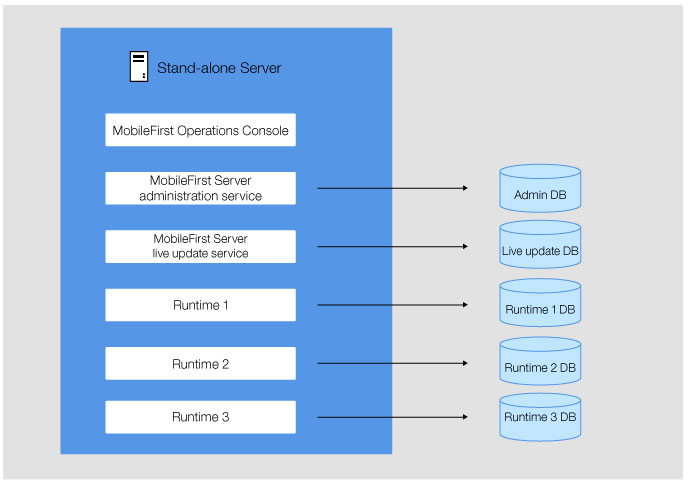
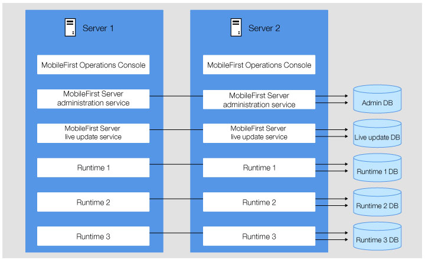

<!-- NLS_CHARSET=UTF-8 -->
## Présentation
{: #overview }
Les informations présentées ci-après décrivent les topologies de serveur possibles pour les composants {{ site.data.keys.mf_server }}, ainsi que les flots réseau disponibles.  
Les composants sont déployés en fonction de la topologie de serveur que vous utilisez. Les flots réseau vous expliquent comment les composants communiquent entre eux et avec les appareils des utilisateurs finaux.

#### Aller à
{: #jump-to }

* [Flots réseau entre les composants {{ site.data.keys.mf_server }}](#network-flows-between-the-mobilefirst-server-components)
* [Contraintes sur les composants {{ site.data.keys.mf_server }} et {{ site.data.keys.mf_analytics }}](#constraints-on-the-mobilefirst-server-components-and-mobilefirst-analytics)
* [Plusieurs environnements d'exécution de {{ site.data.keys.product }}](#multiple-mobilefirst-foundation-runtimes)
* [Plusieurs instances de {{ site.data.keys.mf_server }} sur le même serveur ou la même cellule WebSphere Application Server](#multiple-instances-of-mobilefirst-server-on-the-same-server-or-websphere-application-server-cell)

## Flots réseau entre les composants {{ site.data.keys.mf_server }}
{: #network-flows-between-the-mobilefirst-server-components }
Les composants {{ site.data.keys.mf_server }} peuvent communiquer entre eux via JMX ou HTTP. Vous devez configurer certaines propriétés JNDI pour activer les communications.  
L'image suivante représente les flots réseau entre les composants et l'appareil :

Les flots entre les différents composants {{ site.data.keys.mf_server }}, {{ site.data.keys.mf_analytics }}, les appareils mobiles et le serveur d'applications sont décrits dans les sections suivantes :

1. [Communication entre l'environnement d'exécution de {{ site.data.keys.product }} et le service d'administration de {{ site.data.keys.mf_server }}](#mobilefirst-foundation-runtime-to-mobilefirst-server-administration-service)
2. [Communication entre le service d'administration de {{ site.data.keys.mf_server }} et l'environnement d'exécution de {{ site.data.keys.product }} dans d'autres serveurs](#mobilefirst-server-administration-service-to-mobilefirst-foundation-runtime-in-other-servers)
3. [Communication entre le service d'administration de {{ site.data.keys.mf_server }} et l'environnement d'exécution de {{ site.data.keys.product_adj }} et le gestionnaire de déploiement sur WebSphere Application Server Network Deployment](#mobilefirst-server-administration-service-and-mobilefirst-runtime-to-the-deployment-manager-on-websphere-application-server-network-deployment)
4. [Communication entre le service push de {{ site.data.keys.mf_server }} et l'environnement d'exécution de {{ site.data.keys.product }} et {{ site.data.keys.mf_analytics }}](#mobilefirst-server-push-service-and-mobilefirst-foundation-runtime-to-mobilefirst-analytics)
5. [Communication entre le service d'administration de {{ site.data.keys.mf_server }} et le service Live Update de {{ site.data.keys.mf_server }}](#mobilefirst-server-administration-service-to-mobilefirst-server-live-update-service)
6. [Communication entre {{ site.data.keys.mf_console }} et le service d'administration de {{ site.data.keys.mf_server }}](#mobilefirst-operations-console-to-mobilefirst-server-administration-service)
7. [Communication entre le service d'administration de {{ site.data.keys.mf_server }} et le service push de {{ site.data.keys.mf_server }} et le serveur d'autorisations](#mobilefirst-server-administration-service-to-mobilefirst-server-push-service-and-to-the-authorization-server)
8. [Communication entre le service push de {{ site.data.keys.mf_server }} et un service de notification push externe (sortant)](#mobilefirst-server-push-service-to-an-external-push-notification-service-outbound)
9. [Communication entre les appareils mobiles et l'environnement d'exécution de {{ site.data.keys.product }}](#mobile-devices-to-mobilefirst-foundation-runtime)

### Communication entre l'environnement d'exécution de {{ site.data.keys.product }} et le service d'administration de {{ site.data.keys.mf_server }}
{: #mobilefirst-foundation-runtime-to-mobilefirst-server-administration-service }
L'environnement d'exécution et le service d'administration peuvent communiquer entre eux via JMX et HTTP. Cette communication est établie lors de la phase d'initialisation de l'environnement d'exécution. L'environnement d'exécution contacte le service d'administration installé en local sur son serveur d'applications pour obtenir la liste des adaptateurs et des applications qu'il doit prendre en charge. La communication est également établie lorsque certaines opérations d'administration sont exécutées à partir de {{ site.data.keys.mf_console }} ou du service d'administration. Sur WebSphere Application Server Network Deployment, l'environnement d'exécution peut contacter un service d'administration qui est installé sur un autre serveur de la cellule. Cela permet le déploiement non symétrique (voir [Contraintes sur le service d'administration de {{ site.data.keys.mf_server }}, le service Live Update de {{ site.data.keys.mf_server }} et l'environnement d'exécution de {{ site.data.keys.product }}](#constraints-on-mobilefirst-server-administration-service-mobilefirst-server-live-update-service-and-mobilefirst-foundation-runtime)). Toutefois, sur tous les autres serveurs d'applications (Apache Tomcat, WebSphere Application Server Liberty ou WebSphere Application Server autonome), le service d'administration doit être en cours d'exécution sur le même serveur que l'environnement d'exécution.

Les protocoles pour JMX dépendent du serveur d'applications :

* Apache Tomcat - RMI
* WebSphere Application Server Liberty - HTTPS (avec le connecteur REST)
* WebSphere Application Server - SOAP ou RMI

Pour la communication via JMX, ces protocoles doivent être disponibles sur le serveur d'applications. Pour
plus d'informations sur les exigences, voir
[Prérequis pour le serveur d'applications](../appserver/#application-server-prerequisites).

Les beans JMX de l'environnement d'exécution et du service d'administration sont obtenus auprès du serveur d'applications. Toutefois, avec WebSphere Application Server Network Deployment, les beans JMX sont obtenus auprès du gestionnaire de déploiement. Le gestionnaire de déploiement possède la vue de tous les beans d'une cellule sur WebSphere Application Server Network Deployment. Par conséquent, certaines configurations ne sont pas requises sur WebSphere Application Server Network Deployment (par exemple, la configuration en parc de serveurs) et un déploiement non symétrique est possible sur WebSphere Application Server Network Deployment. Pour plus d'informations, voir [Contraintes sur le service d'administration de {{ site.data.keys.mf_server }}, le service Live Update de {{ site.data.keys.mf_server }} et l'environnement d'exécution de {{ site.data.keys.product }}](#constraints-on-mobilefirst-server-administration-service-mobilefirst-server-live-update-service-and-mobilefirst-foundation-runtime).

Pour distinguer une autre installation de {{ site.data.keys.mf_server }} sur le même serveur d'applications ou sur la même cellule WebSphere Application Server, vous pouvez utiliser un ID d'environnement, qui est une variable JNDI. Par défaut, cette variable comporte une valeur vide. Un environnement d'exécution portant un ID d'environnement donné communique uniquement avec un service d'administration doté du même ID d'environnement. Par exemple, si le service d'administration possède un ID d'environnement X et l'environnement d'exécution possède un ID d'environnement différent (par exemple, Y), les deux composants ne se voient pas. Aucun environnement d'exécution disponible n'apparaît dans {{ site.data.keys.mf_console }}.

Un service d'administration doit pouvoir communiquer avec tous les composants d'environnement d'exécution de {{ site.data.keys.product }} d'un cluster. Lorsqu'une opération d'administration est exécutée, comme le téléchargement d'une nouvelle version d'un adaptateur ou le changement du statut actif d'une application, tous les composants d'environnement d'exécution du cluster doivent être prévenus de la modification. Si le serveur d'applications n'est pas WebSphere Application Server Network Deployment, cette communication ne peut être établie que si un parc de serveurs est configuré. Pour plus d'informations, voir [Contraintes sur le service d'administration de {{ site.data.keys.mf_server }}, le service Live Update de {{ site.data.keys.mf_server }} et l'environnement d'exécution de {{ site.data.keys.product }}](#constraints-on-mobilefirst-server-administration-service-mobilefirst-server-live-update-service-and-mobilefirst-foundation-runtime).

L'environnement d'exécution communique également avec le service d'administration via HTTP ou HTTPS pour télécharger des artefacts volumineux, tels que des adaptateurs. Une URL est générée par le service d'administration et l'environnement d'exécution ouvre une connexion HTTP ou HTTPS sortante pour demander un artefact à partir de cette URL. Il est possible de remplacer la génération d'URL par défaut en définissant les propriétés JNDI (mfp.admin.proxy.port, mfp.admin.proxy.protocol et mfp.admin.proxy.host) dans le service d'administration. Le service d'administration aura peut-être également besoin de communiquer avec l'environnement d'exécution via HTTP ou HTTPS pour obtenir les jetons OAuth utilisés pour exécuter les opérations push. Pour plus d'informations, voir [Communication entre le service d'administration de {{ site.data.keys.mf_server }} et le service push de {{ site.data.keys.mf_server }} et le serveur d'autorisations](#mobilefirst-server-administration-service-to-mobilefirst-server-push-service-and-to-the-authorization-server).

Les propriétés JNDI utilisées pour la communication entre l'environnement d'exécution et le service d'administration sont les suivantes :

#### Le service d'administration de {{ site.data.keys.mf_server }}
{: #mobilefirst-server-administration-service }

* [Propriétés JNDI pour les services d'administration : JMX](../../server-configuration/#jndi-properties-for-administration-service-jmx)
* [Propriétés JNDI pour les services d'administration : proxys](../../server-configuration/#jndi-properties-for-administration-service-proxies)
* [Propriétés JNDI pour les services d'administration : topologies](../../server-configuration/#jndi-properties-for-administration-service-topologies)

#### L'environnement d'exécution de {{ site.data.keys.product }}
{: #mobilefirst-foundation-runtime }

* [Liste des propriétés JNDI pour l'environnement d'exécution de {{ site.data.keys.product_adj }}](../../server-configuration/#list-of-jndi-properties-for-mobilefirst-runtime)

### Communication entre le service d'administration de {{ site.data.keys.mf_server }} et l'environnement d'exécution de {{ site.data.keys.product }} dans d'autres serveurs
{: #mobilefirst-server-administration-service-to-mobilefirst-foundation-runtime-in-other-servers }
Comme indiqué dans la rubrique intitulée [Communication entre l'environnement d'exécution de {{ site.data.keys.product }} et le service d'administration de {{ site.data.keys.mf_server }} ](#mobilefirst-foundation-runtime-to-mobilefirst-server-administration-service), une communication est requise entre un service d'administration et tous les composants d'environnement d'exécution d'un cluster. Lorsqu'une opération d'administration est exécutée, tous les composants d'environnement d'exécution d'un cluster peuvent alors être avertis de cette modification. La communication est établie via JMX.

Sur WebSphere Application Server Network Deployment, cette communication peut être établie sans aucune configuration spécifique. Tous les beans gérés JMX correspondant au même ID d'environnement sont obtenus auprès du gestionnaire de déploiement.

Pour un cluster de WebSphere Application Server autonome, de profil Liberty de WebSphere Application Server ou d'Apache Tomcat, la communication ne peut être établie que si un parc de serveurs est configuré. Pour plus d'informations, voir [Installation d'un parc de serveurs](../appserver/#installing-a-server-farm).

### Communication entre le service d'administration de {{ site.data.keys.mf_server }} et l'environnement d'exécution de MobileFirst et le gestionnaire de déploiement sur WebSphere Application Server Network Deployment
{: #mobilefirst-server-administration-service-and-mobilefirst-runtime-to-the-deployment-manager-on-websphere-application-server-network-deployment }
Sur WebSphere Application Server Network Deployment, l'environnement d'exécution et le service d'administration obtiennent les beans gérés JMX qui sont utilisés pour la [communication entre l'environnement d'exécution de {{ site.data.keys.product }} et le service d'administration de {{ site.data.keys.mf_server }}](#mobilefirst-foundation-runtime-to-mobilefirst-server-administration-service) et pour la [communication entre le service d'administration de {{ site.data.keys.mf_server }} et l'environnement d'exécution de {{ site.data.keys.product }} dans d'autres serveurs](#mobilefirst-server-administration-service-to-mobilefirst-foundation-runtime-in-other-servers) avec le gestionnaire de déploiement. Les propriétés JNDI correspondantes sont **mfp.admin.jmx.dmgr.*** décrites dans [Propriétés JNDI pour les services d'administration : JMX](../../server-configuration/#jndi-properties-for-administration-service-jmx).

Le gestionnaire de déploiement doit être actif pour que les opérations nécessitant une communication JMX entre l'environnement d'exécution et le service d'administration puissent être exécutées. Ces opérations peuvent être l'initialisation de l'environnement d'exécution ou la notification d'une modification effectuée via le service d'administration.

### Communication entre le service push de {{ site.data.keys.mf_server }} et l'environnement d'exécution de {{ site.data.keys.product }} et {{ site.data.keys.mf_analytics }}
{: #mobilefirst-server-push-service-and-mobilefirst-foundation-runtime-to-mobilefirst-analytics }
L'environnement d'exécution envoie des données à {{ site.data.keys.mf_analytics }} via HTTP ou HTTPS. Les propriétés JNDI de l'environnement d'exécution utilisées pour définir cette communication sont les suivantes :

* **mfp.analytics.url** - URL qui est exposée par le service {{ site.data.keys.mf_analytics }} pour recevoir les données d'analyse entrantes de l'environnement d'exécution. Exemple : `http://<hostname>:<port>/analytics-service/rest`

    Lorsque le service {{ site.data.keys.mf_analytics }} est installé en tant que cluster, les données peuvent être envoyées à n'importe quel membre du cluster.

* **mfp.analytics.username** - Nom d'utilisateur permettant d'accéder au service {{ site.data.keys.mf_analytics }}. Le service Analytics est protégé au moyen d'un rôle de sécurité.
* **mfp.analytics.password** - Mot de passe permettant d'accéder au service Analytics.
* **mfp.analytics.console.url** - URL transmise à {{ site.data.keys.mf_console }} pour afficher un lien vers {{ site.data.keys.mf_analytics_console }}. Exemple : `http://<hostname>:<port>/analytics/console`

    Les propriétés JNDI du service push utilisées pour définir cette communication sont les suivantes :
* **mfp.push.analytics.endpoint** - URL qui est exposée par le service {{ site.data.keys.mf_analytics }} pour recevoir les données d'analyse entrantes du service push. Exemple : `http://<hostname>:<port>/analytics-service/rest`

    Lorsque le service {{ site.data.keys.mf_analytics }} est installé en tant que cluster, les données peuvent être envoyées à n'importe quel membre du cluster.    
* **mfp.push.analytics.username** - Nom d'utilisateur permettant d'accéder au service {{ site.data.keys.mf_analytics }}. Le service Analytics est protégé au moyen d'un rôle de sécurité.
* **mfp.push.analytics.password** - Mot de passe permettant d'accéder au service Analytics.

### Communication entre le service d'administration de {{ site.data.keys.mf_server }} et le service Live Update de {{ site.data.keys.mf_server }}
{: #mobilefirst-server-administration-service-to-mobilefirst-server-live-update-service }
Le service d'administration communique avec le service Live Update pour stocker et extraire des informations de configuration relatives aux artefacts de {{ site.data.keys.product }}. La communication est établie via HTTP ou HTTPS.

L'URL permettant de contacter le service Live Update est générée automatiquement par le service d'administration. Les deux services doivent figurer sur le même serveur d'applications. La racine de contexte du service Live Update doit être définie comme suit : `<adminContextRoot>config`. Par exemple, si la racine de contexte du service d'administration est **mfpadmin**, la racine de contexte du service Live Update doit être **mfpadminconfig**. Il est possible de remplacer la génération d'URL par défaut en définissant les propriétés JNDI (**mfp.admin.proxy.port**, **mfp.admin.proxy.protocol** et **mfp.admin.proxy.host**) dans le service d'administration.

Les propriétés JNDI permettant de configurer cette communication entre les deux services sont les suivantes :

* **mfp.config.service.user**
* **mfp.config.service.password**
* Propriétés décrites dans [Propriétés JNDI pour les services d'administration : proxys](../../server-configuration/#jndi-properties-for-administration-service-proxies).

### Communication entre {{ site.data.keys.mf_console }} et le service d'administration de {{ site.data.keys.mf_server }}
{: #mobilefirst-operations-console-to-mobilefirst-server-administration-service }
{{ site.data.keys.mf_console }} est une interface utilisateur Web qui agit en tant que serveur frontal avec le service d'administration. Cette console communique avec les services REST du service d'administration via HTTP ou HTTPS. Les utilisateurs autorisés à utiliser la console doivent également être autorisés à utiliser le service d'administration. Chaque utilisateur mappé à un rôle de sécurité spécifique de la console doit également être mappé au même rôle de sécurité du service d'administration. Avec cette configuration, les demandes provenant de la console peuvent alors être acceptées par le service.

Les propriétés JNDI permettant de configurer cette communication entre les deux services sont décrites dans [Propriétés JNDI pour {{ site.data.keys.mf_console }}](../../server-configuration/#jndi-properties-for-mobilefirst-operations-console).

> Remarque : La propriété **mfp.admin.endpoint** permet à la console de localiser le service d'administration. Vous pouvez utiliser l'astérisque "\*" comme caractère générique pour indiquer que l'URL, générée par la console pour contacter les services d'administration, utilise la même valeur que la demande HTTP entrante sur la console. Par exemple, `*://*:*/mfpadmin` indique que le protocole, l'hôte et le port de la console doivent être utilisés, mais que **mfpadmin** doit être utilisé comme racine de contexte. Cette propriété est spécifiée pour l'application de console.

### Communication entre le service d'administration de {{ site.data.keys.mf_server }} et le service push de {{ site.data.keys.mf_server }} et le serveur d'autorisations
{: #mobilefirst-server-administration-service-to-mobilefirst-server-push-service-and-to-the-authorization-server }
Le service d'administration communique avec le service push pour demander diverses opérations push. Cette communication est sécurisée via le protocole OAuth. Les deux services doivent être enregistrés en tant que clients confidentiels. Un enregistrement initial peut être effectué lors de l'installation. Au cours de ce processus, les deux services doivent contacter un serveur d'autorisations. Ce serveur d'autorisations peut être l'environnement d'exécution de {{ site.data.keys.product }}.

Les propriétés JNDI du service administration utilisées pour définir cette communication sont les suivantes :

* **mfp.admin.push.url** - URL du service push.
* **mfp.admin.authorization.server.url** - URL du serveur d'autorisations de {{ site.data.keys.product }}.
* **mfp.admin.authorization.client.id** - ID de client du service d'administration, par exemple, un client confidentiel OAuth.
* **mfp.admin.authorization.client.secret** - Code secret utilisé pour obtenir les jetons basés sur OAuth.

> Remarque : Les propriétés **mfp.push.authorization.client.id** et **mfp.push.authorization.client.secret** du service d'administration peuvent être utilisées pour enregistrer le service push automatiquement en tant que client confidentiel lorsque le service d'administration démarre. Le service push doit être configuré avec les mêmes valeurs.

Les propriétés JNDI du service push utilisées pour configurer cette communication sont les suivantes :

* **mfp.push.authorization.server.url** - URL du serveur d'autorisations de {{ site.data.keys.product }}. Identique à la propriété **mfp.admin.authorization.server.url**.
* **mfp.push.authorization.client.id** - ID de client du service push utilisé pour contacter le serveur d'autorisations.
* **mfp.push.authorization.client.secret** - Code secret utilisé pour contacter le serveur d'autorisations.

### Communication entre le service push de {{ site.data.keys.mf_server }} et un service de notification push externe (sortant)
{: #mobilefirst-server-push-service-to-an-external-push-notification-service-outbound }
Le service push génère un trafic sortant avec le service de notification externe, tel que APNS (Apple Push Notification Service) ou GCM (Google Cloud Messaging). Cette communication peut également être établie via un proxy. Selon le service de notification, les propriétés JNDI suivantes doivent être définies :

* **push.apns.proxy**
* **push.gcm.proxy**

Pour plus d'informations, voir [Liste des propriétés JNDI pour le service push de {{ site.data.keys.mf_server }}](../../server-configuration/#list-of-jndi-properties-for-mobilefirst-server-push-service).

### Communication entre les appareils mobiles et l'environnement d'exécution de {{ site.data.keys.product }}
{: #mobile-devices-to-mobilefirst-foundation-runtime }
Les appareils mobiles contactent l'environnement d'exécution. La sécurité de cette communication est déterminée par la configuration de l'application et des adaptateurs qui sont demandés. Pour plus d'informations, voir [Infrastructure de sécurité de {{ site.data.keys.product_adj }}](../../../../authentication-and-security).

## Contraintes sur les composants {{ site.data.keys.mf_server }} et {{ site.data.keys.mf_analytics }}
{: #constraints-on-the-mobilefirst-server-components-and-mobilefirst-analytics }
Vous devez comprendre les contraintes sur les divers composants {{ site.data.keys.mf_server }} et sur {{ site.data.keys.mf_analytics }} avant de choisir votre topologie de serveur.

* [Contraintes sur le service d'administration de {{ site.data.keys.mf_server }}, le service Live Update de {{ site.data.keys.mf_server }} et l'environnement d'exécution de {{ site.data.keys.product }} ](#constraints-on-mobilefirst-server-administration-service-mobilefirst-server-live-update-service-and-mobilefirst-foundation-runtime)
* [Contraintes sur le service push de {{ site.data.keys.mf_server }}](#constraints-on-mobilefirst-server-push-service)

### Contraintes sur le service d'administration de {{ site.data.keys.mf_server }}, le service Live Update de {{ site.data.keys.mf_server }} et l'environnement d'exécution de {{ site.data.keys.product }}
{: #constraints-on-mobilefirst-server-administration-service-mobilefirst-server-live-update-service-and-mobilefirst-foundation-runtime }
Découvrez les contraintes et le mode de déploiement du service d'administration, du service Live Update et de l'environnement d'exécution par topologie de serveur.

Le service Live Update doit toujours être installé avec le service d'administration sur le même serveur d'applications, comme indiqué dans[Communication entre le service d'administration de {{ site.data.keys.mf_server }} et le service Live Update de {{ site.data.keys.mf_server }}](#mobilefirst-server-administration-service-to-mobilefirst-server-live-update-service). La racine de contexte du service Live Update doit être définie comme suit : `/<adminContextRoot>config`. Par exemple, si la racine de contexte du service d'administration est **/mfpadmin**, la racine de contexte du service Live Update doit être **/mfpadminconfig**.

Vous pouvez utiliser les topologies de serveurs d'applications suivantes :

* Serveur autonome : profil de WebSphere Application Server Liberty, Apache Tomcat ou profil complet de WebSphere Application Server
* Parc de serveurs : profil Liberty de WebSphere Application Server Liberty, Apache Tomcat ou profil complet de WebSphere Application Server
* Cellule WebSphere Application Server Network Deployment
* Collectivité Liberty

#### Modes de déploiement
{: #modes-of-deployment }
Selon la topologie de serveur d'applications que vous utilisez, vous avez le choix entre deux modes de déploiement pour déployer le service d'administration, le service Live Update et l'environnement d'exécution dans l'infrastructure de serveur d'applications. Dans le cadre d'un déploiement asymétrique, vous pouvez installer les environnements d'exécution sur différents serveurs d'applications à partir des services d'administration et Live Update.

**Déploiement symétrique**  
Dans le cadre d'un déploiement symétrique, vous devez installer les composants d'administration de {{ site.data.keys.product }} ({{ site.data.keys.mf_console }}, le service d'administration et le service Live Update), ainsi que l'environnement d'exécution sur le même serveur d'applications.

**Déploiement asymétrique**  
Dans le cadre d'un déploiement asymétrique, vous pouvez installer les environnements d'exécution sur différents serveurs d'applications à partir des composants d'administration de {{ site.data.keys.product }}.  
Le déploiement asymétrique est pris en charge uniquement pour la topologie de cellule WebSphere Application Server Network Deployment et la topologie de collectivité Liberty.

#### Sélection d'une topologie
{: #select-a-topology }

* [Topologie de serveur autonome](#stand-alone-server-topology)
* [Topologie de parc de serveurs](#server-farm-topology)
* [Topologie de collectivité Liberty](#liberty-collective-topology)
* [Topologies WebSphere Application Server Network Deployment](#websphere-application-server-network-deployment-topologies)
* [Utilisation d'un proxy inverse avec des topologies de parc de serveurs et WebSphere Application Server Network Deployment](#using-a-reverse-proxy-with-server-farm-and-websphere-application-server-network-deployment-topologies)

### Topologie de serveur autonome
{: #stand-alone-server-topology }
Vous pouvez configurer une topologie autonome pour le profil complet de WebSphere Application Server, le profil Liberty de WebSphere Application Server et Apache Tomcat.
Dans cette topologie, tous les composants d'administration et environnements d'exécution sont déployés dans une seule machine virtuelle Java.

Avec une machine virtuelle Java, seul le déploiement symétrique est possible, avec les caractéristiques suivantes :

* Un ou plusieurs composants d'administration peuvent être déployés. Chaque application {{ site.data.keys.mf_console }} communique avec un service d'administration et un service Live Update.
* Un ou plusieurs environnements d'exécution peuvent être déployés.
* Une application {{ site.data.keys.mf_console }} peut gérer plusieurs environnements d'exécution.
* Un environnement d'exécution est géré par une seule application {{ site.data.keys.mf_console }}.
* Chaque service d'administration utilise son propre schéma de base de données d'administration.
* Chaque service Live Update utilise son propre schéma de base de données Live Update.
* Chaque environnement d'exécution utilise son propre schéma de base de données d'environnement d'exécution.

#### Configuration des propriétés JNDI
{: #configuration-of-jndi-properties }
Certaines propriétés JNDI sont requises pour activer la communication JMX (Java Management Extensions) entre le service d'administration et l'environnement d'exécution et pour définir le service d'administration qui gère un environnement d'exécution. Pour plus d'informations sur ces propriétés, voir[Liste des propriétés JNDI pour le service d'administration de {{ site.data.keys.mf_server }}](../../server-configuration/#list-of-jndi-properties-for-mobilefirst-server-administration-service) et [Liste des propriétés JNDI pour l'environnement d'exécution de {{ site.data.keys.product_adj }}](../../server-configuration/#list-of-jndi-properties-for-mobilefirst-runtime).

**Serveur de profil Liberty de WebSphere Application Server autonome**  
Les propriétés JNDI globales suivantes sont requises pour les services d'administration et les environnements d'exécution :

| Propriétés JNDI          | Valeurs |
|--------------------------|--------|
| mfp.topology.platform	   | Liberty |
| mfp.topology.clustermode | Autonome |
| mfp.admin.jmx.host       | Nom d'hôte du serveur de profil Liberty de WebSphere Application Server. |
| mfp.admin.jmx.port       | Port du connecteur REST, identique au port de l'attribut httpsPort déclaré dans l'élément `<httpEndpoint>` du fichier server.xml du serveur de profil Liberty de WebSphere Application Server. Aucune valeur par défaut n'est définie pour cette propriété. |
| mfp.admin.jmx.user       | Nom d'utilisateur de l'administrateur Liberty de WebSphere Application Server, qui doit être identique au nom défini dans l'élément `<administrator-role>` du fichier server.xml du serveur de profil de WebSphere Application Server. |
| mfp.admin.jmx.pwd        | Mot de passe de l'utilisateur administrateur Liberty de WebSphere Application Server. |

Plusieurs composants d'administration peuvent être déployés pour permettre à la même machine virtuelle Java de s'exécuter sur des composants d'administration distincts qui gèrent différents environnements d'exécution.

Lorsque vous déployez plusieurs composants d'administration, vous devez spécifier :

* Sur chaque service d'administration, une valeur unique pour la propriété JNDI **mfp.admin.environmentid** locale.
* Sur chaque environnement d'exécution, la même valeur pour la propriété JNDI **mfp.admin.environmentid** locale que celle définie pour le service d'administration qui gère l'environnement d'exécution.

**Serveur Apache Tomcat autonome**
Les propriétés JNDI locales suivantes sont requises pour les services d'administration et les environnements d'exécution :

| Propriétés JNDI        |	Valeurs    |
|------------------------|------------|
| mfp.topology.platform   | Tomcat     |
| mfp.topology.clustermode | Autonome |

Les propriétés JVM sont également requises pour définir l'invocation RMI JMX (Java Management Extensions). Pour plus d'informations, voir [Configuration de la connexion JMX pour Apache Tomcat](../appserver/#apache-tomcat-prerequisites).

Si le serveur Apache Tomcat s'exécute derrière un pare-feu, les propriétés JNDI **mfp.admin.rmi.registryPort** et **mfp.admin.rmi.serverPort** sont requises pour le service d'administration. Voir [Configuration de la connexion JMX pour Apache Tomcat](../appserver/#apache-tomcat-prerequisites).

Plusieurs composants d'administration peuvent être déployés pour permettre à la même machine virtuelle Java de s'exécuter sur des composants d'administration distincts qui gèrent différents environnements d'exécution.  
Lorsque vous déployez plusieurs composants d'administration, vous devez spécifier :

* Sur chaque service d'administration, une valeur unique pour la propriété JNDI mfp.admin.environmentid locale.
* Sur chaque environnement d'exécution, la même valeur pour la propriété JNDI mfp.admin.environmentid locale que celle définie pour le service d'administration qui gère l'environnement d'exécution.

**WebSphere Application Server autonome**  
Les propriétés JNDI locales suivantes sont requises pour les services d'administration et les environnements d'exécution :

| Propriétés JNDI          | Valeurs                 |
|--------------------------| -----------------------|
| mfp.topology.platform    | WAS                    |
| mfp.topology.clustermode | Autonome             |
| mfp.admin.jmx.connector  | Type de connecteur JMX ; la valeur peut être SOAP ou RMI. |

Plusieurs composants d'administration peuvent être déployés pour permettre à la même machine virtuelle Java de s'exécuter sur des composants d'administration distincts qui gèrent différents environnements d'exécution.  
Lorsque vous déployez plusieurs composants d'administration, vous devez spécifier :

* Sur chaque service d'administration, une valeur unique pour la propriété JNDI **mfp.admin.environmentid** locale.
* Sur chaque environnement d'exécution, la même valeur pour la propriété JNDI **mfp.admin.environmentid** locale que celle définie pour le service d'administration qui gère l'environnement d'exécution.

### Topologie de parc de serveurs
{: #server-farm-topology }
Vous pouvez configurer un parc de serveurs d'applications pour le profil complet de WebSphere Application Server, le profil Liberty de WebSphere Application Server et Apache Tomcat.

Un parc de serveurs est un ensemble de serveurs individuels sur lesquels les mêmes composants sont déployés et les mêmes bases de données de service d'administration et d'environnement d'exécution sont partagées entre les serveurs. La topologie de parc de serveurs permet la répartition de la charge des applications {{ site.data.keys.product }} sur plusieurs serveurs. Chaque serveur du parc doit être une machine virtuelle Java du même type de serveur d'applications, autrement dit, il doit s'agir d'un parc de serveurs homogène. Par exemple, un ensemble de serveurs Liberty peut être configuré en tant que parc de serveurs. En revanche, un ensemble mixte constitué d'un serveur Liberty, d'un serveur Tomcat ou d'un serveur WebSphere Application Server autonome ne peut pas être configuré en tant que parc de serveurs.

Dans cette topologie, tous les composants d'administration ({{ site.data.keys.mf_console }}, le service d'administration et le service Live Update), ainsi que les environnements d'exécution sont déployés sur chaque serveur du parc.

Cette topologie ne prend en charge que le déploiement symétrique. Les environnements d'exécution et les composants d'administration doivent être déployés sur chaque serveur du parc de serveurs. Le déploiement de cette topologie possède les caractéristiques suivantes :

* Un ou plusieurs composants d'administration peuvent être déployés. Chaque instance de {{ site.data.keys.mf_console }} communique avec un service d'administration et un service Live Update.
* Les composants d'administration doivent être déployés sur tous les serveurs du parc de serveurs.
* Un ou plusieurs environnements d'exécution peuvent être déployés.
* Les environnements d'exécution doivent être déployés sur tous les serveurs du parc de serveurs.
* Une application {{ site.data.keys.mf_console }} peut gérer plusieurs environnements d'exécution.
* Un environnement d'exécution est géré par une seule application {{ site.data.keys.mf_console }}.
* Chaque service d'administration utilise son propre schéma de base de données d'administration. Toutes les instances déployées du même service d'administration partagent le même schéma de base de données d'administration.
* Chaque service Live Update utilise son propre schéma de base de données Live Update. Toutes les instances déployées du même service Live Update partagent le même schéma de base de données Live Update.
* Chaque environnement d'exécution utilise son propre schéma de base de données d'environnement d'exécution. Toutes les instances déployées du même environnement d'exécution partagent le même schéma de base de données d'environnement d'exécution.

#### Configuration des propriétés JNDI
{: #configuration-of-jndi-properties-1 }
Certaines propriétés JNDI sont requises pour activer la communication JMX entre le service d'administration et l'environnement d'exécution du même serveur et pour définir le service d'administration qui gère un environnement d'exécution. Ces propriétés sont répertoriées dans les tableaux présentés ci-après. Pour savoir comment installer un parc de serveurs, voir [Installation d'un parc de serveurs](../appserver/#installing-a-server-farm). Pour plus d'informations sur les propriétés JNDI, voir [List of JNDI properties for {{ site.data.keys.mf_server }} administration service](../../server-configuration/#list-of-jndi-properties-for-mobilefirst-server-administration-service) and [Liste des propriétés JNDI pour l'environnement d'exécution de {{ site.data.keys.product_adj }}](../../server-configuration/#list-of-jndi-properties-for-mobilefirst-runtime).

**Parc de serveurs de profil Liberty de WebSphere Application Server**  
Les propriétés JNDI globales suivantes sont requises dans chaque serveur du parc de serveurs pour les services d'administration et les environnements d'exécution :

<table>
    <tr>
        <th>
            Propriétés JNDI
        </th>
        <th>
            Valeurs
        </th>
    </tr>
    <tr>
        <td>
            mfp.topology.platform
        </td>
        <td>
            Liberty
        </td>
    </tr>
    <tr>
        <td>
            mfp.topology.clustermode
        </td>
        <td>
            Parc de serveurs
        </td>
    </tr>
    <tr>
        <td>
            mfp.admin.jmx.host
        </td>
        <td>
            Nom d'hôte du serveur de profil Liberty de WebSphere Application Server
        </td>
    </tr>
    <tr>
        <td>
            mfp.admin.jmx.port
        </td>
        <td>
            Port du connecteur REST, qui doit être identique à la valeur de l'attribut httpsPort déclaré dans l'élément <code>httpEndpoint</code> du fichier <b>server.xml</b> du serveur de profil Liberty de WebSphere Application Server.


<httpEndpoint id="defaultHttpEndpoint" httpPort="9080" httpsPort="9443" host="*" />

        </td>
    </tr>
    <tr>
        <td>
            mfp.admin.jmx.user
        </td>
        <td>
            Nom d'utilisateur de l'administrateur Liberty de WebSphere Application Server qui est défini dans l'élément <code>administrator-role</code> du fichier <b>server.xml</b> du serveur de profil Liberty de WebSphere Application Server.


<administrator-role>
    <user>MfpRESTUser</user>
</administrator-role>
        
        </td>
    </tr>
    <tr>
        <td>
            mfp.admin.jmx.pwd
        </td>
        <td>
            Mot de passe de l'utilisateur administrateur Liberty de WebSphere Application Server.
        </td>
    </tr>
</table>

La propriété JNDI **mfp.admin.serverid** est requise pour permettre au service d'administration de gérer la configuration du parc de serveurs. Sa valeur correspond à l'identificateur de serveur et doit être différente pour chaque serveur du parc.

Plusieurs composants d'administration peuvent être déployés pour permettre à la même machine virtuelle Java de s'exécuter sur des composants d'administration distincts qui gèrent différents environnements d'exécution.

Lorsque vous déployez plusieurs composants d'administration, vous devez spécifier :

* Sur chaque service d'administration, une valeur unique pour la propriété JNDI mfp.admin.environmentid locale.
* Sur chaque environnement d'exécution, la même valeur pour la propriété JNDI **mfp.admin.environmentid** locale que celle définie pour le service d'administration qui gère l'environnement d'exécution.

**Parc de serveurs Apache Tomcat**  
Les propriétés JNDI globales suivantes sont requises dans chaque serveur du parc de serveurs pour les services d'administration et les environnements d'exécution :

| Propriétés JNDI          |	Valeurs |
|--------------------------|-----------|
| mfp.topology.platform	   | Tomcat    |
| mfp.topology.clustermode | Parc de serveurs      |

Les propriétés JVM sont également requises pour définir l'invocation RMI JMX (Java Management Extensions). Pour plus d'informations, voir [Configuration de la connexion JMX pour Apache Tomcat](../appserver/#apache-tomcat-prerequisites).

La propriété JNDI **mfp.admin.serverid** est requise pour permettre au service d'administration de gérer la configuration du parc de serveurs. Sa valeur correspond à l'identificateur de serveur et doit être différente pour chaque serveur du parc.

Plusieurs composants d'administration peuvent être déployés pour permettre à la même machine virtuelle Java de s'exécuter sur des composants d'administration distincts qui gèrent différents environnements d'exécution.

Lorsque vous déployez plusieurs composants d'administration, vous devez spécifier :

* Sur chaque service d'administration, une valeur unique pour la propriété JNDI mfp.admin.environmentid locale.
* Sur chaque environnement d'exécution, la même valeur pour la propriété JNDI **mfp.admin.environmentid** locale que celle définie pour le service d'administration qui gère l'environnement d'exécution.

**Parc de serveurs de profil complet de WebSphere Application Server**  
Les propriétés JNDI globales suivantes sont requises sur chaque serveur du parc de serveurs pour les services d'administration et les environnements d'exécution :

| Propriétés JNDI            | Valeurs |
|----------------------------|--------|
| mfp.topology.platform	WAS  | WAS    |
| mfp.topology.clustermode   | Parc de serveurs   |
| mfp.admin.jmx.connector    | SOAP   |

Les propriétés JNDI suivantes sont requises pour permettre au service d'administration de gérer la configuration du parc de serveurs.

| Propriétés JNDI    | Valeurs |
|--------------------|--------|
| mfp.admin.jmx.user | Nom d'utilisateur de WebSphere Application Server. Cet utilisateur doit être défini dans le registre d'utilisateurs de WebSphere Application Server. |
| mfp.admin.jmx.pwd	 | Mot de passe de l'utilisateur de WebSphere Application Server. |
| mfp.admin.serverid | Identificateur de serveur, qui doit être différent pour chaque serveur du parc de serveurs et identique à la valeur de cette propriété utilisée pour ce serveur dans le fichier de configuration du parc de serveurs. |

Plusieurs composants d'administration peuvent être déployés pour permettre à la même machine virtuelle Java de s'exécuter sur des composants d'administration distincts qui gèrent différents environnements d'exécution.

Lorsque vous déployez plusieurs composants d'administration, vous devez spécifier les valeurs suivantes :

* Sur chaque service d'administration, une valeur unique pour la propriété JNDI **mfp.admin.environmentid** locale.
* Sur chaque environnement d'exécution, la même valeur pour la propriété JNDI **mfp.admin.environmentid** locale que celle définie pour le service d'administration qui gère l'environnement d'exécution.

### Topologie de collectivité Liberty
{: #liberty-collective-topology }
Vous pouvez déployer les composants {{ site.data.keys.mf_server }} dans une topologie de collectivité Liberty.

Dans la topologie de collectivité Liberty, les composants d'administration de {{ site.data.keys.mf_server }} ({{ site.data.keys.mf_console }}, le service d'administration et le service Live Update) sont déployés dans un contrôleur de collectivité et les environnements d'exécution de {{ site.data.keys.product }} dans un membre de collectivité. Cette topologie prend en charge uniquement le déploiement asymétrique, les environnements d'exécution ne peuvent pas être déployés dans un contrôleur de collectivité.

Le déploiement de cette topologie possède les caractéristiques suivantes :

* Un ou plusieurs composants d'administration peuvent être déployés dans un ou plusieurs contrôleurs de la collectivité. Chaque instance de * * {{ site.data.keys.mf_console }} communique avec un service d'administration et un service Live Update.
* Un ou plusieurs environnements d'exécution peuvent être déployés dans les membres de cluster de la collectivité.
* Une application {{ site.data.keys.mf_console }} gère plusieurs environnements d'exécution qui sont déployés dans les membres de cluster de la collectivité.
* Un environnement d'exécution est géré par une seule application {{ site.data.keys.mf_console }}.
* Chaque service d'administration utilise son propre schéma de base de données d'administration.
* Chaque service Live Update utilise son propre schéma de base de données Live Update.
* Chaque environnement d'exécution utilise son propre schéma de base de données d'environnement d'exécution.

#### Configuration des propriétés JNDI
{: #configuration-of-jndi-properties-2 }
Les tableaux ci-après répertorient les propriétés JNDI requises pour activer la communication JMX entre le service d'administration et l'environnement d'exécution et pour définir le service d'administration qui gère un environnement d'exécution. Pour plus d'informations sur ces propriétés, voir [List of JNDI properties for {{ site.data.keys.mf_server }} administration service](../../server-configuration/#list-of-jndi-properties-for-mobilefirst-server-administration-service) and [Liste des propriétés JNDI pour l'environnement d'exécution de {{ site.data.keys.product_adj }}](../../server-configuration/#list-of-jndi-properties-for-mobilefirst-runtime). Pour savoir comment installer manuellement une collectivité Liberty, voir [Installation manuelle sur une collectivité Liberty de WebSphere Application Server](../appserver/#manual-installation-on-websphere-application-server-liberty-collective).

Les propriétés JNDI globales suivantes sont requises pour les services d'administration :

<table>
    <tr>
        <th>
            Propriétés JNDI
        </th>
        <th>
            Valeurs
        </th>
    </tr>
    <tr>
        <td>mfp.topology.platform</td>
        <td>Liberty</td>
    </tr>
    <tr>
        <td>mfp.topology.clustermode</td>
        <td>Cluster</td>
    </tr>
    <tr>
        <td>mfp.admin.serverid</td>
        <td>Contrôleur</td>
    </tr>
    <tr>
        <td>mfp.admin.jmx.host</td>
        <td>Nom d'hôte du contrôleur Liberty.</td>
    </tr>
    <tr>
        <td>mfp.admin.jmx.port</td>
        <td>Port du connecteur REST, qui doit être identique à la valeur de l'attribut <b>httpsPort</b> déclaré dans l'élément <code>httpEndpoint</code> du fichier server.xml du contrôleur Liberty.


<httpEndpoint id="defaultHttpEndpoint" httpPort="9080" httpsPort="9443" host="*"/>

        </td>
    </tr>
    <tr>
        <td>mfp.admin.jmx.user</td>
        <td>Nom d'utilisateur de l'administrateur de contrôleur qui est défini dans l'élément <code>administrator-role</code> du fichier <b>server.xml</b> du contrôleur Liberty.


<administrator-role> <user>MfpRESTUser</user> </administrator-role>

        </td>
    </tr>
    <tr>
        <td>mfp.admin.jmx.pwd</td>
        <td>Mot de passe de l'utilisateur administrateur du contrôleur Liberty.</td>
    </tr>
</table>

Plusieurs composants d'administration peuvent être déployés pour permettre au contrôleur d'exécuter des composants d'administration distincts qui gèrent différents environnements d'exécution.

Lorsque vous déployez plusieurs composants d'administration, vous devez spécifier sur chaque service d'administration une valeur unique pour la propriété JNDI **mfp.admin.environmentid** locale.

Les propriétés JNDI globales suivantes sont requises pour les environnements d'exécution :

<table>
    <tr>
        <th>
            Propriétés JNDI
        </th>
        <th>
            Valeurs
        </th>
    </tr>
    <tr>
        <td>mfp.topology.platform</td>
        <td>Liberty</td>
    </tr>
    <tr>
        <td>mfp.topology.clustermode</td>
        <td>Cluster</td>
    </tr>
    <tr>
        <td>mfp.admin.serverid</td>
        <td>Valeur qui identifie de manière unique le membre de collectivité. Elle doit être différente pour chaque membre de la collectivité. La valeur <code>Contrôleur</code> ne peut pas être utilisée car elle est réservée pour le contrôleur de collectivité.</td>
    </tr>
    <tr>
        <td>mfp.admin.jmx.host</td>
        <td>Nom d'hôte du contrôleur Liberty.</td>
    </tr>
    <tr>
        <td>mfp.admin.jmx.port</td>
        <td>Port du connecteur REST, qui doit être identique à la valeur de l'attribut <b>httpsPort</b> déclaré dans l'élément <code>httpEndpoint</code> du fichier server.xml du contrôleur Liberty.


<httpEndpoint id="defaultHttpEndpoint" httpPort="9080" httpsPort="9443" host="*"/>

        </td>
    </tr>
    <tr>
        <td>mfp.admin.jmx.user</td>
        <td>Nom d'utilisateur de l'administrateur de contrôleur qui est défini dans l'élément <code>administrator-role</code> du fichier <b>server.xml</b> du contrôleur Liberty.


<administrator-role> <user>MfpRESTUser</user> </administrator-role>

        </td>
    </tr>
    <tr>
        <td>mfp.admin.jmx.pwd</td>
        <td>Mot de passe de l'utilisateur administrateur du contrôleur Liberty.</td>
    </tr>
</table>

La propriété JNDI suivante est requise pour l'environnement d'exécution lorsque plusieurs contrôleurs (répliques) utilisant les mêmes composants d'administration sont utilisés :

| Propriétés JNDI | Valeurs |
|-----------------|--------|
| mfp.admin.jmx.replica | Liste des noeuds finaux des différentes répliques de contrôleur avec la syntaxe suivante : `replica-1 hostname:replica-1 port, replica-2 hostname:replica-2 port,..., replica-n hostname:replica-n port` |

Lorsque plusieurs composants d'administration sont déployés dans le contrôleur, la valeur de la propriété JNDI **mfp.admin.environmentid** locale de chaque environnement d'exécution doit être identique à celle définie pour le service d'administration qui gère l'environnement d'exécution.

### Topologies WebSphere Application Server Network Deployment
{: #websphere-application-server-network-deployment-topologies }
Les composants d'administration et les environnements d'exécution sont déployés dans des serveurs ou des clusters de la cellule WebSphere Application Server Network Deployment.

Les exemples de ces topologies prennent en charge le déploiement symétrique et/ou le déploiement asymétrique. Vous pouvez, par exemple, déployer les composants d'administration ({{ site.data.keys.mf_console }}, le service d'administration et le service Live Update) dans un cluster et les environnements d'exécution gérés par ces composants dans un autre cluster.

#### Déploiement symétrique dans le même serveur ou cluster
{: #symmetric-deployment-in-the-same-server-or-cluster }
Le diagramme ci-après illustre un déploiement symétrique dans lequel les environnements d'exécution et les composants d'administration sont déployés dans le même serveur ou cluster.

Le déploiement de cette topologie possède les caractéristiques suivantes :

* Un ou plusieurs composants d'administration peuvent être déployés dans un ou plusieurs serveurs ou clusters de la cellule. Chaque instance de * {{ site.data.keys.mf_console }} communique avec un service d'administration et un service Live Update.
* Un ou plusieurs environnements d'exécution peuvent être déployés dans le même serveur ou cluster que les composants d'administration qui les gèrent.
* Un environnement d'exécution est géré par une seule application {{ site.data.keys.mf_console }}.
* Chaque service d'administration utilise son propre schéma de base de données d'administration.
* Chaque service Live Update utilise son propre schéma de base de données Live Update.
* Chaque environnement d'exécution utilise son propre schéma de base de données d'environnement d'exécution.

#### Déploiement asymétrique avec des environnements d'exécution et des services d'administration dans un serveur ou un cluster différent
{: #asymmetric-deployment-with-runtimes-and-administration-services-in-different-server-or-cluster }
Le diagramme ci-après illustre une topologie dans laquelle les environnements d'exécution sont déployés dans un serveur ou un cluster différent de celui des services d'administration.

Le déploiement de cette topologie possède les caractéristiques suivantes :

* Un ou plusieurs composants d'administration peuvent être déployés dans un ou plusieurs serveurs ou clusters de la cellule. Chaque instance de * {{ site.data.keys.mf_console }} communique avec un service d'administration et un service Live Update.
* Un ou plusieurs environnements d'exécution peuvent être déployés dans d'autres serveurs ou clusters de la cellule.
* Une application {{ site.data.keys.mf_console }} gère plusieurs environnements d'exécution déployés dans les autres serveurs ou clusters de la cellule.
* Un environnement d'exécution est géré par une seule application {{ site.data.keys.mf_console }}.
* Chaque service d'administration utilise son propre schéma de base de données d'administration.
* Chaque service Live Update utilise son propre schéma de base de données Live Update.
* Chaque environnement d'exécution utilise son propre schéma de base de données d'environnement d'exécution.

Cette topologie présente des avantages, car elle permet d'isoler les environnements d'exécution des composants d'administration et des autres environnements d'exécution. Elle peut être utilisée pour fournir un isolement des performances, isoler les applications vitales et appliquer un accord sur les niveaux de licence.

#### Déploiement symétrique et asymétrique
{: #symmetric-and-asymmetric-deployment }
Le diagramme ci-après illustre un exemple de déploiement symétrique dans Cluster1 et un exemple de déploiement asymétrique dans Cluster2, où Runtime2 et Runtime3 sont déployés dans un cluster différent de celui des composants d'administration. {{ site.data.keys.mf_console }} gère les environnements d'exécution déployés dans Cluster1 et Cluster2.

Le déploiement de cette topologie possède les caractéristiques suivantes :

* Un ou plusieurs composants d'administration peuvent être déployés dans un ou plusieurs serveurs ou clusters de la cellule. Chaque instance de {{ site.data.keys.mf_console }} communique avec un service d'administration et un service Live Update.
* Un ou plusieurs environnements d'exécution peuvent être déployés dans un ou plusieurs serveurs ou clusters de la cellule.
* Une application {{ site.data.keys.mf_console }} peut gérer plusieurs environnements d'exécution déployés dans les mêmes ou dans d'autres serveurs ou clusters de la cellule.
* Un environnement d'exécution est géré par une seule application {{ site.data.keys.mf_console }}.
* Chaque service d'administration utilise son propre schéma de base de données d'administration.
* Chaque service Live Update utilise son propre schéma de base de données Live Update.
* Chaque environnement d'exécution utilise son propre schéma de base de données d'environnement d'exécution.

#### Configuration des propriétés JNDI
{: #configuration-of-jndi-properties-3 }
Certaines propriétés JNDI sont requises pour activer la communication JMX entre le service d'administration et l'environnement d'exécution et pour définir le service d'administration qui gère un environnement d'exécution. Pour plus d'informations sur ces propriétés, voir[Liste des propriétés JNDI pour le service d'administration de {{ site.data.keys.mf_server }}](../../server-configuration/#list-of-jndi-properties-for-mobilefirst-server-administration-service) et [Liste des propriétés JNDI pour l'environnement d'exécution de {{ site.data.keys.product_adj }}](../../server-configuration/#list-of-jndi-properties-for-mobilefirst-runtime).

Les propriétés JNDI locales suivantes sont requises pour les services d'administration et les environnements d'exécution :

| Propriétés JNDI |	Valeurs |
|-----------------|--------|
| mfp.topology.platform	| WAS |
| mfp.topology.clustermode | Cluster |
| mfp.admin.jmx.connector |	Type de connecteur JMX permettant d'établir une connexion avec le gestionnaire de déploiement La valeur peut être SOAP ou RMI. Valeur par défaut, SOAP est également la valeur préférée. Vous devez spécifier RMI si le port SOAP est désactivé. |
| mfp.admin.jmx.dmgr.host |	Nom d'hôte du gestionnaire de déploiement. |
| mfp.admin.jmx.dmgr.port |	Port RMI ou SOAP utilisé par le gestionnaire de déploiement, en fonction de la valeur de mfp.admin.jmx.connector. |

Plusieurs composants d'administration peuvent être déployés pour vous permettre d'exécuter le même serveur ou cluster avec des composants d'administration distincts qui gèrent chacun des environnements d'exécution.

Lorsque vous déployez plusieurs composants d'administration, vous devez spécifier :

* Sur chaque service d'administration, une valeur unique pour la propriété JNDI **mfp.admin.environmentid** locale.
* Sur chaque environnement d'exécution, la même valeur pour la propriété **mfp.admin.environmentid** locale que celle définie pour le service d'administration qui gère cet environnement d'exécution.

Si l'hôte virtuel qui est mappé à une application de service d'administration ne correspond pas à l'hôte par défaut, vous devez définir les propriétés suivantes sur l'application de service d'administration :

* **mfp.admin.jmx.user** : Nom d'utilisateur de l'administrateur de WebSphere Application Server
* **mfp.admin.jmx.pwd** : Mot de passe de l'administrateur de WebSphere Application Server

### Utilisation d'un proxy inverse avec des topologies de parc de serveurs et WebSphere Application Server Network Deployment
{: #using-a-reverse-proxy-with-server-farm-and-websphere-application-server-network-deployment-topologies }
Vous pouvez utiliser un proxy inverse avec des topologies réparties. Si votre topologie utilise un proxy inverse, configurez les propriétés JNDI requises pour le service d'administration.

Vous pouvez utiliser un proxy inverse, par exemple, IBM HTTP Server, avec des topologies de parc de serveurs frontaux ou WebSphere Application Server Network Deployment. Dans ce cas, vous devez configurer les composants d'administration de manière appropriée.

Vous pouvez appeler le proxy inverse à partir :

* du navigateur lorsque vous accédez à {{ site.data.keys.mf_console }} ;
* de l'environnement d'exécution lorsqu'il appelle le service d'administration ;
* du composant {{ site.data.keys.mf_console }} lorsqu'il appelle le service d'administration.

Si le proxy inverse est dans une zone démilitarisée (configuration de pare-feu permettant de sécuriser les réseaux locaux) et un pare-feu est utilisé entre la zone démilitarisée et le réseau interne, ce pare-feu doit autoriser toutes les demandes entrantes issues des serveurs d'applications.

Lorsqu'un proxy inverse est utilisé devant l'infrastructure de serveur d'applications, les propriétés JNDI suivantes doivent être définies pour le service d'administration :

| Propriétés JNDI |	Valeurs |
|-----------------|--------|
| mfp.admin.proxy.protocol | Protocole qui est utilisé pour communiquer avec le proxy inverse. Il peut s'agir de HTTP ou HTTPS. |
| mfp.admin.proxy.host | Nom d'hôte du proxy inverse. |
| mfp.admin.proxy.port | Numéro de port du proxy inverse. |

La propriété **mfp.admin.endpoint** qui fait référence à l'URL du proxy inverse est également requise pour {{ site.data.keys.mf_console }}.

### Contraintes sur le service push de {{ site.data.keys.mf_server }}
{: #constraints-on-mobilefirst-server-push-service }
Le service push peut figurer sur le même serveur d'applications que le service d'administration ou l'environnement d'exécution, ou sur un autre serveur d'applications. L'URL utilisée par les applications client pour contacter le service push est identique à celle utilisée par les applications client pour contacter l'environnement d'exécution, à ceci près que la racine de contexte de l'environnement d'exécution est remplacée par imfpush. Si vous souhaitez installer le service push sur un autre serveur que celui de l'environnement d'exécution, votre serveur HTTP doit acheminer le trafic vers la racine de contexte /imfpush sur un serveur où le service push s'exécute.

Pour plus d'informations sur les propriétés JNDI requises pour adapter l'installation à une topologie, voir [Communication entre le service d'administration de {{ site.data.keys.mf_server }} et le service push de {{ site.data.keys.mf_server }} et le serveur d'autorisations.](#mobilefirst-server-administration-service-to-mobilefirst-server-push-service-and-to-the-authorization-server) Le service push doit être installé avec la racine de contexte **/imfpush**.

## Plusieurs environnements d'exécution de {{ site.data.keys.product }}
{: #multiple-mobilefirst-foundation-runtimes }
Vous pouvez installer plusieurs environnements d'exécution. Chaque environnement d'exécution doit avoir sa propre racine de contexte et tous ces environnements d'exécution sont gérés par le même service d'administration de {{ site.data.keys.mf_server }} et la même application {{ site.data.keys.mf_console }}.

Les contraintes décrites dans [Contraintes sur le service d'administration de {{ site.data.keys.mf_server }}, le service Live Update de {{ site.data.keys.mf_server }} et l'environnement d'exécution de {{ site.data.keys.product }}](#constraints-on-mobilefirst-server-administration-service-mobilefirst-server-live-update-service-and-mobilefirst-foundation-runtime) s'appliquent. Chaque environnement d'exécution (avec sa racine de contexte) doit avoir ses propres tables de base de données.

> Pour obtenir des instructions, voir [Configuration de plusieurs environnements d'exécution](../../server-configuration/#configuring-multiple-runtimes).

## Plusieurs instances de {{ site.data.keys.mf_server }} sur le même serveur ou la même cellule WebSphere Application Server
{: #multiple-instances-of-mobilefirst-server-on-the-same-server-or-websphere-application-server-cell }
La définition d'un ID d'environnement commun permet d'installer plusieurs instances de {{ site.data.keys.mf_server }} sur le même serveur.

Vous pouvez installer plusieurs instances de service d'administration de {{ site.data.keys.mf_server }}, de service Live Update de{{ site.data.keys.mf_server }} et d'environnement d'exécution de {{ site.data.keys.product }} sur le même serveur d'applications ou la même cellule WebSphere Application Server. Toutefois, vous devez distinguer leurs installations à l'aide de la variable JNDI **mfp.admin.environmentid**, qui est une variable du service d'administration et de l'environnement d'exécution. Le service d'administration ne gère que les environnements d'exécution possédant le même identificateur d'environnement. Par conséquent, seuls les composants d'environnement d'exécution et le service d'administration ayant la même valeur pour la propriété **mfp.admin.environmentid** sont considérés comme faisant partie de la même installation.
