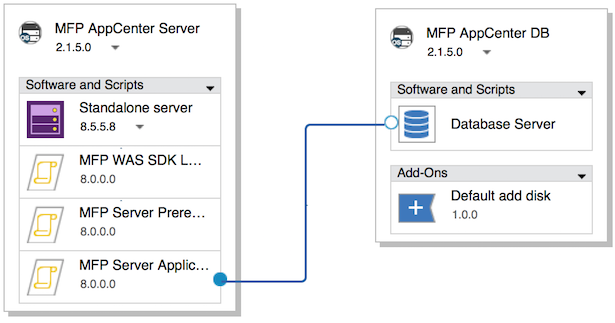

<!-- NLS_CHARSET=UTF-8 -->
## Présentation
{: #overview }
{{ site.data.keys.product_full }} permet de déployer et gérer des applications {{ site.data.keys.mf_server }} et {{ site.data.keys.product_adj }} sur IBM  PureApplication System et IBM PureApplication Service on SoftLayer.

{{ site.data.keys.product }}, utilisé conjointement avec IBM PureApplication System et IBM PureApplication Service on SoftLayer, offre un environnement simple et intuitif aux développeurs et aux administrateurs pour développer des applications mobiles, les tester et les déployer sur le cloud. Cette version d'{{ site.data.keys.mf_system_pattern_full }} fournit la prise en charge des artefacts et de l'environnement d'exécution de {{ site.data.keys.product }} pour les technologies PureApplication Virtual System Pattern qui sont incluses dans les versions les plus récentes d'IBM PureApplication System et d'IBM PureApplication Service on SoftLayer. Le canevas de système virtuel classique était pris en charge dans les versions précédentes d'IBM PureApplication System.

#### Aller à
{: #jump-to }
* [Installation de {{ site.data.keys.mf_system_pattern }}](#installing-mobilefirst-system-pattern)
* [Exigences en matière d'octroi de licence de jeton pour {{ site.data.keys.mf_system_pattern }}](#token-licensing-requirements-for-mobilefirst-system-pattern)
* [Déploiement de {{ site.data.keys.mf_server }} sur un serveur de profil Liberty de WebSphere Application Server à noeud unique](#deploying-mobilefirst-server-on-a-single-node-websphere-application-server-liberty-profile-server)
* [Déploiement de {{ site.data.keys.mf_server }} sur un serveur de profil Liberty de WebSphere Application Server à plusieurs noeuds](#deploying-mobilefirst-server-on-a-multiple-node-websphere-application-server-liberty-profile-server)
* [Déploiement de {{ site.data.keys.mf_server }} sur un serveur de profil complet de WebSphere à noeud unique](#deploying-mobilefirst-server-on-a-single-node-websphere-application-server-full-profile-server)
* [Déploiement de {{ site.data.keys.mf_server }} sur un serveur de profil complet de WebSphere Application Server à plusieurs noeuds](#deploying-mobilefirst-server-on-a-multiple-node-websphere-application-server-full-profile-server)
* [Déploiement de {{ site.data.keys.mf_server }} sur des clusters de serveurs WebSphere Application Server Network Deployment](#deploying-mobilefirst-server-on-clusters-of-websphere-application-server-network-deployment-servers)
* [Déploiement d'{{ site.data.keys.mf_app_center }} sur un serveur de profil Liberty de WebSphere Application Server](#deploying-mobilefirst-application-center-on-a-single-node-websphere-application-server-liberty-profile-server)
* [Déploiement de {{ site.data.keys.mf_app_center }} sur un serveur de profil complet de WebSphere à noeud unique](#deploying-mobilefirst-application-center-on-a-single-node-websphere-application-server-full-profile-server)
* [Configuration de la sécurité d'administration de {{ site.data.keys.product_adj }} à l'aide d'un référentiel LDAP externe](#configuring-mobilefirst-administration-security-with-an-external-ldap-repository)
* [Configuration d'une base de données externe à l'aide de {{ site.data.keys.mf_system_pattern }}](#configuring-an-external-database-with-a-mobilefirst-system-pattern)
* [Déploiement et configuration de {{ site.data.keys.mf_analytics }}](#deploying-and-configuring-mobilefirst-analytics)
* [Modèles prédéfinis pour {{ site.data.keys.mf_system_pattern }}](#predefined-templates-for-mobilefirst-system-pattern)
* [Packages de script pour {{ site.data.keys.mf_server }}](#script-packages-for-mobilefirst-server)
* [Mise à niveau de {{ site.data.keys.mf_system_pattern }}](#upgrading-mobilefirst-system-pattern)

### Principaux avantages
{: #key-benefits }
{{ site.data.keys.mf_system_pattern }} offre les avantages suivants :

* Des modèles prédéfinis vous permettent de générer facilement des canevas pour les topologies de déploiement de {{ site.data.keys.mf_server }} les plus classiques. Exemples de topologies :  
    * Profil Liberty d'IBM WebSphere Application Server à noeud unique
    * Profil Liberty d'IBM WebSphere Application Server à plusieurs noeuds
    * Noeud unique de profil complet d'IBM WebSphere Application Server
    * Profil complet d'IBM WebSphere Application Server à plusieurs noeuds
    * Clusters de serveurs WebSphere Application Server Network Deployment
    * Topologies de déploiement d'{{ site.data.keys.mf_app_center }}, telles que :
        * Noeud unique de profil Liberty d'IBM WebSphere Application Server
        * Noeud unique de profil complet d'IBM WebSphere Application Server
* Les packages de script agissent comme des blocs de construction pour composer des topologies de déploiement étendu, telles que l'automatisation de l'inclusion d'un serveur d'analyse dans un canevas et d'options de déploiement de machine virtuelle de base de données flexibles. Les packages de script WebSphere Application Server et DB2 sont disponibles via l'inclusion de types de canevas WebSphere Application Server et DB2.
* Des propriétés JNDI facultatives dans le package de script de déploiement permettent un réglage à granularité fine pour la topologie de déploiement. De plus, les topologies de déploiement qui sont intégrées au profil complet d'IBM WebSphere Application Server prennent désormais en charge l'accès à WebSphere Application Server Administration Console, ce qui vous permet de contrôler entièrement la configuration du serveur d'applications.

### Restrictions majeures
{: #important-restrictions }
Selon le modèle de canevas que vous utilisez, vous ne devez pas modifier certains attributs de composant. Si vous modifiez l'un de ces attributs de composant, le déploiement des canevas qui sont basés sur ces modèles échoue.

#### {{ site.data.keys.product }} (noeud unique Application Center Liberty)
{: #mobilefirst-foundation-application-center-liberty-single-node }
Ne modifiez pas les valeurs des attributs suivants dans le composant Liberty profile server :

* WebSphere product Installation directory
* Configuration data location
* Liberty profile server name
* Sous Install an IBM Java SDK, sélectionnez unique Java SDK V7.0 ou Java SDK V7.1
* Sélectionnez l'option Install additional features et désélectionnez IBM WebSphere eXtreme Scale.

#### {{ site.data.keys.product }} (noeud unique Application Center WebSphere Application Server)
{: #mobilefirst-foundation-application-center-websphere-application-server-single-node }
Ne modifiez pas les valeurs des attributs suivants dans le composant Liberty profile server :

* WebSphere product Installation directory
* Configuration data location
* Cell name
* Node name
* Profile name
* Sous Install an IBM Java SDK, sélectionnez unique Java SDK V7.0 ou Java SDK V7.1
* Sélectionnez l'option Install additional features et désélectionnez IBM WebSphere eXtreme Scale.

#### {{ site.data.keys.product }} (noeud unique Liberty)
{: #mobilefirst-foundation-liberty-single-node }
Ne modifiez pas les valeurs des attributs suivants dans le composant Liberty profile server :

* WebSphere product Installation directory
* Configuration data location
* Liberty profile server name
* Sous Install an IBM Java SDK, sélectionnez unique Java SDK V7.0 ou Java SDK V7.1
* Sélectionnez l'option Install additional features et désélectionnez IBM WebSphere eXtreme Scale.

#### {{ site.data.keys.product }} (parc de serveurs Liberty)
{: #mobilefirst-foundation-liberty-server-farm }
Ne modifiez pas les valeurs des attributs suivants dans le composant Liberty profile server :

* WebSphere product Installation directory
* Configuration data location
* Liberty profile server name
* Sous Install an IBM Java SDK, sélectionnez unique Java SDK V7.0 ou Java SDK V7.1
* Sélectionnez l'option Install additional features et désélectionnez IBM WebSphere eXtreme Scale.

#### Modèle {{ site.data.keys.product }} (noeud unique WebSphere Application Server)
{: #mobilefirst-foundation-websphere-application-server-single-node-template }
Dans le composant **Standalone server** du noeud MobileFirst Platform Server, ne déverrouillez ou ne modifiez pas les valeurs des attributs suivants :

* Cell name
* Node name
* Profile name
* Si vous modifiez l'un de ces attributs, le déploiement de votre canevas échoue.

#### Modèle {{ site.data.keys.product }} (parc de serveurs WebSphere Application Server)
{: #mobilefirst-foundation-websphere-application-server-server-farm-template }
Dans le composant **Standalone server** du noeud MobileFirst Platform Server, ne déverrouillez ou ne modifiez pas les valeurs des attributs suivants :

* Cell name
* Node name
* Profile name
* Si vous modifiez l'un de ces attributs, le déploiement de votre canevas échoue.

#### Modèle {{ site.data.keys.product }} (WebSphere Application Server Network Deployment)
{: #mobilefirst-foundation-websphere-application-server-network-deployment-template }
Dans le composant **Deployment manager** du noeud **DmgrNode** ou le composant **Custom nodes** du noeud **CustomNode **, ne déverrouillez ou ne modifiez pas les valeurs des attributs suivants :

* Cell name
* Node name
* Profile name

Si vous modifiez l'un de ces attributs, le déploiement de votre canevas échoue.

### Limitations
{: #limitations }
Les limitations suivantes s'appliquent :

* La mise à l'échelle dynamique des parcs de serveurs de profil Liberty de WebSphere Application Server et des parcs de serveurs de profil complet de WebSphere Application Server n'est pas prise en charge. Le nombre de noeuds de parc de serveurs peut être spécifié dans le canevas en définissant les règles de mise à l'échelle mais ne peut pas être modifié lors de l'exécution.
* L'extension {{ site.data.keys.v63_to_80prerebrand_product_full }} System Pattern pour {{ site.data.keys.mf_studio }} et l'interface de ligne de commande Ant disponibles dans les versions antérieures à V7.0 ne sont pas disponibles pour la version en cours de {{ site.data.keys.mf_system_pattern }}.
* {{ site.data.keys.mf_system_pattern }} dépend du logiciel WebSphere Application Server Patterns, auquel certaines restrictions s'appliquent. Pour plus d'informations, voir [Restrictions pour WebSphere Application Server Patterns](http://ibm.biz/knowctr#SSAJ7T_1.0.0/com.ibm.websphere.waspatt20base.doc/ae/rins_patternsB_restrictions.html).
* En raison de restrictions qui s'appliquent lors de la désinstallation de Virtual System Patterns, vous devez supprimer les packages de script manuellement après avoir supprimé le type de canevas. Dans IBM PureApplication System, accédez à **Catalog → Script Packages** pour supprimer les packages de script répertoriés dans la section **Components**.
* Le modèle de canevas MobileFirst (WebSphere Application Server Network Deployment) ne prend pas en charge l'octroi de licence de jeton. Si vous souhaitez utiliser ce canevas, vous devez utiliser l'octroi de licence perpétuelle. Tous les autres canevas prennent en charge l'octroi de licence de jeton.

### Composition
{: #composition }
{{ site.data.keys.mf_system_pattern }} est composé des canevas suivants :

* IBM WebSphere Application Server Network Deployment Patterns 2.2.0.0.
* Référentiel [PureApplication Service] WebSphere 8558 IM mobile afin de permettre le fonctionnement de WebSphere Application Server Network Deployment Patterns. Contactez l'administrateur d'IBM PureApplication System pour confirmer que le référentiel WebSphere 8558 IM est installé.
* IBM DB2 with BLU Acceleration Pattern 1.2.4.0.
* {{ site.data.keys.mf_system_pattern }}.

### Composants
{: #components }
Outre tous les composants fournis par IBM WebSphere Application Server Pattern et IBM DB2 with BLU Acceleration Pattern, {{ site.data.keys.mf_system_pattern }} offre les packages de script suivants :

* MFP Administration DB
* MFP Runtime DB
* MFP Server Prerequisite
* MFP Server Administration
* MFP Server Runtime Deployment
* MFP Server Application Adapter Deployment
* MFP IHS Configuration
* MFP Analytics
* MFP Open Firewall Ports for WAS
* MFP WAS SDK Level
* MFP Server Application Center

### Compatibilité entre les types de canevas et les artefacts créés par les différentes versions de produit
{: #compatibility-between-pattern-types-and-artifacts-created-with-different-product-versions }
Si vous utilisez MobileFirst Studio version 6.3.0 ou antérieure pour développer vos applications, vous pouvez télécharger les artefacts d'environnement d'exécution, d'application et d'adaptateur associés dans des canevas associés à {{ site.data.keys.v63_to_80prerebrand_product_full }} version 7.0.0 ou ultérieure.

Les types de canevas qui sont associés à {{ site.data.keys.v63_to_80prerebrand_product_full }} version 6.3.0 ou antérieure ne sont pas compatibles avec les artefacts d'environnement d'exécution, d'application et d'adaptateur créés à l'aide de MobileFirst Studio version 7.0.0 ou ultérieure.

Pour les versions 6.0.0 et antérieures, seules les mêmes versions de serveur, de fichier **.war**, d'application (fichier **.wlapp**) et d'adaptateur sont compatibles.

## Installation de {{ site.data.keys.mf_system_pattern }}
{: #installing-mobilefirst-system-pattern }
Recherchez le fichier **{{ site.data.keys.mf_system_pattern_file }}**. Prenez soin d'extraire le fichier avant de démarrer cette procédure.

1. Connectez-vous à IBM PureApplication System en utilisant un compte doté des droits nécessaires pour créer de nouveaux types de canevas.
2. Accédez à **Catalog → Pattern Types**.
3. Téléchargez le fichier {{ site.data.keys.mf_system_pattern }} **.tgz** :
    * Dans la barre d'outils, cliquez sur **+**. La fenêtre "Install a pattern type" s'affiche.
    * Sur l'onglet Local, cliquez sur **Browse**, sélectionnez le fichier {{ site.data.keys.mf_system_pattern }} **.tgz** et attendez la fin du processus de téléchargement. Le type de canevas apparaît dans la liste et est marqué comme non activé.
4. Dans la liste de types de canevas, cliquez sur le type de canevas chargé. Les détails du type de canevas s'affichent.
5. Dans la ligne License Agreement, cliquez sur **License**. La fenêtre License contenant les dispositions du contrat de licence s'affiche.
6. Pour accepter la licence, cliquez sur **Accept**. Les détails du type de canevas indiquent à présent que la licence a été acceptée.
7. Dans la ligne Status, cliquez sur **Enable**. Le type de canevas apparaît à présent comme étant en cours d'activation.
8. Obligatoire pour PureApplication Service : une fois le type de canevas activé, accédez à **Catalog → Script** Packages et sélectionnez les packages de script avec des noms tels que "MFP \*\*\*". Sur la page de détails qui apparaît à droite, acceptez le contrat de licence dans la zone **License Agreement**. Répétez cette procédure pour les onze packages de script répertoriés dans la section Composants.

## Exigences en matière d'octroi de licence de jeton pour {{ site.data.keys.mf_system_pattern }}
{: #token-licensing-requirements-for-mobilefirst-system-pattern }
Si vous utilisez l'octroi de licence de jeton pour {{ site.data.keys.product }}, vous devez installer IBM Rational License Key Server et le configurer avec vos licences avant de déployer {{ site.data.keys.mf_system_pattern_full }}.

> **Important :** Le modèle de canevas {{ site.data.keys.product }} (WAS ND) ne prend pas en charge l'octroi de licence de jeton. Vous devez utiliser l'octroi de licence perpétuelle lorsque vous déployez des canevas sur la base du modèle de canevas {{ site.data.keys.product }} (WAS ND). Tous les autres modèles de canevas prennent en charge l'octroi de licence de jeton.

Votre serveur IBM Rational License Key Server doit être externe à PureApplication System. {{ site.data.keys.system_pattern }} ne prend pas en charge le service partagé PureApplication System pour IBM Rational License Key Server.

De plus, vous devez connaître les informations suivantes concernant votre système Rational License Key Server pour pouvoir ajouter les informations relatives au serveur de clé de licence à vos attributs de canevas :

* Nom de système hôte qualifié complet ou adresse IP de votre système Rational License Key Server
* Port de démon de gestionnaire de licence (**lmgrd**)
* Port (**ibmratl**) de démon de fournisseur

Si un pare-feu existe entre Rational License Key Server et PureApplication System, assurez-vous que les ports de démon sont ouverts dans votre pare-feu.
Le déploiement de {{ site.data.keys.system_pattern }} échoue si le serveur de clé de licence ne peut pas être contacté ou si le nombre de jetons de licence disponibles est insuffisant.

Pour plus d'informations sur l'installation et la configuration de Rational License Key Server, voir la page d'accueil du support IBM pour l'octroi de licence de Rational ([).](http://www.ibm.com/software/rational/support/licensing/)

## Déploiement de {{ site.data.keys.mf_server }} sur un serveur de profil Liberty de WebSphere Application Server à noeud unique
{: #deploying-mobilefirst-server-on-a-single-node-websphere-application-server-liberty-profile-server }
Vous utilisez un modèle prédéfini pour déployer {{ site.data.keys.mf_server }} sur un serveur de profil Liberty de WebSphere Application Server à noeud unique.

Cette procédure implique de télécharger certains artefacts sur IBM PureApplication System, tels que l'application et l'adaptateur requis. Avant de commencer, assurez-vous que les artefacts sont disponibles pour téléchargement.

**Exigences en matière d'octroi de licence :** Si vous utilisez l'octroi de licence de jeton pour {{ site.data.keys.product }}, passez en revue les exigences décrites dans [Exigences en matière d'octroi de licence de jeton pour {{ site.data.keys.mf_system_pattern }}](#token-licensing-requirements-for-mobilefirst-system-pattern) avant de continuer. Le déploiement de ce canevas échoue si le serveur de clé de licence ne peut pas être contacté ou si le nombre de jetons de licence disponibles est insuffisant.

Certains paramètres de packages de script dans le modèle ont été configurés avec les valeurs recommandées et ne sont pas mentionnés dans cette section. Pour le réglage à granularité fine, voir d'autres informations sur tous les paramètres des packages de script dans [Packages de script pour {{ site.data.keys.mf_server }}](#script-packages-for-mobilefirst-server).

Pour plus d'informations sur les options de composition et de configuration du modèle prédéfini utilisé dans cette procédure, voir [Modèle {{ site.data.keys.product }} (noeud unique Liberty)](#mobilefirst-foundation-liberty-single-node-template).

1. Créez un canevas à partir du modèle prédéfini :
    * Dans le tableau de bord IBM PureApplication System, cliquez sur **Patterns → Virtual System Patterns**. La page Virtual System Patterns s'affiche.
    * Sur la page **Virtual System Patterns**, cliquez sur **Create New**, puis dans la fenêtre en incrustation, sélectionnez**MobileFirst Platform (noeud unique Liberty)** dans la liste de modèles prédéfinis. Si le nom n'est que partiellement visible (en raison de sa longueur), vous pouvez vérifier que le modèle approprié est sélectionné en affichant sa description sur l'onglet **Informations supplémentaires**.
    * Dans la zone **Name**, indiquez un nom pour le canevas.
    * Dans la zone **Version**, spécifiez le numéro de version du canevas.
    * Cliquez sur **Start Building**.
2. Obligatoire pour AIX : Dans le serveur IBM PureApplication System qui s'exécute sur Power, le noeud MobileFirst Platform DB doit utiliser le composant de module complémentaire propre à AIX, "Default AIX add disk", en remplacement du composant "Default add disk" dans le modèle pour prendre en charge le système de fichiers jfs2 :
    * Dans le générateur de canevas, sélectionnez le noeud **MobileFirst Platform DB**.
    * Cliquez sur le bouton **Add a Component Add-on** (visible au-dessus de la zone de composant lorsque vous passez le curseur sur le noeud **MobileFirst Platform DB**).
    * Dans la liste **Add Add-ons**, sélectionnez **Default AIX add disk**. Le composant est ajouté comme composant de plus bas niveau du noeud MobileFirst Platform DB.
    * Sélectionnez le composant **Default AIX add disk** et spécifiez les attributs suivants :
        * **DISK_SIZE_GB** : Taille de stockage (mesurée en Go) à étendre au serveur de base de données. Exemple de valeur : **10**.
        * **FILESYSTEM_TYPE** : Système de fichiers pris en charge sous AIX. Valeur par défaut : **jfs2**.
        * **MOUNT_POINT** : A aligner avec l'attribut **Mount point for instance owner** du composant Database Server dans le noeud MobileFirst Platform DB. Exemple de valeur : **/dbinst**.
        * **VOLUME_GROUP** : Exemple de valeur : **group1**. Contactez votre administrateur IBM PureApplication System pour connaître la valeur appropriée.
    * Dans le noeud MobileFirst Platform DB, sélectionnez le composant **Default add disk**, puis cliquez sur l'icône représentant une corbeille pour le supprimer.
    * Sauvegardez le canevas.
3. Facultatif : Configurez l'administration de {{ site.data.keys.mf_server }}. Vous pouvez ignorer cette étape si vous souhaitez spécifier les données d'identification d'utilisateur dotées du privilège d'administration de {{ site.data.keys.mf_server }} ultérieurement lors de la phase de configuration de déploiement de canevas à l'étape 9. Pour les spécifier maintenant, procédez comme suit :

    > **Remarque :** Si vous souhaitez configurer la sécurité d'administration avec un serveur LDAP, vous devez indiquer des informations LDAP supplémentaires. Pour plus d'informations, voir [Configuration de la sécurité d'administration de {{ site.data.keys.product_adj }} à l'aide d'un référentiel LDAP externe](#configuring-mobilefirst-administration-security-with-an-external-ldap-repository).
    * Dans le noeud MobileFirst Platform Server, cliquez sur le composant **MFP Server Administration**. Les propriétés du composant sélectionné sont affichées en regard du canevas.
    * En regard des zones **admin_user** et **admin_password**, cliquez sur le bouton Delete pour effacer leurs paramètres de niveau de modèle.
    * Dans les zones **admin_user** et **admin\_password**, spécifiez le nom d'utilisateur et le mot de passe d'administration.
    * Si vous utilisez l'octroi de licence de jeton pour {{ site.data.keys.product }}, renseignez les zones ci-après. Si vous n'utilisez pas l'octroi de licence de jeton, laissez ces zones vides.

    **ACTIVATE\_TOKEN\_LICENSE** : Sélectionnez cette zone pour activer l'octroi de licence de jeton pour votre canevas.  
    **LICENSE\_SERVER\_HOSTNAME** : Entrez le nom de système hôte qualifié complet ou l'adresse IP de votre système Rational License Key Server.  
    **LMGRD\_PORT** : Entrez le numéro de port sur lequel le démon de gestionnaire de licence (**lmrgd**) est en mode écoute pour les connexions. Le port de démon de gestionnaire de licence par défaut est 27000.  
    **IBMRATL\_PORT** : Entrez le numéro de port sur lequel le démon de fournisseur (**ibmratl**) est en mode écoute pour les connexions. Le port de démon de fournisseur par défaut est généralement 27001.  

    Un compte d'administration par défaut pour {{ site.data.keys.mf_server }} est créé lors du déploiement de canevas.

4. Facultatif : Configurez le déploiement d'environnement d'exécution de {{ site.data.keys.mf_server }}. Vous pouvez ignorer cette étape si vous souhaitez spécifier le nom de la racine de contexte pour l'environnement d'exécution ultérieurement lors de la phase de configuration de déploiement de canevas à l'étape 9. Pour spécifier maintenant le nom de la racine de contexte, procédez comme suit :
    * Dans le noeud MobileFirst Platform Server, cliquez sur le composant **MFP Server Runtime Deployment**. Les propriétés du composant sélectionné sont affichées en regard du canevas.
    * En regard de la zone **runtime\_contextRoot**, cliquez sur le bouton **Delete** pour effacer le paramètre de niveau de modèle.
    * Dans la zone **runtime\_contextRoot**, spécifiez le nom de la racine de contexte d'exécution. Notez que le nom de la racine de contexte doit commencer par une barre oblique (/), par exemple, `/HelloWorld`.

5. Téléchargez les artefacts d'application et d'adaptateur :

    > **Important :** Lorsque vous spécifiez le chemin cible pour les applications et les adaptateurs, vérifiez que toutes les applications et tous les adaptateurs sont placés dans le même répertoire. Par exemple, si un chemin cible est **/opt/tmp/deploy/HelloWorld-common.json**, tous les autres chemins cible doivent être `/opt/tmp/deploy/*`.
    * Dans le noeud MobileFirst Platform Server, cliquez sur le composant **MFP Server Application** ou **MFP Server Adapter**. Les propriétés du composant sélectionné sont affichées en regard du canevas.
    * Dans la zone **Additional file**, cliquez sur le bouton **Browse** pour rechercher et télécharger l'artefact d'application ou d'adaptateur.
    * Dans la zone **Target path**, spécifiez le chemin d'accès complet pour le stockage de l'artefact, y compris son nom de fichier, par exemple, **/opt/tmp/deploy/HelloWorld-common.json**.
    * S'il n'y a aucune application ou aucun adaptateur à déployer dans le canevas, retirez le composant approprié en cliquant sur le bouton **X** qu'il comporte. Pour obtenir le déploiement d'une application {{ site.data.keys.mf_console }} vide, sans aucune application ni aucun adaptateur installés, retirez le composant MFP Server Application Adapter Deployment en cliquant sur le bouton X qu'il comporte.

6. Facultatif : Ajoutez d'autres artefacts d'application ou d'adaptateur pour déploiement :
    * Dans la barre d'outils **Assets**, développez **Software Components**, puis copiez et collez un composant **Additional file** dans le noeud MobileFirst Platform Server dans le canevas. Renommez-le **{{ site.data.keys.product_adj }} App\_X** ou **{{ site.data.keys.product_adj }} Adatper\_X** (où **X** correspond à un numéro unique qui permet de différencier les composants).
    * Survolez le composant d'application ou d'adaptateur nouvellement ajouté, puis cliquez sur les boutons **Move Up** et **Move Down** pour ajuster sa séquence dans le noeud. Prenez soin de le placer après le composant MFP Runtime Deployment et avant le composant MFP Server Application Adapter Deployment.
    * Cliquez sur le composant d'application ou d'adaptateur nouvellement ajouté. Les propriétés du composant sélectionné sont affichées en regard du canevas. Téléchargez l'artefact d'application ou d'adaptateur et spécifiez son chemin cible en vous reportant aux étapes décrites à l'étape 6.
    * Répétez l'étape 7 pour ajouter davantage d'applications et d'adaptateurs pour déploiement.

7. Facultatif : Configurez le déploiement d'application et d'adaptateur sur {{ site.data.keys.mf_server }}. Vous pouvez ignorer cette étape si vous souhaitez spécifier les données d'identification d'utilisateur dotées du privilège de déploiement ultérieurement lors de la phase de configuration de déploiement de canevas à l'étape 9. Si vous avez spécifié les données d'identificateur d'administrateur par défaut à l'étape 3, vous pouvez spécifier maintenant l'utilisateur déployé, lequel doit correspondre aux données d'identification de l'administrateur :
    * Dans le noeud MobileFirst Platform Server, sélectionnez le composant **MFP Server Application Adapter Deployment**. Les propriétés du composant sélectionné sont affichées en regard du canevas.
    * Recherchez les paramètres **deployer_user** et **deployer_password**, puis cliquez sur les boutons Delete adjacents pour effacer les paramètres de niveau de modèle.
    * Dans les zones **deployer\_user** et **deployer\_password**, spécifiez le nom d'utilisateur et le mot de passe.

8. Configurez et lancez le déploiement de canevas :
    * Dans le tableau de bord IBM PureApplication System, cliquez sur **Patterns → Virtual System Patterns**.
    * Sur la page **Virtual System Patterns**, utilisez la zone **Search** pour rechercher le canevas que vous avez créé, puis sélectionnez le canevas.
    * Dans la barre d'outils située au-dessus du panneau contenant les informations détaillées sur le canevas, cliquez sur le bouton Deploy.
    * Dans la fenêtre Deploy Pattern, dans le panneau Configure, sélectionnez le profil d'environnement approprié dans la liste **Environnement Profile** et indiquez d'autres paramètres d'environnement IBM PureApplication System. Pour obtenir les informations appropriées, consultez votre administrateur IBM PureApplication System.
    * Dans la colonne du milieu, cliquez sur **Pattern attributes** pour afficher des attributs, tels que des noms d'utilisateur et des mots de passe.

        Indiquez les informations suivantes dans les zones fournies :

        > **Remarque :** Apportez les modifications appropriées aux valeurs par défaut des paramètres de niveau de canevas si un serveur LDAP externe est configuré. Si vous souhaitez configurer la sécurité d'administration avec un serveur LDAP, vous devez indiquer des informations LDAP supplémentaires. Pour plus d'informations, voir [Configuration de la sécurité d'administration de {{ site.data.keys.product_adj }} à l'aide d'un référentiel LDAP externe](#configuring-mobilefirst-administration-security-with-an-external-ldap-repository).
        
        **admin\_user**  
        Information qui n'est pas visible si cette valeur a été configurée à l'étape 3. Créez un compte administrateur {{ site.data.keys.mf_server }} par défaut. Valeur par défaut : demo.
        
        **admin\_password**  
        Information qui n'est pas visible si cette valeur a été configurée à l'étape 3. Mot de passe de compte administrateur par défaut. Valeur par défaut : demo.
        
        **ACTIVATE\_TOKEN\_LICENSE**  
        Information qui n'est pas visible si cette valeur a été configurée à l'étape 3. Sélectionnez cette zone pour activer l'octroi de licence de jeton pour votre canevas. Laissez cette zone vide si vous utilisez des licences perpétuelles.
        
        **LICENSE\_SERVER\_HOSTNAME**  
        Information qui n'est pas visible si cette valeur a été configurée à l'étape 3. Si vous utilisez l'octroi de licence de jeton pour {{ site.data.keys.product }}, entrez le nom d'hôte qualifié complet ou l'adresse IP de votre système Rational License Key Server. Dans le cas contraire, ne complétez pas cette zone.
        
        **LMGRD\_PORT**   
        Information qui n'est pas visible si cette valeur a été configurée à l'étape 3. Si vous utilisez l'octroi de licence de jeton pour {{ site.data.keys.product }}, entrez le numéro de port sur lequel le démon de gestionnaire de licence (lmrgd) est en mode écoute pour les connexions. Dans le cas contraire, ne complétez pas cette zone.
        Le port de démon de gestionnaire de licence par défaut est 27000.

        **IBMRATL\_PORT**  
        Information qui n'est pas visible si cette valeur a été configurée à l'étape 3. Si vous utilisez l'octroi de licence de jeton pour {{ site.data.keys.product }}, entrez le numéro de port sur lequel le démon de fournisseur (ibmratl) est en mode écoute pour les connexions. Dans le cas contraire, ne complétez pas cette zone.
        Le port de démon de fournisseur par défaut est généralement 27001.

        **runtime\_contextRoot**  
        Information qui n'est pas visible si cette valeur a été configurée à l'étape 5. Nom de la racine de contexte pour l'environnement d'exécution de {{ site.data.keys.mf_server }}. Le nom doit commencer par "/".
        
        **deployer\_user**  
        Information qui n'est pas visible si cette valeur a été configurée à l'étape 8. Nom d'utilisateur du compte doté du privilège de déploiement. Si un serveur LDAP externe n'est pas configuré, vous devez entrer la même valeur que celle qui été spécifiée lors de la création de l'administrateur par défaut pour le service d'administration, car dans ce cas, le seul utilisateur autorisé pour le déploiement d'application et d'adaptateur est l'administrateur par défaut.
        
        **deployer\_password**  
        Information qui n'est pas visible si cette valeur a été configurée à l'étape 8. Mot de passe du compte utilisateur doté du privilège de déploiement.
        
        **MFP Vms Password(root)**  
        Mot de passe root pour les noeuds de base de données {{ site.data.keys.mf_server }} et {{ site.data.keys.product }}. Valeur par défaut : passw0rd.
        
        **MFP DB Password(Instance owner)**  
        Mot de passe de propriétaire d'instance pour le noeud MobileFirst Platform DB. Valeur par défaut : **passw0rd**.    
    * Cliquez sur l'option **Quick Deploy** pour lancer le déploiement du canevas. Au bout de quelques secondes, un message s'affiche pour vous indiquer que le déploiement du canevas a démarré. Vous pouvez cliquer sur l'URL fournie dans le message pour suivre le statut du déploiement de votre canevas ou accéder à **Patterns → Virtual System Instances** pour ouvrir la page Virtual System Instances et y rechercher votre canevas.

    Si vous utilisez l'octroi de licence de jeton pour {{ site.data.keys.product }}, le déploiement de votre canevas échoue si le nombre de jetons disponibles est insuffisant ou si l'adresse IP et le port du serveur de clé de licence n'ont pas été saisis correctement.

9. Accédez à {{ site.data.keys.mf_console }} :
    * Cliquez sur **Patterns → Virtual System Instances** pour ouvrir la page Virtual System Instances et y rechercher votre canevas. Assurez-vous qu'il est à l'état Running.
    * Sélectionnez le nom du canevas et développez l'option **Virtual machine perspective** dans le panneau qui affiche les détails de l'instance sélectionnée.
    * Recherchez la machine virtuelle {{ site.data.keys.mf_server }} dont le nom est similaire à **MobileFirst\_Platform\_Server.** et notez son adresse IP publique. Vous aurez besoin de cette information pour les étapes ci-après.
    * Dans le navigateur, ouvrez {{ site.data.keys.mf_console }} en composant son URL à l'aide de l'un des formats suivants :
        * `http://{MFP Server VM Public IP}:9080/mfpconsole`
        * `https://{MFP Server VM Public IP}:9443/mfpconsole`
    * Connectez-vous à la console à l'aide de l'administrateur et du mot de passe spécifiés à l'étape 3 ou à l'étape 9.

## Déploiement de {{ site.data.keys.mf_server }} sur un serveur de profil Liberty de WebSphere Application Server à plusieurs noeuds
{: #deploying-mobilefirst-server-on-a-multiple-node-websphere-application-server-liberty-profile-server }
Vous utilisez un modèle prédéfini pour déployer {{ site.data.keys.mf_server }} sur un serveur de profil Liberty de WebSphere Application Server à plusieurs noeuds.

Cette procédure implique de télécharger certains artefacts sur IBM PureApplication System, tels que l'application et l'adaptateur requis. Avant de commencer, assurez-vous que les artefacts sont disponibles pour téléchargement.

**Exigences en matière d'octroi de licence :** Si vous utilisez l'octroi de licence de jeton pour {{ site.data.keys.product }}, passez en revue les exigences décrites dans [Exigences en matière d'octroi de licence de jeton pour {{ site.data.keys.mf_system_pattern }}](#token-licensing-requirements-for-mobilefirst-system-pattern) avant de continuer. Le déploiement de ce canevas échoue si le serveur de clé de licence ne peut pas être contacté ou si le nombre de jetons de licence disponibles est insuffisant.

Certains paramètres de packages de script dans le modèle ont été configurés avec les valeurs recommandées et ne sont pas mentionnés dans cette section. Pour le réglage à granularité fine, voir d'autres informations sur tous les paramètres des packages de script dans [Packages de script pour {{ site.data.keys.mf_server }}](#script-packages-for-mobilefirst-server).

Pour plus d'informations sur les options de composition et de configuration du modèle prédéfini utilisé dans cette procédure, voir [Modèle {{ site.data.keys.product }} (parc de serveurs Liberty)](#mobilefirst-foundation-liberty-server-farm-template).

1. Créez un canevas à partir du modèle prédéfini :
    * Dans le tableau de bord IBM PureApplication System, cliquez sur **Patterns → Virtual System Patterns**. La page **Virtual System Patterns** s'affiche.
    * Sur la page **Virtual System Patterns**, cliquez sur **Create New**, puis, dans la fenêtre en incrustation, sélectionnez **MobileFirst Platform (parc de serveurs Liberty)** dans la liste de modèles prédéfinis. Si le nom n'est que partiellement visible (en raison de sa longueur), vous pouvez vérifier que le modèle approprié est sélectionné en affichant sa description sur l'onglet **Informations supplémentaires**.
    * Dans la zone **Name**, indiquez un nom pour le canevas.
    * Dans la zone **Version**, spécifiez le numéro de version du canevas.
    * Cliquez sur **Start Building**.
2. Obligatoire pour AIX : Dans le serveur IBM PureApplication System qui s'exécute sur Power, le noeud MobileFirst Platform DB doit utiliser le composant de module complémentaire propre à AIX, "Default AIX add disk", en remplacement du composant "Default add disk" dans le modèle pour prendre en charge le système de fichiers **jfs2** :
    * Dans le générateur de canevas, sélectionnez le noeud **MobileFirst Platform DB**.
    * Cliquez sur le bouton **Add a Component Add-on** (visible au-dessus de la zone de composant lorsque vous passez le curseur sur le noeud **MobileFirst Platform DB**).
    * Dans la liste **Add Add-ons**, sélectionnez **Default AIX add disk**. Le composant est ajouté comme composant de plus bas niveau du noeud MobileFirst Platform DB.
    * Sélectionnez le composant **Default AIX add disk** et spécifiez les attributs suivants :
        * **DISK_SIZE_GB** : Taille de stockage (mesurée en Go) à étendre au serveur de base de données. Exemple de valeur : **10**.
        * **FILESYSTEM_TYPE** : Système de fichiers pris en charge sous AIX. Valeur par défaut : **jfs2**.
        * **MOUNT_POINT** : A aligner avec l'attribut **Mount point for instance owner** du composant Database Server dans le noeud MobileFirst Platform DB. Exemple de valeur : **/dbinst**.
        * **VOLUME_GROUP** : Exemple de valeur : **group1**. Contactez votre administrateur IBM PureApplication System pour connaître la valeur appropriée.
    * Dans le noeud MobileFirst Platform DB, sélectionnez le composant **Default add disk**, puis cliquez sur l'icône représentant une corbeille pour le supprimer.
    * Sauvegardez le canevas.
3. Facultatif : Configurez l'administration de {{ site.data.keys.mf_server }}. Vous pouvez ignorer cette étape si vous souhaitez spécifier les données d'identification d'utilisateur dotées du privilège d'administration de {{ site.data.keys.mf_server }} ultérieurement lors de la phase de configuration de déploiement de canevas à l'étape 9. Pour les spécifier maintenant, procédez comme suit :

    > **Remarque :** Si vous souhaitez configurer la sécurité d'administration avec un serveur LDAP, vous devez indiquer des informations LDAP supplémentaires. Pour plus d'informations, voir [Configuration de la sécurité d'administration de {{ site.data.keys.product_adj }} à l'aide d'un référentiel LDAP externe](#configuring-mobilefirst-administration-security-with-an-external-ldap-repository).
    * Dans le noeud MobileFirst Platform Server, cliquez sur le composant **MFP Server Administration**. Les propriétés du composant sélectionné sont affichées en regard du canevas.
    * En regard des zones **admin_user** et **admin_password**, cliquez sur le bouton Delete pour effacer leurs paramètres de niveau de modèle.
    * Dans les zones **admin_user** et **admin\_password**, spécifiez le nom d'utilisateur et le mot de passe d'administration.
    * Si vous utilisez l'octroi de licence de jeton pour {{ site.data.keys.product }}, renseignez les zones ci-après. Si vous n'utilisez pas l'octroi de licence de jeton, laissez ces zones vides.

    **ACTIVATE\_TOKEN\_LICENSE** : Sélectionnez cette zone pour activer l'octroi de licence de jeton pour votre canevas.  
    **LICENSE\_SERVER\_HOSTNAME** : Entrez le nom de système hôte qualifié complet ou l'adresse IP de votre système Rational License Key Server.  
    **LMGRD\_PORT** : Entrez le numéro de port sur lequel le démon de gestionnaire de licence (**lmrgd**) est en mode écoute pour les connexions. Le port de démon de gestionnaire de licence par défaut est 27000.  
    **IBMRATL\_PORT** : Entrez le numéro de port sur lequel le démon de fournisseur (**ibmratl**) est en mode écoute pour les connexions. Le port de démon de fournisseur par défaut est généralement 27001.  

    Un compte d'administration par défaut pour {{ site.data.keys.mf_server }} est créé lors du déploiement de canevas.
    
4. Facultatif : Configurez le déploiement d'environnement d'exécution de {{ site.data.keys.mf_server }}. Vous pouvez ignorer cette étape si vous souhaitez spécifier le nom de la racine de contexte pour l'environnement d'exécution ultérieurement lors de la phase de configuration de déploiement de canevas à l'étape 10. Pour spécifier maintenant le nom de la racine de contexte, procédez comme suit :
    * Dans le noeud MobileFirst Platform Server, cliquez sur le composant **MFP Server Runtime Deployment**. Les propriétés du composant sélectionné sont affichées en regard du canevas.
    * En regard de la zone **runtime\_contextRoot**, cliquez sur le bouton **Delete** pour effacer le paramètre de niveau de modèle.
    * Dans la zone **runtime\_contextRoot**, spécifiez le nom de la racine de contexte d'exécution. Notez que le nom de la racine de contexte doit commencer par une barre oblique (/), par exemple, `/HelloWorld`.

5. Téléchargez les artefacts d'application et d'adaptateur :

    > **Important :** Lorsque vous spécifiez le chemin cible pour les applications et les adaptateurs, vérifiez que toutes les applications et tous les adaptateurs sont placés dans le même répertoire. Par exemple, si un chemin cible est **/opt/tmp/deploy/HelloWorld-common.json**, tous les autres chemins cible doivent être `/opt/tmp/deploy/*`.
    * Dans le noeud MobileFirst Platform Server, cliquez sur le composant **MFP Server Application** ou **MFP Server Adapter**. Les propriétés du composant sélectionné sont affichées en regard du canevas.
    * Dans la zone **Additional file**, cliquez sur le bouton **Browse** pour rechercher et télécharger l'artefact d'application ou d'adaptateur.
    * Dans la zone **Target path**, spécifiez le chemin d'accès complet pour le stockage de l'artefact, y compris son nom de fichier, par exemple, **/opt/tmp/deploy/HelloWorld-common.json**.
    * S'il n'y a aucune application ou aucun adaptateur à déployer dans le canevas, retirez le composant approprié en cliquant sur le bouton **X** qu'il comporte. Pour obtenir le déploiement d'une application {{ site.data.keys.mf_console }} vide, sans aucune application ni aucun adaptateur installés, retirez le composant MFP Server Application Adapter Deployment en cliquant sur le bouton X qu'il comporte. 

6. Facultatif : Ajoutez d'autres artefacts d'application ou d'adaptateur pour déploiement :
    * Dans la barre d'outils **Assets**, développez **Software Components**, puis copiez et collez un composant **Additional file** dans le noeud MobileFirst Platform Server dans le canevas. Renommez-le **{{ site.data.keys.product_adj }} App\_X** ou **{{ site.data.keys.product_adj }} Adatper\_X** (où **X** correspond à un numéro unique qui permet de différencier les composants).
    * Survolez le composant d'application ou d'adaptateur nouvellement ajouté, puis cliquez sur les boutons **Move Up** et **Move Down** pour ajuster sa séquence dans le noeud. Prenez soin de le placer après le composant MFP Runtime Deployment et avant le composant MFP Server Application Adapter Deployment.
    * Cliquez sur le composant d'application ou d'adaptateur nouvellement ajouté. Les propriétés du composant sélectionné sont affichées en regard du canevas. Téléchargez l'artefact d'application ou d'adaptateur et spécifiez son chemin cible en vous reportant aux étapes décrites à l'étape 6.
    * Répétez l'étape 7 pour ajouter davantage d'applications et d'adaptateurs pour déploiement.

7. Facultatif : Configurez le déploiement d'application et d'adaptateur sur {{ site.data.keys.mf_server }}. Vous pouvez ignorer cette étape si vous souhaitez spécifier les données d'identification d'utilisateur dotées du privilège de déploiement ultérieurement lors de la phase de configuration de déploiement de canevas à l'étape 9. Si vous avez spécifié les données d'identificateur d'administrateur par défaut à l'étape 3, vous pouvez spécifier maintenant l'utilisateur déployé, lequel doit correspondre aux données d'identification de l'administrateur :
    * Dans le noeud MobileFirst Platform Server, sélectionnez le composant **MFP Server Application Adapter Deployment**. Les propriétés du composant sélectionné sont affichées en regard du canevas.
    * Recherchez les paramètres **deployer_user** et **deployer_password**, puis cliquez sur les boutons Delete adjacents pour effacer les paramètres de niveau de modèle.
    * Dans les zones **deployer\_user** et **deployer\_password**, spécifiez le nom d'utilisateur et le mot de passe.

8. Configurez les règles de mise à l'échelle de base :
    * Dans le noeud MobileFirst Platform Server, cliquez sur le composant **Base Scaling Policy**. Les propriétés du composant sélectionné sont affichées en regard du canevas.
    * Dans la zone **Number of Instances**, spécifiez le nombre de noeuds de serveur à instancier lors du déploiement du canevas. La valeur par défaut dans le modèle prédéfini est 2. La mise à l'échelle dynamique n'étant pas prise en charge dans cette édition, ne spécifiez aucune valeur dans les autres zones d'attribut.

9. Configurez et lancez le déploiement de canevas :
    * Dans le tableau de bord IBM PureApplication System, cliquez sur **Patterns → Virtual System Patterns**.
    * Sur la page **Virtual System Patterns**, utilisez la zone **Search** pour rechercher le canevas que vous avez créé, puis sélectionnez le canevas.
    * Dans la barre d'outils située au-dessus du panneau contenant les informations détaillées sur le canevas, cliquez sur le bouton Deploy.
    * Dans la fenêtre Deploy Pattern, dans le panneau Configure, sélectionnez le profil d'environnement approprié dans la liste **Environnement Profile** et indiquez d'autres paramètres d'environnement IBM PureApplication System. Pour obtenir les informations appropriées, consultez votre administrateur IBM PureApplication System.
    * Dans la colonne du milieu, cliquez sur **Pattern attributes** pour afficher des attributs, tels que des noms d'utilisateur et des mots de passe.

        Indiquez les informations suivantes dans les zones fournies :

        > **Remarque :** Apportez les modifications appropriées aux valeurs par défaut des paramètres de niveau de canevas si un serveur LDAP externe est configuré. Si vous souhaitez configurer la sécurité d'administration avec un serveur LDAP, vous devez indiquer des informations LDAP supplémentaires. Pour plus d'informations, voir [Configuration de la sécurité d'administration de {{ site.data.keys.product_adj }} à l'aide d'un référentiel LDAP externe](#configuring-mobilefirst-administration-security-with-an-external-ldap-repository).
        
        **admin\_user**  
        Information qui n'est pas visible si cette valeur a été configurée à l'étape 3. Créez un compte administrateur {{ site.data.keys.mf_server }} par défaut. Valeur par défaut : demo.
        
        **admin\_password**  
        Information qui n'est pas visible si cette valeur a été configurée à l'étape 3. Mot de passe de compte administrateur par défaut. Valeur par défaut : demo.
        
        **ACTIVATE\_TOKEN\_LICENSE**  
        Information qui n'est pas visible si cette valeur a été configurée à l'étape 3. Sélectionnez cette zone pour activer l'octroi de licence de jeton pour votre canevas. Laissez cette zone vide si vous utilisez des licences perpétuelles.
        
        **LICENSE\_SERVER\_HOSTNAME**  
        Information qui n'est pas visible si cette valeur a été configurée à l'étape 3. Si vous utilisez l'octroi de licence de jeton pour {{ site.data.keys.product }}, entrez le nom d'hôte qualifié complet ou l'adresse IP de votre système Rational License Key Server. Dans le cas contraire, ne complétez pas cette zone.
        
        **LMGRD\_PORT**   
        Information qui n'est pas visible si cette valeur a été configurée à l'étape 3. Si vous utilisez l'octroi de licence de jeton pour {{ site.data.keys.product }}, entrez le numéro de port sur lequel le démon de gestionnaire de licence (lmrgd) est en mode écoute pour les connexions. Dans le cas contraire, ne complétez pas cette zone.
        Le port de démon de gestionnaire de licence par défaut est 27000.

        **IBMRATL\_PORT**  
        Information qui n'est pas visible si cette valeur a été configurée à l'étape 3. Si vous utilisez l'octroi de licence de jeton pour {{ site.data.keys.product }}, entrez le numéro de port sur lequel le démon de fournisseur (ibmratl) est en mode écoute pour les connexions. Dans le cas contraire, ne complétez pas cette zone.
        Le port de démon de fournisseur par défaut est généralement 27001.

        **runtime\_contextRoot**  
        Information qui n'est pas visible si cette valeur a été configurée à l'étape 5. Nom de la racine de contexte pour l'environnement d'exécution de {{ site.data.keys.mf_server }}. Le nom doit commencer par "/".
        
        **deployer\_user**  
        Information qui n'est pas visible si cette valeur a été configurée à l'étape 8. Nom d'utilisateur du compte doté du privilège de déploiement. Si un serveur LDAP externe n'est pas configuré, vous devez entrer la même valeur que celle qui été spécifiée lors de la création de l'administrateur par défaut pour le service d'administration, car dans ce cas, le seul utilisateur autorisé pour le déploiement d'application et d'adaptateur est l'administrateur par défaut.
        
        **deployer\_password**  
        Information qui n'est pas visible si cette valeur a été configurée à l'étape 8. Mot de passe du compte utilisateur doté du privilège de déploiement.
        
        **MFP Vms Password(root)**  
        Mot de passe root pour les noeuds de base de données {{ site.data.keys.mf_server }} et {{ site.data.keys.product }}. Valeur par défaut : passw0rd.
        
        **MFP DB Password(Instance owner)**  
        Mot de passe de propriétaire d'instance pour le noeud MobileFirst Platform DB. Valeur par défaut : **passw0rd**.    
    * Cliquez sur l'option **Quick Deploy** pour lancer le déploiement du canevas. Au bout de quelques secondes, un message s'affiche pour vous indiquer que le déploiement du canevas a démarré. Vous pouvez cliquer sur l'URL fournie dans le message pour suivre le statut du déploiement de votre canevas ou accéder à **Patterns → Virtual System Instances** pour ouvrir la page Virtual System Instances et y rechercher votre canevas.

    Si vous utilisez l'octroi de licence de jeton pour {{ site.data.keys.product }}, le déploiement de votre canevas échoue si le nombre de jetons disponibles est insuffisant ou si l'adresse IP et le port du serveur de clé de licence n'ont pas été saisis correctement.
    
10. Accédez à {{ site.data.keys.mf_console }} :
    * Cliquez sur **Patterns → Virtual System Instances** pour ouvrir la page Virtual System Instances et y rechercher votre canevas. Assurez-vous qu'il est à l'état Running.
    * Sélectionnez le nom du canevas et développez l'option **Virtual machine perspective** dans le panneau qui affiche les détails de l'instance sélectionnée.
    * Recherchez la machine virtuelle de serveur IHS dont le nom ressemble à **IHS\_Server.*** et notez son adresse IP publique. Vous aurez besoin de cette information pour les étapes ci-après.
    * Dans le navigateur, ouvrez {{ site.data.keys.mf_console }} en composant son URL à l'aide de l'un des formats suivants :
        * `http://{IHS Server VM Public IP}/mfpconsole`
        * `https://{IHS Server VM Public IP}/mfpconsole`
    * Connectez-vous à la console à l'aide de l'ID et du mot de passe d'administrateur spécifiés à l'étape 3 ou à l'étape 10.

## Déploiement de {{ site.data.keys.mf_server }} sur un serveur de profil complet de WebSphere Application Server à noeud unique
{: #deploying-mobilefirst-server-on-a-single-node-websphere-application-server-full-profile-server }
Vous utilisez un modèle prédéfini pour déployer {{ site.data.keys.mf_server }} sur un serveur de profil complet de WebSphere Application Server à noeud unique.

Cette procédure implique de télécharger certains artefacts sur IBM PureApplication System, tels que l'application et l'adaptateur requis. Avant de commencer, assurez-vous que les artefacts sont disponibles pour téléchargement.

**Exigences en matière d'octroi de licence :** Si vous utilisez l'octroi de licence de jeton pour {{ site.data.keys.product }}, passez en revue les exigences décrites dans [Exigences en matière d'octroi de licence de jeton pour {{ site.data.keys.mf_system_pattern }}](#token-licensing-requirements-for-mobilefirst-system-pattern) avant de continuer. Le déploiement de ce canevas échoue si le serveur de clé de licence ne peut pas être contacté ou si le nombre de jetons de licence disponibles est insuffisant.

Certains paramètres de packages de script dans le modèle ont été configurés avec les valeurs recommandées et ne sont pas mentionnés dans cette section. Pour le réglage à granularité fine, voir d'autres informations sur tous les paramètres des packages de script dans [Packages de script pour {{ site.data.keys.mf_server }}](#script-packages-for-mobilefirst-server).

Pour plus d'informations sur les options de composition et de configuration du modèle prédéfini utilisé dans cette procédure, voir [Modèle {{ site.data.keys.product }} (noeud unique WAS)](#mobilefirst-foundation-was-single-node-template).

1. Créez un canevas à partir du modèle prédéfini :
    * Dans le tableau de bord IBM PureApplication System, cliquez sur **Patterns → Virtual System Patterns**. La page **Virtual System Patterns** s'affiche.
    * Sur la page **Virtual System Patterns**, cliquez sur **Create New**, puis dans la fenêtre en incrustation, sélectionnez **MobileFirst Platform (noeud unique WAS)** dans la liste de modèles prédéfinis. Si le nom n'est que partiellement visible (en raison de sa longueur), vous pouvez vérifier que le modèle approprié est sélectionné en affichant sa description sur l'onglet **Informations supplémentaires**.
    * Dans la zone **Name**, indiquez un nom pour le canevas.
    * Dans la zone **Version**, spécifiez le numéro de version du canevas.
    * Cliquez sur **Start Building**.
2. Obligatoire pour AIX : Dans le serveur IBM PureApplication System qui s'exécute sur Power, le noeud MobileFirst Platform DB doit utiliser le composant de module complémentaire propre à AIX, "Default AIX add disk", en remplacement du composant "Default add disk" dans le modèle pour prendre en charge le système de fichiers **jfs2** :
    * Dans le générateur de canevas, sélectionnez le noeud **MobileFirst Platform DB**.
    * Cliquez sur le bouton **Add a Component Add-on** (visible au-dessus de la zone de composant lorsque vous passez le curseur sur le noeud **MobileFirst Platform DB**).
    * Dans la liste **Add Add-ons**, sélectionnez **Default AIX add disk**. Le composant est ajouté comme composant de plus bas niveau du noeud MobileFirst Platform DB.
    * Sélectionnez le composant **Default AIX add disk** et spécifiez les attributs suivants :
        * **DISK_SIZE_GB** : Taille de stockage (mesurée en Go) à étendre au serveur de base de données. Exemple de valeur : **10**.
        * **FILESYSTEM_TYPE** : Système de fichiers pris en charge sous AIX. Valeur par défaut : **jfs2**.
        * **MOUNT_POINT** : A aligner avec l'attribut **Mount point for instance owner** du composant Database Server dans le noeud MobileFirst Platform DB. Exemple de valeur : **/dbinst**.
        * **VOLUME_GROUP** : Exemple de valeur : **group1**. Contactez votre administrateur IBM PureApplication System pour connaître la valeur appropriée.
    * Dans le noeud MobileFirst Platform DB, sélectionnez le composant **Default add disk**, puis cliquez sur l'icône représentant une corbeille pour le supprimer.
    * Sauvegardez le canevas.
3. Facultatif : Configurez l'administration de {{ site.data.keys.mf_server }}. Vous pouvez ignorer cette étape si vous souhaitez spécifier les données d'identification d'utilisateur dotées du privilège d'administration de {{ site.data.keys.mf_server }} ultérieurement lors de la phase de configuration de déploiement de canevas à l'étape 9. Pour les spécifier maintenant, procédez comme suit :

    > **Remarque :** Si vous souhaitez configurer la sécurité d'administration avec un serveur LDAP, vous devez indiquer des informations LDAP supplémentaires. Pour plus d'informations, voir [Configuration de la sécurité d'administration de {{ site.data.keys.product_adj }} à l'aide d'un référentiel LDAP externe](#configuring-mobilefirst-administration-security-with-an-external-ldap-repository).
    * Dans le noeud MobileFirst Platform Server, cliquez sur le composant **MFP Server Administration**. Les propriétés du composant sélectionné sont affichées en regard du canevas.
    * En regard des zones **admin_user** et **admin_password**, cliquez sur le bouton Delete pour effacer leurs paramètres de niveau de modèle.
    * Dans les zones **admin_user** et **admin\_password**, spécifiez le nom d'utilisateur et le mot de passe d'administration.
    * Si vous utilisez l'octroi de licence de jeton pour {{ site.data.keys.product }}, renseignez les zones ci-après. Si vous n'utilisez pas l'octroi de licence de jeton, laissez ces zones vides.

    **ACTIVATE\_TOKEN\_LICENSE** : Sélectionnez cette zone pour activer l'octroi de licence de jeton pour votre canevas.  
    **LICENSE\_SERVER\_HOSTNAME** : Entrez le nom de système hôte qualifié complet ou l'adresse IP de votre système Rational License Key Server.  
    **LMGRD\_PORT** : Entrez le numéro de port sur lequel le démon de gestionnaire de licence (**lmrgd**) est en mode écoute pour les connexions. Le port de démon de gestionnaire de licence par défaut est 27000.  
    **IBMRATL\_PORT** : Entrez le numéro de port sur lequel le démon de fournisseur (**ibmratl**) est en mode écoute pour les connexions. Le port de démon de fournisseur par défaut est généralement 27001.  

    Un compte d'administration par défaut pour {{ site.data.keys.mf_server }} est créé lors du déploiement de canevas.

4. Facultatif : Configurez le déploiement d'environnement d'exécution de {{ site.data.keys.mf_server }}. Vous pouvez ignorer cette étape si vous souhaitez spécifier le nom de la racine de contexte pour l'environnement d'exécution ultérieurement lors de la phase de configuration de déploiement de canevas à l'étape 9. Pour spécifier maintenant le nom de la racine de contexte, procédez comme suit :
    * Dans le noeud MobileFirst Platform Server, cliquez sur le composant **MFP Server Runtime Deployment**. Les propriétés du composant sélectionné sont affichées en regard du canevas.
    * En regard de la zone **runtime\_contextRoot**, cliquez sur le bouton **Delete** pour effacer le paramètre de niveau de modèle.
    * Dans la zone **runtime\_contextRoot**, spécifiez le nom de la racine de contexte d'exécution. Notez que le nom de la racine de contexte doit commencer par une barre oblique (/), par exemple, `/HelloWorld`.

5. Téléchargez les artefacts d'application et d'adaptateur :

    > **Important :** Lorsque vous spécifiez le chemin cible pour les applications et les adaptateurs, vérifiez que toutes les applications et tous les adaptateurs sont placés dans le même répertoire. Par exemple, si un chemin cible est **/opt/tmp/deploy/HelloWorld-common.json**, tous les autres chemins cible doivent être `/opt/tmp/deploy/*`.
    * Dans le noeud MobileFirst Platform Server, cliquez sur le composant **MFP Server Application** ou **MFP Server Adapter**. Les propriétés du composant sélectionné sont affichées en regard du canevas.
    * Dans la zone **Additional file**, cliquez sur le bouton **Browse** pour rechercher et télécharger l'artefact d'application ou d'adaptateur.
    * Dans la zone **Target path**, spécifiez le chemin d'accès complet pour le stockage de l'artefact, y compris son nom de fichier, par exemple, **/opt/tmp/deploy/HelloWorld-common.json**.
    * S'il n'y a aucune application ou aucun adaptateur à déployer dans le canevas, retirez le composant approprié en cliquant sur le bouton **X** qu'il comporte. Pour obtenir le déploiement d'une application {{ site.data.keys.mf_console }} vide, sans aucune application ni aucun adaptateur installés, retirez le composant MFP Server Application Adapter Deployment en cliquant sur le bouton X qu'il comporte. 

6. Facultatif : Ajoutez d'autres artefacts d'application ou d'adaptateur pour déploiement :
    * Dans la barre d'outils **Assets**, développez **Software Components**, puis copiez et collez un composant **Additional file** dans le noeud MobileFirst Platform Server dans le canevas. Renommez-le **{{ site.data.keys.product_adj }} App\_X** ou **{{ site.data.keys.product_adj }} Adatper\_X** (où **X** correspond à un numéro unique qui permet de différencier les composants).
    * Survolez le composant d'application ou d'adaptateur nouvellement ajouté, puis cliquez sur les boutons **Move Up** et **Move Down** pour ajuster sa séquence dans le noeud. Prenez soin de le placer après le composant MFP Runtime Deployment et avant le composant MFP Server Application Adapter Deployment.
    * Cliquez sur le composant d'application ou d'adaptateur nouvellement ajouté. Les propriétés du composant sélectionné sont affichées en regard du canevas. Téléchargez l'artefact d'application ou d'adaptateur et spécifiez son chemin cible en vous reportant aux étapes décrites à l'étape 6.
    * Répétez l'étape 7 pour ajouter davantage d'applications et d'adaptateurs pour déploiement.

7. Facultatif : Configurez le déploiement d'application et d'adaptateur sur {{ site.data.keys.mf_server }}. Vous pouvez ignorer cette étape si vous souhaitez spécifier les données d'identification d'utilisateur dotées du privilège de déploiement ultérieurement lors de la phase de configuration de déploiement de canevas à l'étape 9. Si vous avez spécifié les données d'identificateur d'administrateur par défaut à l'étape 3, vous pouvez spécifier maintenant l'utilisateur déployé, lequel doit correspondre aux données d'identification de l'administrateur :
    * Dans le noeud MobileFirst Platform Server, sélectionnez le composant **MFP Server Application Adapter Deployment**. Les propriétés du composant sélectionné sont affichées en regard du canevas.
    * Recherchez les paramètres **deployer_user** et **deployer_password**, puis cliquez sur les boutons Delete adjacents pour effacer les paramètres de niveau de modèle.
    * Dans les zones **deployer\_user** et **deployer\_password**, spécifiez le nom d'utilisateur et le mot de passe.

8. Configurez les règles de mise à l'échelle de base :
    * Dans le tableau de bord IBM PureApplication System, cliquez sur **Patterns → Virtual System Patterns**.
    * Sur la page **Virtual System Patterns**, utilisez la zone Search pour rechercher le canevas que vous avez créé, puis sélectionnez le canevas.
    * Dans la barre d'outils située au-dessus du panneau contenant les informations détaillées sur le canevas, cliquez sur le bouton **Deploy**.
    * Dans la fenêtre **Deploy Pattern**, dans le panneau **Configure**, sélectionnez le profil d'environnement approprié dans la zone **Environment Profile** et d'autres paramètres IBM PureApplication System obtenus après avoir consulté votre administrateur IBM PureApplication System.
    * Dans la colonne du milieu, cliquez sur **Pattern attributes** pour définir des attributs, tels que des noms d'utilisateur et des mots de passe.

        Indiquez les informations suivantes dans les zones fournies :
        
        > **Remarque :** Apportez les modifications appropriées aux valeurs par défaut des paramètres de niveau de canevas si un serveur LDAP externe est configuré. Si vous souhaitez configurer la sécurité d'administration avec un serveur LDAP, vous devez indiquer des informations LDAP supplémentaires. Pour plus d'informations, voir [Configuration de la sécurité d'administration de {{ site.data.keys.product_adj }} à l'aide d'un référentiel LDAP externe](#configuring-mobilefirst-administration-security-with-an-external-ldap-repository).

        **Nom de l'administrateur WebSphere **  
        ID de l'administrateur pour la connexion à la console d'administration de WebSphere. Valeur par défaut : virtuser.

        **Mot de passe administrateur WebSphere**  
        Mot de passe de l'administrateur pour la connexion à la console d'administration de WebSphere. Valeur par défaut : passw0rd.
        
        **admin\_user**  
        Information qui n'est pas visible si cette valeur a été configurée à l'étape 3. Créez un compte administrateur {{ site.data.keys.mf_server }} par défaut. Valeur par défaut : demo.
        
        **admin\_password**  
        Information qui n'est pas visible si cette valeur a été configurée à l'étape 3. Mot de passe de compte administrateur par défaut. Valeur par défaut : demo.
        
        **ACTIVATE\_TOKEN\_LICENSE**  
        Information qui n'est pas visible si cette valeur a été configurée à l'étape 3. Sélectionnez cette zone pour activer l'octroi de licence de jeton pour votre canevas. Laissez cette zone vide si vous utilisez des licences perpétuelles.
        
        **LICENSE\_SERVER\_HOSTNAME**  
        Information qui n'est pas visible si cette valeur a été configurée à l'étape 3. Si vous utilisez l'octroi de licence de jeton pour {{ site.data.keys.product }}, entrez le nom d'hôte qualifié complet ou l'adresse IP de votre système Rational License Key Server. Dans le cas contraire, ne complétez pas cette zone.
        
        **LMGRD\_PORT**   
        Information qui n'est pas visible si cette valeur a été configurée à l'étape 3. Si vous utilisez l'octroi de licence de jeton pour {{ site.data.keys.product }}, entrez le numéro de port sur lequel le démon de gestionnaire de licence (lmrgd) est en mode écoute pour les connexions. Dans le cas contraire, ne complétez pas cette zone.
        Le port de démon de gestionnaire de licence par défaut est 27000.

        **IBMRATL\_PORT**  
        Information qui n'est pas visible si cette valeur a été configurée à l'étape 3. Si vous utilisez l'octroi de licence de jeton pour {{ site.data.keys.product }}, entrez le numéro de port sur lequel le démon de fournisseur (ibmratl) est en mode écoute pour les connexions. Dans le cas contraire, ne complétez pas cette zone.
        Le port de démon de fournisseur par défaut est généralement 27001.

        **runtime\_contextRoot**  
        Information qui n'est pas visible si cette valeur a été configurée à l'étape 5. Nom de la racine de contexte pour l'environnement d'exécution de {{ site.data.keys.mf_server }}. Le nom doit commencer par "/".
        
        **deployer\_user**  
        Information qui n'est pas visible si cette valeur a été configurée à l'étape 8. Nom d'utilisateur du compte doté du privilège de déploiement. Si un serveur LDAP externe n'est pas configuré, vous devez entrer la même valeur que celle qui été spécifiée lors de la création de l'administrateur par défaut pour le service d'administration, car dans ce cas, le seul utilisateur autorisé pour le déploiement d'application et d'adaptateur est l'administrateur par défaut.
        
        **deployer\_password**  
        Information qui n'est pas visible si cette valeur a été configurée à l'étape 8. Mot de passe du compte utilisateur doté du privilège de déploiement.
        
        **MFP Vms Password(root)**  
        Mot de passe root pour les noeuds de base de données {{ site.data.keys.mf_server }} et {{ site.data.keys.product }}. Valeur par défaut : passw0rd.
        
        **MFP DB Password(Instance owner)**  
        Mot de passe de propriétaire d'instance pour le noeud MobileFirst Platform DB. Valeur par défaut : **passw0rd**.

        **Restriction importante :**  
        Lorsque vous définissez ces attributs, ne modifiez pas les attributs suivants dans la section {{ site.data.keys.mf_server }} :
        
        * Cell name
        * Node name
        * Profile name

        Si vous modifiez l'un de ces attributs, le déploiement de votre canevas échoue.
    * Cliquez sur l'option **Quick Deploy** pour lancer le déploiement du canevas. Au bout de quelques secondes, un message s'affiche pour vous indiquer que le déploiement du canevas a démarré. Vous pouvez cliquer sur l'URL fournie dans le message pour suivre le statut du déploiement de votre canevas ou accéder à **Patterns → Virtual System Instances** pour ouvrir la page **Virtual System Instances** et y rechercher votre canevas.

9. Accédez à {{ site.data.keys.mf_console }} :
    * Cliquez sur **Patterns → Virtual System Instances** pour ouvrir la page Virtual System Instances et y rechercher votre canevas. Assurez-vous qu'il est à l'état Running.
    * Sélectionnez le nom du canevas et développez l'option **Virtual machine perspective** dans le panneau qui affiche les détails de l'instance sélectionnée.
    * Recherchez la machine virtuelle {{ site.data.keys.mf_server }} dont le nom est similaire à **MobileFirst\_Platform\_Server.** et notez son adresse IP publique. Vous aurez besoin de cette information pour les étapes ci-après.
    * Dans le navigateur, ouvrez {{ site.data.keys.mf_console }} en composant son URL à l'aide de l'un des formats suivants :
        * `http://{MFP Server VM Public IP}:9080/mfpconsole`
        * `https://{MFP Server VM Public IP}:9443/mfpconsole`
    * Connectez-vous à la console à l'aide de l'administrateur et du mot de passe spécifiés à l'étape 3 ou à l'étape 9.

## Déploiement de {{ site.data.keys.mf_server }} sur un serveur de profil complet de WebSphere Application Server à plusieurs noeuds
{: #deploying-mobilefirst-server-on-a-multiple-node-websphere-application-server-full-profile-server }
Vous utilisez un modèle prédéfini pour déployer {{ site.data.keys.mf_server }} sur un serveur de profil complet de WebSphere Application Server à plusieurs noeuds.

Cette procédure implique de télécharger certains artefacts sur IBM PureApplication System, tels que l'application et l'adaptateur requis. Avant de commencer, assurez-vous que les artefacts sont disponibles pour téléchargement.

**Exigences en matière d'octroi de licence :** Si vous utilisez l'octroi de licence de jeton pour {{ site.data.keys.product }}, passez en revue les exigences décrites dans [Exigences en matière d'octroi de licence de jeton pour {{ site.data.keys.mf_system_pattern }}](#token-licensing-requirements-for-mobilefirst-system-pattern) avant de continuer. Le déploiement de ce canevas échoue si le serveur de clé de licence ne peut pas être contacté ou si le nombre de jetons de licence disponibles est insuffisant.

Certains paramètres de packages de script dans le modèle ont été configurés avec les valeurs recommandées et ne sont pas mentionnés dans cette section. Pour le réglage à granularité fine, voir d'autres informations sur tous les paramètres des packages de script dans [Packages de script pour {{ site.data.keys.mf_server }}](#script-packages-for-mobilefirst-server).

Pour plus d'informations sur les options de composition et de configuration du modèle prédéfini utilisé dans cette procédure, voir [Modèle {{ site.data.keys.product }} (parc de serveurs WAS)](#mobilefirst-foundation-was-server-farm-template).

1. Créez un canevas à partir du modèle prédéfini :
    * Dans le tableau de bord IBM PureApplication System, cliquez sur **Patterns → Virtual System Patterns**. La page Virtual System Patterns s'affiche.
    * Sur la page **Virtual System Patterns**, cliquez sur **Create New**, puis, dans la fenêtre en incrustation, sélectionnez **MobileFirst Platform (parc de serveurs WAS)** dans la liste de modèles prédéfinis. Si le nom n'est que partiellement visible (en raison de sa longueur), vous pouvez vérifier que le modèle approprié est sélectionné en affichant sa description sur l'onglet **Informations supplémentaires**.
    * Dans la zone **Name**, indiquez un nom pour le canevas.
    * Dans la zone **Version**, spécifiez le numéro de version du canevas.
    * Cliquez sur **Start Building**.
2. Obligatoire pour AIX : Dans le serveur IBM PureApplication System qui s'exécute sur Power, le noeud MobileFirst Platform DB doit utiliser le composant de module complémentaire propre à AIX, "Default AIX add disk", en remplacement du composant "Default add disk" dans le modèle pour prendre en charge le système de fichiers jfs2 :
    * Dans le générateur de canevas, sélectionnez le noeud **MobileFirst Platform DB**.
    * Cliquez sur le bouton **Add a Component Add-on** (visible au-dessus de la zone de composant lorsque vous passez le curseur sur le noeud **MobileFirst Platform DB**).
    * Dans la liste **Add Add-ons**, sélectionnez **Default AIX add disk**. Le composant est ajouté comme composant de plus bas niveau du noeud MobileFirst Platform DB.
    * Sélectionnez le composant **Default AIX add disk** et spécifiez les attributs suivants :
        * **DISK_SIZE_GB** : Taille de stockage (mesurée en Go) à étendre au serveur de base de données. Exemple de valeur : **10**.
        * **FILESYSTEM_TYPE** : Système de fichiers pris en charge sous AIX. Valeur par défaut : **jfs2**.
        * **MOUNT_POINT** : A aligner avec l'attribut **Mount point for instance owner** du composant Database Server dans le noeud MobileFirst Platform DB. Exemple de valeur : **/dbinst**.
        * **VOLUME_GROUP** : Exemple de valeur : **group1**. Contactez votre administrateur IBM PureApplication System pour connaître la valeur appropriée.
    * Dans le noeud MobileFirst Platform DB, sélectionnez le composant **Default add disk**, puis cliquez sur l'icône représentant une corbeille pour le supprimer.
    * Sauvegardez le canevas.
3. Facultatif : Configurez l'administration de {{ site.data.keys.mf_server }}. Vous pouvez ignorer cette étape si vous souhaitez spécifier les données d'identification d'utilisateur dotées du privilège d'administration de {{ site.data.keys.mf_server }} ultérieurement lors de la phase de configuration de déploiement de canevas à l'étape 9. Pour les spécifier maintenant, procédez comme suit :

    > **Remarque :** Si vous souhaitez configurer la sécurité d'administration avec un serveur LDAP, vous devez indiquer des informations LDAP supplémentaires. Pour plus d'informations, voir [Configuration de la sécurité d'administration de {{ site.data.keys.product_adj }} à l'aide d'un référentiel LDAP externe](#configuring-mobilefirst-administration-security-with-an-external-ldap-repository).
    * Dans le noeud MobileFirst Platform Server, cliquez sur le composant **MFP Server Administration**. Les propriétés du composant sélectionné sont affichées en regard du canevas.
    * En regard des zones **admin_user** et **admin_password**, cliquez sur le bouton Delete pour effacer leurs paramètres de niveau de modèle.
    * Dans les zones **admin_user** et **admin\_password**, spécifiez le nom d'utilisateur et le mot de passe d'administration.
    * Si vous utilisez l'octroi de licence de jeton pour {{ site.data.keys.product }}, renseignez les zones ci-après. Si vous n'utilisez pas l'octroi de licence de jeton, laissez ces zones vides.

    **ACTIVATE\_TOKEN\_LICENSE** : Sélectionnez cette zone pour activer l'octroi de licence de jeton pour votre canevas.  
    **LICENSE\_SERVER\_HOSTNAME** : Entrez le nom de système hôte qualifié complet ou l'adresse IP de votre système Rational License Key Server.  
    **LMGRD\_PORT** : Entrez le numéro de port sur lequel le démon de gestionnaire de licence (**lmrgd**) est en mode écoute pour les connexions. Le port de démon de gestionnaire de licence par défaut est 27000.  
    **IBMRATL\_PORT** : Entrez le numéro de port sur lequel le démon de fournisseur (**ibmratl**) est en mode écoute pour les connexions. Le port de démon de fournisseur par défaut est généralement 27001.  

    Un compte d'administration par défaut pour {{ site.data.keys.mf_server }} est créé lors du déploiement de canevas.

4. Facultatif : Configurez le déploiement d'environnement d'exécution de {{ site.data.keys.mf_server }}. Vous pouvez ignorer cette étape si vous souhaitez spécifier le nom de la racine de contexte pour l'environnement d'exécution ultérieurement lors de la phase de configuration de déploiement de canevas à l'étape 10. Pour spécifier maintenant le nom de la racine de contexte, procédez comme suit :
    * Dans le noeud MobileFirst Platform Server, cliquez sur le composant **MFP Server Runtime Deployment**. Les propriétés du composant sélectionné sont affichées en regard du canevas.
    * En regard de la zone **runtime\_contextRoot**, cliquez sur le bouton **Delete** pour effacer le paramètre de niveau de modèle.
    * Dans la zone **runtime\_contextRoot**, spécifiez le nom de la racine de contexte d'exécution. Notez que le nom de la racine de contexte doit commencer par une barre oblique (/), par exemple, `/HelloWorld`.

5. Téléchargez les artefacts d'application et d'adaptateur :

    > **Important :** Lorsque vous spécifiez le chemin cible pour les applications et les adaptateurs, vérifiez que toutes les applications et tous les adaptateurs sont placés dans le même répertoire. Par exemple, si un chemin cible est **/opt/tmp/deploy/HelloWorld-common.json**, tous les autres chemins cible doivent être `/opt/tmp/deploy/*`.
    * Dans le noeud MobileFirst Platform Server, cliquez sur le composant **MFP Server Application** ou **MFP Server Adapter**. Les propriétés du composant sélectionné sont affichées en regard du canevas.
    * Dans la zone **Additional file**, cliquez sur le bouton **Browse** pour rechercher et télécharger l'artefact d'application ou d'adaptateur.
    * Dans la zone **Target path**, spécifiez le chemin d'accès complet pour le stockage de l'artefact, y compris son nom de fichier, par exemple, **/opt/tmp/deploy/HelloWorld-common.json**.
    * S'il n'y a aucune application ou aucun adaptateur à déployer dans le canevas, retirez le composant approprié en cliquant sur le bouton **X** qu'il comporte. Pour obtenir le déploiement d'une application {{ site.data.keys.mf_console }} vide, sans aucune application ni aucun adaptateur installés, retirez le composant MFP Server Application Adapter Deployment en cliquant sur le bouton X qu'il comporte.

6. Facultatif : Ajoutez d'autres artefacts d'application ou d'adaptateur pour déploiement :
    * Dans la barre d'outils **Assets**, développez **Software Components**, puis copiez et collez un composant **Additional file** dans le noeud MobileFirst Platform Server dans le canevas. Renommez-le **{{ site.data.keys.product_adj }} App\_X** ou **{{ site.data.keys.product_adj }} Adatper\_X** (où **X** correspond à un numéro unique qui permet de différencier les composants).
    * Survolez le composant d'application ou d'adaptateur nouvellement ajouté, puis cliquez sur les boutons **Move Up** et **Move Down** pour ajuster sa séquence dans le noeud. Prenez soin de le placer après le composant MFP Runtime Deployment et avant le composant MFP Server Application Adapter Deployment.
    * Cliquez sur le composant d'application ou d'adaptateur nouvellement ajouté. Les propriétés du composant sélectionné sont affichées en regard du canevas. Téléchargez l'artefact d'application ou d'adaptateur et spécifiez son chemin cible en vous reportant aux étapes décrites à l'étape 6.
    * Répétez l'étape 7 pour ajouter davantage d'applications et d'adaptateurs pour déploiement.

7. Facultatif : Configurez le déploiement d'application et d'adaptateur sur {{ site.data.keys.mf_server }}. Vous pouvez ignorer cette étape si vous souhaitez spécifier les données d'identification d'utilisateur dotées du privilège d'administration ultérieurement lors de la phase de configuration de déploiement de canevas à l'étape 10. Si vous avez spécifié les données d'identificateur d'administrateur par défaut à l'étape 3, vous pouvez spécifier maintenant l'utilisateur déployé, lequel doit correspondre aux données d'identification de l'administrateur :
    * Dans le noeud MobileFirst Platform Server, sélectionnez le composant **MFP Server Application Adapter Deployment**. Les propriétés du composant sélectionné sont affichées en regard du canevas.
    * Recherchez les paramètres **deployer_user** et **deployer_password**, puis cliquez sur les boutons Delete adjacents pour effacer les paramètres de niveau de modèle.
    * Dans les zones **deployer\_user** et **deployer\_password**, spécifiez le nom d'utilisateur et le mot de passe.

8. Configurez les règles de mise à l'échelle de base :
    * Dans le noeud **{{ site.data.keys.mf_server }}**, sélectionnez le composant **Base Scaling Policy**. Les propriétés du composant sélectionné sont affichées en regard du canevas.
    * Dans la zone **Number of Instances**, spécifiez le nombre de noeuds de serveur à instancier lors du déploiement du canevas. La valeur par défaut dans le modèle prédéfini est 2. La mise à l'échelle dynamique n'étant pas prise en charge dans cette édition, ne spécifiez aucune valeur dans les autres zones d'attribut.

9. Configurez et lancez le déploiement de canevas :
    * Dans le tableau de bord IBM PureApplication System, cliquez sur **Patterns → Virtual System Patterns**.
    * Sur la page **Virtual System Patterns**, utilisez la zone **Search** pour rechercher le canevas que vous avez créé, puis sélectionnez le canevas.
    * Dans la barre d'outils située au-dessus du panneau contenant les informations détaillées sur le canevas, cliquez sur le bouton Deploy.
    * Dans la fenêtre Deploy Pattern, dans le panneau Configure, sélectionnez le profil d'environnement approprié dans la liste **Environnement Profile** et indiquez d'autres paramètres d'environnement IBM PureApplication System. Pour obtenir les informations appropriées, consultez votre administrateur IBM PureApplication System.
    * Dans la colonne du milieu, cliquez sur **Pattern attributes** pour afficher des attributs, tels que des noms d'utilisateur et des mots de passe.

        Indiquez les informations suivantes dans les zones fournies :

        > **Remarque :** Apportez les modifications appropriées aux valeurs par défaut des paramètres de niveau de canevas si un serveur LDAP externe est configuré. Si vous souhaitez configurer la sécurité d'administration avec un serveur LDAP, vous devez indiquer des informations LDAP supplémentaires. Pour plus d'informations, voir [Configuration de la sécurité d'administration de {{ site.data.keys.product_adj }} à l'aide d'un référentiel LDAP externe](#configuring-mobilefirst-administration-security-with-an-external-ldap-repository).
        
        **runtime_contextRoot_list**  
        Noms de racine de contexte des environnements d'exécution de {{ site.data.keys.mf_server }} lorsque plusieurs environnements d'exécution existent. Utilisez un point-virgule (";") pour séparer chaque racine de contexte d'environnement d'exécution. Par exemple, **HelloMobileFirst;HelloWorld**.

        **Important :** **runtime_contextRoot_list** doit correspondre à la racine de contexte spécifiée dans le noeud MFP Server Runtime Deployment, sinon, le serveur IHS ne pourra pas acheminer correctement les demandes qui contiennent la racine de contexte d'environnement d'exécution.
        
        **Nom de l'administrateur WebSphere **  
        ID de l'administrateur pour la connexion à la console d'administration de WebSphere. Valeur par défaut : virtuser.
        
        **Mot de passe administrateur WebSphere**  
        Mot de passe de l'administrateur pour la connexion à la console d'administration de WebSphere. Valeur par défaut : passw0rd.

        **admin\_user**  
        Information qui n'est pas visible si cette valeur a été configurée à l'étape 3. Créez un compte administrateur {{ site.data.keys.mf_server }} par défaut. Valeur par défaut : demo.
        
        **admin\_password**  
        Information qui n'est pas visible si cette valeur a été configurée à l'étape 3. Mot de passe de compte administrateur par défaut. Valeur par défaut : demo.
        
        **ACTIVATE\_TOKEN\_LICENSE**  
        Information qui n'est pas visible si cette valeur a été configurée à l'étape 3. Sélectionnez cette zone pour activer l'octroi de licence de jeton pour votre canevas. Laissez cette zone vide si vous utilisez des licences perpétuelles.
        
        **LICENSE\_SERVER\_HOSTNAME**  
        Information qui n'est pas visible si cette valeur a été configurée à l'étape 3. Si vous utilisez l'octroi de licence de jeton pour {{ site.data.keys.product }}, entrez le nom d'hôte qualifié complet ou l'adresse IP de votre système Rational License Key Server. Dans le cas contraire, ne complétez pas cette zone.
        
        **LMGRD\_PORT**   
        Information qui n'est pas visible si cette valeur a été configurée à l'étape 3. Si vous utilisez l'octroi de licence de jeton pour {{ site.data.keys.product }}, entrez le numéro de port sur lequel le démon de gestionnaire de licence (lmrgd) est en mode écoute pour les connexions. Dans le cas contraire, ne complétez pas cette zone.
        Le port de démon de gestionnaire de licence par défaut est 27000.

        **IBMRATL\_PORT**  
        Information qui n'est pas visible si cette valeur a été configurée à l'étape 3. Si vous utilisez l'octroi de licence de jeton pour {{ site.data.keys.product }}, entrez le numéro de port sur lequel le démon de fournisseur (ibmratl) est en mode écoute pour les connexions. Dans le cas contraire, ne complétez pas cette zone.
        Le port de démon de fournisseur par défaut est généralement 27001.

        **runtime\_contextRoot**  
        Information qui n'est pas visible si cette valeur a été configurée à l'étape 5. Nom de la racine de contexte pour l'environnement d'exécution de {{ site.data.keys.mf_server }}. Le nom doit commencer par "/".
        
        **deployer\_user**  
        Information qui n'est pas visible si cette valeur a été configurée à l'étape 8. Nom d'utilisateur du compte doté du privilège de déploiement. Si un serveur LDAP externe n'est pas configuré, vous devez entrer la même valeur que celle qui été spécifiée lors de la création de l'administrateur par défaut pour le service d'administration, car dans ce cas, le seul utilisateur autorisé pour le déploiement d'application et d'adaptateur est l'administrateur par défaut.
        
        **deployer\_password**  
        Information qui n'est pas visible si cette valeur a été configurée à l'étape 8. Mot de passe du compte utilisateur doté du privilège de déploiement.
        
        **MFP Vms Password(root)**  
        Mot de passe root pour les noeuds de base de données {{ site.data.keys.mf_server }} et {{ site.data.keys.product }}. Valeur par défaut : passw0rd.
        
        **MFP DB Password(Instance owner)**  
        Mot de passe de propriétaire d'instance pour le noeud MobileFirst Platform DB. Valeur par défaut : **passw0rd**.    
    * Cliquez sur l'option **Quick Deploy** pour lancer le déploiement du canevas. Au bout de quelques secondes, un message s'affiche pour vous indiquer que le déploiement du canevas a démarré. Vous pouvez cliquer sur l'URL fournie dans le message pour suivre le statut du déploiement de votre canevas ou accéder à **Patterns → Virtual System Instances** pour ouvrir la page Virtual System Instances et y rechercher votre canevas.

    Si vous utilisez l'octroi de licence de jeton pour {{ site.data.keys.product }}, le déploiement de votre canevas échoue si le nombre de jetons disponibles est insuffisant ou si l'adresse IP et le port du serveur de clé de licence n'ont pas été saisis correctement.
    
10. Accédez à {{ site.data.keys.mf_console }} :
    * Cliquez sur **Patterns → Virtual System Instances** pour ouvrir la page Virtual System Instances et y rechercher votre canevas. Assurez-vous qu'il est à l'état Running.
    * Sélectionnez le nom du canevas et développez l'option **Virtual machine perspective** dans le panneau qui affiche les détails de l'instance sélectionnée.
    * Recherchez la machine virtuelle de serveur IHS dont le nom ressemble à **IHS\_Server.*** et notez son adresse IP publique. Vous aurez besoin de cette information pour les étapes ci-après.
    * Dans le navigateur, ouvrez {{ site.data.keys.mf_console }} en composant son URL à l'aide de l'un des formats suivants :
        * `http://{IHS Server VM Public IP}/mfpconsole`
        * `https://{IHS Server VM Public IP}/mfpconsole`
    * Connectez-vous à la console à l'aide de l'ID et du mot de passe d'administrateur spécifiés à l'étape 3 ou à l'étape 10.

## Déploiement de {{ site.data.keys.mf_server }} sur des clusters de serveurs WebSphere Application Server Network Deployment
{: #deploying-mobilefirst-server-on-clusters-of-websphere-application-server-network-deployment-servers }
Vous utilisez un modèle prédéfini pour déployer {{ site.data.keys.mf_server }} sur des clusters de serveurs WebSphere Application Server Network Deployment. Ce modèle {{ site.data.keys.mf_system_pattern_short }} ne prend pas en charge l'octroi de licence de jeton.

Cette procédure implique de télécharger certains artefacts sur IBM PureApplication System, tels que l'application et l'adaptateur requis. Avant de commencer, assurez-vous que les artefacts sont disponibles pour téléchargement.

Si vous exécutez le service partagé System Monitoring for WebSphere Application Server, il se peut que l'environnement d'exécution de {{ site.data.keys.product }} ne démarre pas correctement lors du déploiement du canevas. Si possible, arrêtez le service partagé avant de poursuivre cette procédure. Si vous ne pouvez pas arrêter le service partagé, vous devrez peut-être redémarrer l'environnement d'exécution de {{ site.data.keys.product }} à partir de la console d'administration de WebSphere Application Server pour résoudre le problème. Pour plus d'informations, voir Limitation en matière de synchronisation de l'environnement d'exécution de [{{ site.data.keys.product }} avec WebSphere Application Server Network Deployment](#mobilefirst-foundation-runtime-synchronization-limitation-with-websphere-application-server-network-deployment). 

**Restriction importante concernant l'octroi de licence de jeton :** Ce modèle de canevas ne prend pas en charge l'octroi de licence de jeton. Vous devez utiliser l'octroi de licence perpétuelle lorsque vous déployez des canevas sur la base du modèle de canevas {{ site.data.keys.product }} (WAS ND).

Certains paramètres de packages de script dans le modèle sont configurés avec les valeurs recommandées et ne sont pas mentionnés dans cette rubrique. Pour le réglage à granularité fine, voir d'autres informations sur tous les paramètres des packages de script dans [Packages de script pour {{ site.data.keys.mf_server }}](#script-packages-for-mobilefirst-server).

Pour plus d'informations sur les options de composition et de configuration du modèle prédéfini utilisé dans cette procédure, voir [Modèle {{ site.data.keys.product }} (WAS ND)](#mobilefirst-foundation-was-nd-template).

1. Créez un canevas à partir du modèle prédéfini :
    * Dans le tableau de bord IBM PureApplication System, cliquez sur **Patterns → Virtual System Patterns**. La page Virtual System Patterns s'affiche.
    * Sur la page **Virtual System Patterns**, cliquez sur **Create New**, puis dans la fenêtre en incrustation, sélectionnez **MobileFirst Platform (WAS ND)** dans la liste de modèles prédéfinis. Si le nom n'est que partiellement visible (en raison de sa longueur), vous pouvez vérifier que le modèle approprié est sélectionné en affichant sa description sur l'onglet **Informations supplémentaires**.
    * Dans la zone **Name**, indiquez un nom pour le canevas.
    * Dans la zone **Version**, spécifiez le numéro de version du canevas.
    * Cliquez sur **Start Building**.
2. Obligatoire pour AIX : Dans le serveur IBM PureApplication System qui s'exécute sur Power, le noeud MobileFirst Platform DB doit utiliser le composant de module complémentaire propre à AIX, "Default AIX add disk", en remplacement du composant "Default add disk" dans le modèle pour prendre en charge le système de fichiers jfs2 :
    * Dans le générateur de canevas, sélectionnez le noeud **MobileFirst Platform DB**.
    * Cliquez sur le bouton **Add a Component Add-on** (visible au-dessus de la zone de composant lorsque vous passez le curseur sur le noeud **MobileFirst Platform DB**).
    * Dans la liste **Add Add-ons**, sélectionnez **Default AIX add disk**. Le composant est ajouté comme composant de plus bas niveau du noeud MobileFirst Platform DB.
    * Sélectionnez le composant **Default AIX add disk** et spécifiez les attributs suivants :
        * **DISK_SIZE_GB** : Taille de stockage (mesurée en Go) à étendre au serveur de base de données. Exemple de valeur : **10**.
        * **FILESYSTEM_TYPE** : Système de fichiers pris en charge sous AIX. Valeur par défaut : **jfs2**.
        * **MOUNT_POINT** : A aligner avec l'attribut **Mount point for instance owner** du composant Database Server dans le noeud MobileFirst Platform DB. Exemple de valeur : **/dbinst**.
        * **VOLUME_GROUP** : Exemple de valeur : **group1**. Contactez votre administrateur IBM PureApplication System pour connaître la valeur appropriée.
    * Dans le noeud MobileFirst Platform DB, sélectionnez le composant **Default add disk**, puis cliquez sur l'icône représentant une corbeille pour le supprimer.
    * Sauvegardez le canevas.
3. Facultatif : Configurez l'administration de {{ site.data.keys.mf_server }}. Vous pouvez ignorer cette étape si vous souhaitez spécifier les données d'identification d'utilisateur dotées du privilège d'administration de {{ site.data.keys.mf_server }} ultérieurement lors de la phase de configuration de déploiement de canevas à l'étape 9. Pour les spécifier maintenant, procédez comme suit :

    > **Remarque :** Si vous souhaitez configurer la sécurité d'administration avec un serveur LDAP, vous devez indiquer des informations LDAP supplémentaires. Pour plus d'informations, voir [Configuration de la sécurité d'administration de {{ site.data.keys.product_adj }} à l'aide d'un référentiel LDAP externe](#configuring-mobilefirst-administration-security-with-an-external-ldap-repository).
    * Dans le noeud MobileFirst Platform Server, cliquez sur le composant **MFP Server Administration**. Les propriétés du composant sélectionné sont affichées en regard du canevas.
    * En regard des zones **admin_user** et **admin_password**, cliquez sur le bouton Delete pour effacer leurs paramètres de niveau de modèle.
    * Dans les zones **admin_user** et **admin\_password**, spécifiez le nom d'utilisateur et le mot de passe d'administration.
    * Si vous utilisez l'octroi de licence de jeton pour {{ site.data.keys.product }}, renseignez les zones ci-après. Si vous n'utilisez pas l'octroi de licence de jeton, laissez ces zones vides.

    **ACTIVATE\_TOKEN\_LICENSE** : Sélectionnez cette zone pour activer l'octroi de licence de jeton pour votre canevas.  
    **LICENSE\_SERVER\_HOSTNAME** : Entrez le nom de système hôte qualifié complet ou l'adresse IP de votre système Rational License Key Server.  
    **LMGRD\_PORT** : Entrez le numéro de port sur lequel le démon de gestionnaire de licence (**lmrgd**) est en mode écoute pour les connexions. Le port de démon de gestionnaire de licence par défaut est 27000.  
    **IBMRATL\_PORT** : Entrez le numéro de port sur lequel le démon de fournisseur (**ibmratl**) est en mode écoute pour les connexions. Le port de démon de fournisseur par défaut est généralement 27001.  

    Un compte d'administration par défaut pour {{ site.data.keys.mf_server }} est créé lors du déploiement de canevas.

4. Facultatif : Configurez le déploiement d'environnement d'exécution de {{ site.data.keys.mf_server }}. Vous pouvez ignorer cette étape si vous souhaitez spécifier le nom de la racine de contexte pour l'environnement d'exécution ultérieurement lors de la phase de configuration de déploiement de canevas à l'étape 10. Pour spécifier maintenant le nom de la racine de contexte, procédez comme suit :
    * Dans le noeud MobileFirst Platform Server, cliquez sur le composant **MFP Server Runtime Deployment**. Les propriétés du composant sélectionné sont affichées en regard du canevas.
    * En regard de la zone **runtime\_contextRoot**, cliquez sur le bouton **Delete** pour effacer le paramètre de niveau de modèle.
    * Dans la zone **runtime\_contextRoot**, spécifiez le nom de la racine de contexte d'exécution. Notez que le nom de la racine de contexte doit commencer par une barre oblique (/), par exemple, `/HelloWorld`.

5. Facultatif : Ajustez le nombre de noeuds de serveur d'applications dans vos clusters WebSphere Application Server Network Deployment pour le composant d'administration de {{ site.data.keys.product_adj }} et l'environnement d'exécution de {{ site.data.keys.product }}.

    Par défaut, le composant d'administration et l'environnement d'exécution comportent chacun deux noeuds de serveur d'applications dans leurs clusters respectifs.
    * Dans le noeud DmgrNode, cliquez sur le composant **MFP Server Administration**. Les propriétés du composant sont affichées en regard du canevas.
    * Dans la zone **NUMBER\_OF\_CLUSTERMEMBERS**, spécifiez le nombre de noeuds de serveur d'applications souhaité dans le cluster WebSphere Application Server Network Deployment pour le composant d'administration de {{ site.data.keys.product_adj }}.
    * Dans le noeud DmgrNode, cliquez sur le composant **MFP Server Runtime Deployment**. Les propriétés du composant sont affichées en regard du canevas.
    * Dans la zone **NUMBER\_OF\_CLUSTERMEMBERS**, spécifiez le nombre de noeuds de serveur d'applications souhaité dans le cluster WebSphere Application Server Network Deployment pour l'environnement d'exécution de {{ site.data.keys.product }}.
    * Dans le noeud CustomNode, cliquez sur le composant **Base Scaling Policy**.
    * Réglez la valeur de la zone **Number of Instances** de manière à prendre en compte le nombre total de noeuds de serveur d'applications que vous avez saisi dans la zone **NUMBER\_OF\_CLUSTERMEMBERS** pour chaque composant.
    La valeur minimale de la zone **Number of Instances** correspond au nombre total de noeuds de serveur pour le composant d'administration de {{ site.data.keys.product_adj }} et les environnements d'exécution de {{ site.data.keys.product }}.

    Par exemple, la valeur par défaut de la zone **Number of Instances** est 4 pour la topologie par défaut avec deux noeuds pour le composant d'administration et deux noeuds pour l'environnement d'exécution. Si vous remplacez la valeur **NUMBER\_OF\_CLUSTERMEMBERS** par 3 pour le composant d'administration et par 5 pour l'environnement d'exécution, la valeur minimale pour le nombre d'instances est 8.

6. Téléchargez les artefacts d'application et d'adaptateur :

    > **Important :** Lorsque vous spécifiez le chemin cible pour les applications et les adaptateurs, vérifiez que toutes les applications et tous les adaptateurs sont placés dans le même répertoire. Par exemple, si un chemin cible est **/opt/tmp/deploy/HelloWorld-common.json**, tous les autres chemins cible doivent être `/opt/tmp/deploy/*`.
    * Dans le noeud MobileFirst Platform Server, cliquez sur le composant **MFP Server Application** ou **MFP Server Adapter**. Les propriétés du composant sélectionné sont affichées en regard du canevas.
    * Dans la zone **Additional file**, cliquez sur le bouton **Browse** pour rechercher et télécharger l'artefact d'application ou d'adaptateur.
    * Dans la zone **Target path**, spécifiez le chemin d'accès complet pour le stockage de l'artefact, y compris son nom de fichier, par exemple, **/opt/tmp/deploy/HelloWorld-common.json**.
    * S'il n'y a aucune application ou aucun adaptateur à déployer dans le canevas, retirez le composant approprié en cliquant sur le bouton **X** qu'il comporte. Pour obtenir le déploiement d'une application {{ site.data.keys.mf_console }} vide, sans aucune application ni aucun adaptateur installés, retirez le composant MFP Server Application Adapter Deployment en cliquant sur le bouton X qu'il comporte.

7. Facultatif : Ajoutez d'autres artefacts d'application ou d'adaptateur pour déploiement :
    * Dans la barre d'outils **Components**, développez **Software Components**, puis copiez et collez le composant **Additional file** dans le noeud MobileFirst Platform Server dans le canevas. Renommez-le **{{ site.data.keys.product_adj }} App\_X** ou **{{ site.data.keys.product_adj }} Adatper\_X** (où **X** correspond à un numéro unique qui permet de différencier les composants).
    * Survolez le composant d'application ou d'adaptateur nouvellement ajouté, puis cliquez sur les boutons **Move Up** et **Move Down** pour ajuster sa séquence dans le noeud. Prenez soin de le placer après le composant MFP Runtime Deployment et avant le composant MFP Server Application Adapter Deployment.
    * Cliquez sur le composant d'application ou d'adaptateur nouvellement ajouté. Les propriétés du composant sélectionné sont affichées en regard du canevas. Téléchargez l'artefact d'application ou d'adaptateur et spécifiez son chemin cible en vous reportant aux étapes décrites à l'étape 6.
    * Dans la zone **Additional file**, cliquez sur le bouton **Browse** pour rechercher et télécharger l'artefact d'application ou d'adaptateur.
    * Dans la zone **Target path**, spécifiez le chemin d'accès complet pour le stockage de l'artefact, y compris son nom de fichier. Par exemple, **/opt/tmp/deploy/HelloWorld-common.wlapp**.

    Répétez cette étape si vous souhaitez ajouter davantage d'applications et d'adaptateurs pour déploiement.

8. Facultatif : Configurez le déploiement d'application et d'adaptateur sur {{ site.data.keys.mf_server }}. Vous pouvez ignorer cette étape si vous souhaitez spécifier les données d'identification d'utilisateur dotées du privilège d'administration ultérieurement lors de la phase de configuration de déploiement de canevas à l'étape 10. Si vous avez spécifié les données d'identificateur d'administrateur par défaut à l'étape 3, vous pouvez spécifier maintenant l'utilisateur déployé, lequel doit correspondre aux données d'identification de l'administrateur :
    * Dans le noeud MobileFirst Platform Server, sélectionnez le composant **MFP Server Application Adapter Deployment**. Les propriétés du composant sélectionné sont affichées en regard du canevas.
    * Recherchez les paramètres **deployer_user** et **deployer_password**, puis cliquez sur les boutons Delete adjacents pour effacer les paramètres de niveau de modèle.
    * Dans les zones **deployer\_user** et **deployer\_password**, spécifiez le nom d'utilisateur et le mot de passe.

9. Configurez les règles de mise à l'échelle de base :
    * Dans le tableau de bord IBM PureApplication System, cliquez sur **Patterns → Virtual System Patterns**.
    * Sur la page **Virtual System Patterns**, utilisez la zone Search pour rechercher le canevas que vous avez créé, puis sélectionnez le canevas.
    * Dans la barre d'outils située au-dessus du panneau contenant les informations détaillées sur le canevas, cliquez sur le bouton **Deploy**.
    * Dans la fenêtre **Deploy Pattern**, dans le panneau **Configure**, sélectionnez le profil d'environnement approprié dans la zone **Environment Profile** et d'autres paramètres IBM PureApplication System obtenus après avoir consulté votre administrateur IBM PureApplication System.
    * Dans la colonne du milieu, cliquez sur **Pattern attributes** pour définir des attributs, tels que des noms d'utilisateur et des mots de passe.

        Indiquez les informations suivantes dans les zones fournies :
        
        > **Remarque :** Apportez les modifications appropriées aux valeurs par défaut des paramètres de niveau de canevas si un serveur LDAP externe est configuré. Si vous souhaitez configurer la sécurité d'administration avec un serveur LDAP, vous devez indiquer des informations LDAP supplémentaires. Pour plus d'informations, voir [Configuration de la sécurité d'administration de {{ site.data.keys.product_adj }} à l'aide d'un référentiel LDAP externe](#configuring-mobilefirst-administration-security-with-an-external-ldap-repository).

        **Nom de l'administrateur WebSphere **  
        ID de l'administrateur pour la connexion à la console d'administration de WebSphere. Valeur par défaut : virtuser.

        **Mot de passe administrateur WebSphere**  
        Mot de passe de l'administrateur pour la connexion à la console d'administration de WebSphere. Valeur par défaut : passw0rd.
        
        **admin\_user**  
        Information qui n'est pas visible si cette valeur a été configurée à l'étape 3. Créez un compte administrateur {{ site.data.keys.mf_server }} par défaut. Valeur par défaut : demo.
        
        **admin\_password**  
        Information qui n'est pas visible si cette valeur a été configurée à l'étape 3. Mot de passe de compte administrateur par défaut. Valeur par défaut : demo.
        
        **ACTIVATE\_TOKEN\_LICENSE**  
        Information qui n'est pas visible si cette valeur a été configurée à l'étape 3. Sélectionnez cette zone pour activer l'octroi de licence de jeton pour votre canevas. Laissez cette zone vide si vous utilisez des licences perpétuelles.
        
        **LICENSE\_SERVER\_HOSTNAME**  
        Information qui n'est pas visible si cette valeur a été configurée à l'étape 3. Si vous utilisez l'octroi de licence de jeton pour {{ site.data.keys.product }}, entrez le nom d'hôte qualifié complet ou l'adresse IP de votre système Rational License Key Server. Dans le cas contraire, ne complétez pas cette zone.
        
        **LMGRD\_PORT**   
        Information qui n'est pas visible si cette valeur a été configurée à l'étape 3. Si vous utilisez l'octroi de licence de jeton pour {{ site.data.keys.product }}, entrez le numéro de port sur lequel le démon de gestionnaire de licence (lmrgd) est en mode écoute pour les connexions. Dans le cas contraire, ne complétez pas cette zone.
        Le port de démon de gestionnaire de licence par défaut est 27000.

        **IBMRATL\_PORT**  
        Information qui n'est pas visible si cette valeur a été configurée à l'étape 3. Si vous utilisez l'octroi de licence de jeton pour {{ site.data.keys.product }}, entrez le numéro de port sur lequel le démon de fournisseur (ibmratl) est en mode écoute pour les connexions. Dans le cas contraire, ne complétez pas cette zone.
        Le port de démon de fournisseur par défaut est généralement 27001.

        **runtime\_contextRoot**  
        Information qui n'est pas visible si cette valeur a été configurée à l'étape 5. Nom de la racine de contexte pour l'environnement d'exécution de {{ site.data.keys.mf_server }}. Le nom doit commencer par "/".
        
        **deployer\_user**  
        Information qui n'est pas visible si cette valeur a été configurée à l'étape 8. Nom d'utilisateur du compte doté du privilège de déploiement. Si un serveur LDAP externe n'est pas configuré, vous devez entrer la même valeur que celle qui été spécifiée lors de la création de l'administrateur par défaut pour le service d'administration, car dans ce cas, le seul utilisateur autorisé pour le déploiement d'application et d'adaptateur est l'administrateur par défaut.
        
        **deployer\_password**  
        Information qui n'est pas visible si cette valeur a été configurée à l'étape 8. Mot de passe du compte utilisateur doté du privilège de déploiement.
        
        **MFP Vms Password(root)**  
        Mot de passe root pour les noeuds de base de données {{ site.data.keys.mf_server }} et {{ site.data.keys.product }}. Valeur par défaut : passw0rd.
        
        **MFP VMs Password(virtuser)**  
        Mot de passe pour l'utilisateur virtuser des noeuds de base de données DmgrNode, CustomNode, IHSNode et {{ site.data.keys.product }}. Valeur par défaut : passw0rd.
        
        **Open firewall ports for WAS**  
        Les noeuds WebSphere Application Server qui sont déployés dans les noeuds CustomNode VM requièrent que les ports de pare-feu ouverts se connectent au serveur de base de données et au serveur LDAP (s'il est configuré pour LDAP). Si vous devez spécifier plusieurs numéros de port, séparez-les par un point-virgule (;). Par exemple, 50000;636. La valeur par défaut est 50000 (port par défaut pour le serveur DB2).

        **Restriction importante :**  
        Lorsque vous définissez ces attributs, ne modifiez pas les attributs suivants dans la section {{ site.data.keys.mf_server }} :
        
        * Cell name
        * Node name
        * Profile name

        Si vous modifiez l'un de ces attributs, le déploiement de votre canevas échoue.
    * Cliquez sur l'option **Quick Deploy** pour lancer le déploiement du canevas. Au bout de quelques secondes, un message s'affiche pour vous indiquer que le déploiement du canevas a démarré. Vous pouvez cliquer sur l'URL fournie dans le message pour suivre le statut du déploiement de votre canevas ou accéder à **Patterns → Virtual System Instances** pour ouvrir la page **Virtual System Instances** et y rechercher votre canevas.

10. Accédez à {{ site.data.keys.mf_console }} :
    * Cliquez sur **Patterns → Virtual System Instances** pour ouvrir la page Virtual System Instances et y rechercher votre canevas. Assurez-vous qu'il est à l'état Running.
    * Sélectionnez le nom du canevas et développez l'option **Virtual machine perspective** dans le panneau qui affiche les détails de l'instance sélectionnée.
    * Recherchez la machine virtuelle {{ site.data.keys.mf_server }} dont le nom est similaire à **MobileFirst\_Platform\_Server.** et notez son adresse IP publique. Vous aurez besoin de cette information pour les étapes ci-après.
    * Dans le navigateur, ouvrez {{ site.data.keys.mf_console }} en composant son URL à l'aide de l'un des formats suivants :
        * `http://{MFP Server VM Public IP}:9080/mfpconsole`
        * `https://{MFP Server VM Public IP}:9443/mfpconsole`
    * Connectez-vous à la console à l'aide de l'administrateur et du mot de passe spécifiés à l'étape 3 ou à l'étape 9.

    Si la console n'affiche pas les environnements d'exécution de {{ site.data.keys.product }}, redémarrez le noeud d'environnement d'exécution de {{ site.data.keys.product }} à partir de la console d'administration de WebSphere Application Server. Pour obtenir des instructions sur le redémarrage du noeud d'environnement d'exécution à partir de la console d'administration, voir [Redémarrage de l'environnement d'exécution de {{ site.data.keys.product }} à partir de la console d'administration de WebSphere Application Server](#restarting-the-mobilefirst-foundation-runtime-from-the-websphere-application-server-administrative-console).

### Limitation en matière de synchronisation de l'environnement d'exécution de {{ site.data.keys.product }} avec WebSphere Application Server Network Deployment
{: #mobilefirst-foundation-runtime-synchronization-limitation-with-websphere-application-server-network-deployment }
Si vous déployez un canevas PureApplication en fonction du modèle {{ site.data.keys.product }} (WAS ND) et que vous exécutez le service partagé System Monitoring for WebSphere Application Server, il se peut que l'environnement d'exécution de {{ site.data.keys.product }} ne démarre pas correctement lors du déploiement du canevas.

Un canevas de système virtuel PureApplication basé sur le modèle {{ site.data.keys.product }} (WAS ND) déploie le service d'administration de {{ site.data.keys.product_adj }} et l'environnement d'exécution de {{ site.data.keys.product }} dans différents clusters WebSphere Application Server Network Deployment. Pour que l'environnement d'exécution de {{ site.data.keys.product }} fonctionne correctement, il doit être démarré après le service d'administration de {{ site.data.keys.product_adj }}. Si l'environnement d'exécution de {{ site.data.keys.product }} est démarré en premier, le service correspondant ne parvient pas à détecter le service d'administration de {{ site.data.keys.product_adj }} et rencontre des erreurs.

Lorsque le déploiement d'un canevas PureApplication est pratiquement terminé, le service partagé Monitoring System for WebSphere Application Server redémarre tous les noeuds WebSphere Application Server qui sont déployés à partir du canevas. Les noeuds redémarrent de façon aléatoire, par conséquent, il se peut que les noeuds contenant l'environnement d'exécution de {{ site.data.keys.product }} redémarrent avant les noeuds contenant le service d'administration de {{ site.data.keys.product_adj }}.

Vous devez arrêter le service partagé System Monitoring for WebSphere Application Server avant de déployer le canevas. Si vous ne pouvez pas arrêter le service partagé, vous devrez peut-être redémarrer l'environnement d'exécution de {{ site.data.keys.product }} à partir de la console d'administration de WebSphere Application Server pour résoudre le problème.

### Redémarrage de l'environnement d'exécution de {{ site.data.keys.product }} à partir de la console d'administration de WebSphere Application Server
{: #restarting-the-mobilefirst-foundation-runtime-from-the-websphere-application-server-administrative-console }
Si votre {{ site.data.keys.mf_console }} est vide après le déploiement d'un canevas PureApplication System à partir du modèle {{ site.data.keys.product }} (WAS ND), vous devrez peut-être redémarrer l'environnement d'exécution d'IBM {{ site.data.keys.product }} à partir de la console d'administration de WebSphere Application Server.

Cette procédure ne s'applique que si vous déployez les canevas de système virtuel PureApplication à partir du modèle {{ site.data.keys.product }} (WAS ND) lorsque vous exécutez le service partagé System Monitoring for WebSphere Application Server. Si vous n'utilisez pas ce service partagé ou si vous déployez un canevas à partir d'un autre modèle, cette procédure ne vous concerne pas.

Vous devez déployer votre canevas avant d'exécuter cette procédure :

Pour fonctionner correctement, les noeuds de service d'administration de {{ site.data.keys.product_adj }} doivent être démarrés avec les noeuds d'environnement d'exécution de {{ site.data.keys.product }}. Si le service partagé System Monitoring for WebSphere Application Server est en cours d'exécution lorsque vous déployez un canevas, le service partagé redémarre tous les noeuds WebSphere Application Server qui sont déployés à partir du canevas. Les noeuds redémarrent de façon aléatoire, par conséquent, il se peut que les noeuds d'environnement d'exécution de {{ site.data.keys.product }} redémarrent avant les noeuds de service d'administration de {{ site.data.keys.product_adj }}.

1. Vérifiez que le service partagé System Monitoring for WebSphere Application Server est déployé et en cours d'exécution :
    * Dans le tableau de bord PureApplication System, cliquez sur Patterns, puis sous Pattern Instances, cliquez sur Shared Services.

        > **Important :** L'élément Shared Services apparaît deux fois dans le menu **Patterns**, par conséquent, prenez soin de cliquer sur **Shared Services** sous **Pattern Instances** et non sous Patterns.
    * Sur la page **Shared Service Instances**, recherchez un nom qui commence par **System Monitoring for WebSphere Application Server**. Cliquez sur ce nom pour développer l'entrée correspondante.
    
        Si vous ne voyez pas d'entrée pour **System Monitoring for WebSphere Application Server**, le service partagé System Monitoring for WebSphere Application Server n'est pas déployé et vous n'avez pas besoin de poursuivre cette procédure.
    * Vérifiez la colonne **Status** du service.
    
        Si la colonne **Status** contient la valeur `Stopped`, le service partagé System Monitoring for WebSphere Application Server est arrêté et vous n'avez pas besoin de poursuivre cette procédure.  
        Si la colonne **Status** a pour valeur `Started`, le service partagé System Monitoring for WebSphere Application Server est en cours d'exécution. Poursuivez cette procédure.

2. Vérifiez que votre canevas est en cours d'exécution et accédez à {{ site.data.keys.mf_console }} à partir du tableau de bord PureApplication System.

    Pour obtenir des instructions sur l'accès à {{ site.data.keys.mf_console }} à partir du tableau de bord PureApplication System, voir l'étape 10 dans la section [Déploiement de {{ site.data.keys.mf_server }} sur des clusters de serveurs WebSphere Application Server Network Deployment](#deploying-mobilefirst-server-on-clusters-of-websphere-application-server-network-deployment-servers).
    
3. Si la console est vide ou si elle ne répertorie pas les environnements d'exécution de {{ site.data.keys.product }}, redémarrez le noeud d'environnement d'exécution de {{ site.data.keys.product }} à partir de la console d'administration de WebSphere Application Server :
    * Dans le tableau de bord **PureApplication System**, cliquez sur **Patterns → Virtual System Instances**.
    * Sur la page **Virtual System Instances**, recherchez votre instance ce canevas et assurez-vous qu'elle est en cours d'exécution. Si tel n'est pas le cas, démarrez-la.
    * Cliquez sur le nom de votre instance de canevas et dans le panneau de détails, recherchez la section **Virtual machine perspective**.
    * Dans la section **Virtual machine perspective**, recherchez la machine virtuelle dont le nom commence par **DmgrNode** et notez son adresse IP publique.
    * Ouvrez la console d'administration de WebSphere Application Server en vous connectant à l'URL suivante :
    
        ```bash
        https://{DmgrNode VM public IP address}:9043/ibm/console
        ```
    
        Utilisez l'ID utilisateur et le mot de passe que vous avez spécifiés pour la console d'administration de WebSphere Application Server lorsque vous avez déployé le canevas.
    * Dans la console d'administration de WebSphere Application Server, développez **Applications**, puis cliquez sur **All applications**.
    * Redémarrez l'environnement d'exécution de {{ site.data.keys.product }} :
        * Dans la liste d'applications, sélectionnez l'application dont le nom commence par IBM\_Worklight\_project\_runtime\_MFP.
        * Dans la colonne **Action**, sélectionnez **Stop**.
        * Cliquez sur **Submit Action**.
        * Attendez que la colonne **Status** pour l'application affiche l'icône Stopped.
        * Dans la colonne **Action**, sélectionnez **Start**.
        * Cliquez sur S**ubmit Action**.

        Répétez cette étape pour chaque application d'environnement d'exécution de {{ site.data.keys.product }} dans la liste.

4. Accédez de nouveau à {{ site.data.keys.mf_console }} et vérifiez que les environnements d'exécution de {{ site.data.keys.product }} sont à présent visibles.

## Déploiement de {{ site.data.keys.mf_app_center }} sur un serveur de profil Liberty de WebSphere Application Server à noeud unique
{: #deploying-mobilefirst-application-center-on-a-single-node-websphere-application-server-liberty-profile-server }
Vous utilisez un modèle prédéfini pour déployer {{ site.data.keys.mf_app_center }} sur un serveur de profil Liberty de WebSphere Application Server à noeud unique.

Cette procédure implique de télécharger certains artefacts sur IBM PureApplication System, tels que l'application et l'adaptateur requis. Avant de commencer, assurez-vous que les artefacts sont disponibles pour téléchargement.

**Exigences en matière d'octroi de licence :** Si vous utilisez l'octroi de licence de jeton pour {{ site.data.keys.product }}, passez en revue les exigences décrites dans [Exigences en matière d'octroi de licence de jeton pour {{ site.data.keys.mf_system_pattern }}](#token-licensing-requirements-for-mobilefirst-system-pattern) avant de continuer. Si le serveur de clé de licence ne peut pas être contacté ou si le nombre de jetons de licence disponibles est insuffisant, le déploiement de ce canevas échoue.

Certains paramètres de packages de script dans le modèle sont configurés avec les valeurs recommandées et ne sont pas mentionnés dans cette section. Pour le réglage à granularité fine, voir d'autres informations sur tous les paramètres des packages de script dans [Packages de script pour {{ site.data.keys.mf_server }}](#script-packages-for-mobilefirst-server).

Pour plus d'informations sur les options de composition et de configuration du modèle prédéfini utilisé dans cette procédure, voir [Modèle {{ site.data.keys.mf_app_center }} (noeud unique Liberty)](#mobilefirst-application-center-liberty-single-node-template).

1. Créez un canevas à partir du modèle prédéfini :
    * Dans le tableau de bord IBM PureApplication System, cliquez sur **Patterns → Virtual System Patterns**. La page Virtual System Patterns s'affiche.
    * Sur la page **Virtual System Patterns**, cliquez sur **Create New**, puis dans la fenêtre en incrustation, sélectionnez **MobileFirst Platform (noeud unique AppCenter Liberty)** dans la liste de modèles prédéfinis. Si le nom n'est que partiellement visible (en raison de sa longueur), vous pouvez vérifier que le modèle approprié est sélectionné en affichant sa description sur l'onglet **Informations supplémentaires**.
    * Dans la zone **Name**, indiquez un nom pour le canevas.
    * Dans la zone **Version**, spécifiez le numéro de version du canevas.
    * Cliquez sur **Start Building**.
2. Obligatoire pour AIX : Dans le serveur IBM PureApplication System qui s'exécute sur Power, le noeud MobileFirst Platform DB doit utiliser le composant de module complémentaire propre à AIX, "Default AIX add disk", en remplacement du composant "Default add disk" dans le modèle pour prendre en charge le système de fichiers jfs2 :
    * Dans le générateur de canevas, sélectionnez le noeud **MobileFirst Platform DB**.
    * Cliquez sur le bouton **Add a Component Add-on** (visible au-dessus de la zone de composant lorsque vous passez le curseur sur le noeud **MobileFirst Platform DB**).
    * Dans la liste **Add Add-ons**, sélectionnez **Default AIX add disk**. Le composant est ajouté comme composant de plus bas niveau du noeud MobileFirst Platform DB.
    * Sélectionnez le composant **Default AIX add disk** et spécifiez les attributs suivants :
        * **DISK_SIZE_GB** : Taille de stockage (mesurée en Go) à étendre au serveur de base de données. Exemple de valeur : **10**.
        * **FILESYSTEM_TYPE** : Système de fichiers pris en charge sous AIX. Valeur par défaut : **jfs2**.
        * **MOUNT_POINT** : A aligner avec l'attribut **Mount point for instance owner** du composant Database Server dans le noeud MobileFirst Platform DB. Exemple de valeur : **/dbinst**.
        * **VOLUME_GROUP** : Exemple de valeur : **group1**. Contactez votre administrateur IBM PureApplication System pour connaître la valeur appropriée.
    * Dans le noeud MFP AppCenter DB, sélectionnez le composant **Default add disk**, puis cliquez sur l'icône représentant une corbeille pour le supprimer.
    * Sauvegardez le canevas.
3. Facultatif : Configurez **MFP Server Application Center** dans le noeud **MFP AppCenter Server**.
    
    > **Remarque :** Si vous souhaitez configurer la sécurité d'administration avec un serveur LDAP, vous devez indiquer d'autres informations LDAP. Pour plus d'informations, voir [Configuration de la sécurité d'administration de {{ site.data.keys.product_adj }} à l'aide d'un référentiel LDAP externe](#configuring-mobilefirst-administration-security-with-an-external-ldap-repository).
    * Dans le noeud M**FP AppCenter Server**, cliquez sur le composant **MFP Server Application Center**. Les propriétés du composant sélectionné sont affichées en regard du canevas.
    * En regard des zones **admin_user** et **admin_password**, cliquez sur le bouton Delete pour effacer leurs paramètres de niveau de modèle.
    * Dans les zones **admin_user** et **admin_password**, spécifiez le nom d'utilisateur et le mot de passe d'administration.
    * En regard des zones **db_user** et **db_password**, cliquez sur le bouton **Delete** pour effacer leurs paramètres de niveau de modèle.
    * Dans les zones **db_user** et **db_password**, spécifiez le nom d'utilisateur et le mot de passe de base de données.
    * Dans les zones **db_name**, **db_instance**, **db_ip** et **db_port**, spécifiez le nom d'utilisateur, le mot de passe, le nom d'instance, l'adresse IP et le numéro de port de base de données.

    Un compte d'administration par défaut pour {{ site.data.keys.mf_server }} est créé lors du déploiement de canevas.

4. Configurez et lancez le déploiement de canevas :
    * Dans le tableau de bord IBM PureApplication System, cliquez sur **Patterns → Virtual System Patterns**.
    * Sur la page **Virtual System Patterns**, utilisez la zone **Search** pour rechercher le canevas que vous avez créé, puis sélectionnez le canevas.
    * Dans la barre d'outils située au-dessus du panneau contenant les informations détaillées sur le canevas, cliquez sur le bouton **Deploy**.
    * Dans la fenêtre **Deploy Pattern**, dans le panneau **Configure**, sélectionnez le profil d'environnement approprié dans la liste**Environment Profile** et d'autres paramètres IBM PureApplication System. Pour obtenir les informations appropriées, consultez votre administrateur IBM PureApplication System.
    * Dans la colonne du milieu, cliquez sur Pattern attributes pour afficher des attributs, tels que des noms d'utilisateur et des mots de passe.

    Indiquez les informations suivantes dans les zones fournies :

    > **Remarque :** Apportez les modifications appropriées aux valeurs par défaut des paramètres de niveau de canevas si un serveur LDAP externe est configuré. Si vous souhaitez configurer la sécurité d'administration avec un serveur LDAP, vous devez indiquer des informations LDAP supplémentaires. Pour plus d'informations, voir [Configuration de la sécurité d'administration de {{ site.data.keys.product_adj }} à l'aide d'un référentiel LDAP externe](#configuring-mobilefirst-administration-security-with-an-external-ldap-repository).
    
    **admin\_user**  
    Information qui n'est pas visible si cette valeur a été configurée à l'étape 3. Créez un compte administrateur {{ site.data.keys.mf_server }} par défaut. Valeur par défaut : demo.
    
    **admin\_password**  
    Information qui n'est pas visible si cette valeur a été configurée à l'étape 3. Mot de passe de compte administrateur par défaut. Valeur par défaut : demo.
    
    **ACTIVATE\_TOKEN\_LICENSE**  
    Information qui n'est pas visible si cette valeur a été configurée à l'étape 3. Sélectionnez cette zone pour activer l'octroi de licence de jeton pour votre canevas. Laissez cette zone vide si vous utilisez des licences perpétuelles.
    
    **LICENSE\_SERVER\_HOSTNAME**  
    Information qui n'est pas visible si cette valeur a été configurée à l'étape 3. Si vous utilisez l'octroi de licence de jeton pour {{ site.data.keys.product }}, entrez le nom d'hôte qualifié complet ou l'adresse IP de votre système Rational License Key Server. Dans le cas contraire, ne complétez pas cette zone.
    
    **LMGRD\_PORT**   
    Information qui n'est pas visible si cette valeur a été configurée à l'étape 3. Si vous utilisez l'octroi de licence de jeton pour {{ site.data.keys.product }}, entrez le numéro de port sur lequel le démon de gestionnaire de licence (lmrgd) est en mode écoute pour les connexions. Dans le cas contraire, ne complétez pas cette zone.
    Le port de démon de gestionnaire de licence par défaut est 27000.

    **IBMRATL\_PORT**  
    Information qui n'est pas visible si cette valeur a été configurée à l'étape 3. Si vous utilisez l'octroi de licence de jeton pour {{ site.data.keys.product }}, entrez le numéro de port sur lequel le démon de fournisseur (ibmratl) est en mode écoute pour les connexions. Dans le cas contraire, ne complétez pas cette zone.
    Le port de démon de fournisseur par défaut est généralement 27001.

    **runtime\_contextRoot**  
    Information qui n'est pas visible si cette valeur a été configurée à l'étape 5. Nom de la racine de contexte pour l'environnement d'exécution de {{ site.data.keys.mf_server }}. Le nom doit commencer par "/".
    
    **deployer\_user**  
    Information qui n'est pas visible si cette valeur a été configurée à l'étape 8. Nom d'utilisateur du compte doté du privilège de déploiement. Si un serveur LDAP externe n'est pas configuré, vous devez entrer la même valeur que celle qui été spécifiée lors de la création de l'administrateur par défaut pour le service d'administration, car dans ce cas, le seul utilisateur autorisé pour le déploiement d'application et d'adaptateur est l'administrateur par défaut.
    
    **deployer\_password**  
    Information qui n'est pas visible si cette valeur a été configurée à l'étape 8. Mot de passe du compte utilisateur doté du privilège de déploiement.
    
    **MFP Vms Password(root)**  
    Mot de passe root pour les noeuds de base de données {{ site.data.keys.mf_server }} et {{ site.data.keys.product }}. Valeur par défaut : passw0rd.
    
    **MFP DB Password(Instance owner)**  
    Mot de passe de propriétaire d'instance pour le noeud MobileFirst Platform DB. Valeur par défaut : **passw0rd**.    
* Cliquez sur l'option **Quick Deploy** pour lancer le déploiement du canevas. Au bout de quelques secondes, un message s'affiche pour vous indiquer que le déploiement du canevas a démarré. Vous pouvez cliquer sur l'URL fournie dans le message pour suivre le statut du déploiement de votre canevas ou accéder à **Patterns → Virtual System Instances** pour ouvrir la page Virtual System Instances et y rechercher votre canevas.

5. Pour accéder à {{ site.data.keys.mf_console }}, procédez comme suit :
    * Cliquez sur **Patterns → Virtual System Instances** pour ouvrir la page **Virtual System Instances** et y rechercher votre canevas.
    * Sélectionnez le nom du canevas et développez l'option Virtual machine perspective dans le panneau qui affiche les détails de l'instance sélectionnée.
    * Recherchez la machine virtuelle {{ site.data.keys.mf_server }} dont le nom est similaire à **MFP\_AppCenter\_Server** et notez son adresse IP publique.
    * Dans le navigateur, ouvrez {{ site.data.keys.mf_console }} en composant son URL à l'aide de l'un des formats suivants :
        * `http://{MFP Server VM Public IP}:9080/appcenterconsole`
        * `https://{MFP Server VM Public IP}:9443/appcenterconsole`
    * Connectez-vous à la console à l'aide de l'administrateur et du mot de passe spécifiés à l'étape 3.

## Déploiement de {{ site.data.keys.mf_app_center }} sur un serveur de profil complet de WebSphere Application Server à noeud unique
{: #deploying-mobilefirst-application-center-on-a-single-node-websphere-application-server-full-profile-server }
Vous utilisez un modèle prédéfini pour déployer {{ site.data.keys.mf_app_center }} sur un serveur de profil complet de WebSphere Application Server à noeud unique.

Cette procédure implique de télécharger certains artefacts sur IBM PureApplication System, tels que l'application et l'adaptateur requis. Avant de commencer, assurez-vous que les artefacts sont disponibles pour téléchargement.

**Exigences en matière d'octroi de licence :** Si vous utilisez l'octroi de licence de jeton pour {{ site.data.keys.product }}, passez en revue les exigences décrites dans [Exigences en matière d'octroi de licence de jeton pour {{ site.data.keys.mf_system_pattern }}](#token-licensing-requirements-for-mobilefirst-system-pattern) avant de continuer. Le déploiement de ce canevas échoue si le serveur de clé de licence ne peut pas être contacté ou si le nombre de jetons de licence disponibles est insuffisant.

Certains paramètres de packages de script dans le modèle ont été configurés avec les valeurs recommandées et ne sont pas mentionnés dans cette section. Pour le réglage à granularité fine, voir d'autres informations sur tous les paramètres des packages de script dans [Packages de script pour {{ site.data.keys.mf_server }}](#script-packages-for-mobilefirst-server).

Pour plus d'informations sur les options de composition et de configuration du modèle prédéfini utilisé dans cette procédure, voir [Modèle {{ site.data.keys.mf_app_center }} (noeud unique WAS)](#mobilefirst-application-center-was-single-node-template).

1. Créez un canevas à partir du modèle prédéfini :
    * Dans le tableau de bord **IBM PureApplication System**, cliquez sur P**atterns → Virtual System Patterns**. La page Virtual System Patterns s'affiche.
    * Sur la page **Virtual System Patterns**, cliquez sur **Create New**, puis dans la fenêtre en incrustation, sélectionnez **MobileFirst Platform (noeud unique AppCenter Liberty)** dans la liste de modèles prédéfinis. Si le nom n'est que partiellement visible (en raison de sa longueur), vous pouvez vérifier que le modèle approprié est sélectionné en affichant sa description sur l'onglet Informations supplémentaires.
    * Dans la zone **Name**, indiquez un nom pour le canevas.
    * Dans la zone **Version**, spécifiez le numéro de version du canevas.
    * Cliquez sur **Start Building**.
2. Obligatoire pour AIX : Dans le serveur IBM PureApplication System qui s'exécute sur Power, le noeud MobileFirst Platform DB doit utiliser le composant de module complémentaire propre à AIX, "Default AIX add disk", en remplacement du composant "Default add disk" dans le modèle pour prendre en charge le système de fichiers **jfs2** :
    * Dans le générateur de canevas, sélectionnez le noeud **MFP AppCenter DB**.
    * Cliquez sur le bouton **Add a Component Add-on** (visible au-dessus de la zone de composant lorsque vous passez le curseur sur le noeud **MFP AppCenter** DB).
    * Dans la liste Add Add-ons, sélectionnez **Default AIX** add disk. Le composant est ajouté comme composant de plus bas niveau du noeud MobileFirst Platform DB.
    * Sélectionnez le composant **Default AIX** add disk et spécifiez les attributs suivants :
        
        **DISK\_SIZE\_GB**  
        Taille de stockage (mesurée en Go) à étendre au serveur de base de données. Exemple de valeur : 10.

        **FILESYSTEM\_TYPE**  
        Système de fichiers pris en charge sous AIX. Valeur par défaut : **jfs2**.

        **MOUNT\_POINT**  
        A aligner avec l'attribut **Mount point for instance owner** du composant Database Server dans le noeud MobileFirst Platform DB. Exemple de valeur : /dbinst.

        **VOLUME\_GROUP**  
        Exemple de valeur : **group1**. Contactez votre administrateur IBM PureApplication System pour connaître la valeur appropriée.
    * Dans le noeud **MFP AppCenter DB**, sélectionnez le composant **Default add disk**, puis cliquez sur l'icône représentant une corbeille pour le supprimer.
    * Sauvegardez le canevas.

3. Facultatif : Configurez **MFP Server Application Center** dans le noeud **MFP AppCenter Server**.

    > **Remarque :** Si vous souhaitez configurer la sécurité d'administration avec un serveur LDAP, vous devez indiquer d'autres informations LDAP. Pour plus d'informations, voir [Configuration de la sécurité d'administration de {{ site.data.keys.product_adj }} à l'aide d'un référentiel LDAP externe](#configuring-mobilefirst-administration-security-with-an-external-ldap-repository).
    * Dans le noeud **MFP AppCenter Server**, cliquez sur le composant **MFP Server Administration**. Les propriétés du composant sélectionné sont affichées en regard du canevas.
    * En regard des zones **admin_user** et **admin_password**, cliquez sur le bouton Delete pour effacer leurs paramètres de niveau de modèle.
    * Dans les zones **admin_user** et **admin\_password**, spécifiez le nom d'utilisateur et le mot de passe d'administration.
    * Si vous utilisez l'octroi de licence de jeton pour {{ site.data.keys.product }}, renseignez les zones ci-après. Si vous n'utilisez pas l'octroi de licence de jeton, laissez ces zones vides.

    **ACTIVATE\_TOKEN\_LICENSE** : Sélectionnez cette zone pour activer l'octroi de licence de jeton pour votre canevas.  
    **LICENSE\_SERVER\_HOSTNAME** : Entrez le nom de système hôte qualifié complet ou l'adresse IP de votre système Rational License Key Server.  
    **LMGRD\_PORT** : Entrez le numéro de port sur lequel le démon de gestionnaire de licence (**lmrgd**) est en mode écoute pour les connexions. Le port de démon de gestionnaire de licence par défaut est 27000.  
    **IBMRATL\_PORT** : Entrez le numéro de port sur lequel le démon de fournisseur (**ibmratl**) est en mode écoute pour les connexions. Le port de démon de fournisseur par défaut est généralement 27001.  

    Un compte d'administration par défaut pour {{ site.data.keys.mf_server }} est créé lors du déploiement de canevas.

4. Configurez et lancez le déploiement de canevas :
    * Dans le tableau de bord IBM PureApplication System, cliquez sur **Patterns → Virtual System Patterns**.
    * Sur la page **Virtual System Patterns**, utilisez la zone **Search** pour rechercher le canevas que vous avez créé, puis sélectionnez le canevas.
    * Dans la barre d'outils située au-dessus du panneau contenant les informations détaillées sur le canevas, cliquez sur le bouton Deploy.
    * Dans la fenêtre Deploy Pattern, dans le panneau Configure, sélectionnez le profil d'environnement approprié dans la liste **Environnement Profile** et indiquez d'autres paramètres d'environnement IBM PureApplication System. Pour obtenir les informations appropriées, consultez votre administrateur IBM PureApplication System.
    * Dans la colonne du milieu, cliquez sur **Pattern attributes** pour afficher des attributs, tels que des noms d'utilisateur et des mots de passe.

        Indiquez les informations suivantes dans les zones fournies :

        > **Remarque :** Apportez les modifications appropriées aux valeurs par défaut des paramètres de niveau de canevas si un serveur LDAP externe est configuré. Si vous souhaitez configurer la sécurité d'administration avec un serveur LDAP, vous devez indiquer des informations LDAP supplémentaires. Pour plus d'informations, voir [Configuration de la sécurité d'administration de {{ site.data.keys.product_adj }} à l'aide d'un référentiel LDAP externe](#configuring-mobilefirst-administration-security-with-an-external-ldap-repository).
        
        **admin\_user**  
        Information qui n'est pas visible si cette valeur a été configurée à l'étape 3. Créez un compte administrateur {{ site.data.keys.mf_server }} par défaut. Valeur par défaut : demo.
        
        **admin\_password**  
        Information qui n'est pas visible si cette valeur a été configurée à l'étape 3. Mot de passe de compte administrateur par défaut. Valeur par défaut : demo.
        
        **ACTIVATE\_TOKEN\_LICENSE**  
        Information qui n'est pas visible si cette valeur a été configurée à l'étape 3. Sélectionnez cette zone pour activer l'octroi de licence de jeton pour votre canevas. Laissez cette zone vide si vous utilisez des licences perpétuelles.
        
        **LICENSE\_SERVER\_HOSTNAME**  
        Information qui n'est pas visible si cette valeur a été configurée à l'étape 3. Si vous utilisez l'octroi de licence de jeton pour {{ site.data.keys.product }}, entrez le nom d'hôte qualifié complet ou l'adresse IP de votre système Rational License Key Server. Dans le cas contraire, ne complétez pas cette zone.
        
        **LMGRD\_PORT**   
        Information qui n'est pas visible si cette valeur a été configurée à l'étape 3. Si vous utilisez l'octroi de licence de jeton pour {{ site.data.keys.product }}, entrez le numéro de port sur lequel le démon de gestionnaire de licence (lmrgd) est en mode écoute pour les connexions. Dans le cas contraire, ne complétez pas cette zone.
        Le port de démon de gestionnaire de licence par défaut est 27000.

        **IBMRATL\_PORT**  
        Information qui n'est pas visible si cette valeur a été configurée à l'étape 3. Si vous utilisez l'octroi de licence de jeton pour {{ site.data.keys.product }}, entrez le numéro de port sur lequel le démon de fournisseur (ibmratl) est en mode écoute pour les connexions. Dans le cas contraire, ne complétez pas cette zone.
        Le port de démon de fournisseur par défaut est généralement 27001.

        **runtime\_contextRoot**  
        Information qui n'est pas visible si cette valeur a été configurée à l'étape 5. Nom de la racine de contexte pour l'environnement d'exécution de {{ site.data.keys.mf_server }}. Le nom doit commencer par "/".
        
        **deployer\_user**  
        Information qui n'est pas visible si cette valeur a été configurée à l'étape 8. Nom d'utilisateur du compte doté du privilège de déploiement. Si un serveur LDAP externe n'est pas configuré, vous devez entrer la même valeur que celle qui été spécifiée lors de la création de l'administrateur par défaut pour le service d'administration, car dans ce cas, le seul utilisateur autorisé pour le déploiement d'application et d'adaptateur est l'administrateur par défaut.
        
        **deployer\_password**  
        Information qui n'est pas visible si cette valeur a été configurée à l'étape 8. Mot de passe du compte utilisateur doté du privilège de déploiement.
        
        **MFP Vms Password(root)**  
        Mot de passe root pour les noeuds de base de données {{ site.data.keys.mf_server }} et {{ site.data.keys.product }}. Valeur par défaut : passw0rd.
        
        **MFP DB Password(Instance owner)**  
        Mot de passe de propriétaire d'instance pour le noeud MobileFirst Platform DB. Valeur par défaut : **passw0rd**.    
    * Cliquez sur l'option **Quick Deploy** pour lancer le déploiement du canevas. Au bout de quelques secondes, un message s'affiche pour vous indiquer que le déploiement du canevas a démarré. Vous pouvez cliquer sur l'URL fournie dans le message pour suivre le statut du déploiement de votre canevas ou accéder à **Patterns → Virtual System Instances** pour ouvrir la page Virtual System Instances et y rechercher votre canevas.

5. Pour accéder à {{ site.data.keys.mf_console }}, procédez comme suit :
    * Cliquez sur **Patterns → Virtual System Instances** pour ouvrir la page Virtual System Instances et y rechercher votre canevas.
    * Sélectionnez le nom du canevas et développez l'option Virtual machine perspective dans le panneau qui affiche les détails de l'instance sélectionnée.
    * Recherchez la machine virtuelle {{ site.data.keys.mf_server }} dont le nom est similaire à **MFP\_AppCenter\_Server** et notez son adresse IP publique.
    * Dans le navigateur, ouvrez {{ site.data.keys.mf_console }} en composant son URL à l'aide de l'un des formats suivants :
        * `http://{MFP Server VM Public IP}:9080/appcenterconsole`
        * `https://{MFP Server VM Public IP}:9443/appcenterconsole`
    * Connectez-vous à la console à l'aide de l'administrateur et du mot de passe spécifiés à l'étape 3.

## Configuration de la sécurité d'administration de {{ site.data.keys.product_adj }} à l'aide d'un référentiel LDAP externe
{: #configuring-mobilefirst-administration-security-with-an-external-ldap-repository }
Vous pouvez configurer la sécurité d'administration de {{ site.data.keys.product_adj }} pour activer la connexion sortante avec un référentiel LDAP externe. La configuration est commune au profil Liberty et au profil complet de WebSphere Application Server.

Cette procédure implique de configurer les paramètres LDAP pour la connexion à un serveur de registre d'utilisateurs externe. Avant de commencer, assurez-vous que le serveur LDAP fonctionne et adressez-vous à votre administrateur LDAP pour obtenir les informations de configuration requises.

**Important :**  
Lorsque la configuration de référentiel LDAP est activée, un utilisateur d'administration par défaut n'est pas créé automatiquement pour {{ site.data.keys.product_adj }}. A la place, vous devez spécifier le nom d'utilisateur et le mot de passe d'administration qui sont stockés dans le référentiel LDAP. Ces informations sont requises par le profil Liberty de WebSphere Application Server et un parc de serveurs de profil complet de WebSphere Application Server.

Si l'environnement d'exécution à déployer dans le canevas est configuré pour être utiliser LDAP à des fins d'authentification d'application, vérifiez que le serveur LDAP configuré dans l'environnement d'exécution est le même que celui qui est configuré pour l'administration de {{ site.data.keys.product_adj }} ; des serveurs LDAP différents ne sont pas pris en charge. En outre, le protocole et le port pour la connexion LDAP doivent être identiques. Par exemple, si des connexions entre l'environnement d'exécution et le serveur LDAP sont configurées pour utiliser le protocole SSL et le numéro de port 636, les connexions entre l'administration de {{ site.data.keys.product_adj }} et le serveur LDAP doivent également utiliser le protocole SSL et le port 636.

1. Générez un canevas avec la topologie dont vous avez besoin. Pour plus d'informations, voir les rubriques suivantes :
    * [Déploiement de {{ site.data.keys.mf_server }} sur un serveur de profil Liberty de WebSphere Application Server à noeud unique](#deploying-mobilefirst-server-on-a-single-node-websphere-application-server-liberty-profile-server)
    * [Déploiement de {{ site.data.keys.mf_server }} sur un serveur de profil Liberty de WebSphere Application Server à plusieurs noeuds](#deploying-mobilefirst-server-on-a-multiple-node-websphere-application-server-liberty-profile-server)
    * [Déploiement de {{ site.data.keys.mf_server }} sur un serveur de profil complet de WebSphere à noeud unique](#deploying-mobilefirst-server-on-a-single-node-websphere-application-server-full-profile-server)
    * [Déploiement de {{ site.data.keys.mf_server }} sur un serveur de profil complet de WebSphere Application Server à plusieurs noeuds](#deploying-mobilefirst-server-on-a-multiple-node-websphere-application-server-full-profile-server)
    * [Déploiement de {{ site.data.keys.mf_server }} sur des clusters de serveurs WebSphere Application Server Network Deployment](#deploying-mobilefirst-server-on-clusters-of-websphere-application-server-network-deployment-servers)
2. Obligatoire pour AIX : Dans le serveur IBM PureApplication System qui s'exécute sur Power, le noeud MobileFirst Platform DB doit utiliser le composant de module complémentaire propre à AIX, "Default AIX add disk", en remplacement du composant "Default add disk" dans le modèle pour prendre en charge le système de fichiers jfs2 :
    * Dans le **générateur de canevas**, sélectionnez le noeud **MobileFirst Platform DB**.
    * Cliquez sur le bouton **Add a Component Add-on** (visible au-dessus de la zone de composant lorsque vous passez le curseur sur le noeud **MobileFirst Platform DB**).
    * Dans la liste **Add Add-ons**, sélectionnez **Default AIX add disk**. Le composant est ajouté comme composant de plus bas niveau du noeud MobileFirst Platform DB.
    * Sélectionnez le composant Default AIX add disk et spécifiez les attributs suivants :

        **DISK\_SIZE\_GB**  
        Taille de stockage (mesurée en Go) à étendre au serveur de base de données. Exemple de valeur : 10.
        
        **FILESYSTEM\_TYPE**  
        Système de fichiers pris en charge sous AIX. Valeur par défaut : jfs2.
        
        **MOUNT\_POINT**  
        A aligner avec l'attribut **Mount point for instance owner** du composant **Database Server component** dans le noeud **MobileFirst Platform DB**. Exemple de valeur : `/dbinst`.
        
        **VOLUME\_GROUP**  
        Exemple de valeur : `group1`. Contactez votre administrateur IBM PureApplication System pour connaître la valeur appropriée.
    * Dans le noeud MobileFirst Platform DB, sélectionnez le composant Default add disk, puis cliquez sur l'icône représentant une corbeille pour le supprimer.
    * Sauvegardez le canevas.

3. Configurez l'administration de {{ site.data.keys.mf_server }} :
    * Dans le tableau de bord IBM PureApplication System, cliquez sur P**atterns → Virtual System Patterns**. La page Virtual System Patterns s'affiche.
    * Sur la page **Virtual System Patterns**, utilisez la zone **Search** pour rechercher et sélectionner le canevas que vous avez créé, puis cliquez sur **Open** pour ouvrir la page **Pattern Builder**.
    * Dans le noeud MobileFirst Platform Server (ou le noeud DmgrNode si vous utilisez le modèle {{ site.data.keys.product }} (WAS ND)), sélectionnez le composant MFP Server Administration. Les propriétés du composant sélectionné sont affichées en regard du canevas.
    * Indiquez les informations LDAP suivantes dans les zones fournies :

    **admin_user**  
    ID utilisateur du compte doté du privilège d'administration de {{ site.data.keys.mf_server }}. Cette valeur est stockée dans le référentiel LDAP. Non requis si le serveur {{ site.data.keys.mf_server }} doit être déployé sur un noeud unique de profil complet de WebSphere Application Server.
    
    **admin_password**  
    Mot de passe de l'administrateur. Cette valeur est stockée dans le référentiel LDAP. Non requis si le serveur {{ site.data.keys.mf_server }} doit être déployé sur un noeud unique de profil complet de WebSphere Application Server.
    
    **LDAP_TYPE**  
    Type de serveur LDAP de votre registre d'utilisateurs. Valeurs possibles :  
    --- **None**  
    La connexion LDAP est désactivée. Lorsque cette valeur est définie, tous les autres paramètres LDAP sont traités comme des marques de réservation uniquement.  
    --- **TivoliDirectoryServer**  
    Sélectionnez cette valeur si le référentiel LDAP est un système IBM Tivoli Directory Server.  
    --- **ActiveDirectory**  
    Sélectionnez cette valeur si le référentiel LDAP est un système Microsoft Active Directory.  
    Valeur par défaut : None.
    
    **LDAP_IP**  
    Adresse IP du serveur LDAP.
    
    **LDAP_SSL_PORT**  
    Port LDAP pour une connexion sécurisée.
    
    **LDAP_PORT**  
    Port LDAP pour une connexion non sécurisée.
    
    **BASE_DN**  
    Nom distinctif de base.
    
    **BIND_DN**  
    Nom distinctif de liaison.
    
    **BIND_PASSWORD**  
    Mot de passe de nom distinctif de liaison.
    
    **REQUIRE_SSL**  
    Sélectionnez la valeur true pour une connexion sécurisée au serveur LDAP. Valeur par défaut : false.
    
    **USER_FILTER**  
    Filtre d'utilisateur LDAP qui s'applique lors de la recherche d'utilisateurs dans le registre d'utilisateurs existant.
    
    **GROUP_FILTER**  
    Filtre de groupe LDAP qui s'applique lors de la recherche de groupes dans le registre d'utilisateurs existant.
    
    **LDAP\_REPOSITORY\_NAME**  
    Nom de serveur LDAP.
    
    **CERT\_FILE\_PATH**  
    Chemin cible de la certification de serveur LDAP téléchargée.
    
    **mfpadmin**  
    Rôle d'administrateur pour {{ site.data.keys.mf_server }}. Valeurs possibles :
    --- **None**  
        Aucun utilisateur.  
    --- **AllAuthenticatedUsers**  
        Utilisateurs authentifiés  
    --- **Everyone**  
        Tous les utilisateurs.  
        
    Valeur par défaut : None. Pour plus d'informations sur les rôles de sécurité, voir [Configuration de l'authentification d'utilisateur pour l'administration de {{ site.data.keys.mf_server }}](../../../installation-configuration/production/server-configuration/#configuring-user-authentication-for-mobilefirst-server-administration).
    
    **mfpdeployer**  
    Rôle de déployeur pour {{ site.data.keys.mf_server }}. Valeurs possibles :
    --- **None**  
        Aucun utilisateur.  
    --- **AllAuthenticatedUsers**  
        Utilisateurs authentifiés  
    --- **Everyone**  
        Tous les utilisateurs.
    
    Valeur par défaut : None. Pour plus d'informations sur les rôles de sécurité, voir [Configuration de l'authentification d'utilisateur pour l'administration de {{ site.data.keys.mf_server }}](../../../installation-configuration/production/server-configuration/#configuring-user-authentication-for-mobilefirst-server-administration).
    
    **mfpmonitor**  
    Rôle de moniteur pour {{ site.data.keys.mf_server }}. Valeurs possibles :    
    --- **None**  
        Aucun utilisateur.  
    --- **AllAuthenticatedUsers**  
        Utilisateurs authentifiés     
    --- **Everyone**  
        Tous les utilisateurs.
    
    Valeur par défaut : None. Pour plus d'informations sur les rôles de sécurité, voir [Configuration de l'authentification d'utilisateur pour l'administration de {{ site.data.keys.mf_server }}](../../../installation-configuration/production/server-configuration/#configuring-user-authentication-for-mobilefirst-server-administration).
    
    **mfpoperator**  
    Rôle d'opérateur pour {{ site.data.keys.mf_server }}. Valeurs possibles :
    --- **None**  
        Aucun utilisateur.  
    --- **AllAuthenticatedUsers**  
        Utilisateurs authentifiés  
    --- **Everyone**  
        Tous les utilisateurs.

    Valeur par défaut : None. Pour plus d'informations sur les rôles de sécurité, voir [Configuration de l'authentification d'utilisateur pour l'administration de {{ site.data.keys.mf_server }}](../../../installation-configuration/production/server-configuration/#configuring-user-authentication-for-mobilefirst-server-administration).

4. Facultatif : Configurez la connexion SSL LDAP. Cette étape est obligatoire uniquement si vous affectez à **REQUIRE_SSL** la valeur true au cours de l'étape précédente pour utiliser des connexions sécurisées avec le serveur LDAP :
    * Dans la barre d'outils **Assets**, développez **Software Components**, puis copiez et collez un composant **Additional file** dans le noeud MobileFirst Platform Server dans le canevas. Renommez le composant "MobileFirst LDAP Cert", par exemple :
    * Survolez le composant nouvellement ajouté, puis cliquez sur les boutons **Move up** et **Move down** pour ajuster sa position dans le noeud. Prenez soin de le placer entre le composant **MFP Server Prerequisite** et le composant **MFP Server Administration**.
    * Cliquez sur le composant **MobileFirst LDAP Cert**. Les propriétés du composant sélectionné sont affichées en regard du canevas. Téléchargez l'artefact de certification LDAP dans la zone **Additional file** en cliquant sur le bouton **Browse** pour le localiser.
    * Dans la zone **Target path**, spécifiez le chemin d'accès complet pour le stockage de l'artefact, y compris son nom de fichier, par exemple, **/opt/tmp/tdscert.der**.
    * Dans le noeud MobileFirst Platform Server (ou le noeud DmgrNode si vous utilisez {{ site.data.keys.product }} (modèle WebSphere Application Server Network Deployment)), sélectionnez le composant MFP Server Administration, puis cliquez sur le bouton **Add reference** en regard de la zone **CERT\_FILE\_PATH**. Dans la fenêtre en incrustation, cliquez sur l'onglet **component-level parameter**. Dans la liste de composants, sélectionnez **MobileFirst LDAP Cert**. Dans l'attribut **Output**, sélectionnez **target\_path**. Cliquez sur le bouton **Add** pour actualiser la zone **Output value**, puis cliquez sur **OK**.

5. Configurez et lancez le déploiement de canevas. Sur la page Deploy Pattern, dans la liste Nodes, vous pouvez ajuster vos configurations LDAP en cliquant sur **MobileFirst Server** (ou sur **DmgrNode** si vous utilisez le modèle {{ site.data.keys.product }} (WAS ND)), puis en développant **MFP Server Administration**. Pour plus d'informations sur le déploiement de canevas, voir "Configurez et lancez le déploiement de canevas" dans l'une des rubriques suivantes selon la topologie que vous avez sélectionnée lors de la création du canevas :
    * [Déploiement de {{ site.data.keys.mf_server }} sur un serveur de profil Liberty de WebSphere Application Server à noeud unique](#deploying-mobilefirst-server-on-a-single-node-websphere-application-server-liberty-profile-server), étape 8.
    * [Déploiement de {{ site.data.keys.mf_server }} sur un serveur de profil Liberty de WebSphere Application Server à plusieurs noeuds](#deploying-mobilefirst-server-on-a-multiple-node-websphere-application-server-liberty-profile-server), étape 9.
    * [Déploiement de {{ site.data.keys.mf_server }} sur un serveur de profil complet de WebSphere Application Server à noeud unique](#deploying-mobilefirst-server-on-a-single-node-websphere-application-server-full-profile-server), étape 8.
    * [Déploiement de {{ site.data.keys.mf_server }} sur un serveur de profil complet de WebSphere Application Server à plusieurs noeuds](#deploying-mobilefirst-server-on-a-multiple-node-websphere-application-server-full-profile-server), étape 9.
    * [Déploiement de {{ site.data.keys.mf_server }} sur des clusters de serveurs WebSphere Application Server Network Deployment](#deploying-mobilefirst-server-on-clusters-of-websphere-application-server-network-deployment-servers), à partir de l'étape 9.

6. Accédez à {{ site.data.keys.mf_console }}. Utilisez le nom d'utilisateur et le mot de passe d'administration pour vous connecter à {{ site.data.keys.mf_console }} via votre configuration LDAP. Pour plus d'informations, voir l'étape "Accédez à {{ site.data.keys.mf_console }} :" dans l'une des rubriques suivantes selon la topologie que vous avez sélectionnée lors de la création du canevas.
    * [Déploiement de {{ site.data.keys.mf_server }} sur un serveur de profil Liberty de WebSphere Application Server à noeud unique](#deploying-mobilefirst-server-on-a-single-node-websphere-application-server-liberty-profile-server), étape 9.
    * [Déploiement de {{ site.data.keys.mf_server }} sur un serveur de profil Liberty de WebSphere Application Server à plusieurs noeuds](#deploying-mobilefirst-server-on-a-multiple-node-websphere-application-server-liberty-profile-server), étape 10.
    * [Déploiement de {{ site.data.keys.mf_server }} sur un serveur de profil complet de WebSphere Application Server à noeud unique](#deploying-mobilefirst-server-on-a-single-node-websphere-application-server-full-profile-server), étape 9.
    * [Déploiement de {{ site.data.keys.mf_server }} sur un serveur de profil complet de WebSphere Application Server à plusieurs noeuds](#deploying-mobilefirst-server-on-a-multiple-node-websphere-application-server-full-profile-server), étape 10.
    * [Déploiement de {{ site.data.keys.mf_server }} sur des clusters de serveurs WebSphere Application Server Network Deployment](#deploying-mobilefirst-server-on-clusters-of-websphere-application-server-network-deployment-servers), à partir de l'étape 10.

## Configuration d'une base de données externe à l'aide de {{ site.data.keys.mf_system_pattern }}
{: #configuring-an-external-database-with-a-mobilefirst-system-pattern }
Vous pouvez configurer {{ site.data.keys.mf_system_pattern }} pour activer la connexion sortante avec une base de données externe. IBM DB2 est la seule base de données externe prise en charge. La configuration est commune à tous les canevas pris en charge.

**Avant de commencer**
Cette procédure implique de configurer les paramètres de base de données externe pour la connexion à une base de données externe. Avant de commencer, procédez comme suit :

* Configurez l'instance de base de données externe sur le système IBM DB2 installé.
* Prenez note du nom d'instance de base de données, du nom d'utilisateur de base de données, du mot de passe de base de données, du nom d'hôte ou de l'adresse IP de base de données et du port d'instance de base de données.

1. Générez un canevas avec la topologie dont vous avez besoin. Pour plus d'informations, voir les rubriques suivantes :
    [Déploiement de {{ site.data.keys.mf_server }} sur un serveur de profil Liberty de WebSphere Application Server à noeud unique](#deploying-mobilefirst-server-on-a-single-node-websphere-application-server-liberty-profile-server)
    * [Déploiement de {{ site.data.keys.mf_server }} sur un serveur de profil Liberty de WebSphere Application Server à plusieurs noeuds](#deploying-mobilefirst-server-on-a-multiple-node-websphere-application-server-liberty-profile-server)
    * [Déploiement de {{ site.data.keys.mf_server }} sur un serveur de profil complet de WebSphere à noeud unique](#deploying-mobilefirst-server-on-a-single-node-websphere-application-server-full-profile-server)
    * [Déploiement de {{ site.data.keys.mf_server }} sur un serveur de profil complet de WebSphere Application Server à plusieurs noeuds](#deploying-mobilefirst-server-on-a-multiple-node-websphere-application-server-full-profile-server)
    * [Déploiement de {{ site.data.keys.mf_server }} sur des clusters de serveurs WebSphere Application Server Network Deployment](#deploying-mobilefirst-server-on-clusters-of-websphere-application-server-network-deployment-servers)

2. Sélectionnez **MobileFirst Platform DB**, puis cliquez sur **Remove component**.
3. Configurez l'administration de {{ site.data.keys.mf_server }} :
    * Dans le tableau de bord IBM PureApplication System, cliquez sur **Patterns → Virtual System Patterns**. La page **Virtual System Patterns** s'affiche.
    * Sur la page **Virtual System Patterns**, utilisez la zone **Search** pour rechercher et sélectionner le canevas que vous avez créé, puis cliquez sur **Open** pour ouvrir la page **Pattern Builder**.
    * Dans le noeud MobileFirst Platform Server (ou le noeud DmgrNode si vous utilisez le modèle {{ site.data.keys.product }} (WAS ND)), sélectionnez le composant **MFP Server Administration**. Les propriétés du composant sélectionné sont affichées en regard du canevas.
    * Vérifiez l'option **USE\_EXTERNAL\_DATABASE** et configurez les paramètres suivants :

        **db_instance**  
        Nom d'instance de base de données externe.
        
        **db_user**  
        Nom d'utilisateur de base de données externe.
        
        **db_name**  
        Nom de base de données externe.
        
        **db_password**  
        Mot de passe de base de données externe.
        
        **db_ip**  
        Adresse IP de base de données externe.
        
        **db_port**  
        Numéro de port de base de données externe.
        
        > **Remarque :** Si vous utilisez le modèle de canevas {{ site.data.keys.product }} (WAS ND), vous devez également configurer l'attribut **Open firewall ports for WAS** avec le numéro de port de base de données externe.
    * Dans le noeud MobileFirst Platform Server (ou le noeud DmgrNode si vous utilisez le modèle {{ site.data.keys.product }} (WAS ND)), sélectionnez le composant **MFP Server Runtime Deployment**. Les propriétés du composant sélectionné sont affichées en regard du canevas.
    * Sous **USE\_EXTERNAL\_DATABASE**, configurez les paramètres suivants :

        **rtdb_instance**  
        Nom d'instance de base de données externe.
        
        **rtdb_user**  
        Nom d'utilisateur de base de données d'exécution externe.
        
        **rtdb_name**  
        Nom de base de données d'exécution externe, qui sera créée.
        
        **rtdb_password**
        Mot de passe de base de données d'exécution externe.

## Déploiement et configuration de {{ site.data.keys.mf_analytics }}
{: #deploying-and-configuring-mobilefirst-analytics }
Vous pouvez déployer et configurer {{ site.data.keys.mf_analytics }} sur le profil Liberty et le profil complet de WebSphere Application Server pour activer les fonctions d'analyse dans le canevas.

Avant de commencer   
Si vous prévoyez d'utiliser un référentiel LDAP pour protéger Analytics Console, assurez-vous que le serveur LDAP fonctionne et adressez-vous à votre administrateur LDAP pour obtenir les informations de configuration requises.

> **Important :** Lorsque la configuration de référentiel LDAP est activée dans le composant Analytics, un utilisateur d'administration par défaut n'est pas créé pour {{ site.data.keys.mf_analytics }}. A la place, vous devez spécifier les valeurs de nom d'utilisateur et de mot de passe d'administration qui sont stockées dans le référentiel LDAP. Ces valeurs sont requises pour la protection d'Analytics Console.

1. Générez un canevas avec la topologie dont vous avez besoin. Pour plus d'informations, voir les rubriques suivantes :
    * [Déploiement de {{ site.data.keys.mf_server }} sur un serveur de profil Liberty de WebSphere Application Server à noeud unique](#deploying-mobilefirst-server-on-a-single-node-websphere-application-server-liberty-profile-server)
    * [Déploiement de {{ site.data.keys.mf_server }} sur un serveur de profil Liberty de WebSphere Application Server à plusieurs noeuds](#deploying-mobilefirst-server-on-a-multiple-node-websphere-application-server-liberty-profile-server)
    * [Déploiement de {{ site.data.keys.mf_server }} sur un serveur de profil complet de WebSphere à noeud unique](#deploying-mobilefirst-server-on-a-single-node-websphere-application-server-full-profile-server)
    * [Déploiement de {{ site.data.keys.mf_server }} sur un serveur de profil complet de WebSphere Application Server à plusieurs noeuds](#deploying-mobilefirst-server-on-a-multiple-node-websphere-application-server-full-profile-server)
    * [Déploiement de {{ site.data.keys.mf_server }} sur des clusters de serveurs WebSphere Application Server Network Deployment](#deploying-mobilefirst-server-on-clusters-of-websphere-application-server-network-deployment-servers)

2. Ajoutez et configurez {{ site.data.keys.mf_analytics }} :
    * Dans le tableau de bord IBM PureApplication System, cliquez sur **Patterns → Virtual System Patterns**. La page **Virtual System Patterns** s'affiche.
    * Sur la page **Virtual System Patterns**, utilisez la zone **Search** pour rechercher et sélectionner le canevas que vous avez créé, puis cliquez sur **Open** pour ouvrir la page **Pattern Builder**.
    * Dans la liste **Assets**, développez **Software Components**, puis copiez et collez l'un des composants suivants dans le canevas :

        **Liberty profile server**  
        Sélectionnez ce composant si vous souhaitez déployer {{ site.data.keys.mf_analytics }} sur le profil Liberty de WebSphere Application Server.
        
        **Standalone server**  
        Sélectionnez ce composant si vous souhaitez déployer {{ site.data.keys.mf_analytics }} sur le profil complet de WebSphere Application Server.

        Un nouveau noeud est créé avec le nom "OS Node". Renommez-le "{{ site.data.keys.mf_analytics }}".
    * Effectuez les changements de configuration suivants selon le type de serveur d'applications sur lequel vous souhaitez déployer Analytics :
        * Si vous déployez {{ site.data.keys.mf_analytics }} sur le profil Liberty de WebSphere Application Server, cliquez sur **Liberty profile server** dans le noeud {{ site.data.keys.mf_analytics }}. Les propriétés du composant sélectionné sont affichées en regard du canevas. Dans la zone **Configuration data location**, entrez le chemin **/opt/IBM/WebSphere/Liberty** et spécifiez le nom d'utilisateur et le mot de passe d'administration. Utilisez les valeurs par défaut pour les autres paramètres.
        * Si vous déployez {{ site.data.keys.mf_analytics }} sur le profil complet de WebSphere Application Server, cliquez sur **Standalone server** dans le noeud {{ site.data.keys.mf_analytics }}. Les propriétés du composant sélectionné sont affichées en regard du canevas. Dans la zone **Configuration data location**, entrez le chemin **/opt/IBM/WebSphere/AppServer/Profiles**, remplacez le nom de profil par **AppSrv01** et spécifiez le nom d'utilisateur et le mot de passe d'administration. Utilisez les valeurs par défaut pour les autres paramètres.
    
        > **Important :** L'administrateur de WebSphere Application Server sera créé dans le référentiel d'utilisateurs de WebSphere Application Server. Si LDAP sera configuré pour le serveur Analytics, évitez d'utiliser des noms d'utilisateur qui génèrent des conflits avec l'administrateur de WebSphere Application Server. Par exemple, si "user1" sera introduit par le serveur LDAP via sa configuration, ne définissez pas "user1" comme nom d'administrateur de WebSphere Application Server.
    * Dans la liste des composants, développez **Scripts**, puis copiez et collez un composant **MFP Server Prerequisite** et un composant MFP WAS SDK Level dans le noeud {{ site.data.keys.mf_analytics }} sur le canevas.
    * Dans la liste des composants, développez **Scripts**, puis copiez et collez un composant **MFP Analytics** dans le noeud {{ site.data.keys.mf_analytics }} sur le canevas. Assurez-vous que le composant MFP Analytics est positionné après le composant Liberty profile server (ou le composant Standalone server).
    * Indiquez les informations {{ site.data.keys.mf_analytics }} suivantes dans les zones fournies :
        
        Les paramètres LDAP sont identiques à ceux de MFP Server Administration. Pour plus d'informations, voir "Configurez MFP Server Administration" à l'étape 3 :
        
        > **Important :** Pour la configuration de connexion SSL LDAP dans {{ site.data.keys.mf_analytics }}, à l'étape 4b de la rubrique [Configuration de la sécurité d'administration de {{ site.data.keys.product_adj }} à l'aide d'un référentiel LDAP externe](#configuring-mobilefirst-administration-security-with-an-external-ldap-repository), le composant {{ site.data.keys.product_adj }} LDAP Cert copié et collé dans le noeud {{ site.data.keys.mf_analytics }} doit être déplacé entre le composant Liberty profile server (ou Standalone server) et le package de script MFP Analytics.
        
   #### WAS_ROOT
    * Si {{ site.data.keys.mf_analytics }} est installé sur le profil Liberty de WebSphere Application Server, spécifiez le répertoire d'installation du profil Liberty pour Analytics :
        * Cliquez sur le bouton **Add reference** en regard de la zone **WAS_ROOT** dans la fenêtre en incrustation et cliquez sur l'onglet**Component-level parameter**.
        * Dans la zone **Component**, sélectionnez **Liberty profile server** (ou **Liberty profile server\_1** si {{ site.data.keys.mf_server }} est également déployé sur le profil Liberty de WebSphere Application Server).
        * Dans la zone **Output attribute**, sélectionnez **install_directory**. Cliquez sur le bouton **Add** pour actualiser la zone Output value, puis cliquez sur **OK**.
    * Si {{ site.data.keys.mf_analytics }} est installé sur le profil complet de WebSphere Application Server, spécifiez le répertoire d'installation du profil complet de WebSphere Application Server pour Analytics :
        * Cliquez sur le bouton **Add reference** en regard de la zone WAS_ROOT dans la fenêtre en incrustation et cliquez sur l'onglet **Component-level parameter**.
        * Dans la zone **Component**, sélectionnez **Standalone server** (ou **Standalone server\_1** si {{ site.data.keys.mf_server }} est également déployé sur le profil complet de WebSphere Application Server).
        * Dans la zone **Output attribute**, sélectionnez **install_directory**. Cliquez sur le bouton **Add** pour actualiser la zone Output value, puis cliquez sur **OK**.
        
   #### HEAP\_MIN\_SIZE
   
    S'applique uniquement au profil complet de WebSphere Application Server.

    La quantité de données d'analyse générées est directement proportionnelle à la quantité de mémoire requise pour les gérer. Définissez cette valeur de manière à autoriser une taille de segment de mémoire minimale supérieure pour le profil complet de WebSphere Application Server. Assurez-vous que la valeur **Memory size** spécifiée dans le composant Core OS du noeud {{ site.data.keys.mf_analytics }} est supérieure à **HEAP\_MIN\_SIZE**. Envisagez de définir une valeur égale à **HEAP\_MAX\_SIZE**.
    
    Valeur par défaut : 4096 Mo.

   #### HEAP\_MAX\_SIZE
    S'applique uniquement au profil complet de WebSphere Application Server.

    La quantité de données d'analyse générées est directement proportionnelle à la quantité de mémoire requise pour les gérer. Définissez cette valeur de manière à autoriser une taille de segment de mémoire maximale supérieure pour le profil complet de WebSphere Application Server. Assurez-vous que la valeur **Memory size** spécifiée dans le composant Core OS du noeud {{ site.data.keys.mf_analytics }} est supérieure à **HEAP\_MAX\_SIZE**. Envisagez de définir une valeur égale à **HEAP\_MIN\_SIZE**.

    Valeur par défaut : 4096 Mo.
    
   #### WAS\_admin\_user
    * S'applique uniquement au profil complet de WebSphere Application Server.  
    ID administrateur du profil complet de WebSphere Application Server pour le serveur Analytics.
        * Cliquez sur le bouton **Add reference** en regard de la zone **WAS\_admin\_user** dans la fenêtre en incrustation, puis cliquez sur l'onglet **Component-level parameter**.
        * Dans la zone **Component**, sélectionnez **Standalone server** (ou **Standalone server_1** si {{ site.data.keys.mf_server }} est également déployé sur le profil complet de WebSphere Application Server).
        * Dans la zone **Output attribute**, sélectionnez **was\_admin**. Cliquez sur le bouton **Add** pour actualiser la zone de valeur **Output**, puis cliquez sur **OK**.
    
    Pour le profil Liberty, la valeur par défaut est utilisée.
    
   #### WAS\_admin\_password
    S'applique uniquement au profil complet de WebSphere Application Server.

    ID administrateur du profil complet de WebSphere Application Server pour le serveur Analytics.
    * Cliquez sur le bouton **Add reference** en regard de la zone **WAS\_admin\_password** dans la fenêtre en incrustation, puis cliquez sur l'onglet **Component-level parameter**.
    * Dans la zone **Component**, sélectionnez **Standalone server** (ou **Standalone server_1** si {{ site.data.keys.mf_server }} est également déployé sur le profil complet de WebSphere Application Server).
    * Dans la zone **Output Attribute**, sélectionnez **was\_admin\_password**. Cliquez sur le bouton **Add** pour actualiser la zone de valeur **Output**, puis cliquez sur **OK**.
    
    Pour le profil Liberty, la valeur par défaut est utilisée.

   #### admin_user
    * Si un référentiel LDAP n'est pas activé, créez un utilisateur d'administration par défaut pour la protection de {{ site.data.keys.mf_analytics_console }}.
    * Si un référentiel LDAP est activé, spécifiez le nom d'utilisateur doté du privilège d'administration {{ site.data.keys.mf_analytics }}. La valeur est stockée dans le référentiel LDAP.

   #### admin_password
    * Si un référentiel LDAP n'est pas activé, spécifiez le mot de passe de l'utilisateur d'administration par défaut pour la protection de {{ site.data.keys.mf_analytics_console }}.
    * Si un référentiel LDAP est activé, spécifiez le mot de passe de l'utilisateur d'administration. La valeur est stockée dans le référentiel LDAP.
    
    Facultatif : Activez le référentiel LDAP pour la protection de {{ site.data.keys.mf_analytics_console }}. Les paramètres LDAP dans {{ site.data.keys.mf_analytics }} sont identiques à ceux de l'administration de {{ site.data.keys.mf_server }}. Pour plus d'informations, voir "Configurez l'administration de MobileFirst Server" (étape 3) dans [Configuration de la sécurité d'administration de {{ site.data.keys.product_adj }} à l'aide d'un référentiel LDAP externe](#configuring-mobilefirst-administration-security-with-an-external-ldap-repository).

3. Configurez le déploiement de l'environnement d'exécution de {{ site.data.keys.mf_server }} pour la connexion {{ site.data.keys.mf_analytics }} :
    * Dans le noeud MobileFirst Platform Server (ou le noeud DmgrNode si vous utilisez le modèle {{ site.data.keys.product }} (WAS ND)), sélectionnez le composant **MFP Server Runtime Deployment**.
    * Faites glisser un lien entre le composant MFP Server Runtime Deployment et le composant Liberty profile server ou le composant Standalone server dans le noeud {{ site.data.keys.mf_analytics }}, selon le type de serveur d'applications que vous utilisez. La fenêtre Configure Data Dependencies s'affiche.
    * Configurez les dépendances de données :
        * Dans la fenêtre Configure Data Dependencies, retirez les entrées de dépendance de données recommandées éventuellement présentes en cliquant sur le bouton **X** en regard de chacune d'elles.
        * Sous le composant **MFP Server Runtime Deployment**, sélectionnez **analytics_ip** et sous le composant **Liberty profile server** ou **Standalone server**, sélectionnez **IP**.
        * Cliquez sur le bouton **Add** pour ajouter la nouvelle dépendance de données.
        * Cliquez sur **OK** pour sauvegarder vos modifications.

            
            
            Le lien entre le composant MFP Server Runtime Deployment et le composant Liberty profile server (ou le composant Standalone server) est créé.
    * Faites glisser un autre lien entre le composant MFP Server Runtime Deployment et le composant MFP Analytics dans le noeud {{ site.data.keys.mf_analytics }}. La fenêtre Configure Data Dependencies s'affiche.
    * Configurez les dépendances de données :
        * Dans la fenêtre Configure Data Dependencies, retirez toutes les entrées de dépendance de données recommandées en cliquant sur le bouton **X** en regard de chacune d'elles.
        * Sous le composant **MFP Server Runtime Deployment**, sélectionnez **analytics\_admin\_user** et sous le composant **MFP Analytics**, sélectionnez **admin_user**.
        * Cliquez sur le bouton **Add** pour ajouter la nouvelle dépendance de données.
        * Répétez cette procédure pour configurer une dépendance de données entre **analytics\_admin\_password** et **admin_password**.
        * Cliquez sur **OK** pour sauvegarder vos modifications.
            
            
            
    La figure ci-après illustre un exemple de noeud {{ site.data.keys.mf_analytics }} ajouté à un canevas {{ site.data.keys.product }} WAS ND :

    Noeud 

4. Configurez et lancez le déploiement de canevas.

    Sur la page Deploy Pattern, vous pouvez ajuster vos paramètres de configuration de {{ site.data.keys.mf_analytics }} en cliquant sur le composant {{ site.data.keys.mf_analytics }} sous la liste de noeuds dans la colonne du milieu et en développant MFP Analytics.

    Pour plus d'informations sur le déploiement de canevas, voir l'étape "Configurez et lancez le déploiement de canevas" dans l'une des rubriques suivantes selon la topologie que vous avez sélectionnée lors de la création du canevas :
    * [Déploiement de {{ site.data.keys.mf_server }} sur un serveur de profil Liberty de WebSphere Application Server à noeud unique](#deploying-mobilefirst-server-on-a-single-node-websphere-application-server-liberty-profile-server), étape 8.
    * [Déploiement de {{ site.data.keys.mf_server }} sur un serveur de profil Liberty de WebSphere Application Server à plusieurs noeuds](#deploying-mobilefirst-server-on-a-multiple-node-websphere-application-server-liberty-profile-server), étape 9.
    * [Déploiement de {{ site.data.keys.mf_server }} sur un serveur de profil complet de WebSphere Application Server à noeud unique](#deploying-mobilefirst-server-on-a-single-node-websphere-application-server-full-profile-server), étape 8.
    * [Déploiement de {{ site.data.keys.mf_server }} sur un serveur de profil complet de WebSphere Application Server à plusieurs noeuds](#deploying-mobilefirst-server-on-a-multiple-node-websphere-application-server-full-profile-server), étape 9.
    * [Déploiement de {{ site.data.keys.mf_server }} sur des clusters de serveurs WebSphere Application Server Network Deployment](#deploying-mobilefirst-server-on-clusters-of-websphere-application-server-network-deployment-servers), à partir de l'étape 9.

5. Accédez à {{ site.data.keys.mf_analytics }} through the {{ site.data.keys.mf_console }}.

    Pour plus d'informations, voir l'étape "Accédez à {{ site.data.keys.mf_console }} :" dans l'une des rubriques suivantes selon la topologie que vous avez sélectionnée lors de la création du canevas :
    * [Déploiement de {{ site.data.keys.mf_server }} sur un serveur de profil Liberty de WebSphere Application Server à noeud unique](#deploying-mobilefirst-server-on-a-single-node-websphere-application-server-liberty-profile-server), étape 9.
    * [Déploiement de {{ site.data.keys.mf_server }} sur un serveur de profil Liberty de WebSphere Application Server à plusieurs noeuds](#deploying-mobilefirst-server-on-a-multiple-node-websphere-application-server-liberty-profile-server), étape 10.
    * [Déploiement de {{ site.data.keys.mf_server }} sur un serveur de profil complet de WebSphere Application Server à noeud unique](#deploying-mobilefirst-server-on-a-single-node-websphere-application-server-full-profile-server), étape 9.
    * [Déploiement de {{ site.data.keys.mf_server }} sur un serveur de profil complet de WebSphere Application Server à plusieurs noeuds](#deploying-mobilefirst-server-on-a-multiple-node-websphere-application-server-full-profile-server), étape 10.
    * [Déploiement de {{ site.data.keys.mf_server }} sur des clusters de serveurs WebSphere Application Server Network Deployment](#deploying-mobilefirst-server-on-clusters-of-websphere-application-server-network-deployment-servers), à partir de l'étape 10.    
    
## Modèles prédéfinis pour {{ site.data.keys.mf_system_pattern }}
{: #predefined-templates-for-mobilefirst-system-pattern }
{{ site.data.keys.mf_system_pattern }} comporte des modèles prédéfinis vous permettant de générer des canevas pour la plupart des topologies de déploiement classiques.  
Les modèles disponibles sont les suivants :

#### Aller à
{: #jump-to-1 }
* [Modèle {{ site.data.keys.product }} (noeud unique Liberty)](#mobilefirst-foundation-liberty-single-node-template)
* [Modèle {{ site.data.keys.product }} (parc de serveurs Liberty)](#mobilefirst-foundation-liberty-server-farm-template)
* [Modèle {{ site.data.keys.product }} (noeud unique WAS)](#mobilefirst-foundation-was-single-node-template)
* [Modèle {{ site.data.keys.product }} (parc de serveurs WAS)](#mobilefirst-foundation-was-server-farm-template)
* [Modèle {{ site.data.keys.product }} (WAS ND)](#mobilefirst-foundation-was-nd-template)
* [Modèle {{ site.data.keys.mf_app_center }} (noeud unique Liberty)](#mobilefirst-application-center-liberty-single-node-template)
* [Modèle {{ site.data.keys.mf_app_center }} (noeud unique WAS)](#mobilefirst-application-center-was-single-node-template)

### Modèle {{ site.data.keys.product }} (noeud unique Liberty)
{: #mobilefirst-foundation-liberty-single-node-template }
Le diagramme suivant illustre la composition du modèle MobileFirst Platform (noeud unique Liberty) :

Modèle 

Le modèle {{ site.data.keys.product }} (noeud unique Liberty) est composé des noeuds et composants suivants :

| Noeud | Composants | 
|------|------------|
| MobileFirst Platform Server | **Liberty profile server**<br/>Installation du serveur de profil Liberty WebSphere Application Server.<br/><br/>**MFP Server Prerequisite**<br/>Prérequis pour l'installation de {{ site.data.keys.mf_server }} avec SSL et Ant.<br/><br/>**MFP Server Administration**<br/>{{ site.data.keys.mf_server }} Application d'administration web incluant {{ site.data.keys.mf_console }}.<br/>**MFP Server Runtime Deployment**<br/>Configuration de la racine de contexte d'exécution.<br/><br/>**MFP Server Application**<br/>{{ site.data.keys.product_adj }} application à ajouter au déploiement.<br/><br/>**MFP Server Adapter**<br/>. Adaptateur à ajouter au déploiement.<br/><br/>**MFP Server Application Adapter Deployment**<br/>Déploiement de l'application
et de l'adaptateur dans {{ site.data.keys.mf_server }}. | 
| MobileFirst Platform DB | **Serveur de base de données**<br/>Installation du serveur de base de données DB2.<br/><br/>**MFP Administration DB**<br/>Installation du schéma de base de données d'administration de MobileFirst.<br/><br/>**MFP Runtime DB**<br/>{{ site.data.keys.product }}Installation du schema de base de données d'exécution.<br/><br/>**Disque d'ajout par défaut**<br/>Configuration de la taille du disque. | 

### Modèle {{ site.data.keys.product }} (parc de serveurs Liberty)
{: #mobilefirst-foundation-liberty-server-farm-template }
Le diagramme suivant illustre la composition du modèle MobileFirst Platform (parc de serveurs Liberty) :

Modèle 

Le modèle {{ site.data.keys.product }} (parc de serveurs Liberty) est composé des noeuds et composants suivants :

| Noeud | Composants | 
|------|------------|
| IHS Server | **Serveurs HTTP IBM HTTP Server**<br/>Installation d'IBM HTTP Server.<br/><br/>**MFP IHS Configuration**<br/>Configuration automatique d'IBM HTTP Server. | 
| MobileFirst Platform Server | **Liberty profile server**<br/>Installation du serveur de profil Liberty WebSphere Application Server.<br/><br/>**MFP Server Prerequisite**<br/>Prérequis pour l'installation de {{ site.data.keys.mf_server }} avec SSL et Ant.<br/><br/>**MFP Server Administration**<br/>{{ site.data.keys.mf_server }} Application d'administration web incluant {{ site.data.keys.mf_console }}.<br/><br/>**MFP Server Runtime Deployment**<br/>Configuration de la racine de contexte d'exécution.<br/><br/>**MFP Server Application**<br/>{{ site.data.keys.product_adj }} application à ajouter au déploiement.<br/><br/>**MFP Server Adapter**<br/>Adaptateur à ajouter au déploiement.<br/><br/>**MFP Server Application Adapter Deployment**<br/>Déploiement de l'application
et de l'adaptateur dans {{ site.data.keys.mf_server }}.<br/><br/>**Stratégie de dimensionnement de base**<br/>Stratégie de dimensionnement de base : nombre de machines virtuelles. | 
| MobileFirst Platform DB | **Serveur de base de données**<br/>Installation du serveur de base de données DB2.<br/><br/>**MFP Administration DB**<br/>{{ site.data.keys.product_adj }} installation du schéma de base de données d'administration.<br/><br/>**MFP Runtime DB**<br/>{{ site.data.keys.product }}Installation du schema de base de données d'exécution.<br/><br/>**Disque d'ajout par défaut**<br/>Configuration de la taille du disque. | 

### Modèle {{ site.data.keys.product }} (noeud unique WAS)
{: #mobilefirst-foundation-was-single-node-template }
Le diagramme suivant illustre la composition du modèle MobileFirst Platform (noeud unique WAS) :

Modèle 

Le modèle {{ site.data.keys.product }} (noeud unique WAS) est composé des noeuds et composants suivants :

| Noeud | Composants | 
|------|------------|
| MobileFirst Platform Server | **Standalone server**<br/>Installation du profil Liberty complet de WebSphere Application Server.<br/><br/>Restriction :<br/>Ne modifiez pas les valeurs des attributs de composant suivants : {::nomarkdown}<ul><li>Cell name</li><li>Node name</li><li>Profile name</li></ul>{:/}Si vous modifiez l'un de ces attributs, le déploiement des canevas basés sur ce modèle échoue.<br/><br/>**MFP Server Prerequisite**<br/>Prérequis pour l'installation de {{ site.data.keys.mf_server }} avec SSL et Ant.<br/><br/>**MFP Server Administration**<br/>{{ site.data.keys.mf_server }} Application d'administration web incluant {{ site.data.keys.mf_console }}.<br/><br/>**MFP Server Runtime Deployment**<br/>Configuration de la racine de contexte d'exécution.<br/><br/>**{{ site.data.keys.product_adj }} Application **<br/>{{ site.data.keys.product_adj }} application à ajouter au déploiement.<br/><br/>**{{ site.data.keys.product_adj }} Adaptateur**<br/>{{ site.data.keys.product_adj }} adaptateur à ajouter au déploiement.<br/><br/>**MFP Server Application Adapter Deployment**<br/>Déploiement de l'application
et de l'adaptateur dans {{ site.data.keys.mf_server }}. | 
| MobileFirst Platform DB | **Serveur de base de données**<br/>Installation du serveur de base de données DB2.<br/><br/>**MFP Administration DB**<br/>{{ site.data.keys.product_adj }} installation du schéma de base de données d'administration.<br/><br/>**MFP Runtime DB**<br/>{{ site.data.keys.product }}Installation du schema de base de données d'exécution.<br/><br/>**Disque d'ajout par défaut**<br/>Configuration de la taille du disque. | 

### Modèle {{ site.data.keys.product }} (parc de serveurs WAS)
{: #mobilefirst-foundation-was-server-farm-template }
Le diagramme suivant illustre la composition du modèle MobileFirst Platform (parc de serveurs WAS) :

Modèle 

Le modèle {{ site.data.keys.product }} (parc de serveurs WAS) est composé des noeuds et composants suivants :

| Noeud | Composants | 
|------|------------|
| IHS Server | **Serveurs HTTP IBM HTTP Server**<br/>Installation d'IBM HTTP Server.<br/><br/>**MFP IHS Configuration**<br/>Configuration automatique d'IBM HTTP Server. | 
| MobileFirst Platform Server | **Standalone server**<br/>Installation du profil Liberty complet de WebSphere Application Server.<br/><br/>Restriction : ne modifiez pas les valeurs des attributs de composant suivants :{::nomarkdown}<ul><li>Cell name</li><li>Node name</li><li>Profile name</li></ul>{:/}Si vous modifiez l'un de ces attributs, le déploiement des canevas basés sur ce modèle échoue.<br/><br/>**MFP Server Prerequisite**<br/>Prérequis pour l'installation de {{ site.data.keys.mf_server }} avec SSL et Ant.<br/><br/>**MFP Server Administration**<br/>{{ site.data.keys.mf_server }} Application d'administration web incluant {{ site.data.keys.mf_console }}.<br/><br/>**MFP Server Runtime Deployment**<br/>Configuration de la racine de contexte d'exécution.<br/><br/>**{{ site.data.keys.product_adj }} Application **<br/>{{ site.data.keys.product_adj }} application à ajouter au déploiement.<br/><br/>**{{ site.data.keys.product_adj }} Adaptateur**Adaptateur à ajouter au déploiement.<br/><br/>**MFP Server Application Adapter Deployment**<br/>Déploiement de l'application
et de l'adaptateur dans {{ site.data.keys.mf_server }}.<br/><br/>**Stratégie de dimensionnement de base**<br/>Stratégie de dimensionnement de base : nombre de machines virtuelles. | 
| MobileFirst Platform DB | **Serveur de base de données**<br/>Installation du serveur de base de données DB2.<br/><br/>**MFP Administration DB**<br/>{{ site.data.keys.product_adj }} installation du schéma de base de données d'administration.<br/><br/>**MFP Runtime DB**<br/>{{ site.data.keys.product }}Installation du schema de base de données d'exécution.<br/><br/>**Disque d'ajout par défaut**<br/>Configuration de la taille du disque. | 

### Modèle {{ site.data.keys.product }} (WAS ND)
{: #mobilefirst-foundation-was-nd-template }
Le diagramme suivant illustre la composition du modèle MobileFirst Platform (WAS ND) :

Modèle 

Le modèle {{ site.data.keys.product }} (WAS ND) est composé des noeuds et composants suivants :

| Noeud | Composants | 
|------|------------|
| IHS Server | **Serveurs HTTP IBM HTTP Server**<br/>Installation d'IBM HTTP Server.<br/><br/>**MFP IHS Configuration**<br/>Configuration automatique d'IBM HTTP Server. | 
| DmgrNode | **Gestionnaire de déploiement**<br/>Installation du gestionnaire de déploiement de WebSphere Application Server.<br/><br/>Restriction : ne modifiez pas les valeurs des attributs de composant suivants :{::nomarkdown}<ul><li>Cell name</li><li>Node name</li><li>Profile name</li></ul>{:/}Si vous modifiez l'un de ces attributs, le déploiement des canevas basés sur ce modèle échoue.<br/><br/>**MFP Server Prerequisite**<br/>Prérequis pour l'installation de {{ site.data.keys.mf_server }} avec SSL et Ant.<br/><br/>**MFP Server Administration**<br/>{{ site.data.keys.mf_server }} Application d'administration web incluant {{ site.data.keys.mf_console }}.<br/><br/>**MFP Runtime**<br/>Fichier WAR d'exécution.<br/><br/>**MFP Server Runtime Deployment**<br/>Configuration de la racine de contexte d'exécution.<br/><br/>**MFP Application**<br/>{{ site.data.keys.product_adj }} application à ajouter au déploiement.<br/><br/>**MFP Adapter**<br/>Adaptateur à ajouter au déploiement.<br/><br/>**MFP Server Application Adapter Deployment**<br/>Déploiement de l'application
et de l'adaptateur dans {{ site.data.keys.mf_server }}. | 
| MobileFirst Platform DB | **Serveur de base de données**<br/>Installation du serveur de base de données DB2.<br/><br/>**MFP Administration DB**<br/>{{ site.data.keys.product_adj }} installation du schéma de base de données d'administration.<br/><br/>**MFP Runtime DB**<br/>{{ site.data.keys.product }}Installation du schema de base de données d'exécution.<br/><br/>**Disque d'ajout par défaut**<br/>Configuration de la taille du disque. | 
| CustomNode | **Noeuds personnalisés**<br/>Détails des cellules et des noeuds dans les clusters des serveurs de déploiement réseau de WebSphere Application Server.<br/><br/>Restriction : ne modifiez pas les valeurs des attributs de composant suivants :{::nomarkdown}<ul><li>Cell name</li><li>Node name</li><li>Profile name</li></ul>{:/}Si vous modifiez l'un de ces attributs, le déploiement des canevas basés sur ce modèle échoue.<br/><br/>**MFP Open Firewall Ports for WAS**<br/>Ports qui doivent être ouverts pour permettre la connexion au serveur de base de données et au serveur LDAP.<br/><br/>**Stratégie de dimensionnement de base**<br/>Nombre de d'instances de machine virtuelle nécessaire pour la topologie sélectionnée. | 

### Modèle {{ site.data.keys.mf_app_center }} (noeud unique Liberty)
{: #mobilefirst-application-center-liberty-single-node-template }
Le diagramme suivant illustre la composition du modèle MobileFirst Platform Application Center (noeud unique Liberty) :

Modèle 

Le modèle {{ site.data.keys.mf_app_center }} (noeud unique Liberty) est composé des noeuds et composants suivants :

| Noeud | Composants |
|------|------------|
| MFP AppCenter DB | **Serveur de base de données**<br/>Installation du serveur de base de données DB2.<br/><br/>**Disque d'ajout par défaut**<br/>Configuration de la taille du disque. | 
| MFP AppCenter Server | **Liberty profile server**<br/>Installation du serveur de profil Liberty WebSphere Application Server.<br/><br/>**MFP Server Prerequisite**<br/>Prérequis pour l'installation de {{ site.data.keys.mf_server }} avec SSL et Ant.<br/><br/>**MFP Server Application Center**<br/>Ce package de script configure le serveur {{ site.data.keys.mf_app_center }} dans un profil complet de WebSphere Application Server ou un profil Liberty de WebSphere Application Server. | 

### Modèle {{ site.data.keys.mf_app_center }} (noeud unique WAS)
{: #mobilefirst-application-center-was-single-node-template }
Le diagramme suivant illustre la composition du modèle MobileFirst Platform Application Center (noeud unique WAS) :

Modèle 

Le modèle {{ site.data.keys.mf_app_center }} (noeud unique WAS) est composé des noeuds et composants suivants :

| Noeud | Composants | 
|------|------------|
| MFP AppCenter DB | **Serveur de base de données**<br/>Installation du serveur de base de données DB2.<br/><br/>**Disque d'ajout par défaut**<br/>Configuration de la taille du disque. | 
| MFP AppCenter Server | **Standalone server**<br/>Installation du profil Liberty complet de WebSphere Application Server.<br/><br/>Restriction : ne modifiez pas les valeurs des attributs de composant suivants :{::nomarkdown}<ul><li>Cell name</li><li>Node name</li><li>Profile name</li></ul>{:/}Si vous modifiez l'un de ces attributs, le déploiement des canevas basés sur ce modèle échoue.<br/><br/>**MFP WAS SDK Level**<br/>L'objectif de ce script est de définir le niveau de SDK nécessaire comme SDK par défat pour le profil WAS<br/><br/>**MFP Server Prerequisite**<br/>Prérequis pour l'installation de {{ site.data.keys.mf_server }} avec SSL et Ant.<br/><br/>**MFP Server Application Center**<br/>Ce package de script configure le serveur {{ site.data.keys.mf_app_center }} dans un profil complet de WebSphere Application Server ou un profil Liberty de WebSphere Application Server. | 


## Packages de script pour {{ site.data.keys.mf_server }}
{: #script-packages-for-mobilefirst-server }
{{ site.data.keys.mf_system_pattern }} fournit des packages de script qui constituent des blocs de construction permettant de composer diverses topologies de canevas.  
Les sections ci-après répertorient et décrivent les paramètres pour chacun des packages de script.

#### Aller à
{: #jump-to-2 }
* [MFP Administration DB](#mfp-administration-db)
* [MFP Analytics](#mfp-analytics)
* [MFP IHS Configuration](#mfp-ihs-configuration)
* [MFP Open Firewall Ports for WAS](#mfp-open-firewall-ports-for-was)
* [MFP WAS SDK Level](#mfp-was-sdk-level)
* [MFP Runtime DB](#mfp-runtime-db)
* [MFP Server Administration](#mfp-server-administration)
* [MFP Server Application Adapter Deployment](#mfp-server-application-adapter-deployment)
* [MFP Server Application Center](#mfp-server-application-center)
* [MFP Server Prerequisite](#mfp-server-prerequisite)
* [MFP Server Runtime Deployment](#mfp-server-runtime-deployment)

### MFP Administration DB
{: #mfp-administration-db }
Ce package de script configure le schéma de base de données d'administration dans une base de données DB2. Il doit être utilisé avec le composant logiciel Database Server (DB2).

| Paramètre | Description | 
|-----------|-------------|
| db_user   | Obligatoire. Nom d'utilisateur permettant de créer la base de données d'administration. Il peut être mappé au nom d'instance du composant Database Server. Valeur par défaut : db2inst1. |
| db_name	| Obligatoire. Nom de base de données permettant de créer la base de données d'administration. Valeur par défaut : WLADM. |
| db_password |	Obligatoire. Mot de passe utilisateur permettant de créer la base de données d'administration. Il peut être mappé au mot de passe du propriétaire d'instance du composant Database Server. Valeur par défaut : passw0rd (comme paramètre de niveau de canevas). |
| other\_db\_args | Obligatoire. Quatre paramètres permettant de créer la base de données d'administration : SQL type, Codeset, Territory et Collate. Valeur par défaut : DB2 UTF-8 US SYSTEM. |

### MFP Analytics
{: #mfp-analytics }
Ce package de script configure {{ site.data.keys.mf_analytics_server }} dans le profil complet de WebSphere Application Server ou le profil Liberty de WebSphere Application Server et configure la connexion et le mappage des rôles de sécurité de l'administration d'Analytics à un serveur TDS ou AD externe. Il doit être utilisé avec le profil Liberty de WebSphere Application Server ou le profil complet de WebSphere Application Server (nom d'affichage : Standalone server). Il doit être installé après le composant logiciel Liberty Profile ou Standalone server.

| Paramètre | Description | 
|-----------|-------------|
| WAS_ROOT  | Obligatoire.{::nomarkdown}<ul><li>Si Analytics est installé sur le profil Liberty de WebSphere Application Server, spécifiez le répertoire d'installation du profil Liberty de WebSphere Application Server pour Analytics.</li><li>Si Analytics est installé sur le profil complet de WebSphere Application Server, spécifiez le répertoire d'installation du profil complet de WebSphere Application Server pour Analytics.</li></ul>{:/} | 
| HEAP\_MIN\_SIZE | Profil complet WebSphere Application Server uniquement.<br/><br/>En fonction du volume de données d'analyse généré, vous pouvez avoir besoin de davantage de mémoire pour gérer plus de données. Définissez cette valeur de manière à autoriser une taille de segment de mémoire minimale supérieure pour le profil complet de WebSphere Application Server. Assurez-vous que la taille de mémoire spécifiée dans le composant Core OS de {{ site.data.keys.mf_analytics }} est supérieure à cette valeur. Il est recommandé de définir la même valeur que HEAP_MAX_SIZE.<br/><br/>Valeur par défaut : 4 096 (Mo). | 
| HEAP\_MAX\_SIZE	| Profil complet WebSphere Application Server uniquement.<br/><br/>En fonction du volume de données d'analyse généré, vous pouvez avoir besoin de davantage de mémoire pour gérer plus de données. Définissez cette valeur de manière à autoriser une taille de segment de mémoire maximale supérieure pour le profil complet de WebSphere Application Server. Assurez-vous que la taille de mémoire spécifiée dans le composant Core OS de {{ site.data.keys.mf_analytics }} est supérieure à cette valeur. Il est recommandé de définir la même valeur que asHEAP_MIN_SIZE.<br/><br/>Valeur par défaut : 4 096 (Mo). | 
| WAS\_admin\_user | Profil complet WebSphere Application Server uniquement.<br/><br/>Utilisateur administration du profil complet de WeSphere Application Server pour le serveur d'analyse. Pour le profil Liberty de WebSphere Application Server, conservez la valeur par défaut. | 
| WAS\_admin\_password | Profil complet WebSphere Application Server uniquement.<br/><br/>Mot de passe de l'utilisateur administrateur du profil complet de WebSphere Application Server pour le serveur d'analyse. Pour le profil Liberty de WebSphere Application Server, conservez la valeur par défaut. | 
| admin_user | Obligatoire.{::nomarkdown}<ul><li>Si un référentiel LDAP n'est pas activé, créez un utilisateur d'administration par défaut pour la protection de {{ site.data.keys.mf_analytics_console }}.</li><li>Si un référentiel LDAP est activé, spécifiez le nom d'utilisateur doté du privilège d'administration de {{ site.data.keys.mf_analytics }}. La valeur est stockée dans le référentiel LDAP.</li></ul> |
| admin_password | Obligatoire.<ul><li>Si un référentiel LDAP n'est pas activé, spécifiez le mot de passe de l'utilisateur d'administration par défaut pour la protection de {{ site.data.keys.mf_analytics_console }}.</li><li>Si un référentiel LDAP est activé, spécifiez le mot de passe de l'administrateur. La valeur est stockée dans le référentiel LDAP.</li></ul>{:/} | 
| LDAP_TYPE | (Paramètre LDAP) Obligatoire. Type de serveur LDAP de votre registre d'utilisateurs :<br/><br/>None<br/>La connexion LDAP est désactivée. Lorsque cette valeur est définie, tous les autres paramètres LDAP sont traités comme des marques de réservation uniquement.<br/><br/>TivoliDirectoryServer<br/>Sélectionnez cette valeur si le référentiel LDAP est un système IBM Tivoli Directory Server.<br/><br/>ActiveDirectory<br/>Sélectionnez cette valeur si le référentiel LDAP est un système Microsoft Active Directory.<br/><br/>Valeur par défaut : None. | 
| LDAP_IP | (Paramètre LDAP). Adresse IP du serveur LDAP. | 
| LDAP\_SSL\_PORT | (Paramètre LDAP) Port LDAP pour la connexion sécurisée. | 
| LDAP_PORT | (Paramètre LDAP) Port LDAP pour la connexion non sécurisée. | 
| BASE_DN | (Paramètre LDAP) Nom distinctif de base. | 
| BIND_DN | (Paramètre LDAP) Nom distinctif de liaison. | 
| BIND_PASSWORD | (Paramètre LDAP) Mot de passe de nom distinctif de liaison. | 
| REQUIRE_SSL | (Paramètre LDAP) Définissez la valeur true pour une connexion sécurisée au serveur LDAP.{::nomarkdown}<ul><li>Lorsque la valeur est true, LDAP_SSL_PORT est utilisé et CERT_FILE_PATH est requis pour localiser le fichier de certification du serveur LDAP.</li><li>Lorsque la valeur est false, LDAP_PORT est utilisé.</li></ul>{:/}Valeur par défaut : false. | 
| USER_FILTER | (Paramètre LDAP) Filtre de recherche d'utilisateurs LDAP qui s'applique lors de la recherche d'utilisateurs dans le registre d'utilisateurs existant. | 
| GROUP_FILTER | (Paramètre LDAP) Filtre de groupe LDAP qui s'applique lors de la recherche de groupes dans le registre d'utilisateurs existant. | 
| LDAP\_REPOSITORY\_NAME | (Paramètre LDAP) Nom de serveur LDAP. | 
| CERT\_FILE\_PATH | (Paramètre LDAP) Chemin cible de la certification de serveur LDAP téléchargée. Obligatoire lorsque REQUIRE_SSL a pour valeur true. | 
| mfpadmin | (Paramètre LDAP) Rôle Admin pour {{ site.data.keys.mf_server }} :<br/><br/>None<br/>Aucun utilisateur.<br/><br/>AllAuthenticatedUsers<br/>Utilisateurs authentifiés<br/><br/>Everyone<br/>Tous les utilisateurs.<br/><br/>Valeur par défaut : None. | 
| mfpdeployer | (Paramètre LDAP) Rôle Deployer pour {{ site.data.keys.mf_server }} :<br/><br/>None<br/>Aucun utilisateur.<br/><br/>AllAuthenticatedUsers<br/>Utilisateurs authentifiés<br/><br/>Everyone<br/>Tous les utilisateurs.<br/><br/>Valeur par défaut : None. | 
| mfpmonitor | (Paramètre LDAP) Rôle Monitor pour {{ site.data.keys.mf_server }} :<br/><br/>None<br/>Aucun utilisateur.<br/><br/>AllAuthenticatedUsers<br/>Utilisateurs authentifiés<br/><br/>Everyone<br/>Tous les utilisateurs.<br/><br/>Valeur par défaut : None. | 
| mfpoperator | (Paramètre LDAP) Rôle Operator pour {{ site.data.keys.mf_server }} :<br/><br/>None<br/>Aucun utilisateur.<br/><br/>AllAuthenticatedUsers<br/>Utilisateurs authentifiés<br/><br/>Everyone<br/>Tous les utilisateurs.<br/><br/>Valeur par défaut : None. | 

### MFP IHS Configuration
{: #mfp-ihs-configuration }
Ce package de script configure IBM HTTP Server pour fonctionner en tant qu'équilibreur de charge pour plusieurs instances de {{ site.data.keys.mf_server }}. Il doit être utilisé avec le composant logiciel IBM HTTP servers. Il doit être installé avec le composant logiciel IBM HTTP servers.

| Paramètre | Description | 
|-----------|-------------|
| WAS_ROOT | Obligatoire. Répertoire d'installation de profil Liberty de WebSphere Application Server ou de profil complet de WebSphere Application Server dans le noeud MobileFirst Platform Server ou répertoire d'installation de Deployment manager dans le noeud DmgrNode. Dans les modèles de canevas, il est mappé à l'attribut de sortie `répertoire_install` du composant Liberty profile server, Standalone server ou Deployment manager. | 
| profile_name | Facultatif. Nom de profil contenant les fichiers de l'environnement d'exécution de WebSphere Application Server.<br/><br/>Dans les modèles de canevas///, il est mappé à l'attribut de sortie **dmgr\_profile\_name** du gestionnaire de déploiement ou du profil sa_profile_name du serveur autonome. | 
| runtime\_contextRoot\_list | Obligatoire. Liste de racines de contexte d'exécution qui permet à IHS d'acheminer des demandes dotées de racines de contexte correspondantes. Utilisez des points-virgules (;) pour séparer les racines de contexte d'exécution. Par exemple, HelloMobileFirst;HelloWorld<br/><br/>Important : A aligner avec la racine de contexte spécifiée dans MFP Server Runtime Deployment. Sinon, IHS ne peut pas acheminer correctement des demandes contenant la racine de contexte d'exécution. | 
| http_port | Obligatoire. Ouvrez le port de pare-feu dans le noeud IHS Server pour autoriser le transport HTTP entre IHS Server et {{ site.data.keys.mf_server }}. Doit être 9080. | 
| https_port | Obligatoire. Ouvrez le port de pare-feu dans le noeud IHS Server pour autoriser le transport HTTPS entre IHS Server et {{ site.data.keys.mf_server }}. Doit être 9443. | 
| server_hostname | Obligatoire. Nom d'hôte des serveurs IBM HTTP. Il est mappé à l'attribut de sortie host des serveurs IBM HTTP dans le modèle de canevas. | 

### MFP Open Firewall Ports for WAS
{: #mfp-open-firewall-ports-for-was }
Ce package de script ne s'applique qu'au composant Custom nodes dans le modèle de canevas {{ site.data.keys.product_adj }} (WAS ND) (WebSphere Application Server Network Deployment). Il a pour objectif d'ouvrir les ports de pare-feu requis pour les composants Custom nodes qui hébergent le services d'administration et l'environnement d'exécution de {{ site.data.keys.product_adj }}. De la même façon que vous définissez des ports prédéfinis WebSphere Application Server, vous devez spécifier les autres ports relatifs à la connexion au serveur DB2 et au serveur LDAP.

| Paramètre | Description | 
|-----------|-------------|
| WAS_ROOT | Obligatoire. Répertoire d'installation du composant Custom nodes de WebSphere Application Server Network Deployment dans le noeud CustomNode. Dans les modèles de canevas, il est mappé à l'attribut de sortie install_directory du composant Custom nodes. |
| profile_name | Obligatoire. Nom de profil contenant les fichiers de l'environnement d'exécution de WebSphere Application Server. Dans les modèles de canevas, il est mappé à l'attribut de sortie cn_profile_name du composant Custom nodes. | 
| WAS\_admin\_user | Obligatoire. Il est mappé à l'attribut de sortie was_admin du composant Custom nodes dans le modèle de canevas. | 
| Ports	| Obligatoire. Autres ports qui doivent être ouverts pour la connexion au serveur DB2 et au port LDAP (facultatif). Les valeurs de port peuvent être séparées par des points-virgules. Par exemple, '50000;636'<br/><br/>Valeur par défaut : 50 000. | 

### MFP WAS SDK Level
{: #mfp-was-sdk-level }
Ce package de script ne s'applique que lorsque des profils WAS sont disponibles dans le modèle de canevas (WebSphere Application Server Network Deployment).

| Paramètre | Description | 
|-----------|-------------|
| WAS_ROOT | Répertoire d'installation de profil Liberty de WebSphere Application Server ou de profil complet de WebSphere Application Server dans le noeud MobileFirst Platform Server ou répertoire d'installation du composant Deployment manager dans le noeud DmgrNode. Dans les modèles de canevas, il est mappé à l'attribut de sortie **répertoire_install** du composant Liberty profile server, Standalone server ou Deployment manager. |
| profile_name | Nom de profil contenant les fichiers de l'environnement d'exécution de WebSphere Application Server. Dans les modèles de canevas, il est mappé à l'attribut de sortie **dmgr\_profile\_name** du composant Deployment manager ou à l'attribut de sortie **sa\_profile\_name** du composant Standalone server. | 
| SDK_name | Nom du logiciel SDK qui doit être activé pour cette installation de WebSphere. | 

### MFP Runtime DB
{: #mfp-runtime-db }
Ce package de script configure le schéma de base de données d'environnement d'exécution dans une base de données DB2.

| Paramètre | Description | 
|-----------|-------------|
| db_user | Obligatoire. Nom d'utilisateur permettant de créer la base de données d'environnement d'exécution. Il peut être mappé au nom d'instance du composant Database Server. Valeur par défaut : db2inst1. | 
| db_name | Obligatoire. Nom de base de données permettant de créer la base de données d'environnement d'exécution. Valeur par défaut : WLRTIME. | 
| db_password | Obligatoire. Mot de passe utilisateur permettant de créer la base de données d'environnement d'exécution. Il peut être mappé au mot de passe du propriétaire d'instance du composant Database Server. Valeur par défaut : passw0rd (comme paramètre de niveau de canevas). | 
| other\_db\_args |	Obligatoire. Quatre paramètres permettant de créer la base de données d'environnement d'exécution : SQL type, Codeset, Territory et Collate. Valeur par défaut : DB2 UTF-8 US SYSTEM. | 

### MFP Server Administration
{: #mfp-server-administration }
Ce package de script configure le composant d'administration de {{ site.data.keys.product_adj }} (y compris {{ site.data.keys.mf_console }}) dans le profil complet de WebSphere Application Server ou le profil Liberty de WebSphere Application Server et configure la connexion et le mappage des rôles de sécurité de l'administration à un serveur TDS ou AD externe.

Il doit être utilisé avec le composant logiciel du profil Liberty de WebSphere Application Server ou du profil complet de WebSphere Application Server (nom d'affichage : Standalone server) et doit être installé après le package de script MFP Server Prerequisite et avant tout autre package de script MFP * dans le noeud {{ site.data.keys.mf_server }} VM.

| Paramètre | Description |
|-----------|-------------|
| WAS_ROOT | Obligatoire. Répertoire d'installation de profil Liberty de WebSphere Application Server ou de profil complet de WebSphere Application Server dans le noeud MobileFirst Platform Server ou répertoire d'installation du composant Deployment manager dans le noeud DmgrNode. Dans les modèles de canevas, il est mappé à l'attribut de sortie `répertoire_install` du composant Liberty profile server, Standalone server ou Deployment manager. | 
| profile_name | Facultatif. Nom de profil contenant les fichiers de l'environnement d'exécution de WebSphere Application Server. Dans les modèles de canevas, il est mappé à l'attribut de sortie dmgr_profile_name du composant Deployment manager ou à l'attribut de sortie sa_profile_name du composant Standalone server. | 
| NUMBER\_OF\_CLUSTERMEMBERS | Facultatif. S'applique uniquement au modèle de canevas {{ site.data.keys.product }} (WAS ND). Spécifie le nombre de membres d'un cluster pour que celui-ci puisse déployer le service d'administration de MFP. Valeur par défaut : 2. | 
| db_user | Obligatoire. Nom d'utilisateur ayant créé la base de données d'administration. Il est mappé à l'attribut de sortie db_user du package de script MFP Administration DB dans le modèle de canevas. | 
| db_name | Obligatoire. Nom de la base de données d'administration. Il est mappé à l'attribut de sortie `db_name` du package de script MFP Administration DB dans le modèle de canevas. | 
| db_password |	Obligatoire. Mot de passe de l'utilisateur ayant créé la base de données d'administration. Il est mappé à l'attribut de sortie db_password du package de script MFP Administration DB dans le modèle de canevas.| 
| db_ip | Adresse IP du serveur de base de données sur lequel la base de données d'administration est installée. Elle est mappée à l'attribut de sortie IP du composant logiciel Database Server dans le modèle de canevas. | 
| db_port |  Numéro de port du serveur de base de données sur lequel la base de données d'administration est installée. Il est mappé à l'attribut de sortie instancePort du composant logiciel Database Server dans le modèle de canevas. | 
| admin_user | Nom d'utilisateur doté du privilège d'administration de {{ site.data.keys.mf_server }}.{::nomarkdown}<ul><li>Lorsque le paramètre LDAP_TYPE a pour valeur None, ce paramètre crée l'administrateur par défaut.</li><li>Lorsque le paramètre LDAP_TYPE a pour valeur TivoliDirectoryServer ou ActiveDirectory et que d'autres paramètres LDAP sont spécifiés selon votre configuration de serveur LDAP, la valeur admin_user doit être prise dans le référentiel d'utilisateurs LDAP configuré. Non requis si le serveur {{ site.data.keys.mf_server }} doit être déployé sur un noeud unique de profil complet de WebSphere Application Server.</li></ul> | 
| admin_password | Mot de passe de l'administrateur.<ul><li>Lorsque le paramètre LDAP_TYPE a pour valeur None, ce paramètre crée le mot de passe d'administrateur par défaut.</li><li>Lorsqu'un serveur LDAP externe est configuré, le mot de passe d'utilisateur est pris dans le référentiel LDAP. Non requis si le serveur {{ site.data.keys.mf_server }} doit être déployé sur un noeud unique de profil complet de WebSphere Application Server.</li></ul> | 
| install_console | Indique si {{ site.data.keys.mf_console }} doit être déployé dans le noeud MobileFirst Platform Server. Valeur par défaut : Selected. (Case à cocher). |
| WAS\_admin\_user | Facultatif. Lorsque {{ site.data.keys.mf_server }} est déployé sur le profil complet de WebSphere Application Server, il est mappé à l'attribut de sortie was_admin du composant Standalone server dans le modèle de canevas. Lorsque {{ site.data.keys.mf_server }} est déployé sur WebSphere Application Server Network Deployment, il est mappé à l'attribut de sortie was_admin du composant Deployment manager dans le modèle de canevas. | 
| WAS\_admin\_password | Facultatif. Lorsque {{ site.data.keys.mf_server }} est déployé sur le profil complet de WebSphere Application Server, il est mappé à l'attribut de sortie was\_admin\_password du composant Standalone server dans le modèle de canevas. Lorsque {{ site.data.keys.mf_server }} est déployé sur WebSphere Application Server Network Deployment, il est mappé à l'attribut de sortie was\_admin\_password du composant Deployment manager dans le modèle de canevas. | 
| server_hostname | Obligatoire. Nom d'hôte de {{ site.data.keys.mf_server }} ou Deployment manager. Il est mappé à l'attribut de sortie host des composants Liberty profile server, Standalone Server ou Deployment manager. | 
| server\_farm\_mode | Obligatoire. Indique si {{ site.data.keys.mf_server }} doit être déployé en mode parc de serveurs. Ce paramètre doit être sélectionné pour une topologie de parc de serveurs et doit être désélectionné pour une topologie autonome. Valeur par défaut définie en fonction de la topologie spécifiée dans le modèle de canevas. | 
| webserver_ip | Facultatif. Lorsque le composant IBM HTTP servers est déployé dans le modèle de canevas, ce paramètre est mappé à l'attribut de sortie IP du composant IBM HTTP servers. | 
| LDAP_TYPE | (Paramètre LDAP) Obligatoire. Type de serveur LDAP de votre registre d'utilisateurs. Valeurs possibles :<ul>None – La connexion LDAP est désactivée. Lorsque cette valeur est sélectionnée, tous les autres paramètres LDAP sont traités comme des marques de réservation uniquement.</li><li>TivoliDirectoryServer : Sélectionnez cette valeur si le référentiel LDAP est IBM Tivoli Directory Server</li><li>ActiveDirectory : Sélectionnez cette valeur si le référentiel LDAP est Microsoft Active Directory</li></ul>{:/}Valeur par défaut : None. | 
| LDAP_IP | (Paramètre LDAP) Adresse IP de serveur LDAP. | 
| LDAP_SSL_PORT | (Paramètre LDAP) Port LDAP pour la connexion sécurisée. | 
| LDAP_PORT | (Paramètre LDAP) Port LDAP pour la connexion non sécurisée. | 
| BASE_DN | (Paramètre LDAP) Nom distinctif de base. | 
| BIND_DN | (Paramètre LDAP) Nom distinctif de liaison. | 
| BIND_PASSWORD | (Paramètre LDAP) Mot de passe de nom distinctif de liaison. | 
| REQUIRE_SSL | (Paramètre LDAP) Définissez la valeur true pour une connexion sécurisée au serveur LDAP.{::nomarkdown}<ul><li>Lorsque la valeur est true, le paramètre LDAP\_SSL\_PORT est utilisé pour localiser le fichier de certification du serveur LDAP.</li><li>Lorsque la valeur est false, LDAP_PORT est utilisé.</li></ul>{:/}Valeur par défaut : false. | 
| USER_FILTER | (Paramètre LDAP) Filtre utilisateur qui s'applique lors de la recherche d'utilisateurs dans le registre d'utilisateurs existant. | 
| GROUP_FILTER | (Paramètre LDAP) Filtre de groupe LDAP qui s'applique lors de la recherche de groupes dans le registre d'utilisateurs existant. | 
| LDAP\_REPOSITORY\_NAME | (Paramètre LDAP) Nom de serveur LDAP. | 
| CERT\_FILE\_PATH | (Paramètre LDAP) Chemin cible de la certification de serveur LDAP téléchargée. Obligatoire lorsque REQUIRE_SSL a pour valeur true. | 
| mfpadmin | Rôle d'administrateur pour {{ site.data.keys.mf_server }}. Valeurs possibles :<br/><br/>None<br/>Aucun utilisateur.<br/><br/>AllAuthenticatedUsers<br/>Utilisateurs authentifiés<br/><br/>Everyone<br/>Tous les utilisateurs.<br/><br/>Valeur par défaut : None. | 
| mfpdeployer | (Paramètre LDAP) Rôle Deployer pour {{ site.data.keys.mf_server }} :<br/><br/>None<br/>Aucun utilisateur.<br/><br/>AllAuthenticatedUsers<br/>Utilisateurs authentifiés<br/><br/>Everyone<br/>Tous les utilisateurs.<br/><br/>Valeur par défaut : None. | 
| mfpmonitor | (Paramètre LDAP) Rôle Monitor pour {{ site.data.keys.mf_server }} :<br/><br/>None<br/>Aucun utilisateur.<br/><br/>AllAuthenticatedUsers<br/>Utilisateurs authentifiés<br/><br/>Everyone<br/>Tous les utilisateurs.<br/><br/>Valeur par défaut : None. | 
| mfpoperator | (Paramètre LDAP) Rôle Operator pour {{ site.data.keys.mf_server }} :<br/><br/>None<br/>Aucun utilisateur.<br/><br/>AllAuthenticatedUsers<br/>Utilisateurs authentifiés<br/><br/>Everyone<br/>Tous les utilisateurs.<br/><br/>Valeur par défaut : None. | 

### MFP Server Application Adapter Deployment
{: #mfp-server-application-adapter-deployment }
Ce package de script déploie des applications et des adaptateurs sur {{ site.data.keys.mf_server }}. Il doit être installé après le package de script MFP Server Runtime Deployment correspondant ayant servi à installer l'environnement d'exécution sur lequel l'application et l'adaptateur doivent être déployés.

| Paramètre | Description | 
|-----------|-------------|
| artifact_dir | Obligatoire. Chemin d'installation de l'application et de l'adaptateur pour déploiement. Il est mappé à l'attribut de sortie target_path du composant {{ site.data.keys.product_adj }} App dans le modèle de canevas. | 
| admin_context | Obligatoire. La valeur doit être mfpadmin. | 
| runtime_context | Obligatoire. A aligner avec la racine de contexte d'exécution spécifiée dans le composant MFP Server Runtime Deployment. Il est mappé à l'attribut de sortie runtime_contextRoot du composant MFP Server Runtime Deployment. | 
| deployer_user | Obligatoire. Compte utilisateur doté du privilège de déploiement d'application et d'adaptateur. Il est défini en tant que paramètre de niveau de modèle dans le modèle de canevas. | 
| deployer_password | Obligatoire. Mot de passe utilisateur doté du privilège de déploiement d'application et d'adaptateur. Il est défini en tant que paramètre de niveau de modèle dans le modèle de canevas. | 
| webserver_ip | Facultatif. Lorsque le composant IBM HTTP servers est déployé dans le modèle de canevas, ce paramètre est mappé au même attribut de sortie du composant MFP Server Administration. | 

### MFP Server Application Center
{: #mfp-server-application-center }
Ce package de script configure le serveur {{ site.data.keys.mf_app_center }} dans un profil complet de WebSphere Application Server ou un profil Liberty de WebSphere Application Server. Il doit être utilisé avec le profil Liberty de WebSphere Application Server et MFP Server Prerequisite ou avec le profil complet de WebSphere Application Server (Standalone server), MFP WAS SDK Level et MFP Server Prerequisite. Il doit être installé après le composant logiciel Liberty Profile ou Standalone server.

| Paramètre | Description | 
|-----------|-------------|
| WAS_ROOT | Obligatoire. Répertoire d'installation de profil Liberty de WebSphere Application Server ou de profil complet de WebSphere Application Server dans le noeud MobileFirst Platform Server. Dans les modèles de canevas, il est mappé à l'attribut de sortie `install_directory` du composant Liberty profile server ou Standalone server. | 
| profile_name | Nom de profil contenant les fichiers de l'environnement d'exécution de WebSphere Application Server. Dans les modèles de canevas, il est mappé à l'attribut de sortie sa_profile_name du composant Standalone server. | 
| db_instance | Nom de l'instance de base de données. Il est mappé à l'attribut de sortie instancePort du composant logiciel Database Server dans le modèle de canevas. | 
| db_user | Nom d'utilisateur ayant créé la base de données d'administration. Il est mappé à l'attribut de sortie db_user du package de script MFP Administration DB dans le modèle de canevas. | 
| db_name | Nom de la base de données d'administration. Il est mappé à l'attribut de sortie `db_name` du package de script MFP Administration DB dans le modèle de canevas. |
| db_password | Mot de passe de l'utilisateur ayant créé la base de données d'administration. Il est mappé à l'attribut de sortie db_password du package de script MFP Administration DB dans le modèle de canevas. | 
| db_ip | Adresse IP du serveur de base de données sur lequel la base de données d'administration est installée. Elle est mappée à l'attribut de sortie IP du composant logiciel Database Server dans le modèle de canevas. | 
| db_port | Numéro de port du serveur de base de données sur lequel la base de données d'administration est installée. Il est mappé à l'attribut de sortie instancePort du composant logiciel Database Server dans le modèle de canevas.|
| admin_user | Nom d'utilisateur doté du privilège d'administration de {{ site.data.keys.mf_server }}.<br/><br/>Dans le modèle de canevas, il est associé au paramètre du même nom dans le package de script MFP Server Administration en tant que paramètre de niveau de canevas pour faire en sorte qu'ils aient la même valeur. | 
| admin_password | Mot de passe de l'administrateur.<br/><br/>Dans le modèle de canevas, il est associé au paramètre du même nom dans le package de script MFP Server Administration en tant que paramètre de niveau de canevas pour faire en sorte qu'ils aient la même valeur. | 
| WAS\_admin\_user | Obligatoire pour WebSphere Application Server. Facultatif pour WebSphere Application Server Liberty. Lorsque {{ site.data.keys.mf_server }} est déployé sur le profil complet de WebSphere Application Server, il est mappé à l'attribut de sortie was_admin du composant Standalone server dans le modèle de canevas.<br/><br/>Lorsque {{ site.data.keys.mf_server }} est déployé sur WebSphere Application Server Network Deployment, il est mappé à l'attribut de sortie was_admin du composant Deployment manager dans le modèle de canevas. | 
| WAS\_admin\_password | Obligatoire pour WebSphere Application Server. Facultatif pour WebSphere Application Server Liberty. Lorsque {{ site.data.keys.mf_server }} est déployé sur le profil complet de WebSphere Application Server, il est mappé à l'attribut de sortie was\_admin\_password du composant Standalone server dans le modèle de canevas. |
| server_hostname | Nom d'hôte de {{ site.data.keys.mf_server }}. Il est mappé à l'attribut de sortie host des composants Liberty profile server ou Standalone server. |
| LDAP_TYPE | (Paramètre LDAP) Obligatoire. Type de serveur LDAP de votre registre d'utilisateurs :<br/><br/>None<br/>La connexion LDAP est désactivée. Lorsque cette valeur est définie, tous les autres paramètres LDAP sont traités comme des marques de réservation uniquement.<br/><br/>TivoliDirectoryServer<br/>Sélectionnez cette valeur si le référentiel LDAP est un système IBM Tivoli Directory Server.<br/><br/>ActiveDirectory<br/>Sélectionnez cette valeur si le référentiel LDAP est un système Microsoft Active Directory.<br/><br/>Valeur par défaut : None. | 
| LDAP_IP | (Paramètre LDAP). Adresse IP du serveur LDAP. | 
| LDAP\_SSL\_PORT | (Paramètre LDAP) Port LDAP pour la connexion sécurisée. | 
| LDAP_PORT | (Paramètre LDAP) Port LDAP pour la connexion non sécurisée. | 
| BASE_DN | (Paramètre LDAP) Nom distinctif de base. | 
| BIND_DN | (Paramètre LDAP) Nom distinctif de liaison. | 
| BIND_PASSWORD | (Paramètre LDAP) Mot de passe de nom distinctif de liaison. | 
| REQUIRE_SSL | (Paramètre LDAP) Définissez la valeur true pour une connexion sécurisée au serveur LDAP.{::nomarkdown}<ul><li>Lorsque la valeur est true, LDAP_SSL_PORT est utilisé et CERT_FILE_PATH est requis pour localiser le fichier de certification du serveur LDAP.</li><li>Lorsque la valeur est false, LDAP_PORT est utilisé.</li></ul>Valeur par défaut : false. | 
| USER_FILTER | (Paramètre LDAP) Filtre de recherche d'utilisateurs LDAP qui s'applique lors de la recherche d'utilisateurs dans le registre d'utilisateurs existant. | 
| GROUP_FILTER | (Paramètre LDAP) Filtre de groupe LDAP qui s'applique lors de la recherche de groupes dans le registre d'utilisateurs existant. | 
| LDAP\_REPOSITORY\_NAME | (Paramètre LDAP) Nom de serveur LDAP. | 
| CERT\_FILE\_PATH | (Paramètre LDAP) Chemin cible de la certification de serveur LDAP téléchargée. Obligatoire lorsque REQUIRE_SSL a pour valeur true. | 
| appcenteradmin | Rôle d'administrateur pour {{ site.data.keys.mf_app_center }}. Valeurs possibles :<ul><li>None</li><li>Aucun utilisateur</li><li>AllAuthenticatedUsers</li>Utilisateurs authentifiés</li><li>Everyone</li><li>Tous les utilisateurs</li></ul>{:/}Valeur par défaut : None | 

### MFP Server Prerequisite
{: #mfp-server-prerequisite }
Ce package de script inclut tous les prérequis pour l'installation de {{ site.data.keys.mf_server }}, y compris le pilote JDBC DB2 et Apache Ant. Il doit être utilisé avec le composant logiciel de profil Liberty de WebSphere Application Server ou le composant logiciel de profil complet de WebSphere Application Server (nom d'affichage : Standalone server) et doit être installé après le composant logiciel server et avant tout autre package de script MFP* dans le noeud MobileFirst Platform Server.

| Paramètre | Description |
|-----------|-------------|
| Aucune | Aucun paramètre pour package de script. | 

### MFP Server Runtime Deployment
{: #mfp-server-runtime-deployment }
Ce package de script installe l'environnement d'exécution de {{ site.data.keys.product }} dans un profil complet de WebSphere Application Server ou un profil Liberty de WebSphere Application Server avec {{ site.data.keys.mf_console }} installé. Il configure également la connexion à {{ site.data.keys.mf_analytics_server }}. Il doit être installé après le package de script MFP Server Administration.

| Paramètre | Description |
|-----------|-------------|
| WAS_ROOT | Obligatoire. Répertoire d'installation de profil Liberty de WebSphere Application Server ou de profil complet de WebSphere Application Server dans le noeud MobileFirst Platform Server ou répertoire d'installation de Deployment manager dans le noeud DmgrNode. Dans les modèles de canevas, il est mappé à l'attribut de sortie install_directory du composant Liberty profile server ou Standalone server. | 
| profile_name | Facultatif. Nom de profil contenant les fichiers de l'environnement d'exécution de WebSphere Application Server. Dans les modèles de canevas, il est mappé à l'attribut de sortie dmgr\_profile\_name du composant Deployment manager ou à l'attribut de sortie sa\_profile\_name du composant Standalone server. |
| NUMBER\_OF\_CLUSTERMEMBERS | Facultatif. S'applique uniquement au modèle de canevas {{ site.data.keys.product }} (WAS ND). Spécifie le nombre de membres d'un cluster pour que celui-ci puisse déployer l'environnement d'exécution de MFP. Valeur par défaut : 2. | 
| db_ip | Adresse IP du serveur de base de données sur lequel la base de données d'exécution est installée (avec les rapports facultatifs). Elle est mappée à l'attribut de sortie IP du composant logiciel Database Server dans le modèle de canevas. |
| db_port | Numéro de port du serveur de base de données sur lequel la base de données d'exécution est installée (avec les rapports facultatifs). Il est mappé à l'attribut de sortie instancePort du composant logiciel Database Server dans le modèle de canevas. |
| admin_user | Obligatoire. Nom d'utilisateur doté du privilège d'administration de {{ site.data.keys.mf_server }}. Dans le modèle de canevas, il est associé au paramètre du même nom dans le package de script MFP Server Administration en tant que paramètre de niveau de canevas pour faire en sorte qu'ils aient la même valeur. | 
| admin_password | Obligatoire. Mot de passe de l'administrateur. Dans le modèle de canevas, il est associé au paramètre du même nom dans le package de script MFP Server Administration en tant que paramètre de niveau de canevas pour faire en sorte qu'ils aient la même valeur. | 
| runtime_path | Obligatoire. Chemin d'installation du fichier WAR d'exécution. Par exemple, il peut être mappé à l'attribut de sortie target_path du composant MFP Server Runtime dans le modèle de canevas. | 
| runtime_contextRoot | Obligatoire. Racine de contexte d'exécution. Il doit commencer par une barre oblique (/), par exemple, "/HelloWorld". Il est défini en tant que paramètre de niveau de modèle dans le modèle de canevas. | 
| rtdb_name | Obligatoire. Nom de la base de données d'environnement d'exécution. Il est mappé à l'attribut de sortie `db_name` du package de script MFP Runtime DB dans le modèle de composant. | 
| rtdb_user | Obligatoire. Utilisateur ayant créé la base de données d'environnement d'exécution. Il est mappé à l'attribut de sortie `db_user` du package de script MFP Runtime DB dans le modèle de composant. |
| rtdb_password | Obligatoire. Mot de passe de l'utilisateur ayant créé la base de données d'environnement d'exécution. Il est mappé à l'attribut de sortie `db_password` du package de script MFP Runtime DB dans le modèle de composant. |
| rptdb_name | Facultatif. Nom de la base de données de rapports. Il est mappé à l'attribut de sortie `db_name` du package de script MFP Reports DB dans le modèle de canevas. Ne définissez pas de valeur pour ce paramètre si vous ne souhaitez pas établir une connexion à une base de données de rapports. |
| rptdb_user | Facultatif. Utilisateur ayant créé la base de données de rapports. Il est mappé à l'attribut de sortie `db_user` du package de script MFP Reports DB dans le modèle de composant. | 
| rptdb_password | Facultatif. Mot de passe de l'utilisateur ayant créé la base de données de rapports. Il est mappé à l'attribut de sortie `db_password` du package de script MFP Reports DB dans le modèle de canevas. \ 
| was\_admin\_user	| Facultatif. Lorsque {{ site.data.keys.mf_server }} est déployé sur le profil complet de WebSphere Application Server, il est mappé à l'attribut de sortie was_admin du composant Standalone server dans le modèle de canevas. Lorsque {{ site.data.keys.mf_server }} est déployé sur WebSphere Application Server Network Deployment, il est mappé à l'attribut de sortie was_admin du composant Deployment manager dans le modèle de canevas. |
| mot_passe_admin_was | Facultatif. Lorsque {{ site.data.keys.mf_server }} est déployé sur le profil complet de WebSphere Application Server, il est mappé à l'attribut de sortie was_admin_password du composant Standalone server dans le modèle de canevas. Lorsque {{ site.data.keys.mf_server }} est déployé sur WebSphere Application Server Network Deployment, il est mappé à l'attribut de sortie was_admin_password du composant Deployment manager dans le modèle de canevas. | 
| server_farm_mode | Obligatoire. Il est mappé à l'attribut correspondant dans MFP Server Administration. | 
| server_hostname | Obligatoire. Nom d'hôte de {{ site.data.keys.mf_server }}. Il est mappé à l'attribut de sortie host des composants Liberty profile server, Standalone Server ou Deployment manager. |
| analytics_ip | Facultatif. Adresse IP du noeud {{ site.data.keys.mf_analytics }} permettant d'activer la fonction d'analyse dans MFP Server Runtime. |
| analytics_admin_user | Facultatif. Nom d'administrateur de {{ site.data.keys.mf_analytics_server }}. | 
| analytics_admin_password | Facultatif. Mot de passe de l'administrateur de {{ site.data.keys.mf_analytics_server }}. | 

## Mise à niveau de {{ site.data.keys.mf_system_pattern }}
{: #upgrading-mobilefirst-system-pattern }
Pour mettre à niveau {{ site.data.keys.mf_system_pattern }}, téléchargez le fichier **.tgz** qui contient les dernières mises à jour.

1. Connectez-vous à IBM PureApplication System en utilisant un compte doté des droits nécessaires pour télécharger les nouveaux plug-in système.
2. Depuis la console IBM PureApplication System, accédez à **Catalog → System Plug-ins**.
3. Téléchargez le fichier **.tgz** de {{ site.data.keys.mf_system_pattern }} qui contient les mises à jour.
4. Activez les plug-in que vous avez téléchargés.
5. Redéployez le canevas.

