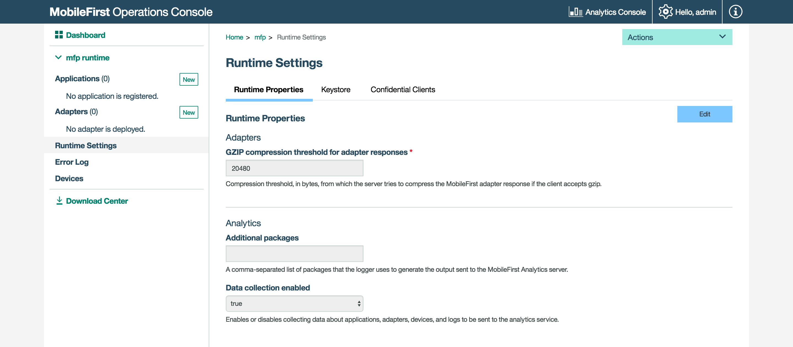
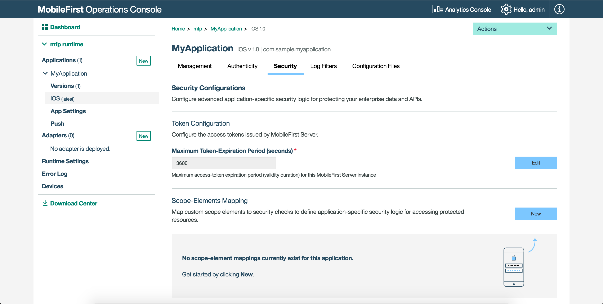

<!-- NLS_CHARSET=UTF-8 -->
## Présentation
{: #overview }
La console {{ site.data.keys.mf_console_full }} est une interface utilisateur basée sur le Web qui active des flux de travaux simplifiés pour le développeur et pour l'administrateur afin de créer, surveiller, sécuriser et administrer des adaptateurs et des applications.

#### En tant que développeur
{: #as-a-developer }
* Développer des applications pour un environnement et les enregistrer sur {{ site.data.keys.mf_server }}.
* Voir toutes vos applications et tous vos adaptateurs déployés en un seul coup d'oeil. Voir le tableau de bord.
* Gérer et configurer des applications enregistrées, notamment la mise à jour directe, la désactivation à distance et les paramètres de sécurité pour l'authenticité de l'application et l'authentification d'utilisateur.
* Configurer la notification push en déployant des certificats, en créant des étiquettes de notification et en envoyant des notifications.
* Créer et déployer des adaptateurs.
* Télécharger des exemples.

#### En tant qu'administrateur informatique
{: #as-an-it-administrator }
* Surveiller divers services.
* Rechercher des appareils qui accèdent à {{ site.data.keys.mf_server }} et gérer leurs droits d'accès.
* Mettre à jour des configurations d'adaptateur de façon dynamique.
* Ajuster les configurations de consignateur client via des profils de journal.
* Effectuer le suivi de l'usage des licences d'utilisation du produit.

#### Accéder à
{: #jump-to }
* [Accès à la console](#accessing-the-console)
* [Navigation dans la console](#navigating-the-console)

## Accès à la console
{: #accessing-the-console }
Vous pouvez accéder à la console {{ site.data.keys.mf_console }} en procédant comme suit :

### A partir d'un serveur {{ site.data.keys.mf_server }} installé localement
{: #from-a-locally-installed-mobilefirst-server }
#### Navigateur de bureau
{: #desktop-browser }
A partir du navigateur de votre choix, chargez l'URL [http://localhost:9080/mfpconsole](http://localhost:9080/mfpconsole). Le nom d'utilisateur et le mot de passe sont *admin/admin*.

#### Ligne de commande
{: #command-line }
A partir d'une fenêtre de **ligne de commande**, avec l'interface de ligne de commande {{ site.data.keys.mf_cli }} installée, exécutez la commande suivante : `mfpdev server console`.

### A partir d'un serveur {{ site.data.keys.mf_server }} installé à distance
{: #from-a-remotely-installed-mobilefirst-server }
#### Navigateur de bureau
{: #desktop-browser-remote }
A partir du navigateur de votre choix, chargez l'URL `http://the-server-host:server-port-number/mfpconsole`.  
Le serveur hôte peut être soit un serveur appartenant à un client, soit le service IBM Cloud, IBM [Mobile Foundation](../../../bluemix/).

#### Ligne de commande
{: #command-line-remote }
A partir d'une fenêtre de **ligne de commande**, avec l'interface de ligne de commande {{ site.data.keys.mf_cli }} installée,

1. Ajoutez une définition de serveur distant :

    *Mode interactif*  
    Exécutez la commande `mfpdev server add` et suivez les instructions affichées à l'écran.

    *Mode direct*  
    Exécutez la commande avec la syntaxe suivante : `mfpdev server add [server-name] --URL [remote-server-URL] --login [admin-username] --password [admin-password] --contextroot [admin-service-name]`. Exemple :

   ```bash
   mfpdev server add MyRemoteServer http://my-remote-host:9080/ --login TheAdmin --password ThePassword --contextroot mfpadmin
   ```

2. Exécutez la commande `mfpdev server console MyRemoteServer`.

> Pour plus d'informations sur les différentes commandes d'interface de ligne de commande, voir le tutoriel [Using CLI to manage {{ site.data.keys.product_adj }} artifacts](../../../application-development/using-mobilefirst-cli-to-manage-mobilefirst-artifacts/).

## Navigation dans la console
{: #navigating-the-console }
### Tableau de bord
{: #dashboard }
Le tableau de bord fournit une vue générale des projets déployés.


#### Liste déroulante des actions
{: #actions-dropdown }
La liste déroulante fournit un accès rapide aux différentes actions de la console.


### Paramètres d'exécution
{: #runtime-settings }
Editez les propriétés d'exécution, les variables de sécurité globales, le magasin de clés du serveur et les clients confidentiels.



### Journal des erreurs
{: #error-log }
Le journal des erreurs répertorie les opérations de gestion ayant échoué qui ont été lancées à partir de la console {{ site.data.keys.mf_console }} ou de la ligne de commande, dans l'environnement d'exécution en cours. Consultez le journal pour voir l'impact des échecs sur les serveurs.

> Pour plus d'informations, voir dans la documentation utilisateur la rubrique sur le journal des erreurs liées aux opérations exécutées sur des environnements d'exécution.


### Appareils
{: #devices }
Les administrateurs peuvent rechercher des appareils qui accèdent au serveur {{ site.data.keys.mf_server }} et peuvent gérer leurs droits d'accès.  
Les appareils peuvent être recherchés à l'aide d'un ID utilisateur ou d'un nom explicite. L'ID utilisateur est l'identificateur qui a été utilisé pour la connexion.  
Un nom explicite est un nom qui est associé à l'appareil afin de le distinguer des autres appareils qui partagent l'ID utilisateur.

> Pour plus d'informations, voir la rubrique sur la gestion des accès d'appareil dans la documentation utilisateur.


### Applications
{: #applications }
#### Enregistrement d'applications
{: #registering-applications }
Fournissez des valeurs d'application de base et téléchargez un code de démarrage.


#### Gestion d'applications
{: #managing-applications }
Gérez et configurez des applications enregistrées en utilisant la [mise à jour directe](../../../application-development/direct-update/), la désactivation à distance, l'[authenticité d'application](../../../authentication-and-security/application-authenticity/) et les [paramètres d'authentification et de sécurité](../../../authentication-and-security/).


#### Authentification et sécurité
{: #authentication-and-security }
Configurez des paramètres de sécurité d'application, tels que la valeur d'expiration de jeton par défaut, mappez des éléments de portée à des contrôles de sécurité, définissez des portées d'application obligatoires et configurez des options de contrôle de sécurité.

> [En savoir plus](../../../authentication-and-security/) sur l'infrastructure de sécurité {{ site.data.keys.product_adj }}.



#### Paramètres d'application
{: #application-settings }
Configurez le nom d'affichage de l'application dans la console, ainsi que le type d'application et l'octroi de licence.


#### Notifications
{: #notifications }
Configurez des [notifications push](../../../notifications/) et les paramètres connexes, par exemple des certificats et des détails GCM, définissez des étiquettes et envoyez des notifications à des appareils.


### Adaptateurs
{: #adapters }
#### Création d'adaptateurs
{: #creating-adapters }
[Enregistrez un adaptateur](../../../adapters/), téléchargez un code de démarrage et effectuez une mise à jour à la volée d'un adaptateur en mettant à jour ses propriétés sans avoir à régénérer et redéployer l'artefact de l'adaptateur.


#### Propriétés d'adaptateur
{: #adapter-properties }
Une fois qu'un adaptateur est déployé, il peut être configuré dans la console.


### Journaux client
{: #client-logs }
Les administrateurs peuvent utiliser des profils de journal pour ajuster des configurations de consignateur client, telles que des filtres de niveau de journal et de package de journal, pour n'importe quelle combinaison de système d'exploitation, version de système d'exploitation, application, version d'application et modèle d'appareil.

Lorsqu'un administrateur crée un profil de configuration, la configuration de journal est concaténée avec des appels API de réponses, telles que `WLResourceRequest`, et est appliquée automatiquement.

> Pour plus d'informations, voir la rubrique sur la configuration de capture de journal côté client dans la documentation utilisateur.


### Suivi des licences
{: #license-tracking }
Accessible à partir des boutons Paramètres situés dans la partie supérieure de l'écran.

Les terme de licence varient en fonction de l'édition (Enterprise ou Consumer) de {{ site.data.keys.product }} utilisée.   Le suivi des licences est activé par défaut. Il assure le suivi des indicateurs relatifs aux règles de licence, tels qu'Appareil client actif et Applications installées. Ces informations permettent de déterminer si l'utilisation actuelle de {{ site.data.keys.product }} respecte les niveaux d'autorisation de licence, et peuvent empêcher de potentielles violations de licence.

En assurant le suivi de l'utilisation des appareils client et en déterminant si les appareils sont actifs, les administrateurs peuvent déclasser des appareils qui ne doivent plus accéder au service. Cette situation peut se produire si un employé a quitté l'entreprise, par exemple.

> Pour plus d'informations, voir la rubrique sur le suivi des licences dans la documentation utilisateur.


### Téléchargements
{: #downloads }
Lorsque la connectivité Internet est indisponible, vous pouvez télécharger un instantané des différents artefacts de développement de {{ site.data.keys.product }} à partir du centre de téléchargement dans la console {{ site.data.keys.mf_console }}.


