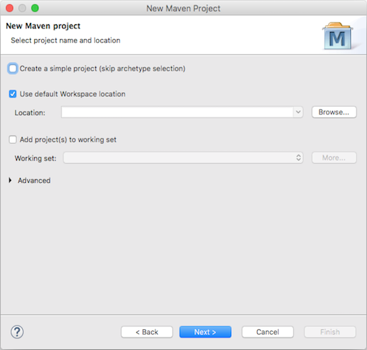

<!-- NLS_CHARSET=UTF-8 -->
## 概説
{: #overview }

前の[アダプター・チュートリアル](../)で説明したように、アダプターは、Maven を直接使用するか、{{ site.data.keys.mf_cli }} を使用して作成する Maven プロジェクトです。 作成後、アダプター・コードを任意の IDE で編集でき、後で Maven または {{ site.data.keys.mf_cli }} を使用してビルドおよびデプロイすることができます。 開発者は、サポートされる IDE (Eclipse や IntelliJ など) の内部で作成、開発、ビルド、デプロイのすべてを行うようにすることも選択できます。 このチュートリアルでは、アダプターを Eclipse IDE から作成してビルドします。

> IntelliJ の使用方法の説明については、ブログ投稿の [IntelliJ を使用した MobileFirst Java アダプターの開発]({{site.baseurl}}/blog/2016/03/31/using-intellij-to-develop-adapters)を参照してください。

**前提条件:**

* 最初に[アダプター・チュートリアル](../)を読み、アダプターについての知識を得てください。
* Eclipse への Maven の組み込み。 Eclipse Kepler (v4.3) からは、Maven サポートが Eclipse に組み込まれています。 ご使用の Eclipse インスタンスで Maven がサポートされていない場合は、[m2e の説明に従って](http://www.eclipse.org/m2e/) Maven サポートを追加してください。

#### ジャンプ先
{: #jump-to }

* [新規のアダプター Maven プロジェクトの作成](#creating-a-new-adapter-maven-project)
* [既存のアダプター Maven プロジェクトのインポート](#importing-an-existing-adapter-maven-project)
* [アダプター Maven プロジェクトのビルドとデプロイ](#building-and-deploying-an-adapter-maven-project)
* [発展的なチュートリアル](#further-reading)

## アダプター Maven プロジェクトの作成またはインポート
{: #create-or-import-an-adapter-maven-project }

以下の手順に従って、新規のアダプター Maven プロジェクトを作成するか、既存のアダプター Maven プロジェクトをインポートします。

### 新規のアダプター Maven プロジェクトの作成
{: #creating-a-new-adapter-maven-project }

1. 新規のアダプター Maven プロジェクトを作成するには、**「ファイル」 → 「新規」 → 「その他...」 → 「Maven」 → 「Maven プロジェクト」**を選択し、**「次へ」**をクリックします。

    

2. プロジェクトの名前とその場所を指定します。  
    - 単純なプロジェクトを作成するオプションのチェック・マークが**オフ**になっていることを確認して、**「次へ」**をクリックします。

    

3. アダプターのアーキタイプを選択または追加します。
    - [アーキタイプをローカルにインストールしてあり](../creating-adapters/#install-maven)、それらのアーキタイプがアーキタイプのリストに表示されていない場合は、**「構成」 → 「ローカル・カタログの追加」 → 「ホーム・ディレクトリーの  /.m2/repository/archetype-catalog.xml を参照」**を選択します。
    - **「アーキタイプの追加」**をクリックし、以下の詳細を指定します。
        - **アーキタイプ・グループ ID**: `com.ibm.mfp`
        - **アーキタイプ成果物 ID**: `adapter-maven-archetype-java`、`adapter-maven-archetype-http`、または `adapter-maven-archetype-sql`
        - **アーキタイプ・バージョン**: 使用可能な最新バージョンは [Maven Central](http://search.maven.org/#search%7Cga%7C1%7Ccom.ibm.mfp) で検索できます。

    

4. Maven プロジェクト・パラメーターを指定します。  
    - 必須の**「グループ ID」**、**「成果物 ID」**、 **「バージョン」**、および**「パッケージ」**の各パラメーターを指定して、**「終了」**をクリックします。

    

### 既存のアダプター Maven プロジェクトのインポート
{: #importing-an-existing-adapter-maven-project }

アダプター Maven プロジェクトをインポートするには、**「ファイル」 → 「インポート...」 → 「Maven」 → 「既存の Maven プロジェクト」**を選択します。

## アダプター Maven プロジェクトのビルドとデプロイ
{: #building-and-deploying-an-adapter-maven-project }

アダプター・プロジェクトのビルドとデプロイは、Maven コマンド・ライン・コマンド、{{ site.data.keys.mf_cli }}、または Eclipse を使用して行うことができます。  
[アダプターのビルドとデプロイの方法について説明します。](../creating-adapters/#build-and-deploy-adapters).

>  **ヒント:** Eclipse を拡張してデプロイメント・ステップを容易にすることもできます。それには、プラグインを使用して**コマンド・ライン**・ウィンドウを統合し、一貫性のある開発環境を作成します。 このウィンドウから、Maven コマンドまたは {{ site.data.keys.mf_cli }} コマンドを実行できます。

### アダプターのビルド
{: #building-an-adapter }

アダプターをビルドするには、アダプター・フォルダーを右クリックし、**「次を実行」 → 「Maven のインストール」**を選択します。  

### アダプターのデプロイ
{: #deploying-an-adapter }

アダプターをデプロイするには、最初に deploy Maven コマンドを追加します。

1. **「実行」 → 「構成の実行...」**を選択し、**「Maven のビルド」**を右クリックして、**「新規」**を選択します。
2. 「名前:」に「Maven deploy」を指定します。
2. 「目標:」として「adapter:deploy」を設定します。
3. **「適用」**をクリックし、続いて**「実行」**をクリックして、初期デプロイを実行します。

ここで、アダプター・フォルダーを右クリックして、**「次を実行」 → 「Maven のデプロイ」**を選択します。

### アダプターのビルドとデプロイ
{: #building-and-deploying-an-adapter }

「build」と「deploy」の Maven 目標を組み合わせて、単一の「build and deploy」目標である「clean install adapter:deploy」にすることもできます。

## 発展的なチュートリアル
{: #further-reading }

アダプターの Java コードのデバッグ方法については、[アダプターのテストおよびデバッグ](../testing-and-debugging-adapters)チュートリアルを参照してください。
