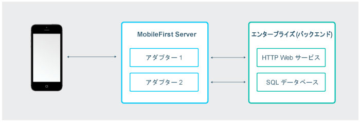
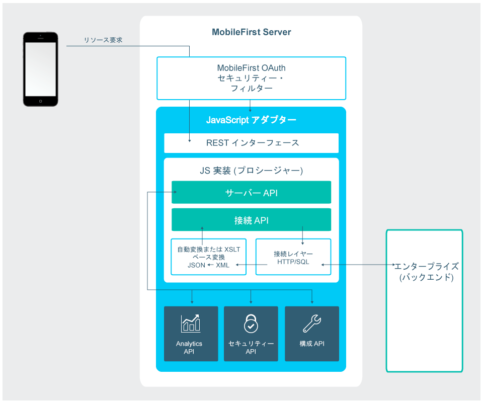
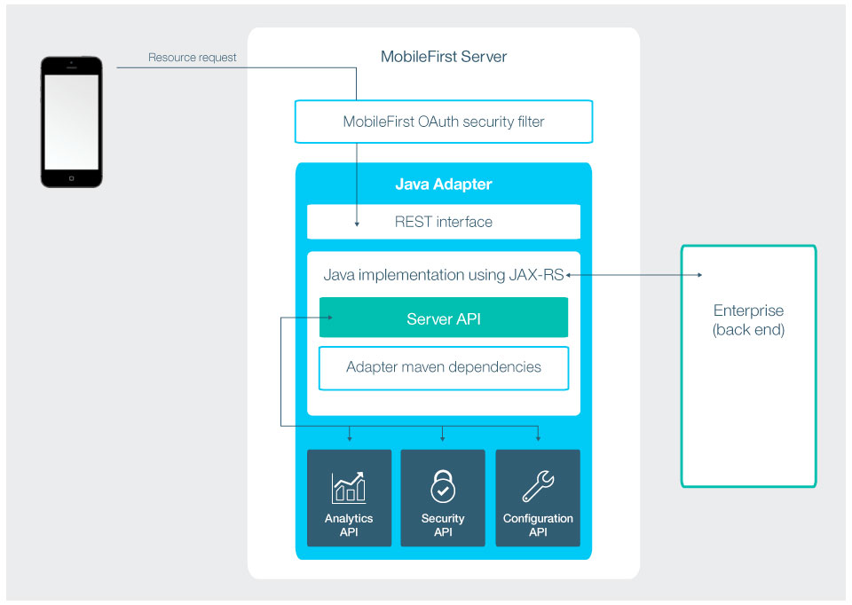

<!-- NLS_CHARSET=UTF-8 -->
## 概説
{: #overview }
アダプターは、Java または JavaScript で実装されたサーバー・サイド・コードが含まれている Maven プロジェクトです。  
アダプターを使用して、すべての必要なサーバー・サイド・ロジックを実行し、バックエンド・システムから情報を取り出し、クライアント・アプリケーションおよびクラウド・サービスに転送します。 

各アダプターには分離された専用のサンドボックスがあります。このサンドボックスは、他のアダプターのサンドボックスを認識することも、そこに割り込んだりすることもなく実行されます。ただし、アダプターは、「[アダプター・マッシュアップ](advanced-adapter-usage-mashup)」を可能にする API を呼び出すことによって、相互に通信することができます。

アダプター・コードが必要とするサード・パーティー・ライブラリーを組み込むことも可能です。そうするには、対象のライブラリーを Maven 依存関係としてアダプターの **pom.xml** ファイル内で定義します。詳しくは、[Java アダプターおよび JavaScript アダプターの作成](creating-adapters)チュートリアルの[依存関係](creating-adapters/#dependencies)セクションを参照してください。

アダプターは、以下の DevOps ニーズもサポートします。

* アダプターを「ホット・デプロイ」することができます。すなわち、アダプターを実行時にデプロイ、アンデプロイ、および再デプロイすることができます。この機能によって、サーバー・サイド開発プロセスの柔軟性が非常に高くなります。
* アダプターには、管理担当者がアダプターを再デプロイせずに構成できるユーザー定義プロパティーを設定できます。
この機能により、開発、テスト、実稼働などのさまざまな環境に応じてアダプター動作をカスタマイズできます。

Java アダプターおよび JavaScript アダプターの概説を続けてお読みください。その後、サイドバー・ナビゲーションのチュートリアルに従って、Java アダプターおよび JavaScript アダプターの作成、ビルド、更新、開発、テスト、およびデプロイの方法や、アダプター開発のための IDE の使用方法、サーバー・サイド・ログの収集方法を学習し、さらに、アダプターのマッシュアップや Cloudant の統合などの上級者向けトピックへと進みます。

### アダプター使用の利点
{: #benefits-of-using-adapters }

#### 汎用性

{: #universality }

* アダプターは、複数の統合テクノロジーおよびバックエンド情報システムをサポートしています。

#### 読み取り専用機能およびトランザクション機能

{: #read-only-and-transactional-capabilities }

* アダプターは、バックエンド・システムに対する読み取り専用アクセス・モードとトランザクション・アクセス・モードをサポートしています。

#### 開発の迅速化

{: #fast-development }

* アダプターは、単純な XML 構文を使用し、JavaScript API または Java API で簡単に構成できます。

#### セキュリティー
{: #security }

* アダプターは、柔軟性の高い認証機能を使用してバックエンド・システムとの接続を確立します。
* アダプターは、接続ユーザーの ID に対する制御を提供します。

#### 透過性

{: #transparency }

* バックエンド・アプリケーションから取得したデータは、アダプターのタイプに関係なく、統一された方法で公開されます。  

### Java アダプター固有の利点
{: #benefits-specific-to-java-adapters }

* URL 構造、コンテンツ・タイプ、要求ヘッダー、応答ヘッダー、コンテンツ、およびエンコードを完全に制御できます。
* Postman などのサード・パーティー・ツールを使用してアダプターをテストできます。
* 実行中の {{site.data.keys.mf_server }} インスタンスへのデプロイメントが迅速かつ容易で、パフォーマンスへの影響もダウン時間も生じません。
* ソース・コード内の簡潔なアノテーションを使用して、追加のカスタマイズを必要とせずに {{site.data.keys.product }} セキュリティー・モデルとのセキュリティー統合が可能です。

## JavaScript アダプター
{: #javascript-adapters }

JavaScript アダプターは、HTTP および SQL のバックエンドと通信するためのテンプレートを提供します。これらのテンプレートには、プロシージャーと呼ばれるサービスのセットが含まれています。モバイル・アプリケーションは、AJAX 要求を発行することでこれらのプロシージャーを呼び出すことができます。プロシージャーはバックエンド・アプリケーションから情報を取得し、そのアプリケーションにデータを返します。REST インターフェースを使用すると、{{site.data.keys.product }} で提供される [OAuth 2.0 ベースのセキュリティー・フレームワーク](../authentication-and-security)を利用することができます。

* データのフォーマットが JSON の場合、{{site.data.keys.mf_server }} はデータを元の状態のままで保持します。それ以外のフォーマットの場合は、{{site.data.keys.mf_server }} は自動的にデータを JSON に変換します。  
* あるいは、データを JSON に変換するための XSL Transformation を提供することもできます。この場合、バックエンドから返されるコンテンツ・タイプは XML でなければなりません。その場合、XSLT を使用して、要求に基づいてデータをフィルターに掛けることができます。
* HTTP アダプターを使用して、GET または POST HTTP 要求を送信したり、応答ヘッダーおよび本体からデータを取得したりすることができます。HTTP アダプターは、RESTful および SOAP ベースのサービスで作動し、RSS フィードなどの構造化された HTTP ソースを読み取ることができます。
* SQL アダプターでは、任意の SQL データ・ソースと通信できます。
プレーン SQL 照会またはストアード・プロシージャーを使用できます。

> * [アダプターの作成](creating-adapters)チュートリアルでアダプターの作成方法について学習する
> * [JavaScript アダプター](javascript-adapters)についてもっとよく知る

## Java アダプター
{: #java-adapters }

Java アダプターは [JAX-RS 2.0 仕様](https://jax-rs-spec.java.net/nonav/2.0-rev-a/apidocs/index.html)に基づいています。したがって、Java で書かれ、完全な REST API をクライアントに公開します。Java アダプターでは、返されるコンテンツとその形式、および各リソースの URL 構造を定義するのは開発者の責任です。唯一の例外は、要求を送信するクライアントが GZip をサポートしている場合です。この場合、Java アダプターの返されるコンテンツのエンコードは GZip で圧縮されます。返されるコンテンツに対するすべての操作は、開発者が実行し、所有します。

下の図は、モバイル・デバイスが、REST エンドポイントからどのように任意の Java アダプターにアクセスできるかを示しています。REST インターフェースは、{{site.data.keys.product }} OAuth セキュリティー・フィルターによって保護されています。すなわち、クライアントは、アダプター・リソースにアクセスするためにアクセス・トークンを取得する必要があります。アダプターの各リソースには独自の URL があるため、任意のファイアウォールを使用して {{site.data.keys.product }} エンドポイントを保護することが可能です。REST インターフェースは、Java コード (JAX-RS サービス) を呼び出して、着信要求を処理します。Java コードは、Java {{site.data.keys.mf_server }} APIを使用して、サーバーで操作を実行できます。さらに、Java コードは、エンタープライズ・システムに接続して、データのフェッチ、データの更新、およびエンタープライズ・システムが公開するその他の任意の操作を実行することができます。

> * [アダプターの作成](creating-adapters)チュートリアルでアダプターの作成方法について学習する
> * [Java アダプター](java-adapters)についてもっとよく知る

## 次に使用するチュートリアル
{: #tutorials-to-follow-next }
