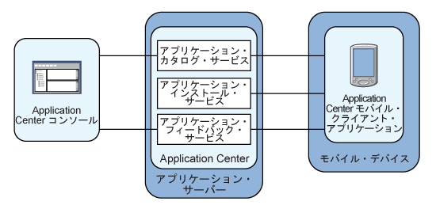

<!-- NLS_CHARSET=UTF-8 -->
## 概説
{: #overview }
{{site.data.keys.mf_app_center_full }} について説明します。具体的には、Application Center の目的、さまざまなコンポーネントと機能、およびコンソールとクライアントの使用法について説明します。

現在、モバイル・デバイスの売れ行きはパーソナル・コンピューターを上回っています。その結果、モバイル・アプリケーションがビジネスに不可欠な要素となっています。  
Application Center は、組織内におけるモバイル・アプリケーションの共有をより容易にするツールです。

Application Center をエンタープライズ・アプリケーション・ストアとして使用することができます。Application Center を使用して、一部のモバイル・アプリケーションのターゲットを社内の特定のユーザー・グループに絞ることができます。

また、開発チームは、アプリケーションの開発フェーズで Application Center を使用して、アプリケーションを社内のテスター、設計者、または幹部と共有することができます。このようなシナリオでは、これにより、開発プロセスに携わるすべての人のコラボレーションが容易になります。

> [Application Center チュートリアル](app-center-tutorial)を検討することもできます。

#### ジャンプ先
{: #jump-to }
* [Application Center の概念](#concept-of-application-center)
* [特定のプラットフォーム要件](#specific-platform-requirements)
* [アーキテクチャーの概要](#general-architecture)
* [準備情報](#preliminary-information)
* [次のステップ](#whats-next)

## Application Center の概念
{: #concept-of-application-center }
Application Center はエンタープライズ・アプリケーションとして使用でき、社内のさまざまなチームのメンバー間で情報を共有するための手段となります。

Application Center の概念は、その目的が社内のプライベート使用のみであることを除けば、Apple の公開 App Store や Android マーケットの概念と同様です。

Application Center を使用することにより、同じ企業や組織に属するユーザーは、モバイル・アプリケーションのリポジトリーとして機能する単一の場所から携帯電話やタブレットにアプリケーションをダウンロードします。

Application Center の対象は、デバイス自体にインストールされるモバイル・アプリケーションです。それらのアプリケーションとして可能なのは、デバイス SDK を使用して作成されるネイティブ・アプリケーションや、ネイティブ・コンテンツと Web コンテンツが混在するハイブリッド・アプリケーションです。
モバイル Web アプリケーションは Application Center の対象ではありません。そのようなアプリケーションは、Web サイトなどの URL を通じてモバイル・デバイスの Web ブラウザーに配布されます。

現行バージョンでは、Application Center は、Google Android プラットフォーム、Apple iOS プラットフォーム、Windows Phone 8 プラットフォーム、および Windows 8 プラットフォームを対象に作成されたアプリケーションをサポートします。

Windows Phone の場合、現在、Windows Phone アプリケーション・パッケージ (.xap) ファイル・フォーマットのみサポートされており、アプリ・パッケージ (.appx) ファイル・フォーマット (ユニバーサル・アプリ・フォーマット) はサポートされていません。Windows ストア (デスクトップ・アプリケーション) の場合は、アプリ・パッケージ (.appx) ファイル・フォーマットがサポートされます。

Windows Phone 7 および Windows RT、および BlackBerry OS は、現行バージョンの Application Center ではサポートされません。

Application Center は、モバイル・アプリケーションを管理し、Android、iOS、Windows Phone 8、および Windows 8 のあらゆる種類のアプリケーション ({{site.data.keys.product }} 上に作成されるアプリケーションを含む) をサポートします。

Application Center をアプリケーションの開発プロセスの一環として使用することができます。Application Center の典型的なシナリオはモバイル・アプリケーションを作成するチームです。開発チームは新しいバージョンの Android、iOS、Windows Phone、または Windows 8 のアプリケーションを作成します。開発チームは、この新しいバージョンの検討とテストを拡張チームにお願いします。
開発者は Application Center コンソールを使用して、この新しいアプリケーション・バージョンを Application Center にアップロードします。開発者は、このプロセスの一環として、アプリケーション・バージョンの説明を入力することができます。
例えば、この説明では、開発チームが旧バージョン対して追加したり修正したりした部分に言及することがあります。
これで、チームの他のメンバーがアプリケーションの新しいバージョンを使用できるようになります。


別の担当者、例えばベータ版テスターは、Application Center インストーラー・アプリケーション (モバイル・クライアント) を起動して、使用可能なアプリケーションのリストからモバイル・アプリケーションのこの新しいバージョンを見つけ、それを自分のモバイル・デバイスにインストールすることができます。新バージョンのテストが終わったら、ベータ版テスターはアプリケーションを評価して、フィードバックを送信することができます。
開発者はこのフィードバックを Application Center コンソールから見ることができます。

Application Center は社内やグループ内でモバイル・アプリケーションを共有する便利な方法であり、またチーム・メンバー間で情報を共有する手段でもあります。

## 特定のプラットフォーム要件
{: #specific-platform-requirements }
オペレーティング・システムごとに、該当するモバイル・デバイスに対してアプリケーションのデプロイメント、インストール、または使用に関する特定の要件があります。

### Android
{: #android }
不明なソースからのインストール用にモバイル・デバイスを構成する必要があります。
対応する切り替えが Android 設定にあります。
詳しくは、[『その他の配布方法』](http://developer.android.com/distribute/open.html#unknown-sources)を参照してください。  

Application Center では、アプリケーションに内部バージョン番号と商用バージョン番号があります。内部バージョン番号は、より新しいバージョンがどれであるかを識別するために使用されます。これに対して、商用バージョンは情報提供用の表示ストリングとしてのみ使用されます。Android アプリケーションの場合、内部バージョンは、アプリケーション・マニフェストからの android:[versionCode](http://developer.android.com/guide/topics/manifest/manifest-element.html#vcode) で、整数である必要があります。

### iOS
{: #ios }
Application Center を使用して管理されるすべてのアプリケーションを、「Ad Hoc 配布」用にパッケージ化する必要があります。iOS デベロッパー・アカウントを使用すれば、アプリケーションを最大 100 台の iOS デバイスと共有することができます。
iOS エンタープライズ・アカウントを使用すれば、社内アプリケーションを台数に制限なく iOS デバイスと共有することができます。
詳しくは、[iOS Developer Program](https://developer.apple.com/programs/ios/distribute.html) および [iOS Enterprise Program](https://developer.apple.com/programs/ios/enterprise/) を参照してください。
Application Center では、アプリケーションに内部バージョン番号と商用バージョン番号があります。内部バージョン番号は、より新しいバージョンがどれであるかを識別するために使用されます。これに対して、商用バージョンは情報提供用の表示ストリングとしてのみ使用されます。iOS アプリケーションの場合、内部バージョンは、アプリケーション・マニフェスト **Info.plist** からの CFBundleVersion です。バージョン番号の形式は `a` または `a.b` または `a.b.c` でなければなりません。ここで、`a`、`b`、`c` は負でない整数であり、`a` は `0` ではありません。

### Windows Phone 8
{: #windows-phone-8 }
アプリケーションは、Windows Store からではなく、(Microsoft の資料で **Company Hub** と呼ばれるものとして機能する) Application Center からインストールされます。詳しくは、[Windows Phone 用の自社アプリの配布](http://msdn.microsoft.com/en-us/library/windowsphone/develop/jj206943%28v=vs.105%29.aspx)を参照してください。Company Hub を使用するために、Windows Phone は、企業アカウントを Microsoft に登録し、企業の証明書を使用して、Application Center クライアントを含むすべてのアプリケーションに署名することをユーザーに要求します。Application Center を使用して管理できるのは、署名済みのアプリケーションのみになります。

企業アカウントと関連付けられたアプリケーション登録トークンを使用して、すべてのモバイル・デバイスを登録する必要があります。

Application Center は、アプリケーション登録トークンを配布するための機能を通じてデバイスの登録を支援します。詳しくは、[『Windows 8 Universal のアプリケーション登録トークン』](appcenter-console/#application-enrollment-tokens-in-windows-8-universal)を参照してください。

Application Center は、Microsoft Windows Phone 8.0 および Microsoft Windows Phone 8.1 用の Windows Phone アプリケーション・パッケージ (.xap) としてのアプリケーションの配布をサポートします。Microsoft Windows Phone 8.1 では、 Microsoft は、Windows Phone 用のアプリ・パッケージ (.appx) ファイルという新しいユニバーサル・フォーマットを導入しました。現在、Application Center は Microsoft Windows Phone 8.1 用のアプリ・パッケージ (.appx) ファイルの配布はサポートしておらず、Windows Phone アプリケーション・パッケージ (.xap) ファイルのみに制限しています。

Application Center では、アプリケーションにはバージョン番号が 1 つしかありません。このバージョン番号は、より新しいバージョンがどれであるかを識別するために使用されます。Windows Phone 8 アプリケーションの場合、バージョン番号は **WMAppManifest.xml** ファイルの **Version** フィールドに入っています。このバージョン番号の形式は `a.b.c.d` でなければなりません。ここで、`a`、`b`、`c`、`d` は負でない整数です。

### Windows 8
{: #windows-8 }
Application Center モバイル・クライアントは、通常のデスクトップ用実行可能ファイル (.exe) として提供されます。このファイルを使用して、.appx ファイルとしてパッケージされている Windows Store アプリケーションをデバイスにインストールすることができます。Windows Store を使用せずに、タイプ appx のファイルをデバイスにインストールすることは、アプリケーションのサイドローディングと呼ばれます。アプリケーションをサイドローディングするには、[アプリケーションのサイドローディングの準備 (Prepare to Sideload Apps)](http://technet.microsoft.com/fr-fr/library/dn613842.aspx) の前提条件に従う必要があります。Windows 8.1 アップデートによって、サイドローディングの前提条件が単純化されています。詳しくは、[『Sideloading store apps to Windows 8.1 devices』](http://blogs.msdn.com/b/micham/archive/2014/05/30/sideloading-store-apps-to-windows-8-1-devices.aspx)を参照してください。

タイプ .exe のファイルは、ARM ベースのタブレットでは実行できません。そのため、Application Center では、Windows RT はサポートされていません。Windows 8 および  Windows 8.1 のみがサポートされています。

デバイス・ユーザーが Application Center クライアントを実行するには、そのデバイスでの管理者権限が必要です。

Application Center は、モバイル・クライアントを配布するための定義済みの方法を提供していません。

Application Center では、アプリケーションにはバージョン番号が 1 つしかありません。このバージョン番号は、より新しいバージョンがどれであるかを識別するために使用されます。Windows 8 アプリケーションの場合、バージョン番号は AppxManifest.xml ファイルの Version フィールドに入っています。このバージョン番号の形式は、a.b.c.d でなければなりません。ここで、a、b、c、d は負でない整数です。

## アーキテクチャーの概要
{: #general-architecture }
Application Center の主要構成要素は、サーバー・サイド・コンポーネント、リポジトリー、管理コンソール、およびモバイル・クライアント・アプリケーションです。

### サーバー・サイド・コンポーネント

{: #server-side-component }
サーバー・サイド・コンポーネントは、IBM WebSphere や Apache Tomcat などの Web アプリケーション・サーバーにデプロイしなければならない Java™ Enterprise アプリケーションです。

サーバー・サイド・コンポーネントは管理コンソールとモバイル・アプリケーションで構成されます。
このモバイル・アプリケーションは、クライアント・サイド・コンポーネントが使用できるモバイル・アプリケーションをインストールします。


Web コンソールとインストーラー・アプリケーションは、REST サービスを通じてサーバー・コンポーネントと通信します。


いくつかのサービスが Application Center サーバー・サイド・コンポーネントを構成しています。例えば、使用可能なアプリケーションをリストするサービス、アプリケーション・バイナリー・ファイルをモバイル・デバイスに配布するサービス、フィードバックと評価を登録するサービスなどです。

### リポジトリー

{: #repository }
どのアプリケーションがどのデバイスにインストールされているかなどの情報、アプリケーションに関するフィードバック、およびモバイル・アプリケーション・バイナリー・ファイルを保管するデータベース。
特定の Web アプリケーション・サーバーおよびサポートされるデータベースが組み込まれるように Application Center を構成したときに、Application Center アプリケーションがこのデータベースに関連付けられます。

### 管理コンソール

{: #administration-console }
これは Web コンソールです。管理者はこれを使用して、アプリケーション、アプリケーションをインストールするユーザー・アクセス権限、モバイル・アプリケーションに関するユーザー・フィードバック、およびデバイスにインストールされているアプリケーションの詳細を管理することができます。
[Application Center コンソール](appcenter-console)を参照してください。

### モバイル・クライアント・アプリケーション

{: #mobile-client-application }
モバイル・クライアントを使用して、モバイル・デバイスにアプリケーションをインストールしたり、アプリケーションに関するフィードバックをサーバーに送信したりします。
[モバイル・クライアント](mobile-client)を参照してください。

次の図はアーキテクチャーの概要を示しています。




Application Center コンソールから、以下のアクションを実行できます。

* バージョンの異なるモバイル・アプリケーションをアップロードする。
* 不要なアプリケーションを削除する。
* アプリケーションへのアクセスを制御する。各アプリケーションは、そのアプリケーションをインストールできる個人のリストに関連付けられます。
* モバイル・ユーザーが送信した、アプリケーションに関するフィードバックを表示する。
* デバイスにインストールされているアプリケーションに関する情報を取得する。
* アプリケーションを非アクティブにして、それがダウンロードのために使用可能なアプリケーションのリストに表示されないようにする。


モバイル・クライアントから、以下のアクションを実行できます。

* 使用可能なモバイル・アプリケーションをリストする。
* 新しいアプリケーションをデバイスにインストールする。
* アプリケーションに関するフィードバックを送信する。


Application Center は、Android、iOS、Windows Phone 8、および Windows 8 デバイス用のアプリケーションをサポートします。したがって、モバイル・クライアントには Android、iOS、Windows Phone 8、および Windows 8 用の個別のバージョンがあります。

Android、iOS、および Windows Phone 8 のモバイル・クライアントは、{{site.data.keys.product }} 上に構築されます。製品をインストールした後の、さまざまな Java アプリケーション・サーバーでの Application Center のサーバー・サイド・コンポーネントの構成方法、および Application Centerクライアント用の {{site.data.keys.product_adj }} アプリケーションの構築方法については、[インストール後の Application Center の構成](../installation-configuration/production/appcenter)を参照してください。

## 準備情報
{: #preliminary-information }
Application Center を使用するためには、セキュリティー設定を構成し、{{site.data.keys.product }} がインストールされている Web アプリケーション・サーバーを始動し、Application Center コンソールを開始し、そしてログインする必要があります。

{{site.data.keys.product }} をインストールすると、指定されたアプリケーション・サーバーに Application Center が自動的にインストールされます。

Application Center を WebSphere Application Server Liberty プロファイルにインストールした場合は、サーバーが作成されて **installation-directory/server** に置かれます。

インストールが完了したならば、アプリケーションのセキュリティー設定を構成する必要があります。
[Application Center のユーザー認証の構成](../installation-configuration/production/appcenter#configuring-user-authentication-for-application-center)を参照してください。また、LDAP 認証を使用している場合は、[LDAPによるユーザーの管理](../installation-configuration/production/appcenter/#managing-users-with-ldap)を参照してください。

### 例: Liberty プロファイルでのサーバーおよび Application Center コンソールの始動
{: #example-starting-the-server-and-the-application-center-console-on-liberty-profile}

1. **installation-directory/server/wlp/bin** ディレクトリーにある **server** コマンドを使用して、Liberty サーバーを始動します。

   ```bash
   server start worklightServer
   ```
    
2. サーバーが稼働しているときに、ブラウザーで次のアドレスを入力して Application Center コンソールを開始します。`http://localhost:9080/appcenterconsole/`
3. ログインします。デフォルトでは、Apache Tomcat または WebSphere Application Server Liberty プロファイルで Application Center をインストールするためのユーザーとして、次の 2 つが定義されています。
    * **demo** (パスワード **demo**)
    * **「appcenteradmin」** (パスワード **admin**)


### 詳細情報
{: #for-more-information }
Application Center コンソールを使用するには、[Application Center コンソール](appcenter-console)を参照してください。

以下の各オペレーティング・システムでモバイル・クライアントをインストールして実行するには、以下を参照してください。

* Android: [Android モバイル・デバイスへのクライアントのインストール](mobile-client/#installing-an-application-on-an-android-device)を参照してください。
* iOS オペレーティング・システム: [iOS モバイル・デバイスへのクライアントのインストール](mobile-client/#installing-an-application-on-an-ios-device)を参照してください。
* Windows Phone 8: [Windows 8 Universal へのクライアントのインストール](mobile-client/#installing-the-client-on-a-windows-phone-8-universal-mobile-device)を参照してください。
* Windows 8: Windows 8 用のモバイル・クライアントは、後で配布するために Application Center にデプロイすることを意図していません。[Microsoft Windows 8: プロジェクトのビルド](preparations/#microsoft-windows-8-building-the-project)を参照してください。

## 次のステップ
{: #whats-next }
次のトピックに従って、AppCenter モバイル・クライアントを使用します。インストール済みアプリケーションへの通知の送信、AppCenter コンソール、コマンド・ライン・ツール、モバイル・クライアントについての説明、およびログ・レベルの設定。


