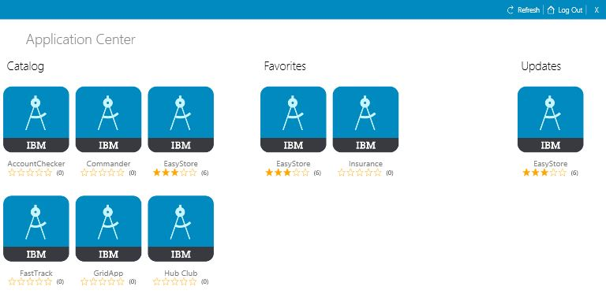
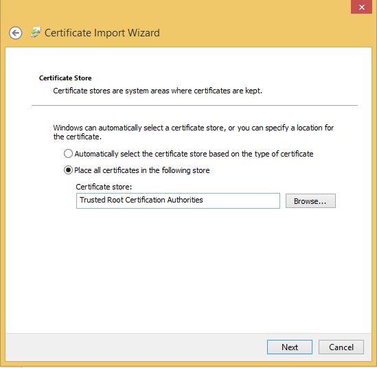
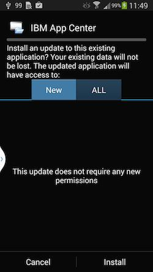

<!-- NLS_CHARSET=UTF-8 -->
## 概説
{: #overview }
Application Center のモバイル・クライアントを使用して、モバイル・デバイスにアプリケーションをインストールすることができます。

Application Center のモバイル・クライアントは、ご使用の Android、iOS、Windows Phone、または Windows デバイスで稼働するアプリケーションです。Application Center の現行バージョンでは Windows Phone 8 のみがサポートされています。モバイル・クライアントを使用して、Application Center にある使用可能なアプリケーションのカタログをリストすることができます。これらのアプリケーションを自分のデバイスにインストールすることができます。モバイル・クライアントは Application Center インストーラーと呼ばれることもあります。自分用のプライベート・アプリケーション・リポジトリーから自分のデバイスにアプリケーションをインストールするには、このアプリケーションが自分のデバイスに入っている必要があります。

### 前提条件
{: #prerequisites }
モバイル・クライアントをダウンロードしてインストールするためには、システム管理者からユーザー名とパスワードを取得する必要があります。ユーザー名とパスワードは、デバイスでモバイル・クライアントを開始するたびに必要になります。Windows Store アプリケーションの場合、ランタイム時にのみモバイル・クライアント用のユーザー名とパスワードが必要になります。セキュリティー上の理由から、これらの資格情報を公表しないようにしてください。これらの資格情報は、Application Center コンソールにログインするときに使用する資格情報と同じものです。

#### ジャンプ先
{: #jump-to }
* [Android モバイル・デバイスへのクライアントのインストール](#installing-the-client-on-an-android-mobile-device)
* [iOS モバイル・デバイスへのクライアントのインストール](#installing-the-client-on-an-ios-mobile-device)
* [Windows Phone 8 Universal モバイル・デバイスへのクライアントのインストール](#installing-the-client-on-a-windows-phone-8-universal-mobile-device)
* [Windows 10 デバイスへの Windows 10 UWP クライアントのインストール](#installing-windows-10-uwp-client-on-windows-10-device)
* [Windows 10 UWP アプリケーションのインストールとレビュー・コメントの追加](#installing-a-windows-10-uwp-application-and-adding-review-comments)
* [「ログイン」ビュー](#the-login-view)
* [Application Center クライアントのビュー](#views-in-the-application-center-client)
* [Android デバイスへのアプリケーションのインストール](#installing-an-application-on-an-android-device)
* [iOS デバイスへのアプリケーションのインストール](#installing-an-application-on-an-ios-device)
* [Windows Phone デバイスへのアプリケーションのインストール](#installing-an-application-on-a-windows-phone-device)
* [Windows デバイスへの Windows Store アプリケーションのインストール](#installing-a-windows-store-application-on-a-windows-device)
* [公開アプリケーション・ストアを介したアプリケーションのインストール](#installing-applications-through-public-app-stores)
* [インストール済みアプリケーションの削除](#removing-an-installed-application)
* [特定のアプリケーション・バージョンの詳細の表示](#showing-details-of-a-specific-application-version)
* [アプリケーションの更新](#updating-an-application)
* [Application Center クライアントの自動アップグレード](#upgrading-the-application-center-client-automatically)
* [インストール済みアプリケーションを元に戻す](#reverting-an-installed-application)
* [お気に入りアプリケーションのマーク付けまたはマーク解除](#marking-or-unmarking-a-favorite-app)
* [インストール済みアプリケーションのレビューの送信](#submitting-a-review-for-an-installed-application)
* [レビューの表示](#viewing-reviews)

## Android モバイル・デバイスへのクライアントのインストール
{: #installing-the-client-on-an-android-mobile-device }
モバイル・クライアント、すなわちインストーラー・フラグでマーク付けされた署名済みアプリケーションを Android モバイル・デバイスにインストールすることができます。これを行うには、ブラウザーでアクセス URL を入力し、資格情報を入力し、必要なステップを完了します。

1. モバイル・デバイスでブラウザーを開始します。
2. 次のアクセス URL をアドレス・テキスト・フィールドに入力します。`http://hostname:portnumber/applicationcenter/installers.html`

    ここで、hostname はサーバーのアドレス、portnumber は Application Center がインストールされるポートの番号です。これらの情報はシステム管理者から取得することができます。 

    また、Application Center は、クライアントをモバイル・デバイスにインストールするための代替 URL を提供します (`http://hostname:portnumber/applicationcenter/inst.html`)。この URL のページは、一部の標準外や古いモバイル Web ブラウザーでよりよく作動します。モバイル・デバイスでページ installers.html が作動しない場合は、inst.html を使用することができます。このページは英語のみで提供され、他言語には翻訳されません。 

    HTTPS の付いたページを開き、自己署名証明書の使用を試みると、古い Android ブラウザーではページを開くことができません。その場合は、非自己署名証明書を使用するか、Android デバイスで別のブラウザー (Firefox、Chrome、Opera など) を使用する必要があります。 Android 4 以降では、Android ブラウザーに SSL 証明書についてのセキュリティー警告が表示されますが、ユーザーが安全でない接続に同意することを確認すると、その Web サイトに進むことができます。

3. ユーザー名とパスワードを入力します。ユーザー名とパスワードの妥当性検査が成功すると、デバイスと互換性のあるインストーラー・アプリケーションのリストがブラウザーに表示されます。 通常は、ただ 1 つのアプリケーションすなわちモバイル・クライアントがこのリストに現れます。 

4. Web サーバーが自己署名 CA 証明書を使用している場合は、少なくとも 1 回、証明書をデバイスにインストールします。Application Center 管理者は、証明書を提供する必要があります。詳しくは、[Application Center テスト環境における自己署名 CA 証明書の管理とインストール](../../installation-configuration/production/appcenter/#managing-and-installing-self-signed-ca-certificates-in-an-application-center-test-environment)を参照してください。
    * **「SSL 証明書」**タブをタップして、証明書を選択します。
    * **「インストール (Install)」**をタップします。デバイスに対し、この操作を行う必要があるのは 1 回のみです。**「設定」→「セキュリティー」→「信頼できる資格情報 (Trusted Credentials)→「デバイス上のユーザー (User on the device)」**で見ると、証明書がインストール済みかどうかを確認できます。このビューには、ユーザーがそのデバイスにインストールした SSL 証明書が表示されます。自己署名 CA 証明書がデバイスにインストールされていない場合、以下のステップでモバイル・クライアントをダウンロードすることは Android オペレーティング・システムにより許可されません。

    モバイル・クライアントが使用可能アプリケーションのリストに現れるためには、Application Center 管理者がモバイル・クライアント・アプリケーションをインストールしなければなりません。管理者は、モバイル・クライアントを Application Center にアップロードし、**Installer** プロパティーを **true** に設定します。[アプリケーション・プロパティー (Application properties)](../appcenter-console/#application-properties) を参照してください。

    

5. リストの中の項目をどれか選択すると、アプリケーションの詳細が表示されます。 通常、これらの詳細には、アプリケーション名とそのバージョン番号が含まれます。 

    

6. **「今すぐインストールする (Install Now)」**をタップすると、モバイル・クライアントがダウンロードされます。 新しい Android デバイスでは、Chrome がそのデバイス上のメディア・ファイルにアクセスするための許可を求める質問が表示される場合があります。この場合、「はい」を選択してください。有害な可能性のあるファイルに関する警告が表示されることがあります。いずれにしても APK ファイルを保持するオプションを選択してください。

7. **「Android Download」**アプリケーションを起動します。Application Center クライアント・インストーラーを選択します。
8. Application Center クライアント・インストーラーを選択します。アプリケーションのインストールを選択したときにアプリケーションに付与されたアクセス権限が表示されます。 

    

9. **「インストール (Install)」**を選択すると、モバイル・クライアントがインストールされます。 
10. アプリケーションがインストールされたら、**「開く (Open)」**を選択してモバイル・クライアントを開くか、または**「完了 (Done)」**を選択して「ダウンロード (Downloads)」アプリケーションを閉じます。

APK ファイルは、以下のいずれかの理由により失敗する場合があります。

* デバイスに十分な空きメモリーがない。
* サーバーの SSL 証明書がそのデバイスに認識されていない。

初めて「ダウンロード」アプリケーションを使用してアプリをインストールする際、デバイスのアクティビティーにセキュリティー上の問題がないかどうか Google に定期的にチェックさせるかどうか確認を求められる場合があります。好みに応じて、受け入れるか拒否するかを選択してください。Application Center クライアントはこの選択には影響されません。

インストールは以下のいずれかの理由によりブロックされることがあります。

* デバイスが不明なソースからのインストールを許可していない。デバイスの**「設定」→「セキュリティ」**に移動して**「提供元不明のアプリ (提供元不明アプリのインストールを許可する)」**を有効にしてください。
* デバイスに同じアプリが既にインストールされているが、それは別の証明書によって署名されている。この場合、そのアプリを削除しないと、別の署名済み証明書でデバイスにそのアプリをインストールすることはできません。

## iOS モバイル・デバイスへのクライアントのインストール
{: #installing-the-client-on-an-ios-mobile-device }
モバイル・クライアント、すなわちインストーラー・フラグでマーク付けされた署名済みアプリケーションを iOS モバイル・デバイスにインストールすることができます。これを行うには、ブラウザーでアクセス URL を入力し、資格情報を入力し、必要なステップを完了します。 

> **重要:** アプリケーションを iOS デバイスにインストールするには、最初に SSL を適用した Application Center サーバーを構成する必要があります。[Secure Sockets Layer (SSL) の構成](../../installation-configuration/production/appcenter/#configuring-secure-sockets-layer-ssl)を参照してください。

IBM Application Center サービスの **ibm.appcenter.ios.plist.onetimeurl** JNDI プロパティーは、モバイル・クライアントを iOS モバイル・デバイスにインストールするときにワンタイム URL を使用するかどうかを制御します。最大限のセキュリティーを得るためには、このプロパティーを false に設定してください。このプロパティーを false に設定すると、ユーザーはモバイル・クライアントをインストールするときに資格情報を複数回入力しなければなりません。つまり、クライアントを選択するときに 1 回と、クライアントをインストールするときに 1 回です。

このプロパティーを true に設定すると、ユーザーは資格情報を 1 回入力するだけで済みます。ユーザーが資格情報を入力すると、暗号学的ハッシュを備えた一時ダウンロード URL が生成されます。 この一時ダウンロード URL は 1 時間有効であり、さらなる認証を必要としません。この解決策はセキュリティーと人間工学の妥協案です。 

**ibm.appcenter.ios.plist.onetimeurl** JNDI プロパティーを指定する手順は、**ibm.appcenter.proxy.host** プロパティーの場合とほぼ同じです。[アプリケーション・リソースのエンドポイントの定義](../../installation-configuration/production/appcenter/#defining-the-endpoint-of-the-application-resources)を参照してください。 

モバイル・クライアントを iOS デバイスにインストールする手順は、いくつかの違いはありますが、Android にインストールする場合とほぼ同じです。 インストーラーはダウンロード後ただちに自動的に起動されます。ほとんどすべてのインストール・ステップでユーザー名とパスワードの資格情報が要求されます。 

1. モバイル・デバイスでブラウザーを開始します。
2. 次のアクセス URL をアドレス・フィールドに入力します。`http://hostname:portnumber/applicationcenter/installers.html`

    ここで、hostname はサーバーのアドレス、portnumber は Application Center がインストールされるポートの番号です。これらの情報はシステム管理者から取得することができます。 

    また、Application Center は、クライアントをモバイル・デバイスにインストールするための代替 URL を提供します (`http://hostname:portnumber/applicationcenter/inst.html`)。この URL のページは、一部の標準外や古いモバイル Web ブラウザーでよりよく作動します。モバイル・デバイスでページ **installers.html** が作動しない場合は、**inst.html** を使用することができます。 このページは英語のみで提供され、他言語には翻訳されません。

    HTTPS の付いたページを開き、自己署名証明書を使用すると、ブラウザーに SSL 証明書についてのセキュリティー警告が表示されますが、ユーザーが安全でない接続に同意することを確認後、その Web サイトに進むことは可能です。

3. ユーザー名とパスワードを入力します。[モバイル・クライアントでの前提条件](../preparations)を参照してください。

    ユーザー名とパスワードの妥当性検査が成功すると、デバイスと互換性のあるインストーラー・アプリケーションのリストがブラウザーに表示されます。 通常は、ただ 1 つのアプリケーションすなわちモバイル・クライアントがこのリストに現れます。 

    HTTPS の付いたページを開いた場合:
    * その Web サーバーが信頼できる認証局により提供された本物の SSL 証明書を使用している場合は、ステップ 5 へ進んでください。
    * その Web サーバーが自己署名 CA 証明書を使用している場合は、ステップ 4 へ進んでください。

4. Web サーバーが自己署名 CA 証明書を使用している場合は、少なくとも 1 回、証明書をデバイスにインストールします。

    Application Center 管理者が証明書を提供します。詳しくは、[Application Center テスト環境における自己署名 CA 証明書の管理とインストール](../../installation-configuration/production/appcenter/#managing-and-installing-self-signed-ca-certificates-in-an-application-center-test-environment)を参照してください。

    * 「SSL 証明書」タブをタップして、証明書を選択します。
    * 「インストール (Install)」をタップします。この操作は、デバイスに対して 1 回だけ実行します。デバイスで**「設定」→「一般」→「プロファイル」**を見ると、証明書がインストール済みかどうかを確認できます。このビューには、ユーザーがそのデバイスにインストールした SSL 証明書が表示されます。自己署名 CA 証明書がデバイスにインストールされていない場合、以下のステップでモバイル・クライアントをダウンロードすることは iOS オペレーティング・システムにより許可されません。 

    モバイル・クライアントが使用可能アプリケーションのリストに現れるためには、Application Center 管理者がモバイル・クライアント・アプリケーションをインストールしなければなりません。管理者は、モバイル・クライアントを Application Center にアップロードし、Installer プロパティーを true に設定します。[アプリケーション・プロパティー (Application properties)](../appcenter-console/#application-properties) を参照してください。

5. **「インストーラー」**タブをタップし、リスト内の項目を選択して、アプリケーションの詳細を表示します。
6. **「インストール」**をタップして、モバイル・クライアントをダウンロードします。
7. 資格情報を入力してダウンローダー・トランザクションを許可します。
8. ダウンロードを許可するには、**「インストール (Install)」**をタップします。

    

9. 資格情報を入力してインストールを許可します。
10. ブラウザーを閉じます。

    ホーム画面にアプリケーション・アイコンが表示され、ダウンロードの進行状況を見ることができます。

> **注:** アプリケーションをデバイスにインストールするには、選択されたデバイスへのアプリケーションのインストールを可能にするプロビジョニング・プロファイルが必要です。デバイスにとって無効なアプリケーションを誤ってインストールしようとした場合、iOS の一部のバージョンでは、完了もせず、エラーも表示されずに、アプリケーションのインストールが無限ループで試行される場合があります。インストールの進行を示すアプリケーション・アイコンはホーム画面に表示されますが、無限ループとなっているため、このアプリケーション・アイコンを削除して無限ループを停止することは困難です。回避策は、デバイスを機内モードにすることです。このモードでは、無限ループが停止し、iOS デバイスでアプリケーションを削除する通常のステップに従ってアプリケーション・アイコンを削除できます。

インストールは以下のいずれかの理由によりブロックされることがあります。

* アプリケーションのプロビジョニング・プロファイルがそのデバイスにとって無効である。別のプロビジョニング・プロファイルを使用してアプリケーションに署名する必要があります。
* デバイスが、プロビジョニング・プロファイルの妥当性を確認するために Apple サーバーにアクセスできない。
* サーバーの SSL 証明書がそのデバイスに認識されていない。

一般的に、iOS アプリケーションをデバイスにインストールできるのは、そのアプリケーションがプロビジョニング・プロファイルで署名されている場合のみです。[プロジェクトのインポートとビルド (Android、iOS、Windows Phone)](../preparations/#importing-and-building-the-project-android-ios-windows-phone) を参照してください。

iOS 9 以降では、企業アプリケーションを開くと、プロビジョニング・プロファイルのタイプに応じて「信頼されていないエンタープライズ開発元 (Untrusted Enterprise Developer)」というメッセージが表示されることがあります。このメッセージは、プロビジョニング・プロファイルがこのデバイスでまだ信頼されていないことを示します。この場合、このプロビジョニング・プロファイルに対するトラストが確立されない限り、アプリケーションは開きません。トラストの確立を実行する必要があるのは、プロビジョニング・プロファイルごとに 1 回だけです。

アプリケーションをインストールした後で、次のようにしてプロビジョニング・プロファイルのトラストを確立します。

#### iOS 9.1 以前
{: #until-ios-91 }
1. **「設定」→「一般」→「プロファイル」**に進みます。**「エンタープライズ・アプリ (Enterprise apps)」**ヘッダーの下に、アプリのプロビジョニング・プロファイルが表示されます。
2. プロファイルをタップしてトラストを確認します。

#### iOS 9.2 以降
{: #since-ios-92 }
1. **「設定」→「一般」→「プロファイル」→「デバイス管理」または「プロファイルとデバイス管理 (Profiles  Device Management)」**に進みます。**「エンタープライズ・アプリ (Enterprise apps)」**ヘッダーの下に、アプリのプロビジョニング・プロファイルが表示されます。
2. プロファイルをタップしてトラストを確認します。

トラストを確認した後は、そのプロビジョニング・プロファイルを使用するアプリケーションで「信頼されていないエンタープライズ開発元 (Untrusted Enterprise Developer)」のメッセージが表示されることはありません。詳しくは、Apple Web サイト ([https://support.apple.com/en-us/HT204460](https://support.apple.com/en-us/HT204460)) を参照してください。

## Windows Phone 8 Universal モバイル・デバイスへのクライアントのインストール
{: #installing-the-client-on-a-windows-phone-8-universal-mobile-device }
モバイル・クライアント、すなわちインストーラー・フラグでマーク付けされた署名済みアプリケーションを Windows 8 Universal にインストールすることができます。これを行うには、ブラウザーでアクセス URL を入力し、資格情報を入力し、必要なステップを完了します。企業アカウントがモバイル・デバイスにプリインストールされていなければなりません。 

自社で発行したアプリケーションをインストールするためには、前もって企業アカウントをモバイル・デバイスに追加する必要があります。 アプリケーション登録トークン (AET) を Windows Phone デバイスにダウンロードする必要があります。この AET は既に {{ site.data.keys.mf_server }} に存在していなければなりません。Application Center コンソールを使用して {{ site.data.keys.mf_server }} にアップロードされます。詳しくは、[Windows 8 Universal のアプリケーション登録トークン](../appcenter-console/#application-enrollment-tokens-in-windows-8-universal)を参照してください。

1. モバイル・デバイスでブラウザーを開始します。
2. 次のアクセス URL をアドレス・テキスト・フィールドに入力します。`http://hostname:portnumber/applicationcenter/installers.html`

    ここで、**hostname** はサーバーのアドレス、**portnumber** は Application Center がインストールされるポートの番号です。 これらの情報はシステム管理者から取得することができます。 

    また、Application Center は、クライアントをモバイル・デバイスにインストールするための代替 URL を提供します (`http://hostname:portnumber/applicationcenter/inst.html`)。この URL のページは、一部の標準外や古いモバイル Web ブラウザーでよりよく作動します。モバイル・デバイスでページ **installers.html** が作動しない場合は、**inst.html** を使用することができます。 このページは英語のみで提供され、他言語には翻訳されません。 

3. サーバーへのアクセスを許可する資格情報を入力します。 画面下部のツールバーに**「インストーラー」**タブと**「トークン」**タブがあります。 

    

4. **「トークン」**をタップし、使用可能なトークンのリストからアプリケーション登録トークンを選択すると、そのトークンの詳細が表示されます。 

    

5. **「追加 (Add)」**をタップするとアプリケーション登録トークンがダウンロードされます。 
6. **「追加 (Add)」**をタップすると企業アカウントが追加されます。 

    

    Windows Phone 8 は、企業アカウントの追加に関するいかなるフィードバックも提供しません。

7. 「戻る」アイコンをタップすると、アプリケーション登録トークンの詳細に戻ります。 
8. **「インストーラー」**をタップし、使用可能なアプリケーションのリストからモバイル・クライアント・アプリケーションを選択します。 そのアプリケーションの詳細が表示されます。 
9. **「インストール (Install)」**をタップすると、選択したアプリケーションがダウンロードされます。 

    

10. **「インストール (Install)」**をタップすると、そのアプリケーションがインストールされます。 

    

    Windows 8 Universal は、アプリケーションのインストールに関するいかなるフィードバックも提供しません。

> **ヒント:** 企業アプリケーションをデバイスにインストールするときは、デバイスが Microsoft サーバーに接続してアプリケーション・シグニチャーを検証する必要があります。時には Microsoft サーバーが応答しないこともあります。その場合は、数分後にインストールを再度試みることができます。 表示される可能性のあるエラー・メッセージについては、Windows Phone デバイスへのアプリケーションのインストールを参照してください。

インストールが終了したら、Windows Phone 内のアプリケーションのリストで当該モバイル・クライアント・アプリケーションが使用可能になっているはずです。

## Windows 10 デバイスへの Windows 10 UWP クライアントのインストール
{: #installing-windows-10-uwp-client-on-windows-10-device }

モバイル・クライアント、すなわちインストーラー・フラグでマーク付けされた署名済みアプリケーションを Windows 10 にインストールすることができます。これを行うには、ブラウザーでアクセス URL を入力し、資格情報を入力し、必要なステップを完了します。

1. モバイル・デバイスでブラウザーを開始します。

2. 次のアクセス URL をアドレス・テキスト・フィールドに入力します。`http://hostname:portnumber/applicationcenter/installers.html?os=Windows` ここで、`hostname` はサーバーのアドレス、`portnumber` は Application Center がインストールされるポートの番号です。 これらの情報はシステム管理者から取得することができます。 

    また、Application Center は、クライアントをモバイル・デバイスにインストールするための次の代替 URL を提供します。`http://hostname:portnumber/applicationcenter/inst.html?os=Windows` この URL のページは、一部の標準外や古いモバイル Web ブラウザーでよりよく作動します。モバイル・デバイスでページ *installers.html* が作動しない場合は、*inst.html* を使用することができます。 このページは英語のみで提供され、他言語には翻訳されません。 

3.  サーバーへのアクセスを許可する資格情報を入力します。 

    

4.  使用可能なアプリケーションのリスト内の項目を選択して、アプリケーションの詳細を表示します。

    

5.  **「インストール」**をタップして、モバイル・クライアントをダウンロードしてインストールします。

    

> **注:** Windows 10 UWP アプリケーションをリストするには、照会ストリング `os=Windows` を渡す必要があります。

## Windows 10 UWP アプリケーションのインストールとレビュー・コメントの追加
{:  #installing-a-windows-10-uwp-application-and-adding-review-comments}

1. Application Center にログインします。

    

2. カタログ内の使用可能なアプリケーションのリストから、インストールするアプリケーションを選択します。

    

3. **「インストール」**をタップして、アプリケーションをダウンロードしてインストールします。

    

4. レーティングを指定し、レビュー・コメントを追加して、アプリケーションをレビューします。

    

## 「ログイン」ビュー
{: #the-login-view }
「ログイン」ビューで、デバイスで使用可能なアプリケーションのリストを表示するためにサーバーに接続するときに必要なフィールドにアクセスすることができます。   
「ログイン (Login)」ビューを使用して資格情報を入力すれば、Application Center サーバーに接続され、デバイスで使用可能なアプリケーションのリストを表示することができます。

「ログイン (Login)」ビューは、サーバーに接続する際に必要な情報を入力するための必須フィールドをすべて備えています。  
アプリケーションが開始されると、「ログイン」ページが表示されます。サーバーに接続するにはログイン資格情報が必要です。 

iOS デバイスでは、資格情報はキーチェーンに保存されます。Application Center サーバーに正常にログインした後は、次回そのアプリケーションを開始する場合、ログイン・ページは表示されず、以前のログイン資格情報が使用されます。ログインが失敗すると、ログイン・ビューが表示されます。

#### ユーザー名とパスワード
{: #user-name-and-password }
サーバーにアクセスするための資格情報を入力してください。 これは、モバイル・クライアントのダウンロードとインストールのためにシステム管理者から付与されたユーザー名およびパスワードと同じものです。 

#### Application Center サーバー・アドレス
{: #application-center-server-address }
Application Center サーバー・アドレスは以下の要素から構成されます。

* ホスト名または IP アドレス。
* ポート (デフォルト・ポートが使用された場合はオプション)。
* コンテキスト (Application Center がサーバーのルートにインストールされている場合はオプション)。

電話の場合は、アドレスの各部分についてフィールドがあります。

タブレットの場合は、フォーマット済みのアドレス例を含む 1 つのフィールドが表示されます。 フォーマット・エラーを避けるために、これを正しいサーバー・アドレス入力の手本として使用してください。 前もってアドレスの各部分を埋めるか ([モバイル・クライアントを使用するための準備](../preparations)を参照)、あるいはアドレスをハードコーディングし、関連フィールドを非表示にしてください。

#### Secure Socket Layer (SSL)
{: #secure-socket-layer-ssl }
iOS デバイスでは、SSL が必須です。そのため、このオプションはログイン・ビューに表示されません。
その他のサポートされているオペレーティング・システムでは、SSL を選択すると、ネットワークを介した通信の SSL プロトコルがオンになります。SSL が選択されているときに、再度このフィールドをタップすると、SSL がオフに切り替わります。 

Application Center サーバーが SSL 接続経由で稼働するように構成されている場合は、SSL 選択が使用可能です。SSL 層に対応するようにサーバーが構成されていないときに SSL を選択すると、サーバーに接続できなくなります。 システム管理者から、Application Center が SSL 接続経由で稼働しているかどうかを通知してもらうことができます。

### サーバーへの接続 
{: #connecting-to-the-server }
サーバーに接続するには、次のようにします。 

1.ユーザー名とパスワードを入力します。
2. Application Center サーバー・アドレスを入力します。
3. Application Center の構成が SSL プロトコル経由で機能する場合は、**「SSL」**を選択します。
4. **「ログイン (Login)」**をタップするとサーバーに接続します。 

このログインが成功すると、ユーザー名とサーバー・アドレスが保存され、次回からはクライアントを起動するたびこれらのフィールドが埋められます。 

## Application Center クライアントのビュー
{: #views-in-the-application-center-client }
このクライアントには、実行したい各種タスクに適したビューがあります。   
ログインに成功した後、これらのビューの中から選択することができます。

これらのビューを使用して、サーバーと通信してアプリケーション関する情報を送信または取得したり、デバイスにあるアプリケーションを管理したりします。 

Windows 8 クライアントのホーム画面には、カテゴリーごとに最大 6 個のアプリケーションが表示されます。Windows 8 クライアントで、カテゴリーのアプリケーションの完全なリストが必要な場合は、カテゴリーのタイトルをクリックします。

以下は各種ビューの説明です。

* **カタログ (Catalog)**。このビューには、デバイスにインストールできるアプリケーションが表示されます。
* **お気に入り (Favorites)**。このビューには、お気に入りとしてマークを付けたアプリケーションのリストが表示されます。
* **更新 (Updates)**。このビューには、お気に入りアプリケーションとしてマークを付けたアプリケーションのうち、デバイスにインストール済みのバージョン (もしあれば) よりも後のバージョンが Application Center で使用可能になっている、すべてのアプリケーションが表示されます。

モバイル・クライアントを初めて開始すると、ユーザー名、パスワード、および Application Center サーバーのアドレスを入力する「ログイン (Login)」ビューが開きます。これらの情報は必須です。

### 異なるデバイス・タイプでの表示 
{: #displays-on-different-device-types }
ビューで実行できる共通機能はどのオペレーティング・システムの場合でも同じですが、ビューのレイアウトは各環境 (Android、iOS、Windows Phone、または Windows 8) に固有です。デバイス・タイプが異なるとページの表示が異なる場合があります。電話の場合はリストが表示されます。 タブレットの場合はアプリケーションのグリッドが使用されます。

### ビューの機能 
{: #features-of-the-views }
Android または iOS タブレットの場合は、ソート基準の 1 つをタップしてリストをソートすることができます。  
Windows Phone、Android、または iOS 電話の場合は、ソート・ボタンによってソート基準が使用可能になります。  
Windows 8 クライアントでは、カテゴリー内のアプリケーションのリストをソートすることができます。アプリケーションをソートするには、**ソート基準** フィールドのソート基準のリストから選択します。

お気に入りとしてマーク付けされたアプリケーションは、アプリケーション・アイコンの上に重ねて置かれた星印によって示されます。

アプリケーションの最新バージョンの平均評価は、星印の数と受け取った評価の数を使用して示されます。 アプリケーションの最新バージョンだけでなくすべてのバージョンの評価を表示する方法については、[『モバイル・クライアントを使用するための準備』](../preparations)を参照してください。

リスト内のアプリケーションをタップすると、そのアプリケーションのインストール済み最新バージョンの「詳細」ビューが開きます。

ビューを最新表示にするには、「最新表示」ボタン をタップします。または、Windows 8 の場合は、 をタップします。

ログイン・ページに戻るには次のようにします。

* Android、iOS および Windows Phone のアプリケーションでは、ログアウト・ボタン  をタップします。
* クライアントの Windows 8 バージョンでは、ログアウト・ボタン  をタップします。

### 「詳細」ビュー 
{: #the-details-view }
「カタログ」、「お気に入り」、または「更新」ビューでアプリケーションをタップすると、「詳細」ビューが開きます。このビューで、アプリケーション・プロパティーの詳細を表示することができます。アプリケーション・バージョンの詳細はこのビューに表示されます。 

Android、iOS、および Windows Phone クライアントでは、アプリケーション・バージョンに関する以下のような詳細が表示されます。

* アプリケーションの名前。
* 商用バージョン: アプリケーションの公開バージョン。
* 内部バージョン: Android では、アプリケーションの内部バージョン識別。iOS では、アプリケーションのビルド番号。すべてのオペレーティング・システムでのこのプロパティーの技術的詳細情報については、[アプリケーション・プロパティー](../appcenter-console/#application-properties)を参照してください。
* 更新日。
* アプリケーション・ファイルのおおよそのサイズ。
* バージョンの評価および受け取った評価の数。
* アプリケーションの説明。 

Windows 8 クライアントでは、アプリケーション・バージョンに関する以下のような詳細が表示されます。

* アプリケーション名。
* バージョン。
* ベンダー名。
* 更新日。
* バージョンの評価および受け取った評価の数。
* 現行アプリケーションの現行バージョンまたはすべてのバージョンの既存のレビュー

このビューでは次のアクションを実行できます。

* アプリケーション・バージョンをインストール、アップグレード、ダウングレード、またはアンインストールする。
* (存在する場合は) 進行中の現行操作を取り消す。
* アプリケーション・バージョンを評価する (デバイスにインストールされている場合)。
* アプリケーションのこのバージョンまたはすべてのバージョンのレビューをリストする。
* 前のバージョンの詳細を表示する。
* アプリケーションをお気に入りアプリケーションとしてマーク付けまたはマーク解除する。
* Application Center サーバーからの最新変更を使用してビューを最新の情報に更新する。

## Android デバイスへのアプリケーションのインストール
{: #installing-an-application-on-an-android-device }
**「詳細 (Details)」**ビューから、Android デバイスにアプリケーションをインストールすることができます。   
「詳細 (Details)」ビューで、アプリケーションの前のバージョンがインストールされていない場合は、このアプリケーション・バージョンを Android デバイスにインストールすることができます。

1. **「詳細 (Details)」**ビューで、**「インストール (Install)」**をタップします。

    アプリケーションかダウンロードされます。 ダウンロード中いつでも、**「詳細 (Details)」**ビューにある**「キャンセル (Cancel)」**をタップすると、ダウンロードが取り消されます。 (**「キャンセル (Cancel)」**ボタンはインストール手順の間しか表示されません。) ダウンロードが完了すると、アプリケーションに付与される権限が表示されます。 

    

2. **「インストール (Install)」**をタップするとアプリケーションのインストールが確認され、**「キャンセル (Cancel)」**をタップするとインストールが取り消されます。

    実行されたアクションに応じて、アプリケーションはインストールされたりされなかったりします。 アプリケーションが正常にインストールされると、お気に入りアプリケーションとしてマーク付けもされます。

    **「キャンセル (Cancel)」**を選択した場合は、アプリケーション権限確認パネルで、**「詳細 (Details)」**ビューにある**「キャンセル (Cancel)」**をタップして、インストールが取り消されたことをいつでもアプリケーションに通知することができます。 **「キャンセル (Cancel)」**ボタンは、インストール手順の間だけ「詳細 (Details)」ビューに表示されます。

## iOS デバイスへのアプリケーションのインストール
{: #installing-an-application-on-an-ios-device }
**「詳細 (Details)」**ビューから、iOS モバイル・デバイスにアプリケーション・バージョンをインストールすることができます。

> **重要:** アプリケーションを iOS デバイスにインストールするには、最初に SSL を適用した Application Center サーバーを構成する必要があります。[Secure Sockets Layer (SSL) の構成](../../installation-configuration/production/appcenter/#configuring-secure-sockets-layer-ssl)を参照してください。

1. **「詳細 (Details)」**ビューで、**「インストール (Install)」**をタップします。アプリケーション・バージョンのダウンロードとインストールを確認するよう要求されます。 
2. **「インストール (Install)」**をタップするとアプリケーション・バージョンのダウンロードとインストールが確認され、**「キャンセル (Cancel)」**をタップするとインストールが取り消されます。

    

    実行されるアクションに応じて、アプリケーションはインストールされたりされなかったりします。 アプリケーションが正常にインストールされると、お気に入りアプリケーションとしてマーク付けもされます。

    アプリケーションをデバイスにインストールするには、選択されたデバイスへのアプリケーションのインストールを可能にするプロビジョニング・プロファイルが必要です。デバイスに対して有効でないアプリケーションのインストールを誤って試みた場合、iOS バージョン 6 (非推奨) 以前ではエラー・メッセージが表示されます。

Android クライアントとは異なり、インストール完了後、 **「詳細」** ビューで **「インストール」** ボタンのラベルは **「アンインストール」**に変わりません。iOS では、**「アンインストール」** ボタンは使用できません。アプリケーションのアンインストールはホーム画面からのみ可能です。

iOS 7 の一部のバージョンでは、アプリケーションをインストールする試みが、完了することなく、またエラーを表示することもなく、無限ループにおちいることがあります。インストールの進行を示すアプリケーション・アイコンはホーム画面に表示されますが、無限ループとなっているため、このアプリケーション・アイコンを削除して無限ループを停止することは困難です。回避策は、デバイスを機内モードにすることです。このモードでは、無限ループが停止し、iOS デバイスでアプリケーションを削除する通常のステップに従ってアプリケーション・アイコンを削除できます。

アプリケーションをデバイスにインストールした後、そのアプリケーションを開くことができます。

一般的に、iOS アプリケーションをデバイスにインストールできるのは、そのアプリケーションがプロビジョニング・プロファイルで署名されている場合のみです。[プロジェクトのインポートとビルド (Android、iOS、Windows Phone)](../preparations/#importing-and-building-the-project-android-ios-windows-phone) を参照してください。

iOS 9 以降では、企業アプリケーションを開くと、プロビジョニング・プロファイルのタイプに応じて「信頼されていないエンタープライズ開発元 (Untrusted Enterprise Developer)」というメッセージが表示されることがあります。このメッセージは、プロビジョニング・プロファイルがこのデバイスでまだ信頼されていないことを示します。この場合、このプロビジョニング・プロファイルに対するトラストが確立されない限り、アプリケーションは開きません。トラストの確立を実行する必要があるのは、プロビジョニング・プロファイルごとに 1 回だけです。

アプリケーションをインストールした後で、次のようにしてプロビジョニング・プロファイルのトラストを確立します。

#### iOS 9.1 以前
{: #until-ios-91-app }
1. **「設定」→「一般」→「プロファイル」**に進みます。**「エンタープライズ・アプリ (Enterprise apps)」**ヘッダーの下に、アプリのプロビジョニング・プロファイルが表示されます。
2. プロファイルをタップしてトラストを確認します。

#### iOS 9.2 以降
{: #since-ios-92-app }
1. **「設定」→「一般」→「プロファイル」→「デバイス管理」または「プロファイルとデバイス管理 (Profiles  Device Management)」**に進みます。**「エンタープライズ・アプリ (Enterprise apps)」**ヘッダーの下に、アプリのプロビジョニング・プロファイルが表示されます。
2. プロファイルをタップしてトラストを確認します。

トラストを確認した後は、そのプロビジョニング・プロファイルを使用するアプリケーションで「信頼されていないエンタープライズ開発元 (Untrusted Enterprise Developer)」のメッセージが表示されることはありません。詳しくは、Apple Web サイト ([https://support.apple.com/en-us/HT204460](https://support.apple.com/en-us/HT204460)) を参照してください。

## Windows Phone デバイスへのアプリケーションのインストール
{: #installing-an-application-on-a-windows-phone-device }
**「詳細」**ビューから、Windows Phone デバイスに企業アプリケーションをインストールすることができます。   
選択したアプリケーションの**「詳細」**ビューには、インストールするアプリケーションに関する情報が表示されます。

1. **「詳細 (Details)」**ビューで、**「インストール (Install)」**をタップします。選択したアプリケーションがダウンロードされてインストールされます。 アプリケーションのダウンロード中であればいつでも**「キャンセル (Cancel)」**をタップして、ダウンロード活動を取り消すことができます。 **「キャンセル」**は、インストール・プロセスのダウンロード・ステップ中しか表示されません。 

    インストール・プロセスの開始時に、モバイル・デバイスにインストールされているアプリケーションに当該企業アプリケーションを加えるかどうかの確認が求められます。 

2. アプリケーションのインストールを確定する場合は**「インストール (Install)」**を、インストールを取り消す場合は**「キャンセル (Cancel)」**を、それぞれタップします。アプリケーションはお気に入りアプリケーションとしてマーク付けされます。

    

> **ヒント:** 企業アプリケーションをデバイスにインストールするときは、デバイスが Microsoft サーバーに接続してアプリケーション・シグニチャーを検証する必要があります。時には Microsoft サーバーが応答しないこともあります。その場合は、数分後にインストールを再度試みることができます。 

次のようなエラー・メッセージが表示される可能性があります。

* **この自社アプリには問題があります。 社内サポート担当者に問い合わせてください。** 

    おそらく未署名の Windows Phone アプリケーション・パッケージ (.xap) ファイルを使用しています。アプリケーション・パッケージ (.xap) ファイルを Application Center で使用する前に、これに署名する必要があります。 このメッセージは、Microsoft サーバーが応答しないで、当該企業アプリケーションのシグニチャーを検証できない場合にも発生することがあります。その場合は、数分後にインストールを再度試みてください。 

* **このアプリをインストールするには、... 企業アカウントを追加する必要があります。** 

    Windows Phone アプリケーション・パッケージ (.xap) ファイルに署名はありますが、デバイスが企業アプリケーション用に登録されていません。まず会社のアプリケーション登録トークンをデバイスにインストールする必要があります。 

* **このアプリをインストールできるようにするために company の企業アカウントに連絡することができませんでした。...**

    企業アカウントが有効期限切れになっていたりブロックされたりしているか、あるいは Microsoft サーバーが一時的に応答していません。デバイスがインターネットに接続され、かつ Microsoft サーバーにも接続されていることを確認してから、やり直してください。

> **注:** 同じデバイスがいくつもの企業アカウントで登録されている場合は、Windows Phone オペレーティング・システムが**「会社 name から application をインストールしますか?」**というメッセージで間違った企業アカウントを表示することがあります。このメッセージは Application Center の制御範囲を超えています。 この状況は単に表示上の問題であり、機能性に影響を及ぼすことはありません。

実行するアクションに応じて、アプリケーションはインストールされたりされなかったりします。 

> **ヒント:** インストールしたいアプリケーションのアプリケーション・パッケージ (.xap) ファイルのコード署名に使用されている PFX 証明書の有効期限が切れている場合、インストール・プロセスは正常に動作しません。Windows Phone オペレーティング・システムは、エラーとなり **HRESULT 0x81030110** を返します。PFX 証明書を更新した場合は、Application Center カタログ内のすべてのデプロイ済みアプリケーションをこの新しい証明書でコード署名する必要があります。
>
PFX コード署名証明書を更新した場合は、登録トークンも更新し、Application Center コンソールでデプロイする必要があります。デバイスもこの新しいトークンを使用して企業アカウントに再登録する必要があります。有効期限が切れたトークンで登録されているデバイスのユーザーは、アプリケーションをインストールできません。

Windows Phone 8.1 では、Application Center クライアントがコード署名されていない場合 (例えば Visual Studio でデバッグした場合)、この署名されていないクライアントを使用してアプリケーションをインストールできません。この場合、Windows Phone オペレーティング・システムは、エラーとなり **HRESULT 0x800703F0** を返します。Windows Phone 8.1 でアプリケーションをインストールする前に、クライアントのアプリケーション・パッケージ (.xap) ファイルにコード署名する必要があります。

## Windows デバイスへの Windows Store アプリケーションのインストール
{: #installing-a-windows-store-application-on-a-windows-device }
Application Center を通して Windows Store アプリケーションをインストールするには、サイドローディングを使用します。

構成が、『アプリケーションのサイドローディングのための準備 (Prepare to Sideload Apps)』に記載されているアプリケーションのサイドローディングの前提条件を満たしていることを確認する必要があります。  
デバイス・ユーザーが Application Center クライアントを実行するには、そのデバイスでの管理者権限が必要です。

Application Center を通じて APPX パッケージをインストールするには、サイドローディングというプロセスを使用します。Windows 8.1 アップデートの一部として、Active Directory ドメインに含まれるすべての Windows 8.1 Pro デバイスでサイドローディングが使用可能になります。これは、Windows 8.1 Enterprise の現行動作と一致しています。これらのいずれかの製品バージョンを使用し、デバイスが Active Directory ドメインに含まれる場合は、サイドローディング・キーやサイドローディングのアクティブ化について心配する必要はありません。

Windows Store アプリケーションを開発するとき、Microsoft Visual Studio は自己署名証明書を自動的に生成し、その証明書をアプリケーション・パッケージのコード署名に使用します。Application Center を使用してアプリケーションを後でインストールできるようにするには、この証明書を「ローカル・マシン」の「トラステッド・ルート認証局」ストアにインポートする必要があります。証明書のインポートは手作業手順です。

> **注:** APPX コード署名は Microsoft Visual Studio が生成する自己署名証明書に基づくため、証明書の手動インストールは開発フェーズでのみ必要です。実動では、公認のルート認証局から購入した本物の証明書で APPX ファイルに署名する必要があります。

この手順の最初のステップでは、Application Center を通じてアプリケーションをインストールする前に証明書をインストールする方法を説明します。

1. この証明書を「ローカル・マシン」の「信頼されたルート証明機関」ストアにインポートします。
    * Visual Studio を使用して APPX ファイルを生成した後、このファイルをファイル・システムに配置します。APPX ファイルのフォルダー内に、インポートする必要のある自己署名証明書を含む証明書 (.cer) ファイルがあります。
    
    * 証明書を開くには、CER ファイルをダブルクリックします。
    * 「証明書のインストール」をクリックします。
        
    * 「ローカル・マシン」を選択し、**「次へ」**をクリックします。
        
    * 「証明書をすべて次のストアに配置する」を選択し、「トラステッド・ルート認証局」を選択して参照します。
        
    * **「次へ」**をクリックし、**「終了」**をクリックします。証明書のインポートが成功したか確認する必要があります。

以下のステップでは、Application Center を使用して Windows デバイスへの Windows Store アプリケーションのインストールを実行する方法を説明します。

1. Windows Store アプリケーション用の Application Center モバイル・クライアントにログインします。
2. インストールするアプリケーションを選択して、アプリケーションの詳細にアクセスします。

    

3. アプリケーションをインストールするには、**「インストール (Install)」**をタップします。アプリケーションがすでにインストール済みで、別のバージョンが使用可能である場合、より新しいバージョンにアップデートするか、前のバージョンに戻すかを決定できます。

## 公開アプリケーション・ストアを介したアプリケーションのインストール
{: #installing-applications-through-public-app-stores }
モバイル・クライアントから、サポートされている公開アプリケーション・ストアに保管されているアプリケーションにリンクし、それらのアプリケーションを互換デバイスにインストールします。この一連の操作は、公開アプリケーション・ストアの通常の手順に従って行うことができます。 

Application Center の管理者は、サポートされている公開アプリケーション・ストアに保管されている選択されたアプリケーションへのリンクを作成し、作成されたリンクを、それらのアプリケーションに適合するオペレーティング・システム上の Application Center モバイル・クライアントのユーザーに対して使用可能にすることができます。 [公開アプリケーション・ストアからのアプリケーションの追加](../appcenter-console/#adding-an-application-from-a-public-app-store)を参照してください。これらのアプリケーションをモバイル・クライアントを通じて互換デバイスにインストールすることができます。 

Google play に保管されている Android アプリケーションへのリンクと、Apple iTunes に保管されている iOS アプリケーションへのリンクが、自社内で作成されたプライベート・アプリケーションのバイナリー・ファイルとともにデバイス上のアプリケーション・リストに掲載されます。 

1. 公開アプリケーション・ストアに保管されているアプリケーションをアプリケーション・リストから選択すると、そのアプリケーションの詳細が表示されます。 「インストール」の代わりに、「ストアに進む」が表示されます。
2. **「ストアに進む」**をタップすると Google play または Apple iTunes が開きます。

    **Android**
    

    **iOS**
    

3. 公開アプリケーション・ストアの通常の手順に従ってアプリケーションをインストールします。 

## インストール済みアプリケーションの削除 
{: #removing-an-installed-application }
モバイル・デバイスにインストールされているアプリケーションを削除することができます。 

1. ご使用のデバイスのオペレーティング・システムに有効な削除手順を開始します。 
    * **Android**: ステップ 2 の手順を参照してください。
    * **iOS**: アプリケーションの削除は、iOS ホーム画面からのみ行うことができ、Application Center クライアントを通じて行うことはできません。アプリケーションを削除する通常の iOS 手順を使用してください。
    * **Windows Phone**: アプリケーションの削除は、Windows Phone ホーム画面からのみ行うことができ、Application Center クライアントを通じて行うことはできません。アプリケーションを削除する通常の Windows Phone 手順を使用してください。
    * **Windows Store**: アプリケーションの削除は、Application Center モバイル・クライアントまたは Windows ホーム画面から行うことができます。
2. **Android のみ**: Android デバイスからアプリケーションを削除します。
    * アプリケーションの任意のバージョンの**「詳細 (Details)」**ビューで、**「アンインストール (Uninstall)」**をタップします。**「アンインストール (Uninstall)」**ボタンは、アプリケーションのバージョンがインストールされているときだけ**「詳細 (Details)」**ビューに表示されます。アプリケーション・バージョンのアンインストールを確認するよう要求されます。
        * **「アンインストール (Uninstall)」**をタップすると、アプリケーション・バージョンがアンインストールされます。**「キャンセル (Cancel)」**をタップすると、アンインストール・コマンドが取り消されたことをアプリケーションに通知します。

## 特定のアプリケーション・バージョンの詳細の表示
{: #showing-details-of-a-specific-application-version }
Android または iOS 電話もしくはタブレット、Windows Phone デバイス、あるいは Windows デバイスの適切な手順に従って、選択したバージョンのアプリケーションの詳細を表示することができます。

1. 自分のデバイスに合った適切な手順を選択して、特定のアプリケーション・バージョンの詳細をモバイル・デバイスで表示します。
    * Windows Phone、Android、または iOS 電話、電話; ステップ 2 を参照。
    * Windows デバイス; ステップ 3 を参照。
    * タブレット; ステップ 4 を参照。
2. **Windows Phone、Android、iOS のみ**: 特定のアプリケーション・バージョンの詳細を Windows Phone、Android、または iOS の電話で表示します。
    * **「バージョンの選択 (Select a version)」**をタップして、バージョン・リスト・ビューに移動します。
    
    * 該当のアプリケーション・バージョンをタップします。**「詳細 (Details)」**ビューが更新され、選択したアプリケーション・バージョンの詳細が表示されます。
3. Windows のみ: 特定の Windows Store アプリケーション・バージョンの詳細を Windows デバイスで表示します。Windows Store アプリケーションの使用可能なバージョンが複数ある場合は、インストールするバージョンを選択できます。
    * 該当のアプリケーション・バージョンをタップします。**「詳細 (Details)」**ビューが更新され、選択したアプリケーション・バージョンの詳細が表示されます。
4. タブレット・デバイスのみ: 特定のアプリケーション・バージョンの詳細をタブレットで表示します。
    * **「バージョンの選択 (Select a version)」**をタップします。
    * メニューで、該当のアプリケーション・バージョンを選択します。**「詳細 (Details)」**ビューが更新され、選択したアプリケーション・バージョンの詳細が表示されます。

## アプリケーションの更新
{: #updating-an-application }
以下の手順に従い、お気に入りアプリケーションおよび推奨アプリケーションの最新バージョンをデバイスで使用できるようにします。お気に入りとしてマーク付けされ、かつ更新されたバージョンがあるアプリケーションは、**「更新 (Update)」**ビューにリストされます。Application Center サーバー管理者によって推奨としてマーク付けされたアプリケーションも、たとへお気に入りではなくても、**「更新 (Update)」**ビューにリストされます。

インストール済みアプリケーションのより最新のバージョンがサーバーにある場合は、**「更新または推奨 (Update or Recommended)」**の下にリストされます。

1. **「更新 (Update)」**ビューで、**「詳細 (Details)」**ビューに移動します。
2. **「詳細 (Details)」**ビューで、より新しいアプリケーション・バージョンを選択するか、または使用可能な最新のバージョンを取得します。
3. **Android および Windows 8 Universal**: Android デバイスおよび Windows 8 Universal デバイスでは、**「更新」**をタップします。
4. **iOS のみ**: iOS デバイスでは、**「最新をインストール (Install latest)」**をタップします。
5. 適切なアプリケーション・インストール手順に従います。
    * [Android デバイスへのアプリケーションのインストール](#installing-an-application-on-an-android-device)
    * [iOS デバイスへのアプリケーションのインストール](#installing-an-application-on-an-ios-device)
    * [Windows Phone デバイスへのアプリケーションのインストール](#installing-an-application-on-a-windows-phone-device)
    * [Windows デバイスへの Windows Store アプリケーションのインストール](#installing-a-windows-store-application-on-a-windows-device)

## Application Center クライアントの自動アップグレード
{: #upgrading-the-application-center-client-automatically }
クライアント・アプリケーションの新規バージョンの自動検出を使用可能にすることができます。この後で、新規バージョンをモバイル・デバイスにダウンロードしてインストールするかどうか選択できます。このフィーチャーは、iOS、Android、および Windows Phone でサポートされています。

Application Center サーバー上で使用可能なモバイル・クライアント・アプリケーションの新規バージョンが自動的に検出できます。このフィーチャーを使用可能にすると、アプリケーションの新しいバージョンが存在する場合、始動時または「使用可能なアプリケーション」ビューが最新表示されるたびに新しいバージョンを検出できます。

アプリケーションの新しいバージョンが検出されると、ユーザーは新しいバージョンをダウンロードしてインストールするよう求められます。

Application Center クライアント・アプリケーションの自動アップグレードは、**appCenterAutoUpgrade** プロパティーが **true** に設定されることにより、デフォルトで使用可能になっています。このプロパティーは、Application Center の {{ site.data.keys.product_full }} プロジェクトの **IBMAppCenter/apps/AppCenter/common/js/appcenter/config.json** にあります。

自動アップグレードを使用不可にするには、このプロパティーを false に設定し、必要なプラットフォームのプロジェクトを再ビルドする必要があります。

1. クライアントの新しいバージョンが検出されたら、**「OK」**をタップして、ダウンロードとインストールのシーケンスを開始します。

    

2. **「インストール」**をタップして、アプリケーションの新しいバージョンをインストールします。

    

3. **「開く」**をタップして、更新済みアプリケーションを始動します。

    

アプリケーションの更新済みバージョンを実行するには、このバージョンにログインする必要があります。

**注:** Application Center クライアントをアップグレードするには、次の条件が適用されます。

1. 新規 Application Center クライアントは、古いクライアントと同じパッケージ名またはバンドル ID を使用する必要がある。
2. iOS で、新規 Application Center クライアントは、古いクライアントと同じプロビジョニング・プロファイルを使用して署名されている必要がある。
3. Android で、新規 Application Center クライアントは、古いクライアントと同じ署名を持っている必要がある。
4. Windows Phone で、新規 Application Center クライアントは、古いクライアントと同じ企業アカウントを使用して署名されている必要がある。

## インストール済みアプリケーションを元に戻す
{: #reverting-an-installed-application }
インストール済みアプリケーションのバージョンを戻すことができます。ただし、その場合は、それより前のバージョンがサーバーに存在していなければなりません。

現在インストールされているアプリケーション・バージョンをそれより前のバージョンで置き換えるには、**「カタログ (Catalog)」**、**「更新 (Update)」**、または**「お気に入り (Favorites)」**ビューから、「詳細 (Details)」ビューに移動します。**「詳細 (Details)」**ビューで、前のバージョンを選択します。モバイル・デバイスで特定のアプリケーション・バージョンの詳細を表示する方法については、[『特定のアプリケーション・バージョンの詳細の表示』](#showing-details-of-a-specific-application-version)を参照してください。

### Android の場合
{: #on-android }
Android オペレーティング・システムのインストール済みバージョンが 4.2.2 より前の場合は、**「元に戻す (Revert)」**をタップします。  
Android オペレーティング・システムのインストール済みバージョンが 4.2.2 以降の場合は、現行バージョンをアンインストールしなければ、前のバージョンをインストールできません。

次に、[『Android デバイスへのアプリケーションのインストール』](#installing-an-application-on-an-android-device)に記載されている手順に従います。

### iOS の場合
{: #on-ios }
オペレーティング・システムの通常の手順を使用してアプリケーションを削除します。  
**「インストール (Install)」**をタップして、前のアプリケーション・バージョンをインストールします。[『iOS デバイスへのアプリケーションのインストール』](#installing-an-application-on-an-ios-device)に記載されている手順に従います。

### Windows Phone の場合
{: #on-windows-phone }
**「元に戻す (Revert)」**をタップします。[『Windows Phone デバイスへのアプリケーションのインストール』](#installing-an-application-on-a-windows-phone-device)に記載されている手順に従います。

## お気に入りアプリケーションのマーク付けまたはマーク解除 
{: #marking-or-unmarking-a-favorite-app }
お気に入りのアプリケーションにマークを付けたり、お気に入りリストから削除するためにアプリケーションをマーク解除したりします。

デバイスでお気に入りとしてマーク付けされたアプリケーションは、そのアプリケーションに関心があることを示します。その後、このアプリケーションはお気に入りアプリケーションのリストに掲載されて、簡単に見つかるようになります。このアプリケーションは、所有するデバイスのうち、このアプリケーションと互換性のあるすべてのものに表示されます。このアプリケーションの後継バージョンが Application Center にあると、このアプリケーションは**「更新 (Update)」**ビューにリストされます。

アプリケーションをお気に入りアプリケーションとしてマーク付けしたりマーク解除したりするには、**「詳細」**ビューのヘッダーにある「お気に入り」アイコン をタップします。   

インストールされたアプリケーションは自動的にお気に入りアプリケーションとしてマーク付けされます。

## インストール済みアプリケーションのレビューの送信
{: #submitting-a-review-for-an-installed-application }
モバイル・デバイスにインストールされているアプリケーション・バージョンを検討することができます。レビューには評価とコメントが含まれていなければなりません。アプリケーション・バージョンのレビューを送信できるのは、そのバージョンがモバイル・デバイスにインストールされている場合だけです。

1. **「詳細 (Details)」**ビューで、レビューを開始します。
    * iOS 電話およびタブレットでは、**「レビュー・バージョン X (Review version X)」**をタップします。
    * Android 電話およびタブレットでは、**「レビュー・バージョン X (Review version X)」**をタップします。
2. ゼロ以外の星評価を入力します。

    タッチスクリーンがあるモバイル・デバイスでは、アプリケーションのバージョンの賛同評価を表す星 (1 つから 5 つ) をタップします。星 1 つはアプリケーションのレベルが最低であることを表します。5 つ星はアプリケーションのレベルが最高であることを表します。

3. アプリケーションのこのバージョンに関するコメントを入力します。
4. **「送信 (Submit)」**をタップして、レビューを Application Center に送ります。

## レビューの表示
{: #viewing-reviews }
アプリケーションの特定のバージョンまたはアプリケーションのすべてのバージョンのレビューを表示することができます。  

レビューは、最新のレビューから降順に表示されます。レビューの数が 1 画面を超えている場合は、**「さらにロード (Load more)」**をタップすると、さらにレビューが表示されます。Android、iOS、および Windows Phone デバイスでは、レビューの詳細がリストに表示されます。

### 特定のバージョンのレビューの表示 
{: #viewing-reviews-of-a-specific-version }
**「詳細 (Details)」**ビューは常に特定のバージョンの詳細を表示します。電話では、レビューはそのバージョンのレビューです。  
アプリケーション・バージョンの**「詳細 (Details)」**ビューでは次のとおりです。

* Windows Phone、Android、または iOS の電話の場合は、**「レビューの表示」**をタップして「レビュー」ビューにナビゲートします。
* タブレットの場合は、**「レビュー」** xx をタップします。ここで、xx はアプリケーションの表示バージョンです。

### アプリケーションのすべてのバージョンのレビューの表示
{: #viewing-reviews-of-all-versions-of-an-application }
アプリケーション・バージョンの**「詳細 (Details)」**ビューでは次のとおりです。

* Windows Phone、Android、または iOS の電話の場合は、**「レビューの表示」**をタップして**「レビュー」**ビューにナビゲートします。次に、設定アイコンをタップします。**「すべてのバージョン」**をタップし、この選択を確認します。
* タブレットの場合は、**「すべてのレビュー」**をタップします。
