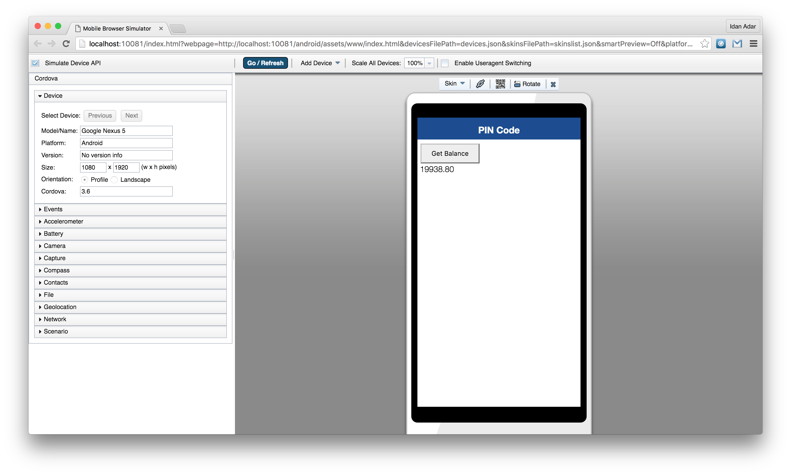
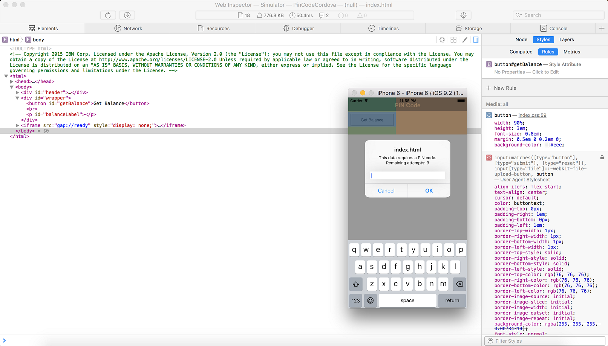
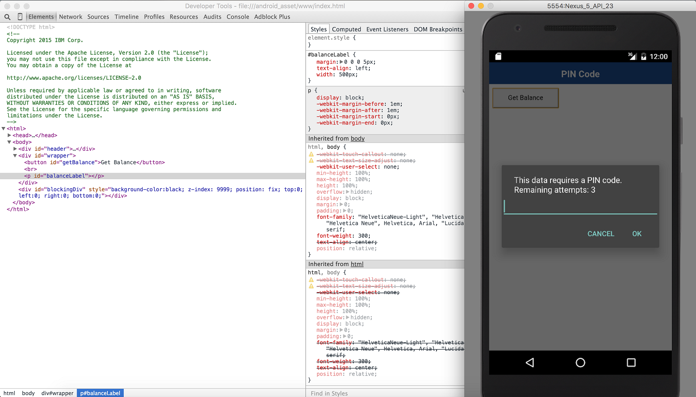
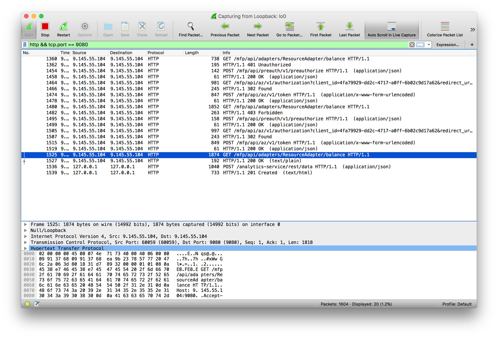

<!-- NLS_CHARSET=UTF-8 -->
## 概説
{: #overview }
デバッグは、応用コードおよびアプリケーション・ユーザー・インターフェースにおける欠陥の原因究明からなるプロセスです。

* JavaScript (Cordova、Web) アプリケーションは、HTML、JavaScript、および CSS などの Web ベースのリソースからなります。Cordova アプリケーションには、(Java、Objective-C、Swift、C# などで書かれた) オプションのネイティブ・コードを含めることもできます。
* プラットフォーム SDK で提供される標準のツール (XCode、Android、Microsoft Visual Studio など) を使用して、ネイティブ・コードをデバッグすることができます。

このチュートリアルでは、エミュレーター、シミュレーター、物理デバイス、または Web ブラウザーを介してローカルで実行されている JavaScript ベースのアプリケーションをデバッグするためのさまざまなアプローチを説明します。 

> Cordova のデバッグおよびテストについて詳しくは、Cordova Web サイト [アプリケーションのデバッグ](https://cordova.apache.org/docs/en/latest/guide/next/index.html#link-testing-on-a-simulator-vs-on-a-real-device)を参照してください。

#### ジャンプ先:
{: #jump-to }

* [{{ site.data.keys.mf_mbs }} によるデバッグ](#debugging-with-the-mobile-browser-simulator)
* [Ripple によるデバッグ](#debugging-with-ripple)
* [iOS Remote Web Inspector によるデバッグ](#debugging-with-ios-remote-web-inspector)
* [Chrome Remote Web Inspector によるデバッグ](#debugging-with-chrome-remote-web-inspector)
* [{{ site.data.keys.product_adj }} ロガーによるデバッグ](#debugging-with-mobilefirst-logger)
* [WireShark によるデバッグ](#debugging-with-wireshark)

## {{ site.data.keys.mf_mbs }} によるデバッグ
{: #debugging-with-the-mobile-browser-simulator }
{{ site.data.keys.product_full }} {{ site.data.keys.mf_mbs }} (MBS) を使用して、{{ site.data.keys.product_adj }} アプリケーションをプレビューし、デバッグできます。  
MBS を使用するには、**コマンド・ライン**・ウィンドウを開き、次のコマンドを実行します。

```bash
mfpdev app preview```

アプリケーションが複数のプラットフォームから成る場合は、以下のようにしてプレビューするプラットフォームを指定します。

```bash
mfpdev app preview -p <platform>
```

> <span class="glyphicon glyphicon-exclamation-sign" aria-hidden="true"></span> **重要:** プレビュー・フィーチャーにはいくつかの既知の制限があります。アプリケーションは、プレビュー中は予想どおりに動作しない場合があります。例えば、機密クライアントを使用してセキュリティー・フィーチャーを迂回します。したがって、チャレンジ・ハンドラーはトリガーされません。

### {{ site.data.keys.mf_mbs }}
{: #mobile-browser-simulator}



### Simple Preview
{: #simple-preview }


> {{ site.data.keys.mf_cli }} については、[『{{ site.data.keys.mf_cli }} を使用した{{ site.data.keys.product_adj }} 成果物の管理』](../using-mobilefirst-cli-to-manage-mobilefirst-artifacts)チュートリアルを参照してください。

## Ripple によるデバッグ
{: #debugging-with-ripple }
Apache Ripple™ は、モバイル Web アプリケーションをデバッグするための、Web ベースのモバイル環境シミュレーターです。  
Ripple を使用すると、ご使用のブラウザーで Cordova アプリケーションを実行して、さまざまな Cordova フィーチャーをシュミレートできます。例えば、ご使用のコンピューターからローカルでピクチャーを選択できるようにすることで、カメラ  API をシュミレートできます。  

### Ripple のインストール
{: #installing-ripple }

1. [Node.js](https://nodejs.org/en/) の最新バージョンをダウンロードしてインストールします。
Node.js インストール済み環境を検証するには、端末で `npm -v` と入力します。
2. 端末を開き、以下を入力します。

   ```bash
   npm install -g ripple-emulator
   ```

### Ripple を使用したアプリケーションの実行
{: #running-application-using-ripple }
Ripple をインストールした後に、Cordova プロジェクトの場所から端末を開き、以下を入力します。

```bash
ripple emulate
```


> Apache Ripple™ の詳細情報は、[Apache Ripple ページ](http://ripple.incubator.apache.org/)または [npm ripple-emulator ページ](https://www.npmjs.com/package/ripple-emulator)にあります。

## iOS Remote Web Inspector によるデバッグ
{: #debugging-with-ios-remote-web-inspector }
iOS 6 以降、Apple は iOS デバイス上で Web アプリケーションをデバッグするためのリモート [Web インスペクター](https://developer.apple.com/safari/tools/)を導入しました。デバッグを行うためには、ご使用のデバイス (または iOS シミュレーター) で**「プライベートブラウズ」**オプションがオフになっていることを確認してください。  

1. デバイス上の Web インスペクターを有効にするには、**「設定」>「Safari」>「詳細」>「Web インスペクター」**をタップします。
2. デバッグを開始するには、iOS デバイスを Mac に接続するか、シミュレーターを開始します。
3. Safari で、**「環境設定」>「詳細」**に移動して、**「メニューバーに "開発" メニューを表示」**チェック・ボックスを選択します。
4. Safari で、**「開発」> [ご使用のデバイス ID] > [ご使用のアプリケーション HTML ファイル]**を選択します。



## Chrome Remote Web Inspector によるデバッグ
{: #debugging-with-chrome-remote-web-inspector }
Google Chrome を使用すると、Android デバイスまたは Android エミュレーター上の Web アプリケーションをリモート側から検査することができます。  
このアクションを実行するには、Android 4.4 以降、Chrome 32 以降が必要です。さらに、`AndroidManifest.xml` ファイルで、`targetSdkVersion = 19` 以上にする必要があります。また、`project.properties` ファイルで、`target = 19` 以上にする必要があります。

1. Android Emulator または接続されたデバイスで、アプリケーションを開始します。
2. Chrome で、アドレス・バーに URL `chrome://inspect` を入力します。
3. 関連アプリケーションに対して**「検査 (Inspect)」**を押します。



### {{ site.data.keys.product_adj }} ロガーによるデバッグ
{: #debugging-with-mobilefirst-logger }
{{ site.data.keys.product }} には、ログ・メッセージを出力するために使用できる、`WL.Logger` オブジェクトが用意されています。  
`WL.Logger` には、複数のレベルのロギング (`WL.Logger.info`、`WL.Logger.debug`、`WL.Logger.error`) が含まれています。

> 詳しくは、ユーザー文書の API リファレンスの部分にある `WL.Logger` についての記載を参照してください。

**ログの検査:**

* シミュレーターまたはエミュレーターを使用してプラットフォームをプレビューする場合は **開発者コンソール**
* Android デバイス上で実行する場合は **LogCat**
* iOS デバイス上で実行する場合は **XCode コンソール**
* Windows デバイス上で実行する場合は **Visual Studio の出力**

### WireShark によるデバッグ
{: #debugging-with-wireshark }
Wireshark は、ネットワークで発生していることを確認するために使用できる**ネットワーク・プロトコル・アナライザー**です。  
必要なものだけを追跡するようフィルターを掛けることができます。  

> 詳しくは、[WireShark](http://www.wireshark.org) Web サイトを参照してください。


