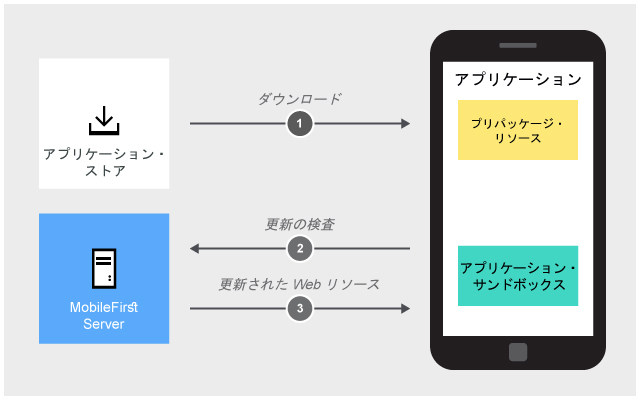
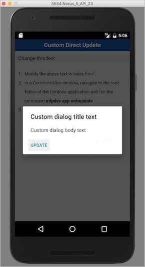

<!-- NLS_CHARSET=UTF-8 -->
## 概説
{: #overview }
ダイレクト・アップデートを使用すると、無線通信経由で、変更済み、修正済み、または新規の応用ロジック (JavaScript)、HTML、CSS、またはイメージなど、更新された Web リソースで Cordova アプリケーションを更新できます。これにより、組織は、常に最新バージョンのアプリケーションをエンド・ユーザーが使用できるようにできます。

アプリケーションを更新するには、アプリケーションの更新された Web リソースをパッケージにし、{{ site.data.keys.mf_cli }} を使用するか生成済みアーカイブ・ファイルをデプロイして、{{ site.data.keys.mf_server }} にアップロードする必要があります。すると、ダイレクト・アップデートが自動的にアクティブ化されます。アクティブ化されると、保護リソースへの要求のたびにダイレクト・アップデートが施行されます。

**サポートされる Cordova プラットフォーム**  
ダイレクト・アップデートは、Cordova iOS および Cordova Android のプラットフォームでサポートされます。

**開発、テスト、実動でのダイレクト・アップデート**  
開発とテストの目的で、開発者は通常、単にアーカイブを開発サーバーにアップロードすることにより、ダイレクト・アップデートを使用します。このプロセスは簡単に実装できる一方で、あまり安全ではありません。 のフェーズでは、組み込み {{ site.data.keys.product_adj }} 自己署名証明書から抽出された内部 RSA 鍵ペアが使用されます。

ただし、実際の実動または実動前テストのフェーズの場合、アプリケーションをアプリケーション・ストアに公開する前に、セキュアなダイレクト・アップデートを実装することを強くお勧めします。セキュアなダイレクト・アップデートでは、実際の CA 署名サーバー証明書から抽出される RSA 鍵ペアが必要です。

**注:** アプリケーションがパブリッシュされた後に鍵ストア構成を変更しないように注意してください。ダウンロードされたアップデートは、アプリケーションを新規の公開鍵で再構成して再パブリッシュしない限り、認証されなくなります。これらの 2 つのステップを実行しない場合、ダイレクト・アップデートはクライアントで失敗します。

> 詳しくは、[セキュアなダイレクト・アップデート](#secure-direct-update)を参照してください。

**ダイレクト・アップデートのデータ転送速度**  
最適な状態で、1 つの {{ site.data.keys.mf_server }} は 1 秒あたり 250 MB の速度でデータをクライアントにプッシュできます。さらに高速なデータ・プッシュが必要な場合は、クラスターまたは CDN サービスを考慮してください。  

> 詳しくは、[CDN からのダイレクト・アップデート要求の処置](cdn-support)を参照してください。

### 注
{: #notes }

* ダイレクト・アップデートは、アプリケーションの Web リソースのみを更新します。ネイティブ・リソースを更新するには、新しいアプリケーション・バージョンを該当アプリケーション・ストアに送信する必要があります。
* ダイレクト・アップデート機能を使用し、かつ [Web リソース・チェックサム](../cordova-apps/securing-apps/#enabling-the-web-resources-checksum-feature)機能が使用可能になっていると、新規のチェックサム・ベースが各ダイレクト・アップデートで確立されます。
* {{ site.data.keys.mf_server }} は、フィックスパックを使用してアップグレードされた場合、引き続きダイレクト・アップデートを適切に配布します。ただし、最近ビルドされたダイレクト・アップデート・アーカイブ (.zip ファイル) がアップロードされた場合、古いクライアントへのアップデートを一時停止することがあります。その理由は、アーカイブに cordova-plugin-mfp プラグインのバージョンが含まれるためです。このアーカイブをモバイル・クライアントに提供する前に、サーバーはクライアントのバージョンをプラグインのバージョンと比較します。2 つのバージョンが十分に近い (3 つの最上位桁が同じである) 場合、ダイレクト・アップデートは正常に行われます。それ以外の場合、{{ site.data.keys.mf_server }} は何もメッセージを出さずに更新をスキップします。バージョンの不一致の 1 つの解決策は、元の Cordova プロジェクトにあるものと同じバージョンの cordova-plugin-mfp をダウンロードし、ダイレクト・アップデート・アーカイブを再生成することです。

#### ジャンプ先:
{: #jump-to}

- [ダイレクト・アップデートの機能](#how-direct-update-works)
- [更新された Web リソースの作成とデプロイ](#creating-and-deploying-updated-web-resources)
- [ユーザー・エクスペリエンス](#user-experience)
- [ダイレクト・アップデートの UI のカスタマイズ](#customizing-the-direct-update-ui)
- [差分ダイレクト・アップデートおよび完全ダイレクト・アップデート](#delta-and-full-direct-update)
- [セキュアなダイレクト・アップデート](#secure-direct-update)
- [サンプル・アプリケーション](#sample-application)

## ダイレクト・アップデートの機能
{: #how-direct-update-works }
まずはオフラインで使用できるように、アプリケーションの Web リソースは、当初からアプリケーションと一緒にパッケージされています。その後は、アプリケーションが {{ site.data.keys.mf_server }} への要求のたびに更新があるかどうかをチェックします。

> <span class="glyphicon glyphicon-exclamation-sign" aria-hidden="true"></span> **注:** ダイレクト・アップデートが実行された後、更新があるか再度チェックされるのは 60 分後です。

ダイレクト・アップデート後、アプリケーションは、事前にパッケージされた Web リソースを使用しなくなります。代わりに、アプリケーションのサンドボックスからダウンロードされた Web リソースを使用します。デバイス上のアプリケーションのキャッシュが消去されると、パッケージされた元の Web リソースが再度使用されます。



### バージョン管理
{: #versioning }
ダイレクト・アップデートは特定のバージョンのみに適用されます。言い換えると、アプリケーション・バージョン 2.0 用に生成された更新を、同じアプリケーションの別のバージョンに適用することはできません。

## 更新された Web リソースの作成とデプロイ
{: #creating-and-deploying-updated-web-resources }
バグ修正やマイナー・チェンジなど、新規 Web リソースへの作業が完了した後、更新された Web リソースをパッケージにし、{{ site.data.keys.mf_server }} にアップロードする必要があります。

1. **コマンド・ライン**・ウィンドウを開き、Cordova プロジェクトのルートに移動します。
2. 次のコマンドを実行します。`mfpdev app webupdate`。

`mfpdev app webupdate` コマンドにより、更新された Web リソースが .zip ファイルにパッケージされ、開発者ワークステーション上で稼働しているデフォルトの {{ site.data.keys.mf_server }} にアップロードされます。パッケージ化された Web リソースは、**[cordova-project-root-folder]/mobilefirst/** フォルダー内にあります。

代替方法:

* .zip ファイルを作成し、コマンド `mfpdev app webupdate [server-name][runtime-name]` を使用して別の {{ site.data.keys.mf_server }} にアップロードします。例えば、次のとおりです。 

  ```bash
  mfpdev app webupdate myQAServer MyBankApps
  ```

* コマンド `mfpdev app webupdate [server-name][runtime-name] --file [path-to-packaged-web-resources]` を使用して、以前に生成した .zip ファイルをアップロードします。 例えば、次のとおりです。 

  ```bash
  mfpdev app webupdate myQAServer MyBankApps --file mobilefirst/ios/com.mfp.myBankApp-1.0.1.zip
  ```

* パッケージした Web リソースを {{ site.data.keys.mf_server }} に手動でアップロードします。
 1. それをアップロードせずに .zip ファイルを作成します。

    ```bash
    mfpdev app webupdate --build
    ```
 2. {{ site.data.keys.mf_console }} をロードし、そのアプリケーション項目をクリックします。
 3. **「Web リソース・ファイルのアップロード (Upload Web Resources File)」**をクリックして、パッケージした Webリソースをアップロードします。

    

> さらに学習するには、コマンド`mfpdev help app webupdate` を実行してください。

## ユーザー・エクスペリエンス
{: #user-experience }
デフォルトでは、ダイレクト・アップデートを受信すると、ダイアログが表示され、ユーザーは、更新プロセスを開始するかどうかを尋ねられます。ユーザーが承認すると、進行状況表示バー・ダイアログが表示され、Web リソースがダウンロードされます。更新が完了すると、アプリケーションは自動的に再ロードされます。


## ダイレクト・アップデートの UI のカスタマイズ
{: #customizing-the-direct-update-ui }
エンド・ユーザーに提示されるデフォルトのダイレクト・アップデート UI をカスタマイズできます。  
**index.js** 内の `wlCommonInit()` 関数の中に以下を追加します。

```javascript
wl_DirectUpdateChallengeHandler.handleDirectUpdate = function(directUpdateData, directUpdateContext) {
    // Implement custom Direct Update logic
};
```

- `directUpdateData` - {{ site.data.keys.mf_server }} からダウンロードする更新パッケージのファイル・サイズ (バイト単位) を表す `downloadSize` プロパティーが含まれている JSON オブジェクト。
- `directUpdateContext` - ダイレクト・アップデート・フローを開始および停止する `.start()` 関数と `.stop()` 関数を公開する JavaScript オブジェクト。

アプリケーション内の Web リソースより {{ site.data.keys.mf_server }} 上の Web リソースの方が新しい場合は、ダイレクト・アップデート・チャレンジ・データがサーバー応答に追加されます。{{ site.data.keys.product_adj }} クライアント・サイド・フレームワークは、このダイレクト・アップデート・チャレンジを検出するたびに `wl_directUpdateChallengeHandler.handleDirectUpdate` 関数を呼び出します。

この関数は、デフォルトのダイレクト・アップデート設計、つまり、利用可能なダイレクト・アップデートがあるときに表示されるデフォルトのメッセージ・ダイアログと、ダイレクト・アップデート・プロセスが開始されたときに表示されるデフォルトの進行状況画面を提供します。この関数をオーバーライドして独自のロジックを実装することにより、カスタム・ダイレクト・アップデート・ユーザー・インターフェース動作を実装したり、ダイレクト・アップデート・ダイアログ・ボックスをカスタマイズしたりすることができます。


下記のサンプル・コードでは、`handleDirectUpdate` 関数により、「ダイレクト・アップデート」ダイアログでのカスタム・メッセージが実装されます。Cordova プロジェクトの  **www/js/index.js** ファイルにこのコードを追加します。  
カスタマイズされたダイレクト・アップデート UI の追加の例:

- サード・パーティーの JavaScript フレームワーク (Dojo や jQuery Mobile、Ionic、... など) を使用して作成したダイアログ
- Cordova プラグインを実行することによる完全にネイティブな UI
- オプションとともにユーザーに表示される代替 HTML
- その他...

```javascript
wl_directUpdateChallengeHandler.handleDirectUpdate = function(directUpdateData, directUpdateContext) {        
    navigator.notification.confirm(  // Creates a dialog.
'Custom dialog body text',
        // Handle dialog buttons.
          directUpdateContext.start();
        },
        'Custom dialog title text',
        ['Update']
    );
};
```

ユーザーがダイアログ・ボタンをクリックするたびに `directUpdateContext.start()` メソッドを実行することによって、ダイレクト・アップデート・プロセスを開始することができます。デフォルトの進行状況画面 ({{ site.data.keys.mf_server }} の以前のバージョンのものと同じ) が表示されます。

このメソッドは、次のタイプの呼び出しをサポートします。

* パラメーターが指定されていないと、{{ site.data.keys.mf_server }} はデフォルトの進行状況画面を使用します。
* `directUpdateContext.start(directUpdateCustomListener)` などのリスナー関数が指定されると、ダイレクト・アップデート・プロセスは、リスナーへのライフサイクル・イベントの送信中にバックグラウンドで実行されます。カスタム・リスナーは以下のメソッドを実装する必要があります。

```javascript
var  directUpdateCustomListener  = {
    onStart : function ( totalSize ){ }, 
    onProgress : function ( status , totalSize , completedSize ){ }, 
    onFinish : function ( status ){ } 
};
```

リスナー・メソッドは、以下のルールに従って、ダイレクト・アップデート・プロセス時に開始されます。
* `onStart` は、更新ファイルのサイズを保持する `totalSize` パラメーターで呼び出されます。
* `onProgress` は、状況 `DOWNLOAD_IN_PROGRESS`、`totalSize`、および `completedSize` (これまでにダウンロードされたボリューム) で複数回呼び出されます。
* `onProgress` は、状況 `UNZIP_IN_PROGRESS` で呼び出されます。
* `onFinish` は、次のいずれかの最終状況コードで呼び出されます。

| 状況コード | 説明 |
|-------------|-------------|
| `SUCCESS` | ダイレクト・アップデートがエラーなしで終了しました。 |
| `CANCELED` | ダイレクト・アップデートが取り消されました (例えば、`stop()` メソッドが呼び出されたため)。 |
| `FAILURE_NETWORK_PROBLEM` | 更新時にネットワーク接続に関する問題がありました。 |
| `FAILURE_DOWNLOADING` | ファイルが完全にダウンロードされませんでした。 |
| `FAILURE_NOT_ENOUGH_SPACE` | 更新ファイルをダウンロードして解凍するだけの十分なスペースがデバイスにありません。 |
| `FAILURE_UNZIPPING` | 更新ファイルの解凍中に問題がありました。 |
| `FAILURE_ALREADY_IN_PROGRESS` | ダイレクト・アップデートが既に実行しているときに start メソッドが呼び出されました。 |
| `FAILURE_INTEGRITY` | 更新ファイルの認証性を検証できません。 |
| `FAILURE_UNKNOWN` | 予期しない内部エラー。 |

カスタム・ダイレクト・アップデート・リスナーを実装する場合は、ダイレクト・アップデート・プロセスが完了して `onFinish()` メソッドが呼び出されたときにアプリケーションが再ロードされるようにする必要があります。また、ダイレクト・アップデート・プロセスが正常に完了できなかった場合には `wl_directUpdateChalengeHandler.submitFailure()` を呼び出す必要があります。

次の例は、カスタム・ダイレクト・アップデート・リスナーの実装を示しています。

```javascript
var  directUpdateCustomListener  = { 
    onStart: function(totalSize){
    //show custom progress dialog
  },
  onProgress: function(status,totalSize,completedSize){
    //update custom progress dialog
  },
  onFinish: function(status){

    if (status == 'SUCCESS'){
      //show success message
      WL.Client.reloadApp();
    }
    else {
      //show custom error message

      //submitFailure must be called is case of error
      wl_directUpdateChallengeHandler.submitFailure();
    }
  }
};

wl_directUpdateChallengeHandler.handleDirectUpdate = function(directUpdateData, directUpdateContext){

  WL.SimpleDialog.show('Update Avalible', 'Press update button to download version 2.0', [{
    text : 'update',
    handler : function() {
      directUpdateContext.start(directUpdateCustomListener);
    }
  }]);
};
```

### シナリオ: UI なしのダイレクト・アップデートの実行
{: scenario-running-ui-less-direct-updates }
{{ site.data.keys.product_full }} は、アプリケーションがフォアグラウンドにあるとき、UI なしのダイレクト・アップデートをサポートします。

UI なしのダイレクト・アップデートを実行するには、`directUpdateCustomListener` を実装します。空の関数実装を `onStart` および `onProgress` メソッドに提供します。空の実装のためにダイレクト・アップデート・プロセスはバックグラウンドで実行されます。

ダイレクト・アップデート・プロセスを完了するためには、アプリケーションを再ロードする必要があります。使用可能なオプションは次のとおりです。
* `onFinish` メソッドも空にすることができます。この場合は、アプリケーションの再始動後にダイレクト・アップデートが適用されます。
* アプリケーションの再始動をユーザーに通知したり要求したりするカスタム・ダイアログを実装することができます。(以下の例を参照してください。) 
* `onFinish` メソッドは、`WL.Client.reloadApp()` を呼び出すことによってアプリケーションの再ロードを強制することができます。

`directUpdateCustomListener` の実装例を次に示します。

```javascript
var  directUpdateCustomListener  = { 
    onStart: function(totalSize){
  },
  onProgress: function(status,totalSize,completeSize){
  },
  onFinish: function(status){
    WL.SimpleDialog.show('New Update Available', 'Press reload button to update to new version', [ {
      text : WL.ClientMessages.reload,
      handler : WL.Client.reloadApp
    }]);
  }
};
```

`wl_directUpdateChallengeHandler.handleDirectUpdate` 関数を実装します。パラメーターとして作成した `directUpdateCustomListener` 実装をこの関数に渡します。必ず `directUpdateContext.start(directUpdateCustomListener`) が呼び出されるようにします。`wl_directUpdateChallengeHandler.handleDirectUpdate` 実装の例を次に示します。

```javascript
wl_directUpdateChallengeHandler.handleDirectUpdate = function(directUpdateData, directUpdateContext){

  directUpdateContext.start(directUpdateCustomListener);
};
```

**注:** アプリケーションがバックグラウンドに送られると、ダイレクト・アップデート・プロセスは中断します。

### シナリオ: ダイレクト・アップデート障害の処理
{: #scenario-handling-a-direct-update-failure }
このシナリオは、接続の消失などによって起こり得るダイレクト・アップデート障害を処理する方法を示しています。このシナリオでは、ユーザーは、オフライン・モードでもアプリケーションを使用できなくなっています。ユーザーに再試行オプションを提供するダイアログが表示されます。

ダイレクト・アップデート・コンテキストを格納するグローバル変数を作成して、その後ダイレクト・アップデート・プロセスが失敗したときにそのダイレクト・アップデート・コンテキストを使用できるようにします。例えば、次のとおりです。

```javascript
var savedDirectUpdateContext;
```

ダイレクト・アップデート・チャレンジ・ハンドラーを実装します。ダイレクト・アップデート・コンテキストをここに保存します。例えば、次のとおりです。

```javascript
wl_directUpdateChallengeHandler.handleDirectUpdate = function(directUpdateData, directUpdateContext){

  savedDirectUpdateContext = directUpdateContext; // save direct update context

  var downloadSizeInMB = (directUpdateData.downloadSize / 1048576).toFixed(1).replace(".", WL.App.getDecimalSeparator());
  var directUpdateMsg = WL.Utils.formatString(WL.ClientMessages.directUpdateNotificationMessage, downloadSizeInMB);

  WL.SimpleDialog.show(WL.ClientMessages.directUpdateNotificationTitle, directUpdateMsg, [{
    text : WL.ClientMessages.update,
    handler : function() {
      directUpdateContext.start(directUpdateCustomListener);
    }
  }]);
};
```

ダイレクト・アップデート・コンテキストを使用してダイレクト・アップデート・プロセスを開始する関数を作成します。例えば、次のとおりです。

```javascript
restartDirectUpdate = function () {
  savedDirectUpdateContext.start(directUpdateCustomListener); // use saved direct update context to restart direct update
};
```

`directUpdateCustomListener` を実装します。`onFinish` メソッドに状況検査を追加します。状況が「FAILURE」で始まる場合は、「Try Again」オプションを持つモーダル専用ダイアログを開きます。例えば、次のとおりです。

```javascript
var  directUpdateCustomListener  = { 
    onStart: function(totalSize){
    alert('onStart: totalSize = ' + totalSize + 'Byte');
  },
  onProgress: function(status,totalSize,completeSize){
    alert('onProgress: status = ' + status + ' completeSize = ' + completeSize + 'Byte');
  },
  onFinish: function(status){
    alert('onFinish: status = ' + status);
    var pos = status.indexOf("FAILURE");
    if (pos > -1) {
      WL.SimpleDialog.show('Update Failed', 'Press try again button', [ {
        text : "Try Again",
        handler : restartDirectUpdate // restart direct update
      }]);
    }
  }
};
```

ユーザーが**「Try Again」**ボタンをクリックすると、アプリケーションはダイレクト・アップデート・プロセスを再始動します。

## 差分ダイレクト・アップデートおよび完全ダイレクト・アップデート
{: #delta-and-full-direct-update }
差分ダイレクト・アップデートを使用して、アプリケーションは、その Web リソース全体ではなく、最後の更新以降に変更されたファイルのみをダウンロードできます。これは、ダウンロード時間の削減、帯域幅の節約、さらにユーザー・エクスペリエンス全体の向上につながります。

> <span class="glyphicon glyphicon-exclamation-sign" aria-hidden="true"></span> **重要:** **差分更新**が可能なのは、クライアント・アプリケーションの Web リソースが、サーバーに現在デプロイされているアプリケーションの 1 つ前のバージョンである場合に限られます。現在デプロイされているアプリケーションより複数バージョン前のクライアント・アプリケーション (クライアント・アプリケーションが更新された後、最低 2 回はアプリケーションがサーバーにデプロイされていることを意味します) は、**フル・アップデート**を受け取ります (Web リソース全体がダウンロードされ、更新されることを意味します)。

## セキュアなダイレクト・アップデート
{: secure-direct-update }
セキュアなダイレクト・アップデートは、デフォルトでは無効になっていますが、{{ site.data.keys.mf_server }}から (またはコンテンツ配信ネットワーク (CDN) から) クライアント・アプリケーションに送信される Web リソースが第三者のアタッカーによって変更されるのを防止します。

**ダイレクト・アップデートの認証性を有効にするには、以下のようにします。**  
お好きなツールを使用して、{{ site.data.keys.mf_server }} 鍵ストアから公開鍵を取り出し、それを base64 に変換します。  
その後、生成された値を以下に示すように使用してください。

1. **コマンド・ライン**・ウィンドウを開き、Cordova プロジェクトのルートに移動します。
2. コマンド `mfpdev app config` を実行し、「ダイレクト・アップデート認証性公開鍵」を選択します。
3. 公開鍵を指定し、確認します。

これ以降のクライアント・アプリケーションへのダイレクト・アップデートの配信は、ダイレクト・アップデート認証性によって保護されます。

> 更新された鍵ストア・ファイルを使用してアプリケーション・サーバーを構成するには、[『セキュアなダイレクト・アップデートの実装』](secure-direct-update)を参照してください。

## サンプル・アプリケーション
{: #sample-application }
[ここをクリック](https://github.com/MobileFirst-Platform-Developer-Center/CustomDirectUpdate/tree/release80) して Cordova プロジェクトをダウンロードします。  

### サンプルの使用法
{: #sample-usage }
サンプルの README.md ファイルの指示に従ってください。
