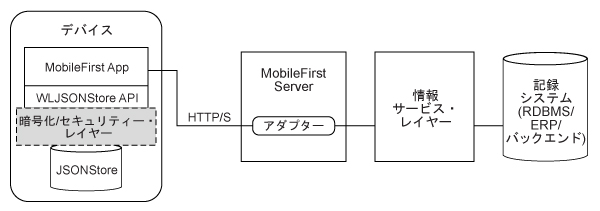

<!-- NLS_CHARSET=UTF-8 -->
## 概説
{: #overview }
{{site.data.keys.product_full }} **JSONStore** は、軽量なドキュメント指向のストレージ・システムを提供する、オプションのクライアント・サイド API です。JSONStore を使用すると、**JSON ドキュメント**を永続的に保管できます。JSONStore では、アプリケーションを実行しているデバイスがオフラインの時でも、アプリケーションのドキュメントを使用できます。この永続的に常時使用できるストレージにより、例えば、使用可能なネットワーク接続がデバイスにないときでも、ドキュメントにアクセスできるため便利です。



リレーショナル・データベース用語は開発者にとって馴染み深いため、この資料では、JSONStore の説明においてリレーショナル・データベース用語を使用しています。ただし、リレーショナル・データベースと JSONStore との間には多くの違いがあります。例えば、リレーショナル・データベースでのデータの保管に使用される厳格なスキーマは、JSONStore のアプローチとは異なります。
JSONStore では、どのような JSON コンテンツも保管可能で、検索の必要があるコンテンツは索引付けすることができます。


#### 主な機能
{: #key-features }
* 効率的な検索のためのデータ索引付け
* 保管データに対するローカルのみの変更を追跡するためのメカニズム
* 複数ユーザーのサポート
* 保管データの AES 256 暗号化 により、セキュリティーと機密性が提供されます。1 つのデバイスに対して複数のユーザーが存在する場合、パスワード保護を使用して、ユーザー別に保護をセグメント化することが可能です。

1 つのストアが多数のコレクションを含み、各コレクションが多数のドキュメントを含むことが可能です。また、1 つの {{site.data.keys.product_adj }} アプリケーションが複数のストアを持つこともできます。詳しくは、JSONStore の『複数ユーザー・サポート』を参照してください。

#### サポート・レベル
{: #support-level }
* JSONStore は、ネイティブ iOS アプリケーションおよび Android アプリケーションでサポートされています (ネイティブ Windows (Universal および UWP) ではサポートされていません)。
* JSONStore は、Cordova iOS、Android、および Windows (Universal および UWP) アプリケーションでサポートされています。

#### ジャンプ先
{: #jump-to }
* [JSONStore の一般用語](#general-jsonstore-terminology)
* [フィーチャー表](#features-table)
* [複数ユーザー・サポート](#multiple-user-support)
* [セキュリティー](#security)
* [パフォーマンス](#performance)
* [並行性](#concurrency)
* [分析](#analytics)
* [外部データの操作](#working-with-external-data)
* [トラブルシューティング](#troubleshooting)
* [API 使用法](#api-usage)

## JSONStore の一般用語
{: #general-jsonstore-terminology }
### ドキュメント
{: #document }
ドキュメントは、JSONStore の基本的なビルディング・ブロックです。

JSONStore ドキュメントは、自動的に生成される ID (`_id`) と JSON データを持つ JSON オブジェクトです。これは、データベース用語のレコードや行に似ています。
`_id` の値は常に、特定のコレクション内の固有の整数です。
`JSONStoreInstance` クラスの `add`、`replace`、`remove` などの一部の関数では、ドキュメント/オブジェクトの配列を取ります。これらのメソッドは、さまざまなドキュメント/オブジェクトに対して一度に操作を実行する際に役立ちます。

**単一のドキュメント**  

```javascript
var doc = { _id: 1, json: {name: 'carlos', age: 99} };
```

**ドキュメント配列**

```javascript
var docs = [
  { _id: 1, json: {name: 'carlos', age: 99} },
  { _id: 2, json: {name: 'tim', age: 100} }
]
```

### コレクション
{: #collection }
JSONStore コレクションは、データベース用語の表に似ています。  
以下のコード・サンプルは、ドキュメントをディスクに保管する方法ではなく、コレクションの概要がどのようなものかを視覚化するのに適した方法です。

```javascript
[
    { _id: 1, json: {name: 'carlos', age: 99} },
    { _id: 2, json: {name: 'tim', age: 100} }
]
```

### ストア
{: #store }
ストアは、1 つ以上のコレクションを含む、JSONStore の永続ファイルです。  
ストアは、データベース用語のリレーショナル・データベースに似ています。ストアは、JSONStore とも呼ばれます。

### 検索フィールド
{: #search-fields }
検索フィールドは、キー/値のペアです。  
検索フィールドは、検索時間を高速にするために索引付けされたキーであり、データベース用語の列フィールドまたは列属性と似ています。


追加の検索フィールドは、索引付けされているが、保管された JSON データの一部ではないキーです。
これらのフィールドは、(JSON コレクション内の) 値が索引付けされたキーを定義し、検索をより素早く行うために使用できます。


有効なデータ型は、string、boolean、number、および integer です。これらは単に型のヒントであり、型の妥当性検査はありません。
また、これらの型によって、索引付け可能なフィールドの保管方法が決定されます。
例えば、`{age: 'number'}` は 1 を 1.0 として索引付けし、`{age: 'integer'}` は 1 を 1 として索引付けします。

**検索フィールドおよび追加の検索フィールド**

```javascript
var searchField = {name: 'string', age: 'integer'};
var additionalSearchField = {key: 'string'};
```

索引付けが可能なのはオブジェクト内のキーのみです。オブジェクトそのものではありません。配列はパススルー方式で処理されます。つまり、配列を索引付けすることも、配列 (arr[n]) の特定の索引を索引付けすることもできませんが、配列内のオブジェクトを索引付けすることができます。

**配列内の値の索引付け**

```javascript

var searchFields = {
    'people.name' : 'string', // matches carlos and tim on myObject
    'people.age' : 'integer' // matches 99 and 100 on myObject
};

var myObject = {
    people : [ 
        {name: 'carlos', age: 99}, 
        {name: 'tim', age: 100}
    ] 
};
```

### 照会
{: #queries }
照会は、検索フィールドまたは追加の検索フィールドを使用してドキュメントを検索するオブジェクトです。  
これらの例では、name 検索フィールドは型 string であり、age 検索フィールドは型 integer であることを前提としています。

**「carlos」と一致する「name」のドキュメントを検索**

```javascript
var query1 = {name: 'carlos'};
```

**「carlos」と一致する「name」で、「99」と一致する「age」のドキュメントを検索**

```javascript
var query2 = {name: 'carlos', age: 99};
```

### 照会部分
{: #query-parts }
照会部分は、より高度な検索をビルドするために使用されます。
一部のバージョンの `find` や `count` など、一部の JSONStore 操作は照会部分を使用します。
照会部分内のすべてのものは `AND` ステートメントで結合されますが、照会部分自体は `OR` ステートメントで結合されます。
照会部分のすべてのものが **true** である場合にのみ、検索基準が一致を返します。
複数の照会部分を使用して、1 つ以上の照会部分を満たす一致を検索することができます。


照会部分による検索は、最上位検索フィールドにのみ機能します。
例えば、`name.first` ではなく `name` を検索します。
これを回避するには、すべての検索フィールドが最上位である複数のコレクションを使用します。
最上位でない検索フィールドで機能する照会部分操作は `equal`、`notEqual`、`like`、`notLike`、`rightLike`、`notRightLike`、`leftLike`、および `notLeftLike` です。最上位でない検索フィールドを使用した場合、振る舞いは不確定になります。

## フィーチャー表
{: #features-table }
JSONStore フィーチャーを、その他のデータ・ストレージのテクノロジーおよび形式のフィーチャーと比較します。


JSONStore は、{{site.data.keys.product_adj }} プラグインを使用する Cordova アプリケーション内のデータを保管する JavaScript API、ネイティブ iOS アプリケーション対応の Objective-C API、および Android アプリケーション対応の Java API です。参考のために、さまざまな JavaScript ストレージ・テクノロジーの比較を次に示します。これにより、JSONStore がこれらのテクノロジーと比べてどのようなものであるかが分かります。

JSONStore は、LocalStorage、Indexed DB、Cordova Storage API、Cordova File API などのテクノロジーと似ています。以下の表は、JSONStore によって提供されるいくつかのフィーチャーが他のテクノロジーと比べてどうであるかを示しています。JSONStore フィーチャーは、iOS および Android のデバイスおよびシミュレーターのみで使用可能です。

| 機能                                            | JSONStore      | LocalStorage | IndexedDB | Cordova ストレージ API | Cordova ファイル API |
|----------------------------------------------------|----------------|--------------|-----------|---------------------|------------------|
| Android サポート (Cordova &amp; ネイティブ・アプリケーション)|	     ✔ 	      |      ✔	    |     ✔	     |        ✔	           |         ✔	      |
| iOS サポート (Cordova & ネイティブ・アプリケーション)	     |	     ✔ 	      |      ✔	    |     ✔	     |        ✔	           |         ✔	      |
| Windows 8.1 Universal および Windows 10 UWP          |	     ✔ 	      |      ✔	    |     ✔	     |        -	           |         ✔	      |
| データ暗号化	                                 |	     ✔ 	      |      -	    |     -	     |        -	           |         -	      |
| 最大ストレージ	                                 |使用可能なスペース |    最大 5MB     |   最大 5MB 	 | 使用可能なスペース	   | 使用可能なスペース  |
| 信頼性の高いストレージ (注を参照)	                     |	     ✔ 	      |      -	    |     -	     |        ✔	           |         ✔	      |
| ローカルでの変更のトラッキング	                     |	     ✔ 	      |      -	    |     -	     |        -	           |         -	      |
| マルチユーザーのサポート                                 |	     ✔ 	      |      -	    |     -	     |        -	           |         -	      |
| 索引付け	                                         |	     ✔ 	      |      -	    |     ✔	     |        ✔	           |         -	      |
| ストレージのタイプ	                                 | JSON ドキュメント | 鍵と値のペア | JSON ドキュメント | リレーショナル (SQL) | ストリング     |

**注:** 信頼性の高いストレージ は、以下のイベントのいずれかが発生しない限り、データが削除されないことを意味します。

* アプリケーションがデバイスから除去された。
* データを除去するメソッドのいずれかが呼び出された。

## 複数ユーザー・サポート	
{: #multiple-user-support }
JSONStore では、単一の {{site.data.keys.product_adj }} アプリケーションで異なるコレクションを含む複数のストアを作成できます。

init (JavaScript) API または open (ネイティブ iOS および ネイティブ Android) API は、ユーザー名を持つ Options オブジェクトを使用することができます。異なるストアは、ファイル・システム内では別個のファイルです。ユーザー名がストアのファイル名として使用されます。セキュリティーおよびプライバシー上の理由により、これらの個別のストアを異なるパスワードで暗号化することも可能です。closeAll API を呼び出すと、すべてのコレクションに対するアクセス権が除去されます。また changePassword API を呼び出して、暗号化されたストアのパスワードを変更することもできます。

ユース・ケースの一例としては、さまざまな従業員が同じ物理デバイス (例えば iPad や Android タブレットなど) と {{site.data.keys.product_adj }} アプリケーションを共有しているケースが考えられます。さらに、従業員が異なるシフトで勤務しており、{{site.data.keys.product_adj }} アプリケーションを使用しながらさまざまな顧客のプライベート・データを扱う場合、複数ユーザーのサポートが役立ちます。

## セキュリティー
{: #security }
ストア内のすべてのコレクションは、暗号化により保護することができます。

ストア内のすべてのコレクションを暗号化するには、パスワードを `init` (JavaScript) API または `open` (ネイティブ iOS および ネイティブ Android) API に渡します。パスワードを渡さないと、ストアのコレクション内にあるドキュメントはいずれも暗号化されません。

一部のセキュリティー成果物 (ソルト など) は、キーチェーン (iOS)、共有設定 (Android) および資格情報保管ボックス (Windows Universal 8.1 および Windows 10 UWP) に保管されています。ストアは 256 ビットの Advanced Encryption Standard
(AES) 鍵で暗号化されます。すべての鍵は Password-Based Key Derivation
Function 2 (PBKDF2) により強化されています。アプリケーションのデータ・コレクションを暗号化するよう選択することはできますが、暗号化とプレーン・テキストの形式を切り替えたり、ストア内で複数の形式を混用したりすることはできません。

ストア内でデータを保護する鍵は、指定されるユーザー・パスワードに基づいています。その鍵が有効期限切れになることはありませんが、changePassword API を呼び出してその鍵を変更することができます。

データ保護鍵 (DPK) は、ストアの内容を暗号化解除するために使用される鍵です。DPK は、アプリケーションがアンインストールされた場合でも、iOS キーチェーン内に保持されています。キーチェーン内の鍵と JSONStore がアプリケーションに入れた他のすべてのものの両方を除去するには、destroy API を使用します。このプロセスは、暗号化された DPK が共有設定に保管され、アプリケーションのアンインストール時に完全にワイプされるため、Android には適用されません。

JSONStore がパスワードを使用してコレクションを初めて開く場合 (つまり開発者がストア内でデータを暗号化したい場合)、JSONStore はランダム・トークンを必要とします。このランダム・トークンは、クライアントまたはサーバーから取得することができます。

localKeyGen 鍵が JSONStore API の JavaScript 実装環境にあり、true の値になっている場合、暗号的にセキュアなトークンがローカルに生成されます。それ以外の場合、トークンはサーバーにアクセスすることによって生成されます。したがって {{site.data.keys.mf_server }} との接続が必要になります。
このトークンは、ストアが初回にパスワードを使用して開かれるときにのみ必要です。
ネイティブ実装環境 (Objective-C および Java) では暗号論的に安全なトークンがデフォルトでローカルに生成されます。生成されない場合は、secureRandom オプションを使用してトークンを渡すことができます。

ストアをオフラインで開くことと、クライアントを信頼してランダム・トークンを生成すること (セキュア・レベルは低下) または {{site.data.keys.mf_server }} にアクセスしてストアを開いて (接続が必要) サーバーを信頼すること (セキュア・レベルは上昇) との間には、トレードオフ関係があります。

### セキュリティー・ユーティリティー
{: #security-utilities }
{{site.data.keys.product_adj }} クライアント・サイド API は、ユーザーのデータを保護するのに役に立つセキュリティー・ユーティリティーをいくつか提供しています。JSONStore などのフィーチャーは、JSON オブジェクトを保護する場合に優れた能力を発揮します。
ただし、JSONStore コレクションにバイナリー・ブロブを保管することはお勧めできません。

代わりに、バイナリー・データをファイル・システムに保管して、ファイル・パスやその他のメタデータを JSONStore コレクション内に保管します。
イメージなどのファイルを保護したい場合、それを base64 ストリングとしてエンコードし、暗号化して、ディスクに出力を書き込むことができます。
データを暗号化解除するときになったら、JSONStore コレクション内のメタデータを検索して、暗号化されたデータをディスクから読み取り、保管されているメタデータを使用してそれを暗号化解除することができます。
このメタデータには鍵、ソルト、初期設定ベクトル (IV)、ファイルのタイプ、ファイルへのパスなどを含めることができます。

> 詳しくは、[JSONStore セキュリティー・ユーティリティー](security-utilities)を参照してください。

### Windows 8.1 Universal および Windows 10 UWP の暗号化
{: #windows-81-universal-and-windows-10-uwp-encryption }
ストア内のすべてのコレクションは、暗号化により保護することができます。

JSONStore は [SQLCipher](http://sqlcipher.net/) をその基本データベース・テクノロジーとして使用します。
SQLCipher は、Zetetic LLC 製作の SQLite ビルドであり、暗号化のレイヤーをデータベースに追加します。

JSONStore は、すべてのプラットフォームで SQLCipher を使用します。
Android および iOS では、Community Edition とも呼ばれる SQLCipher の無料のオープン・ソースのバージョンが使用可能であり、{{site.data.keys.product }} に含まれている JSONStore のバージョンに組み込まれます。
SQLCipher の Windows バージョンは、商用ライセンスの下でのみ入手可能であり、{{site.data.keys.product }} が直接再配布することはできません。

代わりに、Windows 8 Universal 用の JSONStore に SQLite が基本データベースとして組み込まれています。これらのプラットフォームのいずれかでデータの暗号化が必要な場合、独自のバージョンの SQLCipher を獲得して、{{site.data.keys.product }} に組み込まれている SQLite バージョンをスワップアウトする必要があります。


暗号化が必要ない場合、{{site.data.keys.product }} 内の SQLite バージョンを使用しても (暗号化を差し引いた状態で) JSONStore が完全に機能します。

#### Windows Universal および Windows UWP 用の SQLite から SQLCipher への置換
{: #replacing-sqlite-with-sqlcipher-for-windows-universal-and-windows-uwp }
1. SQLCipher for Windows Runtime Commercial Edition に同梱されている SQLCipher for Windows Runtime 8.1/10 拡張を実行します。
2. 拡張のインストールが終了したら、作成されたばかりの **sqlite3.dll** ファイルの SQLCipher バージョンを見つけ出します。x86 用、x64 用、および ARM 用のファイルがそれぞれ 1 つずつ存在します。

   ```bash
   C:\Program Files (x86)\Microsoft SDKs\Windows\v8.1\ExtensionSDKs\SQLCipher.WinRT81\3.0.1\Redist\Retail\<platform>
   ```
    
3. このファイルをご使用の {{site.data.keys.product_adj }} アプリケーションにコピーして置換します。

   ```bash
   <Worklight project name>\apps\<application name>\windows8\native\buildtarget\<platform>
   ```

## パフォーマンス
{: #performance }
JSONStore のパフォーマンスに影響する可能性のある要因は、以下のとおりです。

### ネットワーク
{: #network }
* すべてのダーティー・ドキュメントを  アダプターに送るなどの操作を実行する前に、ネットワーク接続をチェックしてください。
* ネットワーク経由でクライアントへ送信されるデータ量は、パフォーマンスに大きく影響します。バックエンド・データベース内のすべてのものをコピーするのではなく、アプリケーションに必要なデータのみを送ってください。
*  アダプターを使用している場合、compressResponse フラグを true に設定することを検討してください。このようにすると、応答が圧縮されます。これにより、一般的に圧縮がない場合に比べて、使用される処理能力が節約され、転送時間が短縮されます。

### メモリー
{: #memory }
* JavaScript API を使用すると、JSONStore ドキュメントは、ネイティブ (Objective-C、Java、または C#) レイヤーと JavaScript レイヤーの間で、ストリングとしてシリアライズされたりデシリアライズされたりします。発生し得るメモリーの問題を軽減する 1 つの方法は、find API の使用時に制限とオフセットを使用することです。このようにすると、結果に割り振られるメモリーの容量が制限されるので、ページ編集などを実装できます (X はページ当たりの結果数)。
* 最終的にストリングとしてシリアライズおよびデシリアライズされる長い鍵名を使用する代わりに、それらの長い鍵名を短い名前にマップすること (例えば、` myVeryVeryVerLongKeyName` を `k` または `key` にマップするなど) を検討してください。
長い鍵名をアダプターからクライアントへ送信するときにそれを短い鍵名にマップし、バックエンドにデータを送信して戻すときに元の長い鍵名にマップするのが理想的です。
* ストア内のデータをさまざまなコレクションに分割することを検討してください。
単一のコレクション内に一体構造のドキュメントを保持するのではなく、さまざまなコレクションで小さなドキュメントを保持します。こうした検討は、データ同士がどの程度密接に関連しているか、および当該データのユースケースに依存します。
* オブジェクトの配列を使用して add API を使用する際には、メモリーの問題が発生する可能性があります。この問題を軽減するには、一度に指定する JSON オブジェクトを少なくしてこれらのメソッドを呼び出してください。
* JavaScript および Java にはガーベッジ・コレクターが備わっていますが、Objective-C には Automatic Reference Counting が備わっています。これが機能できるようにしてください。ただし完全にこれに依存しないようにしてください。もう使用されていない参照をヌルに設定し、プロファイル・ツールを使用して、メモリー使用量が予想どおりに減少していることを確認してください。

### CPU
{: #cpu }
* 索引付けを行う add メソッドを呼び出す際、使用される検索フィールドと追加の検索フィールドの数量はパフォーマンスに影響します。find メソッドの照会に使用する値にのみ索引を付けてください。
* デフォルトでは、JSONStore はそのドキュメントに対するローカルでの変更をトラッキングします。
add、remove、および replace の各 API を使用する際に、`markDirty` フラグを **false** に設定すれば、この振る舞いを無効にすることができます。これによりいくつかのサイクルを省略できます。
* セキュリティーを有効にすると、`init` API または `open` API や、コレクション内のドキュメントを処理する他の操作に、いくらかのオーバーヘッドが加わります。
セキュリティーが本当に必要であるかどうかを検討してください。例えば、open API は、暗号化と暗号化解除に使用される暗号鍵を生成しなければならないため、暗号化によりかなり遅くなります。
* `replace` API および `remove` API は、コレクション全体を調べてすべてのオカレンスの置き換えおよび除去を行う必要があるため、コレクション・サイズに依存します。
各レコードを調べる必要があるため、暗号化の使用時にはそれらのレコードをすべて暗号化解除する必要があり、大幅に遅くなります。このパフォーマンス・ヒットは、大きいコレクションでは顕著です。
* `count` API は、相対的に費用がかかります。
ただし、そのコレクションのカウントを保持する変数を保持することができます。
内容をコレクションに保管したり、コレクションから除去したりするたびに、この変数を更新してください。

* `find` API (`find`、`findAll`、および `findById`) は、すべてのドキュメントを暗号化解除して一致があるかどうかを確認する必要があるため、暗号化によって影響を受けます。照会ごとの find について、制限が渡された場合は、その結果の制限に達したときに停止するため高速になる可能性があります。
JSONStore は、残りのドキュメントを暗号化解除して他の検索結果が残っているかどうかを確認する必要はありません。


## 並行性
{: #concurrency }
### JavaScript
{: #javascript }
add や find など、コレクションに対して実行できる操作のほとんどは非同期です。これらの操作は、正常に完了した場合は解決され、障害が発生した場合は拒否される、jQuery promise を返します。
これらの promise は、成功時と失敗時のコールバックと似ています。


jQuery Deferred は、解決されるか拒否される promise です。
以下の例は、JSONStore に固有なものではなく、それらの使用法全般を理解するのに役立つことを意図したものです。


promise やコールバックの代わりに、JSONStore `success` イベントと `failure` イベントを listen することもできます。
イベント・リスナーに渡された引数に基づくアクションを実行します。

**promise の定義例**

```javascript
var asyncOperation = function () {
  // Assumes that you have jQuery defined via $ in the environment
  var deferred = $.Deferred();

  setTimeout(function() {
    deferred.resolve('Hello');
  }, 1000);

  return deferred.promise();
};
```

**promise の使用例**

```javascript
// The function that is passed to .then is executed after 1000 ms.
asyncOperation.then(function (response) {
  // response = 'Hello'
});
```

**コールバックの定義例**

```javascript
var asyncOperation = function (callback) {
  setTimeout(function() {
    callback('Hello');
  }, 1000);
};
```

**コールバックの使用例**

```javascript
// The function that is passed to asyncOperation is executed after 1000 ms.
asyncOperation(function (response) {
  // response = 'Hello'
});
```

**イベントの例**

```javascript
$(document.body).on('WL/JSONSTORE/SUCCESS', function (evt, data, src, collectionName) {

  // evt - Contains information about the event
  // data - Data that is sent ater the operation (add, find, etc.) finished
  // src - Name of the operation (add, find, push, etc.)
  // collectionName - Name of the collection
});
```

### Objective-C
{: #objective-c }
JSONStore 用のネイティブ iOS API を使用すると、すべての操作は同期ディスパッチ・キューに追加されます。
この振る舞いにより、ストアに作用する操作はメイン・スレッドでないスレッドに対して順序正しく実行されるようになります。
詳しくは、Apple 資料の [Grand Central Dispatch (GCD)](https://developer.apple.com/library/ios/documentation/Performance/Reference/GCD_libdispatch_Ref/Reference/reference.html#//apple_ref/c/func/dispatch_sync        ) を参照してください。

### Java
{: #java }
JSONStore 用のネイティブ Android API を使用すると、すべての操作がメイン・スレッドに対して実行されます。
振る舞いを非同期にするには、スレッドを作成するか、スレッド・プールを使用する必要があります。
すべてのストア操作はスレッド・セーフです。

## 分析 
{: #analytics }
JSONStore に関する重要な分析情報を収集することができます。 

### ファイル情報
{: #file-information }
分析フラグを **true** に設定して JSONStore API を呼び出した場合、ファイル情報はアプリケーション・セッションごとに 1 回収集されます。
アプリケーション・セッションは、アプリケーションがメモリーにロードされたときに始まり、アプリケーションがメモリーから除去されたときに終わるものとして定義されます。
この情報を使用して、アプリケーション内で JSONStore コンテンツが使用しているスペース量を知ることができます。

### パフォーマンス・メトリック
{: #performance-metrics }
パフォーマンス・メトリックは、JSONStore API が操作の開始時刻と終了時刻に関する情報を使用して呼び出されるたびに収集されます。
この情報を使用して、さまざまな操作の所要時間 (ミリ秒) を知ることができます。

### 例
{: #examples }
#### iOS
{: #ios-example}
```objc
JSONStoreOpenOptions* options = [JSONStoreOpenOptions new];
[options setAnalytics:YES];

[[JSONStore sharedInstance] openCollections:@[...] withOptions:options error:nil];
```

#### Android
{: #android-example }
```java
JSONStoreInitOptions initOptions = new JSONStoreInitOptions();
initOptions.setAnalytics(true);

WLJSONStore.getInstance(...).openCollections(..., initOptions);
```

#### JavaScript
{: #java-script-example }
```javascript
var options = {
  analytics : true
};

WL.JSONStore.init(..., options);
```

## 外部データを使用した作業
{: #working-with-external-data }
**プル**と**プッシュ**という異なる概念で外部データを使用して作業できます。

### プル
{: #pull }
多くのシステムでは、プル という用語を使って、外部ソースからデータを所得することを表します。  
以下の 3 つの重要な要素があります。

#### 外部データ・ソース
{: #external-data-source }
このソースとしては、データベースや REST API あるいは SOAP API などが考えられますが、他にも多くのものがあります。
要件は、{{site.data.keys.mf_server }} からアクセス可能であるか、クライアント・アプリケーションから直接アクセス可能でなければならないということだけです。
このソースではデータが JSON 形式で返されることが理想です。

#### トランスポート層
{: #transport-layer }
このソースは、データが外部ソースから内部ソース (ストア内部の JSONStore コレクション) にどのように取得されるかを定義します。
代替方法の 1 つがアダプターです。

#### 内部データ・ソース API
{: #internal-data-source-api }
このソースは、コレクションに JSON データを追加するために使用できる JSONStore API です。


**注:** 内部ストアには、ファイル、入力フィールド、または変数内のハードコーディングされたデータから読み取られるデータを取り込むことができます。このデータのソースは、ネットワーク通信を必要とする外部ソースに限られる必要はありません。


以下のコード例はすべて、JavaScript に類似した疑似コードで書かれています。

**注:** トランスポート層の場合、アダプターを使用します。 アダプターを使用することの利点として、XML から JSONへの変換、セキュリティー、フィルタリング、サーバー・サイド・コードとクライアント・サイド・コードの分離などが挙げられます。

**外部データ・ソース: バックエンド REST エンドポイント**  
データベースからデータを読み取り、それを JSON オブジェクトの配列として返す REST エンドポイントがあると想定してください。

```javascript
app.get('/people', function (req, res) {

  var people = database.getAll('people');

  res.json(people);
});
```

返されるデータは、以下の例のようになります。

```xml
[{id: 0, name: 'carlos', ssn: '111-22-3333'},
 {id: 1, name: 'mike', ssn: '111-44-3333'},
 {id: 2, name: 'dgonz' ssn: '111-55-3333')]
```

**トランスポート層: アダプター**  
people と呼ばれるアダプターを作成し、getPeople と呼ばれるプロシージャーを定義していると想定してください。このプロシージャーは、REST エンドポイントを呼び出し、JSON オブジェクトの配列をクライアントに返します。
ここでさらに操作を行うことができます。例えば、データのサブセットのみをクライアントに返すことができます。

```javascript
function getPeople () {

  var input = {
    method : 'get',
    path : '/people'
  };

  return MFP.Server.invokeHttp(input);
}
```

クライアントでは、WLResourceRequest API を使用してデータを取得することができます。さらに、クライアントから  アダプターにパラメーターをいくつか渡すことができます。例えば、アダプターを通じてクライアントが外部ソースから新しいデータを取得した最終時刻を持つ日付を渡すことができます。

```javascript
var adapter = 'people';
var procedure = 'getPeople';

var resource = new WLResourceRequest('/adapters' + '/' + adapter + '/' + procedure, WLResourceRequest.GET);
resource.send()
.then(function (responseFromAdapter) {
  // ...
});
```

**注:** `WLResourceRequest` API に渡すことができる `compressResponse`、`timeout`、または他のパラメーターを活用することもできます。  
あるいは、 アダプターをスキップし、jQuery.ajax などを使用して、保存したいデータを持つ REST エンドポイントに直接アクセスすることができます。

```javascript
$.ajax({
  type: 'GET',
  url: 'http://example.org/people',
})
.then(function (responseFromEndpoint) {
  // ...
});
```

**内部データ・ソース API: JSONStore**
バックエンドから応答があったら、JSONStore を使用してそのデータを処理することができます。
JSONStore は、ローカルでの変更をトラッキングする手段を提供しています。
これにより、一部の API でドキュメントをダーティーとしてマーク付けできるようになります。
API は、ドキュメントに対して最後に実行された操作、およびドキュメントがダーティーとしてマーク付けされた時点を記録します。
そうすると、この情報を使用して、データ同期などのフィーチャーを実装できます。


change API がデータといくつかのオプションを取ります。

**replaceCriteria**  
これらの検索フィールドは、入力データの一部です。
既にコレクション内部にあるドキュメントを見つけるのに使用されます。
例えば、置き換え基準として以下を選択したとします。

```javascript
['id', 'ssn']
```

この場合、以下の配列が入力データとして渡されます。

```javascript
[{id: 1, ssn: '111-22-3333', name: 'Carlos'}]
```

さらに `people` コレクションには既に以下のドキュメントが入っています。

```javascript
{_id: 1,json: {id: 1, ssn: '111-22-3333', name: 'Carlitos'}}
```

`change` 操作では、以下の照会と正確に一致するドキュメントが検索されます。


```javascript
{id: 1, ssn: '111-22-3333'}
```

次に `change` 操作で入力データによる置き換えが実行され、コレクションに以下のものが含まれます。

```javascript
{_id: 1, json: {id:1, ssn: '111-22-3333', name: 'Carlos'}}
```

名前が `Carlitos` から `Carlos` に変更されました。
複数のドキュメントが置き換え基準に一致した場合、一致するすべてのドキュメントが対応する入力データに置き換えられます。

**addNew**  
置き換え基準に一致するドキュメントがない場合、change API は、このフラグの値を調べます。このフラグが **true** に設定されている場合、change API は新しいドキュメントを作成して、ストアに追加します。そうでなれば、さらなるアクションは実行されません。

**markDirty**  
change API が置き換えまたは追加されるドキュメントをダーティーとしてマーク付けするかどうかを決定します。

アダプターからデータの配列が返されます。

```javascript
.then(function (responseFromAdapter) {

  var accessor = WL.JSONStore.get('people');

  var data = responseFromAdapter.responseJSON;

  var changeOptions = {
    replaceCriteria : ['id', 'ssn'],
    addNew : true,
    markDirty : false
  };

  return accessor.change(data, changeOptions);
})

.then(function () {

  // ...
})
```

他の API を使用して、保管されたローカル・ドキュメントに対する変更をトラッキングすることができます。
操作が実行されるコレクションに対するアクセサーを常に取得します。


```javascript
var accessor = WL.JSONStore.get('people')
```

そうすると、データ (JSON オブジェクトの配列) を追加し、そのデータにダーティーまたは非ダーティーのマークが付けられるようにしたいかどうかを決定することができます。
一般的に、外部ソースから変更を取得する場合は、markDirty フラグを false に設定します。次に、データをローカルに追加する場合は、このフラグを true に設定します。

```javascript
accessor.add(data, {markDirty: true})
```

また、ドキュメントを置き換え、代替物のあるそのドキュメントをダーティーまたは非ダーティーとしてマーク付けすることを選択することができます。


```javascript
accessor.replace(doc, {markDirty: true})
```

同様に、ドキュメントを除去し、その除去をダーティーまたは非ダーティーとしてマーク付けすることを選択することができます。
除去されてダーティーのマークが付けられたドキュメントは、find API を使用したときに表示されません。ただし、コレクションからドキュメントを物理的に除去する `markClean` API を使用するまでは、これらのドキュメントはコレクション内部に残っています。
ドキュメントがダーティーとしてマーク付けされていない場合、そのドキュメントはコレクションから物理的に除去されます。


```javascript
accessor.remove(doc, {markDirty: true})
```

### プッシュ
{: #push }
多くのシステムでは、プッシュ という用語を使って、外部ソースにデータを送ることを表します。

以下の 3 つの重要な要素があります。

#### 内部データ・ソース API
{: #internal-data-source-api-push }
このソースは、ローカルのみの変更 (ダーティー) を持つドキュメントを返す JSONStore API です。

#### トランスポート層
{: #transport-layer-push }
このソースは、変更を送信するためにどのように外部データ・ソースにアクセスするかを定義します。

#### 外部データ・ソース
{: #external-data-source-push }
通常、このソースは、データベースや REST または SOAP エンドポイントで (他にもありますが)、クライアントがデータに対して行った更新を受け取るものです。


以下のコード例はすべて、JavaScript に類似した疑似コードで書かれています。

**注:** トランスポート層の場合、アダプターを使用します。 アダプターを使用することの利点として、XML から JSONへの変換、セキュリティー、フィルタリング、サーバー・サイド・コードとクライアント・サイド・コードの分離などが挙げられます。

**内部データ・ソース API: JSONStore**  
コレクションに対するアクセサーを取得したら、`getAllDirty` API を呼び出して、ダーティーとしてマーク付けされたすべてのドキュメントを取得することができます。
これらのドキュメントは、トランスポート層を通じて外部データ・ソースに送りたいローカルのみの変更を含むものです。


```javascript
var accessor = WL.JSONStore.get('people');

accessor.getAllDirty()

.then(function (dirtyDocs) {
  // ...
});
```

`dirtyDocs` 引数は、以下の例のようになります。

```javascript
[{_id: 1,
  json: {id: 1, ssn: '111-22-3333', name: 'Carlos'},
  _operation: 'add',
  _dirty: '1395774961,12902'}]
```

フィールドは以下のとおりです。
* `_id`: JSONStore が使用する内部フィールド。どのドキュメントにも固有のものが 1 つ割り当てられています。
* `json`: 保管されたデータ。
* `_operation`: ドキュメントに対して最後に実行された操作。可能な値は add、store、replace、および remove です。
* `_dirty`: ドキュメントがダーティーとしてマークされた時点を表す数値として保管されているタイム・スタンプ。

**トランスポート層: MobileFirst アダプター**  
ダーティー・ドキュメントを  アダプターに送ることを選択できます。`updatePeople` プロシージャーによって定義された `people` アダプターがあるものと想定してください。

```javascript
.then(function (dirtyDocs) {
  var adapter = 'people',
  procedure = 'updatePeople';
 
  var resource = new WLResourceRequest('/adapters/' + adapter + '/' + procedure, WLResourceRequest.GET)
  resource.setQueryParameter('params', [dirtyDocs]);
  return resource.send();
})
 
.then(function (responseFromAdapter) {
  // ...
})
```

**注:** `WLResourceRequest` API に渡すことができる `compressResponse`、`timeout`、または他のパラメーターを活用することもできます。


{{site.data.keys.mf_server }} では、アダプターに以下の例のような `updatePeople` プロシージャーがあります。

```javascript
function updatePeople (dirtyDocs) {

  var input = {
    method : 'post',
    path : '/people',
    body: {
      contentType : 'application/json',
      content : JSON.stringify(dirtyDocs)
    }
  };

  return MFP.Server.invokeHttp(input);
}
```

クライアント上で `getAllDirty` API からの出力を中継するのではなく、バックエンドが要求する形式と一致するようにペイロードを更新しなければならないことがあります。
置き換え、除去、および組み込みを別々のバックエンド API 呼び出しに分ける必要があるかもしれません。


あるいは、`dirtyDocs` 配列全体を繰り返し、`_operation` フィールドを確認することができます。
次に、1 つのプロシージャーに置き換え、別のプロシージャーに除去、さらに別のプロシージャーに組み込みを送ることができます。
上記の例は、すべてのダーティー・ドキュメントを一括して  アダプターに送るものです。

```javascript
var len = dirtyDocs.length;
var arrayOfPromises = [];
var adapter = 'people';
var procedure = 'addPerson';
var resource;
 
while (len--) {
 
  var currentDirtyDoc = dirtyDocs[len];
 
  switch (currentDirtyDoc._operation) {
 
    case 'add':
    case 'store':
 
    resource = new WLResourceRequest('/adapters/people/addPerson', WLResourceRequest.GET);
    resource.setQueryParameter('params', [currentDirtyDoc]);
 
      arrayOfPromises.push(resource.send());
 
    break;
 
    case 'replace':
    case 'refresh':
 
    resource = new WLResourceRequest('/adapters/people/replacePerson', WLResourceRequest.GET);
    resource.setQueryParameter('params', [currentDirtyDoc]);
 
 
      arrayOfPromises.push(resource.send());
 
    break;
 
    case 'remove':
    case 'erase':
 
    resource = new WLResourceRequest('/adapters/people/removePerson', WLResourceRequest.GET);
    resource.setQueryParameter('params', [currentDirtyDoc]);
 
      arrayOfPromises.push(resource.send());
  }
}
 
$.when.apply(this, arrayOfPromises)
.then(function () {

  var len = arguments.length;
 
  while (len--) {
 
  // Look at the responses in arguments[len]
  }
});
```

あるいは、 アダプターをスキップし、REST エンドポイントに直接アクセスすることができます。

```javascript
.then(function (dirtyDocs) {
  return $.ajax({
    type: 'POST',
    url: 'http://example.org/updatePeople',
    data: dirtyDocs
  });
})

.then(function (responseFromEndpoint) {
  // ...
});
```

**外部データ・ソース: バックエンド REST エンドポイント**  
バックエンドは、変更を受け入れるか、拒否して、応答を中継してクライアントに戻します。
クライアントは、応答を調べてから、更新されたドキュメントを markClean API に渡すことができます。

```javascript
.then(function (responseFromAdapter) {

  if (responseFromAdapter is successful) {
    WL.JSONStore.get('people').markClean(dirtyDocs);
  }
})

.then(function () {

  // ...
})
```

クリーンとマークされたドキュメントは、`getAllDirty` API からの出力には表示されません。

## トラブルシューティング
{: #troubleshooting }
詳しくは、[『JSONStore のトラブルシューティング』](../../troubleshooting/jsonstore)セクションを参照してください。

## API 使用法
{: #api-usage }
プラットフォームを選択してください。 
