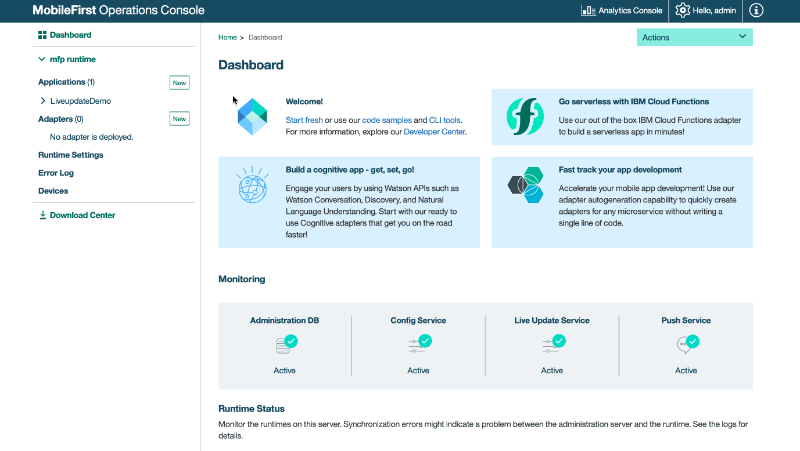

<!-- NLS_CHARSET=UTF-8 -->
## 概説
{: #overview }

{{ site.data.keys.product }} 内のライブ・アップデート機能を使用すると、シンプルな方法でアプリケーションのユーザーにさまざまな構成を定義し、提供できます。{{ site.data.keys.mf_console }} には、構成の値だけでなく、構成の構造も定義するためのコンポーネントが含まれています。構成をコンシュームするためのクライアント SDK が用意されています (Android および iOS の**ネイティブ**・アプリケーション、および Cordova アプリケーションで使用できます)。

>**注**: 従来のオンプレミス {{ site.data.keys.mf_server }} でライブ・アップデートを使用する方法の詳細は、[こちら](live-update/)の資料を参照してください。


### 一般的なユースケース
{: #common-use-cases }
ライブ・アップデートは、構成の定義およびコンシュームを支援し、アプリケーションのカスタマイズを簡単に行えるようにします。一般的なユース・ケースの例は次のとおりです。

* リリース・トレーンおよびフィーチャー・フリッピング

今後のリリースでは、以下のユース・ケースがサポートされる予定です。

* A/B テスト
* コンテキスト・ベースの、アプリケーションのカスタマイズ (例: 地理的セグメンテーション)

### ジャンプ先:
{: #jump-to }
* [概念](#concept)
* [ライブ・アップデートのアーキテクチャー](#live-update-architecture)
* [{{ site.data.keys.mf_server }} へのライブ・アップデートの追加](#adding-live-update-to-mobilefirst-server)
* [アプリケーション・セキュリティーの構成](#configuring-application-security)
* [アプリケーションへのライブ・アップデート SDK の追加](#adding-live-update-sdk-to-applications)
* [ライブ・アップデート SDK の使用](#using-the-live-update-sdk)
* [高度なトピック](#advanced-topics)

## 概念
{: #concept }

ライブ・アップデート・サービスでは、すべてのアプリケーションに次の機能が追加されます。

1. **フィーチャー** - フィーチャーを使用して、構成可能なアプリケーション・フィーチャーを定義し、そのデフォルト値を設定できます。
2. **プロパティー** - プロパティーを使用して、構成可能なアプリケーション・プロパティーを定義し、そのデフォルト値を設定できます。

開発者またはアプリケーション管理チームは、次の点を決定する必要があります。
* ライブ・アップデートを使用できるフィーチャーとそのデフォルト状態のセット。
* 構成可能なストリングのプロパティーとそのデフォルト値のセット。

パラメーターが決定されたら、ライブ・アップデート・セクションを使用して、フィーチャーとプロパティーをアプリに追加します。

<div class="panel-group accordion" id="terminology" role="tablist" aria-multiselectable="false">
    <div class="panel panel-default">
        <div class="panel-heading" role="tab" id="schema">
            <h4 class="panel-title">
                <a class="preventScroll" role="button" data-toggle="collapse" data-parent="#terminology" data-target="#collapseSchema" aria-expanded="false" aria-controls="collapseSchema">用語を確認する場合にクリックします</a>
            </h4>
        </div>

        <div id="collapseSchema" class="panel-collapse collapse" role="tabpanel" aria-labelledby="schema">
            <div class="panel-body">
                <ul>
                    <li><b>フィーチャー:</b> フィーチャーは、アプリケーション機能の一部が有効であるか無効であるかを判別します。 アプリケーションのフィーチャーを定義するときに、以下のエレメントを指定する必要があります。
                        <ul>
                            <li><i>id</i> – 固有のフィーチャー ID。 ストリング、編集不可。</li>
                            <li><i>name</i> - フィーチャーの記述名。 ストリング、編集可能。</li>
                            <li><i>description</i> – フィーチャーの簡略説明。 ストリング、編集可能。</li>
                            <li><i>defaultValue</i> – セグメント内でオーバーライドされなかった場合のフィーチャーのデフォルト値 (下記の『セグメント』を参照)。 ブール値、編集可能。</li>
                        </ul>
                    </li>
                    <li><b>プロパティー:</b> プロパティーは、「キー:値」のエンティティーで、アプリケーションをカスタマイズするために使用できます。 プロパティーを定義するときに、以下のエレメントを指定する必要があります。
                        <ul>
                            <li><i>id</i> – 固有のプロパティー ID。 ストリング、編集不可。</li>
                            <li><i>name</i> - プロパティーの記述名。 ストリング、編集可能。</li>
                            <li><i>description</i> – プロパティーの簡略説明。 ストリング、編集可能。</li>
                            <li><i>defaultValue</i> - セグメント内でオーバーライドされなかった場合のプロパティーのデフォルト値 (下記の『セグメント』を参照)。 ストリング、編集可能。</li>
                        </ul>
                    </li>
                </ul>
            </div>
        </div>
    </div>
</div>


## ライブ・アップデートのアーキテクチャー
{: #live-update-architecture }
以下のシステム・コンポーネントは、ライブ・アップデート機能を提供するために一緒に機能します。


* **ライブ・アップデート・サービス:** 以下を提供する独立したサービス
   - アプリケーション管理
   - アプリケーションへの構成の提供
* **クライアント・サイドの SDK:** ライブ・アップデート SDK は、{{ site.data.keys.mf_server }} からのフィーチャーおよびプロパティーなど、構成エレメントの取得およびアクセスに使用されます。
* **{{ site.data.keys.mf_console }}:** ライブ・アップデート・アダプターの構成およびライブ更新設定に使用されます。

## {{ site.data.keys.mf_server }} へのライブ・アップデートの追加
{: #adding-live-update-to-mobilefirst-server }
デフォルトでは、ライブ・アップデート・サービスは Mobile Foundation DevKit にバンドルされています。

> OpenShift Container Platform (OCP) のインストールについては、[こちら](../../ibmcloud/mobilefoundation-on-openshift/)の資料の説明に従ってください。  

ライブ・アップデート・サービスが開始すると、登録済みアプリケーションごとに**「ライブ更新設定」**ページが表示されます。

## アプリケーション・セキュリティーの構成
{: #configuring-application-security }
ライブ・アップデートとの統合を許可するには、スコープ・エレメントが必要です。 スコープ・エレメントを指定しない場合、サービスはクライアント・アプリケーションからの要求を拒否します。  

1. {{ site.data.keys.mf_console }} をロードします。
2. **[ご使用のアプリケーション] → 「セキュリティー」タブ → 「スコープ・エレメントのマッピング」**をクリックします。
3. **「新規」**をクリックし、スコープ・エレメント `liveupdate.mobileclient` を入力します。 
4. **「追加」**をクリックします。

アプリケーション内でスコープ・エレメントを使用する場合は、それをセキュリティー検査にマップすることもできます。

> 詳しくは、[{{ site.data.keys.product_adj }} セキュリティー・フレームワーク](../../authentication-and-security/)に関する説明を参照してください。


<br/>

## フィーチャーおよびプロパティーを値で定義
{: #define-features-and-properties-with-values }

フィーチャーおよびプロパティーを値で定義するには、次のデモンストレーションを参照してください。


## アプリケーションへのライブ・アップデート SDK の追加
{: #adding-live-update-sdk-to-applications}
ライブ・アップデート SDK は、{{ site.data.keys.mf_console }} で登録済みアプリケーションの「ライブ更新設定」画面で以前定義されたランタイム構成のフィーチャーおよびプロパティーを照会する API を開発者に提供します。

**Cordova** の場合、SDK バージョン *8.0.202003051505* 以前を使用します。
* [Cordova プラグイン資料](https://github.com/mfpdev/mfp-live-update-cordova-plugin)

**Android** の場合、SDK バージョン *8.0.202003051505* を使用します。
* [Android SDK 資料](https://github.com/mfpdev/mfp-live-update-android-sdk)

**iOS** の場合、SDK バージョン *8.0.202003051505*  以前のバージョンを使用します。
* [iOS Swift SDK 資料](https://github.com/mfpdev/mfp-live-update-ios-sdk)

### Cordova プラグインの追加
{: #adding-the-cordova-plugin }

Cordova アプリケーション・フォルダーで、次のコマンドを実行します。

```bash
cordova plugin add cordova-plugin-mfp-liveupdate
```

### iOS SDK の追加
{: #adding-the-ios-sdk }
1. `IBMMobileFirstPlatformFoundationLiveUpdate` pod を追加して、アプリケーションの pod ファイルを編集します。  
 例えば、次のとおりです。

   ```xml
   use_frameworks!

   target 'your-Xcode-project-target' do
      pod 'IBMMobileFirstPlatformFoundation'
      pod 'IBMMobileFirstPlatformFoundationLiveUpdate'
   end
   ```

2. **コマンド・ライン**・ウィンドウから、Xcode プロジェクトのルート・フォルダーに移動し、次のコマンドを実行します。
  ```bash
  pod install
  ```

### Android SDK の追加
{: #adding-the-android-sdk }
1. Android Studio で、**「Android」→「Gradle Scripts」**を選択し、**build.gradle (Module: app)** ファイルを選択します。
2. 以下のように、`dependencies` 内に `ibmmobilefirstplatformfoundationliveupdate` を追加します。

   ```xml
   dependencies {
        compile group: 'com.ibm.mobile.foundation',
        name: 'ibmmobilefirstplatformfoundation',
        version: '8.0.+',
        ext: 'aar',
        transitive: true

        compile group: 'com.ibm.mobile.foundation',
        name: 'ibmmobilefirstplatformfoundationliveupdate',
        version: '8.0.0',
        ext: 'aar',
        transitive: true
   }   
   ```

## ライブ・アップデート SDK の使用
{: #using-the-live-update-sdk }
ライブ・アップデート SDK を使用するにはいくつかの方法があります。

### 構成の取得
{: #obtain-config }
構成を取得するためのロジックを実装します。  
`property-name` と `feature-name` を独自のものに置き換えます。

#### Cordova
{: #cordova }
```javascript
    var input = { };
    LiveUpdateManager.obtainConfiguration({useClientCache :false },function(configuration) {
        // do something with configration (JSON) object, for example,
        // if you defined in the server a feature named 'feature-name':
        // if (configuration.features.feature-name) {
        //   console.log(configuration.properties.property-name);
	// }
    } ,
    function(err) {
        if (err) {
           alert('liveupdate error:'+err);
        }
  });

```

#### iOS
{: #ios }
```swift
LiveUpdateManager.sharedInstance.obtainConfiguration(completionHandler: { (configuration, error) in
  if error == nil {
    print (configuration?.getProperty("property-name"))
    print (configuration?.isFeatureEnabled("feature-name"))
  } else {
    print (error)
  }
})

```

#### Android
{: #android }
```java
LiveUpdateManager.getInstance().obtainConfiguration(new ConfigurationListener() {

    @Override
    public void onSuccess(final Configuration configuration) {
        Log.i("LiveUpdateDemo", configuration.getProperty("property-name"));
        Log.i("LiveUpdateDemo", configuration.isFeatureEnabled("feature-name").toString());
    }

    @Override
    public void onFailure(WLFailResponse wlFailResponse) {
        Log.e("LiveUpdateDemo", wlFailResponse.getErrorMsg());
    }
});

```

ライブ・アップデート構成を取得して、応用ロジックおよびアプリケーション・フローに、フィーチャーおよびプロパティーの状態を反映することができます。 例えば、今日が祝日の場合、アプリケーションに新しいマーケティング・プロモーションを導入することができます。

## 高度なトピック
{: #advanced-topics }

### キャッシュ
{: #caching }
キャッシュは、ネットワーク待ち時間を回避するためにデフォルトで有効になっています。 これは、更新が即時に行われない可能性があることを意味します。  
より頻繁に更新を行う必要がある場合には、キャッシュを無効にすることができます。

#### Cordova
{: #cordova-caching }
オプションの _useClientCache_ ブール値フラグを使用したクライアント・サイド・キャッシュの制御:

```javascript
var input = {useClientCache : false };
      LiveUpdateManager.getConfiguration(input,function(configuration) {
              // do something with resulting configuration, for example:
                // console.log(configuration.data.properties.property-name);  
                // console.log(configuration.data.features.feature-name);
        } ,
    function(err) {
              if (err) {
                 alert('liveupdate error:'+err);
              }
});

```

#### iOS
{: #ios-caching }
```swift
LiveUpdateManager.sharedInstance.obtainConfiguration(useCache: false, completionHandler: { (configuration, error) in
  if error == nil {
    print (configuration?.getProperty("property-name"))
    print (configuration?.isFeatureEnabled("feature-name"))
  } else {
    print (error)
  }
})

```

#### Android
{: #android-caching }
```java
LiveUpdateManager.getInstance().obtainConfiguration(false, new ConfigurationListener() {

    @Override
    public void onSuccess(final Configuration configuration) {
      Log.i("LiveUpdateSample", configuration.getProperty("property-name"));
      Log.i("LiveUpdateSample", configuration.isFeatureEnabled("feature-name").toString());
    }

    @Override
    public void onFailure(WLFailResponse wlFailResponse) {
        Log.e("LiveUpdateSample", wlFailResponse.getErrorMsg());
    }
});

```

### キャッシュの有効期限
{: #cache-expiration }
`expirationPeriod` 値は 30 分で、キャッシュの有効期限が切れるまでの時間です。
