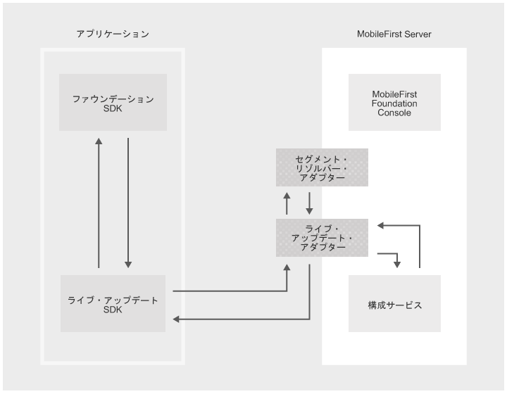

<!-- NLS_CHARSET=UTF-8 -->
## 概説
{: #overview }
ユーザー・セグメンテーションとは、各グループのユーザー間の類似性が反映されるようにユーザーをグループに分ける行為です。一般的な例として、[地理的セグメンテーション](https://en.wikipedia.org/wiki/Market_segmentation#Geographic_segmentation)、つまり、地理学に基づいたユーザーの分割などがあります。ユーザーのセグメント化の目標は、値を最大化するように、各セグメント内でユーザーをどのように関係付けるかを決定することです。

{{ site.data.keys.product }} 内のライブ・アップデート機能を使用すると、シンプルな方法でアプリケーションのユーザーのセグメントごとに異なる構成を定義し、提供できます。{{ site.data.keys.mf_console }} には、セグメントごとの構成の値だけでなく、構成の構造も定義するためのコンポーネントが含まれています。また、構成をコンシュームするためのクライアント SDK も提供されます (Android および iOS の**ネイティブ**・アプリケーション、および Cordova アプリケーションで使用できます)。

#### 一般的なユースケース
{: #common-use-cases }
ライブ・アップデートは、セグメント・ベースの構成の定義およびコンシュームを支援し、セグメント・ベースでのアプリケーションのカスタマイズを簡単に行えるようにします。一般的なユースケースとしては、以下のようなものがあります。

* リリース・トレーンおよびフィーチャー・フリッピング
* A/B テスト
* コンテキスト・ベースの、アプリケーションのカスタマイズ (例: 地理的セグメンテーション)

#### デモンストレーション
{: #demonstration }
以下のビデオで、ライブ・アップデート機能のデモンストレーションをご覧いただけます。

<div class="sizer">
    <div class="embed-responsive embed-responsive-16by9">
        <iframe src="https://www.youtube.com/embed/TjbC9thSfmM"></iframe>
    </div>
</div>

#### ジャンプ先:
{: #jump-to }
* [ライブ・アップデートのアーキテクチャー](#live-update-architecture)
* [{{ site.data.keys.mf_server }} へのライブ・アップデートの追加](#adding-live-update-to-mobilefirst-server)
* [アプリケーション・セキュリティーの構成](#configuring-application-security)
* [スキーマおよびセグメント](#schema-and-segments)
* [アプリケーションへのライブ・アップデート SDK の追加](#adding-live-update-sdk-to-applications)
* [ライブ・アップデート SDK の使用](#using-the-live-update-sdk)
* [高度なトピック](#advanced-topics)
* [サンプル・アプリケーション](#sample-application)


## ライブ・アップデートのアーキテクチャー
{: #live-update-architecture }
以下のシステム・コンポーネントは、ライブ・アップデート機能を提供するために一緒に機能します。



* **ライブ・アップデート・アダプター:** 以下を提供するアダプター
 - アプリケーション・スキーマおよびセグメント管理
 - アプリケーションへの構成の提供
* **セグメント・リゾルバー・アダプター:** *オプション*。開発者によって実装されるカスタム・アダプター。このアダプターは、アプリケーション・コンテキスト (デバイスおよびユーザーのコンテキスト、カスタム・パラメーターなど) を受け取り、コンテキストに対応するセグメントの ID を返します。
* **クライアント・サイドの SDK:** ライブ・アップデート SDK は、{{ site.data.keys.mf_server }} からのフィーチャーおよびプロパティーなど、構成エレメントの取得およびアクセスに使用されます。
* **{{ site.data.keys.mf_console }}:** ライブ・アップデート・アダプターの構成およびライブ更新設定に使用されます。
* **構成サービス:** *内部*。ライブ・アップデート・アダプターの構成管理サービスを提供します。

## {{ site.data.keys.mf_server }} へのライブ・アップデートの追加
{: #adding-live-update-to-mobilefirst-server }
デフォルトでは、{{ site.data.keys.mf_console }} での「ライブ更新設定」は非表示になっています。有効にするには、提供されているライブ・アップデート・アダプターをデプロイする必要があります。  

1. {{ site.data.keys.mf_console }} を開きます。サイドバー・ナビゲーションで、**「ダウンロード・センター」→「ツール」**タブをクリックします。
2. ライブ・アップデート・アダプターをダウンロードし、デプロイします。

デプロイ後、**「ライブ更新設定」**画面が、登録済みアプリケーションごとに現れます。


## アプリケーション・セキュリティーの構成
{: #configuring-application-security }
ライブ・アップデートとの統合を許可するには、スコープ・エレメントが必要です。これがないと、アダプターはクライアント・アプリケーションからの要求を拒否します。  

{{ site.data.keys.mf_console }} をロードし、**[ご使用のアプリケーション] →「セキュリティー」タブ →「スコープ・エレメントのマッピング」**の順にクリックします。**「新規」**をクリックし、スコープ・エレメント **configuration-user-login** を入力します。次に、**「追加」**をクリックします。

アプリケーション内でスコープ・エレメントを使用する場合は、それをセキュリティー検査にマップすることもできます。

> 詳しくは、[{{ site.data.keys.product_adj }} セキュリティー・フレームワーク](../../authentication-and-security/)に関する説明を参照してください。


## スキーマおよびセグメント
{: #schema-and-segments }
「ライブ更新設定」画面には、以下の 2 つのタブがあります。

#### スキーマ
{: #schema }
スキーマは、フィーチャーおよびプロパティーが定義されている場所です。  

* 「フィーチャー」を使用して、構成可能なアプリケーション・フィーチャーを定義し、そのデフォルト値を設定できます。  
* 「プロパティー」を使用して、構成可能なアプリケーション・プロパティーを定義し、そのデフォルト値を設定できます。

#### セグメント
{: #segments }
セグメントは、スキーマによって定義されるデフォルトのフィーチャーおよびプロパティーをカスタマイズして、固有のアプリケーション動作を定義します。

### スキーマおよびセグメントの追加
{: #adding-schema-and-segments }
アプリケーションのスキーマおよびセグメントを追加する前に、開発者または製品管理チームは、以下のいくつかの側面について決定しておく必要があります。

* ライブ・アップデートを使用する**フィーチャー**のセットと、それらのデフォルトの状態
* 構成可能なストリングの **プロパティー**のセットと、それらのデフォルト値
* アプリケーションのマーケット・セグメント

マーケット・セグメントごとに、以下を決定してください。

* あらゆるフィーチャーの状態と、アプリケーションの存続期間中にこの状態をどのように変更可能か
* あらゆるプロパティーの値と、アプリケーションの存続期間中にこの値をどのように変更可能か

<br/>
パラメーターが決定されると、スキーマのフィーチャーとプロパティー、およびセグメントを追加できます。  
追加するには、**「新規」**をクリックし、必要な値を指定します。

<div class="panel-group accordion" id="terminology" role="tablist" aria-multiselectable="false">
    <div class="panel panel-default">
        <div class="panel-heading" role="tab" id="schema">
            <h4 class="panel-title">
                <a class="preventScroll" role="button" data-toggle="collapse" data-parent="#terminology" data-target="#collapseSchema" aria-expanded="false" aria-controls="collapseSchema">スキーマの用語を確認するには、ここをクリックしてください</a>
            </h4>
        </div>

        <div id="collapseSchema" class="panel-collapse collapse" role="tabpanel" aria-labelledby="schema">
            <div class="panel-body">
                <ul>
                    <li><b>フィーチャー:</b> フィーチャーは、アプリケーション機能の一部が有効であるか無効であるかを判別します。アプリケーションのスキーマでフィーチャーを定義する際に、以下のエレメントを指定する必要があります。
                        <ul>
                            <li><i>id</i> – 固有のフィーチャー ID。ストリング、編集不可。</li>
                            <li><i>name</i> - フィーチャーの記述名。ストリング、編集可能。</li>
                            <li><i>description</i> – フィーチャーの簡略説明。ストリング、編集可能。</li>
                            <li><i>defaultValue</i> – セグメント内でオーバーライドされなかった場合のフィーチャーのデフォルト値 (下記の『セグメント』を参照)。ブール値、編集可能。</li>
                        </ul>
                    </li>
                    <li><b>プロパティー:</b> プロパティーは、「キー:値」のエンティティーで、アプリケーションをカスタマイズするために使用できます。アプリケーションのスキーマでプロパティーを定義する際に、以下のエレメントを指定する必要があります。
                        <ul>
                            <li><i>id</i> – 固有のプロパティー ID。ストリング、編集不可。</li>
                            <li><i>name</i> - プロパティーの記述名。ストリング、編集可能。</li>
                            <li><i>description</i> – プロパティーの簡略説明。ストリング、編集可能。</li>
                            <li><i>defaultValue</i> - セグメント内でオーバーライドされなかった場合のプロパティーのデフォルト値 (下記の『セグメント』を参照)。ストリング、編集可能。</li>
                        </ul>
                    </li>
                </ul>
            </div>
        </div>
    </div>

    <div class="panel panel-default">
        <div class="panel-heading" role="tab" id="segment">
            <h4 class="panel-title">
                <a class="preventScroll" role="button" data-toggle="collapse" data-parent="#terminology" data-target="#collapseSegment" aria-expanded="false" aria-controls="collapseSegment">セグメントの用語を確認するには、ここをクリックしてください</a>
            </h4>
        </div>

        <div id="collapseSegment" class="panel-collapse collapse" role="tabpanel" aria-labelledby="segment">
            <div class="panel-body">
                <ul>
                    <li><b>セグメント:</b> セグメントは、マーケット・セグメントに対応するエンティティーです。セグメントには、スキーマ内に定義されたフィーチャーおよびプロパティーが含まれています。これらの値はオーバーライドされる可能性があります。セグメントを定義する際に、以下のエレメントを指定する必要があります。
                        <ul>
                            <li><i>id</i> - 固有のセグメント ID。ストリング、編集不可。</li>
                            <li><i>name</i> - セグメントの記述名。ストリング、編集可能。</li>
                            <li><i>description</i> – セグメントの簡略説明。ストリング、編集可能。</li>
                            <li><i>Features</i>  -  スキーマ内に定義されたフィーチャーのリスト。ユーザーは、スキーマのデフォルトとは異なる静的値をフィーチャーに設定できます。</li>
                            <li><i>Properties</i>  - スキーマ内に定義されたプロパティーのリスト。ユーザーは、スキーマのデフォルトとは異なる静的値をプロパティーに設定できます。</li>
                        </ul>
                    </li>
                </ul>

                <blockquote><b>注:
</b><br/>
                    <ul>
                        <li>フィーチャーまたはプロパティーがスキーマに追加されると、対応するフィーチャーまたはプロパティーがアプリケーションのすべてのセグメントに (デフォルト値で) 自動的に追加されます。</li>
                        <li>フィーチャーまたはプロパティーがスキーマから削除されると、対応するフィーチャーまたはプロパティーがアプリケーションのすべてのセグメントから自動的に削除されます。</li>
                    </ul>
                </blockquote>
            </div>
        </div>
    </div>
</div>

#### スキーマのフィーチャーおよびプロパティーをデフォルト値で定義
{: #define-schema-features-and-properties-with-default-values }


#### マーケット・セグメントに対応するセグメントの定義
{: #define-degments-that-correspond-to-market-segments }


#### フィーチャーおよびプロパティーのデフォルト値のオーバーライド
{: #override-default-values-of-features-and-properties }
フィーチャーを有効にし、そのデフォルトの状態を変更します。


プロパティーのデフォルト値をオーバーライドします。


## アプリケーションへのライブ・アップデート SDK の追加
{: #adding-live-update-sdk-to-applications}
ライブ・アップデート SDK は、{{ site.data.keys.mf_console }} で登録済みアプリケーションの「ライブ更新設定」画面で以前定義されたランタイム構成のフィーチャーおよびプロパティーを照会する API を開発者に提供します。

* [Cordova プラグイン資料](https://github.com/mfpdev/mfp-live-update-cordova-plugin)
* [iOS Swift SDK 資料](https://github.com/mfpdev/mfp-live-update-ios-sdk)
* [Android SDK 資料](https://github.com/mfpdev/mfp-live-update-android-sdk)

### Cordova プラグインの追加
{: #adding-the-cordova-plugin }
Cordova アプリケーション・フォルダーで、以下を実行します。

```bash
cordova plugin add cordova-plugin-mfp-liveupdate
```

### iOS SDK の追加
{: #adding-the-ios-sdk }
1. `IBMMobileFirstPlatformFoundationLiveUpdate` pod を追加して、アプリケーションの pod ファイルを編集します。  
例えば、次のとおりです。

   ```xml
   use_frameworks!

   target 'your-Xcode-project-target' do
      pod 'IBMMobileFirstPlatformFoundation'
      pod 'IBMMobileFirstPlatformFoundationLiveUpdate'
   end
   ```

2. **コマンド・ライン**・ウィンドウから、Xcode プロジェクトのルート・フォルダーにプロジェクトし、コマンド `pod install` を実行します。

### Android SDK の追加
{: #adding-the-android-sdk }
1. Android Studio で、**「Android」→「Gradle Scripts」**を選択し、**build.gradle (Module: app)** ファイルを選択します。
2. 以下のように、`dependencies` 内に `ibmmobilefirstplatformfoundationliveupdate` を追加します。

   ```xml
   dependencies {
        compile group: 'com.ibm.mobile.foundation',
        name: 'ibmmobilefirstplatformfoundation',
        version: '8.0.+',
        ext: 'aar',
        transitive: true

        compile group: 'com.ibm.mobile.foundation',
        name: 'ibmmobilefirstplatformfoundationliveupdate',
        version: '8.0.0',
        ext: 'aar',
        transitive: true
   }   
   ```

## ライブ・アップデート SDK の使用
{: #using-the-live-update-sdk }
ライブ・アップデート SDK を使用するにはいくつかの方法があります。

### 事前に判別されているセグメント
{: #pre-determined-segment }
関連セグメントの構成を取得するためのロジックを実装します。  
「segment-name」、「property-name」、および「feature-name」をユーザー独自のものに置換します。

#### Cordova
{: #cordova }
```javascript
    var input = { segmentId :'segment-name' };
    LiveUpdateManager.obtainConfiguration(input,function(configuration) {
        // do something with configration (JSON) object, for example,
        // if you defined in the server a feature named 'feature-name':
        // if (configuration.features.feature-name) {
        //   console.log(configuration.properties.property-name);
	// }
    } ,
    function(err) {
        if (err) {
           alert('liveupdate error:'+err);
        }
  });
```

#### iOS
{: #ios }
```swift
LiveUpdateManager.sharedInstance.obtainConfiguration("segment-name", completionHandler: { (configuration, error) in
  if error == nil {
    print (configuration?.getProperty("property-name"))
    print (configuration?.isFeatureEnabled("feature-name"))
  } else {
    print (error)
  }
})
```

#### Android
{: #android }
```java
LiveUpdateManager.getInstance().obtainConfiguration("segment-name", new ConfigurationListener() {

    @Override
    public void onSuccess(final Configuration configuration) {
        Log.i("LiveUpdateDemo", configuration.getProperty("property-name"));
        Log.i("LiveUpdateDemo", configuration.isFeatureEnabled("feature-name").toString());
    }

    @Override
    public void onFailure(WLFailResponse wlFailResponse) {
        Log.e("LiveUpdateDemo", wlFailResponse.getErrorMsg());
    }
});
```

ライブ・アップデート構成を取得して、応用ロジックおよびアプリケーション・フローに、フィーチャーおよびプロパティーの状態を反映することができます。例えば、今日が祝日の場合、アプリケーションに新しいマーケティング・プロモーションを導入することができます。

### セグメント・リゾルバー・アダプター
{: #segment-resolver-adapter }
[『ライブ・アップデートのアーキテクチャー』](#live-update-architecture)のトピックで、「セグメント・リゾルバー」アダプターについて述べました。  
このアダプターの目的は、アプリケーション/デバイス/ユーザー・コンテキストおよび応用カスタム・パラメーターに基づいてセグメントを取得するための、カスタム・ビジネス・ロジックを提供することです。

セグメント・リゾルバー・アダプターを使用するには、以下のようにします。

1. [新規 Java アダプターを作成します](../../adapters/creating-adapters/)。
2. **「アダプター」→「ライブ・アップデート・アダプター」→ 「segmentResolverAdapterName」**で、セグメント・リゾルバー・アダプターとしてアダプターを定義します。
3. 開発が完了したら、必ず[アダプターをビルドしてデプロイしてください](../../adapters/creating-adapters/)。

セグメント・リゾルバー・アダプターは、REST インターフェースを定義します。このアダプターへの要求には、その本体内に、エンド・ユーザーが属し、要求をアプリケーションに送り返すセグメントを決定するために必要なすべての情報が含まれています。

パラメーターによって構成を取得するには、ライブ・アップデート API を使用して要求を送信します。

#### Cordova
{: cordova-resolver }
```javascript
var input = { params : { 'paramKey': 'paramValue'} ,useClientCache : true };                                                                                                    
LiveUpdateManager.obtainConfiguration(input,function(configuration) {
        // do something with configration (JSON) object, for example:
        // console.log(configuration.properties.property-name);                                                                                                             // console.log(configuration.data.features.feature-name);                                                                                                        
    } ,
    function(err) {
        if (err) {
           alert('liveupdate error:'+err);
        }
  });
```

#### iOS
{: #ios-resolver }
```swift
LiveUpdateManager.sharedInstance.obtainConfiguration(["paramKey":"paramValue"], completionHandler: { (configuration, error) in
  if error == nil {
    print (configuration?.getProperty("property-name"))
    print (configuration?.isFeatureEnabled("feature-name"))
  } else {
    print (error)
  }
})
```

#### Android
{: #android-resolver }
```java
Map <String,String> params = new HashMap<>();
params.put("paramKey", "paramValue");

LiveUpdateManager.getInstance().obtainConfiguration(params , new ConfigurationListener() {

    @Override
    public void onSuccess(final Configuration configuration) {
        Log.i("LiveUpdateDemo", configuration.getProperty("property-name"));
        Log.i("LiveUpdateDemo", configuration.isFeatureEnabled("feature-name").toString());
    }

    @Override
    public void onFailure(WLFailResponse wlFailResponse) {
        Log.e("LiveUpdateDemo", wlFailResponse.getErrorMsg());
    }
});
```

#### アダプターの実装
{: #adapter-implementation }
その後、ライブ・アップデート・クライアント SDK を使用してアプリケーションによって提供される引数は、ライブ・アップデート・アダプターに渡され、そこからセグメント・リゾルバー・アダプターに渡されます。これは自動的にライブ・アップデート・アダプターによって行われ、開発者のアクションは必要ありません。

新しく作成したセグメント・リゾルバー・アダプターの実装を更新して、これらの引数で関連セグメントを返すようにします。  
以下に、ユーザーが使用できるサンプル・コードを示します。

**注:** 必ずアダプターの `pom.xml` に Gson 従属関係を追加してください。

```xml
<dependency>
    <groupId>com.google.code.gson</groupId>
    <artifactId>gson</artifactId>
    <version>2.7</version>
</dependency>
```

**SampleSegmentResolverAdapterApplication.java**  

```java
@Api(value = "Sample segment resolver adapter")
@Path("/")
public class SampleSegmentResolverAdapter {

    private static final Gson gson = new Gson();
    private static final Logger logger = Logger.getLogger(SampleSegmentResolverAdapter.class.getName());

    @POST
    @Path("segment")
    @Produces("text/plain;charset=UTF-8")
    @OAuthSecurity(enabled = true, scope = "configuration-user-login")
    public String getSegment(String body) throws Exception {
        ResolverAdapterData data = gson.fromJson(body, ResolverAdapterData.class);
        String segmentName = "";

        // Get the custom arguments
        Map<String, List<String>> arguments = data.getQueryArguments();

        // Get the authenticatedUser object
        AuthenticatedUser authenticatedUser = data.getAuthenticatedUser();
        String name = authenticatedUser.getDisplayName();

        // Get registration data such as device and application
        RegistrationData registrationData = data.getRegistrationData();
        ApplicationKey application = registrationData.getApplication();
        DeviceData deviceData = registrationData.getDevice();

        // Based on the above context (arguments, authenticatedUser and registrationData) resolve the segment name.
        // Write your custom logic to resolve the segment name.

        return segmentName;
    }
}
```

**SampleSegmentResolverAdapter.java**

```java
public class ResolverAdapterData {
    public ResolverAdapterData() {
    }

    public ResolverAdapterData(AdapterSecurityContext asc, Map<String, List<String>> queryArguments)
    {
        ClientData cd = asc.getClientRegistrationData();

        this.authenticatedUser = asc.getAuthenticatedUser();
        this.registrationData = cd == null ? null : cd.getRegistration();
        this.queryArguments = queryArguments;
    }

    public AuthenticatedUser getAuthenticatedUser() {
        return authenticatedUser;
    }

    public RegistrationData getRegistrationData() {
        return registrationData;
    }

    public Map<String, List<String>> getQueryArguments() {
        return queryArguments;
    }

    private AuthenticatedUser authenticatedUser;
    private RegistrationData registrationData;
    private Map<String, List<String>> queryArguments;
}
```

#### セグメント・リゾルバー・アダプターの REST インターフェース
{: #rest-interface-of-the-segment-resolver-adapter }
**要求**

| **属性** |  **値**                                                                                     |  
|:----------------|:--------------------------------------------------------------------------------------------------|
| *URL*           | /segment                                                                                          |
| *メソッド*        | POST                                                                                              |               
| *コンテンツ・タイプ*  | application/json                                                                                  |
| *本文*          | &lt;セグメント解決のために必要なすべての情報を含む JSON オブジェクト&gt;                     |

**応答**

|  **属性**   |  **値**                                |
|:-------------------|:--------------------------------------------|
| *コンテンツ・タイプ*     | text/plain                                  |                                                                          
| *本文*             |  &lt;セグメント ID を記述するストリング&gt;   |


## 高度なトピック
{: #advanced-topics }
### インポート / エクスポート
{: #importexport }
スキーマおよびセグメントが定義された後、システム管理者は、他のサーバー・インスタンスにそれらをエクスポートおよびインポートできます。

#### スキーマのエクスポート
{: #export-schema }
```bash
curl --user admin:admin http://localhost:9080/mfpadmin/management-apis/2.0/runtimes/mfp/admin-plugins/liveUpdateAdapter/com.sample.HelloLiveUpdate/schema > schema.txt
```

#### スキーマのインポート
{: #import-schema }
```bash
curl -X PUT -d @schema.txt --user admin:admin -H "Content-Type:application/json" http://localhost:9080/mfpadmin/management-apis/2.0/runtimes/mfp/admin-plugins/liveUpdateAdapter/com.sample.HelloLiveUpdate/schema
```

* 「admin:admin」をユーザー独自のものに置換します (デフォルトは「admin」)。
* 「localhost」およびポート番号をユーザー独自のものに置換します (必要な場合)。
* アプリケーション ID「com.sample.HelloLiveUpdate」をユーザー独自のアプリケーション ID に置換します。

#### セグメントのエクスポート
{: #export-segments }
```bash
curl --user admin:admin http://localhost:9080/mfpadmin/management-apis/2.0/runtimes/mfp/admin-plugins/liveUpdateAdapter/com.sample.HelloLiveUpdate/segment?embedObjects=true > segments.txt
```

#### セグメントのインポート
{: #import-segments }
```bash
#!/bin/bash
segments_number=$(python -c 'import json,sys;obj=json.load(sys.stdin);print len(obj["items"]);' < segments.txt)
counter=0
while [ $segments_number -gt $counter ]
do
    segment=$(cat segments.txt | python -c 'import json,sys;obj=json.load(sys.stdin);data_str=json.dumps(obj["items"]['$counter']);print data_str;')
    echo $segment | curl -X POST -d @- --user admin:admin --header "Content-Type:application/json" http://localhost:9080/mfpadmin/management-apis/2.0/runtimes/mfp/admin-plugins/liveUpdateAdapter/com.sample.HelloLiveUpdate/segment
    ((counter++))
done
```

* 「admin:admin」をユーザー独自のものに置換します (デフォルトは「admin」)。
* 「localhost」およびポート番号をユーザー独自のものに置換します (必要な場合)。
* アプリケーション ID「com.sample.HelloLiveUpdate」をユーザー独自のアプリケーション ID に置換します。

### キャッシュ
{: #caching }
キャッシュは、ネットワーク待ち時間を回避するためにデフォルトで有効になっています。これは、更新が即時に行われない可能性があることを意味します。  
より頻繁に更新を行う必要がある場合には、キャッシュを無効にすることができます。

#### Cordova
{: #cordova-caching }
オプションの *useClientCache* ブール値フラグを使用したクライアント・サイド・キャッシュの制御:

```javascript
	var input = { segmentId :'18' ,useClientCache : false };
        LiveUpdateManager.getConfiguration(input,function(configuration) {
                // do something with resulting configuration, for example:
                // console.log(configuration.data.properties.property-name);  
                // console.log(configuration.data.features.feature-name);
        } ,
    function(err) {
        if (err) {
           alert('liveupdate error:'+err);
        }
  });
```

#### iOS
{: #ios-caching }
```swift
LiveUpdateManager.sharedInstance.obtainConfiguration("segment-name", useCache: false, completionHandler: { (configuration, error) in
  if error == nil {
    print (configuration?.getProperty("property-name"))
    print (configuration?.isFeatureEnabled("feature-name"))
  } else {
    print (error)
  }
})
```

#### Android
{: #android-caching }
```java
LiveUpdateManager.getInstance().obtainConfiguration("segment-name", false, new ConfigurationListener() {

    @Override
    public void onSuccess(final Configuration configuration) {
      Log.i("LiveUpdateSample", configuration.getProperty("property-name"));
      Log.i("LiveUpdateSample", configuration.isFeatureEnabled("feature-name").toString());
    }

    @Override
    public void onFailure(WLFailResponse wlFailResponse) {
        Log.e("LiveUpdateSample", wlFailResponse.getErrorMsg());
    }
});
```

### キャッシュの有効期限
{: #cache-expiration }
**「アダプター」→「ライブ・アップデート・アダプター (Live Update adapter)」**に定義されている `expirationPeriod` 値は、キャッシュの期限が切れるまでの時間の長さを示します。


## サンプル・アプリケーション
{: #sample-application }
サンプル・アプリケーションで国別フラグを選択します。すると、アプリケーションは、ライブ・アップデートを使用して、選択した国に対応する言語でテキストを出力します。マップ機能を有効にし、マップを提供すると、対応する国の地図が表示されます。

[ここをクリック](https://github.com/MobileFirst-Platform-Developer-Center/LiveUpdateSwift/tree/release80) して Xcode プロジェクトをダウンロードします。  
[ここをクリック](https://github.com/MobileFirst-Platform-Developer-Center/LiveUpdateAndroid/tree/release80) して Android Studio プロジェクトをダウンロードします。

### サンプルの使用法
{: #sample-usage }
サンプルの README.md ファイルの指示に従ってください。

#### 「ライブ更新設定」の変更
{: #changing-live-update-settings }
各セグメントは、スキーマからデフォルト値を取得します。言語に基づいて、個々の値を変更します。例えば、フランス語の場合、**helloText** - **Bonjour le monde** を追加します。

**「{{ site.data.keys.mf_console }}」→「[ご使用のアプリケーション]」→「ライブ更新設定」→ 「セグメント」タブ ** で、例えば、**FR** に属している**「プロパティー」**リンクをクリックします。

* **「編集」**アイコンをクリックして、例えば、フランスの地図を表しているイメージへのリンクを指定します。
* アプリケーションの使用中に地図を表示するには、`includeMap` フィーチャーを有効にする必要があります。
