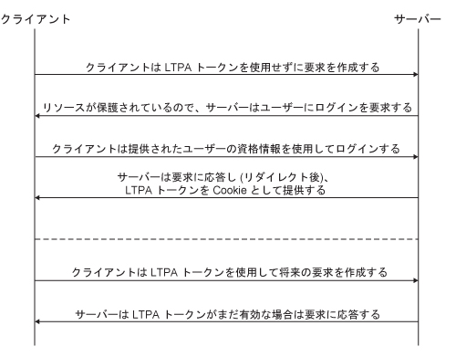
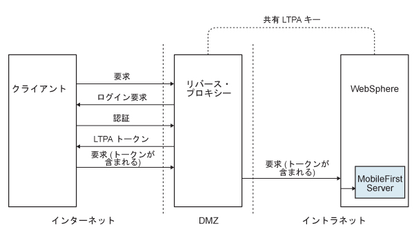

<!-- NLS_CHARSET=UTF-8 -->
## 概説
{: #overview }
LTPA (Lightweight Third-Party Authentication) トークンは、IBM WebSphere Application Server およびその他の IBM 製品によって使用されるセキュリティー・トークンのタイプです。LTPA は、認証ユーザーの資格情報をバックエンド・サービスに送信するために使用することができます。また、ユーザーと複数のサーバー間でシングル・サインオン (SSO) トークンとして使用することもできます。

以下は、LTPA を使用するシンプルな「クライアント < - > サーバー」のフローを示します。

ユーザーがサーバーにログインした後、サーバーは LTPA トークン (認証ユーザーの情報を含む暗号化されたハッシュ) を生成します。このトークンは、トークンをデコードするすべてのサーバー間で共用される秘密鍵によって署名されます。このトークンは通常、HTTP サービス の Cookie 形式です。トークンを Cookie として送信することにより、以降のユーザー対話が不要となります。

LTPA トークンには、セッション・ハイジャックの可能性を削減するための構成可能な有効期限があります。

## LTPA を使用したリバース・プロキシー
{: #reverse-proxy-with-ltpa }
ご使用のインフラストラクチャーでは、LTPA トークンを使用して、ユーザーに代わって機能するバックエンド・サーバーと通信することもできます。リバース・プロキシー・トポロジーでは、ユーザーはバックエンド・サーバーに直接アクセスすることはできません。リバース・プロキシーを使用して、ユーザーの ID を認証してから、認証済みユーザーの LTPA トークンをバックエンド・サーバーに送信できます。この構成により、ユーザーが認証されるまで {{ site.data.keys.mf_server }} へのアクセス権限が取得できなくなります。これは、例えば、重要なユーザー資格情報を処理するために {{ site.data.keys.product }} を使用しない場合や、既存の認証セットアップを使用する場合に役立ちます。エンタープライズ環境では、IBM WebSphere DataPower や IBM Security Access Manager などのリバース・プロキシーを DMZ 内で使用し、{{ site.data.keys.mf_server }} をイントラネット内に配置する必要があります。

リバース・プロキシー実装では、{{ site.data.keys.mf_server }} は、LTPA 認証でユーザー ID を取得するように構成する必要があります。

以下は、リバース・プロキシーを使用する、クライアントとバックエンド・サーバーの間の LTPA フローを示します。

##  {{ site.data.keys.product_adj }} とリバース・プロキシーの統合
{: #mobilefirst-integration-with-a-reverse-proxy }
リバース・プロキシーを使用して、{{ site.data.keys.product_adj }} 環境内での全社的な接続を可能にし、{{ site.data.keys.product }} への認証サービスを提供します。

### アーキテクチャーの概要
{: #general-architecture }
リバース・プロキシーは通常、下記の図に示すように、デプロイメントの一部として {{ site.data.keys.mf_server }} インスタンスの前に置かれ、ゲートウェイ・パターンに従います。

**MFP** アイコンは {{ site.data.keys.mf_server }} のインスタンスを表します。**GW** アイコンは、WebSphere DataPower などのリバース・プロキシー・ゲートウェイを表します。インターネットからの {{ site.data.keys.product_adj }} リソースの保護に加え、リバース・プロキシーは HTTPS (SSL) 接続の終了や認証を行います。リバース・プロキシーは、ポリシー・エンフォースメント・ポイント (PEP) としても機能できます。

ゲートウェイを使用すると、デバイス (**D**) 上のアプリケーション (**A**) は、内部の {{ site.data.keys.mf_server }} URI ではなく、そのゲートウェイが通知するパブリック URI を使用します。パブリック URI はアプリケーション内の設定として公開できます。あるいは、アプリケーションをパブリックまたはプライベートのアプリケーション・ストアに公開する前に、アプリケーションを実動にプロモーションするときに組み込むこともできます。

### ゲートウェイでの認証
{: #authentication-at-the-gateway }
ゲートウェイで認証が終了すれば、{{ site.data.keys.product }} は、認証されたユーザーの通知を共有コンテキスト、例えばカスタム HTTP ヘッダーや Cookie で受けることができます。拡張可能な認証フレームワークを使用すれば、それらのメカニズムのいずれかから受け取るユーザー ID を使用して正常なログインを確立するよう、{{ site.data.keys.product }} を構成することができます。以下の図に、このゲートウェイ・トポロジーの標準的な認証フローを示します。

この構成は、LTPA ベースの認証に関して、WebSphere DataPower を使用して正常にテスト済みです。認証が成功すると、ゲートウェイは LTPA トークン (HTTP Cookie の形式で) を WebSphere Application Server に転送し、そこで LTPA トークンが検証され、呼び出し元プリンシパルが作成されます。{{ site.data.keys.product }} は、必要に応じて、この呼び出し元プリンシパルを使用できます。

## {{ site.data.keys.product_adj }} LTPA ベースの SSO セキュリティー検査
{: #the-mobilefirst-ltpa-based-sso-security-check }
事前定義の {{ site.data.keys.product_adj }} LTPA ベースのシングル・サインオン (SSO) セキュリティー検査 (**LtpaBasedSSO**) を使用すると、{{ site.data.keys.product }} を WebSphere Application Server LTPA プロトコルと統合できます。このセキュリティー検査により、前述のセクションで説明したように、LTPA ベースのゲートウェイ・トポロジー内の {{ site.data.keys.mf_server }} のインスタンスを統合でき、またバックエンド・サービスを使用して SSO LTPA トークンによってユーザーを認証できます。

この事前定義のセキュリティー検査は、{{ site.data.keys.product_adj }} セキュリティー・フレームワーク内のその他のセキュリティー検査と同じように使用できます。すなわち、カスタム・スコープ・エレメントをこの検査にマップし、保護リソース・スコープ内または必須アプリケーション・スコープ内でこの検査 (またはそれを含むスコープ・エレメント) を使用できます。

ご使用のアプリケーションに合わせて、このセキュリティー検査の動作を構成することもできます。

## LTPA ベースの SSO セキュリティー検査の構成
{: #configuring-the-ltpa-based-sso-security-check }
事前定義の LTPA ベースのシングル・サインオン (SSO) セキュリティー検査 (**LtpaBasedSSO**) には、単一の構成可能プロパティー  **expirationSec** があります。このプロパティーは、セキュリティー検査成功状態の有効期間を設定します。有効期間は、実行の成功後に再び検査を呼び出すための最小間隔を決定します。

> **注:** この手順では、{{ site.data.keys.mf_console }} を使用してプロパティー値を構成する方法について説明します。代わりに、**application-descriptor** ファイル内にプロパティー値を直接設定することもできます。詳しくは、『アプリケーション・セキュリティー検査プロパティーの構成』を参照してください。

1. {{ site.data.keys.mf_console }} ウィンドウを開きます。**ナビゲーション・サイドバー**からアプリケーション・バージョンを選択し、**「セキュリティー」**タブを選択します。
2. **「セキュリティー検査の構成」**セクションで、**「新規」**をクリックします。
3. **「セキュリティー検査プロパティーの構成」**ウィンドウで、**LTPA ベースの SSO** セキュリティー検査を構成します。
    * **「セキュリティー検査」**フィールドで、リストから **LtpaBasedSSO** を選択します。
    * **「成功状態有効期間 (秒) (Expiration Period Successful State (seconds))」**フィールドに、セキュリティー検査の成功状態の有効期間 (任意の秒数) を設定します。

構成が完了したら、アプリケーションの「セキュリティー」タブの「セキュリティー検査の構成」表で、LtpaBasedSSO セキュリティー検査構成を表示および編集できます。
