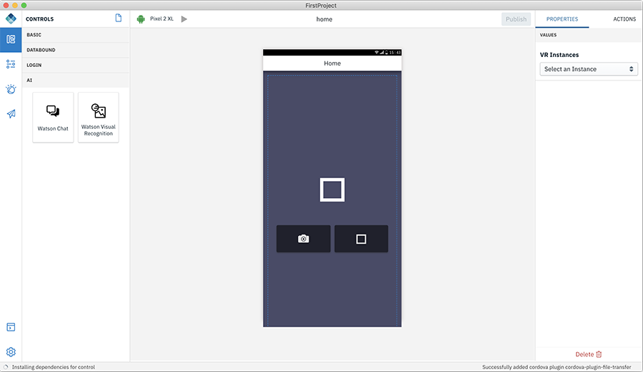
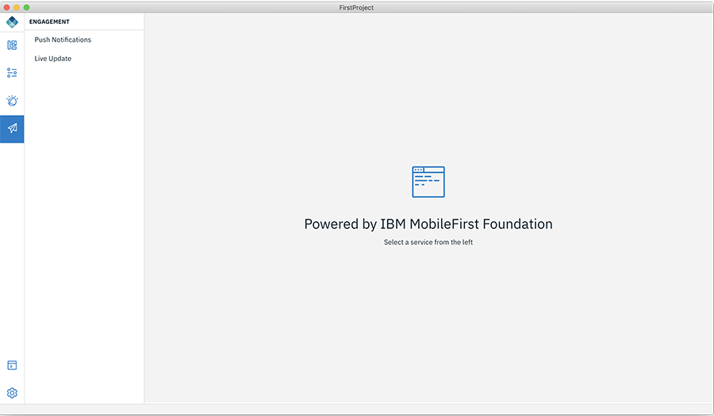

<!-- NLS_CHARSET=UTF-8 -->
## 概説
{: #digital-app-builder-interface }

Digital App Builder インターフェースは、左ナビゲーション・パネルにある以下のコンポーネントで構成されます。

* **ワークベンチ (Workbench)** - ページの詳細の表示/非表示を切り替えます。
* **データ (Data)** - 既存のデータ・ソースに接続してデータ・セットを追加したり、OpenAPI 文書を使用してマイクロサービスのデータ・ソースを作成したりするのに役立ちます。 
* **Watson** - 既存のインスタンスの構成または新規インスタンスの作成のための Image Recognition コンポーネント およびチャットボット (Watson Assistant) コンポーネントで構成されます。 
* **エンゲージメント (Engagement)** - プッシュ通知サービスを追加して、アプリケーションでのユーザー・エンゲージメントを増やすことができます。
* **コンソール (Console)**: 各コンポーネントのアクティビティーおよびコードを確認するためのコンソールが表示されます。 
* **設定**: アプリケーションの詳細、サーバー情報、プラグイン、およびプロジェクトの修復 (依存関係の再ビルド、プラットフォームの再ビルド、IBM Cloud 資格情報のリセットなど) が表示されます。

### ワークベンチ (Workbench)
{: #workbench }

ワークベンチ (Workbench) は、ページの設計に役立ちます。 ワークベンチ (Workbench) は、以下の 3 つの作業領域で構成されます。

1. **ページ/コントロール**: この領域には、デフォルトで作成されたページの名前が表示されます。 新規ページを作成するには、**+** 記号を使用します。 **「コントロール」**アイコンをクリックすると、アプリケーションのページに機能を追加するのに役立つコントロールが表示されます。 各コントロール・パレットのコントロールをページのキャンバスにドラッグ・アンド・ドロップできます。 各コントロールには、プロパティーとアクションのセットがあります。

    以下に、提供されている使用可能なコントロールのリストを示します。
    * **基本**: 基本コントロール (ボタン (Button)、見出し (Heading)、画像 (Image)、ラベル (Label)) をキャンバスにドラッグ・アンド・ドロップし、プロパティーおよびアクションを構成できます。

        

        * **ボタン (Button)** - ボタンには、ラベル付けするためのプロパティーがあります。 「アクション」タブで、ボタンのクリック時にナビゲートするページを指定できます。
        * **見出しテキスト (Heading Text)** - 「ページ・タイトル」など、アプリケーションの見出しテキストを追加できます。
        * **画像 (Image)** - ローカル画像をアップロードするか、画像の URL を指定できます。
        * **ラベル (Label)** - 静的テキストをページ本体に追加できます。 
    * **バインドされたデータ (Databound)** - データ・セットに接続し、データ・セット内のエンティティーを操作できます。 「バインドされたデータ (Databound)」は、**「リスト (List)」**と**「接続されたラベル (Connected Labels)」**という 2 つのコンポーネントで構成されます。

        

        * **リスト (List)** - 新規ページを作成し、リスト・コンポーネントをドラッグ・アンド・ドロップします。 **「リスト・タイトル (List Title)」**の追加、操作するリスト・タイプの選択、操作するコンテンツの追加、使用するデータ・セットの選択を行います。

    * **ログイン** - 「ログイン」は、**「ログイン・フォーム (Login Form)」**コントロールで構成されます。 ログイン・フォームをページにドラッグ・アンド・ドロップします。
 
        「ログイン・フォーム (Login Form)」コントロールにより、ユーザーを Mobile Foundation サーバーに接続するためのアプリケーションのログイン・ページを作成できます。 Mobile Foundation サーバーは、ユーザーを認証し、そのセキュリティー・コンテキストを提供してデータ・セットにアクセスできるようにするための、セキュリティー・フレームワークを提供します。 詳しくは、[こちら](https://mobilefirstplatform.ibmcloud.com/tutorials/en/foundation/8.0/authentication-and-security/creating-a-security-check/)を参照してください。

        

        「ログイン・フォーム (Login Form)」を有効にするには、以下のステップを実行します。

        1. Mobile Foundation Server で以下の変更を行います。
            * ユーザー名とパスワードを入力として受け取るセキュリティー検査アダプターをデプロイします。 [こちら](https://github.com/MobileFirst-Platform-Developer-Center/SecurityCheckAdapters/tree/release80)のサンプル・アダプターを使用できます。
            * mfpconsole で、アプリケーションのセキュリティー・タブに移動し、「必須アプリケーション・スコープ」で、上記で作成したセキュリティー定義をスコープ・エレメントとして追加します。
        2. ビルダーを使用して、アプリケーションの以下の構成を行います。
            * **「ログイン・フォーム (Login Form)」**コントロールをページのキャンバスに追加します。
            * **「プロパティー」**タブで、**「セキュリティー検査名 (Security check name)」**および**「ログイン成功時 (On Login Success)」**にナビゲートするページを指定します。
            * アプリケーションを実行します。
    * **AI** - AI コントロールにより、Watson AI 機能をアプリケーションに追加できます。

        * **Watson Chat** - このコントロールは、IBM Cloud 上の Watson Assistant サービスを利用できる完全なチャット・インターフェースを提供します。 

            

            * プロパティー・セクションで、構成済みの Watson Assistant サービスを選択し、接続先のワークスペースを選択します。 チャット会話を定義およびトレーニングするには、『Watson』の『[チャットボット](#chatbot)』を参照してください。

        * **Watson Visual Recognition** - このコントロールは、写真を撮って Watson Visual Recognition サービスによってそれを識別する機能を提供します。
         
            
 
            *  プロパティー・セクションで、構成済みの Visual Recognition サービスおよび分類モデルを選択します。 独自の画像を使用して定義およびトレーニングを行うには、『Watson』の『[画像認識](#image-recognition)』を参照してください。

2. **「キャンバス (Canvas)」**セクション - この領域は、選択されている現行チャネル、現行ページ名、「設計」と「コード」のトグル、および「キャンバス (Canvas)」で構成されます。

    * **「チャネル (Channel)」**アイコン - これにより、選択されている現行チャネルが表示されます。 **「設定」>「アプリ」>「アプリの詳細」**の「プラットフォーム」セクションで必要なチャネルを選択することで、チャネルをさらに追加できます。
    * 現行ページ名 (Current Page Name) - キャンバス・ページ名が表示されます。 ページを切り替えると、現行ページ名は、選択されたページに更新されます。
    * **設計/コード** - このオプションにより、コード・エディター・ビューを有効にしてコードを編集したり、設計を再度表示してエラーをデバッグしたりすることができます。 キャンバスで、「設計」から「コード」へ切り替えて、プロジェクト・エディター内で特定のファイルのコードを表示します。 「設計」から「コード」に切り替えると、以下のポップアップ画面が表示されます。

        

        **警告** - **「作成」**をクリックすると、アプリケーションの編集可能バージョンがローカルで作成されます。 編集可能バージョンで行った変更は、元のアプリケーションには反映されず、その逆も同様です。 これにより、プロジェクト・エクスプローラーがアプリケーションのすべてのプロジェクト・ファイルとともに表示されます。

    * **キャンバス (Canvas)** - このセクションの中心に、設計またはコードのいずれかを表示するキャンバスがあります。 コントロールをドラッグアンドドロップして、アプリケーションを作成することができます。

3. **「プロパティー」/「アクション」**タブ - 右側に、プロパティーとアクションのタブがあります。 コントロールがキャンバスに配置されると、コントロールのプロパティーを編集および変更したり、実行する関連アクションにコントロールを接続したりすることができます。

### データ (Data)
{: #dataset-integration}

マイクロサービスのデータ・セットを作成するには、以下のステップを実行します。 データ・セットの作成後、アプリケーションでデータ・バインドされたコントロールを接続することができます。

#### 新規データ・セットの作成

1. Digital App Builder のランディング・ページで、既存のアプリケーションを開くか、アプリケーションを作成します。
2. 左側のパネルにある**「データ (Data)」**をクリックします。

    

3. **「新規データ・セットの追加」**をクリックします。 これにより、「データ・セットの追加」ウィンドウが表示されます。

    

4. データ・セットを作成します。 既存のソースから作成する (デフォルト) か、OpenAPI 文書を使用してマイクロサービスのデータ・ソースを作成できます。
    * **既存のデータ・ソースから作成します** (デフォルト) - これを使用すると、構成されている Mobile Foundation サーバー・インスタンスからのすべてのデータ・ソース (アダプター) がドロップダウンに取り込まれます。 
    * **OpenAPI 文書を使用してマイクロサービスのデータ・ソースを作成します** - このオプションを使用すると、Open API 仕様文書 (Swagger json/yml) ファイルからデータ・ソースを作成し、そこからデータ・セットを作成できます。

#### 既存のデータ・ソースからのデータ・セットの作成

1. データ・セットを作成するデータ・ソースを選択します。
2. これにより、データ・ソース内の使用可能なエンティティーが取り込まれます。 作成するエンティティーを選択します。
3. データ・セットに名前を付け、**「追加」**ボタンをクリックします。 これによりデータ・セットが追加され、そのデータ・セットに関連付けられている属性およびアクションを確認できるようになります。

    

4. データ・セットで行う内容に基づいて、一部の属性およびアクションを非表示にすることができます。
5. 属性の**「表示ラベル (Display Labels)」**を編集することもできます。
6. また、必要な属性を指定し、アクションの一部である**「このアクションを実行」**をクリックすることで、任意の GET アクションをテストすることもできます。 これが機能するには、**「設定」**タブで機密クライアント名およびパスワードを指定しておく必要があることに注意してください。

#### swagger ファイルを使用したマイクロサービスのデータ・ソースの作成

1. データ・ソースを作成する **json/yml** ファイルを選択し、**「生成 (Generate)」**をクリックします。
2. これにより、アダプターが生成されます。アダプターは、再使用して Mobile Foundation サーバー・インスタンスにデプロイできる、MF サーバー上の構成アーティファクトです。
3. データ・ソースの定義対象となるエンティティーを選択します。
4. データ・セットに名前を付け、**「追加」**ボタンをクリックします。
5. これによりデータ・セットが追加され、そのデータ・セットに関連付けられている属性およびアクションを確認できるようになります。

これで、このデータ・セットを任意のデータ・バインドされたコントロールにバインドできるようになりました。

### Watson
{: #integrating-with-watson-services}

Digital App Builder は、IBM Cloud でプロビジョンされたさまざまな Watson サービスに接続するようにアプリケーションを構成する機能を提供します。

#### チャットボット
{: #chatbot }

チャットボットは、IBM Cloud 上の Watson Assistant サービスによって提供されます。 IBM Cloud で Watson Assistant インスタンスを作成します。 詳しくは、[こちら](https://cloud.ibm.com/catalog/services/watson-assistant-formerly-conversation)を参照してください。

構成後、新規**ワークスペース**を作成できます。 ワークスペースは、チャットボットを構成する一連の会話です。 ワークスペースの作成後、ダイアログの作成を開始します。 特定のインテントの一連の質問と、そのインテントの一連の回答を提供します。 Watson Assistant は自然言語理解を使用し、提供されたサンプル質問に基づいてインテントを解釈します。 その後、ユーザーがさまざまなスタイルで尋ねた質問を解釈し、そのインテントにマップしようとすることができます。

アプリケーションでチャットボットを有効にするには、以下のステップを実行します。

1. **「Watson」**をクリックし、**「Chatbot」**をクリックします。 これにより、**「Watson Assistant の操作」**画面が表示されます。

    

2. **「接続」**をクリックして Watson Assistance インスタンスに接続します。

    

3. **「API 鍵」**の詳細を入力し、Watson Assistance インスタンスの**「URL」**を指定します。 
4. チャットボットの**「名前」**を指定し、**「接続」**をクリックします。 これにより、指定された**「名前」**のチャット・サービス・ダッシュボードが表示されます。

    

5. **「ワークスペースの追加」**をクリックして、ワークスペースを追加します。これにより**「新規モデルの作成」**ポップアップが表示されます。

    

6. **「ワークスペース名」**および**「ワークスペースの説明」**を入力し、**「作成」**をクリックします。 これにより、3 つの**「会話」**ワークスペース (「ようこそ (Welcome)」、「一致なし (No match found)」、および「新規会話」) が作成されます。

    

7. **「新規会話」**をクリックして、新規チャットボット・モデルをトレーニングします。 

    

8. 質問と回答を CSV ファイルとして、または個別の質問と回答として追加します。 例えば、「ユーザーが質問したい場合」に対して**「ユーザー文の追加」**を使用し、 **「ボットは以下のように応答する必要があります」**に対して**「ボット応答の追加」**を使用します。 あるいは、質問、およびボットが応答する回答をアップロードすることもできます。
9. **「保存」**をクリックします。
10. 右下にある「チャットボット」アイコンをクリックして、チャットボットをテストします。

    

#### 画像認識 
{: #image-recognition }

画像認識機能は、IBM Cloud 上の Watson Visual Recognition サービスによって提供されます。 IBM Cloud で Watson Visual Recognition インスタンスを作成します。 詳しくは、[こちら](https://cloud.ibm.com/catalog/services/visual-recognition)を参照してください。

構成後、新規モデルを作成し、クラスをそのモデルに追加できます。 画像をビルダーにドラッグ・アンド・ドロップしてから、該当する画像でモデルをトレーニングできます。 トレーニングの完了後、CoreML モデルをダウンロードすることも、作成したモデルをアプリケーションの AI コントロールで使用することもできます。

アプリケーションで画像認識を有効にするには、以下のステップを実行します。

1. **「Watson」**をクリックし、**「Image Recognition」**をクリックします。 これにより、**「Watson Visual Recognition の操作」**画面が表示されます。

    

2. **「接続」**をクリックして Watson Visual Recognition インスタンスに接続します。

    

3. **「API 鍵」**の詳細を入力し、Watson Visual Recognition インスタンスの**「URL」**を指定します。 
4. アプリケーションの Image Recognition インスタンスの**「名前」**を指定し、**「接続」**をクリックします。 これにより、モデルのダッシュボードが表示されます。

    

5. **「新規モデルの追加」**をクリックして、新規モデルを作成します。 これにより、**「新規モデルの作成」**ポップアップが表示されます。

    

6. **「モデル名」**を入力し、**「作成」**をクリックします。 これにより、そのモデルのクラスおよび**「ネガティブ」**クラスが表示されます。

    

7. **「新規クラスの追加」**をクリックします。 これにより、新規クラスの名前を指定するためのポップアップが表示されます。

    

8. 新規クラスの**「クラス名」**を入力し、**「作成」**をクリックします。 これにより、モデルをトレーニングするための画像を追加するワークスペースが表示されます。

    

9. 画像をワークスペースにドラッグ・アンド・ドロップするか、「参照 (Browse)」を使用して画像にアクセスして、画像をモデルに追加します。

10. 画像を追加した後にワークスペースに戻って、**「モデルのテスト (Test Model)」**をクリックしてテストできます。

    

11. **「モデルを試してみてください」**セクションで、画像を追加すると、結果が表示されます。

### エンゲージメント (Engagement)
{: #engagement}

プッシュ通知をアプリケーションに追加し、ユーザー・エンゲージメントを増やすことができます。

プッシュ通知をアプリケーションに追加するには、以下のようにします。

1. **「エンゲージメント (Engagement)」**を選択します。 これにより、使用可能なサービスのリストが表示されます。 現時点では、プッシュ通知サービスのみが使用可能です。

    

2. **「プッシュ通知」**で、**「有効にする (Enable)」**をクリックします。これにより、「プッシュ通知の構成 (Push Notifications configuration)」ページが表示されます。

3. **「API 秘密鍵 (API Secret Key)」**および**「送信者 ID (Sender ID)」**を指定して Android のプッシュ通知を構成し、**「構成の保存 (Save configuration)」**をクリックします。

    

4. iOS タブにナビゲートし、プッシュ構成詳細を指定します。**「環境 (Environment)」**を選択し、.p12 ファイルをパスとともに指定し、**「パスワード」**を入力し、**「構成の保存 (Save configuration)」**をクリックします。

    

5. 以下のステップを実行します。
    a. Android アプリの場合、`google-services.json` (firebase プロジェクトからダウンロード) を `<path_to_app>/ionic/platforms/android/app` フォルダーにコピーします。
    b. iOS アプリの場合、xcode プロジェクト `<path_to_app>/ionic/platforms/ios/<app>.xcodeproj` を開き、プッシュ通知機能を有効にします。詳しくは、[https://help.apple.com/xcode/mac/current/#/devdfd3d04a1](https://help.apple.com/xcode/mac/current/#/devdfd3d04a1) を参照してください。

6. サーバー・サイドで以下を行います。
 
    * [http://mobilefirstplatform.ibmcloud.com/tutorials/en/foundation/8.0/notifications/sending-notifications/#setting-up-notifications](http://mobilefirstplatform.ibmcloud.com/tutorials/en/foundation/8.0/notifications/sending-notifications/#setting-up-notifications) に従って、サーバー・サイドでプッシュ通知を有効にします。

    * [http://mobilefirstplatform.ibmcloud.com/tutorials/en/foundation/8.0/notifications/sending-notifications/#sending-notifications](http://mobilefirstplatform.ibmcloud.com/tutorials/en/foundation/8.0/notifications/sending-notifications/#sending-notifications) に従って、サーバーから通知を送信します。

**注**:
MFP サーバーからのプッシュ通知は、通知サービスを有効にするために使用されます。したがって、IBM Cloud プッシュ通知サービスが以前に使用されていた場合は、リンク [http://mobilefirstplatform.ibmcloud.com/tutorials/en/foundation/8.0/notifications/sending-notifications/#setting-up-notifications](http://mobilefirstplatform.ibmcloud.com/tutorials/en/foundation/8.0/notifications/sending-notifications/#setting-up-notifications) に従って MFP サーバーに通知を設定します。

### コンソール (Console)
{: #console }

各コンポーネントのコードを表示できます。 また、さまざまなアクティビティーおよびエラーに関する情報も表示されます。

### 設定
{: #settings}

「設定」は、アプリケーションの設定の管理およびビルド・プロセス時におけるエラーの修正に役立ちます。 「設定」は、**「アプリの詳細」**、**「サーバー」**、**「プラグイン」**、および**「プロジェクトの修復」**の各タブで構成されます。

#### **アプリの詳細**
{: #app-details}

「アプリの詳細」では、アプリケーションに関する情報 (**「アプリ・アイコン」**、**「名前」**、ファイルが保管される**「ロケーション」**、アプリケーションの作成時に指定された**「プロジェクト/バンドル ID」**、選択された**「プラットフォーム」**(チャネル)、有効になっている**「サービス」**) が表示されます。

アイコンをクリックし、新しいアイコンをアップロードすることで、**「アプリ・アイコン」**を変更できます。

プラットフォームを追加または削除するには、その近くのチェック・ボックスのチェック・マークを付けるか外します。

**「保存」**をクリックして変更を更新します。

#### **サーバー**
{: #server }

サーバーの情報では、現在作業している**「サーバー詳細」**が表示されます。 **「編集」**リンクをクリックして、情報を編集できます。 機密クライアント許可を追加または変更できます。

「サーバー」タブでは、**「最近のサーバー」**も表示されます。

>**注**: Digital App Builder を使用してアプリを作成する時点よりも前に追加され、Digital App Studio によって作成されたアプリによって使用されていないサーバーのみ、削除できます。

**「新規に接続 +」**ボタンをクリックして新規サーバーを追加し、**「新規サーバーへの接続」**ポップアップに詳細を指定し、**「接続」**をクリックすることもできます。

#### **プラグイン**
{: #plugins}

プラグインでは、Digital App Builder で使用可能なプラグインのリストが表示されます。 以下のアクションを実行できます。

* **新規インストール** - このボタンをクリックして、新規プラグインをインストールできます。 これにより、**「新規プラグイン」**ダイアログが表示されます。 **「プラグイン名」**、**「バージョン (Version)」**(オプション) を入力し、**「ローカル・プラグイン (Local plugin)」**の場合は該当するスイッチを有効にしてロケーションを指定し、**「インストール」**をクリックします。

* 既にインストールされているプラグインのリストから、バージョンを編集し、プラグインを再インストールするか、各プラグインのリンクを選択してプラグインをアンインストールできます。

#### プロジェクトの修復
{: #repair-project}

「プロジェクトの修復」タブでは、各オプションをクリックして問題を修正できます。

* **依存関係の再ビルド** - プロジェクトが不安定な場合は、依存関係の再ビルドを試行できます。
* **プラットフォームの再ビルド** - コンソールでプラットフォーム関連のエラーが表示された場合は、プラットフォームの再ビルドを試行してください。 チャネルを変更した場合、またはチャネルを追加した場合は、このオプションを使用します。
* **プレイグラウンド・サーバー用の IBM Cloud 資格情報のリセット** - プレイグラウンド・サーバーへのログインに使用する IBM Cloud 資格情報をリセットできます。 資格情報キャッシュをリセットすると、プレイグラウンド・サーバー上のアプリケーションもすべて消去されます。 **この操作を元に戻すことはできません。**

 
