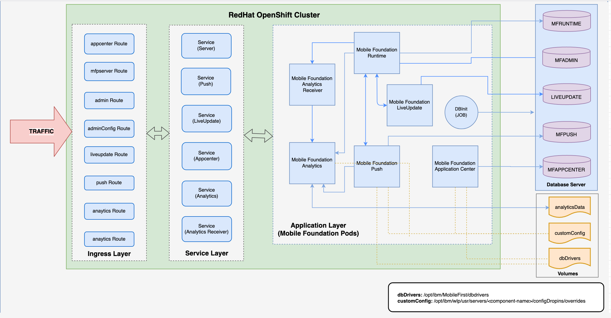

<!-- NLS_CHARSET=UTF-8 -->

IBM Mobile Foundation Operator を使用して OpenShift クラスターに Mobile Foundation インスタンスをインストールする方法について説明します。

OpenShift Container Platform の使用権を取得する方法は 2 つあります。

* OpenShift Container Platform の使用権を含む IBM Cloud Pak for Applications の使用権を所持している。
* 既存の OpenShift Container Platform (Red Hat から購入) を所持している。

OCP に Mobile Foundation をデプロイする手順は、OCP の使用権を取得した方法にかかわらず同じです。

## 前提条件
{: #prereqs}

以下は、Mobile Foundation Operator を使用して Mobile Foundation インスタンスをインストールするプロセスを開始する前に満たす必要がある前提条件です。

- OpenShift クラスター v3.11 以上。
- [OpenShiftクライアント・ツール](https://docs.openshift.com/container-platform/3.11/cli_reference/get_started_cli.html) (`oc`)。
- Mobile Foundation にはデータベースが必要です。 サポートされているデータベースを作成し、データベース・アクセスの詳細を以後使用できるように用意します。 [ここ](https://mobilefirstplatform.ibmcloud.com/tutorials/ru/foundation/8.0/installation-configuration/production/prod-env/databases/)を参照してください。
- Mobile Foundation Analytics には、Analytics データを保持するためのマウント済みストレージ・ボリュームが必要です (NFS 推奨)。

## アーキテクチャー
{: #architecture}

以下の図は、Red Hat OpenShift でのモバイル・サービスの内部アーキテクチャーを示しています。



## IBM Mobile Foundation インスタンスのインストール

### IBM Mobile Foundation パッケージのダウンロード
{: #download-mf-package}

[IBM パスポート・アドバンテージ (PPA)](https://www-01.ibm.com/software/passportadvantage/pao_customer.html) から Openshift 用の IBM Mobile Foundation パッケージをダウンロードします。 アーカイブを `workdir` という名前のディレクトリーに解凍します。

  > **注:** PPA パッケージを確認し、署名を検証する場合、[ここ](./additional-docs/validating-ppa/)を参照してください。

### Mobile Foundation 用の OpenShift プロジェクトのセットアップ
{: #setup-openshift-for-mf}

1. OpenShift クラスターにログインし、新規プロジェクトを作成します。   
   ```bash
   export MFOS_PROJECT=<project-name>
   oc login -u <username> -p <password> <cluster-url>
   oc new-project $MFOS_PROJECT
   ```
2. 以下のコマンドを使用して、Openshift 用の IBM Mobile Foundation パッケージを解凍します。
  ```bash
  tar xzvf IBM-MobileFoundation-Openshift-Pak-<version>.tar.gz -C <workdir>/
  ```
3. ローカルからイメージをロードし、OpenShift レジストリーにプッシュします。   
   ```bash
    docker login -u <username> -p $(oc whoami -t) $(oc registry info)
    cd <workdir>/images
    ls * | xargs -I{} docker load --input {}

    for file in * ; do
      docker tag ${file/.tar.gz/} $(oc registry info)/$MFOS_PROJECT/${file/.tar.gz/}
      docker push $(oc registry info)/$MFOS_PROJECT/${file/.tar.gz/}
    done
   ```
4. データベース資格情報を使用して秘密を作成します。

    ```yaml
    cat <<EOF | oc apply -f -
    apiVersion: v1
    data:
      MFPF_ADMIN_DB_USERNAME: <base64-encoded-string>
      MFPF_ADMIN_DB_PASSWORD: <base64-encoded-string>
      MFPF_RUNTIME_DB_USERNAME: <base64-encoded-string>
      MFPF_RUNTIME_DB_PASSWORD: <base64-encoded-string>
      MFPF_PUSH_DB_USERNAME: <base64-encoded-string>
      MFPF_PUSH_DB_PASSWORD: <base64-encoded-string>
      MFPF_APPCNTR_DB_USERNAME: <base64-encoded-string>
      MFPF_APPCNTR_DB_PASSWORD: <base64-encoded-string>
    kind: Secret
    metadata:
      name: mobilefoundation-db-secret
    type: Opaque
    EOF
    ```
  > **注**: `echo -n <string-to-encode> | base64` を使用して、エンコードされたストリングを取得できます。

5. Mobile Foundation Analytics の場合、永続ボリューム (PV) を構成します。
    ```yaml
    cat <<EOF | kubectl apply -f -
    apiVersion: v1
    kind: PersistentVolume
    metadata:
      labels:
        name: mfanalyticspv  
      name: mfanalyticspv
    spec:
      capacity:
        storage: 20Gi
      accessModes:
        - ReadWriteMany
      persistentVolumeReclaimPolicy: Retain
      nfs:
        path: <nfs-mount-volume-path>
        server: <nfs-server-hostname-or-ip>
    EOF
    ```

6. Mobile Foundation Analytics の場合、永続ボリューム要求 (PVC) を構成します。
   ```yaml
   cat <<EOF | kubectl apply -f -
    apiVersion: v1
    kind: PersistentVolumeClaim
    metadata:
      name: mfanalyticsvolclaim
      namespace: <projectname-or-namespace>
    spec:
      accessModes:
        - ReadWriteMany
      resources:
        requests:
          storage: 20Gi
      selector:
        matchLabels:
          name: mfanalyticspv
      volumeName: mfanalyticspv
    EOF
   ```

### IBM Mobile Foundation Operator のデプロイ
{: #deploy-mf-operator}

1. `deploy/operator.yaml` (**REPO_URL**) で、タグ付きの Operator イメージ名 (*mf-operator*) がオペレーターに対して設定されていることを確認します。

    ```bash
    sed -i 's|REPO_URL|<image-repo-url>:<image-tag>|g' deploy/operator.yaml
    ```

2. `deploy/cluster_role_binding.yaml` (**REPLACE_NAMESPACE**) で、クラスター・ロール・バインディング定義に対して名前空間が設定されていることを確認します。

    ```bash
    sed -i 's|REPLACE_NAMESPACE|$MFOS_PROJECT|g' deploy/cluster_role_binding.yaml
    ```

3. 以下のコマンドを実行して CRD、オペレーターをデプロイし、セキュリティー・コンテキスト制約 (SCC) をインストールします。

    ```bash
    oc create -f deploy/crds/charts_v1_mfoperator_crd.yaml
    oc create -f deploy/
    oc adm policy add-scc-to-group mf-operator system:serviceaccounts:$MFOS_PROJECT
    ```

### IBM Mobile Foundation コンポーネントのデプロイ
{: #deploy-mf-components}

1. いずれかの Mobile Foundation コンポーネントをデプロイするには、要件に従いカスタム・リソース構成 `deploy/crds/charts_v1_mfoperator_cr.yaml` を変更します。 [ここ](./additional-docs/cr-configuration/)に、カスタム構成の全リファレンスがあります。

   > **重要事項**: デプロイメント後に Mobile Foundation インスタンスにアクセスするには、入口ホスト名を構成する必要があります。 カスタム・リソース構成で入口が構成されていることを確認してください。 この構成については、この[リンク](./additional-docs/enable-ingress/)を参照してください。

    ```bash
    oc apply -f deploy/crds/charts_v1_mfoperator_cr.yaml
    ```
2. 以下のコマンドを実行し、ポッドが正常に作成され、実行されていることを確認します。 Mobile Foundation サーバーおよび Push が 3 つの各レプリカ (デフォルト) で有効になっているデプロイメント・シナリオでは、出力は以下のようになります。

      ```bash
      $ oc get pods
      NAME                           READY     STATUS    RESTARTS   AGE
      mf-operator-5db7bb7w5d-b29j7   1/1       Running   0          1m
      mfpf-server-2327bbewss-3bw31   1/1       Running   0          1m 20s
      mfpf-server-29kw92mdlw-923ks   1/1       Running   0          1m 21s
      mfpf-server-5woxq30spw-3bw31   1/1       Running   0          1m 19s
      mfpf-push-2womwrjzmw-239ks     1/1       Running   0          59s
      mfpf-push-29kw92mdlw-882pa     1/1       Running   0          52s
      mfpf-push-1b2w2s973c-983lw     1/1       Running   0          52s
      ```
    > **注:** Running (1/1) 状況のポッドは、サービスにアクセスできることを示します。
3. 以下のコマンドを実行して、Mobile Foundation エンドポイントにアクセスするためのルートが作成されているかどうか確認します。

    ```bash
    $ oc get routes
    NAME                                      HOST/PORT               PATH        SERVICES             PORT      TERMINATION   WILDCARD
    ibm-mf-cr-1fdub-mfp-ingress-57khp   myhost.mydomain.com   /imfpush          ibm-mf-cr--mfppush     9080                    None
    ibm-mf-cr-1fdub-mfp-ingress-8skfk   myhost.mydomain.com   /mfpconsole       ibm-mf-cr--mfpserver   9080                    None
    ibm-mf-cr-1fdub-mfp-ingress-dqjr7   myhost.mydomain.com   /doc              ibm-mf-cr--mfpserver   9080                    None
    ibm-mf-cr-1fdub-mfp-ingress-ncqdg   myhost.mydomain.com   /mfpadminconfig   ibm-mf-cr--mfpserver   9080                    None
    ibm-mf-cr-1fdub-mfp-ingress-x8t2p   myhost.mydomain.com   /mfpadmin         ibm-mf-cr--mfpserver   9080                    None
    ibm-mf-cr-1fdub-mfp-ingress-xt66r   myhost.mydomain.com   /mfp              ibm-mf-cr--mfpserver   9080                    None
    ```

### IBM Mobile Foundation コンポーネントのコンソールへのアクセス

以下は、Mobile Foundation コンポーネントのコンソールにアクセスするためのエンドポイントです。

  * **Mobile Foundation サーバーの管理コンソール** - `http://<ingress_hostname>/mfpconsole`
  * **Operational Analytics コンソール** - `http://<ingress_hostname>/analytics/console`
  * **Application Center コンソール** - `http://<ingress_hostname>/appcenterconsole`

## アンインストール
{: #uninstall}

以下のコマンドを使用して、インストール後のクリーンアップを実行します。

```bash
oc delete -f deploy/crds/charts_v1_mfoperator_cr.yaml
oc delete -f deploy/
oc delete -f deploy/crds/charts_v1_mfoperator_crd.yaml
oc patch crd/ibmmf.charts.helm.k8s.io -p '{"metadata":{"finalizers":[]}}' --type=merge
```

### その他の参照情報

1. [Mobile Foundation データベースのセットアップ](../../installation-configuration/production/prod-env/databases/)
2. [Oracle (または) MySQL を IBM Mobile Foundation データベースとして使用する](additional-docs/advanced-db-config/)
3. [Mobile Foundation のカスタム・リソース構成パラメーター](additional-docs/cr-configuration/)
4. [入口の有効化のシナリオ](additional-docs/enable-ingress/)
