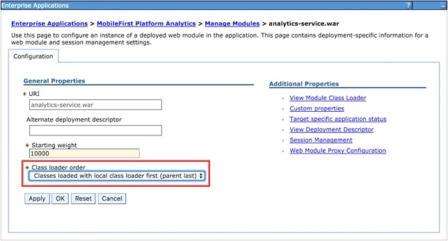

<!-- NLS_CHARSET=UTF-8 -->
## 概説
{: #overview }
{{site.data.keys.mf_analytics_server }} は、2 つの Java EE 標準 Web アプリケーション・アーカイブ (WAR) ファイルとして、または 1 つのエンタープライズ・アプリケーション・アーカイブ (EAR) ファイルとして実装されて出荷されます。そのため、サポートされるアプリケーション・サーバーである WebSphere Application Server、WebSphere Application Server Liberty、または Apache Tomcat (WAR ファイルのみ) のいずれかにインストール可能です。

{{site.data.keys.mf_analytics_server }}
では、データ・ストアとクラスター管理に組み込み Elasticsearch ライブラリーを使用します。
これは、高速ディスク入出力を要求する高性能のメモリー内検索および照会エンジンを目指すため、
いくつかの実動システム要件に従う必要があります。
一般的に、CPU が問題となる前に、メモリーとディスクが不足する (または、ディスク入出力がパフォーマンス・ボトルネックであると分かる) 可能性が高くなります。
クラスター環境では、高速で、信頼性が高く、同一場所に設置されたノード・クラスターが必要です。

#### ジャンプ先
{: #jump-to }

* [システム要件](#system-requirements)
* [容量に関する考慮事項](#capacity-considerations)
* [{{site.data.keys.mf_analytics }} の WebSphere Application Server Liberty へのインストール](#installing-mobilefirst-analytics-on-websphere-application-server-liberty)
* [{{site.data.keys.mf_analytics }} の Tomcat へのインストール](#installing-mobilefirst-analytics-on-tomcat)
* [{{site.data.keys.mf_analytics }} の WebSphere Application Server へのインストール](#installing-mobilefirst-analytics-on-websphere-application-server)
* [Ant タスクを使用した {{site.data.keys.mf_analytics }} のインストール](#installing-mobilefirst-analytics-with-ant-tasks)
* [以前のバージョンを実行しているサーバーへの {{site.data.keys.mf_analytics_server }} のインストール](#installing-mobilefirst-analytics-server-on-servers-running-previous-versions)

## システム要件
{: #system-requirements }

### オペレーティング・システム
{: #operating-systems }
* CentOS/RHEL 6.x/7.x
* Oracle Enterprise Linux 6/7 (RHEL カーネルのみ)
* Ubuntu 12.04/14.04
* SLES 11/12
* OpenSuSE 13.2
* Windows Server 2012/R2
* Debian 7

### JVM
{: #jvm }
* Oracle JVM 1.7u55+
* Oracle JVM 1.8u20+
* IcedTea OpenJDK 1.7.0.55+

### ハードウェア
{: #hardware }
* RAM: RAM は大きいほうがよいですが、ノード当たり 64 GB 以下です。
32 GB と 16 GB も許容されます。
8 GB 未満では、クラスターに多くの小さなノードが必要です。64 GB は無駄で、Java がポインターにメモリーを使用するしくみの理由で問題があります。
* ディスク: 可能な場合は SSD を使用します。あるいは、SSD が可能でなければ高速回転の従来型ディスクを RAID 0 構成で使用します。
* CPU: CPU は、傾向としてパフォーマンス・ボトルネックになりません。2 コアから 8 コアのシステムを使用します。
* ネットワーク: 水平方向のスケールアウトが必要になる場合は、1 GbE から 10 GbE の速度をサポートする、高速で、信頼性が高いデータ・センターが必要です。

### ハードウェア構成
{: #hardware-configuration }
* JVM には、使用可能な RAM の半分を設定します。ただし、32 GB を超えないでください。
    * **ES\_HEAP\_SIZE** 環境変数を 32g に設定します。
    * -Xmx32g -Xms32g を使用して JVM フラグを設定します。
* ディスク・スワップをオフにします。
オペレーティング・システムがヒープをディスクとの間でスワップできるようにすると、著しくパフォーマンスが低下します。
    * 一時的な設定: `sudo swapoff -a`
    * 永久的な設定: オペレーティング・システムの資料に従って、**/etc/fstab** を編集します。
    * どちらの選択肢も可能でない場合、Elasticsearch オプションの **bootstrap.mlockall:
true** を設定します (この値は、組み込み Elasticsearch インスタンスのデフォルトです)。
* 許容されるオープン・ファイル記述子の数を増やします。
    * Linux では通常、プロセス当たりのオープン・ファイル記述子の数を小さい 1024 に制限しています。
    * この値を永久に大幅に増やす (64,000 など) 方法について、ご使用のオペレーティング・システムの資料を調べてください。
* Elasticsearch では、さまざまなファイルに NioFS と MMapFS のミックスも使用します。
mmap されたファイルに多くの仮想メモリーが使用可能になるように、最大マップ・カウントを増やします。
    * 一時的な設定: `sysctl -w vm.max_map_count=262144`
    * 永久的な設定: **/etc/sysctl.conf** で **vm.max\_map\_count** 設定を変更します。
* BSD と Linux を使用する場合は、必ず、オペレーティング・システム入出力スケジューラーを **cfq** ではなく、**deadline** または **noop** に設定してください。

## 容量に関する考慮事項
{: #capacity-considerations }
容量は、最も共通する問題です。どれぐらいの RAM が必要か? ディスク・スペースはどれぐらいか?
ノードの数は? その答えはいつも「状況による」です。

IBM {{site.data.keys.mf_analytics }} Analytics により、生のクライアント SDK デバッグ・ログ、サーバーが報告したネットワーク・イベント、カスタム・データ、その他を含む 多くの異種イベント・タイプの収集が可能になります。これは、ビッグデータ・システム要件を持つビッグデータ・システムです。

収集するデータのタイプおよび量と、それを保持する期間は、ストレージ所要量と全体のパフォーマンスに大きく影響します。
例として、以下の問いについて検討してください。


* 生のデバッグ・クライアント・ログは、1 カ月後に有用か?
* {{site.data.keys.mf_analytics }} で**アラート**機能を使用しているか?
使用している場合、照会しているイベントは直近の数分間で発生したものか、あるいは、もっと長い範囲で発生したものか? 
* カスタム・グラフを使用しているか? 使用している場合、これらのグラフを作成している対象は、組み込みデータか、またはカスタム装備のキー/値ペアか?
データを保持する期間はどれぐらいか?

{{site.data.keys.mf_analytics_console }} の組み込みグラフは、
{{site.data.keys.mf_analytics_server }}
が最も高速の可能なコンソール・ユーザー・エクスペリエンス用に特に要約して最適化したデータを照会することで、レンダリングされます。
組み込みグラフ用に事前に要約して最適化されているため、コンソール・ユーザーが照会を定義したアラートやカスタム・グラフでの使用には適しません。

ロー文書を照会したり、フィルターを適用したり、集約を実行したり、基盤の照会エンジンで平均やパーセントを計算したりする場合、
照会のパフォーマンスは必然的に低下します。
容量を注意深く検討しなければならないのは、こうしたユース・ケースです。
照会パフォーマンスが低下したら、
リアルタイムのコンソール表示用に古いデータを保持しておく必要が本当にあるか、
あるいは、古いデータを {{site.data.keys.mf_analytics_server }} から消去するかを決断するときです。
4 カ月前のデータで、リアルタイムのコンソール表示の利便性は本当にありますか?

### 索引、シャード、およびノード
{: #indicies-shards-and-nodes }
基盤のデータ・ストアは Elasticsearch です。
索引、シャード、ノード、および構成のパフォーマンスへの影響について少し知識が必要です。
大まかに言うと、索引はデータの論理単位として考えることができます。
索引は、シャード (構成キーが shards) に 1 対多で対応します。{{site.data.keys.mf_analytics_server }}
は、文書タイプごとに別個の索引を作成します。
構成で文書タイプを何も破棄していなければ、
{{site.data.keys.mf_analytics_server }}
で提供される文書タイプの数に相当する多くの索引が作成されます。

shards を 1 に構成すると、各索引は、1 つのプライマリー・シャードだけを持ち、そこにデータが書き込まれます。shards を 10 に設定すると、各索引は 10 個のシャードにバランシングできます。ただし、ノードが 1 つだけの場合、シャードが増えると、パフォーマンス・コストが発生します。
その 1 つのノードが、同じ物理ディスク上で 10 個のシャードに各索引をバランシングしています。
クラスター内で 10 個の物理ノードに即時に (または、ほぼ即時に) 拡大する予定の場合にのみ、shards を 10 に設定してください。

同じ原理が **replicas** にも適用されます。
計算によるノード数に即時に (または、ほぼ即時に) 拡大する予定の場合にのみ、**replicas** を 0 より大きい値に設定してください。  
例えば、**shards** を 4、**replicas** を 2 に設定した場合、
4 * 2 で 8 個のノードにスケーリングできます。

## {{site.data.keys.mf_analytics }} の WebSphere Application Server Liberty へのインストール
{: #installing-mobilefirst-analytics-on-websphere-application-server-liberty }
{{site.data.keys.mf_analytics }} EAR
ファイルがあることを確認します。
インストール成果物について詳しくは、[アプリケーション・サーバーへの {{site.data.keys.mf_server }} のインストール](../../appserver)を参照してください。**analytics.ear **ファイルは、**<mf_server_install_dir>\analytics** フォルダーにあります。WebSphere Application Server Liberty のダウンロードとインストールの方法について詳しくは、IBM developerWorks の「[About WebSphere Liberty](https://developer.ibm.com/wasdev/websphere-liberty/)」の記事を参照してください。

1. **./wlp/bin** フォルダーで次のコマンドを実行して、サーバーを作成します。

   ```bash
   ./server create <serverName>
   ```

2. **./bin** フォルダーで次のコマンドを実行して、該当フィーチャーをインストールします。

   ```bash
   ./featureManager install jsp-2.2 ssl-1.0 appSecurity-1.0 localConnector-1.0
   ```

3. Liberty サーバーの **./usr/servers/<serverName>/apps** フォルダーに **analytics.ear** ファイルを追加します。
4. **./usr/servers/<serverName>/server.xml** ファイルの `<featureManager>` タグのコンテンツを以下に置き換えます。

   ```xml
   <featureManager>
        <feature>jsp-2.2</feature>
        <feature>ssl-1.0</feature>
        <feature>appSecurity-1.0</feature>
        <feature>localConnector-1.0</feature>
   </featureManager>
   ```

5. **server.xml** ファイル内に、ロール・ベースのセキュリティーを使用するアプリケーションとして **analytics.ear** を構成します。以下の例では、ハードコーディングされた基本ユーザー・レジストリーを作成し、異なる各分析ロールにユーザーを割り当てます。

   ```xml
   <application location="analytics.ear" name="analytics-ear" type="ear">
        <application-bnd>
            <security-role name="analytics_administrator">
                <user name="admin"/>
            </security-role>
            <security-role name="analytics_infrastructure">
                <user name="infrastructure"/>
            </security-role>
            <security-role name="analytics_support">
                <user name="support"/>
            </security-role>
            <security-role name="analytics_developer">
                <user name="developer"/>
            </security-role>
            <security-role name="analytics_business">
                <user name="business"/>
            </security-role>
        </application-bnd>
   </application>
<basicRegistry id="worklight" realm="worklightRealm">
        <user name="business" password="demo"/>
        <user name="developer" password="demo"/>
        <user name="support" password="demo"/>
        <user name="infrastructure" password="demo"/>
        <user name="admin" password="admin"/>
   </basicRegistry>
   ```

   > LDAP など、他のユーザー・レジストリー・タイプの構成方法について詳しくは、WebSphere Application Server 製品資料で [Liberty のユーザー・レジストリーの構成](http://ibm.biz/knowctr#SSAW57_8.5.5/com.ibm.websphere.wlp.nd.iseries.doc/ae/twlp_sec_registries.html)のトピックを参照してください。

6. **bin** フォルダー内で以下のコマンドを実行して Liberty サーバーを始動します。

   ```bash
   ./server start <serverName>
   ```

7. {{site.data.keys.mf_analytics_console }} に移動します。

   ```bash
   http://localhost:9080/analytics/console
   ```

WebSphere Application Server Liberty の管理について詳しくは、WebSphere Application Server 製品資料で[コマンド行からの Liberty の管理](http://ibm.biz/knowctr#SSAW57_8.5.5/com.ibm.websphere.wlp.nd.multiplatform.doc/ae/twlp_admin_script.html)のトピックを参照してください。

## {{site.data.keys.mf_analytics }} の Tomcat へのインストール
{: #installing-mobilefirst-analytics-on-tomcat }
{{site.data.keys.mf_analytics }} WAR
ファイルがあることを確認します。
インストール成果物について詳しくは、[アプリケーション・サーバーへの {{site.data.keys.mf_server }} のインストール](../../appserver)を参照してください。**analytics-ui.war** と **analytics-service.war** の各ファイルは、**<mf_server_install_dir>\analytics** フォルダーにあります。Tomcat のダウンロード方法とインストール方法について詳しくは、[Apache Tomcat](http://tomcat.apache.org/) を参照してください。Java 7 以上をサポートするバージョンをダウンロードするようにしてください。Tomcat のどのバージョンで Java 7 がサポートされているかについて詳しくは、[Apache Tomcat Versions](http://tomcat.apache.org/whichversion.html) を参照してください。

1. Tomcat の **webapps** フォルダーに **analytics-service.war** と **analytics-ui.war** のファイルを追加します。
2. **conf/server.xml** ファイルで以下のセクションのコメントを外します。これは、新しくダウンロードした Tomcat アーカイブ内に存在しますが、コメント化されています。

   ```xml
   <Valve className ="org.apache.catalina.authenticator.SingleSignOn"/>
   ```

3. **conf/server.xml** ファイルに 2 つの WAR ファイルを宣言し、ユーザー・レジストリーを定義します。

   ```xml
   <Context docBase ="analytics-service" path ="/analytics-service"></Context>
   <Context docBase ="analytics" path ="/analytics"></Context>
   <Realm className ="org.apache.catalina.realm.MemoryRealm"/>
   ```

   **MemoryRealm** は、**conf/tomcat-users.xml** ファイルに定義されているユーザーを認識します。その他の選択肢について詳しくは、[Apache Tomcat の「Realm Configuration HOW-TO」](http://tomcat.apache.org/tomcat-7.0-doc/realm-howto.html)を参照してください。

4. **conf/tomcat-users.xml** ファイルに以下のセクションを追加して、**MemoryRealm** を構成します。
    * セキュリティー・ロールを追加します。

      ```xml
      <role rolename="analytics_administrator"/>
      <role rolename="analytics_infrastructure"/>
      <role rolename="analytics_support"/>
      <role rolename="analytics_developer"/>
      <role rolename="analytics_business"/>
      ```
    * 必要なロールのユーザーを数人追加します。

      ```xml
      <user name="admin" password="admin" roles="analytics_administrator"/>
      <user name="support" password="demo" roles="analytics_support"/>
      <user name="business" password="demo" roles="analytics_business"/>
      <user name="developer" password="demo" roles="analytics_developer"/>
      <user name="infrastructure" password="demo" roles="analytics_infrastructure"/>
      ```    
    * Tomcat サーバーを始動し、{{site.data.keys.mf_analytics_console }}に移動します。

      ```xml
      http://localhost:8080/analytics/console
      ```

    Tomcat サーバーの始動方法について詳しくは、Tomcat の公式サイトを参照してください。例えば、Tomcat 7.0 の場合、[「Apache Tomcat 7」](http://tomcat.apache.org/tomcat-7.0-doc/introduction.html)です。

## {{site.data.keys.mf_analytics }} の WebSphere Application Server へのインストール
{: #installing-mobilefirst-analytics-on-websphere-application-server }
インストール成果物 (JAR ファイルおよび EAR ファイル) を獲得するための最初のインストール・ステップについて詳しくは、[アプリケーション・サーバーへの {{site.data.keys.mf_server }} のインストール](../../appserver)を参照してください。**analytics.ear**、**analytics-ui.war**、**analytics-service.war** の各ファイルは、**<mf_server_install_dir>\analytics** フォルダーにあります。

以下のステップでは、WebSphere Application Server に Analytics EAR ファイルをインストールし、実行する方法について説明します。WebSphere Application Server に個別の WAR ファイルをインストールする場合は、両方の WAR ファイルをデプロイした後に **analytics-service** WAR ファイルについてステップ 2 から 7 のみを実行してください。analytics-ui WAR ファイルでクラス・ロード順序を変更してはなりません。

1. EAR ファイルをアプリケーション・サーバーにデプロイします。ただし、開始はしないでください。. WebSphere Application Server に EAR ファイルをインストールする方法について詳しくは、WebSphere Application Server 製品資料で[コンソールを使用したエンタープライズ・アプリケーション・ファイルのインストール](http://ibm.biz/knowctr#SSAW57_8.5.5/com.ibm.websphere.nd.multiplatform.doc/ae/trun_app_instwiz.html)のトピックを参照してください。

2. **「エンタープライズ・アプリケーション」**リストから**「MobileFirst Analytics」**アプリケーションを選択します。

    

3. **「クラス・ロードおよび更新の検出」**をクリックします。

    

4. クラス・ロード順序を**「親が最後」**に設定します。

    

5. **「ユーザー/グループへのセキュリティー・ロールのマッピング」**をクリックして、管理ユーザーをマップします。

    

6. **「モジュールの管理」**をクリックします。

    

7. **「分析」**モジュールを選択し、クラス・ローダー順序を**「親が最後」**に変更します。

    

8. 以下のようにして、WebSphere Application Server 管理コンソールで**管理セキュリティー**と**アプリケーション・セキュリティー**を使用可能にします。
    * WebSphere Application Server 管理コンソールにログインします。
    * **「セキュリティー」>「グローバル・セキュリティー」**メニューで、**「管理セキュリティーを使用可能にする」**と**「アプリケーション・セキュリティーを使用可能にする」**の両方を必ず選択します。注: アプリケーション・セキュリティーは、**管理セキュリティー**が使用可能にされた後にのみ、選択可能です。
    * **「OK」**をクリックし、変更を保存します。
9. {{site.data.keys.mf_analytics }} アプリケーションを開始し、次のブラウザー内のリンクに移動します。`http://<hostname>:<port>/analytics/console`

## Ant タスクを使用した {{site.data.keys.mf_analytics }} のインストール
{: #installing-mobilefirst-analytics-with-ant-tasks }
必要な WAR ファイルおよび構成ファイルの **analytics-ui.war** と **analytics-service.war** があることを確認します。インストール成果物について詳しくは、[アプリケーション・サーバーへの {{site.data.keys.mf_server }} のインストール](../../appserver)を参照してください。**analytics-ui.war** と **analytics-service.war** の各ファイルは、**MobileFirst_Platform_Server\analytics** にあります。

アプリケーション・サーバー、または WebSphere Application Server Network Deployment 用の Network Deployment Manager がインストールされているコンピューターで Ant タスクを実行する必要があります。{{site.data.keys.mf_server }} がインストールされていないコンピューターから Ant タスクを開始したい場合は、ファイル **<mf_server_install_dir>/MobileFirstServer/mfp-ant-deployer.jar** をそのコンピューターにコピーする必要があります。

> 注: **mf_server_install_dir** プレースホルダーは、{{site.data.keys.mf_server }} をインストールしたディレクトリーです。

1. 後で {{site.data.keys.mf_analytics }} WAR ファイルをデプロイするために使用する Ant スクリプトを編集します。
    * [{{site.data.keys.mf_analytics }} のサンプル構成ファイル](../../installation-reference/#sample-configuration-files-for-mobilefirst-analytics)のサンプル構成ファイルを検討します。
    * ファイルの先頭でプレースホルダーの値をプロパティーに置き換えます。

    > 注: Ant XML スクリプトの値で以下の特殊文字が使用される場合は、エスケープする必要があります。
    >
    > * Apache Ant Manual の『[Properties](http://ant.apache.org/manual/properties.html)』セクションに説明されているように、ドル記号 ($) は、構文 ${variable} によって Ant 変数を明示的に参照する場合を除き、$$ と記述してください。
    > * アンパーサンド文字 (&) は、XML エンティティーを明示的に参照する場合を除き、&amp; と記述してください。
    > * 二重引用符 (") は、単一引用符で囲まれたストリング内にある場合を除き、&quot; と記述してください。

2. 複数のサーバーにクラスターのノードをインストールする場合は、以下のようにします。
    * プロパティー **wl.analytics.masters.list** のコメントを外し、その値にマスター・ノードのホスト名と転送ポートのリストを設定します。以下に例を示します。`node1.mycompany.com:96000,node2.mycompany.com:96000`
    * タスク **installanalytics**、**updateanalytics**、および **uninstallanalytics** の **elasticsearch** エレメントに属性 **mastersList** を追加します。

    **注:** WebSphere Application Server Network Deployment 上のクラスターにインストールする場合にこのプロパティーを設定しないと、 Ant タスクがインストール時にクラスターの全メンバーのデータ・エンドポイントを計算し、**masternodes** JNDI プロパティーにその値を設定します。 

3. WAR ファイルをデプロイするには、以下のコマンドを実行します。`ant -f configure-appServer-analytics.xml install` Ant コマンドは、**mf_server_install_dir/shortcuts** にあります。
    これにより、{{site.data.keys.mf_analytics }} のノードが、デフォルト・タイプのマスターとデータを使用して、サーバー、またはクラスターの各メンバー (WebSphere Application Server Network Deployment にインストールする場合) にインストールされます。
4. Ant ファイルを保存します。 後でフィックスパックの適用時やアップグレードの実行時に、これが必要になる可能性があります。
    パスワードを保存したくない場合は、対話プロンプトのために「************」(12 個のアスタリスク) でそれを置き換えることができます。

    **注:** {{site.data.keys.mf_analytics }} のクラスターにノードを追加する場合は、 analytics/masternodes JNDI プロパティーを更新して、クラスターの全マスター・ノードのポートを含めてください。

## 以前のバージョンを実行しているサーバーへの {{site.data.keys.mf_analytics_server }} のインストール 
{: #installing-mobilefirst-analytics-server-on-servers-running-previous-versions }
以前のバージョンの {{site.data.keys.mf_analytics_server }} をアップグレードするオプションはありませんが、以前のバージョンをホストしていたサーバーに {{site.data.keys.mf_analytics_server }} V8.0.0 をインストールする場合には、いくつかのプロパティーおよび分析データをマイグレーションする必要があります。

前のバージョンの {{site.data.keys.mf_analytics_server }} を以前に実行していたサーバーの場合は、
分析データと JNDI プロパティーを更新してください。

### 以前のバージョンの {{site.data.keys.mf_analytics_server }} で使用されたサーバー・プロパティーのマイグレーション
{: #migration-of-server-properties-used-by-previous-versions-of-mobilefirst-analytics-server }
前のバージョンの {{site.data.keys.mf_analytics_server }} を以前に実行していたサーバーに {{site.data.keys.mf_analytics_server }} V8.0.0 をインストールする場合は、ホスティング・サーバーで JNDI プロパティーの値を更新する必要があります。

{{site.data.keys.mf_analytics_server }} の前のバージョンと V8.0.0 の間で、いくつかのイベント・タイプが変更されました。この変更のため、ご使用のサーバー構成ファイルで以前に構成されていた JNDI プロパティーは、新しいイベント・タイプに変換する必要があります。

以下の表に、古いイベント・タイプと新しいイベント・タイプのマッピングを示します。
変更されなかったイベント・タイプもいくつかあります。

| 古いイベント・タイプ            | 新しいイベント・タイプ         |
|---------------------------|------------------------|
| AlertDefinition	        | AlertDefinition        |
| AlertNotification	        | AlertNotification      |
| AlertRunnerNode	        | AlertRunnerNode        |
| AnalyticsConfiguration    | AnalyticsConfiguration |
| CustomCharts	            | CustomChart            |
| CustomData	            | CustomData             |
| Devices	                | Device                 |
| MfpAppLogs                | AppLog                 |
| MfpAppPushAction          | AppPushAction          |
| MfpAppSession	            | AppSession             |
| ServerLogs	            | ServerLog              |
| ServerNetworkTransactions | NetworkTransaction     |
| ServerPushNotifications   | PushNotification       |
| ServerPushSubscriptions   | PushSubscription       |
| Users	                    | User                   |
| inboundRequestURL	        | resourceURL            |
| mfpAppName	            | appName                |
| mfpAppVersion	            | appVersion             |

### Analytics データのマイグレーション
{: #analytics-data-migration }
{{site.data.keys.mf_analytics_console }} の内部が改善されました。これには、データの保管フォーマットの変更が必要でした。既に収集された分析データとの相互作用を継続するには、データを新規データ・フォーマットにマイグレーションする必要があります。

V8.0.0 へのアップグレード後初めて {{site.data.keys.mf_analytics_console }} を表示すると、{{site.data.keys.mf_analytics_console }} で統計がレンダリングされていません。データは消失したわけではなく、新規データ・フォーマットへのマイグレーションが必要になります。

文書のマイグレーションが必要であることを注意喚起するアラートが
{{site.data.keys.mf_analytics_console }} のすべてのページに表示されます。
このアラート・テキストには、**「マイグレーション」**ページへのリンクが含まれています。

以下の画像は、**「ダッシュボード」**セクションの**「概要」**ページのサンプル・アラートを示しています。


### 「マイグレーション」ページ
{: #migration-page }
「マイグレーション」ページには、{{site.data.keys.mf_analytics_console }}のレンチ・アイコンからアクセスできます。**「マイグレーション」**ページから、マイグレーションが必要な文書の数、およびそれらの文書が保管されている索引を確認できます。
可能なアクションは、**「マイグレーションの実行」** の 1 つだけです。

以下の画像は、マイグレーションが必要な文書がある場合の**「マイグレーション」**ページを示しています。


> **注:** ユーザーのデータの量に応じてこのプロセスには長い時間がかかる場合があります。マイグレーション中にプロセスを停止することはできません。

このマイグレーションでは、単一ノード (RAM 32 GB、JVM への割り振り 16 GB、4 コア・プロセッサー) で 100 万個の文書をマイグレーションするのに約 3 分かかる可能性があります。
マイグレーションされない文書は照会されないため、それらは {{site.data.keys.mf_analytics_console }} でレンダリングされません。

進行中にマイグレーションが失敗した場合は、マイグレーションを再試行してください。マイグレーションを再試行しても、既にマイグレーションされた文書が再びマイグレーションされることはなく、データ保全性は維持されます。
