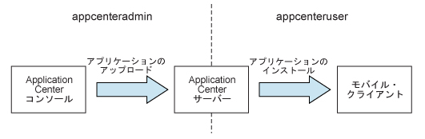
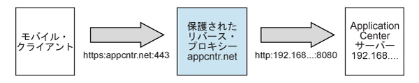

<!-- NLS_CHARSET=UTF-8 -->
## 概説 
{: #overview }
Application Center を {{site.data.keys.mf_server }} インストールの一部としてインストールします。
インストールは、次のいずれかの方法で行うことができます。

* IBM Installation Manager を使用したインストール
* Ant タスクを使用したインストール
* 手動インストール

{{site.data.keys.mf_server }} を Application Center と共にインストールする前に、オプションで、好みのデータベースを作成することができます。  
任意の Web アプリケーション・サーバーに Application Center をインストールした後、実行が必要な追加構成があります。詳しくは、インストール後の Application Center の構成を参照してください。インストーラーで手動セットアップを選択する場合、使用するサーバーの資料を参照してください。

> **注:** Application Center を使用して iOS デバイスにアプリケーションをインストールすることを予定している場合は、最初に、SSL を使用して Application Center サーバーを構成する必要があります。

インストールされるファイルおよびツールのリストについては、[{{site.data.keys.mf_server }} の配布構造](../installation-manager/#distribution-structure-of-mobilefirst-server)を参照してください。

#### ジャンプ先
{: #jump-to }

* [IBM Installation Manager を使用した Application Center のインストール](#installing-application-center-with-ibm-installation-manager)
* [Ant タスクを使用した Application Center のインストール](#installing-the-application-center-with-ant-tasks)
* [Application Center の手動インストール](#manually-installing-application-center)
* [インストール後の Application Center の構成](#configuring-application-center-after-installation)

## IBM Installation Manager を使用した Application Center のインストール
{: #installing-application-center-with-ibm-installation-manager }
IBM Installation Manager を使用して、Application Center をインストールし、そのデータベースを作成し、それをアプリケーション・サーバーにデプロイすることができます。  
始める前に、IBM Installation Manager を実行するユーザーが、[ファイル・システムの前提条件](../appserver/#file-system-prerequisites)に記述された特権を持っていることを検証します。

IBM Installation Manager を使用して IBM Application Center をインストールするには、以下のステップを実行します。

1. オプション: 次の[オプションのデータベース作成](#optional-creation-of-databases)の説明に従って、Application Center のデータベースを手動で作成できます。IBM Installation Manager は、デフォルトの設定値を使用して Application Center のデータベースを自動的に作成できます。
2. [IBM Installation Manager の実行](../installation-manager)の説明に従って、IBM Installation Manager を実行します。
3. **「IBM Application Center をインストールしますか」**という質問に**「はい」**と応答します。

#### ジャンプ先
{: #jump-to-1 }
* [オプションのデータベース作成](#optional-creation-of-databases)
* [WebSphere Application Server Network Deployment への Application Center のインストール](#installing-application-center-in-websphere-application-server-network-deployment)
* [インストールの完了](#completing-the-installation)
* [IBM Installation Manager によって Application Center 用に作成されるデフォルトのログインおよびパスワード](#default-logins-and-passwords-created-by-ibm-installation-manager-for-the-application-center)

### オプションのデータベース作成
{: #optional-creation-of-databases }
{{site.data.keys.mf_server }} インストーラーを実行する時に Application Center をインストールするオプションをアクティブにしたい場合、Application Center が必要とする表を作成できる特定のデータベース・アクセス権限を持っている必要があります。 

十分なデータベース管理資格情報を持っていて、インストーラーからプロンプトが出されたときに管理者ユーザー名とパスワードを入力した場合、インストーラーがユーザーに代わってデータベースを作成することができます。それ以外の場合、データベース管理者に、必要なデータベースの作成を依頼する必要があります。データベースは、{{site.data.keys.mf_server }} インストーラーを開始する前に作成する必要があります。

以下のトピックでは、サポートされているデータベース管理システムでの手順が説明されています。

#### ジャンプ先
{: #jump-to-2 }

* [Application Center 用の DB2 データベースの作成](#creating-the-db2-database-for-application-center)
* [Application Center 用の MySQL データベースの作成](#creating-the-mysql-database-for-application-center)
* [Application Center 用の Oracle データベースの作成](#creating-the-oracle-database-for-application-center)

#### Application Center 用の DB2 データベースの作成
{: #creating-the-db2-database-for-application-center }
IBM MobileFirst Foundation のインストール中、インストーラーによって自動的に Application Center データベースを作成することができます。

DB2 SYSADM または SYSCTRL 権限を持つデータベース・サーバー上のユーザー・アカウントの名前とパスワードを入力し、かつ、そのアカウントが SSH を介してアクセス可能である場合、ユーザーに代わってインストーラーが Application Center データベースを作成できます。それ以外の場合は、データベース管理者が Application Center データベースを作成できます。 詳細情報については、[DB2 ソリューション](http://ibm.biz/knowctr#SSEPGG_9.7.0/com.ibm.db2.luw.admin.sec.doc/doc/c0055206.html)のユーザー資料を参照してください。

手動でデータベースを作成する場合は、データベース名 (ここでは APPCNTR) とパスワードを、任意のデータベース名およびパスワードで置き換えることができます。

> **重要:** データベースおよびユーザーを異なる名前にしたり、異なるパスワードを設定したりすることができますが、適切なデータベース名、ユーザー名、およびパスワードを DB2 データベース・セットアップ全体を通して正しく入力するように注意してください。DB2 では、すべてのプラットフォームでデータベース名の長さが 8 文字までという制限があり、また、ユーザー名とパスワードの長さが、UNIX および Linux システムでは 8 文字まで、Windows では 30 文字までという制限があります。

1. ご使用のオペレーティング・システムに合った適切なコマンドを使用して、例えば **wluser** という名前のシステム・ユーザーを DB2 管理グループ (例えば **DB2USERS**) 内に作成します。それにパスワード (例えば **wluser**) を付与します。複数の IBM {{site.data.keys.mf_server }} インスタンスが同じデータベースに接続するようにする場合は、接続ごとに異なるユーザー名を使用してください。各データベース・ユーザーは別々のデフォルト・スキーマを持ちます。データベース・ユーザーについて詳しくは、DB2 資料およびオペレーティング・システムの資料を参照してください。

2. **SYSADM** または **SYSCTRL** 権限を持つユーザーで DB2 コマンド・ライン・プロセッサーを開きます。

    * Windows システムでは、**「開始 (Start)」→「IBM DB2」→「コマンド・ライン・プロセッサー (Command Line Processor)」**とクリックします。
    * Linux システムまたは UNIX システムでは、**~/sqllib/bin** にナビゲートし、`./db2` と入力します。
    * Application Center データベースを作成するため、データベース・マネージャーおよび SQL ステートメントを以下の例のように入力します。その際、ユーザー名 **wluser** を、選択したユーザー名で置き換えます。

      ```bash
      CREATE DATABASE APPCNTR COLLATE USING SYSTEM PAGESIZE 32768
      CONNECT TO APPCNTR
      GRANT CONNECT ON DATABASE TO USER wluser
      DISCONNECT APPCNTR
      QUIT
      ```
      
3. インストーラーは、特定の 1 つのスキーマに Application Center 用のデータベース表およびオブジェクトを作成できます。これによって、Application Center 用と MobileFirst プロジェクト用に同じデータベースを使用することが可能になります。ステップ 1 で作成したユーザーに IMPLICIT\_SCHEMA 権限が付与されている場合 (ステップ 2 のデータベース作成スクリプトでのデフォルト)、これ以上の操作は不要です。ユーザーに IMPLICIT\_SCHEMA 権限がない場合、Application Center データベース表およびオブジェクト用のスキーマを作成する必要があります。

#### Application Center 用の MySQL データベースの作成
{: #creating-the-mysql-database-for-application-center }
MobileFirst のインストール中、インストーラーによって自動的に Application Center データベースを作成することができます。

スーパーユーザー・アカウントのユーザー名とパスワードを入力すると、ユーザーに代わってインストーラーがデータベースを作成できます。詳しくは、ご使用の MySQL データベース・サーバーでの [Securing the Initial MySQL Account](http://dev.mysql.com/doc/refman/5.1/en/default-privileges.html) を参照してください。データベース管理者がデータベースを作成することもできます。手動でデータベースを作成する場合は、データベース名 (ここでは APPCNTR) およびパスワードを、任意のデータベース名およびパスワードで置き換えることができます。UNIX では MySQL データベース名は大/小文字の区別があることに注意してください。

1. MySQL コマンド・ライン・ツールを開始します。
2. 以下のコマンドを入力します。

   ```bash
   CREATE DATABASE APPCNTR CHARACTER SET utf8 COLLATE utf8_general_ci;
   GRANT ALL PRIVILEGES ON APPCNTR.* TO 'worklight'@'Worklight-host' IDENTIFIED BY 'password';
   GRANT ALL PRIVILEGES ON APPCNTR.* TO 'worklight'@'localhost' IDENTIFIED BY 'password';
   FLUSH PRIVILEGES;
   ```
   
   上記の **Worklight-host** は、IBM MobileFirst Foundation が稼働するホストの名前に置換する必要があります。

#### Application Center 用の Oracle データベースの作成
{: #creating-the-oracle-database-for-application-center }
インストール中に、ユーザーに代わってインストーラーが Application Center データベース (Oracle 12c データベース・タイプを除く) を作成するか、または既存データベース内にユーザーおよびスキーマを作成することができます。

データベース・サーバー上の Oracle 管理者の名前とパスワードを入力し、かつ、そのアカウントが SSH を介してアクセス可能である場合、インストーラーが、データベース (Oracle 12c データベース・タイプを除く) を作成するか、または既存データベース内にユーザーおよびスキーマを作成できます。それ以外の場合は、データベース管理者が、データベースまたはユーザーおよびスキーマを作成できます。手動でデータベースまたはユーザーを作成する場合は、データベース名、ユーザー名、およびパスワードを、自分で選んだものに置き換えることができます。Oracle ユーザー名に小文字を使用すると問題が起こる可能性があることに注意してください。

1. **ORCL** という名前のデータベースがまだない場合、 Oracle Database Configuration Assistant (DBCA) を使用し、ウィザードのステップに従って、**ORCL** という名前の新しい汎用データベースを作成します。
    * グローバル・データベース名 **ORCL\_your\_domain**、およびシステム ID (SID) **ORCL** を使用します。
    * 最初にユーザー・アカウントを作成する必要があるため、**「データベース・コンテンツ (Database Content)」**ステップの **「カスタム・スクリプト (Custom Scripts)」**タブで、SQL スクリプトを実行しないでください。
    * **「初期化パラメーター (Initialization Parameters)」**ステップの **「キャラクタ・セット (Character Sets)」**タブで、**「Unicode (AL32UTF8) 文字セットおよび UTF8 - Unicode 3.0 UTF-8 国別文字セットを使用」**を選択します。
    * デフォルト値を受け入れてプロシージャーを完了します。
2. **Oracle Database Control** を使用するか、または **Oracle SQLPlu**s コマンド・ライン・インタープリターを使用して、データベース・ユーザーを作成します。
    * **Oracle Database Control** を使用する場合、次のようにします。
        * **SYSDBA** として接続します。
        * **「ユーザー (Users)」**ページに進みます。**「サーバー (Server)」**をクリックし、**「セキュリティー (Security)」**セクションで**「ユーザー (Users)」**をクリックします。
        * 例えば **APPCENTER** という名前のユーザーを作成します。 複数の IBM {{site.data.keys.mf_server }} インスタンスを、ステップ 1 で作成した同じ汎用データベースに接続する場合は、接続ごとに異なるユーザー名を使用してください。各データベース・ユーザーは別々のデフォルト・スキーマを持ちます。
        * 以下の属性を割り当てます。
            * Profile: **DEFAULT**
            * Authentication: **password**
            * Default tablespace: **USERS**
            * Temporary tablespace: **TEMP**
            * Status: **Unlocked**
            * Add system privilege: **CREATE SESSION**
            * Add system privilege: **CREATE SEQUENCE**
            * Add system privilege: **CREATE TABLE**
            * Add quota: **Unlimited for tablespace USERS**
    * **Oracle SQLPlus** コマンド・ライン・インタープリターを使用する場合、次のようにします。  
    以下の例に示されたコマンドは、データベース用の APPCENTER という名前のユーザーを作成します。
    
        ```bash
        CONNECT SYSTEM/<SYSTEM_password>@ORCL
        CREATE USER APPCENTER IDENTIFIED BY password DEFAULT TABLESPACE USERS QUOTA UNLIMITED ON USERS;
        GRANT CREATE SESSION, CREATE SEQUENCE, CREATE TABLE TO APPCENTER;
        DISCONNECT;
        ```

### WebSphere Application Server Network Deployment への Application Center のインストール
{: #installing-application-center-in-websphere-application-server-network-deployment }
Application Center を WebSphere Application Server Network Deployment サーバーのセットにインストールするには、デプロイメント・マネージャーが稼働しているマシン上で IBM Installation Manager を実行します。

1. データベース・タイプを指定するよう IBM Installation Manager からプロンプトが出されたら、**「Apache Derby」**以外のオプションを選択します。IBM MobileFirst Foundation では、Apache Derby は組み込みモードのみでサポートされ、この選択は、WebSphere Application Server Network Deployment を使用したデプロイメントとは両立しません。
2. WebSphere Application Server インストール・ディレクトリーを指定するインストーラー・パネルで、デプロイメント・マネージャー・プロファイルを選択します。

    > **重要:** アプリケーション・サーバー・プロファイルを選択した後に管理対象サーバーを 1 つ選択することはしないでください。これを行うと、デプロイメント・マネージャーが稼働しているマシンにインストールするか、別のマシンにインストールするかに関わらず、デプロイメント・マネージャーがサーバーの構成を上書きすることになります。
3. Application Center のインストール先に応じて、必要な有効範囲を選択します。選択可能な有効範囲は以下の表のとおりです。

    | 有効範囲	 | 説明 | 
    |--------|-------------|
    | セル	 | セルのすべてのアプリケーション・サーバーに Application Center がインストールされます。 | 
    | クラスター| 指定したクラスターのすべてのアプリケーション・サーバーに Application Center がインストールされます。 | 
    | ノード   | (クラスターを除外) クラスターに含まれていない、指定したノードのすべてのアプリケーション・サーバーに Application Center がインストールされます。 | 
    | サーバー | クラスターに含まれていない、指定したサーバーに Application Center がインストールされます。 | 

4. 次の[インストールの完了](#completing-the-installation)に記述されている手順に従って、ターゲット・サーバーを再始動します。

インストールは、指定した有効範囲内にあるサーバー・セットの外側には影響しません。JDBC プロバイダーおよび JDBC データ・ソースは、指定した有効範囲で定義されます。有効範囲がセル全体であるエンティティー (アプリケーションと、DB2 の場合は認証別名) の名前には、各エンティティーを一意に識別できるようにするための接尾部が付きます。したがって、Application Center を複数の異なる構成にインストールすることができ、異なるバージョンの Application Center を同一セルの別々のクラスターにインストールすることさえ可能です。

> **注:** JDBC ドライバーは指定されたアプリケーション・サーバーのセットにのみインストールされるため、デプロイメント・マネージャーの WebSphere Application Server 管理コンソールでの JDBC データ・ソースに対する「接続のテスト (Test Connection)」ボタンは機能しないことがあります。

フロントエンド HTTP サーバーを使用する場合、パブリック URL も構成する必要があります。

### インストールの完了
{: #completing-the-installation }
インストールが完了したら、場合によっては Web アプリケーション・サーバーを再始動する必要があります。  
以下の場合は、Web アプリケーション・サーバーを再始動する必要があります。

* データベース・タイプとして DB2 を使用して WebSphere Application Server を使用している場合。
* WebSphere Application Server を使用しており、IBM MobileFirst Application Center または {{site.data.keys.mf_server }} をインストールする前にアプリケーション・セキュリティーを有効にせずに WebSphere Application Server を開いた場合。

MobileFirst インストーラーは、Application Center をインストールするために、WebSphere Application Server のアプリケーション・セキュリティーをアクティブにする必要があります (まだアクティブになっていない場合)。その後、このアクティブ化を有効にするため、{{site.data.keys.mf_server }} のインストールが完了した後にアプリケーション・サーバーを再始動します。

* WebSphere Application Server Liberty または Apache Tomcat を使用している場合。
* 前のバージョンの {{site.data.keys.mf_server }} からアップグレードした後。

WebSphere Application Server Network Deployment を使用していて、デプロイメント・マネージャーを介したインストールを選択した場合は、次の項目が当てはまります。

* インストール中に稼働していた、{{site.data.keys.mf_server }} Web アプリケーションがインストールされているサーバーを再始動する必要があります。 

これらのサーバーをデプロイメント・マネージャー・コンソールを使用して再始動するには、**「アプリケーション (Applications)」→「アプリケーション・タイプ (Application Types)」→「WebSphere エンタープライズ・アプリケーション (WebSphere enterprise applications)」→「IBM_Application\_Center\_Services」→「ターゲット固有のアプリケーション状況 (Target specific application status)」**と選択します。

* デプロイメント・マネージャーおよびノード・エージェントの再始動は不要です。

> **注:** Application Center のみがアプリケーション・サーバーにインストールされます。

### IBM Installation Manager によって Application Center 用に作成されるデフォルトのログインおよびパスワード
{: #default-logins-and-passwords-created-by-ibm-installation-manager-for-the-application-center }
IBM Installation Manager は、アプリケーション・サーバーに基づいて、Application Center 用のログインをデフォルトで作成します。これらのログインを使用して、Application Center をテストできます。

#### WebSphere Application Server フル・プロファイル
{: #websphere-application-server-full-profile }
ログイン **appcenteradmin** は、インストール時に生成され、表示されるパスワードで作成されます。

アプリケーション・レルム内で認証されたすべてのユーザーには、**appcenteradmin** ロールへのアクセスも許可されます。これは、特に WebSphere Application Server に単一のセキュリティー・ドメインが構成されている場合、実稼働環境での使用を意図したものではありません。

これらのログインの変更方法について詳しくは、[WebSphere Application Server フル・プロファイル上の Java EE セキュリティー・ロールの構成](#configuring-the-java-ee-security-roles-on-websphere-application-server-full-profile)を参照してください。

#### WebSphere Application Server Liberty プロファイル
{: #websphere-application-server-liberty-profile }
* ログイン demo は、パスワード demo で、basicRegistry 内に作成されます。
* ログイン appcenteradmin は、パスワード admin で、basicRegistry 内に作成されます。

これらのログインの変更方法について詳しくは、[WebSphere Application Server Liberty プロファイル上の Java EE セキュリティー・ロールの構成](#configuring-the-java-ee-security-roles-on-websphere-application-server-liberty-profile)を参照してください。

#### Apache Tomcat
{: #apache-tomcat }
* ログイン demo は、パスワード demo で作成されます。
* ログイン guest は、パスワード guest で作成されます。
* ログイン appcenteradmin は、パスワード admin で作成されます。

これらのログインの変更方法について詳しくは、[Apache Tomcat 上での Java EE セキュリティー・ロールの構成](#configuring-the-java-ee-security-roles-on-apache-tomcat)を参照してください。

## Ant タスクを使用した Application Center のインストール
{: #installing-the-application-center-with-ant-tasks }
Application Center のインストールに使用できる Ant タスクについて学習します。

#### ジャンプ先
{: #jump-to-3 }

* [Ant タスクを使用した Application Center  データベースの作成および構成](#creating-and-configuring-the-database-for-application-center-with-ant-tasks)
* [Ant タスクを使用した Application Center コンソールおよびサービスのデプロイ](#deploying-the-application-center-console-and-services-with-ant-tasks)

### Ant タスクを使用した Application Center  データベースの作成および構成
{: #creating-and-configuring-the-database-for-application-center-with-ant-tasks }
データベースを手動で作成しなかった場合は、Ant タスクを使用して  Application Center 用のデータベースを作成し、構成することができます。データベースが既に存在する場合は、Ant タスクでの構成ステップのみを実行することができます。

開始する前に、データベース管理システム (DBMS) がデータベース・サーバーにインストール済みであり、実行中であることを確認してください。このサーバーは、同じコンピューター上にあっても、別のコンピューター上にあってもかまいません。

Application Center の Ant タスクは、{{site.data.keys.mf_server }} の配布の **ApplicationCenter/configuration-samples** ディレクトリー内にあります。

{{site.data.keys.mf_server }} がインストールされていないコンピューターから Ant タスクを開始する場合は、以下のファイルをそのコンピューターにコピーする必要があります。
    
* ライブラリー **mf\_server\_install\_dir/MobileFirstServer/mfp-ant-deployer.jar**
* Android SDK プラットフォーム・ツール・パッケージの、aapt プログラムのバイナリー・ファイルが入ったディレクトリー: **mf\_server\_install\_dir/ApplicationCenter/tools/android-sdk**
* **mf\_server\_install\_dir/ApplicationCenter/configuration-samples** 内の Ant サンプル・ファイル

> **注:** **mf\_server\_install\_dir** プレースホルダーは、{{site.data.keys.mf_server }} をインストールしたディレクトリーを表します。

[オプションのデータベース作成](#optional-creation-of-databases)の説明に従ってデータベースを手動で作成しなかった場合には、次のステップ 1 から 3 を実行してください。
データベースが既に存在する場合は、データベース表のみを作成する必要があります。次のステップ 4 から 7 を実行してください。

1. DBMS に対応したサンプル Ant ファイルをコピーします。データベースを作成するためのファイルは、以下のパターンに従って命名されます。

    ```bash
    create-appcenter-database-<dbms>.xml
    ```
    
2. Ant ファイルを編集し、ファイルの先頭にあるプレースホルダー値をプロパティーに置き換えます。
3. 以下のコマンドを実行して、Application Center データベースを作成します。

    ```bash
    ant -f create-appcenter-database-<dbms>.xml databases
    ```
    
    Ant コマンドは、**mf\_server\_install\_dir/shortcuts** にあります。
    
    データベースが既に存在する場合は、以下のステップを実行して、データベース表のみを作成する必要があります。 

4. アプリケーション・サーバーと DBMS の両方に対応したサンプル Ant ファイルをコピーします。 既存のデータベースを構成するためのファイルは次のパターンに従って命名されます。 
    
    ```bash
    configure-appcenter-<appServer>-<dbms>.xml
    ```
    
5. Ant ファイルを編集し、ファイルの先頭にあるプレースホルダー値をプロパティーに置き換えます。
6. 以下のコマンドを実行して、データベースを構成します。

    ```bash
    ant -f configure-appcenter-<appServer>-<dbms>.xml databases
    ```
    
    Ant コマンドは、**mf\_server\_install\_dir/shortcuts** にあります。
    
7. Ant ファイルを保存します。 後でフィックスパックの適用時やアップグレードの実行時に、これが必要になる可能性があります。

パスワードを保存したくない場合は、対話プロンプトのために「************」(12 個のアスタリスク) でそれを置き換えることができます。

### Ant タスクを使用した Application Center コンソールおよびサービスのデプロイ
{: #deploying-the-application-center-console-and-services-with-ant-tasks }
Ant タスクを使用して Application Center コンソールおよびサービスをアプリケーション・サーバーにデプロイし、Application Center で使用するデータ・ソース、プロパティー、およびデータベース・ドライバーを構成します。

始める前に

* 『[Ant タスクを使用した Application Center データベースの作成および構成](#creating-and-configuring-the-database-for-application-center-with-ant-tasks)』の手順を完了します。
* アプリケーション・サーバー、または WebSphere Application Server Network Deployment 用の Network Deployment Manager がインストールされているコンピューターで Ant タスクを実行する必要があります。{{site.data.keys.mf_server }} がインストールされていないコンピューターから Ant タスクを開始する場合は、以下のファイルおよびディレクトリーをそのコンピューターにコピーする必要があります。

    * ライブラリー **mf\_server\_install\_dir/MobileFirstServer/mfp-ant-deployer.jar**
    * **mf_server\_install\_dir/ApplicationCenter/console** 内の Web アプリケーション (WAR および EAR ファイル)
    * Android SDK プラットフォーム・ツール・パッケージの、aapt プログラムのバイナリー・ファイルが入ったディレクトリー: **mf\_server\_install\_dir/ApplicationCenter/tools/android-sdk**
    * **mf\_server\_install\_dir/ApplicationCenter/configuration-samples** 内の Ant サンプル・ファイル

> **注:** mf_server_install_dir プレースホルダーは、{{site.data.keys.mf_server }} をインストールしたディレクトリーを表します。

1. アプリケーション・サーバーと DBMS の両方に対応した Ant ファイルをコピーします。 Application Center を構成するためのファイルは、以下のパターンに従って命名されます。

    ```bash
    configure-appcenter-<appserver>-<dbms>.xml
    ```
    
2. Ant ファイルを編集し、ファイルの先頭にあるプレースホルダー値をプロパティーに置き換えます。
3. 以下のコマンドを実行して、Application Center コンソールおよびサービスをアプリケーション・サーバーにデプロイします。

    ```bash
    ant -f configure-appcenter-<appserver>-<dbms>.xml install
    ```
    
    Ant コマンドは、**mf\_server\_install\_dir/shortcuts** にあります。

    > **注:** これらの Ant ファイルを使用すると、以下の操作も行うことができます。
    > 
    > * Application Center のアンインストール (ターゲットは **uninstall**)。
    > * Application Center の更新 (フィックスパックを適用するためのターゲットは **minimal-update**)。

4. Ant ファイルを保存します。 後でフィックスパックの適用時やアップグレードの実行時に、これが必要になる可能性があります。 パスワードを保存したくない場合は、対話プロンプトのために「************」(12 個のアスタリスク) でそれを置き換えることができます。
5. WebSphere Application Server Liberty プロファイルまたは Apache Tomcat にインストールした場合、aapt プログラムがすべてのユーザーで実行可能であることを確認してください。必要に応じて、適切なユーザー権限を設定してください。例えば、UNIX / Linux システムでは、以下のようにします。

    ```bash
    chmod a+x mf_server_install_dir/ApplicationCenter/tools/android-sdk/*/aapt*
    ```

## Application Center の手動インストール
{: #manually-installing-application-center }
{{site.data.keys.mf_server }} が、そのインストール中に指定されたデータベースまたはスキーマとは異なるデータベースまたはスキーマを使用するには再構成が必要です。この再構成は、データベースのタイプおよびアプリケーション・サーバーの種類によって異なります。

Apache Tomcat 以外のアプリケーション・サーバーでは、Application Center を 2 つの WAR ファイルまたは 1 つの EAR ファイルからデプロイできます。

> **制約事項:** {{site.data.keys.mf_server }} をインストールする一環として IBM Installation Manager を使用して Application Center をインストールするか、あるいは手動でインストールするかにかかわらず、 Application Center の「ローリング・アップデート」はサポートされないことを覚えておいてください。つまり、同じデータベースで作動する 2 つのバージョンの Application Center (例えば、V5.0.6 と V6.0.0) をインストールすることはできません。

#### ジャンプ先
{: #jump-to-4 }

* [Application Center 用の DB2 データベースの手動構成](#configuring-the-db2-database-manually-for-application-center)
* [Application Center 用の Apache Derby データベースの手動構成](#configuring-the-apache-derby-database-manually-for-application-center)
* [Application Center 用の MySQL データベースの手動構成](#configuring-the-mysql-database-manually-for-application-center)
* [Application Center 用の Oracle データベースの手動構成](#configuring-the-oracle-database-manually-for-application-center)
* [手動での Application Center WAR ファイルのデプロイおよびアプリケーション・サーバーの構成](#deploying-the-application-center-war-files-and-configuring-the-application-server-manually)
* [手動での Application Center EAR ファイルのデプロイおよびアプリケーション・サーバーの構成](#deploying-the-application-center-ear-file-and-configuring-the-application-server-manually)

### Application Center 用の DB2 データベースの手動構成
{: #configuring-the-db2-database-manually-for-application-center }
DB2 データベースを手動で構成するには、データベースを作成し、データベース表を作成し、その後で、関連するアプリケーション・サーバーをこのデータベース・セットアップを使用するように構成します。

1. データベースを作成します。このステップは、[Application Center 用の DB2 データベースの作成](#creating-the-db2-database-for-application-center)に記述されています。
2. データベース内に表を作成します。このステップは、[Application Center 用の DB2 データベースの手動セットアップ](#setting-up-your-db2-database-manually-for-application-center)に記述されています。
3. 以下のリストに示されているように、アプリケーション・サーバー固有のセットアップを実行します。

#### ジャンプ先
{: #jump-to-5 }

* [Application Center 用の DB2 データベースの手動セットアップ](#setting-up-your-db2-database-manually-for-application-center)
* [Application Center 用の DB2 のための Liberty プロファイルの手動構成](#configuring-liberty-profile-for-db2-manually-for-application-center)
* [Application Center 用の DB2 のための WebSphere Application Server の手動構成](#configuring-websphere-application-server-for-db2-manually-for-application-center)
* [Application Center 用の DB2 のための Apache Tomcat の手動構成](#configuring-apache-tomcat-for-db2-manually-for-application-center)

##### Application Center 用の DB2 データベースの手動セットアップ
{: #setting-up-your-db2-database-manually-for-application-center }
データベース・スキーマを作成することによって、Application Center 用の DB2 データベースをセットアップします。

1. ご使用のオペレーティング・システムに合った適切なコマンドを使用して、**worklight** という名前のシステム・ユーザーを DB2 管理グループ (例えば **DB2USERS**) 内に作成します。それにパスワード **worklight** を付与します。詳しくは、DB2 資料およびオペレーティング・システムの資料を参照してください。

> **重要:** ユーザーを異なる名前にしたり、異なるパスワードを設定したりすることができますが、適切なユーザー名およびパスワードを DB2 データベース・セットアップ全体を通して正しく入力するように注意してください。DB2 では、ユーザー名とパスワードの長さが、UNIX および Linux システムの場合は 8 文字まで、Windows の場合は 30 文字までという制限があります。

2. **SYSADM** または **SYSCTRL** 権限を持つユーザーで DB2 コマンド・ライン・プロセッサーを開きます。
    * Windows システムでは、**「開始 (Start)」→「IBM DB2」→「コマンド・ライン・プロセッサー (Command Line Processor)」**とクリックします。
    * Linux システムまたは UNIX システムでは、**~/sqllib/bin** に移動し、`./db2` と入力します。

3. 以下のデータベース・マネージャーおよび SQL ステートメントを入力して、**APPCNTR** という名前のデータベースを作成します。

   ```bash
   CREATE DATABASE APPCNTR COLLATE USING SYSTEM PAGESIZE 32768 
   CONNECT TO APPCNTR 
   GRANT CONNECT ON DATABASE TO USER worklight 
   QUIT
   ```
    
4. 以下のコマンドを使用して DB2 を実行し、**APPCNTR** 表を **APPSCHM** という名前のスキーマ内に作成します (スキーマの名前は変更できます)。このコマンドは、ステップ 3 で定義したものと互換のページ・サイズを持つ既存のデータベースで実行できます。
    
   ```bash
   db2 CONNECT TO APPCNTR
   db2 SET CURRENT SCHEMA = 'APPSCHM'
   db2 -vf product_install_dir/ApplicationCenter/databases/create-appcenter-db2.sql -t
   ```
    
##### Application Center 用の DB2 のための Liberty プロファイルの手動構成
{: #configuring-liberty-profile-for-db2-manually-for-application-center }
WebSphere Application Server Liberty プロファイルで、Application Center 用に手動で DB2 データベースのセットアップと構成を行うことができます。  
先に進む前に DB2 データベースのセットアップ手順を実行します。

1. DB2 JDBC ドライバー JAR ファイルを **$LIBERTY\_HOME/wlp/usr/shared/resources/db2** に追加します。

    このディレクトリーが存在しない場合は、作成してください。このファイルは、以下の 2 つの方法のいずれかで取得できます。
    * [DB2 JDBC Driver Versions](http://www.ibm.com/support/docview.wss?uid=swg21363866) からダウンロードする。
    * DB2 サーバー・ディレクトリーの **db2\_install\_dir/java** から取り出す。

2. 以下のように、**$LIBERTY_HOME/wlp/usr/servers/worklightServer/server.xml** ファイル内でデータ・ソースを構成します。

   このパスに含まれている **worklightServer** は、ご使用のサーバーの名前に置き換えてかまいません。 

   ```xml
   <library id="DB2Lib">
        <fileset dir="${shared.resource.dir}/db2" includes="*.jar"/>
   </library>
    
   <!-- Declare the IBM Application Center database. -->
   <dataSource jndiName="jdbc/AppCenterDS" transactional="false">
      <jdbcDriver libraryRef="DB2Lib"/>
      <properties.db2.jcc databaseName="APPCNTR"  currentSchema="APPSCHM"
            serverName="db2server" portNumber="50000"
            user="worklight" password="worklight"/>
   </dataSource> 
   ```
    
   **user=** に続く **worklight** というプレースホルダーは、前に作成した **APPCNTR** データベースへの **CONNECT** 権限を持つシステム・ユーザーの名前です。  
    
   **password=** に続く **worklight** というプレースホルダーは、そのユーザーのパスワードです。 定義済みのユーザー名またはパスワード、あるいは両方がこれとは異なる場合、それに応じて **worklight** を置き換えてください。 また、**db2server** を、ご使用の DB2 サーバーのホスト名 (例えば、同じコンピューター上にある場合は **localhost**) で置き換えてください。

   DB2 では、ユーザー名とパスワードの長さが、UNIX および Linux システムの場合は 8 文字まで、Windows の場合は 30 文字までという制限があります。

3. **liberty\_install\_dir/bin** 内の securityUtility プログラムを使用して、データベース・パスワードを暗号化することができます。

##### Application Center 用の DB2 のための WebSphere Application Server の手動構成
{: #configuring-websphere-application-server-for-db2-manually-for-application-center }
WebSphere Application Server で、Application Center 用に手動で DB2 データベースのセットアップと構成を行うことができます。

1. WebSphere Application Server インストール・ディレクトリー内の JDBC ドライバー JAR ファイルに適したディレクトリーを決定します。
    * スタンドアロン・サーバーの場合は、**was\_install\_dir/optionalLibraries/IBM/Worklight/db2** などのディレクトリーを使用することができます。
    * WebSphere Application Server ND セルへのデプロイメントの場合は、**was\_install\_dir/profiles/profile-name/config/cells/cell-name/Worklight/db2** を使用してください。
    * WebSphere Application Server ND クラスターへのデプロイメントの場合は、**was\_install\_dir/profiles/profile-name/config/cells/cell-name/clusters/cluster-name/Worklight/db2** を使用してください。
    * WebSphere Application Server ND ノードへのデプロイメントの場合は、**was\_install\_dir/profiles/profile-name/config/cells/cell-name/nodes/node-name/Worklight/db2** を使用してください。
    * WebSphere Application Server ND サーバーへのデプロイメントの場合は、**was\_install\_dir/profiles/profile-name/config/cells/cell-name/nodes/node-name/servers/server-name/Worklight/db2** を使用してください。

    このディレクトリーが存在しない場合は、作成してください。
    
2. ステップ 1 で決定したディレクトリーに DB2 JDBC ドライバーの JAR ファイルを追加します。それに関連するライセンス・ファイルがあれば、それも追加します。   
    ドライバー・ファイルは以下の 2 つの方法のいずれかで取得できます。
    * [DB2 JDBC Driver Versions](http://www.ibm.com/support/docview.wss?uid=swg21363866) からダウンロードする。
    * DB2 サーバーの **db2\_install\_dir/java** ディレクトリーから取り出す。

3. WebSphere Application Server コンソールで、**「リソース (Resources)」→「JDBC」→「JDBC プロバイダー (JDBC Providers)」**とクリックします。  
    * **「有効範囲」**コンビネーション・ボックスから適切な有効範囲を選択します。
    * **「新規 (New)」**をクリックします。
    * **「データベース・タイプ (Database type)」**を**「DB2」**に設定します。
    * **「プロバイダー・タイプ (Provider type)」**を**「DB2 Using IBM JCC Driver」**に設定します。
    * **「実装タイプ (Implementation Type)」**を**「接続プール・データ・ソース (Connection pool data source)」**に設定します。
    * **「名前 (Name)」**を **「DB2 Using IBM JCC Driver」** に設定します。
    * **「次へ」**をクリックします。
    * クラスパスをステップ 1 で決定したディレクトリー内の JAR ファイルのセットに設定して、**was\_install\_dir/profiles/profile-name** を WebSphere Application Server の変数参照 `${USER_INSTALL_ROOT}` に置き換えます。
    * **「ネイティブ・ライブラリー・パス (Native library path)」**は設定しないでください。
    * **「次へ」**をクリックします。
    * **「終了 (Finish)」**をクリックします。
    * JDBC プロバイダーが作成されます。
    * **「保存 (Save)」**をクリックします。

4. 以下の手順に従って、Application Center データベース用のデータ・ソースを作成します。
    * **「リソース (Resources)」→「JDBC」→「データ・ソース (Data sources)」**をクリックします。
    * **「有効範囲」**コンビネーション・ボックスから適切な有効範囲を選択します。
    * データ・ソースを作成するために**「新規 (New)」**をクリックします。
    * **「データ・ソース名 (Data source name)」**を **「Application Center Database」** に設定します。
    * **「JNDI 名 (JNDI name)」**を**「jdbc/AppCenterDS」**に設定します。
    * **「次へ」**をクリックします。
    * データ・ソースのプロパティーを入力します。例えば、以下のように入力します。
        * **「ドライバー・タイプ」**: 4
        * **「データベース名」**: APPCNTR
        * **「サーバー名」**: localhost
        * **「ポート番号」**: 50000 (デフォルト)
    * **「次へ」**をクリックします。
    * プロパティーに DB2 ユーザー名とパスワードを指定して、JAAS-J2C 認証データを作成します。必要に応じてステップ 4.a から 4.h を繰り返し、データ・ソース作成ウィザードに戻って操作します。
    * **「コンポーネント管理認証別名」**組み合わせボックス (**「コンテナー管理認証別名」**組み合わせボックスではありません) で作成した認証別名を選択します。
    * **「次へ (Next)」**をクリックし、**「終了 (Finish)」**をクリックします。
    * **「保存 (Save)」**をクリックします。
    * **「リソース (Resources)」→「JDBC」→「データ・ソース (Data sources)」**で、新規データ・ソースを選択します。
    * **「WebSphere Application Server データ・ソース・プロパティー」**をクリックします。
    * **「非トランザクション・データ・ソース (Non-transactional data source)」**チェック・ボックスを選択します。
    * **「OK」**をクリックします。
    * **「保存 (Save)」**をクリックします。
    * **データ・ソースの「カスタム・プロパティー (Custom Properties)」**をクリックし、プロパティー **「currentSchema」** を選択し、値を、Application Center 表を作成するのに使用されたスキーマ (この例では APPSCHM) に設定します。
5. **「データ・ソース (Data Source)」**を選択して**「接続のテスト (Test connection)」**をクリックすることによって、データ・ソース接続をテストします。

**「コンテナー管理パーシスタンス (CMP) 内でこのデータ・ソースを使用する」**は、選択したままにしておきます。

##### Application Center 用の DB2 のための Apache Tomcat の手動構成
{: #configuring-apache-tomcat-for-db2-manually-for-application-center }
Application Center 用の DB2 データベースを Apache Tomcat サーバーと共に手動でセットアップおよび構成したい場合、以下の手順を使用します。  
先に進む前に、DB2 データベースのセットアップ手順を実行してください。

1. DB2 JDBC ドライバー JAR ファイルを追加します。

    この JAR ファイルは、以下のいずれかの方法で取得できます。
    * [DB2 JDBC Driver Versions](http://www.ibm.com/support/docview.wss?uid=swg21363866) からダウンロードする。
    * または、DB2 サーバーの **db2\_install\_dir/java** ディレクトリーから取り出して、**$TOMCAT_HOME/lib** に追加する。

2. 以下のコード例に示すように、データ・ソースを定義する XML ステートメントを作成します。

   ```xml
   <Resource auth="Container"
            driverClassName="com.ibm.db2.jcc.DB2Driver"
            name="jdbc/AppCenterDS"
            username="worklight"
            password="password"
            type="javax.sql.DataSource"
            url="jdbc:db2://server:50000/APPCNTR:currentSchema=APPSCHM;"/>
   ```
    
   **username=** に続く **worklight** パラメーターは、前に作成した **APPCNTR** データベースへの「CONNECT」権限を持つシステム・ユーザーの名前です。 **password=** に続く **password** パラメーターは、そのユーザーのパスワードです。定義済みのユーザー名またはパスワード、あるいは両方がこれとは異なる場合、それに応じてこれらの項目を置き換えてください。

   DB2 では、ユーザー名の長さおよびパスワードの長さに制限がかけられています。
    * UNIX システムおよび Linux システムの場合: 8 文字
    * Windows の場合: 30 文字

3. [Application Center 用の Apache Tomcat の手動構成](#configuring-apache-tomcat-for-application-center-manually)に示されているように、このステートメントを server.xml ファイルに挿入します。

### Application Center 用の Apache Derby データベースの手動構成
{: #configuring-the-apache-derby-database-manually-for-application-center }
Apache Derby データベースを手動で構成するには、データベースおよびデータベース表を作成し、その後で、関連するアプリケーション・サーバーをこのデータベース・セットアップを使用するように構成します。

1. データベースおよびその中の表を作成します。このステップは、[Application Center 用の Apache Derby データベースの手動セットアップ](#setting-up-your-apache-derby-database-manually-for-application-center)に記述されています。
2. このデータベース・セットアップを使用するようにアプリケーション・サーバーを構成します。以下のいずれかのトピックに移動してください。

#### ジャンプ先
{: #jump-to-6 }

* [Application Center 用の Apache Derby データベースの手動セットアップ](#setting-up-your-apache-derby-database-manually-for-application-center)
* [Application Center 用の Derby のための Liberty プロファイルの手動構成](#configuring-liberty-profile-for-derby-manually-for-application-center)
* [Application Center 用の Derby のための WebSphere Application Server の手動構成](#configuring-websphere-application-server-for-derby-manually-for-application-center)
* [Application Center 用の Derby のための Apache Tomcat の手動構成](#configuring-apache-tomcat-for-derby-manually-for-application-center)

##### Application Center 用の Apache Derby データベースの手動セットアップ
{: #setting-up-your-apache-derby-database-manually-for-application-center }
データベース・スキーマを作成することによって、Application Center 用の Apache Derby データベースをセットアップします。

1. データベースを作成したい場所で、**ij.bat** (Windows システムの場合) または **ij.sh** (UNIX および Linux システムの場合) を実行します。

   > **注:** ij プログラムは Apache Derby の一部です。まだインストールしていない場合、[Apache Derby: Downloads](http://db.apache.org/derby/derby_downloads) からダウンロードできます。

   サポートされている Apache Derby のバージョンについては、[システム要件](../../../product-overview/requirements)を参照してください。  
   このスクリプトを実行すると、ij のバージョン番号が表示されます。
    
2. コマンド・プロンプトで、以下のコマンドを入力します。

   ```bash
   connect 'jdbc:derby:APPCNTR;user=APPCENTER;create=true';
   run '<product_install_dir>/ApplicationCenter/databases/create-appcenter-derby.sql';
   quit;
   ```

##### Application Center 用の Derby のための Liberty プロファイルの手動構成
{: #configuring-liberty-profile-for-derby-manually-for-application-center }
Application Center 用の Apache Derby データベースを WebSphere Application Server Liberty プロファイルと共に手動でセットアップおよび構成したい場合、以下の手順を使用します。先に進む前に Apache Derby データベースのセットアップ手順を実行します。

$LIBERTY_HOME/usr/servers/worklightServer/server.xml ファイル内のデータ・ソース (このパス中の worklightServer は、使用しているサーバーの名前で置き換えることができます) を以下のように構成します。

```xml
   <!-- Declare the jar files for Derby access through JDBC. -->
<library id="derbyLib">
  <fileset dir="C:/Drivers/derby" includes="derby.jar" />
</library>

<!-- Declare the IBM Application Center database. -->
<dataSource jndiName="jdbc/AppCenterDS" transactional="false" statementCacheSize="10">
  <jdbcDriver libraryRef="derbyLib" 
              javax.sql.ConnectionPoolDataSource="org.apache.derby.jdbc.EmbeddedConnectionPoolDataSource40"/>
  <properties.derby.embedded databaseName="DERBY_DATABASES_DIR/APPCNTR" user="APPCENTER"
                             shutdownDatabase="false" connectionAttributes="upgrade=true"/>
  <connectionManager connectionTimeout="180" 
                     maxPoolSize="10" minPoolSize="1" 
                     reapTime="180" maxIdleTime="1800" 
                     agedTimeout="7200" purgePolicy="EntirePool"/>
</dataSource>
```

##### Application Center 用の Derby のための WebSphere Application Server の手動構成
{: #configuring-websphere-application-server-for-derby-manually-for-application-center }
WebSphere Application Server で、 Application Center 用に手動で Apache Derby データベースのセットアップと構成を行うことができます。先に進む前に Apache Derby データベースのセットアップ手順を実行します。

1. WebSphere Application Server インストール・ディレクトリー内の JDBC ドライバー JAR ファイルに適したディレクトリーを決定します。このディレクトリーが存在しない場合は、作成してください。
    * スタンドアロン・サーバーの場合は、**was\_install\_dir/optionalLibraries/IBM/Worklight/derby** などのディレクトリーを使用することができます。
    * WebSphere Application Server ND セルへのデプロイメントの場合は、**was\_install\_dir/profiles/profile-name/config/cells/cell-name/Worklight/derby** を使用してください。
    * WebSphere Application Server ND クラスターへのデプロイメントの場合は、**was\_install\_dir/profiles/profile-name/config/cells/cell-name/clusters/cluster-name/Worklight/derby** を使用してください。
    * WebSphere Application Server ND ノードへのデプロイメントの場合は、**was\_install\_dir/profiles/profile-name/config/cells/cell-name/nodes/node-name/Worklight/derby** を使用してください。
    * WebSphere Application Server ND サーバーへのデプロイメントの場合は、**was\_install\_dir/profiles/profile-name/config/cells/cell-name/nodes/node-name/servers/server-name/Worklight/derby** を使用してください。
2. **Derby** JAR ファイルを **product\_install\_dir/ApplicationCenter/tools/lib/derby.jar** から、ステップ 1 で決定したディレクトリーに追加します。
3. JDBC プロバイダーをセットアップします。
    * WebSphere Application Server コンソールで、**「リソース (Resources)」→「JDBC」→「JDBC プロバイダー (JDBC Providers)」**とクリックします。
    * **「有効範囲」**コンビネーション・ボックスから適切な有効範囲を選択します。
    * **「新規 (New)」**をクリックします。
    * **「データベース・タイプ」**を**「ユーザー定義」**に設定します。
    * **「実装クラス名」**を **org.apache.derby.jdbc.EmbeddedConnectionPoolDataSource40** に設定します。
    * **「名前」**を**「Worklight - Derby JDBC プロバイダー」**に設定します。
    * **「説明」**を**「Worklight 用 Derby JDBC プロバイダー」**に設定します。
    * **「次へ」**をクリックします。
    * **「クラスパス (Class path)」**をステップ 1 で決定したディレクトリー内の JAR ファイルに設定して、**was\_install\_dir/profiles/profile-name** を WebSphere Application Server の変数参照 **${USER\_INSTALL\_ROOT}** に置き換えます。
    * **「終了 (Finish)」**をクリックします。
4. **Worklight** データベースのデータ・ソースを作成します。
    * WebSphere Application Server コンソールで、**「リソース」→「JDBC」→「データ・ソース」**をクリックします。
    * **「有効範囲」**コンビネーション・ボックスから適切な有効範囲を選択します。
    * **「新規 (New)」**をクリックします。
    * **「データ・ソース名」**を**「Application Center データベース」**に設定します。
    * **「JNDI 名 (JNDI name)」**を**「jdbc/AppCenterDS」**に設定します。
    * **「次へ」**をクリックします。
    * **「Worklight - Derby JDBC プロバイダー」**という名前の既存の JDBC プロバイダーを選択します。
    * **「次へ」**をクリックします。
    * **「次へ」**をクリックします。
    * **「終了 (Finish)」**をクリックします。
    * **「保存 (Save)」**をクリックします。
    * 表で、作成した**「Application Center データベース」**データ・ソースをクリックします。
    * **「追加プロパティー」**の下で、**「カスタム・プロパティー」**をクリックします。
    * **「databaseName」**をクリックします。
    * **「値」**を、[Application Center 用の Apache Derby データベースの手動セットアップ](#setting-up-your-apache-derby-database-manually-for-application-center)で作成した **APPCNTR** データベースのパスに設定します。
    * **「OK」**をクリックします。
    * **「保存 (Save)」**をクリックします。
    * ページ上部で**「Application Center データベース」**をクリックします。
    * **「追加プロパティー」**の下で、**「WebSphere Application Server データ・ソース・プロパティー」**をクリックします。
    * **「非トランザクション・データ・ソース」**を選択します。
    * **「OK」**をクリックします。
    * **「保存 (Save)」**をクリックします。
    * 表で、作成した**「Application Center データベース」**データ・ソースを選択します。
    * オプション: WebSphere Application Server Deployment Manager のコンソールで操作していない場合のみ、**「テスト接続 (test connection)」**をクリックします。

##### Application Center 用の Derby のための Apache Tomcat の手動構成
{: #configuring-apache-tomcat-for-derby-manually-for-application-center }
Apache Tomcat アプリケーション・サーバーで、Application Center 用に手動で Apache Derby データベースのセットアップと構成を行うことができます。先に進む前に Apache Derby データベースのセットアップ手順を実行します。

1. **Derby** JAR ファイルを **product\_install\_dir/ApplicationCenter/tools/lib/derby.jar** からディレクトリー **$TOMCAT\_HOME/lib** に追加します。
2. 以下のコード例に示すように、データ・ソースを定義する XML ステートメントを作成します。

   ```xml
   <Resource auth="Container"
            driverClassName="org.apache.derby.jdbc.EmbeddedDriver"
            name="jdbc/AppCenterDS"
            username="APPCENTER"
            password=""
            type="javax.sql.DataSource"
            url="jdbc:derby:DERBY_DATABASES_DIR/APPCNTR"/>
   ```

3. [Application Center 用の Apache Tomcat の手動構成](#configuring-apache-tomcat-for-application-center-manually)に示されているように、このステートメントを **server.xml** ファイルに挿入します。

### Application Center 用の MySQL データベースの手動構成
{: #configuring-the-mysql-database-manually-for-application-center }
MySQL データベースを手動で構成するには、データベースを作成し、データベース表を作成し、その後で、関連するアプリケーション・サーバーをこのデータベース・セットアップを使用するように構成します。

1. データベースを作成します。このステップは、[Application Center 用の MySQL データベースの作成](#creating-the-mysql-database-for-application-center)に記述されています。
2. データベース内に表を作成します。このステップは、[Application Center 用の MySQL データベースの手動セットアップ](#setting-up-your-mysql-database-manually-for-application-center)に記述されています。
3. 以下のリストに示されているように、アプリケーション・サーバー固有のセットアップを実行します。

#### ジャンプ先
{: #jump-to-7 }

* [Application Center 用の MySQL データベースの手動セットアップ](#setting-up-your-mysql-database-manually-for-application-center)
* [Application Center 用の MySQL のための Liberty プロファイルの手動構成](#configuring-liberty-profile-for-mysql-manually-for-application-center)
* [Application Center 用の MySQL のための WebSphere Application Server の手動構成](#configuring-websphere-application-server-for-mysql-manually-for-application-center)
* [Application Center 用の MySQL のための Apache Tomcat の手動構成](#configuring-apache-tomcat-for-mysql-manually-for-application-center)

##### Application Center 用の MySQL データベースの手動セットアップ
{: #setting-up-your-mysql-database-manually-for-application-center }
以下の手順を実行して MySQL データベースをセットアップします。

1. データベース・スキーマを作成します。
    * オプション `-u root` を指定して MySQL コマンド・ライン・クライアントを実行します。
    * 以下のコマンドを入力します。

   ```bash
   CREATE DATABASE APPCNTR CHARACTER SET utf8 COLLATE utf8_general_ci;
   GRANT ALL PRIVILEGES ON APPCNTR.* TO 'worklight'@'Worklight-host'IDENTIFIED BY 'worklight';
   GRANT ALL PRIVILEGES ON APPCNTR.* TO 'worklight'@'localhost' IDENTIFIED BY 'worklight';
   FLUSH PRIVILEGES;

   USE APPCNTR;
   SOURCE product_install_dir/ApplicationCenter/databases/create-appcenter-mysql.sql;
   ```
    
   ここで、「at」記号 (@) の前の **worklight** はユーザー名で、`IDENTIFIED BY` の後の **worklight** はそのパスワード、そして **Worklight-host** は、IBM MobileFirst Foundation が稼働しているホストの名前です。

2. MySQL オプション・ファイルにプロパティー max_allowed_packet=256M を追加します。  
オプション・ファイルについて詳しくは、MySQL で MySQL についての文書を参照してください。

3. プロパティー innodb_log_file_size = 250M を MySQL オプション・ファイルに追加します。  
innodb_log_file_size プロパティーについて詳しくは、MySQL の資料のセクション『innodb_log_file_size』を参照してください。

##### Application Center 用の MySQL のための Liberty プロファイルの手動構成
{: #configuring-liberty-profile-for-mysql-manually-for-application-center }
Application Center 用の MySQL データベースを WebSphere Application Server Liberty プロファイルと共に手動でセットアップおよび構成したい場合、以下の手順を使用します。先に進む前に MySQL データベースのセットアップ手順を実行します。

> **注:** WebSphere Application Server Liberty プロファイルまたは WebSphere Application Server フル・プロファイルと組み合わせて使用される MySQL は、サポートされる構成には分類されません。詳しくは、「[WebSphere Application Server Support Statement](http://www.ibm.com/support/docview.wss?uid=swg27004311)」を参照してください。IBM DB2 データベース、または WebSphere Application Server によってサポートされる別のデータベースを使用して、IBM サポートによってフルにサポートされる構成の利点を活用することができます。

1. MySQL JDBC ドライバー JAR ファイルを **$LIBERTY_HOME/wlp/usr/shared/resources/mysql** に追加します。このディレクトリーが存在しない場合は、作成してください。
2. **$LIBERTY_HOME/usr/servers/worklightServer/server.xml** ファイル内のデータ・ソース (このパス中の **worklightServer** は、使用しているサーバーの名前で置き換えることができます) を以下のように構成します。

   ```xml
   <!-- Declare the jar files for MySQL access through JDBC. -->
   <library id="MySQLLib">
      <fileset dir="${shared.resource.dir}/mysql" includes="*.jar"/>
   </library>

   <!-- Declare the IBM Application Center database. -->
   <dataSource jndiName="jdbc/AppCenterDS" transactional="false">
      <jdbcDriver libraryRef="MySQLLib"/>
   <properties databaseName="APPCNTR" 
              serverName="mysqlserver" portNumber="3306" 
              user="worklight" password="worklight"/>
   </dataSource>
   ```

   ここで、**user=** の後にある **worklight** はユーザー名であり、**password=** の後にある **worklight** はこのユーザーのパスワードです。また、**mysqlserver** は、ご使用の MySQL サーバーのホスト名です (例えば、同じマシン上にある場合は localhost)。

3. `<liberty_install_dir>/bin` 内の securityUtility プログラムを使用して、データベース・パスワードを暗号化することができます。

##### Application Center 用の MySQL のための WebSphere Application Server の手動構成
{: #configuring-websphere-application-server-for-mysql-manually-for-application-center }
WebSphere Application Server を使用して、Application Center 用に MySQL データベースを手動でセットアップおよび構成したい場合は、以下の手順を使用してください。先に進む前に MySQL データベースのセットアップ手順を実行します。

> **注:** WebSphere Application Server Liberty プロファイルまたは WebSphere Application Server フル・プロファイルと組み合わせて使用される MySQL は、サポートされる構成には分類されません。詳しくは、「[WebSphere Application Server Support Statement](http://www.ibm.com/support/docview.wss?uid=swg27004311)」を参照してください。IBM サポートによってフルにサポートされている構成の利点を活用するために、IBM DB2 データベース、または WebSphere Application Server によってサポートされている別のデータベースを使用することをお勧めします。

1. WebSphere Application Server インストール・ディレクトリー内の JDBC ドライバー JAR ファイルに適したディレクトリーを決定します。
    * スタンドアロン・サーバーの場合は、**WAS\_INSTALL\_DIR/optionalLibraries/IBM/Worklight/mysql** などのディレクトリーを使用することができます。
    * WebSphere Application Server ND セルへのデプロイメントの場合は、**WAS\_INSTALL\_DIR/profiles/profile-name/config/cells/cell-name/Worklight/mysql** を使用してください。
    * WebSphere Application Server ND クラスターへのデプロイメントの場合は、**WAS\_INSTALL\_DIR/profiles/profile-name/config/cells/cell-name/clusters/cluster-name/Worklight/mysql** を使用してください。
    * WebSphere Application Server ND ノードへのデプロイメントの場合は、**WAS\_INSTALL\_DIR/profiles/profile-name/config/cells/cell-name/nodes/node-name/Worklight/mysql** を使用してください。
    * WebSphere Application Server ND サーバーへのデプロイメントの場合は、**WAS\_INSTALL\_DIR/profiles/profile-name/config/cells/cell-name/nodes/node-name/servers/server-name/Worklight/mysql** を使用してください。

    このディレクトリーが存在しない場合は、作成してください。
    
2. [Download Connector/J](http://dev.mysql.com/downloads/connector/j/) からダウンロードした MySQL JDBC ドライバー JAR ファイルを、ステップ 1 で決定したディレクトリーに追加します。
3. JDBC プロバイダーをセットアップします。
    * WebSphere Application Server コンソールで、**「リソース (Resources)」→「JDBC」→「JDBC プロバイダー (JDBC Providers)」**とクリックします。
    * **「有効範囲」**コンビネーション・ボックスから適切な有効範囲を選択します。
    * **「新規 (New)」**をクリックします。
    * **「MySQL」** という名前の **「JDBC プロバイダー (JDBC provider)」**を作成します。
    * **「データベース・タイプ (Database type)」**を**「ユーザー定義 (User defined)」**に設定します。
    * **「有効範囲 (Scope)」**を**「セル (Cell)」**に設定します。
    * **「実装クラス (Implementation class)」**を **「com.mysql.jdbc.jdbc2.optional.MysqlConnectionPoolDataSource」** に設定します。
    * **WAS\_INSTALL\_DIR/profiles/profile-name** を WebSphere Application Server 変数参照 **${USER_INSTALL_ROOT}** に置換し、**「データベース・クラスパス」**を、ステップ 1 で決定したディレクトリー内の **JAR ファイル**に設定します。
    * 変更を保存します。
4. IBM Application Center データベースのデータ・ソースを作成します。
    * **「リソース (Resources)」→「JDBC」→「データ・ソース (Data sources)」**をクリックします。
    * **「有効範囲」**コンビネーション・ボックスから適切な有効範囲を選択します。
    * データ・ソースを作成するために**「新規 (New)」**をクリックします。
    * 任意の名前を入力します (例えば、Application Center Database)。
    * **「JNDI 名 (JNDI name)」**を**「jdbc/AppCenterDS」**に設定します。
    * 前のステップで定義された既存の「JDBC プロバイダー MySQL (JDBC Provider MySQL)」を使用します。
    * **「有効範囲 (Scope)」**を**「新規 (New)」**に設定します。
    * **「構成 (Configuration)」**タブで、**「非トランザクション・データ・ソース (Non-transactional data source)」**を選択します。
    * 他のすべての設定をデフォルトのままにして、**「次へ (Next)」**を数回クリックします。
    * 変更を保存します。
5. 新規データ・ソースのカスタム・プロパティーを設定します。
    * 新規データ・ソースを選択します。
    * **「カスタム・プロパティー (Custom properties)」**をクリックします。
    以下のプロパティーを設定します。
    
    ```xml
    portNumber = 3306
    relaxAutoCommit=true
    databaseName = APPCNTR
    serverName = the host name of the MySQL server
    user = the user name of the MySQL server
    password = the password associated with the user name
    ```

6. 新規データ・ソースの WebSphere Application Server カスタム・プロパティーを設定します。
    * **「リソース (Resources)」→「JDBC」→「データ・ソース (Data sources)」**で、**新規データ・ソース**を選択します。
    * **「WebSphere Application Server データ・ソース・プロパティー」**をクリックします。
    * **「非トランザクション・データ・ソース (Non-transactional data source)」**を選択します。
    * **「OK」**をクリックします。
    * **「保存 (Save)」**をクリックします。

##### Application Center 用の MySQL のための Apache Tomcat の手動構成
{: #configuring-apache-tomcat-for-mysql-manually-for-application-center }
Application Center 用の MySQL データベースを Apache Tomcat サーバーと共に手動でセットアップおよび構成したい場合、以下の手順を使用します。先に進む前に MySQL データベースのセットアップ手順を実行します。

1. MySQL Connector/J JAR ファイルを **$TOMCAT_HOME/lib** ディレクトリーに追加します。
2. 以下のコード例に示すように、データ・ソースを定義する XML ステートメントを作成します。[Application Center 用の Apache Tomcat の手動構成](#configuring-apache-tomcat-for-application-center-manually)に示されているように、このステートメントを server.xml ファイルに挿入します。

```xml
<Resource name="jdbc/AppCenterDS"
            auth="Container"
            type="javax.sql.DataSource"
            maxActive="100"
            maxIdle="30"
            maxWait="10000"
            username="worklight"
            password="worklight"
            driverClassName="com.mysql.jdbc.Driver"
            url="jdbc:mysql://server:3306/APPCNTR"/>
```

### Application Center 用の Oracle データベースの手動構成
{: #configuring-the-oracle-database-manually-for-application-center }
Oracle データベースを手動で構成するには、データベースを作成し、データベース表を作成し、その後で、関連するアプリケーション・サーバーをこのデータベース・セットアップを使用するように構成します。

1. データベースを作成します。このステップは、『[Application Center 用の Oracle データベースの作成](#creating-the-oracle-database-for-application-center)に記述されています。
2. データベース内に表を作成します。このステップは、[Application Center 用の Oracle データベースの手動セットアップ](#setting-up-your-oracle-database-manually-for-application-center)に記述されています。
3. 以下のリストに示されているように、アプリケーション・サーバー固有のセットアップを実行します。

#### ジャンプ先
{: #jump-to-8 }

* [Application Center 用の Oracle データベースの手動セットアップ](#setting-up-your-oracle-database-manually-for-application-center)
* [Application Center 用の Oracle のための Liberty プロファイルの手動構成](#configuring-liberty-profile-for-oracle-manually-for-application-center)
* [Application Center 用の Oracle のための WebSphere Application Server の手動構成](#configuring-websphere-application-server-for-oracle-manually-for-application-center)
* [Application Center 用の Oracle のための Apache Tomcat の手動構成](#configuring-apache-tomcat-for-oracle-manually-for-application-center)

##### Application Center 用の Oracle データベースの手動セットアップ
{: #setting-up-your-oracle-database-manually-for-application-center }
以下の手順を実行して、Oracle データベースをセットアップします。

1. 少なくとも 1 つの Oracle データベースがあることを確認してください。

    インストール済みの多くの Oracle データベースのうち、デフォルト・データベースは ORCL という SID (名前) です。最良の結果を得るために、データベースの文字セットとして **「Unicode (AL32UTF8)」**を指定します。

    Oracle インストール済み環境が UNIX コンピューターまたは Linux コンピューターにある場合は、必ず、次回 Oracle インストール済み環境の再始動時にデータベースが開始するようにしてください。そのためには、/etc/oratab に含まれているデータベースに対応する行の終わりが、N ではなく、Y になっていることを確認してください。
    
2. Oracle Database Control または Oracle SQLPlus コマンド・ライン・インタープリターのいずれかを使用して、ユーザー APPCENTER を作成します。
    * Oracle Database Control を使用して Application Center データベース/スキーマ用のユーザーを作成する場合は、次の手順を行ってください。
        * **SYSDBA** として接続します。
        * 「ユーザー」ページに移動します。
        * **「サーバー (Server)」**をクリックし、「セキュリティー」セクションで**「ユーザー (Users)」**をクリックします。
        * 以下の属性を持つ **APPCENTER** という名前のユーザーを作成します。

      ```bash
      Profile: DEFAULT
      Authentication: password
      Default tablespace: USERS
      Temporary tablespace: TEMP
      Status: Unlocked
      Add system privilege: CREATE SESSION
      Add system privilege: CREATE SEQUENCE
      Add system privilege: CREATE TABLE
      Add quota: Unlimited for tablespace USERS
      ```
    * Oracle SQLPlus を使用してユーザーを作成する場合は、以下のコマンドを入力します。

      ```bash
      CONNECT SYSTEM/<SYSTEM_password>@ORCL
      CREATE USER APPCENTER IDENTIFIED BY password DEFAULT TABLESPACE USERS QUOTA UNLIMITED ON USERS;
      GRANT CREATE SESSION, CREATE SEQUENCE, CREATE TABLE TO APPCENTER;
      DISCONNECT;
      ```

3. Application Center データベースの表の作成:
    * Oracle SQLPlus コマンド・ライン・インタープリターを使用して、Application Center データベースの表を **create-appcenter-oracle.sql** ファイルを実行することによって作成します。

   ```bash
   CONNECT APPCENTER/APPCENTER_password@ORCL
   @product_install_dir/ApplicationCenter/databases/create-appcenter-oracle.sql
   DISCONNECT;
   ```

4. Oracle JDBC ドライバーをダウンロードし、構成します。
    * Oracle Web サイト [Oracle: JDBC、SQLJ、Oracle JPublisher および Universal Connection Pool (UCP)](http://www.oracle.com/technetwork/database/features/jdbc/index-091264.html) から JDBC ドライバーをダウンロードします。
    * Oracle JDBC ドライバーがシステム・パスにあることを確認します。ドライバー・ファイルは **ojdbc6.jar** です。

##### Application Center 用の Oracle のための Liberty プロファイルの手動構成
{: #configuring-liberty-profile-for-oracle-manually-for-application-center }
WebSphere Application Server Liberty プロファイルで、Oracle JDBC ドライバーの JAR ファイルを追加することにより、Application Center 用に Oracle データベースを手動でセットアップし、構成することができます。継続する前に、Oracle データベースをセットアップします。

1. **$LIBERTY_HOME/wlp/usr/shared/resources/oracle** に Oracle JDBC ドライバー の JAR ファイルを追加します。このディレクトリーが存在しない場合は、作成してください。
2. JNDI を使用している場合、**$LIBERTY_HOME/wlp/usr/servers/mobileFirstServer/server.xml** ファイル内のデータ・ソースを以下の JNDI コード例に示されているように構成します。

   **注:** このパスで、mobileFirstServer をご使用のサーバーの名前に置き換えることができます。
    
   ```xml
   <!-- Declare the jar files for Oracle access through JDBC. -->
   <library id="OracleLib">
      <fileset dir="${shared.resource.dir}/oracle" includes="*.jar"/>
   </library>

   <!-- Declare the IBM Application Center database. -->
   <dataSource jndiName="jdbc/AppCenterDS" transactional="false">
      <jdbcDriver libraryRef="OracleLib"/>
      <properties.oracle driverType="thin"
                         serverName="oserver" portNumber="1521"
                         databaseName="ORCL"
                         user="APPCENTER" password="APPCENTER_password"/>
   </dataSource>
   ```
    
   各部の意味は次のとおりです。
    * **user=** の後の **APPCENTER** はユーザー名であり、
    * **password=** の後の **APPCENTER_password** はこのユーザーのパスワードです。
    * **oserver** は、Oracle サーバーのホスト名です (例えば、同じマシン上にある場合は localhost)。

    > **注:** サービス名、または URL を使用して Liberty サーバーを Oracle データベースに接続する方法については詳しくは、[WebSphere Application Server Liberty Core 8.5.5 の資料](http://www-01.ibm.com/support/knowledgecenter/SSD28V_8.5.5/com.ibm.websphere.wlp.core.doc/autodita/rwlp_metatype_core.html?cp=SSD28V_8.5.5%2F1-5-0)の **properties.oracle** のセクションを参照してください。

3. **liberty\_install\_dir/bin** 内の securityUtility プログラムを使用して、データベース・パスワードを暗号化することができます。

##### Application Center 用の Oracle のための WebSphere Application Server の手動構成
{: #configuring-websphere-application-server-for-oracle-manually-for-application-center }
WebSphere Application Server を使用して、Application Center 用に Oracle データベースを手動でセットアップおよび構成したい場合は、以下の手順を使用してください。先に進む前に Oracle データベースのセットアップ手順を実行します。

1. WebSphere Application Server インストール・ディレクトリー内の JDBC ドライバー JAR ファイルに適したディレクトリーを決定します。
    * スタンドアロン・サーバーの場合は、WAS_INSTALL_DIR/optionalLibraries/IBM/Worklight/oracle などのディレクトリーを使用することができます。
    * WebSphere Application Server ND セルへのデプロイメントの場合は、**WAS\_INSTALL\_DIR/profiles/profile-name/config/cells/cell-name/Worklight/oracle** を使用してください。
    * WebSphere Application Server ND クラスターへのデプロイメントの場合は、**WAS\_INSTALL\_DIR/profiles/profile-name/config/cells/cell-name/clusters/cluster-name/Worklight/oracle** を使用してください。
    * WebSphere Application Server ND ノードへのデプロイメントの場合は、**WAS\_INSTALL\_DIR/profiles/profile-name/config/cells/cell-name/nodes/node-name/Worklight/oracle** を使用してください。
    * WebSphere Application Server ND サーバーへのデプロイメントの場合は、**WAS\_INSTALL\_DIR/profiles/profile-name/config/cells/cell-name/nodes/node-name/servers/server-name/Worklight/oracle** を使用してください。

    このディレクトリーが存在しない場合は、作成してください。

2. [JDBC and Universal Connection Pool (UCP)](http://www.oracle.com/technetwork/database/features/jdbc/index-091264.html) からダウンロードした Oracle **ojdbc6.jar** ファイルを、ステップ 1 で決定したディレクトリーに追加します。
3. JDBC プロバイダーをセットアップします。
    * WebSphere Application Server コンソールで、**「リソース (Resources)」→「JDBC」→「JDBC プロバイダー (JDBC Providers)」**とクリックします。
    * **「有効範囲」**コンビネーション・ボックスから適切な有効範囲を選択します。
    * **「新規 (New)」**をクリックします。
    * **JDBC プロバイダー**についてのフィールドに、以下の表に示されているように入力します。

        | フィールド | 値 |
        |-------|-------|
        | 「データベース・タイプ (Databasetype)」 | Oracle  |
        | 「プロバイダー・タイプ (Provider type)」 | 「Oracle JDBC ドライバー (Oracle JDBC Driver)」 |
        | 「実装タイプ (Implementation type)」 | 「接続プール・データ・ソース (Connection pool data source)」 |
        | 名前 | 「Oracle JDBC ドライバー (Oracle JDBC Driver)」 |
    * **「次へ」**をクリックします。
    * **WAS\_INSTALL\_DIR/profiles/profile-name** を WebSphere Application Server 変数参照 **${USER_INSTALL_ROOT}** に置換し、**「クラスパス」**を、ステップ 1 で決定したディレクトリー内の JAR ファイルに設定します。
    * **「次へ」**をクリックします。

    JDBC プロバイダーが作成されます。

4. 以下の手順に従って、Worklight データベース用のデータ・ソースを作成します。
    * **「リソース (Resources)」→「JDBC」→「データ・ソース (Data sources)」**をクリックします。
    * **「有効範囲」**コンビネーション・ボックスから適切な有効範囲を選択します。
    * **「新規 (New)」**をクリックします。
    * **「データ・ソース名 (Data source name)」**を **「Oracle JDBC ドライバー・データ・ソース (Oracle JDBC Driver DataSource)」** に設定します。
    * **「JNDI 名 (JNDI name)」**を **jdbc/AppCenterDS** に設定します。
    * **「次へ」**をクリックします。
    * **「既存の JDBC プロバイダーを選択 (Select an existing JDBC provider)」**をクリックし、リストから **「Oracle JDBC ドライバー (Oracle JDBC driver)」** を選択します。
    * **「次へ」**をクリックします。
    * **URL** 値を **jdbc:oracle:thin:@oserver:1521:ORCL** に設定します。ここで、**oserver** は、ご使用の Oracle サーバーのホスト名です (例えば、同じマシン上にある場合は **localhost**)。
    * **「次へ (Next)」**を 2 回クリックします。
    * **「リソース (Resources)」→「JDBC」→「データ・ソース (Data sources)」→「Oracle JDBC ドライバー・データ・ソース (Oracle JDBC Driver DataSource)」→「カスタム・プロパティー (Custom properties)」**とクリックします。
    * **「oracleLogPackageName」**を **「oracle.jdbc.driver」** に設定します。
    * **「ユーザー = APPCENTER (user = APPCENTER)」** を設定します。
    * **パスワード = APPCENTER_password** を設定します。
    * **「OK」**をクリックし、変更を保存します。
    * **「リソース (Resources)」→「JDBC」→「データ・ソース (Data sources)」**で、新規データ・ソースを選択します。
    * **「WebSphere Application Server データ・ソース・プロパティー」**をクリックします。
    * **「非トランザクション・データ・ソース (Non-transactional data source)」**チェック・ボックスを選択します。
    * **「OK」**をクリックします。
    * **「保存 (Save)」**をクリックします。

##### Application Center 用の Oracle のための Apache Tomcat の手動構成
{: #configuring-apache-tomcat-for-oracle-manually-for-application-center }
Application Center 用の Oracle データベースを Apache Tomcat サーバーと共に手動でセットアップおよび構成したい場合、以下の手順を使用します。先に進む前に Oracle データベースのセットアップ手順を実行します。

1. Oracle JDBC ドライバー JAR ファイルをディレクトリー **$TOMCAT_HOME/lib** に追加します。
2. 以下のコード例に示すように、データ・ソースを定義する XML ステートメントを作成します。[Application Center 用の Apache Tomcat の手動構成](#configuring-apache-tomcat-for-application-center-manually)に示されているように、このステートメントを server.xml ファイルに挿入します。
  
```xml
<Resource name="jdbc/AppCenterDS"
        auth="Container"
        type="javax.sql.DataSource"
        driverClassName="oracle.jdbc.driver.OracleDriver"
        url="jdbc:oracle:thin:@oserver:1521:ORCL"
        username="APPCENTER"
        password="APPCENTER_password"/>
```

ここで、**username=** の後にある **APPCENTER** は、前に作成済みの **APPCNTR** データベースへの「CONNECT」アクセス権限を持つシステム・ユーザーの名前であり、password= の後にある **APPCENTER_password** は、このユーザーのパスワードです。定義済みのユーザー名またはパスワード、あるいは両方がこれとは異なる場合、それに応じてこれらの値を置き換えてください。

### 手動での Application Center WAR ファイルのデプロイおよびアプリケーション・サーバーの構成
{: #deploying-the-application-center-war-files-and-configuring-the-application-server-manually }
Application Center WAR ファイルをアプリケーション・サーバーに手動でデプロイする手順は、構成されるアプリケーション・サーバーのタイプによって異なります。  
これらの手動での手順は、使用するアプリケーション・サーバーに精通していることを想定しています。

> **注:** {{site.data.keys.mf_server }} インストーラーを使用して Application Center をインストールする方法は、手動のインストールより信頼性が高いため、可能な限りその方法を使用してください。

手動プロセスを使用したい場合は、以下の手順に従って、Application Center 用のアプリケーション・サーバーを構成してください。appcenterconsole.war ファイルおよび applicationcenter.war ファイルを Application Center にデプロイする必要があります。これらのファイルは **product\_install\_dir/ApplicationCenter/console** にあります。

#### ジャンプ先
{: #jump-to-9 }

* [Application Center 用の Liberty プロファイルの手動構成](#configuring-the-liberty-profile-for-application-center-manually)
* [Application Center 用の WebSphere Application Server の手動構成](#configuring-websphere-application-server-for-application-center-manually)
* [Application Center 用の Apache Tomcat の手動構成](#configuring-apache-tomcat-for-application-center-manually)

##### Application Center 用の Liberty プロファイルの手動構成
{: #configuring-the-liberty-profile-for-application-center-manually }
Application Center 用に WebSphere Application Server Liberty プロファイルを手動で構成するには、**server.xml** ファイルを変更する必要があります。  
[Application Center の手動インストール](#manually-installing-application-center)で説明されているデータベースの変更に加えて、**server.xml** ファイルを以下のように変更する必要があります。

1. `<featureManager>` エレメントに少なくとも以下の `<feature>` エレメントが含まれていることを確認します。

   ```xml
   <feature>jdbc-4.0</feature>
   <feature>appSecurity-2.0</feature>
   <feature>servlet-3.0</feature>
   <feature>usr:MFPDecoderFeature-1.0</feature>
   ```

2. Application Center についての以下の宣言を追加します。

   ```xml
   <!-- The directory with binaries of the 'aapt' program, from the Android SDK's
         platform-tools package. -->
   <jndiEntry jndiName="android.aapt.dir" value="product_install_dir/ApplicationCenter/tools/android-sdk"/>
   <!-- Declare the Application Center Console application. -->
   <application id="appcenterconsole"
                 name="appcenterconsole"
                 location="appcenterconsole.war"
                 type="war">
      <application-bnd>
        <security-role name="appcenteradmin">
          <group name="appcentergroup"/>
        </security-role>
      </application-bnd>
      <classloader delegation="parentLast">
      </classloader>
   </application>

   <!-- Declare the IBM Application Center Services application. -->
   <application id="applicationcenter" 
                 name="applicationcenter"
                 location="applicationcenter.war" 
                 type="war"> 
      <application-bnd>
        <security-role name="appcenteradmin">
          <group name="appcentergroup"/>
        </security-role>
      </application-bnd>
      <classloader delegation="parentLast">
      </classloader>
   </application>

   <!-- Declare the user registry for the IBM Application Center. -->
   <basicRegistry id="applicationcenter-registry"
                   realm="ApplicationCenter">
      <!-- The users defined here are members of group "appcentergroup",
           thus have role "appcenteradmin", and can therefore perform
           administrative tasks through the Application Center Console. -->
      <user name="appcenteradmin" password="admin"/>
      <user name="demo" password="demo"/>
      <group name="appcentergroup">
        <member name="appcenteradmin"/>
        <member name="demo"/>
      </group>
   </basicRegistry>
   ```
    
   `basicRegistry` に定義されているグループおよびユーザーは、Application Center をテストするために使用できるログインの例です。同様に、Application Center Console および Application Center Services 用に `<security-role name="appcenteradmin">` に定義されているグループは例です。これらのグループの変更方法について詳しくは、[WebSphere Application Server Liberty プロファイル上の Java EE セキュリティー・ロールの構成](#configuring-the-java-ee-security-roles-on-websphere-application-server-liberty-profile)を参照してください。
    
3. データベースが Oracle の場合は、Application Center サービス・アプリケーションのクラス・ローダーに **commonLibraryRef** 属性を追加してください。

   ```xml
   ...
   <classloader delegation="parentLast"  commonLibraryRef="OracleLib">
   ...
   ```
    
   ライブラリー参照の名前 (この例では `OracleLib`) は、JDBC JAR ファイルを含むライブラリーの ID でなければなりません。この ID は、『[Application Center 用の Oracle のための Liberty プロファイルの手動構成](#configuring-liberty-profile-for-oracle-manually-for-application-center)』に記載されている手順で宣言されます。

4. Application Center WAR ファイルを Liberty サーバーにコピーします。
    * UNIX および Linux システムの場合:
    
      ```bash
      mkdir -p LIBERTY_HOME/wlp/usr/servers/server_name/apps
      cp product_install_dir/ApplicationCenter/console/*.war LIBERTY_HOME/wlp/usr/servers/server_name/apps/
      ```
    * Windows システムの場合: 

      ```bash
      mmkdir LIBERTY_HOME\wlp\usr\servers\server_name\apps
      copy /B product_install_dir\ApplicationCenter\console\appcenterconsole.war 
      LIBERTY_HOME\wlp\usr\servers\server_name\apps\appcenterconsole.war
      copy /B product_install_dir\ApplicationCenter\console\applicationcenter.war 
      LIBERTY_HOME\wlp\usr\servers\server_name\apps\applicationcenter.war
      ```
        
5. パスワード・デコーダー・ユーザー・フィーチャーをコピーします。
    * UNIX および Linux システムの場合:

      ```bash
      mkdir -p LIBERTY_HOME/wlp/usr/extension/lib/features
      cp product_install_dir/features/com.ibm.websphere.crypto_1.0.0.jar LIBERTY_HOME/wlp/usr/extension/lib/
      cp product_install_dir/features/MFPDecoderFeature-1.0.mf LIBERTY_HOME/wlp/usr/extension/lib/features/
      ```
    * Windows システムの場合: 

      ```bash
      mkdir LIBERTY_HOME\wlp\usr\extension\lib
      copy /B product_install_dir\features\com.ibm.websphere.crypto_1.0.0.jar  
      LIBERTY_HOME\wlp\usr\extension\lib\com.ibm.websphere.crypto_1.0.0.jar
      mkdir LIBERTY_HOME\wlp\usr\extension\lib\features
      copy /B product_install_dir\features\MFPDecoderFeature-1.0.mf  
      LIBERTY_HOME\wlp\usr\extension\lib\features\MFPDecoderFeature-1.0.mf
      ```

6. Liberty サーバーを始動します。

##### Application Center 用の WebSphere Application Server の手動構成
{: #configuring-websphere-application-server-for-application-center-manually }
Application Center 用に WebSphere Application Server を手動で構成するには、変数、カスタム・プロパティー、およびクラス・ロード・ポリシーを構成する必要があります。WebSphere Application Server プロファイルが存在していることを確認してください。

1. IBM MobileFirst Server の WebSphere Application Server 管理コンソールにログオンします。
2. アプリケーション・セキュリティーを有効にします。
    * **「セキュリティー (Security)」→「グローバル・セキュリティー (Global Security)」**をクリックします。
    * **「管理セキュリティーを使用可能にする (Enable administrative security)」**が選択されていることを確認します。アプリケーション・セキュリティーを使用可能にできるのは、管理セキュリティーが使用可能になっている場合のみです。
    * **「アプリケーション・セキュリティーを使用可能にする (Enable application security)」**が選択されていることを確認します。
    * **「OK」**をクリックします。
    * 変更を保存します。

    詳しくは、[セキュリティーの使用可能化](http://ibm.biz/knowctr#SSEQTP_7.0.0/com.ibm.websphere.base.doc/info/aes/ae/tsec_csec2.html)を参照してください。

3. Application Center JDBC データ・ソースおよびプロバイダーを作成します。[Application Center の手動インストール](#manually-installing-application-center)の該当するセクションを参照してください。
4. Application Center コンソール WAR ファイルをインストールします。
    * 使用している WebSphere Application Server のバージョンに基づいて、以下のオプションのうちのいずれかをクリックします。
        * **「アプリケーション (Applications)」→「新規 (New)」→「新規エンタープライズ・アプリケーション (New Enterprise Application)」**
        * **「アプリケーション (Applications)」→「新規アプリケーション (New Application)」→「新規エンタープライズ・アプリケーション (New Enterprise Application)」**
    * {{site.data.keys.mf_server }} のインストール・ディレクトリー **mfserver\_install\_dir/ApplicationCenter/console** にナビゲートします。
    * **「appcenterconsole.war」** を選択し、**「次へ (Next)」**をクリックします。
    * **「アプリケーションをどのようにインストールしますか?」**ページで、**「詳細」**をクリックし、**「次へ」**をクリックします。
    * **「アプリケーション・セキュリティー警告」**ページで、**「続行 (Continue)」**をクリックします。
    * 「Web モジュールのコンテキスト・ルートをマップ」ページが表示されるまで**「次へ (Next)」**をクリックします。
    * **「コンテキスト・ルート (Context Root)」**フィールドに **/appcenterconsole** と入力します。
    * 「ユーザーまたはグループへのセキュリティー・ロールのマップ」ページが表示されるまで**「次へ」**をクリックします。
    * すべてのロールを選択し、**「特別な対象のマップ」**をクリックし、**「アプリケーション・レルム内のすべての認証済み」**を選択します。
    * 「要約」ページが表示されるまで**「次へ」**をクリックします。
    * **「終了」**をクリックし、構成を保存します。

5. クラス・ローダー・ポリシーを構成し、アプリケーションを開始します。
    * **「アプリケーション (Applications)」→「アプリケーション・タイプ (Application types)」→「WebSphere エンタープライズ・アプリケーション (WebSphere Enterprise Applications) 」**をクリックします。
    * アプリケーションのリストから **appcenterconsole\_war** をクリックします。
    * **「詳細プロパティー」**セクションで、**「クラス・ロードおよび更新の検出 (Class loading and update detection)」**リンクをクリックします。
    * **「クラス・ローダー順序」**ペインで、**「最初にローカル・クラス・ローダーでロードしたクラス (親が最後)」**をクリックします。
    * **「OK」**をクリックします。
    * **「モジュール」セクション**で、**「モジュールの管理 (Manage Modules)」**をクリックします。
    * モジュールのリストから、**「ApplicationCenterConsole」**をクリックします。
    * **「クラス・ローダー順序」**ペインで、**「最初にローカル・クラス・ローダーでロードしたクラス (親が最後)」**をクリックします。
    * **「OK」**を 2 回クリックします。
    * **「保存 (Save)」**をクリックします。
    * **appcenterconsole_war** を選択し、「開始」をクリックします。

6. Application Center サービスの WAR ファイルをインストールします。
    * 使用している WebSphere Application Server のバージョンに基づいて、以下のオプションのうちのいずれかをクリックします。
        * **「アプリケーション (Applications)」→「新規 (New)」→「新規エンタープライズ・アプリケーション (New Enterprise Application)」**
        * **「アプリケーション (Applications)」→「新規アプリケーション (New Application)」→「新規エンタープライズ・アプリケーション (New Enterprise Application)」**
    * {{site.data.keys.mf_server }} のインストール・ディレクトリー **mfserver\_install\_dir/ApplicationCenter/console** にナビゲートします。
    * **「applicationcenter.war」** を選択し、**「次へ (Next)」**をクリックします。
    * **「アプリケーションをどのようにインストールしますか?」**ページで、**「詳細」**をクリックし、**「次へ」**をクリックします。
    * **「アプリケーション・セキュリティー警告」**ページで、**「続行 (Continue)」**をクリックします。
    * 「リソース参照をリソースにマップ」ページが表示されるまで**「次へ」**をクリックします。
    * **「ブラウザー」**をクリックし、**jdbc/AppCenterDS** JNDI 名を持つデータ・ソースを選択します。
    * **「適用」**をクリックします。
    * **「コンテキスト・ルート (Context Root)」**フィールドに **/applicationcenter** と入力します。
    * 「ユーザーまたはグループへのセキュリティー・ロールのマップ」ページが表示されるまで**「次へ」**をクリックします。
    * **すべてのロール**を選択し、**「特別な対象のマップ」**をクリックし、**「アプリケーション・レルム内のすべての認証済み」**を選択します。
    * **「要約」**ページが表示されるまで**「次へ」**をクリックします。
    * **「終了」**をクリックし、構成を保存します。

7. ステップ 5 を繰り返します。
    * サブステップ b と k で、アプリケーション・リストから **applicationcenter.war** を選択します。
    * サブステップ g で、**ApplicationCenterServices** を選択します。

8. 次のように、サーバー・クラス・ローダー・ポリシーを確認します。使用する WebSphere Application Server のバージョンに応じて**「サーバー」→「サーバー・タイプ」→「アプリケーション・サーバー」または「サーバー」→「サーバー・タイプ」→「WebSphere Application Server」**をクリックし、次にサーバーを選択します。
    * クラス・ローダー・ポリシーが **「マルチ (Multiple)」** に設定されている場合は、何もしません。
    * クラス・ローダー・ポリシーが**「シングル (Single)」**に設定されており、**「クラス・ロード・モード」**が**「最初にローカル・クラス・ローダーをロードしたクラス (親が最後)」**に設定されている場合は何もしません。
    * **「クラス・ローダー・ポリシー」**が**「シングル (Single)」**に設定されており、**「クラス・ロード・モード」**が**「最初に親クラス・ローダーをロードしたクラス」**に設定されている場合は、**「クラス・ローダー・ポリシー」**を**「マルチ (Multiple)」**に設定し、MobileFirst アプリケーション以外のすべてのアプリケーションの**クラス・ローダー・ポリシー**を**「最初に親クラス・ローダーをロードしたクラス」**に設定します。

9. 構成を保存します。

10. Android SDK の platform-tools パッケージから、aapt プログラムのバイナリー・ファイルが入っているディレクトリーを示すように JNDI 環境項目を構成します。
    * WebSphere Application Server インストール・ディレクトリー内の aapt バイナリー・ファイルに適したディレクトリーを決定します。
        * スタンドアロン・サーバーの場合は、**WAS\_INSTALL\_DIR/optionalLibraries/IBM/mobilefirst/android-sdk** などのディレクトリーを使用することができます。
        * WebSphere Application Server Network Deployment セルへのデプロイメントの場合は、**WAS\_INSTALL\_DIR/profiles/profile-name/config/cells/cell-name/mobilefirst/android-sdk** を使用してください。
        * WebSphere Application Server Network Deployment クラスターへのデプロイメントの場合は、**WAS\_INSTALL\_DIR/profiles/profile-name/config/cells/cell-name/clusters/cluster-name/mobilefirst/android-sdk** を使用してください。
        * WebSphere Application Server Network Deployment ノードへのデプロイメントの場合は、**WAS\_INSTALL\_DIR/profiles/profile-name/config/cells/cell-name/nodes/node-name/mobilefirst/android-sdk** を使用してください。
        * WebSphere Application Server Network Deployment サーバーへのデプロイメントの場合は、**WAS\_INSTALL\_DIR/profiles/profile-name/config/cells/cell-name/nodes/node-name/servers/server-name/mobilefirst/android-sdk** を使用してください。
    * **product\_install\_dir/ApplicationCenter/tools/android-sdk** ディレクトリーを、サブステップ a で決定したディレクトリーにコピーします。
    * WebSphere Application Server Network Deployment の場合は、**「システム管理」→「ノード」**をクリックし、ノードを選択してから**「完全な同期 (Full Synchronize)」**をクリックします。
    * 環境項目 (JNDI プロパティー) android.aapt.dir を構成し、サブステップ a で決定したディレクトリーをその値として設定します。**WAS\_INSTALL\_DIR/profiles/profile-name** プロファイルは、WebSphere Application Server 変数参照 **${USER\_INSTALL\_ROOT}** によって置換されます。

これで、`http://<server>:<port>/appcenterconsole` で Application Center にアクセスできるようになりました。ここで、server はサーバーのホスト名、port はポート番号 (デフォルトは 9080) です。

##### Application Center 用の Apache Tomcat の手動構成
{: #configuring-apache-tomcat-for-application-center-manually }
Application Center 用の Apache Tomcat を手動で構成するには、JAR および WAR ファイルを Tomcat にコピーし、データベース・ドライバーを追加し、**server.xml** ファイルを編集し、その後で Tomcat を開始する必要があります。

1. データベース・ドライバーを Tomcat lib ディレクトリーに追加します。[Application Center の手動インストール](#manually-installing-application-center)で、適切な DBMS の手順を参照してください。
2. **tomcat\_install\_dir/conf/server.xml** を編集します。
    * 最初はコメント化されている次のエレメントのコメントを外します。`<Valve className="org.apache.catalina.authenticator.SingleSignOn" />`
    * Application Center Console アプリケーション、Application Center Services アプリケーション、およびユーザー・レジストリーを宣言します。 

      ```xml
      <!-- Declare the IBM Application Center Console application. -->
      <Context path="/appcenterconsole" docBase="appcenterconsole">

          <!-- Define the AppCenter services endpoint in order for the AppCenter
               console to be able to invoke the REST service.
               You need to enable this property if the server is behind a reverse
               proxy or if the context root of the Application Center Services
               application is different from '/applicationcenter'. -->
          <!-- <Environment name="ibm.appcenter.services.endpoint"
                            value="http://proxy-host:proxy-port/applicationcenter"
                            type="java.lang.String" override="false"/>
          -->

      </Context>

      <!-- Declare the IBM Application Center Services application. -->
      <Context path="/applicationcenter" docBase="applicationcenter">
          <!-- The directory with binaries of the 'aapt' program, from
               the Android SDK's platform-tools package. -->
          <Environment name="android.aapt.dir"
                       value="product_install_dir/ApplicationCenter/tools/android-sdk"
                       type="java.lang.String" override="false"/>
          <!-- The protocol of the application resources URI.
               This property is optional. It is only needed if the protocol
               of the external and internal URI are different. -->
          <!-- <Environment name="ibm.appcenter.proxy.protocol"
                            value="http" type="java.lang.String" override="false"/>
          -->

          <!-- The host name of the application resources URI. -->
          <!-- <Environment name="ibm.appcenter.proxy.host"
                            value="proxy-host"
                            type="java.lang.String" override="false"/>
          -->

          <!-- The port of the application resources URI.
               This property is optional. -->
          <!-- <Environment name="ibm.appcenter.proxy.port"
                            value="proxy-port"
                            type="java.lang.Integer" override="false"/> -->

          <!-- Declare the IBM Application Center Services database. -->
          <!-- <Resource name="jdbc/AppCenterDS" type="javax.sql.DataSource" ... -->

      </Context>

      <!-- Declare the user registry for the IBM Application Center.
             The MemoryRealm recognizes the users defined in conf/tomcat-users.xml.
             For other choices, see Apache Tomcat's "Realm Configuration HOW-TO"
             http://tomcat.apache.org/tomcat-7.0-doc/realm-howto.html . -->
      <Realm className="org.apache.catalina.realm.MemoryRealm"/>
      ```
      
    ここで、`<Resource>` エレメントは以下のいずれかのセクションの説明に従って埋めてください。

    * [Application Center 用の DB2 のための Apache Tomcat の手動構成](#configuring-apache-tomcat-for-db2-manually-for-application-center)
    * [Application Center 用の Derby のための Apache Tomcat の手動構成](#configuring-apache-tomcat-for-derby-manually-for-application-center)
    * [Application Center 用の MySQL のための Apache Tomcat の手動構成](#configuring-apache-tomcat-for-mysql-manually-for-application-center)
    * [Application Center 用の Oracle のための Apache Tomcat の手動構成](#configuring-apache-tomcat-for-oracle-manually-for-application-center)
        
3. Application Center WAR ファイルを Tomcat にコピーします。
    * UNIX および Linux システムの場合:

      ```bash
      cp product_install_dir/ApplicationCenter/console/*.war TOMCAT_HOME/webapps/
      ```
    * Windows システムの場合: 

      ```bash
      copy /B product_install_dir\ApplicationCenter\console\appcenterconsole.war tomcat_install_dir\webapps\appcenterconsole.war
      copy /B product_install_dir\ApplicationCenter\console\applicationcenter.war tomcat_install_dir\webapps\applicationcenter.war
      ```
      
4. Tomcat を開始します。

### 手動での Application Center EAR ファイルのデプロイおよびアプリケーション・サーバーの構成
{: #deploying-the-application-center-ear-file-and-configuring-the-application-server-manually }
{{site.data.keys.mf_server }} インストーラーによる手順の代わりに、手動の手順で Application Center EAR ファイルをデプロイして WebSphere アプリケーション・サーバーを手動で構成することができます。これらの手動での手順は、使用するアプリケーション・サーバーに精通していることを想定しています。

Application Center EAR ファイルをアプリケーション・サーバーに手動でデプロイする手順は、アプリケーション・サーバーのタイプによって異なります。手動デプロイメントは、WebSphere Application Server Liberty プロファイルと WebSphere Application Server の場合にのみサポートされます。

> **ヒント:** 手動より、{{site.data.keys.mf_server }} インストーラーを使用して Application Center をインストールするほうが、信頼性が高くなります。そのため、可能な限り、{{site.data.keys.mf_server }} インストーラーを使用してください。 それでも、手動でインストールしたい場合は、**product\_install\_dir/ApplicationCenter/console** ディレクトリーにある **appcentercenter.ear** ファイルをデプロイしてください。

#### Application Center 用の Liberty プロファイルの手動構成
{: #configuring-the-liberty-profile-for-application-center-manually-1 }
Application Center EAR ファイルをデプロイした後、Application Center 用に WebSphere Application Server Liberty プロファイルを手動で構成するには、server.xml ファイルを変更する必要があります。

[Application Center の手動インストール](#manually-installing-application-center)で説明されているデータベースの変更に加えて、**server.xml** ファイルを以下のように変更する必要があります。

1. `<featureManager>` エレメントに少なくとも以下の `<feature>` エレメントが含まれていることを確認します。
    
   ```xml
   <feature>jdbc-4.0</feature>
   <feature>appSecurity-2.0</feature>
   <feature>servlet-3.0</feature>
   <feature>usr:MFPDecoderFeature-1.0</feature>
   ```

2. Application Center についての以下の宣言を追加します。

   ```xml
   <!-- The directory with binaries of the 'aapt' program, from the Android SDK's platform-tools package. -->
   <jndiEntry jndiName="android.aapt.dir" value="product_install_dir/ApplicationCenter/tools/android-sdk"/>

   <!-- Declare the IBM Application Center application. -->
   <application id="applicationcenter" 
                 name="applicationcenter"
                 location="applicationcenter.ear" 
                 type="ear"> 
      <application-bnd>
        <security-role name="appcenteradmin">
          <group name="appcentergroup"/>
        </security-role>
      </application-bnd>
      <classloader delegation="parentLast">
      </classloader>
   </application>

   <!-- Declare the user registry for the IBM Application Center. -->
   <basicRegistry id="applicationcenter-registry"
                   realm="ApplicationCenter">
      <!-- The users defined here are members of group "appcentergroup",
           thus have role "appcenteradmin", and can therefore perform
           administrative tasks through the Application Center Console. -->
      <user name="appcenteradmin" password="admin"/>
      <user name="demo" password="demo"/>
      <group name="appcentergroup">
        <member name="appcenteradmin"/>
        <member name="demo"/>
      </group>
   </basicRegistry>
   ```

   **basicRegistry** エレメントに定義されているグループおよびユーザーは、Application Center をテストするために使用できるログインの例です。同様に、`<security-role name="appcenteradmin">` エレメントに定義されているグループは例です。これらのグループの変更方法について詳しくは、[WebSphere Application Server Liberty プロファイル上の Java EE セキュリティー・ロールの構成](#configuring-the-java-ee-security-roles-on-websphere-application-server-liberty-profile)を参照してください。

3. データベースが Oracle の場合は、Application Center アプリケーションのクラス・ローダーに **commonLibraryRef** 属性を追加してください。

   ```xml
   ...
   <classloader delegation="parentLast"  commonLibraryRef="OracleLib">
   ...
   ```
    
   ライブラリー参照の名前 (この例では **OracleLib**) は、JDBC JAR ファイルを含むライブラリーの ID でなければなりません。この ID は、『[Application Center 用の Oracle のための Liberty プロファイルの手動構成](#configuring-liberty-profile-for-oracle-manually-for-application-center)』に記載されている手順で宣言されます。

4. Application Center EAR ファイルを Liberty サーバーにコピーします。
    * UNIX および Linux システムの場合:

       ```bash
       mkdir -p LIBERTY_HOME/wlp/usr/servers/server_name/apps
       cp product_install_dir/ApplicationCenter/console/*.ear LIBERTY_HOME/wlp/usr/servers/server_name/apps/
       ```
       
    * Windows システムの場合: 

       ```bash
       mkdir LIBERTY_HOME\wlp\usr\servers\server_name\apps
       copy /B product_install_dir\ApplicationCenter\console\applicationcenter.ear 
       LIBERTY_HOME\wlp\usr\servers\server_name\apps\applicationcenter.ear
       ```
        
5. パスワード・デコーダー・ユーザー・フィーチャーをコピーします。
    * UNIX および Linux システムの場合:

      ```bash
      mkdir -p LIBERTY_HOME/wlp/usr/extension/lib/features
      cp product_install_dir/features/com.ibm.websphere.crypto_1.0.0.jar LIBERTY_HOME/wlp/usr/extension/lib/
      cp product_install_dir/features/MFPDecoderFeature-1.0.mf LIBERTY_HOME/wlp/usr/extension/lib/features/
      ```
    * Windows システムの場合: 

      ```bash
      mkdir LIBERTY_HOME\wlp\usr\extension\lib
      copy /B product_install_dir\features\com.ibm.websphere.crypto_1.0.0.jar  
      LIBERTY_HOME\wlp\usr\extension\lib\com.ibm.websphere.crypto_1.0.0.jar
      mkdir LIBERTY_HOME\wlp\usr\extension\lib\features
      copy /B product_install_dir\features\MFPDecoderFeature-1.0.mf  
      LIBERTY_HOME\wlp\usr\extension\lib\features\MFPDecoderFeature-1.0.mf
      ```
        
6. Liberty サーバーを始動します。

#### Application Center 用の WebSphere Application Server の手動構成
{: #configuring-websphere-application-server-for-application-center-manually-1 }
Application Center EAR ファイルをデプロイした後、Application Center 用に WebSphere Application Server プロファイルを手動で構成するには、変数、カスタム・プロパティー、およびクラス・ローダー・ポリシーを構成する必要があります。WebSphere Application Server プロファイルが存在していることを確認してください。

1. IBM MobileFirst Server の WebSphere Application Server 管理コンソールにログオンします。
2. アプリケーション・セキュリティーを有効にします。
    * **「セキュリティー (Security)」→「グローバル・セキュリティー (Global Security)」**をクリックします。
    * **「管理セキュリティーを使用可能にする (Enable administrative security)」**が選択されていることを確認します。アプリケーション・セキュリティーを使用可能にできるのは、管理セキュリティーが使用可能になっている場合のみです。
    * **「アプリケーション・セキュリティーを使用可能にする (Enable application security)」**が選択されていることを確認します。
    * **「OK」**をクリックします。
    * 変更を保存します。

    詳しくは、[セキュリティーの使用可能化](http://ibm.biz/knowctr#SSEQTP_7.0.0/com.ibm.websphere.base.doc/info/aes/ae/tsec_csec2.html)を参照してください。

3. Application Center JDBC データ・ソースおよびプロバイダーを作成します。[Application Center の手動インストール](#manually-installing-application-center)の該当するセクションを参照してください。
4. Application Center コンソール WAR ファイルをインストールします。
    * 使用している WebSphere Application Server のバージョンに基づいて、以下のオプションのうちのいずれかをクリックします。
        * **「アプリケーション (Applications)」→「新規 (New)」→「新規エンタープライズ・アプリケーション (New Enterprise Application)」**
        * **「アプリケーション (Applications)」→「新規アプリケーション (New Application)」→「新規エンタープライズ・アプリケーション (New Enterprise Application)」**
    * {{site.data.keys.mf_server }} のインストール・ディレクトリー **mfserver\_install\_dir/ApplicationCenter/console** にナビゲートします。
    * **「appcenterconsole.war」** を選択し、**「次へ (Next)」**をクリックします。
    * **「アプリケーションをどのようにインストールしますか?」**ページで、**「詳細」**をクリックし、**「次へ」**をクリックします。
    * **「アプリケーション・セキュリティー警告」**ページで、**「続行 (Continue)」**をクリックします。
    * 「Web モジュールのコンテキスト・ルートをマップ」ページが表示されるまで**「次へ (Next)」**をクリックします。
    * **「コンテキスト・ルート (Context Root)」**フィールドに **/appcenterconsole** と入力します。
    * 「ユーザーまたはグループへのセキュリティー・ロールのマップ」ページが表示されるまで**「次へ」**をクリックします。
    * すべてのロールを選択し、**「特別な対象のマップ」**をクリックし、**「アプリケーション・レルム内のすべての認証済み」**を選択します。
    * 「要約」ページが表示されるまで**「次へ」**をクリックします。
    * **「終了」**をクリックし、構成を保存します。

5. クラス・ローダー・ポリシーを構成し、アプリケーションを開始します。
    * **「アプリケーション (Applications)」→「アプリケーション・タイプ (Application types)」→「WebSphere エンタープライズ・アプリケーション (WebSphere Enterprise Applications) 」**をクリックします。
    * アプリケーションのリストから、**「AppCenterEAR」**をクリックします。
    * **「詳細プロパティー」**セクションで、**「クラス・ロードおよび更新の検出 (Class loading and update detection)」**リンクをクリックします。
    * **「クラス・ローダー順序」**ペインで、**「最初にローカル・クラス・ローダーでロードしたクラス (親が最後)」**をクリックします。
    * **「OK」**をクリックします。
    * **「モジュール」セクション**で、**「モジュールの管理 (Manage Modules)」**をクリックします。
    * モジュールのリストから、**「ApplicationCenterConsole」**をクリックします。
    * **「クラス・ローダー順序」**ペインで、**「最初にローカル・クラス・ローダーでロードしたクラス (親が最後)」**をクリックします。
    * **「OK」**をクリックします。
    * モジュールのリストから、**「ApplicationCenterServices」**をクリックします。
    * **「クラス・ローダー順序」**ペインで、**「最初にローカル・クラス・ローダーでロードしたクラス (親が最後)」**をクリックします。
    * **「OK」**を 2 回クリックします。
    * **「保存 (Save)」**をクリックします。
    * **「appcenterconsoleEAR」**を選択し、**「開始」**をクリックします。
6. サーバー・クラス・ローダー・ポリシーを確認します。

    WebSphere Application Server のバージョンに応じて、**「サーバー」→「サーバー・タイプ」→「アプリケーション・サーバー」、または「サーバー」→「サーバー・タイプ」→「WebSphere Application Server」**をクリックし、サーバーを選択します。
        * クラス・ローダー・ポリシーが **「マルチ (Multiple)」** に設定されている場合は、何もしません。
        * クラス・ローダー・ポリシーが**「シングル (Single)」**に設定されており、**「クラス・ロード・モード」**が**「最初にローカル・クラス・ローダーをロードしたクラス (親が最後)」**に設定されている場合は何もしません。
        * **「クラス・ローダー・ポリシー」**が**「シングル (Single)」**に設定されており、**「クラス・ロード・モード」**が**「最初に親クラス・ローダーをロードしたクラス」**に設定されている場合は、**「クラス・ローダー・ポリシー」**を**「マルチ (Multiple)」**に設定し、MobileFirst アプリケーション以外のすべてのアプリケーションの**クラス・ローダー・ポリシー**を**「最初に親クラス・ローダーをロードしたクラス」**に設定します。

7. 構成を保存します。
8. Android SDK の **platform-tools** パッケージから、**aapt** プログラムのバイナリー・ファイルが入っているディレクトリーを示すように JNDI 環境項目を構成します。
    * WebSphere Application Server インストール・ディレクトリー内の aapt バイナリー・ファイルに適したディレクトリーを決定します。
        * スタンドアロン・サーバーの場合は、**WAS\_INSTALL\_DIR/optionalLibraries/IBM/mobilefirst/android-sdk** などのディレクトリーを使用することができます。
        * WebSphere Application Server Network Deployment セルへのデプロイメントの場合は、**WAS\_INSTALL\_DIR/profiles/profile-name/config/cells/cell-name/mobilefirst/android-sdk** を使用してください。
        * WebSphere Application Server Network Deployment クラスターへのデプロイメントの場合は、**WAS\_INSTALL\_DIR/profiles/profile-name/config/cells/cell-name/clusters/cluster-name/mobilefirst/android-sdk** を使用してください。
        * WebSphere Application Server Network Deployment ノードへのデプロイメントの場合は、**WAS\_INSTALL\_DIR/profiles/profile-name/config/cells/cell-name/nodes/node-name/mobilefirst/android-sdk** を使用してください。
        * WebSphere Application Server Network Deployment サーバーへのデプロイメントの場合は、**WAS\_INSTALL\_DIR/profiles/profile-name/config/cells/cell-name/nodes/node-name/servers/server-name/mobilefirst/android-sdk** を使用してください。
    * **product\_install\_dir/ApplicationCenter/tools/android-sdk** ディレクトリーを、サブステップ a で決定したディレクトリーにコピーします。
    * WebSphere Application Server Network Deployment の場合は、**「システム管理」→「ノード」**をクリックし、ノードを選択してから**「完全な同期 (Full Synchronize)」**をクリックします。
    * 環境項目 (JNDI プロパティー) **android.aapt.dir** を構成し、サブステップ a で決定したディレクトリーをその値として設定します。**WAS\_INSTALL\_DIR/profiles/profile-name** プロファイルは、WebSphere Application Server 変数参照 **${USER\_INSTALL\_ROOT}** によって置換されます。

    これで、`http://<server>:<port>/appcenterconsole` で Application Center にアクセスできるようになりました。ここで、server はサーバーのホスト名、port はポート番号 (デフォルトは 9080) です。

## インストール後の Application Center の構成
{: #configuring-application-center-after-installation }
指定した Web アプリケーション・サーバーに Application Center をインストールした後、実行が必要な追加構成があります。

#### ジャンプ先
{: #jump-to-10 }
* [Application Center 用のユーザー認証の構成](#configuring-user-authentication-for-application-center)
* [LDAP によるユーザーの管理](#managing-users-with-ldap)
* [WebSphere Application Server での DB2 JDBC ドライバーのプロパティーの構成](#configuring-properties-of-db2-jdbc-driver-in-websphere-application-server)
* [DB2 トランザクション・ログ・サイズの管理](#managing-the-db2-transaction-log-size)
* [アプリケーション・リソースのエンドポイントの定義](#defining-the-endpoint-of-the-application-resources)
* [Secure Sockets Layer (SSL) の構成](#configuring-secure-sockets-layer-ssl)
* [Application Center の JNDI プロパティー](#jndi-properties-for-application-center)
* [公開アプリケーション・ストアのアプリケーションをサポートするための WebSphere Application Server の構成](#configuring-websphere-application-server-to-support-applications-in-public-app-stores)

### Application Center 用のユーザー認証の構成
{: #configuring-user-authentication-for-application-center }
ユーザー認証を構成し、認証方式を選択します。構成手順は、使用している Web アプリケーション・サーバーによって異なります。**Application Center には、ユーザー認証が必要です**。

インストーラーが Application Center Web アプリケーションを Web アプリケーション・サーバーにデプロイした後、いくつかの構成を行う必要があります。
Application Center には、次の 2 つの Java™ Platform, Enterprise Edition (Java EE) セキュリティー・ロールが定義されています。  

* **appcenteruser** ロールは、Application Center の一般ユーザーを表します。一般ユーザーは、モバイル・アプリケーションを、カタログからそのユーザーが所有するモバイル・デバイスにインストールできます。
* **appcenteradmin** ロールは、Application Center コンソールを介して管理タスクを実行できるユーザーを表します。

これらのロールを、対応するユーザーのセットにマップする必要があります。



LDAP などのユーザー・リポジトリーを介した認証方式を使用することを選択した場合、ユーザー・リポジトリーと共にユーザーおよびグループを使用して Application Center のアクセス制御リスト (ACL) を定義できるように、Application Center を構成することができます。この手順は、使用する Web アプリケーション・サーバーのタイプおよびバージョンによって条件付けられます。 Application Center と共に使用される LDAP について詳しくは、[LDAP によるユーザーの管理](#managing-users-with-ldap)を参照してください。

Application Center のユーザーの認証を構成した後 (これには、LDAP の使用を計画している場合、LDAP の構成も含まれます)、必要に応じてアプリケーション・リソースのエンドポイントを定義することができます。その後、Application Center のモバイル・クライアントを作成する必要があります。モバイル・クライアントは、モバイル・デバイスにアプリケーションをインストールするために使用されます。Application Center モバイル・クライアントをビルドする方法については、[モバイル・クライアントを使用するための準備](../../../appcenter/preparations/)を参照してください。

#### ジャンプ先
{: #jump-to-11 }
* [WebSphere Application Server フル・プロファイル上の Java EE セキュリティー・ロールの構成](#configuring-the-java-ee-security-roles-on-websphere-application-server-full-profile)
* [WebSphere Application Server Liberty プロファイル上の Java EE セキュリティー・ロールの構成](#configuring-the-java-ee-security-roles-on-websphere-application-server-liberty-profile)
* [Apache Tomcat 上での Java EE セキュリティー・ロールの構成](#configuring-the-java-ee-security-roles-on-apache-tomcat)

##### WebSphere Application Server フル・プロファイル上の Java EE セキュリティー・ロールの構成
{: #configuring-the-java-ee-security-roles-on-websphere-application-server-full-profile }
Application Center の Java™ EE ロールを両方の Web アプリケーションのユーザー・セットにマップすることにより、セキュリティーを構成します。

WebSphere Application Server コンソールで基本的なユーザー構成を定義します。通常、コンソールへのアクセスは次のアドレスで行われます。`https://localhost:9043/ibm/console/`

1. **「セキュリティー (Security)」→「グローバル・セキュリティー (Global Security)」**を選択します。
2. ユーザーを構成するため、**「セキュリティー構成ウィザード (Security Configuration Wizard)」**を選択します。  
**「ユーザーおよびグループ (Users and Groups)」→「ユーザーの管理 (Manage Users)」**を選択することによって、個々のユーザー・アカウントを管理できます。

3. WAR ファイルをデプロイした場合、次のようにして **appcenteruser** と **appcenteradmin** のロールをユーザー・セットにマップします。
    * **「サーバー」→「サーバー・タイプ」→「WebSphere Application Server」**を選択します。
    * サーバーを選択します。
    * 「構成 (Configuration)」タブで、**「アプリケーション (Applications)」→「エンタープライズ・アプリケーション (Enterprise applications)」**を選択します。

        
    * **「IBM\_Application\_Center\_Services」**を選択します。
    * 「構成 (Configuration)」タブで、**「詳細 (Details)」→「ユーザー/グループへのセキュリティー・ロールのマッピング」**を選択します。
            
    * 必要なカスタマイズを実行します。
    * **「OK」**をクリックします。
    * コンソール Web アプリケーションのロールをマップするステップを繰り返します。**「IBM\_Application\_Center\_Console」**を選択します。
    * **「保存 (Save)」**をクリックして変更を保存します。

4. EAR ファイルをデプロイした場合、次のようにして appcenteruser と appcenteradmin のロールをユーザー・セットにマップします。
    * **「アプリケーション」→「アプリケーション・タイプ」→「WebSphere Application Server」**を選択します。
    * **「AppCenterEAR」**をクリックします。
    * **「詳細プロパティー」**セクションで、 **「ユーザー/グループへのセキュリティー・ロールのマッピング」**をクリックします。
    * 必要に応じてカスタマイズします。
    * **「OK」**をクリックします。
    * **「保存 (Save)」**をクリックします。    
    
##### WebSphere Application Server Liberty プロファイル上の Java EE セキュリティー・ロールの構成
{: #configuring-the-java-ee-security-roles-on-websphere-application-server-liberty-profile }
**server.xml** ファイル内に、Application Center およびデータ・ソースの Java™ EE セキュリティー・ロールを構成します。

セキュリティー・ロールを構成するには、**server.xml** ファイルを編集する必要があります。 各 `<application>` エレメントの `<application-bnd>` エレメント内に、 2 つの `<security-role>` エレメントを作成します。一方の `<security-role>` エレメントは **appcenteruser** ロール用であり、他方は **appcenteradmin** ロール用です。これらのロールを、適切なユーザー・グループ名 **appcenterusergroup** または **appcenteradmingroup** にマップします。 これらのグループは、`<basicRegistry>` エレメントによって定義されます。 このエレメントをカスタマイズするか、または、全体を `<safRegistry>` エレメントまたは `<ldapRegistry>` エレメントで置き換えることができます。

次に、多数のインストール済みアプリケーション (例えば、80 個のアプリケーション) で良好な応答時間を維持できるように、Application Center データベース用の接続プールを構成する必要があります。

1. **server.xml** ファイルを編集します。 例えば、次のとおりです。 

   ```xml
   <security-role name="appcenteradmin">
      <group name="appcenteradmingroup"/>
   </security-role>
   <security-role name="appcenteruser">
      <group name="appcenterusergroup"/>
   </security-role>
   ```
    
   この例を以下の場所に組み込んでください。  
    
   * WAR ファイルをデプロイした場合、アプリケーション **appcenterconsole** と **applicationcenter** の各 `<application>` エレメントの `<application-bnd>` エレメント
   * EAR ファイルをデプロイした場合、アプリケーション **applicationcenter** の `<application-bnd>` エレメント 
    
   インストール時にテスト用に作成された `<security-role>` エレメントを置き換えます。
    
   ```xml
   <basicRegistry id="appcenter">
      <user name="admin" password="admin"/>
      <user name="guest" password="guest"/>
      <user name="demo" password="demo"/>
      <group name="appcenterusergroup">
        <member name="guest"/>
        <member name="demo"/>
      </group>
      <group name="appcenteradmingroup">
        <member name="admin" id="admin"/>
      </group>
   </basicRegistry>
   ```
    
   この例は、WebSphere Application Server Liberty の `basicRegistry` に定義されるユーザーとグループを示しています。WebSphere Application Server Liberty プロファイルのユーザー・レジストリーの構成方法について詳しくは、[Liberty プロファイルのユーザー・レジストリーの構成](http://www-01.ibm.com/support/knowledgecenter/SSD28V_8.5.5/com.ibm.websphere.wlp.core.doc/ae/twlp_sec_registries.html)を参照してください。

2. **server.xml** ファイルを編集して、`AppCenterPool` サイズを定義します。

   ```xml
   <connectionManager id="AppCenterPool" minPoolSize="10" maxPoolSize="40"/>
   ```
    
3. `<dataSource>` エレメント内で、接続マネージャーへの参照を定義します。

   ```xml
   <dataSource id="APPCNTR" jndiName="jdbc/AppCenterDS" connectionManagerRef="AppCenterPool">
   ...
   </dataSource>
   ```
        
##### Apache Tomcat 上での Java EE セキュリティー・ロールの構成
{: #configuring-the-java-ee-security-roles-on-apache-tomcat }
Apache Tomcat Web アプリケーション・サーバー上で、Application Center の Java™ EE セキュリティー・ロールを構成する必要があります。

1. Apache Tomcat Web アプリケーション・サーバーで、**conf/tomcat-users.xml** ファイル内に **appcenteruser** ロールおよび **appcenteradmin** ロールを構成します。インストールで、以下のユーザーが作成されます。 

   ```xml
   <user username="appcenteradmin" password="admin" roles="appcenteradmin"/>
   <user username="demo" password="demo" roles="appcenteradmin"/>
   <user username="guest" password="guest" roles="appcenteradmin"/>
   ```

2. Apache Tomcat 資料[レルム構成方法](http://tomcat.apache.org/tomcat-7.0-doc/realm-howto.html)の説明に従って、ユーザーのセットを定義できます。

### LDAP によるユーザーの管理
{: #managing-users-with-ldap }
Lightweight Directory Access Protocol (LDAP) レジストリーを使用して、ユーザーを管理します。

LDAP は、ユーザー・レジストリーを保持する LDAP サーバー内で、複数の Web アプリケーション向けにユーザー管理を中央化する手法です。セキュリティー・ロール **appcenteradmin** および **appcenteruser** にユーザーを 1 人ずつ指定する代わりに、この手法を使用できます。

LDAP レジストリーを Application Center と共に使用することを計画している場合、LDAP レジストリーを使用してユーザーを認証するように WebSphere Application Server または Apache Tomcat サーバーを構成する必要があります。

ユーザーの認証に加えて、LDAP を使用するように Application Center を構成すると、Application Center を通してモバイル・アプリケーションをインストールできるユーザーおよびグループを LDAP を使用して定義することも可能になります。これらのユーザーおよびグループを定義する手段は、アクセス制御リスト (ACL) です。

IBM Worklight V6.0 以降、JNDI 環境項目を使用して LDAP 構成プロパティーを定義します。

熟練ユーザーは、IBM Worklight V6.0 より前のリリースに記載されていた方法を使用して、LDAP 認証を使用するようアプリケーション・サーバーを構成することもできます。

#### ジャンプ先
{: #jump-to-12 }
* [WebSphere Application Server V8.x と LDAP](#ldap-with-websphere-application-server-v8x)
* [Liberty プロファイルと LDAP](#ldap-with-liberty-profile)
* [Apache Tomcat と LDAP](#ldap-with-apache-tomcat)

##### WebSphere Application Server V8.x と LDAP
{: #ldap-with-websphere-application-server-v8x }
LDAP 認証は、統合リポジトリー構成に基づいています。Application Center の ACL 管理構成は、Virtual Member Manager API を使用します。

統合リポジトリー構成に基づいて LDAP を構成する必要があります。 スタンドアロン LDAP レジストリーはサポートされていません。

LDAP または非 LDAP のいくつかの異なるリポジトリーを統合リポジトリー内に構成できます。

統合リポジトリーの構成について詳しくは、ご使用のバージョンに応じて、[WebSphere Application Server V8.0](http://ibm.biz/knowctr#/SSEQTP_8.0.0/as_ditamaps/welcome_base.html) ユーザー資料、または [WebSphere Application Server V8.5](http://ibm.biz/knowctr#SSEQTP_8.5.5/as_ditamaps/was855_welcome_base_dist_iseries.html) ユーザー資料を参照してください。

##### LDAP を使用した ACL 管理のための Application Center の構成
{: #configuration-of-the-application-center-for-acl-management-with-ldap }
ACL 管理の構成詳細の一部は、Virtual Member Manager (VMM) API を使用するため、Application Center に固有のものです。

Application Center は、ユーザーに関して以下の VMM 属性を使用します。

* **uid** は、ユーザーのログイン名を表します。
* **sn** は、ユーザーのフルネームを表します。
* グループに関して Application Center が参照するのは VMM 属性 **cn** のみです。

VMM 属性が LDAP では同じでない場合、それらの VMM 属性を対応する LDAP 属性にマップする必要があります。

* [WebSphere Application Server V8.x 用の LDAP 認証の構成](#configuring-ldap-authentication-for-websphere-application-server-v8x)
* [WebSphere Application Server V8.x 用の LDAP ACL 管理の構成](#configuring-ldap-acl-management-for-websphere-application-server-v8x)

##### WebSphere Application Server V8.x 用の LDAP 認証の構成
{: #configuring-ldap-authentication-for-websphere-application-server-v8x }
統合リポジトリー構成に基づいて行う方法でのみ LDAP を構成できます。この手順では、LDAP を使用して WebSphere Application Server V8.x においてロール appcenteradmin および appcenteruser を定義する方法を示します。

1. WebSphere Application Server コンソールにログインします。
2. **「セキュリティー (Security)」→「グローバル・セキュリティー (Global Security)」**を選択し、管理セキュリティーおよびアプリケーション・セキュリティーが使用可能にされていることを検証します。
3. 「ユーザー・アカウント・リポジトリー」セクションで、**「統合リポジトリー (Federated repositories)」**を選択します。
4. **「構成 (Configure)」**をクリックします。
5. リポジトリーを追加して構成します。
    * **「ベース・エントリーをレルムに追加 (Add Base entry to Realm)」**をクリックします。
    * **「レルム内でエントリーを一意的に識別するベース・エントリーの識別名」**の値を指定し、**「リポジトリーの追加 (Add Repository)」**をクリックします。
    * **「LDAP リポジトリー (LDAP Repository)」**を選択します。
    * このリポジトリーに名前を付け、LDAP サーバーへの接続に必要な値を入力します。
    * **「追加プロパティー (Additional Properties)」**の下で、 **「LDAP エンティティー・タイプ (LDAP entity types)」**をクリックします。
    * プロパティー **Group**、**OrgContainer**、および **PersonAccount** を構成します。これらの構成の詳細は、LDAP サーバーによって異なります。
6. 構成を保存し、ログアウトし、サーバーを再始動します。
7. WAR ファイルをデプロイした場合、WebSphere Application Server コンソールで、セキュリティー・ロールをユーザーおよびグループにマップします。
    * **「構成 (Configuration)」**タブで、**「アプリケーション (Applications)」→「WebSphere エンタープライズ・アプリケーション (WebSphere Enterprise Applications)」**を選択します。
    * **「IBM_Application_Center_Services」**を選択します。
    * **「構成 (Configuration)」**タブで、**「詳細 (Details)」→「ユーザー/グループへのセキュリティー・ロールのマッピング」**を選択します。
    * **appcenteradmin** ロールおよび **appcenteruser** ロールに対して、**「グループのマップ (Map groups)」**を選択します。この選択によって、LDAP ユーザーおよびグループを含めて、WebSphere ユーザー・リポジトリー内にあるユーザーおよびグループを選択できるようになります。選択されたユーザーは、**appcenteradmin** または **appcenteruser** として Application Center にアクセスできます。また、これらのロールを**「特別な対象 (Special Subjects)」**である「アプリケーション・レルム内のすべての認証済み」にマップして、LDAP レジストリー内に登録された全員を含めて、WebSphere ユーザー・リポジトリー内の全員に、Application Center へのアクセス権限を付与できます。
8. **IBM_Application_Center_Console** についてもステップ 7 を繰り返します。

    ステップ 7.b で、**IBM_Application_Center_Services** の代わりに **IBM_Application_Center_Console** を選択するように注意してください

9. EAR ファイルをデプロイした場合、WebSphere Application Server コンソールで、セキュリティー・ロールをユーザーおよびグループにマップします。
    * **「アプリケーション」→「アプリケーション・タイプ」→「WebSphere エンタープライズ・アプリケーション」**をクリックします。
    * アプリケーションのリストから、**「AppCenterEAR」**をクリックします。
    * **「詳細プロパティー」**セクションで、 **「ユーザー/グループへのセキュリティー・ロールのマッピング」**をクリックします。
    * **appcenteradmin** ロールと **appcenteruser** ロールについて、**「グループのマップ」**または**「ユーザーのマップ」**を選択し、LDAP ユーザーおよび LDAP グループを含めて、WebSphere ユーザー・リポジトリー内のユーザーまたはグループを選択します。
    
    選択されたユーザーは、**appcenteradmin** または **appcenteruser** として Application Center にアクセスできます。また、これらのロールを**「特別な対象」**である「アプリケーション・レルム内で認証済みすべて」にマップして、LDAP レジストリー内に登録された全員を含めて、WebSphere ユーザー・リポジトリー内の全員に、Application Center へのアクセス権限を付与できます。

10. **「保存 (Save)」**をクリックして変更を保存します。

##### WebSphere Application Server V8.x 用の LDAP ACL 管理の構成
{: #configuring-ldap-acl-management-for-websphere-application-server-v8x }
LDAP を使用した ACL を構成するには、**uid**、**sn**、および **cn** の 3 つのプロパティーを定義します。これらのプロパティーにより、ユーザーのログイン名とフルネーム、およびユーザー・グループ名を Application Center で識別できるようになります。次に、VMM を使用した ACL 管理を使用可能にします。統合リポジトリー構成に基づいて行う方法でのみ LDAP を構成できます。

1. WebSphere Application Server コンソールにログインします。
2. **「セキュリティー (Security)」→「グローバル・セキュリティー (Global Security)」**を選択します。
3. **「ユーザー・アカウント・リポジトリー」**セクションで、**「構成 (Configure)」**を選択します。
4. LDAP リポジトリー項目を選択します。
5. **「追加プロパティー (Additional Properties)」**の下で、**「LDAP 属性 (LDAP attributes)」** (WebSphere Application Server V8.0) または**「統合リポジトリー・プロパティー名から LDAP 属性へのマッピング (Federated repositories property names to LDAP attributes mapping)」** (WebSphere Application Server V8.5) を選択します。
6. **「追加 (Add)」→「サポート (Supported)」**を選択します。
7. 以下のプロパティー値を入力します。
    * **「名前」**に対して、LDAP ログイン属性を入力します。
    * **「プロパティー名」**に対して、**uid** を入力します。
    * **「エンティティー・タイプ」**に対して、LDAP エンティティー・タイプを入力します。
    * **「OK」**をクリックします。

    
    
8. **「追加 (Add)」→「サポート (Supported)」**を選択します。
    * **「名前」**に対して、ユーザーのフルネームの LDAP 属性を入力します。
    * **「プロパティー名」**に対して、**sn** を入力します。
    * **「エンティティー・タイプ」**に対して、LDAP エンティティー・タイプを入力します。
    * **「OK」**をクリックします。

    
    
9. グループ名を構成するため、**「追加 (Add)」→「サポート (Supported)」**を選択します。
    * **「名前」**に対して、グループ名の LDAP 属性を入力します。
    * **「プロパティー名」**に対して、**cn** を入力します。
    * **「エンティティー・タイプ」**に対して、LDAP エンティティー・タイプを入力します。
    * **「OK」**をクリックします。

10. LDAP を使用した ACL 管理を使用可能にします。
    * **「サーバー」→「サーバー・タイプ」→「WebSphere Application Server」**を選択します。
    * 適切なアプリケーション・サーバーを選択します。  
クラスター環境では、クラスターに含まれるすべてのサーバーを同じように構成する必要があります。
    * **「構成 (Configuration)」**タブで、**「サーバー・インフラストラクチャー」**の下で**「Java およびプロセス管理 (Java and Process Management)」**をクリックし、**「プロセス定義 (Process definition)」**を選択します。
    * **「構成 (Configuration)」**タブで、**「追加プロパティー」**の下で**「Java 仮想マシン (Java Virtual Machine)」**を選択します。
    * **「構成 (Configuration)」**タブで、**「追加プロパティー」**の下で**「カスタム・プロパティー (Custom Properties)」**を選択します。
    * 必要なプロパティーと値のペアをフォームに入力します。各ペアを入力するには、**「新規 (New)」**をクリックし、プロパティーと値を入力し、**「OK」**をクリックします。   
        プロパティーと値のペア:
        * ibm.appcenter.ldap.vmm.active = true
        * ibm.appcenter.ldap.active = true
        * ibm.appcenter.ldap.cache.expiration.seconds = delay_in_seconds
    * LDAP キャッシュの有効期限が切れるまでの遅延 (秒) を入力します。値を入力しない場合、デフォルト値は 86400 で、これは 24 時間に相当します。

    LDAP サーバー上のユーザーおよびグループへの変更は、**ibm.appcenter.ldap.cache.expiration.seconds** で指定された遅延の後に Application Center に対して可視になります。 Application Center は LDAP データのキャッシュを維持していて、そのキャッシュの有効期限が切れてからでないと変更内容は可視になりません。デフォルトでは、遅延は 24 時間です。ユーザーおよびグループへの変更後にこの遅延時間が満了になるのを待機したくない場合、次のコマンドを呼び出して、LDAP データのキャッシュをクリアすることができます。
    
    ```xml
    acdeploytool.sh -clearLdapCache -s serverurl -c context -u user -p password
    ```
    
    詳しくは、[スタンドアロン・ツールを使用した LDAP キャッシュのクリア](../../../appcenter/command-line/#using-the-stand-alone-tool-to-clear-the-ldap-cache)を参照してください。

次の図は、カスタム・プロパティーと正しい設定値の例を示しています。


**次の作業**  

1. 構成を保存し、サーバーを再始動します。
2. VMM API を使用するためには、VMM コードを実行するユーザーか、それらのユーザーのグループ所有者に、**IdMgrReader** ロールを割り当てる必要があります。このロールを、**appcenteruser** ロールまたは **appcenteradminroles** ロールを持つすべてのユーザーおよびグループに割り当てる必要があります。
3. **was\_home\bin** ディレクトリー (**was_home** は WebSphere Application Server のホーム・ディレクトリーです) で、**wsadmin** コマンドを実行します。
4. WebSphere Application Server 管理ユーザーと接続した後、次のコマンドを実行します。

    ```bash
    $AdminTask mapIdMgrGroupToRole {-roleName IdMgrReader -groupId your_LDAP_group_id}
    ```

5. **appcenteruser** ロールおよび **appcenteradmin** ロールにマップされたすべてのグループに対して、同じコマンドを実行します。グループのメンバーでない個々のユーザーの場合は、以下のコマンドを実行します。

    ```bash
    $AdminTask mapIdMgrUserToRole {-roleName IdMgrReader -userId your_LDAP_user_id}
    ```
    
    特別な対象である「アプリケーション・レルム内のすべての認証済み」を appcenteruser および appcenteradmin のロールとして割り当てることができます。この特別な対象を割り当てることを選択した場合、IdMgrReader が以下のように構成されている必要があります。

    ```bash
    $AdminTask mapIdMgrGroupToRole {-roleName IdMgrReader -groupId ALLAUTHENTICATED}
    ```
    
6. **exit** を入力して **wsadmin** を終了します。

##### Liberty プロファイルと LDAP
{: #ldap-with-liberty-profile }
LDAP を使用して、ユーザーを認証し、JNDI 環境を使用することによって Application Center を通してモバイル・アプリケーションをインストールできるユーザーおよびグループを定義します。

Liberty プロファイルと共に LDAP を使用するには、LDAP 認証および LDAP ACL 管理を構成する必要があります。

* [Liberty プロファイル用の LDAP 認証の構成](#configuring-ldap-authentication-for-the-liberty-profile)
* [LDAP ACL 管理の構成 (Liberty プロファイル)](#configuring-ldap-acl-management-liberty-profile)

##### Liberty プロファイル用の LDAP 認証の構成
{: #configuring-ldap-authentication-for-the-liberty-profile }
1 つの LDAP レジストリーを定義するか、または、WebSphere Application Server Liberty プロファイル V8.5.5 以降の場合はいくつかの LDAP レジストリーを使用する 1 つの統合レジストリーを定義することによって、**server.xml** ファイル内でユーザーおよびグループの LDAP 認証を構成できます。次に、ユーザーおよびグループを Application Center ロールにマップします。マッピング構成は、 LDAP 認証と基本認証で同じです。

1. **server.xml** 記述子ファイルを開くため、**{server.config.dir}/server.xml** と入力します。
2. `<httpEndpoint>` エレメントの後に、1 つまたはいくつかの LDAP レジストリー定義を挿入します。LDAP レジストリーの例を以下に示します。

   ```xml
   <ldapRegistry baseDN="o=ibm.com" host="employees.com" id="Employees"
                  ldapType="IBM Tivoli Directory Server" port="389" realm="AppCenterLdap"
                  recursiveSearch="true">
      <idsFilters 
          groupFilter="(&amp;(cn=%v)(|(objectclass=groupOfNames)(objectclass=groupOfUniqueNames))) " id="Employees" 
          userFilter="(&amp;(emailAddress=%v)(objectclass=ibmPerson))" 
          groupMemberIdMap="ibm-allGroups:member;ibm-allGroups:uniqueMember" 
          userIdMap="*:emailAddress"/>
   </ldapRegistry>
   ```
    
   この例で使用されているパラメーターについて詳しくは、[WebSphere Application Server V8.5](http://ibm.biz/knowctr#SSEQTP_8.5.5/as_ditamaps/was855_welcome_base_dist_iseries.html) のユーザー資料を参照してください。

3. 各 Application Center アプリケーション定義の後にセキュリティー・ロール定義を挿入します。
    
   * WAR ファイルをデプロイした場合: **applicationcenter** および **appcenterconsole**
   * EAR ファイルをデプロイした場合: **applicationcenter**

   **LDAP 内でグループ名が固有**  
このサンプル・コードは、グループ名 **ldapGroupForAppcenteruser** および **ldapGroupForAppcenteradmin** が LDAP 内に存在していて固有である場合に、これらのグループ名を使用する方法を示しています。
    
   ```xml
   <application-bnd> 
         <security-role name="appcenteruser" id="appcenteruser"> 
           <group name="ldapGroupForAppcenteruser" /> 
</security-role> 
         <security-role name="appcenteradmin" id="appcenteradmin"> 
<group name="ldapGroupForAppcenteradmin" /> 
</security-role> 
   </application-bnd>
   ```
    
   **LDAP 内でグループ名が固有でない**  
このサンプル・コードは、グループ名が LDAP 内で固有でない場合にマッピングをコーディングする方法を示しています。グループは、**access-id** 属性で指定される必要があります。**access-id** 属性は、LDAP レルムを指定するのに使用されるレルム名を参照する必要があります。このサンプル・コードでは、レルム名は **AppCenterLdap** です。 **access-id** 属性の残りの部分は、 **ldapGroup** という名前の LDAP グループのうちの 1 つを、固有にできるように指定しています。
    
   ```xml
   <application-bnd> 
         <security-role name="appcenteruser" id="appcenteruser"> 
           <group name="ldapGroup" 
                  id="ldapGroup"
                  access-id="group:AppCenterLdap/CN=ldapGroup,OU=myorg,
                             DC=mydomain,DC=AD,DC=myco,DC=com"/>
         </security-role> 
         ...
   </application-bnd>
   ```
    
   該当する場合、同様のコードを使用して **appcenteradmin** ロールをマップできます。

##### LDAP ACL 管理の構成 (Liberty プロファイル)
{: #configuring-ldap-acl-management-liberty-profile }
LDAP を構成し、ユーザーおよびグループを Application Center ロールにマップした後、ACL 管理を使用可能にします。単純タイプの LDAP 認証のみがサポートされています。

JNDI 項目を定義できるためには、 **server.xml** ファイル内に次のフィーチャーが定義されている必要があります。

```xml
<feature>jndi-1.0</feature>
```

**server.xml** ファイル内の `<server>` セクションで、プロパティーごとに 1 つの項目を追加します。この項目の構文は次のとおりです。

```xml
<jndiEntry jndiName="JNDI_property_name" value="property_value"/>
```

各部の意味は次のとおりです。 

* **JNDI\_property\_name** は、追加するプロパティーの名前です。
* **property\_value** は、追加するプロパティーの値です。

| プロパティー | 説明 | 
|----------|-------------|
| ibm.appcenter.ldap.active | LDAP を使用可能にするには true に設定し、LDAP を使用不可にするには false に設定します。 |
| ibm.appcenter.ldap.federated.active | WebSphere Application Server Liberty プロファイル V8.5.5 以降: 統合レジストリーを使用可能にするには true に設定し、統合レジストリーを使用不可にするには false (これがデフォルト設定です) に設定します。 | 
| ibm.appcenter.ldap.connectionURL | LDAP 接続 URL。 | 
| ibm.appcenter.ldap.user.base | ユーザーの検索ベース。 | 
| ibm.appcenter.ldap.user.loginName | LDAP ログイン属性。 |
| ibm.appcenter.ldap.user.displayName | 表示されるユーザー名 (例えば、個人のフルネーム) の LDAP 属性。 |
| ibm.appcenter.ldap.group.base | グループの検索ベース。 |
| ibm.appcenter.ldap.group.name | グループ名の LDAP 属性。 |
| ibm.appcenter.ldap.group.uniquemember | グループのメンバーを識別する LDAP 属性。 |
| ibm.appcenter.ldap.user.groupmembership | ユーザーが所属しているグループを識別する LDAP 属性。 |
| ibm.appcenter.ldap.group.nesting | ネストされたグループの管理。ネストされたグループが管理されない場合、値を false に設定します。 |
| ibm.appcenter.ldap.user.filter |  ユーザー・ログイン名属性の LDAP ユーザー検索フィルター。ログイン名属性のプレースホルダーとして %v を使用します。このプロパティーが必要なのは、LDAP ユーザーとグループが同じサブツリー内に定義されている場合、つまり、**ibm.appcenter.ldap.user.base** プロパティーと **ibm.appcenter.ldap.group.base** プロパティーの値が同じ場合のみです。 | 
| ibm.appcenter.ldap.displayName.filter | ユーザー表示名属性の LDAP ユーザー検索フィルター。表示名属性のプレースホルダーとして %v を使用します。このプロパティーが必要なのは、LDAP ユーザーとグループが同じサブツリー内に定義されている場合、つまり、**ibm.appcenter.ldap.user.base** プロパティーと **ibm.appcenter.ldap.group.base** プロパティーの値が同じ場合のみです。 | 
| ibm.appcenter.ldap.group.filter | LDAP グループ検索フィルター。グループ属性のプレースホルダーとして %v を使用します。このプロパティーが必要なのは、LDAP ユーザーとグループが同じサブツリー内に定義されている場合、つまり、**ibm.appcenter.ldap.user.base** プロパティーと **ibm.appcenter.ldap.group.base** プロパティーの値が同じ場合のみです。 | 
| ibm.appcenter.ldap.security.sasl | LDAP サーバーにバインドするために LDAP 外部 SASL 認証メカニズムが必要な場合のセキュリティー認証メカニズムの値。値は LDAP サーバーに依存します。通常、「EXTERNAL」に設定されます。 | 
| ibm.appcenter.ldap.security.binddn | LDAP ディレクトリーを検索することを許可されたユーザーの識別名を示すプロパティー。このプロパティーは、セキュリティー・バインディングが必要な場合のみ使用してください。 |
| ibm.appcenter.ldap.security.bindpwd | LDAP ディレクトリーの検索を許可されたユーザーのパスワードを識別するプロパティー。このプロパティーは、セキュリティー・バインディングが必要な場合のみ使用してください。パスワードは、「Liberty プロファイル securityUtility」ツールを使用してエンコードできます。このツールを実行した後、このプロパティーの値を、ツールによって生成されたエンコード後のパスワードに設定します。サポートされるエンコード・タイプは、XOR および AES です。Liberty プロファイル server.xml ファイルを編集して、パスワードをデコードする JAR ファイルをロードするために classloader が有効になっているか確認してください。 |
| ibm.appcenter.ldap.cache.expiration.seconds | LDAP キャッシュの有効期限が切れるまでの遅延 (秒)。値が入力されない場合、デフォルト値は 86400 で、これは 24 時間に相当します。LDAP サーバー上のユーザーおよびグループへの変更は、**ibm.appcenter.ldap.cache.expiration.seconds** で指定された遅延の後に Application Center に対して可視になります。 Application Center は LDAP データのキャッシュを保守管理し、変更はキャッシュの有効期限が切れた後初めて可視になります。デフォルトでは、遅延は 24 時間です。ユーザーおよびグループへの変更後にこの遅延時間が満了になるのを待機したくない場合、次のコマンドを呼び出して、LDAP データのキャッシュをクリアすることができます。`acdeploytool.sh -clearLdapCache -s serverurl -c context -u user -p password` 詳しくは、[スタンドアロン・ツールを使用した LDAP キャッシュのクリア](../../../appcenter/command-line/#using-the-stand-alone-tool-to-clear-the-ldap-cache)を参照してください。 | 
| ibm.appcenter.ldap.referral | JNDI API が参照をサポートしているかどうかを示すプロパティー。値が指定されない場合、JNDI API は LDAP 参照を処理しません。指定可能な値は以下のとおりです。{::nomarkdown}<ul><li>ignore: LDAP サーバー内で検出された参照を無視します。</li><li>follow: LDAP サーバー内で検出された参照を自動的にたどります。</li><li>throw: LDAP サーバー内で検出された参照ごとに例外が発生するようにします。</li></ul>{:/} | 

設定できるすべての LDAP プロパティーのリストについては、[Application Center の JNDI プロパティー](#jndi-properties-for-application-center)を参照してください。

**LDAP を使用した ACL 管理のためのプロパティーの設定例**  
この例は、LDAP を使用した ACL 管理に必要な、server.xml ファイル内のプロパティーを示します。

```xml
<jndiEntry jndiName="ibm.appcenter.ldap.active" value="true"/>
<jndiEntry jndiName="ibm.appcenter.ldap.connectionURL" value="ldap://employees.com:636"/>
<jndiEntry jndiName="ibm.appcenter.ldap.user.loginName" value="uid"/>
<jndiEntry jndiName="ibm.appcenter.ldap.user.base" value="dc=ibm,dc=com"/>
<jndiEntry jndiName="ibm.appcenter.ldap.group.base" value="dc=ibm,dc=com"/>
<jndiEntry jndiName="ibm.appcenter.ldap.user.displayName" value="sn"/>
<jndiEntry jndiName="ibm.appcenter.ldap.group.name" value="cn"/>
<jndiEntry jndiName="ibm.appcenter.ldap.group.uniquemember" value="uniqueMember"/>
<jndiEntry jndiName="ibm.appcenter.ldap.user.groupmembership" value="ibm-allGroups"/>
<jndiEntry jndiName="ibm.appcenter.ldap.cache.expiration.seconds" value="43200"/>
<jndiEntry jndiName="ibm.appcenter.ldap.security.sasl" value='"EXTERNAL"'/>
<jndiEntry jndiName="ibm.appcenter.ldap.referral" value='"follow"'/>
<jndiEntry jndiName="ibm.appcenter.ldap.user.filter" value='"(&amp;(uid=%v)(objectclass=inetOrgPerson))"'/>
<jndiEntry jndiName="ibm.appcenter.ldap.user.displayName.filter" value='"(&amp;(cn=%v)(objectclass=inetOrgPerson))"'/>
<jndiEntry jndiName="ibm.appcenter.ldap.group.filter" value='"(&amp;(cn=%v)(|(objectclass=groupOfNames)(objectclass=groupOfUniqueNames)))"'/>
```

#### Apache Tomcat と LDAP
{: #ldap-with-apache-tomcat }
LDAP 認証を行うように Apache Tomcat アプリケーション・サーバーを構成し、Application Center の web.xml ファイル内でセキュリティー (Java™ Platform, Enterprise Edition) を構成します。

Application Center の ACL 管理を構成するには、ユーザー認証のための LDAP を構成し、Application Center の Java™ EE ロールを LDAP ロールにマップし、LDAP 認証を行うように Application Center プロパティーを構成します。単純タイプの LDAP 認証のみがサポートされています。

* [LDAP 認証の構成 (Apache Tomcat)](#configuration-of-ldap-authentication-apache-tomcat)
* [LDAP ACL 管理の構成 (Apache Tomcat)](#configuring-ldap-acl-management-apache-tomcat)

##### LDAP 認証の構成 (Apache Tomcat)
{: #configuration-of-ldap-authentication-apache-tomcat }
Application Center コンソールにアクセスできるユーザー、および、モバイル・クライアントでログインできるユーザーを、Java™ Platform, Enterprise Edition ロールを LDAP ロールにマップすることによって定義します。

Application Center の ACL 管理を構成するには、以下のプロセスに従います。

* LDAP のユーザー認証を構成します。
* Application Center の Java Platform, Enterprise Edition (Java EE) ロールを LDAP ロールにマップします。
* LDAP 認証のための Application Center プロパティーを構成します。

**制約事項:** 単純タイプの LDAP 認証のみがサポートされています。

LDAP 認証を行うように Apache Tomcat サーバーを構成し、Application Center Services Web アプリケーション (**applicationcenter.war**) および Application Center Console Web アプリケーション (**appcenterconsole.war**) の web.xml ファイル内で、セキュリティー (Java™ Platform, Enterprise Edition) を構成します。

**LDAP ユーザー認証**  
**server.xml** ファイル内の `<Host>` エレメントに **JNDIRealm** を構成する必要があります。レルムの構成について詳しくは、Apache Tomcat Web サイトのレルム・コンポーネントを参照してください。

**LDAP サーバーに照らして認証を行うための Apache Tomcat での構成例**  
この例は、 LDAP 認証が有効にされているサーバー上でのユーザーの許可と比較することによって、Apache Tomcat サーバー上でのユーザー認証を構成する方法を示しています。

```xml
<Host appBase="webapps" autoDeploy="true" name="localhost" unpackWARs="true">
 ...
<Realm className="org.apache.catalina.realm.JNDIRealm"
       connectionURL="ldap://bluepages.ibm.com:389"
       userSubtree="true"
       userBase="ou=bluepages,o=ibm.com"
       userSearch="(emailAddress={0})"
       roleBase="ou=ibmgroups,o=ibm.com"
       roleName="cn"
       roleSubtree="true"
       roleSearch="(uniqueMember={0})"
       allRolesMode="authOnly"
       commonRole="appcenter"/>
 ...
</Host>
```

**connectionURL** の値は、LDAP サーバーの LDAP URL です。

**userSubtree** 属性、**userBase** 属性、および **userSearch** 属性は、ログイン・フォーム (ブラウザーのメッセージ・ボックス) で Application Center に提供される名前を、LDAP ユーザー項目とのマッチングにどのように使用するのかを定義します。

この例の **userSearch** の定義は、ユーザー名を LDAP ユーザー項目の E メール・アドレスとのマッチングに使用することを指定しています。

検索のベースおよび有効範囲は、**userBase** 属性の値によって定義されます。 LDAP では情報ツリーが定義されています。ユーザー・ベースは、そのツリー内の 1 つのノードを示します。

**userSubtree** の値は true に設定します。**false** に設定すると、検索はユーザー・ベースの直接の子ノードでのみ実行されます。検索がサブツリーに入り込み、第 1 レベルで停止しないことが重要です。

認証のためには、**userSubtree** 属性、**userBase** 属性、および **userSearch** 属性のみを定義します。Application Center は Java EE セキュリティー・ロールも使用します。したがって、LDAP 属性を一部の Java EE ロールにマップする必要があります。LDAP 属性からセキュリティー・ロールへのマッピングに使用される属性は以下のとおりです。

* **roleBase**
* **roleName**
* **roleSubtree**
* **roleSearch**

上の例では、**roleSearch** 属性の値は、すべての LDAP 項目を、値が認証ユーザーの**識別名 (DN)** である **uniqueMember** 属性とマッチングします。

* **roleBase** 属性は、その下にロールが定義されている、LDAP ツリー内の 1 つのノードを指定します。
* **roleSubtree** 属性は、LDAP 検索が、**roleBase** の値でルートが定義されているサブツリー全体を検索するのか、それとも直接の子ノードのみを検索するのかを示します。
* **roleName** 属性は、LDAP 属性の名前を定義します。
* **allRolesMode** 属性は、
**web.xml** ファイル内の **role-name** の値としてアスタリスク (\*) 文字を使用できることを指定します。この属性はオプションです。
* **commonRole** 属性は、すべての認証されたユーザーによって共有されるロールを追加します。この属性はオプションです。

**Application Center の Java EE ロールから LDAP ロールへのマッピング**  
Java EE ロールの LDAP 要求を定義した後、Application Center Services Web アプリケーション (**applicationcenter.war**) および Application Center Console Web アプリケーション (**appcenterconsole.war**) の **web.xml** ファイルを変更して、Java EE ロール **appcenteradmin** および **appcenteruser** を LDAP ロールにマップする必要があります。

以下の例で、web.xml ファイルのどこをどのように変更するのかを示します。これらの例では、LDAP ユーザーは **MyLdapAdmin** および **MyLdapUser** という名前の LDAP ロールを持っています。名前 **MyLdapAdmin** および **MyLdapUser** を LDAP で定義されたロールに置き換えてください。 次のファイルを変更します。

* **tomcat\_install\_dir/webapps/appcenterconsole/WEB-INF/web.xml**
* **tomcat\_install\_dir/webapps/applicationcenter/WEB-INF/web.xml**

**JAX_RS サーブレット内の security-role-ref エレメント**  

```xml
<servlet>
    <servlet-name>...</servlet-name>
    <servlet-class>...</servlet-class>
        <init-param>
            ...		
        </init-param>
       <load-on-startup>1</load-on-startup>
       <security-role-ref>
           <role-name>appcenteradmin</role-name>
           <role-link>MyLdapAdmin</role-link>
       </security-role-ref>
       <security-role-ref>
           <role-name>appcenteruser</role-name>
           <role-link>MyLdapUser</role-link>
       </security-role-ref>
</servlet>
```

**security-role エレメント**  

```xml
<security-role>
    <role-name>MyLdapAdmin</role-name>
</security-role>
<security-role>
    <role-name>MyLdapUser</role-name>
</security-role>
```

**auth-constraint エレメント**  
**security-role-ref** エレメントおよび **security-role** エレメントを編集した後、**auth-constraint** エレメントで定義されたロールを使用して、Web リソースを保護することができます。**appcenterconsole** と **applicationcenter** の **web.xml** ファイルの **appcenteradminConstraint** エレメントと、**appcenterconsole** の **web.xml** ファイルの **appcenteruserConstraint** エレメントについて、これらのロールを編集します。

```xml
<security-constraint>
        <display-name>appcenteradminConstraint</display-name>
        <web-resource-collection>
            ...
        </web-resource-collection>
        <auth-constraint>
            <role-name>MyLdapAdmin</role-name>
        </auth-constraint>
        <user-data-constraint>
            ...
        </user-data-constraint>
</security-constraint>
```

および

```xml
<security-constraint>
        <display-name>appcenteruserConstraint</display-name>
        <web-resource-collection>
            ...
        </web-resource-collection>
        <auth-constraint>
            <role-name>MyLdapUser</role-name>
        </auth-constraint>
        <user-data-constraint>
            ... 
        </user-data-constraint>
</security-constraint>
```

#### LDAP ACL 管理の構成 (Apache Tomcat)
{: #configuring-ldap-acl-management-apache-tomcat }
Application Center を通してモバイル・アプリケーションをインストールできるユーザーおよびグループを、LDAP を使用して定義します。そのために、JNDI を使用して Application Center LDAP プロパティーを定義します。

Application Center の LDAP ACL 管理を構成するために、server.xml ファイル内の、IBM Application Center Services アプリケーションの `<context>` セクションで、プロパティーごとに 1 つの項目を追加します。この項目の構文は次のとおりです。

```xml
<Environment name="JNDI_property_name" value="property_value" type="java.lang.String" override="false"/>
```

各部の意味は次のとおりです。 

* **JNDI\_property\_name** は、追加するプロパティーの名前です。
* **property\_value** は、追加するプロパティーの値です。

| プロパティー | 説明 | 
|----------|-------------|
| ibm.appcenter.ldap.active | LDAP を使用可能にするには true に設定し、LDAP を使用不可にするには false に設定します。 |
| ibm.appcenter.ldap.federated.active | WebSphere Application Server Liberty プロファイル V8.5.5 以降: 統合レジストリーを使用可能にするには true に設定し、統合レジストリーを使用不可にするには false (これがデフォルト設定です) に設定します。 | 
| ibm.appcenter.ldap.connectionURL | LDAP 接続 URL。 | 
| ibm.appcenter.ldap.user.base | ユーザーの検索ベース。 | 
| ibm.appcenter.ldap.user.loginName | LDAP ログイン属性。 |
| ibm.appcenter.ldap.user.displayName | 表示されるユーザー名 (例えば、個人のフルネーム) の LDAP 属性。 |
| ibm.appcenter.ldap.group.base | グループの検索ベース。 |
| ibm.appcenter.ldap.group.name | グループ名の LDAP 属性。 |
| ibm.appcenter.ldap.group.uniquemember | グループのメンバーを識別する LDAP 属性。 |
| ibm.appcenter.ldap.user.groupmembership | ユーザーが所属しているグループを識別する LDAP 属性。 |
| ibm.appcenter.ldap.group.nesting | ネストされたグループの管理。ネストされたグループが管理されない場合、値を false に設定します。 |
| ibm.appcenter.ldap.user.filter |  ユーザー・ログイン名属性の LDAP ユーザー検索フィルター。ログイン名属性のプレースホルダーとして %v を使用します。このプロパティーが必要なのは、LDAP ユーザーとグループが同じサブツリー内に定義されている場合、つまり、**ibm.appcenter.ldap.user.base** プロパティーと **ibm.appcenter.ldap.group.base** プロパティーの値が同じ場合のみです。 | 
| ibm.appcenter.ldap.displayName.filter | ユーザー表示名属性の LDAP ユーザー検索フィルター。表示名属性のプレースホルダーとして %v を使用します。このプロパティーが必要なのは、LDAP ユーザーとグループが同じサブツリー内に定義されている場合、つまり、**ibm.appcenter.ldap.user.base** プロパティーと **ibm.appcenter.ldap.group.base** プロパティーの値が同じ場合のみです。 | 
| ibm.appcenter.ldap.group.filter | LDAP グループ検索フィルター。グループ属性のプレースホルダーとして %v を使用します。このプロパティーが必要なのは、LDAP ユーザーとグループが同じサブツリー内に定義されている場合、つまり、**ibm.appcenter.ldap.user.base** プロパティーと **ibm.appcenter.ldap.group.base** プロパティーの値が同じ場合のみです。 | 
| ibm.appcenter.ldap.security.sasl | LDAP サーバーにバインドするために LDAP 外部 SASL 認証メカニズムが必要な場合のセキュリティー認証メカニズムの値。値は LDAP サーバーに依存します。通常、「EXTERNAL」に設定されます。 | 
| ibm.appcenter.ldap.security.binddn | LDAP ディレクトリーを検索することを許可されたユーザーの識別名を示すプロパティー。このプロパティーは、セキュリティー・バインディングが必要な場合のみ使用してください。 |
| ibm.appcenter.ldap.security.bindpwd | LDAP ディレクトリーの検索を許可されたユーザーのパスワードを識別するプロパティー。このプロパティーは、セキュリティー・バインディングが必要な場合のみ使用してください。パスワードは、「Liberty プロファイル securityUtility」ツールを使用してエンコードできます。このツールを実行した後、このプロパティーの値を、ツールによって生成されたエンコード後のパスワードに設定します。サポートされるエンコード・タイプは、XOR および AES です。Liberty プロファイル server.xml ファイルを編集して、パスワードをデコードする JAR ファイルをロードするために classloader が有効になっているか確認してください。 | 
| ibm.appcenter.ldap.cache.expiration.seconds | LDAP キャッシュの有効期限が切れるまでの遅延 (秒)。値が入力されない場合、デフォルト値は 86400 で、これは 24 時間に相当します。LDAP サーバー上のユーザーおよびグループへの変更は、**ibm.appcenter.ldap.cache.expiration.seconds** で指定された遅延の後に Application Center に対して可視になります。 Application Center は LDAP データのキャッシュを保守管理し、変更はキャッシュの有効期限が切れた後初めて可視になります。デフォルトでは、遅延は 24 時間です。ユーザーおよびグループへの変更後にこの遅延時間が満了になるのを待機したくない場合、次のコマンドを呼び出して、LDAP データのキャッシュをクリアすることができます。`acdeploytool.sh -clearLdapCache -s serverurl -c context -u user -p password` 詳しくは、[スタンドアロン・ツールを使用した LDAP キャッシュのクリア](../../../appcenter/command-line/#using-the-stand-alone-tool-to-clear-the-ldap-cache)を参照してください。 | 
| ibm.appcenter.ldap.referral | JNDI API が参照をサポートしているかどうかを示すプロパティー。値が指定されない場合、JNDI API は LDAP 参照を処理しません。指定可能な値は以下のとおりです。{::nomarkdown}<ul><li>ignore: LDAP サーバー内で検出された参照を無視します。</li><li>follow: LDAP サーバー内で検出された参照を自動的にたどります。</li><li>throw: LDAP サーバー内で検出された参照ごとに例外が発生するようにします。</li></ul>{:/} | 

設定できるすべての LDAP プロパティーのリストについては、[Application Center の JNDI プロパティー](#jndi-properties-for-application-center)を参照してください。

以下の例は、**server.xml** ファイル内に定義されたプロパティーを示します。

```xml
<Environment name="ibm.appcenter.ldap.active" value="true" type="java.lang.String" override="false"/>
<Environment name="ibm.appcenter.ldap.connectionURL" value="ldaps://employees.com:636" type="java.lang.String" override="false"/>
<Environment name="ibm.appcenter.ldap.user.base" value="dc=ibm,dc=com" type="java.lang.String" override="false"/>
<Environment name="ibm.appcenter.ldap.user.loginName" value="uid" type="java.lang.String" override="false"/>
<Environment name="ibm.appcenter.ldap.user.displayName" value="cn" type="java.lang.String" override="false"/>
<Environment name="ibm.appcenter.ldap.user.groupmembership" value="ibm-allGroups" type="java.lang.String" override="false"/>
<Environment name="ibm.appcenter.ldap.group.base" value="dc=ibm,dc=com" type="java.lang.String" override="false"/>
<Environment name="ibm.appcenter.ldap.group.name" value="cn" type="java.lang.String" override="false"/>
<Environment name="ibm.appcenter.ldap.group.uniquemember" value="uniquemember" type="java.lang.String" override="false"/>
<Environment name="ibm.appcenter.ldap.cache.expiration.seconds" value="43200" type="java.lang.String" override="false"/>
<Environment name="ibm.appcenter.ldap.security.sasl" value="EXTERNAL" type="java.lang.String" override="false"/>
<Environment name="ibm.appcenter.ldap.security.referral" value="follow" type="java.lang.String" override="false"/>
<Environment name="ibm.appcenter.ldap.user.filter" value="(&amp;(uid=%v)(objectclass=inetOrgPerson))" type="java.lang.String" override="false"/>
<Environment name="ibm.appcenter.ldap.user.displayName.filter" value="(&amp;(cn=%v)(objectclass=inetOrgPerson))" type="java.lang.String" override="false"/>
<Environment name="ibm.appcenter.ldap.group.filter" value="(&amp;(cn=%v)(|(objectclass=groupOfNames)(objectclass=groupOfUniqueNames)))" type="java.lang.String" override="false"/>
```

### WebSphere Application Server での DB2 JDBC ドライバーのプロパティーの構成
{: #configuring-properties-of-db2-jdbc-driver-in-websphere-application-server }
IBM DB2 データベースを使用する WebSphere Application Server からの DB2 例外を回避するため、いくつかの JDBC カスタム・プロパティーを追加します。

WebSphere Application Server を IBM DB2 データベースと共に使用する場合、以下の例外が起こる可能性があります。

```bash
Invalid operation: result set is closed. ERRORCODE=-4470, SQLSTATE=null
```

こういった例外を回避するため、WebSphere Application Server で、Application Center データ・ソース・レベルのカスタム・プロパティーを追加する必要があります。

1. WebSphere Application Server 管理コンソールにログインします。
2. **「リソース (Resources)」→「JDBC」→「データ・ソース (Data sources)」→「Application Center データ・ソース名 (Application Center DataSource name)」→「カスタム・プロパティー (Custom Properties)」**と選択し、**「新規 (New)」**をクリックします。
3. **「名前 (Name)」**フィールドに、**allowNextOnExhaustedResultSet** と入力します。
4. **「値 (Value)」**フィールドに、**1** と入力します。
5. タイプを**「java.lang.Integer」**に変更します。
6. **「OK」**をクリックします。
7. **「新規 (New)」**をクリックします。
8. **「名前 (Name)」**フィールドに、**resultSetHoldability** と入力します。
9. **「値 (Value)」**フィールドに、**1** と入力します。
10. タイプを**「java.lang.Integer」**に変更します。
11. **「OK」**をクリックし、変更を保存します。

### DB2 トランザクション・ログ・サイズの管理
{: #managing-the-db2-transaction-log-size }
IBM MobileFirst Foundation Application Center コンソールで 40 MB 以上の大きさのアプリケーションをアップロードすると、「トランザクション・ログが満杯です」というエラーを受け取る場合があります。

以下のシステム出力は、「**トランザクション・ログが満杯です**」エラー・コードの例です。

```bash
DB2 SQL Error: SQLCODE=-964, SQLSTATE=57011
```

各アプリケーションのコンテンツは Application Center データベースに格納されます。

アクティブなログ・ファイルは、**LOGPRIMARY** と **LOGSECOND** の各データベース構成パラメーターでその数が定義され、LOGFILSIZ データベース構成パラメーターでそのサイズが定義されます。単一トランザクションでは、**LOGFILSZ * (LOGPRIMARY + LOGSECOND) * 4096 KB** より大きいログ・スペースは使用できません。

`DB2 GET DATABASE CONFIGURATION` コマンドには、ログ・ファイル・サイズ、および 1 次ログ・ファイルと 2 次ログ・ファイルの数に関する情報が含まれています。

デプロイする  MobileFirst アプリケーションの最大サイズに応じて、DB2 ログ・スペースの拡張が必要になる場合があります。

`DB2 update db cfg` コマンドを使用して、 **LOGSECOND** パラメーターを大きくします。データベースがアクティブになっているときは、スペースは割り振られません。 その代わり、このスペースは必要な場合にのみ割り振られます。

### アプリケーション・リソースのエンドポイントの定義
{: #defining-the-endpoint-of-the-application-resources }
Application Center コンソールからモバイル・アプリケーションを追加すると、サーバー・サイドのコンポーネントは、アプリケーション・リソース (パッケージおよびアイコン) の Uniform Resource Identifier (URI) を作成します。モバイル・クライアントは、これらの URI を使用してデバイス上のアプリケーションを管理します。

デバイス上のアプリケーションを管理するため、Application Center コンソールは Application Center REST サービスを見つけることができる必要があり、モバイル・クライアントが Application Center REST サービスを検出するのを可能にする必要な数の URI を生成できる必要があります。

デフォルトでは、URI プロトコル、ホスト名、およびポートは、Application Center コンソールにアクセスするために使用される Web アプリケーション・サーバー内に定義されたものと同じです。Application Center REST サービスのコンテキスト・ルートは **applicationcenter** です。Application Center REST サービスのコンテキスト・ルートが変更された場合、または、Web アプリケーション・サーバーの内部 URI が、モバイル・クライアントによって使用可能な外部 URI と異なっている場合、外部的にアクセス可能なアプリケーション・リソースのエンドポイント (プロトコル、ホスト名、およびポート) を Web アプリケーション・サーバーを構成することによって定義する必要があります。(内部 URI と外部 URI を分離する理由としては、例えば、ファイアウォール、または、HTTP リダイレクトを使用するセキュア・リバース・プロキシーが挙げられます。)

以下の図は、内部アドレス (192.168...) を隠しているセキュア・リバース・プロキシーのある構成を示しています。モバイル・クライアントは、外部アドレス (**appcntr.net**) を使用する必要があります。



#### エンドポイント・プロパティー
{: #endpoint-properties }

| プロパティー名 | 目的 | 例 |
|---------------|---------|---------|
| ibm.appcenter.services.endpoint | このプロパティーは、Application Center コンソールが Application Center REST サービスを見つけるのを可能にします。このプロパティーの値は、外部アドレスとして、および applicationcenter.war Web アプリケーションのコンテキスト・ルートとして指定される必要があります。Application Center の REST サービスが Application Center コンソールと同じ値を使用することを指定するために、アスタリスク (\*) 文字をワイルドカードとして使用することができます。例えば、*://*:*/appcenter は、Application Center コンソールと同じプロトコル、ホスト、およびポートを使用するが、appcenter をコンテキスト・ルートとして使用することを意味します。このプロパティーは、Application Center コンソール・アプリケーションに対して指定する必要があります。 | https://appcntr.net:443/applicationcenter | 
| ibm.appcenter.proxy.protocol | このプロパティーは、外部アプリケーションが Application Center に接続するのに必要なプロトコルを指定します。 | https | 
| ibm.appcenter.proxy.host | このプロパティーは、外部アプリケーションが Application Center に接続するのに必要なホスト名を指定します。 | appcntr.net | 
| ibm.appcenter.proxy.port | このプロパティーは、外部アプリケーションが Application Center に接続するのに必要なポートを指定します。 | 443 | 

#### ジャンプ先
{: #jump-to-13 }
* [アプリケーション・リソースのエンドポイントの構成 (フル・プロファイル)](#configuring-the-endpoint-of-application-resources-full-profile)
* [アプリケーション・リソースのエンドポイントの構成 (Liberty プロファイル)](#configuring-the-endpoint-of-the-application-resources-liberty-profile)
* [アプリケーション・リソースのエンドポイントの構成 (Apache Tomcat)](#configuring-the-endpoint-of-the-application-resources-apache-tomcat)

#### アプリケーション・リソースのエンドポイントの構成 (フル・プロファイル)
{: #configuring-the-endpoint-of-application-resources-full-profile }
WebSphere Application Server フル・プロファイルでは、Application Center Services と Application Center コンソール・アプリケーションの環境項目でアプリケーション・リソースのエンドポイントを構成します。手順は、WAR ファイルをデプロイしたか EAR ファイルをデプロイしたかによって異なります。

##### WAR ファイルをデプロイした場合
{: #if-you-deployed-war-files }
デバイス上のアプリケーションを管理するためにモバイル・クライアントによって使用される URI プロトコル、ホスト名、およびポートを変更する必要がある場合は、この手順を使用します。IBM Worklight V6.0 以降、JNDI 環境項目を使用するようになりました。

JNDI プロパティーの完全なリストについては、[Application Center の JNDI プロパティー](#jndi-properties-for-application-center)を参照してください。

1. WebSphere Application Server コンソールにログインします。
2. **「アプリケーション」→「アプリケーション・タイプ」→「WebSphere エンタープライズ・アプリケーション」**を選択します。
3. **「IBM Application Center Services」**をクリックします。
4. 「**Web モジュール・プロパティー**」セクションで、**「Web モジュールの環境項目」**を選択します。
5. 以下の環境項目に、適切な値を割り当てます。
    * **ibm.appcenter.proxy.host** に、ホスト名を割り当てます。
    * **ibm.appcenter.proxy.port** に、ポート番号を割り当てます。
    * **ibm.appcenter.proxy.protocol** に、外部プロトコルを割り当てます。
    * **「OK」**をクリックし、構成を保存します。
6. **「アプリケーション」→「アプリケーション・タイプ」→「WebSphere エンタープライズ・アプリケーション」**を選択します。
7. **「IBM Application Center Console」**をクリックします。
8. 「**Web モジュール・プロパティー**」セクションで、**「Web モジュールの環境項目」**を選択します。
9. **ibm.appcenter.services.endpoint** に、Application Center REST サービスのフル URI (**applicationcenter.war** ファイルの URI) を割り当てます。
    * ファイアウォールまたはセキュア・リバース・プロキシーが使用されるシナリオでは、この URI は外部 URI でなければならず、ローカル LAN の内側の内部 URI であってはなりません。
    * Application Center の REST サービスが Application Center コンソールと同じ値を使用することを指定するために、アスタリスク (\*) 文字をワイルドカードとして使用することができます。
    
    例えば、`*://*:*/appcenter` は、Application Center コンソールと同じプロトコル、ホスト、およびポートを使用するが、appcenter をコンテキスト・ルートとして使用することを意味します。
10. **「OK」**をクリックし、構成を保存します。

##### EAR ファイルをデプロイした場合
{: #if-you-deployed-an-ear-file }

1. WebSphere Application Server コンソールにログインします。
2. **「アプリケーション」→「アプリケーション・タイプ」→「WebSphere エンタープライズ・アプリケーション」**を選択します。
3. **「AppCenterEAR」**をクリックします。
4. 「**Web モジュール・プロパティー**」セクションで、**「Web モジュールの環境項目」**を選択します。
5. 以下の環境項目に、適切な値を割り当てます。
    * **ibm.appcenter.proxy.host** に、ホスト名を割り当てます。
    * **ibm.appcenter.proxy.port** に、ポート番号を割り当てます。
    * **ibm.appcenter.proxy.protocol** に、外部プロトコルを割り当てます。
6. **ibm.appcenter.services.endpoint** に、Application Center REST サービスのフル URI (**applicationcenter.war** ファイルの URI) を割り当てます。
    * ファイアウォールまたはセキュア・リバース・プロキシーが使用されるシナリオでは、この URI は外部 URI でなければならず、ローカル LAN の内側の内部 URI であってはなりません。
    * Application Center の REST サービスが Application Center コンソールと同じ値を使用することを指定するために、アスタリスク (\*) 文字をワイルドカードとして使用することができます。

例えば、`*://*:*/appcenter` は、Application Center コンソールと同じプロトコル、ホスト、およびポートを使用するが、appcenter をコンテキスト・ルートとして使用することを意味します。
7. 「OK」をクリックし、構成を保存します。

#### アプリケーション・リソースのエンドポイントの構成 (Liberty プロファイル)
{: #configuring-the-endpoint-of-the-application-resources-liberty-profile }
Liberty プロファイル用に、JNDI 環境を介してアプリケーション・リソースのエンドポイントを構成します。

IBM Worklight V6.0 以降、デバイス上のアプリケーションを管理するために Application Center クライアントによって使用される URI プロトコル、ホスト名、およびポートを変更する必要がある場合は、この手順を使用します。

**server.xml** ファイルを編集します。 JNDI 項目を定義できるためには、**server.xml** ファイル内に `<feature>` エレメントが次のように正しく定義されている必要があります。

```xml
<feature>jndi-1.0</feature>
```

**server.xml** ファイル内の `<server>` セクションで、プロパティーごとに 1 つの項目を追加します。この項目の構文は次のとおりです。

```xml
<jndiEntry jndiName="JNDI_property_name" value="property_value"/>
```

各部の意味は次のとおりです。

* **JNDI\_property\_name** は、追加するプロパティーの名前です。
* **property\_value** は、追加するプロパティーの値です。

| プロパティー | 説明 | 
|----------|-------------|
| ibm.appcenter.services.endpoint | Application Center REST サービスの URI。ファイアウォールまたはセキュア・リバース・プロキシーが使用されるシナリオでは、この URI は外部 URI でなければならず、ローカル LAN の内側の内部 URI であってはなりません。 | 
| ibm.appcenter.proxy.protocol	| アプリケーション・リソース URI のプロトコル。This property is optional. これが必要なのは、外部 URI のプロトコルと内部 URI のプロトコルが異なる場合のみです。 | 
| ibm.appcenter.proxy.host | アプリケーション・リソース URI のホスト名。 | 
| ibm.appcenter.proxy.port | アプリケーション・リソース URI のポート。This property is optional. これが必要なのは、外部 URI のプロトコルと内部 URI のプロトコルが異なる場合のみです。 | 

設定できる LAPD プロパティーの完全なリストについては、[Application Center の JNDI プロパティー](#jndi-properties-for-application-center)を参照してください。

##### エンドポイントを構成するためのプロパティーの設定例
{: #example-of-setting-properties-for-configuring-the-endpoint }
この例は、アプリケーション・リソースのエンドポイントを構成するために必要な、**server.xml** ファイル内のプロパティーの設定を示します。

```xml
<jndiEntry jndiName="ibm.appcenter.services.endpoint" value=" https://appcntr.net:443/applicationcenter" />
<jndiEntry jndiName="ibm.appcenter.proxy.protocol" value="https" />
<jndiEntry jndiName="ibm.appcenter.proxy.host" value="appcntr.net" />
<jndiEntry jndiName="ibm.appcenter.proxy.port"  value=" 443"/>
```

Application Center の REST サービスが Application Center コンソールと同じ値を使用することを指定するために、アスタリスク (\*) 文字をワイルドカードとして使用することができます。例えば、`*://*:*/appcenter` は、Application Center コンソールと同じプロトコル、ホスト、およびポートを使用するが、**appcenter** をコンテキスト・ルートとして使用することを意味します。

#### アプリケーション・リソースのエンドポイントの構成 (Apache Tomcat)
{: #configuring-the-endpoint-of-the-application-resources-apache-tomcat }
Apache Tomcat サーバー用に、 **server.xml** ファイル内にアプリケーション・リソースのエンドポイントを構成します。

IBM Worklight V6.0 以降、デバイス上のアプリケーションを管理するために Application Center クライアントによって使用される URI プロトコル、ホスト名、およびポートを変更する必要がある場合は、この手順を使用します。

Apache Tomcat インストール済み環境の conf ディレクトリーにある **server.xml** ファイルを編集します。  
対応するアプリケーションの `<context>` セクションに、プロパティーごとに 1 つの項目を追加します。この項目の構文は次のとおりです。

```xml
<Environment name="JNDI_property_name" value="property_value" type="property_type" override="false"/>
```

各部の意味は次のとおりです。

* **JNDI\_property\_name** は、追加するプロパティーの名前です。
* **property\_value** は、追加するプロパティーの値です。
* **property\_type** は、追加するプロパティーのタイプです。

| プロパティー | タイプ | 説明 |
|----------|------|-------------|
| ibm.appcenter.services.endpoint | java.lang.String | Application Center REST サービス (applicationcenter.war) の URI。ファイアウォールまたはセキュア・リバース・プロキシーが使用されるシナリオでは、この URI は外部 URI でなければならず、ローカル LAN の内側の内部 URI であってはなりません。 | 
| ibm.appcenter.proxy.protocol | java.lang.String | アプリケーション・リソース URI のプロトコル。 This property is optional. これが必要なのは、外部 URI のプロトコルと内部 URI のプロトコルが異なる場合のみです。 | 
| ibm.appcenter.proxy.host | java.lang.String | アプリケーション・リソース URI のホスト名。 | 
| ibm.appcenter.proxy.port | java.lang.Integer | アプリケーション・リソース URI のポート。This property is optional. これが必要なのは、外部 URI のプロトコルと内部 URI のプロトコルが異なる場合のみです。 | 

設定できる JNDI プロパティーの完全なリストについては、[Application Center の JNDI プロパティー](#jndi-properties-for-application-center)を参照してください。

##### エンドポイントを構成するための server.xml プロパティーの設定例
{: #example-of-setting-serverxml-properties-for-configuring-the-endpoint }
この例は、アプリケーション・リソースのエンドポイントを構成するために必要な、**server.xml** ファイル内のプロパティーの設定を示します。

Application Center コンソール・アプリケーションの `<context>` セクションでは次のようになります。

```xml
<Environment name="ibm.appcenter.services.endpoint" value="https://appcntr.net:443/applicationcenter" type="java.lang.String" override="false"/>
```

Application Center の REST サービスが Application Center コンソールと同じ値を使用することを指定するために、アスタリスク (\*) 文字をワイルドカードとして使用することができます。例えば、`*://*:*/appcenter` は、Application Center コンソールと同じプロトコル、ホスト、およびポートを使用するが、appcenter をコンテキスト・ルートとして使用することを意味します。

Application Center Services アプリケーションの `<context>` セクションでは次のようになります。

```xml
<Environment name="ibm.appcenter.services.endpoint" value="https://appcntr.net:443/applicationcenter" type="java.lang.String" override="false"/>
<Environment name="ibm.appcenter.proxy.protocol" value="https" type="java.lang.String" override="false"/>
<Environment name="ibm.appcenter.proxy.host" value="appcntr.net" type="java.lang.String" override="false"/>
<Environment name="ibm.appcenter.proxy.port"  value="443" type="java.lang.Integer" override="false"/>
```

### Secure Sockets Layer (SSL) の構成
{: #configuring-secure-sockets-layer-ssl }
サポートされるアプリケーション・サーバー上の Application Center 用の SSL の構成について、および、モバイル・オペレーティング・システムでの証明書の検証について説明します。

アプリケーションを iOS デバイスにインストールする場合を**除き**、Application Center を SSL を有効にして構成することも SSL なしで設定することもできます。iOS アプリケーションの場合は、SSL を使用して Application Center サーバーを構成する必要があります。

SSL は、保護されたチャネルでネットワーク内でデータを伝送します。SSL 認証局から公式 SSL 証明書を購入する必要があります。 SSL 証明書は、Android および iOS と互換である必要があります。 自己署名証明書は、Application Center では機能しません。

クライアントが SSL を介してサーバーにアクセスするとき、クライアントは SSL 証明書を通してサーバーを検証します。サーバー・アドレスが SSL 証明書に記載されているアドレスと一致する場合、クライアントは接続を受け入れます。検証が成功するためには、クライアントは認証局のルート証明書を知っている必要があります。Android および iOS のデバイスには、多数のルート証明書が事前インストールされています。事前定義されているルート証明書の正確なリストは、モバイル・オペレーティング・システムのバージョンによって異なります。

証明書をサポートするモバイル・オペレーティング・システムのバージョンについては、SSL 認証局に確認してください。

SSL 証明書の検証が失敗する場合、通常の Web ブラウザーは、信頼されていないサイトに接続してもよいか確認を求めます。同じ動作は、認証局から購入したのではない自己署名証明書を使用した場合にも起こります。モバイル・アプリケーションがインストールされるときには、この制御は、通常の Web ブラウザーによってではなく、オペレーティング・システム呼び出しによって行われます。

Android、iOS、および Windows Phone の各オペレーティング・システムの一部のバージョンでは、システム呼び出しでのこの確認ダイアログはサポートされていません。この制約は、モバイル・オペレーティング・システムに適していない自己署名証明書または SSL 証明書を避ける理由の 1 つです。Android、iOS、および Windows Phone の各オペレーティング・システムでは、自己署名 CA 証明書をデバイス上にインストールして、そのデバイスが、この自己署名証明書に関するシステム呼び出しを処理できるようにすることができます。これを実稼働環境の Application Center で実施することは適切ではありませんが、テスト期間中は適切な場合があります。詳しくは、次の [Application Center テスト環境における自己署名 CA 証明書の管理とインストール](#managing-and-installing-self-signed-ca-certificates-in-an-application-center-test-environment)を参照してください。

#### ジャンプ先
{: #jump-to-14 }
* [WebSphere Application Server フル・プロファイル用の SSL の構成](#configuring-ssl-for-websphere-application-server-full-profile)
* [Liberty プロファイル用の SSL の構成](#configuring-ssl-for-liberty-profile)
* [Apache Tomcat 用の SSL の構成](#configuring-ssl-for-apache-tomcat)
* [Application Center テスト環境における自己署名 CA 証明書の管理とインストール](#managing-and-installing-self-signed-ca-certificates-in-an-application-center-test-environment)

##### WebSphere Application Server フル・プロファイル用の SSL の構成
{: #configuring-ssl-for-websphere-application-server-full-profile }
Secure Sockets Layer (SSL) 証明書を要求し、受け取った文書を処理して鍵ストアにインポートします。  
この手順は、SSL 証明書を要求し、その証明書およびチェーン証明書を鍵ストアにインポートする方法を示します。

1. 認証局への要求を作成します。WebSphere 管理コンソールで、**「セキュリティー (Security)」→「SSL 証明書 および鍵管理 (SSL certificate and key management)」→「鍵ストアおよび証明書 (Key stores and certificates)」→「個人証明書要求 (Personal certificate requests)」→「新規 (New)」**と選択します。ここで、**keystore** は鍵ストアを示します。

    要求は認証局に送信されます。

2. SSL 証明書を受け取ったら、認証局が提供する指示に従って、その SSL 証明書およびチェーン証明書を鍵ストアにインポートします。対応するオプションが、WebSphere 管理コンソールの**「セキュリティー (Security)」→「SSL 証明書 および鍵管理 (SSL certificate and key management)」→「エンドポイント・セキュリティー構成の管理 (Manage endpoint security configurations)」→「node SSL settings」→「鍵 ストアおよび証明書 (Key stores and certificates)」→「keystore」→「個人証明書 (Personal certificates)」→「certificate」→「認証局からの証明書の受信 (Receive a certificate from a certificate authority)」**にあります。

    各部の意味は次のとおりです。  
    * **node SSL settings** は、構成内のノードの SSL 設定を示します。
    * **keystore** は、鍵ストアを示します。
    * **certificate** は、受信した証明書を示します。

3. SSL 構成を作成します。ご使用のアプリケーションがサポートされている WebSphere Application Server フル・プロファイルのバージョンに対応するユーザー資料内の説明を参照してください。

構成の詳細は、WebSphere 管理コンソールの**「セキュリティー (Security)」→「SSL 証明書 および鍵管理 (SSL certificate and key management)」→「エンドポイント・セキュリティー構成の管理 (Manage endpoint security configurations)」→「SSL 構成 (SSL Configurations)」**で確認できます。

##### Liberty プロファイル用の SSL の構成
{: #configuring-ssl-for-liberty-profile }
鍵ストアを作成し、Secure Socket Layer (SSL) 証明書をインポートし、server.xml ファイルを編集することによって、Liberty プロファイルで SSL を構成します。  
この手順のステップに従って、Liberty プロファイルで SSL を構成します。

1. Web サーバーの鍵ストアを作成します。**securityUtility** を、 **createSSLCertificate** オプションを指定して使用します。詳しくは、[Liberty プロファイルの SSL 通信の使用可能化](http://www-01.ibm.com/support/knowledgecenter/SSAW57_8.5.5/com.ibm.websphere.wlp.nd.doc/ae/twlp_sec_ssl.html?cp=SSAW57_8.5.5%2F1-3-11-0-4-1-0)を参照してください。
2. 認証局が提供する指示に従って、SSL 証明書および対応するチェーン証明書を鍵ストアにインポートします。
3. **server.xml** ファイル内で ssl-1.0 Liberty フィーチャーを使用可能にします。

   ```xml
   <featureManager>
      <feature>ssl-1.0</feature>
   </featureManager>
   ```

4. 鍵ストア・サービス・オブジェクト項目を server.xml ファイルに追加します。**keyStore** エレメントは、**defaultKeyStore** という名前で、鍵ストアのパスワードを含みます。例えば、次のとおりです。 

   ```xml
   <keyStore id="defaultKeyStore" location="/path/to/myKeyStore.p12"
          password="myPassword" type="PKCS12"/>
   ```
    
5. **server.xml** ファイル内の **httpEndpoint** エレメントの値で httpsPort 属性が定義されていることを確認してください。例えば、次のとおりです。 

   ```xml
   <httpEndpoint id="defaultHttpEndpoint” host="*" httpPort="9080” httpsPort="9443" >
   ```
    
6. Web サーバーを再始動します。これで、`https://myserver:9443/...` で Web サーバーにアクセスできるようになりました。

##### Apache Tomcat 用の SSL の構成
{: #configuring-ssl-for-apache-tomcat }
鍵ストアを作成し、Secure Socket Layer (SSL) 証明書をインポートし、 **conf/server.xml** ファイルを編集することによって、 Apache Tomcat 上に SSL のコネクターを構成します。
この手順のステップに従って、Apache Tomcat で SSL を構成します。Apache Tomcat の SSL の構成に関する詳しい説明と例については、[SSL 構成方法](http://tomcat.apache.org/tomcat-7.0-doc/ssl-howto.html)を参照してください。

1. Web サーバーの鍵ストアを作成します。Java™ **keytool** コマンドを使用して鍵ストアを作成できます。
    
   ```bash
   keytool -genkey -alias tomcat -keyalg RSA -keystore /path/to/keystore.jks
   ```
    
2. 認証局が提供する指示に従って、SSL 証明書および対応するチェーン証明書を鍵ストアにインポートします。
3. **conf/server.xml** ファイルを編集して、SSL を使用するためのコネクターを定義します。このコネクターは鍵ストアをポイントする必要があります。 
    
   ```xml
   <Connector port="8443" protocol="HTTP/1.1" SSLEnabled="true"
               maxThreads="150" scheme="https" secure="true"
               clientAuth="false" sslProtocol="TLS"
               keystoreFile="/path/to/keystore.jks"
               keystorePass="mypassword" />
   ```
           
4. Web サーバーを再始動します。これで、`https://myserver:8443/...` で Web サーバーにアクセスできるようになりました。

##### Application Center テスト環境における自己署名 CA 証明書の管理とインストール
{: #managing-and-installing-self-signed-ca-certificates-in-an-application-center-test-environment }
テスト環境で自己署名認証局 (CA) 証明書を使用して、Application Center を通してセキュア・サーバーからモバイル・デバイスにアプリケーションをインストールします。

**証明書のアップロードまたは削除**  
Application Center モバイル・クライアントを OTA (ブートストラップ・ページ) からインストールする場合、デバイスのユーザーは、Application Center モバイル・クライアントのインストール前に自己署名 CA ファイルをアップロードしてインストールする必要があります。

テスト・インストールに Application Center を使用する場合、管理者が本物の Secure Sockets Layer (SSL) 証明書を用意しないことがあります。その場合は自己署名 CA 証明書を使用することができます。そのような証明書は、ルート証明書としてデバイスにインストールされていれば、機能します。
管理者は、自己署名 CA 証明書をデバイスに簡単に配布することができます。

以下の手順は、主として iOS 環境および Android 環境に焦点を合わせています。 X.509 証明書のサポートは個々のモバイル・プラットフォームによるものであり、IBM MobileFirst Foundation によるものではありません。X.509 証明書の具体的な要件について詳しくは、各モバイル・プラットフォームの資料を参照してください。

自己署名証明書の管理: Application Center の管理者の役割において、登録済みの自己署名 CA 証明書のリストにアクセスし、証明書のアップロードおよび削除を行うことができます。

1. Application Center の設定を表示するには、ギアのアイコン Application Center の設定にアクセスするためのアイコンをクリックします。
2. 登録済み証明書のリストを表示するには、**「自己署名証明書 (Self Signed Certificates)」**を選択します。
3. 証明書をアップロードまたは削除します。
    * 自己署名 CA 証明書をアップロードするには、Application Center コンソールで**「証明書のアップロード (Upload a certificate)」**をクリックし、証明書ファイルを選択します。

    **注:** 証明書ファイルは PEM ファイル・フォーマットでなければなりません。このタイプのファイルの標準的なファイル名接尾部は、**.pem、.key、.cer、.cert** です。証明書は自己署名でなければなりません。つまり、**Issuer** フィールドおよび **Subject** フィールドが同じである必要があります。さらに、証明書は CA 証明書でなければなりません。つまり、**BasicConstraint** という名前の X509 拡張があり、**CA:TRUE** に設定されている必要があります。

* 証明書を削除するには、リストでその証明書のファイル名の右側にあるごみ箱アイコンをクリックします。 

**デバイスへの自己署名 CA 証明書のインストール**  
登録済みの自己署名 CA 証明書は、ブートストラップ・ページ (`http://hostname:portnumber/appcenterconsole/installers.html`) を通じて入手できます。

各部の意味は次のとおりです。 

* **hostname** は、Application Center コンソールをホストするサーバーの名前です。
* **portnumber** は、対応するポート番号です。

1. **「SSL 証明書 (SSL Certificates)」**タブをクリックします。
2. 証明書の詳細を表示するには、該当する登録済み証明書を選択します。
3. 証明書をデバイスにダウンロードしてインストールするには、**「インストール」**をクリックします。

### Application Center の JNDI プロパティー
{: #jndi-properties-for-application-center }
Application Center のいくつかの JNDI プロパティーを構成できます。

| プロパティー | 説明 | 
|----------|-------------|
| appcenter.database.type | データベース・タイプ。これは、データベースが appcenter.jndi.name に指定されていない場合にのみ必要です。 | 
| appcenter.jndi.name | データベースの JNDI 名。このパラメーターは、データベースを指定する標準メカニズムです。デフォルト値は java:comp/env/jdbc/AppCenterDS です。 | 
| appcenter.openjpa.ConnectionDriverName | データベース接続ドライバー・クラスの完全修飾クラス名。このプロパティーは、appcenter.jndi.name にデータベースが指定されていない場合にのみ必要です。 | 
| appcenter.openjpa.ConnectionPassword | データベース接続のパスワード。このプロパティーは、appcenter.jndi.name にデータベースが指定されていない場合にのみ設定してください。 |
| appcenter.openjpa.ConnectionURL | データベース接続ドライバー・クラスの URL。このプロパティーは、appcenter.jndi.name にデータベースが指定されていない場合にのみ設定してください。 | 
| appcenter.openjpa.ConnectionUserName | データベース接続のユーザー名。このプロパティーは、appcenter.jndi.name にデータベースが指定されていない場合にのみ設定してください。 | 
| ibm.appcenter.apns.p12.certificate.isDevelopmentCertificate | iOS アプリケーションの更新についてのプッシュ通知を Application Center が送信できるようにする証明書が開発証明書であることを指定するには、このプロパティーを true に設定します。開発証明書でない場合は、このプロパティーを **false** に設定します。[Apple Push Notification Services に接続するための Application Center サーバーの構成](../../../appcenter/push-notifications/#apns)を参照してください。 |
| ibm.appcenter.apns.p12.certificate.location | iOS アプリケーションの更新についてのプッシュ通知を Application Center が送信できるようにする開発証明書のファイルへのパス。例えば、**/Users/someUser/someDirectory/apache-tomcat/conf/AppCenter_apns_dev_cert.p12** などになります。[Apple Push Notification Services に接続するための Application Center サーバーの構成](../../../appcenter/push-notifications/#apns)を参照してください。 |
| ibm.appcenter.apns.p12.certificate.password | iOS アプリケーションの更新についてのプッシュ通知を Application Center が送信できるようにする開発証明書のパスワード。[Apple Push Notification Services に接続するための Application Center サーバーの構成](../../../appcenter/push-notifications/#apns)を参照してください。 | 
| ibm.appcenter.forceUpgradeDBTo60 | データベース設計は、IBM Worklight バージョン 6.0 以降変更されました。データベースは、Application Center Web アプリケーションが開始された時に自動的に更新されます。この更新を繰り返す場合は、このパラメーターを **true** に設定し、Web アプリケーションを再度開始することができます。このパラメーターは後で **false** に再設定できます。 | 
| ibm.appcenter.gcm.signature.googleapikey | Android アプリケーションの更新について Application Center がプッシュ通知を送信できるようにする Google API キー。例えば、AIxaScCHg0VSGdgfOZKtzDJ44-oi0muUasMZvAs などになります。[Google Cloud Messaging に接続するための Application Center サーバーの構成](../../../appcenter/push-notifications/#gcm)を参照してください。 | 
| ibm.appcenter.ios.plist.onetimeur | iOS plist マニフェストに保管されている URL が、資格情報なしにワンタイム URL メカニズムを使用するかどうかを指定します。このプロパティーを true に設定した場合、誰も推測できないように暗号メカニズムを使用してワンタイム URL が生成されるが、ユーザーのログインは必要ではないため、セキュリティー・レベルは中間になります。このプロパティーを false に設定した場合、各 URL に対してユーザーのログインが必要になるため、セキュリティー・レベルは最大になります。ただし、iOS アプリケーションをインストールする時にユーザーに複数回ログインを要求した場合、ユーザー・エクスペリエンスが低下する可能性があります。[iOS モバイル・デバイスへのクライアントのインストール](../../../appcenter/mobile-client/#installing-the-client-on-an-ios-mobile-device)を参照してください。 | 
| ibm.appcenter.ldap.active | Application Center が LDAP 用に構成されるかどうかを指定します。LDAP を使用可能にするにはこのプロパティーを true に設定し、LDAP を使用不可にするには false に設定します。[LDAP によるユーザーの管理](#managing-users-with-ldap)を参照してください。 | 
| ibm.appcenter.ldap.cache.expiration.seconds | Application Center は LDAP データのキャッシュを維持していて、そのキャッシュの有効期限が切れてからでないと変更内容は可視になりません。LDAP キャッシュ内の項目が有効である秒数を指定します。LDAP 要求の量を減らすために、このプロパティーは 3600 (1 時間) より大きい値に設定してください。値が入力されない場合、デフォルト値は 86400 で、これは 24 時間に相当します。LDAP データのキャッシュを手動でクリアする必要がある場合は、次のコマンドを入力します。`acdeploytool.sh -clearLdapCache -s serverurl -c context -u user -p password`。[スタンドアロン・ツールを使用した LDAP キャッシュのクリア](../../../appcenter/command-line/#using-the-stand-alone-tool-to-clear-the-ldap-cache)を参照してください。 |
| ibm.appcenter.ldap.connectionURL | Virtual Member Manager (VMM) が使用されていない場合に LDAP サーバーにアクセスするための URL。[LDAP ACL 管理の構成 (Liberty プロファイル)](#configuring-ldap-acl-management-liberty-profile) および [LDAP ACL 管理の構成 (Apache Tomcat)](#configuring-ldap-acl-management-apache-tomcat) を参照してください。 | 
| ibm.appcenter.ldap.federated.active | Application Center が、統合リポジトリーを使用して LDAP 用に構成されるかどうかを指定します。WebSphere Application Server Liberty プロファイル V8.5.5 以降は、このプロパティーを true に設定して、統合レジストリーを使用可能にしてください。統合レジストリーの使用を不可にするには、このプロパティーを false に設定します。これがデフォルト設定です。[LDAP によるユーザーの管理](#managing-users-with-ldap)を参照してください。 | 
| ibm.appcenter.ldap.group.base | Virtual Member Manager (VMM) なしで LDAP を使用する際にグループを検索するための検索ベース。[LDAP ACL 管理の構成 (Liberty プロファイル)](#configuring-ldap-acl-management-liberty-profile) および [LDAP ACL 管理の構成 (Apache Tomcat)](#configuring-ldap-acl-management-apache-tomcat) を参照してください。 | 
| ibm.appcenter.ldap.group.filter | LDAP グループ検索フィルター。グループ属性のプレースホルダーとして **%v** を使用します。このプロパティーが必要なのは、LDAP ユーザーとグループが同じサブツリー内に定義されている場合、つまり、**ibm.appcenter.ldap.user.base** プロパティーと **ibm.appcenter.ldap.group.base** プロパティーの値が同じ場合のみです。 | 
| ibm.appcenter.ldap.group.name | Virtual Member Manager (VMM) なしで LDAP を使用する際のグループ名属性。[LDAP ACL 管理の構成 (Liberty プロファイル)](#configuring-ldap-acl-management-liberty-profile) および [LDAP ACL 管理の構成 (Apache Tomcat)](#configuring-ldap-acl-management-apache-tomcat) を参照してください。 | 
| ibm.appcenter.ldap.group.nesting | Virtual Member Manager (VMM) なしで LDAP を使用する時に、ネストされたグループ (つまり、グループ内のグループ) を LDAP に含めるかどうかを指定します。このプロパティーを false に設定すると、グループが再帰的に検索されないため、LDAP アクセスが高速になります。[LDAP ACL 管理の構成 (Liberty プロファイル)](#configuring-ldap-acl-management-liberty-profile) および [LDAP ACL 管理の構成 (Apache Tomcat)](#configuring-ldap-acl-management-apache-tomcat) を参照してください。 | 
| ibm.appcenter.ldap.group.uniquemember | Virtual Member Manager (VMM) なしで LDAP を使用する際のグループのメンバーを指定します。このプロパティーは、ibm.appcenter.ldap.user.groupmembership の逆です。[LDAP ACL 管理の構成 (Liberty プロファイル)](#configuring-ldap-acl-management-liberty-profile) および [LDAP ACL 管理の構成 (Apache Tomcat)](#configuring-ldap-acl-management-apache-tomcat) を参照してください。 | 
| ibm.appcenter.ldap.referral | JNDI API によって参照がサポートされるかどうかを指定します。値が指定されない場合、JNDI API は LDAP 参照を処理しません。指定可能な値は以下のとおりです。{::nomarkdown}<ul><li>ignore: LDAP サーバー内で検出された参照を無視します。</li><li>follow: LDAP サーバー内で検出された参照を自動的にたどります。</li><li>throw: LDAP サーバー内で検出された参照ごとに例外が発生するようにします。</li></ul>{:/} | 
| ibm.appcenter.ldap.security.binddn | LDAP ディレクトリーの検索を許可されるユーザーの識別名。このプロパティーは、セキュリティー・バインディングが必要な場合のみ使用してください。 | 
| ibm.appcenter.ldap.security.bindpwd | LDAP ディレクトリーの検索を許可されるユーザーのパスワード。このプロパティーは、セキュリティー・バインディングが必要な場合のみ使用してください。<br><br>パスワードは、Liberty プロファイルの securityUtility ツールを使用してエンコードできます。このツールを実行した後、このプロパティーの値を、ツールによって生成されたエンコード後のパスワードに設定します。<br><br>Liberty プロファイル server.xml ファイルを編集して、パスワードをデコードする JAR ファイルをロードするために classloader が有効になっているか確認してください。<br><br>[LDAP ACL 管理の構成 (Apache Tomcat)](#configuring-ldap-acl-management-apache-tomcat) を参照してください。 | 
| ibm.appcenter.ldap.security.sasl | LDAP サーバーにバインドするために LDAP 外部 SASL 認証メカニズムが必要な場合のセキュリティー認証メカニズムを指定します。この値は、LDAP サーバーによって異なり、通常、EXTERNAL に設定されます。このプロパティーが設定されている場合、 Virtual Member Manager (VMM) なしで LDAP に接続するためにはセキュリティー認証が必要です。[LDAP ACL 管理の構成 (Liberty プロファイル)](#configuring-ldap-acl-management-liberty-profile) および [LDAP ACL 管理の構成 (Apache Tomcat)](#configuring-ldap-acl-management-apache-tomcat) を参照してください。 | 
| ibm.appcenter.ldap.user.base | Virtual Member Manager (VMM) なしで LDAP を使用する際にユーザーを検索するための検索ベース。[LDAP ACL 管理の構成 (Liberty プロファイル)](#configuring-ldap-acl-management-liberty-profile) および [LDAP ACL 管理の構成 (Apache Tomcat)](#configuring-ldap-acl-management-apache-tomcat) を参照してください。 | 
| ibm.appcenter.ldap.user.displayName | Virtual Member Manager (VMM) なしで LDAP を使用する際の表示名属性 (ユーザーの実名など)。[LDAP ACL 管理の構成 (Liberty プロファイル)](#configuring-ldap-acl-management-liberty-profile) および [LDAP ACL 管理の構成 (Apache Tomcat)](#configuring-ldap-acl-management-apache-tomcat) を参照してください。 | 
| ibm.appcenter.ldap.displayName.filter | ibm.appcenter.ldap.user.displayName の属性の LDAP ユーザー検索フィルター。表示名属性のプレースホルダーとして %v を使用します。<br><br>このプロパティーは、LDAP のユーザーとグループが同じサブツリー内に定義されている場合、つまり、プロパティー ibm.appcenter.ldap.user.base と ibm.appcenter.ldap.group.base の値が同じである場合にのみ必要です。 | 
| ibm.appcenter.ldap.user.filter | ibm.appcenter.ldap.user.loginName の属性の LDAP ユーザー検索フィルター。ログイン名属性のプレースホルダーとして **%v** を使用します。<br><br>このプロパティーは、LDAP のユーザーとグループが同じサブツリー内に定義されている場合、つまり、プロパティー ibm.appcenter.ldap.user.base と ibm.appcenter.ldap.group.base の値が同じである場合にのみ必要です。 | 
| ibm.appcenter.ldap.user.groupmembership | Virtual Member Manager (VMM) なしで LDAP を使用する際のメンバーのグループを指定します。このプロパティーは、ibm.appcenter.ldap.group.uniquemember の逆です。このプロパティーはオプションですが、指定された場合、LDAP アクセスが迅速化されます。[LDAP ACL 管理の構成 (Liberty プロファイル)](#configuring-ldap-acl-management-liberty-profile) および [LDAP ACL 管理の構成 (Apache Tomcat)](#configuring-ldap-acl-management-apache-tomcat) を参照してください。 | 
| ibm.appcenter.ldap.user.loginName | Virtual Member Manager (VMM) なしで LDAP を使用する際のログイン名属性。[LDAP ACL 管理の構成 (Liberty プロファイル)](#configuring-ldap-acl-management-liberty-profile) および [LDAP ACL 管理の構成 (Apache Tomcat)](#configuring-ldap-acl-management-apache-tomcat) を参照してください。 | 
| ibm.appcenter.ldap.vmm.active | Virtual Member Manager (VMM) を介して LDAP を実行することを指定する場合はこのプロパティーを true に設定し、そうでない場合は false に設定します。[WebSphere Application Server V8.x 用の LDAP ACL 管理の構成](#configuring-ldap-acl-management-for-websphere-application-server-v8x)を参照してください。 | 
| ibm.appcenter.ldap.vmm.adminpwd | Virtual Member Manager (VMM) を介して LDAP を実行する際のパスワード。[WebSphere Application Server V8.x 用の LDAP ACL 管理の構成](#configuring-ldap-acl-management-for-websphere-application-server-v8x)を参照してください。 |
| ibm.appcenter.ldap.vmm.adminuser | Virtual Member Manager (VMM) を介して LDAP を実行する際のユーザー。[WebSphere Application Server V8.x 用の LDAP ACL 管理の構成](#configuring-ldap-acl-management-for-websphere-application-server-v8x)を参照してください。 | 
| ibm.appcenter.logging.formatjson | このプロパティーは、ibm.appcenter.logging.tosystemerror が true に設定されている場合にのみ有効です。このプロパティーが有効な場合、System.Error に送信されるロギング・メッセージ中の JSON 応答がフォーマット設定されます。このプロパティーを設定すると、サーバーをデバッグする時に役立ちます。 | 
| ibm.appcenter.logging.tosystemerror | すべてのロギング・メッセージを System.Error にも送信するかどうかを指定します。このプロパティーを設定すると、サーバーをデバッグする時に役立ちます。 | 
| ibm.appcenter.openjpa.Log | このプロパティーは OpenJPA に渡され、JPA ロギングを有効にします。詳細については、[Apache OpenJPA ユーザーズ・ガイド](http://openjpa.apache.org/builds/1.2.2/apache-openjpa-1.2.2/docs/manual/manual.html)を参照してください。 | 
| ibm.appcenter.proxy.host | Application Center サーバーがファイアウォールまたはリバース・プロキシーの背後にある場合、このプロパティーはホストのアドレスを指定します。このプロパティーを設定すると、ファイアウォールの外のユーザーが Application Center サーバーにアクセスできます。通常、このプロパティーはプロキシーのアドレスです。[アプリケーション・リソースのエンドポイントの定義](#defining-the-endpoint-of-the-application-resources)を参照してください。  |
| ibm.appcenter.proxy.port | Application Center サーバーがファイアウォールまたはリバース・プロキシーの背後にある場合、このプロパティーはホストのアドレスを指定します。このプロパティーを設定すると、ファイアウォールの外のユーザーが Application Center サーバーにアクセスできます。通常、このプロパティーはプロキシーのポートです。例えば、443 など。これが必要なのは、外部 URI のプロトコルと内部 URI のプロトコルが異なる場合のみです。 [アプリケーション・リソースのエンドポイントの定義](#defining-the-endpoint-of-the-application-resources)を参照してください。  |
| ibm.appcenter.proxy.protocol | Application Center サーバーがファイアウォールまたはリバース・プロキシーの背後にある場合、このプロパティーはプロトコル (http または https) を指定します。このプロパティーを設定すると、ファイアウォールの外のユーザーが Application Center サーバーにアクセスできます。通常、このプロパティーはプロキシーのプロトコルに設定されます。例えば、appcntr.net など。このプロパティーが必要なのは、外部 URI のプロトコルと内部 URI のプロトコルが異なる場合のみです。[アプリケーション・リソースのエンドポイントの定義](#defining-the-endpoint-of-the-application-resources)を参照してください。  |
| ibm.appcenter.proxy.scheme | このプロパティーは、ibm.appcenter.proxy.protocol の単なる代替名です。 | 
| ibm.appcenter.push.schedule.period.amount | アプリケーション更新のプッシュ通知を送信する際のタイム・スケジュールを指定します。アプリケーションがサーバーで頻繁に変更される場合は、通知のバッチを送信するようにこのプロパティーを設定します。例えば、個々の通知を送信する代わりに、過去 1 時間以内に発生したすべての通知を送信します。 | 
| ibm.appcenter.push.schedule.period.unit | アプリケーション更新のプッシュ通知を送信する際のタイム・スケジュールの単位を指定します。 | 
| ibm.appcenter.services.endpoint | Application Center コンソールが、Application Center の REST サービスを見つけられるようにします。applicationcenter.war Web アプリケーションの外部アドレスとコンテキスト・ルートを指定します。ファイアウォールまたはセキュア・リバース・プロキシーが使用されるシナリオでは、この URI は外部 URI でなければならず、ローカル LAN の内側の内部 URI であってはなりません。例えば、https://appcntr.net:443/applicationcenter などです。[アプリケーション・リソースのエンドポイントの定義](#defining-the-endpoint-of-the-application-resources)を参照してください。  |
| ibm.appcenter.services.iconCacheMaxAge | キャッシュされたアイコンが、Application Center コンソールおよびクライアント用に有効である秒数を指定します。アプリケーション・アイコンは、めったに変更されないため、キャッシュに入れられます。アイコンのデータ転送量を減らすために、600 (10 分) より大きい値を指定します。 | 
| mfp.jndi.configuration | オプション。JNDI 構成が WAR ファイルに組み入れられている場合、または共有ライブラリーとして提供されている場合、このプロパティーの値は JNDI 構成の名前です。 この値は、システム・プロパティーとして指定することもできます。 | 
| mfp.jndi.file | オプション。JNDI 構成が外部ファイルとして保管される場合に、このプロパティーの値は、JNDI 構成を記述しているファイルのパスになります。 この値は、システム・プロパティーとして指定することもできます。 | 

### 公開アプリケーション・ストアのアプリケーションをサポートするための WebSphere Application Server の構成
{: #configuring-websphere-application-server-to-support-applications-in-public-app-stores }
SSL 接続の使用という理由のため、アプリケーション・リンクを介して公開アプリケーション・ストアにアクセスする前に、WebSphere Application Server フル・プロファイルおよび Liberty プロファイルを構成します。

SSL 接続の使用によって課された制約のため、公開アプリケーション・ストアのルート証明書が WebSphere トラストストア内に前もって存在していないと、これらの公開ストアにアクセスするアプリケーション・リンクを使用できません。この構成要件は、WebSphere Application Server フル・プロファイルと Liberty プロファイルの両方に適用されます。

Google Play へのアプリケーション・リンクを使用するには、その前に Google Play のルート証明書が WebSphere トラストストアにインポートされている必要があります。  
Apple iTunes へのアプリケーション・リンクを使用するには、その前に iTunes のルート証明書が WebSphere トラストストアにインポートされている必要があります。

#### ジャンプ先
{: #jump-to-15 }
* [Google Play のアプリケーションをサポートするための WebSphere Application Server の構成](#configuring-websphere-application-server-to-support-applications-in-google-play)
* [Apple iTunes のアプリケーションをサポートするための WebSphere Application Server の構成](#configuring-websphere-application-server-to-support-applications-in-apple-itunes)
* [IBM JDK を使用する場合の Liberty プロファイルの構成](#configuring-liberty-profile-when-ibm-jdk-is-used)

#### Google Play のアプリケーションをサポートするための WebSphere Application Server の構成
{: #configuring-websphere-application-server-to-support-applications-in-google-play }
Application Center コンソールにあるリンクが Google Play のアプリケーションにアクセスできるように WebSphere Application Server を構成します。

この手順に従って、Google Play のルート証明書を WebSphere トラストストアにインポートします。この証明書をインポートした後でないと、Application Center は Google Play に保管されているアプリケーションへのリンクをサポートできません。

1. WebSphere Application Server コンソールにログインし、**「セキュリティー (Security)」→「SSL 証明書および鍵管理 (SSL certificate and key management)」→「鍵ストアおよび証明書 (Key stores and certificates)」→「NodeDefaultTrustStore」→「署名者証明書 (Signer certificates)」**と進みます。
2. **「ポートから取得 (Retrieve from port)」**をクリックします。
3. **「ホスト (Host)」**フィールドに **play.google.com** と入力します。
4. **「ポート (Port)」**フィールドに **443** と入力します。
5. **「別名 (Alias)」**フィールドに **play.google.com** と入力します。
6. **「署名者情報の取得 (Retrieve signer information)」**をクリックします。
7. **「OK」**をクリックし、構成を保存します。

#### Apple iTunes のアプリケーションをサポートするための WebSphere Application Server の構成
{: #configuring-websphere-application-server-to-support-applications-in-apple-itunes }
Application Center コンソールにあるリンクが Apple iTunes のアプリケーションにアクセスできるように WebSphere Application Server を構成します。

この手順に従って、Apple iTunes のルート証明書を WebSphere トラストストアにインポートします。この証明書をインポートした後でないと、Application Center は iTunes に保管されているアプリケーションへのリンクをサポートできません。

1. WebSphere Application Server コンソールにログインし、**「セキュリティー (Security)」→「SSL 証明書および鍵管理 (SSL certificate and key management)」→「鍵ストアおよび証明書 (Key stores and certificates)」→「NodeDefaultTrustStore」→「署名者証明書 (Signer certificates)」**と進みます。
2. **「ポートから取得 (Retrieve from port)」**をクリックします。
3. **「ホスト (Host)」**フィールドに **itunes.apple.com** と入力します。
4. **「ポート (Port)」**フィールドに 443 と入力します。
5. **「別名 (Alias)」**フィールドに **itunes.apple.com** と入力します。
6. **「署名者情報の取得 (Retrieve signer information)」**をクリックします。
7. **「OK」**をクリックし、構成を保存します。

#### IBM JDK を使用する場合の Liberty プロファイルの構成
{: #configuring-liberty-profile-when-ibm-jdk-is-used }
IBM JDK を使用する場合は、WebSphere Application Server の SSL ソケット・ファクトリーの代わりに、デフォルトの JSSE ソケット・ファクトリーを使用するように Liberty プロファイルを構成します。

目的は、Liberty プロファイルと互換性を持つように IBM JDK SSL ファクトリーを構成することです。この構成が必要になるのは、IBM JDK を使用するときのみです。この構成は、 Oracle JDK を使用する場合は適用されません。デフォルトでは、IBM JDK は WebSphere Application Server の SSL ソケット・ファクトリーを使用します。これらのファクトリーは、Liberty プロファイルではサポートされていません。

##### WebSphere Application Server SSL ソケット・ファクトリー使用時の例外
{: #exception-when-websphere-application-server-ssl-socket-factories-are-used }
WebSphere Application Server の IBM JDK を使用する場合、この JDK では Liberty プロファイルでサポートされていない SSL ソケット・ファクトリーを使用するので、次の例外が発生することがあります。この場合、[トラブルシューティングのヒント](http://www.ibm.com/support/knowledgecenter/SSD28V_8.5.5/com.ibm.websphere.wlp.core.doc/ae/rwlp_trouble.html?view=kc)に記載された条件に従います。

```bash
java.net.SocketException: java.lang.ClassNotFoundException: Cannot find the specified class com.ibm.websphere.ssl.protocol.SSLSocketFactory
      at javax.net.ssl.DefaultSSLSocketFactory.a(SSLSocketFactory.java:11)
      at javax.net.ssl.DefaultSSLSocketFactory.createSocket(SSLSocketFactory.java:6)
      at com.ibm.net.ssl.www2.protocol.https.c.afterConnect(c.java:161)
      at com.ibm.net.ssl.www2.protocol.https.d.connect(d.java:36)
      at sun.net.www.protocol.http.HttpURLConnection.getInputStream(HttpURLConnection.java:1184)
      at java.net.HttpURLConnection.getResponseCode(HttpURLConnection.java:390)
      at com.ibm.net.ssl.www2.protocol.https.b.getResponseCode(b.java:75)
      at com.ibm.ws.jmx.connector.client.rest.internal.RESTMBeanServerConnection.loadJMXServerInfo(RESTMBeanServerConnection.java:142)
      at com.ibm.ws.jmx.connector.client.rest.internal.RESTMBeanServerConnection.<init>(RESTMBeanServerConnection.java:114)
      at com.ibm.ws.jmx.connector.client.rest.internal.Connector.connect(Connector.java:315)
      at com.ibm.ws.jmx.connector.client.rest.internal.Connector.connect(Connector.java:103)
```
