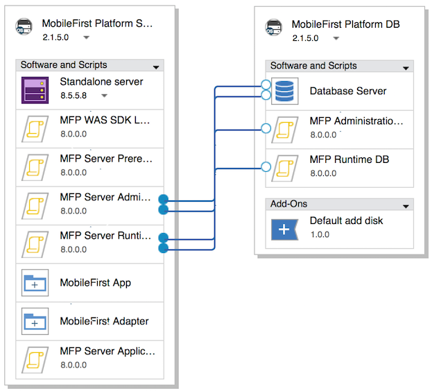

<!-- NLS_CHARSET=UTF-8 -->
## 概説
{: #overview }
{{ site.data.keys.product_full }} は、{{ site.data.keys.mf_server }} および {{ site.data.keys.product_adj }} のアプリケーションを IBM PureApplication System および IBM PureApplication Service on SoftLayer にデプロイして管理する機能を提供します。

{{ site.data.keys.product }} を IBM PureApplication System および IBM PureApplication Service on SoftLayer と組み合わせることにより、モバイル・アプリケーションの開発、テスト、およびクラウドへのデプロイを行うための、シンプルで直感的な環境を開発者および管理者に提供します。{{ site.data.keys.mf_system_pattern_full }} のこのバージョンでは、IBM PureApplication System および IBM PureApplication Service on SoftLayer の最新バージョンに含まれている PureApplication 仮想システム・パターン・テクノロジーに対する {{ site.data.keys.product }} ランタイムおよび成果物のサポートを提供しています。IBM PureApplication System の以前のバージョンでは、クラシック仮想システム・パターンがサポートされていました。

#### ジャンプ先
{: #jump-to }
* [{{ site.data.keys.mf_system_pattern }} のインストール](#installing-mobilefirst-system-pattern)
* [{{ site.data.keys.mf_system_pattern }} のトークン・ライセンス要件](#token-licensing-requirements-for-mobilefirst-system-pattern)
* [単一ノードの WebSphere Application Server Liberty プロファイル・サーバーへの {{ site.data.keys.mf_server }} のデプロイ](#deploying-mobilefirst-server-on-a-single-node-websphere-application-server-liberty-profile-server)
* [複数ノードの WebSphere Application Server Liberty プロファイル・サーバーへの {{ site.data.keys.mf_server }} のデプロイ](#deploying-mobilefirst-server-on-a-multiple-node-websphere-application-server-liberty-profile-server)
* [単一ノードの WebSphere Application Server フル・プロファイル・サーバーへの {{ site.data.keys.mf_server }} のデプロイ](#deploying-mobilefirst-server-on-a-single-node-websphere-application-server-full-profile-server)
* [複数ノードの WebSphere Application Server フル・プロファイル・サーバーへの {{ site.data.keys.mf_server }} のデプロイ](#deploying-mobilefirst-server-on-a-multiple-node-websphere-application-server-full-profile-server)
* [WebSphere Application Server Network Deployment サーバーのクラスターでの {{ site.data.keys.mf_server }} のデプロイ](#deploying-mobilefirst-server-on-clusters-of-websphere-application-server-network-deployment-servers)
* [単一ノードの WebSphere Application Server Liberty プロファイル・サーバーへの {{ site.data.keys.mf_app_center }} のデプロイ](#deploying-mobilefirst-application-center-on-a-single-node-websphere-application-server-liberty-profile-server)
* [単一ノードの WebSphere Application Server フル・プロファイル・サーバーへの {{ site.data.keys.mf_app_center }} のデプロイ](#deploying-mobilefirst-application-center-on-a-single-node-websphere-application-server-full-profile-server)
* [外部 LDAP リポジトリーを使用した、{{ site.data.keys.product_adj }} 管理セキュリティーの構成](#configuring-mobilefirst-administration-security-with-an-external-ldap-repository)
* [{{ site.data.keys.mf_system_pattern }} を使用した外部データベースの構成](#configuring-an-external-database-with-a-mobilefirst-system-pattern)
* [{{ site.data.keys.mf_analytics }} のデプロイおよび構成](#deploying-and-configuring-mobilefirst-analytics)
* [{{ site.data.keys.mf_system_pattern }} の定義済みテンプレート](#predefined-templates-for-mobilefirst-system-pattern)
* [{{ site.data.keys.mf_server }} のスクリプト・パッケージ](#script-packages-for-mobilefirst-server)
* [{{ site.data.keys.mf_system_pattern }} のアップグレード](#upgrading-mobilefirst-system-pattern)

### 主な利点
{: #key-benefits }
{{ site.data.keys.mf_system_pattern }} には以下のような利点があります。

* 定義済みテンプレートにより、ほとんどの標準的な {{ site.data.keys.mf_server }} デプロイメント・トポロジーについて、シンプルな方法でパターンを作成することができます。トポロジーの例は、以下のとおりです。  
    * IBM WebSphere Application Server Liberty プロファイルの単一ノード
    * IBM WebSphere Application Server Liberty プロファイルの複数ノード
    * IBM WebSphere Application Server フル・プロファイルの単一ノード
    * IBM WebSphere Application Server フル・プロファイルの複数ノード
    * WebSphere Application Server Network Deployment サーバーのクラスター
    * 以下などの {{ site.data.keys.mf_app_center }} デプロイメント・トポロジー
        * IBM WebSphere Application Server Liberty プロファイルの単一ノード
        * IBM WebSphere Application Server フル・プロファイルの単一ノード
* スクリプト・パッケージは、パターンへの Analytics サーバーの組み込みの自動化、および柔軟な DB VM デプロイメント・オプションなどの拡張デプロイメント・トポロジーを構成するためのビルディング・ブロックとして機能します。WebSphere Application Server および DB2 のスクリプト・パッケージは、WebSphere Application Server および DB2 のパターン・タイプを組み込むことによってによって使用可能になります。
* ランタイム・デプロイメント・スクリプト・パッケージ内の、オプションの JNDI プロパティーにより、デプロイメント・トポロジーの細かい調整が可能になります。それに加え、IBM WebSphere Application Server フル・プロファイルを使用してビルドされるデプロイメント・トポロジーが、WebSphere Application Server 管理コンソールへのアクセスをサポートするようになりました。これにより、アプリケーション・サーバーの構成をフルに制御できるようになりました。

### 重要な制限
{: #important-restrictions }
使用するパターン・テンプレートに応じて、一部のコンポーネント属性を変更しないでください。これらのコンポーネント属性のいずれかを変更すると、これらのテンプレートに基づいたパターンのデプロイメントは失敗します。

#### {{ site.data.keys.product }} (Application Center Liberty single node)
{: #mobilefirst-foundation-application-center-liberty-single-node }
「Liberty profile server」で、以下の属性の値を変更しないでください。

* WebSphere 製品のインストール・ディレクトリー
* 構成データのロケーション
* Liberty プロファイル・サーバー名
* 「IBM Java SDK のインストール」の下で、「Java SDK V7.0」または「Java SDK V7.1」のみを選択します。
* 「追加フィーチャーのインストール」を選択し、「IBM WebSphere eXtreme Scale」の選択をクリアします。

#### {{ site.data.keys.product }} (Application Center WebSphere Application Server single node)
{: #mobilefirst-foundation-application-center-websphere-application-server-single-node }
「Liberty profile server」で、以下の属性の値を変更しないでください。

* WebSphere 製品のインストール・ディレクトリー
* 構成データのロケーション
* セル名
* ノード名
* プロファイル名
* 「IBM Java SDK のインストール」の下で、「Java SDK V7.0」または「Java SDK V7.1」のみを選択します。
* 「追加フィーチャーのインストール」を選択し、「IBM WebSphere eXtreme Scale」の選択をクリアします。

#### {{ site.data.keys.product }} (Liberty single node)
{: #mobilefirst-foundation-liberty-single-node }
「Liberty profile server」で、以下の属性の値を変更しないでください。

* WebSphere 製品のインストール・ディレクトリー
* 構成データのロケーション
* Liberty プロファイル・サーバー名
* 「IBM Java SDK のインストール」の下で、「Java SDK V7.0」または「Java SDK V7.1」のみを選択します。
* 「追加フィーチャーのインストール」を選択し、「IBM WebSphere eXtreme Scale」の選択をクリアします。

#### {{ site.data.keys.product }} (Liberty server farm)
{: #mobilefirst-foundation-liberty-server-farm }
「Liberty profile server」で、以下の属性の値を変更しないでください。

* WebSphere 製品のインストール・ディレクトリー
* 構成データのロケーション
* Liberty プロファイル・サーバー名
* 「IBM Java SDK のインストール」の下で、「Java SDK V7.0」または「Java SDK V7.1」のみを選択します。
* 「追加フィーチャーのインストール」を選択し、「IBM WebSphere eXtreme Scale」の選択をクリアします。

#### {{ site.data.keys.product }} (WebSphere Application Server single node) テンプレート
{: #mobilefirst-foundation-websphere-application-server-single-node-template }
「MobileFirst Platform Server」ノードの**「Standalone server」コンポーネント**で、以下のいずれの属性値もアンロックや変更はしないでください。

* セル名
* ノード名
* プロファイル名
* これらの属性のいずれかを変更すると、パターン・デプロイメントは失敗します。

#### {{ site.data.keys.product }} (WebSphere Application Server server farm) テンプレート
{: #mobilefirst-foundation-websphere-application-server-server-farm-template }
「MobileFirst Platform Server」ノードの**「Standalone server」コンポーネント**で、以下のいずれの属性値もアンロックや変更はしないでください。

* セル名
* ノード名
* プロファイル名
* これらの属性のいずれかを変更すると、パターン・デプロイメントは失敗します。

#### {{ site.data.keys.product }} (WebSphere Application Server Network Deployment) テンプレート
{: #mobilefirst-foundation-websphere-application-server-network-deployment-template }
**「DmgrNode」ノード**の**「Deployment manager」コンポーネント**または **「CustomNode」ノード**の**「Custom nodes」コンポーネント**で、以下のいずれの属性値もアンロックや変更はしないでください。

* セル名
* ノード名
* プロファイル名

これらの属性のいずれかを変更すると、パターン・デプロイメントは失敗します。

### 制限
{: #limitations }
以下のような制限があります。

* WebSphere Application Server Liberty プロファイル・サーバー・ファームおよび WebSphere Application Server フル・プロファイル・サーバー・ファームの動的スケーリングはサポートされていません。サーバー・ファーム・ノードの数は、スケーリング・ポリシーを設定することによってパターンで指定できますが、ランタイム中は変更できません。
* V7.0 より前のバージョンでサポートされている {{ site.data.keys.v63_to_80prerebrand_product_full }} System Pattern Extension for {{ site.data.keys.mf_studio }} および Ant コマンド・ライン・インターフェースは、{{ site.data.keys.mf_system_pattern }} の現行バージョンでは使用できません。
* {{ site.data.keys.mf_system_pattern }} は、WebSphere Application Server パターンに依存しており、それには独自の制限があります。詳しくは、『[Restrictions for WebSphere Application Server Patterns](http://ibm.biz/knowctr#SSAJ7T_1.0.0/com.ibm.websphere.waspatt20base.doc/ae/rins_patternsB_restrictions.html)』を参照してください。
* 仮想システム・パターンのアンインストールの制限により、スクリプト・パッケージは、パターン・タイプを削除した後、手動で削除する必要があります。IBM PureApplication System で、**「カタログ」→「スクリプト・パッケージ」**を選択して、**コンポーネント**・セクションにリストされているスクリプト・パッケージを削除します。
* 「MobileFirst (WebSphere Application Server Network Deployment)」パターン・テンプレートは、トークン・ライセンスをサポートしません。このパターンを使用する場合は、永久ライセンスを使用する必要があります。その他パターンはすべて、トークン・ライセンスをサポートします。

### 構成
{: #composition }
{{ site.data.keys.mf_system_pattern }} は、以下のパターンで構成されます。

* IBM WebSphere Application Server Network Deployment Patterns 2.2.0.0。
* [PureApplication Service] WebSphere Application Server Network Deployment Patterns が機能できるようにする WebSphere 8558 for Mobile IM リポジトリー。IBM PureApplication System の管理者に連絡して、WebSphere 8558 IM リポジトリーがインストールされていることを確認してください。
* IBM DB2 with BLU Acceleration Pattern 1.2.4.0。
* {{ site.data.keys.mf_system_pattern }}.

### コンポーネント
{: #components }
IBM WebSphere Application Server Pattern および IBM DB2 with BLU Acceleration Pattern で提供されるすべてのコンポーネントに加えて、{{ site.data.keys.mf_system_pattern }} では、以下のスクリプト・パッケージを提供しています。

* MFP Administration DB
* MFP Runtime DB
* MFP Server Prerequisite
* MFP Server Administration
* MFP Server Runtime Deployment
* MFP Server Application Adapter Deployment
* MFP IHS Configuration
* MFP Analytics
* MFP Open Firewall Ports for WAS
* MFP WAS SDK Level
* MFP Server Application Center

### 異なる製品バージョンで作成されたパターン・タイプおよび成果物の間の互換性
{: #compatibility-between-pattern-types-and-artifacts-created-with-different-product-versions }
MobileFirst Studio V6.3.0 以前を使用してアプリケーションを開発した場合、関連付けられているランタイム、アプリケーション、およびアダプターの成果物を、{{ site.data.keys.v63_to_80prerebrand_product_full }} V7.0.0 以降に関連付けられているパターンにアップロードできます。

{{ site.data.keys.v63_to_80prerebrand_product_full }} V6.3.0 以前に関連付けられているパターン・タイプには、MobileFirst Studio V7.0.0 以降を使用して作成されたランタイム、アプリケーション、およびアダプターの成果物との互換性がありません。

バージョン V6.0.0 以前では、同じバージョンのサーバー、**.war** ファイル、アプリケーション (**.wlapp** ファイル)、およびアダプターのみに互換性があります。

## {{ site.data.keys.mf_system_pattern }} のインストール
{: #installing-mobilefirst-system-pattern }
**{{ site.data.keys.mf_system_pattern_file }}** ファイルがあります。この手順を開始する前にファイルを解凍しておいてください。

1. 新規パターン・タイプを作成するための権限を備えたアカウントを使用して、IBM PureApplication System にログインします。
2. **「カタログ」→「パターン・タイプ」**にアクセスします。
3. 以下のように、{{ site.data.keys.mf_system_pattern }} **.tgz** ファイルをアップロードします。
    * ツールバーで、**「+」**をクリックします。「パターン・タイプのインストール」ウィンドウが開きます。
    * 「ローカル」タブで**「参照 (Browse)」**をクリックし、{{ site.data.keys.mf_system_pattern }} の **.tgz** ファイルを選択し、アップロード・プロセスが完了するまで待ちます。当該パターン・タイプがリスト内に表示され、有効ではないとマークされます。
4. パターン・タイプのリストで、アップロードしたパターン・タイプをクリックします。パターン・タイプの詳細が表示されます。
5. 「ご使用条件」行の**「ライセンス (License)」**をクリックします。「ライセンス」ウィンドウが表示され、ご使用条件が示されます。
6. ライセンスを受け入れる場合は、**「同意する (Accept)」**をクリックします。これで、パターン・タイプの詳細に、ライセンスが受け入れられていることが示されます。
7. 「状況」行の**「有効にする (Enable)」**をクリックします。これで、パターン・タイプが有効であるものとしてリストされます。
8. この手順は、PureApplication Service の場合必須です。パターン・タイプが正常に有効になったら、**「カタログ」→「スクリプト・パッケージ」**に移動し、「MFP \*\*\*」に似た名前を持つスクリプト・パッケージを選択します。右の詳細ページで、**「ご使用条件」**フィールド内のライセンスを受諾します。コンポーネント・セクションにリストされている、11 個のすべてのスクリプト・パッケージに対して、この操作を繰り返します。

## {{ site.data.keys.mf_system_pattern }} のトークン・ライセンス要件
{: #token-licensing-requirements-for-mobilefirst-system-pattern }
トークン・ライセンスを使用して {{ site.data.keys.product }} のライセンス処理を行う場合、{{ site.data.keys.mf_system_pattern_full }} をデプロイする前に、IBM Rational License Key Server をインストールし、ライセンスを指定して構成する必要があります。

> **重要:** 「{{ site.data.keys.product }} (WAS ND)」パターン・テンプレートは、トークン・ライセンスをサポートしません。「{{ site.data.keys.product }} (WAS ND)」パターン・テンプレートに基づいてパターンをデプロイする場合は、永久ライセンスを使用する必要があります。その他のパターン・テンプレートはすべて、トークン・ライセンスをサポートします。

IBM Rational License Key Server は、PureApplication System の外部になければなりません。{{ site.data.keys.system_pattern }} は、IBM Rational License Key Server に対して PureApplication System 共有サービスをサポートしません。

さらに、パターン属性にライセンス・キー・サーバー情報を追加するために、Rational License Key Server に関する以下の情報を入手しておくことも必要です。

* Rational License Key Server の完全修飾ホスト名または IP アドレス
* ライセンス・マネージャー・デーモン (**lmgrd**) ポート
* ベンダー・デーモン (**ibmratl**) ポート

Rational License Key Server と PureApplication System の間にファイアウォールがある場合、両方のデーモンのポートがファイアウォール内で開いていることを確認してください。
ライセンス・キー・サーバーに接続できなかったり、使用可能なライセンスのトークンが不十分な場合、{{ site.data.keys.system_pattern }} のデプロイメントは失敗します。

Rational License Key Server のインストールおよび構成について詳しくは、[IBM Support - Rational ライセンス交付に関する開始ページ](http://www.ibm.com/software/rational/support/licensing/)を参照してください。

## 単一ノードの WebSphere Application Server Liberty プロファイル・サーバーへの {{ site.data.keys.mf_server }} のデプロイ
{: #deploying-mobilefirst-server-on-a-single-node-websphere-application-server-liberty-profile-server }
定義済みテンプレートを使用して、{{ site.data.keys.mf_server }} を、単一ノードの WebSphere Application Server Liberty プロファイル・サーバーにデプロイします。

この手順では、特定の成果物 (必要なアプリケーションやアダプターなど) を IBM PureApplication System にアップロードします。開始する前に、成果物がアップロードに使用できる状態であることを確認してください。

**トークン・ライセンス要件:** トークン・ライセンスを使用して {{ site.data.keys.product }} のライセンス処理を行う場合、手順を進める前に、[{{ site.data.keys.mf_system_pattern }} のトークン・ライセンス要件](#token-licensing-requirements-for-mobilefirst-system-pattern)に概説されている要件を確認してください。ライセンス・キー・サーバーに接続できなかったり、使用可能なライセンスのトークンが不十分な場合、このパターンのデプロイメントは失敗します。

テンプレート内のスクリプト・パッケージの一部のパラメーターは、推奨値を使用して構成されており、このセクションには記載されていません。微調整を目的とする場合は、[{{ site.data.keys.mf_server }} のスクリプト・パッケージ](#script-packages-for-mobilefirst-server)に記載されている、スクリプト・パッケージのすべてのパラメーターについての詳細情報を参照してください。

この手順で使用されている定義済みテンプレートの構成と構成オプションについて詳しくは、[{{ site.data.keys.product }} (Liberty single node) テンプレート](#mobilefirst-foundation-liberty-single-node-template)を参照してください。

1. 以下の手順に従って、定義済みテンプレートからパターンを作成します。
    * IBM PureApplication System のダッシュボードで、**「パターン」→「仮想システム・パターン」** をクリックします。「仮想システム・パターン」ページが開きます。
    * **「仮想システム・パターン」**ページで**「新規作成」**をクリックし、ポップアップ・ウィンドウで、定義済みテンプレートのリストから**「MobileFirst Platform (Liberty single node)」**を選択します。名前が長いために、名前の一部のみが表示されている場合は、**「詳細情報」**タブで説明を表示することにより、正しいテンプレートが選択されていることを確認できます。
    * **「名前」**フィールドに、パターンの名前を入力します。
    * **「バージョン」**フィールドに、パターンのバージョン番号を指定します。
    * **「ビルドの開始」**をクリックします。
2. この手順は、AIX の場合必須です。Power 上で稼働している IBM PureApplication System で、MobileFirst Platform DB ノードは、以下の手順に従って、テンプレート内の「Default add disk」コンポーネントの代わりに AIX 固有のアドオン・コンポーネントである「Default AIX add disk」を使用して、jfs2 ファイル・システムをサポートする必要があります。
    * パターン・ビルダーで、**「MobileFirst Platform DB」**ノードを選択します。
    * **「コンポーネント・アドオンの追加」**ボタンをクリックします (このボタンは、**「MobileFirst Platform DB」**ノードの上にカーソルを移動した時にコンポーネント・ボックスの上に表示されます)。
    * **「アドオンの追加」**リストから、**「Default AIX add disk」**を選択します。このコンポーネントが、MobileFirst Platform DB ノードの最下位コンポーネントとして追加されます。
    * **「Default AIX add disk」**コンポーネントを選択し、以下の属性を指定します。
        * **DISK_SIZE_GB:** DB サーバーに拡張されるストレージ・サイズ (GB 単位で測定)。サンプル値: **10**。
        * **FILESYSTEM_TYPE:** AIX でサポートされるファイル・システム。デフォルト値: **jfs2**。
        * **MOUNT_POINT:** MobileFirst Platform DB ノード内の Database Server コンポーネントの属性**「Mount point for instance owner」**に一致します。サンプル値: **/dbinst**。
        * **VOLUME_GROUP:** サンプル値: **group1**。正しい値については、IBM PureApplication System 管理者に問い合わせてください。
    * MobileFirst Platform DB ノードで、**「Default add disk」**コンポーネントを選択し、ビン・アイコンをクリックしてそれを削除します。
    * パターンを保存します。
3. オプション: {{ site.data.keys.mf_server }} 管理を構成します。後のステップ 9 のパターン・デプロイメント構成フェーズ中に {{ site.data.keys.mf_server }} 管理特権を持つユーザー資格情報を指定したい場合は、このステップをスキップすることができます。ここでユーザー資格情報を指定する場合は、以下のステップを実行してください。 

    > **注:** LDAP サーバーを使用して管理セキュリティーを構成する場合は、追加の LDAP 情報を指定する必要があります。詳しくは、[外部 LDAP リポジトリーを使用した、{{ site.data.keys.product_adj }} 管理セキュリティーの構成](#configuring-mobilefirst-administration-security-with-an-external-ldap-repository)を参照してください。
    * MobileFirst Platform Server ノードで、**「MFP Server Administration」**コンポーネントをクリックします。キャンバスの横に、選択したコンポーネントのプロパティーが表示されます。
    * **「admin_user」**フィールドと**「admin_password」**フィールドの横で「削除」ボタンをクリックして、それらのパターン・レベル・パラメーター設定をクリアします。
    * **「admin_user」**フィールドと**「admin\_password」**フィールドに、管理ユーザー名とパスワードを指定します。
    * トークン・ライセンスを使用して {{ site.data.keys.product }} のライセンス処理を行う場合、以下のフィールドに入力します。トークン・ライセンスを使用しない場合は、これらのフィールドをブランクのままにします。

    **ACTIVATE\_TOKEN\_LICENSE**: トークン・ライセンスを使用してパターンのライセンス処理を行う場合は、このフィールドを選択します。  
    **LICENSE\_SERVER\_HOSTNAME**: Rational License Key Server の完全修飾ホスト名または IP アドレスを入力します。  
    **LMGRD\_PORT**: ライセンス・マネージャー・デーモン (**lmrgd**) が接続を listen するポート番号を入力します。デフォルトのライセンス・マネージャー・デーモン・ポートは 27000 です。  
    **IBMRATL\_PORT**: ベンダー・デーモン (**ibmratl**) が接続を listen するポート番号を入力します。デフォルトのベンダー・デーモン・ポートは通常 27001 です。  

    パターン・デプロイメント中に、{{ site.data.keys.mf_server }} のデフォルト管理アカウントが作成されます。

4. オプション: {{ site.data.keys.mf_server }} ランタイム・デプロイメントを構成します。後のステップ 9 のパターン・デプロイメント構成フェーズ中にランタイムのコンテキスト・ルート名を指定したい場合は、このステップをスキップすることができます。ここでコンテキスト・ルート名を指定する場合は、以下のステップを実行してください。
    * MobileFirst Platform Server ノードで、**「MFP Server Runtime Deployment」**コンポーネントをクリックします。キャンバスの横に、選択したコンポーネントのプロパティーが表示されます。
    * **「runtime\_contextRoot」**フィールドの横の**「削除」**ボタンをクリックして、パターン・レベル・パラメーター設定をクリアします。
    * **「runtime\_contextRoot」**フィールドに、ランタイム・コンテキスト・ルート名を指定します。コンテキスト・ルート名は、先頭がスラッシュ (/) でなければならない点に留意してください。例えば、`「/HelloWorld」`のようにします。

5. 以下の手順に従って、アプリケーションとアダプターの成果物をアップロードします。

    > **重要:** アプリケーションおよびアダプターのターゲット・パスを指定する場合は、すべてのアプリケーションおよびアダプターを同じディレクトリーに入れるようにしてください。例えば、あるターゲット・パスが **/opt/tmp/deploy/HelloWorld-common.json** の場合、他のすべてのターゲット・パスは `/opt/tmp/deploy/*` とします。
    * MobileFirst Platform Server ノードで、**「MFP Server Application」**コンポーネントまたは**「MFP Server Adapter」**コンポーネントをクリックします。キャンバスの横に、選択したコンポーネントのプロパティーが表示されます。
    * **「追加ファイル」**フィールドで**「参照」**ボタンをクリックして、アプリケーション成果物またはアダプター成果物を見つけ、アップロードします。
    * **「ターゲット・パス」**フィールドに、成果物を保管するための絶対パスを、ファイル名を含めて指定します。例えば、**/opt/tmp/deploy/HelloWorld-common.json** のように指定します。
    * パターンにどのアプリケーションまたはアダプターもデプロイしない場合は、関連コンポーネント内の**「X」**ボタンをクリックしてそのコンポーネントを削除します。アプリケーションもアダプターもインストールされていない、空の {{ site.data.keys.mf_console }} をデプロイするには、MFP Server Application Adapter Deployment コンポーネント内の「X」ボタンをクリックしてそのコンポーネントを削除します。

6. オプション: デプロイメント対象のアプリケーション成果物またはアダプター成果物をさらに追加します。
    * **「資産」**ツールバーから**「ソフトウェア・コンポーネント」**を展開し、**「追加ファイル」**コンポーネントを、キャンバス内の MobileFirst Platform Server ノードにドラッグ・アンド・ドロップします。それを **{{ site.data.keys.product_adj }} App\_X** または **{{ site.data.keys.product_adj }} Adatper\_X** に名前変更します (ここで、**X** は、差異化のための固有の数値を表します)。
    * 新しく追加したアプリケーション・コンポーネントまたはアダプター・コンポーネントの上にカーソルを移動し、**「上に移動」**ボタンと**「下に移動」**ボタンをクリックして、ノード内での順序を調整します。そのコンポーネントは、MFP Runtime Deployment コンポーネントよりも後で、かつ MFP Server Application Adapter Deployment コンポーネントよりも前である位置に配置するようにしてください。
    * 新しく追加したアプリケーション・コンポーネントまたはアダプター・コンポーネントをクリックします。キャンバスの横に、選択したコンポーネントのプロパティーが表示されます。アプリケーションまたはアダプターの成果物をアップロードし、ステップ 6 内のステップを参照してそのターゲット・パスを指定します。
    * ステップ 7 を繰り返して、デプロイメント対象のアプリケーションおよびアダプターをさらに追加します。

7. オプション: {{ site.data.keys.mf_server }} へのアプリケーションおよびアダプターのデプロイメントを構成します。後のステップ 9 のパターン・デプロイメント構成フェーズ中に、デプロイメント特権を持つユーザー資格情報を指定したい場合は、このステップをスキップすることができます。ステップ 3 でデフォルト管理ユーザー資格情報を指定した場合は、以下の手順に従って、ここでデプロイヤー・ユーザーを指定できます。これは管理ユーザー資格情報と一致している必要があります。
    * MobileFirst Platform Server ノードで、**「MFP Server Application Adapter Deployment」**コンポーネントを選択します。キャンバスの横に、選択したコンポーネントのプロパティーが表示されます。
    * **「deployer_user」**および**「deployer_password」**という名前のパラメーターを見つけその横の「削除」ボタンをクリックして、パターン・レベル・パラメーター設定をクリアします。
    * **「deployer\_user」**フィールドと**「deployer\_password」**フィールドに、ユーザー名とパスワードを指定します。

8. 以下の手順に従って、パターン・デプロイメントを構成し、起動します。
    * IBM PureApplication System のダッシュボードで、**「パターン」→「仮想システム・パターン」** をクリックします。
    * 「**仮想システム・パターン**」ページで**「検索」**フィールドを使用して、作成したパターンを見つけそのパターンを選択します。
    * パターンの詳細情報を表示しているパネルの上のツールバーで、「デプロイ」ボタンをクリックします。
    * 「パターンのデプロイ」ウィンドウの「構成」パネルで、**「環境プロファイル」**リストから正しい環境プロファイルを選択し、他の IBM PureApplication System 環境パラメーターを指定します。正しい情報を入手するには、IBM PureApplication System 管理者に問い合わせてください。
    * 中央の列で**「パターン属性」**をクリックして、ユーザー名およびパスワードなどの属性を表示します。

        示されたフィールドに以下の情報を指定します。

        > **注:** 外部 LDAP サーバーが構成されている場合でも、パターン・レベルのパラメーターのデフォルト値に適切な変更を実行します。LDAP サーバーを使用して管理セキュリティーを構成した場合は、追加の LDAP 情報を指定する必要があります。詳しくは、[外部 LDAP リポジトリーを使用した、{{ site.data.keys.product_adj }} 管理セキュリティーの構成](#configuring-mobilefirst-administration-security-with-an-external-ldap-repository)を参照してください。
        
        **admin\_user**  
        ステップ 3 で構成された場合、表示されません。デフォルトの {{ site.data.keys.mf_server }} 管理者アカウントを作成します。デフォルト値: demo。
        
        **admin\_password**  
        ステップ 3 で構成された場合、表示されません。デフォルト管理アカウントのパスワード。デフォルト値: demo。
        
        **ACTIVATE\_TOKEN\_LICENSE**  
        ステップ 3 で構成された場合、表示されません。トークン・ライセンスを使用してパターンのライセンス処理を行う場合は、このフィールドを選択します。永久ライセンスを使用する場合は、このフィールドをクリアしたままにします。
        
        **LICENSE\_SERVER\_HOSTNAME**  
        ステップ 3 で構成された場合、表示されません。トークン・ライセンスを使用して {{ site.data.keys.product }} のライセンス処理を行う場合は、Rational License Key Server の完全修飾ホスト名または IP アドレスを入力します。それ以外の場合は、このフィールドをブランクのままにします。
        
        **LMGRD\_PORT**   
        ステップ 3 で構成された場合、表示されません。トークン・ライセンスを使用して {{ site.data.keys.product }} のライセンス処理を行う場合は、ライセンス・マネージャー・デーモン (lmrgd) が接続を listen するポート番号を入力します。それ以外の場合は、このフィールドをブランクのままにします。
        デフォルトのライセンス・マネージャー・デーモン・ポートは 27000 です。

        **IBMRATL\_PORT**  
        ステップ 3 で構成された場合、表示されません。トークン・ライセンスを使用して {{ site.data.keys.product }} のライセンス処理を行う場合は、ベンダー・デーモン (ibmratl) が接続を listen するポート番号を入力します。
        それ以外の場合は、このフィールドをブランクのままにします。デフォルトのベンダー・デーモン・ポートは通常 27001 です。

        **runtime\_contextRoot**  
        ステップ 5 で構成された場合、表示されません。{{ site.data.keys.mf_server }} ランタイムのコンテキスト・ルート名。この名前は、先頭が「/」でなければなりません。
        
        **deployer\_user**  
        ステップ 8 で構成された場合、表示されません。デプロイメント特権を持つアカウントのユーザー名。外部 LDAP サーバーが構成されていない場合は、管理サービス用のデフォルト管理ユーザーを作成する際に指定したのと同じ値を入力する必要があります。これは、この場合、アプリケーションおよびアダプターのデプロイメントで許可される唯一のユーザーがデフォルト管理ユーザーであるためです。
        
        **deployer\_password**  
        ステップ 8 で構成された場合、表示されません。デプロイメント特権を持つユーザーのユーザー・パスワード。
        
        **MFP Vms Password(root)**  
        {{ site.data.keys.mf_server }} ノードおよび {{ site.data.keys.product }} DB ノードのルート・パスワード。デフォルト値: passw0rd。
        
        **MFP DB Password(Instance owner)**  
        MobileFirst Platform DB ノードのインスタンス所有者のパスワード。デフォルト値: **passw0rd**。    
    * **「クイック・デプロイ」**をクリックして、パターン・デプロイメントを起動します。数秒後、パターンが起動を開始したことを示すメッセージが表示されます。メッセージに提供されている URL をクリックしてパターン・デプロイメントの状況を追跡したり、**「パターン」→「仮想システム・インスタンス」**に移動して「仮想システム・インスタンス」ページを開き、そこでパターンを検索したりすることができます。

    トークン・ライセンスを使用して {{ site.data.keys.product }} のライセンス処理を行う場合、使用可能なライセンスのトークンが不十分であったり、ライセンス・キー・サーバーの IP アドレスとポートの入力が間違っていたりすると、パターンのデプロイに失敗します。

9. 以下の手順に従って、{{ site.data.keys.mf_console }} にアクセスします。
    * **「パターン」→「仮想システム・インスタンス」**をクリックして「仮想システム・インスタンス」ページを開き、そこでパターンを検索します。稼働中状態であることを確認してください。
    * パターン名を選択し、選択したインスタンスの詳細を表示するパネルで、**「仮想マシン・パースペクティブ」**オプションを展開します。
    * **MobileFirst\_Platform\_Server.** に似た名前を持つ {{ site.data.keys.mf_server }} VM を見つけ、そのパブリック IP アドレスをメモします。この後のステップでこの情報が必要になります。
    * ブラウザーで、次のいずれかのフォーマットを使用して URL を作成して {{ site.data.keys.mf_console }} を開きます。
        * `http://{MFP Server VM Public IP}:9080/mfpconsole`
        * `https://{MFP Server VM Public IP}:9443/mfpconsole`
    * ステップ 3 またはステップ 9 で指定した管理ユーザーおよびパスワードを使用して、コンソールにログインします。

## 複数ノードの WebSphere Application Server Liberty プロファイル・サーバーへの {{ site.data.keys.mf_server }} のデプロイ
{: #deploying-mobilefirst-server-on-a-multiple-node-websphere-application-server-liberty-profile-server }
定義済みテンプレートを使用して、{{ site.data.keys.mf_server }} を、複数ノードの WebSphere Application Server Liberty プロファイル・サーバーにデプロイします。

この手順では、特定の成果物 (必要なアプリケーションやアダプターなど) を IBM PureApplication System にアップロードします。開始する前に、成果物がアップロードに使用できる状態であることを確認してください。

**トークン・ライセンス要件:** トークン・ライセンスを使用して {{ site.data.keys.product }} のライセンス処理を行う場合、手順を進める前に、[{{ site.data.keys.mf_system_pattern }} のトークン・ライセンス要件](#token-licensing-requirements-for-mobilefirst-system-pattern)に概説されている要件を確認してください。ライセンス・キー・サーバーに接続できなかったり、使用可能なライセンスのトークンが不十分な場合、このパターンのデプロイメントは失敗します。

テンプレート内のスクリプト・パッケージの一部のパラメーターは、推奨値を使用して構成されており、このセクションには記載されていません。微調整を目的とする場合は、[{{ site.data.keys.mf_server }} のスクリプト・パッケージ](#script-packages-for-mobilefirst-server)に記載されている、スクリプト・パッケージのすべてのパラメーターについての詳細情報を参照してください。

この手順で使用されている定義済みテンプレートの構成と構成オプションについて詳しくは、[{{ site.data.keys.product }} (Liberty server farm) テンプレート](#mobilefirst-foundation-liberty-server-farm-template)を参照してください。

1. 以下の手順に従って、定義済みテンプレートからパターンを作成します。
    * IBM PureApplication System のダッシュボードで、**「パターン」→「仮想システム・パターン」** をクリックします。「**仮想システム・パターン**」ページが開きます。
    * **「仮想システム・パターン」**ページで**「新規作成」**をクリックし、ポップアップ・ウィンドウで、定義済みテンプレートのリストから**「MobileFirst Platform (Liberty server farm)」**を選択します。名前が長いために、名前の一部のみが表示されている場合は、**「詳細情報」**タブで説明を表示することにより、正しいテンプレートが選択されていることを確認できます。
    * **「名前」**フィールドに、パターンの名前を入力します。
    * **「バージョン」**フィールドに、パターンのバージョン番号を指定します。
    * **「ビルドの開始」**をクリックします。
2. この手順は、AIX の場合必須です。Power 上で稼働している IBM PureApplication System で、MobileFirst Platform DB ノードは、以下の手順に従って、テンプレート内の「Default add disk」コンポーネントの代わりに AIX 固有のアドオン・コンポーネントである「Default AIX add disk」を使用して、**jfs2** ファイル・システムをサポートする必要があります。
    * パターン・ビルダーで、**「MobileFirst Platform DB」**ノードを選択します。
    * **「コンポーネント・アドオンの追加」**ボタンをクリックします (このボタンは、**「MobileFirst Platform DB」**ノードの上にカーソルを移動した時にコンポーネント・ボックスの上に表示されます)。
    * **「アドオンの追加」**リストから、**「Default AIX add disk」**を選択します。このコンポーネントが、MobileFirst Platform DB ノードの最下位コンポーネントとして追加されます。
    * **「Default AIX add disk」**コンポーネントを選択し、以下の属性を指定します。
        * **DISK_SIZE_GB:** DB サーバーに拡張されるストレージ・サイズ (GB 単位で測定)。サンプル値: **10**。
        * **FILESYSTEM_TYPE:** AIX でサポートされるファイル・システム。デフォルト値: **jfs2**。
        * **MOUNT_POINT:** MobileFirst Platform DB ノード内の Database Server コンポーネントの属性**「Mount point for instance owner」**に一致します。サンプル値: **/dbinst**。
        * **VOLUME_GROUP:** サンプル値: **group1**。正しい値については、IBM PureApplication System 管理者に問い合わせてください。
    * MobileFirst Platform DB ノードで、**「Default add disk」**コンポーネントを選択し、ビン・アイコンをクリックしてそれを削除します。
    * パターンを保存します。
3. オプション: {{ site.data.keys.mf_server }} 管理を構成します。後のステップ 9 のパターン・デプロイメント構成フェーズ中に {{ site.data.keys.mf_server }} 管理特権を持つユーザー資格情報を指定したい場合は、このステップをスキップすることができます。ここでユーザー資格情報を指定する場合は、以下のステップを実行してください。 

    > **注:** LDAP サーバーを使用して管理セキュリティーを構成する場合は、追加の LDAP 情報を指定する必要があります。詳しくは、[外部 LDAP リポジトリーを使用した、{{ site.data.keys.product_adj }} 管理セキュリティーの構成](#configuring-mobilefirst-administration-security-with-an-external-ldap-repository)を参照してください。
    * MobileFirst Platform Server ノードで、**「MFP Server Administration」**コンポーネントをクリックします。キャンバスの横に、選択したコンポーネントのプロパティーが表示されます。
    * **「admin_user」**フィールドと**「admin_password」**フィールドの横で「削除」ボタンをクリックして、それらのパターン・レベル・パラメーター設定をクリアします。
    * **「admin_user」**フィールドと**「admin\_password」**フィールドに、管理ユーザー名とパスワードを指定します。
    * トークン・ライセンスを使用して {{ site.data.keys.product }} のライセンス処理を行う場合、以下のフィールドに入力します。トークン・ライセンスを使用しない場合は、これらのフィールドをブランクのままにします。

    **ACTIVATE\_TOKEN\_LICENSE**: トークン・ライセンスを使用してパターンのライセンス処理を行う場合は、このフィールドを選択します。  
    **LICENSE\_SERVER\_HOSTNAME**: Rational License Key Server の完全修飾ホスト名または IP アドレスを入力します。  
    **LMGRD\_PORT**: ライセンス・マネージャー・デーモン (**lmrgd**) が接続を listen するポート番号を入力します。デフォルトのライセンス・マネージャー・デーモン・ポートは 27000 です。  
    **IBMRATL\_PORT**: ベンダー・デーモン (**ibmratl**) が接続を listen するポート番号を入力します。デフォルトのベンダー・デーモン・ポートは通常 27001 です。  

    パターン・デプロイメント中に、{{ site.data.keys.mf_server }} のデフォルト管理アカウントが作成されます。
    
4. オプション: {{ site.data.keys.mf_server }} ランタイム・デプロイメントを構成します。後のステップ 10 のパターン・デプロイメント構成フェーズ中にランタイムのコンテキスト・ルート名を指定したい場合は、このステップをスキップすることができます。ここでコンテキスト・ルート名を指定する場合は、以下のステップを実行してください。
    * MobileFirst Platform Server ノードで、**「MFP Server Runtime Deployment」**コンポーネントをクリックします。キャンバスの横に、選択したコンポーネントのプロパティーが表示されます。
    * **「runtime\_contextRoot」**フィールドの横の**「削除」**ボタンをクリックして、パターン・レベル・パラメーター設定をクリアします。
    * **「runtime\_contextRoot」**フィールドに、ランタイム・コンテキスト・ルート名を指定します。コンテキスト・ルート名は、先頭がスラッシュ (/) でなければならない点に留意してください。例えば、`「/HelloWorld」`のようにします。

5. 以下の手順に従って、アプリケーションとアダプターの成果物をアップロードします。

    > **重要:** アプリケーションおよびアダプターのターゲット・パスを指定する場合は、すべてのアプリケーションおよびアダプターを同じディレクトリーに入れるようにしてください。例えば、あるターゲット・パスが **/opt/tmp/deploy/HelloWorld-common.json** の場合、他のすべてのターゲット・パスは `/opt/tmp/deploy/*` とします。
    * MobileFirst Platform Server ノードで、**「MFP Server Application」**コンポーネントまたは**「MFP Server Adapter」**コンポーネントをクリックします。キャンバスの横に、選択したコンポーネントのプロパティーが表示されます。
    * **「追加ファイル」**フィールドで**「参照」**ボタンをクリックして、アプリケーション成果物またはアダプター成果物を見つけ、アップロードします。
    * **「ターゲット・パス」**フィールドに、成果物を保管するための絶対パスを、ファイル名を含めて指定します。例えば、**/opt/tmp/deploy/HelloWorld-common.json** のように指定します。
    * パターンにどのアプリケーションまたはアダプターもデプロイしない場合は、関連コンポーネント内の**「X」**ボタンをクリックしてそのコンポーネントを削除します。アプリケーションもアダプターもインストールされていない、空の {{ site.data.keys.mf_console }} をデプロイするには、MFP Server Application Adapter Deployment コンポーネント内の「X」ボタンをクリックしてそのコンポーネントを削除します。 

6. オプション: デプロイメント対象のアプリケーション成果物またはアダプター成果物をさらに追加します。
    * **「資産」**ツールバーから**「ソフトウェア・コンポーネント」**を展開し、**「追加ファイル」**コンポーネントを、キャンバス内の MobileFirst Platform Server ノードにドラッグ・アンド・ドロップします。それを **{{ site.data.keys.product_adj }} App\_X** または **{{ site.data.keys.product_adj }} Adatper\_X** に名前変更します (ここで、**X** は、差異化のための固有の数値を表します)。
    * 新しく追加したアプリケーション・コンポーネントまたはアダプター・コンポーネントの上にカーソルを移動し、**「上に移動」**ボタンと**「下に移動」**ボタンをクリックして、ノード内での順序を調整します。そのコンポーネントは、MFP Runtime Deployment コンポーネントよりも後で、かつ MFP Server Application Adapter Deployment コンポーネントよりも前である位置に配置するようにしてください。
    * 新しく追加したアプリケーション・コンポーネントまたはアダプター・コンポーネントをクリックします。キャンバスの横に、選択したコンポーネントのプロパティーが表示されます。アプリケーションまたはアダプターの成果物をアップロードし、ステップ 6 内のステップを参照してそのターゲット・パスを指定します。
    * ステップ 7 を繰り返して、デプロイメント対象のアプリケーションおよびアダプターをさらに追加します。

7. オプション: {{ site.data.keys.mf_server }} へのアプリケーションおよびアダプターのデプロイメントを構成します。後のステップ 9 のパターン・デプロイメント構成フェーズ中に、デプロイメント特権を持つユーザー資格情報を指定したい場合は、このステップをスキップすることができます。ステップ 3 でデフォルト管理ユーザー資格情報を指定した場合は、以下の手順に従って、ここでデプロイヤー・ユーザーを指定できます。これは管理ユーザー資格情報と一致している必要があります。
    * MobileFirst Platform Server ノードで、**「MFP Server Application Adapter Deployment」**コンポーネントを選択します。キャンバスの横に、選択したコンポーネントのプロパティーが表示されます。
    * **「deployer_user」**および**「deployer_password」**という名前のパラメーターを見つけその横の「削除」ボタンをクリックして、パターン・レベル・パラメーター設定をクリアします。
    * **「deployer\_user」**フィールドと**「deployer\_password」**フィールドに、ユーザー名とパスワードを指定します。

8. 以下の手順に従って、ベース・スケーリング・ポリシーを構成します。
    * 「MobileFirst Platform Server」ノードで、**「Base Scaling Policy」**コンポーネントを選択します。キャンバスの横に、選択したコンポーネントのプロパティーが表示されます。
    * **「インスタンス数」**フィールドに、パターン・デプロイメント中にインスタンス化されるサーバー・ノードの数を指定します。定義済みテンプレートでのデフォルト値は 2 です。このリリースでは動的スケーリングはサポートされていないため、残りの属性フィールドには値を指定しないでください。

9. 以下の手順に従って、パターン・デプロイメントを構成し、起動します。
    * IBM PureApplication System のダッシュボードで、**「パターン」→「仮想システム・パターン」** をクリックします。
    * 「**仮想システム・パターン**」ページで**「検索」**フィールドを使用して、作成したパターンを見つけそのパターンを選択します。
    * パターンの詳細情報を表示しているパネルの上のツールバーで、「デプロイ」ボタンをクリックします。
    * 「パターンのデプロイ」ウィンドウの「構成」パネルで、**「環境プロファイル」**リストから正しい環境プロファイルを選択し、他の IBM PureApplication System 環境パラメーターを指定します。正しい情報を入手するには、IBM PureApplication System 管理者に問い合わせてください。
    * 中央の列で**「パターン属性」**をクリックして、ユーザー名およびパスワードなどの属性を表示します。

        示されたフィールドに以下の情報を指定します。

        > **注:** 外部 LDAP サーバーが構成されている場合でも、パターン・レベルのパラメーターのデフォルト値に適切な変更を実行します。LDAP サーバーを使用して管理セキュリティーを構成した場合は、追加の LDAP 情報を指定する必要があります。詳しくは、[外部 LDAP リポジトリーを使用した、{{ site.data.keys.product_adj }} 管理セキュリティーの構成](#configuring-mobilefirst-administration-security-with-an-external-ldap-repository)を参照してください。
        
        **admin\_user**  
        ステップ 3 で構成された場合、表示されません。デフォルトの {{ site.data.keys.mf_server }} 管理者アカウントを作成します。デフォルト値: demo。
        
        **admin\_password**  
        ステップ 3 で構成された場合、表示されません。デフォルト管理アカウントのパスワード。デフォルト値: demo。
        
        **ACTIVATE\_TOKEN\_LICENSE**  
        ステップ 3 で構成された場合、表示されません。トークン・ライセンスを使用してパターンのライセンス処理を行う場合は、このフィールドを選択します。永久ライセンスを使用する場合は、このフィールドをクリアしたままにします。
        
        **LICENSE\_SERVER\_HOSTNAME**  
        ステップ 3 で構成された場合、表示されません。トークン・ライセンスを使用して {{ site.data.keys.product }} のライセンス処理を行う場合は、Rational License Key Server の完全修飾ホスト名または IP アドレスを入力します。それ以外の場合は、このフィールドをブランクのままにします。
        
        **LMGRD\_PORT**   
        ステップ 3 で構成された場合、表示されません。トークン・ライセンスを使用して {{ site.data.keys.product }} のライセンス処理を行う場合は、ライセンス・マネージャー・デーモン (lmrgd) が接続を listen するポート番号を入力します。それ以外の場合は、このフィールドをブランクのままにします。
        デフォルトのライセンス・マネージャー・デーモン・ポートは 27000 です。

        **IBMRATL\_PORT**  
        ステップ 3 で構成された場合、表示されません。トークン・ライセンスを使用して {{ site.data.keys.product }} のライセンス処理を行う場合は、ベンダー・デーモン (ibmratl) が接続を listen するポート番号を入力します。それ以外の場合は、このフィールドをブランクのままにします。
        デフォルトのベンダー・デーモン・ポートは通常 27001 です。

        **runtime\_contextRoot**  
        ステップ 5 で構成された場合、表示されません。{{ site.data.keys.mf_server }} ランタイムのコンテキスト・ルート名。この名前は、先頭が「/」でなければなりません。
        
        **deployer\_user**  
        ステップ 8 で構成された場合、表示されません。デプロイメント特権を持つアカウントのユーザー名。外部 LDAP サーバーが構成されていない場合は、管理サービス用のデフォルト管理ユーザーを作成する際に指定したのと同じ値を入力する必要があります。これは、この場合、アプリケーションおよびアダプターのデプロイメントで許可される唯一のユーザーがデフォルト管理ユーザーであるためです。
        
        **deployer\_password**  
        ステップ 8 で構成された場合、表示されません。デプロイメント特権を持つユーザーのユーザー・パスワード。
        
        **MFP Vms Password(root)**  
        {{ site.data.keys.mf_server }} ノードおよび {{ site.data.keys.product }} DB ノードのルート・パスワード。デフォルト値: passw0rd。
        
        **MFP DB Password(Instance owner)**  
        MobileFirst Platform DB ノードのインスタンス所有者のパスワード。デフォルト値: **passw0rd**。    
    * **「クイック・デプロイ」**をクリックして、パターン・デプロイメントを起動します。数秒後、パターンが起動を開始したことを示すメッセージが表示されます。メッセージに提供されている URL をクリックしてパターン・デプロイメントの状況を追跡したり、**「パターン」→「仮想システム・インスタンス」**に移動して「仮想システム・インスタンス」ページを開き、そこでパターンを検索したりすることができます。

    トークン・ライセンスを使用して {{ site.data.keys.product }} のライセンス処理を行う場合、使用可能なライセンスのトークンが不十分であったり、ライセンス・キー・サーバーの IP アドレスとポートの入力が間違っていたりすると、パターンのデプロイに失敗します。
    
10. 以下の手順に従って、{{ site.data.keys.mf_console }} にアクセスします。
    * **「パターン」→「仮想システム・インスタンス」**をクリックして「仮想システム・インスタンス」ページを開き、そこでパターンを検索します。稼働中状態であることを確認してください。
    * パターン名を選択し、選択したインスタンスの詳細を表示するパネルで、**「仮想マシン・パースペクティブ」**オプションを展開します。
    * **IHS\_Server.*** に似た名前を持つ IHS Server VM を見つけ、そのパブリック IP アドレスをメモします。この後のステップでこの情報が必要になります。
    * ブラウザーで、次のいずれかのフォーマットを使用して URL を作成して {{ site.data.keys.mf_console }} を開きます。
        * `http://{IHS Server VM Public IP}/mfpconsole`
        * `https://{IHS Server VM Public IP}/mfpconsole`
    * ステップ 3 またはステップ 10 で指定した管理ユーザー ID およびパスワードを使用してコンソールにログインします。

## 単一ノードの WebSphere Application Server フル・プロファイル・サーバーへの {{ site.data.keys.mf_server }} のデプロイ
{: #deploying-mobilefirst-server-on-a-single-node-websphere-application-server-full-profile-server }
定義済みテンプレートを使用して、単一ノードの {{ site.data.keys.mf_server }} を WebSphere Application Server フル・プロファイル・サーバーにデプロイします。

この手順では、特定の成果物 (必要なアプリケーションやアダプターなど) を IBM PureApplication System にアップロードします。開始する前に、成果物がアップロードに使用できる状態であることを確認してください。

**トークン・ライセンス要件:** トークン・ライセンスを使用して {{ site.data.keys.product }} のライセンス処理を行う場合、手順を進める前に、[{{ site.data.keys.mf_system_pattern }} のトークン・ライセンス要件](#token-licensing-requirements-for-mobilefirst-system-pattern)に概説されている要件を確認してください。ライセンス・キー・サーバーに接続できなかったり、使用可能なライセンスのトークンが不十分な場合、このパターンのデプロイメントは失敗します。

テンプレート内のスクリプト・パッケージの一部のパラメーターは、推奨値を使用して構成されており、このセクションには記載されていません。微調整を目的とする場合は、[{{ site.data.keys.mf_server }} のスクリプト・パッケージ](#script-packages-for-mobilefirst-server)に記載されている、スクリプト・パッケージのすべてのパラメーターについての詳細情報を参照してください。

この手順で使用されている定義済みテンプレートの構成と構成オプションについて詳しくは、[{{ site.data.keys.product }} (WAS single node) テンプレート](#mobilefirst-foundation-was-single-node-template)を参照してください。

1. 以下の手順に従って、定義済みテンプレートからパターンを作成します。
    * IBM PureApplication System のダッシュボードで、**「パターン」→「仮想システム・パターン」** をクリックします。「**仮想システム・パターン**」ページが開きます。
    * **「仮想システム・パターン」**ページで**「新規作成」**をクリックし、ポップアップ・ウィンドウで、定義済みテンプレートのリストから**「MobileFirst Platform (WAS single node)」**を選択します。名前が長いために、名前の一部のみが表示されている場合は、**「詳細情報」**タブで説明を表示することにより、正しいテンプレートが選択されていることを確認できます。
    * **「名前」**フィールドに、パターンの名前を入力します。
    * **「バージョン」**フィールドに、パターンのバージョン番号を指定します。
    * **「ビルドの開始」**をクリックします。
2. この手順は、AIX の場合必須です。Power 上で稼働している IBM PureApplication System で、MobileFirst Platform DB ノードは、以下の手順に従って、テンプレート内の「Default add disk」コンポーネントの代わりに AIX 固有のアドオン・コンポーネントである「Default AIX add disk」を使用して、**jfs2** ファイル・システムをサポートする必要があります。
    * パターン・ビルダーで、**「MobileFirst Platform DB」**ノードを選択します。
    * **「コンポーネント・アドオンの追加」**ボタンをクリックします (このボタンは、**「MobileFirst Platform DB」**ノードの上にカーソルを移動した時にコンポーネント・ボックスの上に表示されます)。
    * **「アドオンの追加」**リストから、**「Default AIX add disk」**を選択します。このコンポーネントが、MobileFirst Platform DB ノードの最下位コンポーネントとして追加されます。
    * **「Default AIX add disk」**コンポーネントを選択し、以下の属性を指定します。
        * **DISK_SIZE_GB:** DB サーバーに拡張されるストレージ・サイズ (GB 単位で測定)。サンプル値: **10**。
        * **FILESYSTEM_TYPE:** AIX でサポートされるファイル・システム。デフォルト値: **jfs2**。
        * **MOUNT_POINT:** MobileFirst Platform DB ノード内の Database Server コンポーネントの属性**「Mount point for instance owner」**に一致します。サンプル値: **/dbinst**。
        * **VOLUME_GROUP:** サンプル値: **group1**。正しい値については、IBM PureApplication System 管理者に問い合わせてください。
    * MobileFirst Platform DB ノードで、**「Default add disk」**コンポーネントを選択し、ビン・アイコンをクリックしてそれを削除します。
    * パターンを保存します。
3. オプション: {{ site.data.keys.mf_server }} 管理を構成します。後のステップ 9 のパターン・デプロイメント構成フェーズ中に {{ site.data.keys.mf_server }} 管理特権を持つユーザー資格情報を指定したい場合は、このステップをスキップすることができます。ここでユーザー資格情報を指定する場合は、以下のステップを実行してください。 

    > **注:** LDAP サーバーを使用して管理セキュリティーを構成する場合は、追加の LDAP 情報を指定する必要があります。詳しくは、[外部 LDAP リポジトリーを使用した、{{ site.data.keys.product_adj }} 管理セキュリティーの構成](#configuring-mobilefirst-administration-security-with-an-external-ldap-repository)を参照してください。
    * MobileFirst Platform Server ノードで、**「MFP Server Administration」**コンポーネントをクリックします。キャンバスの横に、選択したコンポーネントのプロパティーが表示されます。
    * **「admin_user」**フィールドと**「admin_password」**フィールドの横で「削除」ボタンをクリックして、それらのパターン・レベル・パラメーター設定をクリアします。
    * **「admin_user」**フィールドと**「admin\_password」**フィールドに、管理ユーザー名とパスワードを指定します。
    * トークン・ライセンスを使用して {{ site.data.keys.product }} のライセンス処理を行う場合、以下のフィールドに入力します。トークン・ライセンスを使用しない場合は、これらのフィールドをブランクのままにします。

    **ACTIVATE\_TOKEN\_LICENSE**: トークン・ライセンスを使用してパターンのライセンス処理を行う場合は、このフィールドを選択します。  
    **LICENSE\_SERVER\_HOSTNAME**: Rational License Key Server の完全修飾ホスト名または IP アドレスを入力します。  
    **LMGRD\_PORT**: ライセンス・マネージャー・デーモン (**lmrgd**) が接続を listen するポート番号を入力します。デフォルトのライセンス・マネージャー・デーモン・ポートは 27000 です。  
    **IBMRATL\_PORT**: ベンダー・デーモン (**ibmratl**) が接続を listen するポート番号を入力します。デフォルトのベンダー・デーモン・ポートは通常 27001 です。  

    パターン・デプロイメント中に、{{ site.data.keys.mf_server }} のデフォルト管理アカウントが作成されます。

4. オプション: {{ site.data.keys.mf_server }} ランタイム・デプロイメントを構成します。後のステップ 9 のパターン・デプロイメント構成フェーズ中にランタイムのコンテキスト・ルート名を指定したい場合は、このステップをスキップすることができます。ここでコンテキスト・ルート名を指定する場合は、以下のステップを実行してください。
    * MobileFirst Platform Server ノードで、**「MFP Server Runtime Deployment」**コンポーネントをクリックします。キャンバスの横に、選択したコンポーネントのプロパティーが表示されます。
    * **「runtime\_contextRoot」**フィールドの横の**「削除」**ボタンをクリックして、パターン・レベル・パラメーター設定をクリアします。
    * **「runtime\_contextRoot」**フィールドに、ランタイム・コンテキスト・ルート名を指定します。コンテキスト・ルート名は、先頭がスラッシュ (/) でなければならない点に留意してください。例えば、`「/HelloWorld」`のようにします。

5. 以下の手順に従って、アプリケーションとアダプターの成果物をアップロードします。

    > **重要:** アプリケーションおよびアダプターのターゲット・パスを指定する場合は、すべてのアプリケーションおよびアダプターを同じディレクトリーに入れるようにしてください。例えば、あるターゲット・パスが **/opt/tmp/deploy/HelloWorld-common.json** の場合、他のすべてのターゲット・パスは `/opt/tmp/deploy/*` とします。
    * MobileFirst Platform Server ノードで、**「MFP Server Application」**コンポーネントまたは**「MFP Server Adapter」**コンポーネントをクリックします。キャンバスの横に、選択したコンポーネントのプロパティーが表示されます。
    * **「追加ファイル」**フィールドで**「参照」**ボタンをクリックして、アプリケーション成果物またはアダプター成果物を見つけ、アップロードします。
    * **「ターゲット・パス」**フィールドに、成果物を保管するための絶対パスを、ファイル名を含めて指定します。例えば、**/opt/tmp/deploy/HelloWorld-common.json** のように指定します。
    * パターンにどのアプリケーションまたはアダプターもデプロイしない場合は、関連コンポーネント内の**「X」**ボタンをクリックしてそのコンポーネントを削除します。アプリケーションもアダプターもインストールされていない、空の {{ site.data.keys.mf_console }} をデプロイするには、MFP Server Application Adapter Deployment コンポーネント内の「X」ボタンをクリックしてそのコンポーネントを削除します。 

6. オプション: デプロイメント対象のアプリケーション成果物またはアダプター成果物をさらに追加します。
    * **「資産」**ツールバーから**「ソフトウェア・コンポーネント」**を展開し、**「追加ファイル」**コンポーネントを、キャンバス内の MobileFirst Platform Server ノードにドラッグ・アンド・ドロップします。それを **{{ site.data.keys.product_adj }} App\_X** または **{{ site.data.keys.product_adj }} Adatper\_X** に名前変更します (ここで、**X** は、差異化のための固有の数値を表します)。
    * 新しく追加したアプリケーション・コンポーネントまたはアダプター・コンポーネントの上にカーソルを移動し、**「上に移動」**ボタンと**「下に移動」**ボタンをクリックして、ノード内での順序を調整します。そのコンポーネントは、MFP Runtime Deployment コンポーネントよりも後で、かつ MFP Server Application Adapter Deployment コンポーネントよりも前である位置に配置するようにしてください。
    * 新しく追加したアプリケーション・コンポーネントまたはアダプター・コンポーネントをクリックします。キャンバスの横に、選択したコンポーネントのプロパティーが表示されます。アプリケーションまたはアダプターの成果物をアップロードし、ステップ 6 内のステップを参照してそのターゲット・パスを指定します。
    * ステップ 7 を繰り返して、デプロイメント対象のアプリケーションおよびアダプターをさらに追加します。

7. オプション: {{ site.data.keys.mf_server }} へのアプリケーションおよびアダプターのデプロイメントを構成します。後のステップ 9 のパターン・デプロイメント構成フェーズ中に、デプロイメント特権を持つユーザー資格情報を指定したい場合は、このステップをスキップすることができます。ステップ 3 でデフォルト管理ユーザー資格情報を指定した場合は、以下の手順に従って、ここでデプロイヤー・ユーザーを指定できます。これは管理ユーザー資格情報と一致している必要があります。
    * MobileFirst Platform Server ノードで、**「MFP Server Application Adapter Deployment」**コンポーネントを選択します。キャンバスの横に、選択したコンポーネントのプロパティーが表示されます。
    * **「deployer_user」**および**「deployer_password」**という名前のパラメーターを見つけその横の「削除」ボタンをクリックして、パターン・レベル・パラメーター設定をクリアします。
    * **「deployer\_user」**フィールドと**「deployer\_password」**フィールドに、ユーザー名とパスワードを指定します。

8. 以下の手順に従って、ベース・スケーリング・ポリシーを構成します。
    * IBM PureApplication System のダッシュボードで、**「パターン」→「仮想システム・パターン」** をクリックします。
    * **「仮想システム・パターン」**ページで「検索」フィールドを使用して、作成したパターンを見つけそのパターンを選択します。
    * パターンの詳細情報を表示しているパネルの上のツールバーで、**「デプロイ」**ボタンをクリックします。
    * IBM PureApplication System 管理者に問い合わせて、**「パターンのデプロイ」**ウィンドウの**「構成」**パネルで、正しい**環境プロファイル**およびその他の IBM PureApplication System の環境パラメーターを選択します。
    * 中央の列で**「パターン属性」**をクリックして、ユーザー名およびパスワードなどの属性を設定します。

        示されたフィールドに以下の情報を指定します。
        
        > **注:** 外部 LDAP サーバーが構成されている場合でも、パターン・レベルのパラメーターのデフォルト値に適切な変更を実行します。LDAP サーバーを使用して管理セキュリティーを構成した場合は、追加の LDAP 情報を指定する必要があります。詳しくは、[外部 LDAP リポジトリーを使用した、{{ site.data.keys.product_adj }} 管理セキュリティーの構成](#configuring-mobilefirst-administration-security-with-an-external-ldap-repository)を参照してください。
        **WebSphere 管理ユーザー名**  
        WebSphere 管理コンソール・ログインの管理ユーザー ID。デフォルト値: virtuser。

        **WebSphere 管理パスワード**  
        WebSphere 管理コンソール・ログインの管理ユーザー・パスワード。デフォルト値: passw0rd。
        
        **admin\_user**  
        ステップ 3 で構成された場合、表示されません。デフォルトの {{ site.data.keys.mf_server }} 管理者アカウントを作成します。デフォルト値: demo。
        
        **admin\_password**  
        ステップ 3 で構成された場合、表示されません。デフォルト管理アカウントのパスワード。デフォルト値: demo。
        
        **ACTIVATE\_TOKEN\_LICENSE**  
        ステップ 3 で構成された場合、表示されません。トークン・ライセンスを使用してパターンのライセンス処理を行う場合は、このフィールドを選択します。永久ライセンスを使用する場合は、このフィールドをクリアしたままにします。
        
        **LICENSE\_SERVER\_HOSTNAME**  
        ステップ 3 で構成された場合、表示されません。トークン・ライセンスを使用して {{ site.data.keys.product }} のライセンス処理を行う場合は、Rational License Key Server の完全修飾ホスト名または IP アドレスを入力します。それ以外の場合は、このフィールドをブランクのままにします。
        
        **LMGRD\_PORT**   
        ステップ 3 で構成された場合、表示されません。トークン・ライセンスを使用して {{ site.data.keys.product }} のライセンス処理を行う場合は、ライセンス・マネージャー・デーモン (lmrgd) が接続を listen するポート番号を入力します。それ以外の場合は、このフィールドをブランクのままにします。
        デフォルトのライセンス・マネージャー・デーモン・ポートは 27000 です。

        **IBMRATL\_PORT**  
        ステップ 3 で構成された場合、表示されません。トークン・ライセンスを使用して {{ site.data.keys.product }} のライセンス処理を行う場合は、ベンダー・デーモン (ibmratl) が接続を listen するポート番号を入力します。それ以外の場合は、このフィールドをブランクのままにします。
        デフォルトのベンダー・デーモン・ポートは通常 27001 です。

        **runtime\_contextRoot**  
        ステップ 5 で構成された場合、表示されません。{{ site.data.keys.mf_server }} ランタイムのコンテキスト・ルート名。この名前は、先頭が「/」でなければなりません。
        
        **deployer\_user**  
        ステップ 8 で構成された場合、表示されません。デプロイメント特権を持つアカウントのユーザー名。外部 LDAP サーバーが構成されていない場合は、管理サービス用のデフォルト管理ユーザーを作成する際に指定したのと同じ値を入力する必要があります。これは、この場合、アプリケーションおよびアダプターのデプロイメントで許可される唯一のユーザーがデフォルト管理ユーザーであるためです。
        
        **deployer\_password**  
        ステップ 8 で構成された場合、表示されません。デプロイメント特権を持つユーザーのユーザー・パスワード。
        
        **MFP Vms Password(root)**  
        {{ site.data.keys.mf_server }} ノードおよび {{ site.data.keys.product }} DB ノードのルート・パスワード。デフォルト値: passw0rd。
        
        **MFP DB Password(Instance owner)**  
        MobileFirst Platform DB ノードのインスタンス所有者のパスワード。デフォルト値: **passw0rd**。

        **重要な制限:**  
        これらの属性を設定する場合、「{{ site.data.keys.mf_server }}」セクションの以下の属性を変更しないでください。
        
        * セル名
        * ノード名
        * プロファイル名

        これらの属性のいずれかを変更すると、パターン・デプロイメントは失敗します。
    * **「クイック・デプロイ」**をクリックして、パターン・デプロイメントを起動します。数秒後、パターンが起動を開始したことを示すメッセージが表示されます。メッセージに提供されている URL をクリックしてパターン・デプロイメントの状況を追跡したり、**「パターン」→「仮想システム・インスタンス」**に移動して**「仮想システム・インスタンス」**ページを開き、そこでパターンを検索したりすることができます。

9. 以下の手順に従って、{{ site.data.keys.mf_console }} にアクセスします。
    * **「パターン」→「仮想システム・インスタンス」**をクリックして「仮想システム・インスタンス」ページを開き、そこでパターンを検索します。稼働中状態であることを確認してください。
    * パターン名を選択し、選択したインスタンスの詳細を表示するパネルで、**「仮想マシン・パースペクティブ」**オプションを展開します。
    * **MobileFirst\_Platform\_Server.** に似た名前を持つ {{ site.data.keys.mf_server }} VM を見つけ、そのパブリック IP アドレスをメモします。この後のステップでこの情報が必要になります。
    * ブラウザーで、次のいずれかのフォーマットを使用して URL を作成して {{ site.data.keys.mf_console }} を開きます。
        * `http://{MFP Server VM Public IP}:9080/mfpconsole`
        * `https://{MFP Server VM Public IP}:9443/mfpconsole`
    * ステップ 3 またはステップ 9 で指定した管理ユーザーおよびパスワードを使用して、コンソールにログインします。

## 複数ノードの WebSphere Application Server フル・プロファイル・サーバーへの {{ site.data.keys.mf_server }} のデプロイ
{: #deploying-mobilefirst-server-on-a-multiple-node-websphere-application-server-full-profile-server }
定義済みテンプレートを使用して、{{ site.data.keys.mf_server }} を複数ノードの WebSphere Application Server フル・プロファイル・サーバーにデプロイします。

この手順では、特定の成果物 (必要なアプリケーションやアダプターなど) を IBM PureApplication System にアップロードします。開始する前に、成果物がアップロードに使用できる状態であることを確認してください。

**トークン・ライセンス要件:** トークン・ライセンスを使用して {{ site.data.keys.product }} のライセンス処理を行う場合、手順を進める前に、[{{ site.data.keys.mf_system_pattern }} のトークン・ライセンス要件](#token-licensing-requirements-for-mobilefirst-system-pattern)に概説されている要件を確認してください。ライセンス・キー・サーバーに接続できなかったり、使用可能なライセンスのトークンが不十分な場合、このパターンのデプロイメントは失敗します。

テンプレート内のスクリプト・パッケージの一部のパラメーターは、推奨値を使用して構成されており、このセクションには記載されていません。微調整を目的とする場合は、[{{ site.data.keys.mf_server }} のスクリプト・パッケージ](#script-packages-for-mobilefirst-server)に記載されている、スクリプト・パッケージのすべてのパラメーターについての詳細情報を参照してください。

この手順で使用されている定義済みテンプレートの構成と構成オプションについて詳しくは、[{{ site.data.keys.product }} (WAS server farm) テンプレート](#mobilefirst-foundation-was-server-farm-template)を参照してください。

1. 以下の手順に従って、定義済みテンプレートからパターンを作成します。
    * IBM PureApplication System のダッシュボードで、**「パターン」→「仮想システム・パターン」** をクリックします。「仮想システム・パターン」ページが開きます。
    * **「仮想システム・パターン」**ページで**「新規作成」**をクリックし、ポップアップ・ウィンドウで、定義済みテンプレートのリストから**「MobileFirst Platform (WAS server farm)」**を選択します。名前が長いために、名前の一部のみが表示されている場合は、**「詳細情報」**タブで説明を表示することにより、正しいテンプレートが選択されていることを確認できます。
    * **「名前」**フィールドに、パターンの名前を入力します。
    * **「バージョン」**フィールドに、パターンのバージョン番号を指定します。
    * **「ビルドの開始」**をクリックします。
2. この手順は、AIX の場合必須です。Power 上で稼働している IBM PureApplication System で、MobileFirst Platform DB ノードは、以下の手順に従って、テンプレート内の「Default add disk」コンポーネントの代わりに AIX 固有のアドオン・コンポーネントである「Default AIX add disk」を使用して、jfs2 ファイル・システムをサポートする必要があります。
    * パターン・ビルダーで、**「MobileFirst Platform DB」**ノードを選択します。
    * **「コンポーネント・アドオンの追加」**ボタンをクリックします (このボタンは、**「MobileFirst Platform DB」**ノードの上にカーソルを移動した時にコンポーネント・ボックスの上に表示されます)。
    * **「アドオンの追加」**リストから、**「Default AIX add disk」**を選択します。このコンポーネントが、MobileFirst Platform DB ノードの最下位コンポーネントとして追加されます。
    * **「Default AIX add disk」**コンポーネントを選択し、以下の属性を指定します。
        * **DISK_SIZE_GB:** DB サーバーに拡張されるストレージ・サイズ (GB 単位で測定)。サンプル値: **10**。
        * **FILESYSTEM_TYPE:** AIX でサポートされるファイル・システム。デフォルト値: **jfs2**。
        * **MOUNT_POINT:** MobileFirst Platform DB ノード内の Database Server コンポーネントの属性**「Mount point for instance owner」**に一致します。サンプル値: **/dbinst**。
        * **VOLUME_GROUP:** サンプル値: **group1**。正しい値については、IBM PureApplication System 管理者に問い合わせてください。
    * MobileFirst Platform DB ノードで、**「Default add disk」**コンポーネントを選択し、ビン・アイコンをクリックしてそれを削除します。
    * パターンを保存します。
3. オプション: {{ site.data.keys.mf_server }} 管理を構成します。後のステップ 9 のパターン・デプロイメント構成フェーズ中に {{ site.data.keys.mf_server }} 管理特権を持つユーザー資格情報を指定したい場合は、このステップをスキップすることができます。ここでユーザー資格情報を指定する場合は、以下のステップを実行してください。 

    > **注:** LDAP サーバーを使用して管理セキュリティーを構成する場合は、追加の LDAP 情報を指定する必要があります。詳しくは、[外部 LDAP リポジトリーを使用した、{{ site.data.keys.product_adj }} 管理セキュリティーの構成](#configuring-mobilefirst-administration-security-with-an-external-ldap-repository)を参照してください。
    * MobileFirst Platform Server ノードで、**「MFP Server Administration」**コンポーネントをクリックします。キャンバスの横に、選択したコンポーネントのプロパティーが表示されます。
    * **「admin_user」**フィールドと**「admin_password」**フィールドの横で「削除」ボタンをクリックして、それらのパターン・レベル・パラメーター設定をクリアします。
    * **「admin_user」**フィールドと**「admin\_password」**フィールドに、管理ユーザー名とパスワードを指定します。
    * トークン・ライセンスを使用して {{ site.data.keys.product }} のライセンス処理を行う場合、以下のフィールドに入力します。トークン・ライセンスを使用しない場合は、これらのフィールドをブランクのままにします。

    **ACTIVATE\_TOKEN\_LICENSE**: トークン・ライセンスを使用してパターンのライセンス処理を行う場合は、このフィールドを選択します。  
    **LICENSE\_SERVER\_HOSTNAME**: Rational License Key Server の完全修飾ホスト名または IP アドレスを入力します。  
    **LMGRD\_PORT**: ライセンス・マネージャー・デーモン (**lmrgd**) が接続を listen するポート番号を入力します。デフォルトのライセンス・マネージャー・デーモン・ポートは 27000 です。  
    **IBMRATL\_PORT**: ベンダー・デーモン (**ibmratl**) が接続を listen するポート番号を入力します。デフォルトのベンダー・デーモン・ポートは通常 27001 です。  

    パターン・デプロイメント中に、{{ site.data.keys.mf_server }} のデフォルト管理アカウントが作成されます。

4. オプション: {{ site.data.keys.mf_server }} ランタイム・デプロイメントを構成します。後のステップ 10 のパターン・デプロイメント構成フェーズ中にランタイムのコンテキスト・ルート名を指定したい場合は、このステップをスキップすることができます。ここでコンテキスト・ルート名を指定する場合は、以下のステップを実行してください。
    * MobileFirst Platform Server ノードで、**「MFP Server Runtime Deployment」**コンポーネントをクリックします。キャンバスの横に、選択したコンポーネントのプロパティーが表示されます。
    * **「runtime\_contextRoot」**フィールドの横の**「削除」**ボタンをクリックして、パターン・レベル・パラメーター設定をクリアします。
    * **「runtime\_contextRoot」**フィールドに、ランタイム・コンテキスト・ルート名を指定します。コンテキスト・ルート名は、先頭がスラッシュ (/) でなければならない点に留意してください。例えば、`「/HelloWorld」`のようにします。

5. 以下の手順に従って、アプリケーションとアダプターの成果物をアップロードします。

    > **重要:** アプリケーションおよびアダプターのターゲット・パスを指定する場合は、すべてのアプリケーションおよびアダプターを同じディレクトリーに入れるようにしてください。例えば、あるターゲット・パスが **/opt/tmp/deploy/HelloWorld-common.json** の場合、他のすべてのターゲット・パスは `/opt/tmp/deploy/*` とします。
    * MobileFirst Platform Server ノードで、**「MFP Server Application」**コンポーネントまたは**「MFP Server Adapter」**コンポーネントをクリックします。キャンバスの横に、選択したコンポーネントのプロパティーが表示されます。
    * **「追加ファイル」**フィールドで**「参照」**ボタンをクリックして、アプリケーション成果物またはアダプター成果物を見つけ、アップロードします。
    * **「ターゲット・パス」**フィールドに、成果物を保管するための絶対パスを、ファイル名を含めて指定します。例えば、**/opt/tmp/deploy/HelloWorld-common.json** のように指定します。
    * パターンにどのアプリケーションまたはアダプターもデプロイしない場合は、関連コンポーネント内の**「X」**ボタンをクリックしてそのコンポーネントを削除します。アプリケーションもアダプターもインストールされていない、空の {{ site.data.keys.mf_console }} をデプロイするには、MFP Server Application Adapter Deployment コンポーネント内の「X」ボタンをクリックしてそのコンポーネントを削除します。

6. オプション: デプロイメント対象のアプリケーション成果物またはアダプター成果物をさらに追加します。
    * **「資産」**ツールバーから**「ソフトウェア・コンポーネント」**を展開し、**「追加ファイル」**コンポーネントを、キャンバス内の MobileFirst Platform Server ノードにドラッグ・アンド・ドロップします。それを **{{ site.data.keys.product_adj }} App\_X** または **{{ site.data.keys.product_adj }} Adatper\_X** に名前変更します (ここで、**X** は、差異化のための固有の数値を表します)。
    * 新しく追加したアプリケーション・コンポーネントまたはアダプター・コンポーネントの上にカーソルを移動し、**「上に移動」**ボタンと**「下に移動」**ボタンをクリックして、ノード内での順序を調整します。そのコンポーネントは、MFP Runtime Deployment コンポーネントよりも後で、かつ MFP Server Application Adapter Deployment コンポーネントよりも前である位置に配置するようにしてください。
    * 新しく追加したアプリケーション・コンポーネントまたはアダプター・コンポーネントをクリックします。キャンバスの横に、選択したコンポーネントのプロパティーが表示されます。アプリケーションまたはアダプターの成果物をアップロードし、ステップ 6 内のステップを参照してそのターゲット・パスを指定します。
    * ステップ 7 を繰り返して、デプロイメント対象のアプリケーションおよびアダプターをさらに追加します。

7. オプション: {{ site.data.keys.mf_server }} へのアプリケーションおよびアダプターのデプロイメントを構成します。後のステップ 10 のパターン・デプロイメント構成フェーズ中にデプロイメント特権を持つユーザー資格情報を指定したい場合は、このステップをスキップすることができます。ステップ 3 でデフォルト管理ユーザー資格情報を指定した場合は、以下の手順に従って、ここでデプロイヤー・ユーザーを指定することができます。これは管理ユーザー資格情報に一致している必要があります。
    * MobileFirst Platform Server ノードで、**「MFP Server Application Adapter Deployment」**コンポーネントを選択します。キャンバスの横に、選択したコンポーネントのプロパティーが表示されます。
    * **「deployer_user」**および**「deployer_password」**という名前のパラメーターを見つけその横の「削除」ボタンをクリックして、パターン・レベル・パラメーター設定をクリアします。
    * **「deployer\_user」**フィールドと**「deployer\_password」**フィールドに、ユーザー名とパスワードを指定します。

8. 以下の手順に従って、ベース・スケーリング・ポリシーを構成します。
    * **「{{ site.data.keys.mf_server }}」**ノードで、**「Base Scaling Policy」**コンポーネントを選択します。キャンバスの横に、選択したコンポーネントのプロパティーが表示されます。
    * **「インスタンス数」**フィールドに、パターン・デプロイメント中にインスタンス化されるサーバー・ノードの数を指定します。定義済みテンプレートでのデフォルト値は 2 です。このリリースでは動的スケーリングはサポートされていないため、残りの属性フィールドには値を指定しないでください。

9. 以下の手順に従って、パターン・デプロイメントを構成し、起動します。
    * IBM PureApplication System のダッシュボードで、**「パターン」→「仮想システム・パターン」** をクリックします。
    * 「**仮想システム・パターン**」ページで**「検索」**フィールドを使用して、作成したパターンを見つけそのパターンを選択します。
    * パターンの詳細情報を表示しているパネルの上のツールバーで、「デプロイ」ボタンをクリックします。
    * 「パターンのデプロイ」ウィンドウの「構成」パネルで、**「環境プロファイル」**リストから正しい環境プロファイルを選択し、他の IBM PureApplication System 環境パラメーターを指定します。正しい情報を入手するには、IBM PureApplication System 管理者に問い合わせてください。
    * 中央の列で**「パターン属性」**をクリックして、ユーザー名およびパスワードなどの属性を表示します。

        示されたフィールドに以下の情報を指定します。

        > **注:** 外部 LDAP サーバーが構成されている場合でも、パターン・レベルのパラメーターのデフォルト値に適切な変更を実行します。LDAP サーバーを使用して管理セキュリティーを構成した場合は、追加の LDAP 情報を指定する必要があります。詳しくは、[外部 LDAP リポジトリーを使用した、{{ site.data.keys.product_adj }} 管理セキュリティーの構成](#configuring-mobilefirst-administration-security-with-an-external-ldap-repository)を参照してください。
        
        **runtime_contextRoot_list**  
        複数のランタイムが存在する場合の、{{ site.data.keys.mf_server }} ランタイムのコンテキスト・ルート名。セミコロン「;」を使用して、各ランタイム・コンテキスト・ルートを区切ります。例えば、**HelloMobileFirst;HelloWorld** のようにします。

        **重要:** **runtime_contextRoot_list** は、MFP Server Runtime Deployment ノードに指定されたコンテキスト・ルートと一致している必要があります。そうでない場合、IHS は、ランタイム・コンテキスト・ルートを含む要求を正しくルーティングできません。
        
        **WebSphere 管理ユーザー名**  
        WebSphere 管理コンソール・ログインの管理ユーザー ID。デフォルト値: virtuser。
        
        **WebSphere 管理パスワード**  
        WebSphere 管理コンソール・ログインの管理ユーザー・パスワード。デフォルト値: passw0rd。

        **admin\_user**  
        ステップ 3 で構成された場合、表示されません。デフォルトの {{ site.data.keys.mf_server }} 管理者アカウントを作成します。デフォルト値: demo。
        
        **admin\_password**  
        ステップ 3 で構成された場合、表示されません。デフォルト管理アカウントのパスワード。デフォルト値: demo。
        
        **ACTIVATE\_TOKEN\_LICENSE**  
        ステップ 3 で構成された場合、表示されません。トークン・ライセンスを使用してパターンのライセンス処理を行う場合は、このフィールドを選択します。永久ライセンスを使用する場合は、このフィールドをクリアしたままにします。
        
        **LICENSE\_SERVER\_HOSTNAME**  
        ステップ 3 で構成された場合、表示されません。トークン・ライセンスを使用して {{ site.data.keys.product }} のライセンス処理を行う場合は、Rational License Key Server の完全修飾ホスト名または IP アドレスを入力します。それ以外の場合は、このフィールドをブランクのままにします。
        
        **LMGRD\_PORT**   
        ステップ 3 で構成された場合、表示されません。トークン・ライセンスを使用して {{ site.data.keys.product }} のライセンス処理を行う場合は、ライセンス・マネージャー・デーモン (lmrgd) が接続を listen するポート番号を入力します。それ以外の場合は、このフィールドをブランクのままにします。
        デフォルトのライセンス・マネージャー・デーモン・ポートは 27000 です。

        **IBMRATL\_PORT**  
        ステップ 3 で構成された場合、表示されません。トークン・ライセンスを使用して {{ site.data.keys.product }} のライセンス処理を行う場合は、ベンダー・デーモン (ibmratl) が接続を listen するポート番号を入力します。それ以外の場合は、このフィールドをブランクのままにします。
        デフォルトのベンダー・デーモン・ポートは通常 27001 です。

        **runtime\_contextRoot**  
        ステップ 5 で構成された場合、表示されません。{{ site.data.keys.mf_server }} ランタイムのコンテキスト・ルート名。この名前は、先頭が「/」でなければなりません。
        
        **deployer\_user**  
        ステップ 8 で構成された場合、表示されません。デプロイメント特権を持つアカウントのユーザー名。外部 LDAP サーバーが構成されていない場合は、管理サービス用のデフォルト管理ユーザーを作成する際に指定したのと同じ値を入力する必要があります。これは、この場合、アプリケーションおよびアダプターのデプロイメントで許可される唯一のユーザーがデフォルト管理ユーザーであるためです。
        
        **deployer\_password**  
        ステップ 8 で構成された場合、表示されません。デプロイメント特権を持つユーザーのユーザー・パスワード。
        
        **MFP Vms Password(root)**  
        {{ site.data.keys.mf_server }} ノードおよび {{ site.data.keys.product }} DB ノードのルート・パスワード。デフォルト値: passw0rd。
        
        **MFP DB Password(Instance owner)**  
        MobileFirst Platform DB ノードのインスタンス所有者のパスワード。デフォルト値: **passw0rd**。    
    * **「クイック・デプロイ」**をクリックして、パターン・デプロイメントを起動します。数秒後、パターンが起動を開始したことを示すメッセージが表示されます。メッセージに提供されている URL をクリックしてパターン・デプロイメントの状況を追跡したり、**「パターン」→「仮想システム・インスタンス」**に移動して「仮想システム・インスタンス」ページを開き、そこでパターンを検索したりすることができます。

    トークン・ライセンスを使用して {{ site.data.keys.product }} のライセンス処理を行う場合、使用可能なライセンスのトークンが不十分であったり、ライセンス・キー・サーバーの IP アドレスとポートの入力が間違っていたりすると、パターンのデプロイに失敗します。
    
10. 以下の手順に従って、{{ site.data.keys.mf_console }} にアクセスします。
    * **「パターン」→「仮想システム・インスタンス」**をクリックして「仮想システム・インスタンス」ページを開き、そこでパターンを検索します。稼働中状態であることを確認してください。
    * パターン名を選択し、選択したインスタンスの詳細を表示するパネルで、**「仮想マシン・パースペクティブ」**オプションを展開します。
    * **IHS\_Server.*** に似た名前を持つ IHS Server VM を見つけ、そのパブリック IP アドレスをメモします。この後のステップでこの情報が必要になります。
    * ブラウザーで、次のいずれかのフォーマットを使用して URL を作成して {{ site.data.keys.mf_console }} を開きます。
        * `http://{IHS Server VM Public IP}/mfpconsole`
        * `https://{IHS Server VM Public IP}/mfpconsole`
    * ステップ 3 またはステップ 10 で指定した管理ユーザー ID およびパスワードを使用してコンソールにログインします。

## WebSphere Application Server Network Deployment サーバーのクラスターでの {{ site.data.keys.mf_server }} のデプロイ
{: #deploying-mobilefirst-server-on-clusters-of-websphere-application-server-network-deployment-servers }
定義済みテンプレートを使用して、{{ site.data.keys.mf_server }} を WebSphere Application Server Network Deployment サーバーのクラスターにデプロイできます。この {{ site.data.keys.mf_system_pattern_short }} テンプレートはトークン・ライセンスをサポートしません。

この手順では、特定の成果物 (必要なアプリケーションやアダプターなど) を IBM PureApplication System にアップロードします。開始する前に、成果物がアップロードに使用できる状態であることを確認してください。

System Monitoring for WebSphere Application Server 共有サービスを実行している場合、{{ site.data.keys.product }} ランタイム環境は、パターンのデプロイ時に正しく開始できないことがあります。可能であれば、この手順を進める前に、共有サービスを停止してください。共有サービスを停止できない場合は、WebSphere Application Server 管理コンソールから {{ site.data.keys.product }} ランタイムを再始動して、問題を修正する必要がある場合があります。詳しくは、[WebSphere Application Server Network Deployment での {{ site.data.keys.product }} ランタイムの同期に関する制限](#mobilefirst-foundation-runtime-synchronization-limitation-with-websphere-application-server-network-deployment)を参照してください。 

**トークン・ライセンスの重要な制約事項:** このパターン・テンプレートはトークン・ライセンスをサポートしません。「{{ site.data.keys.product }} (WAS ND)」パターン・テンプレートに基づいてパターンをデプロイする場合は、永久ライセンスを使用する必要があります。

テンプレート内のスクリプト・パッケージの一部のパラメーターは推奨値を使用して構成されており、このトピックで示されていません。微調整を目的とする場合は、[{{ site.data.keys.mf_server }} のスクリプト・パッケージ](#script-packages-for-mobilefirst-server)に記載されている、スクリプト・パッケージのすべてのパラメーターについての詳細情報を参照してください。

この手順で使用されている定義済みテンプレートの構成と構成オプションについて詳しくは、[{{ site.data.keys.product }} (WAS ND) テンプレート](#mobilefirst-foundation-was-nd-template)を参照してください。

1. 以下の手順に従って、定義済みテンプレートからパターンを作成します。
    * IBM PureApplication System のダッシュボードで、**「パターン」→「仮想システム・パターン」** をクリックします。「仮想システム・パターン」ページが開きます。
    * **「仮想システム・パターン」**ページで**「新規作成」**をクリックし、ポップアップ・ウィンドウで、定義済みテンプレートのリストから**「MobileFirst Platform (WAS ND)」**を選択します。名前が長いために、名前の一部のみが表示されている場合は、**「詳細情報」**タブで説明を表示することにより、正しいテンプレートが選択されていることを確認できます。
    * **「名前」**フィールドに、パターンの名前を入力します。
    * **「バージョン」**フィールドに、パターンのバージョン番号を指定します。
    * **「ビルドの開始」**をクリックします。
2. この手順は、AIX の場合必須です。Power 上で稼働している IBM PureApplication System で、MobileFirst Platform DB ノードは、以下の手順に従って、テンプレート内の「Default add disk」コンポーネントの代わりに AIX 固有のアドオン・コンポーネントである「Default AIX add disk」を使用して、jfs2 ファイル・システムをサポートする必要があります。
    * パターン・ビルダーで、**「MobileFirst Platform DB」**ノードを選択します。
    * **「コンポーネント・アドオンの追加」**ボタンをクリックします (このボタンは、**「MobileFirst Platform DB」**ノードの上にカーソルを移動した時にコンポーネント・ボックスの上に表示されます)。
    * **「アドオンの追加」**リストから、**「Default AIX add disk」**を選択します。このコンポーネントが、MobileFirst Platform DB ノードの最下位コンポーネントとして追加されます。
    * **「Default AIX add disk」**コンポーネントを選択し、以下の属性を指定します。
        * **DISK_SIZE_GB:** DB サーバーに拡張されるストレージ・サイズ (GB 単位で測定)。サンプル値: **10**。
        * **FILESYSTEM_TYPE:** AIX でサポートされるファイル・システム。デフォルト値: **jfs2**。
        * **MOUNT_POINT:** MobileFirst Platform DB ノード内の Database Server コンポーネントの属性**「Mount point for instance owner」**に一致します。サンプル値: **/dbinst**。
        * **VOLUME_GROUP:** サンプル値: **group1**。正しい値については、IBM PureApplication System 管理者に問い合わせてください。
    * MobileFirst Platform DB ノードで、**「Default add disk」**コンポーネントを選択し、ビン・アイコンをクリックしてそれを削除します。
    * パターンを保存します。
3. オプション: {{ site.data.keys.mf_server }} 管理を構成します。後のステップ 9 のパターン・デプロイメント構成フェーズ中に {{ site.data.keys.mf_server }} 管理特権を持つユーザー資格情報を指定したい場合は、このステップをスキップすることができます。ここでユーザー資格情報を指定する場合は、以下のステップを実行してください。 

    > **注:** LDAP サーバーを使用して管理セキュリティーを構成する場合は、追加の LDAP 情報を指定する必要があります。詳しくは、[外部 LDAP リポジトリーを使用した、{{ site.data.keys.product_adj }} 管理セキュリティーの構成](#configuring-mobilefirst-administration-security-with-an-external-ldap-repository)を参照してください。
    * MobileFirst Platform Server ノードで、**「MFP Server Administration」**コンポーネントをクリックします。キャンバスの横に、選択したコンポーネントのプロパティーが表示されます。
    * **「admin_user」**フィールドと**「admin_password」**フィールドの横で「削除」ボタンをクリックして、それらのパターン・レベル・パラメーター設定をクリアします。
    * **「admin_user」**フィールドと**「admin\_password」**フィールドに、管理ユーザー名とパスワードを指定します。
    * トークン・ライセンスを使用して {{ site.data.keys.product }} のライセンス処理を行う場合、以下のフィールドに入力します。トークン・ライセンスを使用しない場合は、これらのフィールドをブランクのままにします。

    **ACTIVATE\_TOKEN\_LICENSE**: トークン・ライセンスを使用してパターンのライセンス処理を行う場合は、このフィールドを選択します。  
    **LICENSE\_SERVER\_HOSTNAME**: Rational License Key Server の完全修飾ホスト名または IP アドレスを入力します。  
    **LMGRD\_PORT**: ライセンス・マネージャー・デーモン (**lmrgd**) が接続を listen するポート番号を入力します。デフォルトのライセンス・マネージャー・デーモン・ポートは 27000 です。  
    **IBMRATL\_PORT**: ベンダー・デーモン (**ibmratl**) が接続を listen するポート番号を入力します。デフォルトのベンダー・デーモン・ポートは通常 27001 です。  

    パターン・デプロイメント中に、{{ site.data.keys.mf_server }} のデフォルト管理アカウントが作成されます。

4. オプション: {{ site.data.keys.mf_server }} ランタイム・デプロイメントを構成します。後のステップ 10 のパターン・デプロイメント構成フェーズ中にランタイムのコンテキスト・ルート名を指定したい場合は、このステップをスキップすることができます。ここでコンテキスト・ルート名を指定する場合は、以下のステップを実行してください。
    * MobileFirst Platform Server ノードで、**「MFP Server Runtime Deployment」**コンポーネントをクリックします。キャンバスの横に、選択したコンポーネントのプロパティーが表示されます。
    * **「runtime\_contextRoot」**フィールドの横の**「削除」**ボタンをクリックして、パターン・レベル・パラメーター設定をクリアします。
    * **「runtime\_contextRoot」**フィールドに、ランタイム・コンテキスト・ルート名を指定します。コンテキスト・ルート名は、先頭がスラッシュ (/) でなければならない点に留意してください。例えば、`「/HelloWorld」`のようにします。

5. オプション: {{ site.data.keys.product_adj }} 管理コンポーネントおよび {{ site.data.keys.product }} ランタイム環境の WebSphere Application Server Network Deployment クラスター内のアプリケーション・サーバー・ノードの数を調整します。

    デフォルトでは、管理コンポーネントとランタイム環境にはそれぞれ、各クラスター内に 2 つのアプリケーション・サーバー・ノードが含まれています。
    * DmgrNode ノードで、**「MFP Server Administration」**コンポーネントをクリックします。キャンバスの横に、コンポーネントのプロパティーが表示されます。
    * **NUMBER\_OF\_CLUSTERMEMBERS** フィールドに、{{ site.data.keys.product_adj }} 管理コンポーネントの WebSphere Application Server Network Deployment クラスターで使用するアプリケーション・サーバー・ノードの数を指定します。
    * DmgrNode ノードで、**「MFP Server Runtime Deployment」**コンポーネントをクリックします。キャンバスの横に、コンポーネントのプロパティーが表示されます。
    * **NUMBER\_OF\_CLUSTERMEMBERS** フィールドに、{{ site.data.keys.product }} ランタイム環境の WebSphere Application Server Network Deployment クラスターで使用するアプリケーション・サーバー・ノードの数を指定します。
    * CustomNode ノードで、**「Base Scaling Policy」**コンポーネントをクリックします。
    * 各コンポーネントについて **NUMBER\_OF\_CLUSTERMEMBERS** フィールドに入力したアプリケーション・サーバー・ノードの合計数に応じて、**「インスタンス数」 ** の値を調整します。
    **「インスタンス数」**の最小値は、{{ site.data.keys.product_adj }} 管理コンポーネントと {{ site.data.keys.product }} ランタイム環境のサーバー・ノードの合計数です。

    例えば、管理コンポーネントに 2 つのノード、ランタイム環境に 2 つのノードがあるデフォルト・トポロジーの**「インスタンス数」**のデフォルト値は 4 です。管理コンポーネントの **NUMBER\_OF\_CLUSTERMEMBERS** の値を 3 に変更し、ランタイム環境の値を 5 に変更した場合、「インスタンス数」の最小値は 8 です。

6. 以下の手順に従って、アプリケーションとアダプターの成果物をアップロードします。

    > **重要:** アプリケーションおよびアダプターのターゲット・パスを指定する場合は、すべてのアプリケーションおよびアダプターを同じディレクトリーに入れるようにしてください。例えば、あるターゲット・パスが **/opt/tmp/deploy/HelloWorld-common.json** の場合、他のすべてのターゲット・パスは `/opt/tmp/deploy/*` とします。
    * MobileFirst Platform Server ノードで、**「MFP Server Application」**コンポーネントまたは**「MFP Server Adapter」**コンポーネントをクリックします。キャンバスの横に、選択したコンポーネントのプロパティーが表示されます。
    * **「追加ファイル」**フィールドで**「参照」**ボタンをクリックして、アプリケーション成果物またはアダプター成果物を見つけ、アップロードします。
    * **「ターゲット・パス」**フィールドに、成果物を保管するための絶対パスを、ファイル名を含めて指定します。例えば、**/opt/tmp/deploy/HelloWorld-common.json** のように指定します。
    * パターンにどのアプリケーションまたはアダプターもデプロイしない場合は、関連コンポーネント内の**「X」**ボタンをクリックしてそのコンポーネントを削除します。アプリケーションもアダプターもインストールされていない、空の {{ site.data.keys.mf_console }} をデプロイするには、MFP Server Application Adapter Deployment コンポーネント内の「X」ボタンをクリックしてそのコンポーネントを削除します。

7. オプション: デプロイメント対象のアプリケーション成果物またはアダプター成果物をさらに追加します。
    * **「コンポーネント」**ツールバーから**「ソフトウェア・コンポーネント」**を展開し、**「追加ファイル」**コンポーネントを、キャンバス内の MobileFirst Platform Server ノードにドラッグ・アンド・ドロップします。それを **{{ site.data.keys.product_adj }} App\_X** または **{{ site.data.keys.product_adj }} Adatper\_X** に名前変更します (ここで、**X** は、差異化のための固有の数値を表します)。
    * 新しく追加したアプリケーション・コンポーネントまたはアダプター・コンポーネントの上にカーソルを移動し、**「上に移動」**ボタンと**「下に移動」**ボタンをクリックして、ノード内での順序を調整します。そのコンポーネントは、MFP Runtime Deployment コンポーネントよりも後で、かつ MFP Server Application Adapter Deployment コンポーネントよりも前である位置に配置するようにしてください。
    * 新しく追加したアプリケーション・コンポーネントまたはアダプター・コンポーネントをクリックします。キャンバスの横に、選択したコンポーネントのプロパティーが表示されます。アプリケーションまたはアダプターの成果物をアップロードし、ステップ 6 内のステップを参照してそのターゲット・パスを指定します。
    * **「追加ファイル」**フィールドで**「参照」**ボタンをクリックして、アプリケーション成果物またはアダプター成果物を見つけ、アップロードします。
    * **「ターゲット・パス」**フィールドに、成果物を保管するための絶対パスを、ファイル名を含めて指定します。例: **/opt/tmp/deploy/HelloWorld-common.wlapp**

    デプロイメント対象のアプリケーションおよびアダプターをさらに追加する場合は、このステップを繰り返します。

8. オプション: {{ site.data.keys.mf_server }} へのアプリケーションおよびアダプターのデプロイメントを構成します。後のステップ 10 のパターン・デプロイメント構成フェーズ中にデプロイメント特権を持つユーザー資格情報を指定したい場合は、このステップをスキップすることができます。ステップ 3 でデフォルト管理ユーザー資格情報を指定した場合は、以下の手順に従って、ここでデプロイヤー・ユーザーを指定することができます。これは管理ユーザー資格情報に一致している必要があります。
    * MobileFirst Platform Server ノードで、**「MFP Server Application Adapter Deployment」**コンポーネントを選択します。キャンバスの横に、選択したコンポーネントのプロパティーが表示されます。
    * **「deployer_user」**および**「deployer_password」**という名前のパラメーターを見つけその横の「削除」ボタンをクリックして、パターン・レベル・パラメーター設定をクリアします。
    * **「deployer\_user」**フィールドと**「deployer\_password」**フィールドに、ユーザー名とパスワードを指定します。

9. 以下の手順に従って、ベース・スケーリング・ポリシーを構成します。
    * IBM PureApplication System のダッシュボードで、**「パターン」→「仮想システム・パターン」** をクリックします。
    * **「仮想システム・パターン」**ページで「検索」フィールドを使用して、作成したパターンを見つけそのパターンを選択します。
    * パターンの詳細情報を表示しているパネルの上のツールバーで、**「デプロイ」**ボタンをクリックします。
    * IBM PureApplication System 管理者に問い合わせて、**「パターンのデプロイ」**ウィンドウの**「構成」**パネルで、正しい**環境プロファイル**およびその他の IBM PureApplication System の環境パラメーターを選択します。
    * 中央の列で**「パターン属性」**をクリックして、ユーザー名およびパスワードなどの属性を設定します。

        示されたフィールドに以下の情報を指定します。
        
        > **注:** 外部 LDAP サーバーが構成されている場合でも、パターン・レベルのパラメーターのデフォルト値に適切な変更を実行します。LDAP サーバーを使用して管理セキュリティーを構成した場合は、追加の LDAP 情報を指定する必要があります。詳しくは、[外部 LDAP リポジトリーを使用した、{{ site.data.keys.product_adj }} 管理セキュリティーの構成](#configuring-mobilefirst-administration-security-with-an-external-ldap-repository)を参照してください。

        **WebSphere 管理ユーザー名**  
          WebSphere 管理コンソール・ログインの管理ユーザー ID。デフォルト値: virtuser。

        **WebSphere 管理パスワード**  
        WebSphere 管理コンソール・ログインの管理ユーザー・パスワード。デフォルト値: passw0rd。
        
        **admin\_user**  
        ステップ 3 で構成された場合、表示されません。デフォルトの {{ site.data.keys.mf_server }} 管理者アカウントを作成します。デフォルト値: demo。
        
        **admin\_password**  
        ステップ 3 で構成された場合、表示されません。デフォルト管理アカウントのパスワード。デフォルト値: demo。
        
        **ACTIVATE\_TOKEN\_LICENSE**  
        ステップ 3 で構成された場合、表示されません。トークン・ライセンスを使用してパターンのライセンス処理を行う場合は、このフィールドを選択します。永久ライセンスを使用する場合は、このフィールドをクリアしたままにします。
        
        **LICENSE\_SERVER\_HOSTNAME**  
        ステップ 3 で構成された場合、表示されません。トークン・ライセンスを使用して {{ site.data.keys.product }} のライセンス処理を行う場合は、Rational License Key Server の完全修飾ホスト名または IP アドレスを入力します。それ以外の場合は、このフィールドをブランクのままにします。
        
        **LMGRD\_PORT**   
        ステップ 3 で構成された場合、表示されません。トークン・ライセンスを使用して {{ site.data.keys.product }} のライセンス処理を行う場合は、ライセンス・マネージャー・デーモン (lmrgd) が接続を listen するポート番号を入力します。それ以外の場合は、このフィールドをブランクのままにします。
        デフォルトのライセンス・マネージャー・デーモン・ポートは 27000 です。

        **IBMRATL\_PORT**  
        ステップ 3 で構成された場合、表示されません。トークン・ライセンスを使用して {{ site.data.keys.product }} のライセンス処理を行う場合は、ベンダー・デーモン (ibmratl) が接続を listen するポート番号を入力します。それ以外の場合は、このフィールドをブランクのままにします。
        デフォルトのベンダー・デーモン・ポートは通常 27001 です。

        **runtime\_contextRoot**  
        ステップ 5 で構成された場合、表示されません。{{ site.data.keys.mf_server }} ランタイムのコンテキスト・ルート名。この名前は、先頭が「/」でなければなりません。
        
        **deployer\_user**  
        ステップ 8 で構成された場合、表示されません。デプロイメント特権を持つアカウントのユーザー名。外部 LDAP サーバーが構成されていない場合は、管理サービス用のデフォルト管理ユーザーを作成する際に指定したのと同じ値を入力する必要があります。これは、この場合、アプリケーションおよびアダプターのデプロイメントで許可される唯一のユーザーがデフォルト管理ユーザーであるためです。
        
        **deployer\_password**  
        ステップ 8 で構成された場合、表示されません。デプロイメント特権を持つユーザーのユーザー・パスワード。
        
        **MFP Vms Password(root)**  
        {{ site.data.keys.mf_server }} ノードおよび {{ site.data.keys.product }} DB ノードのルート・パスワード。デフォルト値: passw0rd。
        
        **MFP VMs Password(virtuser)**  
        DmgrNode、CustomNode、IHSNode、および {{ site.data.keys.product }} DB のノードの virtuser ユーザーのパスワード。デフォルト値: passw0rd。
        
        **Open firewall ports for WAS**  
        CustomNode VM ノードにデプロイされた WebSphere Application Server ノードでは、データベース・サーバーおよびLDAP サーバー (LDAP 用に構成されている場合) に接続するために、開いているファイアウォール・ポートが必要です。複数のポート番号を指定する必要がある場合、ポート番号をセミコロン (;) で区切ります。例えば、50000;636 のようにします。デフォルト値は 50000 (DB2 サーバーのデフォルト・ポート) です。

        **重要な制限:**  
        これらの属性を設定する場合、「{{ site.data.keys.mf_server }}」セクションの以下の属性を変更しないでください。
        
        * セル名
        * ノード名
        * プロファイル名

        これらの属性のいずれかを変更すると、パターン・デプロイメントは失敗します。
    * **「クイック・デプロイ」**をクリックして、パターン・デプロイメントを起動します。数秒後、パターンが起動を開始したことを示すメッセージが表示されます。メッセージに提供されている URL をクリックしてパターン・デプロイメントの状況を追跡したり、**「パターン」→「仮想システム・インスタンス」**に移動して**「仮想システム・インスタンス」**ページを開き、そこでパターンを検索したりすることができます。

10. 以下の手順に従って、{{ site.data.keys.mf_console }} にアクセスします。
    * **「パターン」→「仮想システム・インスタンス」**をクリックして「仮想システム・インスタンス」ページを開き、そこでパターンを検索します。稼働中状態であることを確認してください。
    * パターン名を選択し、選択したインスタンスの詳細を表示するパネルで、**「仮想マシン・パースペクティブ」**オプションを展開します。
    * **MobileFirst\_Platform\_Server.** に似た名前を持つ {{ site.data.keys.mf_server }} VM を見つけ、そのパブリック IP アドレスをメモします。この後のステップでこの情報が必要になります。
    * ブラウザーで、次のいずれかのフォーマットを使用して URL を作成して {{ site.data.keys.mf_console }} を開きます。
        * `http://{MFP Server VM Public IP}:9080/mfpconsole`
        * `https://{MFP Server VM Public IP}:9443/mfpconsole`
    * ステップ 3 またはステップ 9 で指定した管理ユーザーおよびパスワードを使用して、コンソールにログインします。

    コンソールで {{ site.data.keys.product }} ランタイムが表示されない場合、WebSphere Application Server 管理コンソールから {{ site.data.keys.product }} ランタイム・ノードを再始動します。管理コンソールからのランタイム・ノードの再始動に関する説明については、[WebSphere Application Server 管理コンソールからの {{ site.data.keys.product }} ランタイムの再始動](#restarting-the-mobilefirst-foundation-runtime-from-the-websphere-application-server-administrative-console)を参照してください。

### WebSphere Application Server Network Deployment での {{ site.data.keys.product }} ランタイムの同期に関する制限
{: #mobilefirst-foundation-runtime-synchronization-limitation-with-websphere-application-server-network-deployment }
PureApplication パターンを {{ site.data.keys.product }} (WAS ND) テンプレートに基づいてデプロイし、System Monitoring for WebSphere Application Server 共有サービスを実行する場合、パターンのデプロイ時に {{ site.data.keys.product }} ランタイム環境を正常に開始できないことがあります。

{{ site.data.keys.product }} (WAS ND) テンプレートに基づいた PureApplication 仮想システム・パターンは、{{ site.data.keys.product_adj }} 管理サービスおよび {{ site.data.keys.product }} ランタイムを異なる WebSphere Application Server Network Deployment クラスターにデプロイします。{{ site.data.keys.product }} ランタイムは、正常に機能するには、{{ site.data.keys.product_adj }} 管理サービスの後に開始する必要があります。{{ site.data.keys.product }} ランタイムが最初に開始した場合、ランタイム・サービスは {{ site.data.keys.product_adj }} 管理サービスを検出できないため、ランタイム・サービスでエラーが発生します。

PureApplication パターンのデプロイメントがほぼ完了したときに、System Monitoring for WebSphere Application Server 共有サービスは、パターンからデプロイされた WebSphere Application Server ノードをすべて再始動します。ノードの再始動の順序はランダムであるため、{{ site.data.keys.product }} ランタイムが含まれているノードが、{{ site.data.keys.product_adj }} 管理サービスが含まれているノードよりも前に再始動されることがあります。

パターンをデプロイする前に、System Monitoring for WebSphere Application Server 共有サービスを停止する必要があります。共有サービスを停止できない場合は、WebSphere Application Server 管理コンソールから {{ site.data.keys.product }} ランタイムを再始動して、問題を修正する必要がある場合があります。

### WebSphere Application Server 管理コンソールからの {{ site.data.keys.product }} ランタイムの再始動
{: #restarting-the-mobilefirst-foundation-runtime-from-the-websphere-application-server-administrative-console }
PureApplication System パターンを {{ site.data.keys.product }} (WAS ND) テンプレートに基づいてデプロイした後に {{ site.data.keys.mf_console }} が空の場合、IBM {{ site.data.keys.product }} ランタイムを WebSphere Application Server 管理コンソールから再始動する必要が生じることがあります。

この手順が適用されるのは、System Monitoring for WebSphere Application Server 共有サービスを実行しているときに、PureApplication 仮想システム・パターンを {{ site.data.keys.product }} (WAS ND) テンプレートに基づいてデプロイする場合のみです。この共有サービスを使用していないか、別のテンプレートに基づいてパターンをデプロイする場合、この手順はあてはまりません。

この手順を実行する前にパターンをデプロイする必要があります。

正しく作業するために、{{ site.data.keys.product_adj }} 管理サービス・ノードが、{{ site.data.keys.product }} ランタイム・ノードの前に開始されている必要があります。パターンのデプロイ時に System Monitoring for WebSphere Application Server 共有サービスが実行されている場合、共有サービスは、パターンからデプロイされたすべての WebSphere Application Server ノードを再始動します。ノードの再始動の順序はランダムであるため、{{ site.data.keys.product }} ランタイム・ノードが {{ site.data.keys.product_adj }} 管理サービス・ノードの前に始動される可能性があります。

1. 以下のように、System Monitoring for WebSphere Application Server 共有サービスがデプロイされていて、実行されていることを確認します。
    * PureApplication System のダッシュボードで、「パターン」をクリックしてから、「パターン・インスタンス」の下で「共有サービス」をクリックします。

        > **重要:** 「共有サービス」は**「パターン」**メニュー内に 2 つあるため、「パターン」ではなく、**「パターン・インスタンス」**の下にある**「共有サービス」**を必ずクリックしてください。
    * **「共有サービス・インスタンス」**ページで、**「System Monitoring for WebSphere Application Server」**で開始する名前を探します。その名前をクリックして、その項目を展開します。
    
        **「System Monitoring for WebSphere Application Server」**の項目が表示されない場合は、System Monitoring for WebSphere Application Server 共有サービスがデプロイされていないため、この手順を進める必要はありません。
    * サービスの**「状況」**列を確認します。
    
        **「状況」**が`「停止」`の場合、System Monitoring for WebSphere Application Server 共有サービスは停止しているため、この手順を進める必要はありません。  
        **「状況」**が`「開始済み」`の場合、System Monitoring for WebSphere Application Server 共有サービスは実行中です。この手順の残りを続行します。 

2. パターンが実行されていることを確認し、PureApplication System のダッシュボードから {{ site.data.keys.mf_console }} にアクセスします。

    PureApplication System のダッシュボードから {{ site.data.keys.mf_console }} にアクセスする方法の説明については、[WebSphere Application Server Network Deployment サーバーのクラスターでの {{ site.data.keys.mf_server }} のデプロイ](#deploying-mobilefirst-server-on-clusters-of-websphere-application-server-network-deployment-servers)のステップ 10 を参照してください。
    
3. コンソールが空か、{{ site.data.keys.product }} ランタイムが表示されない場合、WebSphere Application Server 管理コンソールから {{ site.data.keys.product }} ランタイム・ノードを再始動します。
    * **PureApplication System** のダッシュボードで、**「パターン」→「仮想システム・インスタンス」**をクリックします。
    * **「仮想システム・インスタンス」**ページで、ご使用のパターン・インスタンスを見つけ、それが実行されていることを確認します。実行されていない場合、パターン・インスタンスを始動します。
    * パターン・インスタンスの名前をクリックし、詳細パネルで**「仮想マシン・パースペクティブ」**セクションを見つけます。
    * **「仮想マシン・パースペクティブ」**セクションで、名前の先頭が **DmgrNode** の仮想マシンを見つけ、そのパブリック IP アドレスをメモします。
    * 以下の URL で WebSphere Application Server 管理コンソールを開きます。
    
        ```bash
        https://{DmgrNode VM public IP address}:9043/ibm/console
        ```
    
        パターンのデプロイ時に WebSphere Application Server 管理コンソール用に指定したユーザー ID とパスワードを使用します。
    * WebSphere Application Server 管理コンソールで**「アプリケーション」**を展開し、**「すべてのアプリケーション」**をクリックします。
    * 以下のように、{{ site.data.keys.product }} ランタイムを再始動します。
        * アプリケーションのリストで、名前の先頭が IBM\_Worklight\_project\_runtime\_MFP のアプリケーションを選択します。
        * **「アクション」**列の**「停止」**を選択します。
        * **「アクションのサブミット」**をクリックします。
        * **「状況」**列のアプリケーション状況に停止済みアイコンが表示されるまで待機します。
        * **「アクション」**列の**「開始」**を選択します。
        * **「アクションのサブミット」**をクリックします。

        リスト内の {{ site.data.keys.product }} ランタイム・アプリケーションごとにこのステップを繰り返します。

4. {{ site.data.keys.mf_console }} に再びアクセスし、{{ site.data.keys.product }} ランタイムが表示されるようになっていることを確認します。

## 単一ノードの WebSphere Application Server Liberty プロファイル・サーバーへの {{ site.data.keys.mf_app_center }} のデプロイ
{: #deploying-mobilefirst-application-center-on-a-single-node-websphere-application-server-liberty-profile-server }
定義済みテンプレートを使用して、{{ site.data.keys.mf_app_center }} を、単一ノードの WebSphere Application Server Liberty プロファイル・サーバーにデプロイします。

この手順では、特定の成果物 (必要なアプリケーションやアダプターなど) を IBM PureApplication System にアップロードします。開始する前に、成果物がアップロードに使用できる状態であることを確認してください。

**トークン・ライセンス要件:** トークン・ライセンスを使用して {{ site.data.keys.product }} のライセンス処理を行う場合、手順を進める前に、[{{ site.data.keys.mf_system_pattern }} のトークン・ライセンス要件](#token-licensing-requirements-for-mobilefirst-system-pattern)に概説されている要件を確認してください。ライセンス・キー・サーバーに接続できなかったり、使用可能なライセンスのトークンが不十分な場合、このパターンのデプロイメントは失敗します。

テンプレート内のスクリプト・パッケージの一部のパラメーターは、推奨値を使用して構成されており、ここには記載されていません。微調整を目的とする場合は、[{{ site.data.keys.mf_server }} のスクリプト・パッケージ](#script-packages-for-mobilefirst-server)に記載されている、スクリプト・パッケージのすべてのパラメーターについての詳細情報を参照してください。

この手順で使用されている定義済みテンプレートの構成と構成オプションについて詳しくは、[{{ site.data.keys.mf_app_center }} (Liberty single node) テンプレート](#mobilefirst-application-center-liberty-single-node-template)を参照してください。

1. 以下の手順に従って、定義済みテンプレートからパターンを作成します。
    * IBM PureApplication System のダッシュボードで、**「パターン」→「仮想システム・パターン」** をクリックします。「仮想システム・パターン」ページが開きます。
    * **「仮想システム・パターン」**ページで**「新規作成」**をクリックし、ポップアップ・ウィンドウで、定義済みテンプレートのリストから**「MobileFirst Platform (AppCenter Liberty single node)」**を選択します。名前が長いために、名前の一部のみが表示されている場合は、**「詳細情報」**タブで説明を表示することにより、正しいテンプレートが選択されていることを確認できます。
    * **「名前」**フィールドに、パターンの名前を入力します。
    * **「バージョン」**フィールドに、パターンのバージョン番号を指定します。
    * **「ビルドの開始」**をクリックします。
2. この手順は、AIX の場合必須です。Power 上で稼働している IBM PureApplication System で、MobileFirst Platform DB ノードは、以下の手順に従って、テンプレート内の「Default add disk」コンポーネントの代わりに AIX 固有のアドオン・コンポーネントである「Default AIX add disk」を使用して、jfs2 ファイル・システムをサポートする必要があります。
    * パターン・ビルダーで、**「MobileFirst Platform DB」**ノードを選択します。
    * **「コンポーネント・アドオンの追加」**ボタンをクリックします (このボタンは、**「MobileFirst Platform DB」**ノードの上にカーソルを移動した時にコンポーネント・ボックスの上に表示されます)。
    * **「アドオンの追加」**リストから、**「Default AIX add disk」**を選択します。このコンポーネントが、MobileFirst Platform DB ノードの最下位コンポーネントとして追加されます。
    * **「Default AIX add disk」**コンポーネントを選択し、以下の属性を指定します。
        * **DISK_SIZE_GB:** DB サーバーに拡張されるストレージ・サイズ (GB 単位で測定)。サンプル値: **10**。
        * **FILESYSTEM_TYPE:** AIX でサポートされるファイル・システム。デフォルト値: **jfs2**。
        * **MOUNT_POINT:** MobileFirst Platform DB ノード内の Database Server コンポーネントの属性**「Mount point for instance owner」**に一致します。サンプル値: **/dbinst**。
        * **VOLUME_GROUP:** サンプル値: **group1**。正しい値については、IBM PureApplication System 管理者に問い合わせてください。
    * 「MFP AppCenter DB」ノードで、**「Default add disk」**コンポーネントを選択し、ビン・アイコンをクリックしてそれを削除します。
    * パターンを保存します。
3. オプション: **「MFP AppCenter Server」**ノードで **「MFP Server Application Center」**を構成します。
    
    > **注:** LDAP サーバーを使用して管理セキュリティーを構成する場合は、追加の LDAP 情報を指定する必要があります。詳しくは、[外部 LDAP リポジトリーを使用した、{{ site.data.keys.product_adj }} 管理セキュリティーの構成](#configuring-mobilefirst-administration-security-with-an-external-ldap-repository)を参照してください。
    * **「MFP AppCenter Server」**ノードで、**「MFP Server Application Center」**コンポーネントをクリックします。キャンバスの横に、選択したコンポーネントのプロパティーが表示されます。
    * **「admin_user」**フィールドと**「admin_password」**フィールドの横で「削除」ボタンをクリックして、それらのパターン・レベル・パラメーター設定をクリアします。
    * **「admin_user」**フィールドと**「admin_password」**フィールドに、管理ユーザー名とパスワードを指定します。
    * **「db_user」**フィールドと**「db_password」**フィールドの横で**「削除」**ボタンをクリックして、それらのパターン・レベル・パラメーター設定をクリアします。
    * **「db_user」**フィールドと**「db_password」**フィールドに、データベース・ユーザー名とパスワードを指定します。
    * **「db_name」**、**「db_instance」**、**「db_ip」**、および**「db_port」**の各フィールドに、データベース・ユーザー名、パスワード、インスタンス名、IP、およびポート番号を指定します。

    パターン・デプロイメント中に、{{ site.data.keys.mf_server }} のデフォルト管理アカウントが作成されます。

4. 以下の手順に従って、パターン・デプロイメントを構成し、起動します。
    * IBM PureApplication System のダッシュボードで、**「パターン」→「仮想システム・パターン」** をクリックします。
    * 「**仮想システム・パターン**」ページで**「検索」**フィールドを使用して、作成したパターンを見つけそのパターンを選択します。
    * パターンの詳細情報を表示しているパネルの上のツールバーで、**「デプロイ」**ボタンをクリックします。
    * **「パターンのデプロイ」**ウィンドウの**「構成」**パネルで、**「環境プロファイル」**リストから正しい環境プロファイルを選択し、他の IBM PureApplication System 環境パラメーターを指定します。正しい情報を入手するには、IBM PureApplication System 管理者に問い合わせてください。
    * 中央の列で「パターン属性」をクリックして、ユーザー名およびパスワードなどの属性を表示します。

    示されたフィールドに以下の情報を指定します。

    > **注:** 外部 LDAP サーバーが構成されている場合でも、パターン・レベルのパラメーターのデフォルト値に適切な変更を実行します。LDAP サーバーを使用して管理セキュリティーを構成した場合は、追加の LDAP 情報を指定する必要があります。詳しくは、[外部 LDAP リポジトリーを使用した、{{ site.data.keys.product_adj }} 管理セキュリティーの構成](#configuring-mobilefirst-administration-security-with-an-external-ldap-repository)を参照してください。
    
    **admin\_user**  
    ステップ 3 で構成された場合、表示されません。デフォルトの {{ site.data.keys.mf_server }} 管理者アカウントを作成します。デフォルト値: demo。
    
    **admin\_password**  
    ステップ 3 で構成された場合、表示されません。デフォルト管理アカウントのパスワード。デフォルト値: demo。
    
    **ACTIVATE\_TOKEN\_LICENSE**  
    ステップ 3 で構成された場合、表示されません。トークン・ライセンスを使用してパターンのライセンス処理を行う場合は、このフィールドを選択します。永久ライセンスを使用する場合は、このフィールドをクリアしたままにします。
    
    **LICENSE\_SERVER\_HOSTNAME**  
    ステップ 3 で構成された場合、表示されません。トークン・ライセンスを使用して {{ site.data.keys.product }} のライセンス処理を行う場合は、Rational License Key Server の完全修飾ホスト名または IP アドレスを入力します。それ以外の場合は、このフィールドをブランクのままにします。
    
    **LMGRD\_PORT**   
    ステップ 3 で構成された場合、表示されません。トークン・ライセンスを使用して {{ site.data.keys.product }} のライセンス処理を行う場合は、ライセンス・マネージャー・デーモン (lmrgd) が接続を listen するポート番号を入力します。それ以外の場合は、このフィールドをブランクのままにします。
    デフォルトのライセンス・マネージャー・デーモン・ポートは 27000 です。

    **IBMRATL\_PORT**  
    ステップ 3 で構成された場合、表示されません。トークン・ライセンスを使用して {{ site.data.keys.product }} のライセンス処理を行う場合は、ベンダー・デーモン (ibmratl) が接続を listen するポート番号を入力します。それ以外の場合は、このフィールドをブランクのままにします。
    デフォルトのベンダー・デーモン・ポートは通常 27001 です。

    **runtime\_contextRoot**  
    ステップ 5 で構成された場合、表示されません。{{ site.data.keys.mf_server }} ランタイムのコンテキスト・ルート名。この名前は、先頭が「/」でなければなりません。
    
    **deployer\_user**  
    ステップ 8 で構成された場合、表示されません。デプロイメント特権を持つアカウントのユーザー名。外部 LDAP サーバーが構成されていない場合は、管理サービス用のデフォルト管理ユーザーを作成する際に指定したのと同じ値を入力する必要があります。これは、この場合、アプリケーションおよびアダプターのデプロイメントで許可される唯一のユーザーがデフォルト管理ユーザーであるためです。
    
    **deployer\_password**  
    ステップ 8 で構成された場合、表示されません。デプロイメント特権を持つユーザーのユーザー・パスワード。
    
    **MFP Vms Password(root)**  
        {{ site.data.keys.mf_server }} ノードおよび {{ site.data.keys.product }} DB ノードのルート・パスワード。デフォルト値: passw0rd。
    
    **MFP DB Password(Instance owner)**  
    MobileFirst Platform DB ノードのインスタンス所有者のパスワード。デフォルト値: **passw0rd**。    
* **「クイック・デプロイ」**をクリックして、パターン・デプロイメントを起動します。数秒後、パターンが起動を開始したことを示すメッセージが表示されます。メッセージに提供されている URL をクリックしてパターン・デプロイメントの状況を追跡したり、**「パターン」→「仮想システム・インスタンス」**に移動して「仮想システム・インスタンス」ページを開き、そこでパターンを検索したりすることができます。

5. {{ site.data.keys.mf_console }} にアクセスするには、以下の手順を実行します。
    * **「パターン」→「仮想システム・インスタンス」**をクリックして**「仮想システム・インスタンス」**ページを開き、そこでパターンを検索します。
    * パターン名を選択し、選択したインスタンスの詳細を表示しているパネルで、「仮想マシン・パースペクティブ」を展開します。
    * **MFP\_AppCenter\_Server.** に似た名前を持つ {{ site.data.keys.mf_server }} VM を見つけ、そのパブリック IP アドレスをメモします。
    * ブラウザーで、次のいずれかのフォーマットを使用して URL を作成して {{ site.data.keys.mf_console }} を開きます。
        * `http://{MFP Server VM Public IP}:9080/appcenterconsole`
        * `https://{MFP Server VM Public IP}:9443/appcenterconsole`
    * ステップ 3 で指定した管理ユーザーおよびパスワードを使用してコンソールにログインします。

## 単一ノードの WebSphere Application Server フル・プロファイル・サーバーへの {{ site.data.keys.mf_app_center }} のデプロイ
{: #deploying-mobilefirst-application-center-on-a-single-node-websphere-application-server-full-profile-server }
定義済みテンプレートを使用して、単一ノードの {{ site.data.keys.mf_app_center }} を WebSphere Application Server フル・プロファイル・サーバーにデプロイします。

この手順では、特定の成果物 (必要なアプリケーションやアダプターなど) を IBM PureApplication System にアップロードします。開始する前に、成果物がアップロードに使用できる状態であることを確認してください。

**トークン・ライセンス要件:** トークン・ライセンスを使用して {{ site.data.keys.product }} のライセンス処理を行う場合、手順を進める前に、[{{ site.data.keys.mf_system_pattern }} のトークン・ライセンス要件](#token-licensing-requirements-for-mobilefirst-system-pattern)に概説されている要件を確認してください。ライセンス・キー・サーバーに接続できなかったり、使用可能なライセンスのトークンが不十分な場合、このパターンのデプロイメントは失敗します。

テンプレート内のスクリプト・パッケージの一部のパラメーターは、推奨値を使用して構成されており、このセクションには記載されていません。微調整を目的とする場合は、[{{ site.data.keys.mf_server }} のスクリプト・パッケージ](#script-packages-for-mobilefirst-server)に記載されている、スクリプト・パッケージのすべてのパラメーターについての詳細情報を参照してください。

この手順で使用されている定義済みテンプレートの構成と構成オプションについて詳しくは、[{{ site.data.keys.mf_app_center }} (WAS single node) テンプレート](#mobilefirst-application-center-was-single-node-template)を参照してください。

1. 以下の手順に従って、定義済みテンプレートからパターンを作成します。
    * **「IBM PureApplication System」** のダッシュボードで、**「パターン」→「仮想システム・パターン」**をクリックします。「仮想システム・パターン」ページが開きます。
    * **「仮想システム・パターン」**ページで**「新規作成」**をクリックし、ポップアップ・ウィンドウで、定義済みテンプレートのリストから**「MobileFirst Platform (AppCenter Liberty single node)」**を選択します。名前が長いために、名前の一部のみが表示されている場合は、「詳細情報」タブで説明を表示することにより、正しいテンプレートが選択されていることを確認できます。
    * **「名前」**フィールドに、パターンの名前を入力します。
    * **「バージョン」**フィールドに、パターンのバージョン番号を指定します。
    * **「ビルドの開始」**をクリックします。
2. この手順は、AIX の場合必須です。Power 上で稼働している IBM PureApplication System で、MobileFirst Platform DB ノードは、以下の手順に従って、テンプレート内の「Default add disk」コンポーネントの代わりに AIX 固有のアドオン・コンポーネントである「Default AIX add disk」を使用して、**jfs2** ファイル・システムをサポートする必要があります。
    * パターン・ビルダーで、**「MFP AppCenter DB」**ノードを選択します。
    * **「コンポーネント・アドオンの追加」**ボタンをクリックします (このボタンは、**「MFP AppCenter DB」**ノードの上にカーソルを移動した時にコンポーネント・ボックスの上に表示されます)。
    * 「アドオンの追加」リストから、**「Default AIX add disk」**を選択します。このコンポーネントが、MobileFirst Platform DB ノードの最下位コンポーネントとして追加されます。
    * **「Default AIX add disk」**コンポーネントを選択し、以下の属性を指定します。
        
        **DISK\_SIZE\_GB**  
        DB サーバーに拡張されるストレージ・サイズ (GB 単位で測定)。サンプル値: 10。

        **FILESYSTEM\_TYPE**  
        AIX でサポートされるファイル・システム。デフォルト値: **jfs2**。

        **MOUNT\_POINT**  
        MobileFirst Platform DB ノード内の Database Server コンポーネントの属性**「Mount point for instance owner」**に一致します。サンプル値: /dbinst。

        **VOLUME\_GROUP**  
        サンプル値: **group1**。正しい値については、IBM PureApplication System 管理者に問い合わせてください。
    * **「MFP AppCenter DB」**ノードで、**「Default add disk」**コンポーネントを選択し、ビン・アイコンをクリックしてそれを削除します。
    * パターンを保存します。

3. オプション: **「MFP AppCenter Server」**ノードで **「MFP Server Application Center」**を構成します。

    > **注:** LDAP サーバーを使用して管理セキュリティーを構成する場合は、追加の LDAP 情報を指定する必要があります。詳しくは、[外部 LDAP リポジトリーを使用した、{{ site.data.keys.product_adj }} 管理セキュリティーの構成](#configuring-mobilefirst-administration-security-with-an-external-ldap-repository)を参照してください。
    * **「MFP AppCenter Server」**ノードで、**「MFP Server Administration」**コンポーネントをクリックします。キャンバスの横に、選択したコンポーネントのプロパティーが表示されます。
    * **「admin_user」**フィールドと**「admin_password」**フィールドの横で「削除」ボタンをクリックして、それらのパターン・レベル・パラメーター設定をクリアします。
    * **「admin_user」**フィールドと**「admin\_password」**フィールドに、管理ユーザー名とパスワードを指定します。
    * トークン・ライセンスを使用して {{ site.data.keys.product }} のライセンス処理を行う場合、以下のフィールドに入力します。トークン・ライセンスを使用しない場合は、これらのフィールドをブランクのままにします。

    **ACTIVATE\_TOKEN\_LICENSE**: トークン・ライセンスを使用してパターンのライセンス処理を行う場合は、このフィールドを選択します。  
    **LICENSE\_SERVER\_HOSTNAME**: Rational License Key Server の完全修飾ホスト名または IP アドレスを入力します。  
    **LMGRD\_PORT**: ライセンス・マネージャー・デーモン (**lmrgd**) が接続を listen するポート番号を入力します。デフォルトのライセンス・マネージャー・デーモン・ポートは 27000 です。  
    **IBMRATL\_PORT**: ベンダー・デーモン (**ibmratl**) が接続を listen するポート番号を入力します。デフォルトのベンダー・デーモン・ポートは通常 27001 です。  

    パターン・デプロイメント中に、{{ site.data.keys.mf_server }} のデフォルト管理アカウントが作成されます。

4. 以下の手順に従って、パターン・デプロイメントを構成し、起動します。
    * IBM PureApplication System のダッシュボードで、**「パターン」→「仮想システム・パターン」** をクリックします。
    * 「**仮想システム・パターン**」ページで**「検索」**フィールドを使用して、作成したパターンを見つけそのパターンを選択します。
    * パターンの詳細情報を表示しているパネルの上のツールバーで、「デプロイ」ボタンをクリックします。
    * 「パターンのデプロイ」ウィンドウの「構成」パネルで、**「環境プロファイル」**リストから正しい環境プロファイルを選択し、他の IBM PureApplication System 環境パラメーターを指定します。正しい情報を入手するには、IBM PureApplication System 管理者に問い合わせてください。
    * 中央の列で**「パターン属性」**をクリックして、ユーザー名およびパスワードなどの属性を表示します。

        示されたフィールドに以下の情報を指定します。

        > **注:** 外部 LDAP サーバーが構成されている場合でも、パターン・レベルのパラメーターのデフォルト値に適切な変更を実行します。LDAP サーバーを使用して管理セキュリティーを構成した場合は、追加の LDAP 情報を指定する必要があります。詳しくは、[外部 LDAP リポジトリーを使用した、{{ site.data.keys.product_adj }} 管理セキュリティーの構成](#configuring-mobilefirst-administration-security-with-an-external-ldap-repository)を参照してください。
        
        **admin\_user**  
        ステップ 3 で構成された場合、表示されません。デフォルトの {{ site.data.keys.mf_server }} 管理者アカウントを作成します。デフォルト値: demo。
        
        **admin\_password**  
        ステップ 3 で構成された場合、表示されません。デフォルト管理アカウントのパスワード。デフォルト値: demo。
        
        **ACTIVATE\_TOKEN\_LICENSE**  
        ステップ 3 で構成された場合、表示されません。トークン・ライセンスを使用してパターンのライセンス処理を行う場合は、このフィールドを選択します。永久ライセンスを使用する場合は、このフィールドをクリアしたままにします。
        
        **LICENSE\_SERVER\_HOSTNAME**  
        ステップ 3 で構成された場合、表示されません。トークン・ライセンスを使用して {{ site.data.keys.product }} のライセンス処理を行う場合は、Rational License Key Server の完全修飾ホスト名または IP アドレスを入力します。それ以外の場合は、このフィールドをブランクのままにします。
        
        **LMGRD\_PORT**   
        ステップ 3 で構成された場合、表示されません。トークン・ライセンスを使用して {{ site.data.keys.product }} のライセンス処理を行う場合は、ライセンス・マネージャー・デーモン (lmrgd) が接続を listen するポート番号を入力します。それ以外の場合は、このフィールドをブランクのままにします。
        デフォルトのライセンス・マネージャー・デーモン・ポートは 27000 です。

        **IBMRATL\_PORT**  
        ステップ 3 で構成された場合、表示されません。トークン・ライセンスを使用して {{ site.data.keys.product }} のライセンス処理を行う場合は、ベンダー・デーモン (ibmratl) が接続を listen するポート番号を入力します。それ以外の場合は、このフィールドをブランクのままにします。
        デフォルトのベンダー・デーモン・ポートは通常 27001 です。

        **runtime\_contextRoot**  
        ステップ 5 で構成された場合、表示されません。{{ site.data.keys.mf_server }} ランタイムのコンテキスト・ルート名。この名前は、先頭が「/」でなければなりません。
        
        **deployer\_user**  
        ステップ 8 で構成された場合、表示されません。デプロイメント特権を持つアカウントのユーザー名。外部 LDAP サーバーが構成されていない場合は、管理サービス用のデフォルト管理ユーザーを作成する際に指定したのと同じ値を入力する必要があります。これは、この場合、アプリケーションおよびアダプターのデプロイメントで許可される唯一のユーザーがデフォルト管理ユーザーであるためです。
        
        **deployer\_password**  
        ステップ 8 で構成された場合、表示されません。デプロイメント特権を持つユーザーのユーザー・パスワード。
        
        **MFP Vms Password(root)**  
        {{ site.data.keys.mf_server }} ノードおよび {{ site.data.keys.product }} DB ノードのルート・パスワード。デフォルト値: passw0rd。
        
        **MFP DB Password(Instance owner)**  
        MobileFirst Platform DB ノードのインスタンス所有者のパスワード。デフォルト値: **passw0rd**。    
    * **「クイック・デプロイ」**をクリックして、パターン・デプロイメントを起動します。数秒後、パターンが起動を開始したことを示すメッセージが表示されます。メッセージに提供されている URL をクリックしてパターン・デプロイメントの状況を追跡したり、**「パターン」→「仮想システム・インスタンス」**に移動して「仮想システム・インスタンス」ページを開き、そこでパターンを検索したりすることができます。

5. {{ site.data.keys.mf_console }} にアクセスするには、以下の手順を実行します。
    * **「パターン」→「仮想システム・インスタンス」**をクリックして「仮想システム・インスタンス」ページを開き、そこでパターンを検索します。
    * パターン名を選択し、選択したインスタンスの詳細を表示しているパネルで、「仮想マシン・パースペクティブ」を展開します。
    * **MFP\_AppCenter\_Server.** に似た名前を持つ {{ site.data.keys.mf_server }} VM を見つけ、そのパブリック IP アドレスをメモします。
    * ブラウザーで、次のいずれかのフォーマットを使用して URL を作成して {{ site.data.keys.mf_console }} を開きます。
        * `http://{MFP Server VM Public IP}:9080/appcenterconsole`
        * `https://{MFP Server VM Public IP}:9443/appcenterconsole`
    * ステップ 3 で指定した管理ユーザーおよびパスワードを使用してコンソールにログインします。

## 外部 LDAP リポジトリーを使用した、{{ site.data.keys.product_adj }} 管理セキュリティーの構成
{: #configuring-mobilefirst-administration-security-with-an-external-ldap-repository }
{{ site.data.keys.product_adj }} 管理セキュリティーを、外部 LDAP リポジトリーへの接続を使用可能にするように構成することができます。この構成は、WebSphere Application Server Liberty プロファイルとフル・プロファイルの両方に共通です。

この手順では、外部ユーザー・レジストリー・サーバーに接続するための LDAP パラメーターの構成を行います。開始する前に、LDAP サーバーが機能していることを確認し、LDAP 管理者に問い合わせて必要な構成情報を入手してください。

**重要:**  
LDAP リポジトリー構成が使用可能である場合、{{ site.data.keys.product_adj }} 管理のデフォルト・ユーザーは自動的には作成されません。代わりに、LDAP リポジトリーに格納されている管理ユーザー名とパスワードを指定する必要があります。この情報は、WebSphere Application Server Liberty プロファイルで必要であり、また、WebSphere Application Server フル・プロファイルのサーバー・ファームでも必要です。

パターンにデプロイされるランタイムが、アプリケーション認証に LDAP を使用するよう構成されている場合は、そのランタイムに構成されている LDAP サーバーが、{{ site.data.keys.product_adj }} 管理用に構成されている LDAP サーバーと同じであることを確認してください。異なる LDAP サーバーはサポートされません。また、LDAP 接続のプロトコルとポートも一致している必要があります。例えば、ランタイムから LDAP サーバーへの接続が、SSL プロトコルを使用するよう構成されており、ポートが 636 の場合、{{ site.data.keys.product_adj }} 管理から LDAP サーバーへの接続も、SSL プロトコルとポート 636 を使用する必要があります。

1. 必要なトポロジーを使用してパターンをビルドします。詳しくは、以下のトピックを参照してください。
    * [単一ノードの WebSphere Application Server Liberty プロファイル・サーバーへの {{ site.data.keys.mf_server }} のデプロイ](#deploying-mobilefirst-server-on-a-single-node-websphere-application-server-liberty-profile-server)
    * [複数ノードの WebSphere Application Server Liberty プロファイル・サーバーへの {{ site.data.keys.mf_server }} のデプロイ](#deploying-mobilefirst-server-on-a-multiple-node-websphere-application-server-liberty-profile-server)
    * [単一ノードの WebSphere Application Server フル・プロファイル・サーバーへの {{ site.data.keys.mf_server }} のデプロイ](#deploying-mobilefirst-server-on-a-single-node-websphere-application-server-full-profile-server)
    * [複数ノードの WebSphere Application Server フル・プロファイル・サーバーへの {{ site.data.keys.mf_server }} のデプロイ](#deploying-mobilefirst-server-on-a-multiple-node-websphere-application-server-full-profile-server)
    * [WebSphere Application Server Network Deployment サーバーのクラスターでの {{ site.data.keys.mf_server }} のデプロイ](#deploying-mobilefirst-server-on-clusters-of-websphere-application-server-network-deployment-servers)
2. この手順は、AIX の場合必須です。Power 上で稼働している IBM PureApplication System で、MobileFirst Platform DB ノードは、以下の手順に従って、テンプレート内の「Default add disk」コンポーネントの代わりに AIX 固有のアドオン・コンポーネントである「Default AIX add disk」を使用して、jfs2 ファイル・システムをサポートする必要があります。
    * **パターン・ビルダー**で、**「MobileFirst Platform DB」**ノードを選択します。
    * **「コンポーネント・アドオンの追加」**ボタンをクリックします (このボタンは、**「MobileFirst Platform DB」**ノードの上にカーソルを移動した時にコンポーネント・ボックスの上に表示されます)。
    * **「アドオンの追加」**リストから、**「Default AIX add disk」**を選択します。このコンポーネントが、MobileFirst Platform DB ノードの最下位コンポーネントとして追加されます。
    * 「Default AIX add disk」コンポーネントを選択し、以下の属性を指定します。

        **DISK\_SIZE\_GB**  
        DB サーバーに拡張されるストレージ・サイズ (GB 単位で測定)。サンプル値: 10。
        
        **FILESYSTEM\_TYPE**  
        AIX でサポートされるファイル・システム。　デフォルト値: jfs2。
        
        **MOUNT\_POINT**  
        **MobileFirst Platform DB** ノード内の **Database Server コンポーネント**の属性**「Mount point for instance owner」**に一致します。 サンプル値: `/dbinst`。
        
        **VOLUME\_GROUP**  
サンプル値: `group1`。正しい値については、IBM PureApplication System 管理者に問い合わせてください。
    * MobileFirst Platform DB ノードで、「Default add disk」コンポーネントを選択し、ビン・アイコンをクリックしてそれを削除します。
    * パターンを保存します。

3. 以下の手順に従って、{{ site.data.keys.mf_server }} 管理を構成します。
    * IBM PureApplication System のダッシュボードで、**「パターン」→「仮想システム・パターン」**をクリックします。「仮想システム・パターン」ページが開きます。
    * **「仮想システム・パターン」**ページで**「検索」**フィールドを使用して、作成したパターンを見つけて選択し、次に**「開く」**をクリックして**「パターン・ビルダー」**ページを開きます。
    * MobileFirst Platform Server ノード (または {{ site.data.keys.product }} (WAS ND) テンプレートを使用する場合は、DmgrNode ノード) で、「MFP Server Administration」コンポーネントを選択します。キャンバスの横に、選択したコンポーネントのプロパティーが表示されます。
    * 示されたフィールドに以下の LDAP 情報を指定します。

    **admin_user**  
{{ site.data.keys.mf_server }} 管理特権を持つアカウントのユーザー ID。この値は、LDAP リポジトリーに格納されます。{{ site.data.keys.mf_server }} を WebSphere Application Server フル・プロファイルの単一ノードにデプロイする場合は、必要ありません。
    
    **admin_password**  
    管理ユーザー・パスワード。この値は、LDAP リポジトリーに格納されます。{{ site.data.keys.mf_server }} を WebSphere Application Server フル・プロファイルの単一ノードにデプロイする場合は、必要ありません。
    
    **LDAP_TYPE**  
    ユーザー・レジストリーの LDAP サーバー・タイプ。以下のいずれかの値になります。  
    --- **None**  
    LDAP 接続は使用不可です。これが設定されている場合、他のすべての LDAP パラメーターはプレースホルダーのみとして扱われます。  
    --- **TivoliDirectoryServer**  
    LDAP リポジトリーが IBM Tivoli Directory Server の場合、これを選択します。  
    --- **ActiveDirectory**  
    LDAP リポジトリーが Microsoft Active Directory の場合、これを選択します。  
    デフォルト値: None。
    
    **LDAP_IP**  
    LDAP サーバーの IP アドレス。
    
    **LDAP_SSL_PORT**  
    セキュア接続用の LDAP ポート。
    
    **LDAP_PORT**  
    非セキュア接続用の LDAP ポート。
    
    **BASE_DN**  
    ベース DN。
    
    **BIND_DN**  
    バインド DN。
    
    **BIND_PASSWORD**  
    バインド DN のパスワード。
    
    **REQUIRE_SSL**  
    LDAP サーバーへのセキュア接続のためには、true を選択します。デフォルト値: false。
    
    **USER_FILTER**  
    既存のユーザー・レジストリーでユーザーを検索する時に適用される LDAP ユーザー・フィルター。
    
    **GROUP_FILTER**  
    既存のユーザー・レジストリーでグループを検索する時に適用される LDAP グループ・フィルター。
    
    **LDAP\_REPOSITORY\_NAME**  
    LDAP サーバー名。
    
    **CERT\_FILE\_PATH**  
    アップロードされた LDAP サーバー証明のターゲット・パス。
    
    **mfpadmin**  
{{ site.data.keys.mf_server }} の管理者役割。以下のいずれかの値になります。
    --- **None**  
        ユーザーなし。  
    --- **AllAuthenticatedUsers**  
        認証済みユーザー  
    --- **Everyone**  
        すべてのユーザー。  
        
    デフォルト値: None。セキュリティー役割について詳しくは、『[{{ site.data.keys.mf_server }} 管理用のユーザー認証の構成](../../../installation-configuration/production/server-configuration/#configuring-user-authentication-for-mobilefirst-server-administration)』を参照してください。
    
    **mfpdeployer**  
{{ site.data.keys.mf_server }} のデプロイヤー役割。以下のいずれかの値になります。
    --- **None**  
        ユーザーなし。  
    --- **AllAuthenticatedUsers**  
        認証済みユーザー  
    --- **Everyone**  
        すべてのユーザー。
    
        デフォルト値: None。セキュリティー役割について詳しくは、『[{{ site.data.keys.mf_server }} 管理用のユーザー認証の構成](../../../installation-configuration/production/server-configuration/#configuring-user-authentication-for-mobilefirst-server-administration)』を参照してください。
    
    **mfpmonitor**  
{{ site.data.keys.mf_server }} のモニター役割。以下のいずれかの値になります。    
    --- **None**  
        ユーザーなし。  
    --- **AllAuthenticatedUsers**  
        認証済みユーザー     
    --- **Everyone**  
        すべてのユーザー。
    
        デフォルト値: None。セキュリティー役割について詳しくは、『[{{ site.data.keys.mf_server }} 管理用のユーザー認証の構成](../../../installation-configuration/production/server-configuration/#configuring-user-authentication-for-mobilefirst-server-administration)』を参照してください。
    
    **mfpoperator**  
{{ site.data.keys.mf_server }} のオペレーター役割。以下のいずれかの値になります。
    --- **None**  
        ユーザーなし。  
    --- **AllAuthenticatedUsers**  
        認証済みユーザー  
    --- **Everyone**  
        すべてのユーザー。

        デフォルト値: None。セキュリティー役割について詳しくは、『[{{ site.data.keys.mf_server }} 管理用のユーザー認証の構成](../../../installation-configuration/production/server-configuration/#configuring-user-authentication-for-mobilefirst-server-administration)』を参照してください。

4. オプション: LDAP SSL 接続を構成します。このステップは、LDAP サーバーへのセキュア接続を使用するために、前のステップで **REQUIRE_SSL** を true に設定した場合にのみ必要です。
    * **「資産」**ツールバーから**「ソフトウェア・コンポーネント」**を展開し、**「追加ファイル」**コンポーネントを、キャンバス内の MobileFirst Platform Server ノードにドラッグ・アンド・ドロップします。例えば、コンポーネント「MobileFirst LDAP Cert」を名前変更します。
    * 新しく追加したコンポーネントの上にカーソルを移動し、**「上へ移動」**ボタンと**「下へ移動」**ボタンをクリックして、ノード内でのコンポーネントの位置を調整します。必ず、**「MFP Server Prerequisite」**コンポーネントと**「MFP Server Administration」**コンポーネントの間に配置するようにしてください。
    * **「MobileFirst LDAP Cert」**コンポーネントをクリックします。キャンバスの横に、選択したコンポーネントのプロパティーが表示されます。**「追加ファイル」**フィールド内で、**「参照」**ボタンをクリックして LDAP 証明成果物を見つけ、それをアップロードします。
    * **「ターゲット・パス」**フィールドに、成果物を保管するための絶対パスを、ファイル名を含めて指定します。例えば、**/opt/tmp/tdscert.der** のようにします。
    * MobileFirst Platform Server ノード (または {{ site.data.keys.product }} (WebSphere Application Server Network Deployment) テンプレートを使用する場合は DmgrNode ノード) で、「MFP Server Administration」コンポーネントを選択します。次に、**CERT\_FILE\_PATH** フィールドの横の**「参照の追加」**ボタンをクリックします。ポップアップ・ウィンドウで、**「コンポーネント・レベル・パラメーター」**タブをクリックします。「コンポーネント」リストから、**「MobileFirst LDAP Cert」**を選択します。**「出力属性」**リストから、**「target\_path」**を選択します。**「追加」**ボタンをクリックして**「出力値」**フィールドを最新表示し、**「OK」**をクリックします。

5. パターン・デプロイメントを構成し、起動します。「パターンのデプロイ」ページの「ノード」リストで、**「MobileFirst Server」**(または、{{ site.data.keys.product }} (WAS ND) テンプレートを使用する場合は**「DmgrNode」**) をクリックし、**「MFP Server Administration」**を展開することにより、LDAP 構成を調整することができます。パターン・デプロイメントについて詳しくは、パターンを作成する時に選択したトポロジーに応じて、以下のいずれかのトピック内の『パターン・デプロイメントを構成し、起動します』のステップを参照してください。
    * [単一ノードの WebSphere Application Server Liberty プロファイル・サーバーへの {{ site.data.keys.mf_server }} のデプロイ](#deploying-mobilefirst-server-on-a-single-node-websphere-application-server-liberty-profile-server)のステップ 8。
    * [複数ノードの WebSphere Application Server Liberty プロファイル・サーバーへの {{ site.data.keys.mf_server }} のデプロイ](#deploying-mobilefirst-server-on-a-multiple-node-websphere-application-server-liberty-profile-server)のステップ 9。
    * [単一ノードの WebSphere Application Server フル・プロファイル・サーバーへの {{ site.data.keys.mf_server }} のデプロイ](#deploying-mobilefirst-server-on-a-single-node-websphere-application-server-full-profile-server)のステップ 8。
    * [複数ノードの WebSphere Application Server フル・プロファイル・サーバーへの {{ site.data.keys.mf_server }} のデプロイ](#deploying-mobilefirst-server-on-a-multiple-node-websphere-application-server-full-profile-server)のステップ 9。
    * [WebSphere Application Server Network Deployment サーバーのクラスターでの {{ site.data.keys.mf_server }} のデプロイ](#deploying-mobilefirst-server-on-clusters-of-websphere-application-server-network-deployment-servers)のステップ 9 以降。

6. {{ site.data.keys.mf_console }} にアクセスします。管理者ユーザー名とパスワードを使用して、LDAP 構成を介して {{ site.data.keys.mf_console }} にログインします。詳しくは、パターンを作成する時に選択したトポロジーに応じて、以下のいずれかのトピック内の『以下の手順に従って、{{ site.data.keys.mf_console }} にアクセスします』のステップを参照してください。
    * [単一ノードの WebSphere Application Server Liberty プロファイル・サーバーへの {{ site.data.keys.mf_server }} のデプロイ](#deploying-mobilefirst-server-on-a-single-node-websphere-application-server-liberty-profile-server)のステップ 9。
    * [複数ノードの WebSphere Application Server Liberty プロファイル・サーバーへの {{ site.data.keys.mf_server }} のデプロイ](#deploying-mobilefirst-server-on-a-multiple-node-websphere-application-server-liberty-profile-server)のステップ 10。
    * [単一ノードの WebSphere Application Server フル・プロファイル・サーバーへの {{ site.data.keys.mf_server }} のデプロイ](#deploying-mobilefirst-server-on-a-single-node-websphere-application-server-full-profile-server)のステップ 9。
    * [複数ノードの WebSphere Application Server フル・プロファイル・サーバーへの {{ site.data.keys.mf_server }} のデプロイ](#deploying-mobilefirst-server-on-a-multiple-node-websphere-application-server-full-profile-server)のステップ 10。
    * [WebSphere Application Server Network Deployment サーバーのクラスターでの {{ site.data.keys.mf_server }} のデプロイ](#deploying-mobilefirst-server-on-clusters-of-websphere-application-server-network-deployment-servers)のステップ 10 以降。

## {{ site.data.keys.mf_system_pattern }} を使用した外部データベースの構成
{: #configuring-an-external-database-with-a-mobilefirst-system-pattern }
外部データベースへの接続を使用可能にするように、{{ site.data.keys.mf_system_pattern }} を構成することができます。IBM DB2 が、サポートされる唯一の外部データベースです。この構成は、サポートされるすべてのパターンに共通です。

**始める前に**
この手順には、外部データベースに接続するための外部データベース・パラメーターの構成が含まれます。始める前に、必ず以下のことを行ってください。

* インストール済みの IBM DB2 上で、外部データベース・インスタンスを構成する。
* データベース・インスタンス名、データベース・ユーザー名、データベース・パスワード、データベース・ホスト名または IP アドレス、およびデータベース・インスタンス・ポートをメモする。

1. 必要なトポロジーを使用してパターンをビルドします。詳しくは、以下のトピックを参照してください。
    [単一ノードの WebSphere Application Server Liberty プロファイル・サーバーへの {{ site.data.keys.mf_server }} のデプロイ](#deploying-mobilefirst-server-on-a-single-node-websphere-application-server-liberty-profile-server)
    * [複数ノードの WebSphere Application Server Liberty プロファイル・サーバーへの {{ site.data.keys.mf_server }} のデプロイ](#deploying-mobilefirst-server-on-a-multiple-node-websphere-application-server-liberty-profile-server)
    * [単一ノードの WebSphere Application Server フル・プロファイル・サーバーへの {{ site.data.keys.mf_server }} のデプロイ](#deploying-mobilefirst-server-on-a-single-node-websphere-application-server-full-profile-server)
    * [複数ノードの WebSphere Application Server フル・プロファイル・サーバーへの {{ site.data.keys.mf_server }} のデプロイ](#deploying-mobilefirst-server-on-a-multiple-node-websphere-application-server-full-profile-server)
    * [WebSphere Application Server Network Deployment サーバーのクラスターでの {{ site.data.keys.mf_server }} のデプロイ](#deploying-mobilefirst-server-on-clusters-of-websphere-application-server-network-deployment-servers)

2. **「MobileFirst Platform DB」**を選択して、**「コンポーネントの削除」**をクリックします。
3. 以下の手順に従って、{{ site.data.keys.mf_server }} 管理を構成します。
    * IBM PureApplication System のダッシュボードで、**「パターン」→「仮想システム・パターン」**をクリックします。「**仮想システム・パターン**」ページが開きます。
    * **「仮想システム・パターン」**ページで**「検索」**フィールドを使用して、作成したパターンを見つけて選択し、次に**「開く」**をクリックして**「パターン・ビルダー」**ページを開きます。
    * MobileFirst Platform Server ノード (または {{ site.data.keys.product }} (WAS ND) テンプレートを使用する場合は、DmgrNode ノード) で、**「MFP Server Administration」**コンポーネントを選択します。キャンバスの横に、選択したコンポーネントのプロパティーが表示されます。
    * オプション**「USE\_EXTERNAL\_DATABASE」**を確認して、以下のパラメーターを構成します。

        **db_instance**  
        外部データベース・インスタンス名。
        
        **db_user**  
        外部データベース・ユーザー名。
        
        **db_name**  
        外部データベース名。
        
        **db_password**  
        外部データベース・パスワード。
        
        **db_ip**  
        外部データベース IP。
        
        **db_port**  
        外部データベース・ポート番号。
        
        > **注:** {{ site.data.keys.product }} (WAS ND) パターン・テンプレートを使用している場合は、さらに、属性**「Open firewall ports for WAS」**を外部データベース・ポート番号に構成する必要があります。
    * MobileFirst Platform Server ノード (または {{ site.data.keys.product }} (WAS ND) テンプレートを使用する場合は、DmgrNode ノード) で、**「MFP Server Runtime Deployment」**コンポーネントを選択します。キャンバスの横に、選択したコンポーネントのプロパティーが表示されます。
    * **「USE\_EXTERNAL\_DATABASE」**の下で、以下のパラメーターを構成します。

        **rtdb_instance**  
        外部データベース・インスタンス名。
        
        **rtdb_user**  
        外部ランタイム・データベース・ユーザー名。
        
        **rtdb_name**  
        外部ランタイム・データベース名 (これは、作成されます)。
        
        **rtdb_password**
        外部ランタイム・データベース・パスワード。

## {{ site.data.keys.mf_analytics }} のデプロイおよび構成
{: #deploying-and-configuring-mobilefirst-analytics }
WebSphere Application Server Liberty プロファイルとフル・プロファイルの両方に {{ site.data.keys.mf_analytics }} をデプロイおよび構成して、パターンの Analytics フィーチャーを使用可能にすることができます。

始める前に  
LDAP リポジトリーを使用して Analytics コンソールを保護する予定の場合は、LDAP サーバーが機能していることを確認し、LDAP 管理者に問い合わせて必要な構成情報を入手してください。

> **重要:** Analytics コンポーネントで LDAP リポジトリー構成が使用可能になっている場合、{{ site.data.keys.mf_analytics }} 用のデフォルト管理ユーザーは作成されません。代わりに、LDAP リポジトリーに格納されている管理ユーザー名とパスワードの値を指定する必要があります。これらの値は、Analytics コンソールを保護するために必要です。

1. 必要なトポロジーを使用してパターンをビルドします。詳しくは、以下のトピックを参照してください。
    * [単一ノードの WebSphere Application Server Liberty プロファイル・サーバーへの {{ site.data.keys.mf_server }} のデプロイ](#deploying-mobilefirst-server-on-a-single-node-websphere-application-server-liberty-profile-server)
    * [複数ノードの WebSphere Application Server Liberty プロファイル・サーバーへの {{ site.data.keys.mf_server }} のデプロイ](#deploying-mobilefirst-server-on-a-multiple-node-websphere-application-server-liberty-profile-server)
    * [単一ノードの WebSphere Application Server フル・プロファイル・サーバーへの {{ site.data.keys.mf_server }} のデプロイ](#deploying-mobilefirst-server-on-a-single-node-websphere-application-server-full-profile-server)
    * [複数ノードの WebSphere Application Server フル・プロファイル・サーバーへの {{ site.data.keys.mf_server }} のデプロイ](#deploying-mobilefirst-server-on-a-multiple-node-websphere-application-server-full-profile-server)
    * [WebSphere Application Server Network Deployment サーバーのクラスターでの {{ site.data.keys.mf_server }} のデプロイ](#deploying-mobilefirst-server-on-clusters-of-websphere-application-server-network-deployment-servers)

2. 以下の手順に従って、{{ site.data.keys.mf_analytics }} を追加し、構成します。
    * IBM PureApplication System のダッシュボードで、**「パターン」→「仮想システム・パターン」** をクリックします。「**仮想システム・パターン**」ページが開きます。
    * **「仮想システム・パターン」**ページで**「検索」**フィールドを使用して、作成したパターンを見つけて選択し、次に**「開く」**をクリックして**「パターン・ビルダー」**ページを開きます。
    * **「資産」**リストから、**「ソフトウェア・コンポーネント」**を展開し、次のいずれかのコンポーネントをキャンバスにドラッグ・アンド・ドロップします。

        **Liberty profile server **  
{{ site.data.keys.mf_analytics }} を WebSphere Application Server Liberty プロファイルにデプロイする場合、このコンポーネントを選択します。
        
        **Standalone server**  
{{ site.data.keys.mf_analytics }} を WebSphere Application Server フル・プロファイルにデプロイする場合、このコンポーネントを選択します。

        「OS ノード」という名前で新規ノードが作成されます。それを「{{ site.data.keys.mf_analytics }}」に名前変更します。
    * Analytics のデプロイ先とするアプリケーション・サーバーのタイプに応じて、以下の構成変更を行います。
        * {{ site.data.keys.mf_analytics }} を WebSphere Application Server Liberty プロファイルにデプロイする場合、{{ site.data.keys.mf_analytics }} ノードで**「Liberty profile server」**をクリックします。キャンバスの横に、選択したコンポーネントのプロパティーが表示されます。**「構成データ・ロケーション」**フィールドに **/opt/IBM/WebSphere/Liberty** のパスを入力し、管理ユーザー名とパスワードを指定します。その他のパラメーターについてはデフォルト値を使用します。
        * {{ site.data.keys.mf_analytics }} を WebSphere Application Server フル・プロファイルにデプロイする場合、{{ site.data.keys.mf_analytics }} ノードで**「Standalone server」**をクリックします。キャンバスの横に、選択したコンポーネントのプロパティーが表示されます。**「構成データ・ロケーション」**フィールドに **/opt/IBM/WebSphere/AppServer/Profiles** のパスを指定し、「プロファイル名」を**「AppSrv01」**に変更し、管理ユーザー名とパスワードを指定します。その他のパラメーターについてはデフォルト値を使用します。
    
        > **重要:** WebSphere Application Server 管理ユーザーが、WebSphere Application Server ユーザー・リポジトリーに作成されます。Analytics サーバー用に LDAP が構成される場合は、WebSphere Application Server 管理ユーザーと競合するユーザー名を使用しないようにしてください。例えば、LDAP サーバーの構成により「user1」が導入される場合は、「user1」を WebSphere Application Server 管理ユーザー名として設定しないでください。
    * 「コンポーネント」リストから、**「スクリプト」**を展開し、キャンバス上の {{ site.data.keys.mf_analytics }} ノードに**「MFP Server Prerequisite」**コンポーネントおよび「MFP WAS SDK Level」コンポーネントをドラッグ・アンド・ドロップします。
    * 「コンポーネント」リストから**「スクリプト」**を展開し、キャンバス上の {{ site.data.keys.mf_analytics }} ノードに**「MFP Analytics」**コンポーネントをドラッグ・アンド・ドロップします。MFP Analytics コンポーネントは、Liberty profile server コンポーネント (または Standalone server コンポーネント) の後に配置するようにしてください。
    * 示されたフィールドに以下の {{ site.data.keys.mf_analytics }} 情報を指定します。
        
        LDAP パラメーターは、MFP Server 管理のパラメーターとまったく同じです。詳しくは、3 の『以下の手順に従って、MobileFirst Server 管理を構成します』のステップを参照してください。
        
        > **重要:** {{ site.data.keys.mf_analytics }} での LDAP SSL 接続構成の場合、[外部 LDAP リポジトリーを使用した、{{ site.data.keys.product_adj }} 管理セキュリティーの構成](#configuring-mobilefirst-administration-security-with-an-external-ldap-repository)のステップ 4b で、{{ site.data.keys.mf_analytics }} ノード内にドラッグした {{ site.data.keys.product_adj }} LDAP Cert コンポーネントを、Liberty profile server (または Stanalone server) と MFP Analytics スクリプト・パッケージの間に移動する必要があります。
        
   #### WAS_ROOT
    * {{ site.data.keys.mf_analytics }} を WebSphere Application Server Liberty プロファイルにインストールする場合、以下の手順に従って Analytics 用の Liberty プロファイルのインストール・ディレクトリーを指定します。
        * **「WAS_ROOT」**フィールドの横の**「参照の追加」**ボタンをクリックし、ポップアップ・ウィンドウで**「コンポーネント・レベル・パラメーター」**タブをクリックします。
        * **「コンポーネント」**フィールドで**「Liberty profile server」** ({{ site.data.keys.mf_server }} も WebSphere Application Server Liberty プロファイルにデプロイされている場合、**「Liberty profile server\_1」**と呼ばれる場合がある) を選択します。
        * **「出力属性」**フィールドで、**「install_directory」**を選択します。**「追加」**ボタンをクリックして「出力値」フィールドを最新表示し、**「OK」**をクリックします。
    * {{ site.data.keys.mf_analytics }} を WebSphere Application Server フル・プロファイルにインストールする場合、以下の手順に従って Analytics 用の WebSphere Application Server フル・プロファイルのインストール・ディレクトリーを指定します。
        * 「WAS_ROOT」フィールドの横の**「参照の追加」**ボタンをクリックし、ポップアップ・ウィンドウで**「コンポーネント・レベル・パラメーター」**タブをクリックします。
        * **「コンポーネント」**フィールドで**「Standalone server」** ({{ site.data.keys.mf_server }} も WebSphere Application Server フル・プロファイルにデプロイされている場合、**「Standalone server\_1」**と呼ばれる場合がある) を選択します。
        * **「出力属性」**フィールドで、**「install_directory」**を選択します。**「追加」**ボタンをクリックして「出力値」フィールドを最新表示し、**「OK」**をクリックします。
        
   #### HEAP\_MIN\_SIZE
   
    WebSphere Application Server フル・プロファイルにのみ適用。

    生成される Analytics データの量は、その処理に必要なメモリー量に直接比例します。この値は、WebSphere Application Server フル・プロファイルの最小ヒープ・サイズを大きくすることができるようにするために設定します。{{ site.data.keys.mf_analytics }} ノードの Core OS コンポーネントに指定される**「メモリー・サイズ」**値は、**HEAP\_MIN\_SIZE** より大きくなるようにしてください。**HEAP\_MAX\_SIZE** と等しい値を設定することを検討してください。
    
    デフォルト値: 4096 MB。

   #### HEAP\_MAX\_SIZE
    WebSphere Application Server フル・プロファイルにのみ適用。

    生成される Analytics データの量は、その処理に必要なメモリー量に直接比例します。この値は、WebSphere Application Server フル・プロファイルの最大ヒープ・サイズを大きくすることができるようにするために設定します。{{ site.data.keys.mf_analytics }} ノードの Core OS コンポーネントに指定される**「メモリー・サイズ」**値は、**HEAP\_MAX\_SIZE** より大きくなるようにしてください。**HEAP\_MIN\_SIZE** と等しい値を設定することを検討してください。

    デフォルト値: 4096 MB。
    
   #### WAS\_admin\_user
    * WebSphere Application Server フル・プロファイルにのみ適用。  
    Analytics サーバー用の WebSphere Application Server フル・プロファイルの管理ユーザー ID。
        * **「WAS\_admin\_user」**フィールドの横の**「参照の追加」**ボタンをクリックし、ポップアップ・ウィンドウで**「コンポーネント・レベル・パラメーター」**タブをクリックします。
        * **「コンポーネント」**フィールドで**「Standalone server」** ({{ site.data.keys.mf_server }} も WebSphere Application Server フル・プロファイルにデプロイされている場合、**「Standalone server_1」**と呼ばれる場合がある) を選択します。
        * **「出力属性」**フィールドで、**「was\_admin」**を選択します。**「追加」**ボタンをクリックして**「出力値」**フィールドを最新表示し、**「OK」**をクリックします。
    
    Liberty プロファイルの場合、デフォルト値を使用できます。
    
   #### WAS\_admin\_password
    WebSphere Application Server フル・プロファイルにのみ適用。

        Analytics サーバー用の WebSphere Application Server フル・プロファイルの管理ユーザー ID。
    * **「WAS\_admin\_password」**フィールドの横の**「参照の追加」**ボタンをクリックし、ポップアップ・ウィンドウで**「コンポーネント・レベル・パラメーター」**タブをクリックします。
    * **「コンポーネント」**フィールドで**「Standalone server」** ({{ site.data.keys.mf_server }} も WebSphere Application Server フル・プロファイルにデプロイされている場合、**「Standalone server_1」**と呼ばれる場合がある) を選択します。
    * **「出力属性」**フィールドで、**「was\_admin\_password」**を選択します。**「追加」**ボタンをクリックして**「出力値」**フィールドを最新表示し、**「OK」**をクリックします。
    
    Liberty プロファイルの場合、デフォルト値を使用できます。

   #### admin_user
    * LDAP リポジトリーが使用可能になっていない場合は、{{ site.data.keys.mf_analytics_console }} 保護に使用されるデフォルト管理ユーザーを作成します。
    * LDAP リポジトリーが使用可能になっている場合は、{{ site.data.keys.mf_analytics }} 管理特権を持っているユーザー名を指定します。この値は、LDAP リポジトリーに格納されます。

   #### admin_password
    * LDAP リポジトリーが使用可能になっていない場合は、{{ site.data.keys.mf_analytics_console }}保護に使用されるデフォルト管理ユーザーのパスワードを指定します。
    * LDAP リポジトリーが使用可能になっている場合は、管理ユーザー・パスワードを指定します。この値は、LDAP リポジトリーに格納されます。
    
    オプション: {{ site.data.keys.mf_analytics_console }} 保護のために LDAP リポジトリーを使用可能にします。{{ site.data.keys.mf_analytics }} の LDAP パラメーターは、{{ site.data.keys.mf_server }} 管理用のパラメーターとまったく同じです。詳しくは、[外部 LDAP リポジトリーを使用した、{{ site.data.keys.product_adj }} 管理セキュリティーの構成](#configuring-mobilefirst-administration-security-with-an-external-ldap-repository)の『MFP Server 管理を構成します』 (ステップ 3) を参照してください。

3. 以下の手順に従って、{{ site.data.keys.mf_analytics }} の接続用に、{{ site.data.keys.mf_server }} ランタイム・デプロイメントを構成します。
    * MobileFirst Platform Server ノード (または {{ site.data.keys.product }} (WAS ND) テンプレートを使用する場合は、DmgrNode ノード) で、**「MFP Server Runtime Deployment」**コンポーネントを選択します。
    * 使用するアプリケーション・サーバーのタイプに応じて、MFP Server Runtime Deployment コンポーネントからのリンクを、{{ site.data.keys.mf_analytics }} ノード内の Liberty profile server コンポーネントまたは Standalone server コンポーネントにドラッグします。「データ依存関係の構成」ポップアップ・ウィンドウが開きます。
    * 以下の手順に従って、データ依存関係を構成します。
        * 「データ依存関係の構成」ウィンドウで、各項目の横の**「X」**ボタンをクリックして、既存の推奨データ依存関係をすべてクリアします。
        * **MFP Server Runtime Deployment** コンポーネントの下から**「analytics_ip」**を選択し、**Liberty profile server** または **Standalone server** の下から**「IP」**を選択します。
        * **「追加」**ボタンをクリックして、新規データ依存関係を追加します。
        * **「OK」**をクリックして変更を保存します。

            
            
            MFP Server Server Runtime Deployment コンポーネントから Liberty profile server コンポーネント (または Standalone server コンポーネント) へのリンクが作成されます。
    * MFP Server Runtime Deployment コンポーネントから、{{ site.data.keys.mf_analytics }} ノード内の MFP Analytics コンポーネントに、別のリンクをドラッグします。「データ依存関係の構成」ポップアップ・ウィンドウが開きます。
    * 以下の手順に従って、データ依存関係を構成します。
        * 「データ依存関係の構成」ウィンドウで、各項目の横の**「X」**ボタンをクリックして、すべての推奨データ依存関係の項目をクリアします。
        * **MFP Server Runtime Deployment** コンポーネントの下から**「analytics\_admin\_user」**を選択し、**MFP Analytics** の下から**「admin_user」**を選択します。
        * **「追加」**ボタンをクリックして、新規データ依存関係を追加します。
        * **「analytics\_admin\_password」**から**「admin_password」**へのデータ依存関係を構成するプロセスを繰り返します。
        * **「OK」**をクリックして変更を保存します。
            
            
            
    以下の図は、{{ site.data.keys.mf_analytics }} WAS ND パターンに追加された {{ site.data.keys.product }} ノードの例を示しています。

    

4. パターン・デプロイメントを構成し、起動します。

    「パターンのデプロイ」ページで、中央列の「ノード」リストの下の「{{ site.data.keys.mf_analytics }}」コンポーネントをクリックし、「MFP Analytics」を展開することにより、{{ site.data.keys.mf_analytics }} の構成設定を調整できます。

    パターン・デプロイメントについて詳しくは、パターンを作成する時に選択したトポロジーに応じて、以下のトピック内の『パターン・デプロイメントを構成し、起動します』のステップを参照してください。
    * [単一ノードの WebSphere Application Server Liberty プロファイル・サーバーへの {{ site.data.keys.mf_server }} のデプロイ](#deploying-mobilefirst-server-on-a-single-node-websphere-application-server-liberty-profile-server)のステップ 8。
    * [複数ノードの WebSphere Application Server Liberty プロファイル・サーバーへの {{ site.data.keys.mf_server }} のデプロイ](#deploying-mobilefirst-server-on-a-multiple-node-websphere-application-server-liberty-profile-server)のステップ 9。
    * [単一ノードの WebSphere Application Server フル・プロファイル・サーバーへの {{ site.data.keys.mf_server }} のデプロイ](#deploying-mobilefirst-server-on-a-single-node-websphere-application-server-full-profile-server)のステップ 8。
    * [複数ノードの WebSphere Application Server フル・プロファイル・サーバーへの {{ site.data.keys.mf_server }} のデプロイ](#deploying-mobilefirst-server-on-a-multiple-node-websphere-application-server-full-profile-server)のステップ 9。
    * [WebSphere Application Server Network Deployment サーバーのクラスターでの {{ site.data.keys.mf_server }} のデプロイ](#deploying-mobilefirst-server-on-clusters-of-websphere-application-server-network-deployment-servers)のステップ 9 以降。

5. {{ site.data.keys.mf_console }} を使用して {{ site.data.keys.mf_analytics }} にアクセスします。

    詳しくは、パターンを作成する時に選択したトポロジーに応じて、以下のいずれかのトピック内の『以下の手順に従って、{{ site.data.keys.mf_console }} にアクセスします』のステップを参照してください。
    * [単一ノードの WebSphere Application Server Liberty プロファイル・サーバーへの {{ site.data.keys.mf_server }} のデプロイ](#deploying-mobilefirst-server-on-a-single-node-websphere-application-server-liberty-profile-server)のステップ 9。
    * [複数ノードの WebSphere Application Server Liberty プロファイル・サーバーへの {{ site.data.keys.mf_server }} のデプロイ](#deploying-mobilefirst-server-on-a-multiple-node-websphere-application-server-liberty-profile-server)のステップ 10。
    * [単一ノードの WebSphere Application Server フル・プロファイル・サーバーへの {{ site.data.keys.mf_server }} のデプロイ](#deploying-mobilefirst-server-on-a-single-node-websphere-application-server-full-profile-server)のステップ 9。
    * [複数ノードの WebSphere Application Server フル・プロファイル・サーバーへの {{ site.data.keys.mf_server }} のデプロイ](#deploying-mobilefirst-server-on-a-multiple-node-websphere-application-server-full-profile-server)のステップ 10。
    * [WebSphere Application Server Network Deployment サーバーのクラスターでの {{ site.data.keys.mf_server }} のデプロイ](#deploying-mobilefirst-server-on-clusters-of-websphere-application-server-network-deployment-servers)のステップ 10 以降。    
    
## {{ site.data.keys.mf_system_pattern }} の定義済みテンプレート
{: #predefined-templates-for-mobilefirst-system-pattern }
{{ site.data.keys.mf_system_pattern }} には、最も標準的なデプロイメント・トポロジー用のパターンのビルドに使用できる、定義済みテンプレートが含まれています。  
以下のテンプレートが使用可能です。

#### ジャンプ先
{: #jump-to-1 }
* [{{ site.data.keys.product }} (Liberty single node) テンプレート](#mobilefirst-foundation-liberty-single-node-template)
* [{{ site.data.keys.product }} (Liberty server farm) テンプレート](#mobilefirst-foundation-liberty-server-farm-template)
* [{{ site.data.keys.product }} (WAS single node) テンプレート](#mobilefirst-foundation-was-single-node-template)
* [{{ site.data.keys.product }} (WAS server farm) テンプレート](#mobilefirst-foundation-was-server-farm-template)
* [{{ site.data.keys.product }} (WAS ND) テンプレート](#mobilefirst-foundation-was-nd-template)
* [{{ site.data.keys.mf_app_center }} (Liberty single node) テンプレート](#mobilefirst-application-center-liberty-single-node-template)
* [{{ site.data.keys.mf_app_center }} (WAS single node) テンプレート](#mobilefirst-application-center-was-single-node-template)

### {{ site.data.keys.product }} (Liberty single node) テンプレート
{: #mobilefirst-foundation-liberty-single-node-template }
以下の図は、「MobileFirst Platform (Liberty single node)」テンプレートの構成を示しています。


{{ site.data.keys.product }} (Liberty single node) テンプレートは、以下のノードとコンポーネントで構成されています。

| ノード | コンポーネント | 
|------|------------|
| MobileFirst Platform Server | **Liberty profile server **<br/>WebSphere Application Server Liberty プロファイル・サーバーのインストール済み環境。<br/><br/>**MFP Server Prerequisite**<br/>SSL および Ant を含む、{{ site.data.keys.mf_server }} のインストール済み環境の前提条件。<br/><br/>**MFP Server Administration**<br/>{{ site.data.keys.mf_console }} を含む、{{ site.data.keys.mf_server }} 管理 Web アプリケーション。<br/>**MFP Server Runtime Deployment**<br/>ランタイム・コンテキスト・ルート構成。<br/><br/>**MFP Server Application**<br/>デプロイメントに追加する {{ site.data.keys.product_adj }} アプリケーション。<br/><br/>**MFP Server Adapter**<br/>. デプロイメントに追加するアダプター。<br/><br/>**MFP Server Application Adapter Deployment**<br/>{{ site.data.keys.mf_server }} へのアプリケーションおよびアダプターのデプロイメント。 | 
| MobileFirst Platform DB | **Database Server**<br/>DB2 データベース・サーバーのインストール済み環境。<br/><br/>**MFP Administration DB**<br/>MobileFirst 管理データベース・スキーマのインストール済み環境。<br/><br/>**MFP Runtime DB**<br/>{{ site.data.keys.product }} ランタイム・データベース・スキーマのインストール済み環境。<br/><br/>**Default add disk**<br/>ディスク・サイズ構成。 | 

### {{ site.data.keys.product }} (Liberty server farm) テンプレート
{: #mobilefirst-foundation-liberty-server-farm-template }
以下の図は、「MobileFirst Platform (Liberty server farm)」テンプレートの構成を示しています。


{{ site.data.keys.product }} (Liberty server farm) テンプレートは、以下のノードとコンポーネントで構成されています。

| ノード | コンポーネント | 
|------|------------|
| IHS Server | **IBM HTTP servers**<br/>IBM HTTP Server のインストール済み環境。<br/><br/>**MFP IHS Configuration**<br/>IBM HTTP Server の自動構成。 | 
| MobileFirst Platform Server | **Liberty profile server **<br/>WebSphere Application Server Liberty プロファイル・サーバーのインストール済み環境。<br/><br/>**MFP Server Prerequisite**<br/>SSL および Ant を含む、{{ site.data.keys.mf_server }} のインストール済み環境の前提条件。<br/><br/>**MFP Server Administration**<br/>{{ site.data.keys.mf_console }} を含む、{{ site.data.keys.mf_server }} 管理 Web アプリケーション。<br/><br/>**MFP Server Runtime Deployment**<br/>ランタイム・コンテキスト・ルート構成。<br/><br/>**MFP Server Application**<br/>デプロイメントに追加する {{ site.data.keys.product_adj }} アプリケーション。<br/><br/>**MFP Server Adapter**<br/>デプロイメントに追加するアダプター。<br/><br/>**MFP Server Application Adapter Deployment**<br/>{{ site.data.keys.mf_server }} へのアプリケーションおよびアダプターのデプロイメント。<br/><br/>**Base Scaling Policy**<br/>VM スケーリング・ポリシー: VM の数。 | 
| MobileFirst Platform DB | **Database Server**<br/>DB2 データベース・サーバーのインストール済み環境。<br/><br/>**MFP Administration DB**<br/>{{ site.data.keys.product_adj }} 管理データベース・スキーマのインストール済み環境。<br/><br/>**MFP Runtime DB**<br/>{{ site.data.keys.product }} ランタイム・データベース・スキーマのインストール済み環境。<br/><br/>**Default add disk**<br/>ディスク・サイズ構成。 | 

### {{ site.data.keys.product }} (WAS single node) テンプレート
{: #mobilefirst-foundation-was-single-node-template }
以下の図は、「MobileFirst Platform (WAS single node)」テンプレートの構成を示しています。



{{ site.data.keys.product }} (WAS single node) テンプレートは、以下のノードとコンポーネントで構成されています。

| ノード | コンポーネント | 
|------|------------|
| MobileFirst Platform Server | **Standalone server**<br/>WebSphere Application Server フル・プロファイル・サーバーのインストール済み環境。<br/><br/>制約事項:<br/>以下のコンポーネント属性の値を変更しないでください。{::nomarkdown}<ul><li>セル名</li><li>ノード名</li><li>プロファイル名</li></ul>{:/}これらの属性のいずれかを変更すると、このテンプレートに基づいたパターンのデプロイメントは失敗します。<br/><br/>**MFP Server Prerequisite**<br/>SSL および Ant を含む、{{ site.data.keys.mf_server }} のインストール済み環境の前提条件。<br/><br/>**MFP Server Administration**<br/>{{ site.data.keys.mf_console }} を含む、{{ site.data.keys.mf_server }} 管理 Web アプリケーション。<br/><br/>**MFP Server Runtime Deployment**<br/>ランタイム・コンテキスト・ルート構成。<br/><br/>**{{ site.data.keys.product_adj }} アプリケーション**<br/>デプロイメントに追加する {{ site.data.keys.product_adj }} アプリケーション。<br/><br/>**{{ site.data.keys.product_adj }} アダプター**<br/>デプロイメントに追加する {{ site.data.keys.product_adj }} アダプター。<br/><br/>**MFP Server Application Adapter Deployment**<br/>{{ site.data.keys.mf_server }} へのアプリケーションおよびアダプターのデプロイメント。 | 
| MobileFirst Platform DB | **Database Server**<br/>DB2 データベース・サーバーのインストール済み環境。<br/><br/>**MFP Administration DB**<br/>{{ site.data.keys.product_adj }} 管理データベース・スキーマのインストール済み環境。<br/><br/>**MFP Runtime DB**<br/>{{ site.data.keys.product }} ランタイム・データベース・スキーマのインストール済み環境。<br/><br/>**Default add disk**<br/>ディスク・サイズ構成。 | 

### {{ site.data.keys.product }} (WAS server farm) テンプレート
{: #mobilefirst-foundation-was-server-farm-template }
以下の図は、「MobileFirst Platform (WAS server farm)」テンプレートの構成を示しています。


{{ site.data.keys.product }} (WAS server farm) テンプレートは、以下のノードとコンポーネントで構成されています。

| ノード | コンポーネント | 
|------|------------|
| IHS Server | **IBM HTTP servers**<br/>IBM HTTP Server のインストール済み環境。<br/><br/>**MFP IHS Configuration**<br/>IBM HTTP Server の自動構成。 | 
| MobileFirst Platform Server | **Standalone server**<br/>WebSphere Application Server フル・プロファイル・サーバーのインストール済み環境。<br/><br/>制約事項: 以下のコンポーネント属性の値を変更しないでください。{::nomarkdown}<ul><li>セル名</li><li>ノード名</li><li>プロファイル名</li></ul>{:/}これらの属性のいずれかを変更すると、このテンプレートに基づいたパターンのデプロイメントは失敗します。<br/><br/>**MFP Server Prerequisite**<br/>SSL および Ant を含む、{{ site.data.keys.mf_server }} のインストール済み環境の前提条件。<br/><br/>**MFP Server Administration**<br/>{{ site.data.keys.mf_console }} を含む、{{ site.data.keys.mf_server }} 管理 Web アプリケーション。<br/><br/>**MFP Server Runtime Deployment**<br/>ランタイム・コンテキスト・ルート構成。<br/><br/>**{{ site.data.keys.product_adj }} アプリケーション**<br/>デプロイメントに追加する {{ site.data.keys.product_adj }} アプリケーション。<br/><br/>**{{ site.data.keys.product_adj }} Adapter**デプロイメントに追加するアダプター。<br/><br/>**MFP Server Application Adapter Deployment**<br/>{{ site.data.keys.mf_server }} へのアプリケーションおよびアダプターのデプロイメント。<br/><br/>**Base Scaling Policy**<br/>VM スケーリング・ポリシー: VM の数。 | 
| MobileFirst Platform DB | **Database Server**<br/>DB2 データベース・サーバーのインストール済み環境。<br/><br/>**MFP Administration DB**<br/>{{ site.data.keys.product_adj }} 管理データベース・スキーマのインストール済み環境。<br/><br/>**MFP Runtime DB**<br/>{{ site.data.keys.product }} ランタイム・データベース・スキーマのインストール済み環境。<br/><br/>**Default add disk**<br/>ディスク・サイズ構成。 | 

### {{ site.data.keys.product }} (WAS ND) テンプレート
{: #mobilefirst-foundation-was-nd-template }
以下の図は、「MobileFirst Platform (WAS ND)」テンプレートの構成を示しています。


{{ site.data.keys.product }} (WAS ND) テンプレートは、以下のノードとコンポーネントで構成されています。

| ノード | コンポーネント | 
|------|------------|
| IHS Server | **IBM HTTP servers**<br/>IBM HTTP Server のインストール済み環境。<br/><br/>**MFP IHS Configuration**<br/>IBM HTTP Server の自動構成。 | 
| DmgrNode | **Deployment Manager**<br/>WebSphere Application Server Deployment Manager のインストール済み環境。<br/><br/>制約事項: 以下のコンポーネント属性の値を変更しないでください。{::nomarkdown}<ul><li>セル名</li><li>ノード名</li><li>プロファイル名</li></ul>{:/}これらの属性のいずれかを変更すると、このテンプレートに基づいたパターンのデプロイメントは失敗します。<br/><br/>**MFP Server Prerequisite**<br/>SSL および Ant を含む、{{ site.data.keys.mf_server }} のインストール済み環境の前提条件。<br/><br/>**MFP Server Administration**<br/>{{ site.data.keys.mf_console }} を含む、{{ site.data.keys.mf_server }} 管理 Web アプリケーション。<br/><br/>**MFP Runtime**<br/>ランタイム WAR ファイル。<br/><br/>**MFP Server Runtime Deployment**<br/>ランタイム・コンテキスト・ルート構成。<br/><br/>**MFP Application**<br/>デプロイメントに追加する {{ site.data.keys.product_adj }} アプリケーション。<br/><br/>**MFP Adapter**<br/>デプロイメントに追加するアダプター。<br/><br/>**MFP Server Application Adapter Deployment**<br/>{{ site.data.keys.mf_server }} へのアプリケーションおよびアダプターのデプロイメント。 | 
| MobileFirst Platform DB | **Database Server**<br/>DB2 データベース・サーバーのインストール済み環境。<br/><br/>**MFP Administration DB**<br/>{{ site.data.keys.product_adj }} 管理データベース・スキーマのインストール済み環境。<br/><br/>**MFP Runtime DB**<br/>{{ site.data.keys.product }} ランタイム・データベース・スキーマのインストール済み環境。<br/><br/>**Default add disk**<br/>ディスク・サイズ構成。 | 
| CustomNode | **Custom nodes**<br/>WebSphere Application Server Network Deployment サーバーのクラスター内のセルおよびノードの詳細。<br/><br/>制約事項: 以下のコンポーネント属性の値を変更しないでください。{::nomarkdown}<ul><li>セル名</li><li>ノード名</li><li>プロファイル名</li></ul>{:/}これらの属性のいずれかを変更すると、このテンプレートに基づいたパターンのデプロイメントは失敗します。<br/><br/>**MFP Open Firewall Ports for WAS**<br/>データベース・サーバーおよび LDAP サーバーへの接続を使用可能にするために開かれている必要があるポート。<br/><br/>**Base scaling policy**<br/>選択したトポロジーに必要な仮想マシン・インスタンスの数。 | 

### {{ site.data.keys.mf_app_center }} (Liberty single node) テンプレート
{: #mobilefirst-application-center-liberty-single-node-template }
以下の図は、「MobileFirst Platform Application Center (Liberty single node)」テンプレートの構成を示しています。


{{ site.data.keys.mf_app_center }} (Liberty single node) テンプレートは、以下のノードとコンポーネントで構成されています。

| ノード | コンポーネント |
|------|------------|
| MFP AppCenter DB | **Database Server**<br/>DB2 データベース・サーバーのインストール済み環境。<br/><br/>**Default add disk**<br/>ディスク・サイズ構成。 | 
| MFP AppCenter Server | **Liberty profile server **<br/>WebSphere Application Server Liberty プロファイル・サーバーのインストール済み環境。<br/><br/>**MFP Server Prerequisite**<br/>SSL および Ant を含む、{{ site.data.keys.mf_server }} のインストール済み環境の前提条件。<br/><br/>**MFP Server Application Center**<br/>このスクリプト・パッケージは、WebSphere Application Server フル・プロファイル・サーバーまたは WebSphere Application Server Liberty プロファイル・サーバーで {{ site.data.keys.mf_app_center }} サーバーをセットアップします。 | 

### {{ site.data.keys.mf_app_center }} (WAS single node) テンプレート
{: #mobilefirst-application-center-was-single-node-template }
図は、「MobileFirst Platform Application Center (WAS single node)」テンプレートの構成を示しています。


{{ site.data.keys.mf_app_center }} (WAS single node) テンプレートは、以下のノードとコンポーネントで構成されています。

| ノード | コンポーネント | 
|------|------------|
| MFP AppCenter DB | **Database Server**<br/>DB2 データベース・サーバーのインストール済み環境。<br/><br/>**Default add disk**<br/>ディスク・サイズ構成。 | 
| MFP AppCenter Server | **Standalone server**<br/>WebSphere Application Server フル・プロファイル・サーバーのインストール済み環境。<br/><br/>制約事項: 以下のコンポーネント属性の値を変更しないでください。{::nomarkdown}<ul><li>セル名</li><li>ノード名</li><li>プロファイル名</li></ul>{:/}これらの属性のいずれかを変更すると、このテンプレートに基づいたパターンのデプロイメントは失敗します。<br/><br/>**MFP WAS SDK Level**<br/>このスクリプトの目的は、必要な SDK レベルを WAS プロファイルのデフォルト SDK として設定することです。<br/><br/>**MFP Server Prerequisite**<br/>SSL および Ant を含む、{{ site.data.keys.mf_server }} のインストール済み環境の前提条件。<br/><br/>**MFP Server Application Center**<br/>このスクリプト・パッケージは、WebSphere Application Server フル・プロファイル・サーバーまたは WebSphere Application Server Liberty プロファイル・サーバーで {{ site.data.keys.mf_app_center }} サーバーをセットアップします。 | 


## {{ site.data.keys.mf_server }} のスクリプト・パッケージ
{: #script-packages-for-mobilefirst-server }
{{ site.data.keys.mf_system_pattern }} では、さまざまなパターン・トポロジーを構成するためのビルディング・ブロックであるスクリプト・パッケージが提供されています。  
以下のセクションでは、各スクリプト・パッケージのパラメーターをリストして説明します。

#### ジャンプ先
{: #jump-to-2 }
* [MFP Administration DB](#mfp-administration-db)
* [MFP Analytics](#mfp-analytics)
* [MFP IHS Configuration](#mfp-ihs-configuration)
* [MFP Open Firewall Ports for WAS](#mfp-open-firewall-ports-for-was)
* [MFP WAS SDK Level](#mfp-was-sdk-level)
* [MFP Runtime DB](#mfp-runtime-db)
* [MFP Server Administration](#mfp-server-administration)
* [MFP Server Application Adapter Deployment](#mfp-server-application-adapter-deployment)
* [MFP Server Application Center](#mfp-server-application-center)
* [MFP Server Prerequisite](#mfp-server-prerequisite)
* [MFP Server Runtime Deployment](#mfp-server-runtime-deployment)

### MFP Administration DB
{: #mfp-administration-db }
このスクリプト・パッケージは、DB2 データベースで管理データベース・スキーマをセットアップします。これは、Database Server (DB2) ソフトウェア・コンポーネントとともに使用する必要があります。

| パラメーター | 説明 | 
|-----------|-------------|
| db_user   | 必須。管理データベースを作成するためのユーザー名。これは、Database Server コンポーネントのインスタンス名にマップできます。デフォルト値: db2inst1。 |
| db_name	| 必須。管理データベースを作成するためのデータベース名。デフォルト値: WLADM。 |
| db_password |	必須。管理データベースを作成するためのユーザー・パスワード。これは、Database Server コンポーネントのインスタンス所有者パスワードにマップできます。デフォルト値: passw0rd (パターン・レベル・パラメーターとして)。 |
| other\_db\_args | 必須。管理データベースを作成するための 4 つのパラメーター: SQL type、Codeset、Territory、および Collate。デフォルト値: DB2 UTF-8 US SYSTEM。 |

### MFP Analytics
{: #mfp-analytics }
このスクリプト・パッケージは、WebSphere Application Server フル・プロファイル・サーバーまたは WebSphere Application Server Liberty プロファイル・サーバーで {{ site.data.keys.mf_analytics_server }}をセットアップします。また、外部の TDS サーバーまたは AD サーバーへの接続およびそうしたサーバーへの Analytics 管理セキュリティー・ロールのマッピングをセットアップします。これは、WebSphere Application Server Liberty プロファイル・サーバーまたは WebSphere Application Server フル・プロファイル (表示名: Standalone server) ソフトウェア・コンポーネントとともに使用する必要があります。これは、Liberty profile または Standalone server ソフトウェア・コンポーネントの後にインストールする必要があります。

| パラメーター | 説明 | 
|-----------|-------------|
| WAS_ROOT  | 必須。{::nomarkdown}<ul><li>Analytics が WebSphere Application Server Liberty プロファイルにインストールされている場合は、Analytics 用の WebSphere Application Server Liberty プロファイルのインストール・ディレクトリーを指定します。</li><li>Analytics が WebSphere Application Server フル・プロファイルにインストールされている場合は、Analytics 用の WebSphere Application Server フル・プロファイルのインストール・ディレクトリーを指定します。</li></ul>{:/} | 
| HEAP\_MIN\_SIZE | WebSphere Application Server フル・プロファイルのみ。<br/><br/>生成される Analytics データの量に応じて、データ処理の増加に対応するために、より多くのメモリーが必要になります。この値は、WebSphere Application Server フル・プロファイルの最小ヒープ・サイズを大きくすることができるようにするために設定します。{{ site.data.keys.mf_analytics }} の Core OS コンポーネントに指定されているメモリー・サイズが、これより大きくなるようにしてください。HEAP_MAX_SIZE と同じ値を設定することが推奨されます。<br/><br/>デフォルト値: 4096 (MB)。 | 
| HEAP\_MAX\_SIZE	| WebSphere Application Server フル・プロファイルのみ。<br/><br/>生成される Analytics データの量に応じて、データ処理の増加に対応するために、より多くのメモリーが必要になります。この値は、WebSphere Application Server フル・プロファイルの最大ヒープ・サイズを大きくすることができるようにするために設定します。{{ site.data.keys.mf_analytics }} の Core OS コンポーネントに指定されているメモリー・サイズが、これより大きくなるようにしてください。HEAP_MIN_SIZE と同じ値を設定することが推奨されます。<br/><br/>デフォルト値: 4096 (MB)。 | 
| WAS\_admin\_user | WebSphere Application Server フル・プロファイルのみ。<br/><br/>Analytics サーバー用の WebSphere Application Server フル・プロファイルの管理ユーザー。WebSphere Application Server Liberty プロファイルの場合、デフォルト値を未変更のままにします。 | 
| WAS\_admin\_password | WebSphere Application Server フル・プロファイルのみ。<br/><br/>Analytics サーバー用の WebSphere Application Server フル・プロファイルの管理ユーザー・パスワード。WebSphere Application Server Liberty プロファイルの場合、デフォルト値を未変更のままにします。 | 
| admin_user | 必須。{::nomarkdown}<ul><li>LDAP リポジトリーが使用可能になっていない場合は、{{ site.data.keys.mf_analytics_console }}保護のためのデフォルト管理ユーザーを作成します。</li><li>LDAP リポジトリーが使用可能になっている場合は、{{ site.data.keys.mf_analytics }} 管理特権を持つユーザー名を指定します。この値は、LDAP リポジトリーに格納されます。</li></ul> |
| admin_password | 必須。<ul><li>LDAP リポジトリーが使用可能になっていない場合は、{{ site.data.keys.mf_analytics_console }}保護に使用されるデフォルト管理ユーザーのパスワードを指定します。</li><li>LDAP リポジトリーが使用可能になっている場合は、管理ユーザーのパスワードを指定します。この値は、LDAP リポジトリーに格納されます。</li></ul>{:/} | 
| LDAP_TYPE | (LDAP パラメーター) 必須。ユーザー・レジストリーの LDAP サーバー・タイプ。<br/><br/>なし<br/>LDAP 接続は使用不可です。これが設定されている場合、他のすべての LDAP パラメーターはプレースホルダーのみとして扱われます。<br/><br/>TivoliDirectoryServer<br/>    LDAP リポジトリーが IBM Tivoli Directory Server の場合、これを選択します。<br/><br/>ActiveDirectory<br/>    LDAP リポジトリーが Microsoft Active Directory の場合、これを選択します。<br/><br/>    デフォルト値: None。 | 
| LDAP_IP | (LDAP パラメーター) LDAP サーバーの IP アドレス。 | 
| LDAP\_SSL\_PORT | (LDAP パラメーター) セキュア接続のための LDAP ポート。 | 
| LDAP_PORT | (LDAP パラメーター) 非セキュア接続のための LDAP ポート。 | 
| BASE_DN | (LDAP パラメーター) ベース DN。 | 
| BIND_DN | (LDAP パラメーター) バインド DN。 | 
| BIND_PASSWORD | (LDAP パラメーター) バインド DN のパスワード。 | 
| REQUIRE_SSL | (LDAP パラメーター) LDAP サーバーへのセキュア接続のためには、これを true に設定します。{::nomarkdown}<ul><li>true の場合、LDAP_SSL_PORT が使用され、LDAP サーバーの証明ファイルを見つけるために CERT_FILE_PATH が必要です。</li><li>false の場合、LDAP_PORT が使用されます。</li></ul>{:/}デフォルト値: false。 | 
| USER_FILTER | (LDAP パラメーター) 既存のユーザー・レジストリーでユーザーを検索する LDAP ユーザー・フィルター。 | 
| GROUP_FILTER | (LDAP パラメーター) 既存のユーザー・レジストリーでグループを検索する LDAP グループ・フィルター。 | 
| LDAP\_REPOSITORY\_NAME | (LDAP パラメーター) LDAP サーバー名。 | 
| CERT\_FILE\_PATH | (LDAP パラメーター) アップロードした LDAP サーバー証明のターゲット・パス。REQUIRE_SSL が true に設定されている場合は、必須です。 | 
| mfpadmin | (LDAP パラメーター) {{ site.data.keys.mf_server }} の管理者役割。<br/><br/>なし<br/>ユーザーなし。<br/><br/>AllAuthenticatedUsers<br/>認証済みユーザー<br/><br/>Everyone<br/>すべてのユーザー。<br/><br/>    デフォルト値: None。 | 
| mfpdeployer | (LDAP パラメーター) {{ site.data.keys.mf_server }} のデプロイヤー役割。<br/><br/>なし<br/>ユーザーなし。<br/><br/>AllAuthenticatedUsers<br/>認証済みユーザー<br/><br/>Everyone<br/>すべてのユーザー。<br/><br/>    デフォルト値: None。 | 
| mfpmonitor | (LDAP パラメーター) {{ site.data.keys.mf_server }} のモニター役割。<br/><br/>なし<br/>ユーザーなし。<br/><br/>AllAuthenticatedUsers<br/>認証済みユーザー<br/><br/>Everyone<br/>すべてのユーザー。<br/><br/>    デフォルト値: None。 | 
| mfpoperator | (LDAP パラメーター) {{ site.data.keys.mf_server }} のオペレーター役割。<br/><br/>なし<br/>ユーザーなし。<br/><br/>AllAuthenticatedUsers<br/>認証済みユーザー<br/><br/>Everyone<br/>すべてのユーザー。<br/><br/>    デフォルト値: None。 | 

### MFP IHS Configuration
{: #mfp-ihs-configuration }
このスクリプト・パッケージは、{{ site.data.keys.mf_server }} の複数のインスタンスのロード・バランサーとして動作するように IBM HTTP Server を構成します。これは、IBM HTTP Server ソフトウェア・コンポーネントとともに使用する必要があります。これは、IBM HTTP Server ソフトウェア・コンポーネントの後にインストールする必要があります。

| パラメーター | 説明 | 
|-----------|-------------|
| WAS_ROOT | 必須。MobileFirst Platform Server ノードの WebSphere Application Server Liberty プロファイルまたは WebSphere Application Server フル・プロファイルのインストール・ディレクトリー、または DmgrNode ノードの Deployment Manager のインストール・ディレクトリー。パターン・テンプレートで、これは、Liberty profile server、Standalone server、または Deployment Manager の `install_directory` 出力属性にマップされます。 | 
| profile_name | オプション。WebSphere Application Server ランタイム環境のファイルを含むプロファイル名。<br/><br/>パターン・テンプレートで、これは、Deployment Manager の出力属性 **dmgr\_profile\_name** または Standalone server の出力属性 sa_profile_name にマップされます。 | 
| runtime\_contextRoot\_list | 必須。一致するコンテキスト・ルートを持つ要求を IHS がルーティングできるようにするランタイム・コンテキスト・ルート・リスト。セミコロン (;) を使用して、ランタイム・コンテキスト・ルートを区切ります。例えば、HelloMobileFirst;HelloWorld のようにします。<br/><br/>重要: これは、MFP Server Runtime Deployment に指定されたコンテキスト・ルートに一致している必要があります。そうでない場合、IHS は、ランタイム・コンテキスト・ルートを含む要求を正しくルーティングできません。 | 
| http_port | 必須。IHS Server ノードのファイアウォール・ポートを開いて、IHS Server から {{ site.data.keys.mf_server }} への HTTP トランスポートを可能にします。 9080 にする必要があります。 | 
| https_port | 必須。IHS Server ノードのファイアウォール・ポートを開いて、IHS Server から {{ site.data.keys.mf_server }} への HTTPS トランスポートを可能にします。 9443 にする必要があります。 | 
| server_hostname | 必須。IBM HTTP Server のホスト名。これは、パターン・テンプレートで IBM HTTP Server の host 出力属性にマップされます。 | 

### MFP Open Firewall Ports for WAS
{: #mfp-open-firewall-ports-for-was }
このスクリプト・パッケージは、{{ site.data.keys.product_adj }} (WAS ND) パターン・テンプレート (WebSphere Application Server Network Deployment) のカスタム・ノードに対してのみ適用できます。この目的は、{{ site.data.keys.product_adj }} 管理サービスおよびランタイムをホストするカスタム・ノードの必要なファイアウォール・ポートを開くことです。一部の WebSphere Application Server の事前定義ポートを定義することに加え、DB2 サーバーおよび LDAP サーバーに接続するための他のポートを指定する必要があります。

| パラメーター | 説明 | 
|-----------|-------------|
| WAS_ROOT | 必須。CustomNode ノード内の WebSphere Application Server Network Deployment カスタム・ノードのインストール・ディレクトリー。パターン・テンプレートで、これは、Custom nodes server の install_directory 出力属性にマップされます。 |
| profile_name | 必須。WebSphere Application Server ランタイム環境のファイルを含むプロファイル名。パターン・テンプレートで、これは、Custom nodes の cn_profile_name 出力属性にマップされます。 | 
| WAS\_admin\_user | 必須。これは、パターン・テンプレートの Custom nodes の was_admin 出力属性にマップされます。 | 
| Ports	| 必須。DB2 サーバーおよび LDAP サーバー ( オプション ) に接続するために開く必要があるその他のポート。ポート値はセミコロンで区切ることができます。例えば、「50000;636」<br/><br/>デフォルト値: 50000。 | 

### MFP WAS SDK Level
{: #mfp-was-sdk-level }
このスクリプト・パッケージは、パターン・テンプレート (WebSphere Application Server Network Deployment) で WAS プロファイルが使用可能な場合にのみ適用できます。

| パラメーター | 説明 | 
|-----------|-------------|
| WAS_ROOT | MobileFirst Platform Server ノードの WebSphere Application Server Liberty プロファイルまたは WebSphere Application Server フル・プロファイルのインストール・ディレクトリー、または DmgrNode の Deployment Manager のインストール・ディレクトリー。パターン・テンプレートで、これは、Liberty profile server、Standalone server、または Deployment Manager の **install_directory** 出力属性にマップされます。 |
| profile_name | WebSphere Application Server ランタイム環境のファイルを含むプロファイル名。パターン・テンプレートで、これは、Deployment Manager の出力属性 **dmgr\_profile\_name** または Standalone server の出力属性 **sa\_profile\_name** にマップされます。 | 
| SDK_name | この WebSphere のインストールのために使用可能にする必要がある SDK の名前。 | 

### MFP Runtime DB
{: #mfp-runtime-db }
このスクリプト・パッケージは、DB2 データベースでランタイム・データベース・スキーマをセットアップします。

| パラメーター | 説明 | 
|-----------|-------------|
| db_user | 必須。ランタイム・データベースを作成するためのユーザー名。これは、Database Server コンポーネントのインスタンス名にマップできます。デフォルト値: db2inst1。 | 
| db_name | 必須。ランタイム・データベースを作成するためのデータベース名。デフォルト値: WLRTIME。 | 
| db_password | 必須。ランタイム・データベースを作成するためのユーザー・パスワード。これは、Database Server コンポーネントのインスタンス所有者パスワードにマップできます。デフォルト値: passw0rd (パターン・レベル・パラメーターとして)。 | 
| other\_db\_args |	必須。ランタイム・データベースを作成するための 4 つのパラメーター: SQL type、Codeset、Territory、および Collate。デフォルト値: DB2 UTF-8 US SYSTEM。 | 

### MFP Server Administration
{: #mfp-server-administration }
このスクリプト・パッケージは、WebSphere Application Server フル・プロファイル・サーバーまたは WebSphere Application Server Liberty プロファイル・サーバーで {{ site.data.keys.product_adj }} 管理コンポーネント ({{ site.data.keys.mf_console }} を含む) をセットアップします。また、外部の TDS サーバーまたは AD サーバーへの接続をセットアップし、管理セキュリティー・ロールを外部の TDS サーバーまたは AD サーバーにマッピングします。

このスクリプト・パッケージは、WebSphere Application Server Liberty プロファイル・サーバー・ソフトウェア・コンポーネントまたは WebSphere Application Server フル・プロファイル・ソフトウェア・コンポーネント (表示名: Standalone server) とともに使用する必要があり、また MFP Server Prerequisite の後、かつ {{ site.data.keys.mf_server }} VM ノード内の他の MFP * スクリプト・パッケージの前にインストールする必要があります。

| パラメーター | 説明 |
|-----------|-------------|
| WAS_ROOT | 必須。MobileFirst Platform Server ノードの WebSphere Application Server Liberty プロファイルまたは WebSphere Application Server フル・プロファイルのインストール・ディレクトリー、または DmgrNode の Deployment Manager のインストール・ディレクトリー。パターン・テンプレートで、これは、Liberty profile server、Standalone server、または Deployment Manager の `install_directory` 出力属性にマップされます。 | 
| profile_name | オプション。WebSphere Application Server ランタイム環境のファイルを含むプロファイル名。パターン・テンプレートで、これは、Deployment Manager の出力属性 dmgr_profile_name または Standalone server の出力属性 sa_profile_name にマップされます。 | 
| NUMBER\_OF\_CLUSTERMEMBERS | オプション。{{ site.data.keys.product }} (WAS ND) パターン・テンプレートの場合にのみ適用されます。これは、MFP 管理サービスをデプロイするクラスターのクラスター・メンバーの数を指定します。 デフォルト値: 2。 | 
| db_user | 必須。管理データベースを作成したユーザー名。これは、パターン・テンプレートで、MFP Administration DB スクリプト・パッケージの db_user 出力属性にマップされます。 | 
| db_name | 必須。管理データベースの名前。これは、パターン・テンプレートで、MFP Administration DB スクリプト・パッケージの `db_name` 出力属性にマップされます。 | 
| db_password |	必須。管理データベースを作成したユーザーのパスワード。これは、パターン・テンプレートで、MFP Administration DB スクリプト・パッケージの db_password 出力属性にマップされます。| 
| db_ip | 管理データベースがインストールされている DB サーバーの IP アドレス。これは、パターン・テンプレートで、Database Server ソフトウェア・コンポーネントの IP 出力属性にマップされます。 | 
| db_port |  管理データベースがインストールされている DB サーバーのポート番号。これは、パターン・テンプレートで、Database Server ソフトウェア・コンポーネントの instancePort 出力属性にマップされます。 | 
| admin_user | {{ site.data.keys.mf_server }} 管理特権を持つユーザー名。{::nomarkdown}<ul><li>LDAP_TYPE が None の場合、デフォルト管理ユーザーを作成します。</li><li>LDAP_TYPE が TivoliDirectoryServer または ActiveDirectory に設定されていて、他の LDAP パラメーターがご使用の LDAP サーバー構成に従って指定されている場合、admin_user の値は、構成されている LDAP ユーザー・リポジトリーから取得する必要があります。{{ site.data.keys.mf_server }} を WebSphere Application Server フル・プロファイルの単一ノードにデプロイする場合には、必要ありません。</li></ul> | 
| admin_password | 管理ユーザーのパスワード。<ul><li>LDAP_TYPE が None の場合、デフォルト管理ユーザー・パスワードを作成します。</li><li>外部 LDAP サーバーが構成されている場合、ユーザー・パスワードは、LDAP リポジトリーから取得されます。{{ site.data.keys.mf_server }} を WebSphere Application Server フル・プロファイルの単一ノードにデプロイする場合には、必要ありません。</li></ul> | 
| install_console | {{ site.data.keys.mf_console }} を MobileFirst Platform Server ノードにデプロイするかどうか。デフォルト値: Selected。(チェック・ボックス) |
| WAS\_admin\_user | オプション。{{ site.data.keys.mf_server }} が WebSphere Application Server フル・プロファイルにデプロイされる場合、これは、パターン・テンプレートで、Standalone server の was_admin 出力属性にマップされます。{{ site.data.keys.mf_server }} が WebSphere Application Server Network Deployment にデプロイされる場合、これは、パターン・テンプレートで Deployment Manager の was_admin 出力属性にマップされます。 | 
| WAS\_admin\_password | オプション。{{ site.data.keys.mf_server }} が WebSphere Application Server フル・プロファイルにデプロイされる場合、これは、パターン・テンプレートで、Standalone server の was\_admin\_password 出力属性にマップされます。{{ site.data.keys.mf_server }} が WebSphere Application Server Network Deployment にデプロイされる場合、これは、パターン・テンプレートで Deployment Manager の was\_admin\_password 出力属性にマップされます。 | 
| server_hostname | 必須。{{ site.data.keys.mf_server }} または Deployment Manager のホスト名。Liberty profile server、Standalone Server、または Deployment Manager の host output 属性にマップされます。 | 
| server\_farm\_mode | 必須。{{ site.data.keys.mf_server }} をサーバー・ファーム・モードでデプロイするかどうか。サーバー・ファーム・トポロジーの場合は選択する必要があり、スタンドアロン・トポロジーの場合はクリアする必要があります。デフォルト値: パターン・テンプレートに定義されているトポロジーに従って設定する。 | 
| webserver_ip | オプション。IBM HTTP Server がパターン・テンプレートでデプロイされた場合、このパラメーターは IBM HTTP Server の IP 出力属性にマップされます。 | 
| LDAP_TYPE | (LDAP パラメーター) 必須。ユーザー・レジストリーの LDAP サーバー・タイプ。以下のいずれかの値になります。<ul>None – LDAP 接続は使用不可です。この値が選択されている場合、他のすべての LDAP パラメーターはプレースホルダーのみとして扱われます。</li><li>TivoliDirectoryServer: LDAP リポジトリーが IBM Tivoli Directory Server の場合、この値を選択します。</li><li>ActiveDirectory: LDAP リポジトリーが Microsoft Active Directory の場合、この値を選択します。</li></ul>{:/}    デフォルト値: None。 | 
| LDAP_IP | (LDAP パラメーター) LDAP サーバーの IP アドレス。 | 
| LDAP_SSL_PORT | (LDAP パラメーター) セキュア接続のための LDAP ポート。 | 
| LDAP_PORT | (LDAP パラメーター) 非セキュア接続のための LDAP ポート。 | 
| BASE_DN | (LDAP パラメーター) ベース DN。 | 
| BIND_DN | (LDAP パラメーター) バインド DN。 | 
| BIND_PASSWORD | (LDAP パラメーター) バインド DN のパスワード。 | 
| REQUIRE_SSL | (LDAP パラメーター) LDAP サーバーへのセキュア接続のためには、true に設定します。{::nomarkdown}<ul><li>true の場合、LDAP\_SSL\_PORT が使用され、LDAP サーバーの証明ファイルを見つけるために CERT\_FILE\_PATH が必要です。</li><li>false の場合、LDAP_PORT が使用されます。</li></ul>{:/}デフォルト値: false。 | 
| USER_FILTER | (LDAP パラメーター) 既存のユーザー・レジストリーでユーザーを検索するユーザー・フィルター。 | 
| GROUP_FILTER | (LDAP パラメーター) 既存のユーザー・レジストリーでグループを検索する LDAP グループ・フィルター。 | 
| LDAP\_REPOSITORY\_NAME | (LDAP パラメーター) LDAP サーバー名。 | 
| CERT\_FILE\_PATH | (LDAP パラメーター) アップロードした LDAP サーバー証明のターゲット・パス。REQUIRE_SSL が true に設定されている場合は、必須です。 | 
| mfpadmin | {{ site.data.keys.mf_server }} の管理者役割。以下のいずれかの値になります。<br/><br/>なし<br/>ユーザーなし。<br/><br/>AllAuthenticatedUsers<br/>認証済みユーザー<br/><br/>Everyone<br/>すべてのユーザー。<br/><br/>    デフォルト値: None。 | 
| mfpdeployer | (LDAP パラメーター) {{ site.data.keys.mf_server }} のデプロイヤー役割。<br/><br/>なし<br/>ユーザーなし。<br/><br/>AllAuthenticatedUsers<br/>認証済みユーザー<br/><br/>Everyone<br/>すべてのユーザー。<br/><br/>    デフォルト値: None。 | 
| mfpmonitor | (LDAP パラメーター) {{ site.data.keys.mf_server }} のモニター役割。<br/><br/>なし<br/>ユーザーなし。<br/><br/>AllAuthenticatedUsers<br/>認証済みユーザー<br/><br/>Everyone<br/>すべてのユーザー。<br/><br/>    デフォルト値: None。 | 
| mfpoperator | (LDAP パラメーター) {{ site.data.keys.mf_server }} のオペレーター役割。<br/><br/>なし<br/>ユーザーなし。<br/><br/>AllAuthenticatedUsers<br/>認証済みユーザー<br/><br/>Everyone<br/>すべてのユーザー。<br/><br/>    デフォルト値: None。 | 

### MFP Server Application Adapter Deployment
{: #mfp-server-application-adapter-deployment }
このスクリプト・パッケージは、アプリケーションおよびアダプターを {{ site.data.keys.mf_server }} にデプロイします。これは、アプリケーションおよびアダプターをデプロイするランタイムをインストールした、対応する MFP Server Runtime Deployment スクリプト・パッケージの後にインストールする必要があります。

| パラメーター | 説明 | 
|-----------|-------------|
| artifact_dir | 必須。デプロイメント対象のアプリケーションおよびアダプターのインストール・パス。これは、パターン・テンプレートで、{{ site.data.keys.product_adj }} App コンポーネントの target_path 出力属性にマップされます。 | 
| admin_context | 必須。mfpadmin でなければなりません。 | 
| runtime_context | 必須。MFP Server Runtime Deployment コンポーネントに指定されたランタイム・コンテキスト・ルートに一致します。これは、MFP Server Runtime Deployment コンポーネントの runtime_contextRoot 出力属性にマップされます。 | 
| deployer_user | 必須。アプリケーションおよびアダプターのデプロイメント特権を持つユーザー・アカウント。パターン・テンプレートで、パターン・レベル・パラメーターとして設定されます。 | 
| deployer_password | 必須。アプリケーションおよびアダプターのデプロイメント特権を持つユーザー・パスワード。パターン・テンプレートで、パターン・レベル・パラメーターとして設定されます。 | 
| webserver_ip | オプション。IBM HTTP Server がパターン・テンプレートでデプロイされている場合、MFP Server 管理の同じ出力属性にマップされます。 | 

### MFP Server Application Center
{: #mfp-server-application-center }
このスクリプト・パッケージは、WebSphere Application Server フル・プロファイル・サーバーまたは WebSphere Application Server Liberty プロファイル・サーバーで {{ site.data.keys.mf_app_center }} サーバーをセットアップします。これは、WebSphere Application Server Liberty プロファイル・サーバーおよび MFP Server Prerequisite、または WebSphere Application Server フル・プロファイル (Standalone server)、MFP WAS SDK Level、および MFP Server Prerequisite とともに使用する必要があります。これは、Liberty profile または Standalone server ソフトウェア・コンポーネントの後にインストールする必要があります。

| パラメーター | 説明 | 
|-----------|-------------|
| WAS_ROOT | 必須。MobileFirst Platform Server ノード内の WebSphere Application Server Liberty プロファイルまたは WebSphere Application Server フル・プロファイルのインストール・ディレクトリー。パターン・テンプレートで、これは、Liberty profile server または Standalone server の `install_directory` 出力属性にマップされます。 | 
| profile_name | WebSphere Application Server ランタイム環境のファイルを含むプロファイル名。パターン・テンプレートで、Standalone server の出力属性 sa_profile_name にマップされます。 | 
| db_instance | データベース・インスタンスの名前。これは、パターン・テンプレートで、Database Server ソフトウェア・コンポーネントの instancePort 出力属性にマップされます。 | 
| db_user | 管理データベースを作成したユーザー名。これは、パターン・テンプレートで、MFP Administration DB スクリプト・パッケージの db_user 出力属性にマップされます。 | 
| db_name | 管理データベースの名前。これは、パターン・テンプレートで、MFP Administration DB スクリプト・パッケージの `db_name` 出力属性にマップされます。 |
| db_password | 管理データベースを作成したユーザーのパスワード。これは、パターン・テンプレートで、MFP Administration DB スクリプト・パッケージの db_password 出力属性にマップされます。 | 
| db_ip | 管理データベースがインストールされている DB サーバーの IP アドレス。これは、パターン・テンプレートで、Database Server ソフトウェア・コンポーネントの IP 出力属性にマップされます。 | 
| db_port | 管理データベースがインストールされている DB サーバーのポート番号。これは、パターン・テンプレートで、Database Server ソフトウェア・コンポーネントの instancePort 出力属性にマップされます。|
| admin_user | {{ site.data.keys.mf_server }} 管理特権を持つユーザー名。<br/><br/>これは、パターン・テンプレートで、MFP Server Administration スクリプト・パッケージ内の同じ名前のパラメーターにパターン・レベル・パラメーターとして関連付けられます。これにより、それらは確実に同じ値に設定されるようになります。 | 
| admin_password | 管理ユーザー・パスワード。<br/><br/>これは、パターン・テンプレートで、MFP Server Administration スクリプト・パッケージ内の同じ名前のパラメーターにパターン・レベル・パラメーターとして関連付けられます。これにより、それらは確実に同じ値に設定されるようになります。 | 
| WAS\_admin\_user | WebSphere Application Server の場合は必須。WebSphere Application Server Liberty の場合はオプション。{{ site.data.keys.mf_server }} が WebSphere Application Server フル・プロファイルにデプロイされる場合、これは、パターン・テンプレートで、Standalone server の was_admin 出力属性にマップされます。<br/><br/>{{ site.data.keys.mf_server }} が WebSphere Application Server Network Deployment にデプロイされる場合、これは、パターン・テンプレートで Deployment Manager の was_admin 出力属性にマップされます。 | 
| WAS\_admin\_password | WebSphere Application Server の場合は必須。WebSphere Application Server Liberty の場合はオプション。{{ site.data.keys.mf_server }} が WebSphere Application Server フル・プロファイルにデプロイされる場合、これは、パターン・テンプレートで、Standalone server の was\_admin\_password 出力属性にマップされます。 |
| server_hostname | {{ site.data.keys.mf_server }} のホスト名。 Liberty profile server または Standalone Server の host 出力属性にマップされます。 |
| LDAP_TYPE | (LDAP パラメーター) 必須。ユーザー・レジストリーの LDAP サーバー・タイプ。<br/><br/>なし<br/>LDAP 接続は使用不可です。これが設定されている場合、他のすべての LDAP パラメーターはプレースホルダーのみとして扱われます。<br/><br/>TivoliDirectoryServer<br/>    LDAP リポジトリーが IBM Tivoli Directory Server の場合、これを選択します。<br/><br/>ActiveDirectory<br/>    LDAP リポジトリーが Microsoft Active Directory の場合、これを選択します。<br/><br/>    デフォルト値: None。 | 
| LDAP_IP | (LDAP パラメーター) LDAP サーバーの IP アドレス。 | 
| LDAP\_SSL\_PORT | (LDAP パラメーター) セキュア接続のための LDAP ポート。 | 
| LDAP_PORT | (LDAP パラメーター) 非セキュア接続のための LDAP ポート。 | 
| BASE_DN | (LDAP パラメーター) ベース DN。 | 
| BIND_DN | (LDAP パラメーター) バインド DN。 | 
| BIND_PASSWORD | (LDAP パラメーター) バインド DN のパスワード。 | 
| REQUIRE_SSL | (LDAP パラメーター) LDAP サーバーへのセキュア接続のためには、これを true に設定します。{::nomarkdown}<ul><li>true の場合、LDAP_SSL_PORT が使用され、LDAP サーバーの証明ファイルを見つけるために CERT_FILE_PATH が必要です。</li><li>false の場合、LDAP_PORT が使用されます。</li></ul>デフォルト値: false。 | 
| USER_FILTER | (LDAP パラメーター) 既存のユーザー・レジストリーでユーザーを検索する LDAP ユーザー・フィルター。 | 
| GROUP_FILTER | (LDAP パラメーター) 既存のユーザー・レジストリーでグループを検索する LDAP グループ・フィルター。 | 
| LDAP\_REPOSITORY\_NAME | (LDAP パラメーター) LDAP サーバー名。 | 
| CERT\_FILE\_PATH | (LDAP パラメーター) アップロードした LDAP サーバー証明のターゲット・パス。REQUIRE_SSL が true に設定されている場合は、必須です。 | 
| appcenteradmin  | {{ site.data.keys.mf_app_center }} の管理者役割。以下のいずれかの値を使用します。<ul><li>なし</li><li>ユーザーなし</li><li>AllAuthenticatedUsers</li>認証済みユーザー</li><li>Everyone</li><li>すべてのユーザー</li></ul>{:/}デフォルト値: None | 

### MFP Server Prerequisite
{: #mfp-server-prerequisite }
このスクリプト・パッケージには、DB2 JDBC ドライバーおよび Apache Ant など、{{ site.data.keys.mf_server }} をインストールするために必要なすべての前提条件が含まれています。このスクリプト・パッケージは、WebSphere Application Server Liberty プロファイル・サーバー・ソフトウェア・コンポーネントまたは WebSphere Application Server フル・プロファイル・ソフトウェア・コンポーネント (表示名: Standalone server) とともに使用する必要があり、またサーバー・ソフトウェア・コンポーネントの後、かつ MobileFirst Platform Server ノード内の他の MFP* スクリプト・パッケージの前にインストールする必要があります。

| パラメーター | 説明 |
|-----------|-------------|
| なし | このスクリプト・パッケージのパラメーターはありません。 | 

### MFP Server Runtime Deployment
{: #mfp-server-runtime-deployment }
このスクリプト・パッケージは、WebSphere Application Server フル・プロファイル・サーバーまたは WebSphere Application Server Liberty プロファイル・サーバー ({{ site.data.keys.mf_console }} がインストール済み) に {{ site.data.keys.product }} ランタイムをインストールします。また、このスクリプト・パッケージは、{{ site.data.keys.mf_analytics_server }}への接続をセットアップします。MFP Server Administration スクリプト・パッケージの後にインストールする必要があります。

| パラメーター | 説明 |
|-----------|-------------|
| WAS_ROOT | 必須。MobileFirst Platform Server ノードの WebSphere Application Server Liberty プロファイルまたは WebSphere Application Server フル・プロファイルのインストール・ディレクトリー、または DmgrNode ノードの Deployment Manager のインストール・ディレクトリー。パターン・テンプレートで、これは、Liberty profile server または Standalone server の install_directory 出力属性にマップされます。 | 
| profile_name | オプション。WebSphere Application Server ランタイム環境のファイルを含むプロファイル名。パターン・テンプレートで、これは、Deployment Manager の出力属性 dmgr\_profile\_name または Standalone server の出力属性 sa\_profile\_name にマップされます。 |
| NUMBER\_OF\_CLUSTERMEMBERS | オプション。{{ site.data.keys.product }} (WAS ND) パターン・テンプレートの場合にのみ適用されます。これは、MFP ランタイムをデプロイするクラスターのクラスター・メンバーの数を指定します。 デフォルト値: 2。 | 
| db_ip | ランタイム・データベース (およびオプションでレポート・データベース) がインストールされている DB サーバーの IP アドレス。これは、パターン・テンプレートで、Database Server ソフトウェア・コンポーネントの IP 出力属性にマップされます。 |
| db_port | ランタイム・データベース (およびオプションでレポート・データベース) がインストールされている DB サーバーのポート番号。これは、パターン・テンプレートで、Database Server ソフトウェア・コンポーネントの instancePort 出力属性にマップされます。 |
| admin_user | 必須。{{ site.data.keys.mf_server }} 管理特権を持つユーザー名。これは、パターン・テンプレートで、MFP Server Administration スクリプト・パッケージ内の同じ名前のパラメーターにパターン・レベル・パラメーターとして関連付けられます。これにより、それらは確実に同じ値に設定されるようになります。 | 
| admin_password | 必須。管理ユーザー・パスワード。これは、パターン・テンプレートで、MFP Server Administration スクリプト・パッケージ内の同じ名前のパラメーターにパターン・レベル・パラメーターとして関連付けられます。これにより、それらは確実に同じ値に設定されるようになります。 | 
| runtime_path | 必須。ランタイム WAR ファイルのインストール・パス。例えば、これは、パターン・テンプレートで MFP Server Runtime の target_path 出力属性にマップできます。 | 
| runtime_contextRoot | 必須。ランタイム・コンテキスト・ルート。先頭がスラッシュ (/) でなければなりません。例えば、「/HelloWorld」のようにします。これは、パターン・テンプレートでパターン・レベル・パラメーターとして設定されます。 | 
| rtdb_name | 必須。ランタイム・データベースの名前。これは、パターン・テンプレートで、MFP Runtime DB スクリプト・パッケージの `db_name` 出力属性にマップされます。 | 
| rtdb_user | 必須。ランタイム・データベースを作成したユーザー。これは、パターン・テンプレートで、MFP Runtime DB スクリプト・パッケージの `db_user` 出力属性にマップされます。 |
| rtdb_password | 必須。ランタイム・データベースを作成したユーザーのパスワード。これは、パターン・テンプレートで、MFP Runtime DB スクリプト・パッケージの `db_password` 出力属性にマップされます。 |
| rptdb_name | オプション。レポート・データベースの名前。これは、パターン・テンプレートで、MFP Reports DB スクリプト・パッケージの `db_name` 出力属性にマップされます。レポート・データベースに接続しない場合は、ブランクのままにしておいてください。 |
| rptdb_user | オプション。レポート・データベースを作成したユーザー。これは、パターン・テンプレートで、MFP Reports DB スクリプト・パッケージの `db_user` 出力属性にマップされます。 | 
| rptdb_password | オプション。レポート・データベースを作成したユーザーのパスワード。これは、パターン・テンプレートで、MFP Reports DB スクリプト・パッケージの `db_password` 出力属性にマップされます。\ 
| was\_admin\_user	| オプション。{{ site.data.keys.mf_server }} が WebSphere Application Server フル・プロファイルにデプロイされる場合、これは、パターン・テンプレートで、Standalone server の was_admin 出力属性にマップされます。{{ site.data.keys.mf_server }} が WebSphere Application Server Network Deployment にデプロイされる場合、これは、パターン・テンプレートで Deployment Manager の was_admin 出力属性にマップされます。 |
| was_admin_password | オプション。{{ site.data.keys.mf_server }} が WebSphere Application Server フル・プロファイルにデプロイされる場合、これは、パターン・テンプレートで、Standalone server の was_admin_password 出力属性にマップされます。{{ site.data.keys.mf_server }} が WebSphere Application Server Network Deployment にデプロイされる場合、これは、パターン・テンプレートで Deployment Manager の was_admin_password 出力属性にマップされます。 | 
| server_farm_mode | 必須。MFP Server 管理の同じ属性にマップします。 | 
| server_hostname | 必須。{{ site.data.keys.mf_server }} のホスト名。 これは、Liberty profile server、Standalone Server、または Deployment Manager の host 出力属性にマップされます。 |
| analytics_ip | オプション。MFP Server ランタイムの Analytics 機能を使用可能にするための、{{ site.data.keys.mf_analytics }} ノードの IP アドレス。 |
| analytics_admin_user | オプション。{{ site.data.keys.mf_analytics_server }} の管理者名。 | 
| analytics_admin_password | オプション。{{ site.data.keys.mf_analytics_server }} の管理者のパスワード。 | 

## {{ site.data.keys.mf_system_pattern }} のアップグレード
{: #upgrading-mobilefirst-system-pattern }
{{ site.data.keys.mf_system_pattern }} をアップグレードするには、最新の更新が含まれている **.tgz** ファイルをアップロードします。

1. 新規システム・プラグインのアップロードが許可されているアカウントを使用して、IBM PureApplication System にログインします。
2. IBM PureApplication System コンソールから、**「カタログ」→「システム・プラグイン」**に移動します。
3. 更新が含まれている {{ site.data.keys.mf_system_pattern }} の **.tgz** ファイルをアップロードします。
4. アップロードしたプラグインを有効にします。
5. パターンを再デプロイします。

