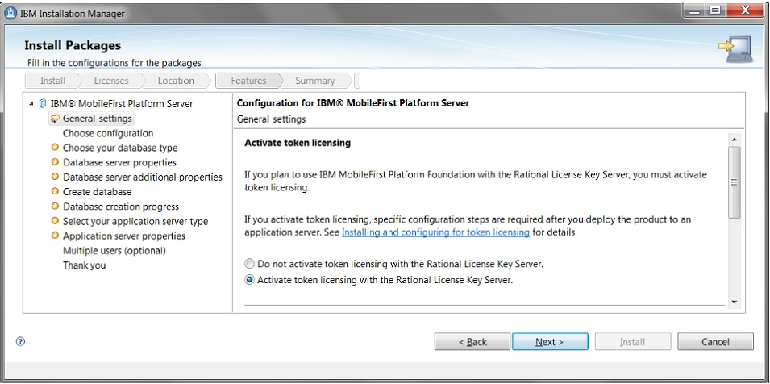

<!-- NLS_CHARSET=UTF-8 -->
## 概説
{: #overview }
{{ site.data.keys.mf_server }} に対してトークン・ライセンスを使用することを計画している場合、Rational Common Licensing ライブラリーをインストールし、{{ site.data.keys.mf_server }} を Rational License Key Server に接続するようにアプリケーション・サーバーを構成する必要があります。

以下のトピックでは、トークン・ライセンスのための、インストール概要、Rational Common Licensing ライブラリーの手動インストール、アプリケーション・サーバーの構成、およびプラットフォームの制限について説明します。

#### ジャンプ先
{: #jump-to }

* [トークン・ライセンスの使用計画](#planning-for-the-use-of-token-licensing)
* [トークン・ライセンスのためのインストールの概要](#installation-overview-for-token-licensing)
* [Apache Tomcat にインストールされた {{ site.data.keys.mf_server }} と Rational License Key Server の接続](#connecting-mobilefirst-server-installed-on-apache-tomcat-to-the-rational-license-key-server)
* [WebSphere Application Server Liberty プロファイルにインストールされた {{ site.data.keys.mf_server }} と Rational License Key Server の接続](#connecting-mobilefirst-server-installed-on-websphere-application-server-liberty-profile-to-the-rational-license-key-server)
* [WebSphere Application Server にインストールされた {{ site.data.keys.mf_server }} と Rational License Key Server の接続](#connecting-mobilefirst-server-installed-on-websphere-application-server-to-the-rational-license-key-server)
* [トークン・ライセンス用にサポートされるプラットフォームの制限](#limitations-of-supported-platforms-for-token-licensing)
* [トークン・ライセンスの問題のトラブルシューティング](#troubleshooting-token-licensing-problems)

## トークン・ライセンスの使用計画
{: #planning-for-the-use-of-token-licensing }
{{ site.data.keys.mf_server }} 用にトークン・ライセンスが購入される場合、インストール計画で考慮するべきステップが増えます。

### 技術的な制限
{: #technical-restrictions }
トークン・ライセンスの使用に関する技術的な制限は次のとおりです。

#### サポートされるプラットフォーム:
{: #supported-platforms }
トークン・ライセンスをサポートするプラットフォームのリストは、[トークン・ライセンス用にサポートされるプラットフォームの制限](#limitations-of-supported-platforms-for-token-licensing)に記載されています。リストに含まれていないプラットフォームで稼働する {{ site.data.keys.mf_server }} はトークン・ライセンス用にインストールおよび構成できない可能性があります。Rational Common Licensing クライアント用のネイティブ・ライブラリーがそのプラットフォームでは使用可能でないか、サポートされない場合があります。

#### サポートされるトポロジー:
{: #supported-topologies }
トークン・ライセンスでサポートされるトポロジーは、[{{ site.data.keys.mf_server }} 管理サービス、{{ site.data.keys.mf_server }} ライブ更新サービス、および {{ site.data.keys.product_adj }} ランタイムでの制約](../topologies/#constraints-on-mobilefirst-server-administration-service-mobilefirst-server-live-update-service-and-mobilefirst-foundation-runtime)にリストされています。

### ネットワーク要件
{: #network-requirement }
{{ site.data.keys.mf_server }} は、Rational License Key Server と通信できなければなりません。

この通信には、ライセンス・サーバーの以下の 2 つのポートへのアクセスが必要です。

* ライセンス・マネージャー・デーモン (**lmgrd**) ポート - デフォルトのポート番号は 27000 です。
* ベンダー・デーモン (**ibmratl**) ポート
 
これらのポートを構成して静的な値が使用されるようにするには、How to serve a license key to client machines through a firewall を参照してください。

### インストール・プロセス
{: #installation-process }
インストール時に IBM Installation Manager を実行する際、トークン・ライセンスをアクティブにする必要があります。トークン・ライセンスの有効化の手順について詳しくは、[トークン・ライセンスのためのインストールの概要](#installation-overview-for-token-licensing)を参照してください。

{{ site.data.keys.mf_server }} がインストールされた後、このサーバーを手動でトークン・ライセンス用に構成する必要があります。詳しくは、このセクションのこれ以降のトピックを参照してください。

この手動での構成が完了するまでは、{{ site.data.keys.mf_server }} は機能しません。Rational Common Licensing クライアント・ライブラリーがアプリケーション・サーバーにインストールされ、Rational License Key Server のロケーションを定義します。

### オペレーション
{: #operations }
{{ site.data.keys.mf_server }} がトークン・ライセンス用にインストールおよび構成されると、このサーバーはさまざまなシナリオにおいてライセンスを検証するようになります。オペレーション中のトークンの取り出しについて詳しくは、[トークン・ライセンス検証](../../../administering-apps/license-tracking/#token-license-validation)を参照してください。

トークン・ライセンスが有効にされている実動サーバー上で非実動アプリケーションをテストする必要がある場合、そのアプリケーションを非実動であると宣言することができます。アプリケーション・タイプの宣言について詳しくは、[アプリケーションのライセンス情報の設定](../../../administering-apps/license-tracking/#setting-the-application-license-information)を参照してください。

## トークン・ライセンスのためのインストールの概要
{: #installation-overview-for-token-licensing }
{{ site.data.keys.product }} と共にトークン・ライセンスを使用する予定の場合、以下の準備ステップをこの順序で行ってください。

> **重要:** トークン・ライセンスをサポートするインストールの一部として行ったトークン・ライセンスについての選択 (アクティブ化するかどうか) を変更することはできません。後でトークン・ライセンス・オプションの変更が必要になった場合、{{ site.data.keys.product }} をアンインストールしてから再インストールする必要があります。


1. IBM Installation Manager を実行して {{ site.data.keys.product }} をインストールする際に、トークン・ライセンスをアクティブにします。

   #### グラフィック・モードでのインストール
   製品をグラフィック・モードでインストールする場合、インストール中に**「汎用設定 (General settings)」**パネルで**「Rational License Key Server でトークン・ライセンスをアクティブにする (Activate token licensing with the Rational License Key Server)」**オプションを選択します。
    
   
    
   #### コマンド・ライン・モードでのインストール
   サイレント・モードでインストールする場合、応答ファイル内の **user.licensed.by.tokens** パラメーターに値 **true** を設定します。  
   例えば、以下を使用できます。 
    
   ```bash
   imcl install com.ibm.mobilefirst.foundation.server -repositories mfp_repository_dir/MobileFirst_Platform_Server/disk1 -properties user.appserver.selection2=none,user.database.selection2=none,user.database.preinstalled=false,user.use.ios.edition=false,user.licensed.by.tokens=true -acceptLicense
   ```
    
2. 製品のインストールが完了した後、{{ site.data.keys.mf_server }} をアプリケーション・サーバーにデプロイします。詳しくは、[アプリケーション・サーバーへの {{ site.data.keys.mf_server }} のインストール](../appserver)を参照してください。

3. トークン・ライセンス用に {{ site.data.keys.mf_server }} を構成します。手順はアプリケーション・サーバーによって異なります。 

* WebSphere Application Server Liberty プロファイルの場合、[WebSphere Application Server Liberty プロファイルにインストールされた {{ site.data.keys.mf_server }} と Rational License Key Server の接続](#connecting-mobilefirst-server-installed-on-websphere-application-server-liberty-profile-to-the-rational-license-key-server)を参照してください。
* Apache Tomcat の場合、[Apache Tomcat にインストールされた {{ site.data.keys.mf_server }} と Rational License Key Server の接続](#connecting-mobilefirst-server-installed-on-apache-tomcat-to-the-rational-license-key-server)を参照してください。
* WebSphere Application Server フル・プロファイルの場合、[WebSphere Application Server にインストールされた {{ site.data.keys.mf_server }} と Rational License Key Server の接続](#connecting-mobilefirst-server-installed-on-websphere-application-server-to-the-rational-license-key-server)を参照してください。

## Apache Tomcat にインストールされた {{ site.data.keys.mf_server }} と Rational License Key Server の接続
{: #connecting-mobilefirst-server-installed-on-apache-tomcat-to-the-rational-license-key-server }
{{ site.data.keys.mf_server }} を Rational License Key Server に接続する前に、Rational Common Licensing ネイティブ・ライブラリーおよび Java ライブラリーを Apache Tomcat アプリケーション・サーバーにインストールする必要があります。

* Rational License Key Server 8.1.4.8 以降がインストールおよび構成されている必要があります。ネットワークは、両方向通信ポート (**lmrgd** および **ibmratl**) を開くことによって {{ site.data.keys.mf_server }} との通信を許可する必要があります。詳しくは、[Rational License Key Server ポータル](https://www.ibm.com/support/entry/portal/product/rational/rational_license_key_server?productContext=-283469295)および [How to serve a license key to client machines through a firewall ](http://www.ibm.com/support/docview.wss?uid=swg21257370)を参照してください。
* {{ site.data.keys.product }} 用のライセンス・キーが生成されていることを確認してください。IBM Rational License Key Center を使用したライセンス・キーの生成および管理について詳しくは、[IBM サポート - ライセンス](http://www.ibm.com/software/rational/support/licensing/)および [IBM Rational License Key Center を使用したライセンス・キーの取得](https://www.ibm.com/support/knowledgecenter/SSSTWP_8.1.4/com.ibm.rational.license.doc/topics/t_access_license_key_center.html)を参照してください。
* [トークン・ライセンスのためのインストールの概要](#installation-overview-for-token-licensing)で説明されているように、Apache Tomcat 上で {{ site.data.keys.mf_server }} がインストールされ、「Rational License Key Server でトークン・ライセンスをアクティブにする (Activate token licensing with the Rational License Key Server)」オプションを指定して構成されている必要があります。

### Rational Common Licensing ライブラリーのインストール
{: #installing-rational-common-licensing-libraries }

1. Rational Common Licensing ネイティブ・ライブラリーを選択します。ご使用のオペレーティング・システムと、Apache Tomcat が稼働している Java ランタイム環境 (JRE) のビット・バージョンに基づいて、**product\_install\_dir/MobileFirstServer/tokenLibs/bin/your\_corresponding\_platform/the\_native\_library\_file** にある正しいネイティブ・ライブラリーを選択する必要があります。例えば、Linux x86 と 64 ビット JRE を使用している場合、ライブラリーは **product\_install\_dir/MobileFirstServer/tokensLibs/bin/Linux\_x86\_64/librcl\_ibmratl.so** にあります。
2. ネイティブ・ライブラリーを、{{ site.data.keys.mf_server }} 管理サービスを実行するコンピューターにコピーします。ディレクトリーは **${CATALINA_HOME}/bin** とすることができます。 
    > **注:** **${CATALINA_HOME}** は、Apache Tomcat のインストール・ディレクトリーです。
3. **rcl_ibmratl.jar** ファイルを **${CATALINA_HOME}/lib** にコピーします。**rcl_ibmratl.jar** ファイルは、Rational Common Licensing Java ライブラリーであり、**product\_install\_dir/MobileFirstServer/tokenLibs** ディレクトリーにあります。このライブラリーは、ステップ 2 でコピーしたネイティブ・ライブラリーを使用し、Apache Tomcat によって一度だけロードすることができます。このファイルは **${CATALINA_HOME}/lib** ディレクトリーか、または、Apache Tomcat 共通クラス・ローダーのパス中の任意のディレクトリーに置かれる必要があります。
    > **重要:** Apache Tomcat の Java 仮想マシン (JVM) には、コピーされたネイティブ・ライブラリーおよび Java ライブラリーに対する読み取り特権および実行特権が必要です。両方のコピーされたファイルは、少なくともオペレーティング・システムでのアプリケーション・サーバー・プロセスのために、読み取り可能かつ実行可能である必要もあります。
4. アプリケーション・サーバーの JVM による Rational Common Licensing ライブラリーへのアクセスを構成します。どのオペレーティング・システムの場合でも、以下の行を追加することによって **${CATALINA_HOME}/bin/setenv.bat** ファイル (または、UNIX では **setenv.sh** ファイル) を構成します。

   **Windows:**  
    
   ```bash
   set CATALINA_OPTS=%CATALINA_OPTS% -Djava.library.path=absolute_path_to_the_previous_bin_directory
   ```
    
   **UNIX:**

   ```bash
   CATALINA_OPTS="$CATALINA_OPTS -Djava.library.path=absolute_path_to_the_previous_bin_directory"
   ```
    
   > **注:** 管理サービスが実行されているサーバーの構成フォルダーを移動する場合、**java.library.path** を更新して新しい絶対パスにする必要があります。 

5. Rational License Key Server にアクセスするために {{ site.data.keys.mf_server }} を構成します。**${CATALINA_HOME}/conf/server.xml** ファイル内で、管理サービス・アプリケーションの `Context` エレメントを探し、以下の JNDI 構成行に追加します。

   ```xml
   <Environment name="mfp.admin.license.key.server.host" value="rlks_hostname" type="java.lang.String" override="false"/>
   <Environment name="mfp.admin.license.key.server.port" value="rlks_port" type="java.lang.String" override="false"/>
   ```
   * **rlks_hostname** は、Rational License Key Server のホスト名です。
   * **rlks_port** は、Rational License Key Server のポートです。デフォルトで、この値は **27000** です。

これらの JNDI プロパティーについて詳しくは、[管理サービスの JNDI プロパティー: ライセンス交付](../server-configuration/#jndi-properties-for-administration-service-licensing)を参照してください。

### Apache Tomcat サーバー・ファームでのインストール
{: #installing-on-apache-tomcat-server-farm }
Apache Tomcat サーバー・ファームで {{ site.data.keys.mf_server }} の接続を構成するためには、{{ site.data.keys.mf_server }} 管理サービスが実行されているサーバー・ファームの各ノードについて、『[Rational Common Licensing ライブラリーのインストール](#installing-rational-common-licensing-libraries)』で説明されているすべてのステップを実行する必要があります。サーバー・ファームについて詳しくは、[サーバー・ファームのトポロジー](../topologies/#server-farm-topology)および [サーバー・ファームのインストール](../appserver/#installing-a-server-farm)を参照してください。

## WebSphere Application Server Liberty プロファイルにインストールされた {{ site.data.keys.mf_server }} と Rational License Key Server の接続
{: #connecting-mobilefirst-server-installed-on-websphere-application-server-liberty-profile-to-the-rational-license-key-server }
{{ site.data.keys.mf_server }} を Rational License Key Server に接続する前に、Rational Common Licensing ネイティブ・ライブラリーおよび Java ライブラリーを Liberty プロファイルにインストールする必要があります。

* Rational License Key Server 8.1.4.8 以降がインストールおよび構成されている必要があります。ネットワークは、両方向通信ポート (**lmrgd** および **ibmratl**) を開くことによって {{ site.data.keys.mf_server }} との通信を許可する必要があります。詳しくは、[Rational License Key Server ポータル](https://www.ibm.com/support/entry/portal/product/rational/rational_license_key_server?productContext=-283469295)および [How to serve a license key to client machines through a firewall ](http://www.ibm.com/support/docview.wss?uid=swg21257370)を参照してください。
* {{ site.data.keys.product }} 用のライセンス・キーが生成されていることを確認してください。IBM Rational License Key Center を使用したライセンス・キーの生成および管理について詳しくは、[IBM サポート - ライセンス](http://www.ibm.com/software/rational/support/licensing/)および [IBM Rational License Key Center を使用したライセンス・キーの取得](https://www.ibm.com/support/knowledgecenter/SSSTWP_8.1.4/com.ibm.rational.license.doc/topics/t_access_license_key_center.html)を参照してください。
* [トークン・ライセンスのためのインストールの概要](#installation-overview-for-token-licensing)で説明されているように、Apache Tomcat 上で {{ site.data.keys.mf_server }} がインストールされ、「Rational License Key Server でトークン・ライセンスをアクティブにする (Activate token licensing with the Rational License Key Server)」オプションを指定して構成されている必要があります。

### Rational Common Licensing ライブラリーのインストール
{: #common-licensing-libraries-liberty }

1. Rational Common Licensing クライアント用の共有ライブラリーを定義します。このライブラリーはネイティブ・コードを使用し、アプリケーション・サーバーによって一度だけロードできます。 したがって、これを使用するアプリケーションはこれを共通ライブラリーとして参照する必要があります。
   * Rational Common Licensing ネイティブ・ライブラリーを選択します。ご使用のオペレーティング・システムと、Liberty プロファイルが稼働している Java ランタイム環境 (JRE) のビット・バージョンに基づいて、**product_install_dir/MobileFirstServer/tokenLibs/bin/your_corresponding_platform/the_native_library_file** にある正しいネイティブ・ライブラリーを選択する必要があります。例えば、Linux x86 と 64 ビット JRE を使用している場合、ライブラリーは **product_install_dir/MobileFirstServer/tokensLibs/bin/Linux_x86_64/librcl_ibmratl.so** にあります。
   * ネイティブ・ライブラリーを、{{ site.data.keys.mf_server }} 管理サービスを実行するコンピューターにコピーします。ディレクトリーは **${shared.resource.dir}/rcllib** とすることができます。**${shared.resource.dir}** ディレクトリーは通常は **usr/shared/resources** 内にあります。ここで、usr は、usr/servers ディレクトリーも含んでいるディレクトリーです。**${shared.resource.dir}** の標準的なロケーションについて詳しくは、[WebSphere Application Server Liberty Core - Directory locations and properties ](http://www.ibm.com/support/knowledgecenter/SSD28V_8.5.5/com.ibm.websphere.wlp.core.doc/ae/rwlp_dirs.html?lang=en&view=kc)を参照してください。**rcllib** フォルダーが存在しない場合は、このフォルダーを作成し、その後でネイティブ・ライブラリー・ファイルをそこにコピーしてください。 
    
   > **注:** アプリケーション・サーバーの Java 仮想マシン (JVM) に、ネイティブ・ライブラリーに対する読み取り特権と実行特権の両方があることを確認してください。Windows では、アプリケーション・サーバーの JVM に、コピーされたネイティブ・ライブラリーに対する実行可能権限がない場合、以下の例外がアプリケーション・サーバー・ログに記録されます。
    
   ```bash
   com.ibm.rcl.ibmratl.LicenseConfigurationException: java.lang.UnsatisfiedLinkError: rcl_ibmratl (Access is denied).
   ```
   * **rcl_ibmratl.jar** ファイルを **${shared.resource.dir}/rcllib** にコピーします。**rcl_ibmratl.jar** ファイルは、Rational Common Licensing Java ライブラリーであり、**product_install_dir/MobileFirstServer/tokenLibs** ディレクトリーにあります。

   > **注:** Liberty プロファイルの Java 仮想マシン (JVM) は、コピーされた Java ライブラリーを読み取ることが可能でなければなりません。このファイルは、オペレーティング・システムにおいて (少なくともアプリケーション・サーバー・プロセスのために) 読み取り可能な特権を持っている必要もあります。    
   * **rcl_ibmratl.jar** ファイルを使用する共有ライブラリーを **${server.config.dir}/server.xml** ファイル内で宣言します。

   ```xml
   <!-- Declare a shared Library for the RCL client. -->
   <!- This library can be loaded only once because it uses native code. -->
   <library id="RCLLibrary">
       <fileset dir="${shared.resource.dir}/rcllib" includes="rcl_ibmratl.jar"/>
   </library>
   ```    
   * この共有ライブラリーを {{ site.data.keys.mf_server }} 管理サービス・アプリケーション用の共通ライブラリーとして宣言するため、このアプリケーションのクラス・ローダーに属性 (**commonLibraryRef**) を追加します。このライブラリーは一度しかロードできないため、専用ライブラリーではなく共通ライブラリーとして使用する必要があります。

   ```xml
   <application id="mfpadmin" name="mfpadmin" location="mfp-admin-service.war" type="war">
      [...]
      <!- Declare the shared library as an attribute commonLibraryRef to 
          the class loader of the application. -->
      <classloader delegation="parentLast" commonLibraryRef="RCLLibrary">
      </classloader>
   </application>
   ```
   * データベースとして Oracle を使用する場合、**server.xml** には既に次のクラス・ローダーがあります。

   ```xml
   <classloader delegation="parentLast" commonLibraryRef="MobileFirst/JDBC/oracle">
    </classloader>
   ```
    
   以下のように、Rational Common Licensing ライブラリーを共通ライブラリーとして Oracle ライブラリーに付加する必要もあります。
    
   ```xml
   <classloader delegation="parentLast"
         commonLibraryRef="MobileFirst/JDBC/oracle,RCLLibrary">
   </classloader>
   ```
   * アプリケーション・サーバーの JVM による Rational Common Licensing ライブラリーへのアクセスを構成します。どのオペレーティング・システムの場合でも、以下の行を追加することによって **${wlp.user.dir}/servers/server_name/jvm.options** ファイルを構成します。

   ```xml
   -Djava.library.path=Absolute_path_to_the_previously_created_rcllib_folder
   ```
    
   > **注:** 管理サービスが実行されているサーバーの構成フォルダーを移動する場合、**java.library.path** を更新して新しい絶対パスにする必要があります。 

   **${wlp.user.dir}** ディレクトリーは通常は **liberty_install_dir/usr** 内にあり、servers ディレクトリーを含みます。ただし、ロケーションはカスタマイズすることができます。詳しくは、[Liberty プロファイル環境のカスタマイズ](http://www.ibm.com/support/knowledgecenter/SSD28V_8.5.5/com.ibm.websphere.wlp.core.doc/ae/twlp_admin_customvars.html?lang=en&view=kc)を参照してください。
    
2. Rational License Key Server にアクセスするために {{ site.data.keys.mf_server }} を構成します。

   **${wlp.user.dir}/servers/server_name/server.xml** ファイルに以下の JNDI 構成行を追加します。
    
   ```xml
   <jndiEntry jndiName="mfp.admin.license.key.server.host" value="rlks_hostname"/> 
   <jndiEntry jndiName="mfp.admin.license.key.server.port" value="rlks_port"/> 
   ```
   * **rlks_hostname** は、Rational License Key Server のホスト名です。
   * **rlks_port** は、Rational License Key Server のポートです。デフォルトでは、この値は 27000 です。

   これらの JNDI プロパティーについて詳しくは、[管理サービスの JNDI プロパティー: ライセンス交付](../server-configuration/#jndi-properties-for-administration-service-licensing)を参照してください。

### Liberty プロファイル・サーバー・ファームでのインストール
{: #installing-on-liberty-profile-server-farm }
Liberty プロファイル・サーバー・ファームで {{ site.data.keys.mf_server }} の接続を構成するためには、{{ site.data.keys.mf_server }} 管理サービスが実行されているサーバー・ファームの各ノードについて、『[Rational Common Licensing ライブラリーのインストール](#installing-rational-common-licensing-libraries)』で説明されているすべてのステップを実行する必要があります。サーバー・ファームについて詳しくは、[サーバー・ファームのトポロジー](../topologies/#server-farm-topology)および [サーバー・ファームのインストール](../appserver/#installing-a-server-farm)を参照してください。

## WebSphere Application Server にインストールされた {{ site.data.keys.mf_server }} と Rational License Key Server の接続
{: #connecting-mobilefirst-server-installed-on-websphere-application-server-to-the-rational-license-key-server }
{{ site.data.keys.mf_server }} を Rational License Key Server に接続する前に、WebSphere Application Server 上で Rational Common Licensing ライブラリー用の共有ライブラリーを構成する必要があります。

* Rational License Key Server 8.1.4.8 以降がインストールおよび構成されている必要があります。ネットワークは、両方向通信ポート (**lmrgd** および **ibmratl**) を開くことによって {{ site.data.keys.mf_server }} との通信を許可する必要があります。詳しくは、[Rational License Key Server ポータル](https://www.ibm.com/support/entry/portal/product/rational/rational_license_key_server?productContext=-283469295)および [How to serve a license key to client machines through a firewall ](http://www.ibm.com/support/docview.wss?uid=swg21257370)を参照してください。
* {{ site.data.keys.product }} 用のライセンス・キーが生成されていることを確認してください。IBM Rational License Key Center を使用したライセンス・キーの生成および管理について詳しくは、[IBM サポート - ライセンス](http://www.ibm.com/software/rational/support/licensing/)および [IBM Rational License Key Center を使用したライセンス・キーの取得](https://www.ibm.com/support/knowledgecenter/SSSTWP_8.1.4/com.ibm.rational.license.doc/topics/t_access_license_key_center.html)を参照してください。
* [トークン・ライセンスのためのインストールの概要](#installation-overview-for-token-licensing)で説明されているように、Apache Tomcat 上で {{ site.data.keys.mf_server }} がインストールされ、「Rational License Key Server でトークン・ライセンスをアクティブにする (Activate token licensing with the Rational License Key Server)」オプションを指定して構成されている必要があります。

### スタンドアロン・サーバーへの Rational Common Licensing ライブラリーのインストール
{: #installing-rational-common-licensing-library-on-a-stand-alone-server }

1. Rational Common Licensing ライブラリー用の共有ライブラリーを定義します。このライブラリーはネイティブ・コードを使用し、アプリケーション・サーバーのライフサイクル中に一度だけクラス・ローダーによってロードできます。この理由のため、このライブラリーは共有ライブラリーとして宣言され、{{ site.data.keys.mf_server }} 管理サービスを実行するすべてのアプリケーション・サーバーに関連付けられます。このライブラリーを共有ライブラリーとして宣言する理由について詳しくは、[共有ライブラリーでのネイティブ・ライブラリーの構成](http://www.ibm.com/support/knowledgecenter/SSEQTP_8.5.5/com.ibm.websphere.base.doc/ae/tcws_sharedlib_nativelib.html?view=kc)を参照してください。
    * Rational Common Licensing ネイティブ・ライブラリーを選択します。ご使用のオペレーティング・システムと、WebSphere Application Server が稼働している Java ランタイム環境 (JRE) のビット・バージョンに基づいて、**product_install_dir/MobileFirstServer/tokenLibs/bin/your_corresponding_platform/the_native_library_file** にある正しいネイティブ・ライブラリーを選択する必要があります。
    
        例えば、Linux x86 と 64 ビット JRE を使用している場合、ライブラリーは **product_install_dir/MobileFirstServer/tokensLibs/bin/Linux_x86_64/librcl_ibmratl.so** にあります。
    
        スタンドアロン WebSphere Application Server または WebSphere Application Server Network Deployment インストール済み環境の Java ランタイム環境のビット・バージョンを判別するには、**versionInfo.bat** (Windows の場合) または **versionInfo.sh** (UNIX の場合) を **bin** ディレクトリーから実行します。**versionInfo.sh** ファイルは **/opt/IBM/WebSphere/AppServer/bin** にあります。**「インストール済み製品」** セクションの「アーキテクチャー」の値を確認してください。「アーキテクチャー」値で明示的に示されているか、64 または _64 という接尾部が付いている場合、Java ランタイム環境 は 64 ビットです。
    * ご使用のプラットフォームに対応するネイティブ・ライブラリーをオペレーティング・システムのフォルダーに入れます。例えば、**/opt/IBM/RCL_Native_Library/** などです。
    * **rcl_ibmratl.jar** ファイルを **/opt/IBM/RCL_Native_Library/** にコピーします。**rcl_ibmratl.jar** ファイルは、Rational Common Licensing Java ライブラリーであり、**product_install_dir/MobileFirstServer/tokenLibs ディレクトリー**にあります。
    
        > **重要:**アプリケーション・サーバーの Java 仮想マシン (JVM) には、コピーされたネイティブ・ライブラリーおよび Java ライブラリーに対する読み取り特権および実行特権が必要です。両方のコピーされたファイルは、少なくともオペレーティング・システムでのアプリケーション・サーバー・プロセスのために、読み取り可能かつ実行可能である必要もあります。    
    * WebSphere Application Server 管理コンソールで共有ライブラリーを宣言します。
        * WebSphere Application Server 管理コンソールにログインします。
        * **「環境」→「共有ライブラリー」**と展開します。
        * {{ site.data.keys.mf_server }} 管理サービスを実行するすべてのサーバーで可視の有効範囲を選択します。例えば、クラスターです。
        * **「新規 (New)」**をクリックします。
        * 「名前」フィールドにライブラリーの名前を入力します。例えば、「RCL Shared Library」などです。
        * 「クラスパス」フィールドに、**rcl_ibmratl.jar** ファイルのパスを入力します。例えば、**/opt/IBM/RCL_Native_Library/rcl_ibmratl.jar** などです。
        * **「OK」**をクリックし、変更を保存します。この設定は、サーバーが再始動されると有効になります。
    
        > **注:** このライブラリーのネイティブ・ライブラリー・パスは、ステップ 3 で、サーバーの Java 仮想マシンの **ld.library.path** プロパティーに設定されます。

    * 共有ライブラリーを、{{ site.data.keys.mf_server }} 管理サービスを実行するすべてのサーバーと関連付けます。
    
        共有ライブラリーをサーバーに関連付けることによって、共有ライブラリーが複数のアプリケーションで使用できるようになります。{{ site.data.keys.mf_server }} 管理サービス用にのみ Rational Common Licensing クライアントが必要な場合、隔離されたクラス・ローダーを使用して共有ライブラリーを作成し、それを管理サービス・アプリケーションと関連付けることができます。

        以下の手順は、ライブラリーを 1 つのサーバーと関連付ける手順です。WebSphere Application Server Network Deployment の場合、 {{ site.data.keys.mf_server }} 管理サービスを実行するすべてのサーバーについてこの手順を実行する必要があります。    
        * クラス・ローダーのポリシーとモードを設定します。    
            1. WebSphere Application Server 管理コンソールで、 **「サーバー」→「サーバー・タイプ」→「WebSphere Application Server」→「server_name」**をクリックして、アプリケーション・サーバー設定ページにアクセスします。
            2. サーバーのアプリケーション・クラス・ローダー・ポリシーおよびクラス・ローダー・モードの値を設定します。
                * **「クラス・ローダー・ポリシー」**: Multiple
                * **「クラス・ロード・モード」**: 最初に親クラス・ローダーをロードしたクラス
            3. **「サーバー・インフラストラクチャー」**セクションで、**「Java およびプロセス管理」→「クラス・ローダー」**をクリックします。
            4. **「新規」**をクリックし、クラス・ローダー順序が**最初に親クラス・ローダーをロードしたクラス**に設定されていることを確認します。
            5. **「適用」**をクリックして新規クラス・ローダー ID を作成します。                
        * アプリケーションが必要とする各共有ライブラリー・ファイルのライブラリー参照を作成します。
            1. 前のステップで作成されたクラス・ローダーの名前をクリックします。
            2. **「追加プロパティー」**セクションで、**「共有ライブラリー参照」**をクリックします。
            3. **「追加 (Add)」**をクリックします。
            4. 「ライブラリー参照設定」ページで、適切なライブラリー参照を選択します。アプリケーションが使用する共有ライブラリー・ファイルは名前で表されています。例えば、RCL Shared Library などです。
            5. **「適用」**をクリックし、変更を保存します。
2. {{ site.data.keys.mf_server }} 管理サービス Web アプリケーションの環境項目を構成します。
    * WebSphere Application Server 管理コンソールで**「アプリケーション」→「アプリケーション・タイプ」→「WebSphere エンタープライズ・アプリケーション」 **とクリックし、管理サービス・アプリケーション **MobileFirst_Administration_Service** を選択します。
    * **「Web モジュール・プロパティー」**セクションで、**「Web モジュールの環境項目」**をクリックします。
    * **mfp.admin.license.key.server.host** および **mfp.admin.license.key.server.port** の値を入力します。
        * **mfp.admin.license.key.server.host** は、Rational License Key Server のホスト名です。
        * **mfp.admin.license.key.server.port** は、Rational License Key Server のポートです。デフォルトでは、この値は 27000 です。
    * **「OK」**をクリックし、変更を保存します。
3. アプリケーション・サーバー JVM による Rational Common Licensing ライブラリーへのアクセスを構成します。
    * WebSphere Application Server 管理コンソールで、**「サーバー」→「サーバー・タイプ」→「WebSphere Application Server」**をクリックし、サーバーを選択します。
    * **「サーバー・インフラストラクチャー」**セクションで、カスタム・プロパティーを追加するため、**「Java およびプロセス管理」→「プロセス定義」→「Java 仮想マシン」→「カスタム・プロパティー」→「新規」**をクリックします。
    * **「名前」**フィールドに、カスタム・プロパティーの名前を **java.library.path** と入力します。
    * **「値」**フィールドに、ステップ 1b でネイティブ・ライブラリー・ファイルを入れたフォルダーのパスを入力します。例えば、**/opt/IBM/RCL_Native_Library/** などです。
    * **「OK」**をクリックし、変更を保存します。
4. アプリケーション・サーバーを再始動します。

### WebSphere Application Server Network Deployment での Rational Common Licensing ライブラリーのインストール
{: #installing-rational-common-licensing-library-on-websphere-application-server-network-deployment }
WebSphere Application Server Network Deployment でネイティブ・ライブラリーをインストールするには、上記の[スタンドアロン・サーバーへの Rational Common Licensing ライブラリーのインストール](#installing-rational-common-licensing-library-on-a-stand-alone-server)で説明されているすべてのステップに従う必要があります。変更を有効にするには、構成するサーバーまたはクラスターの再始動が必要です。

WebSphere Application Server Network Deployment の各ノードが Rational Common Licensing ネイティブ・ライブラリーのコピーを保有する必要があります。

{{ site.data.keys.mf_server }} 管理サービスを実行する各サーバーは、ローカル・コンピューターにコピーされたネイティブ・ライブラリーにアクセスできるように構成されている必要があります。これらのサーバーは、Rational License Key Server に接続するように構成される必要もあります。

> **重要:** WebSphere Application Server Network Deployment と共にクラスターを使用する場合、クラスターは変化する可能性があります。管理サービスが実行されるサーバーがクラスターに新しく追加されたら、そのサーバーを構成する必要があります。


## トークン・ライセンス用にサポートされるプラットフォームの制限
{: #limitations-of-supported-platforms-for-token-licensing }
トークン・ライセンスが有効にされている {{ site.data.keys.mf_server }} をサポートするオペレーティング・システム、そのバージョン、およびハードウェア・アーキテクチャーのリストを示します。

トークン・ライセンスのために、{{ site.data.keys.mf_server }} は Rational Common Licensing ライブラリーを使用して Rational License Key Server に接続する必要があります。

このライブラリーは、1 つの Java ライブラリーの他に、ネイティブ・ライブラリーから構成されています。これらのネイティブ・ライブラリーは、 {{ site.data.keys.mf_server }} が稼働するプラットフォームに依存します。したがって、{{ site.data.keys.mf_server }} によるトークン・ライセンスは、Rational Common Licensing ライブラリーの実行が可能なプラットフォームでのみサポートされます。

以下の表に、トークン・ライセンスが使用される {{ site.data.keys.mf_server }} をサポートするプラットフォームを示します。

| オペレーティング・システム| オペレーティング・システムのバージョン|	ハードウェア・アーキテクチャー|
|------------------------------|--------------------------|-----------------------|
| AIX
| 7.1|	POWER8 (64 ビットのみ)|
| SUSE Linux Enterprise Server| 11	                      | x86-64 のみ|
| Windows Server| 2012	                  | x86-64 のみ|

トークン・ライセンスは 32 ビット Java ランタイム環境 (JRE) をサポートしません。アプリケーション・サーバーが 64 ビット JRE を使用していることを確認してください。

## トークン・ライセンスの問題のトラブルシューティング
{: #troubleshooting-token-licensing-problems }
{{ site.data.keys.mf_server }} のインストール時にトークン・ライセンス・フィーチャーをアクティブした場合に発生する可能性がある問題を解決するのに役立つ情報が記載されています。

トークン・ライセンスに関するインストールおよび構成を完了した後で {{ site.data.keys.mf_server }} 管理サービスを開始すると、いくつかのエラーまたは例外がアプリケーション・サーバー・ログまたは {{ site.data.keys.mf_console }} に出力されることがあります。これらの例外の原因として、Rational Common Licensing ライブラリーが正しくインストールされていないこと、およびアプリケーション・サーバーの誤った構成が考えられます。

**Apache Tomcat**  
ご使用のプラットフォームに応じて、**catalina.log** ファイルまたは catalina.out ファイルを確認してください。

**WebSphere® Application Server Liberty プロファイル**  
**messages.log** ファイルを確認してください。

**WebSphere Application Server フル・プロファイル**  
**SystemOut.log** ファイルを確認してください。

> **重要:** トークン・ライセンスが WebSphere Application Server Network Deployment またはクラスターにインストールされている場合は、各サーバーのログを確認する必要があります。


以下は、トークン・ライセンスのインストールおよび構成後に発生する可能性のある例外のリストです。

* [Rational Common Licensing のネイティブ・ライブラリーが見つからない](#rational-common-licensing-native-library-is-not-found)
* [Rational Common Licensing の共有ライブラリーが見つからない](#rational-common-licensing-shared-library-is-not-found)
* [Rational License Key Server 接続が構成されていない](#the-rational-license-key-server-connection-is-not-configured)
* [Rational License Key Server にアクセスできない](#the-rational-license-key-server-is-not-accessible)
* [Rational Common Licensing API の初期化に失敗した](#failed-to-initialize-rational-common-licensing-api)
* [不十分なトークン・ライセンス](#insufficient-token-licenses)
* [無効な rcl_ibmratl.jar ファイル](#invalid-rcl_ibmratljar-file)

### Rational Common Licensing のネイティブ・ライブラリーが見つからない
{: #rational-common-licensing-native-library-is-not-found }

> FWLSE3125E: Rational Common Licensing ネイティブ・ライブラリーが見つかりません。JVM プロパティー (java.library.path) が正しいパスで定義され、ネイティブ・ライブラリーが実行可能であることを確認してください。修正アクションを実行した後、{{ site.data.keys.mf_server }} を再始動してください。


#### WebSphere Application Server フル・プロファイルの場合
{: #for-websphere-application-server-full-profile }
このエラーの考えられる原因は次のとおりです。

* **java.library.path** という名前の共通プロパティーがサーバー・レベルで定義されていない。
* **java.library.path** プロパティーの値として指定されたパスが、Rational Common Licensing ネイティブ・ライブラリーを含んでいない。
* ネイティブ・ライブラリーが適切なアクセス権を持っていない。ライブラリーは、Java™ ランタイムを使用してアクセスするユーザーのために、UNIX および Windows 上で読み取り権限と実行権限を持っている必要があります。
* アプリケーション・サーバーの環境。

#### WebSphere Application Server Liberty プロファイルおよび Apache Tomcat の場合
{: #for-websphere-application-server-liberty-profile-and-apache-tomcat }
このエラーの考えられる原因は次のとおりです。

* java.library.path プロパティーの値として指定された Rational Common Licensing ネイティブ・ライブラリーへのパスが、設定されていないか、誤っている。
    * Liberty プロファイルの場合、**${wlp.user.dir}/servers/server_name/jvm.options** ファイルを確認してください。
    * Apache Tomcat の場合、ご使用のプラットフォームに応じて **${CATALINA_HOME}/bin/setenv.bat** ファイルまたは setenv.sh ファイルを確認してください。
* ネイティブ・ライブラリーが、**java.library.path** プロパティーに定義されているパスで見つからない。定義されたパスに、ネイティブ・ライブラリーが、予期された名前で存在していることを確認してください。
* ネイティブ・ライブラリーが適切なアクセス権を持っていない。このエラーの前に次の例外が発生している可能性があります: `com.ibm.rcl.ibmratl.LicenseConfigurationException: java.lang.UnsatisfiedLinkError: {0}rcl_ibmratl.dll: Access is denied`

アプリケーション・サーバーの Java ランタイム環境は、このネイティブ・ライブラリーの読み取り権限と実行権限を必要とします。また、ライブラリー・ファイルは、少なくともオペレーティング・システム内のアプリケーション・サーバー・プロセスで読み取り可能であり、実行可能である必要があります。

* **rcl_ibmratl.jar** ファイルを使用する共有ライブラリーが、Liberty プロファイルの **${server.config.dir}/server.xml** ファイルに定義されていない。また、**rcl_ibmratl.jar** が正しいディレクトリーに含まれていないか、ディレクトリーが適切なアクセス権を持っていない可能性もあります。
* **rcl_ibmratl.jar** ファイルを使用した共有ライブラリーが、Liberty プロファイルの **${server.config.dir}/server.xml** ファイル内で、{{ site.data.keys.mf_server }} 管理サービス・アプリケーションの共通ライブラリーとして宣言されていない。
* アプリケーション・サーバーの Java ランタイム環境とネイティブ・ライブラリーの間で 32 ビットのオブジェクトと 64 ビットのオブジェクトが混用されている。例えば、32 ビットの Java ランタイム環境が 64 ビットのネイティブ・ライブラリーと共に使用されています。この混用はサポートされていません。

### Rational Common Licensing の共有ライブラリーが見つからない
{: #rational-common-licensing-shared-library-is-not-found }

> FWLSE3126E: Rational Common Licensing 共有ライブラリーが見つかりません。共有ライブラリーが構成されていることを確認してください。修正アクションを実行した後、{{ site.data.keys.mf_server }} を再始動してください。


このエラーの考えられる原因は次のとおりです。

* **rcl_ibmratl.jar** ファイルが、予期されたディレクトリーにない。
    * Apache Tomcat の場合、このファイルが **${CATALINA_HOME}/lib** ディレクトリーにあることを確認します。
    * WebSphere Application Server Liberty プロファイルの場合、このファイルが、server.xml ファイルに定義されている、Rational Common Licensing クライアントの共有ライブラリー用のディレクトリーに含まれていることを確認します。例えば、**${shared.resource.dir}/rcllib** などです。**server.xml** ファイルで、この共有ライブラリーが、{{ site.data.keys.mf_server }} 管理サービス・アプリケーション用の共通ライブラリーとして正しく参照されていることを確認します。
    * WebSphere Application Server の場合、このファイルが、WebSphere Application Server 共有ライブラリーのクラスパスに指定されたディレクトリー内にあることを確認します。共有ライブラリーのクラス・パスに次の項目が含まれていることを確認します: **absolute\_path/rcl\_ibmratl.jar**。ここで、absolute_path は **rcl_ibmratl.jar** ファイルの絶対パスです。

アプリケーション・サーバーの **java.library.path** プロパティーが設定されていない。**java.library.path** という名前のプロパティーを定義し、Rational Common Licensing のネイティブ・ライブラリーへのパスを値として設定します。例えば、**/opt/IBM/RCL\_Native\_Library/** などです。
* ネイティブ・ライブラリーが、予期されるアクセス権を持っていない。Windows では、アプリケーション・サーバーの Java ランタイム環境は、ネイティブ・ライブラリーに対する読み取り権限と実行権限を持っている必要があります。
* アプリケーション・サーバーの Java ランタイム環境とネイティブ・ライブラリーの間で 32 ビットのオブジェクトと 64 ビットのオブジェクトが混用されている。例えば、32 ビットの Java ランタイム環境が 64 ビットのネイティブ・ライブラリーと共に使用されています。この混用はサポートされていません。

### Rational License Key Server 接続が構成されていない
{: #the-rational-license-key-server-connection-is-not-configured }

> FWLSE3127E: Rational License Key Server 接続が構成されていません。管理 JNDI プロパティー「mfp.admin.license.key.server.host」および「mfp.admin.license.key.server.port」が設定されていることを確認してください。修正アクションを実行した後、{{ site.data.keys.mf_server }} を再始動してください。


このエラーの考えられる原因は次のとおりです。

* Rational Common Licensing のネイティブ・ライブラリーと、**rcl_ibmratl.jar** ファイルを使用する共有ライブラリーは正しく構成されているが、JNDI プロパティー (**mfp.admin.license.key.server.host** および **mfp.admin.license.key.server.port**) の値が {{ site.data.keys.mf_server }} 管理サービス・アプリケーションに設定されていない。
* Rational License Key Server が停止している。
* Rational License Key Server がインストールされているホスト・コンピューターに到達できない。指定されたポートと IP アドレスまたはホスト名をチェックしてください。

### Rational License Key Server にアクセスできない
{: #the-rational-license-key-server-is-not-accessible }

> FWLSE3128E: Rational License Key Server "{port}@{IP address or hostname}" にアクセスできません。ライセンス・サーバーが稼働していて、{{ site.data.keys.mf_server }} にアクセス可能であることを確認してください。 このエラーがランタイム始動時に発生する場合は、修正アクションの後、{{ site.data.keys.mf_server }}  を再始動してください。


このエラーの考えられる原因は次のとおりです。

* Rational Common Licensing の共有ライブラリーとネイティブ・ライブラリーは正しく定義されているが、Rational License Key Server に接続するための有効な構成がない。ライセンス・サーバーの IP アドレス、ホスト名、およびポートを確認してください。ライセンス・サーバーが始動されており、アプリケーション・サーバーがインストールされているコンピューターからアクセス可能であることを確認してください。
* ネイティブ・ライブラリーが、**java.library.path** プロパティーに定義されているパスで見つからない。
* ネイティブ・ライブラリーが適切なアクセス権を持っていない。
* ネイティブ・ライブラリーが、定義されたディレクトリー内にない。
* Rational License Key Server がファイアウォールの背後にある。このエラーの前に、次の例外が発生している可能性があります: [ERROR] Failed to get license for application 'WorklightStarter' because Rational Licence Key Server ({port}@{IP address or hostname}) is either down or not accessible com.ibm.rcl.ibmratl.LicenseServerUnreachableException. All license files searched for features: {port}@{IP address or hostname}

ファイアウォール内でライセンス・マネージャー・デーモン (lmgrd) のポートとベンダー・デーモン (ibmratl) のポートがオープンしていることを確認してください。詳細情報については、How to serve a license key to client machines through a firewall を参照してください。

### Rational Common Licensing API の初期化に失敗した
{: #failed-to-initialize-rational-common-licensing-api }

> Failed to initialize Rational Common Licensing (RCL) API because its native library could not be found or loaded com.ibm.rcl.ibmratl.LicenseConfigurationException: java.lang.UnsatisfiedLinkError: rcl_ibmratl (Not found in java.library.path)


このエラーの考えられる原因は次のとおりです。

* 　Rational Common Licensing のネイティブ・ライブラリーが、**java.library.path** プロパティーに定義されたパスで見つからない。定義されたパスに、ネイティブ・ライブラリーが、予期された名前で存在していることを確認してください。
* アプリケーション・サーバーの **java.library.path** プロパティーが設定されていない。**java.library.path** という名前のプロパティーを定義し、Rational Common Licensing のネイティブ・ライブラリーへのパスを値として設定します。例えば、**/opt/IBM/RCL_Native_Library/** などです。
* アプリケーション・サーバーの Java ランタイム環境とネイティブ・ライブラリーの間で 32 ビットのオブジェクトと 64 ビットのオブジェクトが混用されている。例えば、32 ビットの Java ランタイム環境が 64 ビットのネイティブ・ライブラリーと共に使用されています。この混用はサポートされていません。

### 不十分なトークン・ライセンス
{: #insufficient-token-licenses }

> FWLSE3129E: フィーチャー「{0}」のトークン・ライセンスが不十分です。

このエラーは、Rational License Key Server 上の残りのトークン・ライセンスの数が、新規 {{ site.data.keys.product_adj }} アプリケーションをデプロイするのに十分でない場合に発生します。

### 無効な rcl_ibmratl.jar ファイル
{: #invalid-rcl_ibmratljar-file }

> UTLS0002E: 共有ライブラリー RCL 共有ライブラリーに、有効な JAR ファイルに解決されないクラスパス項目が含まれています。このライブラリー JAR ファイルがあると思われる場所は {0}/rcl_ibmratl.jar です。


**注:** WebSphere Application Server および WebSphere Application Server Network Deployment の場合のみ

このエラーの考えられる原因は次のとおりです。

* **rcl_ibmratl.jar** Java ライブラリーが、適切なアクセス権を持っていない。このエラーの後に次の例外が発生する可能性があります: java.util.zip.ZipException: error in opening zip file。**rcl_ibmratl.jar** ファイルが、WebSphere Application Server をインストールするユーザーのために、読み取り権限を持っていることを確認します。
* 他に例外がない場合、共有ライブラリーのクラスパスで参照された **rcl_ibmratl.jar** ファイルが無効か、存在していない可能性がある。**rcl_ibmratl.jar** ファイルが有効であり、定義されたパスに存在していることを確認してください。


