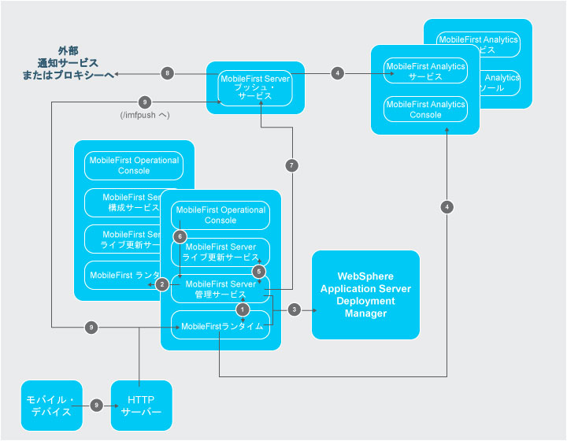
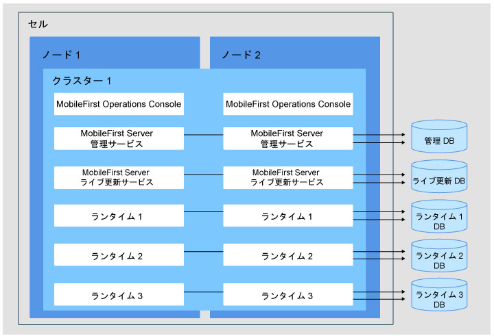

<!-- NLS_CHARSET=UTF-8 -->
## 概説
{: #overview }
ここでは、{{ site.data.keys.mf_server }} コンポーネントの可能なサーバー・トポロジーと、使用可能なネットワーク・フローについて詳しく説明します。  
コンポーネントは、使用するサーバー・トポロジーに応じてデプロイされます。ネットワーク・フローでは、コンポーネントが相互に通信する方法およびエンド・ユーザー・デバイスと通信する方法について説明します。

#### ジャンプ先
{: #jump-to }

* [{{ site.data.keys.mf_server }} コンポーネント間のネットワーク・フロー](#network-flows-between-the-mobilefirst-server-components)
* [{{ site.data.keys.mf_server }} コンポーネントおよび {{ site.data.keys.mf_analytics }} に対する制約](#constraints-on-the-mobilefirst-server-components-and-mobilefirst-analytics)
* [複数の {{ site.data.keys.product }} ランタイム](#multiple-mobilefirst-foundation-runtimes)
* [同じサーバーまたは WebSphere Application Server セルにおける {{ site.data.keys.mf_server }} の複数インスタンス](#multiple-instances-of-mobilefirst-server-on-the-same-server-or-websphere-application-server-cell)

## {{ site.data.keys.mf_server }} コンポーネント間のネットワーク・フロー
{: #network-flows-between-the-mobilefirst-server-components }
{{ site.data.keys.mf_server }} コンポーネントは、JMX または HTTP を介して相互に通信できます。通信を使用可能にするには、特定の JNDI プロパティーを構成する必要があります。  
コンポーネントとデバイスの間のネットワーク・フローは、以下のイメージで示すことができます。

各種 {{ site.data.keys.mf_server }} コンポーネント、{{ site.data.keys.mf_analytics }}、モバイル・デバイス、およびアプリケーション・サーバーの間のフローについては、以下のセクションで説明します。

1. [{{ site.data.keys.product }} ランタイムから {{ site.data.keys.mf_server }} 管理サービスへ](#mobilefirst-foundation-runtime-to-mobilefirst-server-administration-service)
2. [{{ site.data.keys.mf_server }} 管理サービスから他のサーバーの {{ site.data.keys.product }} ランタイムへ](#mobilefirst-server-administration-service-to-mobilefirst-foundation-runtime-in-other-servers)
3. [{{ site.data.keys.mf_server }} 管理サービスおよび {{ site.data.keys.product_adj }} ランタイムから WebSphere Application Server Network Deployment 上のデプロイメント・マネージャーへ](#mobilefirst-server-administration-service-and-mobilefirst-runtime-to-the-deployment-manager-on-websphere-application-server-network-deployment)
4. [{{ site.data.keys.mf_server }} プッシュ・サービスおよび {{ site.data.keys.product }} ランタイムから {{ site.data.keys.mf_analytics }}](#mobilefirst-server-push-service-and-mobilefirst-foundation-runtime-to-mobilefirst-analytics) へ
5. [{{ site.data.keys.mf_server }} 管理サービスから {{ site.data.keys.mf_server }} ライブ更新サービスへ](#mobilefirst-server-administration-service-to-mobilefirst-server-live-update-service)
6. [{{ site.data.keys.mf_console }} から {{ site.data.keys.mf_server }} 管理サービスへ](#mobilefirst-operations-console-to-mobilefirst-server-administration-service)
7. [{{ site.data.keys.mf_server }} 管理サービスから {{ site.data.keys.mf_server }} プッシュ・サービスおよび許可サーバーへ](#mobilefirst-server-administration-service-to-mobilefirst-server-push-service-and-to-the-authorization-server)
8. [{{ site.data.keys.mf_server }} プッシュ・サービスから外部プッシュ通知サービスへ (アウトバウンド)](#mobilefirst-server-push-service-to-an-external-push-notification-service-outbound)
9. [モバイル・デバイスから {{ site.data.keys.product }} ランタイムへ](#mobile-devices-to-mobilefirst-foundation-runtime)

### {{ site.data.keys.product }} ランタイムから {{ site.data.keys.mf_server }} 管理サービスへ
{: #mobilefirst-foundation-runtime-to-mobilefirst-server-administration-service }
ランタイムと管理サービスは、JMX および HTTP を介して相互に通信できます。この通信は、ランタイムの初期化フェーズ中に行われます。ランタイムはそのアプリケーション・サーバーに対してローカルな管理サービスに接続し、ランタイムがサービスを提供する必要のあるアダプターおよびアプリケーションのリストを取得します。また、{{ site.data.keys.mf_console }} または管理サービスから何らかの管理操作が実行される際にも通信が行われます。WebSphere Application Server Network Deployment では、ランタイムはセルの別のサーバーにインストールされた管理サービスに接続できます。これにより、非対称デプロイメントが可能になります ([{{ site.data.keys.mf_server }} 管理サービス、{{ site.data.keys.mf_server }} ライブ更新サービス、および {{ site.data.keys.product }} ランタイムでの制約](#constraints-on-mobilefirst-server-administration-service-mobilefirst-server-live-update-service-and-mobilefirst-foundation-runtime)を参照してください)。ただし、他のすべてのアプリケーション・サーバー (Apache Tomcat、WebSphere Application Server Liberty、またはスタンドアロン WebSphere Application Server) では、管理サービスはランタイムと同じサーバー上で実行されなければなりません。

JMX のプロトコルは、アプリケーション・サーバーに依存します。

* Apache Tomcat - RMI
* WebSphere Application Server Liberty - HTTPS (REST コネクター付き)
* WebSphere Application Server - SOAP または RMI

JMX を介して通信を行うには、アプリケーション・サーバーでこれらのプロトコルが使用可能である必要があります。要件について詳しくは、[アプリケーション・サーバーの前提条件](../appserver/#application-server-prerequisites)を参照してください。

ランタイムおよび管理サービスの JMX Bean は、アプリケーション・サーバーから取得されます。ただし、WebSphere Application Server Network Deployment の場合、JMX Bean はデプロイメント・マネージャーから取得されます。デプロイメント・マネージャーには、WebSphere Application Server Network Deployment 上のセルのすべての Bean のビューがあります。そのため、一部の構成は WebSphere Application Server Network Deployment では必要なく (ファーム構成など)、WebSphere Application Server Network Deployment では非対称デプロイメントが可能です。詳しくは、[{{ site.data.keys.mf_server }} 管理サービス、{{ site.data.keys.mf_server }} ライブ更新サービス、および {{ site.data.keys.product }} ランタイムでの制約](#constraints-on-mobilefirst-server-administration-service-mobilefirst-server-live-update-service-and-mobilefirst-foundation-runtime)を参照してください。

同じアプリケーション・サーバーまたは同じ WebSphere Application Server セル上で {{ site.data.keys.mf_server }} の異なるインストール済み環境を識別するために、環境 ID (即ち JNDI 変数) を使用できます。デフォルトでは、この変数には空の値が入っています。特定の環境 ID のランタイムは、同じ環境 ID を持つ管理サービスとのみ通信します。例えば、管理サービスの環境 ID が X に設定されていて、ランタイムの持っている環境 ID がそれとは異なる場合 (例えば Y である場合)、この 2 つのコンポーネントは互いを認識しません。{{ site.data.keys.mf_console }} は使用可能なランタイムを表示しません。

管理サービスは、クラスターのすべての {{ site.data.keys.product }} ランタイム・コンポーネントと通信できなければなりません。例えばアダプターの新バージョンのアップロードやアプリケーションのアクティブ状況の変更など、管理操作が実行される際は、そのクラスターのすべてのランタイム・コンポーネントがその変更について通知を受ける必要があります。アプリケーション・サーバーが WebSphere Application Server Network Deployment でない場合、ファームが構成されている場合のみこの通信が行われる可能性があります。詳しくは、[{{ site.data.keys.mf_server }} 管理サービス、{{ site.data.keys.mf_server }} ライブ更新サービス、および {{ site.data.keys.product }} ランタイムでの制約](#constraints-on-mobilefirst-server-administration-service-mobilefirst-server-live-update-service-and-mobilefirst-foundation-runtime)を参照してください。

また、ランタイムは HTTP または HTTPS を介して管理サービスと通信し、アダプターなどの大きな成果物をダウンロードします。管理サービスによって URL が生成され、ランタイムがアウトバウンド HTTP 接続または HTTPS 接続を開き、その URL からの成果物を要求します。管理サービスで JNDI プロパティー (mfp.admin.proxy.port、mfp.admin.proxy.protocol、および mfp.admin.proxy.host) を定義することで、デフォルトの URL 生成をオーバーライドすることができます。また、管理サービスは、HTTP または HTTPS を介してランタイムと通信し、プッシュ操作の実行に使用する OAuth トークンを取得する必要があることもあります。詳しくは、[{{ site.data.keys.mf_server }} 管理サービスから {{ site.data.keys.mf_server }} プッシュ・サービスおよび許可サーバーへ](#mobilefirst-server-administration-service-to-mobilefirst-server-push-service-and-to-the-authorization-server)を参照してください。

ランタイムと管理サービスとの間の通信に使用される JNDI プロパティーは、以下の通りです。

#### {{ site.data.keys.mf_server }} 管理サービス
{: #mobilefirst-server-administration-service }

* [管理サービスの JNDI プロパティー: JMX](../server-configuration/#jndi-properties-for-administration-service-jmx)
* [管理サービスの JNDI プロパティー: プロキシー](../server-configuration/#jndi-properties-for-administration-service-proxies)
* [管理サービスの JNDI プロパティー: トポロジー](../server-configuration/#jndi-properties-for-administration-service-topologies)

#### {{ site.data.keys.product }}runtime
{: #mobilefirst-foundation-runtime }

* [{{ site.data.keys.product_adj }} ランタイムの JNDI プロパティーのリスト](../server-configuration/#list-of-jndi-properties-for-mobilefirst-runtime)

### {{ site.data.keys.mf_server }} 管理サービスから他のサーバーの {{ site.data.keys.product }} ランタイムへ
{: #mobilefirst-server-administration-service-to-mobilefirst-foundation-runtime-in-other-servers }
[『{{ site.data.keys.product }} ランタイムから {{ site.data.keys.mf_server }} 管理サービスへ』](#mobilefirst-foundation-runtime-to-mobilefirst-server-administration-service)で説明したように、管理サービスと、クラスターのすべてのランタイム・コンポーネントとの間に通信を確立する必要があります。そうすることで、管理操作が実行されたとき、クラスターのすべてのランタイム・コンポーネントがその変更について通知を受けることができます。通信は JMX を介して行われます。

WebSphere Application Server Network Deployment では、特定の構成を行わなくてもこの通信を行うことは可能です。同じ環境 ID に対応するすべての JMX MBean がデプロイメント・マネージャーから取得されます。

スタンドアロンの WebSphere Application Server、WebSphere Application Server Liberty プロファイル、または Apache Tomcat のクラスターの場合、ファームが構成されている場合に限り、通信を行うことができます。詳しくは、[サーバー・ファームのインストール](../appserver/#installing-a-server-farm)を参照してください。

### {{ site.data.keys.mf_server }} 管理サービスおよび MobileFirst ランタイムから WebSphere Application Server Network Deployment 上のデプロイメント・マネージャーへ
{: #mobilefirst-server-administration-service-and-mobilefirst-runtime-to-the-deployment-manager-on-websphere-application-server-network-deployment }
WebSphere Application Server Network Deployment では、ランタイムおよび管理サービスは、デプロイメント・マネージャーと通信することで、[『{{ site.data.keys.product }} ランタイムから {{ site.data.keys.mf_server }} 管理サービスへ』](#mobilefirst-foundation-runtime-to-mobilefirst-server-administration-service)および[『{{ site.data.keys.mf_server }} 管理サービスから他のサーバーの {{ site.data.keys.product }} ランタイムへ』](#mobilefirst-server-administration-service-to-mobilefirst-foundation-runtime-in-other-servers)で使用される JMX MBean を取得します。対応する JNDI プロパティーは、[管理サービスの JNDI プロパティー: JMX](../server-configuration/#jndi-properties-for-administration-service-jmx) の **mfp.admin.jmx.dmgr.*** です。

ランタイムと管理サービス間の JMX 通信を必要とする操作が行われるようにするには、デプロイメント・マネージャーが実行中でなければなりません。そのような操作には、ランタイムの初期化、または管理サービスを使用して行われた変更の通知などが考えられます。

### {{ site.data.keys.mf_server }} プッシュ・サービスおよび {{ site.data.keys.product }} ランタイムから {{ site.data.keys.mf_analytics }} へ
{: #mobilefirst-server-push-service-and-mobilefirst-foundation-runtime-to-mobilefirst-analytics }
ランタイムは HTTP または HTTPS を介してデータを {{ site.data.keys.mf_analytics }} に送信します。この通信の定義に使用される、ランタイムの JNDI プロパティーは次のとおりです。

* **mfp.analytics.url **- ランタイムから着信分析データを受信するために {{ site.data.keys.mf_analytics }} サービスが公開する URL。 例: `http://<hostname>:<port>/analytics-service/rest`

    {{ site.data.keys.mf_analytics }} がクラスターとしてインストールされる場合、データはそのクラスターの任意のメンバーに送信できます。

* **mfp.analytics.username** - {{ site.data.keys.mf_analytics }} サービスへのアクセスに使用されるユーザー名。分析サービスはセキュリティー・ロールによって保護されます。
* **mfp.analytics.password** - 分析サービスにアクセスするためのパスワード。
* **mfp.analytics.console.url** - {{ site.data.keys.mf_analytics_console }} へのリンクを表示するために {{ site.data.keys.mf_console }} に渡される URL。 例: `http://<hostname>:<port>/analytics/console`

    この通信の定義に使用される、プッシュ・サービスの JNDI プロパティーは次のとおりです。
* **mfp.push.analytics.endpoint **- プッシュ・サービスから着信分析データを受信するために {{ site.data.keys.mf_analytics }} サービスが公開する URL。 例: `http://<hostname>:<port>/analytics-service/rest`

    {{ site.data.keys.mf_analytics }} がクラスターとしてインストールされる場合、データはそのクラスターの任意のメンバーに送信できます。    
* **mfp.push.analytics.username** - {{ site.data.keys.mf_analytics }} サービスへのアクセスに使用されるユーザー名。分析サービスはセキュリティー・ロールによって保護されます。
* **mfp.push.analytics.password** - 分析サービスにアクセスするためのパスワード。

### {{ site.data.keys.mf_server }} 管理サービスから {{ site.data.keys.mf_server }} ライブ更新サービスへ
{: #mobilefirst-server-administration-service-to-mobilefirst-server-live-update-service }
管理サービスはライブ更新サービスと通信し、{{ site.data.keys.product }} 成果物についての構成情報を保管および取得します。通信は HTTP または HTTPS を介して行われます。

ライブ更新サービスに接続するための URL は、管理サービスによって自動的に生成されます。どちらのサービスも、同一のアプリケーション・サーバー上に存在している必要があります。ライブ更新サービスのコンテキスト・ルートは、`<adminContextRoot>config` のように定義する必要があります。例えば、管理サービスのコンテキスト・ルートが **mfpadmin** であれば、ライブ更新サービスのコンテキスト・ルートは **mfpadminconfig** でなければなりません。管理サービスで JNDI プロパティー (**mfp.admin.proxy.port**、**mfp.admin.proxy.protocol**、および **mfp.admin.proxy.host**) を定義することで、デフォルトの URL 生成をオーバーライドすることができます。

この 2 つのサービス間で行うこの通信を構成する JNDI プロパティーは次のとおりです。

* **mfp.config.service.user**
* **mfp.config.service.password**
* および、[管理サービスの JNDI プロパティー: プロキシー](../server-configuration/#jndi-properties-for-administration-service-proxies)のプロパティー。

### {{ site.data.keys.mf_console }} から {{ site.data.keys.mf_server }} 管理サービスへ
{: #mobilefirst-operations-console-to-mobilefirst-server-administration-service }
{{ site.data.keys.mf_console }} は Web ユーザー・インターフェースで、管理サービスのフロントエンドとして機能します。このインターフェースは HTTP または HTTPS を介して管理サービスの REST サービスと通信します。コンソールの使用を許可されているユーザーは、管理サービスの使用も許可される必要があります。コンソールの特定のセキュリティー・ロールにマップされた各ユーザーは、サービスの同じセキュリティー・ロールにもマップされる必要があります。このセットアップを行うことで、コンソールからの要求がサービスに受け入れられます。

この通信を構成する JNDI プロパティーは、[{{ site.data.keys.mf_console }} の JNDI プロパティー](../server-configuration/#jndi-properties-for-mobilefirst-operations-console)にあります。

> 注: **mfp.admin.endpoint** プロパティーにより、コンソールは管理サービスの場所を探索できます。アスタリスク文字「\*」をワイルドカードとして使用して、管理サービスへの接続のためにコンソールが生成する URL が、コンソールへの着信 HTTP 要求と同じ値を使用するように指定することができます。例えば、`*://*:*/mfpadmin` は、コンソールと同じプロトコル、ホスト、およびポートを使用するが、**mfpadmin** をコンテキスト・ルートとして使用することを意味します。このプロパティーは、コンソール・アプリケーションに対して指定します。

### {{ site.data.keys.mf_server }} 管理サービスから {{ site.data.keys.mf_server }} プッシュ・サービスおよび許可サーバーへ
{: #mobilefirst-server-administration-service-to-mobilefirst-server-push-service-and-to-the-authorization-server }
管理サービスはプッシュ・サービスと通信して、さまざまなプッシュ操作を要求します。 この通信は、OAuth プロトコルを使用して保護されます。両方のサービスが、機密クライアントとして登録されている必要があります。初期登録は、インストール時に行うことができます。このプロセスでは、両方のサービスが許可サーバーに接続する必要があります。この許可サーバーは、{{ site.data.keys.product }} ランタイムにすることができます。

この通信を構成するための、管理サービスの JNDI プロパティーは次のとおりです。

* **mfp.admin.push.url** - プッシュ・サービスの URL。
* **mfp.admin.authorization.server.url** - {{ site.data.keys.product }} 許可サーバーの URL。
* **mfp.admin.authorization.client.id** - OAuth 機密クライアントとしての、管理サービスのクライアント ID。
* **mfp.admin.authorization.client.secret** - OAuth ベースのトークンの取得に使用される秘密コード。

> 注: 管理サービスの **mfp.push.authorization.client.id** プロパティーおよび **mfp.push.authorization.client.secret** プロパティーを使用して、管理サービスの開始時にプッシュ・サービスを機密クライアントとして自動的に登録することができます。プッシュ・サービスは同じ値で構成する必要があります。

この通信を構成するための、プッシュ・サービスの JNDI プロパティーは次のとおりです。

* **mfp.push.authorization.server.url** - {{ site.data.keys.product }} 許可サーバーの URL。プロパティー **mfp.admin.authorization.server.url** と同様。
* **mfp.push.authorization.client.id** - 許可サーバーに接続するための、プッシュ・サービスのクライアント ID。
* **mfp.push.authorization.client.secret** - 許可サーバーへの接続に使用する秘密コード。

### {{ site.data.keys.mf_server }} プッシュ・サービスから外部プッシュ通知サービスへ (アウトバウンド)
{: #mobilefirst-server-push-service-to-an-external-push-notification-service-outbound }
プッシュ・サービスは、Apple Push Notification Service (APNS) や Google Cloud Messaging (GCM) などの外部通知サービスに対するアウトバウンド・トラフィックを生成します。この通信は、プロキシーを介しても行えます。通知サービスに応じて、以下の JNDI プロパティーを設定する必要があります。

* **push.apns.proxy**
* **push.gcm.proxy**

詳しくは、[{{ site.data.keys.mf_server }} プッシュ・サービスの JNDI プロパティーのリスト](../server-configuration/#list-of-jndi-properties-for-mobilefirst-server-push-service)を参照してください。

### モバイル・デバイスから {{ site.data.keys.product }} ランタイムへ
{: #mobile-devices-to-mobilefirst-foundation-runtime }
モバイル・デバイスはランタイムに接続します。この通信のセキュリティーは、要求されたアプリケーションおよびアダプターの構成によって決定されます。詳しくは、[{{ site.data.keys.product_adj }}のセキュリティー・フレームワーク (MobileFirst security framework)](../../../authentication-and-security)を参照してください。

## {{ site.data.keys.mf_server }} コンポーネントおよび {{ site.data.keys.mf_analytics }} に対する制約
{: #constraints-on-the-mobilefirst-server-components-and-mobilefirst-analytics }
サーバー・トポロジーを決定する前に、さまざまな {{ site.data.keys.mf_server }} コンポーネントおよび {{ site.data.keys.mf_analytics }} に対する制約について理解してください。

* [{{ site.data.keys.mf_server }} 管理サービス、{{ site.data.keys.mf_server }} ライブ更新サービス、および {{ site.data.keys.product }} ランタイムでの制約](#constraints-on-mobilefirst-server-administration-service-mobilefirst-server-live-update-service-and-mobilefirst-foundation-runtime)
* [{{ site.data.keys.mf_server }} プッシュ・サービスでの制約](#constraints-on-mobilefirst-server-push-service)

### {{ site.data.keys.mf_server }} 管理サービス、{{ site.data.keys.mf_server }} ライブ更新サービス、および {{ site.data.keys.product }} ランタイムでの制約
{: #constraints-on-mobilefirst-server-administration-service-mobilefirst-server-live-update-service-and-mobilefirst-foundation-runtime }
サーバー・トポロジーごとの管理サービス、ライブ更新サービス、およびランタイムの制約とデプロイメント・モードについて説明します。

[『{{ site.data.keys.mf_server }} 管理サービスから {{ site.data.keys.mf_server }} ライブ更新サービスへ』](#mobilefirst-server-administration-service-to-mobilefirst-server-live-update-service)の説明にあるように、ライブ更新サービスは、常に管理サービスと共に同じアプリケーション・サーバー上にインストールされている必要があります。ライブ更新サービスのコンテキスト・ルートは `/<adminContextRoot>config` のように定義する必要があります。例えば、管理サービスのコンテキスト・ルートが **/mfpadmin** の場合、ライブ更新サービスのコンテキスト・ルートは **/mfpadminconfig** でなければなりません。

使用できるアプリケーション・サーバー・トポロジーは以下のとおりです。

* スタンドアロン・サーバー: WebSphere Application Server Liberty プロファイル、Apache Tomcat、または WebSphere Application Server 完全プロファイル
* サーバー・ファーム: WebSphere Application Server Liberty プロファイル、Apache Tomcat、または WebSphere Application Server 完全プロファイル
* WebSphere Application Server Network Deployment セル
* Liberty 集合

#### デプロイメントのモード
{: #modes-of-deployment }
管理サービス、ライブ更新サービス、およびランタイムをアプリケーション・サーバー・インフラストラクチャーにデプロイする際、使用するアプリケーション・サーバー・トポロジーに応じて 2 つのデプロイメント・モードから選択できます。非対称デプロイメントでは、管理サービスおよびライブ更新サービスと異なるアプリケーション・サーバーにランタイムをインストールすることができます。

**対称デプロイメント**  
対称デプロイメントでは、{{ site.data.keys.product }} の管理コンポーネント ({{ site.data.keys.mf_console }}、管理サービス、およびライブ更新サービスの各アプリケーション) とランタイムを同じアプリケーション・サーバーにインストールする必要があります。

**非対称デプロイメント**  
非対称デプロイメントでは、{{ site.data.keys.product }} 管理コンポーネントと異なるアプリケーション・サーバーにランタイムをインストールすることができます。  
非対称デプロイメントは、WebSphere Application Server Network Deployment セル・トポロジーおよび Liberty 集合トポロジーにのみサポートされます。

#### トポロジーの選択
{: #select-a-topology }

* [スタンドアロン・サーバーのトポロジー](#stand-alone-server-topology)
* [サーバー・ファームのトポロジー](#server-farm-topology)
* [Liberty 集合トポロジー](#liberty-collective-topology)
* [WebSphere Application Server Network Deployment のトポロジー](#websphere-application-server-network-deployment-topologies)
* [サーバー・ファームおよび WebSphere Application Server Network Deployment トポロジーでのリバース・プロキシーの使用](#using-a-reverse-proxy-with-server-farm-and-websphere-application-server-network-deployment-topologies)

### スタンドアロン・サーバーのトポロジー
{: #stand-alone-server-topology }
WebSphere Application Server 完全プロファイル、WebSphere Application Server Liberty プロファイル、および Apache Tomcat についてスタンドアロン・トポロジーを構成することができます。
このトポロジーでは、すべての管理コンポーネントとランタイムが、単一 Java 仮想マシン (JVM) にデプロイされます。

1 つの JVM を含み、対称デプロイメントのみが可能です。以下の特徴があります。

* 1 つまたは複数の管理コンポーネントをデプロイできます。それぞれの {{ site.data.keys.mf_console }} は、1 つの管理サービスおよび 1 つのライブ更新サービスと通信します。
* 1 つまたは複数のランタイムをデプロイできます。
* 1 つの {{ site.data.keys.mf_console }} で複数のランタイムを管理できます。
* 1 つのランタイムは、1 つの {{ site.data.keys.mf_console }} のみによって管理されます。
* 各管理サービスは、固有の管理データベース・スキーマを使用します。
* 各ライブ更新サービスは、固有のライブ更新データベース・スキーマを使用します。
* 各ランタイムは、固有のランタイム・データベース・スキーマを使用します。

#### JNDI プロパティーの構成
{: #configuration-of-jndi-properties }
管理サービスとランタイム間の Java Management Extensions (JMX) 通信の有効化と、ランタイムを管理する管理サービスの定義のために必要な JNDI プロパティーがいくつかあります。これらのプロパティーについて詳しくは、[{{ site.data.keys.mf_server }} 管理サービスの JNDI プロパティーのリスト](../server-configuration/#list-of-jndi-properties-for-mobilefirst-server-administration-service)および [{{ site.data.keys.product_adj }} ランタイムの JNDI プロパティーのリスト](../server-configuration/#list-of-jndi-properties-for-mobilefirst-runtime)を参照してください。

**スタンドアロンの WebSphere Application Server Liberty プロファイル・サーバー**  
管理サービスとランタイムについて、以下のグローバル JNDI プロパティーが必要です。

| JNDI プロパティー          | 値 |
|--------------------------|--------|
| mfp.topology.platform	   | Liberty |
| mfp.topology.clustermode | Standalone |
| mfp.admin.jmx.host       | WebSphere Application Server Liberty プロファイル・サーバーのホスト名。 |
| mfp.admin.jmx.port       | REST コネクターのポート。 WebSphere Application Server Liberty プロファイル・サーバーの server.xml ファイル内の `<httpEndpoint>` エレメントで宣言された httpsPort 属性のポートです。このプロパティーにデフォルト値はありません。 |
| mfp.admin.jmx.user       | WebSphere Application Server Liberty 管理者のユーザー名。WebSphere Application Server Liberty プロファイル・サーバーの server.xml ファイル内の `<administrator-role>` エレメントで定義された名前に一致する必要があります。 |
| mfp.admin.jmx.pwd        | WebSphere Application Server Liberty 管理者ユーザーのパスワード。 |

複数の管理コンポーネントをデプロイして、異なるランタイムを管理する別々の管理コンポーネントで同じ JVM を実行できるようにすることが可能です。

複数の管理コンポーネントをデプロイする場合には、以下を指定する必要があります。

* 各管理サービスで、ローカル **mfp.admin.environmentid** JNDI プロパティーの固有値。
* 各ランタイムで、ローカル **mfp.admin.environmentid** JNDI プロパティーの値。ランタイムを管理する管理サービスに定義された値と同じもの。

**スタンドアロンの Apache Tomcat サーバー**
管理サービスとランタイムについて、以下のローカル JNDI プロパティーが必要です。

| JNDI プロパティー        |	値    |
|------------------------|------------|
| mfp.topology.platform   | Tomcat     |
| mfp.topology.clustermode | Standalone |

Java Management Extensions (JMX) リモート・メソッド呼び出し (RMI) を定義する JVM プロパティーも必要です。詳しくは、[Apache Tomcat 用の JMX 接続の構成](../appserver/#apache-tomcat-prerequisites)を参照してください。

Apache Tomcat サーバーがファイアウォールの背後で実行されている場合、管理サービスについて、**mfp.admin.rmi.registryPort** および **mfp.admin.rmi.serverPort** の JNDI プロパティーが必要です。[Apache Tomcat 用の JMX 接続の構成](../appserver/#apache-tomcat-prerequisites)を参照してください。

複数の管理コンポーネントをデプロイして、異なるランタイムを管理する別々の管理コンポーネントで同じ JVM を実行できるようにすることが可能です。  
複数の管理コンポーネントをデプロイする場合には、以下を指定する必要があります。

* 各管理サービスで、ローカル mfp.admin.environmentid JNDI プロパティーの固有値。
* 各ランタイムで、ローカル mfp.admin.environmentid JNDI プロパティーの値。ランタイムを管理する管理サービスに定義された値と同じもの。

**スタンドアロンの WebSphere Application Server**  
管理サービスとランタイムについて、以下のローカル JNDI プロパティーが必要です。

| JNDI プロパティー          | 値                 |
|--------------------------| -----------------------|
| mfp.topology.platform    | WAS                    |
| mfp.topology.clustermode | Standalone             |
| mfp.admin.jmx.connector  | JMX コネクター・タイプ。値には SOAP または RMI が可能です。 |

複数の管理コンポーネントをデプロイして、異なるランタイムを管理する別々の管理コンポーネントで同じ JVM を実行できるようにすることが可能です。  
複数の管理コンポーネントをデプロイする場合には、以下を指定する必要があります。

* 各管理サービスで、ローカル **local mfp.admin.environmentid** JNDI プロパティーの固有値。
* 各ランタイムで、ローカル **mfp.admin.environmentid** JNDI プロパティーの値。ランタイムを管理する管理サービスに定義された値と同じもの。

### サーバー・ファームのトポロジー
{: #server-farm-topology }
WebSphere Application Server 完全プロファイル、WebSphere Application Server Liberty プロファイル、Apache Tomcat アプリケーション・サーバーのファームを構成することができます。

ファームとは、同じコンポーネントがデプロイされた個別サーバーの集合で、そのサーバー間で同じ管理サービス・データベースとランタイム・データベースが共有されているものです。ファーム・トポロジーにより、{{ site.data.keys.product }} アプリケーションの負荷を複数のサーバー間で分散させることが可能になります。ファーム内の各サーバーは、同じタイプのアプリケーション・サーバーの Java 仮想マシン (JVM) でなければなりません。つまり、同種サーバー・ファームであることが必要です。例えば、複数の Liberty サーバーのセットを 1 つのサーバー・ファームとして構成することができます。反対に、Liberty サーバー、Tomcat サーバー、または スタンドアロンの WebSphere Application Server の混合をサーバー・ファームとして構成することはできません。

このトポロジーでは、すべての管理コンポーネント ({{ site.data.keys.mf_console }}、管理サービス、およびライブ更新サービス) とランタイムがファーム内のすべてのサーバーにデプロイされます。

このトポロジーは、対称デプロイメントのみをサポートします。ファーム内のすべてのサーバーにランタイムと管理コンポーネントがデプロイされる必要があります。このトポロジーのデプロイメントの特徴は、以下のとおりです。

* 1 つまたは複数の管理コンポーネントをデプロイできます。{{ site.data.keys.mf_console }} の各インスタンスは、1 つの管理サービスおよび 1 つのライブ更新サービスと通信します。
* ファーム内のすべてのサーバーに管理コンポーネントがデプロイされる必要があります。
* 1 つまたは複数のランタイムをデプロイできます。
* ファーム内のすべてのサーバーにランタイムがデプロイされる必要があります。
* 1 つの {{ site.data.keys.mf_console }} で複数のランタイムを管理できます。
* 1 つのランタイムは、1 つの {{ site.data.keys.mf_console }} のみによって管理されます。
* 各管理サービスは、固有の管理データベース・スキーマを使用します。同じ管理サービスのデプロイ済みインスタンスはすべて、同じ管理データベース・スキーマを共有します。
* 各ライブ更新サービスは、固有のライブ更新データベース・スキーマを使用します。同じライブ更新サービスのデプロイ済みインスタンスはすべて、同じライブ更新データベース・スキーマを共有します。
* 各ランタイムは、固有のランタイム・データベース・スキーマを使用します。同じランタイムのデプロイ済みインスタンスはすべて、同じランタイム・データベース・スキーマを共有します。

#### JNDI プロパティーの構成
{: #configuration-of-jndi-properties-1 }
同じサーバーの管理サービスとランタイム間の JMX 通信の有効化と、ランタイムを管理する管理サービスの定義のために必要な JNDI プロパティーがいくつかあります。便宜のために、以下の表にこれらのプロパティーをリストします。サーバー・ファームのインストール方法については、[サーバー・ファームのインストール](../appserver/#installing-a-server-farm)を参照してください。JNDI プロパティーについて詳しくは、[{{ site.data.keys.mf_server }} 管理サービスの JNDI プロパティーのリスト](../server-configuration/#list-of-jndi-properties-for-mobilefirst-server-administration-service)および [{{ site.data.keys.product_adj }} ランタイムの JNDI プロパティーのリスト](../server-configuration/#list-of-jndi-properties-for-mobilefirst-runtime)を参照してください。

**WebSphere Application Server Liberty プロファイルのサーバー・ファーム**  
管理サービスとランタイムについて、ファーム内の各サーバーで以下のグローバル JNDI プロパティーが必要です。

<table>
    <tr>
        <th>
            JNDI プロパティー
        </th>
        <th>
            値
        </th>
    </tr>
    <tr>
        <td>
            mfp.topology.platform
        </td>
        <td>
            Liberty
        </td>
    </tr>
    <tr>
        <td>
            mfp.topology.clustermode
        </td>
        <td>
            Farm
        </td>
    </tr>
    <tr>
        <td>
            mfp.admin.jmx.host
        </td>
        <td>
            WebSphere Application Server Liberty プロファイル・サーバーのホスト名
        </td>
    </tr>
    <tr>
        <td>
            mfp.admin.jmx.port
        </td>
        <td>
            REST コネクターのポート。WebSphere Application Server Liberty プロファイル・サーバーの <b>server.xml</b> ファイル内の <code>httpEndpoint</code> エレメントで宣言された httpsPort 属性の値と一致する必要があります。


<httpEndpoint id="defaultHttpEndpoint" httpPort="9080" httpsPort="9443" host="*" />

        </td>
    </tr>
    <tr>
        <td>
            mfp.admin.jmx.user
        </td>
        <td>
            WebSphere Application Server Liberty プロファイル・サーバーの <b>server.xml</b> ファイル内の <code>administrator-role</code> エレメントで定義された、WebSphere Application Server Liberty 管理者のユーザー名。
            

<administrator-role>
    <user>MfpRESTUser</user>
</administrator-role>
        
        </td>
    </tr>
    <tr>
        <td>
            mfp.admin.jmx.pwd
        </td>
        <td>
            WebSphere Application Server Liberty 管理者ユーザーのパスワード。
        </td>
    </tr>
</table>

管理サービスでサーバー・ファーム構成を管理するために、**mfp.admin.serverid** JNDI プロパティーが必要です。その値は サーバー ID で、ファーム内のサーバーごとに異なる必要があります。

複数の管理コンポーネントをデプロイして、異なるランタイムを管理する別々の管理コンポーネントで同じ JVM を実行できるようにすることが可能です。

複数の管理コンポーネントをデプロイする場合には、以下を指定する必要があります。

* 各管理サービスで、ローカル mfp.admin.environmentid JNDI プロパティーの固有値。
* 各ランタイムで、ローカル **mfp.admin.environmentid** JNDI プロパティーの値。ランタイムを管理する管理サービスに定義された値と同じもの。

**Apache Tomcat サーバー・ファーム**  
管理サービスとランタイムについて、ファーム内の各サーバーで以下のグローバル JNDI プロパティーが必要です。

| JNDI プロパティー          |	値 |
|--------------------------|-----------|
| mfp.topology.platform	   | Tomcat    |
| mfp.topology.clustermode | Farm      |

Java Management Extensions (JMX) リモート・メソッド呼び出し (RMI) を定義する JVM プロパティーも必要です。詳しくは、[Apache Tomcat 用の JMX 接続の構成](../appserver/#apache-tomcat-prerequisites)を参照してください。

管理サービスでサーバー・ファーム構成を管理するために、**mfp.admin.serverid** JNDI プロパティーが必要です。その値は サーバー ID で、ファーム内のサーバーごとに異なる必要があります。

複数の管理コンポーネントをデプロイして、異なるランタイムを管理する別々の管理コンポーネントで同じ JVM を実行できるようにすることが可能です。

複数の管理コンポーネントをデプロイする場合には、以下を指定する必要があります。

* 各管理サービスで、ローカル mfp.admin.environmentid JNDI プロパティーの固有値。
* 各ランタイムで、ローカル **mfp.admin.environmentid** JNDI プロパティーの値。ランタイムを管理する管理サービスに定義された値と同じもの。

**WebSphere Application Server 完全プロファイルのサーバー・ファーム**  
管理サービスとランタイムについて、ファーム内の各サーバーで以下のグローバル JNDI プロパティーが必要です。

| JNDI プロパティー            | 値 |
|----------------------------|--------|
| mfp.topology.platform	WAS  | WAS    |
| mfp.topology.clustermode   | Farm   |
| mfp.admin.jmx.connector    | SOAP   |

管理サービスでサーバー・ファーム構成を管理するために、以下の JNDI プロパティーが必要です。

| JNDI プロパティー    | 値 |
|--------------------|--------|
| mfp.admin.jmx.user | WebSphere Application Server のユーザー名。このユーザーは、WebSphere Application Server ユーザー・レジストリーで定義されていなければなりません。 |
| mfp.admin.jmx.pwd	 | WebSphere Application Server ユーザーのパスワード。 |
| mfp.admin.serverid | サーバー ID。必ず、ファーム内のサーバーごとに異なり、サーバー・ファーム構成ファイル内でこのサーバーに使用されたこのプロパティーの値と一致する必要があります。 |

複数の管理コンポーネントをデプロイして、異なるランタイムを管理する別々の管理コンポーネントで同じ JVM を実行できるようにすることが可能です。

複数の管理コンポーネントをデプロイする場合には、以下の値を指定する必要があります。

* 各管理サービスで、ローカル **mfp.admin.environmentid** JNDI プロパティーの固有値。
* 各ランタイムで、ローカル **mfp.admin.environmentid** JNDI プロパティーの値。ランタイムを管理する管理サービスに定義された値と同じもの。

### Liberty 集合トポロジー
{: #liberty-collective-topology }
Liberty 集合トポロジーで {{ site.data.keys.mf_server }} コンポーネントをデプロイできます。

Liberty 集合トポロジーでは、{{ site.data.keys.mf_server }} 管理コンポーネント ({{ site.data.keys.mf_console }}、管理サービス、およびライブ更新サービス) は集合コントローラーにデプロイされ、{{ site.data.keys.product }} ランタイムは集合メンバーにデプロイされます。このトポロジーは非対象デプロイメントのみをサポートし、ランタイムを集合コントローラーにデプロイすることはできません。

このトポロジーのデプロイメントの特徴は、以下のとおりです。

* 集合の 1 つまたは複数のコントローラーに、1 つまたは複数の管理コンポーネントをデプロイできます。* * {{ site.data.keys.mf_console }} の各インスタンスは、1 つの管理サービスおよび 1 つのライブ更新サービスと通信します。
* 集合のクラスター・メンバーに、1 つまたは複数のランタイムをデプロイできます。
* 1 つの {{ site.data.keys.mf_console }} が、集合のクラスター・メンバーにデプロイされた複数のランタイムを管理します。
* 1 つのランタイムは、1 つの {{ site.data.keys.mf_console }} のみによって管理されます。
* 各管理サービスは、固有の管理データベース・スキーマを使用します。
* 各ライブ更新サービスは、固有のライブ更新データベース・スキーマを使用します。
* 各ランタイムは、固有のランタイム・データベース・スキーマを使用します。

#### JNDI プロパティーの構成
{: #configuration-of-jndi-properties-2 }
以下の表に、管理サービスとランタイムの間の JMX 通信を有効にするために必要な JNDI プロパティーと、ランタイムを管理する管理サービスを定義するために必要な JNDI プロパティーをリストします。 これらのプロパティーについて詳しくは、[{{ site.data.keys.mf_server }} 管理サービスの JNDI プロパティーのリスト](../server-configuration/#list-of-jndi-properties-for-mobilefirst-server-administration-service)および [{{ site.data.keys.product_adj }} ランタイムの JNDI プロパティーのリスト](../server-configuration/#list-of-jndi-properties-for-mobilefirst-runtime)を参照してください。Liberty 集合を手動でインストールする手順については、[WebSphere Application Server Liberty 集合への手動インストール](../appserver/#manual-installation-on-websphere-application-server-liberty-collective)を参照してください。

管理サービス用に、以下のグローバル JNDI プロパティーが必要です。

<table>
    <tr>
        <th>
            JNDI プロパティー
        </th>
        <th>
            値
        </th>
    </tr>
    <tr>
        <td>mfp.topology.platform</td>
        <td>Liberty</td>
    </tr>
    <tr>
        <td>mfp.topology.clustermode</td>
        <td>クラスター</td>
    </tr>
    <tr>
        <td>mfp.admin.serverid</td>
        <td>コントローラー</td>
    </tr>
    <tr>
        <td>mfp.admin.jmx.host</td>
        <td>Liberty コントローラーのホスト名。</td>
    </tr>
    <tr>
        <td>mfp.admin.jmx.port</td>
        <td>REST コネクターのポート。これは、Liberty コントローラーの server.xml ファイル内の <code>httpEndpoint</code> エレメントで宣言された <b>httpsPort</b> 属性の値と同じでなければなりません。


<httpEndpoint id="defaultHttpEndpoint" httpPort="9080" httpsPort="9443" host="*"/>

        </td>
    </tr>
    <tr>
        <td>mfp.admin.jmx.user</td>
        <td>Liberty コントローラーの <b>server.xml</b> ファイルの <code>administrator-role</code> エレメントで定義されたコントローラー管理者のユーザー名。


<administrator-role> <user>MfpRESTUser</user> </administrator-role>

        </td>
    </tr>
    <tr>
        <td>mfp.admin.jmx.pwd</td>
        <td>Liberty コントローラー管理者ユーザーのパスワード。</td>
    </tr>
</table>

複数の管理コンポーネントをデプロイして、異なるランタイムを管理する別々の管理コンポーネントをコントローラーが実行できるようにすることが可能です。

複数の管理コンポーネントをデプロイする場合、各管理サービスで、ローカル **mfp.admin.environmentid** JNDI プロパティーに固有値を指定する必要があります。

ランタイム用に、以下のグローバル JNDI プロパティーが必要です。

<table>
    <tr>
        <th>
            JNDI プロパティー
        </th>
        <th>
            値
        </th>
    </tr>
    <tr>
        <td>mfp.topology.platform</td>
        <td>Liberty</td>
    </tr>
    <tr>
        <td>mfp.topology.clustermode</td>
        <td>クラスター</td>
    </tr>
    <tr>
        <td>mfp.admin.serverid</td>
        <td>集合メンバーを一意的に識別する値。集合内のメンバーごとに異なっている必要があります。値 <code>controller</code> は、集合コントローラー用に予約済みであるため使用できません。</td>
    </tr>
    <tr>
        <td>mfp.admin.jmx.host</td>
        <td>Liberty コントローラーのホスト名。</td>
    </tr>
    <tr>
        <td>mfp.admin.jmx.port</td>
        <td>REST コネクターのポート。これは、Liberty コントローラーの server.xml ファイル内の <code>httpEndpoint</code> エレメントで宣言された <b>httpsPort</b> 属性の値と同じでなければなりません。


<httpEndpoint id="defaultHttpEndpoint" httpPort="9080" httpsPort="9443" host="*"/>

        </td>
    </tr>
    <tr>
        <td>mfp.admin.jmx.user</td>
        <td>Liberty コントローラーの <b>server.xml</b> ファイルの <code>administrator-role</code> エレメントで定義されたコントローラー管理者のユーザー名。


<administrator-role> <user>MfpRESTUser</user> </administrator-role>

        </td>
    </tr>
    <tr>
        <td>mfp.admin.jmx.pwd</td>
        <td>Liberty コントローラー管理者ユーザーのパスワード。</td>
    </tr>
</table>

同じ管理コンポーネントを使用している複数のコントローラー (レプリカ) が使用される場合、ランタイム用の以下の JNDI プロパティーが必要です。

| JNDI プロパティー | 値 | 
|-----------------|--------|
| mfp.admin.jmx.replica | 複数の異なるコントローラー・レプリカのエンドポイント・リスト (`replica-1 hostname:replica-1 port, replica-2 hostname:replica-2 port,..., replica-n hostname:replica-n port` 構文を使用)。 | 

複数の管理コンポーネントがコントローラーにデプロイされている場合、各ランタイムのローカル **mfp.admin.environmentid** JNDI プロパティーの値は、そのランタイムを管理する管理サービスに定義された値と同じでなければなりません。

### WebSphere Application Server Network Deployment のトポロジー
{: #websphere-application-server-network-deployment-topologies }
管理コンポーネントとランタイムは、WebSphere Application Server Network Deployment セルのサーバーまたはクラスターにデプロイされます。

これらのトポロジーの例では、非対称または対称、あるいはその両方のデプロイメントをサポートします。例えば、管理コンポーネント ({{ site.data.keys.mf_console }}、管理サービス、およびライブ更新サービス) を 1 つのクラスターにデプロイし、これらのコンポーネントにより管理されるランタイムを別のクラスターにデプロイすることができます。

#### 同一サーバーまたはクラスター内の対称デプロイメント
{: #symmetric-deployment-in-the-same-server-or-cluster }
以下の図は、ランタイムと管理コンポーネントが同一サーバーまたはクラスターにデプロイされた対称デプロイメントを示しています。

このトポロジーのデプロイメントの特徴は、以下のとおりです。

* セルの 1 つまたは複数のサーバーまたはクラスターに、1 つまたは複数の管理コンポーネントをデプロイできます。* {{ site.data.keys.mf_console }} の各インスタンスは、1 つの管理サービスおよび 1 つのライブ更新サービスと通信します。
* ランタイムを管理する管理コンポーネントと同じサーバーまたはクラスターに、1 つまたは複数のランタイムをデプロイできます。
* 1 つのランタイムは、1 つの {{ site.data.keys.mf_console }} のみによって管理されます。
* 各管理サービスは、固有の管理データベース・スキーマを使用します。
* 各ライブ更新サービスは、固有のライブ更新データベース・スキーマを使用します。
* 各ランタイムは、固有のランタイム・データベース・スキーマを使用します。

#### 異なるサーバーまたはクラスター内にランタイムと管理サービスがある非対称デプロイメント
{: #asymmetric-deployment-with-runtimes-and-administration-services-in-different-server-or-cluster }
図は、管理サービスとは異なるサーバーまたはクラスターにランタイムがデプロイされたトポロジーを示しています。

このトポロジーのデプロイメントの特徴は、以下のとおりです。

* セルの 1 つまたは複数のサーバーまたはクラスターに、1 つまたは複数の管理コンポーネントをデプロイできます。* {{ site.data.keys.mf_console }} の各インスタンスは、1 つの管理サービスおよび 1 つのライブ更新サービスと通信します。
* セルの他のサーバーまたはクラスターに、1 つまたは複数のランタイムをデプロイできます。
* 1 つの {{ site.data.keys.mf_console }} が、セルの他のサーバーまたはクラスターにデプロイされた複数のランタイムを管理します。
* 1 つのランタイムは、1 つの {{ site.data.keys.mf_console }} のみによって管理されます。
* 各管理サービスは、固有の管理データベース・スキーマを使用します。
* 各ライブ更新サービスは、固有のライブ更新データベース・スキーマを使用します。
* 各ランタイムは、固有のランタイム・データベース・スキーマを使用します。

このトポロジーは、ランタイムを管理コンポーネントや他のランタイムから分離できる点で有利です。これを使用して、パフォーマンスの分離、クリティカル・アプリケーションの分離、サービス・レベル・アグリーメント (SLA) の実装を行えます。

#### 対称および非対称のデプロイメント
{: #symmetric-and-asymmetric-deployment }
図は、クラスター 1 の対称デプロイメントと、クラスター 2 の非対称デプロイメントの例です。ランタイム 2 とランタイム 3 は、管理コンポーネントとは別のクラスターにデプロイされています。{{ site.data.keys.mf_console }} は、クラスター 1 とクラスター 2 にデプロイされたランタイムを管理します。

このトポロジーのデプロイメントの特徴は、以下のとおりです。

* セルの 1 つまたは複数のサーバーまたはクラスターに、1 つまたは複数の管理コンポーネントをデプロイできます。{{ site.data.keys.mf_console }} の各インスタンスは、1 つの管理サービスおよび 1 つのライブ更新サービスと通信します。
* セルの 1 つまたは複数のサーバーまたはクラスターに、1 つまたは複数のランタイムをデプロイできます。
* 1 つの {{ site.data.keys.mf_console }} が、セルの同一または他のサーバーまたはクラスターにデプロイされた複数のランタイムを管理できます。
* 1 つのランタイムは、1 つの {{ site.data.keys.mf_console }} のみによって管理されます。
* 各管理サービスは、固有の管理データベース・スキーマを使用します。
* 各ライブ更新サービスは、固有のライブ更新データベース・スキーマを使用します。
* 各ランタイムは、固有のランタイム・データベース・スキーマを使用します。

#### JNDI プロパティーの構成
{: #configuration-of-jndi-properties-3 }
管理サービスとランタイム間の JMX 通信の有効化と、ランタイムを管理する管理サービスの定義のために必要な JNDI プロパティーがいくつかあります。これらのプロパティーについて詳しくは、[{{ site.data.keys.mf_server }} 管理サービスの JNDI プロパティーのリスト](../server-configuration/#list-of-jndi-properties-for-mobilefirst-server-administration-service)および [{{ site.data.keys.product_adj }} ランタイムの JNDI プロパティーのリスト](../server-configuration/#list-of-jndi-properties-for-mobilefirst-runtime)を参照してください。

管理サービスとランタイムについて、以下のローカル JNDI プロパティーが必要です。

| JNDI プロパティー |	値 |
|-----------------|--------|
| mfp.topology.platform	| WAS |
| mfp.topology.clustermode | クラスター |
| mfp.admin.jmx.connector |	デプロイメント・マネージャーと接続するための JMX コネクター・タイプ。値には SOAP または RMI が可能です。SOAP がデフォルトで、推奨値です。SOAP ポートが使用不可の場合は、RMI を使用する必要があります。 |
| mfp.admin.jmx.dmgr.host |	デプロイメント・マネージャーのホスト名。 |
| mfp.admin.jmx.dmgr.port |	mfp.admin.jmx.connector の値に応じて、デプロイメント・マネージャーで使用される RMI または SOAP のポート。 |

複数の管理コンポーネントをデプロイして、異なる各ランタイムを管理する別々の管理コンポーネントで同じサーバーまたはクラスターを実行できるようにすることが可能です。

複数の管理コンポーネントがデプロイされる場合には、以下を指定する必要があります。

* 各管理サービスで、ローカル **mfp.admin.environmentid** JNDI プロパティーの固有値。
* 各ランタイムで、ローカル **mfp.admin.environmentid** の値。そのランタイムを管理する管理サービスに定義された値と同じもの。

管理サービス・アプリケーションにマップされた仮想ホストがデフォルトのホストでなければ、以下のプロパティーを管理サービス・アプリケーションに設定する必要があります。

* **mfp.admin.jmx.user**: WebSphere Application Server 管理者のユーザー名
* **mfp.admin.jmx.pwd**: WebSphere Application Server 管理者のパスワード

### サーバー・ファームおよび WebSphere Application Server Network Deployment トポロジーでのリバース・プロキシーの使用
{: #using-a-reverse-proxy-with-server-farm-and-websphere-application-server-network-deployment-topologies }
分散トポロジーでリバース・プロキシーを使用することができます。トポロジーでリバース・プロキシーを使用する場合は、管理サービスに必要な JNDI プロパティーを構成してください。

サーバー・ファームまたは WebSphere Application Server Network Deployment のトポロジーの前面に、IBM HTTP Server などのリバース・プロキシーを使用することができます。この場合、管理コンポーネントを適切に構成する必要があります。

以下のリバース・プロキシー呼び出しが可能です。

* {{ site.data.keys.mf_console }} にアクセスするときに、ブラウザーから呼び出す。
* 管理サービスを呼び出すときに、ランタイムから呼び出す。
* 管理サービスを呼び出すときに、{{ site.data.keys.mf_console }} コンポーネントから呼び出す。

リバース・プロキシーが DMZ (ローカル・エリア・ネットワークを保護するためのファイアウォール構成) 内にあって、DMZ と内部ネットワークの間にファイアウォールが使用されている場合、このファイアウォールは、アプリケーション・サーバーからのすべての着信要求を許可する必要があります。

アプリケーション・サーバー・インフラストラクチャーの前面にリバース・プロキシーが使用される場合は、管理サービスの以下の JNDI プロパティーが定義されなければなりません。

| JNDI プロパティー |	値 |
|-----------------|--------|
| mfp.admin.proxy.protocol | リバース・プロキシーとの通信に使用するプロトコル。HTTP または HTTPS が可能です。 |
| mfp.admin.proxy.host | リバース・プロキシーのホスト名。 |
| mfp.admin.proxy.port | リバース・プロキシーのポート番号。 |

リバース・プロキシーの URL を参照する **mfp.admin.endpoint** プロパティーも、{{ site.data.keys.mf_console }} について必要です。

### {{ site.data.keys.mf_server }} プッシュ・サービスでの制約
{: #constraints-on-mobilefirst-server-push-service }
プッシュ・サービスは、管理サービスまたはランタイムと同じアプリケーション・サーバーに配置することもできますし、別のアプリケーション・サーバーに配置することもできます。クライアント・アプリがプッシュ・サービスに接続するために使用する URL は、クライアント・アプリがランタイムに接続するために使用する URL と同じです。ただし、ランタイムのコンテキスト・ルートは imfpush に置換されます。プッシュ・サービスを、ランタイムと異なるサーバーにインストールした場合、HTTP サーバーは、/imfpush コンテキスト・ルートへのトラフィックを、プッシュ・サービスが実行されているサーバーに送信する必要があります。

インストール済み環境をトポロジーに適合させるために必要な JNDI プロパティーについて詳しくは、[『{{ site.data.keys.mf_server }} 管理サービスから {{ site.data.keys.mf_server }} プッシュ・サービスおよび許可サーバーへ』](#mobilefirst-server-administration-service-to-mobilefirst-server-push-service-and-to-the-authorization-server)を参照してください。プッシュ・サービスは、コンテキスト・ルート **/imfpush** を使用してインストールする必要があります。

## 複数の {{ site.data.keys.product }} ランタイム
{: #multiple-mobilefirst-foundation-runtimes }
複数のランタイムをインストールすることができます。各ランタイムは、独自のコンテキスト・ルートを持つ必要があります。また、これらのランタイムはすべて、同じ {{ site.data.keys.mf_server }} 管理サービスおよび {{ site.data.keys.mf_console }} により管理されます。

[{{ site.data.keys.mf_server }} 管理サービス、{{ site.data.keys.mf_server }} ライブ更新サービス、および {{ site.data.keys.product }} ランタイムでの制約](#constraints-on-mobilefirst-server-administration-service-mobilefirst-server-live-update-service-and-mobilefirst-foundation-runtime)に説明された制約が適用されます。各ランタイム (およびそのコンテキスト・ルート) は、独自のデータベース表を持つ必要があります。

> 詳しくは、[複数ランタイムの構成](../server-configuration/#configuring-multiple-runtimes)を参照してください。

## 同じサーバーまたは WebSphere Application Server セルにおける {{ site.data.keys.mf_server }} の複数インスタンス
{: #multiple-instances-of-mobilefirst-server-on-the-same-server-or-websphere-application-server-cell }
共通の環境 ID を定義することで、{{ site.data.keys.mf_server }} の複数インスタンスを同じサーバーにインストールすることができます。

{{ site.data.keys.mf_server }} 管理サービス、{{ site.data.keys.mf_server }} ライブ更新サービス、および {{ site.data.keys.product }} ランタイムの複数インスタンスを、同じアプリケーション・サーバーまたは WebSphere Application Server セルにインストールできます。ただし、管理サービスおよびランタイムの変数である JNDI 変数 **mfp.admin.environmentid** でそれらのインストール済み環境を識別する必要があります。管理サービスは、同じ環境 ID を持つランタイムのみを管理します。このため、**mfp.admin.environmentid** に対して同じ値を持つランタイム・コンポーネントと管理サービスのみが、同じインストール済み環境の一部とみなされます。
