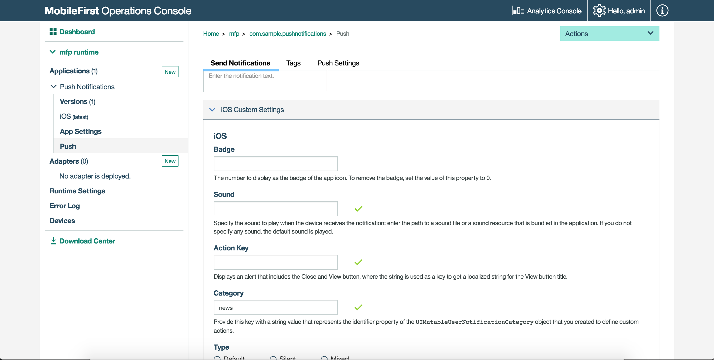

<!-- NLS_CHARSET=UTF-8 -->
## 概説
{: #overview }
対話式通知を使用すると、ユーザーは、通知が到着したときに、アプリケーションを開かなくてもアクションを実行できます。 対話式通知を受信すると、デバイスは通知メッセージとともにアクション・ボタンを表示します。

対話式通知は、iOS バージョン 8 以降のデバイスでサポートされています。 バージョン 8 より前の iOS デバイスに対話式通知が送信された場合、通知アクションは表示されません。

## 対話式プッシュ通知の送信
{: #sending-interactive-push-notification }
通知を準備して送信します。 詳しくは、[プッシュ通知の送信](../../sending-notifications)を参照してください。

通知のカテゴリーを示すストリングを通知オブジェクトに設定できます。この設定は、**{{ site.data.keys.mf_console }} →「 [ご使用のアプリケーション] 」→「プッシュ」→「通知の送信」→「iOS カスタム設定」**で行います。 カテゴリー値に基づいて、通知アクション・ボタンが表示されます。 例えば、次のとおりです。



## Cordova アプリケーションでの対話式プッシュ通知の処理
{: #handling-interactive-push-notifications-in-cordova-applications }
対話式通知を受信するには、以下の手順を実行します。

1. メインの JavaScript 内で、対話式通知用に登録済みのカテゴリーを定義し、それをデバイス登録呼び出し `MFPPush.registerDevice` に渡します。

   ```javascript
   var options = {
        ios: {
            alert: true,
            badge: true,
            sound: true,
            categories: [{
                //Category identifier, this is used while sending the notification.
                id : "poll", 

                //Optional array of actions to show the action buttons along with the message.    
                actions: [{
                    //Action identifier
                    id: "poll_ok", 

                    //Action title to be displayed as part of the notification button.
                    title: "OK", 

                    //Optional mode to run the action in foreground or background. 1-foreground. 0-background. Default is foreground.
                    mode: 1,  

                    //Optional property to mark the action button in red color. Default is false.
                    destructive: false,

                    //Optional property to set if authentication is required or not before running the action.(Screen lock).
                    //For foreground, this property is always true.
                    authenticationRequired: true
                },
                {
                    id: "poll_nok",
                    title: "NOK",
                    mode: 1,
                    destructive: false,
                    authenticationRequired: true
                }],
                    
                //Optional list of actions that is needed to show in the case alert.
                //If it is not specified, then the first four actions will be shown.
                defaultContextActions: ['poll_ok','poll_nok'],

                //Optional list of actions that is needed to show in the notification center, lock screen.
                //If it is not specified, then the first two actions will be shown.
                minimalContextActions: ['poll_ok','poll_nok'] 
            }]     
        }
   }
   ```

2. プッシュ通知のデバイスを登録する際に、`options` オブジェクトを渡します。

   ```javascript
   MFPPush.registerDevice(options, function(successResponse) {
  		navigator.notification.alert("Successfully registered");
  		enableButtons();
   });  
   ```

## ネイティブ iOS アプリケーションでの対話式プッシュ通知の処理
{: #handling-interactive-push-notifications-in-native-ios-applications }
以下のステップに従って、対話式通知を受け取ります。

1. リモート通知の受信時にバックグラウンド・タスクを実行するアプリケーション機能を使用可能にします。 このステップは、アクションの一部がバックグラウンド対応の場合に必要です。
2. 対話式通知用に登録済みのカテゴリーを定義し、それをオプションとして `MFPPush.registerDevice` に渡します。

   ```swift
   //define categories for Interactive Push
   let acceptAction = UIMutableUserNotificationAction()
   acceptAction.identifier = "OK"
   acceptAction.title = "OK"
   acceptAction.activationMode = .Foreground

   let rejetAction = UIMutableUserNotificationAction()
   rejetAction.identifier = "Cancel"
   rejetAction.title = "Cancel"
   rejetAction.activationMode = .Foreground

   let category = UIMutableUserNotificationCategory()
   category.identifier = "poll"
   category.setActions([acceptAction, rejetAction], forContext: .Default)

   let categories:Set<UIUserNotificationCategory> = [category]

   let options = ["alert":true, "badge":true, "sound":true, "categories": categories]

   // Register device
    MFPPush.sharedInstance().registerDevice(options as [NSObject : AnyObject], completionHandler: {(response: WLResponse!, error: NSError!) -> Void in
   ```
