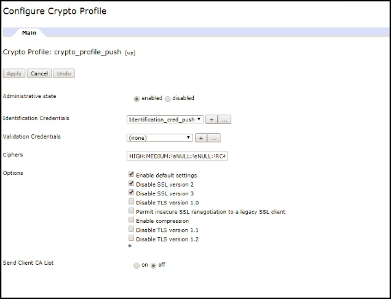

<!-- NLS_CHARSET=UTF-8 -->
## 概説
{: #overview }
通知は、サーバーから「プッシュ」されるメッセージを受信する、モバイル・デバイスの機能です。  
通知は、アプリケーションがフォアグラウンドまたはバックグラウンドで現在実行中であるかどうかにかかわらず受信されます。  

{{ site.data.keys.product_full }} は、プッシュ通知または SMS 通知を iOS、Android、Windows 8.1 Universal、Windows 10 UWP、および Cordova (iOS、Android) アプリケーションに送信するための API メソッドの統合セットを提供します。通知は、{{ site.data.keys.mf_server }} からベンダー (Apple、Google、Microsoft、SMS Gateways) インフラストラクチャーに送信され、そこから関連デバイスへと送信されます。統一通知メカニズムにより、ユーザーおよびデバイスとの通信プロセス全体が、開発者から完全に透過的になります。

#### デバイス・サポート
{: #device-support }
{{ site.data.keys.product }} では、プッシュ通知と SMS 通知が以下のプラットフォームに対してサポートされます。

* iOS 8.x 以降
* Android 4.x 以降
* Windows 8.1、Windows 10

#### ジャンプ先:
{: #jump-to }
* [プッシュ通知](#push-notifications)
* [SMS 通知](#sms-notifications)
* [プロキシー設定](#proxy-settings)
* [次に使用するチュートリアル](#tutorials-to-follow-next)

## プッシュ通知
{: #push-notifications }
通知には複数の形式を使用できます。

* **アラート (iOS、Android、Windows)** - ポップアップ・テキスト・メッセージ
* **サウンド (iOS、Android、Windows)** - 通知を受け取ったときに再生されるサウンド・ファイル
* **バッジ (iOS)、タイル (Windows)** - ショート・テキストまたはイメージを使用可能なグラフィカル表現
* **バナー (iOS)、トースト (Windows)** - デバイス・ディスプレイの上部にある、消えるポップアップ・テキスト・メッセージ
* **対話式 (iOS 8 以降)** - 受け取った通知のバナー内のアクション・ボタン
* **サイレント (iOS 8 以降)** - ユーザーの邪魔にならない通知送信

### プッシュ通知のタイプ
{: #push-notification-types }
#### タグ通知
{: #tag-notifications }
タグ通知は、特定のタグにサブスクライブしているすべてのデバイスを宛先とした通知メッセージです。  

タグ・ベース通知は、サブジェクト・エリアまたはトピックに基づいて通知を区分けすることを可能にします。通知の受信者は、関心のあるサブジェクトまたはトピックに関するものである場合のみ通知を受け取ることを選択できます。したがって、タグ・ベース通知は受信者を区分けする手段を提供します。この機能により、タグを定義し、タグ別にメッセージを送受信できます。メッセージは、タグにサブスクライブされたデバイスのみを宛先とします。

#### ブロードキャスト通知
{: #broadcast-notifications }
ブロードキャスト通知は、サブスクライブしているすべてのデバイスをターゲットとするタグ・プッシュ通知の一形式であり、予約済みの `Push.all` タグ (あらゆるデバイス用に自動作成される) へのサブスクリプションによって、プッシュ対応のすべての {{ site.data.keys.product_adj }} アプリケーションに対してデフォルトで使用可能になります。ブロードキャスト通知を使用不可にするには、予約済みの `Push.all` タグからアンサブスクライブします。

#### ユニキャスト通知
{:# unicast-notifications }
ユニキャスト通知 (ユーザー認証済み通知) は、OAuth によって保護されます。これらは特定のデバイスまたはユーザー ID をターゲットとする通知メッセージです。ユーザー・サブスクリプション内のユーザー ID は、基礎となるセキュリティー・コンテキストに由来するものです。

#### 対話式通知
{: #interactive-notifications }
対話式通知を使用すると、ユーザーは、通知が到着したときに、アプリケーションを開かなくてもアクションを実行できます。対話式通知を受信すると、デバイスは通知メッセージとともにアクション・ボタンを表示します。現在、対話式通知は、iOS バージョン 8 以降のデバイスでサポートされています。バージョン 8 より前の iOS デバイスに対話式通知が送信された場合、通知アクションは表示されません。

> [対話式通知](handling-push-notifications/interactive)を処理する方法に関する説明。

#### サイレント通知
{: #silent-notifications }
サイレント通知は、アラートを表示しない、あるいはユーザーを妨げない通知です。サイレント通知が到着すると、アプリケーションをフォアグラウンドに移行せずに、アプリケーションの処理コードがバックグラウンドで実行されます。現在、サイレント通知は、バージョン 7 以降の iOS デバイスでサポートされています。バージョン 7 より低いバージョンの iOS デバイスにサイレント通知が送信された場合、アプリケーションがバックグラウンドで実行されていると、通知は無視されます。アプリケーションがフォアグラウンドで実行されていると、通知のコールバック・メソッドが呼び出されます。

> [サイレント通知](handling-push-notifications/silent)を処理する方法に関する説明。

**注:** ユニキャスト通知では、ペイロードにタグがいっさい含まれません。POST メッセージ API のターゲット・ブロックで複数の deviceID または userID をそれぞれ指定することによって、通知メッセージのターゲットを複数のデバイスまたはユーザーにすることができます。

## SMS 通知
{: #sms-notifications }
SMS 通知の受信を開始するには、アプリケーションがまず SMS 通知サブスクリプションに登録する必要があります。SMS 通知にサブスクライブするために、ユーザーは携帯電話番号を提供し、通知サブスクリプションを承認します。ユーザー承認を受け取ると、サブスクリプション要求が {{ site.data.keys.mf_server }} に送信されます。通知は、{{ site.data.keys.mf_console }} から取得されるときに処理され、事前構成された SMS ゲートウェイを通じて送信されます。

ゲートウェイを構成するには、[通知の送信](sending-notifications)チュートリアルを参照してください。

## プロキシー設定
{: #proxy-settings }
プロキシー設定を使用して、通知が APNS および FCM に送信される際に経由するオプションのプロキシーを設定します。プロキシーの設定には、**push.apns.proxy.*** および **push.gcm.proxy.*** の構成プロパティーを使用できます。詳しくは、[{{ site.data.keys.mf_server }} プッシュ・サービスの JNDI プロパティーのリスト](../installation-configuration/production/server-configuration/#list-of-jndi-properties-for-mobilefirst-server-push-service)を参照してください。

> **注:** WNS には、プロキシー・サポートはありません。

### プッシュ通知エンドポイントとしての WebSphere DataPower の使用
{: #proxy-settings-datapower }

MobileFirst サーバーからの通知要求を受け入れてこれを FCM、SMS、および WNS にリダイレクトするように、DataPower をセットアップすることができます。

APN はサポートされていないことに注意してください。

#### MobileFirst Server の構成
{: #proxy-settings-datapower-1 }

`server.xml` で、以下の JNDI プロパティーを構成します。
```
<jndiEntry jndiName="imfpush/mfp.push.dp.endpoint" value = '"https://host"' />
<jndiEntry jndiName="imfpush/mfp.push.dp.gcm.port" value = '"port"' />
<jndiEntry jndiName="imfpush/mfp.push.dp.wns.port" value = '"port"' />
```

ここで、`host` は DataPower のホスト名で、`port` は FCM および WNS の HTTPS フロント・サイド・ハンドラーが構成されているポート番号です。

SMS では、構成設定は REST API 呼び出しの一部として指定されます。JNDI プロパティーを指定する必要はありません。

#### DataPower の構成
{: #proxy-settings-datapower-2 }

1. DataPower アプライアンスにログインします。
2. **「サービス」**>**「マルチプロトコル・ゲートウェイ」**>**「新しいマルチプロトコル・ゲートウェイ」**にナビゲートします。
3. 構成を識別するために使用する名前を指定します。
4. 「XML マネージャー」と「マルチプロトコル・ゲートウェイ・ポリシー」をデフォルトとして選択して、「URL 再書き込みポリシー」に「なし」を選択します。
5. **「静的バックエンド」**ラジオ・ボタンを選択して、**「デフォルト・バックエンド URL の設定 (set Default Backend URL)」**で以下のいずれかのオプションを選択します。
	- FCM の場合:	`https://gcm-http.googleapis.com`
	- SMS の場合:	`http://<samplegateway>/gateway`
	- WNS の場合:	`https://hk2.notify.windows.com`
6. 「応答タイプ」と「要求タイプ」として「パススルー」を選択します。

#### 証明書の生成
{: #proxy-settings-datapower-3 }

証明書を生成するには、以下のいずれかを選択します。

- FCM の場合:
	1. コマンド・ラインで `Openssl` を発行して FCM 証明書を取得します。
	2. 次のコマンドを実行します。
		```
		openssl s_client -connect gcm-http.googleapis.com:443
		```
	3. -----BEGIN CERTIFICATE-----  から -----END CERTIFICATE----- までの内容をコピーして、`.pem` 拡張子の付いたファイルに保存します。

- SMS の場合、証明書は不要です。
- WNS の場合:
	1. コマンド・ラインで `Openssl` を使用して WNS 証明書を取得します。
	2. 次のコマンドを実行します。
		```
		openssl s_client -connect https://hk2.notify.windows.com:443
		```
	3. -----BEGIN CERTIFICATE-----  から -----END CERTIFICATE----- までの内容をコピーして、`.pem` 拡張子の付いたファイルに保存します。

#### バック・サイド設定
{: #proxy-settings-datapower-4 }


- FCM および WNS の場合:

	1. 暗号証明書を作成します。

		a. **「オブジェクト」**>**「暗号構成」**にナビゲートして、**「暗号証明書」**をクリックします。

		b. 暗号証明書を識別するために使用する名前を指定します。

		c. **「アップロード」**をクリックして、生成された FCM 証明書をアップロードします。

		d. **「パスワード別名」**を「なし」に設定します。

		e. **「鍵の生成」**をクリックします。
		

	2. 暗号妥当性検査資格情報を作成します。

		a. **「オブジェクト」**>**「暗号構成」**にナビゲートして、**「暗号妥当性検査資格情報」**をクリックします。

		b. 固有の名前を付けます。

		c. 「証明書」で、前のステップ (ステップ 1) で作成した暗号証明書を選択します。

		d. **「証明書妥当性検査モード」**で「完全一致証明書または即時発行者の証明書」を選択します。

		e. **「適用」**をクリックします。
		

	3. 暗号妥当性検査資格情報を作成します。

		a. **「オブジェクト」**>**「暗号構成」**にナビゲートして、**「暗号プロファイル」**をクリックします。

		b. **「追加」**をクリックします。

		c. 固有の名前を付けます。

		d. **「妥当性検査資格情報」**で、前のステップ (ステップ 2) で作成した妥当性検査資格情報をドロップダウン・メニューから選択し、「ID 資格情報」を**「なし」**に設定します。

		e. **「適用」**をクリックします。
		

	4. SSL プロキシー・プロファイルを作成します。

		a. **「オブジェクト」**>**「暗号構成」**>**「SSL プロキシー・プロファイル」**にナビゲートします。

		b. 次のいずれかのオプションを選択します。

		- SMS では、**「SSL プロキシー・プロファイル」**として「なし」を選択します。
		- セキュア・バックエンド URL (HTTPS) を使用する FCM および WNS では、以下のステップを実行します。
			1.	**「追加」**をクリックします。

			2.	後で SSL プロキシー・プロファイルを識別するために使用する名前を指定します。

			3.	ドロップダウンから**「SSL の方向」**として**「フォワード」**を選択します。

			4.	「フォワード (クライアント) 暗号プロファイル」で、ステップ 3 で作成した暗号プロファイルを選択します。

			5.	**「適用」**をクリックします。
			

	5. 「マルチプロトコル・ゲートウェイ」ウィンドウの**「バック・サイド設定」**で、**「プロキシー・プロファイル」**として**「SSL クライアント・タイプ」**を選択して、ステップ 4 で作成した SSL プロキシー・プロファイルを選択します。
	 

- SMS では、バック・サイド設定は不要です。

#### フロント・サイド設定
{: #proxy-settings-datapower-5 }

- FCM、WNS、および SMS の場合:


	1. DataPower のホスト名として共通名 (CN) 値を使用して鍵と証明書のペアを作成します。

		a. **「管理」**>**「その他」**にナビゲートして、**「暗号ツール」**をクリックします。

		b. 共通名 (CN) の値として DataPower のホスト名を入力します。

		c. 秘密鍵を後でエクスポートする場合は**「秘密鍵のエクスポート」**を選択し、**「鍵の生成」**をクリックします。
		

	2. 暗号 ID 資格情報を作成します。

		a. **「オブジェクト」**>**「暗号構成」**にナビゲートして、**「暗号 ID 資格情報」**をクリックします。

		b. **「追加」**をクリックします。

		c. 固有の名前を付けます。

		d. 「暗号鍵」と「証明書」で、前のステップ (ステップ 1) で生成した鍵と証明書をリスト・ボックスから選択します。

		e. **「適用」**をクリックします。
		

	3. 暗号プロファイルを作成します。

		a. **「オブジェクト」**>**「暗号構成」**にナビゲートして、**「暗号プロファイル」**をクリックします。

		b. **「追加」**をクリックします。

		c. 固有の名前を付けます。

		d. 「ID 資格情報」で、前のステップ (ステップ 2) で作成した ID 資格情報をリスト・ボックスから選択します。「妥当性検査資格情報」を「なし」に設定します。

		e. **「適用」**をクリックします。
		

	4. SSL プロキシー・プロファイルを作成します。

		a. **「オブジェクト」**>**「暗号構成」**>**「SSL プロキシー・プロファイル」**にナビゲートします。

		b. **「追加」**をクリックします。

		c. 固有の名前を付けます。

		d. リスト・ボックスから「SSL の方向」として**「リバース」**を選択します。

		e. 「リバース (サーバー) 暗号プロファイル」で、前のステップ (ステップ 3) で作成した暗号プロファイルを選択します。  

		f. **「適用」**をクリックします。
		

	5. HTTPS フロント・サイド・ハンドラーを作成します。

		a. **「オブジェクト」**>**「プロトコル・ハンドラー」**>**「HTTPS フロント・サイド・ハンドラー (HTTPS Front Side Handler)」**にナビゲートします。

		b. **「追加」**をクリックします。

		c. 固有の名前を付けます。

		d. **「ローカル IP アドレス」**で、正しい別名を選択するか、デフォルト値 (0.0.0.0) のままにします。

		e. 使用可能なポートを提供します。

		f. **「許可される方式およびバージョン」**で、「HTTP 1.0」、「HTTP 1.1」、「POST メソッド」、「GET メソッド」、「? がある URL」、「# がある URL」、「.. がある URL」を選択します。

		g. **「プロキシー・プロファイル」**として「SSL サーバー・タイプ」を選択します。

		h. 「SSL プロキシー・プロファイル (非推奨)」で、前のステップ (ステップ 4) で作成した SSL プロキシー・プロファイルを選択します。

		i. **「適用」**をクリックします。
		

	6. 「マルチプロトコル・ゲートウェイの構成」ページの**「フロント・サイド設定」**で、ステップ 5 で作成した HTTPS フロント・サイド・ハンドラーを**「フロント・サイド・プロトコル」**として選択して、**「適用」**をクリックします。

	

	「フロント・サイド設定」で DataPower によって使用されている証明書は、自己署名証明書です。Mobilefirst によって使用される JRE 鍵ストアにその証明書を追加する場合を除き、DataPower への接続は失敗します。

	自己署名証明書を JRE 鍵ストアに追加するには、[IBM Worklight Server および自己署名証明書 (IBM Worklight Server and self-signed certificates) ](https://www.ibm.com/support/knowledgecenter/SSZH4A_5.0.5/com.ibm.worklight.help.doc/admin/t_ibm_worklight_server_and_self-signed_certificates.html)の資料の手順に従ってください。


## 次に使用するチュートリアル
{: #tutorials-to-follow-next }
プッシュ通知の送信および受信を可能にするためには、サーバー・サイドとクライアント・サイドで必要な以下のセットアップを最初から最後まで行ってください。
