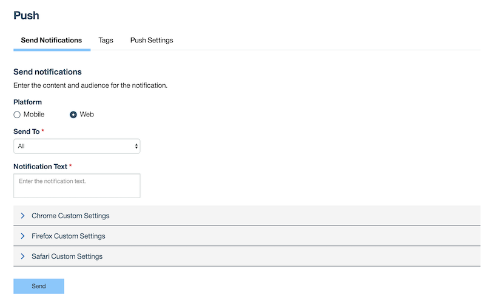
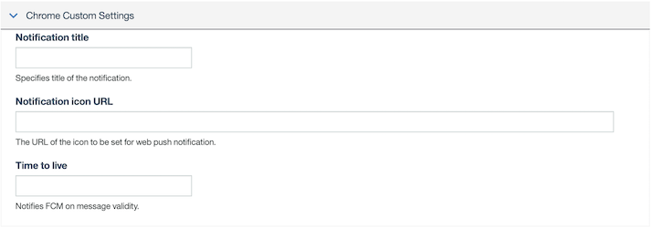

<!-- NLS_CHARSET=UTF-8 -->

Web プラットフォームへの通知の送信は、モバイル・プラットフォームへの通知の送信と似ています。詳しくは、[ここ]({{ site.baseurl }}/tutorials/en/foundation/8.0/notifications/sending-notifications/)を参照してください。

* **「通知の送信」**タブに、**「プラットフォーム」**選択の新しいオプションが表示されます。
* *「モバイル」*または*「Web」*を選択できます。

**「送信先」**ドロップダウン・メニューに、構成されたプラットフォームに基づいて**「Chrome」**、**「Firefox」**、**「Safari」**などの新しいオプションが追加されました。各プラットフォームには、プラットフォームの必要に応じて、関連付けられたカスタム設定セクションが付属しています。また、通知の宛先を、**「すべて」**のプラットフォーム、**「タグ別のデバイス」**、**「ユーザー ID 別のデバイス」**、または**「単一デバイス」**にすることもできます。

### Chrome のカスタム設定

Chrome に固有の設定の一部を以下に示します。

- **通知タイトル**: 通知のタイトルを指定します。
- **通知アイコン URL**: Web プッシュ通知用に設定するアイコンの URL。
- **存続時間**: メッセージの有効性を FCM に通知します。

### Firefox のカスタム設定

Firefox に固有の設定の一部を以下に示します。
- **通知タイトル**: 通知のタイトルを指定します。
- **通知アイコン URL**: Web プッシュ通知用に設定するアイコンの URL。

### Safari のカスタム設定

Safari に固有の設定の一部を以下に示します。
- **通知タイトル**: 通知のタイトルを指定します。
- **アクション**: 「アクション」ボタンのラベル。
- **URL 引数**: この通知で使用する必要がある URL 引数。形式は JSON 配列です。
- **本文**: 通知の本文。

*タグ*・ベースの通知、*デバイス ID* と*ユーザー ID* ベースの通知は、モバイル・プラットフォームの場合と似ています。
