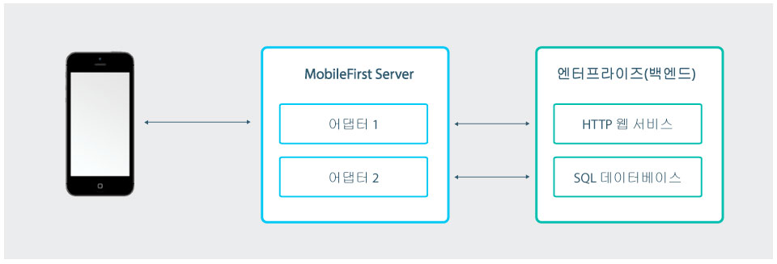
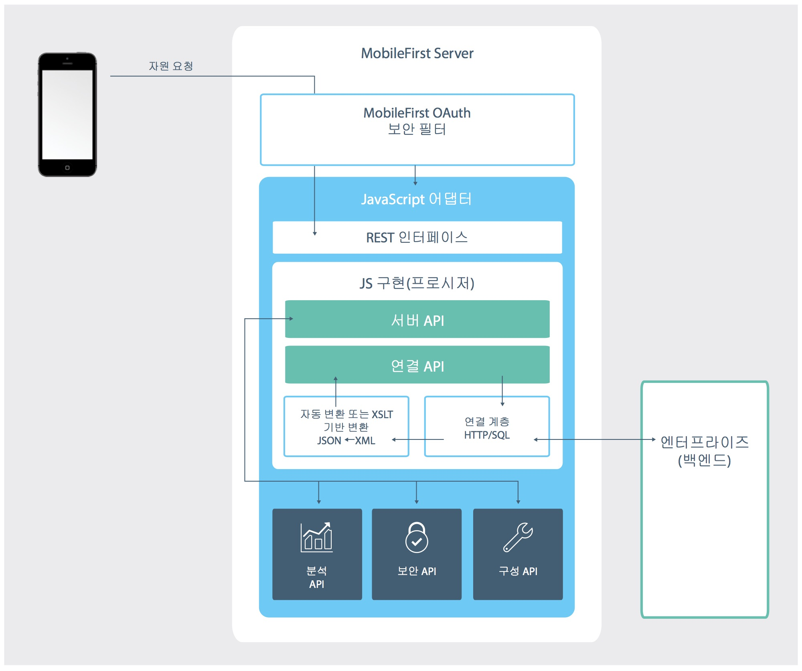
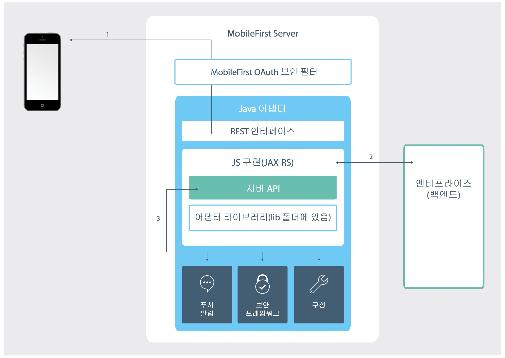

<!-- NLS_CHARSET=UTF-8 -->
## 개요
{: #overview }
어댑터는 Java 또는 JavaScript에서 구현된 서버 측 코드를 포함하는 Maven 프로젝트입니다.   
어댑터는 필요한 서버 측 논리를 수행하고 백엔드 시스템에서 클라이언트 애플리케이션과 클라우드 서비스로 정보를 전송 및 검색하는 데 사용됩니다. 

각 어댑터는 격리된 자체 샌드박스를 보유하며 이러한 샌드박스는 다른 어댑터 샌드박스를 알거나 인터럽트하지 않고 실행됩니다. 즉, 어댑터는 "[어댑터 매시업](advanced-adapter-usage-mashup)"을 활성화하는 API를 호출하여 계속해서 다른 어댑터와 통신할 수 있습니다.  

어댑터의 **pom.xml** 파일에서 Maven 종속성으로 써드파티 라이브러리를 정의하여 어댑터 코드에서 필요로 하는 써드파티 라이브러리를 포함할 수 있습니다. 자세한 정보는 [Java 및 JavaScript 어댑터 작성](creating-adapters) 학습서의 [종속성](creating-adapters/#dependencies) 섹션을 참조하십시오. 

어댑터는 또한 다음과 같이 DevOps의 요구사항을 지원합니다. 

* 사용자는 어댑터를 "핫 배치"할 수 있는데 이는 런타임 시 배치, 배치 취소, 재배치가 가능하다는 의미입니다. 이러한 기능은 서버 측 배치 프로세스에 커다란 유연성을 제공합니다. 
* 어댑터는 어댑터를 재배치하지 않고도 관리 직원이 구성할 수 있는 사용자 정의 특성을 가질 수 있습니다.
이 기능을 사용하면 다양한 환경(예: 개발, 테스트 및 프로덕션)에 맞게 어댑터 동작을 사용자 정의할 수 있습니다. 

Java 및 JavaScript 어댑터 개요에 대해 계속 읽으십시오. 그런 다음 사이드바 탐색에 있는 학습서의 내용에 따라 Java 및 JavaScript 어댑터를 작성, 빌드, 업데이트, 개발, 테스트 및 배치하는 방법, 어댑터 개발을 위해 IDE를 사용하는 방법, 서버 측 로그를 수집하는 방법, 어댑터 매시업 및 Cloudant 통합과 같은 추가 고급 주제에 대해 학습하십시오. 

### 어댑터 사용 이점
{: #benefits-of-using-adapters }

#### 범용성
{: #universality }

* 어댑터는 다중 통합 기술 및 백엔드 정보 시스템을 지원합니다. 

#### 읽기 전용 및 트랜잭션 기능
{: #read-only-and-transactional-capabilities }

* 어댑터는 백엔드 시스템에 대해 읽기 전용 및 트랜잭션 액세스 모드를 지원합니다. 

#### 빠른 개발
{: #fast-development }

* 어댑터는 단순 XML 구문을 사용하고, JavaScript API 또는 Java API로 쉽게 구성됩니다. 

#### 보안
{: #security }

* 어댑터는 백엔드 시스템과의 연결을 작성하기 위해 유연한 인증 기능을 사용합니다. 
* 어댑터는 연결된 사용자 ID에 대한 제어를 제공합니다. 

#### 투명성
{: #transparency }

* 백엔드 애플리케이션에서 검색되는 데이터는 어댑터 유형에 상관없이 단일한 방식으로 노출됩니다.   

### Java 어댑터에 특정한 이점
{: #benefits-specific-to-java-adapters }

* URL 구조, 컨텐츠 유형, 요청 및 응답 헤더, 컨텐츠 및 인코딩을 완전히 제어할 수 있는 기능
* Postman과 같은 써드파티 도구를 사용하여 어댑터를 테스트하는 기능
* 성능 저하 및 가동 중단 없이 실행 중인 {{ site.data.keys.mf_server }} 인스턴스에 쉽고 빠른 배치
* 소스 코드의 단순 어노테이션을 사용하여 추가 사용자 정의 없이 {{ site.data.keys.product }} 보안 모델과 보안 통합

## JavaScript 어댑터
{: #javascript-adapters }

JavaScript 어댑터는 HTTP 및 SQL 백엔드와 통신하기 위한 템플리트를 제공합니다. 이러한 템플리트는 일련의 서비스 호출된 프로시저를 포함합니다. 모바일 앱은 AJAX 요청을 발행하여 이러한 프로시저를 호출할 수 있습니다. 프로시저는 백엔드 애플리케이션에서 정보를 검색하고 데이터를 애플리케이션으로 리턴합니다. REST 인터페이스를 사용하여 {{ site.data.keys.product }}에서 제공하는 [OAuth 2.0 기반 보안 프레임워크](../authentication-and-security)의 혜택을 얻을 수 있습니다. 

* 데이터의 형식이 JSON이면 {{site.data.keys.mf_server }}는 데이터를 그대로 유지합니다. 그렇지 않으면 {{ site.data.keys.mf_server }}가 자동으로 JSON으로 변환합니다.   
* 또는 JSON으로 데이터를 변환하기 위해 XSL 변환을 제공할 수 있습니다. 이런 경우 백엔드에서 리턴된 컨텐츠 유형은 XML이어야 합니다. 그런 다음 요구사항을 기반으로 데이터를 필터링하기 위해 XSLT를 사용할 수 있습니다. 
* HTTP 어댑터를 사용하여 GET 또는 POST HTTP 요청을 보내고 데이터를 응답 헤더와 본문에서 검색할 수 있습니다. HTTP 어댑터는 RESTful 및 SOAP 기반 서비스에서 작동하며 구조화된 HTTP 소스(예: RSS 피드)를 읽을 수 있습니다. 
* 어댑터를 사용하면 SQL 데이터 소스와 통신할 수 있습니다.
일반 SQL 조회 또는 스토어드 프로시저를 사용할 수 있습니다. 

> * [어댑터 작성](creating-adapters) 학습서에서 어댑터 작성 방법을 학습하십시오. 
> * [JavaScript 어댑터](javascript-adapters)에 대해 자세히 알아보십시오. 

## Java 어댑터
{: #java-adapters }

Java 어댑터는 [JAX-RS 2.0 스펙](https://jax-rs-spec.java.net/nonav/2.0-rev-a/apidocs/index.html)을 기반으로 하므로 Java로 작성되고, 전체 REST API를 클라이언트에 노출시킵니다. Java 어댑터에서 각 자원의 URL 구조 및 리턴된 컨텐츠와 형식은 개발자가 정의합니다. 단, 요청을 보내는 클라이언트가 GZip을 지원하는 경우 Java 어댑터의 리턴된 컨텐츠 인코딩이 GZip으로 압축됩니다. 리턴된 컨텐츠에서 모든 조작은 개발자가 소유하고 수행합니다.

아래 다이어그램은 모바일 디바이스가 해당 REST 엔드포인트에서 Java 어댑터에 액세스할 수 있는 방법을 보여줍니다. REST 인터페이스는
{{ site.data.keys.product }} OAuth
보안 필터로 보호됩니다. 즉, 클라이언트가 어댑터 자원에 액세스하려면 액세스 토큰을 얻어야 합니다. 어댑터의 각 자원은 자체 URL이 있으므로, 방화벽을 사용하여
{{ site.data.keys.product }}
엔드포인트를 보호할 수 있습니다. REST 인터페이스는 Java 코드(JAX-RS 서비스)를 호출하여
수신 요청을 처리합니다. Java 코드는 Java {{site.data.keys.mf_server }} API를 사용하여 서버에 조작을 수행할
수 있습니다. 또한, Java 코드는
엔터프라이즈 시스템에 연결하여 데이터 페치, 데이터 업데이트를 수행하거나 엔터프라이즈 시스템에
표시되는 다른 조작을 수행할 수 있습니다. 

> * [어댑터 작성](creating-adapters) 학습서에서 어댑터 작성 방법을 학습하십시오. 
> * [Java 어댑터](java-adapters)에 대해 자세히 알아보십시오. 

## 다음 학습서
{: #tutorials-to-follow-next }
