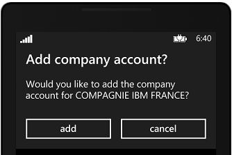
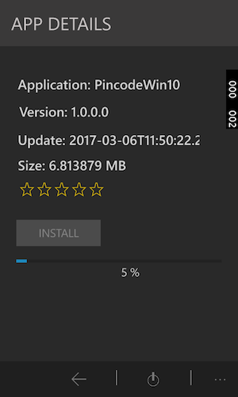
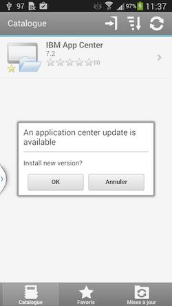

<!-- NLS_CHARSET=UTF-8 -->
## 개요
{: #overview }
Application Center 모바일 클라이언트를 사용하여 모바일 디바이스에 애플리케이션을 설치할 수 있습니다.

Application Center 모바일 클라이언트는 Android, iOS, Windows Phone 또는 Windows 디바이스에서 실행되는 애플리케이션입니다. Windows Phone 8만 Application Center의 최신 버전에서 지원됩니다. 모바일 클라이언트를 사용하여 Application Center에서 사용 가능한 애플리케이션의 카탈로그를 나열합니다. 디바이스에 이러한 애플리케이션을 설치할 수 있습니다. 모바일 클라이언트는 Application Center 설치 프로그램이라고도 합니다. 개인 애플리케이션 저장소로부터 디바이스 애플리케이션에 설치하려는 경우 이 애플리케이션이 디바이스에 있어야 합니다.

### 전제조건
{: #prerequisites }
모바일 클라이언트를 다운로드하고 설치할 수 있으려면 시스템 관리자가 사용자 이름과 비밀번호를 제공해야 합니다. 디바이스에서 모바일 클라이언트를 시작할 때마다 사용자 이름 및 비밀번호가 필요합니다. Windows 스토어 애플리케이션의 경우 런타임 시에만 모바일 클라이언트에 대해 사용자 이름 및 비밀번호가 필요합니다. 보안 상의 이유로 이러한 신임 정보가 유포되지 않도록 주의하십시오. 이러한 신임 정보는 Application Center 콘솔에 로그인하는 데 사용되는 동일한 신임 정보입니다.

#### 다음으로 이동
{: #jump-to }
* [Android 모바일 디바이스에 클라이언트 설치](#installing-the-client-on-an-android-mobile-device)
* [iOS 모바일 디바이스에 클라이언트 설치](#installing-the-client-on-an-ios-mobile-device)
* [Windows Phone 8 Universal 모바일 디바이스에 클라이언트 설치](#installing-the-client-on-a-windows-phone-8-universal-mobile-device)
* [Windows 10 디바이스에 Windows 10 UWP 클라이언트 설치](#installing-windows-10-uwp-client-on-windows-10-device)
* [Windows 10 UWP 애플리케이션 설치 및 검토 주석 추가](#installing-a-windows-10-uwp-application-and-adding-review-comments)
* [로그인 보기](#the-login-view)
* [Application Center 클라이언트의 보기](#views-in-the-application-center-client)
* [Android 디바이스에 애플리케이션 설치](#installing-an-application-on-an-android-device)
* [iOS 디바이스에 애플리케이션 설치](#installing-an-application-on-an-ios-device)
* [Windows Phone 디바이스에 애플리케이션 설치](#installing-an-application-on-a-windows-phone-device)
* [Windows 디바이스에 Windows 스토어 애플리케이션 설치](#installing-a-windows-store-application-on-a-windows-device)
* [공용 앱 스토어를 통한 애플리케이션 설치](#installing-applications-through-public-app-stores)
* [설치된 애플리케이션 제거](#removing-an-installed-application)
* [특정 애플리케이션 버전의 세부사항 표시](#showing-details-of-a-specific-application-version)
* [애플리케이션 업데이트](#updating-an-application)
* [Application Center 클라이언트 자동 업그레이드](#upgrading-the-application-center-client-automatically)
* [설치된 애플리케이션 되돌리기](#reverting-an-installed-application)
* [즐겨찾기 앱 표시 또는 표시 해제](#marking-or-unmarking-a-favorite-app)
* [설치된 애플리케이션에 대한 검토 제출](#submitting-a-review-for-an-installed-application)
* [검토 보기](#viewing-reviews)

## Android 모바일 디바이스에 클라이언트 설치
{: #installing-the-client-on-an-android-mobile-device }
브라우저에 액세스 URL을 입력하고, 신임 정보를 입력하고, 필요한 단계를 완료하여, 설치 프로그램 플래그로 표시되어 있는 서명된 애플리케이션 또는 모바일 클라이언트를 Android 모바일 디바이스에 설치할 수 있습니다.

1. 모바일 디바이스에서 브라우저를 시작하십시오.
2. 주소 텍스트 필드에 다음 액세스 URL을 입력하십시오. `http://hostname:portnumber/applicationcenter/installers. html`

    여기서 hostname은 서버의 주소이며 portnumber는 Application Center가 설치된 포트 번호입니다. 시스템 관리자가 이 정보를 제공할 수 있습니다.

    또한 Application Center는 모바일 디바이스에 클라이언트 설치를 위한 대체 URL을 제공합니다. `http://hostname:portnumber/applicationcenter/inst.html`. 이 URL의 페이지는 일부 이전 또는 비표준 모바일 웹 브라우저에서 더 잘 작동합니다. 모바일 디바이스에서 페이지 installers.html이 작동하지 않는 경우 inst.html을 사용할 수 있습니다. 이 페이지는 영어로만 제공되며 다른 언어로는 번역되지 않습니다.

    HTTPS를 사용하여 페이지를 열고 자체 서명된 인증서를 사용하려고 시도하는 경우, 이전 Android 브라우저는 페이지를 열 수 없습니다. 이 경우 자체 서명되지 않은 인증서를 사용하거나 Android 디바이스에서 Firefox, Chrome 또는 Opera와 같은 다른 브라우저를 사용해야 합니다. Android 4 이상의 경우, Android 브라우저에 SSL 인증서에 대한 보안 경고가 표시되지만 안전하지 않은 연결에 동의함을 확인한 후 웹 사이트로 이동할 수 있습니다.

3. 사용자 이름 및 비밀번호를 입력하십시오. 사용자 이름 및 비밀번호의 유효성이 검증되면 디바이스에 대한 호환 가능한 설치 프로그램 애플리케이션 목록이 브라우저에 표시됩니다. 일반적으로 모바일 클라이언트, 하나의 애플리케이션만 이 목록에 표시됩니다.

4. 웹 서버가 자체 서명된 CA 인증서를 사용하는 경우 디바이스에 하나 이상의 인증서를 설치하십시오. Application Center 관리자는 인증서를 제공해야 합니다. 세부사항은 [Application Center 테스트 환경에서 자체 서명된 CA 인증서 관리 및 설치](../../installation-configuration/production/appcenter/#managing-and-installing-self-signed-ca-certificates-in-an-application-center-test-environment)를 참조하십시오.
    * **SSL 인증서** 탭을 누르고 인증서를 선택하십시오.
    * **설치**를 누르십시오. 디바이스에 대해 이 조치를 한 번만 수행해야 합니다. **설정 → 보안 → 신뢰할 수 있는 신임 정보 → 디바이스의 사용자**를 확인하여 인증서가 설치되어 있는지 확인할 수 있습니다. 이 보기는 사용자가 디바이스에 설치한 SSL 인증서를 표시합니다. 자체 서명된 CA 인증서가 디바이스에 설치되어 있지 않으면 Android 운영 체제가 다음 단계에서 모바일 클라이언트를 다운로드하는 것을 방지합니다.

    Application Center 관리자가 모바일 클라이언트 애플리케이션을 설치해야 사용 가능한 애플리케이션 목록에서 모바일 클라이언트를 확인할 수 있습니다. 관리자는 모바일 클라이언트를 Application Center에 업로드하고 **설치 프로그램** 특성을 **true**로 설정합니다. [애플리케이션 특성](../appcenter-console/#application-properties)을 참조하십시오.

    

5. 애플리케이션 세부사항을 표시하려면 목록에서 항목을 선택하십시오. 일반적으로 이러한 세부사항에는 애플리케이션 이름과 해당 버전 번호가 포함됩니다.

    

6. **지금 설치**를 눌러 모바일 클라이언트를 다운로드하십시오. 최신 Android 디바이스에서는 디바이스의 미디어 파일에 액세스하기 위해 Chrome에 대한 권한을 요청하는 질문이 표시될 수 있습니다. 예를 선택하십시오. 잠재적 유해 파일에 대한 경고가 표시될 수 있습니다. APK 파일을 보존하는 옵션을 선택하십시오.

7. **Android 다운로드** 애플리케이션을 실행하십시오. Application Center 클라이언트 설치 프로그램을 선택하십시오.
8. Application Center 클라이언트 설치 프로그램을 선택하십시오. 애플리케이션을 설치하도록 선택하면 애플리케이션에 부여된 액세스 권한을 확인할 수 있습니다.

    

9. 모바일 클라이언트를 설치하려면 **설치**를 선택하십시오.
10. 애플리케이션이 설치되어 있는 경우 **열기**를 선택하여 모바일 클라이언트를 열거나 **완료**를 선택하여 다운로드 애플리케이션을 닫으십시오.

다음 중 한 가지 이유로 APK 파일이 실패할 수 있습니다.

* 디바이스에 사용 가능한 메모리가 충분하지 않습니다.
* 서버의 SSL 인증서가 디바이스에 알려져 있지 않습니다.

다운로드 애플리케이션을 통해 앱을 처음 설치하는 경우 보안 문제 해결을 위해 Google에서 디바이스 활동을 정기적으로 점검하는지 확인하는 요청을 수신할 수 있습니다. 원하는 대로 허용하거나 거부할 수 있습니다. Application Center 클라이언트는 이 선택에 영향을 받지 않습니다.

다음 중 한 가지 이유로 설치가 차단될 수 있습니다.

* 디바이스가 알 수 없는 소스로부터의 설치를 허용하지 않습니다. 디바이스에서 **설정 → 보안**으로 이동하여 **알 수 없는 소스(알 수 없는 소스로부터의 설치 허용)**을 사용으로 설정하십시오.
* 디바이스에 이미 동일한 앱이 설치되어 있는데 다른 인증서로 서명되었습니다. 이 경우, 서명된 다른 인증서로 디바이스에 앱을 설치하기 전에 해당 앱을 제거해야 합니다.

## iOS 모바일 디바이스에 클라이언트 설치
{: #installing-the-client-on-an-ios-mobile-device }
브라우저에 액세스 URL을 입력하고, 신임 정보를 입력하고, 필요한 단계를 완료하여, 설치 프로그램 플래그로 표시되어 있는 서명된 애플리케이션 또는 모바일 클라이언트를 iOS 모바일 디바이스에 설치할 수 있습니다.

> **중요:** iOS 디바이스에 애플리케이션을 설치하려면, 먼저 SSL을 사용하여 Application Center 서버를 구성해야 합니다. [SSL(Secure Sockets Layer) 구성](../../installation-configuration/production/appcenter/#configuring-secure-sockets-layer-ssl)을 참조하십시오.

IBM Application Center 서비스의 **ibm.appcenter.ios.plist.onetimeurl** JNDI 특성은 모바일 클라이언트가 iOS 모바일 디바이스에 설치되는 경우 일회성 URL이 사용되는지를 제어합니다. 보안을 강화하기 위해 이 특성을 false로 설정하십시오. 이 특성을 false로 설정하는 경우 모바일 클라이언트를 설치할 때 사용자는 클라이언트를 선택할 때 한 번, 클라이언트를 설치할 때 한 번과 같이 여러 번 신임 정보를 입력해야 합니다.

특성을 true로 설정하는 경우 사용자는 신임 정보를 한 번만 입력합니다. 사용자가 신임 정보를 입력할 때 암호 해시를 사용하는 임시 다운로드 URL이 생성됩니다. 이 임시 다운로드 URL은 1시간 동안 유효하며 추가 인증이 필요하지 않습니다. 이 해결 방법은 보안과 인간공학 사이의 타협점입니다.

**ibm.appcenter.ios.plist.onetimeurl** JNDI 특성을 지정하는 단계는 **ibm.appcenter.proxy.host 특성**에 대한 단계와 유사합니다. [애플리케이션 자원의 엔드포인트 정의](../../installation-configuration/production/appcenter/#defining-the-endpoint-of-the-application-resources)를 참조하십시오.

iOS 디바이스에 모바일 클라이언트 설치는 Android에 설치하는 경우와 비슷하지만 약간의 차이가 있습니다. 설치 프로그램은 다운로드 직후에 자동으로 시작됩니다. 거의 모든 설치 단계에서 사용자의 사용자 이름과 비밀번호 신임 정보가 요청됩니다.

1. 모바일 디바이스에서 브라우저를 시작하십시오.
2. 주소 필드에 다음 액세스 URL을 입력하십시오. `http://hostname:portnumber/applicationcenter/installers. html`

    여기서 hostname은 서버의 주소이며 portnumber는 Application Center가 설치된 포트 번호입니다. 시스템 관리자가 이 정보를 제공할 수 있습니다.

    또한 Application Center는 모바일 디바이스에 클라이언트 설치를 위한 대체 URL을 제공합니다. `http://hostname:portnumber/applicationcenter/inst.html`. 이 URL의 페이지는 일부 이전 또는 비표준 모바일 웹 브라우저에서 더 잘 작동합니다. 모바일 디바이스에서 페이지 **installers.html**이 작동하지 않는 경우 **inst.html**을 사용할 수 있습니다. 이 페이지는 영어로만 제공되며 다른 언어로는 번역되지 않습니다.

    HTTPS를 사용하여 페이지를 열고 자체 서명된 인증서를 사용하는 경우, 브라우저에 SSL 인증서에 대한 보안 경고가 표시되지만 안전하지 않은 연결에 동의함을 확인한 후 웹 사이트로 이동할 수 있습니다.

3. 사용자 이름 및 비밀번호를 입력하십시오. [모바일 클라이언트의 전제조건](../preparations)을 참조하십시오.

    사용자 이름 및 비밀번호의 유효성이 검증되면 디바이스에 대한 호환 가능한 설치 프로그램 애플리케이션 목록이 브라우저에 표시됩니다. 일반적으로 모바일 클라이언트, 하나의 애플리케이션만 이 목록에 표시됩니다.

    https를 사용하여 페이지를 여는 경우
    * 웹 서버가 신뢰할 수 있는 인증 기관에서 제공하는 실제 SSL 인증서를 사용하는 경우 5단계로 진행하십시오.
    * 웹 서버가 자체 서명된 CA 인증을 사용하는 경우 4단계로 진행하십시오.

4. 웹 서버가 자체 서명된 CA 인증서를 사용하는 경우 디바이스에 하나 이상의 인증서를 설치하십시오.

    Application Center 관리자가 인증서를 제공합니다. 세부사항은 [Application Center 테스트 환경에서 자체 서명된 CA 인증서 관리 및 설치](../../installation-configuration/production/appcenter/#managing-and-installing-self-signed-ca-certificates-in-an-application-center-test-environment)를 참조하십시오.

    * SSL 인증서 탭을 누르고 인증서를 선택하십시오.
    * 설치를 누르십시오. 디바이스에 대해 한 번만 수행합니다. **설정 → 일반 → 디바이스의 프로파일**를 확인하여 인증서가 설치되어 있는지 확인할 수 있습니다. 이 보기는 사용자가 디바이스에 설치한 SSL 인증서를 표시합니다. 자체 서명된 CA 인증서가 디바이스에 설치되어 있지 않으면 iOS 운영 체제가 다음 단계에서 모바일 클라이언트를 다운로드하는 것을 방지합니다.

    Application Center 관리자가 모바일 클라이언트 애플리케이션을 설치해야 사용 가능한 애플리케이션 목록에서 모바일 클라이언트를 확인할 수 있습니다. 관리자가 모바일 클라이언트를 Application Center에 업로드하고 설치 프로그램 특성을 true로 설정합니다. [애플리케이션 특성](../appcenter-console/#application-properties)을 참조하십시오.

5. **설치 프로그램** 탭을 누르고 목록에서 항목을 선택하여 애플리케이션 세부사항을 표시하십시오.
6. **설치**를 눌러 모바일 클라이언트를 다운로드하십시오.
7. 다운로더 트랜잭션에 권한을 부여하려면 신임 정보를 입력하십시오.
8. 다운로드를 승인하려면 **설치**를 누르십시오.

    

9. 설치를 승인하려면 신임 정보를 입력하십시오.
10. 브라우저를 닫으십시오.

    앱 아이콘이 홈 화면에 표시되고 홈 화면에서 다운로드 진행상태를 감시할 수 있습니다.

> **참고:** 디바이스에 애플리케이션을 설치하려면 선택한 디바이스에 애플리케이션이 설치되도록 설정하는 프로비저닝 프로파일이 필요합니다. 실수로 디바이스에 유효하지 않은 애플리케이션을 설치하려고 시도하는 경우, 일부 iOS 버전은 완료되거나 오류 표시 없이 무한 루프로 애플리케이션 설치를 시도할 수 있습니다. 설치의 진행상태를 표시하는 애플리케이션 아이콘이 홈 화면에 표시되지만, 무한 루프로 인해서 무한 루프를 중지하기 위해 이 애플리케이션 아이콘을 삭제하기 어렵습니다. 임시 해결책은 디바이스를 통신제한 모드로 변경하는 것입니다. 이 모드에서 무한 루프가 중지되고, iOS 디바이스에서 앱을 삭제하기 위한 일반적인 단계를 수행하여 애플리케이션 아이콘을 삭제할 수 있습니다.

다음 중 한 가지 이유로 설치가 차단될 수 있습니다.

* 애플리케이션의 프로비저닝 프로파일이 디바이스에 유효하지 않습니다. 다른 프로비저닝 프로파일을 사용하여 애플리케이션에 서명해야 합니다.
* 디바이스가 프로비저닝 프로파일의 유효성을 확인하기 위해 Apple 서버에 액세스할 수 없습니다.
* 서버의 SSL 인증서가 디바이스에 알려져 있지 않습니다.

일반적으로 iOS 애플리케이션은 프로비저닝 프로파일로 서명된 경우에만 디바이스에 설치할 수 있습니다. [프로젝트 가져오기 및 빌드(Android, iOS, Windows Phone)](../preparations/#importing-and-building-the-project-android-ios-windows-phone)를 참조하십시오.

iOS 9부터 회사 애플리케이션이 열려 있는 경우, 프로비저닝 프로파일의 유형에 따라 신뢰할 수 없는 엔터프라이즈 개발자 메시지가 표시될 수 있습니다. 이 메시지는 프로비저닝 프로파일을 이 디바이스에서 아직 신뢰할 수 없음을 설명합니다. 이 경우, 이 프로비저닝 프로파일에 대해 신뢰가 설정되지 않으면 애플리케이션이 열리지 않습니다. 신뢰 설정은 프로비저닝 프로파일당 한 번만 수행해야 합니다.

애플리케이션이 설치된 후 프로비저닝 프로파일에 대한 신뢰를 설정하려면 다음을 수행하십시오.

#### iOS 9.1 이하의 경우
{: #until-ios-91 }
1. **설정 → 일반 → 프로파일**로 이동하십시오. **엔터프라이즈 앱** 표제 아래, 앱의 프로비저닝 프로파일이 표시됩니다.
2. 프로파일을 누르고 신뢰를 확인하십시오.

#### iOS 9.2 이상의 경우
{: #since-ios-92 }
1. **설정 → 일반 → 프로파일 → 디바이스 관리 또는 프로파일 및 디바이스 관리**로 이동하십시오. **엔터프라이즈 앱** 표제 아래, 앱의 프로비저닝 프로파일이 표시됩니다.
2. 프로파일을 누르고 신뢰를 확인하십시오.

신뢰가 확인되고 나면 해당 프로비저닝 프로파일을 사용하는 애플리케이션은 신뢰할 수 없는 엔터프라이즈 개발자 메시지를 표시하지 않습니다. 자세한 정보는 Apple 웹 사이트([https://support.apple.com/en-us/HT204460](https://support.apple.com/en-us/HT204460))를 참조하십시오.

## Windows Phone 8 Universal 모바일 디바이스에 클라이언트 설치
{: #installing-the-client-on-a-windows-phone-8-universal-mobile-device }
브라우저에 액세스 URL을 입력하고, 신임 정보를 입력한 후 필수 단계를 완료하여, 설치 프로그램 플래그로 표시되어 있는 서명된 애플리케이션 또는 모바일 클라이언트를 설치할 수 있습니다. 회사 계정이 모바일 디바이스에 사전 설치되어 있어야 합니다.

회사에서 공개한 앱을 설치하려면 모바일 디바이스에 회사 계정을 추가해야 합니다. 애플리케이션 등록 토큰(AET)을 Windows Phone 디바이스에 다운로드해야 합니다. 이 AET는 {{ site.data.keys.mf_server }}에 이미 있어야 합니다. Application Center 콘솔을 사용하여 {{ site.data.keys.mf_server }}에 업로드됩니다. 자세한 내용은 [Windows 8 Universal의 애플리케이션 등록 토큰](../appcenter-console/#application-enrollment-tokens-in-windows-8-universal)을 참조하십시오.

1. 모바일 디바이스에서 브라우저를 시작하십시오.
2. 주소 텍스트 필드에 다음 액세스 URL을 입력하십시오. `http://hostname:portnumber/applicationcenter/installers. html`.

    여기서 **hostname**은 서버의 주소이고 **portnumber**는 Application Center가 설치된 포트의 번호입니다. 시스템 관리자가 이 정보를 제공할 수 있습니다.

    또한 Application Center는 모바일 디바이스에 클라이언트 설치를 위한 대체 URL을 제공합니다. `http://hostname:portnumber/applicationcenter/inst.html`. 이 URL의 페이지는 일부 이전 또는 비표준 모바일 웹 브라우저에서 더 잘 작동합니다. 모바일 디바이스에서 페이지 **installers.html**이 작동하지 않는 경우 **inst.html**을 사용할 수 있습니다. 이 페이지는 영어로만 제공되며 다른 언어로는 번역되지 않습니다.

3. 서버에 대한 액세스를 승인하려면 신임 정보를 입력하십시오. 화면의 하단에 있는 도구 모음에는 **설치 프로그램** 탭 및 **토큰** 탭이 있습니다.

    

4. **토큰**을 누르고 사용 가능한 토큰 목록에서 애플리케이션 등록 토큰을 선택하여 토큰 세부사항을 표시하십시오.

    

5. **추가**를 눌러 애플리케이션 등록 토큰을 다운로드하십시오.
6. **추가**를 눌러 회사 계정을 추가하십시오.

    

    Windows Phone 8은 회사 계정 추가에 대한 피드백을 제공하지 않습니다.

7. 이전 아이콘을 눌러 애플리케이션 등록 토큰의 세부사항으로 돌아가십시오.
8. **설치 프로그램**을 누르고 사용 가능한 애플리케이션 목록에서 모바일 클라이언트 애플리케이션을 선택하십시오. 애플리케이션 세부사항이 표시됩니다.
9. **설치**를 눌러 선택된 애플리케이션을 다운로드하십시오.

    

10. **설치**를 눌러 애플리케이션을 설치하십시오.

    

    Windows 8 Universal은 애플리케이션 설치에 대한 피드백을 제공하지 않습니다.

> **팁:** 회사 애플리케이션을 디바이스에 설치하는 경우 애플리케이션 서명을 확인하려면 디바이스를 Microsoft 서버에 연결해야 합니다. Microsoft 서버가 응답하지 않는 경우가 있습니다. 이 경우 몇 분 후에 설치를 다시 시도할 수 있습니다. 가능한 오류 메시지에 대해서는 Windows Phone 디바이스에 애플리케이션 설치를 참조하십시오.

설치가 완료되면 모바일 클라이언트 애플리케이션이 Windows Phone의 애플리케이션 목록에서 사용 가능해야 합니다.

## Windows 10 디바이스에 Windows 10 UWP 클라이언트 설치
{: #installing-windows-10-uwp-client-on-windows-10-device }

브라우저에 액세스 URL을 입력하고, 신임 정보를 입력한 후 필수 단계를 완료하여 모바일 클라이언트, 또는 설치 프로그램 플래그로 표시되어 있는 서명된 애플리케이션을 설치할 수 있습니다.

1. 모바일 디바이스에서 브라우저를 시작하십시오.

2. 주소 텍스트 필드에 액세스 URL `http://hostname:portnumber/applicationcenter/installers.html?os=Windows`를 입력하십시오. 여기서 `hostname`은 서버의 주소이고 `portnumber`는 Application Center가 설치된 포트의 번호입니다. 시스템 관리자가 이 정보를 제공할 수 있습니다.

    Application Center는 모바일 디바이스에 클라이언트 설치를 위한 대체 URL `http://hostname:portnumber/applicationcenter/inst.html` 또한 제공합니다. 이 URL의 페이지는 일부 이전 또는 비표준 모바일 웹 브라우저에서 더 잘 작동합니다. 모바일 디바이스에서 페이지 *installers.html*이 작동하지 않는 경우 *inst.html*을 사용할 수 있습니다. 이 페이지는 영어로만 제공되며 다른 언어로는 번역되지 않습니다.

3.  서버에 대한 액세스를 승인하려면 신임 정보를 입력하십시오.

    

4.  사용 가능한 애플리케이션의 목록에서 항목을 선택하여 애플리케이션 세부사항을 표시하십시오.

    

5.  **설치**를 눌러 모바일 클라이언트를 다운로드하고 설치하십시오.

    

> **참고:** Windows 10 UWP 앱을 나열하려면 조회 문자열 `os=Windows`를 전달해야 합니다.

## Windows 10 UWP 애플리케이션 설치 및 검토 주석 추가
{:  #installing-a-windows-10-uwp-application-and-adding-review-comments}

1. Application Center에 로그인하십시오.

    

2. 카탈로그에 있는 사용 가능한 애플리케이션의 목록에서 설치할 애플리케이션을 선택하십시오.

    

3. **설치**를 눌러 애플리케이션을 다운로드하고 설치하십시오.

    

4. 등급을 제공하고 검토 주석을 추가하여 애플리케이션을 검토하십시오.

    

## 로그인 보기
{: #the-login-view }
로그인 보기에서 사용자의 디바이스에 사용 가능한 애플리케이션의 목록을 보기 위해 서버에 연결하는 데 필요한 필드에 액세스할 수 있습니다.  
디바이스에 사용할 수 있는 애플리케이션의 목록을 보려면 로그인 보기를 사용하여 Application Center 서버에 연결하기 위한 신임 정보를 입력하십시오.

로그인 보기는 서버에 연결하는 데 필요한 정보를 위한 모든 필수 필드를 제공합니다.  
애플리케이션이 시작되면 로그인 페이지가 표시됩니다. 서버에 연결하려면 로그인 신임 정보가 필요합니다.

iOS 디바이스에서 신임 정보가 키체인에 저장됩니다. Application Center 서버에 로그인하고 나면 나중에 애플리케이션을 시작할 때 로그인 페이지가 표시되지 않으며 이전 신임 정보가 사용됩니다. 로그인에 실패하면 로그인 보기가 표시됩니다.

#### 사용자 이름 및 비밀번호
{: #user-name-and-password }
서버에 액세스하기 위한 신임 정보를 입력하십시오. 이는 모바일 클라이언트를 다운로드하여 설치할 수 있도록 시스템 관리자가 부여한 사용자 이름 및 비밀번호와 동일합니다.

#### Application Center 서버 주소
{: #application-center-server-address }
Application Center 서버 주소는 다음 요소로 구성됩니다.

* 호스트 이름 또는 IP 주소.
* 포트(기본 포트가 사용되는 경우 선택사항임)
* 컨텍스트(Application Center가 서버의 루트에 설치되어 있는 경우 선택사항임)

전화기에서 주소의 각 부분에 대한 필드가 사용 가능합니다.

태블릿에서는 사전에 형식화된 예제 주소가 포함된 단일 필드가 표시됩니다. 형식화 오류를 방지하기 위해 올바른 서버 주소를 입력하기 위한 모델로 사용하십시오. 주소 부분 미리 채우기에 대한 정보 또는 주소 하드코딩 및 연관된 필드 숨기기에 대해서는 [모바일 클라이언트 사용 준비](../preparations)를 참조하십시오.

#### SSL(Secure Sockets Layer)
{: #secure-socket-layer-ssl }
SSL은 iOS 디바이스에 필수입니다. 그러므로 이 옵션은 로그인 보기에 표시되지 않습니다.
지원된 운영 체제에서 네트워크를 통한 통신을 위해 SSL 프로토콜을 작동하려면 SSL을 선택하십시오. SSL이 선택된 경우 이 필드를 다시 누르면 SSL이 선택 해제됩니다.

SSL 선택은 Application Center 서버가 SSL 연결을 통해 실행하도록 구성되는 경우에 사용 가능합니다. 서버가 SSL 계층을 처리하도록 구성되지 않은 경우 SSL을 선택하면 사용자가 서버에 연결할 수 없습니다. 시스템 관리자가 SSL 연결을 통해 Application Center가 실행되는지 여부를 사용자에게 알릴 수 있습니다.

### 서버에 연결
{: #connecting-to-the-server }
서버에 연결하려면 다음을 수행하십시오.

1. 사용자 이름 및 비밀번호를 입력하십시오.
2. Application Center 서버 주소를 입력하십시오.
3. Application Center의 구성이 SSL 프로토콜을 통해 실행되는 경우 **SSL**을 선택하십시오.
4. **로그인**을 눌러 서버에 연결하십시오.

이 로그인에 성공하면 나중에 클라이언트를 시작할 때 필드가 채워지도록 사용자 이름 및 서버 주소가 저장됩니다.

## Application Center 클라이언트의 보기
{: #views-in-the-application-center-client }
클라이언트는 수행할 다양한 태스크에 맞게 조정되는 보기를 제공합니다.  
로그인이 완료되고 나면 이러한 보기 중에서 선택할 수 있습니다.

이러한 보기를 통해 서버와 통신하여 애플리케이션에 대한 정보를 보내거나 검색하고 사용자의 디바이스에 있는 애플리케이션을 관리할 수 있습니다.

Windows 8 클라이언트 홈 화면은 각 카테고리에서 최대 6개의 애플리케이션을 표시합니다. Windows 8 클라이언트에서 카테고리의 전체 애플리케이션 목록을 원하는 경우 카테고리의 제목을 클릭하십시오.

다음은 다른 보기에 대한 설명입니다.

* **카탈로그**. 이 보기는 디바이스에 설치할 수 있는 애플리케이션을 표시합니다.
* **즐겨찾기**. 이 보기는 즐겨찾기로 표시한 애플리케이션의 목록을 표시합니다.
* **업데이트**. 이 보기는 즐겨찾기 앱으로 표시되었으며 디바이스에 설치된 버전보다 최신 버전이 Application Center에서 사용 가능한 모든 애플리케이션을 표시합니다.

모바일 클라이언트를 처음 시작하는 경우 사용자 이름, 비밀번호 및 Application Center 서버의 주소를 입력하도록 사용자에게 로그인 보기가 표시됩니다. 이 정보는 필수입니다.

### 다른 디바이스 유형에 표시
{: #displays-on-different-device-types }
보기에서 수행할 수 있는 공통 기능이 모든 운영 체제에 대해 동일한 경우에도 보기의 레이아웃은 Android, iOS, Windows Phone 또는 Windows 8 환경에 특정합니다. 다른 디바이스 유형은 다른 페이지 디스플레이를 포함할 수 있습니다. 전화기에서는 목록이 표시됩니다. 태블릿에서는 애플리케이션 눈금이 사용됩니다.

### 보기의 기능
{: #features-of-the-views }
Android 또는 iOS 태블릿에서, 정렬 기준 중 하나를 눌러 목록을 정렬할 수 있습니다.  
Windows Phone, Android 또는 iOS 전환기에서 정렬 기준은 정렬 단추를 통해 사용 가능합니다.  
Windows 8 클라이언트의 경우 카테고리 내의 애플리케이션 목록을 정렬할 수 있습니다. 애플리케이션을 정렬하려면, **정렬 기준** 필드에 있는 정렬 기준 목록에서 선택하십시오.

즐겨찾기로 표시되는 애플리케이션은 애플리케이션 아이콘 위에 놓여지는 별 모양으로 표시됩니다.

최신 버전의 애플리케이션에 대한 평균 등급은 여러 개의 별과 받은 등급 수를 사용하여 표시됩니다. 최신 버전만 표시하는 대신 애플리케이션의 모든 버전에 대한 등급을 표시하는 방법은 [모바일 클라이언트 사용 준비](../preparations)를 참조하십시오.

목록에서 애플리케이션을 누르면 해당 애플리케이션의 설치된 최신 버전에 대한 세부사항 보기가 열립니다.

보기를 새로 고치려면, 새로 고치기 단추 를 누르거나, Windows 8의 경우, 를 누르십시오.

로그인 페이지로 돌아가려면 다음을 수행하십시오.

* Android, iOS 및 Windows Phone 애플리케이션에서 로그아웃 단추를 누르십시오. 
* 클라이언트의 Windows 8 버전에서 로그아웃 단추를 누르십시오. 

### 세부사항 보기
{: #the-details-view }
카탈로그, 즐겨찾기 또는 업데이트 보기에서 애플리케이션을 누르면 애플리케이션 특성의 세부사항을 볼 수 있는 세부사항 보기가 열립니다. 이 보기에 애플리케이션 버전의 세부사항이 표시됩니다.

Android, iOS 및 Windows Phone 클라이언트에서 애플리케이션 버전에 대한 다음 세부사항이 표시됩니다.

* 애플리케이션의 이름
* 상업용 버전: 애플리케이션의 공개 버전
* 내부 버전: Android의 경우 애플리케이션의 내부 버전 ID이며 iOS의 경우 애플리케이션의 빌드 번호입니다. 모든 운영 체제의 이 특성에 대한 기술적 세부사항은 [애플리케이션 특성](../appcenter-console/#application-properties)을 참조하십시오.
* 업데이트 날짜
* 애플리케이션 파일의 대략적인 크기
* 버전의 등급 및 받은 등급 수
* 애플리케이션에 대한 설명

Windows 8 클라이언트에서 애플리케이션 버전에 대한 다음 세부사항이 표시됩니다.

* 애플리케이션 이름
* 버전
* 벤더 이름
* 업데이트 날짜
* 버전의 등급 및 받은 등급 수
* 현재 버전의 기존 검토 또는 현재 애플리케이션의 모든 버전에 대한 기존 검토

이 보기에서 다음 조치를 수행할 수 있습니다.

* 애플리케이션 버전 설치, 업그레이드, 다운그레이드 또는 설치 제거
* 진행 중인 현재 작업 취소(사용 가능한 경우)
* 디바이스에 설치된 애플리케이션 버전에 등급 지정
* 애플리케이션의 모든 버전 또는 이 버전에 대한 검토 나열
* 이전 버전의 세부사항 표시
* 애플리케이션을 즐겨찾기 애플리케이션으로 표시 또는 표시 해제
* Application Center 서버의 최신 변경사항으로 보기 새로 고치기

## Android 디바이스에 애플리케이션 설치
{: #installing-an-application-on-an-android-device }
**세부사항** 보기에서 Android 디바이스에 애플리케이션을 설치할 수 있습니다.  
세부사항 보기에서 애플리케이션의 이전 버전이 설치되어 있지 않은 경우 이 애플리케이션 버전을 Android 디바이스에 설치할 수 있습니다.

1. **세부사항** 보기에서 **설치**를 누르십시오.

    애플리케이션이 다운로드됩니다. 다운로드를 취소하기 위해 다운로드 중에 언제든지 **세부사항** 보기에서 **취소**를 누를 수 있습니다. (**취소** 단추는 설치 단계 중에만 표시됩니다.) 다운로드를 완료하도록 허용하는 경우 애플리케이션에 부여되는 권한을 확인할 수 있습니다.

    

2. **설치**를 눌러 애플리케이션의 설치를 확인하거나 설치를 취소하려면 **취소**를 누르십시오.

    수행한 조치에 따라 애플리케이션이 설치되거나 설치되지 않습니다. 애플리케이션이 정상적으로 설치되는 경우 즐겨찾기 애플리케이션으로도 표시됩니다.

    애플리케이션 권한 확인 패널에서 **취소**를 선택한 경우 언제든지 **세부사항** 보기에서 **취소**를 눌러 설치가 취소되었음을 애플리케이션에 알릴 수 있습니다. **취소** 단추는 설치 단계 중에만 세부사항 보기에 표시됩니다.

## iOS 디바이스에 애플리케이션 설치
{: #installing-an-application-on-an-ios-device }
**세부사항** 보기에서 iOS 디바이스에 애플리케이션 버전을 설치할 수 있습니다.

> **중요:** iOS 디바이스에 애플리케이션을 설치하려면, 먼저 SSL을 사용하여 Application Center 서버를 구성해야 합니다. [SSL(Secure Sockets Layer) 구성](../../installation-configuration/production/appcenter/#configuring-secure-sockets-layer-ssl)을 참조하십시오.

1. **세부사항** 보기에서 **설치**를 누르십시오. 애플리케이션 버전의 다운로드 및 설치를 확인하도록 요청됩니다.
2. 애플리케이션 버전의 다운로드 및 설치를 확인하려면 **설치**를 누르고 설치를 취소하려면 **취소**를 누르십시오.

    

    수행되는 조치에 따라 애플리케이션이 설치되거나 설치되지 않습니다. 애플리케이션이 정상적으로 설치되는 경우 즐겨찾기 애플리케이션으로도 표시됩니다.

    디바이스에 애플리케이션을 설치하려면 선택된 디바이스에 애플리케이션을 설치할 수 있도록 지원하는 프로비저닝 프로파일이 필요합니다. 실수로 사용자의 디바이스에 유효하지 않은 애플리케이션을 설치하려고 시도하는 경우 iOS 6(더 이상 사용되지 않음) 이하는 오류 메시지가 발생합니다.

Android 클라이언트와 달리 설치를 완료하고 나면 **세부사항** 보기의 **설치** 단추가 단추 레이블을 **설치 제거**로 변경하지 않습니다. iOS에서는 **설치 제거** 단추를 사용할 수 없습니다. 홈 화면을 통해 애플리케이션을 설치 제거만 할 수 있습니다.

일부 iOS 7 버전은 완료되거나 오류 표시 없이 무한 루프로 애플리케이션 설치를 시도할 수 있습니다. 설치의 진행상태를 표시하는 애플리케이션 아이콘이 홈 화면에 표시되지만, 무한 루프로 인해서 무한 루프를 중지하기 위해 이 애플리케이션 아이콘을 삭제하기 어렵습니다. 임시 해결책은 디바이스를 통신제한 모드로 변경하는 것입니다. 이 모드에서 무한 루프가 중지되고, iOS 디바이스에서 앱을 삭제하기 위한 일반적인 단계를 수행하여 애플리케이션 아이콘을 삭제할 수 있습니다.

애플리케이션이 디바이스에 설치된 후에 애플리케이션을 열 수 있습니다.

일반적으로 iOS 애플리케이션은 프로비저닝 프로파일로 서명된 경우에만 디바이스에 설치할 수 있습니다. [프로젝트 가져오기 및 빌드(Android, iOS, Windows Phone)](../preparations/#importing-and-building-the-project-android-ios-windows-phone)를 참조하십시오.

iOS 9부터 회사 애플리케이션이 열려 있는 경우, 프로비저닝 프로파일의 유형에 따라 신뢰할 수 없는 엔터프라이즈 개발자 메시지가 표시될 수 있습니다. 이 메시지는 프로비저닝 프로파일을 이 디바이스에서 아직 신뢰할 수 없음을 설명합니다. 이 경우, 이 프로비저닝 프로파일에 대해 신뢰가 설정되지 않으면 애플리케이션이 열리지 않습니다. 신뢰 설정은 프로비저닝 프로파일당 한 번만 수행해야 합니다.

애플리케이션이 설치된 후 프로비저닝 프로파일에 대한 신뢰를 설정하려면 다음을 수행하십시오.

#### iOS 9.1 이하의 경우
{: #until-ios-91-app }
1. **설정 → 일반 → 프로파일**로 이동하십시오. **엔터프라이즈 앱** 표제 아래, 앱의 프로비저닝 프로파일이 표시됩니다.
2. 프로파일을 누르고 신뢰를 확인하십시오.

#### iOS 9.2 이상의 경우
{: #since-ios-92-app }
1. **설정 → 일반 → 프로파일 → 디바이스 관리 또는 프로파일 및 디바이스 관리**로 이동하십시오. **엔터프라이즈 앱** 표제 아래, 앱의 프로비저닝 프로파일이 표시됩니다.
2. 프로파일을 누르고 신뢰를 확인하십시오.

신뢰가 확인되고 나면 해당 프로비저닝 프로파일을 사용하는 애플리케이션은 신뢰할 수 없는 엔터프라이즈 개발자 메시지를 표시하지 않습니다. 자세한 정보는 Apple 웹 사이트([https://support.apple.com/en-us/HT204460](https://support.apple.com/en-us/HT204460))를 참조하십시오.

## Windows Phone 디바이스에 애플리케이션 설치
{: #installing-an-application-on-a-windows-phone-device }
**세부사항** 보기에서 회사 애플리케이션을 Windows Phone 디바이스에 설치할 수 있습니다.  
선택한 애플리케이션의 **세부사항** 보기에는 설치하려는 애플리케이션에 대한 정보가 표시됩니다.

1. **세부사항** 보기에서 **설치**를 누르십시오. 애플리케이션이 다운로드되고 설치됩니다. 활동을 취소하려면 애플리케이션을 다운로드하는 동안 언제든지 **취소**를 누를 수 있습니다. **취소**는 설치 프로세스의 다운로드 단계 중에만 표시됩니다.

    설치 프로세스의 처음에 사용자의 모바일 디바이스에 설치된 애플리케이션에 회사 애플리케이션을 추가할 것인지 확인하도록 요청됩니다.

2. 애플리케이션의 설치를 확인하려면 **설치**를 누르고 설치를 취소하려면 **취소**를 누르십시오. 애플리케이션이 즐겨찾기 애플리케이션으로 표시됩니다.

    

> **팁:** 회사 애플리케이션을 디바이스에 설치하는 경우 애플리케이션 서명을 확인하려면 디바이스를 Microsoft 서버에 연결해야 합니다. Microsoft 서버가 응답하지 않는 경우가 있습니다. 이 경우 몇 분 후에 설치를 다시 시도할 수 있습니다.

가능한 오류 메시지는 다음과 같습니다.

* **이 회사 앱에 문제점이 발생했습니다. 회사 담당자에게 지원을 요청하십시오. **

    서명되지 않은 Windows Phone 애플리케이션 패키지(.xap) 파일을 사용 중일 수 있습니다. Application Center에서 사용하기 전에 애플리케이션 패키지(.xap) 파일을 서명해야 합니다. 이 메시지는 Microsoft 서버가 응답하지 않는 경우 및 회사 애플리케이션의 서명에 대한 유효성을 검증할 수 없는 경우에도 발생할 수 있습니다. 이 경우 몇 분 후에 설치를 다시 시도하십시오.

* **이 애플리케이션을 설치하기 전에 ... 회사 계정을 추가해야 합니다.**

    Windows Phone 애플리케이션 패키지(.xap) 파일이 서명되었지만 디바이스가 회사 애플리케이션에 등록되어 있지 않습니다. 먼저 회사의 애플리케이션 등록 토큰을 디바이스에 설치해야 합니다.

* **이 앱을 설치할 수 있는지 확인하기 위해 회사 계정에 문의할 수 없었습니다. **

    회사 계정이 만료 또는 차단되었거나 Microsoft 서버가 일시적으로 응답하지 않을 수 있습니다. 디바이스가 인터넷에 연결되어 있고 Microsoft 서버에 연결되어 있는지 확인한 후 다시 시도하십시오.

> **참고:** 디바이스가 여러 회사 계정에 등록되어 있는 경우 Windows Phone 운영 체제가 **회사 이름으로부터 애플리케이션을 설치하시겠습니까?** 메시지에 잘못된 회사 계정을 표시할 수 있습니다. 이 메시지는 Application Center의 제어를 받지 않습니다. 이 상황은 표시 문제일 뿐이며 기능에 영향을 미치지 않습니다.

수행하는 조치에 따라 애플리케이션이 설치되거나 설치되지 않습니다.

> **팁:** 설치하려는 애플리케이션의 애플리케이션 패키지(.xap) 파일을 코드 서명하는 데 사용된 PFX 인증서가 만료된 경우 설치 프로세스가 작동하지 않습니다. Windows Phone 운영 체제에서 **HRESULT 0x81030110** 오류를 리턴합니다. PFX 인증서를 갱신하는 경우 이 새 인증서를 사용하여 Application Center 카탈로그에 있는 배치된 모든 애플리케이션을 다시 코드 서명해야 합니다.
>
PFX 코드 서명 인증서를 갱신하는 경우 등록 토큰도 갱신해야 하며 이를 Application Center 콘솔에 배치해야 합니다. 디바이스는 이 새 토큰으로 회사 계정에도 다시 등록해야 합니다. 만료된 토큰으로 등록한 디바이스의 사용자는 모든 애플리케이션을 설치할 수 없습니다.

Windows Phone 8.1에서 Application Center 클라이언트가 코드 서명되지 않은 경우(예를 들어, Visual Studio에서 디버그하는 경우) 이 서명되지 않은 클라이언트를 사용하여 애플리케이션을 설치할 수 없습니다. 이 경우, Windows Phone 운영 체제는 **HRESULT 0x800703F0**와 함께 오류를 리턴합니다. Windows Phone 8.1에 애플리케이션을 설치하기 전에 클라이언트의 애플리케이션 패키지(.xap) 파일을 코드 서명해야 합니다.

## Windows 디바이스에 Windows 스토어 애플리케이션 설치
{: #installing-a-windows-store-application-on-a-windows-device }
사이드로딩을 사용하여 Application Center를 통해 Windows 스토어 앱을 설치하십시오.

사용자 구성이 사이드로드 앱 준비에 설명되어 있는 애플리케이션 사이드로딩 전제조건을 충족하는지 확인해야 합니다.  
디바이스 사용자는 Application Center 클라이언트를 실행하려면 디바이스에 대한 관리자 역할이 필요합니다.

Application Center를 통한 APPX 패키지 설치는 사이드로딩이라는 프로세스에 의해 수행됩니다. Windows 8.1 Update의 일부로서, Active Directory 도메인의 일부인 모든 Windows 8.1 Pro 디바이스에 대해 사이드로딩이 사용으로 설정됩니다. 이는 Windows 8.1 Enterprise의 현재 동작과 일치합니다. 해당 제품 버전 중 하나를 사용하고 디바이스가 Active Directory 도메인의 일부인 경우 사이드로딩 키 또는 사이드로딩 활성화에 아무 문제가 없습니다.

Windows 스토어 애플리케이션을 개발하는 경우 Microsoft Visual Studio에서 자동으로 자체 서명된 인증서를 생성하여 애플리케이션 패키지를 코드 서명하는 데 사용합니다. Application Center를 사용하여 나중에 애플리케이션을 설치할 수 있으려면, 이 인증서를 "로컬 시스템"의 "신뢰할 수 있는 루트 인증 기관" 저장소에 가져와야 합니다.  인증서 가져오기는 수동 프로시저입니다.

> **참고:** 인증서의 수동 설치는 개발 단계에 대해서만 필요합니다. APPX 코드 서명이 Microsoft Visual Studio에서 생성한 자체 서명된 인증서에 의존하기 때문입니다. 프로덕션에서 APPX 파일은 공인 루트 인증 기관에서 구매한 정품 인증서로 서명되어야 합니다.

이 프로시저의 첫 번째 단계는 Application Center를 통해 애플리케이션을 설치하기 전에 인증서를 설치하는 방법에 대해 설명합니다.

1. 이 인증서를 "로컬 시스템"의 "신뢰할 수 있는 루트 인증 기관" 저장소로 가져오십시오.
    * Visual Studio를 사용하여 APPX 파일을 생성한 후 이 파일을 파일 시스템에 배치하십시오. APPX 파일의 폴더에서 가져와야 하는 자체 서명된 인증서가 포함된 인증서(.cer) 파일을 확인할 수 있습니다. 
    * 인증서를 열려면 CER 파일을 두 번 클릭하십시오.
    * 인증서 설치를 클릭하십시오.
        
    * "로컬 시스템"을 선택하고 **다음**을 클릭하십시오.
        
    * "다음 저장소에 모든 인증서 배치"를 선택한 후 "신뢰할 수 있는 루트 인증 기관"을 찾아서 선택하십시오.
        
    * **다음**을 클릭한 후 **완료**를 클릭하십시오. 인증서 가져오기가 완료되었는지 확인해야 합니다.

다음 단계는 Application Center를 사용하여 Windows 디바이스에 Windows 스토어 애플리케이션의 설치를 수행하는 방법에 대해 설명합니다.

1. Windows 스토어 애플리케이션을 위한 Application Center 모바일 클라이언트에 로그인하십시오.
2. 설치하려는 애플리케이션을 선택하여 세부사항에 액세스하십시오.

    

3. 애플리케이션을 설치하려면 **설치**를 누르십시오. 애플리케이션이 이미 설치되어 있고 다른 버전을 사용할 수 있는 경우 최신 버전으로 업데이트하거나 이전 버전으로 되돌리도록 선택할 수 있습니다.

## 공용 앱 스토어를 통한 애플리케이션 설치
{: #installing-applications-through-public-app-stores }
모바일 클라이언트에서 지원되는 공용 앱 스토어에 저장되는 애플리케이션에 링크하고, 공용 앱 스토어의 일반 프로시저에 따라 이러한 애플리케이션을 호환 가능한 디바이스에 설치할 수 있습니다.

Application Center 관리자는 지원되는 공용 앱 스토어에 저장되어 있는 선택된 애플리케이션의 링크를 작성하고, 이러한 애플리케이션과 일치하는 운영 체제의 Application Center 모바일 클라이언트 사용자가 사용 가능하게 할 수 있습니다. [공용 앱 스토어에서 애플리케이션 추가](../appcenter-console/#adding-an-application-from-a-public-app-store)를 참조하십시오. 모바일 클라이언트를 통해 이러한 애플리케이션을 호환 가능한 디바이스에 설치할 수 있습니다.

Google Play에 저장된 Android 애플리케이션 및 Apple iTunes에 저장된 iOS 애플리케이션의 링크가 엔터프라이즈에서 작성된 개인 애플리케이션의 2진 파일과 함께 디바이스의 애플리케이션 목록에 나열됩니다.

1. 애플리케이션 목록에서 공용 앱 스토어에 저장된 애플리케이션을 선택하여 애플리케이션 세부사항을 보십시오. 설치 대신에 스토어로 이동이 표시됩니다.
2. **스토어로 이동**을 눌러 Google Play 또는 Apple iTunes를 여십시오.

    **Android**
    

    **iOS**
    

3. 애플리케이션을 설치하기 위해 공용 앱 스토어의 일반 프로시저를 수행하십시오.

## 설치된 애플리케이션 제거
{: #removing-an-installed-application }
모바일 디바이스에 설치된 애플리케이션을 제거할 수 있습니다.

1. 디바이스의 운영 체제에 유효한 제거 프로시저를 시작하십시오.
    * **Android**: 2단계의 프로시저를 참조하십시오.
    * **iOS**: Application Center 클라이언트를 통해서가 아닌 iOS 홈 화면에서만 애플리케이션을 제거할 수 있습니다. 애플리케이션 제거에 대한 일반 iOS 프로시저를 사용하십시오.
    * **Windows Phone**: Application Center 클라이언트를 통해서가 아닌 Windows Phone 홈 화면에서만 애플리케이션을 제거할 수 있습니다. 애플리케이션 제거에 대한 일반 Windows Phone 프로시저를 사용하십시오.
    * **Windows 스토어**: Application Center 클라이언트를 통하거나 Windows 홈 화면에서 애플리케이션을 제거할 수 있습니다.
2. **Android만 해당**: Android 디바이스에서 애플리케이션을 제거하십시오.
    * 애플리케이션 버전의 **세부사항** 보기에서 **설치 제거**를 누르십시오. 애플리케이션 버전이 설치되어 있는 경우에만 **설치 제거** 단추가 **세부사항** 보기에 표시됩니다. 애플리케이션 버전이 설치 제거됨을 확인하도록 요청됩니다.
        * 애플리케이션 버전을 설치 제거하려면 **설치 제거**를 누르고 설치 제거 명령이 취소되었음을 애플리케이션에 알리려면 **취소**를 누르십시오.

## 특정 애플리케이션 버전의 세부사항 표시
{: #showing-details-of-a-specific-application-version }
Android 또는 iOS phone 또는 태블릿, Windows Phone 디바이스 또는 Windows 디바이스에 대한 적절한 프로시저를 따라 애플리케이션의 선택한 버전에 대한 세부사항을 표시할 수 있습니다.

1. 디바이스에 대해 적절한 프로시저를 선택하여 모바일 디바이스에서 특정 애플리케이션 버전의 세부사항을 표시하십시오.
    * Windows Phone, Android 또는 iOS phoneA 전화기는 2단계를 참조하십시오.
    * Windows 디바이스는 3단계를 참조하십시오.
    * 태블릿은 4단계를 참조하십시오.
2. **Windows Phone, Android, iOS에만 해당**: Windows Phone, Android 또는 iOS 전화기에서 특정 애플리케이션 버전의 세부사항을 표시하십시오.
    * **버전 선택**을 눌러 버전 목록 보기로 이동하십시오.
    
    * 적절한 애플리케이션 버전을 누르십시오. **세부사항** 보기가 업데이트되고 선택된 애플리케이션 버전에 대한 세부사항을 표시합니다.
3. Windows만 해당: Windows 디바이스에서 특정 Windows 스토어 애플리케이션 버전의 세부사항을 표시하십시오. Windows 스토어 애플리케이션에 대해 둘 이상의 버전이 사용 가능한 경우 설치하려는 버전을 선택할 수 있습니다.
    * 적절한 애플리케이션 버전을 누르십시오. **세부사항** 보기가 업데이트되고 선택된 애플리케이션 버전에 대한 세부사항을 표시합니다.
4. 태블릿 디바이스만 해당: 태블릿에서 특정 애플리케이션 버전에 대한 세부사항을 표시하십시오.
    * **버전 선택**을 누르십시오.
    * 메뉴에서 적절한 애플리케이션 버전을 선택하십시오. **세부사항** 보기가 업데이트되고 선택된 애플리케이션 버전에 대한 세부사항을 표시합니다.

## 애플리케이션 업데이트
{: #updating-an-application }
최신 버전의 즐겨찾기 및 권장 앱을 디바이스에서 사용 가능하게 만들려면 이 프로시저를 수행하십시오. 즐겨찾기로 표시되고 업데이트된 버전이 있는 애플리케이션은 **업데이트** 보기에 나열됩니다. Application Center 서버 관리자가 권장으로 표시한 애플리케이션은 즐겨찾기가 아닌 경우에도 **업데이트** 보기에 함께 나열됩니다.

최신 버전의 설치된 애플리케이션이 서버에서 사용 가능한 경우 **업데이트 또는 권장** 아래에 나열됩니다.

1. **업데이트** 보기에서 **세부사항** 보기로 이동하십시오.
2. **세부사항** 보기에서 새 버전의 애플리케이션을 선택하거나 사용 가능한 최신 버전을 사용하십시오.
3. **Android 및 Windows 8 Universal**: Android 및 Windows 8 Universal 디바이스에서 **업데이트**를 누르십시오.
4. **iOS만 해당**: iOS 디바이스에서 **최신 설치**를 누르십시오.
5. 적절한 애플리케이션 설치 프로시저를 수행하십시오.
    * [Android 디바이스에 애플리케이션 설치](#installing-an-application-on-an-android-device)
    * [iOS 디바이스에 애플리케이션 설치](#installing-an-application-on-an-ios-device)
    * [Windows Phone 디바이스에 애플리케이션 설치](#installing-an-application-on-a-windows-phone-device)
    * [Windows 디바이스에 Windows 스토어 애플리케이션 설치](#installing-a-windows-store-application-on-a-windows-device)

## Application Center 클라이언트 자동 업그레이드
{: #upgrading-the-application-center-client-automatically }
새 버전의 클라이언트 애플리케이션에 대한 자동 발견을 사용으로 설정할 수 있습니다. 그런 다음, 새 버전을 다운로드하여 사용자의 모바일 디바이스에 설치할지 여부를 선택할 수 있습니다. 이 기능은 iOS, Android 및 Windows Phone에 대해 지원됩니다.

Application Center 서버에서 사용 가능한 새 버전의 모바일 클라이언트 애플리케이션을 자동으로 발견할 수 있습니다. 이 기능을 사용하는 경우 시작 시 또는 사용 가능한 애플리케이션 보기를 새로 고칠 때마다 최신 버전의 애플리케이션을 발견할 수 있습니다(있는 경우).

최신 버전의 애플리케이션이 발견되면 최신 버전을 다운로드하여 설치하도록 요청됩니다.

Application Center 클라이언트 애플리케이션의 자동 업그레이드는 기본적으로 **appCenterAutoUpgrade** 특성을 **true**로 설정하여 사용합니다. 이 특성은 Application Center의 {{ site.data.keys.product_full }} 프로젝트(**IBMAppCenter/apps/AppCenter/common/js/appcenter/config.json**)에 있습니다.

자동 업그레이드를 사용 안함으로 설정하려면 이 특성을 false로 설정하고 필요한 플랫폼에 대해 프로젝트를 다시 빌드해야 합니다.

1. 최신 버전의 클라이언트가 발견되면 **확인**을 눌러 다운로드 및 설치 순서를 시작하십시오.

    

2. **설치**를 눌러 최신 버전의 애플리케이션을 설치하십시오.

    

3. **열기**를 눌러 업데이트된 애플리케이션을 시작하십시오.

    

업데이트된 버전의 애플리케이션을 실행하려면 이 버전의 애플리케이션에 로그인해야 합니다.

**참고:** Application Center 클라이언트를 업그레이드하려면 다음 조건을 충족해야 합니다.

1. 새 Application Center 클라이언트가 이전 클라이언트와 동일한 패키지 이름 또는 번들 ID를 사용해야 합니다.
2. iOS에서 새 Application Center 클라이언트는 이전 클라이언트와 동일한 프로비저닝 프로파일로 서명되어야 합니다.
3. Android에서 새 Application Center 클라이언트는 이전 클라이언트와 동일한 서명을 가지고 있어야 합니다.
4. Windows Phone에서 새 Application Center 클라이언트는 이전 클라이언트와 동일한 회사 계정으로 서명되어야 합니다.

## 설치된 애플리케이션 되돌리기
{: #reverting-an-installed-application }
이전 버전이 서버에 있는 경우 설치된 애플리케이션의 버전을 되돌릴 수 있습니다.

현재 설치된 버전의 애플리케이션을 이전 버전으로 대체하려면 **카탈로그**, **업데이트** 또는 **즐겨찾기** 보기에서 세부사항 보기로 이동하십시오. **세부사항** 보기에서 이전 버전을 선택하십시오. 모바일 디바이스에서 특정 애플리케이션 버전의 세부사항을 표시하는 방법에 대한 정보는 [특정 애플리케이션 버전의 세부사항 표시](#showing-details-of-a-specific-application-version)를 참조하십시오.

### Android의 경우
{: #on-android }
설치된 Android 운영 체제의 버전이 4.2.2 이하인 경우 **되돌리기**를 누르십시오.  
설치된 Android 운영 체제 버전이 4.2.2 이상인 경우에는 이전 버전을 설치하기 전에 현재 버전을 설치 제거해야 합니다.

그런 다음, [Android 디바이스에 애플리케이션 설치](#installing-an-application-on-an-android-device)에 설명된 프로시저를 따르십시오.

### iOS의 경우
{: #on-ios }
운영 체제의 일반 프로시저를 사용하여 애플리케이션을 제거하십시오.  
**설치**를 눌러 애플리케이션의 이전 버전을 설치하십시오. [iOS 디바이스에 애플리케이션 설치](#installing-an-application-on-an-ios-device)에 설명된 프로시저를 따르십시오.

### Windows Phone의 경우
{: #on-windows-phone }
**되돌리기**를 누르십시오. [Windows Phone 디바이스에 애플리케이션 설치](#installing-an-application-on-a-windows-phone-device)에 설명된 프로시저를 따르십시오.

## 즐겨찾기 애플리케이션 표시 또는 표시 제거
{: #marking-or-unmarking-a-favorite-app }
즐겨찾기 앱으로 표시하거나 즐겨찾기 목록에서 제거하도록 앱의 표시를 제거하십시오.

디바이스에서 즐겨찾기로 표시된 애플리케이션은 이 애플리케이션에 관심이 있음을 표시합니다. 그러면 이 애플리케이션을 쉽게 찾을 수 있도록 즐겨찾기 애플리케이션 목록에 나열됩니다. 이 애플리케이션은 애플리케이션과 호환 가능한 사용자의 모든 디바이스에 표시됩니다. Application Center에서 최신 버전의 앱이 사용 가능한 경우 해당 애플리케이션이 **업데이트** 보기에 나열됩니다.

애플리케이션을 즐겨찾기 앱으로 표시하거나 표시 제거하려면, **세부사항** 보기의 헤더에 있는 즐겨찾기 아이콘 을 누르십시오.  

설치된 애플리케이션은 자동으로 즐겨찾기 앱으로 표시됩니다.

## 설치된 애플리케이션의 검토 제출
{: #submitting-a-review-for-an-installed-application }
모바일 디바이스에 설치된 애플리케이션 버전을 검토할 수 있습니다. 검토에는 등급과 주석이 포함되어야 합니다. 애플리케이션 버전이 모바일 디바이스에 설치된 경우에만 해당 버전의 검토를 제출할 수 있습니다.

1. **세부사항** 보기에서 검토를 시작하십시오.
    * iOS 전화기 및 태블릿에서 **버전 X 검토**를 누르십시오.
    * Android 전화기 및 태블릿에서 **버전 X 검토**를 누르십시오.
2. 0이 아닌 별 등급을 입력하십시오.

    터치 스크린이 있는 모바일 디바이스에서는 1 - 5개의 별을 눌러 애플리케이션 버전의 승인 등급을 표시하십시오. 별 1개는 최하위 레벨의 평가를 표시하고 별 5개는 최상위 레벨의 평가를 표시합니다.

3. 이 애플리케이션 버전에 대한 주석을 입력하십시오.
4. **제출**을 눌러 검토를 Application Center에 보내십시오.

## 검토 보기
{: #viewing-reviews }
특정 버전의 애플리케이션 또는 모든 버전의 애플리케이션에 대한 검토를 볼 수 있습니다.  

검토는 최신 검토부터 내림차순으로 표시됩니다. 검토 수가 둘 이상의 화면으로 표시되는 경우 **계속 로드**를 눌러 추가 검토를 표시하십시오. Android, iOS 및 Windows Phone 디바이스에서 검토 세부사항은 목록에 표시됩니다.

### 특정 버전의 검토 보기
{: #viewing-reviews-of-a-specific-version }
**세부사항** 보기는 항상 특정 버전의 세부사항을 표시합니다. 전화기에서 검토는 항상 해당 버전용입니다.  
애플리케이션 버전의 **세부사항** 보기에서 다음을 수행하십시오.

* Windows Phone, Android 또는 iOS 전화기에서 **검토 보기**를 눌러 검토 보기로 이동하십시오.
* 태블릿에서 **xx 검토**를 누르십시오. 여기서 xx는 표시된 애플리케이션 버전입니다.

### 모든 버전의 애플리케이션에 대한 검토 보기
{: #viewing-reviews-of-all-versions-of-an-application }
애플리케이션 버전의 **세부사항** 보기에서 다음을 수행하십시오.

* Windows Phone, Android 또는 iOS 전화기에서 **검토 보기**를 눌러 **검토** 보기로 이동하십시오. 그런 다음 설정 아이콘을 누르십시오. **모든 버전**을 누르고 선택사항을 확인하십시오.
* 태블릿에서 **모든 검토**를 누르십시오.
