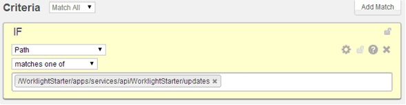

## 개요
{: #overview }
{{ site.data.keys.mf_server }} 대신 CDN(Content Delivery Network)에서 처리되도록 직접 업데이트 요청을 구성할 수 있습니다.

#### CDN 사용 시 장점
{: #advantages-of-using-a-cdn }
{{ site.data.keys.mf_server }} 대신 CDN을 사용하여 직접 업데이트 요청을 처리하는 경우 다음 장점이 있습니다.

* {{ site.data.keys.mf_server }}에서 네트워크 오버헤드를 제거합니다.
* {{ site.data.keys.mf_server }}에서 요청 처리 시 한계인 초당 250MB보다 전송률이 늘어납니다.
* 지리적 위치에 관계없이 모든 사용자에게 보다 일관된 직업 업데이트 경험을 제공합니다.

#### 일반 요구사항
{: #general-requirements }
CDN에서 직접 업데이트 요청을 처리하려면 구성이 다음 조건을 준수하는지 확인하십시오.

* CDN이 {{ site.data.keys.mf_server }} 앞(또는 필요한 경우 다른 역방향 프록시 앞)의 역방향 프록시여야 합니다.
* 개발 환경에서 애플리케이션을 빌드하는 경우 {{ site.data.keys.mf_server }}의 호스트 및 포트 대신 CDN 호스트 및 포트로 대상 서버를 설정하십시오. 예를 들어 {{ site.data.keys.mf_cli }} 명령 mfpdev server add를 실행하는 경우 CDN 호스트 및 포트를 제공하십시오.
* CDN 관리 패널에서 다음 직접 업데이트 URL을 캐시하도록 표시하여 CDN이 직접 업데이트 요청을 제외한 모든 요청을 {{ site.data.keys.mf_server }}에 전달하도록 해야 합니다. 직접 업데이트 요청의 경우 CDN은 컨텐츠를 확보했는지 여부를 판별합니다. 컨텐츠를 확보한 경우 {{ site.data.keys.mf_server }}로 이동하지 않고 컨텐츠를 리턴하며, 컨텐츠를 확보하지 않은 경우에는 {{ site.data.keys.mf_server }}로 이동하고 직접 업데이트 아카이브(.zip 파일)를 가져와서 해당 특정 URL에 대한 다음 요청에 사용하도록 저장합니다. {{ site.data.keys.product_full }} v8.0을 사용하여 빌드된 애플리케이션의 경우 직접 업데이트 URL은 `PROTOCOL://DOMAIN:PORT/CONTEXT_PATH/api/directupdate/VERSION/CHECKSUM/TYPE`입니다.
`PROTOCOL://DOMAIN:PORT/CONTEXT_PATH` 접두부는 모든 런타임 요청에 대해 같습니다. 예: http://my.cdn.com:9080/mfp/api/directupdate/0.0.1/742914155/full?appId=com.ibm.DirectUpdateTestApp&clientPlatform=android

예제에는 요청의 일부이기도 한 추가 요청 매개변수가 있습니다.

* CDN이 요청 매개변수의 캐싱을 허용해야 합니다. 두 개의 서로 다른 직접 업데이트 아카이브는 요청 매개변수만 다를 수 있습니다.
* CDN은 직접 업데이트 응답에서 TTL을 지원해야 합니다. 이는 동일한 버전에 대해 다중 직접 업데이트를 지원하는 데 필요합니다.
* CDN은 서버-클라이언트 프로토콜에서 사용되는 HTTP 헤더를 변경하거나 제거하지 않아야 합니다.

## 구성 예제
{: #example-configuration }
이 예제는 직접 업데이트 아카이브를 캐시하는 Akamai CDN 구성 사용을 기반으로 합니다. 다음 태스크는 네트워크 관리자, {{ site.data.keys.product_adj }} 관리자 및 Akamai 관리자에 의해 완료됩니다.

#### 네트워크 관리자
{: #network-administrator }
{{ site.data.keys.mf_server }}에 대한 DNS에 다른 도메인을 작성하십시오. 예를 들어 서버 도메인이 yourcompany.com인 경우 `cdn.yourcompany.com`과 같은 추가 도메인을 작성해야 합니다.
새 `cdn.yourcompany.com` 도메인의 DNS에서 `CNAME`을 Akamai가 제공하는 도메인 이름으로 설정하십시오. 예를 들어 `yourcompany.com.akamai.net`입니다.

#### {{ site.data.keys.product_adj }} 관리자
{: #mobilefirst-administrator }
새 cdn.yourcompany.com 도메인을 {{ site.data.keys.product_adj }} 애플리케이션의 {{ site.data.keys.mf_server }} URL로 설정하십시오. 예를 들어, Ant 빌더 태스크의 경우 특성은 다음과 같습니다. `<property name="wl.server" value="http://cdn.yourcompany.com/${contextPath}/"/>`.

#### Akamai 관리자
{: #akamai-administrator }
1. Akamai 특성 관리자를 열고 **host name** 특성을 새 도메인의 값으로 설정하십시오.

    
    
2. 기본 규칙 탭에서 원래 {{ site.data.keys.mf_server }} 호스트 및 포트를 구성하고 **사용자 정의 전달 호스트 헤더** 값을 새로 작성된 도메인으로 설정하십시오.

    
    
3. **캐싱 옵션** 목록에서 **저장소 없음**을 선택하십시오.

    

4. **정적 컨텐츠 구성** 탭에서 애플리케이션의 직접 업데이트 URL에 따라 일치하는 기준을 구성하십시오. 예를 들어 `If Path matches one of direct_update_URL`이 명시된 조건을 작성하십시오.

    
    
5. 직접 업데이트 URL을 캐시하고 TTL을 설정하려면 다음 값과 유사한 값을 설정하여 캐싱 동작을 구성하십시오.

    |필드 |값 |
    |-------|-------|
    |캐싱 옵션 |캐시 |
    |시간이 경과된(stale) 오브젝트의 재평가 강제 실행 |유효성 검증할 수 없는 경우 시간 경과됨(stale)으로 처리 |
    |최대 시간 |3분 |

    

6. 캐시 키의 모든 요청 매개변수를 사용하도록 캐시 키 동작을 구성하십시오(여러 애플리케이션 또는 버전에 대한 여러 직접 업데이트 아카이브를 캐시하려면 이를 수행해야 합니다). 예를 들어 **동작** 목록에서 `Include all parameters (preserve order from request)`를 선택하십시오.

    

