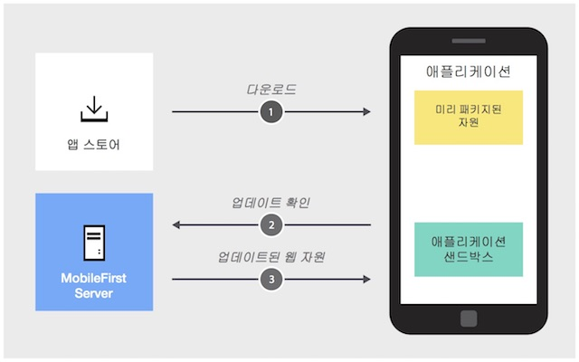

<!-- NLS_CHARSET=UTF-8 -->
## 개요
{: #overview }
직접 업데이트를 사용하여 새로 고친 웹 자원(예: 변경되거나 수정되거나 새로운 애플리케이션 로직(JavaScript), HTML, CSS 또는 이미지)으로 Cordova 애플리케이션을 "OTA(Over-The-Air)"로 업데이트할 수 있습니다. 그러므로 조직은 일반 사용자가 항상 최신 버전의 애플리케이션을 사용하는지 확인할 수 있습니다.

애플리케이션을 업데이트하려면 {{ site.data.keys.mf_cli }}를 사용하거나 생성된 아카이브 파일을 배치하여 애플리케이션의 업데이트된 웹 자원을 패키지하고 {{ site.data.keys.mf_server }}로 업로드해야 합니다. 이를 완료하면 직접 업데이트가 자동으로 활성화됩니다. 활성화된 직접 업데이트는 보호된 자원에 대한 모든 요청에서 강제 실행됩니다.

**지원되는 Cordova 플랫폼**  
직접 업데이트는 Cordova iOS 및 Cordova Android 플랫폼에서 지원됩니다.

**개발, 테스트 및 프로덕션에서 직접 업데이트**  
개발 및 테스트 용도의 경우 개발자는 일반적으로 단순히 개발 서버에 아카이브를 업로드하여 직접 업데이트를 사용합니다. 이 프로세스는 쉽게 구현할 수 있지만 그다지 안전하지는 않습니다. 이 단계(Phase)의 경우 임베디드 {{ site.data.keys.product_adj }} 자체 서명된 인증서에서 추출되는 내부 RSA 키 쌍이 사용됩니다.

하지만 활성 프로덕션 또는 프리프로덕션 테스트 단계(Phase)의 경우에는 애플리케이션을 앱 스토어에 공개하기 전에 보안 직접 업데이트를 구현할 것을 적극 권장합니다.
보안 직접 업데이트를 사용하려면 실제 CA 서명 서버 인증서에서 추출된 RSA 키 쌍이 필요합니다.

**참고:** 애플리케이션이 공개된 후에 키 저장소 구성을 수정하지 않도록 주의하십시오. 새 공개 키로 애플리케이션을 재구성하고 애플리케이션을 다시 공개하지 않는 경우 다운로드된 업데이트는 더 이상 인증될 수 없습니다. 이 두 단계를 수행하지 않으면 클라이언트에서 직접 업데이트가 실패합니다.

> [보안 직접 업데이트](#secure-direct-update)에서 자세히 알아보십시오.

**직접 업데이트 데이터 전송률**  
최적의 조건에서 단일 {{ site.data.keys.mf_server }}는 초당 250MB의 속도로 데이터를 클라이언트에 푸시할 수 있습니다. 더 빠른 속도가 필요한 경우 클러스터 또는 CDN 서비스를 고려하십시오.   

> [CDN에서 직접 업데이트 요청 처리](cdn-support)에서 자세히 알아보십시오.

### 참고
{: #notes }

* 직접 업데이트는 애플리케이션의 웹 자원만 업데이트합니다. 고유 자원을 업데이트하려면 각 앱 스토어에 새 애플리케이션 버전을 제출해야 합니다.
* 직접 업데이트 기능을 사용하고 [웹 자원 체크섬](../cordova-apps/securing-apps/#enabling-the-web-resources-checksum-feature) 기능이 사용으로 설정되어 있으면 각 직접 업데이트로 새 체크섬 기본이 설정됩니다.
* 수정팩을 사용하여 {{ site.data.keys.mf_server }}를 업그레이드한 경우 직접 업데이트를 계속 정상적으로 수행합니다. 하지만 최근에 빌드된 직접 업데이트 아카이브(.zip 파일)가 업로드되는 경우 이전 클라이언트에 대한 업데이트가 정지될 수 있습니다.
이는 아카이브에 cordova-plugin-mfp 플러그인 버전이 포함되어 있기 때문입니다. 서버는 해당 아카이브를 모바일 클라이언트에 제공하기 전에 클라이언트 버전과 플러그인 버전을 비교합니다. 두 버전이 충분히 비슷하면(즉 가장 중요한 3가지 숫자가 동일한 경우) 직접 업데이트가 정상적으로 수행됩니다. 그렇지 않은 경우 {{ site.data.keys.mf_server }}는 업데이트를 자동으로 건너뜁니다. 버전 불일치에 대한 한 가지 솔루션은 원래 Cordova 프로젝트에 있는 버전과 동일한 버전인 cordova-plugin-mfp를 다운로드하고 직접 업데이트 아카이브를 재생성하는 것입니다.

#### 다음으로 이동:
{: #jump-to}

- [직접 업데이트의 작업 방식](#how-direct-update-works)
- [업데이트된 웹 자원 작성 및 배치](#creating-and-deploying-updated-web-resources)
- [사용자 경험](#user-experience)
- [직접 업데이트 UI 사용자 정의](#customizing-the-direct-update-ui)
- [델타 및 전체 직접 업데이트](#delta-and-full-direct-update)
- [보안 직접 업데이트](#secure-direct-update)
- [샘플 애플리케이션](#sample-application)

## 직접 업데이트의 작업 방식
{: #how-direct-update-works }
애플리케이션 웹 자원은 오프라인에서 우선 사용할 수 있도록 초기에 애플리케이션과 함께 패키지되어 있습니다. 이후 애플리케이션은 {{ site.data.keys.mf_server }}에 대한 모든 요청에서 업데이트가 있는지 확인합니다.

> <span class="glyphicon glyphicon-exclamation-sign" aria-hidden="true"></span> **참고:** 직접 업데이트를 수행하면 60분 후에 다시 확인됩니다.

직접 업데이트를 수행한 후에는 애플리케이션에서 미리 패키지된 웹 자원을 더 이상 사용하지 않습니다. 대신 애플리케이션의 샌드박스에서 다운로드된 웹 자원을 사용합니다. 디바이스에서 애플리케이션의 캐시가 지워지면 원래 패키지된 자원이 다시 사용됩니다.



### 버전화
{: #versioning }
직접 업데이트는 특정 버전에만 적용됩니다. 즉 특정 애플리케이션 버전 2.0에 대해 생성된 업데이트를 동일한 애플리케이션의 다른 버전에 적용할 수 없습니다.

## 업데이트된 웹 자원 작성 및 배치
{: #creating-and-deploying-updated-web-resources }
새 웹 자원에 대한 작업(예: 버그 수정 또는 경미한 변경 등)이 완료되면 업데이트된 웹 자원을 패키지하고 {{ site.data.keys.mf_server }}에 업로드해야 합니다.

1. **명령행** 창을 열고 Cordova 프로젝트의 루트로 이동하십시오.
2. `mfpdev app webupdate` 명령을 실행하십시오.

`mfpdev app webupdate` 명령을 실행하면 업데이트된 웹 자원을 .zip 파일로 패키지하고 개발자 워크스테이션에서 실행되는 기본 {{ site.data.keys.mf_server }}에 업로드합니다. 패키지된 웹 자원은 **[cordova-project-root-folder]/mobilefirst/** 폴더에 있습니다.

대체:

* .zip 파일을 빌드하고 다른 {{ site.data.keys.mf_server }}: `mfpdev app webupdate [server-name][runtime-name]`에 업로드하십시오. 예:  

  ```bash
  mfpdev app webupdate myQAServer MyBankApps
  ```

* 이전에 생성된 .zip 파일 `mfpdev app webupdate [server-name][runtime-name] --file [path-to-packaged-web-resources]`을 업로드하십시오. 예:  

  ```bash
  mfpdev app webupdate myQAServer MyBankApps --file mobilefirst/ios/com.mfp.myBankApp-1.0.1.zip
  ```

* 패키지된 웹 자원을 {{ site.data.keys.mf_server }}에 수동으로 업로드하십시오.
 1. 업로드하지 않고 .zip 파일을 빌드하십시오.

    ```bash
    mfpdev app webupdate --build
    ```
 2. {{ site.data.keys.mf_console }}을 로드하고 애플리케이션 항목을 클릭하십시오.
 3. **웹 자원 파일 업로드**를 클릭하고 패키지된 웹 자원을 업로드하십시오.

    

> 자세히 알아보려면 `mfpdev help app webupdate` 명령을 실행하십시오.

## 사용자 경험
{: #user-experience }
기본적으로 직접 업데이트를 수신한 후에 대화 상자가 표시되고 사용자에게 업데이트 프로세스를 시작할지 여부를 묻습니다. 사용자가 승인하면 진행 표시줄 대화 상자가 표시되고 웹 자원이 다운로드됩니다. 애플리케이션은 업데이트가 완료된 후에 자동으로 다시 로드됩니다.


## 직접 업데이트 UI 사용자 정의
{: #customizing-the-direct-update-ui }
일반 사용자에게 표시되는 기본 직접 업데이트 UI를 사용자 정의할 수 있습니다.   
**index.js**에서 `wlCommonInit()` 함수에 다음을 추가하십시오.

```javascript
wl_DirectUpdateChallengeHandler.handleDirectUpdate = function(directUpdateData, directUpdateContext) {
    // Implement custom Direct Update logic
};
```

- `directUpdateData` - {{ site.data.keys.mf_server }}에서 다운로드되는 업데이트 패키지의 파일 크기(바이트)를 표시하는 `downloadSize` 특성이 포함된 JSON 오브젝트입니다.
- `directUpdateContext` - 직접 업데이트 플로우를 시작 및 중지하는 `.start()` 및 `.stop()` 함수를 공개하는 JavaScript 오브젝트입니다.

애플리케이션의 웹 자원보다 {{ site.data.keys.mf_server }}의 웹 자원이 최신인 경우 서버 응답에 직접 업데이트 인증 확인 데이터가 추가됩니다. {{ site.data.keys.product_adj }} 클라이언트 측 프레임워크는 이 직접 업데이트 인증 확인을 발견하는 경우 `wl_directUpdateChallengeHandler.handleDirectUpdate` 함수를 호출합니다.

이 함수는 기본 직접 업데이트 디자인(직접 업데이트를 사용할 수 있는 경우 표시되는 기본 메시지 대화 상자 및 직접 업데이트 프로세스가 시작되면 표시되는 기본 진행상태 화면)을 제공합니다. 사용자 정의 직접 업데이트 사용자 인터페이스 동작을 구현하거나 이 함수를 대체하고 고유 로직을 구현하여 직접 업데이트 대화 상자를 사용자 정의할 수 있습니다.


아래 예제 코드에서 `handleDirectUpdate` 함수는 직접 업데이트 대화 상자에서 사용자 정의 메시지를 구현합니다. Cordova 프로젝트의 **www/js/index.js** 파일에 이 코드를 추가하십시오.   
사용자 정의 직접 업데이트 UI의 추가 예제:

- 써드파티 JavaScript 프레임워크(예: Dojo 또는 jQuery Mobile, Ionic 등)를 사용하여 작성되는 대화 상자
- Cordova 플러그인 실행을 통한 완전한 고유 UI
- 옵션과 함께 사용자에게 표시되는 대체 HTML
- 기타

```javascript
wl_directUpdateChallengeHandler.handleDirectUpdate = function(directUpdateData, directUpdateContext) {        
    navigator.notification.confirm(  // Creates a dialog.
        'Custom dialog body text',
        // Handle dialog buttons.
          directUpdateContext.start();
        },
        'Custom dialog title text',
        ['Update']
    );
};
```

사용자가 대화 상자 단추를 클릭할 때마다 `directUpdateContext.start()` 메소드를 실행하여 직접 업데이트 프로세스를 시작할 수 있습니다. 이전 버전의 {{ site.data.keys.mf_server }}에 포함된 것과 비슷한 기본 진행상태 화면이 표시됩니다.

이 메소드는 다음 유형의 호출을 지원합니다.

* 지정된 매개변수가 없으면 {{ site.data.keys.mf_server }}는 기본 진행상태 화면을 사용합니다.
* 리스너 함수(예: `directUpdateContext.start(directUpdateCustomListener)`가 제공되면 프로세스가 리스너에 라이프사이클 이벤트를 전송하는 동안 직접 업데이트 프로세스가 백그라운드에서 실행됩니다. 사용자 정의 리스너는 다음 메소드를 구현해야 합니다.

```javascript
var  directUpdateCustomListener  = {
    onStart : function ( totalSize ){ },
    onProgress : function ( status , totalSize , completedSize ){ },
    onFinish : function ( status ){ }
};
```

리스너 메소드는 다음 규칙에 따라 직접 업데이트 프로세스 중에 시작됩니다.
* `onStart`는 업데이트 파일 크기가 포함된 `totalSize` 매개변수로 호출됩니다.
* `onProgress`는 `DOWNLOAD_IN_PROGRESS`, `totalSize` 및 `completedSize`(현재까지 다운로드된 볼륨) 상태에서 여러 번 호출됩니다.
* `onProgress`는 `UNZIP_IN_PROGRESS` 상태에서 호출됩니다.
* `onFinish`는 다음 최종 상태 코드 중 하나로 호출됩니다.

| 상태 코드 | 설명 |
|-------------|-------------|
| `SUCCESS` | 직접 업데이트가 오류 없이 완료되었습니다. |
| `CANCELED` | 직접 업데이트가 취소되었습니다(예를 들어 `stop()` 메소드가 호출되어서). |
| `FAILURE_NETWORK_PROBLEM` | 업데이트 중에 네트워크 연결에 문제점이 발생했습니다. |
| `FAILURE_DOWNLOADING` | 파일이 완전히 다운로드되지 않았습니다. |
| `FAILURE_NOT_ENOUGH_SPACE` | 디바이스에 업데이트 파일을 다운로드하고 언팩할 공간이 충분하지 않습니다. |
| `FAILURE_UNZIPPING` | 업데이트 파일을 언팩하는 중에 문제점이 발생했습니다. |
| `FAILURE_ALREADY_IN_PROGRESS` | 직접 업데이트가 이미 실행 중인 동안 시작 메소드가 호출되었습니다. |
| `FAILURE_INTEGRITY` | 업데이트 파일의 신뢰성을 확인할 수 없습니다. |
| `FAILURE_UNKNOWN` | 예기치 않은 내부 오류가 발생했습니다. |

사용자 정의 직접 업데이트 리스너를 구현하는 경우 직접 업데이트 프로세스가 완료되고 `onFinish()` 메소드가 호출되었을 때 앱이 다시 로드되는지 확인해야 합니다. 또한 직접 업데이트 프로세스가 올바르게 완료되지 못하면 `wl_directUpdateChalengeHandler.submitFailure()`를 호출해야 합니다.

다음 예제는 사용자 정의 직접 업데이트 리스너 구현을 보여줍니다.

```javascript
var directUpdateCustomListener = {
  onStart: function(totalSize){
    //show custom progress dialog
  },
  onProgress: function(status,totalSize,completedSize){
    //update custom progress dialog
  },
  onFinish: function(status){

    if (status == 'SUCCESS'){
      //show success message
      WL.Client.reloadApp();
    }
    else {
      //show custom error message

      //submitFailure must be called is case of error
      wl_directUpdateChallengeHandler.submitFailure();
    }
  }
};

wl_directUpdateChallengeHandler.handleDirectUpdate = function(directUpdateData, directUpdateContext){

  WL.SimpleDialog.show('Update Avalible', 'Press update button to download version 2.0', [{
    text : 'update',
    handler : function() {
      directUpdateContext.start(directUpdateCustomListener);
    }
  }]);
};
```

### 시나리오: UI가 없는 직접 업데이트 실행
{: scenario-running-ui-less-direct-updates }
{{ site.data.keys.product_full }}은 애플리케이션이 포그라운드에 있을 때 UI가 없는 직접 업데이트를 지원합니다.

UI가 없는 직접 업데이트를 실행하려면 `directUpdateCustomListener`를 구현하십시오. `onStart` 및 `onProgress` 메소드에 빈 함수 구현을 제공하십시오. 구현이 비어 있으므로 직접 업데이트 프로세스가 백그라운드에서 실행됩니다.

직접 업데이트 프로세스를 완료하려면 애플리케이션을 다시 로드해야 합니다. 다음 옵션을 사용할 수 있습니다.
* `onFinish` 메소드도 비어 있을 수 있습니다. 이 경우 직접 업데이트는 애플리케이션이 다시 시작된 후에 적용됩니다.
* 사용자에게 애플리케이션을 다시 시작하도록 알리거나 요구하는 사용자 정의 대화 상자를 구현할 수 있습니다(다음 예제 참조).
* `onFinish` 메소드는 `WL.Client.reloadApp()`을 호출하여 애플리케이션 다시 로드를 강제 실행할 수 있습니다.

다음은 `directUpdateCustomListener` 구현의 예제입니다.

```javascript
var directUpdateCustomListener = {
  onStart: function(totalSize){
  },
  onProgress: function(status,totalSize,completeSize){
  },
  onFinish: function(status){
    WL.SimpleDialog.show('New Update Available', 'Press reload button to update to new version', [ {
      text : WL.ClientMessages.reload,
      handler : WL.Client.reloadApp
    }]);
  }
};
```

`wl_directUpdateChallengeHandler.handleDirectUpdate` 함수를 구현하십시오. 매개변수로 작성한 `directUpdateCustomListener` 구현을 함수에 전달하십시오. `directUpdateContext.start(directUpdateCustomListener`)가 호출되는지 확인하십시오. 다음은 `wl_directUpdateChallengeHandler.handleDirectUpdate` 구현의 예입니다.

```javascript
wl_directUpdateChallengeHandler.handleDirectUpdate = function(directUpdateData, directUpdateContext){

  directUpdateContext.start(directUpdateCustomListener);
};
```

**참고:** 애플리케이션을 백그라운드로 보내면 직접 업데이트 프로세스가 일시중단됩니다.

### 시나리오: 직접 업데이트 실패 처리
{: #scenario-handling-a-direct-update-failure }
이 시나리오는 예를 들어 연결 해제로 인해 발생할 수 있는 직접 업데이트 실패를 처리하는 방법을 보여줍니다. 이 시나리오에서는 사용자가 앱을 사용할 수 없습니다(오프라인 모드도 포함). 사용자에게 다시 시도하는 옵션을 제공하는 대화 상자가 표시됩니다.

직접 업데이트 프로세스가 실패하는 경우 이후에 사용할 수 있도록 직접 업데이트 컨텍스트를 저장하는 글로벌 변수를 작성하십시오. 예:

```javascript
var savedDirectUpdateContext;
```

직접 업데이트 인증 확인 핸들러를 구현하십시오. 여기에 직접 업데이트 컨텍스트를 저장하십시오. 예:

```javascript
wl_directUpdateChallengeHandler.handleDirectUpdate = function(directUpdateData, directUpdateContext){

  savedDirectUpdateContext = directUpdateContext; // save direct update context

  var downloadSizeInMB = (directUpdateData.downloadSize / 1048576).toFixed(1).replace(".", WL.App.getDecimalSeparator());
  var directUpdateMsg = WL.Utils.formatString(WL.ClientMessages.directUpdateNotificationMessage, downloadSizeInMB);

  WL.SimpleDialog.show(WL.ClientMessages.directUpdateNotificationTitle, directUpdateMsg, [{
    text : WL.ClientMessages.update,
    handler : function() {
      directUpdateContext.start(directUpdateCustomListener);
    }
  }]);
};
```

직접 업데이트 컨텍스트를 사용하여 직접 업데이트 프로세스를 시작하는 함수를 작성하십시오. 예:

```javascript
restartDirectUpdate = function () {
  savedDirectUpdateContext.start(directUpdateCustomListener); // use saved direct update context to restart direct update
};
```

`directUpdateCustomListener`를 구현하십시오. `onFinish` 메소드에 상태 확인을 추가하십시오. 상태가 "FAILURE"로 시작하는 경우 "다시 시도" 옵션을 사용하여 모달 전용 대화 상자를 여십시오. 예:

```javascript
var directUpdateCustomListener = {
  onStart: function(totalSize){
    alert('onStart: totalSize = ' + totalSize + 'Byte');
  },
  onProgress: function(status,totalSize,completeSize){
    alert('onProgress: status = ' + status + ' completeSize = ' + completeSize + 'Byte');
  },
  onFinish: function(status){
    alert('onFinish: status = ' + status);
    var pos = status.indexOf("FAILURE");
    if (pos > -1) {
      WL.SimpleDialog.show('Update Failed', 'Press try again button', [ {
        text : "Try Again",
        handler : restartDirectUpdate // restart direct update
      }]);
    }
  }
};
```

**다시 시도** 단추를 클릭하면 애플리케이션에서 직접 업데이트 프로세스를 다시 시작합니다.

## 델타 및 전체 직접 업데이트
{: #delta-and-full-direct-update }
델타 직접 업데이트를 사용하면 애플리케이션이 애플리케이션의 전체 웹 자원 대신 마지막 업데이트 이후에 변경된 파일만 다운로드할 수 있습니다. 이는 다운로드 시간을 줄이고 대역폭을 유지하며 전반적인 사용자 경험을 개선합니다.

> <span class="glyphicon glyphicon-exclamation-sign" aria-hidden="true"></span> **중요:** **델타 업데이트**는 클라이언트 애플리케이션의 웹 자원이 서버에 현재 배치된 애플리케이션보다 한 버전 이전인 경우에만 수행할 수 있습니다. 현재 배치된 애플리케이션 버전보다 여러 버전 이전인 클라이언트 애플리케이션(즉 클라이언트 애플리케이션이 업데이트된 이후에 애플리케이션이 두 번 이상 서버에 배치됨)은 **전체 업데이트**(즉 전체 웹 자원이 다운로드되고 업데이트됨)를 수신합니다.

## 보안 직접 업데이트
{: #secure-direct-update}

기본적으로 사용 안함으로 설정되는 보안 직접 업데이트를 사용하는 경우 써드파티 공격자가 {{ site.data.keys.mf_server }} 또는 CDN(Content Delivery Network)에서 클라이언트 애플리케이션으로 전송되는 웹 자원을 변경하는 것을 방지합니다.

**직접 업데이트 신뢰성을 사용하려면 다음을 수행하십시오.**  
선호하는 도구를 사용하여 {{ site.data.keys.mf_server }} 키 저장소에서 공개 키를 추출하고 base64로 변환하십시오.   
이렇게 하여 생성되는 값은 아래 지시된 대로 사용되어야 합니다.

1. **명령행** 창을 열고 Cordova 프로젝트의 루트로 이동하십시오.
2. `mfpdev app config` 명령을 실행하고 "직접 업데이트 신뢰성 공개 키" 옵션을 선택하십시오.
3. 공개 키를 제공하고 확인하십시오.

향후 클라이언트 애플리케이션에 대한 직접 업데이트 전달이 직접 업데이트 신뢰성에 의해 보호됩니다.

> 업데이트된 키 저장소 파일로 애플리케이션 서버를 구성하려면 [보안 직접 업데이트 구현](secure-direct-update)을 참조하십시오.

## 샘플 애플리케이션
{: #sample-application }
Cordova 프로젝트를 [클릭하여 다운로드](https://github.com/MobileFirst-Platform-Developer-Center/CustomDirectUpdate/tree/release80)하십시오.   

### 샘플 사용법
{: #sample-usage }
샘플의 README.md 파일에 있는 지시사항을 따르십시오.
