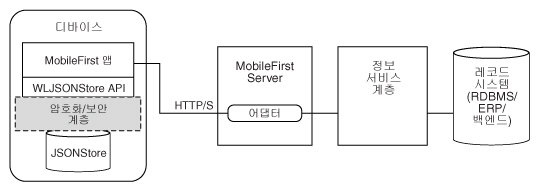

<!-- NLS_CHARSET=UTF-8 -->
## 개요
{: #overview }
{{ site.data.keys.product_full }} **JSONStore**는 경량의 문서 중심 스토리지 시스템을 제공하는 선택적 클라이언트 측 API입니다. JSONStore는 **JSON 문서**의 지속적 스토리지를 사용합니다. 애플리케이션에서 실행 중인 디바이스가 오프라인 상태인 경우에도 JSONStore에서 애플리케이션에 포함된 문서를 사용할 수 있습니다. 이러한 항상 사용 가능한 지속적 스토리지는 예를 들어 디바이스에서 사용 가능한 네트워크 연결이 없을 때 문서에 대한 액세스를 제공하므로 유용할 수 있습니다.



이 문서에서는 JSONStore에 대한 설명에서 개발자에게 익숙한 관계형 데이터베이스 용어를 자주 사용합니다. 하지만 관계형 데이터베이스 및 JSONStore 사이에는 여러 차이점이 있습니다. 예를 들어 관계형 데이터베이스에 데이터를 저장하는 데 사용되는 엄격한 스키마는 JSONStore의 접근 방식과 다릅니다. JSONStore의 경우 JSON 컨텐츠를 저장하고 검색해야 하는 컨텐츠의 색인을 작성할 수 있습니다.

#### 주요 기능
{: #key-features }
* 효율적인 검색에 필요한 데이터의 색인 작성
* 저장된 데이터의 로컬로만 수행된 변경사항 추적에 사용되는 메커니즘
* 다중 사용자에 대한 지원
* 저장된 데이터의 AES 256 암호화는 보안 및 기밀성을 제공합니다. 단일 디바이스에 둘 이상의 사용자가 있는 경우 비밀번호 보호를 사용하여 사용자별로 보호를 세그먼트화할 수 있습니다.

하나의 저장소에 여러 콜렉션이 있을 수 있으며, 각 콜렉션에는 여러 문서가 포함될 수 있습니다. 또한 다중 저장소가 포함된 {{ site.data.keys.product_adj }} 애플리케이션이 있을 수도 있습니다. 해당 정보는 JSONStore 다중 사용자 지원을 참조하십시오.

#### 지원 레벨
{: #support-level }
* JSONStore는 고유 iOS 및 Android 애플리케이션에서 지원됩니다(고유 Windows(Universal 및 UWP)의 경우 지원되지 않음).
* JSONStore는 Cordova iOS, Android 및 Windows(Universal 및 UWP) 애플리케이션에서 지원됩니다.

#### 다음으로 이동
{: #jump-to }
* [일반 JSONStore 용어](#general-jsonstore-terminology)
* [기능 테이블](#features-table)
* [다중 사용자 지원](#multiple-user-support)
* [보안](#security)
* [성능](#performance)
* [동시성](#concurrency)
* [분석](#analytics)
* [외부 데이터 작업](#working-with-external-data)
* [문제점 해결](#troubleshooting)
* [API 사용법](#api-usage)

## 일반 JSONStore 용어
{: #general-jsonstore-terminology }
### 문서
{: #document }
문서는 JSONStore의 기본 빌딩 블록입니다.

JSONStore 문서는 자동으로 생성된 ID(`_id`) 및 JSON 데이터가 있는 JSON 오브젝트입니다. 이는 데이터베이스 용어의 레코드 또는 행과 유사합니다. `_id`의 값은 항상 특정 콜렉션 내의 고유 정수입니다. `JSONStoreInstance` 클래스에서 `add`, `replace` 및 `remove`와 같은 일부 함수는 문서/오브젝트 배열을 사용합니다. 이 메소드는 한 번에 여러 문서/오브젝트에 대한 조작을 수행하는데 유용합니다.

**단일 문서**  

```javascript
var doc = { _id: 1, json: {name: 'carlos', age: 99} };
```

**문서 배열**

```javascript
var docs = [
  { _id: 1, json: {name: 'carlos', age: 99} },
  { _id: 2, json: {name: 'tim', age: 100} }
]
```

### 콜렉션
{: #collection }
JSONStore 콜렉션은 데이터베이스 용어의 테이블과 유사합니다.  
아래 코드 예제는 디스크에 문서가 저장되는 방식은 아니지만 상위 레벨에서 콜렉션이 표시되는 방식을 시각화하는 데 좋은 방법입니다.

```javascript
[
    { _id: 1, json: {name: 'carlos', age: 99} },
    { _id: 2, json: {name: 'tim', age: 100} }
]
```

### 저장소
{: #store }
저장소는 하나 이상의 콜렉션이 포함된 지속적 JSONStore 파일입니다.  
저장소는 데이터베이스 용어의 관계형 데이터베이스와 유사합니다. 저장소를 JSONStore라고도 합니다.

### 검색 필드
{: #search-fields }
검색 필드는 키/값 쌍입니다.  
검색 필드는 빠르게 검색되도록 색인 작성된 키로, 데이터베이스 용어의 열 필드 또는 속성과 유사합니다.

추가 검색 필드는 색인이 작성되지만 저장되는 JSON 데이터의 일부가 아닌 키입니다. 이러한 필드는 JSON 콜렉션에서 값의 색인이 작성되어 보다 빠르게 검색하는 데 사용될 수 있는 키를 정의합니다.

올바른 데이터 유형은 문자열, 부울, 숫자 및 정수입니다. 이 유형은 유일한 유형 힌트로, 유형 유효성 검증이 없습니다. 또한 이러한 유형은 색인 작성 가능 필드가 저장되는 방법을 판별합니다. 예를 들어 `{age: 'number'}`는 1을 1.0으로 색인화하고 `{age: 'integer'}`는 1을 1로 색인화합니다.

**검색 필드 및 추가 검색 필드**

```javascript
var searchField = {name: 'string', age: 'integer'};
var additionalSearchField = {key: 'string'};
```

오브젝트가 아닌 오브젝트 내의 키만 색인을 작성할 수 있습니다. 배열은 패스 스루(pass-through) 방식으로 처리됩니다. 즉 배열 또는 배열의 특정 색인(arr[n])에 대한 색인을 작성할 수는 없지만 배열 내의 오브젝트에 대한 색인을 작성할 수는 있습니다.

**배열 내의 값 색인 작성**

```javascript

var searchFields = {
    'people.name' : 'string', // matches carlos and tim on myObject
    'people.age' : 'integer' // matches 99 and 100 on myObject
};

var myObject = { 
    people : [ 
        {name: 'carlos', age: 99}, 
        {name: 'tim', age: 100}
    ] 
};
```

### 조회
{: #queries }
조회는 검색 필드 또는 추가 검색 필드를 사용하여 문서를 찾는 오브젝트입니다.  
다음 예제는 이름 검색 필드가 문자열 유형이고 연령 검색 필드가 정수 유형임을 가정합니다.

**`이름`이 `carlos`와 일치하는 문서 찾기**

```javascript
var query1 = {name: 'carlos'};
```

**`이름`이 `carlos`와 일치하고 `나이`가 `99`인 문서 찾기**

```javascript
var query2 = {name: 'carlos', age: 99};
```

### 조회 파트
{: #query-parts }
조회 파트는 추가 고급 검색을 빌드하는 데 사용됩니다. 일부 JSONStore 조작(예: `find` 또는 `count`의 일부 버전)에는 조회 파트가 사용됩니다. 조회 파트 내의 모든 사항은 `AND` 문으로 결합되지만 조회 파트 자체는 `OR` 문으로 결합됩니다. 조회 파트 내의 모든 사항이 **true**인 경우에만 검색 기준에서 일치사항을 리턴합니다. 둘 이상의 조회 파트를 사용하여 하나 이상의 조회 파트를 충족하는 일치사항을 검색할 수 있습니다.

최상위 레벨 검색 필드에서만 작동하는 조회 파트로 찾으십시오. 예: `name`(`name.first`는 아님). 모든 검색 필드가 최상위 레벨인 여러 콜렉션을 사용하여 이를 처리하십시오. 최상위 레벨이 아닌 검색 필드에서 작업하는 조회 파트 조작은 `equal`, `notEqual`, `like`, `notLike`, `rightLike`, `notRightLike`, `leftLike` 및 `notLeftLike`입니다. 최상위 레벨이 아닌 검색 필드를 사용하는 경우 동작이 판별되지 않습니다.

## 기능 테이블
{: #features-table }
JSONStore 기능을 다른 데이터 스토리지 기술 및 형식의 해당 기능과 비교하십시오.

JSONStore는 {{ site.data.keys.product_adj }} 플러그인을 사용하는 Cordova 애플리케이션 내에 데이터를 저장하는 데 사용되는 JavaScript API, 고유 iOS 애플리케이션에 대한 Objective-C API 및 고유 Android 애플리케이션에 대한 Java API입니다. 여기에 참조용으로 제공되는 여러 JavaScript 스토리지 기술 간 비교를 통해 JSONStore와 해당 기술이 어떻게 다른지 확인하십시오.

JSONStore은 LocalStorage, 색인이 작성된 DB, Cordova 스토리지 API 및 Cordova 파일 API 등의 기술과 유사합니다. 다음 테이블은 JSONStore에서 제공하는 일부 기능이 다른 기술과 비교하여 어떻게 다른지 보여줍니다. JSONStore 기능은 iOS 및 Android 디바이스와 시뮬레이터에서만 사용 가능합니다.

|기능                                            |JSONStore      |LocalStorage |IndexedDB |Cordova 스토리지 API |Cordova 파일 API |
|----------------------------------------------------|----------------|--------------|-----------|---------------------|------------------|
|Android 지원(Cordova &amp; 고유 애플리케이션)|	     ✔ 	      |✔	    |✔	     |✔	           |✔	      |
|iOS 지원(Cordova & 고유 애플리케이션)	     |	     ✔ 	      |✔	    |✔	     |✔	           |✔	      |
|Windows 8.1 Universal 및 Windows 10 UWP(Cordova 애플리케이션)          |	     ✔ 	      |✔	    |✔	     |        -	           |✔	      |
|데이터 암호화	                                 |	     ✔ 	      |      -	    |     -	     |        -	           |         -	      |
|최대 스토리지	                                 |사용 가능한 공간 |~5MB     |~5MB 	 |사용 가능한 공간	   |사용 가능한 공간  |
|신뢰할 수 있는 스토리지(참고 참조)	                     |	     ✔ 	      |      -	    |     -	     |✔	           |✔	      |
|로컬 변경사항 추적	                     |	     ✔ 	      |      -	    |     -	     |        -	           |         -	      |
|다중 사용자 지원                                 |	     ✔ 	      |      -	    |     -	     |        -	           |         -	      |
|색인화	                                         |	     ✔ 	      |      -	    |✔	     |✔	           |         -	      |
|스토리지 유형	                                 |JSON 문서 |키/값 쌍 |JSON 문서 |관계형(SQL) |문자열     |

**참고:** 신뢰할 수 있는 스토리지는 다음 이벤트 중 하나가 발생하는 경우를 제외하고는 데이터가 삭제되지 않음을 의미합니다.

* 애플리케이션이 디바이스에서 제거됩니다.
* 데이터를 제거하는 메소드 중 하나가 호출됩니다.

## 다중 사용자 지원	
{: #multiple-user-support }
JSONStore를 사용하여 단일 {{ site.data.keys.product_adj }} 애플리케이션에 여러 콜렉션이 포함된 다중 저장소를 작성할 수 있습니다.

init(JavaScript) 또는 open(고유 iOS 및 고유 Android) API는 사용자 이름을 사용하여 옵션 오브젝트를 선택할 수 있습니다. 서로 다른 저장소는 파일 시스템에서 별도의 파일입니다. 사용자 이름은 저장소의 파일 이름으로 사용됩니다. 이러한 별도의 저장소는 보안 및 개인정보 보호정책과 관련된 이유로 서로 다른 비밀번호를 사용하여 암호화할 수 있습니다. closeAll API를 사용하면 모든 콜렉션에 대한 액세스가 제거됩니다. changePassword API를 호출하여 암호화된 저장소의 비밀번호를 변경할 수도 있습니다.

예제 유스 케이스는 여러 직원이 실제 디바이스(예: iPad 또는 Android 태블릿) 및 {{ site.data.keys.product_adj }} 애플리케이션을 공유하는 경우입니다. 또한 직원이 서로 다른 작업교대조에서 근무하고 {{ site.data.keys.product_adj }} 애플리케이션을 사용하는 동안 여러 고객의 개인 데이터를 처리하는 경우 다중 사용자 지원이 유용합니다.

## 보안
{: #security }
암호화를 통해 저장소의 모든 콜렉션을 보호할 수 있습니다.

저장소의 모든 콜렉션을 암호화하려면 `init`(JavaScript) 또는 `open`(고유 iOS 및 고유 Android) API에 비밀번호를 전달하십시오. 비밀번호가 전달되지 않으면 저장소 콜렉션의 문서가 암호화되지 않습니다.

일부 보안 아티팩트(예: salt)는 키 체인(iOS), 공유 환경 설정(Android) 및 신임 정보 보관(Windows Universal 8.1 및 Windows 10 UWP)에 저장됩니다. 저장소는 256비트 AES(Advanced Encryption Standard) 키로 암호화됩니다. 모든 키는 PBKDF2(Password-Based Key Derivation Function 2)로 강화됩니다. 애플리케이션에 대해 데이터 콜렉션을 암호화하도록 선택할 수는 있지만 암호화된 형식 및 일반 텍스트 형식 간에 전환하거나 저장소 내에서 형식을 혼합할 수는 없습니다.

저장소에서 데이터를 보호하는 키는 제공하는 사용자 비밀번호를 기반으로 합니다. 키가 만료되지는 않지만 changePassword API를 호출하여 변경할 수 있습니다.

데이터 보호 키(DPK)는 저장소의 컨텐츠를 복호화하는 데 사용되는 키입니다. 애플리케이션이 설치 제거되더라도 DPK는 iOS 키 체인에 보관됩니다. 키 체인의 키와 JSONStore가 애플리케이션에 배치한 다른 모든 사항을 제거하려면 destroy API를 사용하십시오. 이 프로세스는 암호화된 DPK가 공유 환경 설정에 저장되고 애플리케이션이 설치 제거될 때 지워지므로 Android에는 적용될 수 없습니다.

JSONStore에서 비밀번호를 사용하여 콜렉션을 처음 여는 경우(즉 개발자가 저장소 내의 데이터를 암호화하려는 경우) JSONStore에 랜덤 토큰이 필요합니다. 해당 랜덤 토큰은 클라이언트 또는 서버에서 가져올 수 있습니다.

localKeyGen 키가 JSONStore API의 JavaScript 구현에 존재하고 값이 true인 경우 암호화된 보안 토큰이 로컬로 생성됩니다. 그렇지 않은 경우 토큰은 서버에 접속하여 생성되므로 {{ site.data.keys.mf_server }}에 대한 연결이 필요합니다. 이 토큰은 비밀번호를 사용하여 저장소가 처음으로 열리는 경우에만 필요합니다. 고유 구현(Objective-C 및 Java)에서는 기본적으로 암호화된 보안 토큰을 로컬로 생성합니다. 그렇지 않은 경우 secureRandom 옵션을 통해 전달할 수도 있습니다.

오프라인에서 저장소를 열고 클라이언트를 신뢰하여 랜덤 토큰을 생성하도록 하는 것(보안 정도가 낮음) 또는 연결된 {{ site.data.keys.mf_server }}에 대한 액세스 권한을 사용하여 저장소를 열고 서버를 신뢰하는 것(보안 정도가 높음) 간에 절충됩니다.

### 보안 유틸리티
{: #security-utilities }
{{ site.data.keys.product_adj }} 클라이언트 측 API는 사용자 데이터를 보호하는 데 도움이 되는 일부 보안 유틸리티를 제공합니다. JSON 오브젝트를 보호하려는 경우 JSONStore와 같은 기능이 매우 유용합니다. 그러나 JSONStore 콜렉션에 2진 BLOB을 저장하는 것은 권장하지 않습니다.

대신 파일 시스템에 2진 데이터를 저장하고 파일 경로 및 기타 메타데이터를 JSONStore 콜렉션 내에 저장하십시오. 이미지와 같은 파일을 보호하려면 base64 문자열로 인코딩하고 암호화한 후 디스크에 출력을 쓸 수 있습니다. 데이터를 복호화할 때 JSONStore 콜렉션에서 메타데이터를 찾고 디스크에서 암호화된 데이터를 읽은 후에 저장된 메타데이터를 사용하여 복호화하십시오. 이 메타데이터에는 키, salt, IV(Initialization Vector), 파일 유형, 파일 경로 등이 포함될 수 있습니다.

> [JSONStore 보안 유틸리티](security-utilities)에 대해 자세히 알아보십시오.

### Windows 8.1 Universal 및 Windows 10 UWP 암호화
{: #windows-81-universal-and-windows-10-uwp-encryption }
암호화를 통해 저장소의 모든 콜렉션을 보호할 수 있습니다.

JSONStore는 [SQLCipher](http://sqlcipher.net/)를 기본 데이터베이스 기술로 사용합니다. SQLCipher는 Zetetic에 의해 생성되는 SQLite의 빌드이며, LLC는 데이터베이스에 암호화 계층을 추가합니다.

JSONStore는 모든 플랫폼에서 SQLCipher를 사용합니다. Android 및 iOS에서 Community Edition으로 알려진 무료 SQLCipher 개방형 소스 버전을 사용할 수 있으며, 이는 {{ site.data.keys.product }}에 포함된 JSONStore 버전에 통합됩니다. SQLCipher의 Windows 버전은 상업용 라이센스가 있는 경우에만 사용할 수 있고 {{ site.data.keys.product }}에 의해 직접 재배포될 수 없습니다.

대신 Windows 8 Universal용 JSONStore에는 SQLite가 기본 데이터베이스로 포함되어 있습니다. 이러한 플랫폼에 대해 데이터를 암호화해야 하는 경우 고유 SQLCipher 버전을 얻고 {{ site.data.keys.product }}에 포함된 SQLite 버전과 스왑 아웃해야 합니다.

암호화가 필요하지 않으면 JSONStore는 {{ site.data.keys.product }}의 SQLite 버전을 사용하여 완전히 작동됩니다(암호화 제외).

#### SQLite를 Windows Universal 및 Windows UWP용 SQLCipher로 대체
{: #replacing-sqlite-with-sqlcipher-for-windows-universal-and-windows-uwp }
1. Windows Runtime Commercial Edition용 SQLCipher과 함께 제공되는 Windows Runtime 8.1/10 확장용 SQLCipher를 실행하십시오.
2. 확장 설치가 완료되면 방금 작성된 **sqlite3.dll** 파일의 SQLCipher 버전을 찾으십시오. x86, x64, ARM에 대한 버전이 하나씩 존재합니다.

   ```bash
   C:\Program Files (x86)\Microsoft SDKs\Windows\v8.1\ExtensionSDKs\SQLCipher.WinRT81\3.0.1\Redist\Retail\<platform>
   ```
    
3. {{ site.data.keys.product_adj }} 애플리케이션에 이 파일을 복사하고 대체하십시오.

   ```bash
   <Worklight project name>\apps\<application name>\windows8\native\buildtarget\<platform>
   ```

## 성능
{: #performance }
다음은 JSONStore 성능에 영향을 줄 수 있는 요인입니다.

### 네트워크
{: #network }
* 조작(예: 모든 더티 문서를 어댑터에 전송)을 수행하기 전에 네트워크 연결을 확인하십시오.
* 네트워크를 통해 클라이언트에 전송되는 데이터의 양은 성능에 중대한 영향을 미칩니다. 백엔드 데이터베이스의 모든 사항을 복사하는 대신 애플리케이션에 필요한 데이터만 전송하십시오.
* 어댑터를 사용 중인 경우 compressResponse 플래그를 true로 설정할 것을 고려하십시오. 이렇게 하면 응답이 압축되어 일반적으로 더 적은 대역폭을 사용하고 압축을 사용하지 않을 때보다 전송 시간이 단축됩니다.

### 메모리
{: #memory }
* JavaScript API를 사용하면 JSONStore 문서는 고유(Objective-C, Java 또는 C#) 계층과 JavaScript 계층 간에 문자열로 직렬화 및 역직렬화됩니다. 발생 가능한 메모리 문제를 완화하는 한 가지 방법은 find API를 사용할 때 한계와 오프셋을 사용하는 것입니다. 이렇게 하면 결과에 대해 할당되는 메모리 양을 제한하고 페이지 번호 매기기(페이지당 X개의 결과 수 표시)와 같은 사항을 구현할 수 있습니다.
* 궁극적으로 문자열로 직렬화 및 역직렬화되는 긴 키 이름을 사용하는 대신 이러한 긴 키 이름을 짧은 키 이름으로 맵핑할 것을 고려하십시오(예: `myVeryVeryVerLongKeyName`의 경우 `k` 또는 `key`). 어댑터에서 클라이언트로 전송할 때 긴 키 이름을 짧은 키 이름으로 맵핑하고, 데이터를 백엔드로 다시 전송할 때 짧은 키 이름을 원래의 긴 키 이름으로 맵핑하는 것이 가장 좋습니다.
* 저장소 내 데이터를 여러 콜렉션으로 분할할 것을 고려하십시오. 하나의 큰 문서를 단일 콜렉션에 포함시키는 대신 여러 콜렉션에 작은 문서를 포함시키십시오. 이 고려사항은 데이터가 관련된 정도 및 해당 데이터의 유스 케이스에 따라 다릅니다.
* 오브젝트 배열에 add API를 사용하면 메모리 문제가 발생할 수 있습니다. 이 문제를 완화하려면 한 번에 사용되는 JSON 오브젝트 수를 줄이고 이 메소드를 호출하십시오.
* JavaScript 및 Java에는 가비지 콜렉터가 있는 반면 Objective-C에는 ARC(Automatic Reference Counting)가 있습니다. ARC의 작동을 허용하더라도 완전히 의존하지는 하십시오. 더 이상 사용되지 않는 참조를 무효화하고 프로파일링 도구를 사용하여 예상 시점에 메모리 사용량이 감소하는지 확인하십시오.

### CPU
{: #cpu }
* 색인 작성을 수행하는 add 메소드 호출 시 사용되는 검색 필드 및 추가 검색 필드의 양은 성능에 영향을 줍니다. find 메소드에 대한 조회에 사용되는 값의 색인만 작성하십시오.
* 기본적으로 JSONStore는 해당 문서에 대한 로컬 변경사항을 추적합니다. add, remove 및 replace API를 사용할 때 `markDirty` 플래그를 **false**로 설정하여 이 동작을 사용 안함으로 설정함으로써 주기 수를 줄일 수 있습니다.
* 보안을 사용하면 콜렉션 내의 문서에서 작업하는 `init` 또는 `open` API 및 기타 조작에서 오버헤드가 증가합니다. 보안이 정말로 필요한지 여부를 고려하십시오. 예를 들어 open API는 암호화 및 복호화에 사용되는 암호화 키를 생성해야 하므로 암호화 시 속도가 훨씬 느립니다.
* `replace` 및 `remove` API는 모든 발생의 대체 또는 제거 시에 전체 콜렉션을 검토해야 하므로 콜렉션 크기에 따라 달라집니다. 해당 API는 각 레코드를 검토해야 하므로 암호화를 사용하는 경우 모든 레코드를 복호화해야 해서 속도가 훨씬 느려집니다. 콜렉션 규모가 큰 경우 이러한 성능 저하가 보다 뚜렷하게 나타납니다.
* `count` API는 상대적으로 부담이 큽니다. 하지만 해당 콜렉션에 대한 개수를 보존하는 변수를 유지할 수 있습니다. 콜렉션에서 저장 또는 제거를 수행할 때마다 해당 API를 업데이트하십시오.
* `find` API(`find`, `findAll` 및 `findById`)는 모든 문서를 복호화하여 일치 여부를 확인해야 하므로 암호화의 영향을 받습니다. 조회로 찾으면 결과 수 한계에 도달했을 때 중지되므로 한계가 초과되는 경우 속도가 빨라질 수 있습니다. JSONStore는 나머지 문서를 복호화할 필요 없이 다른 검색 결과가 남아 있는지 확인합니다.

## 동시성
{: #concurrency }
### JavaScript
{: #javascript }
콜렉션에서 수행할 수 있는 대부분의 조작(예: add 및 find)은 비동기적입니다. 이러한 조작은 조작이 올바르게 완료되면 해결되고 실패가 발생하면 거부되는 jQuery 약속을 리턴합니다. 이러한 약속은 성공 및 실패 콜백과 유사합니다.

jQuery 연기됨은 해결되거나 거부될 수 있는 약속입니다. 다음 예제는 JSONStore에만 해당되지는 않지만 일반적인 사용법을 이해하는 데 도움이 됩니다.

약속 및 콜백 대신 JSONStore `success` 및 `failure` 이벤트를 청취할 수도 있습니다. 이벤트 리스너에 전달되는 인수에 따라 조치를 수행하십시오.

**약속 정의 예제**

```javascript
var asyncOperation = function () {
  // Assumes that you have jQuery defined via $ in the environment
  var deferred = $.Deferred();

  setTimeout(function() {
    deferred.resolve('Hello');
  }, 1000);

  return deferred.promise();
};
```

**약속 사용법 예제**

```javascript
// The function that is passed to .then is executed after 1000 ms.
asyncOperation.then(function (response) {
  // response = 'Hello'
});
```

**콜백 정의 예제**

```javascript
var asyncOperation = function (callback) {
  setTimeout(function() {
    callback('Hello');
  }, 1000);
};
```

**콜백 사용법 예제**

```javascript
// The function that is passed to asyncOperation is executed after 1000 ms.
asyncOperation(function (response) {
  // response = 'Hello'
});
```

**이벤트 예제**

```javascript
$(document.body).on('WL/JSONSTORE/SUCCESS', function (evt, data, src, collectionName) {

  // evt - Contains information about the event
  // data - Data that is sent ater the operation (add, find, etc.) finished
  // src - Name of the operation (add, find, push, etc.)
  // collectionName - Name of the collection
});
```

### Objective-C
{: #objective-c }
JSONStore에 고유 iOS API를 사용하는 경우 모든 조작이 동기 디스패치 큐에 추가됩니다. 이 동작은 저장소에 접촉하는 조작이 기본 스레드가 아닌 스레드에서 적절하게 실행되도록 합니다. 자세한 정보는 Apple 문서 [GCD(Grand Central Dispatch)](https://developer.apple.com/library/ios/documentation/Performance/Reference/GCD_libdispatch_Ref/Reference/reference.html#//apple_ref/c/func/dispatch_sync        )를 참조하십시오.

### Java
{: #java }
JSONStore에 고유 Android API를 사용하는 경우 모든 조작은 기본 스레드에서 실행됩니다. 비동기 동작을 수행하려면 스레드를 작성하거나 스레드 풀을 사용해야 합니다. 모든 저장소 조작은 스레드에서 안전합니다.

## 분석 
{: #analytics }
JSONStore에 관련된 분석 정보의 주요 부분을 수집할 수 있습니다. 

### 파일 정보
{: #file-information }
분석 플래그가 **true**로 설정된 JSONStore API가 호출되면 파일 정보가 애플리케이션 세션당 한 번 수집됩니다. 메모리에서 애플리케이션을 로드하거나 제거할 때 애플리케이션 세션이 정의됩니다. 이 정보를 통해 JSONStore 컨텐츠가 애플리케이션에서 사용하는 공간의 양을 판별할 수 있습니다.

### 성능 메트릭
{: #performance-metrics }
JSONStore API가 호출될 때마다 조작 시작 및 종료 시간에 대한 정보가 포함된 성능 메트릭이 수집됩니다. 이 정보를 통해 여러 조작에 소요되는 시간(밀리초)을 판별할 수 있습니다.

### 예제
{: #examples }
#### iOS
{: #ios-example}
```objc
JSONStoreOpenOptions* options = [JSONStoreOpenOptions new];
[options setAnalytics:YES];

[[JSONStore sharedInstance] openCollections:@[...] withOptions:options error:nil];
```

#### Android
{: #android-example }
```java
JSONStoreInitOptions initOptions = new JSONStoreInitOptions();
initOptions.setAnalytics(true);

WLJSONStore.getInstance(...).openCollections(..., initOptions);
```

#### JavaScript
{: #java-script-example }
```javascript
var options = {
  analytics : true
};

WL.JSONStore.init(..., options);
```

## 외부 데이터 작업
{: #working-with-external-data }
여러 다른 개념에서 외부 데이터를 작업할 수 있습니다(**가져오기** 및 **푸시**).

### 가져오기
{: #pull }
여러 시스템에서는 가져오기라는 용어를 사용하여 외부 소스에서 데이터를 가져오는 것을 나타냅니다.  
여기에는 세 가지 중요한 부분이 있습니다.

#### 외부 데이터 소스
{: #external-data-source }
이 소스는 데이터베이스, REST 또는 SOAP API 등일 수 있습니다. 유일한 요구사항은 클라이언트 애플리케이션에서 직접 액세스하거나 {{ site.data.keys.mf_server }}에서 액세스할 수 있어야 한다는 점입니다. 이 소스가 JSON 형식으로 데이터를 리턴하도록 하는 것이 가장 좋습니다.

#### 전송 계층
{: #transport-layer }
이 소스는 외부 소소의 데이터를 내부 소스로 가져오는 방법입니다(JSONStore 콜렉션을 저장소 내부로 가져오기). 한 가지 대체는 어댑터입니다.

#### 내부 데이터 소스 API
{: #internal-data-source-api }
이 소스는 JSON 데이터를 콜렉션에 추가하는 데 사용할 수 있는 JSONStore API입니다.

**참고:** 파일에서 읽은 데이터, 입력 필드 또는 변수 내의 하드 코딩된 데이터로 내부 저장소를 채울 수 있습니다. 네트워크 통신이 필요한 외부 소스에서 독점적으로 가져올 필요는 없습니다.

다음 코드 예제는 모두 JavaScript와 유사한 의사 코드로 작성됩니다.

**참고:** 전송 계층에는 어댑터를 사용하십시오. 어댑터를 사용하여 얻는 여러 장점에는 XML의 JSON 변환, 보안, 필터링 및 서버 측 코드와 클라이언트 측 코드의 분리가 포함됩니다.

**외부 데이터 소스: 백엔드 REST 엔드포인트**  
데이터베이스에서 데이터를 읽고 JSON 오브젝트 배열로 리턴하는 REST 엔드포인트가 있다고 가정하십시오.

```javascript
app.get('/people', function (req, res) {

  var people = database.getAll('people');

  res.json(people);
});
```

리턴되는 데이터는 다음 예제와 유사할 수 있습니다.

```xml
[{id: 0, name: 'carlos', ssn: '111-22-3333'},
 {id: 1, name: 'mike', ssn: '111-44-3333'},
 {id: 2, name: 'dgonz' ssn: '111-55-3333')]
```

**전송 계층: 어댑터**  
people이라는 어댑터를 작성하고 getPeople이라는 프로시저를 정의한 경우를 가정하십시오. 이 프로시저는 REST 엔드포인트를 호출하고 JSON 오브젝트 배열을 클라이언트에 리턴합니다. 여기서 추가 작업(예: 데이터 서브세트만 클라이언트에 리턴)을 수행할 수 있습니다.

```javascript
function getPeople () {

  var input = {
    method : 'get',
    path : '/people'
  };

  return MFP.Server.invokeHttp(input);
}
```

클라이언트에서 WLResourceRequest API를 사용하여 데이터를 가져올 수 있습니다. 또한 클라이언트에서 어댑터로 일부 매개변수를 전달할 수도 있습니다. 한 가지 예제는 클라이언트가 어댑터를 통해 외부 소스에서 새 데이터를 가져온 마지막 시간이 포함된 날짜입니다.

```javascript
var adapter = 'people';
var procedure = 'getPeople';
 
var resource = new WLResourceRequest('/adapters' + '/' + adapter + '/' + procedure, WLResourceRequest.GET);
resource.send()
.then(function (responseFromAdapter) {
  // ...
});
```

**참고:** `WLResourceRequest` API에 전달될 수 있는 `compressResponse`, `timeout` 및 기타 매개변수를 사용할 수 있습니다.  
또는 어댑터를 건너뛰고 jQuery.ajax 등을 사용하여 저장하려는 데이터가 포함된 REST 엔드포인트에 직접 접속할 수 있습니다.

```javascript
$.ajax({
  type: 'GET',
  url: 'http://example.org/people',
})
.then(function (responseFromEndpoint) {
  // ...
});
```

**내부 데이터 소스 API: JSONStore**
백엔드에서 응답을 수신한 후에 JSONStore를 사용하여 해당 데이터를 작업할 수 있습니다.
JSONStore를 사용하여 로컬 변경사항을 추적할 수 있습니다. 이는 일부 API를 사용하여 문서를 더티로 표시합니다. API는 문서에서 수행된 마지막 조작 및 문서가 더티로 표시된 시간을 기록합니다. 그러한 경우 이 정보를 사용하여 데이터 동기화와 같은 기능을 구현할 수 있습니다.

change API는 데이터 및 일부 옵션을 사용합니다.

**replaceCriteria**  
이러한 검색 필드는 입력 데이터의 일부입니다. 이는 콜렉션에 이미 존재하는 문서를 찾는 데 사용됩니다. 예를 들면 다음과 같습니다.

```javascript
['id', 'ssn']
```

위 사항을 대체 기준으로 선택하는 경우 다음 배열을 입력 데이터로 전달하십시오.

```javascript
[{id: 1, ssn: '111-22-3333', name: 'Carlos'}]
```

그러면 `people` 콜렉션에 다음 문서가 이미 포함되어 있습니다.

```javascript
{_id: 1,json: {id: 1, ssn: '111-22-3333', name: 'Carlitos'}}
```

`change` 조작은 다음 조회와 정확히 일치하는 문서를 찾습니다.

```javascript
{id: 1, ssn: '111-22-3333'}
```

그런 다음 `change` 조작이 입력 데이터로 대체를 수행하면 콜렉션에 다음이 포함됩니다.

```javascript
{_id: 1, json: {id:1, ssn: '111-22-3333', name: 'Carlos'}}
```

이름이 `Carlitos`에서 `Carlos`로 변경되었습니다. 둘 이상의 문서가 대체 기준과 일치하면 일치하는 모든 문서가 각 입력 데이터로 대체됩니다.

**addNew**  
대체 기준과 일치하는 문서가 없으면 change API는 이 플래그의 값을 확인합니다. 플래그가 **true**로 설정된 경우 change API는 새 문서를 작성하고 저장소에 추가합니다. 그렇지 않으면 추가 조치가 수행되지 않습니다.

**markDirty**  
change API에서 대체되거나 추가된 문서를 더티로 표시할지 여부를 판별합니다.

어댑터에서 데이터 배열이 리턴됩니다.

```javascript
.then(function (responseFromAdapter) {

  var accessor = WL.JSONStore.get('people');

  var data = responseFromAdapter.responseJSON;

  var changeOptions = {
    replaceCriteria : ['id', 'ssn'],
    addNew : true,
    markDirty : false
  };

  return accessor.change(data, changeOptions);
})

.then(function() {
  // ...
})
```

다른 API를 사용하여 저장된 로컬 문서에 대한 변경사항을 추적할 수 있습니다. 항상 조작을 수행하는 콜렉션에 대한 액세서를 가져오십시오.

```javascript
var accessor = WL.JSONStore.get('people')
```

그런 다음 데이터(JSON 오브젝트 배열)을 추가하고 이를 더티로 표시할지 여부를 결정할 수 있습니다. 일반적으로 외부 소스에서 변경사항을 가져올 때 markDirty 플래그를 false로 설정합니다. 이 경우 데이터를 로컬로 추가할 때에는 플래그를 true로 설정하십시오.

```javascript
accessor.add(data, {markDirty: true})
```

또한 문서를 대체하고 대체한 문서를 더티로 표시할지 여부를 선택할 수 있습니다.

```javascript
accessor.replace(doc, {markDirty: true})
```

마찬가지로 문서를 제거하고 제거를 더티로 표시할지 여부를 선택할 수 있습니다. 제거되고 더티로 표시된 문서는 find API를 사용할 때 표시되지 않습니다. 그러나 콜렉션에서 문서를 실제로 제거하는 `markClean` API를 사용할 때까지 해당 문서가 콜렉션 내에 계속 남아 있습니다. 더티로 표시되지 않은 문서는 콜렉션에서 물리적으로 제거됩니다.

```javascript
accessor.remove(doc, {markDirty: true})
```

### 푸시
{: #push }
여러 시스템에서는 푸시라는 용어를 사용하여 외부 소스에 데이터를 전송하는 것을 나타냅니다.

여기에는 세 가지 중요한 부분이 있습니다.

#### 내부 데이터 소스 API
{: #internal-data-source-api-push }
이 소스는 로컬로만 수행된 변경사항(더티)이 포함된 문서를 리턴하는 JSONStore API입니다.

#### 전송 계층
{: #transport-layer-push }
이 소스는 변경사항을 전송하는 경우 외부 데이터 소스에 접속하려는 방법입니다.

#### 외부 데이터 소스
{: #external-data-source-push }
이 소스는 일반적으로 클라이언트가 데이터에 작성한 업데이트를 수신하는 데이터베이스로, 특히 REST 또는 SOAP 엔드포인트입니다.

다음 코드 예제는 모두 JavaScript와 유사한 의사 코드로 작성됩니다.

**참고:** 전송 계층에는 어댑터를 사용하십시오. 어댑터를 사용하여 얻는 여러 장점에는 XML의 JSON 변환, 보안, 필터링 및 서버 측 코드와 클라이언트 측 코드의 분리가 포함됩니다.

**내부 데이터 소스 API: JSONStore**  
콜렉션에 대한 액세서가 있으면 `getAllDirty` API를 호출하여 더티로 표시된 모든 문서를 가져올 수 있습니다. 이러한 문서에는 전송 계층을 통해 외부 데이터 소스에 전송하려는 로컬로만 수행된 변경사항이 포함되어 있습니다.

```javascript
var accessor = WL.JSONStore.get('people');

accessor.getAllDirty()

.then(function (dirtyDocs) {
  // ...
});
```

`dirtyDocs` 인수는 다음 예제와 유사합니다.

```javascript
[{_id: 1,
  json: {id: 1, ssn: '111-22-3333', name: 'Carlos'},
  _operation: 'add',
  _dirty: '1395774961,12902'}]
```

필드는 다음과 같습니다.
* `_id`: JSONStore에서 사용하는 내부 필드. 모든 문서에 고유 항목이 지정됩니다.
* `json`: 저장된 데이터
* `_operation`: 문서에서 마지막으로 수행된 조작. 가능한 값은 add, store, replace 및 remove입니다.
* `_dirty`: 숫자로 저장된 시간소인으로, 문서가 더티로 표시된 시간을 나타냅니다.

**전송 계층: MobileFirst 어댑터**  
더티 문서를 어댑터에 전송하도록 선택할 수 있습니다. `updatePeople` 프로시저로 정의되는 `people` 어댑터가 있다고 가정하십시오.

```javascript
.then(function (dirtyDocs) {
  var adapter = 'people',
  procedure = 'updatePeople';
 
  var resource = new WLResourceRequest('/adapters/' + adapter + '/' + procedure, WLResourceRequest.GET)
  resource.setQueryParameter('params', [dirtyDocs]);
  return resource.send();
})
 
.then(function (responseFromAdapter) {
  // ...
})
```

**참고:** `WLResourceRequest` API에 전달될 수 있는 `compressResponse`, `timeout` 및 기타 매개변수를 사용할 수 있습니다.

{{ site.data.keys.mf_server }}에서 어댑터에는 다음 예제와 유사한 `updatePeople` 프로시저가 있습니다.

```javascript
function updatePeople (dirtyDocs) {

  var input = {
    method : 'post',
    path : '/people',
    body: {
      contentType : 'application/json',
      content : JSON.stringify(dirtyDocs)
    }
  };

  return MFP.Server.invokeHttp(input);
}
```

클라이언트에서 `getAllDirty` API의 출력을 릴레이하는 대신 백엔드에서 예상하는 형식과 일치하도록 페이로드를 업데이트해야 합니다. 대체, 제거 및 포함을 별도의 백엔드 API 호출로 분할해야 합니다.

또는 `dirtyDocs` 배열에 대해 반복하고 `_operation` 필드를 확인할 수 있습니다. 그런 다음 대체, 제거 및 포함을 각각 별도의 프로시저로 전송하십시오. 앞의 예제에서는 모든 더티 문서를 어댑터에 대량으로 전송합니다.

```javascript
var len = dirtyDocs.length;
var arrayOfPromises = [];
var adapter = 'people';
var procedure = 'addPerson';
var resource;
 
while (len--) {
 
  var currentDirtyDoc = dirtyDocs[len];
 
  switch (currentDirtyDoc._operation) {
 
    case 'add':
    case 'store':
 
    resource = new WLResourceRequest('/adapters/people/addPerson', WLResourceRequest.GET);
    resource.setQueryParameter('params', [currentDirtyDoc]);
 
      arrayOfPromises.push(resource.send());
 
    break;
 
    case 'replace':
    case 'refresh':
 
    resource = new WLResourceRequest('/adapters/people/replacePerson', WLResourceRequest.GET);
    resource.setQueryParameter('params', [currentDirtyDoc]);
 
 
      arrayOfPromises.push(resource.send());
 
    break;
 
    case 'remove':
    case 'erase':
 
    resource = new WLResourceRequest('/adapters/people/removePerson', WLResourceRequest.GET);
    resource.setQueryParameter('params', [currentDirtyDoc]);
 
      arrayOfPromises.push(resource.send());
  }
}
 
$.when.apply(this, arrayOfPromises)
.then(function () {
  var len = arguments.length;
 
  while (len--) {
    // Look at the responses in arguments[len]
  }
});
```

또는 어댑터를 건너뛰고 REST 엔드포인트에 직접 접속할 수 있습니다.

```javascript
.then(function (dirtyDocs) {

  return $.ajax({
    type: 'POST',
    url: 'http://example.org/updatePeople',
    data: dirtyDocs
  });
})

.then(function (responseFromEndpoint) {
  // ...
});
```

**외부 데이터 소스: 백엔드 REST 엔드포인트**  
백엔드는 변경사항을 허용하거나 거부한 후에 클라이언트로 응답을 다시 릴레이합니다. 클라이언트는 응답을 확인한 후에 업데이트된 문서를 markClean API로 전달할 수 있습니다.

```javascript
.then(function (responseFromAdapter) {

  if (responseFromAdapter is successful) {
    WL.JSONStore.get('people').markClean(dirtyDocs);
  }
})

.then(function () {
  // ...
})
```

클린으로 표시된 문서는 `getAllDirty` API의 출력에 표시되지 않습니다.

## 문제점 해결
{: #troubleshooting }
자세한 정보는 [JSONStore 문제점 해결](../../troubleshooting/jsonstore) 절을 참조하십시오.

## API 사용법
{: #api-usage }
플랫폼을 선택하십시오. 
