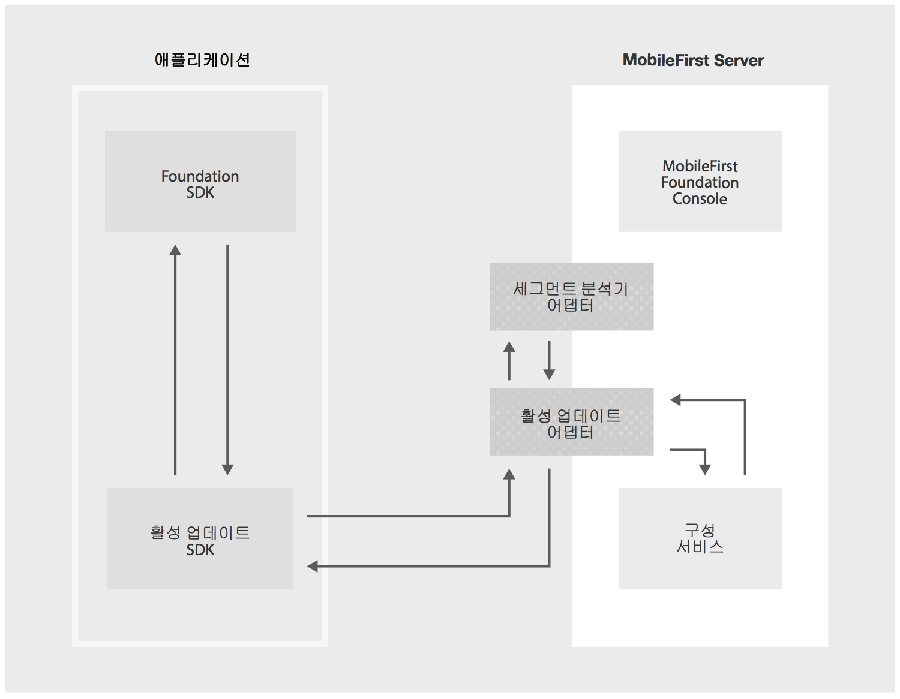

<!-- NLS_CHARSET=UTF-8 -->
## 개요
{: #overview }
사용자 세그먼트화는 각 그룹의 사용자 간 유사성이 반영된 여러 그룹으로 사용자를 나누는 관행입니다. 일반적인 예는 [geographic segmentation](https://en.wikipedia.org/wiki/Market_segmentation#Geographic_segmentation)으로, 이는 지리적 기준에 따라 사용자를 나눕니다. 사용자 세그먼트화의 목적은 각 세그먼트에서 사용자를 관련시킬 방법을 결정하여 값을 최대화하는 것입니다.

{{ site.data.keys.product }}의 활성 업데이트 기능을 사용하여 애플리케이션의 각 사용자 세그먼트에 대한 서로 다른 구성을 간단하게 정의하고 제공할 수 있습니다. 해당 {{ site.data.keys.mf_console }}에는 각 세그먼트에 대한 구성의 값 및 해당 구성의 구조를 정의하는 데 필요한 컴포넌트가 포함되어 있습니다. 구성을 이용하는 데 필요한 클라이언트 SDK(Android 및 iOS **네이티브** 애플리케이션 및 Cordova 애플리케이션에 사용 가능)도 제공됩니다.

#### 공통 유스 케이스
{: #common-use-cases }
활성 업데이트는 세그먼트 기반 구성의 정의 및 이용을 지원하여 애플리케이션에 대해 세그먼트 기반 사용자 정의를 쉽게 작성할 수 있도록 합니다. 공통 유스 케이스에는 다음이 포함될 수 있습니다.

* 릴리스 트레인 및 기능 플립핑
* A/B 테스트
* 컨텍스트 기반 애플리케이션 사용자 정의(예: 지리적 세그먼트화)

#### 데모
{: #demonstration }
다음 비디오에서는 활성 업데이트 기능을 보여줍니다.

<div class="sizer">
    <div class="embed-responsive embed-responsive-16by9">
        <iframe src="https://www.youtube.com/embed/TjbC9thSfmM"></iframe>
    </div>
</div>

#### 다음으로 이동:
{: #jump-to }
* [활성 업데이트 아키텍처](#live-update-architecture)
* [{{ site.data.keys.mf_server }}에 활성 업데이트 추가](#adding-live-update-to-mobilefirst-server)
* [애플리케이션 보안 구성](#configuring-application-security)
* [스키마 및 세그먼트](#schema-and-segments)
* [애플리케이션에 활성 업데이트 SDK 추가](#adding-live-update-sdk-to-applications)
* [활성 업데이트 SDK 사용](#using-the-live-update-sdk)
* [고급 주제](#advanced-topics)
* [샘플 애플리케이션](#sample-application)


## 활성 업데이트 아키텍처
{: #live-update-architecture }
다음 시스템 컴포넌트가 함께 작동하여 활성 업데이트 기능을 제공합니다.



* **활성 업데이트 어댑터:** 다음 사항을 제공하는 어댑터입니다.
 - 애플리케이션 스키마 및 세그먼트 관리
 - 애플리케이션에 구성 제공
* **세그먼트 분석기 어댑터:** *선택사항*. 개발자에 의해 구현되는 사용자 정의 어댑터입니다. 이 어댑터는 애플리케이션 컨텍스트(예: 사용자 정의 매개변수를 포함하여 디바이스 및 사용자 컨텍스트)를 수신하고 컨텍스트에 일치하는 세그먼트의 ID를 리턴합니다.
* **클라이언트 측 SDK:** 활성 업데이트 SDK는 {{ site.data.keys.mf_server }}의 구성요소(예: 기능 및 특성)를 검색하고 액세스하는 데 사용됩니다.
* **{{ site.data.keys.mf_console }}:** 활성 업데이트 어댑터 및 설정을 구성하는 데 사용됩니다.
* **구성 서비스:** *내부*. 활성 업데이트 어댑터에 대한 구성 관리 서비스를 제공합니다.

## {{ site.data.keys.mf_server }}에 활성 업데이트 추가
{: #adding-live-update-to-mobilefirst-server }
기본적으로 {{ site.data.keys.mf_console }}에서 활성 업데이트 설정은 숨겨집니다. 이를 사용하려면 제공된 활성 업데이트 어댑터를 배치해야 합니다.  

1. {{ site.data.keys.mf_console }}을 여십시오. 사이드바 탐색에서 **다운로드 센터 → 도구** 탭을 클릭하십시오.
2. 활성 업데이트 어댑터를 다운로드하고 배치하십시오.

배치가 완료되면 등록된 각 애플리케이션에 대한 **활성 업데이트 설정** 화면이 표시됩니다.


## 애플리케이션 보안 구성
{: #configuring-application-security }
활성 업데이트와 통합을 허용하려면 범위 요소가 필요합니다. 범위 요소가 없으면 클라이언트 애플리케이션의 요청이 어댑터에서 거부됩니다.  

{{ site.data.keys.mf_console }}을 로드하고 **[애플리케이션] → 보안 탭 → 범위 요소 맵핑**을 클릭하십시오. **새로 작성**을 클릭하고 범위 요소 **구성-사용자-로그인**을 입력하십시오. 그런 다음 **추가**를 클릭하십시오.

또한 애플리케이션에서 보안 검사를 사용 중인 경우 해당 보안 검사에 범위 요소를 맵핑할 수도 있습니다.

> [{{ site.data.keys.product_adj }} 보안 프레임워크에 대해 자세히 알아보십시오.](../../authentication-and-security/)


## 스키마 및 세그먼트
{: #schema-and-segments }
활성 업데이트 설정 화면에서 다음 두 개의 탭을 사용할 수 있습니다.

#### 스키마 개념
{: #what-is-schema }
스키마는 기능 및 특성이 정의되는 위치입니다.  

* "기능"을 사용하여 구성 가능한 애플리케이션 기능을 정의하고 해당 기본값을 설정할 수 있습니다.  
* "특성"을 사용하여 구성 가능한 애플리케이션 특성을 정의하고 해당 기본값을 설정할 수 있습니다.

#### 세그먼트
{: #segments }
세그먼트는 스키마에서 정의한 기본 기능 및 특성을 사용자 정의하여 고유 애플리케이션 동작을 정의합니다.

### 스키마 및 세그먼트 추가
{: #adding-schema-and-segments }
애플리케이션에 대한 스키마 및 세그먼트를 추가하려면 먼저 개발자 또는 제품 관리 팀에서 다음 여러 측면에 대해 결정해야 합니다.

* 활성 업데이트를 이용하는 **기능** 세트 및 해당 기본 상태
* 구성 가능한 문자열 **특성** 세트 및 해당 기본값
* 애플리케이션의 시장 세그먼트

각 시장 세그먼트에 대해 다음 사항을 결정해야 합니다.

* 각 기능의 상태 및 애플리케이션 수명 중에 해당 상태를 변경할 수 있는 방법
* 각 특성의 값 및 애플리케이션 수명 중에 해당 값을 변경할 수 있는 방법

<br/>
매개변수를 결정한 후에 스키마 기능 &amp; 특성 및 세그먼트를 추가할 수 있습니다.  
추가하려면 **새로 작성**을 클릭하고 요청되는 값을 제공하십시오.

<div class="panel-group accordion" id="terminology" role="tablist" aria-multiselectable="false">
    <div class="panel panel-default">
        <div class="panel-heading" role="tab" id="schema">
            <h4 class="panel-title">
                <a class="preventScroll" role="button" data-toggle="collapse" data-parent="#terminology" data-target="#collapseSchema" aria-expanded="false" aria-controls="collapseSchema">스키마 용어를 검토하려면 클릭</a>
            </h4>
        </div>

        <div id="collapseSchema" class="panel-collapse collapse" role="tabpanel" aria-labelledby="schema">
            <div class="panel-body">
                <ul>
                    <li><b>기능:</b> 기능은 애플리케이션 기능의 일부 파트가 사용되는지, 또는 사용되지 않는지 여부를 판별합니다. 애플리케이션의 스키마에서 기능을 정의할 때 다음 요소를 제공해야 합니다.
                        <ul>
                            <li><i>ID</i> - 기능의 고유 ID입니다. 문자열이며 편집할 수 없습니다.</li>
                            <li><i>이름</i> - 기능의 구체적인 이름입니다. 문자열이며 편집 가능합니다.</li>
                            <li><i>설명</i> - 기능에 대한 간략한 설명입니다. 문자열이며 편집 가능합니다.</li>
                            <li><i>기본값</i> - 세그먼트 내에서 대체되지 않은 경우 제공되는 기능의 기본값입니다(아래의 세그먼트 참조). 부울이며 편집 가능합니다.</li>
                        </ul>
                    </li>
                    <li><b>특성:</b> 특성은 애플리케이션을 사용자 정의할 때 사용할 수 있는 키:값 엔티티입니다. 애플리케이션의 스키마에서 특성을 정의할 때 다음 요소를 제공해야 합니다.
                        <ul>
                            <li><i>ID</i> - 특성의 고유 ID입니다. 문자열이며 편집할 수 없습니다.</li>
                            <li><i>이름</i> - 특성의 구체적인 이름입니다. 문자열이며 편집 가능합니다.</li>
                            <li><i>설명</i> - 특성에 대한 간략한 설명입니다. 문자열이며 편집 가능합니다.</li>
                            <li><i>기본값</i> - 세그먼트 내에서 대체되지 않은 경우 제공되는 특성의 기본값입니다(아래의 세그먼트 참조). 문자열이며 편집 가능합니다.</li>
                        </ul>
                    </li>
                </ul>
            </div>
        </div>
    </div>

    <div class="panel panel-default">
        <div class="panel-heading" role="tab" id="segment">
            <h4 class="panel-title">
                <a class="preventScroll" role="button" data-toggle="collapse" data-parent="#terminology" data-target="#collapseSegment" aria-expanded="false" aria-controls="collapseSegment">세그먼트 용어를 검토하려면 클릭</a>
            </h4>
        </div>

        <div id="collapseSegment" class="panel-collapse collapse" role="tabpanel" aria-labelledby="segment">
            <div class="panel-body">
                <ul>
                    <li><b>세그먼트:</b> 세그먼트는 시장 세그먼트에 해당하는 엔티티입니다. 여기에는 스키마에서 정의된 기능과 특성이 포함되어 있으며, 대체 값이 포함되어 있을 수도 있습니다. 세그먼트를 정의할 때 다음 요소를 제공해야 합니다.
                        <ul>
                            <li><i>ID</i> - 세그먼트의 고유 ID입니다. 문자열이며 편집할 수 없습니다.</li>
                            <li><i>이름</i> - 세그먼트의 구체적인 이름입니다. 문자열이며 편집 가능합니다.</li>
                            <li><i>설명</i> - 세그먼트에 대한 간략한 설명입니다. 문자열이며 편집 가능합니다.</li>
                            <li><i>기능</i> - 스키마에 정의된 기능 목록으로, 사용자가 스키마 기본값과 다른 기능에 정적 값을 설정할 수 있습니다.</li>
                            <li><i>특성</i> - 스키마에 정의된 특성 목록으로, 사용자가 스키마 기본값과 다른 특성에 정적 값을 설정할 수 있습니다.</li>
                        </ul>
                    </li>
                </ul>

                <blockquote><b>참고:</b><br/>
                    <ul>
                        <li>스키마에 기능 또는 특성이 추가되는 경우 해당 기능이나 특성은 애플리케이션의 모든 세그먼트에 기본값으로 자동으로 추가됩니다.</li>
                        <li>스키마에서 기능 또는 특성이 제거되는 경우 해당 기능이나 특성은 애플리케이션의 모든 세그먼트에서 자동으로 제거됩니다.</li>
                    </ul>
                </blockquote>
            </div>
        </div>
    </div>
</div>

#### 기본값을 사용하여 스키마 기능 및 특성 정의
{: #define-schema-features-and-properties-with-default-values }


#### 시장 세그먼트에 해당하는 세그먼트 정의
{: #define-degments-that-correspond-to-market-segments }


#### 기능 및 특성의 기본값 대체
{: #override-default-values-of-features-and-properties }
기능을 사용으로 설정하고 해당 기본 상태를 변경하십시오.


특성의 기본값을 대체하십시오.


## 애플리케이션에 활성 업데이트 SDK 추가
{: #adding-live-update-sdk-to-applications}
활성 업데이트 SDK는 {{ site.data.keys.mf_console }}에 등록된 애플리케이션의 활성 업데이트 설정 화면에서 이전에 정의된 런타임 구성 기능 및 특성을 조회하는 API를 개발자에게 제공합니다.

* [Cordova 플러그인 문서](https://github.com/mfpdev/mfp-live-update-cordova-plugin)
* [iOS Swift SDK 문서](https://github.com/mfpdev/mfp-live-update-ios-sdk)
* [Android SDK 문서](https://github.com/mfpdev/mfp-live-update-android-sdk)

### Cordova 플러그인 추가
{: #adding-the-cordova-plugin }
Cordova 애플리케이션 폴더에서 다음을 실행하십시오.

```bash
cordova plugin add cordova-plugin-mfp-liveupdate
```

### iOS SDK 추가
{: #adding-the-ios-sdk }
1. `IBMMobileFirstPlatformFoundationLiveUpdate` Pod를 추가하여 애플리케이션의 Podfile을 편집하십시오.  
예:

   ```xml
use_frameworks!

   target 'your-Xcode-project-target' do
      pod 'IBMMobileFirstPlatformFoundation'
      pod 'IBMMobileFirstPlatformFoundationLiveUpdate'
   end
   ```

2. **명령행** 창에서 Xcode 프로젝트의 루트 폴더로 이동하고 `pod install` 명령을 실행하십시오.

### Android SDK 추가
{: #adding-the-android-sdk }
1. Android Studio에서 **Android → Gradle 스크립트**를 선택한 후 **build.gradle(모듈: 앱)** 파일을 선택하십시오.
2. `dependencies` 내에 `ibmmobilefirstplatformfoundationliveupdate`를 다음과 같이 추가하십시오.

   ```xml
   dependencies {
        compile group: 'com.ibm.mobile.foundation',
        name: 'ibmmobilefirstplatformfoundation',
        version: '8.0.+',
        ext: 'aar',
        transitive: true

        compile group: 'com.ibm.mobile.foundation',
        name: 'ibmmobilefirstplatformfoundationliveupdate',
        version: '8.0.0',
        ext: 'aar',
        transitive: true
   }   
   ```

## 활성 업데이트 SDK 사용
{: #using-the-live-update-sdk }
여러 가지 방식으로 활성 업데이트를 사용할 수 있습니다.

### 사전 판별된 세그먼트
{: #pre-determined-segment }
관련 세그먼트에 대한 구성을 검색하는 로직을 구현하십시오.  
"segment-name", "property-name" 및 "feature-name"을 고유 항목으로 대체하십시오.

#### Cordova
{: #cordova }
```javascript
    var input = { segmentId :'segment-name' };
    LiveUpdateManager.obtainConfiguration(input,function(configuration) {
        // do something with configration (JSON) object, for example,
        // if you defined in the server a feature named 'feature-name':
        // if (configuration.features.feature-name) {
        //   console.log(configuration.properties.property-name);
	// }
    } ,
    function(err) {
        if (err) {
           alert('liveupdate error:'+err);
        }
  });
```

#### iOS
{: #ios }
```swift
LiveUpdateManager.sharedInstance.obtainConfiguration("segment-name", completionHandler: { (configuration, error) in
  if error == nil {
    print (configuration?.getProperty("property-name"))
    print (configuration?.isFeatureEnabled("feature-name"))
  } else {
    print (error)
  }
})
```

#### Android
{: #android }
```java
LiveUpdateManager.getInstance().obtainConfiguration("segment-name", new ConfigurationListener() {

    @Override
    public void onSuccess(final Configuration configuration) {
        Log.i("LiveUpdateDemo", configuration.getProperty("property-name"));
        Log.i("LiveUpdateDemo", configuration.isFeatureEnabled("feature-name").toString());
    }

    @Override
    public void onFailure(WLFailResponse wlFailResponse) {
        Log.e("LiveUpdateDemo", wlFailResponse.getErrorMsg());
    }
});
```

활성 업데이트 구성이 검색된 경우 애플리케이션 로직 및 애플리케이션 플로우는 기능과 특성 상태에 따라 다를 수 있습니다. 예를 들어 오늘이 국경일인 경우 애플리케이션에 새 마케팅 프로모션을 도입하십시오.

### 세그먼트 분석기 어댑터
{: #segment-resolver-adapter }
"세그먼트 분석기" 어댑터는 [활성 업데이트 아키텍처](#live-update-architecture) 주제에서 언급되었습니다.  
이 어댑터는 애플리케이션/디바이스/사용자 컨텍스트 및 애플리케이션 사용자 정의 매개변수를 기반으로 세그먼트를 검색하는 데 필요한 사용자 정의 비즈니스 로직을 제공하는 데 사용됩니다.

세그먼트 분석기 어댑터를 사용하려면 다음을 수행하십시오.

1. [새 Java 어댑터를 작성](../../adapters/creating-adapters/)하십시오.
2. **어댑터 → 활성 업데이트 어댑터 → segmentResolverAdapterName**에서 해당 어댑터를 세그먼트 분석기 어댑터로 정의하십시오.
3. 개발이 완료되면 [빌드하고 배치](../../adapters/creating-adapters/)하십시오.

세그먼트 분석기 어댑터는 REST 인터페이스를 정의합니다. 이 어댑터에 대한 요청의 본문에는 일반 사용자가 속한 세그먼트를 결정하는 데 필요한 모든 정보가 포함되어 있으며, 해당 요청은 이러한 정보를 애플리케이션에 다시 전송합니다.

매개변수로 구성을 가져오려면 활성 업데이트 API를 사용하여 요청을 보내십시오.

#### Cordova 분석기
{: cordova-resolver }
```javascript
var input = { params : { 'paramKey': 'paramValue'} ,useClientCache : true };
LiveUpdateManager.obtainConfiguration(input,function(configuration) {
        // do something with configration (JSON) object, for example:
        // console.log(configuration.properties.property-name);                                                                                                             // console.log(configuration.data.features.feature-name);
    } ,
    function(err) {
        if (err) {
           alert('liveupdate error:'+err);
        }
  });
```

#### iOS
{: #ios-resolver }
```swift
LiveUpdateManager.sharedInstance.obtainConfiguration(["paramKey":"paramValue"], completionHandler: { (configuration, error) in
  if error == nil {
    print (configuration?.getProperty("property-name"))
    print (configuration?.isFeatureEnabled("feature-name"))
  } else {
    print (error)
  }
})
```

#### Android
{: #android-resolver }
```java
Map <String,String> params = new HashMap<>();
params.put("paramKey", "paramValue");

LiveUpdateManager.getInstance().obtainConfiguration(params , new ConfigurationListener() {

    @Override
    public void onSuccess(final Configuration configuration) {
        Log.i("LiveUpdateDemo", configuration.getProperty("property-name"));
        Log.i("LiveUpdateDemo", configuration.isFeatureEnabled("feature-name").toString());
    }

    @Override
    public void onFailure(WLFailResponse wlFailResponse) {
        Log.e("LiveUpdateDemo", wlFailResponse.getErrorMsg());
    }
});
```

#### 어댑터 구현
{: #adapter-implementation }
애플리케이션에서 활성 업데이트 클라이언트 SDK를 사용하여 제공되는 인수는 활성 업데이트 어댑터로 전달된 후에 세그먼트 분석기 어댑터로 전달됩니다. 이는 활성 업데이트 어댑터에 의해 자동으로 수행되며 개발자 조치가 필요하지 않습니다.

관련 세그먼트를 리턴하도록 이러한 인수를 처리하려면 새로 작성된 세그먼트 분석기 어댑터의 구현을 업데이트하십시오.  
다음은 사용할 수 있는 샘플 코드입니다.

**참고:** 어댑터의 `pom.xml`에 Gson 종속 항목을 다음과 같이 추가하십시오.

```xml
<dependency>
    <groupId>com.google.code.gson</groupId>
    <artifactId>gson</artifactId>
    <version>2.7</version>
</dependency>
```

**SampleSegmentResolverAdapterApplication.java**  

```java
@Api(value = "Sample segment resolver adapter")
@Path("/")
public class SampleSegmentResolverAdapter {

    private static final Gson gson = new Gson();
    private static final Logger logger = Logger.getLogger(SampleSegmentResolverAdapter.class.getName());

    @POST
    @Path("segment")
    @Produces("text/plain;charset=UTF-8")
    @OAuthSecurity(enabled = true, scope = "configuration-user-login")
    public String getSegment(String body) throws Exception {
        ResolverAdapterData data = gson.fromJson(body, ResolverAdapterData.class);
        String segmentName = "";

        // Get the custom arguments
        Map<String, List<String>> arguments = data.getQueryArguments();

        // Get the authenticatedUser object
        AuthenticatedUser authenticatedUser = data.getAuthenticatedUser();
        String name = authenticatedUser.getDisplayName();

        // Get registration data such as device and application
        RegistrationData registrationData = data.getRegistrationData();
        ApplicationKey application = registrationData.getApplication();
        DeviceData deviceData = registrationData.getDevice();

        // Based on the above context (arguments, authenticatedUser and registrationData) resolve the segment name.
        // Write your custom logic to resolve the segment name.

        return segmentName;
    }
}
```

**SampleSegmentResolverAdapter.java**

```java
public class ResolverAdapterData {
    public ResolverAdapterData() {
    }

    public ResolverAdapterData(AdapterSecurityContext asc, Map<String, List<String>> queryArguments)
    {
        ClientData cd = asc.getClientRegistrationData();

        this.authenticatedUser = asc.getAuthenticatedUser();
        this.registrationData = cd == null ? null : cd.getRegistration();
        this.queryArguments = queryArguments;
    }

    public AuthenticatedUser getAuthenticatedUser() {
        return authenticatedUser;
    }

    public RegistrationData getRegistrationData() {
        return registrationData;
    }

    public Map<String, List<String>> getQueryArguments() {
        return queryArguments;
    }

    private AuthenticatedUser authenticatedUser;
    private RegistrationData registrationData;
    private Map<String, List<String>> queryArguments;
}
```

#### 세그먼트 분석기 어댑터의 REST 인터페이스
{: #rest-interface-of-the-segment-resolver-adapter }
**요청**

| **속성** | **값**                                                                                     |  
|:----------------|:--------------------------------------------------------------------------------------------------|
| *URL*           | /segment                                                                                          |
| *메소드*        | POST                                                                                              |               
| *컨텐츠 유형*  | 애플리케이션/JSON                                                                                  |
| *본문*          | &lt;세그먼트 분석에 필요한 모든 정보가 포함된 JSON 오브젝트&gt;                     |

**응답**

| **속성**   | **값**                                |
|:-------------------|:--------------------------------------------|
| *컨텐츠 유형*     | 텍스트/일반                                  |                                                                          
| *본문*             | &lt;세그먼트 ID를 설명하는 문자열&gt;   |


## 고급 주제
{: #advanced-topics }
### 가져오기/내보내기
{: #importexport }
시스템 관리자는 정의된 스키마와 세그먼트를 내보내고 다른 서버 인스턴스로 가져올 수 있습니다.

#### 스키마 내보내기
{: #export-schema }
```bash
curl --user admin:admin http://localhost:9080/mfpadmin/management-apis/2.0/runtimes/mfp/admin-plugins/liveUpdateAdapter/com.sample.HelloLiveUpdate/schema > schema.txt
```

#### 스키마 가져오기
{: #import-schema }
```bash
curl -X PUT -d @schema.txt --user admin:admin -H "Content-Type:application/json" http://localhost:9080/mfpadmin/management-apis/2.0/runtimes/mfp/admin-plugins/liveUpdateAdapter/com.sample.HelloLiveUpdate/schema
```

* "admin:admin"을 고유 항목으로 대체(기본값은 "admin")
* 필요한 경우 "localhost" 및 포트 번호를 기본 항목으로 대체
* 애플리케이션 ID "com.sample.HelloLiveUpdate"를 고유 애플리케이션의 ID로 대체

#### 세그먼트 내보내기
{: #export-segments }
```bash
curl --user admin:admin http://localhost:9080/mfpadmin/management-apis/2.0/runtimes/mfp/admin-plugins/liveUpdateAdapter/com.sample.HelloLiveUpdate/segment?embedObjects=true > segments.txt
```

#### 세그먼트 가져오기
{: #import-segments }
```bash
#!/bin/bash
segments_number=$(python -c 'import json,sys;obj=json.load(sys.stdin);print len(obj["items"]);' < segments.txt)
counter=0
while [ $segments_number -gt $counter ]
do
    segment=$(cat segments.txt | python -c 'import json,sys;obj=json.load(sys.stdin);data_str=json.dumps(obj["items"]['$counter']);print data_str;')
    echo $segment | curl -X POST -d @- --user admin:admin --header "Content-Type:application/json" http://localhost:9080/mfpadmin/management-apis/2.0/runtimes/mfp/admin-plugins/liveUpdateAdapter/com.sample.HelloLiveUpdate/segment
    ((counter++))
done
```

* "admin:admin"을 고유 항목으로 대체(기본값은 "admin")
* 필요한 경우 "localhost" 및 포트 번호를 기본 항목으로 대체
* 애플리케이션 ID "com.sample.HelloLiveUpdate"를 고유 애플리케이션의 ID로 대체

### 캐싱
{: #caching }
캐싱은 기본적으로 사용되어 네트워크 대기 시간이 발생하지 않도록 합니다. 즉 업데이트가 즉시 수행되지 않을 수 있습니다.  
자주 업데이트해야 하는 경우 캐싱을 사용 안함으로 설정할 수 있습니다.

#### Cordova
{: #cordova-caching }
선택적 _useClientCache_ 부울 플래그를 사용하여 클라이언트 측 캐시 제어

```javascript
	var input = { segmentId :'18' ,useClientCache : false };
        LiveUpdateManager.getConfiguration(input,function(configuration) {
                // do something with resulting configuration, for example:
                // console.log(configuration.data.properties.property-name);  
                // console.log(configuration.data.features.feature-name);
        } ,
        function(err) {
                if (err) {
                   alert('liveupdate error:'+err);
                }
  });
```

#### iOS
{: #ios-caching }
```swift
LiveUpdateManager.sharedInstance.obtainConfiguration("segment-name", useCache: false, completionHandler: { (configuration, error) in
  if error == nil {
    print (configuration?.getProperty("property-name"))
    print (configuration?.isFeatureEnabled("feature-name"))
  } else {
    print (error)
  }
})
```

#### Android
{: #android-caching }
```java
LiveUpdateManager.getInstance().obtainConfiguration("segment-name", false, new ConfigurationListener() {

    @Override
    public void onSuccess(final Configuration configuration) {
      Log.i("LiveUpdateSample", configuration.getProperty("property-name"));
      Log.i("LiveUpdateSample", configuration.isFeatureEnabled("feature-name").toString());
    }

    @Override
    public void onFailure(WLFailResponse wlFailResponse) {
        Log.e("LiveUpdateSample", wlFailResponse.getErrorMsg());
    }
});
```

### 캐시 만기
{: #cache-expiration }
**어댑터 → 활성 업데이트 어댑터**에 정의된 `expirationPeriod` 값은 캐싱이 만료될 때까지 걸리는 시간 길이를 제어합니다.


## 샘플 애플리케이션
{: #sample-application }
샘플 애플리케이션에서 국기를 선택하고 활성 업데이트를 사용하면 앱에서 선택한 국가에 해당하는 언어로 텍스트를 출력합니다. 맵 기능을 사용하도록 설정하고 맵을 제공하면 해당 국가의 맵이 표시됩니다.

Xcode 프로젝트를 [다운로드하려면 클릭](https://github.com/MobileFirst-Platform-Developer-Center/LiveUpdateSwift/tree/release80)하십시오.  
Android Studio 프로젝트를 [다운로드하려면 클릭](https://github.com/MobileFirst-Platform-Developer-Center/LiveUpdateAndroid/tree/release80)하십시오.

### 샘플 사용법
{: #sample-usage }
샘플의 README.md 파일에 있는 지시사항을 따르십시오.

#### 활성 업데이트 설정 변경
{: #changing-live-update-settings }
각 세그먼트는 스키마에서 기본값을 가져옵니다. 각 기본값을 언어에 따라 변경하십시오. 예를 들어 프랑스어의 경우 **helloText** - **Bonjour le monde**를 추가하십시오.

**{{ site.data.keys.mf_console }} → [애플리케이션] → 활성 업데이트 설정 → 세그먼트 탭**에서 예를 들어 **FR**에 속하는 **특성** 링크를 클릭하십시오.

* **편집** 아이콘을 클릭하고 예를 들어 프랑스 지역 맵을 나타내는 이미지에 대한 링크를 제공하십시오.
* 앱 사용 중에 맵을 보려면 `includeMap` 기능을 사용으로 설정해야 합니다.
