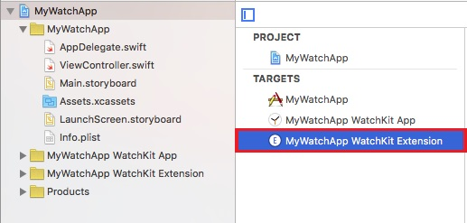

<!-- NLS_CHARSET=UTF-8 -->
## 개요
{: #overview }
이 예제에서는 {{ site.data.keys.product_adj }} 프레임워크를 사용하여 watchOS 2 이상에 대한 개발 환경을 설정하는 방법에 대해 학습합니다. 이 예제는 watchOS 2를 사용하여 작성되고 설명됩니다. watchOS 3에서도 문제 없이 작동됩니다.

## 설정
{: #setup }
watchOS의 개발 환경을 설정하려면 Xcode 프로젝트 작성, watchOS 프레임워크 추가, 필수 대상 설정을 수행하십시오.

1. Xcode에서 watchOS 2 앱을 작성하십시오.
    * **파일 → 새로 작성 → 프로젝트** 옵션을 선택하면 **새 프로젝트의 템플리트 선택** 대화 상자가 표시됩니다.
    * **watchOS2/애플리케이션** 옵션을 선택하고 **다음**을 클릭하십시오.
    * 프로젝트 이름을 지정하고 **다음**을 클릭하십시오.
    * 탐색 대화 상자에서 프로젝트 폴더를 선택하십시오.

    이제 프로젝트 탐색 트리에 기본 앱 폴더 및 **[프로젝트 이름] WatchKit Extension** 폴더와 대상이 포함됩니다.

    

2. {{ site.data.keys.product_adj }} watchOS 프레임워크를 추가하십시오.
    * CocoaPods로 필수 프레임워크를 설치하려면 [{{ site.data.keys.product_adj }} 네이티브 SDK 추가](../../application-development/sdk/ios/#adding-support-for-apple-watchos) 학습서를 참조하십시오.
    * 필수 프레임워크를 수동으로 설치하려면 다음을 수행하십시오.
        * {{ site.data.keys.mf_console }}의 다운로드 센터에서 watchOS 프레임워크를 가져오십시오.
        * 왼쪽 탐색 분할창에서 **[프로젝트 이름] WatchKit Extension** 폴더를 선택하십시오.
        * **파일** 메뉴에서 **파일 추가**를 선택하십시오.
        * **옵션** 단추를 클릭하고 다음을 선택하십시오.
            * **필요한 경우 항목 복사** 및 **그룹 작성** 옵션
            * **대상에 추가** 섹션의 **[프로젝트 이름] WatchKit 확장**
        * **추가**를 클릭하십시오.

        이제 **대상** 섹션에서 **[프로젝트 이름] WatchKit Extension**을 선택하면 다음이 수행됩니다.
            * **빌드 설정** 탭의 **검색 경로** 섹션에서 **프레임워크 검색 경로** 설정에 프레임워크 경로가 표시됩니다.
            * **빌드 단계(Phase)** 탭의 **라이브러리가 포함된 2진 링크** 섹션에 **IBMMobileFirstPlatformFoundationWatchOS.framework** 파일이 나열됩니다.
            

        > **참고:** WatchOS 2에는 비트 코드가 필요합니다. Xcode 7부터 **빌드 옵션**이 **비트 코드 사용 예**(**빌드 설정** 탭, **빌드 옵션** 섹션)로 설정됩니다.

3. 서버에서 기본 앱 및 WatchKit 확장을 둘 다 등록하십시오. 각 번들 ID에 대해 `mfpdev app register`를 실행하거나 {{ site.data.keys.mf_console }}에서 등록하십시오.
    * com.worklight.[프로젝트 이름]
    * com.worklight.[프로젝트 이름].watchkitextension

4. Xcode의 파일->파일 추가 메뉴에서 mfpdev에 의해 작성된 mfpclient.plist 파일로 이동하고 프로젝트에 추가하십시오.
    * 파일을 선택하여 **대상 멤버십** 상자에 표시하십시오. **WatchOSDemoApp WatchKit 확장** 대상 및 **WatchOSDemoApp**을 선택하십시오.

이제 Xcode 프로젝트에 기본 앱 및 watchOS 2 앱이 포함되며, 각 앱을 독립적으로 개발할 수 있습니다. Swift의 경우 watchOS 2 앱의 시작점은 **[프로젝트 이름] watchKit Extension** 폴더의 **InterfaceController.swift** 파일입니다. Objective-C의 경우 시작점은 **ViewController.m** 파일입니다.

## iPhone 앱 및 watchOS 앱에 대한 {{ site.data.keys.product_adj }} 보안 설정
{: #setting-up-mobilefirst-security-for-the-iphone-app-and-the-watchos-app }
Apple Watch 및 iPhone 디바이스는 물리적으로 다릅니다. 따라서 각각에 대한 보안 검사가 사용 가능한 입력 디바이스에 적합해야 합니다. 예를 들어 Apple Watch는 숫자 패드로 제한되며 일반적인 사용자 이름/비밀번호 보안 검사는 허용되지 않습니다. 따라서 핀 코드를 사용하여 서버의 보호된 자원에 액세스할 수 있습니다. 이를 포함한 유사한 차이점으로 인해 각 대상에 대해 서로 다른 보안 검사를 적용해야 합니다.

다음은 iPhone 및 Apple Watch 대상을 사용하는 앱 작성의 예입니다. 이 아키텍처에서는 각 대상에 고유 보안 검사가 있을 수 있습니다. 서로 다른 보안 검사는 각 대상에 대한 기능을 설계할 수 있는 방법에 대한 예일 뿐입니다. 추가 보안 검사를 사용할 수도 있습니다.

1. 보호된 자원에 의해 정의된 범위 및 보안 검사를 판별하십시오.
2. {{ site.data.keys.mf_console }}에서 다음을 수행하십시오.
    * 서버에 두 앱이 모두 등록되었는지 확인하십시오.
        * com.worklight.[프로젝트 이름]
        * com.worklight.[프로젝트 이름].watchkitextension
    * 정의된 보안 검사에 scopeName을 다음과 같이 맵핑하십시오.
        * com.worklight.[프로젝트 이름]의 경우 사용자 이름/비밀번호 검사에 맵핑하십시오.
        * com.worklight.[프로젝트 이름].watchkitapp.watchkitextension의 경우 핀 코드 보안 검사에 맵핑하십시오.

## WatchOS 제한사항
{: #watchos-limitation }
watchOS 개발 시에는 {{ site.data.keys.product_adj }} 앱에 기능을 추가하는 선택적 프레임워크가 제공되지 않습니다. watchOS 또는 Apple Watch 디바이스에 의해 부과되는 제한조건으로 인해 일부 다른 기능이 제한됩니다.

| 기능 | 제한사항 |
|---------|------------|
| openSSL |지원되지 않음 |
| JSONStore|지원되지 않음 |
| 알림 |지원되지 않음 |
| {{ site.data.keys.product_adj }} 코드에 의해 표시되는 메시지 경보 |지원되지 않음 |
| 애플리케이션 인증 유효성 검증 | 비트 코드와 호환되지 않으므로 지원되지 않음 |
| 원격 사용 안함/알림	| 사용자 정의 필요(아래 참조) |
| 사용자 이름/비밀번호 보안 검사 | CredentialsValidation 보안 검사 사용 |

### 원격 사용 안함/알림
{: #remote-disablenotify }
{{ site.data.keys.mf_console }}에서 실행 중인 버전에 따라 클라이언트 애플리케이션에 대한 액세스를 사용 안함으로 설정하고 메시지를 리턴하도록 {{ site.data.keys.mf_server }}를 구성할 수 있습니다([보호된 자원에 대한 애플리케이션 액세스를 원격으로 사용 안함으로 설정](../../administering-apps/using-console/#remotely-disabling-application-access-to-protected-resources) 참조). 두 가지 옵션으로 통해 기본 UI 경보가 제공됩니다.

* 앱이 활성이지만 메시지가 전송되는 경우: **활성 및 알림**
* 앱의 기한이 지났고 액세스가 거부된 경우: **액세스 거부됨**

watchOS의 경우:

* 앱이 **활성 및 알림**으로 설정된 메시지를 보려면 사용자 정의 원격 비활성화 인증 확인 핸들러를 구현하고 등록해야 합니다. 사용자 정의 인증 확인 핸들러는 보안 검사 `wl_remoteDisableRealm`을 사용하여 초기화해야 합니다.
* 액세스가 사용되지 않는 경우(**액세스 거부됨**) 클라이언트 앱은 실패 콜백 또는 요청 위임 핸들러에서 오류 메시지를 수신합니다. 개발자는 UI를 통해 사용자에게 알리거나 로그에 기록하는 것 중에서 오류 처리 방법을 결정할 수 있습니다. 위에 있는 사용자 정의 인증 확인 핸들러를 작성하는 방법을 사용할 수도 있습니다.
