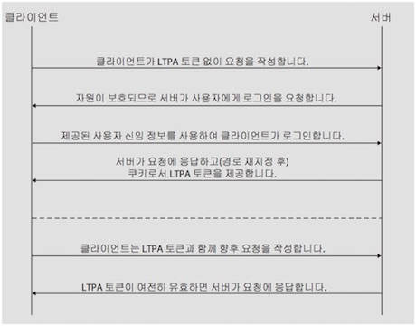
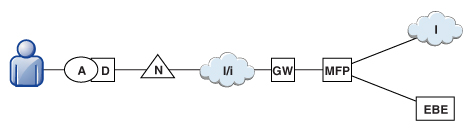
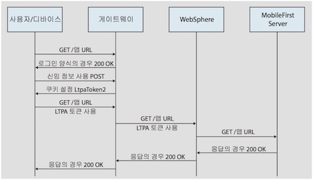

<!-- NLS_CHARSET=UTF-8 -->
## 개요
{: #overview }
LTPA(Light weight Third-Party Authentication) 토큰은 IBM WebSphere Application Server 및 기타 IBM 제품에서 사용되는 일종의 보안 토큰입니다. LTPA를 사용하여 인증된 사용자의 신임 정보를 백엔드 서비스로 보낼 수 있습니다. 사용자와 여러 대의 서버 사이에서 싱글 사인온(SSO) 토큰으로도 사용됩니다. 

단순 클라이언트 < - > LTPA를 사용한 서버 플로우

사용자가 서버에 로그인하면, 서버는 인증된 사용자 정보를 포함하는 암호화된 해시인 LTPA 토큰을 생성합니다. 이 토큰은 디코딩하려는 모든 서버에서 공유되는 개인 키로 서명되어 있습니다. 일반적으로 토큰은 HTTP 서비스에서 쿠키 형식입니다. 토큰을 쿠키로 보내면 이후 사용자가 상호작용할 필요가 없습니다. 

세션 하이재킹의 가능성을 줄이기 위해 LTPA 토큰의 만기 시간을 구성할 수 있습니다.

## LTPA를 사용한 리버스 프록시
{: #reverse-proxy-with-ltpa }
또한 인프라에서 사용자를 대신하여 동작하는 백엔드 서버와 통신하기 위해 LTPA 토큰을 사용할 수 있습니다. 리버스 프록시 토폴로지에서 사용자는 백엔드 서버에 직접 액세스할 수 없습니다. 리버스 프록시는 사용자 ID를 인증한 후 인증된 사용자의 LTPA 토큰을 백엔드 서버로 보내는 데 사용할 수 있습니다. 이 구성은 사용자 인증 후에만 {{ site.data.keys.mf_server }}에 액세스할 수 있도록 보장합니다. 예를 들어, 중요한 사용자 신임 정보를 처리할 때 {{ site.data.keys.product }}를 사용하지 않으려고 하거나 기존 인증 설정을 사용하려는 경우에 이 구성이 유용합니다. 엔터프라이즈 환경에서는 DMZ에서 리버스 프록시(예: IBM WebSphere DataPower 또는 IBM Security Access Manager)를 사용하고 인트라넷에 {{ site.data.keys.mf_server }}를 배치해야 합니다. 

리버스 프록시 구현에서는 LTPA 인증으로 사용자 ID를 가져오도록 {{ site.data.keys.mf_server }}를 구성해야 합니다.

리버스 프록시를 사용하는 클라이언트와 백엔드 서버 사이의 LTPA 플로우:

## 리버스 프록시와 {{ site.data.keys.product_adj }} 통합
{: #mobilefirst-integration-with-a-reverse-proxy }
리버스 프록시를 사용하여 {{ site.data.keys.product_adj }} 환경 내에서 엔터프라이즈 연결을 사용으로 설정하고 {{ site.data.keys.product }}에 대한 인증 서비스를 제공할 수 있습니다.

### 일반 아키텍처
{: #general-architecture }
아래 그림에 표시된 것처럼 리버스 프록시는 일반적으로 배치의 일부로 {{ site.data.keys.mf_server }} 인스턴스의 앞에 위치하고 게이트웨이의 뒤에 위치합니다. 

**MFP** 아이콘은 {{ site.data.keys.mf_server }}의 인스턴스를 나타냅니다. **GW** 아이콘은 WebSphere DataPower와 같은 리버스 프록시 게이트웨이를 나타냅니다. 인터넷으로부터 {{ site.data.keys.product_adj }} 자원을 보호하는 것 외에도 리버스 프록시는 HTTPS(SSL) 연결 및 인증을 종료합니다. 또한 리버스 프록시는 정책 적용 지점(PEP) 역할도 할 수
있습니다.

게이트웨이를 사용할 때, 디바이스(**D**)의 애플리케이션(**A**)은 내부 {{ site.data.keys.mf_server }} URI 대신에 게이트웨이에서 알리는 공용 URI를 사용합니다. 공용 URI는 애플리케이션 내에서 설정으로 노출되거나. 애플리케이션이 공용 또는 개인용 앱 스토어에 공개되기 전에 애플리케이션의 프로모션 중에 프로덕션에 기본 제공될 수 있습니다.

### 게이트웨이에서 인증
{: #authentication-at-the-gateway }
인증이 게이트웨이에서 종료되면, {{ site.data.keys.product }}에 공유 컨텍스트(예: 사용자 정의 HTTP 헤더 또는 쿠키)로 인증된 사용자에 대해 알릴 수 있습니다. 확장 가능한 인증 프레임워크를 통해 다음 메커니즘 중 하나에서 사용자 ID를 사용하도록 {{ site.data.keys.product }}를 구성하고 로그인 설정을 완료할 수 있습니다. 아래 그림은 이 게이트웨이 토폴로지를 위한 일반적 인증 플로우를 보여줍니다. 

이 구성은 LTPA 기반 인증을 위한 WebSphere DataPower로 성공적으로 테스트되었습니다. 인증에 성공하면 게이트웨이는(HTTP 쿠키의 양식으로) LTPA 토큰을 WebSphere Application Server로 보내며, 여기에서 LTPA 토큰을 유효성 검증하고, 호출자 프린시펄을 작성합니다. {{ site.data.keys.product }}에서는 필요에 따라 이 호출자 프린시펄을 사용할 수 있습니다. 

##  {{ site.data.keys.product_adj }} LTPA 기반 SSO 보안 검사
{: #the-mobilefirst-ltpa-based-sso-security-check }
사전 정의된 {{ site.data.keys.product_adj }} LTPA 기반 싱글 사인온(SSO) 보안 검사(**LtpaBasedSSO**)는 WebSphere Application Server LTPA 프로토콜과 {{ site.data.keys.product }}의 통합을 가능하게 합니다. 이 보안 검사를 통해 이전 절에서 설명한 대로 LTPA 기반 게이트웨이 토폴로지 내에서 {{ site.data.keys.mf_server }}의 인스턴스를 통합할 수 있고 SSO LTPA 토큰으로 사용자를 인증하는 백엔드 서비스를 사용할 수 있습니다.

이 사전 정의된 보안 검사는 사용자 정의 범위 요소를 이 검사에 맵핑할 수 있고, 자원 범위 보호 또는 필수 애플리케이션 범위에서 검사(또는 이를 포함하는 범위 요소)를 사용할 수 있는 {{ site.data.keys.product_adj }} 보안 프레임워크의 기타 다른 보안 검사로 사용될 수 있습니다. 

또한 애플리케이션을 위해 이 보안 검사의 동작을 구성할 수 있습니다. 

## LTPA 기반 SSO 보안 검사 구성
{: #configuring-the-ltpa-based-sso-security-check }
사전 정의된 LTPA 기반 싱글 사인온(SSO) 보안 검사(**LtpaBasedSSO**)는 구성 가능한 단일 특성 **expirationSec**를 가지고 있습니다. 이 특성은 성공적인 보안 검사 상태의 만기 기간을 설정합니다. 이 만기 기간에 따라 성공적인 실행 후 다시 검사를 호출하는 최소 간격이 결정됩니다. 

> **참고:** 프로시저는 특성 값을 구성하기 위해 {{site.data.keys.mf_console }}을 사용하는 방법을 설명합니다. 또는 **애플리케이션 디스크립터** 파일에서 바로 특성 값을 설정하는 것도 가능합니다. 자세한 정보는 애플리케이션 보안 검사 특성 구성을 참조하십시오. 1. {{ site.data.keys.mf_console }} 창을 여십시오. **탐색 사이드바**에서 애플리케이션 버전을 선택한 후 **보안** 탭을 선택하십시오. 
2. **보안 검사 구성** 섹션에서 **새로 작성**을 클릭하십시오. 
3. **보안 검사 특성 구성** 창에서 **LTPA 기반 SSO** 보안 검사를 구성하십시오. 
    * **보안 검사** 필드의 목록에서
**LtpaBasedSSO**를 선택하십시오. 
    * **만기 기간 성공 상태(초)** 필드에서, 보안 검사의 성공 상태에 선호하는 만료 기간(초)을 설정하십시오. 

구성이 완료되면 애플리케이션 보안 탭의 보안 검사 구성 테이블에서 LtpaBasedSSO 보안 검사 구성을 보고 편집할 수 있습니다. 
