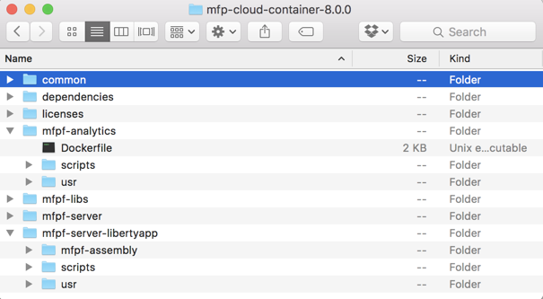

<!-- NLS_CHARSET=UTF-8 -->
## 개요
{: #overview }
아래의 지시사항에 따라 Bluemix에서 Liberty for Java 런타임에 {{ site.data.keys.mf_server }} 인스턴스를 구성하십시오. (IBM Containers에서만 {{ site.data.keys.mf_analytics }} 인스턴스를 실행할 수 있습니다.) 이를 달성하기 위해 다음 단계를 수행합니다.  

* 필요한 도구(Cloud Foundry CLI)를 사용하여 호스트 컴퓨터 설정
* Bluemix 계정 설정
* {{ site.data.keys.mf_server }}를 빌드하여 Bluemix에 Cloud Foundry 애플리케이션으로 푸시

마지막으로 모바일 앱을 등록하고 어댑터를 배치합니다. 

**참고:**  

* Windows OS는 현재 이와 같은 스크립트 실행에 지원되지 않습니다.   
* Bluemix에 배치하는 데 {{ site.data.keys.mf_server }} 구성 도구를 사용할 수 없습니다. 

#### 다음으로 이동:
{: #jump-to }

* [Bluemix에서 계정 등록](#register-an-account-at-bluemix)
* [호스트 시스템 설정](#set-up-your-host-machine)
* [{{ site.data.keys.mf_bm_pkg_name }} 아카이브 다운로드](#download-the-ibm-mfpf-container-8000-archive)
* [Analytics Server 정보 추가](#adding-analytics-server-configuration-to-mobilefirst-server)
* [{{ site.data.keys.mf_server }} 수정사항 적용](#applying-mobilefirst-server-fixes)
* [Bluemix에서 데이터베이스 서비스 구성 제거](#removing-the-database-service-configuration-from-bluemix)

## Bluemix에서 계정 등록
{: #register-an-account-at-bluemix }
아직 계정이 없는 경우 [Bluemix 웹 사이트](https://bluemix.net)를 방문하여 **무료로 시작하기** 또는 **등록**을 클릭하십시오. 다음 단계로 이동하려면 먼저 등록 양식에 입력해야 합니다. 

### Bluemix 대시보드
{: #the-bluemix-dashboard }
Bluemix에 로그인하면 활성 Bluemix **공간**의 개요를 제공하는 Bluemix 대시보드가 표시됩니다. 기본적으로 이 작업 영역의 이름은 "dev"입니다. 필요한 경우 여러 작업 영역/공간을 작성할 수 있습니다. 

## 호스트 시스템 설정
{: #set-up-your-host-machine }
Bluemix Cloud Foundry 앱을 관리하려면 Cloud Foundry CLI를 설치해야 합니다.   
macOS Terminal.app 또는 Linux bash 쉘을 사용하여 스크립트를 실행할 수 있습니다. 

[Cloud Foundry CLI](https://github.com/cloudfoundry/cli/releases?cm_mc_uid=85906649576514533887001&cm_mc_sid_50200000=1454307195)를 설치하십시오. 

## {{ site.data.keys.mf_bm_pkg_name }} 아카이브 다운로드
{: #download-the-ibm-mfpf-container-8000-archive}
Java에서 Liberty의 {{ site.data.keys.product }}을 설정하려면 나중에 Bluemix에 푸시할 파일 레이아웃을 먼저 작성해야 합니다.   
<a href="http://www-01.ibm.com/support/docview.wss?uid=swg2C7000005" target="blank">이 페이지의 지시사항을 수행하여</a> IBM Containers의 {{ site.data.keys.mf_server }} 8.0 아카이브(.zip 파일, *CNBL0EN* 검색)를 다운로드하십시오.

아카이브 파일에는 파일 레이아웃을 빌드하는 데 필요한 파일(**dependencies**, **mfpf-libs**), {{ site.data.keys.mf_analytics }} Container를 빌드하고 배치하는 데 필요한 파일(**mfpf-analytics**), {{ site.data.keys.mf_server }} Cloud Foundry 앱을 구성하는 데 필요한 파일(**mfpf-server-libertyapp**)이 들어 있습니다. 

<div class="panel-group accordion" id="terminology" role="tablist" aria-multiselectable="false">
    <div class="panel panel-default">
        <div class="panel-heading" role="tab" id="zip-file">
            <h4 class="panel-title">
                <a class="preventScroll" role="button" data-toggle="collapse" data-parent="#zip-file" data-target="#collapse-zip-file" aria-expanded="false" aria-controls="collapse-adapter-xml"><b>클릭하면 아카이브 파일 컨텐츠에 대해 자세히 볼 수 있습니다.</b></a>
            </h4>
        </div>

        <div id="collapse-zip-file" class="panel-collapse collapse" role="tabpanel" aria-labelledby="zip-file">
            <div class="panel-body">
                
                <h4>dependencies 폴더</h4>
                <p>{{ site.data.keys.product }} 런타임과 IBM Java JRE 8을 포함합니다. </p>
                
                <h4>mfpf-libs 폴더</h4>
                <p>{{ site.data.keys.product_adj }} 제품 컴포넌트 라이브러리와 CLI를 포함합니다. </p>
                
                <h4>mfpf-server-libertyapp 폴더</h4>
                
                <ul>
                   
                    <li><b>scripts</b> 폴더: 이 폴더에는 구성 파일 세트가 포함된 <b>args</b> 폴더가 들어 있습니다. 또한 Bluemix에 로그인하고 Bluemix에 푸시할 {{ site.data.keys.product }} 앱을 빌드하며 Bluemix에서 서버를 실행하기 위해 실행할 스크립트가 들어 있습니다. 스크립트를 대화식으로 실행하거나 구성 파일을 현상태대로 사전 구성하여 실행할 수 있습니다(나중에 자세히 설명함). 사용자 정의할 수 있는 args/*.properties 파일 외에는 이 폴더의 요소를 수정하지 마십시오. 스크립트 사용법 도움말을 보려면 <code>-h</code> 또는 <code>--help</code> 명령행 인수를 사용하십시오(예: <code>scriptname.sh --help</code>). </li>
                    <li><b>usr</b> 폴더:
                        <ul>
                            <li><b>config</b> 폴더: {{ site.data.keys.mf_server }}에서 사용되는 서버 구성 단편(키 저장소, 서버 특성, 사용자 레지스트리)이 들어 있습니다. </li>
                            <li><b>keystore.xml</b> - SSL 암호화에 사용되는 보안 인증서 저장소의 구성입니다. 나열된 파일을 ./usr/security 폴더에서 참조해야 합니다. </li>
                            <li><b>mfpfproperties.xml</b> - {{ site.data.keys.mf_server }}의 구성 특성입니다. 다음 문서 주제에 나열된 지원되는 특성을 참조하십시오.
                                <ul>
                                <li><a href="../../installation-configuration/production/server-configuration/#list-of-jndi-properties-for-mobilefirst-server-administration-service">{{ site.data.keys.mf_server }} 관리 서비스의 JNDI 특성 목록</a></li>
                                    <li><a href="../../installation-configuration/production/server-configuration/#list-of-jndi-properties-for-mobilefirst-runtime">{{ site.data.keys.product_adj }} 런타임의 JNDI 특성 목록</a></li>
                                </ul>
                            </li>
                            <li><b>registry.xml</b> - 사용자 레지스트리 구성입니다. basicRegistry(기본 XML 기반 사용자 레지스트리) 구성이 기본값으로 제공됩니다. basicRegistry에 사용할 사용자 이름과 비밀번호를 구성하거나 ldapRegistry를 구성할 수 있습니다. </li>
                        </ul>
                    </li>
                    <li><b>env</b> 폴더: 서버 초기화에 사용되는 환경 특성(server.env)과 사용자 정의 JVM 옵션(jvm.options)이 들어 있습니다.
                    <br/>
                    </li>

                    <li><b>security</b> 폴더: 키 저장소, 신뢰 저장소, LTPA 키 파일(ltpa.keys)을 저장하는 데 사용됩니다. </li>
                
                </ul>
				<br/>
                <a class="preventScroll" role="button" data-toggle="collapse" data-parent="#zip-file" data-target="#collapse-zip-file" aria-expanded="false" aria-controls="collapse-zip-file"><b>섹션 닫기</b></a>
                                  </div>
        </div>
    </div>
</div>


## {{ site.data.keys.mf_server }} 설정 
{: #setting-up-the-mobilefirst-server }
스크립트를 대화식으로 또는 구성 파일을 사용하여 실행할 수 있습니다.
스크립트를 대화식으로 한 번 실행하여 시작하는 것이 좋습니다. 그러면 인수도 기록됩니다(**recorded-args**). 나중에 args 파일을 사용하여 비대화식 모드에서 스크립트를 실행할 수 있습니다. 

> **참고:** 비밀번호는 기록되지 않으므로 인수 파일에 수동으로 비밀번호를 추가해야 합니다. 

* 구성 파일 사용 - 스크립트를 실행하고 각 구성 파일을 인수로 전달합니다. 
* 대화식 - 인수 없이 스크립트를 실행합니다. 

스크립트를 대화식으로 실행할 경우 구성을 건너뛸 수 있지만 적어도 제공해야 하는 인수에 대해 읽고 이해해야 합니다. 

### {{ site.data.keys.mf_server }}
{: #mobilefirst-server }
<div class="panel-group accordion" id="scripts2" role="tablist" aria-multiselectable="false">
    <div class="panel panel-default">
        <div class="panel-heading" role="tab" id="step-foundation-1">
            <h4 class="panel-title">
                <a class="preventScroll" role="button" data-toggle="collapse" data-parent="#scripts2" data-target="#collapse-step-foundation-1" aria-expanded="false" aria-controls="collapse-step-foundation-1">구성 파일 사용</a>
            </h4>
        </div>

        <div id="collapse-step-foundation-1" class="panel-collapse collapse" role="tabpanel" aria-labelledby="setupCordova">
            <div class="panel-body">
            <b>args</b> 폴더에는 스크립트를 실행하는 데 필요한 인수가 포함된 구성 파일 세트가 들어 있습니다. <b>args</b> 폴더에서 비어 있는 템플리트 파일과 인수에 대한 설명을 찾거나 <b>recorded-args</b> 폴더에 대화식 스크립트 실행한 후에 게시할 수 있습니다. 파일은 다음과 같습니다. <br/>
            
              <h4>initenv.properties</h4>
              이 파일에는 환경 초기화를 실행하는 데 사용되는 특성이 포함되어 있습니다.
              <h4>prepareserverdbs.properties</h4>
              {{ site.data.keys.mf_bm_short }} 서비스에는 외부 <a href="https://console.ng.bluemix.net/catalog/services/dashdb/" target="\_blank">dashDB Enterprise Transactional 데이터베이스</i> 인스턴스</a>(OLTP 또는 트랜잭션으로 표시된 모든 플랜)가 필요합니다. <br/>
              <b>참고:</b> dashDB Enterprise Transactional 플랜의 배치는 "종량과금제"로 표시된 플랜의 경우 즉각적입니다. <i>Enterprise for Transactions High Availability 2.8.500(종량과금제)</i>과 같은 적절한 플랜 중 하나를 선택하십시오. <br/><br/>
               dashDB 인스턴스를 설정한 후 다음과 같은 필수 인수를 제공하십시오. 
              
              <h4>prepareserver.properties</h4>
              이 파일은 prepareserver.sh 스크립트에 사용됩니다. 이 파일은 서버 파일 레이아웃을 준비하여 Bluemix에 Cloud Foundry 앱으로 푸시합니다.
              <h4>startserver.properties</h4>
              이 파일은 서버의 런타임 속성과 시작을 구성합니다. 최소한 1024MB(<b>SERVER_MEM=1024</b>)와 고가용성을 위해 3개의 노드(<b>INSTANCES=3</b>)를 사용해야 합니다. 
              
            </div>
        </div>
    </div>

    <div class="panel panel-default">
        <div class="panel-heading" role="tab" id="step-foundation-2">
            <h4 class="panel-title">
                <a class="preventScroll" role="button" data-toggle="collapse" data-parent="#scripts2" data-target="#collapse-step-foundation-2" aria-expanded="false" aria-controls="collapse-step-foundation-2">스크립트 실행</a>
            </h4>
        </div>

        <div id="collapse-step-foundation-2" class="panel-collapse collapse" role="tabpanel" aria-labelledby="setupCordova">
            <div class="panel-body">
              <p>다음 지시사항은 구성 파일을 사용하여 스크립트를 실행하는 방법을 보여줍니다. 대화식 모드에서 실행하는 데 사용하지 않는 명령행 인수의 목록도 사용 가능합니다. </p>
              <ol>
                  <li><b>initenv.sh – Bluemix에 로그인</b><br />
                      <b>initenv.sh</b> 스크립트를 실행하여 Bluemix에 로그인하십시오. dashDB 서비스가 바인드되는 조직과 공간에 대해 다음을 실행하십시오.

./initenv.sh args/initenv.properties


                        명령행에 매개변수를 전달할 수도 있습니다. 
                        

initenv.sh --user Bluemix_user_ID --password Bluemix_password --org Bluemix_organization_name --space Bluemix_space_name


                        지원되는 모든 매개변수와 해당 문서에 대해 자세히 알아보려면 도움말 옵션을 실행하십시오. 
                        

./initenv.sh --help

                  </li>
                  <li><b>prepareserverdbs.sh - {{ site.data.keys.mf_server }} 데이터베이스 준비</b><br />
                  <b>prepareserverdbs.sh</b> 스크립트는 dashDB 데이터베이스 서비스 또는 액세스 가능한 DB2 데이터베이스 서버를 사용해 {{ site.data.keys.mf_server }}를 구성하는 데 사용됩니다. DB2 옵션은 특히 DB2 서버가 설치된 datacentre에서 Bluemix Local을 실행 중인 경우 사용 가능합니다. dashDB 서비스를 사용하는 경우 1단계에서 로그인한 조직과 공간에서 dashDB 서비스의 서비스 인스턴스를 사용할 수 있어야 합니다. 다음을 실행하십시오.

./prepareserverdbs.sh args/prepareserverdbs.properties


                        명령행에 매개변수를 전달할 수도 있습니다. 


prepareserverdbs.sh --admindb MFPDashDBService


                        지원되는 모든 매개변수와 해당 문서에 대해 자세히 알아보려면 도움말 옵션을 실행하십시오. 


./prepareserverdbs.sh --help

                    
                  </li>
                  <li><b>initenv.sh(선택사항) – Bluemix에 로그인</b><br />
                      이 단계는 dashDB 서비스 인스턴스를 사용할 수 있는 조직과 공간 이외의 조직과 공간에서 서버를 작성해야 하는 경우에만 필수입니다. 값이 예인 경우에는 컨테이너를 작성하고 시작해야 하는 새 조직과 공간으로 initenv.properties를 업데이트하고 <b>initenv.sh</b> 스크립트를 다시 실행하십시오.

./initenv.sh args/initenv.properties

                 </li>
                  <li><b>prepareserver.sh - {{ site.data.keys.mf_server }} 준비</b><br />
                    {{ site.data.keys.mf_server }}를 빌드하여 Bluemix에 Cloud Foundry 애플리케이션으로 푸시하려면 <b>prepareserver.sh</b> 스크립트를 실행하십시오. 로그인한 조직과 공간에서 모든 Cloud Foundry 애플리케이션과 해당 URL을 보려면 <code>cf apps</code>를 실행하십시오.
<br/>
                  


./prepareserver.sh args/prepareserver.properties


                        명령행에 매개변수를 전달할 수도 있습니다. 


prepareserver.sh --name APP_NAME


                        지원되는 모든 매개변수와 해당 문서에 대해 자세히 알아보려면 도움말 옵션을 실행하십시오. 
                        

./prepareserver.sh --help
                  
                  
                  </li>
                  <li><b>startserver.sh - 서버 시작</b><br />
                  <b>startserver.sh</b> 스크립트는 Liberty for Java Cloud Foundry 애플리케이션에서 {{ site.data.keys.mf_server }}를 시작하는 데 사용됩니다. 다음을 실행하십시오. </p> 

./startserver.sh args/startserver.properties


                        명령행에 매개변수를 전달할 수도 있습니다. 


./startserver.sh --name APP_NAME 


                        지원되는 모든 매개변수와 해당 문서에 대해 자세히 알아보려면 도움말 옵션을 실행하십시오. 
                        

./startserver.sh --help
   

                  </li>
              </ol>
            </div>
        </div>
    </div>
</div>


`http://APP_HOST.mybluemix.net/mfpconsole` URL을 로드하여 {{ site.data.keys.mf_console }}을 실행하십시오. 실행하는 데 몇 분 정도 걸릴 수 있습니다.   
[{{ site.data.keys.mf_cli }}를 사용하여 {{ site.data.keys.product_adj }} 아티팩트 관리](../../application-development/using-mobilefirst-cli-to-manage-mobilefirst-artifacts/#add-a-new-server-instance) 학습서의 지시사항을 수행하여 원격 서버를 추가하십시오.   

IBM Bluemix에서 {{ site.data.keys.mf_server }}가 실행되면 애플리케이션 개발을 시작할 수 있습니다. 

#### 변경사항 적용
{: #applying-changes }
서버를 배치한 후 서버 레이아웃에 변경사항을 적용해야 할 수 있습니다. 예를 들면, **/usr/config/mfpfproperties.xml**에서 Analytics URL을 업데이트할 수 있습니다. 변경한 후 동일한 인수 세트를 사용해 다음 스크립트를 다시 실행하십시오.  

1. ./prepareserver.sh 
2. ./startserver.sh 

### {{ site.data.keys.mf_server }}에 Analytics Server 구성 추가
{: #adding-analytics-server-configuration-to-mobilefirst-server }
Analytics Server를 설정했으며 이를 이 {{ site.data.keys.mf_server }}에 연결하려는 경우에는 아래에 지정된 것처럼 **package_root/mfpf-server-libertyapp/usr/config** 폴더에 있는 **mfpfproperties.xml** 파일을 편집하십시오. 배치에서 올바른 값으로 `<>` 표시가 있는 토큰을 대체하십시오. 

```xml
<jndiEntry jndiName="${env.MFPF_RUNTIME_ROOT}/mfp.analytics.url" value='"https://<AnalyticsContainerGroupRoute>:443/analytics-service/rest"'/>
<jndiEntry jndiName="${env.MFPF_RUNTIME_ROOT}/mfp.analytics.console.url" value='"https://<AnalyticsContainerPublicRoute>:443/analytics/console"'/>
<jndiEntry jndiName="${env.MFPF_RUNTIME_ROOT}/mfp.analytics.username" value='"<AnalyticsUserName>"'/>
<jndiEntry jndiName="${env.MFPF_RUNTIME_ROOT}/mfp.analytics.password" value='"<AnalyticsPassword>"'/>


<jndiEntry jndiName="${env.MFPF_PUSH_ROOT}/mfp.push.analytics.endpoint" value='"https://<AnalyticsContainerGroupRoute>:443/analytics-service/rest"'/>
<jndiEntry jndiName="${env.MFPF_PUSH_ROOT}/mfp.push.services.ext.analytics" value="com.ibm.mfp.push.server.analytics.plugin.AnalyticsPlugin"/>
<jndiEntry jndiName="${env.MFPF_PUSH_ROOT}/mfp.push.analytics.user" value='"<AnalyticsUserName>"'/>
<jndiEntry jndiName="${env.MFPF_PUSH_ROOT}/mfp.push.analytics.password" value='"<AnalyticsPassword>"'/>
```

## {{ site.data.keys.mf_server }} 수정사항 적용
{: #applying-mobilefirst-server-fixes }
[IBM Fix Central](http://www.ibm.com/support/fixcentral)에서 {{ site.data.keys.mf_server }}on Bluemix에 대한 임시 수정사항을 얻을 수 있습니다.   
임시 수정사항을 적용하기 전에 기존 구성 파일을 백업하십시오. 구성 파일은
**package_root/mfpf-server-libertyapp/usr** 폴더에 있습니다. 

1. 임시 수정사항 아카이브를 다운로드하고 기존 설치 폴더에 컨텐츠의 압축을 풀어 기존 파일을 겹쳐쓰십시오. 
2. 백업한 구성 파일을 **/mfpf-server-libertyapp/usr** 폴더에 복원하여 새로 설치된 구성 파일을 겹쳐쓰십시오. 

이제 업데이트된 서버를 빌드하고 배치할 수 있습니다. 

## Bluemix에서 데이터베이스 서비스 구성 제거	
{: #removing-the-database-service-configuration-from-bluemix }
{{ site.data.keys.mf_server }} 이미지 구성 중에 **prepareserverdbs.sh** 스크립트를 실행한 경우 {{ site.data.keys.mf_server }}에 필요한 구성과 데이터베이스 테이블이 작성됩니다. 이 스크립트는 {{ site.data.keys.mf_server }}의 데이터베이스 스키마도 작성합니다. 

Bluemix에서 데이터베이스 서비스 구성을 제거하려면 Bluemix 대시보드를 사용하여 다음 프로시저를 수행하십시오. 

1. Bluemix 대시보드에서 사용한 dashDB 서비스를 선택하십시오. **prepareserverdbs.sh** 스크립트를 실행하는 동안 매개변수로 제공한 dashDB 서비스 이름을 선택하십시오. 
2. dashDB 콘솔을 실행하여 선택한 dashDB 서비스 인스턴스의 스키마와 데이터베이스 오브젝트에 대한 작업을 수행하십시오. 
3. IBM {{ site.data.keys.mf_server }} 구성과 관련된 스키마를 선택하십시오. 스키마 이름은 **prepareserverdbs.sh** 스크립트를 실행하는 동안 매개변수로 제공한 이름입니다. 
4. 스키마 이름과 그 아래의 오브젝트를 신중히 검사한 후 각 스키마를 삭제하십시오. Bluemix에서 데이터베이스 구성이 제거됩니다. 
