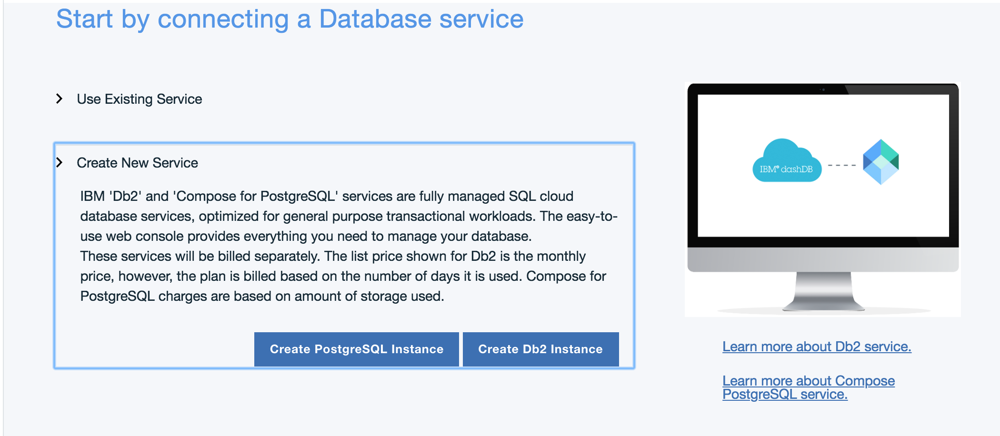

<!-- NLS_CHARSET=UTF-8 -->
## 개요
{: #overview }
이 학습서에서는 {{ site.data.keys.mf_bm_full }}(**{{ site.data.keys.mf_bm_short }}**) 서비스를 사용하여 IBM Cloud에 {{ site.data.keys.mfound_server }} 인스턴스를 설정하는 단계별 지시사항을 제공합니다.  
{{ site.data.keys.mf_bm_short }}은 **Liberty for Java 런타임**에 Mobile Foundation v8.0의 확장 가능한 개발자 환경과 프로덕션 환경을 빠르고 간편하게 설정할 수 있는 IBM Cloud 서비스입니다.

{{ site.data.keys.mf_bm_short }} 서비스는 다음과 같은 플랜 옵션을 제공합니다.

1. **Developer**: 이 플랜은 {{ site.data.keys.mfound_server }}를 Liberty for Java 런타임의 Cloud Foundry 애플리케이션으로 프로비저닝합니다. Liberty for Java 비용은 별도로 청구되며 이 플랜에 포함되지 않습니다. 이 플랜은 외부 데이터베이스의 사용을 지원하지 않으며 개발과 테스트에만 사용되도록 제한됩니다. Mobile Analytics는 6개월 동안 이벤트를 유지하는 기능과 함께 추가 비용 없이 제공됩니다. {{ site.data.keys.mf_bm_short }}서버 *Developer 플랜* 인스턴스를 사용해서 개발과 테스트에 사용할 모바일 애플리케이션을 등록할 수 있지만 이 경우 연결된 디바이스 수는 일일 10개로 제한됩니다.
<!--This plan also includes {{ site.data.keys.mf_analytics_service }} service instance. If your usage exceeds the Mobile Analytics free tier entitlements, then charges apply as per Mobile Analytics basic plan.-->

    > **참고:** Developer 플랜에서는 지속적 데이터베이스를 제공하지 않으므로 [문제점 해결 섹션](#troubleshooting)에 설명된 대로 구성을 백업하십시오.

2. **Professional(디바이스별):** 이 플랜을 사용하면 프로덕션에서 최대 5개 Mobile Foundation 모바일 애플리케이션을 빌드하고 테스트하며 실행할 수 있습니다. Mobile Analytics는 6개월 동안 이벤트를 유지하는 기능과 함께 추가 비용 없이 제공됩니다. 이 플랜에서는 대규모 배치 및 고가용성이 지원됩니다. 이 플랜에는 별도로 작성되고 청구되는 IBM Db2(**Lite** 플랜 외 모든 플랜) 또는 Compose for PostgreSQL 서비스의 인스턴스가 있어야 합니다. 이 플랜은 최소 1GB인 두 개의 노드에서 시작하여 *Liberty for Java*에서 Mobile Foundation 서버를 프로비저닝합니다. *Liberty for Java* 비용은 별도로 청구되며 이 플랜의 일부로 포함되지 않습니다. <!--Optionally, you can add  Mobile Analytics service instance. The Mobile Analytics service is billed separately.-->

3. **Professional 1 Application** 이 플랜을 사용하면 프로덕션에서 Mobile Foundation의 모바일 애플리케이션을 빌드하고 테스트하며 실행할 수 있습니다. Mobile Analytics는 6개월 동안 이벤트를 유지하는 기능과 함께 추가 비용 없이 제공됩니다. 일일 연결된 클라이언트 디바이스 수에 따라 비용이 청구됩니다. 이 플랜에서는 대규모 배치 및 고가용성이 지원됩니다. 이 플랜에는 별도로 작성되고 청구되는 IBM Db2(**Lite** 플랜 외 모든 플랜) 또는 Compose for PostgreSQL 서비스의 인스턴스가 있어야 합니다. 이 플랜은 최소 1GB인 두 개의 노드에서 시작하여 *Liberty for Java*에서 Mobile Foundation 서버를 작성합니다. *Liberty for Java* 비용은 별도로 청구되며 이 플랜의 일부로 포함되지 않습니다. <!--Optionally, you can add {{ site.data.keys.mf_analytics_service }} service instance by clicking the **Add Analytics** button. The Mobile Analytics service is billed separately.-->

4. **Developer Pro**: 이 플랜은 {{ site.data.keys.mfound_server }}를 Liberty for Java 런타임의 Cloud Foundry 앱으로 프로비저닝하며 사용자는 이 플랜을 사용해서 개수에 상관 없이 여러 모바일 애플리케이션을 개발하고 테스트할 수 있습니다. 이 플랜에는 **Db2**(**Lite** 플랜 외 모든 플랜) 서비스 인스턴스가 있어야 합니다. Db2 서비스 인스턴스는 별도로 작성되고 청구됩니다. 이 플랜은 크기가 제한되어 있으며 프로덕션이 아닌 팀 기반 개발 활동과 테스트 활동에 사용됩니다. 비용은 환경의 총 크기에 따라 다릅니다. <!--Optionally, you can add a {{ site.data.keys.mf_analytics_service }} service by clicking the **Add Analytics** button.-->
>_**Developer Pro** 플랜은 이제 더 이상 사용되지 않습니다._

5. **Professional(용량별):** 이 플랜을 사용하면 모바일 사용자 또는 디바이스의 수에 상관 없이 프로덕션에서 여러 모바일 애플리케이션을 빌드하고 테스트하며 실행할 수 있습니다. 이 플랜은 대규모 배치와 고가용성을 지원합니다. 플랜에는 **Db2**(**Lite** 플랜 외 모든 플랜) 서비스 인스턴스가 있어야 합니다. Db2 서비스 인스턴스는 별도로 작성되고 청구됩니다. 비용은 환경의 총 크기에 따라 다릅니다. <!--Optionally, you can add a {{ site.data.keys.mf_analytics_service }} service by clicking the **Add Analytics** button.-->
>_**Professional(용량별)** 플랜은 이제 더 이상 사용되지 않습니다._

> 사용 가능한 플랜과 해당 비용 청구에 대한 자세한 정보는 [서비스 세부사항](https://console.bluemix.net/catalog/services/mobile-foundation/)을 참조하십시오.

#### 다음으로 이동:
{: #jump-to}
- [Mobile Foundation 서비스 설정](#setting-up-the-mobile-foundation-service)
  - [*Developer* 플랜 설정](#setting-up-the-developer-plan)
  - [*Professional(단일 애플리케이션)* 및 *Professional(디바이스별)* 플랜 설정](#setting-up-the-professional-1-application-and-professional-per-device-plan)
- [Mobile Foundation 서비스 사용](#using-the-mobile-foundation-service)
  - [서버 구성](#server-configuration)
  - [고급 서버 구성](#advanced-server-configuration)
- [Mobile Foundation 서비스 플랜 마이그레이션](#migrating-mobile-foundation-service-plan)  
- [Mobile Foundation 서버 수정사항 적용](#applying-mobile-foundation-server-fixes)
- [서버 로그에 액세스](#accessing-server-logs)
    - [추적](#tracing)
- [문제점 해결](#troubleshooting)
- [추가 정보](#further-reading)

## {{ site.data.keys.mf_bm_short }} 서비스 설정
{: #setting-up-the-mobile-foundation-service }
사용 가능한 플랜을 설정하려면 먼저 다음 단계를 수행하십시오.

1. [bluemix.net](http://bluemix.net)으로 이동하여 로그인한 후 **카탈로그**를 클릭하십시오.
2. **Mobile Foundation**을 검색하고 바둑판식 옵션이 표시되면 클릭하십시오.
3. *선택사항*. 서비스 인스턴스의 사용자 정의 이름을 입력하거나 기본 제공된 이름을 사용하십시오.
4. 원하는 가격 책정 플랜을 선택한 후 **작성**을 클릭하십시오.

    

### *Developer* 플랜 설정
{: #setting-up-the-developer-plan }

{{ site.data.keys.mf_bm_short }} 서비스를 작성하여 {{ site.data.keys.mfound_server }}를 작성합니다.
  * 즉각적으로 {{ site.data.keys.mfound_server }}에 액세스하여 이 서버에 대해 작업할 수 있습니다.
  * CLI를 사용하여 {{ site.data.keys.mfound_server }}에 액세스하려면 IBM Cloud 콘솔의 왼쪽 탐색 패널에서 사용 가능한 **서비스 신임 정보**를 클릭할 때 사용할 수 있는 신임 정보가 필요합니다.

  

### *Professional(단일 애플리케이션)* 및 *Professional(디바이스별)* 플랜 설정
{: #setting-up-the-professional-1-application-n-professional-per-device-plan }
1. 이 플랜에는 외부 [Db2(**Lite** 플랜 외 모든 플랜) 데이터베이스 인스턴스](https://console.bluemix.net/catalog/services/db2/)가 필요합니다

    * 기존 Db2 서비스 인스턴스가 있는 경우에는 **기존 서비스 사용** 옵션을 선택하고 신임 정보를 제공하십시오.

        

    * 기존 Compose for PostgreSQL 서비스 인스턴스가 있는 경우에는 **기존 서비스 사용** 옵션을 선택하고 신임 정보를 제공하십시오.

        


    * 현재 Db2 또는 Compose for PostgreSQL 서비스 인스턴스가 없는 경우에는 **새 서비스 작성** 옵션을 선택하고 화면에 표시되는 지시사항을 수행하십시오.

       

2. {{ site.data.keys.mfound_server }}를 시작하십시오.
    - 서버 구성을 기본 레벨로 유지하고 **기본 서버 시작**을 클릭할 수 있습니다. 또는
    - [설정 탭](#advanced-server-configuration)에서 서버 구성을 업데이트하고 **고급 서버 시작**을 클릭할 수 있습니다.

    이 단계에서 Cloud Foundry 앱이 {{ site.data.keys.mf_bm_short }} 서비스용으로 생성되고 Mobile Foundation 환경은 초기화됩니다. 이 단계를 수행하는 데 5 - 10분 정도 걸릴 수 있습니다.

3. 인스턴스가 준비되면 [서비스를 사용](#using-the-mobile-foundation-service)할 수 있습니다.

    

## Mobile Foundation 서비스 사용
{: #using-the-mobile-foundation-service }

{{ site.data.keys.mfound_server }}가 이제 실행 중이므로 다음 대시보드가 표시됩니다.


<!--Click on **Add Analytics** to add {{ site.data.keys.mf_analytics_service }} support to your server instance.
Learn more in the [Adding Analytics support](#adding-analytics-support) section.-->

* {{ site.data.keys.mf_console }}을 열려면 **콘솔 실행**을 클릭하십시오. 기본 사용자 이름은 *admin*이며, 비밀번호는 비밀번호 필드의 눈 모양 아이콘을 클릭하여 표시할 수 있습니다.

  

* {{ site.data.keys.mf_console }}에서 **분석 콘솔**을 클릭하여 Mobile Analytics 콘솔을 열고 아래와 같이 분석 데이터를 보십시오.

  


### 서버 구성
{: #server-configuration }
기본 서버 인스턴스는 다음과 같이 구성됩니다.

* 단일 노드(서버 크기: "작음")
* 1GB 메모리
* 2GB 스토리지 용량

### 고급 서버 구성
{: #advanced-server-configuration }
**설정** 탭을 통해 다음을 사용하여 서버를 상세히 사용자 정의할 수 있습니다.

* 다양한 노드, 메모리, 스토리지 조합
* {{ site.data.keys.mf_console }} admin 비밀번호
* LTPA 키
* JNDI 구성
* 사용자 레지스트리
* TrustStore

  *Mobile Foundation 서비스에 대한 TrustStore 인증서 작성:*

  * IBM Java 또는 Oracle Java의 최신 수정팩 Java 8 JDK에서 *cacerts*를 가져오십시오.

  * 다음 명령을 사용하여 추가 인증서를 TrustStore로 가져오십시오.
    ```
    keytool -import -file firstCA.cert -alias firstCA -keystore truststore.jks
    ```

  >**참고** : 자체 TrustStore를 작성하도록 선택할 수 있지만 Mobile Foundation 서비스가 올바르게 작동하려면 기본 인증서를 사용해야 합니다.

<!--* {{ site.data.keys.mf_analytics_service }} configuration-->
* VPN


<!--
## Adding {{ site.data.keys.mf_analytics_service }} support
{: #adding-analytics-support }
You can add {{ site.data.keys.mf_analytics_service }} support to your {{ site.data.keys.mf_bm_short }} service instance by clicking on **Add Analytics** from the service's Dashboard page. This action provisions a {{ site.data.keys.mf_analytics_service }} service instance.

>When you create or recreate the **Developer** plan instance of {{ site.data.keys.mf_bm_short }} service, the {{ site.data.keys.mf_analytics_service }} service instance is added by default.
-->
<!--* When using the **Developer** plan this action will also automatically hook the {{ site.data.keys.mf_analytics_service }} service instance to your {{ site.data.keys.mf_server }} instance.  
* When using the **Developer Pro**, **Professional Per Capacity** or **Professional 1 Application** plans, this action will require additional input from you to select: amount of available Nodes, available Memory and a storage volume. -->
<!--
Once the operation finishes, reload the {{ site.data.keys.mf_console }} page in your browser to access the {{ site.data.keys.mf_analytics_service_console }}.  

> Learn more about {{ site.data.keys.mf_analytics_service }} in the [{{ site.data.keys.mf_analytics_service }} category](../../analytics).

##  Removing {{ site.data.keys.mf_analytics_service }} support
{: #removing-analytics-support}

You can remove the {{ site.data.keys.mf_analytics_service }} support for your {{ site.data.keys.mf_bm_short }} service instance by clicking on **Delete Analytics**  from the service’s Dashboard page. This action deletes the {{ site.data.keys.mf_analytics_service }} service instance.

Once the operation finishes, reload the {{ site.data.keys.mf_console }} page in your browser.
-->
<!--
##  Switching from Analytics deployed with IBM Containers to Analytics service
{: #switching-from-analytics-container-to-analytics-service}

>**Note**: Deleting {{ site.data.keys.mf_analytics_service }} will remove all available analytics data. This data will not be available in the new {{ site.data.keys.mf_analytics_service }} instance.

User can delete current container by clicking on **Delete Analytics** button from service dashboard. This will remove the analytics instance and enable the **Add Analytics** button, which the user can click to add a new {{ site.data.keys.mf_analytics_service }} service instance.
-->

## Mobile Foundation 서비스 플랜 마이그레이션
{: #migrating-mobile-foundation-service-plan }

더 이상 사용되지 않는 플랜을 사용하여 작성된 Mobile Foundation 인스턴스를 새 플랜으로 업데이트해야 합니다. 플랜 업데이트도 인스턴스 사용량에 따라서 필요할 수 있습니다.

### 샘플 시나리오: Professional(디바이스별) 플랜에서 Professional 1 Application 플랜으로 마이그레이션

1. IBM Cloud 대시보드에서 마이그레이션하려는 IBM Mobile Foundation 인스턴스를 선택하십시오.
2. 왼쪽 탐색에서 **플랜**을 선택하십시오.
   
3. 나열된 가격 책정 플랜에서 Professional 1 Application을 선택하십시오.
   
4. **저장** 단추를 클릭하고 플랜 마이그레이션을 확인하십시오.
     이제 Professional 1 Application으로의 마이그레이션이 완료되었으며 기존의 모든 데이터가 계속 유지됩니다. 청구가 변경되며 시스템 정지 시간은 없습니다.
5. 플랜 마이그레이션 후 올바른 구성이 적용되도록 서비스 대시보드에서 Mobile Foundation 인스턴스를 다시 작성해야 합니다. 이 업데이트에는 잠깐 동안 시스템 정지가 필요합니다. 시스템 정지에 대한 플랜이 필요합니다. 왼쪽 탐색에서 **관리**를 선택하고 **다시 작성**을 클릭하십시오.

>**참고:** 더 이상 사용되지 않은 플랜 중 하나를 이용하는 경우 새 플랜으로 마이그레이션해야 합니다.

### 지원되는 플랜 마이그레이션

* *Developer* (더 이상 사용되지 않음) 플랜은 새 *Developer* 플랜으로만 업데이트할 수 있습니다.
* *Developer Pro* (더 이상 사용되지 않음) 플랜은 *Professional(디바이스별)* 또는 *Professional 1 Application* 플랜으로만 업데이트할 수 있습니다.
* *Professional(용량별)* (더 이상 사용되지 않음) 플랜은 *Professional(디바이스별)* 또는 *Professional 1 Application* 플랜으로만 업데이트할 수 있습니다.
* *Professional(디바이스별)* 플랜은 *Professional 1 Application* 플랜으로만 업데이트할 수 있습니다.
* *Professional 1 Application* 플랜은 *Professional(디바이스별)* 플랜으로만 업데이트할 수 있습니다.
* 플랜 업데이트는 새 *Developer* 플랜에는 지원되지 않습니다.

## Mobile Foundation 서버 수정사항 적용
{: #applying-mobile-foundation-server-fixes }
{{ site.data.keys.mf_bm }} 서비스의 업데이트는 업데이트 수행에 동의하는 외에는 사용자 개입이 없어도 자동으로 적용됩니다. 사용 가능한 업데이트가 있는 경우 서비스의 대시보드 페이지에 지시사항, 조치 단추와 함께 배너가 표시됩니다.

## 서버 로그에 액세스
{: #accessing-server-logs }
서버 로그에 액세스하려면 아래에서 설명한 단계를 수행하십시오.

**시나리오 1:**

1. 호스트 시스템을 설정하십시오.<br/>
IBM Cloud Cloud Foundry 앱을 관리하려면 Cloud Foundry CLI를 설치해야 합니다.<br/>
[Cloud Foundry CLI](https://github.com/cloudfoundry/cli/releases)를 설치하십시오.
2. 터미널을 열고 `cf login`을 사용하여 *조직* 및 *영역*에 로그인하십시오.
3. CLI에서 다음 명령을 실행하십시오.
```bash
  cf ssh <mfp_Appname> -c "/bin/cat logs/messages.log" > messages.log
```
4. 추적이 사용 가능한 경우에만 다음 명령을 실행하십시오.
```bash
cf ssh <mfp_Appname> -c "/bin/cat logs/trace.log" > trace.log
 ```

**시나리오 2:**      

* 서버 로그에 액세스하려면 사이드바 탐색을 열고 **앱 → 대시보드 → Cloud Foundry 앱**을 클릭하십시오.
* 앱을 선택하고 **로그 → Kibana에서 보기**를 클릭하십시오.
* 로그 메시지를 선택하고 복사하십시오.


#### 추적
{: #tracing }
**trace.log** 파일에서 DEBUG 레벨 메시지를 보기 위해 추적을 사용하려면 다음을 수행하십시오.

1. **런타임 → SSH**에서 콤보 상자의 서비스 인스턴스(인스턴스 ID는 **0**으로 시작됨)를 선택하십시오.
2. 콘솔에서 각 인스턴스로 이동하고 vi 편집기를 사용하여 파일 `/home/vcap/app/wlp/usr/servers/mfp/configDropins/overrides/tracespec.xml`을 여십시오.
3. 다음 추적 명령문: `traceSpecification="=info:com.ibm.mfp.*=all"`을 업데이트하고 파일을 저장하십시오.

이제 위에 지정된 위치에서 **trace.log** 파일을 사용할 수 있습니다.


## 문제점 해결
{: #troubleshooting }
Developer 플랜에서는 지속적 데이터베이스를 제공하지 않으므로 때때로 데이터가 손실될 수 있습니다. 이런 경우 빨리 복구하려면 다음 우수 사례를 따르십시오.

* 다음과 같은 서버 측 조치를 수행하는 경우:
    * 어댑터 배치 또는 어댑터 구성이나 특성 값 업데이트
    * 범위 맵핑과 같은 보안 구성 수행

    명령행에서 다음을 실행하여 구성을 .zip 파일에 다운로드하십시오.

  ```bash
  $curl -X GET -u admin:admin -o export.zip http://<App Name>.mybluemix.net/mfpadmin/management-apis/2.0/runtimes/mfp/export/all
  ```

* 서버를 다시 작성하거나 구성이 손실된 경우에는 명령행에서 다음을 실행하여 서버에 구성을 가져오십시오.

  ```bash
  $curl -X POST -u admin:admin -F file=@./export.zip http://<App Name>.mybluemix.net/mfpadmin/management-apis/2.0/runtimes/mfp/deploy/multi
  ```

## 추가 정보
{: #further-reading }
이제 {{ site.data.keys.mfound_server }} 인스턴스가 작동하고 실행 중입니다.

* [{{ site.data.keys.mf_console }}](../../product-overview/components/console)에 익숙해지도록 하십시오.
* 이 [빠른 시작 학습서](../../quick-start)를 통해 Mobile Foundation을 경험하십시오.
* 모든 [사용 가능한 학습서](../../all-tutorials/)를 읽으십시오.
