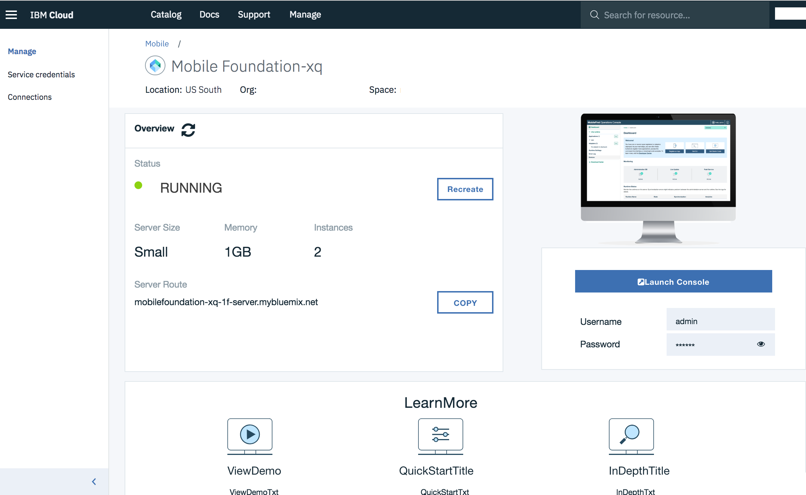
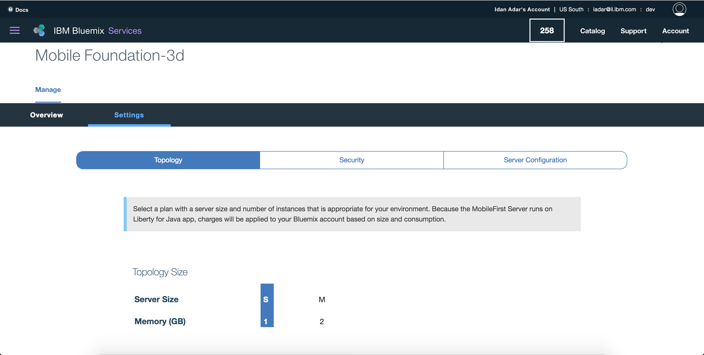

<!-- NLS_CHARSET=UTF-8 -->
## 개요
{: #overview }
이 학습서에서는 {{ site.data.keys.mf_bm_full }}(**{{ site.data.keys.mf_bm_short }}**) 서비스를 사용하여 Bluemix에 {{ site.data.keys.mf_server }} 인스턴스를 설정하는 단계별 지시사항을 제공합니다.   
{{ site.data.keys.mf_bm_short }}은 **Liberty for Java 런타임**에 MobileFirst Foundation v8.0의 확장 가능한 개발자 환경과 프로덕션 환경을 빠르고 간편하게 설정할 수 있는 Bluemix 서비스입니다. 

{{ site.data.keys.mf_bm_short }} 서비스는 다음과 같은 플랜 옵션을 제공합니다. 

1. **Developer**: 이 플랜은 {{ site.data.keys.mf_server }}를 Liberty for Java 런타임의 Cloud Foundry 앱으로 프로비저닝합니다. 이 플랜은 외부 데이터베이스의 사용 또는 다중 노드 정의를 지원하지 않으며 *개발과 테스트에만 사용되도록 제한됩니다*. 서버 인스턴스를 사용해 개발과 테스트에 사용할 모바일 애플리케이션을 개수에 상관 없이 등록할 수 있습니다. 이 계획에서 {{ site.data.keys.mf_analytics_service }} 서비스가 기본적으로 추가됩니다. 

    > **참고:** Developer 플랜에서는 지속적 데이터베이스를 제공하지 않으므로 [문제점 해결 섹션](#troubleshooting)에 설명된 대로 구성을 백업하십시오.


2. **Developer Pro**: 이 플랜은 {{ site.data.keys.mf_server }}를 Liberty for Java 런타임의 Cloud Foundry 앱으로 프로비저닝하며 사용자는 이 플랜을 사용해 개수에 상관 없이 여러 모바일 애플리케이션을 개발하고 테스트할 수 있습니다. 이 플랜을 사용하려면 **dashDB OLTP 서비스**가 있어야 합니다. dashDB 서비스는 별도로 작성되고 청구됩니다. 이 플랜은 크기가 제한되어 있으며 프로덕션이 아닌 팀 기반 개발 활동과 테스트 활동에 사용됩니다. 비용은 환경의 전체 크기에 따라 다릅니다. 선택적으로 **Analytics 추가** 단추를 클릭하여 {{ site.data.keys.mf_analytics_service }} 서비스를 추가할 수 있습니다. 

3. **Professional(용량별):** 이 플랜을 사용하면 모바일 사용자 또는 디바이스의 수에 상관 없이 프로덕션에서 여러 모바일 애플리케이션을 빌드하고 테스트하며 실행할 수 있습니다. 이 플랜은 대규모 배치와 고가용성을 지원합니다. 이 플랜을 사용하려면 **dashDB OLTP 서비스**가 있어야 합니다. dashDB 서비스는 별도로 작성되고 청구됩니다. 비용은 환경의 전체 크기에 따라 다릅니다. 선택적으로 **Analytics 추가** 단추를 클릭하여 {{ site.data.keys.mf_analytics_service }} 서비스를 추가할 수 있습니다. 

4. **Professional(단일 애플리케이션)**: 이 플랜은 Liberty for Java 런타임의 Cloud Foundry 앱에 {{ site.data.keys.mf_server }}를 프로비저닝합니다. 또한 이 플랜을 사용하려면 별도로 작성되고 청구되는 dashDB 데이터베이스 서비스가 필요합니다. 이 플랜을 사용하면 단일 모바일 애플리케이션을 빌드하고 관리할 수 있습니다. 단일 모바일 애플리케이션은 iOS, Android, Windows, Mobile Web과 같은 다중 플레이버로 구성될 수 있습니다. 선택적으로 **Analytics 추가** 단추를 클릭하여 {{ site.data.keys.mf_analytics_service }} 서비스를 추가할 수 있습니다. 

> 사용 가능한 플랜과 해당 청구에 대한 자세한 정보는 [Bluemix.net의 서비스 페이지](https://console.ng.bluemix.net/catalog/services/mobile-foundation/)를 참조하십시오.


#### 다음으로 이동:
{: #jump-to}
* [{{ site.data.keys.mf_bm_short }} 서비스 설정](#setting-up-the-mobile-foundation-service)
* [{{ site.data.keys.mf_bm_short }} 서비스 사용](#using-the-mobile-foundation-service)
* [서버 구성](#server-configuration)
* [고급 서버 구성](#advanced-server-configuration)
* [Analytics 지원 추가](#adding-analytics-support)
* [Analytics 지원 제거](#removing-analytics-support)
* [IBM Containers를 사용하여 배치된 Analytics에서 Analytics 서비스로 전환](#switching-from-analytics-container-to-analytics-service)
* [{{ site.data.keys.mf_server }} 수정사항 적용](#applying-mobilefirst-server-fixes)
* [서버 로그에 액세스](#accessing-server-logs)
* [문제점 해결](#troubleshooting)
* [추가 정보](#further-reading)

## {{ site.data.keys.mf_bm_short }} 서비스 설정
{: #setting-up-the-mobile-foundation-service }
사용 가능한 플랜을 설정하려면 먼저 다음 단계를 수행하십시오. 

1. [bluemix.net](http://bluemix.net)을 로드하고 로그인한 후 **카탈로그**를 클릭하십시오. 
2. **Mobile Foundation**을 검색하고 바둑판식 옵션이 표시되면 클릭하십시오. 
3. *선택사항*. 서비스 인스턴스의 사용자 정의 이름을 입력하거나 기본 제공된 이름을 사용하십시오. 
4. 원하는 가격 책정 플랜을 선택한 후 **작성**을 클릭하십시오. 

    

### *Developer* 플랜 설정
{: #setting-up-the-developer-plan }

{{ site.data.keys.mf_bm_short }} 서비스를 작성하여 {{ site.data.keys.mf_server }}를 작성합니다.
  * 즉각적으로 {{ site.data.keys.mf_server }}에 액세스하여 이 서버에 대해 작업할 수 있습니다. 
  * CLI를 사용하여 {{ site.data.keys.mf_server }}에 액세스하려면 Bluemix 콘솔의 왼쪽 탐색 패널에서 사용 가능한 **서비스 신임 정보**를 클릭할 때 사용할 수 있는 신임 정보가 필요합니다. 

  

### *Developer Pro* 플랜, *Professional(용량별)* 플랜, *Professional(단일 애플리케이션)* 플랜 설정
{: #setting-up-the-developer-pro-professional-percapacity-and-professional-1-application-plans }
1. 이들 플랜을 사용하려면 외부 [dashDB 트랜잭션 데이터베이스 인스턴스](https://console.ng.bluemix.net/catalog/services/dashdb/)가 필요합니다. 

    > [dashDB 데이터베이스 인스턴스 설정]({{site.baseurl}}/blog/2016/11/02/using-dashdb-service-with-mobile-foundation/)에 대해 자세히 알아보십시오.


    기존 dashDB 서비스 인스턴스(DashDB Enterprise Transactional 2.8.500 또는 Enterprise Transactional 12.128.1400)가 있는 경우에는 **기존 서비스 사용** 옵션을 선택하고 신임 정보를 제공하십시오. 

    

    1.b. 현재 dashDB 서비스 인스턴스가 없는 경우에는 **새 서비스 작성** 옵션을 선택하고 화면에 표시되는 지시사항을 수행하십시오. 

    

2. {{ site.data.keys.mf_server }}를 시작하십시오. 
    - 서버 구성을 기본 레벨로 유지하고 **기본 서버 시작**을 클릭할 수 있습니다. 또는
    - [설정 탭](#advanced-server-configuration)에서 서버 구성을 업데이트하고 **고급 서버 시작**을 클릭할 수 있습니다. 

    이 단계 중에 Cloud Foundry 앱이 {{ site.data.keys.mf_bm_short }} 서비스에 사용하도록 생성되고 MobileFirst Foundation 환경은 초기화 중입니다. 이 단계를 수행하는 데 5 - 10분 정도 걸릴 수 있습니다. 

3. 인스턴스가 준비되면 [서비스를 사용](#using-the-mobile-foundation-service)할 수 있습니다. 

    

## {{ site.data.keys.mf_bm_short }} 서비스 사용
{: #using-the-mobile-foundation-service }

{{ site.data.keys.mf_server }}가 이제 실행 중이므로 다음 대시보드가 표시됩니다. 



서버 인스턴스에 {{ site.data.keys.mf_analytics_service }} 지원을 추가하려면 **Analytics 추가**를 클릭하십시오.
[Analytics 지원 추가](#adding-analytics-support) 섹션에서 자세히 알아보십시오. 

{{ site.data.keys.mf_console }}을 열려면 **콘솔 실행**을 클릭하십시오. 기본 사용자 이름은 "admin"이며 "눈" 아이콘을 클릭하여 비밀번호를 표시할 수 있습니다. 


### 서버 구성
{: #server-configuration }
기본 서버 인스턴스는 다음과 같이 구성됩니다. 

* 단일 노드(서버 크기: "작음")
* 1GB 메모리
* 2GB 스토리지 용량

### 고급 서버 구성
{: #advanced-server-configuration }
**설정** 탭을 통해 다음을 사용하여 서버를 상세히 사용자 정의할 수 있습니다. 

* 다양한 노드, 메모리, 스토리지 조합
* {{ site.data.keys.mf_console }} admin 비밀번호
* LTPA 키
* JNDI 구성
* 사용자 레지스트리
* TrustStore
* {{ site.data.keys.mf_analytics_service }} 구성
* DashDB Enterprise Transactional 2.8.500 또는 Enterprise Transactional 12.128.1400 데이터베이스 선택사항(*Professional(단일 애플리케이션)* 플랜에서 사용 가능)
* VPN



## {{ site.data.keys.mf_analytics_service }} 지원 추가
{: #adding-analytics-support }
서비스의 대시보드 페이지에서 **Analytics 추가**를 클릭하여 {{ site.data.keys.mf_analytics_service }} 지원을 {{ site.data.keys.mf_bm_short }} 서비스 인스턴스에 추가할 수 있습니다. 이 조치는 {{ site.data.keys.mf_analytics_service }} 서비스 인스턴스를 프로비저닝합니다. 

>{{ site.data.keys.mf_bm_short }} 서비스의 **개발자** 플랜 인스턴스를 작성하거나 다시 작성하는 경우 기본적으로 {{ site.data.keys.mf_analytics_service }} 서비스 인스턴스가 추가됩니다.


<!--* When using the **Developer** plan this action will also automatically hook the {{ site.data.keys.mf_analytics_service }} service instance to your {{ site.data.keys.mf_server }} instance.  
* When using the **Developer Pro**, **Professional Per Capacity** or **Professional 1 Application** plans, this action will require additional input from you to select: amount of available Nodes, available Memory and a storage volume. -->

조작이 완료되면 브라우저에서 {{ site.data.keys.mf_console }} 페이지를 다시 로드하여 {{ site.data.keys.mf_analytics_service_console }}에 액세스하십시오.   

> [{{ site.data.keys.mf_analytics_service }} 카테고리](../../analytics)에서 {{ site.data.keys.mf_analytics_service }}에 대해 자세히 알아보십시오. 

##  {{ site.data.keys.mf_analytics_service }} 지원 제거
{: #removing-analytics-support}

서비스의 대시보드 페이지에서 **Analytics 삭제**를 클릭하여 {{ site.data.keys.mf_bm_short }} 서비스 인스턴스에 대한 {{ site.data.keys.mf_analytics_service }} 지원을 제거할 수 있습니다. 이 조치는 {{ site.data.keys.mf_analytics_service }} 서비스 인스턴스를 삭제합니다. 

조작이 완료되면 브라우저에서 {{ site.data.keys.mf_console }} 페이지를 다시 로드하십시오. 

##  IBM Containers를 사용하여 배치된 Analytics에서 Analytics 서비스로 전환
{: #switching-from-analytics-container-to-analytics-service}

>**참고**: {{ site.data.keys.mf_analytics_service }}를 삭제하면 사용 가능한 모든 분석 데이터가 제거됩니다. 이 데이터는 새 {{ site.data.keys.mf_analytics_service }} 인스턴스에서 사용할 수 없습니다.


사용자는 서비스 대시보드의 **Analytics 삭제** 단추를 클릭하여 현재 컨테이너를 삭제할 수 있습니다. 이로 인해 분석 인스턴스가 제거되고 새 {{ site.data.keys.mf_analytics_service }} 서비스 인스턴스를 추가하도록 사용자가 클릭할 수 있는 **Analytics 추가** 단추가 사용으로 설정됩니다. 

## {{ site.data.keys.mf_server }} 수정사항 적용
{: #applying-mobilefirst-server-fixes }
{{ site.data.keys.mf_bm }} 서비스의 업데이트는 업데이트 수행에 동의하는 외에는 사용자 개입이 없어도 자동으로 적용됩니다. 사용 가능한 업데이트가 있는 경우 서비스의 대시보드 페이지에 지시사항, 조치 단추와 함께 배너가 표시됩니다. 

## 서버 로그에 액세스
{: #accessing-server-logs }
서버 로그에 액세스하려면 아래에서 설명한 단계를 수행하십시오.

**시나리오 1:**

1. 호스트 시스템을 설정하십시오.<br/>
Bluemix Cloud Foundry 앱을 관리하려면 Cloud Foundry CLI를 설치해야 합니다. <br/>
[Cloud Foundry CLI](https://github.com/cloudfoundry/cli/releases)를 설치하십시오. 
2. 터미널을 열고 `cf login`을 사용하여 *조직* 및 *공간*에 로그인하십시오.
3. CLI에서 다음 명령을 실행하십시오.
```bash
  cf ssh <mfp_Appname> -c "/bin/cat logs/messages.log" > messages.log
```
4. 추적이 사용 가능한 경우에만 다음 명령을 실행하십시오.
```bash
cf ssh <mfp_Appname> -c "/bin/cat logs/trace.log" > trace.log
 ```

**시나리오 2:**      

* 서버 로그에 액세스하려면 사이드바 탐색을 열고 **앱 → 대시보드 → Cloud Foundry 앱**을 클릭하십시오. 
* 앱을 선택하고 **로그 → Kibana에서 보기**를 클릭하십시오.
* 로그 메시지를 선택하고 복사하십시오.


#### 추적
{: #tracing }
**trace.log** 파일에서 DEBUG 레벨 메시지를 보기 위해 추적을 사용하려면 다음을 수행하십시오. 

1. **런타임 → 메모리 및 인스턴스**에서 서비스 인스턴스(인스턴스 ID는 **0**으로 시작됨)를 선택하십시오. 
2. **추적** 조치 옵션을 클릭하십시오. 
3. 추적 명령문 `com.ibm.mfp.*=all`을 입력하고 **추적 제출**을 클릭하십시오.

이제 위에 지정된 위치에서 **trace.log** 파일을 사용할 수 있습니다. 


## 문제점 해결
{: #troubleshooting }
Developer 플랜에서는 지속적 데이터베이스를 제공하지 않으므로 때때로 데이터가 손실될 수 있습니다. 이런 경우 빨리 복구하려면 다음 우수 사례를 따르십시오. 

* 다음과 같은 서버 측 조치를 수행하는 경우:
    * 어댑터 배치 또는 어댑터 구성이나 특성 값 업데이트
    * 범위 맵핑과 같은 보안 구성 수행

    명령행에서 다음을 실행하여 구성을 .zip 파일에 다운로드하십시오. 

  ```bash
  $curl -X GET -u admin:admin -o export.zip http://<App Name>.mybluemix.net/mfpadmin/management-apis/2.0/runtimes/mfp/export/all
  ```

* 서버를 다시 작성하거나 구성이 손실된 경우에는 명령행에서 다음을 실행하여 서버에 구성을 가져오십시오. 

  ```bash
  $curl -X POST -u admin:admin -F file=@./export.zip http://<App Name>.mybluemix.net/mfpadmin/management-apis/2.0/runtimes/mfp/deploy/multi
  ```

## 추가 정보
{: #further-reading }
이제 {{ site.data.keys.mf_server }} 인스턴스가 작동하고 실행 중입니다. 

* [{{ site.data.keys.mf_console }}](../../product-overview/components/console)에 익숙해지도록 하십시오. 
* [빠른 시작 학습서](../../quick-start)를 통해 MobileFirst Foundation을 경험해보십시오. 
* 모든 [사용 가능한 학습서](../../all-tutorials/)를 읽으십시오. 
