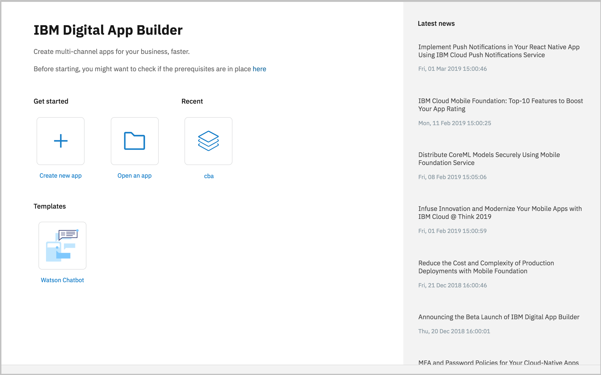
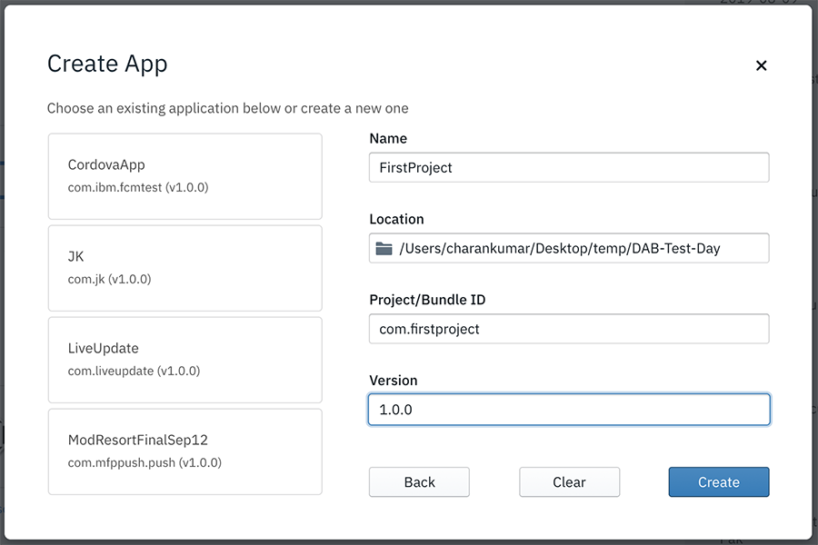

<!-- NLS_CHARSET=UTF-8 -->
## 개요
{: #getting-started }

다음에서 Digital App Builder를 실행할 수 있습니다.

* **MacOS**에서는 **IBM Digital App Builder 아이콘**을 두 번 클릭하여 Digital App Builder를 여십시오.
* **Windows**에서는 **시작 > 프로그램 > IBM Digital App Builder**를 선택하여 Digital App Builder를 실행하십시오.

>**참고**: Digital App Builder를 처음으로 여는 경우 플래시 화면에서 **IBM Digital App Builder 사용을 위한 라이센스**에 **동의**하고 계속 진행하십시오. 라이센스 계약에 동의한 후 자동으로 **필수 소프트웨어 확인**이 처음으로 실행됩니다. 오류가 없는 경우 **확인**을 클릭하여 진행하고 그렇지 않으면 오류를 수정한 후 Digital App Builder를 다시 시작하십시오.

**새 앱 작성** 또는 **앱 열기**가 가능하며 사용 가능한 템플리트를 사용하여 이후에 앱을 빌드할 수도 있습니다.
>**참고**: **최근** 섹션 아래에서 최근에 작성된 앱을 볼 수 있습니다. 새 설치의 경우 **최근** 섹션이 표시되지 않습니다.

### 새 앱 작성
{: #create-new-app }

빌더 대시보드에서 **새 앱 작성** 아이콘을 클릭하여 새 앱을 작성할 수 있습니다.

1. **새 앱 작성** 아이콘을 클릭하십시오. **채널 선택** 창이 표시됩니다.

    

2. 각 아이콘을 클릭하여 앱을 개발하려는 채널을 선택하십시오. 나중에 동일한 앱에 채널을 추가할 수 있습니다.

    * **Android**: Android 앱을 작성 중인 경우 이 옵션을 선택하십시오.
    * **iOS**: iOS 앱을 작성 중인 경우 이 옵션을 선택하십시오.
        >**참고**: MacOS에서만 iOS 앱을 빌드 및 실행할 수 있습니다.
    * **웹**: 웹을 위한 앱을 작성 중인 경우 이 옵션을 선택하십시오.
    * **PWA**: Progressive Web App을 작성 중인 경우 이 옵션을 선택하십시오.

3. **연결할 서버 유형 선택** 창이 표시됩니다.

    

4. **공유 Playground 서버** 또는 **사용자 정의 Professional 서버**를 선택할 수 있습니다.

    * **공유 Playground 서버 ** – 빠르게 시작하기 위해 IBM Cloud에서 호스팅된 공유 Mobile Foundation 서버입니다.

        >**경고**: 공유 Playground 서버는 다수의 개발자 간에 공유되는 공통 서버입니다. 이 서버를 프로덕션 앱용으로 사용해서는 안됩니다. 이 서버의 데이터는 알림 없이 삭제될 수 있습니다. 서버 가동시간은 보장되지 않습니다.

        

        * **IBM Cloud API 키**를 입력하십시오. 액세스 세부사항은 FAQ 섹션에서 [**플랫폼 API 키를 작성하는 방법**](../faq/)을 참조하십시오. 

        * **로그인**을 클릭하여 서버에 연결하십시오. 

    * **사용자 정의 Professional 서버** – IBM Cloud 또는 로컬에서 작성된 고유한 Mobile Foundation 서버에 연결할 수 있습니다. **IBM Mobile Foundation 인스턴스 구성** 창에서 기존 서버를 선택하거나 새 서버를 작성할 수 있습니다.

        
 
        **IBM Mobile Foundation 인스턴스 구성** 창에 이전에 정의한 Mobile Foundation 서버 인스턴스 목록이 표시됩니다. 서버 선택 시 **서버 이름**, **서버 URL**, **관리 사용자 이름**, **관리 비밀번호**가 표시됩니다. 새 서버를 정의하기 위해 **새 서버 작성** 링크를 클릭할 수 있습니다. 그러면 새 **IBM Mobile Foundation 인스턴스 구성** 창이 표시됩니다.

        

        * **서버 이름**, **서버 URL**, **관리 사용자 이름**, **관리 비밀번호**와 같은 새 IBM Mobile Foundation 인스턴스 세부사항을 입력하십시오.
            >**참고**: 선택된 서버 인스턴스에 대해 Mobile Foundation 서버 대시보드에서 서버 URL 및 로그인 인증 정보를 가져올 수 있습니다.
        * 선택적으로 데이터 뷰어의 데이터를 미리보기하기 위해 **사용자 이름**(기밀 클라이언트 사용자 이름) 및 **관리 비밀번호**를 제공하십시오.
        * **연결**을 클릭하십시오.

5. 로그인/연결 성공 시 사용자가 작성한 기존 앱 정의를 선택하거나 세부사항을 입력하여 새로 작성할 수 있는 **앱 작성** 창이 표시됩니다. 
    * 새 앱의 경우 다음을 제공하십시오. 애플리케이션의 **이름**, 프로젝트 파일이 저장되는 **위치**, **프로젝트/번들 ID**, 애플리케이션의 **버전**. 
 
        

    * **작성**을 클릭하여 애플리케이션을 작성하십시오. **워크벤치 시작** 창이 표시됩니다.
    * **시작하기**를 클릭하십시오. 그러면 새 애플리케이션 작성/기존 애플리케이션 수정을 위한 Digital App Builder 작업공간이 열립니다.

        

### 기존 앱 열기
{: #open-an-existing-app }
 
>**참고**: Digital App Builder만 사용하여 개발된 기존 앱을 열 수 있습니다.

다음 방법 중 하나로 기존 앱을 열 수 있습니다.

* 홈 페이지에서 **앱 열기**를 클릭하면 파일 탐색기가 열립니다. 앱 프로젝트 폴더로 이동하고 **확인**을 클릭하여 추가 편집을 위한 앱을 여십시오.
* 선택적으로, 최근 앱 목록에 나열되어 있는 경우 앱 이름을 두 번 클릭하여 앱을 열 수 있습니다.

### 템플리트 사용
{: #using-templates }

템플리트를 사용하여 애플리케이션을 빠르게 빌드할 수 있습니다. 이는 앱을 빠르게 수정하고 개발하도록 돕는 특정 기능 사용 앱 템플리트입니다. 현재 Watson 챗봇만 사용 가능합니다.

