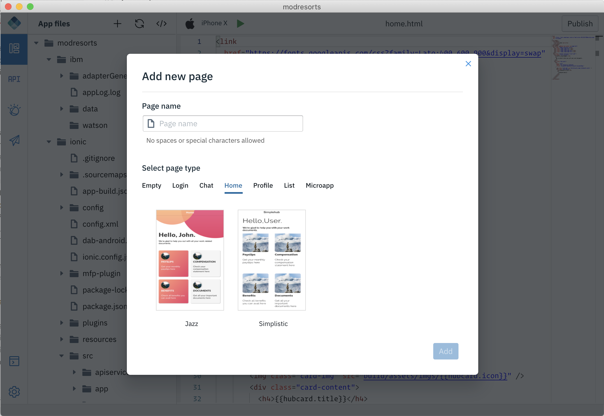
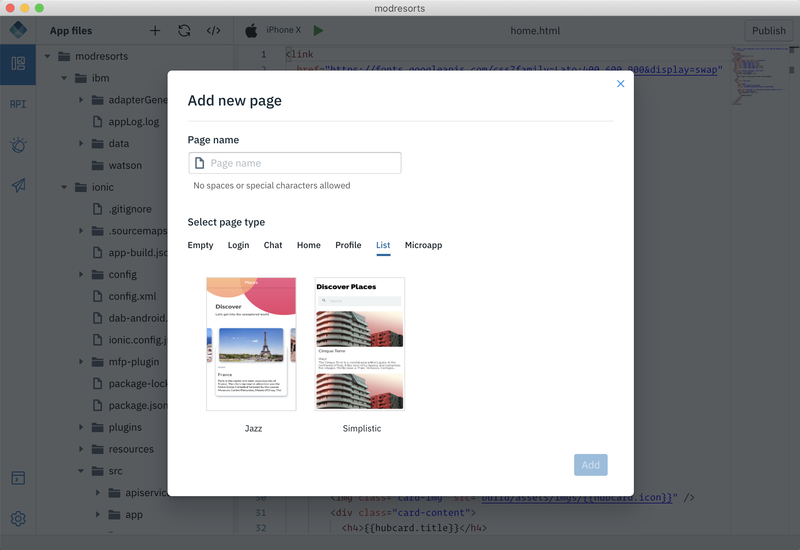

<!-- NLS_CHARSET=UTF-8 -->
## 앱에 페이지 템플리트 추가
{: #dab-page-templates }

IBM Digital App Builder에는 다음과 같은 페이지 템플리트가 있습니다.
* 공백
* 로그인
* 대화
* 홈
* 프로파일
* 목록
* 마이크로 앱

이러한 페이지 템플리트는 코드 프로젝트 내에서만 사용할 수 있습니다. 

### 코드 프로젝트에서 페이지 템플리트 추가
{: #adding-pg-template-code-project}

이러한 페이지 템플리트 중 하나를 앱에 추가하려면 다음을 수행하십시오.

1. **+** 단추/**새 페이지 추가** 단추를 선택하여 **새 페이지 추가** 화면으로 이동하십시오.

    

2. **페이지 이름**을 입력하십시오.
3. 적용될 페이지 유형 템플리트 및 스타일을 선택하십시오.

    
    

4. **추가**를 클릭하십시오.   
