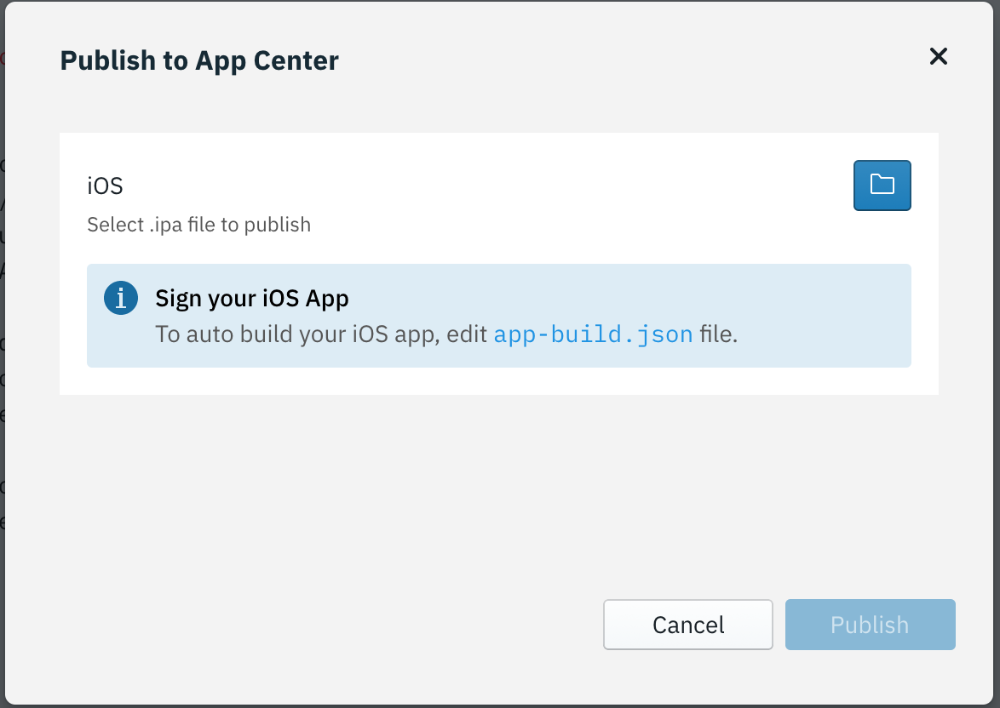

<!-- NLS_CHARSET=UTF-8 -->

## App Center에 앱 공개
{: #dab-app-publish }

IBM MobileFirst Foundation Application Center는 공용 앱 저장소와 유사한 모바일 애플리케이션의 저장소이지만, 조직이나 팀의 요구사항에 중점을 두고 있습니다. 이는 개인용 앱 저장소입니다. App Center에 대한 자세한 정보는 [여기](http://mobilefirstplatform.ibmcloud.com/tutorials/en/foundation/8.0/appcenter/app-center-tutorial/)를 참조하십시오.

Digital App Builder의 **공개** 기능을 사용하여 서버에서 저장소에 앱을 추가할 수 있습니다.

>**참고**: App Center에 공개하기 전에 오류 없이 앱이 빌드되었는지 확인하십시오.

1. 앱 프로젝트에서 **공개**를 클릭하십시오. 그러면 선택된 플랫폼의 팝업이 열립니다.

    

2. **App Center에 공개**를 클릭하십시오.

    

3. 기존 App Center를 선택하거나 **새로 연결**을 클릭하십시오. **연결**을 클릭하십시오.
4. 그러면 선택된 플랫폼의 패키지가 빌드됩니다.
5. *iOS 전용*: *app-build.json* 파일을 편집하고 `developmentTeam` 필드를 Apple 개발자 팀 ID로 업데이트하십시오. 팀 ID를 찾으려면 [Apple 개발자 계정](https://developer.apple.com/account/#/membership)에 로그인하십시오. 

    

6. 일단 패키지가 준비되면 **공개**를 클릭하십시오.
7. 공개가 완료되면 QR 코드가 생성됩니다.

    

8. **App Center** > **애플리케이션 관리**에 로그인하여 앱이 App Center에서 사용 가능한지 확인할 수 있습니다.

>**참고**: 필수 플랫폼을 다시 선택하고 앱을 빌드하여 이를 **App Center**에 공개할 수 있습니다.

