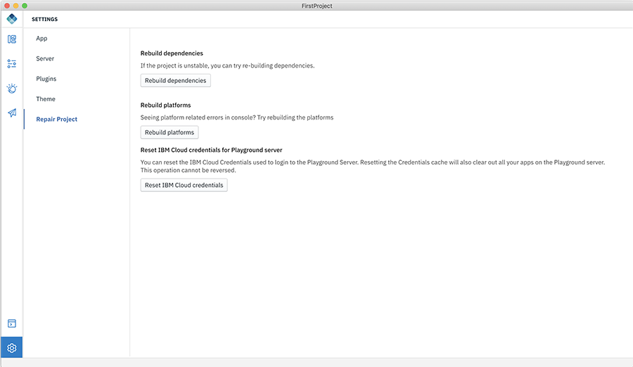

<!-- NLS_CHARSET=UTF-8 -->

## Digital App Builder 설정
{: #dab-app-settings }

설정은 앱 설정을 관리하고 빌드 프로세스 중에 오류를 수정하도록 돕습니다. 설정은 **앱 세부사항**, **서버**, **플러그인**, **테마** 및 **프로젝트 복구** 탭으로 구성됩니다.

### 앱 세부사항
{: #app-details}

앱 세부사항은 앱에 대한 정보를 표시합니다. **앱 아이콘**, **이름**, 파일이 저장되는 **위치**, 앱 작성 시 제공된 **프로젝트/번들 ID**, 선택된 **플랫폼**(채널), 사용으로 설정된 **서비스**.

아이콘을 클릭하고 새 아이콘을 업로드하여 **앱 아이콘**을 변경할 수 있습니다.

근처의 선택란을 선택/선택 해제하여 추가 플랫폼을 추가/제거할 수 있습니다.

**저장**을 클릭하여 변경사항을 업데이트하십시오.

### 서버
{: #server }

서버 정보는 사용자가 현재 작업 중인 **서버 세부사항**을 표시합니다. **편집** 링크를 클릭하여 정보를 편집할 수 있습니다. 기밀 클라이언트 권한을 추가하거나 수정할 수 있습니다.

서버 탭은 또한 **최근 서버**를 표시합니다.

>**참고**: Digital App Builder를 사용하여 앱을 작성할 때와 Digital App Builder가 작성한 앱에서 사용되지 않는 경우에만 이전에 추가된 서버를 삭제할 수 있습니다.

또한 **새로 연결 +** 단추를 클릭하여 새 서버를 추가하고 **새 서버에 연결** 팝업에서 세부사항을 제공하고 **연결**을 클릭할 수 있습니다.

### **플러그인**
{: #plugins}

플러그인은 Digital App Builder에서 사용할 수 있는 플러그인의 목록을 표시합니다. 다음 조치를 수행할 수 있습니다.

* **새로 설치** - 이 단추를 클릭하여 새 플러그인을 설치할 수 있습니다. 이는 **새 플러그인** 대화 상자를 표시합니다. **플러그인 이름**, **버전**(선택사항)을 입력하고 **로컬 플러그인**인 경우 동일한 스위치를 사용으로 설정하고 위치를 지정한 후 **설치**를 클릭하십시오.

* 이미 설치된 플러그인 목록에서 버전을 편집하고 플러그인을 재설치하거나 각 플러그인의 링크를 선택하여 플러그인을 설치 제거할 수 있습니다.

### 테마
{: #dab-theme}

앱의 테마(Dark 또는 Light)를 지정하여 앱의 룩앤필을 사용자 정의하십시오. 

### 프로젝트 복구
{: #repair-project}

프로젝트 복구 탭은 각 옵션을 클릭하여 문제를 수정하도록 돕습니다.

* **종속 항목 다시 빌드** - 프로젝트가 불안정한 경우 종속 항목 다시 빌드를 시도할 수 있습니다.
* **플랫폼 다시 빌드** - 콘솔에서 플랫폼 관련 오류가 표시되는 경우 플랫폼 다시 빌드를 시도하십시오. 채널에 대해 변경사항을 작성했거나 채널을 추가한 경우 이 옵션을 사용하십시오.
* **Playground 서버에 대해 IBM Cloud 인증 정보 재설정** - Playground 서버에 로그인하는 데 사용되는 IBM Cloud 인증 정보를 재설정할 수 있습니다. 인증 정보 캐시를 재설정하면 Playground 서버에서 모든 앱을 지웁니다. **이 오퍼레이션은 되돌릴 수 없습니다.**
