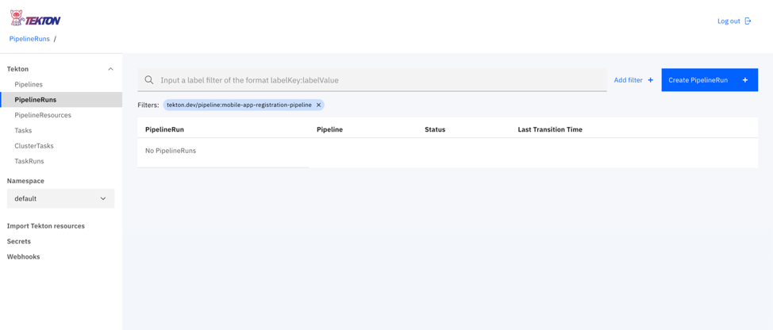
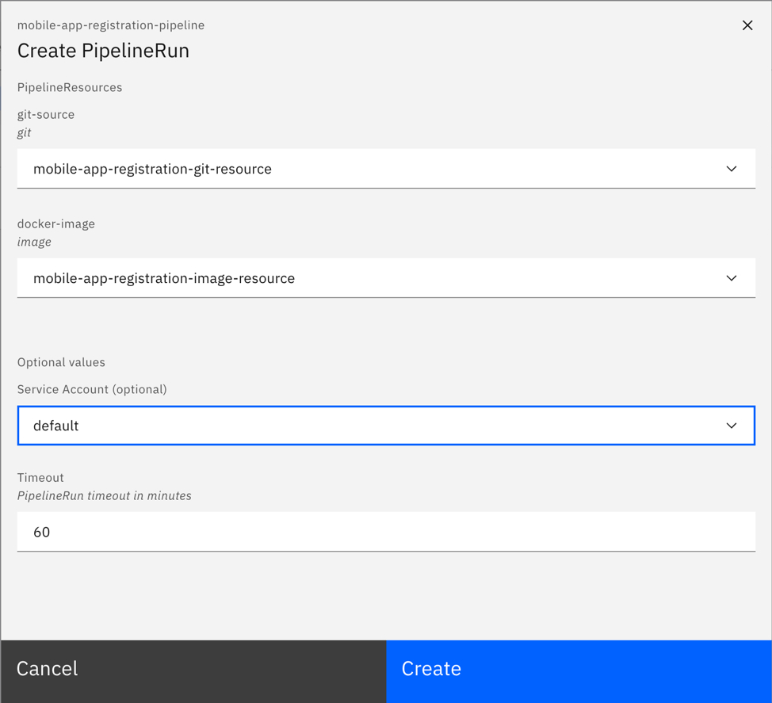
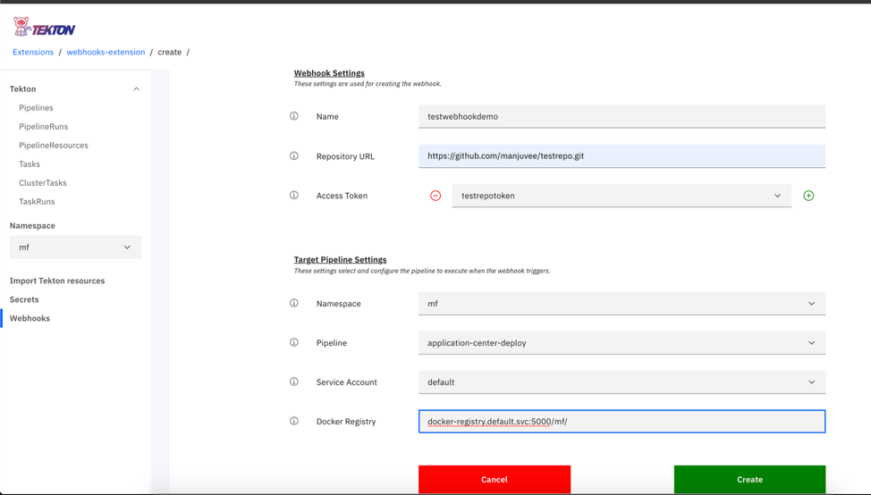
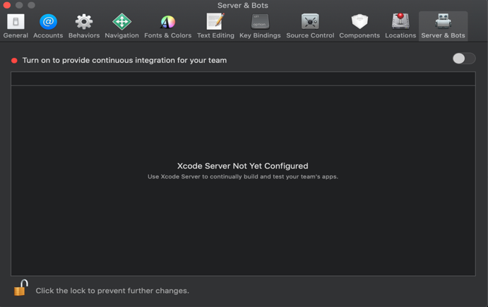

<!-- NLS_CHARSET=UTF-8 -->

Cloud Pak for Apps의 Mobile Foundation은 Mobile Foundation과 관련된 공통 DevOps 태스크를 자동화하기 위한 Tekton 파이프라인과 함께 번들로 제공됩니다.

>OCP(OpenShift Container Platform)에 Mobile Foundation을 배치하는 단계는 OCP 인타이틀먼트를 확보한 방법과 상관없이 동일합니다.

## 전제조건
{: #prereqs}

다음은 Mobile Foundation Operator를 사용하여 Mobile Foundation 인스턴스를 설치하는 프로세스를 시작하기 전의 전제조건입니다.

- Mobile Foundation이 설치된 [Cloud Pak For Apps](https://cloud.ibm.com/catalog/content/ibm-cp-applications)
- [OpenShift CLI](https://docs.openshift.com/enterprise/3.1/cli_reference/get_started_cli.html#installing-the-cli)(`oc`)
- Tekton(Cloud Pak for Apps의 일부로 사용 가능)


## Tekton 파이프라인
{: #tekton-pipelines}

다음 Tekton 파이프라인을 Cloud Pak for Apps의 Mobile Foundation에 사용할 수 있습니다.

1.	모바일 앱 구성 파이프라인(*mobile-app-registration-pipeline*)
2.	Android용 모바일 앱 빌드 파이프라인(*mobile-app-build-android-pipeline*)
3.	iOS용 모바일 앱 빌드 파이프라인(*mobile-app-build-ios-pipeline*)
4.	모바일 앱 배포 파이프라인(*application-center-deploy*)


### 파이프라인을 실행하기 위한 단계
{: #steps-for-running-the-pipelines}

* Mobile Foundation용 PPA를 [다운로드](https://www.ibm.com/software/passportadvantage/pao_customer.html)하십시오.
* `IBM-MobileFoundation-Openshift-Pak-<version>.tar.gz` 파일의 압축을 푸십시오.
* 압축을 푼 폴더의 위치로 `cd`하십시오.
* 아래 명령을 사용하여 Cloud Pak For Apps 인스턴스에 로그인하십시오.
  ```bash
  oc login --token=<access_token> --server=<server_instance>
  ```


#### 모바일 앱 구성 파이프라인
{: #mobile-app-configuration-pipeline}

다음 명령을 실행하십시오.
```bash
oc apply -f pipeline/mobile-app-registration -n <projectname>
```

다음은 생성된 출력입니다.

```text
pipelineresource.tekton.dev/mobile-app-registration-git-resource created
pipelineresource.tekton.dev/mobile-app-registration-image-resource created
pipeline.tekton.dev/mobile-app-registration-pipeline created
task.tekton.dev/mobile-app-registration-task created
```

#### Android용 모바일 앱 빌드 파이프라인
{: #mobile-app-build-pipeline-android}

**전제조건**
Android 빌드용 파이프라인을 사용하기 전에 *github-token*을 빌드 태스크에 추가해야 합니다. `pipeline/mobile-app-build-android/buildandroidapptask.yaml` 파일로 이동하여 **create-release** 단계에서 *{GITHUB_TOKEN}*이 포함된 플레이스홀더를 유효한 *github-token*으로 편집하십시오.

```yaml
  - name: create-release
    image: jimdo/github-release
    env:
      - name: "GITHUB_TOKEN"
        value: "{GITHUB_TOKEN}"
    command: ['/bin/bash']
```

전제조건을 처리한 후 다음 명령을 실행하십시오.
```bash
oc apply -f pipeline/mobile-app-build-android -n <projectname>
```

다음은 생성된 출력입니다.

```text
pipelineresource.tekton.dev/mobile-app-build-android-git-sresource created
pipeline.tekton.dev/mobile-app-build-android-pipeline created
task.tekton.dev/mobile-app-build-android-task created
pipelineresource.tekton.dev/mobile-app-build-android-image-resource created
```

#### iOS용 모바일 앱 빌드 파이프라인
{: #mobile-app-build-pipeline-ios}

**전제조건**
1. Android와 유사하게 `pipeline/mobile-app-build-ios/buildiosapptask.yaml` 파일의 *create-release* 단계에 GitHub 토큰을 추가해야 합니다.
2. 공용으로 액세스할 수 있는 Mac 시스템에 Xcode Server 설정이 있어야 합니다. *iOS 앱을 빌드하기 위한 Xcode Server 설정* 섹션을 참조하십시오.

전제조건을 처리한 후 다음 명령을 실행하십시오.
```bash
oc apply -f pipeline/mobile-app-build-ios -n <projectname>
```

다음은 생성된 출력입니다.

```text
pipeline.tekton.dev/mobile-app-build-ios-pipeline created
task.tekton.dev/mobile-app-build-ios-task created
pipelineresource.tekton.dev/mobile-app-build-ios-git-resource created
pipelineresource.tekton.dev/mobile-app-build-ios-image-resource created
```

#### 모바일 앱 배포 파이프라인
{: #mobile-app-dist-pipeline}

다음 명령을 실행하십시오.
```bash
oc apply -f pipeline/mobile-app-publish -n <projectname>
```

다음은 생성된 출력입니다.

```text
pipelineresource.tekton.dev/appcenter-git-resource created
pipelineresource.tekton.dev/appcenter-image-resource created
pipeline.tekton.dev/application-center-deploy created
task.tekton.dev/application-center-upload created
```

위의 명령은 태스크, 파이프라인 및 리소스를 작성합니다.
Tekton 대시보드에서 태스크, 리소스 및 파이프라인을 볼 수 있습니다.


### Tekton 대시보드에서 적절한 리소스로 파이프라인 실행
{: #running-tekton-pipelines}

애플리케이션의 적절한 Git 저장소 URL로 리소스 파일을 편집하십시오.

```text
pipeline/mobile-app-registration/appregistrationgitresource.yaml
pipeline/mobile-app-build-android/ buildandoridgitresource.yaml
pipeline/mobile-app-build-ios/ buildiosgitresource.yaml
pipeline/mobile-app-publish/mobileapppublishgitresource.yaml
```

Tekton 파이프라인의 리소스를 업데이트하기 위한 명령을 실행하십시오.

```bash
oc apply -f pipeline/mobile-app-registration/appregistrationgitresource.yaml -n <projectname>
```
다음은 생성된 출력입니다.

```text
pipelineresource.tekton.dev/mobile-app-registration-git-resource configured
```

Tekton 파이프라인의 리소스를 업데이트하기 위한 명령을 실행하십시오.

```bash
oc apply -f pipeline/mobile-app-build-andorid/buildandoridgitresource -n <projectname>
```
다음은 생성된 출력입니다.

```text
pipelineresource.tekton.dev/mobile-app-build-android-git-resource configured
```

Tekton 파이프라인의 리소스를 업데이트하기 위한 명령을 실행하십시오.

```bash
oc apply -f pipleline/mobile-app-build-ios/buildiosgitresource -n <projectname>
```
다음은 생성된 출력입니다.

```text
pipelineresource.tekton.dev/mobile-app-build-ios-git-resource configured
```

Tekton 파이프라인의 리소스를 업데이트하기 위한 명령을 실행하십시오.

```bash
oc apply -f pipeline/mobile-app-publish/mobileapppublishgitresource.yaml -n <projectname>
```

다음은 생성된 출력입니다.

```text
pipelineresource.tekton.dev/appcenter-git-resource configured
```

### PipelineRun을 사용하여 파이프라인 실행
{: #running-pipelines-pipelinerun}

애플리케이션 Git 저장소로 이동하여 프로젝트의 루트 폴더에 있는 파이프라인 구성 파일(예: `pipelineconfig.json` 파일)을 편집하십시오. 파일이 존재하지 않는 경우 GitHub 저장소의 루트 디렉토리 내에 호스트 이름, 포트, 환경 선택사항, XCode Server 세부사항 및 GitHub 세부사항이 포함된 json 파일 `pipelineconfig.json`을 작성하십시오.

파이프라인 구성 파일은 다음과 유사하게 표시되어야 합니다.

```json
{
	  "env_choice": "default",
	  "development": {
	    "hostname": "184.173.5.44",
	    "port": "30989",
	    "servercred": "admin:admin"
	  },
	  "production": {
	    "hostname": "184.173.5.44",
	    "port": "30989",
	    "servercred": "admin:admin"
	  },
	  "default": {
	    "hostname": "184.173.5.44",
	    "port": "30989",
	    "servercred": "admin:admin"
	  },
	  "userName":"github_user_name",
	  "repoName": "github_repo_name",
	  "ios": {
	     "host": "9.109.199.108",
	     "botId": "1f4a17d56578a822a49567af88000ead"
	  }
	}
```

Tekton 대시보드를 열고 **파이프라인** 섹션을 클릭하십시오.

1. 실행할 파이프라인을 클릭하십시오.
   

2. **PipelineRun 작성**을 클릭하십시오.
   

3. 위에서 작성된 **PipelineResources** git-source를 선택하십시오.
4. 위에서 작성된 **PipelineResources** docker-image를 선택하십시오.
5. **PipelineRun 작성**을 클릭하십시오.
   
6. PipelineRun의 로그 및 상태를 보려면 Tekton 대시보드로 이동하여 **PipelineRuns**를 선택하십시오.
   

### 웹 후크를 사용하여 파이프라인 트리거
{: #trigger-pipelines-webhook}

애플리케이션 Git 저장소에 변경사항이 있을 때마다 자동으로 *PipelineRun*을 트리거하려면 웹 후크를 사용하여 파이프라인을 실행하십시오.

#### 웹 후크 작성
{: #creation-of-webhooks}

1. Tekton 대시보드로 이동하여 왼쪽 탐색에서 **웹 후크**를 클릭하십시오.
2. **웹 후크 추가**를 클릭하십시오.
  
3. 웹 후크의 **이름**과 Tekton 대시보드에 표시할 랜덤 이름을 입력하십시오.
4. 애플리케이션 **저장소 URL**을 입력하십시오.
5. Git 저장소의 **액세스 토큰**을 제공하십시오.
6. 모든 파이프라인이 작성된 **네임스페이스**를 선택하십시오.
7. 트리거할 **파이프라인**을 선택하십시오.
8. 다른 계정을 사용하지 않는 경우 **서비스 계정**을 기본값으로 선택하십시오.
9. 클러스터의 **Docker 레지스트리**에 대한 세부사항을 제공하십시오.
  
10. **작성**을 클릭하십시오.

Git 저장소에 대한 모든 가져오기 요청은 등록된 파이프라인의 PipelineRun 작성을 트리거해야 합니다.
PipelineRun의 로그 및 상태를 보려면 Tekton 대시보드로 이동하여 **PipelineRuns**를 선택하십시오.

### iOS 앱을 빌드하기 위한 Xcode Server 설정
{: #xcode-setup-ios-apps}

1. Mac 시스템에서 Xcode를 설정하십시오.
2. Xcode를 여십시오.
3. 메뉴에서 **Xcode Server**를 선택하십시오.

4. 통합을 실행하기 위해 Xcode Server를 켜십시오.

5. 서버가 켜진 후 **권한** 섹션으로 이동하여 **봇 작성 및 보기** 옵션을 `all users`로 변경하십시오.

6. **계정** 섹션으로 이동하여 계정 유형이 `Xcode Server`인 새 계정을 추가한 후 사용 가능한 서버를 선택하십시오.
  
  
7. Xcode Server가 설정된 후 통합을 실행하고 `ipa`를 생성하기 위해 봇을 구성해야 합니다. Xcode에서 빌드하려는 iOS 프로젝트를 여십시오.
8. 프로젝트에 대한 빌드 로그로 이동하여 **그룹별** 옵션을 선택하십시오. 구성된 서버가 표시되어야 합니다.

9. 서버를 마우스 오른쪽 단추로 클릭한 후 **봇 작성**을 클릭하십시오.

10. 봇에 이름을 지정하고 **다음**을 클릭하십시오. 봇 이름에 공백이 포함되지 않았는지 확인하십시오. 봇에 대한 소스 제어를 구성하고 **다음**을 클릭하십시오.

11. **조치** 섹션의 빌드 구성에서 **아카이브** 옵션이 선택되었는지 확인하십시오. **내보내기** 옵션에서 *사용자 정의 내보내기 Plist 사용*을 선택하십시오. 다음 형식의 `plist` 파일이 있는지 확인하십시오.

12. **봇 통합 스케줄** 섹션에서 *수동으로* 실행하는 통합을 선택한 후 **다음**을 클릭하십시오.

13. 프로젝트에 대한 관련 빌드 옵션을 선택하고 **다음**을 클릭하십시오.
14. **인증서 및 프로파일** 섹션에서 `ipa` 생성에 필요한 관련 인증서 및 프로파일이 서버에 추가되었는지 확인하고 **다음**을 클릭하십시오.
15. **인수 및 환경 변수** 섹션에서 **다음**을 클릭하십시오. **트리거 ** 섹션에서 **추가**를 클릭하고 *사전 통합 스크립트*를 선택한 후 해당 스크립트에 이름을 지정하고 스크립트 섹션에서 앱에 대한 CocoaPod 종속 항목을 다운로드하는 다음 스크립트를 추가한 후 **작성**을 클릭하십시오.
    ```bash
    #!/bin/sh
    cd $XCS_PRIMARY_REPO_DIR
    PATH="/usr/local/bin:/usr/bin:/bin:/usr/sbin:/sbin:/opt/X11/bin:/Library/Frameworks/Mono.framework/Versions/Current/Commands"
    . ~/.bash_profile
    bundle install
    pod install --repo-update
    ```

16. 봇이 작성된 후 통합이 실행될 때까지 대기하십시오. 통합이 완료된 후 통합으로 이동하고 **로그**로 이동하십시오. 로그에서 *botId*를 볼 수 있어야 합니다. Tekton 파이프라인에서 통합을 실행하려면 *botId*가 필요합니다.


   
17. 이제 Xcode Server 설정이 완료되었습니다. 애플리케이션의 파이프라인 구성 파일을 `pipelineconfig.json`을 json 구조의 iOS 파트에 있는 *botId* 및 Xcode Server *host*로 업데이트하십시오. 이제 Tekton 파이프라인에서 `ipa`를 생성할 수 있습니다.  
    ```json
    "ios": {
      "host": "9.109.199.108",
      "botId": "1f4a17d56578a822a49567af88000ead"
    }
    ```
