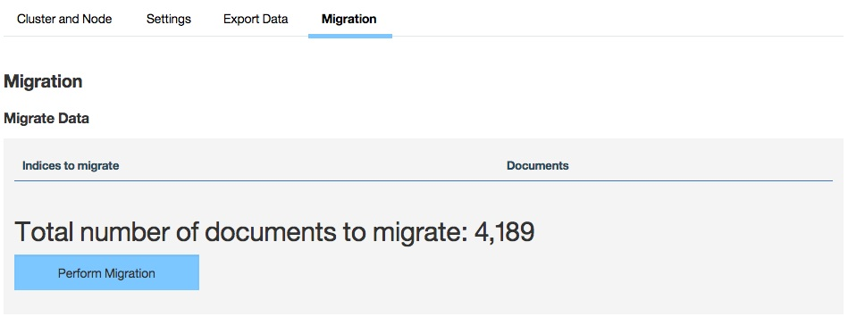

<!-- NLS_CHARSET=UTF-8 -->
## 개요
{: #overview }
{{ site.data.keys.mf_analytics_server }}는 두 개의 Java EE 표준 웹 애플리케이션 아카이브(WAR) 파일로 구성된 하나의 세트 또는 하나의 엔터프라이즈 애플리케이션 아카이브(EAR) 파일로 구현 및 제공됩니다. 따라서 지원되는 애플리케이션 서버인 WebSphere Application Server, WebSphere Application Server Liberty 또는 Apache Tomcat(WAR 파일 전용) 중 하나에서 설치될 수 있습니다.

{{ site.data.keys.mf_analytics_server }}는 데이터 저장 및 클러스터 관리를 위해 임베디드 Elasticsearch 라이브러리를 사용합니다. 빠른 디스크 I/O가 필요한 고성능 인메모리 검색 및 조회 엔진이 되도록 되어 있으므로 일부 프로덕션 시스템 요구사항을 수행해야 합니다. 일반적으로는 CPU가 문제가 되기 전에 메모리 및 디스크 부족이 발생할 수 있습니다(또는 디스크 I/O에서 성능 병목 현상이 발생함). 클러스터된 환경에서는 빠르고 신뢰할 수 있으며 동일한 호스트에 배치된 노드 클러스터를 원합니다.

#### 다음으로 이동
{: #jump-to }

* [시스템 요구사항](#system-requirements)
* [용량 고려사항](#capacity-considerations)
* [WebSphere Application Server Liberty에 {{ site.data.keys.mf_analytics }} 설치](#installing-mobilefirst-analytics-on-websphere-application-server-liberty)
* [Tomcat에 {{ site.data.keys.mf_analytics }} 설치](#installing-mobilefirst-analytics-on-tomcat)
* [WebSphere Application Server에 {{ site.data.keys.mf_analytics }} 설치](#installing-mobilefirst-analytics-on-websphere-application-server)
* [Ant 태스크를 사용한 {{ site.data.keys.mf_analytics }} 설치](#installing-mobilefirst-analytics-with-ant-tasks)
* [이전 버전을 실행 중인 서버에 {{ site.data.keys.mf_analytics_server }} 설치](#installing-mobilefirst-analytics-server-on-servers-running-previous-versions)

## 시스템 요구사항
{: #system-requirements }

### 운영 체제
{: #operating-systems }
* CentOS/RHEL 6.x/7.x
* RHEL 커널이 있는 Oracle Enterprise Linux 6/7 전용
* Ubuntu 12.04/14.04
* SLES 11/12
* OpenSuSE 13.2
* Windows Server 2012/R2
* Debian 7

### JVM
{: #jvm }
* Oracle JVM 1.7u55+
* Oracle JVM 1.8u20+
* IcedTea OpenJDK 1.7.0.55+

### 하드웨어
{: #hardware }
* RAM: RAM은 클수록 좋지만 노드당 64GB 이하여야 합니다. 32GB 및 16GB도 승인할 수 있습니다. 8GB 미만인 경우 클러스터에 다수의 작은 노드가 필요하고 64GB는 지나치게 커서 Java가 포인터에 메모리를 사용하는 방식으로 인해 문제가 발생할 수 있습니다.
* 디스크: 가능하면 SSD를 사용하고 SSD를 사용할 수 없는 경우에는 RAID 0 구성의 고속 스핀 일반 디스크를 사용하십시오.
* CPU: CPU는 성능 병목 현상이 나타나지 않도록 되어 있습니다. 코어가 2개 - 8개 있는 시스템을 사용하십시오.
* 네트워크: 수평으로 용량을 확장해야 하는 경우에는 1GbE - 10GbE의 속도를 지원하는 고속의 신뢰할 수 있는 데이터 센터가 필요합니다.

### 하드웨어 구성
{: #hardware-configuration }
* JVM에 사용 가능한 RAM의 절반을 제공하되 32GB는 넘지 마십시오.
    * **ES\_HEAP\_SIZE** 환경 변수를 32g로 설정
    * -Xmx32g -Xms32g를 사용하여 JVM 플래그 설정
* 디스크 스왑을 끄십시오. 운영 체제가 디스크에서 힙 스왑을 켜고 끌 수 있도록 허용하면 성능이 심각하게 저하됩니다.
    * 임시: `sudo swapoff -a`
    * 영구: 운영 체제 문서를 따라 **/etc/fstab**를 편집하십시오.
    * 옵션이 둘 다 가능하지 않은 경우 Elasticsearch 옵션 **bootstrap.mlockall: true**를 설정하십시오(이 값은 임베디드 Elasticsearch 인스턴스에서 기본값임).
* 허용된 열린 파일 디스크립터를 늘리십시오.
    * Linux는 일반적으로 프로세스당 열린 파일 디스크립터 수를 작은 값인 1024로 제한합니다.
    * 운영 체제 문서를 참조하여 영구적으로 이 값을 훨씬 더 큰 값(예: 64,000)으로 늘리는 방법을 알아보십시오.
* Elasticsearch에서는 다양한 파일에 대해 NioFS와 MMapFS를 혼합해서 사용하기도 합니다. 맵핑된 파일에서 가상 메모리를 많이 사용할 수 있도록 최대 맵 수를 늘리십시오.
    * 임시: `sysctl -w vm.max_map_count=262144`
    * 영구: **/etc/sysctl.conf**에서 **vm.max\_map\_count** 설정을 수정하십시오.
* BSDs 및 Linux를 사용하는 경우에는 운영 체제 I/O 스케줄러를 **cfq**가 아니라 **deadline** 또는 **noop**로 설정해야 합니다.

## 용량 고려사항
{: #capacity-considerations }
용량은 가장 일반적인 질문입니다. 필요한 RAM은 얼마인가? 디스크 공간은? 노드 수는? 대답은 항상 '경우에 따라 다르다'입니다.

IBM {{ site.data.keys.mf_analytics }}는 원시 클라이언트 SDK 디버그 로그, 서버에서 보고된 네트워크 이벤트, 사용자 정의 데이터 등을 포함한 다수의 이기종 이벤트 유형을 수집할 수 있는 기회를 제공합니다. 이는 빅 데이터 시스템 요구사항을 가진 빅 데이터 시스템입니다.

수집하도록 선택하는 데이터의 유형 및 크기와 이를 보존하도록 선택하는 기간은 스토리지 요구사항 및 전체 성능에 큰 영향을 미칩니다. 예를 들어, 다음과 같은 질문을 생각해 보십시오.

* 1개월 후에 원시 디버그 클라이언트 로그가 유용합니까?
* {{ site.data.keys.mf_analytics }}의 **경보** 기능을 사용 중입니까? 사용 중인 경우에는 마지막 몇 분 또는 더 긴 기간 동안 발생한 이벤트를 조회합니까?
* 사용자 정의 차트를 사용 중입니까? 사용 중인 경우에는 기본 제공 데이터 또는 사용자 정의 인스트루먼테이션 키/값 쌍에 대해 해당 차트를 작성합니까? 얼마 동안 데이터를 보관합니까?

{{ site.data.keys.mf_analytics_console }}의 기본 제공 차트는 {{ site.data.keys.mf_analytics_server }}가 이미 요약하고 가장 빠른 가능한 콘솔 사용자 경험을 위해 고유하게 최적화한 데이터를 조회하여 렌더링됩니다. 이 데이터는 미리 요약되고 기본 제공 차트에 대해 최적화되었으므로 콘솔 사용자가 조회를 정의하는 사용자 정의 차트 또는 경보에 사용하기에는 적합하지 않습니다.

원시 문서를 조회하고 필터를 적용하고 집계를 수행하고 기본 조회 엔진에 평균 및 백분율을 계산하도록 요청하면 조회 성능이 필연적으로 저하됩니다. 이러한 경우가 바로 용량을 주의해서 고려해야 하는 유스 케이스입니다. 조회 성능이 저하되면 실시간 콘솔 가시성을 위해 오래된 데이터를 보존해야 하는지 아니면 {{ site.data.keys.mf_analytics_server }}에서 제거해야 하는지를 결정해야 합니다. 4개월 전의 데이터에 대해 실시간 콘솔 가시성이 정말 유용할까요?

### 색인, 샤드 및 노드
{: #indicies-shards-and-nodes }
기본 데이터 저장소는 Elasticsearch입니다. 색인, 샤드 및 노드와 구성이 성능에 미치는 영향에 대해 조금이라도 알고 있어야 합니다. 대략 색인을 데이터의 논리 단위로 간주할 수 있습니다. 색인은 구성 키가 shards인 샤드에 일대다로 맵핑됩니다. {{ site.data.keys.mf_analytics_server }}는 문서 유형마다 별도의 색인을 작성합니다. 구성이 문서 유형을 버리지 않는 경우 작성되는 색인 수는 {{ site.data.keys.mf_analytics_server }}에서 제공하는 문서 유형 수와 같습니다.

shards를 1로 구성하면 각 색인에는 데이터가 작성된 하나의 기본 샤드만 있습니다. shards를 10으로 설정하면 각 색인의 샤드는 10개로 조정될 수 있습니다. 하지만 노드가 하나만 있을 때 샤드가 많으면 성능이 저하됩니다. 이 하나의 노드가 이제 동일한 실제 디스크에서 각 색인의 샤드를 10개로 조정합니다. 즉시(또는 거의 즉시) 클러스터에서 실제 노드를 10개로 늘릴 계획인 경우에만 shards를 10으로 설정하십시오.

동일한 원칙이 **replicas**에 적용됩니다. 즉시(또는 거의 즉시) 노드 수를 계산에 맞게 늘리려는 경우에만 **replicas**를 0보다 큰 값으로 설정하십시오.  
예를 들어, **shards**를 4로 설정하고 **replicas**를 2로 설정하면 노드 수를 8개(4 * 2)로 늘릴 수 있습니다.

## WebSphere Application Server Liberty에 {{ site.data.keys.mf_analytics }} 설치
{: #installing-mobilefirst-analytics-on-websphere-application-server-liberty }
{{ site.data.keys.mf_analytics }} EAR 파일을 이미 가지고 있는지 확인하십시오. 설치 아티팩트에 대한 자세한 정보는 [애플리케이션 서버에 {{ site.data.keys.mf_server }} 설치](../../prod-env/appserver)를 참조하십시오. **analytics.ear** 파일은 `<mf_server_install_dir>\analytics` 폴더에 있습니다. WebSphere Application Server Liberty를 다운로드하여 설치하는 방법에 대한 자세한 정보는 IBM developerWorks에서 [WebSphere Liberty 정보](https://developer.ibm.com/wasdev/websphere-liberty/) 기사를 참조하십시오.

1. **./wlp/bin** 폴더에서 다음 명령을 실행하여 서버를 작성하십시오.

   ```bash
   ./server create <serverName>
   ```

2. **./bin** 폴더에서 다음 명령을 실행하여 다음과 같은 기능을 설치하십시오.

   ```bash
   ./featureManager install jsp-2.2 ssl-1.0 appSecurity-1.0 localConnector-1.0
   ```

3. **analytics.ear** 파일을 Liberty 서버의 `./usr/servers/<serverName>/apps` 폴더에 추가하십시오.
4. `./usr/servers/<serverName>/server.xml` 파일의 `<featureManager>` 태그 컨텐츠를 다음 컨텐츠로 바꾸십시오.

   ```xml
   <featureManager>
        <feature>jsp-2.2</feature>
        <feature>ssl-1.0</feature>
        <feature>appSecurity-1.0</feature>
        <feature>localConnector-1.0</feature>
   </featureManager>
   ```

5. **server.xml** 파일에서 **analytics.ear**을 역할 기반 보안이 설정된 애플리케이션으로 구성하십시오. 다음 예에서는 기본 하드코딩된 사용자 레지스트리를 작성하고 사용자를 각각의 서로 다른 분석 역할에 지정합니다.

   ```xml
   <application location="analytics.ear" name="analytics-ear" type="ear">
        <application-bnd>
            <security-role name="analytics_administrator">
                <user name="admin"/>
            </security-role>
            <security-role name="analytics_infrastructure">
                <user name="infrastructure"/>
            </security-role>
            <security-role name="analytics_support">
                <user name="support"/>
            </security-role>
            <security-role name="analytics_developer">
                <user name="developer"/>
            </security-role>
            <security-role name="analytics_business">
                <user name="business"/>
            </security-role>
        </application-bnd>
   </application>

   <basicRegistry id="worklight" realm="worklightRealm">
        <user name="business" password="demo"/>
        <user name="developer" password="demo"/>
        <user name="support" password="demo"/>
        <user name="infrastructure" password="demo"/>
        <user name="admin" password="admin"/>
   </basicRegistry>
   ```

   > 기타 사용자 레지스트리 유형(예: LDAP) 구성 방법에 대한 자세한 정보는 WebSphere Application Server 제품 문서에서 [Liberty에 대한 사용자 레지스트리 구성](http://ibm.biz/knowctr#SSAW57_8.5.5/com.ibm.websphere.wlp.nd.iseries.doc/ae/twlp_sec_registries.html) 주제를 참조하십시오.

6. **bin** 폴더에서 다음 명령을 실행하여 Liberty 서버를 시작하십시오.

   ```bash
   ./server start <serverName>
   ```

7. {{ site.data.keys.mf_analytics_console }}로 이동하십시오.

   ```bash
   http://localhost:9080/analytics/console
   ```

WebSphere Application Server Liberty 관리에 대한 자세한 정보는 WebSphere Application Server 제품 문서에서 [명령행에서 Liberty 관리](http://ibm.biz/knowctr#SSAW57_8.5.5/com.ibm.websphere.wlp.nd.multiplatform.doc/ae/twlp_admin_script.html) 주제를 참조하십시오.

## Tomcat에 {{ site.data.keys.mf_analytics }} 설치
{: #installing-mobilefirst-analytics-on-tomcat }
{{ site.data.keys.mf_analytics }} WAR 파일을 이미 가지고 있는지 확인하십시오. 설치 아티팩트에 대한 자세한 정보는 [애플리케이션 서버에 {{ site.data.keys.mf_server }} 설치](../../prod-env/appserver)를 참조하십시오. **analytics-ui.war** 및 **analytics-service.war** 파일은 **<mf_server_install_dir>\analytics** 폴더에 있습니다. Tomcat 다운로드 및 설치 방법에 대한 자세한 정보는 [Apache Tomcat](http://tomcat.apache.org/)을 참조하십시오. Java 7 이상을 지원하는 버전을 다운로드해야 합니다. Java 7을 지원하는 Tomcat 버전에 대한 자세한 정보는 [Apache Tomcat 버전](http://tomcat.apache.org/whichversion.html)을 참조하십시오.

1. **analytics-service.war** 및 **analytics-ui.war** 파일을 Tomcat **webapps** 폴더에 추가하십시오.
2. **conf/server.xml** 파일에서 다음 섹션을 주석 해제하십시오. 이 섹션은 새로 다운로드한 Tomcat 아카이브에 주석 처리된 상태로 있습니다.

   ```xml
   <Valve className="org.apache.catalina.authenticator.SingleSignOn"/>
   ```

3. **conf/server.xml** 파일에서 두 개의 war 파일을 선언하고 사용자 레지스트리를 정의하십시오.

   ```xml
   <Context docBase ="analytics-service" path ="/analytics-service"></Context>
   <Context docBase ="analytics" path ="/analytics"></Context>
   <Realm className ="org.apache.catalina.realm.MemoryRealm"/>
   ```

   **MemoryRealm**은 **conf/tomcat-users.xml** 파일에서 정의되는 사용자를 인식합니다. 기타 선택사항에 대한 자세한 정보는 [Apache Tomcat 영역 구성 방법](http://tomcat.apache.org/tomcat-7.0-doc/realm-howto.html)을 참조하십시오.

4. 다음 섹션을 **conf/tomcat-users.xml** 파일에 추가하여 **MemoryRealm**을 구성하십시오.
    * 보안 역할을 추가하십시오.

      ```xml
      <role rolename="analytics_administrator"/>
      <role rolename="analytics_infrastructure"/>
      <role rolename="analytics_support"/>
      <role rolename="analytics_developer"/>
      <role rolename="analytics_business"/>
      ```
    * 원하는 역할을 가진 몇몇 사용자를 추가하십시오.

      ```xml
      <user name="admin" password="admin" roles="analytics_administrator"/>
      <user name="support" password="demo" roles="analytics_support"/>
      <user name="business" password="demo" roles="analytics_business"/>
      <user name="developer" password="demo" roles="analytics_developer"/>
      <user name="infrastructure" password="demo" roles="analytics_infrastructure"/>
      ```    
    * Tomcat Server를 시작하고 {{ site.data.keys.mf_analytics_console }}로 이동하십시오.

      ```xml
      http://localhost:8080/analytics/console
      ```

    Tomcat Server를 시작하는 방법에 대한 자세한 정보는 공식 Tomcat 사이트를 참조하십시오. 예를 들어, Tomcat 7.0의 경우 [Apache Tomcat 7](http://tomcat.apache.org/tomcat-7.0-doc/introduction.html)입니다.

## WebSphere Application Server에 {{ site.data.keys.mf_analytics }} 설치
{: #installing-mobilefirst-analytics-on-websphere-application-server }
설치 아티팩트(JAR 및 EAR 파일) 확보를 위한 초기 설치 단계에 대한 자세한 정보는 [애플리케이션 서버에 {{ site.data.keys.mf_server }} 설치](../../prod-env/appserver)를 참조하십시오. **analytics.ear**, **analytics-ui.war** 및 **analytics-service.war** 파일은 **<mf_server_install_dir>\analytics** 폴더에 있습니다.

다음의 단계에서는 WebSphere Application Server에서 Analytics EAR 파일을 설치하고 실행하는 방법을 설명합니다. WebSphere Application Server에 개별 WAR 파일을 설치하는 경우에는 두 WAR 파일을 모두 배치한 후 **analytics-service** WAR 파일에서 2단계 - 7단계만 수행하십시오.  analytics-ui WAR 파일에서 클래스 로드 순서를 변경해서는 안 됩니다.

1. EAR 파일을 애플리케이션 서버에 배치하되 시작하지는 마십시오. WebSphere Application Server에 EAR 파일을 설치하는 방법에 대한 자세한 정보는 WebSphere Application Server 제품 문서에서 [콘솔을 사용한 엔터프라이즈 애플리케이션 파일 설치](http://ibm.biz/knowctr#SSAW57_8.5.5/com.ibm.websphere.nd.multiplatform.doc/ae/trun_app_instwiz.html) 주제를 참조하십시오.

2. **엔터프라이즈 애플리케이션** 목록에서 **MobileFirst Analytics** 애플리케이션을 선택하십시오.

    

3. **클래스 로드 및 업데이트 발견**을 클릭하십시오.

    

4. 클래스 로드 순서를 **상위 마지막**으로 설정하십시오.

    

5. **사용자/그룹에 보안 역할 맵핑**을 클릭하여 관리자를 맵핑하십시오.

    

6. **모듈 관리**를 클릭하십시오.

    

7. **Analytics** 모듈을 선택한 후 클래스 로더 순서를 **상위 마지막**으로 변경하십시오.

    

8. WebSphere Application Server 관리 콘솔에서 **관리 보안** 및 **애플리케이션 보안**을 사용으로 설정하십시오.
    * WebSphere Application Server 관리 콘솔에 로그인하십시오.
    * **보안 > 글로벌 보안** 메뉴에서 **관리 보안 사용**과 **애플리케이션 보안 사용**이 모두 선택되어 있는지 확인하십시오. 참고: 애플리케이션 보안은 **관리 보안**이 사용으로 설정된 후에만 선택할 수 있습니다.
    * **확인**을 클릭하고 변경사항을 저장하십시오.

9. Swagger 문서를 통해 분석 서비스에 액세스할 수 있도록 하려면 다음 단계를 완료하십시오.
    * **서버 > 서버 유형 > WebSphere 애플리케이션 서버**를 클릭하여 서버 목록에서 분석 서비스를 배치할 서버를 선택하십시오.
    * **서버 인프라**에서 **Java**를 클릭한 다음 **프로세스 관리 > 프로세스 정의 > Java 가상 머신 > 사용자 정의 특성**을 탐색하십시오.
      - 다음 사용자 정의 특성을 설정하십시오.<br/>
        **특성 이름:** *com.ibm.ws.classloader.strict*<br/>
        **값:** *true*

10. {{ site.data.keys.mf_analytics }} 애플리케이션을 시작한 후 브라우저에서 `http://<hostname>:<port>/analytics/console` 링크로 이동하십시오.

## Ant 태스크를 사용한 {{ site.data.keys.mf_analytics }} 설치
{: #installing-mobilefirst-analytics-with-ant-tasks }
필요한 WAR 및 구성 파일을 가지고 있는지 확인하십시오(**analytics-ui.war** 및 **analytics-service.war**). 설치 아티팩트에 대한 자세한 정보는 [애플리케이션 서버에 {{ site.data.keys.mf_server }} 설치](../../prod-env/appserver)를 참조하십시오. **analytics-ui.war** 및 **analytics-service.war** 파일은 **MobileFirst_Platform_Server\analytics**에 있습니다.

애플리케이션이 설치되는 컴퓨터 또는 WebSphere Application Server Network Deployment용 Network Deployment Manager에서 Ant 태스크를 실행해야 합니다. {{ site.data.keys.mf_server }}가 설치되지 않은 컴퓨터에서 Ant 태스크를 시작하려면 **\<mf_server_install_dir\>/MobileFirstServer/mfp-ant-deployer.jar** 파일을 해당 컴퓨터에 복사해야 합니다.

> 참고: **mf_server_install_dir** 플레이스홀더는 {{ site.data.keys.mf_server }}를 설치한 디렉토리입니다.

1. {{ site.data.keys.mf_analytics }} WAR 파일을 배치하기 위해 나중에 사용하는 Ant 스크립트를 편집하십시오.
    * [{{ site.data.keys.mf_analytics }}에 대한 샘플 구성 파일](../../installation-reference/#sample-configuration-files-for-mobilefirst-analytics)에서 샘플 구성 파일을 검토하십시오.
    * 파일의 시작 부분에 있는 특성으로 플레이스홀더 값을 바꾸십시오.

    > 참고: 다음과 같은 특수 문자는 Ant XML 스크립트의 값에 사용될 때 이스케이프해야 합니다.
    >
    > * Apache Ant 매뉴얼의 [특성](http://ant.apache.org/manual/properties.html) 절에 설명된 대로 ${variable} 구문을 통해 Ant 변수를 명시적으로 참조하려는 경우가 아니면 달러 부호($)를 $$로 써야 합니다.
    > * XML 엔티티를 명시적으로 참조하려는 경우가 아니면 앰퍼샌드 문자(&)는 &amp;로 써야 합니다.
    > * 작은따옴표로 묶인 문자열에 있는 경우를 제외하고 큰따옴표(")는 &quot;로 써야 합니다.

2. 여러 서버에 노드의 클러스터를 설치하는 경우:
    * **wl.analytics.masters.list** 특성을 주석 해제하고 해당 값을 마스터 노드의 전송 포트 및 호스트 이름의 목록으로 설정해야 합니다. 예를 들어, `node1.mycompany.com:96000,node2.mycompany.com:96000`입니다.
    * **mastersList** 속성을 **installanalytics**, **updateanalytics** 및 **uninstallanalytics** 태스크의 **elasticsearch** 요소에 추가하십시오.

    **참고:** WebSphere Application Server Network Deployment의 클러스터에 설치하는 경우 특성을 설정하지 않으면 Ant 태스크는 설치 시 클러스터의 모든 멤버에 대한 데이터 종료점을 계산하고 **masternodes** JNDI 특성을 해당 값으로 설정합니다.

3. WAR 파일을 배치하려면 `ant -f configure-appServer-analytics.xml install` 명령을 실행하십시오.
    **mf_server_install_dir/shortcuts**에서 Ant 명령을 찾을 수 있습니다. 서버에(WebSphere Application Server Network Deployment에 설치하는 경우에는 클러스터의 각 멤버에) 기본 유형 마스터 및 데이터를 사용하여 {{ site.data.keys.mf_analytics }}의 노드를 설치합니다.
4. Ant 파일을 저장하십시오. 나중에 수정팩을 적용하거나 업그레이드를 수행하기 위해 이 파일이 필요합니다.
    비밀번호를 저장하지 않으려면 대화식 프롬프트에 대해 비밀번호를 "************"(12개의 별표)로 바꾸십시오.

    **참고:** {{ site.data.keys.mf_analytics }}의 클러스터에 노드를 추가하는 경우에는 클러스터의 모든 마스터 노드의 포트를 포함하도록 analytics/masternodes JNDI 특성을 업데이트해야 합니다.

## 이전 버전을 실행 중인 서버에 {{ site.data.keys.mf_analytics_server }} 설치
{: #installing-mobilefirst-analytics-server-on-servers-running-previous-versions }
{{ site.data.keys.mf_analytics_server }}의 이전 버전을 업그레이드하는 옵션이 없더라도 이전 버전을 호스팅한 서버에 {{ site.data.keys.mf_analytics_server }} V8.0.0을 설치하는 경우에는 일부 특성 및 분석 데이터를 마이그레이션해야 합니다.

{{ site.data.keys.mf_analytics_server }}의 이전 버전을 이전에 실행 중인 서버의 경우 분석 데이터 및 JNDI 특성을 업데이트하십시오.

### 이전 버전의 {{ site.data.keys.mf_analytics_server }}에서 사용한 서버 특성 마이그레이션
{: #migration-of-server-properties-used-by-previous-versions-of-mobilefirst-analytics-server }
{{ site.data.keys.mf_analytics_server }}의 이전 버전을 이전에 실행 중이었던 서버에 {{ site.data.keys.mf_analytics_server }} V8.0.0을 설치하는 경우에는 호스팅 서버에서 JNDI 특성의 값을 업데이트해야 합니다.

이전 버전의 {{ site.data.keys.mf_analytics_server }}와 V8.0.0 사이에 일부 이벤트 유형이 변경되었습니다. 이 변경으로 인해 서버 구성 파일에서 이전에 구성된 JNDI 특성을 모두 새 이벤트 유형으로 변환해야 합니다.

다음 테이블은 이전 이벤트 유형과 새 이벤트 유형 사이의 맵핑을 보여줍니다. 일부 이벤트 유형은 변경되지 않았습니다.

| 이전 이벤트 유형          | 새 이벤트 유형         |
|---------------------------|------------------------|
| AlertDefinition	          | AlertDefinition        |
| AlertNotification	        | AlertNotification      |
| AlertRunnerNode	          | AlertRunnerNode        |
| AnalyticsConfiguration    | AnalyticsConfiguration |
| CustomCharts	             | CustomChart            |
| CustomData	               | CustomData             |
| Devices	                  | Device                 |
| MfpAppLogs                | AppLog                 |
| MfpAppPushAction          | AppPushAction          |
| MfpAppSession	            | AppSession             |
| ServerLogs	               | ServerLog              |
| ServerNetworkTransactions | NetworkTransaction     |
| ServerPushNotifications   | PushNotification       |
| ServerPushSubscriptions   | PushSubscription       |
| Users	                    | User                   |
| inboundRequestURL	        | resourceURL            |
| mfpAppName	               | appName                |
| mfpAppVersion	            | appVersion             |

### Analytics 데이터 마이그레이션
{: #analytics-data-migration }
{{ site.data.keys.mf_analytics_console }}의 내부 항목이 향상되어 데이터가 저장되는 형식을 변경해야 합니다. 이미 수집된 분석 데이터와 계속 상호작용하려면 해당 데이터를 새 데이터 형식으로 마이그레이션해야 합니다.

V8.0.0으로 업그레이드한 후 처음으로 {{ site.data.keys.mf_analytics_console }}을 보면 {{ site.data.keys.mf_analytics_console }}에 통계가 렌더링되지 않습니다. 데이터가 유실되지는 않았지만 데이터를 새 데이터 형식으로 마이그레이션해야 합니다.

문서를 마이그레이션해야 함을 알리는 경보가 {{ site.data.keys.mf_analytics_console }}의 모든 페이지에 표시됩니다. 경보 텍스트에는 **마이그레이션** 페이지에 대한 링크가 포함되어 있습니다.

다음 이미지는 **대시보드** 섹션의 **개요** 페이지에서 제공되는 샘플 경보를 보여줍니다.


### 마이그레이션 페이지
{: #migration-page }
{{ site.data.keys.mf_analytics_console }}의 렌치 아이콘에서 마이그레이션 페이지에 액세스할 수 있습니다. **마이그레이션** 페이지에서 마이그레이션해야 하는 문서 수와 문서가 저장되는 색인을 볼 수 있습니다. **마이그레이션 수행**이라는 하나의 조치만 사용할 수 있습니다.

다음 이미지는 마이그레이션해야 하는 문서가 있을 때 **마이그레이션** 페이지를 보여줍니다.



> **참고:** 이 프로세스는 사용자가 가지고 있는 데이터의 양에 따라 시간이 오래 걸릴 수 있으며 마이그레이션 중에 중지할 수 없습니다.

RAM이 32G이고 JVM에 16G가 할당되었으며 4-코어 프로세서가 장착된 단일 노드에서 1백만 개의 문서를 마이그레이션 하는 경우 약 3분이 소요될 수 있습니다. 마이그레이션되지 않은 문서는 조회되지 않으므로 {{ site.data.keys.mf_analytics_console }}에 렌더링되지 않습니다.

진행 중에 마이그레이션이 실패하면 마이그레이션을 재시도하십시오. 마이그레이션을 재시도해도 이미 마이그레이션된 문서는 다시 마이그레이션되지 않으므로 데이터 무결성은 유지됩니다.
