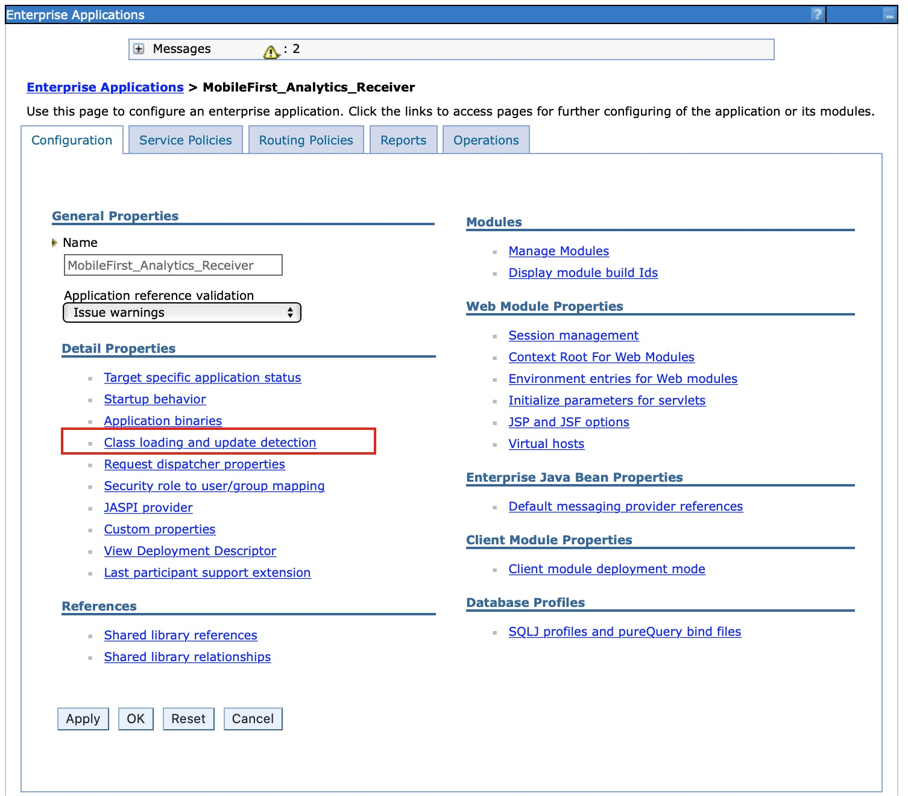

<!-- NLS_CHARSET=UTF-8 -->
## 개요
{: #overview }
{{ site.data.keys.mf_analytics_receiver_server }}는 Java EE 표준 웹 애플리케이션 아카이브(WAR) 파일로 구현 및 제공됩니다. 따라서 지원되는 애플리케이션 서버인 WebSphere Application Server, WebSphere Application Server Liberty 또는 Apache Tomcat(WAR 파일 전용) 중 하나에 설치될 수 있습니다. 

#### 다음으로 이동
{: #jump-to }

* [시스템 요구사항](#system-requirements)
* [용량 고려사항](#capacity-considerations)
* [WebSphere Application Server Liberty에 {{ site.data.keys.mf_analytics_receiver }} 설치](#installing-mobilefirst-analytics-receiver-on-websphere-application-server-liberty)
* [Tomcat에 {{ site.data.keys.mf_analytics_receiver }} 설치](#installing-mobilefirst-analytics-receiver-on-tomcat)
* [WebSphere Application Server에 {{ site.data.keys.mf_analytics_receiver }} 설치](#installing-mobilefirst-analytics-receiver-on-websphere-application-server)
* [Ant 태스크를 사용한 {{ site.data.keys.mf_analytics_receiver }} 설치](#installing-mobilefirst-analytics-receiver-with-ant-tasks)

## 시스템 요구사항
{: #system-requirements }

### 운영 체제
{: #operating-systems }
* CentOS/RHEL 6.x/7.x
* RHEL 커널이 있는 Oracle Enterprise Linux 6/7 전용
* Ubuntu 12.04/14.04
* SLES 11/12
* OpenSuSE 13.2
* Windows Server 2012/R2
* Debian 7

### JVM
{: #jvm }
* Oracle JVM 1.7u55+
* Oracle JVM 1.8u20+
* IcedTea OpenJDK 1.7.0.55+

### 하드웨어
{: #hardware }
* RAM: RAM은 클수록 좋지만 노드당 64GB 이하여야 합니다. 32GB 및 16GB도 승인할 수 있습니다. 8GB 미만인 경우 클러스터에 다수의 작은 노드가 필요하고 64GB는 지나치게 커서 Java가 포인터에 메모리를 사용하는 방식으로 인해 문제가 발생할 수 있습니다.
* 디스크: 가능하면 SSD를 사용하고 SSD를 사용할 수 없는 경우에는 RAID 0 구성의 고속 스핀 일반 디스크를 사용하십시오.
* CPU: CPU는 성능 병목 현상이 나타나지 않도록 되어 있습니다. 코어가 2개 - 8개 있는 시스템을 사용하십시오.
* 네트워크: 수평으로 용량을 확장해야 하는 경우에는 1GbE - 10GbE의 속도를 지원하는 고속의 신뢰할 수 있는 데이터 센터가 필요합니다.

### 하드웨어 구성
{: #hardware-configuration }
* JVM 샘플 크기를 지정하여 인메모리 큐의 크기를 10000으로 스케일링합니다(예: 최소 Xmx 6GB).
* BSDs 및 Linux를 사용하는 경우에는 운영 체제 I/O 스케줄러를 **cfq**가 아니라 **deadline** 또는 **noop**로 설정해야 합니다.

## 용량 고려사항
{: #capacity-considerations }
용량은 가장 일반적인 질문입니다. 필요한 RAM은 얼마인가? 디스크 공간은? 노드 수는? 대답은 항상 주관적입니다. 

IBM {{ site.data.keys.mf_analytics_receiver }}는 모바일 애플리케이션에서 로그를 수신하여 Analytics 서버에 전달하므로 디스크 공간이 필요하지 않아서 이벤트 데이터의 스토리지가 없습니다. 

## WebSphere Application Server Liberty에 {{ site.data.keys.mf_analytics_receiver }} 설치
{: #installing-mobilefirst-analytics-receiver-on-websphere-application-server-liberty }
{{ site.data.keys.mf_analytics_receiver }} WAR 파일을 이미 가지고 있는지 확인하십시오. 설치 아티팩트에 대한 자세한 정보는 [애플리케이션 서버에 {{ site.data.keys.mf_server }} 설치](../../prod-env/appserver)를 참조하십시오. **analytics-receiver.war** 파일은 `<mf_server_install_dir>\analyticsreceiver` 폴더에 있습니다. WebSphere Application Server Liberty를 다운로드하여 설치하는 방법에 대한 자세한 정보는 IBM developerWorks에서 [WebSphere Liberty 정보](https://developer.ibm.com/wasdev/websphere-liberty/) 기사를 참조하십시오.

1. `./wlp/bin` 폴더에서 다음 명령을 실행하여 서버를 작성하십시오.

   ```bash
   ./server create <serverName>
   ```

2. `./bin` 폴더에서 다음 명령을 실행하여 다음과 같은 기능을 설치하십시오.

   ```bash
   ./featureManager install jsp-2.2 ssl-1.0 appSecurity-1.0 localConnector-1.0
   ```

3. **analytics-receiver.war** 파일을 Liberty 서버의 `./usr/servers/<serverName>/apps` 폴더에 추가하십시오.
4. `./usr/servers/<serverName>/server.xml` 파일의 **<featureManager>** 태그 컨텐츠를 다음 컨텐츠로 바꾸십시오.

   ```xml
   <featureManager>
        <feature>jsp-2.2</feature>
        <feature>ssl-1.0</feature>
        <feature>appSecurity-1.0</feature>
        <feature>localConnector-1.0</feature>
   </featureManager>
   ```

5. `server.xml` 파일에서 **analytics-receiver.war**를 역할 기반 보안이 설정된 애플리케이션으로 구성하십시오. 다음 예에서는 기본 하드코딩된 사용자 레지스트리를 작성하고 사용자를 각각의 서로 다른 분석 역할에 지정합니다.

   ```xml
   <application id="analytics-receiver" name="analytics-receiver" location="analytics-receiver.war" type="war">
        <application-bnd>
            <security-role name="analytics_administrator">
                <user name="admin"/>
            </security-role>
            <security-role name="analytics_infrastructure">
                <user name="infrastructure"/>
            </security-role>
            <security-role name="analytics_support">
                <user name="support"/>
            </security-role>
            <security-role name="analytics_developer">
                <user name="developer"/>
            </security-role>
            <security-role name="analytics_business">
                <user name="business"/>
            </security-role>
        </application-bnd>
   </application>

   <basicRegistry id="worklight" realm="worklightRealm">
        <user name="business" password="demo"/>
        <user name="developer" password="demo"/>
        <user name="support" password="demo"/>
        <user name="infrastructure" password="demo"/>
        <user name="admin" password="admin"/>
   </basicRegistry>
   ```

   > 기타 사용자 레지스트리 유형(예: LDAP) 구성 방법에 대한 자세한 정보는 WebSphere Application Server 제품 문서에서 [Liberty에 대한 사용자 레지스트리 구성](http://ibm.biz/knowctr#SSAW57_8.5.5/com.ibm.websphere.wlp.nd.iseries.doc/ae/twlp_sec_registries.html) 주제를 참조하십시오. 

6. **bin** 폴더에서 다음 명령을 실행하여 Liberty 서버를 시작하십시오.

   ```bash
   ./server start <serverName>
   ```

7. 상태 URL을 호출하여 서비스 확인

   ```bash
   http://localhost:9080/analytics-receiver/rest/data/health
   ```

WebSphere Application Server Liberty 관리에 대한 자세한 정보는 WebSphere Application Server 제품 문서에서 [명령행에서 Liberty 관리](http://ibm.biz/knowctr#SSAW57_8.5.5/com.ibm.websphere.wlp.nd.multiplatform.doc/ae/twlp_admin_script.html) 주제를 참조하십시오.

## Tomcat에 {{ site.data.keys.mf_analytics_receiver }} 설치
{: #installing-mobilefirst-analytics-receiver-on-tomcat }
{{ site.data.keys.mf_analytics_receiver }} WAR 파일을 이미 가지고 있는지 확인하십시오. 설치 아티팩트에 대한 자세한 정보는 [애플리케이션 서버에 {{ site.data.keys.mf_server }} 설치](../../prod-env/appserver)를 참조하십시오. **analytics-receiver.war** 파일은 `<mf_server_install_dir>\analyticsreceiver` 폴더에 있습니다. Tomcat 다운로드 및 설치 방법에 대한 자세한 정보는 [Apache Tomcat](http://tomcat.apache.org/)을 참조하십시오. Java 7 이상을 지원하는 버전을 다운로드해야 합니다. Java 7을 지원하는 Tomcat 버전에 대한 자세한 정보는 [Apache Tomcat 버전](http://tomcat.apache.org/whichversion.html)을 참조하십시오.

1. **analytics-receiver.war** 파일을 Tomcat `webapps` 폴더에 추가합니다. 
2. `conf/server.xml` 파일에서 다음 섹션을 주석 해제하십시오. 이 섹션은 새로 다운로드한 Tomcat 아카이브에 주석 처리된 상태로 있습니다.

   ```xml
   <Valve className="org.apache.catalina.authenticator.SingleSignOn"/>
   ```

3. `conf/server.xml` 파일에서 두 개의 war 파일을 선언하고 사용자 레지스트리를 정의하십시오.

   ```xml
   <Context docBase ="analytics-receiver-service" path ="/analytics-receiver"></Context>
   <Realm className ="org.apache.catalina.realm.MemoryRealm"/>
   ```

   **MemoryRealm**은 `conf/tomcat-users.xml` 파일에서 정의되는 사용자를 인식합니다. 사용 가능한 다른 옵션에 관한 정보는 [Apache Tomcat 영역 구성 방법](http://tomcat.apache.org/tomcat-7.0-doc/realm-howto.html)을 참조하십시오.

4. 다음 섹션을 `conf/tomcat-users.xml` 파일에 추가하여 **MemoryRealm**을 구성하십시오.
    * 보안 역할을 추가하십시오.

      ```xml
      <role rolename="analytics_administrator"/>
      <role rolename="analytics_infrastructure"/>
      <role rolename="analytics_support"/>
      <role rolename="analytics_developer"/>
      <role rolename="analytics_business"/>
      ```
    * 원하는 역할을 가진 몇몇 사용자를 추가하십시오.

      ```xml
      <user name="admin" password="admin" roles="analytics_administrator"/>
      <user name="support" password="demo" roles="analytics_support"/>
      <user name="business" password="demo" roles="analytics_business"/>
      <user name="developer" password="demo" roles="analytics_developer"/>
      <user name="infrastructure" password="demo" roles="analytics_infrastructure"/>
      ```    
    * 상태 URL을 호출하여 Tomcat 서버를 시작하고 서비스를 확인합니다. 

      ```text
      http://localhost:8080/analytics-receiver/rest/data/health
      ```

    Tomcat Server를 시작하는 방법에 대한 자세한 정보는 공식 Tomcat 사이트를 참조하십시오. 예를 들어, Tomcat 7.0의 경우 [Apache Tomcat 7](http://tomcat.apache.org/tomcat-7.0-doc/introduction.html)입니다.

## WebSphere Application Server에 {{ site.data.keys.mf_analytics_receiver }} 설치
{: #installing-mobilefirst-analytics-receiver-on-websphere-application-server }
설치 아티팩트(JAR 및 EAR 파일) 확보를 위한 초기 설치 단계에 대한 자세한 정보는 [애플리케이션 서버에 {{ site.data.keys.mf_server }} 설치](../../prod-env/appserver)를 참조하십시오. **analytics-receiver.war** 파일은 `<mf_server_install_dir>\analyticsreceiver` 폴더에 있습니다. 

다음의 단계에서는 WebSphere Application Server에서 Analytics EAR 파일을 설치하고 실행하는 방법을 설명합니다. WebSphere Application Server에 개별 WAR 파일을 설치하는 경우에는 배치 후 **analytics-receiver** WAR 파일에서 2단계 - 7단계만 수행하십시오. 

1. 애플리케이션 서버에 WAR 파일을 배치하되 이를 시작하지는 마십시오. WebSphere Application Server에 EAR 파일을 설치하는 방법에 대한 자세한 정보는 WebSphere Application Server 제품 문서에서 [콘솔을 사용한 엔터프라이즈 애플리케이션 파일 설치](http://ibm.biz/knowctr#SSAW57_8.5.5/com.ibm.websphere.nd.multiplatform.doc/ae/trun_app_instwiz.html) 주제를 참조하십시오.

2. **엔터프라이즈 애플리케이션** 목록에서 **MobileFirst Analytics Receiver** 애플리케이션을 선택하십시오.

    

3. **클래스 로드 및 업데이트 발견**을 클릭하십시오.

    

4. 클래스 로드 순서를 **상위 마지막**으로 설정하십시오.

    

5. **사용자/그룹에 보안 역할 맵핑**을 클릭하여 관리자를 맵핑하십시오.

    

6. **모듈 관리**를 클릭하십시오.

    

7. **analytics-receiver** 모듈을 선택한 후 클래스 로더 순서를 **상위 마지막**으로 변경하십시오.

    

8. WebSphere Application Server 관리 콘솔에서 **관리 보안** 및 **애플리케이션 보안**을 사용으로 설정하십시오.
    * WebSphere Application Server 관리 콘솔에 로그인하십시오.
    * **보안 > 글로벌 보안** 메뉴에서 **관리 보안 사용**과 **애플리케이션 보안 사용**이 모두 선택되어 있는지 확인하십시오.
>  **참고**: 애플리케이션 보안은 **관리 보안**이 사용으로 설정된 후에만 선택할 수 있습니다.
    * **확인**을 클릭하고 변경사항을 저장하십시오.

9. Swagger 문서를 통해 분석 서비스에 액세스할 수 있도록 하려면 다음 단계를 완료하십시오.
    * **서버 > 서버 유형 > WebSphere 애플리케이션 서버**를 클릭하여 서버 목록에서 분석 서비스를 배치할 서버를 선택하십시오.
    * **서버 인프라**에서 **Java**를 클릭한 다음 **프로세스 관리 > 프로세스 정의 > Java 가상 머신 > 사용자 정의 특성**을 탐색하십시오.
      - 다음 사용자 정의 특성을 설정하십시오.<br/>
        **특성 이름:** *com.ibm.ws.classloader.strict*<br/>
        **값:** *true*

10. {{ site.data.keys.mf_analytics_receiver }} 애플리케이션을 시작하고 브라우저에서 상태 URL에 액세스할 수 있는지 확인하십시오. `http://<hostname>:<port>/analytics-receiver/rest/data/health`.

## Ant 태스크를 사용한 {{ site.data.keys.mf_analytics_receiver }} 설치
{: #installing-mobilefirst-analytics-receiver-with-ant-tasks }
필요한 WAR 및 구성 파일이 있는지 확인합니다. **analytics-receiver.war**. 설치 아티팩트에 대한 자세한 정보는 [애플리케이션 서버에 {{ site.data.keys.mf_server }} 설치](../../prod-env/appserver)를 참조하십시오. **analytics-receiver.war** 파일은 `MobileFirst_Platform_Server\AnalyticsReceiver`에 있습니다. 

애플리케이션이 설치되는 컴퓨터 또는 WebSphere Application Server Network Deployment용 Network Deployment Manager에서 Ant 태스크를 실행해야 합니다. {{ site.data.keys.mf_server }}가 설치되지 않은 컴퓨터에서 Ant 태스크를 시작하려면 `\<mf_server_install_dir\>/MobileFirstServer/mfp-ant-deployer.jar` 파일을 해당 컴퓨터에 복사해야 합니다.

> **참고**: **mf_server_install_dir**은 {{ site.data.keys.mf_server }}를 설치한 디렉토리입니다.

1. {{ site.data.keys.mf_analytics_receiver }} WAR 파일을 배치하기 위해 나중에 사용하는 Ant 스크립트를 편집하십시오.
    * [{{ site.data.keys.mf_analytics_receiver }}에 대한 샘플 구성 파일](../../installation-reference/#sample-configuration-files-for-mobilefirst-analytics)에서 샘플 구성 파일을 검토하십시오.
    * 파일의 시작 부분에 있는 특성으로 플레이스홀더 값을 바꾸십시오.

    > ** 참고**: 다음과 같은 특수 문자는 Ant XML 스크립트의 값에 사용될 때 이스케이프해야 합니다.
    >
    > * Apache Ant 매뉴얼의 [특성](http://ant.apache.org/manual/properties.html) 절에 설명된 대로 ${variable} 구문을 통해 Ant 변수를 명시적으로 참조하려는 경우가 아니면 달러 부호($)를 $$로 써야 합니다.
    > * XML 엔티티를 명시적으로 참조하려는 경우가 아니면 앰퍼샌드 문자(&)는 &amp;로 써야 합니다.
    > * 작은따옴표로 묶인 문자열에 있는 경우를 제외하고 큰따옴표(")는 &quot;로 써야 합니다.

2. WAR 파일을 배치하려면 다음 명령을 실행하십시오. 
   ```bash
   ant -f configure-appServer-analytics-receiver.xml install
   ```
    Ant 명령은 `mf_server_install_dir/shortcuts`에 있습니다. 이 명령은 WebSphere Application Server Network Deployment에 설치하는 경우, 클러스터의 각 노드 또는 서버에 {{ site.data.keys.mf_analytics_receiver }} 노드를 설치합니다.
3. Ant 파일을 저장하십시오. 나중에 수정팩을 적용하거나 업그레이드를 수행하기 위해 이 파일이 필요합니다.
    비밀번호를 저장하지 않으려면 대화식 프롬프트에 대해 비밀번호를 `************`(12개의 별표)로 바꾸십시오. 
