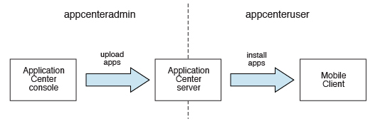
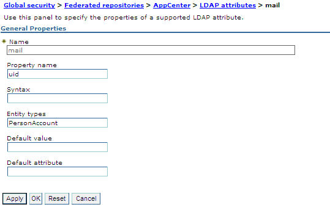
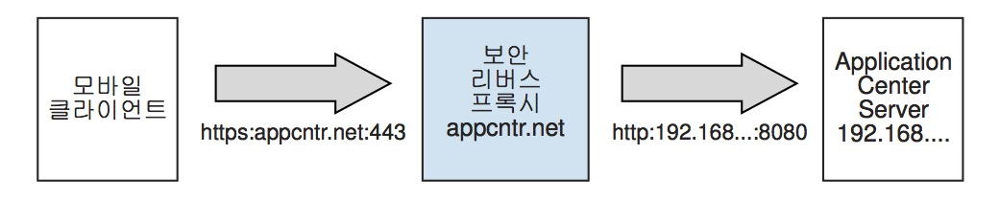

<!-- NLS_CHARSET=UTF-8 -->
## 개요
{: #overview }
{{ site.data.keys.mf_server }} 설치의 일부로 Application Center를 설치합니다.
다음 방법 중 하나를 사용하여 설치할 수 있습니다.

* IBM Installation Manager를 사용한 설치
* Ant 태스크를 사용한 설치
* 수동 설치

선택적으로 Application Center와 함께 {{ site.data.keys.mf_server }}를 설치하기 전에 선택한 데이터베이스를 작성할 수 있습니다.  
선택한 웹 애플리케이션 서버에서 Application Center를 설치한 후에는 추가 구성을 수행해야 합니다. 자세한 정보는 아래의 설치 후 Application Center 구성을 참조하십시오. 설치 프로그램에서 수동 설치를 선택한 경우에는 선택한 서버의 문서를 참조하십시오.

> **참고:** Application Center를 통해 iOS 디바이스에 애플리케이션을 설치하려면 먼저 SSL을 사용하여 Application Center 서버를 구성해야 합니다.

설치된 파일 및 도구의 목록은 [{{ site.data.keys.mf_server }}의 배포 구조](../installation-manager/#distribution-structure-of-mobilefirst-server)를 참조하십시오.

#### 다음으로 이동
{: #jump-to }

* [IBM Installation Manager를 사용한 Application Center 설치](#installing-application-center-with-ibm-installation-manager)
* [Ant 태스크를 사용한 Application Center 설치](#installing-the-application-center-with-ant-tasks)
* [수동으로 Application Center 설치](#manually-installing-application-center)
* [설치 후 Application Center 구성](#configuring-application-center-after-installation)

## IBM Installation Manager를 사용한 Application Center 설치
{: #installing-application-center-with-ibm-installation-manager }
IBM Installation Manager를 사용하면 Application Center를 설치하고 해당 데이터베이스를 작성한 후 Application Server에 배치할 수 있습니다.  
시작하기 전에 IBM Installation Manager를 실행하는 사용자가 [파일 시스템 전제조건](../prod-env/appserver/#file-system-prerequisites)에 설명된 권한을 가지고 있는지 확인하십시오.

IBM Installation Manager를 사용하여 IBM Application Center를 설치하려면 다음의 단계를 완료하십시오.

1. 선택사항: 아래의 [데이터베이스의 선택적 작성](#optional-creation-of-databases)에 설명된 대로 Application Center용 데이터베이스를 수동으로 작성할 수 있습니다. IBM Installation Manager는 기본 설정으로 사용자를 위해 Application Center 데이터베이스를 작성할 수 있습니다.
2. [IBM Installation Manager 실행](../installation-manager)에 설명된 대로 IBM Installation Manager를 실행하십시오.
3. **IBM Application Center 설치** 질문에 대해 **예**를 선택하십시오.

#### 다음으로 이동
{: #jump-to-1 }
* [데이터베이스의 선택적 작성](#optional-creation-of-databases)
* [WebSphere Application Server Network Deployment에서 Application Center 설치](#installing-application-center-in-websphere-application-server-network-deployment)
* [설치 완료](#completing-the-installation)
* [Application Center에 대해 IBM Installation Manager가 작성하는 기본 로그인 및 비밀번호](#default-logins-and-passwords-created-by-ibm-installation-manager-for-the-application-center)

### 데이터베이스의 선택적 작성
{: #optional-creation-of-databases }
{{ site.data.keys.mf_server }} 설치 프로그램을 실행할 때 Application Center를 설치하는 옵션을 활성화하려면 Application Center에 필요한 테이블을 작성할 수 있게 하는 특정 데이터베이스 액세스 권한이 있어야 합니다.

충분한 데이터베이스 관리 신임 정보를 가지고 있는 경우 프롬프트가 표시될 때 설치 프로그램에서 관리자 이름 및 비밀번호를 입력하면 설치 프로그램이 사용자를 위해 데이터베이스를 작성할 수 있습니다. 그렇지 않으면 데이터베이스 관리자에게 필수 데이터베이스를 작성하도록 요청해야 합니다. {{ site.data.keys.mf_server }} 설치 프로그램을 시작하기 전에 데이터베이스를 작성해야 합니다.

다음 주제에서는 지원되는 데이터베이스 관리 시스템에 대한 프로시저를 설명합니다.

#### 다음으로 이동
{: #jump-to-2 }

* [Application Center용 DB2 데이터베이스 작성](#creating-the-db2-database-for-application-center)
* [Application Center용 MySQL 데이터베이스 작성](#creating-the-mysql-database-for-application-center)
* [Application Center용 Oracle 데이터베이스 작성](#creating-the-oracle-database-for-application-center)

#### Application Center용 DB2 데이터베이스 작성
{: #creating-the-db2-database-for-application-center }
IBM MobileFirst Foundation 설치 중에 설치 프로그램은 사용자를 위해 Application Center 데이터베이스를 작성할 수 있습니다.

DB2 SYSADM 또는 SYSCTRL 권한을 가진 사용자 계정의 이름 및 비밀번호를 데이터베이스 서버에서 입력하는 경우 설치 프로그램은 사용자를 위해 Application Center 데이터베이스를 작성할 수 있으며 해당 계정은 SSH를 통해 액세스할 수 있습니다. 그렇지 않으면 데이터베이스 관리자가 사용자를 위해 Application Center 데이터베이스를 작성할 수 있습니다. 자세한 정보는 [DB2 솔루션](http://ibm.biz/knowctr#SSEPGG_9.7.0/com.ibm.db2.luw.admin.sec.doc/doc/c0055206.html) 사용자 문서를 참조하십시오.

수동으로 데이터베이스를 작성하는 경우 데이터베이스 이름(여기서는 APPCNTR) 및 비밀번호를 사용자가 선택하는 데이터베이스 이름 및 비밀번호로 바꿀 수 있습니다.

> **중요:** 데이터베이스 이름과 사용자 이름을 서로 다르게 지정하거나 다른 비밀번호를 설정할 수 있지만 DB2 데이터베이스 설정 전체에서 적절한 데이터베이스 이름, 사용자 이름 및 비밀번호를 올바르게 입력해야 합니다. DB2의 데이터베이스 이름 제한은 모든 플랫폼에서 8자이며 사용자 이름 및 비밀번호 길이 제한은 UNIX 및 Linux 시스템의 경우 8자이고 Windows의 경우 30자입니다.

1. 사용자의 운영 체제에 적합한 명령을 사용하여 DB2 관리 그룹(예: **DB2USERS**)에서 시스템 사용자(예: **wluser**)를 작성하십시오. 해당 사용자 이름에 비밀번호(예: **wluser**)를 제공하십시오. IBM {{ site.data.keys.mf_server }}의 여러 인스턴스를 동일한 데이터베이스에 연결하려면 각각의 연결에 대해 서로 다른 사용자 이름을 사용하십시오. 각각의 데이터베이스 사용자는 별도의 기본 스키마를 가집니다. 데이터베이스 사용자에 대한 자세한 정보는 사용자의 운영 체제에 해당하는 문서 및 DB2 문서를 참조하십시오.

2. **SYSADM** 또는 **SYSCTRL** 권한을 가진 사용자로 DB2 명령행 프로세서를 여십시오.

    * Windows 시스템의 경우 **시작 → IBM DB2 → 명령행 프로세서**를 클릭하십시오.
    * Linux 또는 UNIX 시스템의 경우 **~/sqllib/bin**으로 이동하여 `./db2`를 입력하십시오.
    * 다음 예와 비슷한 SQL문 및 데이터베이스 관리자를 입력하여 Application Center 데이터베이스를 작성하고 사용자 이름 **wluser**를 선택한 사용자 이름으로 바꾸십시오.

      ```bash
      CREATE DATABASE APPCNTR COLLATE USING SYSTEM PAGESIZE 32768
      CONNECT TO APPCNTR
      GRANT CONNECT ON DATABASE TO USER wluser
      DISCONNECT APPCNTR
      QUIT
      ```

3. 설치 프로그램은 특정 스키마에서 Application Center용 데이터베이스 테이블 및 오브젝트를 작성할 수 있습니다. 이를 통해 Application Center와 MobileFirst 프로젝트에 동일한 데이터베이스를 사용할 수 있습니다. 1단계에서 작성된 사용자에게 IMPLICIT\_SCHEMA 권한이 부여된 경우(2단계의 데이터베이스 작성 스크립트에서 기본값)에는 추가 조치가 필요하지 않습니다. 해당 사용자에게 IMPLICIT\_SCHEMA 권한이 없으면 Application Center 데이터베이스 테이블 및 오브젝트에 대한 SCHEMA를 작성해야 합니다.

#### Application Center용 MySQL 데이터베이스 작성
{: #creating-the-mysql-database-for-application-center }
MobileFirst 설치 중에 설치 프로그램은 사용자를 위해 Application Center 데이터베이스를 작성할 수 있습니다.

사용자가 수퍼유저 계정의 이름 및 비밀번호를 입력하는 경우 설치 프로그램은 사용자를 위해 데이터베이스를 작성할 수 있습니다. 자세한 정보는 MySQL 데이터베이스 서버에서 [초기 MySQL 계정 보호](http://dev.mysql.com/doc/refman/5.1/en/default-privileges.html)를 참조하십시오. 데이터베이스 관리자도 사용자를 위해 데이터베이스를 작성할 수 있습니다. 수동으로 데이터베이스를 작성하는 경우 데이터베이스 이름(여기서는 APPCNTR) 및 비밀번호를 사용자가 선택한 데이터베이스 이름 및 비밀번호로 바꿀 수 있습니다. UNIX에서는 MySQL 데이터베이스 이름이 대소문자를 구분합니다.

1. MySQL 명령행 도구를 시작하십시오.
2. 다음과 같은 명령을 입력하십시오.

   ```bash
   CREATE DATABASE APPCNTR CHARACTER SET utf8 COLLATE utf8_general_ci;
   GRANT ALL PRIVILEGES ON APPCNTR.* TO 'worklight'@'Worklight-host' IDENTIFIED BY 'password';
   GRANT ALL PRIVILEGES ON APPCNTR.* TO 'worklight'@'localhost' IDENTIFIED BY 'password';
   FLUSH PRIVILEGES;
   ```

   여기서 **Worklight-host**를 IBM MobileFirst Foundation이 실행되는 호스트의 이름으로 바꿔야 합니다.

#### Application Center용 Oracle 데이터베이스 작성
{: #creating-the-oracle-database-for-application-center }
설치 중에 설치 프로그램은 Oracle 12c 데이터베이스 유형을 제외하고 Application Center 데이터베이스를 작성하거나 기존 데이터베이스 내에서 사용자 및 스키마를 작성할 수 있습니다.

설치 프로그램은 Oracle 12c 데이터베이스 유형을 제외하고 데이터베이스를 작성하거나 기존 데이터베이스 내에서 사용자 및 스키마를 작성(데이터베이스 서버에서 Oracle 관리자의 이름 및 비밀번호를 입력하는 경우)할 수 있으며 해당 계정은 SSH를 통해 액세스할 수 있습니다. 그렇지 않으면 데이터베이스 관리자가 사용자를 위해 데이터베이스 또는 사용자 및 스키마를 작성할 수 있습니다. 수동으로 데이터베이스 또는 사용자를 작성하는 경우 선택한 데이터베이스 이름, 사용자 이름 및 비밀번호를 사용할 수 있습니다. Oracle 사용자 이름에서 소문자를 사용할 경우 문제가 될 수 있습니다.

1. **ORCL**이라는 데이터베이스가 아직 없는 경우에는 Oracle DBCA(Database Configuration Assistant)를 사용하고 마법사의 단계를 수행하여 **ORCL**이라는 새 범용 데이터베이스를 작성하십시오.
    * 글로벌 데이터베이스 이름 **ORCL\_your\_domain** 및 시스템 ID(SID) **ORCL**을 사용하십시오.
    * 먼저 사용자 계정을 작성해야 하므로 **데이터베이스 컨텐츠** 단계의 **사용자 정의 스크립트** 탭에서 SQL 스크립트를 실행하지 마십시오.
    * **초기화 매개변수** 단계의 **문자 세트** 탭에서 **유니코드(AL32UTF8) 문자 세트 및 UTF8 - 유니코드 3.0 UTF-8 자국 문자 세트 사용**을 선택하십시오.
    * 기본값을 승인하여 프로시저를 완료하십시오.
2. **Oracle 데이터베이스 제어**를 사용하거나 **Oracle SQLPlu** 명령행 해석기를 사용하여 데이터베이스 사용자를 작성하십시오.
    * **Oracle 데이터베이스 제어** 사용:
        * **SYSDBA**로 연결하십시오.
        * **사용자** 페이지로 이동하여 **서버**를 클릭한 후 **보안** 섹션에서 **사용자**를 클릭하십시오.
        * 사용자(예: **APPCENTER**)를 작성하십시오. IBM {{ site.data.keys.mf_server }}의 여러 인스턴스가 1단계에서 작성된 동일한 범용 데이터베이스에 연결되도록 하려면 각각의 연결에 대해 서로 다른 사용자 이름을 사용하십시오. 각각의 데이터베이스 사용자는 별도의 기본 스키마를 가집니다.
        * 다음과 같은 속성을 지정하십시오.
            * 프로파일: **DEFAULT**
            * 인증: **password**
            * 기본 테이블스페이스: **USERS**
            * 임시 테이블스페이스: **TEMP**
            * 상태: **Unlocked**
            * 시스템 권한 추가: **CREATE SESSION**
            * 시스템 권한 추가: **CREATE SEQUENCE**
            * 시스템 권한 추가: **CREATE TABLE**
            * 인용구 추가: **USERS 테이블스페이스의 경우 무제한**
    * **Oracle SQLPlus** 명령행 해석기 사용:  
다음 예의 명령은 데이터베이스에 대해 APPCENTER라는 사용자를 작성합니다.

        ```bash
        CONNECT SYSTEM/<SYSTEM_password>@ORCL
        CREATE USER APPCENTER IDENTIFIED BY password DEFAULT TABLESPACE USERS QUOTA UNLIMITED ON USERS;
        GRANT CREATE SESSION, CREATE SEQUENCE, CREATE TABLE TO APPCENTER;
        DISCONNECT;
        ```

### WebSphere Application Server Network Deployment에서 Application Center 설치
{: #installing-application-center-in-websphere-application-server-network-deployment }
WebSphere Application Server Network Deployment Server 세트에서 Application Center를 설치하려면 배치 관리자가 실행 중인 머신에서 IBM Installation Manager를 실행하십시오.

1. IBM Installation Manager가 데이터베이스 유형 지정 프롬프트를 표시하면 **Apache Derby** 이외의 옵션을 선택하십시오. IBM MobileFirst Foundation은 임베디드 모드에서만 Apache Derby를 지원하며 이 선택사항은 WebSphere Application Server Network Deployment를 통한 배치와 호환되지 않습니다.
2. WebSphere Application Server 설치 디렉토리를 지정하는 설치 프로그램 패널에서 배치 관리자 프로파일을 선택하십시오.

    > **주의:** 애플리케이션 서버를 선택한 후 단일 관리 서버를 선택하지 마십시오. 이를 수행하면 배치 관리자가 실행 중인 머신에 설치하는지 아니면 다른 머신에 설치하는지에 관계없이 배치 관리자가 서버의 구성을 겹쳐씁니다.
3. Application Center를 설치할 위치에 따라 필요한 범위를 선택하십시오. 다음 테이블에는 사용 가능한 범위가 나열되어 있습니다.

    | 범위	 |설명 |
    |--------|-------------|
    | 셀	 | 셀의 모든 애플리케이션 서버에서 Application Center를 설치합니다. |
    | 클러스터| 지정된 클러스터의 모든 애플리케이션 서버에서 Application Center를 설치합니다. |
    | 노드   | (클러스터 제외) 클러스터에 없는 지정된 노드의 모든 애플리케이션 서버에서 Application Center를 설치합니다. |
    | 서버 | 클러스터에 없는 지정된 서버에서 Application Center를 설치합니다. |

4. 아래의 [설치 완료](#completing-the-installation)에 있는 프로시저를 수행하여 대상 서버를 다시 시작하십시오.

설치는 지정된 범위에 있는 서버 세트 외에는 영향을 주지 않습니다. JDBC 제공자 및 JDBC 데이터 소스는 지정된 범위로 정의됩니다. 셀 전체 범위(애플리케이션과 인증 별명(DB2의 경우))를 가진 항목은 이름에 접미부를 가지고 있어 고유한 항목이 됩니다. 따라서 서로 다른 구성으로 Application Center를 설치하거나 동일한 셀의 서로 다른 클러스터에서 서로 다른 Application Center 버전을 설치할 수 있습니다.

> **참고:** JDBC 드라이버는 지정된 애플리케이션 서버 세트에서만 설치되므로 배치 관리자의 WebSphere Application Server 관리 콘솔에 있는 JDBC 데이터 소스에 대한 연결 테스트 단추가 작동하지 않습니다.

프론트 엔드 HTTP 서버를 사용하는 경우에는 공용 URL도 구성해야 합니다.

### 설치 완료
{: #completing-the-installation }
설치가 완료되면 특정 경우 웹 애플리케이션 서버를 다시 시작해야 합니다.  
다음과 같은 환경에서는 웹 애플리케이션 서버를 다시 시작해야 합니다.

* DB2가 데이터 유형인 WebSphere Application Server를 사용하는 경우
* WebSphere Application Server를 사용하며 IBM MobileFirst Application Center 또는 {{ site.data.keys.mf_server }}를 설치하기 전에 애플리케이션 보안을 사용으로 설정하지 않고 WebSphere Application Server를 연 경우

Application Center를 설치하려면 MobileFirst 설치 프로그램이 WebSphere Application Server의 애플리케이션 보안을 활성화해야 합니다(아직 활성화되지 않은 경우). 그런 다음 이 활성화를 적용하기 위해 {{ site.data.keys.mf_server }} 설치가 완료된 후 애플리케이션 서버를 다시 시작하십시오.

* WebSphere Application Server Liberty 또는 Apache Tomcat을 사용하는 경우
* {{ site.data.keys.mf_server }}의 이전 버전에서 업그레이드한 후

WebSphere Application Server Network Deployment를 사용하며 배치 관리자를 통한 설치를 선택한 경우:

* 설치 중에 실행 중이었고 {{ site.data.keys.mf_server }} 웹 애플리케이션이 설치되는 서버를 다시 시작해야 합니다.

배치 관리자 콘솔을 사용하여 이 서버를 다시 시작하려면 **애플리케이션 → 애플리케이션 유형 → WebSphere 엔터프라이즈 애플리케이션 → IBM_Application\_Center\_Services → 대상 특정 애플리케이션 상태**를 선택하십시오.

* 배치 관리자 또는 노드 에이전트는 다시 시작하지 않아도 됩니다.

> **참고:** Application Center만 애플리케이션 서버에서 설치됩니다.

### Application Center에 대해 IBM Installation Manager가 작성하는 기본 로그인 및 비밀번호
{: #default-logins-and-passwords-created-by-ibm-installation-manager-for-the-application-center }
IBM Installation Manager는 애플리케이션 서버에 따라 기본적으로 Application Center에 대한 로그인을 작성합니다. 이 로그인을 사용하여 Application Center를 테스트할 수 있습니다.

#### WebSphere Application Server 전체 프로파일
{: #websphere-application-server-full-profile }
로그인 **appcenteradmin**은 설치 중에 생성되어 표시되는 비밀번호와 함께 작성됩니다.

애플리케이션 영역에서 인증된 모든 사용자에게는 **appcenteradmin** 역할에 대한 액세스 권한도 부여됩니다. 이는 프로덕션 환경의 경우에는 적용되지 않습니다(특히 WebSphere Application Server가 단일 보안 도메인을 사용하여 구성된 경우).

이 로그인을 수정하는 방법에 대한 자세한 정보는 [WebSphere Application Server 전체 프로파일에서 Java EE 보안 역할 구성](#configuring-the-java-ee-security-roles-on-websphere-application-server-full-profile)을 참조하십시오.

#### WebSphere Application Server Liberty 프로파일
{: #websphere-application-server-liberty-profile }
* 로그인 demo는 비밀번호 demo와 함께 basicRegistry에서 작성됩니다.
* 로그인 appcenteradmin은 비밀번호 admin과 함께 basicRegistry에서 작성됩니다.

이 로그인을 수정하는 방법에 대한 자세한 정보는 [WebSphere Application Server Liberty 프로파일에서 Java EE 보안 역할 구성](#configuring-the-java-ee-security-roles-on-websphere-application-server-liberty-profile)을 참조하십시오.

#### Apache Tomcat
{: #apache-tomcat }
* 로그인 demo는 비밀번호 demo와 함께 작성됩니다.
* 로그인 guest는 비밀번호 guest와 함께 작성됩니다.
* 로그인 appcenteradmin은 비밀번호 admin과 함께 작성됩니다.

이 로그인을 수정하는 방법에 대한 자세한 정보는 [Apache Tomcat에서 Java EE 보안 역할 구성](#configuring-the-java-ee-security-roles-on-apache-tomcat)을 참조하십시오.

## Ant 태스크를 사용한 Application Center 설치
{: #installing-the-application-center-with-ant-tasks }
Application Center를 설치하는 데 사용할 수 있는 Ant 태스크에 대해 학습하십시오.

#### 다음으로 이동
{: #jump-to-3 }

* [Ant 태스크를 사용한 Application Center용 데이터베이스 작성 및 구성](#creating-and-configuring-the-database-for-application-center-with-ant-tasks)
* [Ant 태스크를 사용한 Application Center 콘솔 및 서비스 배치](#deploying-the-application-center-console-and-services-with-ant-tasks)

### Ant 태스크를 사용한 Application Center용 데이터베이스 작성 및 구성
{: #creating-and-configuring-the-database-for-application-center-with-ant-tasks }
수동으로 데이터베이스를 작성하지 않은 경우에는 Ant 태스크를 사용하여 Application Center용 데이터베이스를 작성하고 구성할 수 있습니다. 데이터베이스가 이미 있는 경우에는 Ant 태스크를 사용하여 구성 단계만 수행할 수 있습니다.

시작하기 전에 데이터베이스 관리 시스템(DBMS)이 데이터베이스 서버(동일한 컴퓨터 또는 다른 컴퓨터에 있을 수 있음)에서 설치되어 실행 중인지 확인하십시오.

Application Center에 대한 Ant 태스크는 {{ site.data.keys.mf_server }} 배포의 **ApplicationCenter/configuration-samples** 디렉토리에 있습니다.

{{ site.data.keys.mf_server }}가 설치되지 않은 컴퓨터에서 Ant 태스크를 시작하려면 다음과 같은 파일을 해당 컴퓨터에 복사해야 합니다.

* 라이브러리 **mf\_server\_install\_dir/MobileFirstServer/mfp-ant-deployer.jar**
* Android SDK 플랫폼 도구 패키지의 aapt 프로그램의 2진 파일이 포함된 디렉토리: **mf\_server\_install\_dir/ApplicationCenter/tools/android-sdk**
* **mf\_server\_install\_dir/ApplicationCenter/configuration-samples**에 있는 Ant 샘플 파일

> **참고:** **mf\_server\_install\_dir** 플레이스홀더는 {{ site.data.keys.mf_server }}를 설치한 디렉토리를 나타냅니다.

[데이터베이스의 선택적 작성](#optional-creation-of-databases)에 설명된 대로 수동으로 데이터베이스를 작성하지 않은 경우에는 아래의 1단계 - 3단계를 수행하십시오.
데이터베이스가 이미 있으면 데이터베이스 테이블만 작성해야 합니다. 아래의 4단계 - 7단계를 수행하십시오.

1. DBMS에 해당하는 샘플 Ant 파일을 복사하십시오. 데이터베이스를 작성하는 데 필요한 파일은 다음 패턴을 따라 이름이 지정됩니다.

    ```bash
    create-appcenter-database-<dbms>.xml
    ```

2. Ant 파일을 편집하고 파일의 시작 부분에 있는 특성으로 플레이스홀더 값을 바꾸십시오.
3. 다음과 같은 명령을 실행하여 Application Center 데이터베이스를 작성하십시오.

    ```bash
    ant -f create-appcenter-database-<dbms>.xml databases
    ```

    **mf\_server\_install\_dir/shortcuts**에서 Ant 명령을 찾을 수 있습니다.

    데이터베이스가 이미 있으면 다음의 단계를 완료하여 데이터베이스 테이블만 작성해야 합니다.

4. 애플리케이션 서버와 DBMS에 모두 해당하는 샘플 Ant 파일을 복사하십시오. 기존 데이터베이스를 구성하는 데 필요한 파일은 이 패턴을 따라 이름이 지정됩니다.

    ```bash
    configure-appcenter-<appServer>-<dbms>.xml
    ```

5. Ant 파일을 편집하고 파일의 시작 부분에 있는 특성으로 플레이스홀더 값을 바꾸십시오.
6. 다음과 같은 명령을 실행하여 데이터베이스를 구성하십시오.

    ```bash
    ant -f configure-appcenter-<appServer>-<dbms>.xml databases
    ```

    **mf\_server\_install\_dir/shortcuts**에서 Ant 명령을 찾을 수 있습니다.

7. Ant 파일을 저장하십시오. 나중에 수정팩을 적용하거나 업그레이드를 수행하기 위해 이 파일이 필요합니다.

비밀번호를 저장하지 않으려면 대화식 프롬프트에 대해 비밀번호를 "************"(12개의 별표)로 바꾸십시오.

### Ant 태스크를 사용한 Application Center 콘솔 및 서비스 배치
{: #deploying-the-application-center-console-and-services-with-ant-tasks }
Ant 태스크를 사용하여 Application Center 콘솔 및 서비스를 애플리케이션 서버에 배치하고 Application Center가 사용하는 데이터 소스, 특성 및 데이터베이스 드라이버를 구성하십시오.

시작하기 전에,

* [Ant 태스크를 사용한 Application Center용 데이터베이스 작성 및 구성](#creating-and-configuring-the-database-for-application-center-with-ant-tasks)에 있는 프로시저를 완료하십시오.
* 애플리케이션이 설치되는 컴퓨터 또는 WebSphere Application Server Network Deployment용 Network Deployment Manager에서 Ant 태스크를 실행해야 합니다. {{ site.data.keys.mf_server }}가 설치되지 않은 컴퓨터에서 Ant 태스크를 시작하려면 다음과 같은 파일 및 디렉토리를 해당 컴퓨터에 복사해야 합니다.

    * 라이브러리 **mf\_server\_install\_dir/MobileFirstServer/mfp-ant-deployer.jar**
    * **mf_server\_install\_dir/ApplicationCenter/console**에 있는 웹 애플리케이션(WAR 및 EAR 파일)
    * Android SDK 플랫폼 도구 패키지의 aapt 프로그램의 2진 파일이 포함된 디렉토리: **mf\_server\_install\_dir/ApplicationCenter/tools/android-sdk**
    * **mf\_server\_install\_dir/ApplicationCenter/configuration-samples**에 있는 Ant 샘플 파일

> **참고:** mf_server_install_dir 플레이스홀더는 {{ site.data.keys.mf_server }}를 설치한 디렉토리를 나타냅니다.

1. 애플리케이션 서버와 DBMS에 모두 해당하는 Ant 파일을 복사하십시오. Application Center를 구성하는 데 필요한 파일은 다음 패턴을 따라 이름이 지정됩니다.

    ```bash
    configure-appcenter-<appserver>-<dbms>.xml
    ```

2. Ant 파일을 편집하고 파일의 시작 부분에 있는 특성으로 플레이스홀더 값을 바꾸십시오.
3. 다음 명령을 실행하여 Application Center 콘솔 및 서비스를 애플리케이션 서버에 배치하십시오.

    ```bash
    ant -f configure-appcenter-<appserver>-<dbms>.xml install
    ```

    **mf\_server\_install\_dir/shortcuts**에서 Ant 명령을 찾을 수 있습니다.

    > **참고:** 이 Ant 파일을 사용하면 다음과 같은 조치도 수행할 수 있습니다.
    >
    > * 대상 **uninstall**을 사용하여 Application Center를 설치 제거합니다.
    > * 대상 **minimal-update**를 사용하여 Application Center를 업데이트하여 수정팩을 적용합니다.

4. Ant 파일을 저장하십시오. 나중에 수정팩을 적용하거나 업그레이드를 수행하기 위해 이 파일이 필요합니다. 비밀번호를 저장하지 않으려면 대화식 프롬프트에 대해 비밀번호를 "************"(12개의 별표)로 바꾸십시오.
5. WebSphere Application Server Liberty 프로파일 또는 Apache Tomcat에 설치한 경우에는 aapt 프로그램이 모든 사용자를 위해 실행 가능한지 확인하십시오. 필요한 경우에는 적절한 사용자 권한을 설정해야 합니다. 예를 들어, UNIX/Linux 시스템의 경우 다음과 같습니다.

    ```bash
    chmod a+x mf_server_install_dir/ApplicationCenter/tools/android-sdk/*/aapt*
    ```

## 수동으로 Application Center 설치
{: #manually-installing-application-center }
설치 중에 지정된 것과 다른 데이터베이스 또는 스키마를 사용하려면 {{ site.data.keys.mf_server }}를 재구성해야 합니다. 이 재구성은 데이터베이스 유형과 애플리케이션 서버 유형에 따라 다릅니다.

Apache Tomcat 이외의 애플리케이션 서버에서는 두 개의 WAR 파일 또는 하나의 EAR 파일에서 Application Center를 배치할 수 있습니다.

> **제한사항:** {{ site.data.keys.mf_server }} 설치의 일부로 또는 수동으로 IBM Installation Manager를 사용하여 Application Center를 설치하는지에 관계없이 Application Center의 "롤링 업데이트"는 지원되지 않는다는 점을 기억하십시오. 즉, 동일한 데이터베이스에서 작동하는 두 개의 Application Center 버전(예: V5.0.6과 V6.0.0)을 설치할 수 없습니다.

#### 다음으로 이동
{: #jump-to-4 }

* [Application Center에 대해 수동으로 DB2 데이터베이스 구성](#configuring-the-db2-database-manually-for-application-center)
* [Application Center에 대해 수동으로 Apache Derby 데이터베이스 구성](#configuring-the-apache-derby-database-manually-for-application-center)
* [Application Center에 대해 수동으로 MySQL 데이터베이스 구성](#configuring-the-mysql-database-manually-for-application-center)
* [Application Center에 대해 수동으로 Oracle 데이터베이스 구성](#configuring-the-oracle-database-manually-for-application-center)
* [수동으로 Application Center WAR 파일 배치 및 애플리케이션 서버 구성](#deploying-the-application-center-war-files-and-configuring-the-application-server-manually)
* [수동으로 Application Center EAR 파일 배치 및 애플리케이션 서버 구성](#deploying-the-application-center-ear-file-and-configuring-the-application-server-manually)

### Application Center에 대해 수동으로 DB2 데이터베이스 구성
{: #configuring-the-db2-database-manually-for-application-center }
데이터베이스를 작성하고 데이터베이스 테이블을 작성한 후 이 데이터베이스 설정을 사용하도록 관련 애플리케이션 서버를 구성하여 수동으로 DB2 데이터베이스를 구성합니다.

1. 데이터베이스를 작성하십시오. 이 단계는 [Application Center용 DB2 데이터베이스 작성](#creating-the-db2-database-for-application-center)에 설명되어 있습니다.
2. 데이터베이스에서 테이블을 작성하십시오. 이 단계는 [Application Center에 대해 수동으로 DB2 데이터베이스 설정](#setting-up-your-db2-database-manually-for-application-center)에 설명되어 있습니다.
3. 다음 목록에 표시된 대로 애플리케이션 서버별 설정을 수행하십시오.

#### 다음으로 이동
{: #jump-to-5 }

* [Application Center에 대해 수동으로 DB2 데이터베이스 설정](#setting-up-your-db2-database-manually-for-application-center)
* [Application Center에 대해 수동으로 DB2용 Liberty 프로파일 구성](#configuring-liberty-profile-for-db2-manually-for-application-center)
* [Application Center에 대해 수동으로 DB2용 WebSphere Application Server 구성](#configuring-websphere-application-server-for-db2-manually-for-application-center)
* [Application Center에 대해 수동으로 DB2용 Apache Tomcat 구성](#configuring-apache-tomcat-for-db2-manually-for-application-center)

##### Application Center에 대해 수동으로 DB2 데이터베이스 설정
{: #setting-up-your-db2-database-manually-for-application-center }
데이터베이스 스키마를 작성하여 Application Center에 대해 DB2 데이터베이스를 설정하십시오.

1. 사용자의 운영 체제에 적합한 명령을 사용하여 DB2 관리 그룹(예: **DB2USERS**)에서 시스템 사용자(**worklight**)를 작성하십시오. 해당 사용자에게 비밀번호 **worklight**를 제공하십시오. 자세한 정보는 사용자의 운영 체제에 해당하는 문서 및 DB2 문서를 참조하십시오.

> **중요:** 사용자의 이름을 다르게 지정하거나 다른 비밀번호를 설정할 수 있지만 DB2 데이터베이스 설정 전체에서 적절한 사용자 이름 및 비밀번호를 올바르게 입력해야 합니다. DB2의 사용자 이름 및 비밀번호 길이 제한은 UNIX 및 Linux 시스템의 경우 8자이고 Windows의 경우 30자입니다.

2. **SYSADM** 또는 **SYSCTRL** 권한을 가진 사용자로 DB2 명령행 프로세서를 여십시오.
    * Windows 시스템의 경우 **시작 → IBM DB2 → 명령행 프로세서**를 클릭하십시오.
    * Linux 또는 UNIX 시스템의 경우 **~/sqllib/bin**으로 이동하여 `./db2`를 입력하십시오.

3. 다음과 같은 데이터베이스 관리자 및 SQL문을 입력하여 **APPCNTR**이라는 데이터베이스를 작성하십시오.

   ```bash
   CREATE DATABASE APPCNTR COLLATE USING SYSTEM PAGESIZE 32768
   CONNECT TO APPCNTR
   GRANT CONNECT ON DATABASE TO USER worklight
   QUIT
   ```

4. 다음과 같은 명령을 사용하여 DB2를 실행하여 이름이 **APPSCHM**인 스키마(스키마 이름은 변경될 수 있음)에서 **APPCNTR** 테이블을 작성하십시오. 이 명령은 3단계에서 정의된 것과 호환 가능한 페이지 크기를 가진 기존 데이터베이스에서 실행될 수 있습니다.

   ```bash
   db2 CONNECT TO APPCNTR
   db2 SET CURRENT SCHEMA = 'APPSCHM'
   db2 -vf product_install_dir/ApplicationCenter/databases/create-appcenter-db2.sql -t
   ```

##### Application Center에 대해 수동으로 DB2용 Liberty 프로파일 구성
{: #configuring-liberty-profile-for-db2-manually-for-application-center }
WebSphere Application Server Liberty 프로파일을 가진 Application Center에 대해 수동으로 DB2 데이터베이스를 설정하고 구성할 수 있습니다.  
계속하기 전에 DB2 데이터베이스 설정 프로시저를 완료하십시오.

1. DB2 JDBC 드라이버 JAR 파일을 **$LIBERTY\_HOME/wlp/usr/shared/resources/db2**에 추가하십시오.

    해당 디렉토리가 없으면 해당 디렉토리를 작성하십시오. 다음 두 가지 방법 중 하나로 파일을 검색할 수 있습니다.
    * [DB2 JDBC 드라이버 버전](http://www.ibm.com/support/docview.wss?uid=swg21363866)에서 다운로드하십시오.
    * DB2 서버 디렉토리의 **db2\_install\_dir/java**에서 가져오십시오.

2. 다음과 같이 **$LIBERTY_HOME/wlp/usr/servers/worklightServer/server.xml** 파일에서 데이터 소스를 구성하십시오.

   이 경로에서 **worklightServer**를 서버 이름으로 바꿀 수 있습니다.

   ```xml
   <library id="DB2Lib">
        <fileset dir="${shared.resource.dir}/db2" includes="*.jar"/>
   </library>

   <!-- IBM Application Center 데이터베이스를 선언하십시오. -->
   <dataSource jndiName="jdbc/AppCenterDS" transactional="false">
      <jdbcDriver libraryRef="DB2Lib"/>
      <properties.db2.jcc databaseName="APPCNTR"  currentSchema="APPSCHM"
            serverName="db2server" portNumber="50000"
            user="worklight" password="worklight"/>
   </dataSource>
   ```

   **user=** 뒤의 **worklight** 플레이스홀더는 이전에 작성된 **APPCNTR** 데이터베이스에 대한 **CONNECT** 액세스 권한을 가진 시스템 사용자의 이름입니다.  

   **password=** 뒤의 **worklight** 플레이스홀더는 이 사용자의 비밀번호입니다. 다른 사용자 이름, 다른 비밀번호 또는 둘 다를 정의한 경우에는 **worklight**를 적절하게 바꾸십시오. 또한 **db2server**를 DB2 서버의 호스트 이름으로 바꾸십시오(예: 동일한 컴퓨터에 있는 경우에는 **localhost**).

   DB2의 사용자 이름 및 비밀번호 길이 제한은 UNIX 및 Linux 시스템의 경우 8자이고 Windows의 경우 30자입니다.

3. **liberty\_install\_dir/bin**에서 securityUtility 프로그램을 사용하여 데이터베이스 비밀번호를 암호화할 수 있습니다.

##### Application Center에 대해 수동으로 DB2용 WebSphere Application Server 구성
{: #configuring-websphere-application-server-for-db2-manually-for-application-center }
WebSphere Application Server를 가진 Application Center에 대해 수동으로 DB2 데이터베이스를 설정하고 구성할 수 있습니다.

1. WebSphere Application Server 설치 디렉토리에서 JDBC 드라이버 JAR 파일에 대해 적합한 디렉토리를 판별하십시오.
    * 독립형 서버의 경우 **was\_install\_dir/optionalLibraries/IBM/Worklight/db2** 등의 디렉토리를 사용할 수 있습니다.
    * WebSphere Application Server ND 셀에 배치의 경우 **was\_install\_dir/profiles/profile-name/config/cells/cell-name/Worklight/db2**를 사용하십시오.
    * WebSphere Application Server ND 클러스터에 배치의 경우 **was\_install\_dir/profiles/profile-name/config/cells/cell-name/clusters/cluster-name/Worklight/db2**를 사용하십시오.
    * WebSphere Application Server ND 노드에 배치의 경우 **was\_install\_dir/profiles/profile-name/config/cells/cell-name/nodes/node-name/Worklight/db2**를 사용하십시오.
    * WebSphere Application Server ND 서버에 배치의 경우 **was\_install\_dir/profiles/profile-name/config/cells/cell-name/nodes/node-name/servers/server-name/Worklight/db2**를 사용하십시오.

    이 디렉토리가 없으면 이 디렉토리를 작성하십시오.

2. DB2 JDBC 드라이버 JAR 파일 및 해당 연관된 라이센스 파일(있는 경우)을 1단계에서 판별된 디렉토리에 추가하십시오.  
다음 두 가지 방법 중 하나로 드라이버 파일을 검색할 수 있습니다.
    * [DB2 JDBC 드라이버 버전](http://www.ibm.com/support/docview.wss?uid=swg21363866)에서 다운로드하십시오.
    * DB2 서버의 **db2\_install\_dir/java** 디렉토리에서 가져오십시오.

3. WebSphere Application Server 콘솔에서 **자원 → JDBC → JDBC 제공자**를 클릭하십시오.  
    * **범위** 조합 상자에서 적절한 범위를 선택하십시오.
    * **새로 작성**을 클릭하십시오.
    * **데이터베이스 유형**을 **DB2**로 설정하십시오.
    * **제공자 유형**을 **IBM JCC 드라이버를 사용하는 DB2**로 설정하십시오.
    * **구현 유형**을 **연결 풀 데이터 소스**로 설정하십시오.
    * **이름**을 **IBM JCC 드라이버를 사용하는 DB2**로 설정하십시오.
    * **다음**을 클릭하십시오.
    * 1단계에서 판별된 디렉토리에 있는 JAR 파일 세트로 클래스 경로를 설정하고 **was\_install\_dir/profiles/profile-name**을 WebSphere Application Server 변수 참조 `${USER_INSTALL_ROOT}`로 바꾸십시오.
    * **네이티브 라이브러리 경로**는 설정하지 마십시오.
    * **다음**을 클릭하십시오.
    * **완료**를 클릭하십시오.
    * JDBC 제공자가 작성됩니다.
    * **저장**을 클릭하십시오.

4. Application Center 데이터베이스에 대한 데이터 소스를 작성하십시오.
    * **자원 → JDBC → 데이터 소스**를 클릭하십시오.
    * **범위** 조합 상자에서 적절한 범위를 선택하십시오.
    * **새로 작성**을 클릭하여 데이터 소스를 작성하십시오.
    * **데이터 소스 이름**을 **Application Center 데이터베이스**로 설정하십시오.
    * **JNDI 이름**을 **jdbc/AppCenterDS**로 설정하십시오.
    * **다음**을 클릭하십시오.
    * 데이터 소스에 대한 특성을 입력하십시오. 예를 들어, 다음과 같습니다.
        * **드라이버 유형**: 4
        * **데이터베이스 이름**: APPCNTR
        * **서버 이름**: localhost
        * **포트 번호**: 50000(기본값)
    * **다음**을 클릭하십시오.
    * JAAS-J2C 인증 데이터를 작성하고 DB2 사용자 이름 및 비밀번호를 해당 특성으로 지정하십시오. 필요한 경우 4.a단계 - 4.h단계를 반복하여 데이터 소스 작성 마법사로 되돌아가십시오.
    * **컴포넌트 관리 인증 별명** 조합 상자(**컨테이너 관리 인증 별명** 조합 상자가 아님)에서 작성된 인증 별명을 선택하십시오.
    * **다음**을 클릭한 후 **완료**를 클릭하십시오.
    * **저장**을 클릭하십시오.
    * **자원 → JDBC → 데이터 소스**에서 새 데이터 소스를 선택하십시오.
    * **WebSphere Application Server 데이터 소스 특성**을 클릭하십시오.
    * **비트랜잭션 데이터 소스** 선택란을 선택하십시오.
    * **확인**을 클릭하십시오.
    * **저장**을 클릭하십시오.
    * **데이터 소스에 대한 사용자 정의 특성**을 클릭하고 **currentSchema** 특성을 선택한 후 Application Center 테이블을 작성하는 데 사용되는 스키마로 값을 설정하십시오(이 예에서는 APPSCHM).
5. **데이터 소스**를 선택한 후 **연결 테스트**를 클릭하여 데이터 소스 연결을 테스트하십시오.

**(CMP)에서 이 데이터 소스 사용**을 선택된 상태로 두십시오.

##### Application Center에 대해 수동으로 DB2용 Apache Tomcat 구성
{: #configuring-apache-tomcat-for-db2-manually-for-application-center }
Apache Tomcat 서버를 가진 Application Center에 대해 DB2 데이터베이스를 수동으로 설정하고 구성하려면 다음 프로시저를 사용하십시오.  
계속하기 전에 DB2 데이터베이스 설정 프로시저를 완료하십시오.

1. DB2 JDBC 드라이버 JAR 파일을 추가하십시오.

    다음 방법 중 하나로 JAR 파일을 검색할 수 있습니다.
    * [DB2 JDBC 드라이버 버전](http://www.ibm.com/support/docview.wss?uid=swg21363866)에서 다운로드하십시오.
    * 또는 DB2 서버의 **db2\_install\_dir/java** 디렉토리에서 **$TOMCAT_HOME/lib**로 해당 파일을 가져오십시오.

2. 다음 코드 예에 표시된 대로 데이터 소스를 정의하는 XML문을 준비하십시오.

   ```xml
   <Resource auth="Container"
            driverClassName="com.ibm.db2.jcc.DB2Driver"
            name="jdbc/AppCenterDS"
            username="worklight"
            password="password"
            type="javax.sql.DataSource"
            url="jdbc:db2://server:50000/APPCNTR:currentSchema=APPSCHM;"/>
   ```

   **username=** 뒤의 **worklight** 매개변수는 이전에 작성된 **APPCNTR** 데이터베이스에 대한 "CONNECT" 액세스 권한을 가진 시스템 사용자의 이름입니다. **password=** 뒤의 **password** 매개변수는 이 사용자의 비밀번호입니다. 다른 사용자 이름, 다른 비밀번호 또는 둘 다를 정의한 경우에는 이 항목을 적절하게 대체하십시오.

   DB2는 사용자 이름 및 비밀번호의 길이에 제한을 적용합니다.
    * UNIX 및 Linux 시스템의 경우: 8자
    * Windows의 경우: 30자

3. [Application Center에 대해 수동으로 Apache Tomcat 구성](#configuring-apache-tomcat-for-application-center-manually)에 표시된 대로 server.xml 파일에 이 명령문을 삽입하십시오.

### Application Center에 대해 수동으로 Apache Derby 데이터베이스 구성
{: #configuring-the-apache-derby-database-manually-for-application-center }
데이터베이스 및 데이터베이스 테이블을 작성한 후 이 데이터베이스 설정을 사용하도록 관련 애플리케이션 서버를 구성하여 수동으로 Apache Derby 데이터베이스를 구성합니다.

1. 데이터베이스를 작성한 후 데이터베이스에서 테이블을 작성하십시오. 이 단계는 [Application Center에 대해 수동으로 Apache Derby 데이터베이스 설정](#setting-up-your-apache-derby-database-manually-for-application-center)에 설명되어 있습니다.
2. 이 데이터베이스 설정을 사용하도록 애플리케이션 서버를 구성하십시오. 다음 주제 중 하나로 이동하십시오.

#### 다음으로 이동
{: #jump-to-6 }

* [Application Center에 대해 수동으로 Apache Derby 데이터베이스 설정](#setting-up-your-apache-derby-database-manually-for-application-center)
* [Application Center에 대해 수동으로 Derby용 Liberty 프로파일 구성](#configuring-liberty-profile-for-derby-manually-for-application-center)
* [Application Center에 대해 수동으로 Derby용 WebSphere Application Server 구성](#configuring-websphere-application-server-for-derby-manually-for-application-center)
* [Application Center에 대해 수동으로 Derby용 Apache Tomcat 구성](#configuring-apache-tomcat-for-derby-manually-for-application-center)

##### Application Center에 대해 수동으로 Apache Derby 데이터베이스 설정
{: #setting-up-your-apache-derby-database-manually-for-application-center }
데이터베이스 스키마를 작성하여 Application Center에 대해 Apache Derby 데이터베이스를 설정하십시오.

1. 데이터베이스를 작성할 위치에서 **ij.bat**(Windows 시스템의 경우) 또는 **ij.sh**(UNIX 및 Linux 시스템의 경우)를 실행하십시오.

   > **참고:** ij 프로그램은 Apache Derby의 일부입니다. 아직 설치하지 않은 경우에는 [Apache Derby: 다운로드](http://db.apache.org/derby/derby_downloads)에서 다운로드할 수 있습니다.

   지원되는 Apache Derby 버전은 [시스템 요구사항](../../../product-overview/requirements)을 참조하십시오.  
스크립트는 ij 버전 번호를 표시합니다.

2. 명령 프롬프트에서 다음과 같은 명령을 입력하십시오.

   ```bash
   connect 'jdbc:derby:APPCNTR;user=APPCENTER;create=true';
   run '<product_install_dir>/ApplicationCenter/databases/create-appcenter-derby.sql';
   quit;
   ```

##### Application Center에 대해 수동으로 Derby용 Liberty 프로파일 구성
{: #configuring-liberty-profile-for-derby-manually-for-application-center }
WebSphere Application Server Liberty 프로파일을 가진 Application Center에 대해 수동으로 Apache Derby 데이터베이스를 설정하고 구성하려면 다음 프로시저를 사용하십시오. 계속하기 전에 Apache Derby 데이터베이스 설정 프로시저를 완료하십시오.

다음과 같이 $LIBERTY_HOME/usr/servers/worklightServer/server.xml 파일에서 데이터 소스를 구성하십시오(worklightServer는 이 경로에서 서버의 이름으로 바꿀 수 있음).

```xml
<!-- JDBC를 통해 Derby 액세스를 위한 jar 파일을 선언하십시오. -->
<library id="derbyLib">
  <fileset dir="C:/Drivers/derby" includes="derby.jar" />
</library>

<!-- IBM Application Center 데이터베이스를 선언하십시오. -->
<dataSource jndiName="jdbc/AppCenterDS" transactional="false" statementCacheSize="10">
  <jdbcDriver libraryRef="derbyLib"
              javax.sql.ConnectionPoolDataSource="org.apache.derby.jdbc.EmbeddedConnectionPoolDataSource40"/>
  <properties.derby.embedded databaseName="DERBY_DATABASES_DIR/APPCNTR" user="APPCENTER"
                             shutdownDatabase="false" connectionAttributes="upgrade=true"/>
  <connectionManager connectionTimeout="180"
                     maxPoolSize="10" minPoolSize="1"
                     reapTime="180" maxIdleTime="1800"
                     agedTimeout="7200" purgePolicy="EntirePool"/>
</dataSource>
```

##### Application Center에 대해 수동으로 Derby용 WebSphere Application Server 구성
{: #configuring-websphere-application-server-for-derby-manually-for-application-center }
WebSphere Application Server를 가진 Application Center에 대해 수동으로 Apache Derby 데이터베이스를 설정하고 구성할 수 있습니다. 계속하기 전에 Apache Derby 데이터베이스 설정 프로시저를 완료하십시오.

1. WebSphere Application Server 설치 디렉토리에서 JDBC 드라이버 JAR 파일에 대해 적합한 디렉토리를 판별하십시오. 이 디렉토리가 없으면 이 디렉토리를 작성하십시오.
    * 독립형 서버의 경우 **was\_install\_dir/optionalLibraries/IBM/Worklight/derby** 등의 디렉토리를 사용할 수 있습니다.
    * WebSphere Application Server ND 셀에 배치의 경우 **was\_install\_dir/profiles/profile-name/config/cells/cell-name/Worklight/derby**를 사용하십시오.
    * WebSphere Application Server ND 클러스터에 배치의 경우 **was\_install\_dir/profiles/profile-name/config/cells/cell-name/clusters/cluster-name/Worklight/derby**를 사용하십시오.
    * WebSphere Application Server ND 노드에 배치의 경우 **was\_install\_dir/profiles/profile-name/config/cells/cell-name/nodes/node-name/Worklight/derby**를 사용하십시오.
    * WebSphere Application Server ND 서버에 배치의 경우 **was\_install\_dir/profiles/profile-name/config/cells/cell-name/nodes/node-name/servers/server-name/Worklight/derby**를 사용하십시오.
2. **product\_install\_dir/ApplicationCenter/tools/lib/derby.jar**의 **Derby** JAR 파일을 1단계에서 판별된 디렉토리에 추가하십시오.
3. JDBC 제공자를 설정하십시오.
    * WebSphere Application Server 콘솔에서 **자원 → JDBC → JDBC 제공자**를 클릭하십시오.
    * **범위** 조합 상자에서 적절한 범위를 선택하십시오.
    * **새로 작성**을 클릭하십시오.
    * **데이터베이스 유형**을 **사용자 정의**로 설정하십시오.
    * **클래스 구현 이름**을 **org.apache.derby.jdbc.EmbeddedConnectionPoolDataSource40**으로 설정하십시오.
    * **이름**을 **Worklight - Derby JDBC 제공자**로 설정하십시오.
    * **설명**을 **Worklight에 대한 Derby JDBC 제공자**로 설정하십시오.
    * **다음**을 클릭하십시오.
    * **클래스 경로**를 1단계에서 판별된 디렉토리의 JAR 파일로 설정하고 **was\_install\_dir/profiles/profile-name**을 WebSphere Application Server 변수 참조 **${USER\_INSTALL\_ROOT}**로 바꾸십시오.
    * **완료**를 클릭하십시오.
4. **Worklight** 데이터베이스에 대한 데이터 소스를 작성하십시오.
    * WebSphere Application Server 콘솔에서 **자원 → JDBC → 데이터 소스**를 클릭하십시오.
    * **범위** 조합 상자에서 적절한 범위를 선택하십시오.
    * **새로 작성**을 클릭하십시오.
    * **데이터 소스 이름**을 **Application Center 데이터베이스**로 설정하십시오.
    * **JNDI** 이름을 **jdbc/AppCenterDS**로 설정하십시오.
    * **다음**을 클릭하십시오.
    * 이름이 **Worklight - Derby JDBC 제공자**인 기존 JDBC 제공자를 선택하십시오.
    * **다음**을 클릭하십시오.
    * **다음**을 클릭하십시오.
    * **완료**를 클릭하십시오.
    * **저장**을 클릭하십시오.
    * 테이블에서 작성한 **Application Center 데이터베이스** 데이터 소스를 클릭하십시오.
    * **추가 특성** 아래에서 **사용자 정의 특성**을 클릭하십시오.
    * **databaseName**을 클릭하십시오.
    * **값**을 [Application Center에 대해 수동으로 Apache Derby 데이터베이스 설정](#setting-up-your-apache-derby-database-manually-for-application-center)에서 작성되는 **APPCNTR** 데이터베이스의 경로로 설정하십시오.
    * **확인**을 클릭하십시오.
    * **저장**을 클릭하십시오.
    * 페이지 맨 위에서 **Application Center 데이터베이스**를 클릭하십시오.
    * **추가 특성** 아래에서 **WebSphere Application Server 데이터 소스 특성**을 클릭하십시오.
    * **비트랜잭션 데이터 소스**를 선택하십시오.
    * **확인**을 클릭하십시오.
    * **저장**을 클릭하십시오.
    * 테이블에서 작성한 **Application Center 데이터베이스** 데이터 소스를 선택하십시오.
    * 선택사항: WebSphere Application Server 배치 관리자의 콘솔에 있지 않은 경우에만 **연결 테스트**를 클릭하십시오.

##### Application Center에 대해 수동으로 Derby용 Apache Tomcat 구성
{: #configuring-apache-tomcat-for-derby-manually-for-application-center }
Apache Tomcat 애플리케이션 서버를 가진 Application Center에 대해 수동으로 Apache Derby 데이터베이스를 설정하고 구성할 수 있습니다. 계속하기 전에 Apache Derby 데이터베이스 설정 프로시저를 완료하십시오.

1. **product\_install\_dir/ApplicationCenter/tools/lib/derby.jar**의 **Derby** JAR 파일을 **$TOMCAT\_HOME/lib** 디렉토리에 추가하십시오.
2. 다음 코드 예에 표시된 대로 데이터 소스를 정의하는 XML문을 준비하십시오.

   ```xml
   <Resource auth="Container"
            driverClassName="org.apache.derby.jdbc.EmbeddedDriver"
            name="jdbc/AppCenterDS"
            username="APPCENTER"
            password=""
            type="javax.sql.DataSource"
            url="jdbc:derby:DERBY_DATABASES_DIR/APPCNTR"/>
   ```

3. [Application Center에 대해 수동으로 Apache Tomcat 구성](#configuring-apache-tomcat-for-application-center-manually)에 표시된 대로 **server.xml** 파일에 이 명령문을 삽입하십시오.

### Application Center에 대해 수동으로 MySQL 데이터베이스 구성
{: #configuring-the-mysql-database-manually-for-application-center }
데이터베이스를 작성하고 데이터베이스 테이블을 작성한 후 이 데이터베이스 설정을 사용하도록 관련 애플리케이션 서버를 구성하여 수동으로 MySQL 데이터베이스를 구성합니다.

1. 데이터베이스를 작성하십시오. 이 단계는 [Application Center용 MySQL 데이터베이스 작성](#creating-the-mysql-database-for-application-center)에 설명되어 있습니다.
2. 데이터베이스에서 테이블을 작성하십시오. 이 단계는 [Application Center에 대해 수동으로 MySQL 데이터베이스 설정](#setting-up-your-mysql-database-manually-for-application-center)에 설명되어 있습니다.
3. 다음 목록에 표시된 대로 애플리케이션 서버별 설정을 수행하십시오.

#### 다음으로 이동
{: #jump-to-7 }

* [Application Center에 대해 수동으로 MySQL 데이터베이스 설정](#setting-up-your-mysql-database-manually-for-application-center)
* [Application Center에 대해 수동으로 MySQL용 Liberty 프로파일 구성](#configuring-liberty-profile-for-mysql-manually-for-application-center)
* [Application Center에 대해 수동으로 MySQL용 WebSphere Application Server 구성](#configuring-websphere-application-server-for-mysql-manually-for-application-center)
* [Application Center에 대해 수동으로 MySQL용 Apache Tomcat 구성](#configuring-apache-tomcat-for-mysql-manually-for-application-center)

##### Application Center에 대해 수동으로 MySQL 데이터베이스 설정
{: #setting-up-your-mysql-database-manually-for-application-center }
다음 프로시저를 완료하여 MySQL 데이터베이스를 설정하십시오.

1. 데이터베이스 스키마를 작성하십시오.
    * `-u root` 옵션을 사용하여 MySQL 명령행 클라이언트를 실행하십시오.
    * 다음과 같은 명령을 입력하십시오.

   ```bash
   CREATE DATABASE APPCNTR CHARACTER SET utf8 COLLATE utf8_general_ci;
   GRANT ALL PRIVILEGES ON APPCNTR.* TO 'worklight'@'Worklight-host'IDENTIFIED BY 'worklight';
   GRANT ALL PRIVILEGES ON APPCNTR.* TO 'worklight'@'localhost' IDENTIFIED BY 'worklight';
   FLUSH PRIVILEGES;

   USE APPCNTR;
   SOURCE product_install_dir/ApplicationCenter/databases/create-appcenter-mysql.sql;
   ```

   여기서 "at" 부호(@) 앞의 **worklight**는 사용자 이름이고 `IDENTIFIED BY` 뒤의 **worklight**는 해당 비밀번호이고 **Worklight-host**는 IBM MobileFirst Foundation이 실행되는 호스트의 이름입니다.

2. max_allowed_packet=256M 특성을 MySQL 옵션 파일에 추가하십시오.  
옵션 파일에 대한 자세한 정보는 MYSQL에서 MySQL 문서를 참조하십시오.

3. innodb_log_file_size = 250M 특성을 MySQL 옵션 파일에 추가하십시오.  
    innodb_log_file_size 특성에 대한 자세한 정보는 MySQL 문서의 innodb_log_file_size 절을 참조하십시오.

##### Application Center에 대해 수동으로 MySQL용 Liberty 프로파일 구성
{: #configuring-liberty-profile-for-mysql-manually-for-application-center }
WebSphere Application Server Liberty 프로파일을 가진 Application Center에 대해 수동으로 MySQL 데이터베이스를 설정하고 구성하려면 다음 프로시저를 사용하십시오. 계속하기 전에 MySQL 데이터베이스 설정 프로시저를 완료하십시오.

> **참고:** MySQL과 WebSphere Application Server Liberty 프로파일 또는 WebSphere Application Server 전체 프로파일의 조합은 지원되는 구성으로 분류되지 않습니다. 자세한 정보는 [WebSphere Application Server Support Statement](http://www.ibm.com/support/docview.wss?uid=swg27004311)를 참조하십시오. IBM DB2 또는 WebSphere Application Server에서 지원하는 다른 데이터베이스를 사용하여 IBM 지원 센터에서 완전히 지원하는 구성을 활용할 수 있습니다.

1. MySQL JDBC 드라이버 JAR 파일을 **$LIBERTY_HOME/wlp/usr/shared/resources/mysql**에 추가하십시오. 해당 디렉토리가 없으면 해당 디렉토리를 작성하십시오.
2. 다음과 같이 **$LIBERTY_HOME/usr/servers/worklightServer/server.xml** 파일에서 데이터 소스를 구성하십시오(**worklightServer**는 이 경로에서 서버의 이름으로 바꿀 수 있음).

   ```xml
   <!-- JDBC를 통해 MySQL 액세스를 위한 jar 파일을 선언하십시오. -->
   <library id="MySQLLib">
      <fileset dir="${shared.resource.dir}/mysql" includes="*.jar"/>
   </library>

   <!-- IBM Application Center 데이터베이스를 선언하십시오. -->
   <dataSource jndiName="jdbc/AppCenterDS" transactional="false">
      <jdbcDriver libraryRef="MySQLLib"/>
   <properties databaseName="APPCNTR"
              serverName="mysqlserver" portNumber="3306"
              user="worklight" password="worklight"/>
   </dataSource>
   ```

   여기서 **user=** 뒤의 **worklight**는 사용자 이름이고 **password=** 뒤의 **worklight**는 이 사용자의 비밀번호이고 **mysqlserver**는 MySQL 서버의 호스트 이름입니다(예를 들어, 동일한 머신에 있는 경우 localhost).

3. `<liberty_install_dir>/bin`에서 securityUtility 프로그램을 사용하여 데이터베이스 비밀번호를 암호화할 수 있습니다.

##### Application Center에 대해 수동으로 MySQL용 WebSphere Application Server 구성
{: #configuring-websphere-application-server-for-mysql-manually-for-application-center }
WebSphere Application Server를 가진 Application Center에 대해 수동으로 MySQL 데이터베이스를 설정하고 구성하려면 다음 프로시저를 사용하십시오. 계속하기 전에 MySQL 데이터베이스 설정 프로시저를 완료하십시오.

> **참고:** MySQL과 WebSphere Application Server Liberty 프로파일 또는 WebSphere Application Server 전체 프로파일의 조합은 지원되는 구성으로 분류되지 않습니다. 자세한 정보는 [WebSphere Application Server Support Statement](http://www.ibm.com/support/docview.wss?uid=swg27004311)를 참조하십시오. IBM DB2 또는 WebSphere Application Server에서 지원하는 다른 데이터베이스를 사용하여 IBM 지원 센터에서 완전히 지원하는 구성을 활용하는 것이 좋습니다.

1. WebSphere Application Server 설치 디렉토리에서 JDBC 드라이버 JAR 파일에 대해 적합한 디렉토리를 판별하십시오.
    * 독립형 서버의 경우 **WAS\_INSTALL\_DIR/optionalLibraries/IBM/Worklight/mysql** 등의 디렉토리를 사용할 수 있습니다.
    * WebSphere Application Server ND 셀에 배치의 경우 **WAS\_INSTALL\_DIR/profiles/profile-name/config/cells/cell-name/Worklight/mysql**을 사용하십시오.
    * WebSphere Application Server ND 클러스터에 배치의 경우 **WAS\_INSTALL\_DIR/profiles/profile-name/config/cells/cell-name/clusters/cluster-name/Worklight/mysql**을 사용하십시오.
    * WebSphere Application Server ND 노드에 배치의 경우 **WAS\_INSTALL\_DIR/profiles/profile-name/config/cells/cell-name/nodes/node-name/Worklight/mysql**을 사용하십시오.
    * WebSphere Application Server ND 서버에 배치의 경우 **WAS\_INSTALL\_DIR/profiles/profile-name/config/cells/cell-name/nodes/node-name/servers/server-name/Worklight/mysql**을 사용하십시오.

    이 디렉토리가 없으면 이 디렉토리를 작성하십시오.

2. [Connector/J 다운로드](http://dev.mysql.com/downloads/connector/j/)에서 다운로드한 MySQL JDBC 드라이버 JAR 파일을 1단계에서 판별된 디렉토리에 추가하십시오.
3. JDBC 제공자를 설정하십시오.
    * WebSphere Application Server 콘솔에서 **자원 → JDBC → JDBC 제공자**를 클릭하십시오.
    * **범위** 조합 상자에서 적절한 범위를 선택하십시오.
    * **새로 작성**을 클릭하십시오.
    * **MySQL**이라는 **JDBC 제공자**를 작성하십시오.
    * **데이터베이스 유형**을 **사용자 정의**로 설정하십시오.
    * **범위**를 **셀**로 설정하십시오.
    * **구현 클래스**를 **com.mysql.jdbc.jdbc2.optional.MysqlConnectionPoolDataSource**로 설정하십시오.
    * **데이터베이스 클래스 경로**를 1단계에서 판별된 디렉토리에 있는 **JAR 파일**로 설정하고 **WAS\_INSTALL\_DIR/profiles/profile-name**을 WebSphere Application Server 변수 참조 **${USER_INSTALL_ROOT}**로 바꾸십시오.
    * 변경사항을 저장하십시오.
4. IBM Application Center 데이터베이스에 대한 데이터 소스를 작성하십시오.
    * **자원 → JDBC → 데이터 소스**를 클릭하십시오.
    * **범위** 조합 상자에서 적절한 범위를 선택하십시오.
    * **새로 작성**을 클릭하여 데이터 소스를 작성하십시오.
    * 임의의 이름(예: Application Center 데이터베이스)을 입력하십시오.
    * **JNDI 이름**을 **jdbc/AppCenterDS**로 설정하십시오.
    * 이전 단계에서 정의된 기존 JDBC 제공자 MySQL을 사용하십시오.
    * **범위**를 **새로 작성**으로 설정하십시오.
    * **구성** 탭에서 **비트랜잭션 데이터 소스**를 선택하십시오.
    * 다른 모든 설정은 기본값으로 두고 **다음**을 여러 번 클릭하십시오.
    * 변경사항을 저장하십시오.
5. 새 데이터 소스의 사용자 정의 특성을 설정하십시오.
    * 새 데이터 소스를 선택하십시오.
    * **사용자 정의 특성**을 클릭하십시오.
    다음과 같은 특성을 설정하십시오.

    ```xml
    portNumber = 3306
    relaxAutoCommit=true
    databaseName = APPCNTR
    serverName = MySQL 서버의 호스트 이름
    user = MySQL 서버의 사용자 이름
    password = 사용자 이름과 연관된 비밀번호
    ```

6. 새 데이터 소스의 WebSphere Application Server 사용자 정의 특성을 설정하십시오.
    * **자원 → JDBC → 데이터 소스**에서 **새 데이터 소스**를 선택하십시오.
    * **WebSphere Application Server 데이터 소스 특성**을 클릭하십시오.
    * **비트랜잭션 데이터 소스**를 선택하십시오.
    * **확인**을 클릭하십시오.
    * **저장**을 클릭하십시오.

##### Application Center에 대해 수동으로 MySQL용 Apache Tomcat 구성
{: #configuring-apache-tomcat-for-mysql-manually-for-application-center }
Apache Tomcat 서버를 가진 Application Center에 대해 수동으로 MySQL 데이터베이스를 설정하고 구성하려면 다음 프로시저를 사용하십시오. 계속하기 전에 MySQL 데이터베이스 설정 프로시저를 완료하십시오.

1. MySQL Connector/J JAR 파일을 **$TOMCAT_HOME/lib** 디렉토리에 추가하십시오.
2. 다음 코드 예에 표시된 대로 데이터 소스를 정의하는 XML문을 준비하십시오. [Application Center에 대해 수동으로 Apache Tomcat 구성](#configuring-apache-tomcat-for-application-center-manually)에 표시된 대로 server.xml 파일에 이 명령문을 삽입하십시오.

```xml
<Resource name="jdbc/AppCenterDS"
            auth="Container"
            type="javax.sql.DataSource"
            maxActive="100"
            maxIdle="30"
            maxWait="10000"
            username="worklight"
            password="worklight"
            driverClassName="com.mysql.jdbc.Driver"
            url="jdbc:mysql://server:3306/APPCNTR"/>
```

### Application Center에 대해 수동으로 Oracle 데이터베이스 구성
{: #configuring-the-oracle-database-manually-for-application-center }
데이터베이스를 작성하고 데이터베이스 테이블을 작성한 후 이 데이터베이스 설정을 사용하도록 관련 애플리케이션 서버를 구성하여 수동으로 Oracle 데이터베이스를 구성합니다.

1. 데이터베이스를 작성하십시오. 이 단계는 [Application Center용 Oracle 데이터베이스 작성](#creating-the-oracle-database-for-application-center)에 설명되어 있습니다.
2. 데이터베이스에서 테이블을 작성하십시오. 이 단계는 [Application Center에 대해 수동으로 Oracle 데이터베이스 설정](#setting-up-your-oracle-database-manually-for-application-center)에 설명되어 있습니다.
3. 다음 목록에 표시된 대로 애플리케이션 서버별 설정을 수행하십시오.

#### 다음으로 이동
{: #jump-to-8 }

* [Application Center에 대해 수동으로 Oracle 데이터베이스 설정](#setting-up-your-oracle-database-manually-for-application-center)
* [Application Center에 대해 수동으로 Oracle용 Liberty 프로파일 구성](#configuring-liberty-profile-for-oracle-manually-for-application-center)
* [Application Center에 대해 수동으로 Oracle용 WebSphere Application Server 구성](#configuring-websphere-application-server-for-oracle-manually-for-application-center)
* [Application Center에 대해 수동으로 Oracle용 Apache Tomcat 구성](#configuring-apache-tomcat-for-oracle-manually-for-application-center)

##### Application Center에 대해 수동으로 Oracle 데이터베이스 설정
{: #setting-up-your-oracle-database-manually-for-application-center }
다음 프로시저를 완료하여 Oracle 데이터베이스를 설정하십시오.

1. 하나 이상의 Oracle 데이터베이스가 있는지 확인하십시오.

    많은 Oracle 설치에서 기본 데이터베이스의 SID(이름)는 ORCL입니다. 최상의 결과를 얻으려면 **유니코드(AL32UTF8)**를 데이터베이스의 문자 세트로 지정하십시오.

    Oracle 설치가 UNIX 또는 Linux 컴퓨터에 있는 경우에는 다음에 Oracle 설치가 다시 시작될 때 데이터베이스가 시작되는지 확인하십시오. 이를 위해 /etc/oratab에서 데이터베이스에 해당하는 행이 N이 아니라 Y로 끝나는지 확인하십시오.

2. Oracle 데이터베이스 제어 또는 Oracle SQLPlus 명령행 해석기를 사용하여 사용자 APPCENTER를 작성하십시오.
    * Oracle 데이터베이스 제어를 사용하여 Application Center 데이터베이스/스키마에 대한 사용자를 작성하려면 다음과 같이 진행하십시오.
        * **SYSDBA**로 연결하십시오.
        * 사용자 페이지로 이동하십시오.
        * **서버**를 클릭한 후 보안 섹션에서 **사용자**를 클릭하십시오.
        * 다음과 같은 속성을 가진 이름이 **APPCENTER**인 사용자를 작성하십시오.

      ```bash
      프로파일: DEFAULT
      인증: password
      기본 테이블스페이스: USERS
      임시 테이블스페이스: TEMP
      상태: Unlocked
      시스템 권한 추가: CREATE SESSION
      시스템 권한 추가: CREATE SEQUENCE
      시스템 권한 추가: CREATE TABLE
      할당량 추가: USERS 테이블스페이스의 경우 무제한
      ```
    * Oracle SQLPlus를 사용하여 사용자를 작성하려면 다음과 같은 명령을 입력하십시오.

      ```bash
      CONNECT SYSTEM/<SYSTEM_password>@ORCL
      CREATE USER APPCENTER IDENTIFIED BY password DEFAULT TABLESPACE USERS QUOTA UNLIMITED ON USERS;
      GRANT CREATE SESSION, CREATE SEQUENCE, CREATE TABLE TO APPCENTER;
      DISCONNECT;
      ```

3. Application Center 데이터베이스에 대한 테이블을 작성하십시오.
    * Oracle SQLPlus 명령행 해석기를 사용하여 **create-appcenter-oracle.sql** 파일을 실행하여 Application Center 데이터베이스에 대한 테이블을 작성하십시오.

   ```bash
   CONNECT APPCENTER/APPCENTER_password@ORCL
   @product_install_dir/ApplicationCenter/databases/create-appcenter-oracle.sql
   DISCONNECT;
   ```

4. Oracle JDBC 드라이버를 다운로드하고 구성하십시오.
    * Oracle 웹 사이트([Oracle: JDBC, SQLJ, Oracle JPublisher 및 UCP(Universal Connection Pool)](http://www.oracle.com/technetwork/database/features/jdbc/index-091264.html)에서 JDBC 드라이버를 다운로드하십시오.
    * Oracle JDBC 드라이버가 시스템 경로에 있는지 확인하십시오. 드라이버 파일은 **ojdbc6.jar**입니다.

##### Application Center에 대해 수동으로 Oracle용 Liberty 프로파일 구성
{: #configuring-liberty-profile-for-oracle-manually-for-application-center }
Oracle JDBC 드라이버의 JAR 파일을 추가하여 WebSphere Application Server Liberty 프로파일을 가진 Application Center에 대해 수동으로 Oracle 데이터베이스를 설정하고 구성할 수 있습니다. 계속하기 전에 Oracle 데이터베이스를 설정하십시오.

1. Oracle JDBC 드라이버의 JAR 파일을 **$LIBERTY_HOME/wlp/usr/shared/resources/oracle**에 추가하십시오. 해당 디렉토리가 없으면 해당 디렉토리를 작성하십시오.
2. JNDI를 사용하는 경우에는 다음 JNDI 코드 예에 표시된 대로 **$LIBERTY_HOME/wlp/usr/servers/mobileFirstServer/server.xml** 파일에서 데이터 소스를 구성하십시오.

   **참고:** 이 경로에서 mobileFirstServer를 서버의 이름으로 바꿀 수 있습니다.

   ```xml
   <!-- JDBC를 통해 Oracle 액세스를 위한 jar 파일을 선언하십시오. -->
   <library id="OracleLib">
      <fileset dir="${shared.resource.dir}/oracle" includes="*.jar"/>
   </library>

   <!-- IBM Application Center 데이터베이스를 선언하십시오. -->
   <dataSource jndiName="jdbc/AppCenterDS" transactional="false">
      <jdbcDriver libraryRef="OracleLib"/>
      <properties.oracle driverType="thin"
                         serverName="oserver" portNumber="1521"
                         databaseName="ORCL"
                         user="APPCENTER" password="APPCENTER_password"/>
   </dataSource>
   ```

   여기서:
    * **user=** 뒤의 **APPCENTER**는 사용자 이름입니다.
    * **password=** 뒤의 **APPCENTER_password**는 이 사용자의 비밀번호입니다. 그리고
    * **oserver**는 Oracle 서버의 호스트 이름입니다(예를 들어, 동일한 머신에 있는 경우 localhost).

    > **참고:** 서비스 이름 또는 URL을 사용하여 Liberty 서버를 Oracle 데이터베이스에 연결하는 방법에 대한 자세한 정보는 [WebSphere Application Server Liberty Core 8.5.5 문서](http://www-01.ibm.com/support/knowledgecenter/SSD28V_8.5.5/com.ibm.websphere.wlp.core.doc/autodita/rwlp_metatype_core.html?cp=SSD28V_8.5.5%2F1-5-0)의 **properties.oracle** 절을 참조하십시오.

3. **liberty\_install\_dir/bin**에서 securityUtility 프로그램을 사용하여 데이터베이스 비밀번호를 암호화할 수 있습니다.

##### Application Center에 대해 수동으로 Oracle용 WebSphere Application Server 구성
{: #configuring-websphere-application-server-for-oracle-manually-for-application-center }
WebSphere Application Server를 가진 Application Center에 대해 수동으로 Oracle 데이터베이스를 설정하고 구성하려면 다음 프로시저를 사용하십시오. 계속하기 전에 Oracle 데이터베이스 설정 프로시저를 완료하십시오.

1. WebSphere Application Server 설치 디렉토리에서 JDBC 드라이버 JAR 파일에 대해 적합한 디렉토리를 판별하십시오.
    * 독립형 서버의 경우 WAS_INSTALL_DIR/optionalLibraries/IBM/Worklight/oracle 등의 디렉토리를 사용할 수 있습니다.
    * WebSphere Application Server ND 셀에 배치의 경우 **WAS\_INSTALL\_DIR/profiles/profile-name/config/cells/cell-name/Worklight/oracle**을 사용하십시오.
    * WebSphere Application Server ND 클러스터에 배치의 경우 **WAS\_INSTALL\_DIR/profiles/profile-name/config/cells/cell-name/clusters/cluster-name/Worklight/oracle**을 사용하십시오.
    * WebSphere Application Server ND 노드에 배치의 경우 **WAS\_INSTALL\_DIR/profiles/profile-name/config/cells/cell-name/nodes/node-name/Worklight/oracle**을 사용하십시오.
    * WebSphere Application Server ND 서버에 배치의 경우 **WAS\_INSTALL\_DIR/profiles/profile-name/config/cells/cell-name/nodes/node-name/servers/server-name/Worklight/oracle**을 사용하십시오.

    이 디렉토리가 없으면 이 디렉토리를 작성하십시오.

2. [JDBC 및 UCP(Universal Connection Pool)](http://www.oracle.com/technetwork/database/features/jdbc/index-091264.html)에서 다운로드한 Oracle **ojdbc6.jar** 파일을 1단계에서 판별된 디렉토리에 추가하십시오.
3. JDBC 제공자를 설정하십시오.
    * WebSphere Application Server 콘솔에서 **자원 → JDBC → JDBC 제공자**를 클릭하십시오.
    * **범위** 조합 상자에서 적절한 범위를 선택하십시오.
    * **새로 작성**을 클릭하십시오.
    * 다음 테이블에 표시된 대로 **JDBC 제공자** 필드에 기입을 완료하십시오.

        | 필드 |값 |
        |-------|-------|
        | 데이터베이스 유형 | Oracle |
        | 제공자 유형 | Oracle JDBC 드라이버 |
        | 구현 유형 | 연결 풀 데이터 소스 |
        |이름 | Oracle JDBC 드라이버 |
    * **다음**을 클릭하십시오.
    * **클래스 경로**를 1단계에서 판별된 디렉토리에 있는 JAR 파일로 설정하고 **WAS\_INSTALL\_DIR/profiles/profile-name**을 WebSphere Application Server 변수 참조 **${USER_INSTALL_ROOT}**로 바꾸십시오.
    * **다음**을 클릭하십시오.

    JDBC 제공자가 작성됩니다.

4. Worklight 데이터베이스에 대한 데이터 소스를 작성하십시오.
    * **자원 → JDBC → 데이터 소스**를 클릭하십시오.
    * **범위** 조합 상자에서 적절한 범위를 선택하십시오.
    * **새로 작성**을 클릭하십시오.
    * **데이터 소스 이름**을 **Oracle JDBC 드라이버 데이터 소스**로 설정하십시오.
    * **JNDI 이름**을 **jdbc/AppCenterDS**로 설정하십시오.
    * **다음**을 클릭하십시오.
    * **기존 JDBC 제공자 선택**을 클릭한 후 목록에서 **Oracle JDBC 드라이버**를 선택하십시오.
    * **다음**을 클릭하십시오.
    * **URL** 값을 **jdbc:oracle:thin:@oserver:1521:ORCL**로 설정하십시오. 여기서 **oserver**는 Oracle 서버의 호스트 이름입니다(예를 들어, 동일한 머신에 있는 경우 **localhost**).
    * **다음**을 두 번 클릭하십시오.
    * **자원 → JDBC → 데이터 소스 → Oracle JDBC 드라이버 데이터 소스 → 사용자 정의 특성**을 클릭하십시오.
    * **oracleLogPackageName**을 **oracle.jdbc.driver**로 설정하십시오.
    * **user = APPCENTER**를 설정하십시오.
    * **password = APPCENTER_password**를 설정하십시오.
    * **확인**을 클릭하여 변경사항을 저장하십시오.
    * **자원 → JDBC → 데이터 소스**에서 새 데이터 소스를 선택하십시오.
    * **WebSphere Application Server 데이터 소스 특성**을 클릭하십시오.
    * **비트랜잭션 데이터 소스** 선택란을 선택하십시오.
    * **확인**을 클릭하십시오.
    * **저장**을 클릭하십시오.

##### Application Center에 대해 수동으로 Oracle용 Apache Tomcat 구성
{: #configuring-apache-tomcat-for-oracle-manually-for-application-center }
Apache Tomcat 서버를 가진 Application Center에 대해 수동으로 Oracle 데이터베이스를 설정하고 구성하려면 다음 프로시저를 사용하십시오. 계속하기 전에 Oracle 데이터베이스 설정 프로시저를 완료하십시오.

1. Oracle JDBC 드라이버 JAR 파일을 **$TOMCAT_HOME/lib** 디렉토리에 추가하십시오.
2. 다음 코드 예에 표시된 대로 데이터 소스를 정의하는 XML문을 준비하십시오. [Application Center에 대해 수동으로 Apache Tomcat 구성](#configuring-apache-tomcat-for-application-center-manually)에 표시된 대로 server.xml에 이 명령문을 삽입하십시오.

```xml
<Resource name="jdbc/AppCenterDS"
        auth="Container"
        type="javax.sql.DataSource"
        driverClassName="oracle.jdbc.driver.OracleDriver"
        url="jdbc:oracle:thin:@oserver:1521:ORCL"
        username="APPCENTER"
        password="APPCENTER_password"/>
```

여기서 **username=** 뒤의 **APPCENTER**는 이전에 작성한 **APPCNTR** 데이터베이스에 대한 "CONNECT" 액세스 권한을 가진 시스템 사용자의 이름이고 password= 뒤의 **APPCENTER_password**는 이 사용자의 비밀번호입니다. 다른 사용자 이름, 다른 비밀번호 또는 둘 다를 정의한 경우에는 이 값을 적절하게 대체하십시오.

### 수동으로 Application Center WAR 파일 배치 및 애플리케이션 서버 구성
{: #deploying-the-application-center-war-files-and-configuring-the-application-server-manually }
수동으로 Application Center WAR 파일을 애플리케이션 서버에 배치하는 프로시저는 구성 중인 애플리케이션 서버의 유형에 따라 다릅니다.  
이 수동 지시사항에서는 사용자가 애플리케이션 서버에 익숙하다고 가정합니다.

> **참고:** {{ site.data.keys.mf_server }} 설치 프로그램을 사용하여 Application Center를 설치하는 것은 수동으로 설치하는 것보다 신뢰성이 높으므로 가능할 때마다 사용해야 합니다.

수동 프로세스 사용을 선호하는 경우에는 이 단계를 수행하여 Application Center에 대해 애플리케이션 서버를 구성하십시오. appcenterconsole.war 및 applicationcenter.war 파일을 Application Center에 배치해야 합니다. 이 파일은 **product\_install\_dir/ApplicationCenter/console**에 있습니다.

#### 다음으로 이동
{: #jump-to-9 }

* [Application Center에 대해 수동으로 Liberty 프로파일 구성](#configuring-the-liberty-profile-for-application-center-manually)
* [Application Center에 대해 수동으로 WebSphere Application Server 구성](#configuring-websphere-application-server-for-application-center-manually)
* [Application Center에 대해 수동으로 Apache Tomcat 구성](#configuring-apache-tomcat-for-application-center-manually)

##### Application Center에 대해 수동으로 Liberty 프로파일 구성
{: #configuring-the-liberty-profile-for-application-center-manually }
Application Center에 대해 수동으로 WebSphere Application Server Liberty 프로파일을 구성하려면 **server.xml** 파일을 수정해야 합니다.  
[수동으로 Application Center 설치](#manually-installing-application-center)에 설명된 데이터베이스에 대한 수정사항 외에도 **server.xml** 파일에 대해 다음과 같은 수정사항을 작성해야 합니다.

1. `<featureManager>` 요소에 최소한 다음과 같은 `<feature>` 요소가 포함되어 있는지 확인하십시오.

   ```xml
   <feature>jdbc-4.0</feature>
   <feature>appSecurity-2.0</feature>
   <feature>servlet-3.0</feature>
   <feature>usr:MFPDecoderFeature-1.0</feature>
   ```

2. Application Center에 대한 다음과 같은 선언을 추가하십시오.

   ```xml
   <!-- Android SDK의 플랫폼 도구 패키지에서 'aapt' 프로그램의 2진을 포함하는 디렉토리입니다. -->
   <jndiEntry jndiName="android.aapt.dir" value="product_install_dir/ApplicationCenter/tools/android-sdk"/>
   <!-- Application Center 콘솔 애플리케이션을 선언하십시오. -->
   <application id="appcenterconsole"
                 name="appcenterconsole"
                 location="appcenterconsole.war"
                 type="war">
      <application-bnd>
        <security-role name="appcenteradmin">
          <group name="appcentergroup"/>
        </security-role>
      </application-bnd>
      <classloader delegation="parentLast">
      </classloader>
   </application>

   <!-- IBM Application Center 서비스 애플리케이션을 선언하십시오. -->
   <application id="applicationcenter"
                 name="applicationcenter"
                 location="applicationcenter.war"
                 type="war">
      <application-bnd>
        <security-role name="appcenteradmin">
          <group name="appcentergroup"/>
        </security-role>
      </application-bnd>
      <classloader delegation="parentLast">           
      </classloader>
   </application>

   <!-- IBM Application Center에 대한 사용자 레지스트리를 선언하십시오. -->
   <basicRegistry id="applicationcenter-registry"
                   realm="ApplicationCenter">
      <!-- 여기에 정의된 사용자는 "appcentergroup" 그룹의 구성원이므로
           "appcenteradmin" 역할을 갖고 있고, 따라서 Application Center 콘솔을
           통해 관리 태스크를 수행할 수 있습니다. -->
      <user name="appcenteradmin" password="admin"/>
      <user name="demo" password="demo"/>
      <group name="appcentergroup">
        <member name="appcenteradmin"/>
        <member name="demo"/>
      </group>
   </basicRegistry>
   ```

   `basicRegistry`에서 정의되는 그룹 및 사용자는 Application Center를 테스트하는 데 사용할 수 있는 예제 로그인입니다. 마찬가지로 Application Center 콘솔 및 Application Center 서비스에 대해 `<security-role name="appcenteradmin">`에서 정의되는 그룹은 예입니다. 이 그룹을 수정하는 방법에 대한 자세한 정보는 [WebSphere Application Server Liberty 프로파일에서 Java EE 보안 역할 구성](#configuring-the-java-ee-security-roles-on-websphere-application-server-liberty-profile)을 참조하십시오.

3. 데이터베이스가 Oracle인 경우에는 **commonLibraryRef** 속성을 Application Center 서비스 애플리케이션의 클래스 로더에 추가하십시오.

   ```xml
   ...
   <classloader delegation="parentLast"  commonLibraryRef="OracleLib">
   ...
   ```

   라이브러리 참조의 이름(이 예에서는 `OracleLib`)은 JDBC JAR 파일이 포함된 라이브러리의 ID여야 합니다. 이 ID는 [Application Center에 대해 수동으로 Oracle용 Liberty 프로파일 구성](#configuring-liberty-profile-for-oracle-manually-for-application-center)에 설명되어 있는 프로시저에서 선언됩니다.

4. Application Center WAR 파일을 Liberty 서버에 복사하십시오.
    * UNIX 및 Linux 시스템의 경우:

      ```bash
      mkdir -p LIBERTY_HOME/wlp/usr/servers/server_name/apps
      cp product_install_dir/ApplicationCenter/console/*.war LIBERTY_HOME/wlp/usr/servers/server_name/apps/
      ```
    * Windows 시스템의 경우:

      ```bash
      mmkdir LIBERTY_HOME\wlp\usr\servers\server_name\apps
      copy /B product_install_dir\ApplicationCenter\console\appcenterconsole.war
      LIBERTY_HOME\wlp\usr\servers\server_name\apps\appcenterconsole.war
      copy /B product_install_dir\ApplicationCenter\console\applicationcenter.war
      LIBERTY_HOME\wlp\usr\servers\server_name\apps\applicationcenter.war
      ```

5. 비밀번호 디코더 사용자 기능을 복사하십시오.
    * UNIX 및 Linux 시스템의 경우:

      ```bash
      mkdir -p LIBERTY_HOME/wlp/usr/extension/lib/features
      cp product_install_dir/features/com.ibm.websphere.crypto_1.0.0.jar LIBERTY_HOME/wlp/usr/extension/lib/
      cp product_install_dir/features/MFPDecoderFeature-1.0.mf LIBERTY_HOME/wlp/usr/extension/lib/features/
      ```
    * Windows 시스템의 경우:

      ```bash
      mkdir LIBERTY_HOME\wlp\usr\extension\lib
      copy /B product_install_dir\features\com.ibm.websphere.crypto_1.0.0.jar  
      LIBERTY_HOME\wlp\usr\extension\lib\com.ibm.websphere.crypto_1.0.0.jar
      mkdir LIBERTY_HOME\wlp\usr\extension\lib\features
      copy /B product_install_dir\features\MFPDecoderFeature-1.0.mf  
      LIBERTY_HOME\wlp\usr\extension\lib\features\MFPDecoderFeature-1.0.mf
      ```

6. Liberty 서버를 시작하십시오.

##### Application Center에 대해 수동으로 WebSphere Application Server 구성
{: #configuring-websphere-application-server-for-application-center-manually }
Application Center에 대해 수동으로 WebSphere Application Server를 구성하려면 변수, 사용자 정의 특성 및 클래스 로드 정책을 구성해야 합니다. WebSphere Application Server 프로파일이 있는지 확인하십시오.

1. IBM MobileFirst Server에 대한 WebSphere Application Server 관리 콘솔에 로그온하십시오.
2. 애플리케이션 보안을 사용으로 설정하십시오.
    * **보안 → 글로벌 보안**을 클릭하십시오.
    * **관리 보안 사용**이 선택되어 있는지 확인하십시오. 애플리케이션 보안은 관리 보안이 사용으로 설정된 경우에만 사용으로 설정할 수 있습니다.
    * **애플리케이션 보안 사용**이 선택되어 있는지 확인하십시오.
    * **확인**을 클릭하십시오.
    * 변경사항을 저장하십시오.

    자세한 정보는 [보안 사용](http://ibm.biz/knowctr#SSEQTP_7.0.0/com.ibm.websphere.base.doc/info/aes/ae/tsec_csec2.html)을 참조하십시오.

3. Application Center JDBC 데이터 소스 및 제공자를 작성하십시오. [수동으로 Application Center 설치](#manually-installing-application-center)에서 적절한 절을 참조하십시오.
4. Application Center 콘솔 WAR 파일을 설치하십시오.
    * WebSphere Application Server의 버전에 따라 다음 옵션 중 하나를 클릭하십시오.
        * **애플리케이션 → 새로 작성 → 새 엔터프라이즈 애플리케이션**
        * **애플리케이션 → 새 애플리케이션 → 새 엔터프라이즈 애플리케이션**
    * {{ site.data.keys.mf_server }} 설치 디렉토리 **mfserver\_install\_dir/ApplicationCenter/console**로 이동하십시오.
    * **appcenterconsole.war**을 선택한 후 **다음**을 클릭하십시오.
    * **애플리케이션 설치 방법** 페이지에서 **세부사항**을 클릭한 후 **다음**을 클릭하십시오.
    * **애플리케이션 보안 경고** 페이지에서 **계속**을 클릭하십시오.
    * "웹 모듈의 컨텍스트 루트 맵핑" 페이지에 도달할 때까지 **다음**을 클릭하십시오.
    * **컨텍스트 루트** 필드에 **/appcenterconsole**을 입력하십시오.
    * "사용자 또는 그룹에 보안 역할 맵핑" 페이지에 도달할 때까지 **다음**을 클릭하십시오.
    * 모든 역할을 선택하고 **특수 대상 맵핑**을 클릭한 후 **애플리케이션의 영역에 있는 모든 인증된 사용자**를 선택하십시오.
    * 요약 페이지에 도달할 때까지 **다음**을 클릭하십시오.
    * **완료**를 클릭하고 구성을 저장하십시오.

5. 클래스 로더 정책을 구성한 후 애플리케이션을 시작하십시오.
    * **애플리케이션 → 애플리케이션 유형 → WebSphere 엔터프라이즈 애플리케이션**을 클릭하십시오.
    * 애플리케이션 목록에서 **appcenterconsole\_war**을 클릭하십시오.
    * **세부사항 특성** 섹션에서 **클래스 로드 및 업데이트 발견** 링크를 클릭하십시오.
    * **클래스 로더 순서** 분할창에서 **로컬 클래스 로더로 로드된 클래스 먼저(상위 마지막)**를 클릭하십시오.
    * **확인**을 클릭하십시오.
    * **모듈 섹션**에서 **모듈 관리**를 클릭하십시오.
    * 모듈 목록에서 **ApplicationCenterConsole**을 클릭하십시오.
    * **클래스 로더 순서** 분할창에서 **로컬 클래스 로더로 로드된 클래스 먼저(상위 마지막)**를 클릭하십시오.
    * **확인**을 두 번 클릭하십시오.
    * **저장**을 클릭하십시오.
    * **appcenterconsole_war**을 선택한 후 (시작)을 클릭하십시오.

6. Application Center 서버스에 대한 WAR 파일을 설치하십시오.
    * WebSphere Application Server의 버전에 따라 다음 옵션 중 하나를 클릭하십시오.
        * **애플리케이션 → 새로 작성 → 새 엔터프라이즈 애플리케이션**
        * **애플리케이션 → 새 애플리케이션 → 새 엔터프라이즈 애플리케이션**
    * {{ site.data.keys.mf_server }} 설치 디렉토리 **mfserver\_install\_dir/ApplicationCenter/console**로 이동하십시오.
    * **applicationcenter.war**을 선택하고 **다음**을 클릭하십시오.
    * **애플리케이션 설치 방법** 페이지에서 **세부사항**을 클릭한 후 **다음**을 클릭하십시오.
    * **애플리케이션 보안 경고** 페이지에서 **계속**을 클릭하십시오.
    * "자원에 자원 참조 맵핑" 페이지에 도달할 때까지 **다음**을 클릭하십시오.
    * **브라우저**를 클릭하고 **jdbc/AppCenterDS** JNDI 이름을 가진 데이터 소스를 선택하십시오.
    * **적용**을 클릭하십시오.
    * **컨텍스트 루트** 필드에 **/applicationcenter**를 입력하십시오.
    * "사용자 또는 그룹에 보안 역할 맵핑" 페이지에 도달할 때까지 **다음**을 클릭하십시오.
    * **모든 역할**을 선택하고 **특수 대상 맵핑**을 클릭한 후 **애플리케이션의 영역에 있는 모든 인증된 사용자**를 선택하십시오.
    * **요약** 페이지에 도달할 때까지 **다음**을 클릭하십시오.
    * **완료**를 클릭하고 구성을 저장하십시오.

7. 5단계를 반복하십시오.
    * 하위 단계 b 및 k에 있는 애플리케이션 목록에서 **applicationcenter.war**을 선택하십시오.
    * 하위 단계 g에서 **ApplicationCenterServices**를 선택하십시오.

8. 서버 클래스 로더 정책 검토: WebSphere Application Server의 버전에 따라 **서버 → 서버 유형 → 애플리케이션 서버 또는 서버 → 서버 유형 → WebSphere Application Server**를 클릭한 후 서버를 선택하십시오.
    * 클래스 로더 정책이 **다중**으로 설정된 경우에는 아무것도 수행하지 마십시오.
    * 클래스 로더 정책이 **단일**로 설정되고 **클래스 로드 모드**가 **로컬 클래스 로더로 로드된 클래스 먼저(상위 마지막)**로 설정된 경우에는 아무것도 수행하지 마십시오.
    * **클래스 로더 정책**이 **단일**로 설정되고 **클래스 로드 모드**가 **상위 클래스 로더로 로드된 클래스 먼저**로 설정된 경우에는 **클래스 로더 정책**을 **다중**으로 설정하고 MobileFirst 애플리케이션 이외의 모든 애플리케이션의 **클래스 로더 정책**을 **상위 클래스 로더로 로드된 클래스 먼저**로 설정하십시오.

9. 구성을 저장하십시오.

10. Android SDK 플랫폼 도구 패키지에서 aapt 프로그램의 2진 파일이 있는 디렉토리를 표시하도록 JNDI 환경 항목을 구성하십시오.
    * WebSphere Application Server 설치 디렉토리에서 aapt 2진 파일에 적합한 디렉토리를 판별하십시오.
        * 독립형 서버의 경우 **WAS\_INSTALL\_DIR/optionalLibraries/IBM/mobilefirst/android-sdk** 등의 디렉토리를 사용할 수 있습니다.
        * WebSphere Application Server Network Deployment 셀에 배치의 경우 **WAS\_INSTALL\_DIR/profiles/profile-name/config/cells/cell-name/mobilefirst/android-sdk**를 사용하십시오.
        * WebSphere Application Server Network Deployment 클러스터에 배치의 경우 **WAS\_INSTALL\_DIR/profiles/profile-name/config/cells/cell-name/clusters/cluster-name/mobilefirst/android-sdk**를 사용하십시오.
        * WebSphere Application Server Network Deployment 노드에 배치의 경우 **WAS\_INSTALL\_DIR/profiles/profile-name/config/cells/cell-name/nodes/node-name/mobilefirst/android-sdk**를 사용하십시오.
        * WebSphere Application Server Network Deployment Server에 배치의 경우 **WAS\_INSTALL\_DIR/profiles/profile-name/config/cells/cell-name/nodes/node-name/servers/server-name/mobilefirst/android-sdk**를 사용하십시오.
    * **product\_install\_dir/ApplicationCenter/tools/android-sdk** 디렉토리를 하위 단계 a에서 판별된 디렉토리에 복사하십시오.
    * WebSphere Application Server Network Deployment의 경우 **시스템 관리 → 노드**를 클릭하고 노드를 선택한 후 **전체 동기화**를 클릭하십시오.
    * 환경 항목(JNDI 특성) android.aapt.dir을 구성한 후 하위 단계 a에서 판별된 디렉토리를 해당 값으로 설정하십시오. **WAS\_INSTALL\_DIR/profiles/profile-name** 프로파일은 WebSphere Application Server 변수 참조 **${USER\_INSTALL\_ROOT}**로 대체됩니다.

이제 `http://<server>:<port>/appcenterconsole`에서 Application Center에 액세스할 수 있습니다. 여기서 server는 서버의 호스트 이름이고 port는 포트 번호(기본값은 9080)입니다.

##### Application Center에 대해 수동으로 Apache Tomcat 구성
{: #configuring-apache-tomcat-for-application-center-manually }
Application Center에 대해 수동으로 Apache Tomcat을 구성하려면 JAR 및 WAR 파일을 Tomcat에 복사하고 데이터베이스 드라이버를 추가하고 **server.xml** 파일을 편집한 후 Tomcat을 시작해야 합니다.

1. 데이터베이스 드라이버를 Tomcat lib 디렉토리에 추가하십시오. [수동으로 Application Center 설치](#manually-installing-application-center)에서 적절한 DBMS에 대한 지시사항을 참조하십시오.
2. **tomcat\_install\_dir/conf/server.xml**을 편집하십시오.
    * 초기에 주석 처리된 `<Valve className="org.apache.catalina.authenticator.SingleSignOn" />` 요소를 주석 해제하십시오.
    * Application Center 콘솔 및 서비스 애플리케이션과 사용자 레지스트리를 선언하십시오.

      ```xml
      <!-- Declare the IBM Application Center Console application. -->
      <Context path="/appcenterconsole" docBase="appcenterconsole">

          <!-- Define the AppCenter services endpoint in order for the AppCenter
               console to be able to invoke the REST service.
               You need to enable this property if the server is behind a reverse
               proxy or if the context root of the Application Center Services
               application is different from '/applicationcenter'. -->
          <!-- <Environment name="ibm.appcenter.services.endpoint"
                            value="http://proxy-host:proxy-port/applicationcenter"
                            type="java.lang.String" override="false"/>
          -->

      </Context>

      <!-- Declare the IBM Application Center Services application. -->
      <Context path="/applicationcenter" docBase="applicationcenter">
          <!-- The directory with binaries of the 'aapt' program, from
               the Android SDK's platform-tools package. -->
          <Environment name="android.aapt.dir"
                       value="product_install_dir/ApplicationCenter/tools/android-sdk"
                       type="java.lang.String" override="false"/>
          <!-- The protocol of the application resources URI.
               This property is optional. It is only needed if the protocol
               of the external and internal URI are different. -->
          <!-- <Environment name="ibm.appcenter.proxy.protocol"
                            value="http" type="java.lang.String" override="false"/>
          -->

          <!-- The host name of the application resources URI. -->
          <!-- <Environment name="ibm.appcenter.proxy.host"
                            value="proxy-host"
                            type="java.lang.String" override="false"/>
          -->

          <!-- The port of the application resources URI.
               This property is optional. -->
          <!-- <Environment name="ibm.appcenter.proxy.port"
                            value="proxy-port"
                            type="java.lang.Integer" override="false"/> -->

          <!-- Declare the IBM Application Center Services database. -->
          <!-- <Resource name="jdbc/AppCenterDS" type="javax.sql.DataSource" ... -->

      </Context>

      <!-- Declare the user registry for the IBM Application Center.
             The MemoryRealm recognizes the users defined in conf/tomcat-users.xml.
             For other choices, see Apache Tomcat's "Realm Configuration HOW-TO"
             http://tomcat.apache.org/tomcat-7.0-doc/realm-howto.html . -->
      <Realm className="org.apache.catalina.realm.MemoryRealm"/>
      ```

    여기서 다음 절 중 하나에 설명된 대로 `<Resource>` 요소를 채우십시오.

    * [Application Center에 대해 수동으로 DB2용 Apache Tomcat 구성](#configuring-apache-tomcat-for-db2-manually-for-application-center)
    * [Application Center에 대해 수동으로 Derby용 Apache Tomcat 구성](#configuring-apache-tomcat-for-derby-manually-for-application-center)
    * [Application Center에 대해 수동으로 MySQL용 Apache Tomcat 구성](#configuring-apache-tomcat-for-mysql-manually-for-application-center)
    * [Application Center에 대해 수동으로 Oracle용 Apache Tomcat 구성](#configuring-apache-tomcat-for-oracle-manually-for-application-center)

3. Application Center WAR 파일을 Tomcat에 복사하십시오.
    * UNIX 및 Linux 시스템의 경우:

      ```bash
      cp product_install_dir/ApplicationCenter/console/*.war TOMCAT_HOME/webapps/
      ```
    * Windows 시스템의 경우:

      ```bash
      copy /B product_install_dir\ApplicationCenter\console\appcenterconsole.war tomcat_install_dir\webapps\appcenterconsole.war
      copy /B product_install_dir\ApplicationCenter\console\applicationcenter.war tomcat_install_dir\webapps\applicationcenter.war
      ```

4. Tomcat을 시작하십시오.

### 수동으로 Application Center EAR 파일 배치 및 애플리케이션 서버 구성
{: #deploying-the-application-center-ear-file-and-configuring-the-application-server-manually }
{{ site.data.keys.mf_server }} 설치 프로그램 프로시저에 대한 대안으로 수동 프로시저를 사용하여 Application Center EAR 파일을 배치하고 수동으로 WebSphere Application Server를 구성할 수 있습니다. 이 수동 지시사항에서는 사용자가 애플리케이션 서버에 익숙하다고 가정합니다.

수동으로 Application Center EAR 파일을 애플리케이션 서버에 배치하는 프로시저는 애플리케이션 서버의 유형에 따라 다릅니다. 수동 배치는 WebSphere Application Server Liberty 프로파일 및 WebSphere Application Server의 경우에만 지원됩니다.

> **팁:** {{ site.data.keys.mf_server }} 설치 프로그램을 통해 Application Center를 설치하는 것이 수동으로 설치하는 것보다 신뢰성이 높습니다. 따라서 가능하면 {{ site.data.keys.mf_server }} 설치 프로그램을 사용하십시오. 하지만 수동 프로시저를 선호하는 경우에는 **appcentercenter.ear** 파일을 배치하십시오. 이 파일은 **product\_install\_dir/ApplicationCenter/console** 디렉토리에서 찾을 수 있습니다.

#### Application Center에 대해 수동으로 Liberty 프로파일 구성
{: #configuring-the-liberty-profile-for-application-center-manually-1 }
Application Center EAR 파일을 배치한 후 Application Center에 대해 수동으로 WebSphere Application Server Liberty 프로파일을 구성하려면 server.xml 파일을 수정해야 합니다.

[수동으로 Application Center 설치](#manually-installing-application-center)에 설명된 데이터베이스에 대한 수정사항 외에도 **server.xml** 파일에 대해 다음과 같은 수정사항을 작성해야 합니다.

1. `<featureManager>` 요소에 최소한 다음과 같은 `<feature>` 요소가 포함되어 있는지 확인하십시오.

   ```xml
   <feature>jdbc-4.0</feature>
   <feature>appSecurity-2.0</feature>
   <feature>servlet-3.0</feature>
   <feature>usr:MFPDecoderFeature-1.0</feature>
   ```

2. Application Center에 대한 다음과 같은 선언을 추가하십시오.

   ```xml
   <!-- Android SDK의 플랫폼 도구 패키지에서 'aapt' 프로그램의 2진을 포함하는 디렉토리입니다. -->
   <jndiEntry jndiName="android.aapt.dir" value="product_install_dir/ApplicationCenter/tools/android-sdk"/>

   <!-- IBM Application Center 애플리케이션을 선언하십시오. -->
   <application id="applicationcenter"
                 name="applicationcenter"
                 location="applicationcenter.ear"
                 type="ear">
      <application-bnd>
        <security-role name="appcenteradmin">
          <group name="appcentergroup"/>
        </security-role>
      </application-bnd>
      <classloader delegation="parentLast">           
      </classloader>
   </application>

   <!-- IBM Application Center에 대한 사용자 레지스트리를 선언하십시오. -->
   <basicRegistry id="applicationcenter-registry"
                   realm="ApplicationCenter">
      <!-- 여기에 정의된 사용자는 "appcentergroup" 그룹의 구성원이므로
           "appcenteradmin" 역할을 갖고 있고, 따라서 Application Center 콘솔을
           통해 관리 태스크를 수행할 수 있습니다. -->
      <user name="appcenteradmin" password="admin"/>
      <user name="demo" password="demo"/>
      <group name="appcentergroup">
        <member name="appcenteradmin"/>
        <member name="demo"/>
      </group>
   </basicRegistry>
   ```

   **basicRegistry** 요소에서 정의되는 그룹 및 사용자는 예제 로그인이며 Application Center를 테스트하는 데 사용할 수 있습니다. 마찬가지로 Application Center 콘솔 및 Application Center 서비스에 대해 `<security-role name="appcenteradmin">` 요소에서 정의되는 그룹은 예입니다. 이 그룹을 수정하는 방법에 대한 자세한 정보는 [WebSphere Application Server Liberty 프로파일에서 Java EE 보안 역할 구성](#configuring-the-java-ee-security-roles-on-websphere-application-server-liberty-profile)을 참조하십시오.

3. 데이터베이스가 Oracle인 경우에는 **commonLibraryRef** 속성을 Application Center 애플리케이션의 클래스 로더에 추가하십시오.

   ```xml
   ...
   <classloader delegation="parentLast"  commonLibraryRef="OracleLib">
   ...
   ```

   라이브러리 참조의 이름(이 예에서는 **OracleLib**)은 JDBC JAR 파일이 포함된 라이브러리의 ID여야 합니다. 이 ID는 [Application Center에 대해 수동으로 Oracle용 Liberty 프로파일 구성](#configuring-liberty-profile-for-oracle-manually-for-application-center)에 설명되어 있는 프로시저에서 선언됩니다.

4. Application Center EAR 파일을 Liberty 서버에 복사하십시오.
    * UNIX 및 Linux 시스템의 경우:

       ```bash
       mkdir -p LIBERTY_HOME/wlp/usr/servers/server_name/apps
       cp product_install_dir/ApplicationCenter/console/*.ear LIBERTY_HOME/wlp/usr/servers/server_name/apps/
       ```

    * Windows 시스템의 경우:

       ```bash
       mkdir LIBERTY_HOME\wlp\usr\servers\server_name\apps
       copy /B product_install_dir\ApplicationCenter\console\applicationcenter.ear
       LIBERTY_HOME\wlp\usr\servers\server_name\apps\applicationcenter.ear
       ```

5. 비밀번호 디코더 사용자 기능을 복사하십시오.
    * UNIX 및 Linux 시스템의 경우:

      ```bash
      mkdir -p LIBERTY_HOME/wlp/usr/extension/lib/features
      cp product_install_dir/features/com.ibm.websphere.crypto_1.0.0.jar LIBERTY_HOME/wlp/usr/extension/lib/
      cp product_install_dir/features/MFPDecoderFeature-1.0.mf LIBERTY_HOME/wlp/usr/extension/lib/features/
      ```
    * Windows 시스템의 경우:

      ```bash
      mkdir LIBERTY_HOME\wlp\usr\extension\lib
      copy /B product_install_dir\features\com.ibm.websphere.crypto_1.0.0.jar  
      LIBERTY_HOME\wlp\usr\extension\lib\com.ibm.websphere.crypto_1.0.0.jar
      mkdir LIBERTY_HOME\wlp\usr\extension\lib\features
      copy /B product_install_dir\features\MFPDecoderFeature-1.0.mf  
      LIBERTY_HOME\wlp\usr\extension\lib\features\MFPDecoderFeature-1.0.mf
      ```

6. Liberty 서버를 시작하십시오.

#### Application Center에 대해 수동으로 WebSphere Application Server 구성
{: #configuring-websphere-application-server-for-application-center-manually-1 }
Application Center EAR 파일을 배치한 후 Application Center에 대해 수동으로 WebSphere Application Server 프로파일을 구성하려면 변수, 사용자 정의 특성 및 클래스 로더 정책을 구성해야 합니다. WebSphere Application Server 프로파일이 있는지 확인하십시오.

1. IBM MobileFirst Server에 대한 WebSphere Application Server 관리 콘솔에 로그온하십시오.
2. 애플리케이션 보안을 사용으로 설정하십시오.
    * **보안 → 글로벌 보안**을 클릭하십시오.
    * **관리 보안 사용**이 선택되어 있는지 확인하십시오. 애플리케이션 보안은 관리 보안이 사용으로 설정된 경우에만 사용으로 설정할 수 있습니다.
    * **애플리케이션 보안 사용**이 선택되어 있는지 확인하십시오.
    * **확인**을 클릭하십시오.
    * 변경사항을 저장하십시오.

    자세한 정보는 [보안 사용](http://ibm.biz/knowctr#SSEQTP_7.0.0/com.ibm.websphere.base.doc/info/aes/ae/tsec_csec2.html)을 참조하십시오.

3. Application Center JDBC 데이터 소스 및 제공자를 작성하십시오. [수동으로 Application Center 설치](#manually-installing-application-center)에서 적절한 절을 참조하십시오.
4. Application Center 콘솔 WAR 파일을 설치하십시오.
    * WebSphere Application Server의 버전에 따라 다음 옵션 중 하나를 클릭하십시오.
        * **애플리케이션 → 새로 작성 → 새 엔터프라이즈 애플리케이션**
        * **애플리케이션 → 새 애플리케이션 → 새 엔터프라이즈 애플리케이션**
    * {{ site.data.keys.mf_server }} 설치 디렉토리 **mfserver\_install\_dir/ApplicationCenter/console**로 이동하십시오.
    * **appcenterconsole.war**을 선택한 후 **다음**을 클릭하십시오.
    * **애플리케이션 설치 방법** 페이지에서 **세부사항**을 클릭한 후 **다음**을 클릭하십시오.
    * **애플리케이션 보안 경고** 페이지에서 **계속**을 클릭하십시오.
    * "웹 모듈의 컨텍스트 루트 맵핑" 페이지에 도달할 때까지 **다음**을 클릭하십시오.
    * **컨텍스트 루트** 필드에 **/appcenterconsole**을 입력하십시오.
    * "사용자 또는 그룹에 보안 역할 맵핑" 페이지에 도달할 때까지 **다음**을 클릭하십시오.
    * 모든 역할을 선택하고 **특수 대상 맵핑**을 클릭한 후 **애플리케이션의 영역에 있는 모든 인증된 사용자**를 선택하십시오.
    * 요약 페이지에 도달할 때까지 **다음**을 클릭하십시오.
    * **완료**를 클릭하고 구성을 저장하십시오.

5. 클래스 로더 정책을 구성한 후 애플리케이션을 시작하십시오.
    * **애플리케이션 → 애플리케이션 유형 → WebSphere 엔터프라이즈 애플리케이션**을 클릭하십시오.
    * 애플리케이션 목록에서 **AppCenterEAR**을 클릭하십시오.
    * **세부사항 특성** 섹션에서 **클래스 로드 및 업데이트 발견** 링크를 클릭하십시오.
    * **클래스 로더 순서** 분할창에서 **로컬 클래스 로더로 로드된 클래스 먼저(상위 마지막)**를 클릭하십시오.
    * **확인**을 클릭하십시오.
    * **모듈 섹션**에서 **모듈 관리**를 클릭하십시오.
    * 모듈 목록에서 **ApplicationCenterConsole**을 클릭하십시오.
    * **클래스 로더 순서** 분할창에서 **로컬 클래스 로더로 로드된 클래스 먼저(상위 마지막)**를 클릭하십시오.
    * **확인**을 클릭하십시오.
    * 모듈 목록에서 **ApplicationCenterServices**를 클릭하십시오.
    * **클래스 로더 순서** 분할창에서 **로컬 클래스 로더로 로드된 클래스 먼저(상위 마지막)**를 클릭하십시오.
    * **확인**을 두 번 클릭하십시오.
    * **저장**을 클릭하십시오.
    * **appcenterconsoleEAR**을 선택하고 **시작**을 클릭하십시오.
6. 서버 클래스 로더 정책을 검토하십시오.

    WebSphere Application Server의 버전에 따라 **서버 → 서버 유형 → 애플리케이션 서버 또는 서버 → 서버 유형 → WebSphere Application Server**를 클릭한 후 서버를 선택하십시오.
        * 클래스 로더 정책이 **다중**으로 설정된 경우에는 아무것도 수행하지 마십시오.
        * 클래스 로더 정책이 **단일**로 설정되고 **클래스 로드 모드**가 **로컬 클래스 로더로 로드된 클래스 먼저(상위 마지막)**로 설정된 경우에는 아무것도 수행하지 마십시오.
        * **클래스 로더 정책**이 **단일**로 설정되고 **클래스 로드 모드**가 **상위 클래스 로더로 로드된 클래스 먼저**로 설정된 경우에는 **클래스 로더 정책**을 **다중**으로 설정하고 MobileFirst 애플리케이션 이외의 모든 애플리케이션의 **클래스 로더 정책**을 **상위 클래스 로더로 로드된 클래스 먼저**로 설정하십시오.

7. 구성을 저장하십시오.
8. Android SDK **플랫폼 도구** 패키지에서 **aapt** 프로그램의 2진 파일이 있는 디렉토리를 표시하도록 JNDI 환경 항목을 구성하십시오.
    * WebSphere Application Server 설치 디렉토리에서 aapt 2진 파일에 적합한 디렉토리를 판별하십시오.
        * 독립형 서버의 경우 **WAS\_INSTALL\_DIR/optionalLibraries/IBM/mobilefirst/android-sdk** 등의 디렉토리를 사용할 수 있습니다.
        * WebSphere Application Server Network Deployment 셀에 배치의 경우 **WAS\_INSTALL\_DIR/profiles/profile-name/config/cells/cell-name/mobilefirst/android-sdk**를 사용하십시오.
        * WebSphere Application Server Network Deployment 클러스터에 배치의 경우 **WAS\_INSTALL\_DIR/profiles/profile-name/config/cells/cell-name/clusters/cluster-name/mobilefirst/android-sdk**를 사용하십시오.
        * WebSphere Application Server Network Deployment 노드에 배치의 경우 **WAS\_INSTALL\_DIR/profiles/profile-name/config/cells/cell-name/nodes/node-name/mobilefirst/android-sdk**를 사용하십시오.
        * WebSphere Application Server Network Deployment Server에 배치의 경우 **WAS\_INSTALL\_DIR/profiles/profile-name/config/cells/cell-name/nodes/node-name/servers/server-name/mobilefirst/android-sdk**를 사용하십시오.
    * **product\_install\_dir/ApplicationCenter/tools/android-sdk** 디렉토리를 하위 단계 a에서 판별된 디렉토리에 복사하십시오.
    * WebSphere Application Server Network Deployment의 경우 **시스템 관리 → 노드**를 클릭하고 노드를 선택한 후 **전체 동기화**를 클릭하십시오.
    * 환경 항목(JNDI 특성) **android.aapt.dir**을 구성한 후 하위 단계 a에서 판별된 디렉토리를 해당 값으로 설정하십시오. **WAS\_INSTALL\_DIR/profiles/profile-name** 프로파일은 WebSphere Application Server 변수 참조 **${USER\_INSTALL\_ROOT}**로 대체됩니다.

    이제 `http://<server>:<port>/appcenterconsole`에서 Application Center에 액세스할 수 있습니다. 여기서 server는 서버의 호스트 이름이고 port는 포트 번호(기본값은 9080)입니다.

## 설치 후 Application Center 구성
{: #configuring-application-center-after-installation }
지정한 웹 애플리케이션 서버에서 Application Center를 설치한 후에는 추가 구성을 수행해야 합니다.

#### 다음으로 이동
{: #jump-to-10 }
* [Application Center에 대한 사용자 인증 구성](#configuring-user-authentication-for-application-center)
* [LDAP을 사용한 사용자 관리](#managing-users-with-ldap)
* [WebSphere Application Server에서 DB2 JDBC 드라이버의 특성 구성](#configuring-properties-of-db2-jdbc-driver-in-websphere-application-server)
* [DB2 트랜잭션 로그 크기 관리](#managing-the-db2-transaction-log-size)
* [애플리케이션 자원의 엔드포인트 정의](#defining-the-endpoint-of-the-application-resources)
* [SSL(Secure Sockets Layer) 구성](#configuring-secure-sockets-layer-ssl)
* [Application Center에 대한 JNDI 특성](#jndi-properties-for-application-center)
* [공용 앱 스토어의 애플리케이션을 지원하도록 WebSphere Application Server 구성](#configuring-websphere-application-server-to-support-applications-in-public-app-stores)

### Application Center에 대한 사용자 인증 구성
{: #configuring-user-authentication-for-application-center }
사용자 인증을 구성하고 인증 방법을 선택합니다. 구성 프로시저는 사용하는 웹 애플리케이션 서버에 따라 다릅니다. **Application Center에는 사용자 인증이 필요합니다**.

설치 프로그램이 웹 애플리케이션 서버에서 Application Center 웹 애플리케이션을 배치하고 나면 일부 구성을 수행해야 합니다.
Application Center에는 두 개의 Java™ Platform, Enterprise Edition(Java EE) 보안 역할이 정의되어 있습니다.  

* 카탈로그의 모바일 애플리케이션을 자신에게 속한 모바일 디바이스에 설치할 수 있는 Application Center의 일반 사용자를 나타내는 **appcenteruser** 역할
* Application Center 콘솔을 통해 관리 태스크를 수행할 수 있는 사용자를 나타내는 **appcenteradmin** 역할

역할을 해당 사용자 세트에 맵핑해야 합니다.



LDAP 등의 사용자 저장소를 통해 인증 방법을 사용하도록 선택하는 경우에는 해당 사용자 저장소를 가진 사용자 및 그룹을 사용하여 Application Center의 ACL(Access Control List)을 정의할 수 있도록 Application Center를 구성할 수 있습니다. 이 프로시저는 사용하는 웹 애플리케이션 서버의 버전 및 유형별로 제어됩니다. Application Center와 함께 사용되는 LDAP에 대한 정보는 [LDAP을 사용한 사용자 관리](#managing-users-with-ldap)를 참조하십시오.

Application Center의 사용자 인증을 구성한 후(LDAP 사용을 계획하는 경우 LDAP 구성 포함) 필요한 경우에는 애플리케이션 자원의 엔드포인트를 정의할 수 있습니다. 그런 다음 Application Center 모바일 클라이언트를 빌드해야 합니다. 모바일 클라이언트는 모바일 디바이스에 애플리케이션을 설치하는 데 사용됩니다. Application Center 모바일 클라이언트 빌드 방법은 [모바일 클라이언트 사용을 위한 준비](../../../appcenter/preparations/)를 참조하십시오.

#### 다음으로 이동
{: #jump-to-11 }
* [WebSphere Application Server 전체 프로파일에서 Java EE 보안 역할 구성](#configuring-the-java-ee-security-roles-on-websphere-application-server-full-profile)
* [WebSphere Application Server Liberty 프로파일에서 Java EE 보안 역할 구성](#configuring-the-java-ee-security-roles-on-websphere-application-server-liberty-profile)
* [Apache Tomcat에서 Java EE 보안 역할 구성](#configuring-the-java-ee-security-roles-on-apache-tomcat)

##### WebSphere Application Server 전체 프로파일에서 Java EE 보안 역할 구성
{: #configuring-the-java-ee-security-roles-on-websphere-application-server-full-profile }
Application Center Java™ EE 역할을 두 웹 애플리케이션 모두에 대한 사용자 세트에 맵핑하여 보안을 구성하십시오.

WebSphere Application Server 콘솔에서 사용자 구성의 기본을 정의합니다. 일반적으로 주소 `https://localhost:9043/ibm/console/`를 사용하여 콘솔에 액세스합니다.

1. **보안 → 글로벌 보안**을 선택하십시오.
2. **보안 구성 마법사**를 선택하여 사용자를 구성하십시오.  
**사용자 및 그룹 → 사용자 관리**를 선택하여 개별 사용자 계정을 관리할 수 있습니다.

3. WAR 파일을 배치한 경우에는 다음과 같이 **appcenteruser** 및 **appcenteradmin** 역할을 사용자 세트에 맵핑하십시오.
    * **서버 → 서버 유형 → WebSphere Application Server**를 선택하십시오.
    * 서버를 선택하십시오.
    * 구성 탭에서 **애플리케이션 → 엔터프라이즈 애플리케이션**을 선택하십시오.

        
    * **IBM\_Application\_Center\_Services**를 선택하십시오.
    * 구성 탭에서 **세부사항 → 사용자/그룹에 보안 역할 맵핑**.
        을 선택하십시오.    
    * 필요한 사용자 정의를 수행하십시오.
    * **확인**을 클릭하십시오.
    * 콘솔 웹 애플리케이션에 대한 역할을 맵핑하는 데 필요한 단계를 반복하십시오. **IBM\_Application\_Center\_Console**을 선택하십시오.
    * **저장**을 클릭하여 변경사항을 저장하십시오.

4. EAR 파일을 배치한 경우 다음과 같이 appcenteruser 및 appcenteradmin 역할을 사용자 세트에 맵핑하십시오.
    * **애플리케이션 → 애플리케이션 유형 → WebSphere Application Server**를 선택하십시오.
    * **AppCenterEAR**을 클릭하십시오.
    * **세부사항 특성** 섹션에서 **사용자/그룹에 보안 역할 맵핑**을 클릭하십시오.
    * 필요에 따라 사용자 정의하십시오.
    * **확인**을 클릭하십시오.
    * **저장**을 클릭하십시오.    

##### WebSphere Application Server Liberty 프로파일에서 Java EE 보안 역할 구성
{: #configuring-the-java-ee-security-roles-on-websphere-application-server-liberty-profile }
**server.xml** 파일에서 데이터 소스 및 Application Center의 Java™ EE 보안 역할을 구성하십시오.

보안 역할을 구성하려면 **server.xml** 파일을 편집해야 합니다. `<application-bnd>` 요소의 `<application>` 요소에서 두 개의 `<security-role>` 요소를 작성하십시오. 하나의 `<security-role>` 요소는 **appcenteruser** 역할을 위한 것이고 다른 하나는 **appcenteradmin** 역할을 위한 것입니다. 역할을 적절한 사용자 그룹 이름 **appcenterusergroup** 또는 **appcenteradmingroup**에 맵핑하십시오. 이 그룹은 `<basicRegistry>` 요소를 통해 정의됩니다. 이 요소를 사용자 정의하거나 전체를 `<ldapRegistry>` 요소 또는 `<safRegistry>` 요소로 대체할 수 있습니다.

그런 다음 설치된 많은 애플리케이션(예: 80개의 애플리케이션)에 대한 신속한 응답 시간을 유지하기 위해 Application Center 데이터베이스에 대한 연결 풀을 구성해야 합니다.

1. **server.xml** 파일을 편집하십시오. 예를 들어, 다음과 같습니다.

   ```xml
   <security-role name="appcenteradmin">
      <group name="appcenteradmingroup"/>
   </security-role>
   <security-role name="appcenteruser">
      <group name="appcenterusergroup"/>
   </security-role>
   ```

   이 예를 다음 위치에 포함해야 합니다.  

   * WAR 파일을 배치한 경우에는 각 `<application>` 요소(**appcenterconsole** 및 **applicationcenter** 애플리케이션)의 `<application-bnd>` 요소.
   * EAR 파일을 배치한 경우에는 **applicationcenter** 애플리케이션의 `<application-bnd>` 요소.

   테스트용으로 설치 중에 작성된 `<security-role>` 요소를 대체하십시오.

   ```xml
   <basicRegistry id="appcenter">
      <user name="admin" password="admin"/>
      <user name="guest" password="guest"/>
      <user name="demo" password="demo"/>
      <group name="appcenterusergroup">
        <member name="guest"/>
        <member name="demo"/>
      </group>
      <group name="appcenteradmingroup">
        <member name="admin" id="admin"/>
      </group>
   </basicRegistry>
   ```

   이 예에서는 WebSphere Application Server Liberty의 `basicRegistry`에 있는 사용자 및 그룹의 정의를 보여줍니다. WebSphere Application Server Liberty 프로파일을 위한 사용자 레지스트리 구성에 대한 자세한 정보는 [Liberty 프로파일에 대한 사용자 레지스트리 구성](http://www-01.ibm.com/support/knowledgecenter/SSD28V_8.5.5/com.ibm.websphere.wlp.core.doc/ae/twlp_sec_registries.html)을 참조하십시오.

2. **server.xml** 파일을 편집하여 `AppCenterPool` 크기를 정의하십시오.

   ```xml
   <connectionManager id="AppCenterPool" minPoolSize="10" maxPoolSize="40"/>
   ```

3. `<dataSource>` 요소에서 연결 관리자에 대한 참조를 정의하십시오.

   ```xml
   <dataSource id="APPCNTR" jndiName="jdbc/AppCenterDS" connectionManagerRef="AppCenterPool">
   ...
   </dataSource>
   ```

##### Apache Tomcat에서 Java EE 보안 역할 구성
{: #configuring-the-java-ee-security-roles-on-apache-tomcat }
Apache Tomcat 웹 애플리케이션 서버에서 Application Center에 대해 Java™ EE 보안 역할을 구성해야 합니다.

1. Apache Tomcat 웹 애플리케이션 서버에서는 **conf/tomcat-users.xml** 파일에서 **appcenteruser** 및 **appcenteradmin**의 역할을 구성합니다. 설치에서는 다음과 같은 사용자를 작성합니다.

   ```xml
   <user username="appcenteradmin" password="admin" roles="appcenteradmin"/>
   <user username="demo" password="demo" roles="appcenteradmin"/>
   <user username="guest" password="guest" roles="appcenteradmin"/>
   ```

2. Apache Tomcat 문서, [영역 구성 방법](http://tomcat.apache.org/tomcat-7.0-doc/realm-howto.html)에 설명된 대로 사용자 세트를 정의할 수 있습니다.

### LDAP을 사용한 사용자 관리
{: #managing-users-with-ldap }
LDAP(Lightweight Directory Access Protocol) 레지스트리를 사용하여 사용자를 관리하십시오.

LDAP은 사용자 레지스트리를 유지하는 LDAP 서버에서 다중 웹 애플리케이션에 대한 사용자 관리를 중앙화하기 위한 방법입니다. 보안 역할 **appcenteradmin** 및 **appcenteruser**에 대해 한 명씩 사용자를 지정하는 대신 이를 사용할 수 있습니다.

Application Center에 LDAP 레지스트리를 사용하려면 LDAP 레지스트리를 사용하여 사용자를 인증하도록 WebSphere Application Server 또는 Apache Tomcat 서버를 구성해야 합니다.

사용자 인증 외에도 LDAP에 대해 Application Center를 구성하면 LDAP을 사용하여 Application Center를 통해 모바일 애플리케이션을 설치할 수 있는 사용자 및 그룹을 정의할 수도 있습니다. 이 사용자 및 그룹을 정의하는 수단이 ACL(Access Control List)입니다.

IBM Worklight V6.0 이후로는 LDAP 구성 특성을 정의하는 데 JNDI 환경 항목을 사용하십시오.

전문 사용자는 IBM Worklight V6.0 이전 릴리스에서 문서화된 방법을 사용하여 LDAP 인증을 사용하도록 애플리케이션 서버를 구성할 수 있습니다.

#### 다음으로 이동
{: #jump-to-12 }
* [WebSphere Application Server V8.x에 대한 LDAP](#ldap-with-websphere-application-server-v8x)
* [Liberty 프로파일에 대한 LDAP](#ldap-with-liberty-profile)
* [Apache Tomcat에 대한 LDAP](#ldap-with-apache-tomcat)

##### WebSphere Application Server V8.x에 대한 LDAP
{: #ldap-with-websphere-application-server-v8x }
LDAP 인증은 연합 저장소 구성을 기반으로 합니다. Application Center의 ACL 관리 구성에서는 Virtual Member Manager API를 사용합니다.

연합 저장소 구성을 기반으로 LDAP을 구성해야 합니다. 독립형 LDAP 레지스트리는 지원되지 않습니다.

몇몇 다른 저장소(LDAP 및 비LDAP)가 연합 저장소에서 구성될 수 있습니다.

연합 저장소 구성에 대한 정보는 사용자의 버전에 따라 [WebSphere Application Server V8.0](http://ibm.biz/knowctr#/SSEQTP_8.0.0/as_ditamaps/welcome_base.html) 사용자 문서 또는 [WebSphere Application Server V8.5](http://ibm.biz/knowctr#SSEQTP_8.5.5/as_ditamaps/was855_welcome_base_dist_iseries.html) 사용자 문서를 참조하십시오.

##### LDAP으로 ACL 관리용 Application Center 구성
{: #configuration-of-the-application-center-for-acl-management-with-ldap }
ACL 관리의 일부 구성 세부사항은 VMM(Virtual Member Manager) API를 사용하므로 Application Center에 대해 고유합니다.

Application Center는 사용자를 위해 이 VMM 속성을 참조합니다.

* **uid**는 사용자 로그인 이름을 나타냅니다.
* **sn**은 사용자의 전체 이름을 나타냅니다.
* 그룹의 경우 Application Center는 VMM 속성 **cn**만 참조합니다.

VMM 속성이 LDAP에서 동일하지 않은 경우에는 VMM 속성을 해당 LDAP 속성에 맵핑해야 합니다.

* [WebSphere Application Server V8.x에 대한 LDAP 인증 구성](#configuring-ldap-authentication-for-websphere-application-server-v8x)
* [WebSphere Application Server V8.x에 대한 LDAP ACL 관리 구성](#configuring-ldap-acl-management-for-websphere-application-server-v8x)

##### WebSphere Application Server V8.x에 대한 LDAP 인증 구성
{: #configuring-ldap-authentication-for-websphere-application-server-v8x }
연합 저장소 구성만 기반으로 하여 LDAP을 구성할 수 있습니다. 이 프로시저에서는 LDAP을 사용하여 역할 appcenteradmin 및 appcenteruser를 WebSphere Application Server V8.x에서 정의하는 방법을 보여줍니다.

1. WebSphere Application Server 콘솔에 로그인하십시오.
2. **보안 → 글로벌 보안**을 선택한 후 관리 보안 및 애플리케이션 보안이 사용으로 설정되어 있는지 확인하십시오.
3. "사용자 계정 저장소" 섹션에서 **연합 저장소**를 선택하십시오.
4. **구성**을 클릭하십시오.
5. 저장소를 추가한 후 구성하십시오.
    * **영역에 기본 항목 추가**를 클릭하십시오.
    * **영역에서 항목을 고유하게 식별하는 기본 항목의 식별 이름**의 값을 지정하고 **저장소 추가**를 클릭하십시오.
    * **LDAP 저장소**를 선택하십시오.
    * 이 저장소에 이름을 지정하고 LDAP 서버에 연결하기 위해 필요한 값을 입력하십시오.
    * **추가 특성** 아래에서 **LDAP 엔티티 유형**을 클릭하십시오.
    * **Group**, **OrgContainer** 및 **PersonAccount** 특성을 구성하십시오. 이 구성 세부사항은 LDAP 서버에 따라 다릅니다.
6. 구성을 저장하고 로그아웃한 후 서버를 다시 시작하십시오.
7. WAR 파일을 배치한 경우에는 WebSphere Application Server 콘솔에서 보안 역할을 사용자 및 그룹에 맵핑하십시오.
    * **구성** 탭에서 **애플리케이션 → WebSphere 엔터프라이즈 애플리케이션**을 선택하십시오.
    * **IBM_Application_Center_Services**를 선택하십시오.
    * **구성** 탭에서 **세부사항 → 사용자/그룹에 보안 역할 맵핑**을 선택하십시오.
    * **appcenteradmin** 및 **appcenteruser** 역할의 경우 **그룹 맵핑**을 선택하십시오. 이를 통해 WebSphere 사용자 저장소에서 사용자 및 그룹(LDAP 사용자 및 그룹 포함)을 선택할 수 있습니다. 선택된 사용자는 **appcenteradmin** 또는 **appcenteruser**로 Application Center에 액세스할 수 있습니다. LDAP 레지스트리에서 등록된 모든 사용자를 포함하여 WebSphere 사용자 저장소에 있는 모든 사용자에게 Application Center에 대한 액세스를 제공하기 위해 **특수 대상** “애플리케이션 영역에 있는 인증된 모든 사용자"에 역할을 맵핑할 수도 있습니다.
8. **IBM_Application_Center_Console**의 경우 7단계를 반복하십시오.

    7.b단계에서 **IBM_Application_Center_Services** 대신 **IBM_Application_Center_Console**을 선택하는지 확인하십시오.

9. EAR 파일을 배치한 경우에는 WebSphere Application Server 콘솔에서 보안 역할을 사용자 및 그룹에 맵핑하십시오.
    * **애플리케이션 → 애플리케이션 유형 → WebSphere 엔터프라이즈 애플리케이션**을 클릭하십시오.
    * 애플리케이션 목록에서 **AppCenterEAR**을 클릭하십시오.
    * **세부사항 특성** 섹션에서 **사용자/그룹에 보안 역할 맵핑**을 클릭하십시오.
    * **appcenteradmin** 및 **appcenteruser** 역할의 경우 **그룹 맵핑** 또는 **사용자 맵핑**을 선택하여 WebSphere 사용자 저장소에서 사용자 또는 그룹(LDAP 사용자 및 그룹 포함)을 선택하십시오.

    선택된 사용자는 **appcenteradmin** 또는 **appcenteruser**로 Application Center에 액세스할 수 있습니다. LDAP 레지스트리에서 등록된 모든 사용자를 포함하여 WebSphere 사용자 저장소에 있는 모든 사용자에게 Application Center에 대한 액세스를 제공하기 위해 **특수 대상** “애플리케이션 영역에 있는 인증된 모든 사용자”에 역할을 맵핑할 수도 있습니다.

10. **저장**을 클릭하여 변경사항을 저장하십시오.

##### WebSphere Application Server V8.x에 대한 LDAP ACL 관리 구성
{: #configuring-ldap-acl-management-for-websphere-application-server-v8x }
LDAP에 대해 ACL을 구성하기 위해 세 가지 특성 **uid**, **sn** 및 **cn**을 정의합니다. 이 특성을 사용하면 Application Center에서 사용자 그룹의 이름, 사용자의 전체 이름 및 로그인 이름을 식별할 수 있습니다. 그런 다음 VMM에 대한 ACL 관리를 사용할 수 있습니다. 연합 저장소 구성만 기반으로 하여 LDAP을 구성할 수 있습니다.

1. WebSphere Application Server 콘솔에 로그인하십시오.
2. **보안 → 글로벌 보안**을 선택하십시오.
3. **사용자 계정 저장소** 섹션에서 **구성**을 선택하십시오.
4. LDAP 저장소 항목을 선택하십시오.
5. **추가 특성** 아래에서 **LDAP 속성**(WebSphere Application Server V8.0) 또는 **LDAP 속성에 대한 연합 저장소 특성 이름 맵핑**(WebSphere Application Server V8.5)을 선택하십시오.
6. **추가 → 지원되는 항목**을 선택하십시오.
7. 다음과 같은 특성 값을 입력하십시오.
    * **이름**에 대해 LDAP 로그인 속성을 입력하십시오.
    * **특성** 이름에 대해 **uid**를 입력하십시오.
    * **엔티티 유형**에 대해 LDAP 엔티티 유형을 입력하십시오.
    * **확인**을 클릭하십시오.

    

8. **추가 → 지원되는 항목**을 선택하십시오.
    * **이름**에 대해 전체 사용자 이름에 대한 LDAP 속성을 입력하십시오.
    * **특성** 이름에 대해 **sn**을 입력하십시오.
    * **엔티티 유형**에 대해 LDAP 엔티티 유형을 입력하십시오.
    * **확인**을 클릭하십시오.

    

9. **추가 → 지원되는 항목**을 선택하여 그룹 이름을 구성하십시오.
    * **이름**에 대해 그룹 이름에 대한 LDAP 속성을 입력하십시오.
    * **특성** 이름에 대해 **cn**을 입력하십시오.
    * **엔티티 유형**에 대해 LDAP 엔티티 유형을 입력하십시오.
    * **확인**을 클릭하십시오.

10. LDAP에 대해 ACL 관리를 사용으로 설정하십시오.
    * **서버 → 서버 유형 → WebSphere Application Server**를 선택하십시오.
    * 적절한 애플리케이션 서버를 선택하십시오.  
클러스터 환경에서는 클러스터의 모든 서버를 동일한 방식으로 구성해야 합니다.
    * **구성** 탭의 **서버 인프라** 아래에서 **Java 및 프로세스 관리** 탭을 클릭한 후 **프로세스 정의**를 선택하십시오.
    * **구성** 탭의 **추가 특성** 아래에서 **JVM(Java Virtual Machine)**을 선택하십시오.
    * **구성** 탭의 **추가 특성** 아래에서 **사용자 정의 특성**을 선택하십시오.
    * 양식에서 필요한 특성-값 쌍을 입력하십시오. 각각의 쌍을 입력하려면 **새로 작성**을 클릭하고 특성 및 해당 값을 입력한 후 **확인**을 클릭하십시오.  
특성-값 쌍:
        * ibm.appcenter.ldap.vmm.active = true
        * ibm.appcenter.ldap.active = true
        * ibm.appcenter.ldap.cache.expiration.seconds = delay_in_seconds
    * LDAP 캐시가 만료되기 전의 지연 시간(초)을 입력하십시오. 값을 입력하지 않은 경우 기본값은 86400(24시간)입니다.

    LDAP 서버의 사용자 및 그룹에 대한 변경사항은 **ibm.appcenter.ldap.cache.expiration.seconds**에 의해 지정되는 지연 시간 경과 후 Application Center에 표시됩니다. Application Center는 LDAP 데이터의 캐시를 유지하며 변경사항은 캐시가 만료된 후에만 표시됩니다. 기본적으로 지연 시간은 24시간입니다. 이러한 지연 없이 사용자 또는 그룹에 대한 변경 후에 만료하려면 다음 명령을 호출하여 LDAP 데이터의 캐시를 지우면 됩니다.

    ```xml
    acdeploytool.sh -clearLdapCache -s serverurl -c context -u user -p password
    ```

    세부사항은 [독립형 도구를 사용하여 LDAP 캐시 지우기](../../../appcenter/command-line/#using-the-stand-alone-tool-to-clear-the-ldap-cache)를 참조하십시오.

다음 그림에서는 올바른 설정을 가진 사용자 정의 특성의 예를 보여줍니다.


**다음에 수행할 작업**  

1. 구성을 저장한 후 서버를 다시 시작하십시오.
2. VMM API를 사용하려면 VMM 코드를 실행하는 사용자 또는 이러한 사용자의 그룹 소유자에게 **IdMgrReader** 역할을 지정해야 합니다. **appcenteruser** 또는 **appcenteradminroles**를 가진 모든 사용자 및 그룹에 이 역할을 지정해야 합니다.
3. **was\_home\bin** 디렉토리(**was_home**은 WebSphere Application Server의 홈 디렉토리임)에서 **wsadmin** 명령을 실행하십시오.
4. WebSphere Application Server 관리 사용자와 연결한 후 다음 명령을 실행하십시오.

    ```bash
    $AdminTask mapIdMgrGroupToRole {-roleName IdMgrReader -groupId your_LDAP_group_id}
    ```

5. **appcenteruser** 및 **appcenteradminroles**에 맵핑된 모든 그룹에 대해 동일한 명령을 실행하십시오. 그룹의 구성원이 아닌 개별 사용자의 경우에는 다음 명령을 실행하십시오.

    ```bash
    $AdminTask mapIdMgrUserToRole {-roleName IdMgrReader -userId your_LDAP_user_id}
    ```

    특수 대상 "애플리케이션의 영역에 있는 모든 인증된 사용자"를 appcenteruser 및 appcenteradmin에 대한 역할로 지정할 수 있습니다. 이 특수 대상을 지정하도록 선택한 경우 다음과 같은 방식으로 IdMgrReader를 구성해야 합니다.

    ```bash
    $AdminTask mapIdMgrGroupToRole {-roleName IdMgrReader -groupId ALLAUTHENTICATED}
    ```

6. **exit**를 입력하여 **wsadmin**을 종료하십시오.

##### Liberty 프로파일에 대한 LDAP
{: #ldap-with-liberty-profile }
사용자를 인증하고 JNDI 환경을 사용하여 Application Center로 모바일 애플리케이션을 설치할 수 있는 사용자 및 그룹을 정의하려면 LDAP을 사용하십시오.

Liberty 프로파일에 대한 LDAP을 사용하려면 LDAP 인증 및 LDAP ACL 관리를 구성해야 합니다.

* [Liberty 프로파일에 대한 LDAP 인증 구성](#configuring-ldap-authentication-for-the-liberty-profile)
* [LDAP ACL 관리 구성(Liberty 프로파일)](#configuring-ldap-acl-management-liberty-profile)

##### Liberty 프로파일에 대한 LDAP 인증 구성
{: #configuring-ldap-authentication-for-the-liberty-profile }
LDAP 레지스트리 또는 여러 LDAP 레지스트리를 사용하는 연합 레지스트리(WebSphere Application Server Liberty 프로파일 V8.5.5 이후)를 정의하여 **server.xml** 파일에서 사용자 및 그룹의 LDAP 인증을 구성할 수 있습니다. 그런 다음 사용자 및 그룹을 Application Center 역할에 맵핑합니다. LDAP 인증과 기본 인증의 맵핑 구성은 동일합니다.

1. **server.xml** 디스크립터 파일을 열려면 **{server.config.dir}/server.xml**을 입력하십시오.
2. `<httpEndpoint>` 요소 뒤에 하나 이상의 LDAP 레지스트리 정의를 삽입하십시오. LDAP 레지스트리의 예:

   ```xml
   <ldapRegistry baseDN="o=ibm.com" host="employees.com" id="Employees"
                  ldapType="IBM Tivoli Directory Server" port="389" realm="AppCenterLdap"
                  recursiveSearch="true">
      <idsFilters
          groupFilter="(&amp;(cn=%v)(|(objectclass=groupOfNames)(objectclass=groupOfUniqueNames))) " id="Employees"
          userFilter="(&amp;(emailAddress=%v)(objectclass=ibmPerson))"
          groupMemberIdMap="ibm-allGroups:member;ibm-allGroups:uniqueMember"
          userIdMap="*:emailAddress"/>
   </ldapRegistry>
   ```

   이 예에서 사용되는 매개변수에 대한 정보는 [WebSphere Application Server V8.5](http://ibm.biz/knowctr#SSEQTP_8.5.5/as_ditamaps/was855_welcome_base_dist_iseries.html) 사용자 문서를 참조하십시오.

3. 각각의 Application Center 애플리케이션 정의 뒤에 보안 역할 정의를 삽입하십시오.

   * WAR 파일을 배치한 경우: **applicationcenter** 및 **appcenterconsole**
   * EAR 파일을 배치한 경우: **applicationcenter**

   **LDAP 내에서 고유한 그룹 이름**  
이 샘플 코드는 그룹 이름 **ldapGroupForAppcenteruser** 및 **ldapGroupForAppcenteradmin**이 존재하고 LDAP 내에서 고유한 경우 이들 이름을 사용하는 방법을 보여줍니다.

   ```xml
   <application-bnd>
         <security-role name="appcenteruser" id="appcenteruser">
           <group name="ldapGroupForAppcenteruser" />
         </security-role>
         <security-role name="appcenteradmin" id="appcenteradmin">
           <group name="ldapGroupForAppcenteradmin" />
         </security-role>
   </application-bnd>
   ```

   **LDAP 내에서 고유하지 않은 그룹 이름**  
이 샘플 코드는 그룹 이름이 LDAP 내에서 고유하지 않은 경우 맵핑을 코딩하는 방법을 보여줍니다. 그룹은 **access-id** 속성을 사용하여 지정해야 합니다. **access-id** 속성은 LDAP 영역을 지정하는 데 사용되는 영역 이름을 참조해야 합니다. 이 샘플 코드에서 영역 이름은 **AppCenterLdap**입니다. **access-id** 속성의 나머지 부분은 고유하게 만드는 방법으로 **ldapGroup**이라는 LDAP 그룹 중 하나를 지정합니다.

   ```xml
   <application-bnd>
         <security-role name="appcenteruser" id="appcenteruser">
           <group name="ldapGroup"
                  id="ldapGroup"
                  access-id="group:AppCenterLdap/CN=ldapGroup,OU=myorg,
                             DC=mydomain,DC=AD,DC=myco,DC=com"/>
         </security-role>
         ...
   </application-bnd>
   ```

   해당되는 경우 유사한 코드를 사용하여 **appcenteradmin** 역할을 맵핑하십시오.

##### LDAP ACL 관리 구성(Liberty 프로파일)
{: #configuring-ldap-acl-management-liberty-profile }
LDAP을 구성하고 사용자 및 그룹을 Application Center 역할에 맵핑한 후 ACL 관리를 사용으로 설정합니다. 단순 유형의 LDAP 인증만 지원됩니다.

JNDI 항목을 정의하려면 **server.xml** 파일에서 다음 기능을 정의해야 합니다.

```xml
<feature>jndi-1.0</feature>
```

**server.xml** 파일의 `<server>` 섹션에서 각 특성에 대한 항목을 추가하십시오. 이 항목은 다음 구문을 가지고 있어야 합니다.

```xml
<jndiEntry jndiName="JNDI_property_name" value="property_value"/>
```

여기서:

* **JNDI\_property\_name**은 추가하는 특성의 이름입니다.
* **property\_value**는 추가하는 특성의 값입니다.

| 특성 |설명 |
|----------|-------------|
| ibm.appcenter.ldap.active | LDAP을 사용으로 설정하려면 true로 설정하고 LDAP을 사용 안함으로 설정하려면 false로 설정하십시오. |
| ibm.appcenter.ldap.federated.active | WebSphere Application Server Liberty 프로파일 V8.5.5 이후: 연합 레지스트리 사용을 사용으로 설정하려면 true로 설정하고 연합 레지스트리 사용을 사용 안함으로 설정하려면 false(기본 설정)로 설정하십시오. |
| ibm.appcenter.ldap.connectionURL | LDAP 연결 URL입니다. |
| ibm.appcenter.ldap.user.base | 사용자의 검색 기반입니다. |
| ibm.appcenter.ldap.user.loginName | LDAP 로그인 속성입니다. |
| ibm.appcenter.ldap.user.displayName | 표시될 사용자 이름에 대한 LDAP 속성입니다(예: 사용자의 전체 이름). |
| ibm.appcenter.ldap.group.base | 그룹의 검색 기반입니다. |
| ibm.appcenter.ldap.group.name | 그룹 이름에 대한 LDAP 속성입니다. |
| ibm.appcenter.ldap.group.uniquemember | 그룹의 멤버를 식별하는 LDAP 속성입니다. |
| ibm.appcenter.ldap.user.groupmembership | 사용자가 속하는 그룹을 식별하는 LDAP 속성입니다. |
| ibm.appcenter.ldap.group.nesting | 중첩 그룹의 관리: 중첩 그룹이 관리되지 않는 경우에는 값을 false로 설정하십시오. |
| ibm.appcenter.ldap.user.filter | 사용자 로그인 이름의 속성에 대한 LDAP 사용자 검색 필터입니다. %v를 로그인 이름 속성의 플레이스홀더로 사용하십시오. 이 특성은 LDAP 사용자 및 그룹이 동일한 서브트리에서 정의된 경우에만 필요합니다(즉, **ibm.appcenter.ldap.user.base** 특성과 **ibm.appcenter.ldap.group.base** 특성이 동일한 값을 가진 경우). |
| ibm.appcenter.ldap.displayName.filter | 사용자 표시 이름의 속성에 대한 LDAP 사용자 검색 필터입니다. %v를 표시 이름 속성의 플레이스홀더로 사용하십시오. 이 특성은 LDAP 사용자 및 그룹이 동일한 서브트리에서 정의된 경우에만 필요합니다(즉, **ibm.appcenter.ldap.user.base** 특성과 **ibm.appcenter.ldap.group.base** 특성이 동일한 값을 가진 경우). |
| ibm.appcenter.ldap.group.filter | LDAP 그룹 검색 필터입니다. %v를 그룹 속성의 플레이스홀더로 사용하십시오. 이 특성은 LDAP 사용자 및 그룹이 동일한 서브트리에서 정의된 경우에만 필요합니다(즉, **ibm.appcenter.ldap.user.base** 특성과 **ibm.appcenter.ldap.group.base** 특성이 동일한 값을 가진 경우). |
| ibm.appcenter.ldap.security.sasl | LDAP 서버에 바인드하기 위해 LDAP 외부 SASL 인증 메커니즘이 필요한 경우 보안 인증 메커니즘의 값입니다. 값은 LDAP 서버에 따라 다르며 일반적으로 "EXTERNAL"로 설정됩니다. |
| ibm.appcenter.ldap.security.binddn | LDAP 디렉토리를 검색하기 위해 허용되는 사용자의 식별 이름을 식별하는 특성입니다. 보안 바인딩이 필요한 경우에만 이 특성을 사용하십시오. |
| ibm.appcenter.ldap.security.bindpwd | LDAP 디렉토리를 검색하도록 허용되는 사용자의 비밀번호를 식별하는 특성입니다. 보안 바인딩이 필요한 경우에만 이 특성을 사용하십시오. 비밀번호는 "Liberty 프로파일 securityUtility" 도구를 사용하여 인코딩할 수 있습니다. 이 도구를 실행한 후 이 특성의 값을 이 도구에 의해 생성된 인코딩된 비밀번호로 설정하십시오. 지원되는 인코딩 유형은 xor 및 aes입니다. Liberty 프로파일 server.xml 파일을 편집하여 비밀번호를 디코딩하는 JAR 파일을 로드하기 위해 클래스 로더가 사용으로 설정되어 있는지 확인하십시오. |
| ibm.appcenter.ldap.cache.expiration.seconds | LDAP 캐시가 만료되기 전의 지연 시간(초)입니다. 값을 입력하지 않은 경우 기본값은 86400(24시간)입니다. LDAP 서버의 사용자 및 그룹에 대한 변경사항은 **ibm.appcenter.ldap.cache.expiration.seconds**에 의해 지정되는 지연 시간 경과 후 Application Center에 표시됩니다. Application Center는 LDAP 데이터의 캐시를 유지하며 변경사항은 캐시가 만료된 후에만 표시됩니다. 기본적으로 지연 시간은 24시간입니다. 이러한 지연 없이 사용자 또는 그룹에 대한 변경 후에 만료하려면 `acdeploytool.sh -clearLdapCache -s serverurl -c context -u user -p password` 명령을 호출하여 LDAP 데이터의 캐시를 지우면 됩니다. 세부사항은 [독립형 도구를 사용하여 LDAP 캐시 지우기](../../../appcenter/command-line/#using-the-stand-alone-tool-to-clear-the-ldap-cache)를 참조하십시오. |
| ibm.appcenter.ldap.referral | JNDI API에서 참조를 지원하는지 여부를 표시하는 특성입니다. 값을 제공하지 않으면 JNDI API는 LDAP 참조를 처리하지 않습니다. 가능한 값은 다음과 같습니다. {::nomarkdown}<ul><li>ignore: LDAP 서버에서 발견된 참조를 무시합니다.</li><li>follow: LDAP 서버에서 발견된 참조를 자동으로 따릅니다.</li><li>throw: LDAP 서버에서 발견된 각각의 참조에 대해 예외가 발생합니다.</li></ul>{:/} |

설정할 수 있는 LDAP 특성의 전체 목록은 [Application Center의 JNDI 특성](#jndi-properties-for-application-center)을 참조하십시오.

**LDAP을 사용한 ACL 관리에 대한 특성을 설정하는 예**  
다음에서는 server.xml 파일에서 LDAP을 사용한 ACL 관리에 필요한 특성을 설정하는 예를 보여줍니다.

```xml
<jndiEntry jndiName="ibm.appcenter.ldap.active" value="true"/>
<jndiEntry jndiName="ibm.appcenter.ldap.connectionURL" value="ldap://employees.com:636"/>
<jndiEntry jndiName="ibm.appcenter.ldap.user.loginName" value="uid"/>
<jndiEntry jndiName="ibm.appcenter.ldap.user.base" value="dc=ibm,dc=com"/>
<jndiEntry jndiName="ibm.appcenter.ldap.group.base" value="dc=ibm,dc=com"/>
<jndiEntry jndiName="ibm.appcenter.ldap.user.displayName" value="sn"/>
<jndiEntry jndiName="ibm.appcenter.ldap.group.name" value="cn"/>
<jndiEntry jndiName="ibm.appcenter.ldap.group.uniquemember" value="uniqueMember"/>
<jndiEntry jndiName="ibm.appcenter.ldap.user.groupmembership" value="ibm-allGroups"/>
<jndiEntry jndiName="ibm.appcenter.ldap.cache.expiration.seconds" value="43200"/>
<jndiEntry jndiName="ibm.appcenter.ldap.security.sasl" value='"EXTERNAL"'/>
<jndiEntry jndiName="ibm.appcenter.ldap.referral" value='"follow"'/>
<jndiEntry jndiName="ibm.appcenter.ldap.user.filter" value='"(&amp;(uid=%v)(objectclass=inetOrgPerson))"'/>
<jndiEntry jndiName="ibm.appcenter.ldap.user.displayName.filter" value='"(&amp;(cn=%v)(objectclass=inetOrgPerson))"'/>
<jndiEntry jndiName="ibm.appcenter.ldap.group.filter" value='"(&amp;(cn=%v)(|(objectclass=groupOfNames)(objectclass=groupOfUniqueNames)))"'/>
```

#### Apache Tomcat에 대한 LDAP
{: #ldap-with-apache-tomcat }
Application Center의 web.xml 파일에서 LDAP 인증을 위해 Apache Tomcat 애플리케이션 서버를 구성하고 보안(Java™ Platform, Enterprise Edition)을 구성하십시오.

Application Center의 ACL 관리를 구성하려면 사용자 인증을 위해 LDAP을 구성하고 Application Center의 Java™ EE 역할을 LDAP 역할에 맵핑하고 LDAP 인증을 위해 Application Center 특성을 구성하십시오. 단순 유형의 LDAP 인증만 지원됩니다.

* [LDAP 인증 구성(Apache Tomcat)](#configuration-of-ldap-authentication-apache-tomcat)
* [LDAP ACL 관리 구성(Apache Tomcat)](#configuring-ldap-acl-management-apache-tomcat)

##### LDAP 인증 구성(Apache Tomcat)
{: #configuration-of-ldap-authentication-apache-tomcat }
Java™ Platform, Enterprise Edition 역할을 LDAP 역할에 맵핑하여 모바일 클라이언트를 사용하여 로그인할 수 있는 사용자와 Application Center 콘솔에 액세스할 수 있는 사용자를 정의하십시오.

Application Center의 ACL 관리를 구성하려면 이 프로세스를 수행하십시오.

* 사용자 인증을 위해 LDAP을 구성하십시오.
* Application Center의 Java Platform, Enterprise Edition(Java EE) 역할을 LDAP 역할에 맵핑하십시오.
* LDAP 인증을 위해 Application Center 특성을 구성하십시오.

**제한사항:** 단순 유형의 LDAP 인증만 지원됩니다.

Application Center 서비스 웹 애플리케이션(**applicationcenter.war**) 및 Application Center 콘솔 웹 애플리케이션(**appcenterconsole.war**)의 web.xml 파일에서 보안(Java™ Platform, Enterprise Edition)을 구성하고 LDAP 인증을 위해 Apache Tomcat 서버를 구성합니다.

**LDAP 사용자 인증**  
`<Host>` 요소에서 **server.xml** 파일의<Host> **JNDIRealm**을 구성해야 합니다. 영역 구성에 대한 자세한 정보는 Apache Tomcat 웹 사이트에서 영역 컴포넌트를 참조하십시오.

**LDAP 서버에 대해 인증하기 위한 Apache Tomcat에서의 구성 예**  
이 예에서는 LDAP 인증을 위해 사용으로 설정된 서버에서 이 사용자의 권한과 비교하여 Apache Tomcat 서버에서 사용자 인증을 구성하는 방법을 보여줍니다.

```xml
<Host appBase="webapps" autoDeploy="true" name="localhost" unpackWARs="true">
 ...
<Realm className="org.apache.catalina.realm.JNDIRealm"
       connectionURL="ldap://bluepages.ibm.com:389"
       userSubtree="true"
       userBase="ou=bluepages,o=ibm.com"
       userSearch="(emailAddress={0})"
       roleBase="ou=ibmgroups,o=ibm.com"
       roleName="cn"
       roleSubtree="true"
       roleSearch="(uniqueMember={0})"
       allRolesMode="authOnly"
       commonRole="appcenter"/>
 ...
</Host>
```

**connectionURL**의 값은 LDAP 서버의 LDAP URL입니다.

**userSubtree**, **userBase** 및 **userSearch** 속성은 LDAP 사용자 항목과 일치시키기 위해 브라우저 메시지 상자의 로그인 양식에서 Application Center에 제공되는 이름을 사용하는 방법을 정의합니다.

예에서 **userSearch**의 정의는 LDAP 사용자 항목의 이메일 주소와 일치시키기 위해 사용자 이름을 사용하도록 지정합니다.

검색의 기초 또는 범위는 **userBase** 속성의 값에 의해 정의됩니다. LDAP에서는 정보 트리가 정의됩니다. 사용자 기반은 해당 트리의 노드를 표시합니다.

**userSubtree**의 값을 true로 설정하십시오. **false**로 설정하면 사용자 기반의 직접 하위 노드에서만 검색이 실행됩니다. 서브트리에 대해 검색이 수행되고 첫 번째 레벨에서 검색이 중지되지 않아야 합니다.

인증의 경우 **userSubtree**, **userBase** 및 **userSearch** 속성만 정의합니다. Application Center는 Java EE 보안 역할도 사용합니다. 따라서 LDAP 속성을 일부 Java EE 역할에 맵핑해야 합니다. 이 속성은 LDAP 속성을 보안 역할에 맵핑하는 데 사용됩니다.

* **roleBase**
* **roleName**
* **roleSubtree**
* **roleSearch**

이 예에서 **roleSearch** 속성의 값은 인증된 사용자의 **식별 이름(DN)**이 값인 **uniqueMember** 속성을 가진 모든 LDAP 항목과 일치합니다.

* **roleBase** 속성은 역할이 정의되는 LDAP 트리의 노드를 지정합니다.
* **roleSubtree** 속성은 LDAP 검색에서 루트가 **roleBase**의 값에 의해 정의되는 전체 서브트리를 검색해야 하는지 아니면 직접 하위 노드만 검색해야 하는지를 표시합니다.
* **roleName** 속성은 LDAP 속성의 이름을 정의합니다.
* **allRolesMode** 속성은 **web.xml** 파일에서 **role-name**의 값으로 별표(\*) 문자를 사용할 수 있도록 지정합니다. 이 속성은 선택사항입니다.
* **commonRole** 속성은 모든 인증된 사용자가 공유하는 역할을 추가합니다. 이 속성은 선택사항입니다.

**Application Center의 Java EE 역할을 LDAP 역할에 맵핑**  
Java EE 역할에 대한 LDAP 요청을 정의한 후에는 Application Center 서비스 웹 애플리케이션(**applicationcenter.war**) 및 Application Center 콘솔 웹 애플리케이션(**appcenterconsole.war**)의 **web.xml** 파일을 변경하여 Java EE 역할 **appcenteradmin** 및 **appcenteruser**를 LDAP 역할에 맵핑해야 합니다.

LDAP 사용자가 **MyLdapAdmin** 및 **MyLdapUser**라는 LDAP 역할을 가진 이 예에서는 web.xml 파일을 변경하는 방법 및 위치를 보여줍니다. 이름 **MyLdapAdmin** 및 **MyLdapUser**를 LDAP에서 정의되는 역할로 바꾸십시오. 다음과 같은 파일을 수정하십시오.

* **tomcat\_install\_dir/webapps/appcenterconsole/WEB-INF/web.xml**
* **tomcat\_install\_dir/webapps/applicationcenter/WEB-INF/web.xml**

**JAX_RS 서블릿의 security-role-ref 요소**  

```xml
<servlet>
    <servlet-name>...</servlet-name>
    <servlet-class>...</servlet-class>
        <init-param>
            ...		
        </init-param>
       <load-on-startup>1</load-on-startup>
       <security-role-ref>
           <role-name>appcenteradmin</role-name>
           <role-link>MyLdapAdmin</role-link>
       </security-role-ref>
       <security-role-ref>
           <role-name>appcenteruser</role-name>
           <role-link>MyLdapUser</role-link>
       </security-role-ref>
</servlet>
```

**security-role 요소**  

```xml
<security-role>
    <role-name>MyLdapAdmin</role-name>
</security-role>
<security-role>
    <role-name>MyLdapUser</role-name>
</security-role>
```

**auth-constraint 요소**  
**security-role-ref** 및 **security-role** 요소를 편집한 후에는 **auth-constraint** 요소에서 정의되는 역할을 사용하여 웹 자원을 보호할 수 있습니다. **appcenterconsole** 및 **applicationcenter**의 **web.xml** 파일 모두에 있는 **appcenteradminConstraint** 요소와 **appcenterconsole** **web.xml** 파일에 있는 **appcenteruserConstraint** 요소에 대해 이 역할을 편집하십시오.

```xml
<security-constraint>
        <display-name>appcenteradminConstraint</display-name>
        <web-resource-collection>
            ...
        </web-resource-collection>
        <auth-constraint>
            <role-name>MyLdapAdmin</role-name>
        </auth-constraint>
        <user-data-constraint>
            ...
        </user-data-constraint>
</security-constraint>
```

및

```xml
<security-constraint>
        <display-name>appcenteruserConstraint</display-name>
        <web-resource-collection>
            ...
        </web-resource-collection>
        <auth-constraint>
            <role-name>MyLdapUser</role-name>
        </auth-constraint>
        <user-data-constraint>
            ...
        </user-data-constraint>
</security-constraint>
```

#### LDAP ACL 관리 구성(Apache Tomcat)
{: #configuring-ldap-acl-management-apache-tomcat }
JNDI를 통해 Application Center LDAP 특성을 정의하여 Application Center를 사용하여 모바일 애플리케이션을 설치할 수 있는 사용자 및 그룹을 정의하려면 LDAP을 사용하십시오.

Application Center의 LDAP ACL 관리를 구성하려면 server.xml 파일에서 IBM Application Center 서비스 애플리케이션의 `<context>` 섹션에 있는 각 특성에 대한 항목을 추가하십시오. 이 항목은 다음 구문을 가지고 있어야 합니다.

```xml
<Environment name="JNDI_property_name" value="property_value" type="java.lang.String" override="false"/>
```

여기서:

* **JNDI\_property\_name**은 추가하는 특성의 이름입니다.
* **property\_value**는 추가하는 특성의 값입니다.

| 특성 |설명 |
|----------|-------------|
| ibm.appcenter.ldap.active | LDAP을 사용으로 설정하려면 true로 설정하고 LDAP을 사용 안함으로 설정하려면 false로 설정하십시오. |
| ibm.appcenter.ldap.federated.active | WebSphere Application Server Liberty 프로파일 V8.5.5 이후: 연합 레지스트리 사용을 사용으로 설정하려면 true로 설정하고 연합 레지스트리 사용을 사용 안함으로 설정하려면 false(기본 설정)로 설정하십시오. |
| ibm.appcenter.ldap.connectionURL | LDAP 연결 URL입니다. |
| ibm.appcenter.ldap.user.base | 사용자의 검색 기반입니다. |
| ibm.appcenter.ldap.user.loginName | LDAP 로그인 속성입니다. |
| ibm.appcenter.ldap.user.displayName | 표시될 사용자 이름에 대한 LDAP 속성입니다(예: 사용자의 전체 이름). |
| ibm.appcenter.ldap.group.base | 그룹의 검색 기반입니다. |
| ibm.appcenter.ldap.group.name | 그룹 이름에 대한 LDAP 속성입니다. |
| ibm.appcenter.ldap.group.uniquemember | 그룹의 멤버를 식별하는 LDAP 속성입니다. |
| ibm.appcenter.ldap.user.groupmembership | 사용자가 속하는 그룹을 식별하는 LDAP 속성입니다. |
| ibm.appcenter.ldap.group.nesting | 중첩 그룹의 관리: 중첩 그룹이 관리되지 않는 경우에는 값을 false로 설정하십시오. |
| ibm.appcenter.ldap.user.filter | 사용자 로그인 이름의 속성에 대한 LDAP 사용자 검색 필터입니다. %v를 로그인 이름 속성의 플레이스홀더로 사용하십시오. 이 특성은 LDAP 사용자 및 그룹이 동일한 서브트리에서 정의된 경우에만 필요합니다(즉, **ibm.appcenter.ldap.user.base** 특성과 **ibm.appcenter.ldap.group.base** 특성이 동일한 값을 가진 경우). |
| ibm.appcenter.ldap.displayName.filter | 사용자 표시 이름의 속성에 대한 LDAP 사용자 검색 필터입니다. %v를 표시 이름 속성의 플레이스홀더로 사용하십시오. 이 특성은 LDAP 사용자 및 그룹이 동일한 서브트리에서 정의된 경우에만 필요합니다(즉, **ibm.appcenter.ldap.user.base** 특성과 **ibm.appcenter.ldap.group.base** 특성이 동일한 값을 가진 경우). |
| ibm.appcenter.ldap.group.filter | LDAP 그룹 검색 필터입니다. %v를 그룹 속성의 플레이스홀더로 사용하십시오. 이 특성은 LDAP 사용자 및 그룹이 동일한 서브트리에서 정의된 경우에만 필요합니다(즉, **ibm.appcenter.ldap.user.base** 특성과 **ibm.appcenter.ldap.group.base** 특성이 동일한 값을 가진 경우). |
| ibm.appcenter.ldap.security.sasl | LDAP 서버에 바인드하기 위해 LDAP 외부 SASL 인증 메커니즘이 필요한 경우 보안 인증 메커니즘의 값입니다. 값은 LDAP 서버에 따라 다르며 일반적으로 "EXTERNAL"로 설정됩니다. |
| ibm.appcenter.ldap.security.binddn | LDAP 디렉토리를 검색하기 위해 허용되는 사용자의 식별 이름을 식별하는 특성입니다. 보안 바인딩이 필요한 경우에만 이 특성을 사용하십시오. |
| ibm.appcenter.ldap.security.bindpwd | LDAP 디렉토리를 검색하도록 허용되는 사용자의 비밀번호를 식별하는 특성입니다. 보안 바인딩이 필요한 경우에만 이 특성을 사용하십시오. 비밀번호는 "Liberty 프로파일 securityUtility" 도구를 사용하여 인코딩할 수 있습니다. 이 도구를 실행한 후 이 특성의 값을 이 도구에 의해 생성된 인코딩된 비밀번호로 설정하십시오. 지원되는 인코딩 유형은 xor 및 aes입니다. Liberty 프로파일 server.xml 파일을 편집하여 비밀번호를 디코딩하는 JAR 파일을 로드하기 위해 클래스 로더가 사용으로 설정되어 있는지 확인하십시오. |
| ibm.appcenter.ldap.cache.expiration.seconds | LDAP 캐시가 만료되기 전의 지연 시간(초)입니다. 값을 입력하지 않은 경우 기본값은 86400(24시간)입니다. LDAP 서버의 사용자 및 그룹에 대한 변경사항은 **ibm.appcenter.ldap.cache.expiration.seconds**에 의해 지정되는 지연 시간 경과 후 Application Center에 표시됩니다. Application Center는 LDAP 데이터의 캐시를 유지하며 변경사항은 캐시가 만료된 후에만 표시됩니다. 기본적으로 지연 시간은 24시간입니다. 이러한 지연 없이 사용자 또는 그룹에 대한 변경 후에 만료하려면 `acdeploytool.sh -clearLdapCache -s serverurl -c context -u user -p password` 명령을 호출하여 LDAP 데이터의 캐시를 지우면 됩니다. 세부사항은 [독립형 도구를 사용하여 LDAP 캐시 지우기](../../../appcenter/command-line/#using-the-stand-alone-tool-to-clear-the-ldap-cache)를 참조하십시오. |
| ibm.appcenter.ldap.referral | JNDI API에서 참조를 지원하는지 여부를 표시하는 특성입니다. 값을 제공하지 않으면 JNDI API는 LDAP 참조를 처리하지 않습니다. 가능한 값은 다음과 같습니다. {::nomarkdown}<ul><li>ignore: LDAP 서버에서 발견된 참조를 무시합니다.</li><li>follow: LDAP 서버에서 발견된 참조를 자동으로 따릅니다.</li><li>throw: LDAP 서버에서 발견된 각각의 참조에 대해 예외가 발생합니다.</li></ul>{:/} |

설정할 수 있는 LDAP 특성의 전체 목록은 [Application Center의 JNDI 특성](#jndi-properties-for-application-center)을 참조하십시오.

이 예에서는 **server.xml** 파일에서 정의된 특성을 보여줍니다.

```xml
<Environment name="ibm.appcenter.ldap.active" value="true" type="java.lang.String" override="false"/>
<Environment name="ibm.appcenter.ldap.connectionURL" value="ldaps://employees.com:636" type="java.lang.String" override="false"/>
<Environment name="ibm.appcenter.ldap.user.base" value="dc=ibm,dc=com" type="java.lang.String" override="false"/>
<Environment name="ibm.appcenter.ldap.user.loginName" value="uid" type="java.lang.String" override="false"/>
<Environment name="ibm.appcenter.ldap.user.displayName" value="cn" type="java.lang.String" override="false"/>
<Environment name="ibm.appcenter.ldap.user.groupmembership" value="ibm-allGroups" type="java.lang.String" override="false"/>
<Environment name="ibm.appcenter.ldap.group.base" value="dc=ibm,dc=com" type="java.lang.String" override="false"/>
<Environment name="ibm.appcenter.ldap.group.name" value="cn" type="java.lang.String" override="false"/>
<Environment name="ibm.appcenter.ldap.group.uniquemember" value="uniquemember" type="java.lang.String" override="false"/>
<Environment name="ibm.appcenter.ldap.cache.expiration.seconds" value="43200" type="java.lang.String" override="false"/>
<Environment name="ibm.appcenter.ldap.security.sasl" value="EXTERNAL" type="java.lang.String" override="false"/>
<Environment name="ibm.appcenter.ldap.security.referral" value="follow" type="java.lang.String" override="false"/>
<Environment name="ibm.appcenter.ldap.user.filter" value="(&amp;(uid=%v)(objectclass=inetOrgPerson))" type="java.lang.String" override="false"/>
<Environment name="ibm.appcenter.ldap.user.displayName.filter" value="(&amp;(cn=%v)(objectclass=inetOrgPerson))" type="java.lang.String" override="false"/>
<Environment name="ibm.appcenter.ldap.group.filter" value="(&amp;(cn=%v)(|(objectclass=groupOfNames)(objectclass=groupOfUniqueNames)))" type="java.lang.String" override="false"/>
```

### WebSphere Application Server에서 DB2 JDBC 드라이버의 특성 구성
{: #configuring-properties-of-db2-jdbc-driver-in-websphere-application-server }
일부 JDBC 사용자 정의 특성을 추가하여 IBM DB2 데이터베이스를 사용하는 WebSphere Application Server에서 DB2 예외를 방지하십시오.

WebSphere Application Server를 IBM DB2 데이터베이스와 함께 사용하는 경우 이 예외가 발생할 수 있습니다.

```bash
Invalid operation: result set is closed. ERRORCODE=-4470, SQLSTATE=null
```

이 예외를 방지하려면 Application Center 데이터 소스 레벨에서 WebSphere Application Server의 사용자 정의 특성을 추가해야 합니다.

1. WebSphere Application Server 관리 콘솔에 로그인하십시오.
2. **자원 → JDBC → 데이터 소스 → Application Center 데이터 소스 이름 → 사용자 정의 특성**을 선택한 후 **새로 작성**을 클릭하십시오.
3. **이름** 필드에 **allowNextOnExhaustedResultSet**를 입력하십시오.
4. **값** 필드에 **1**을 입력하십시오.
5. 유형을 **java.lang.Integer**로 변경하십시오.
6. **확인**을 클릭하십시오.
7. **새로 작성**을 클릭하십시오.
8. **이름** 필드에 **resultSetHoldability**를 입력하십시오.
9. **값** 필드에 **1**을 입력하십시오.
10. 유형을 **java.lang.Integer**로 변경하십시오.
11. **확인**을 클릭하고 변경사항을 저장하십시오.

### DB2 트랜잭션 로그 크기 관리
{: #managing-the-db2-transaction-log-size }
IBM MobileFirst Foundation Application Center 콘솔을 사용하여 40MB 이상의 애플리케이션을 업로드하면 트랜잭션 로그 가득 참 오류가 수신됩니다.

다음 시스템 출력은 **트랜잭션 로그 가득 참** 오류 코드의 예입니다.

```bash
DB2 SQL Error: SQLCODE=-964, SQLSTATE=57011
```

각 애플리케이션의 컨텐츠는 Application Center 데이터베이스에 저장됩니다.

활성 로그 파일은 **LOGPRIMARY** 및 **LOGSECOND** 데이터베이스 구성 매개변수에 의해 숫자로 정의되고 LOGFILSIZ 데이터베이스 구성 매개변수에 의해 크기로 정의됩니다. 단일 트랜잭션은 **LOGFILSZ * (LOGPRIMARY + LOGSECOND) * 4096KB**보다 많은 로그 공간을 사용할 수 없습니다.

`DB2 GET DATABASE CONFIGURATION` 명령에는 로그 파일 크기와 1차 및 2차 로그 파일의 수에 대한 정보가 포함되어 있습니다.

배치되는 MobileFirst 애플리케이션의 최대 크기에 따라 DB2 로그 공간을 늘려야 합니다.

`DB2 update db cfg` 명령을 사용하여 **LOGSECOND** 매개변수를 늘리십시오. 데이터베이스가 활성화된 경우 공간이 할당되지 않습니다. 대신 필요한 경우에만 공간이 할당됩니다.

### 애플리케이션 자원의 엔드포인트 정의
{: #defining-the-endpoint-of-the-application-resources }
Application Center 콘솔에서 모바일 애플리케이션을 추가할 때 서버 측 컴포넌트는 애플리케이션 자원(패키지 및 아이콘)에 대한 URI(Uniform Resource Identifier)를 작성합니다. 모바일 클라이언트는 이 URI를 사용하여 디바이스에서 애플리케이션을 관리합니다.

디바이스에서 애플리케이션을 관리하려면 Application Center 콘솔에서 Application Center REST 서비스를 찾고 모바일 클라이언트가 Application Center REST 서비스를 찾을 수 있게 하는 필요한 수의 URI를 생성할 수 있어야 합니다.

기본적으로 URI 프로토콜, 호스트 이름 및 포트는 Application Center 콘솔에 액세스하는 데 사용되는 웹 애플리케이션 서버에서 정의된 것과 동일합니다. Application Center REST 서비스의 컨텍스트 루트는 **applicationcenter**입니다. Application Center REST 서비스의 컨텍스트 루트가 변경되거나 웹 애플리케이션 서버의 내부 URI가 모바일 클라이언트에서 사용할 수 있는 외부 URI와 다른 경우에는 웹 애플리케이션 서버를 구성하여 애플리케이션 자원의 외부 액세스 가능 엔드포인트(프로토콜, 호스트 이름 및 포트)를 정의해야 합니다. (예를 들어, 내부 URI와 외부 URI를 구분하는 이유는 HTTP 경로 재지정을 사용하는 안전한 리버스 프록시 또는 방화벽 때문일 수 있습니다.)

다음 그림에서는 내부 주소(192.168...)를 숨기는 안전한 리버스 프록시를 가진 구성을 보여줍니다. 모바일 클라이언트는 외부 주소(**appcntr.net**)를 사용해야 합니다.



#### 엔드포인트 특성
{: #endpoint-properties }

| 특성 이름 | 용도 | 예 |
|---------------|---------|---------|
| ibm.appcenter.services.endpoint | 이 특성을 통해 Application Center 콘솔에서 Application Center REST 서비스를 찾을 수 있습니다. 이 특성의 값은 applicationcenter.war 웹 애플리케이션의 외부 주소 및 컨텍스트 루트로 지정되어야 합니다. 별표(\*) 문자를 와일드카드로 사용하여 Application Center REST 서비스가 Application Center 콘솔과 동일한 값을 사용하도록 지정할 수 있습니다. 예를 들어, *://*:*/appcenter는 Application Center 콘솔과 동일한 프로토콜, 호스트 및 포트를 사용하지만 appcenter를 컨텍스트 루트로 사용함을 의미합니다. 이 특성은 Application Center 콘솔 애플리케이션에 대해 지정해야 합니다. | https://appcntr.net:443/applicationcenter |
| ibm.appcenter.proxy.protocol | 이 특성은 외부 애플리케이션이 Application Center에 연결하기 위해 필요한 프로토콜을 지정합니다. | https |
| ibm.appcenter.proxy.host | 이 특성은 외부 애플리케이션이 Application Center에 연결하기 위해 필요한 호스트 이름을 지정합니다. | appcntr.net |
| ibm.appcenter.proxy.port | 이 특성은 외부 애플리케이션이 Application Center에 연결하기 위해 필요한 포트를 지정합니다. | 443 |

#### 다음으로 이동
{: #jump-to-13 }
* [애플리케이션 자원의 엔드포인트 구성(전체 프로파일)](#configuring-the-endpoint-of-application-resources-full-profile)
* [애플리케이션 자원의 엔드포인트 구성(Liberty 프로파일)](#configuring-the-endpoint-of-the-application-resources-liberty-profile)
* [애플리케이션 자원의 엔드포인트 구성(Apache Tomcat)](#configuring-the-endpoint-of-the-application-resources-apache-tomcat)

#### 애플리케이션 자원의 엔드포인트 구성(전체 프로파일)
{: #configuring-the-endpoint-of-application-resources-full-profile }
WebSphere Application Server 전체 프로파일의 경우 Application Center 서비스 및 Application Center 콘솔 애플리케이션의 환경 항목에서 애플리케이션 자원의 엔드포인트를 구성하십시오. 프로시저는 WAR 파일 또는 EAR 파일을 배치했는지 여부에 따라 다릅니다.

##### WAR 파일을 배치한 경우
{: #if-you-deployed-war-files }
디바이스에서 애플리케이션을 관리하기 위해 모바일 클라이언트가 사용하는 URI 프로토콜, 호스트 이름 및 포트를 변경해야 하는 경우 이 프로시저를 수행하십시오. IBM Worklight V6.0부터는 JNDI 환경 항목을 사용합니다.

JNDI 특성의 전체 목록은 [Application Center의 JNDI 특성](#jndi-properties-for-application-center)을 참조하십시오.

1. WebSphere Application Server 콘솔에 로그인하십시오.
2. **애플리케이션 → 애플리케이션 유형 → WebSphere 엔터프라이즈 애플리케이션**을 선택하십시오.
3. **IBM Application Center 서비스**를 클릭하십시오.
4. **웹 모듈 특성** 섹션에서 **웹 모듈용 환경 항목**을 선택하십시오.
5. 다음과 같은 환경 항목에 대해 적절한 값을 지정하십시오.
    * **ibm.appcenter.proxy.host**에 대해 호스트 이름을 지정하십시오.
    * **ibm.appcenter.proxy.port**에 대해 포트 번호를 지정하십시오.
    * **ibm.appcenter.proxy.protocol**에 대해 외부 프로토콜을 지정하십시오.
    * **확인**을 클릭하고 구성을 저장하십시오.
6. **애플리케이션 → 애플리케이션 유형 → WebSphere 엔터프라이즈 애플리케이션**을 선택하십시오.
7. **IBM Application Center 콘솔**을 클릭하십시오.
8. **웹 모듈 특성** 섹션에서 **웹 모듈용 환경 항목**을 선택하십시오.
9. **ibm.appcenter.services.endpoint**에 대해 Application Center REST 서비스의 전체 URI(**applicationcenter.war** 파일의 URI)를 지정하십시오.
    * 방화벽 또는 안전한 리버스 프록시가 있는 시나리오에서는 이 URI가 로컬 LAN 내의 내부 URI가 아닌 외부 URI여야 합니다.
    * 별표(\*) 문자를 와일드카드로 사용하여 Application Center REST 서비스가 Application Center 콘솔과 동일한 값을 사용하도록 지정할 수 있습니다.

예를 들어, `*://*:*/appcenter`는 Application Center 콘솔과 동일한 프로토콜, 호스트 및 포트를 사용하지만 appcenter를 컨텍스트 루트로 사용함을 의미합니다.
10. **확인**을 클릭하고 구성을 저장하십시오.

##### EAR 파일을 배치한 경우
{: #if-you-deployed-an-ear-file }

1. WebSphere Application Server 콘솔에 로그인하십시오.
2. **애플리케이션 → 애플리케이션 유형 → WebSphere 엔터프라이즈 애플리케이션**을 선택하십시오.
3. **AppCenterEAR**을 클릭하십시오.
4. **웹 모듈 특성** 섹션에서 **웹 모듈용 환경 항목**을 선택하십시오.
5. 다음과 같은 환경 항목에 대해 적절한 값을 지정하십시오.
    * **ibm.appcenter.proxy.host**에 대해 호스트 이름을 지정하십시오.
    * **ibm.appcenter.proxy.port**에 대해 포트 번호를 지정하십시오.
    * **ibm.appcenter.proxy.protocol**에 대해 외부 프로토콜을 지정하십시오.
6. **ibm.appcenter.services.endpoint**에 대해 Application Center REST 서비스의 전체 URI(**applicationcenter.war** 파일의 URI)를 지정하십시오.
    * 방화벽 또는 안전한 리버스 프록시가 있는 시나리오에서는 이 URI가 로컬 LAN 내의 내부 URI가 아닌 외부 URI여야 합니다.
    * 별표(\*) 문자를 와일드카드로 사용하여 Application Center REST 서비스가 Application Center 콘솔과 동일한 값을 사용하도록 지정할 수 있습니다.

예를 들어, `*://*:*/appcenter`는 Application Center 콘솔과 동일한 프로토콜, 호스트 및 포트를 사용하지만 appcenter를 컨텍스트 루트로 사용함을 의미합니다.
7. 확인을 클릭하고 구성을 저장하십시오.

#### 애플리케이션 자원의 엔드포인트 구성(Liberty 프로파일)
{: #configuring-the-endpoint-of-the-application-resources-liberty-profile }
Liberty 프로파일의 경우 JNDI 환경을 통해 애플리케이션 자원의 엔드포인트를 구성하십시오.

IBM Worklight V6.0부터는 디바이스에서 애플리케이션을 관리하기 위해 Application Center 클라이언트가 사용하는 URI 프로토콜, 호스트 이름 및 포트를 변경해야 하는 경우 이 프로시저를 수행하십시오.

**server.xml** 파일을 편집하십시오. JNDI 항목을 정의하려면 `<feature>` 요소가 **server.xml** 파일에서 올바르게 정의되어야 합니다.

```xml
<feature>jndi-1.0</feature>
```

**server.xml** 파일의 `<server>` 섹션에서 각 특성에 대한 항목을 추가하십시오. 이 항목은 다음 구문을 가지고 있어야 합니다.

```xml
<jndiEntry jndiName="JNDI_property_name" value="property_value"/>
```

여기서:

* **JNDI\_property\_name**은 추가하는 특성의 이름입니다.
* **property\_value**는 추가하는 특성의 값입니다.

| 특성 |설명 |
|----------|-------------|
| ibm.appcenter.services.endpoint | Application Center REST 서비스의 URI입니다. 방화벽 또는 안전한 리버스 프록시가 있는 시나리오에서는 이 URI가 로컬 LAN 내의 내부 URI가 아닌 외부 URI여야 합니다. |
| ibm.appcenter.proxy.protocol	애플리케이션 자원 URI의 프로토콜입니다. 이 특성은 선택사항입니다. 이 특성은 외부 URI와 내부 URI의 프로토콜이 서로 다른 경우에만 필요합니다. |
| ibm.appcenter.proxy.host | 애플리케이션 자원 URI의 호스트 이름입니다. |
| ibm.appcenter.proxy.port | 애플리케이션 자원 URI의 포트입니다. 이 특성은 선택사항입니다. 이 특성은 외부 URI와 내부 URI의 프로토콜이 서로 다른 경우에만 필요합니다. |

설정할 수 있는 LDAP 특성의 전체 목록은 [Application Center의 JNDI 특성](#jndi-properties-for-application-center)을 참조하십시오.

##### 엔드포인트 구성을 위한 특성 설정의 예
{: #example-of-setting-properties-for-configuring-the-endpoint }
이 예에서는 **server.xml** 파일에서 애플리케이션 자원의 엔드포인트 구성을 위해 필요한 특성을 설정하는 것을 보여줍니다.

```xml
<jndiEntry jndiName="ibm.appcenter.services.endpoint" value=" https://appcntr.net:443/applicationcenter" />
<jndiEntry jndiName="ibm.appcenter.proxy.protocol" value="https" />
<jndiEntry jndiName="ibm.appcenter.proxy.host" value="appcntr.net" />
<jndiEntry jndiName="ibm.appcenter.proxy.port"  value=" 443"/>
```

별표(\*) 문자를 와일드카드로 사용하여 Application Center REST 서비스가 Application Center 콘솔과 동일한 값을 사용하도록 지정할 수 있습니다. 예를 들어, `*://*:*/appcenter`는 Application Center 콘솔과 동일한 프로토콜, 호스트 및 포트를 사용하지만 **appcenter**를 컨텍스트 루트로 사용함을 의미합니다.

#### 애플리케이션 자원의 엔드포인트 구성(Apache Tomcat)
{: #configuring-the-endpoint-of-the-application-resources-apache-tomcat }
Apache Tomcat 서버의 경우 **server.xml** 파일에서 애플리케이션 자원의 엔드포인트를 구성하십시오.

IBM Worklight V6.0부터는 디바이스에서 애플리케이션을 관리하기 위해 Application Center 클라이언트가 사용하는 URI 프로토콜, 호스트 이름 및 포트를 변경해야 하는 경우 이 프로시저를 수행하십시오.

Apache Tomcat 설치의 conf 디렉토리에서 **server.xml** 파일을 편집하십시오.  
**server.xml** 파일의 `<context>` 섹션에서 각 특성에 대한 항목을 추가하십시오. 이 항목은 다음 구문을 가지고 있어야 합니다.

```xml
<Environment name="JNDI_property_name" value="property_value" type="property_type" override="false"/>
```

여기서:

* **JNDI\_property\_name**은 추가하는 특성의 이름입니다.
* **property\_value**는 추가하는 특성의 값입니다.
* **property\_type**은 추가하는 특성의 유형입니다.

| 특성 |유형 |설명 |
|----------|------|-------------|
| ibm.appcenter.services.endpoint | java.lang.String | Application Center REST 서비스(applicationcenter.war)의 URI입니다. 방화벽 또는 안전한 리버스 프록시가 있는 시나리오에서는 이 URI가 로컬 LAN 내의 내부 URI가 아닌 외부 URI여야 합니다. |
| ibm.appcenter.proxy.protocol | java.lang.String | 애플리케이션 자원 URI의 프로토콜입니다. 이 특성은 선택사항입니다. 이 특성은 외부 URI와 내부 URI의 프로토콜이 서로 다른 경우에만 필요합니다. |
| ibm.appcenter.proxy.host | java.lang.String | 애플리케이션 자원 URI의 호스트 이름입니다. |
| ibm.appcenter.proxy.port | java.lang.Integer | 애플리케이션 자원 URI의 포트입니다. 이 특성은 선택사항입니다. 이 특성은 외부 URI와 내부 URI의 프로토콜이 서로 다른 경우에만 필요합니다. |

설정할 수 있는 JNDI 특성의 전체 목록은 [Application Center의 JNDI 특성](#jndi-properties-for-application-center)을 참조하십시오.

##### 엔드포인트 구성을 위한 server.xml 특성 설정의 예
{: #example-of-setting-serverxml-properties-for-configuring-the-endpoint }
이 예에서는 **server.xml** 파일에서 애플리케이션 자원의 엔드포인트 구성을 위해 필요한 특성을 설정하는 것을 보여줍니다.

`<context>` 섹션에서:

```xml
<Environment name="ibm.appcenter.services.endpoint" value="https://appcntr.net:443/applicationcenter" type="java.lang.String" override="false"/>
```

별표(\*) 문자를 와일드카드로 사용하여 Application Center REST 서비스가 Application Center 콘솔과 동일한 값을 사용하도록 지정할 수 있습니다. 예를 들어, `*://*:*/appcenter`는 Application Center 콘솔과 동일한 프로토콜, 호스트 및 포트를 사용하지만 appcenter를 컨텍스트 루트로 사용함을 의미합니다.

`<context>` 섹션에서:

```xml
<Environment name="ibm.appcenter.services.endpoint" value="https://appcntr.net:443/applicationcenter" type="java.lang.String" override="false"/>
<Environment name="ibm.appcenter.proxy.protocol" value="https" type="java.lang.String" override="false"/>
<Environment name="ibm.appcenter.proxy.host" value="appcntr.net" type="java.lang.String" override="false"/>
<Environment name="ibm.appcenter.proxy.port"  value="443" type="java.lang.Integer" override="false"/>
```

### SSL(Secure Sockets Layer) 구성
{: #configuring-secure-sockets-layer-ssl }
지원되는 애플리케이션 서버에서 Application Center에 대해 SSL을 구성하는 것과 모바일 운영 체제의 인증서 확인 제한사항에 대해 학습하십시오.

iOS 디바이스에 애플리케이션을 설치하려는 경우가 **아니면** SSL을 사용하거나 사용하지 않고 Application Center를 구성할 수 있습니다. iOS 애플리케이션의 경우에는 SSL을 사용하여 Application Center 서버를 구성해야 합니다.

SSL은 안전한 채널에서 네트워크를 통해 데이터를 전송합니다. SSL 인증 기관에서 공식 SSL 인증서를 구입해야 합니다. SSL 인증서는 Android 및 iOS와 호환 가능해야 합니다. 자체 서명된 인증서는 Application Center에서 작동하지 않습니다.

클라이언트가 SSL을 통해 서버에 액세스하는 경우 클라이언트는 SSL 인증서를 통해 서버를 확인합니다. 서버 주소가 SSL 인증서에 제출된 주소와 일치하는 경우 클라이언트는 연결을 승인합니다. 확인에 성공하려면 클라이언트는 인증 기관의 루트 인증서를 알고 있어야 합니다. 많은 루트 인증서가 Android 및 iOS 디바이스에 사전 설치됩니다. 사전 설치된 루트 인증서의 정확한 목록은 모바일 운영 체제의 버전에 따라 다릅니다.

모바일 운영 체제 버전에서 지원되는 인증서에 대한 정보는 SSL 인증 기관에 문의하십시오.

SSL 인증서 확인에 실패하는 경우 일반 웹 브라우저는 신뢰할 수 없는 사이트에 접속하기 위해 확인을 요청합니다. 인증 기관에서 구입하지 않은 자체 서명된 인증서를 사용하는 경우 동일한 동작이 발생합니다. 모바일 애플리케이션이 설치되는 경우 이 제어는 일반 웹 브라우저에 의해 수행되지 않고 운영 체제 호출에 의해 수행됩니다.

일부 Android, iOS 및 Windows Phone 운영 체제 버전은 시스템 호출에서 이 확인 대화 상자를 지원하지 않습니다. 이 제한사항으로 인해 모바일 운영 체제에 적합하지 않은 자체 서명된 인증서 또는 SSL 인증서가 방지됩니다. Android, iOS 및 Windows Phone 운영 체제의 경우 디바이스에 자체 서명된 CA 인증서를 설치하여 디바이스가 이 자체 서명된 인증서와 관련된 시스템 호출을 처리하게 할 수 있습니다. 이 방법은 프로덕션 환경의 Application Center에는 적합하지 않지만 테스트 기간 동안에는 적합할 수 있습니다. 세부사항은 아래의 [Application Center 테스트 환경에서 자체 서명된 CA 인증서 관리 및 설치](#managing-and-installing-self-signed-ca-certificates-in-an-application-center-test-environment)를 참조하십시오.

#### 다음으로 이동
{: #jump-to-14 }
* [WebSphere Application Server 전체 프로파일에 대한 SSL 구성](#configuring-ssl-for-websphere-application-server-full-profile)
* [Liberty 프로파일에 대한 SSL 구성](#configuring-ssl-for-liberty-profile)
* [Apache Tomcat에 대한 SSL 구성](#configuring-ssl-for-apache-tomcat)
* [Application Center 테스트 환경에서 자체 서명된 CA 인증서 관리 및 설치](#managing-and-installing-self-signed-ca-certificates-in-an-application-center-test-environment)

##### WebSphere Application Server 전체 프로파일에 대한 SSL 구성
{: #configuring-ssl-for-websphere-application-server-full-profile }
SSL(Secure Sockets Layer) 인증서를 요청하고 수신된 문서를 처리하여 키 저장소로 가져오십시오.  
이 프로시저는 SSL 인증서를 요청하고 이 인증서 및 체인 인증서를 키 저장소로 가져오는 방법을 보여줍니다.

1. 인증 기관에 대한 요청을 작성하십시오. WebSphere 관리 콘솔에서 **보안 → SSL 인증서 및 키 관리 → 키 저장소 및 인증서 → 키 저장소 → 개인 인증서 요청 → 새로 작성**을 선택하십시오. 여기서 **키 저장소**는 사용자의 키 저장소를 식별합니다.

    요청이 인증 기관에 전송됩니다.

2. SSL 인증서를 수신하면 인증 기관이 제공한 지시사항을 따라 이 인증서 및 해당 체인 인증서를 키 저장소로 가져오십시오. WebSphere 관리 콘솔의 **보안 → SSL 인증서 및 키 관리 → 엔드포인트 보안 구성 관리 → 노드 SSL 설정 → 키 저장소 및 인증서 → 키 저장소 → 개인 인증서 → 인증서 → 인증 기관에서 인증서 수신**에서 해당 옵션을 찾을 수 있습니다.

    여기서:  
    * **노드 SSL 설정**은 구성에서 노드의 SSL 설정을 보여줍니다.
    * **키 저장소**는 사용자의 키 저장소를 식별합니다.
    * **인증서**는 수신한 인증서를 식별합니다.

3. SSL 구성을 작성하십시오. 사용자 문서에서 애플리케이션을 지원하는 WebSphere Application Server 전체 프로파일의 버전에 해당하는 지시사항을 참조하십시오.

WebSphere 관리 콘솔의 **보안 → SSL 인증서 및 키 관리 → 엔드포인트 보안 구성 관리 → SSL 구성**에서 구성 세부사항을 찾을 수 있습니다.

##### Liberty 프로파일에 대한 SSL 구성
{: #configuring-ssl-for-liberty-profile }
키 저장소를 작성하고 SSL(Secure Socket Layer) 인증서를 가져오고 server.xml 파일을 편집하여 Liberty 프로파일에서 SSL을 구성하십시오.  
이 프로시저의 단계를 수행하여 Liberty 프로파일에서 SSL을 구성하십시오.

1. 웹 서버에 대한 키 저장소를 작성하십시오. **securityUtility**를 **createSSLCertificate** 옵션과 함께 사용하십시오. 자세한 정보는 [Liberty 프로파일에 대해 SSL 통신 사용](http://www-01.ibm.com/support/knowledgecenter/SSAW57_8.5.5/com.ibm.websphere.wlp.nd.doc/ae/twlp_sec_ssl.html?cp=SSAW57_8.5.5%2F1-3-11-0-4-1-0)을 참조하십시오.
2. 인증 기관이 제공한 지시사항을 따라 SSL 인증서 및 해당 체인 인증서를 키 저장소로 가져오십시오.
3. **server.xml** 파일에서 ssl-1.0 Liberty 기능을 사용으로 설정하십시오.

   ```xml
   <featureManager>
      <feature>ssl-1.0</feature>
   </featureManager>
   ```

4. 키 저장소 서비스 오브젝트 항목을 server.xml 파일에 추가하십시오. **keyStore** 요소는 **defaultKeyStore**라고 하며 키 저장소 비밀번호를 포함하고 있습니다. 예를 들어, 다음과 같습니다.

   ```xml
   <keyStore id="defaultKeyStore" location="/path/to/myKeyStore.p12"
          password="myPassword" type="PKCS12"/>
   ```

5. **server.xml** 파일에서 **httpEndpoint** 요소의 값이 httpsPort 속성을 정의하는지 확인하십시오. 예를 들어, 다음과 같습니다.

   ```xml
   <httpEndpoint id="defaultHttpEndpoint” host="*" httpPort="9080” httpsPort="9443" >
   ```

6. 웹 서버를 다시 시작하십시오. 이제 `https://myserver:9443/...`를 사용하여 웹 서버에 액세스할 수 있습니다.

##### Apache Tomcat에 대한 SSL 구성
{: #configuring-ssl-for-apache-tomcat }
키 저장소를 작성하고 SSL(Secure Socket Layer) 인증서를 가져오고 **conf/server.xml** 파일을 편집하여 Apache Tomcat에서 SSL에 대한 커넥터를 정의하십시오.
이 프로시저의 단계를 수행하여 Apache Tomcat에서 SSL을 구성하십시오. Apache Tomcat에 대한 SSL 구성 예와 자세한 내용은 [SSL 구성 방법](http://tomcat.apache.org/tomcat-7.0-doc/ssl-howto.html)을 참조하십시오.

1. 웹 서버에 대한 키 저장소를 작성하십시오. Java™ **keytool** 명령을 사용하여 키 저장소를 작성할 수 있습니다.

   ```bash
   keytool -genkey -alias tomcat -keyalg RSA -keystore /path/to/keystore.jks
   ```

2. 인증 기관이 제공한 지시사항을 따라 SSL 인증서 및 해당 체인 인증서를 키 저장소로 가져오십시오.
3. **conf/server.xml** 파일을 편집하여 SSL을 사용할 커넥터를 정의하십시오. 이 커넥터는 키 저장소를 가리켜야 합니다.

   ```xml
   <Connector port="8443" protocol="HTTP/1.1" SSLEnabled="true"
               maxThreads="150" scheme="https" secure="true"
               clientAuth="false" sslProtocol="TLS"
               keystoreFile="/path/to/keystore.jks"
               keystorePass="mypassword" />
   ```

4. 웹 서버를 다시 시작하십시오. 이제 `https://myserver:8443/...`를 사용하여 웹 서버에 액세스할 수 있습니다.

##### Application Center 테스트 환경에서 자체 서명된 CA 인증서 관리 및 설치
{: #managing-and-installing-self-signed-ca-certificates-in-an-application-center-test-environment }
테스트 환경에서 자체 서명된 인증 기관(CA) 인증서를 사용하여 안전한 서버에서 모바일 디바이스에 Application Center를 가진 애플리케이션을 설치하십시오.

**인증서 업로드 또는 삭제**  
OTA(부트스트랩 페이지)에서 Application Center 모바일 클라이언트를 설치하는 경우 디바이스 사용자는 Application Center 모바일 클라이언트가 설치되기 전에 자체 서명된 CA 파일을 업로드 및 설치해야 합니다.

테스트 설치를 위해 Application Center를 사용하는 경우에는 관리자에게 사용 가능한 실제 SSL(Secure Sockets Layer) 인증서가 없습니다. 자체 서명된 CA 인증서를 사용할 수 있습니다. 이러한 인증서는 디바이스에 루트 인증서로 설치되는 경우 작동합니다.
관리자는 자체 서명된 CA 인증서를 디바이스에 쉽게 배포할 수 있습니다.

다음 프로시저는 주로 iOS 및 Android 환경에 초점을 두고 있습니다. X.509 인증서에 대한 지원은 개별 모바일 플랫폼에서 제공되며 IBM MobileFirst Foundation에서 제공되지 않습니다. X.509 인증서에 대한 특정 요구사항에 대한 자세한 정보는 각 모바일 플랫폼에 대한 문서를 참조하십시오.

자체 서명된 인증서 관리: Application Center의 관리자 역할에서 등록된 자체 서명된 CA 인증서의 목록에 액세스하여 인증서를 업로드하거나 삭제할 수 있습니다.

1. Application Center 설정을 표시하려면 기어 아이콘을 클릭하여 Application Center 설정에 액세스하십시오.
2. 등록된 인증서의 목록을 표시하려면 **자체 서명된 인증서**를 선택하십시오.
3. 인증서를 업로드하거나 삭제하십시오.
    * 자체 서명된 CA 인증서를 업로드하려면 Application Center 콘솔에서 **인증서 업로드**를 클릭한 후 인증서 파일을 선택하십시오.

    **참고:** 인증서 파일은 PEM 파일 형식이어야 합니다. 이 유형의 파일의 일반적인 파일 이름 접미부는 **.pem, .key, .cer, .cert**입니다. 인증서는 자체 서명된 인증서여야 합니다. 즉, **발행자** 필드와 **제목** 필드의 값이 동일해야 합니다. 또한 인증서는 CA 인증서여야 합니다. 즉, **BasicConstraint**라는 X509 확장자 이름이 **CA:TRUE**로 설정되어 있어야 합니다.

* 인증서를 삭제하려면 목록에서 인증서 파일 이름 오른쪽에 있는 휴지통 아이콘을 클릭하십시오.

**디바이스에 자체 서명된 CA 인증서 설치**  
등록된 자체 서명된 CA 인증서는 부트스트랩 페이지(`http://hostname:portnumber/appcenterconsole/installers.html`)를 통해 사용할 수 있습니다.

여기서:

* **hostname**은 Application Center 콘솔을 호스팅하는 서버의 이름입니다.
* **portnumber**는 해당 포트 번호입니다.

1. **SSL 인증서** 탭을 클릭하십시오.
2. 인증서의 세부사항을 표시하려면 적절한 등록된 인증서를 선택하십시오.
3. 인증서를 다운로드하여 디바이스에 설치하려면 **설치**를 클릭하십시오.

### Application Center의 JNDI 특성
{: #jndi-properties-for-application-center }
Application Center의 일부 JNDI 특성을 구성할 수 있습니다.

| 특성 |설명 |
|----------|-------------|
| appcenter.database.type | appcenter.jndi.name에서 데이터베이스가 지정되지 않은 경우에만 필요한 데이터베이스 유형입니다. |
| appcenter.jndi.name | 데이터베이스의 JNDI 이름입니다. 이 매개변수는 데이터베이스를 지정하기 위한 일반 메커니즘입니다. 기본값은 java:comp/env/jdbc/AppCenterDS입니다. |
| appcenter.openjpa.ConnectionDriverName | 데이터베이스 연결 드라이버 클래스의 완전한 클래스 이름입니다. 이 특성은 appcenter.jndi.name에서 데이터베이스가 지정되지 않은 경우에만 필요합니다. |
| appcenter.openjpa.ConnectionPassword | 데이터베이스 연결을 위한 비밀번호입니다. appcenter.jndi.name에서 데이터베이스가 지정되지 않은 경우에만 이 특성을 설정하십시오. |
| appcenter.openjpa.ConnectionURL | 데이터베이스 연결 드라이버 클래스의 URL입니다. appcenter.jndi.name에서 데이터베이스가 지정되지 않은 경우에만 이 특성을 설정하십시오. |
| appcenter.openjpa.ConnectionUserName | 데이터베이스 연결을 위한 사용자 이름입니다. appcenter.jndi.name에서 데이터베이스가 지정되지 않은 경우에만 이 특성을 설정하십시오. |
| ibm.appcenter.apns.p12.certificate.isDevelopmentCertificate | Application Center가 iOS 애플리케이션의 업데이트에 대한 푸시 알림을 전송할 수 있게 하는 인증서가 개발 인증서인지 여부를 지정하려면 이 특성을 true로 설정하십시오. 개발 인증서가 아닌 경우에는 이 특성을 **false**로 설정하십시오. [Apple 푸시 알림 서비스에 연결할 수 있도록 Application Center 서버 구성](../../../appcenter/push-notifications/#apns)을 참조하십시오. |
| ibm.appcenter.apns.p12.certificate.location | Application Center가 iOS 애플리케이션의 업데이트에 대한 푸시 알림을 전송할 수 있게 하는 개발 인증서의 파일에 대한 경로입니다. 예를 들어, **/Users/someUser/someDirectory/apache-tomcat/conf/AppCenter_apns_dev_cert.p12**입니다. [Apple 푸시 알림 서비스에 연결할 수 있도록 Application Center 서버 구성](../../../appcenter/push-notifications/#apns)을 참조하십시오. |
| ibm.appcenter.apns.p12.certificate.password | Application Center가 iOS 애플리케이션의 업데이트에 대한 푸시 알림을 전송할 수 있게 하는 인증서의 비밀번호입니다. [Apple 푸시 알림 서비스에 연결할 수 있도록 Application Center 서버 구성](../../../appcenter/push-notifications/#apns)을 참조하십시오. |
| ibm.appcenter.forceUpgradeDBTo60 | 데이터베이스 디자인은 IBM Worklight 버전 6.0부터 변경되었습니다. Application Center 웹 애플리케이션이 시작될 때 데이터베이스가 자동으로 업데이트됩니다. 이 업데이트를 반복하려면 이 매개변수를 **true**로 설정하고 웹 애플리케이션을 다시 시작하십시오. 나중에 이 매개변수를 **false**로 재설정할 수 있습니다. |
| ibm.appcenter.gcm.signature.googleapikey | Application Center가 Android 애플리케이션의 업데이트에 대한 푸시 알림을 전송할 수 있게 하는 Google API 키입니다. 예를 들어, AIxaScCHg0VSGdgfOZKtzDJ44-oi0muUasMZvAs입니다. [GCM(Google Cloud Messaging)에 연결할 수 있도록 Application Center 서버 구성](../../../appcenter/push-notifications/#gcm)을 참조하십시오. |
| ibm.appcenter.ios.plist.onetimeur | iOS plist Manifest에 저장된 URL이 신임 정보 없는 일회성 URL 메커니즘을 사용하는지 여부를 지정합니다. 이 특성을 true로 설정하면 보안 레벨이 중간입니다. 왜냐하면 누구도 URL을 추측할 수 없도록 일회성 URL이 암호화 메커니즘을 사용하여 생성되지만 사용자가 로그인하지 않아도 되기 때문입니다. 이 특성을 false로 설정하면 사용자가 URL마다 로그인해야 하므로 최고의 보안이 제공됩니다. 하지만 iOS 애플리케이션을 설치할 때 사용자에게 여러 번 로그인하도록 요청하면 사용자에게 안 좋은 느낌을 줄 수 있습니다. [iOS 모바일 디바이스에 클라이언트 설치](../../../appcenter/mobile-client/#installing-the-client-on-an-ios-mobile-device)를 참조하십시오. |
| ibm.appcenter.ldap.active | Application Center가 LDAP에 대해 구성되어 있는지 여부를 지정합니다. LDAP을 사용으로 설정하려면 이 특성을 true로 설정하고 LDAP을 사용 안함으로 설정하려면 false로 설정하십시오. [LDAP을 사용한 사용자 관리](#managing-users-with-ldap)를 참조하십시오. |
| ibm.appcenter.ldap.cache.expiration.seconds | Application Center는 LDAP 데이터의 캐시를 유지하며 변경사항은 캐시가 만료된 후에만 표시됩니다. LDAP 캐시의 항목 유효 기간(초)을 지정하십시오. LDAP 요청의 양을 줄이기 위해 이 특성을 3600(1시간)보다 큰 값으로 설정하십시오. 값을 입력하지 않은 경우 기본값은 86400(24시간)입니다. 수동으로 LDAP 데이터의 캐시를 지워야 하는 경우에는 `acdeploytool.sh -clearLdapCache -s serverurl -c context -u user -p password` 명령을 입력하십시오. [독립형 도구를 사용하여 LDAP 캐시 지우기](../../../appcenter/command-line/#using-the-stand-alone-tool-to-clear-the-ldap-cache)를 참조하십시오. |
| ibm.appcenter.ldap.connectionURL | VMM(Virtual Member Manager)이 사용되지 않을 때 LDAP 서버에 액세스하는 데 필요한 URL입니다. [LDAP ACL 관리 구성(Liberty 프로파일)](#configuring-ldap-acl-management-liberty-profile) 및 [LDAP ACL 관리 구성(Apache Tomcat)](#configuring-ldap-acl-management-apache-tomcat)을 참조하십시오. |
| ibm.appcenter.ldap.federated.active | Application Center가 연합 저장소를 사용하여 LDAP에 대해 구성되어 있는지 여부를 지정합니다. WebSphere Application Server Liberty 프로파일 V8.5.5부터는 연합 레지스트리 사용을 사용으로 설정하려면 이 특성을 true로 설정하십시오. 연합 레지스트리 사용을 사용 안함으로 설정하려면 이 특성을 false(기본 설정)로 설정하십시오. [LDAP을 사용한 사용자 관리](#managing-users-with-ldap)를 참조하십시오. |
| ibm.appcenter.ldap.group.base | VMM(Virtual Member Manager) 없이 LDAP을 사용할 때 그룹을 찾는 데 필요한 검색 기반입니다. [LDAP ACL 관리 구성(Liberty 프로파일)](#configuring-ldap-acl-management-liberty-profile) 및 [LDAP ACL 관리 구성(Apache Tomcat)](#configuring-ldap-acl-management-apache-tomcat)을 참조하십시오. |
| ibm.appcenter.ldap.group.filter | LDAP 그룹 검색 필터입니다. **%v**를 그룹 속성의 플레이스홀더로 사용하십시오. 이 특성은 LDAP 사용자 및 그룹이 동일한 서브트리에서 정의된 경우에만 필요합니다(즉, **ibm.appcenter.ldap.user.base** 특성과 **ibm.appcenter.ldap.group.base** 특성이 동일한 값을 가진 경우). |
| ibm.appcenter.ldap.group.name | VMM(Virtual Member Manager) 없이 LDAP을 사용할 때 그룹 이름 속성입니다. [LDAP ACL 관리 구성(Liberty 프로파일)](#configuring-ldap-acl-management-liberty-profile) 및 [LDAP ACL 관리 구성(Apache Tomcat)](#configuring-ldap-acl-management-apache-tomcat)을 참조하십시오. |
| ibm.appcenter.ldap.group.nesting | VMM(Virtual Member Manager) 없이 LDAP을 사용할 때 LDAP에 중첩 그룹(즉, 그룹 안의 그룹)이 포함되는지 여부를 지정합니다. 그룹은 반복적으로 검색되지 않으므로 이 특성을 false로 설정하면 LDAP 액세스 속도가 빨라집니다. [LDAP ACL 관리 구성(Liberty 프로파일)](#configuring-ldap-acl-management-liberty-profile) 및 [LDAP ACL 관리 구성(Apache Tomcat)](#configuring-ldap-acl-management-apache-tomcat)을 참조하십시오. |
| ibm.appcenter.ldap.group.uniquemember | VMM(Virtual Member Manager) 없이 LDAP을 사용할 때 그룹의 멤버를 지정합니다. 이 특성은 ibm.appcenter.ldap.user.groupmembership과 반대입니다. [LDAP ACL 관리 구성(Liberty 프로파일)](#configuring-ldap-acl-management-liberty-profile) 및 [LDAP ACL 관리 구성(Apache Tomcat)](#configuring-ldap-acl-management-apache-tomcat)을 참조하십시오. |
| ibm.appcenter.ldap.referral | JNDI API에서 참조를 지원하는지 여부를 지정합니다. 값이 지정되지 않은 경우 JNDI API는 LDAP 참조를 처리하지 않습니다. 가능한 값은 다음과 같습니다.{::nomarkdown}<ul><li>ignore: LDAP 서버에서 발견되는 참조를 무시합니다.</li><li>follow: LDAP 서버에서 발견되는 참조를 자동으로 따릅니다.</li><li>throw: LDAP 서버에서 발견된 각각의 참조에 대해 예외가 발생합니다.</li></ul>{:/} |
| ibm.appcenter.ldap.security.binddn | LDAP 디렉토리를 검색하기 위해 허용되는 사용자의 식별 이름입니다. 보안 바인딩이 필요한 경우에만 이 특성을 사용하십시오. |
| ibm.appcenter.ldap.security.bindpwd | LDAP 디렉토리를 검색하기 위해 허용되는 사용자의 비밀번호입니다. 보안 바인딩이 필요한 경우에만 이 특성을 사용하십시오.<br><br>이 비밀번호는 Liberty 프로파일 securityUtility 도구를 사용하여 인코딩될 수 있습니다. 해당 도구를 실행한 후 이 특성의 값을 해당 도구에 의해 생성되는 인코딩된 비밀번호로 설정하십시오.<br><br>Liberty 프로파일 server.xml 파일을 편집하여 비밀번호를 디코딩하는 JAR 파일을 로드하기 위해 클래스 로더가 사용으로 설정되어 있는지 확인하십시오.<br><br>[LDAP ACL 관리 구성(Apache Tomcat)](#configuring-ldap-acl-management-apache-tomcat)을 참조하십시오. |
| ibm.appcenter.ldap.security.sasl | LDAP 서버에 바인드하기 위해 LDAP 외부 SASL 인증 메커니즘이 필요한 경우 보안 인증 메커니즘을 지정합니다. 값은 LDAP 서버에 따라 다르며 일반적으로 EXTERNAL로 설정됩니다. 이 특성이 설정되면 VMM(Virtual Member Manager) 없이 LDAP에 연결하기 위해 보안 인증이 필요합니다. [LDAP ACL 관리 구성(Liberty 프로파일)](#configuring-ldap-acl-management-liberty-profile) 및 [LDAP ACL 관리 구성(Apache Tomcat)](#configuring-ldap-acl-management-apache-tomcat)을 참조하십시오. |
| ibm.appcenter.ldap.user.base | VMM(Virtual Member Manager) 없이 LDAP을 사용할 때 사용자를 찾는 데 필요한 검색 기반입니다. [LDAP ACL 관리 구성(Liberty 프로파일)](#configuring-ldap-acl-management-liberty-profile) 및 [LDAP ACL 관리 구성(Apache Tomcat)](#configuring-ldap-acl-management-apache-tomcat)을 참조하십시오. |
| ibm.appcenter.ldap.user.displayName | VMM(Virtual Member Manager) 없이 LDAP을 사용할 때 표시 이름 속성(예: 사용자의 실제 이름)입니다. [LDAP ACL 관리 구성(Liberty 프로파일)](#configuring-ldap-acl-management-liberty-profile) 및 [LDAP ACL 관리 구성(Apache Tomcat)](#configuring-ldap-acl-management-apache-tomcat)을 참조하십시오. |
| ibm.appcenter.ldap.displayName.filter | ibm.appcenter.ldap.user.displayName의 속성에 대한 LDAP 사용자 검색 필터입니다. %v를 표시 이름 속성의 플레이스홀더로 사용하십시오.<br><br>이 특성은 LDAP 사용자 및 그룹이 동일한 서브트리에서 정의되는 경우에만 필요합니다(즉, ibm.appcenter.ldap.user.base 특성과 ibm.appcenter.ldap.group.base 특성이 동일한 값을 가진 경우). |
| ibm.appcenter.ldap.user.filter | ibm.appcenter.ldap.user.loginName의 속성에 대한 LDAP 사용자 검색 필터입니다. **%v**를 로그인 이름 속성의 플레이스홀더로 사용하십시오.<br><br>이 특성은 LDAP 사용자 및 그룹이 동일한 서브트리에서 정의되는 경우에만 필요합니다(즉, ibm.appcenter.ldap.user.base 특성과 ibm.appcenter.ldap.group.base 특성이 동일한 값을 가진 경우). |
| ibm.appcenter.ldap.user.groupmembership | VMM(Virtual Member Manager) 없이 LDAP을 사용할 때 멤버의 그룹을 지정합니다. 이 특성은 ibm.appcenter.ldap.group.uniquemember와 반대입니다. 이 특성은 선택사항이지만 지정된 경우에는 LDAP 액세스가 더 빠릅니다. [LDAP ACL 관리 구성(Liberty 프로파일)](#configuring-ldap-acl-management-liberty-profile) 및 [LDAP ACL 관리 구성(Apache Tomcat)](#configuring-ldap-acl-management-apache-tomcat)을 참조하십시오. |
| ibm.appcenter.ldap.user.loginName | VMM(Virtual Member Manager) 없이 LDAP을 사용할 때 로그인 이름 속성입니다. [LDAP ACL 관리 구성(Liberty 프로파일)](#configuring-ldap-acl-management-liberty-profile) 및 [LDAP ACL 관리 구성(Apache Tomcat)](#configuring-ldap-acl-management-apache-tomcat)을 참조하십시오. |
| ibm.appcenter.ldap.vmm.active | LDAP이 VMM(Virtual Member Manager)을 통해 수행되도록 지정하려면 이 특성을 true로 설정하고 그렇지 않으면 false로 설정하십시오. [WebSphere Application Server V8.x에 대한 LDAP ACL 관리 구성](#configuring-ldap-acl-management-for-websphere-application-server-v8x)을 참조하십시오. |
| ibm.appcenter.ldap.vmm.adminpwd | LDAP이 VMM(Virtual Member Manager)을 통해 수행될 때 비밀번호입니다. [WebSphere Application Server V8.x에 대한 LDAP ACL 관리 구성](#configuring-ldap-acl-management-for-websphere-application-server-v8x)을 참조하십시오. |
| ibm.appcenter.ldap.vmm.adminuser | LDAP이 VMM(Virtual Member Manager)을 통해 수행될 때 사용자입니다. [WebSphere Application Server V8.x에 대한 LDAP ACL 관리 구성](#configuring-ldap-acl-management-for-websphere-application-server-v8x)을 참조하십시오. |
| ibm.appcenter.logging.formatjson | 이 특성은 ibm.appcenter.logging.tosystemerror가 true로 설정된 경우에만 적용됩니다. 이 특성이 사용으로 설정된 경우 이 특성은 System.Error로 경로 지정되는 로깅 메시지의 JSON 응답을 형식화합니다. 이 특성을 설정하면 서버를 디버그할 때 도움이 됩니다. |
| ibm.appcenter.logging.tosystemerror | 모든 로깅 메시지가 System.Error로도 경로 지정되는지 여부를 지정합니다. 이 특성을 설정하면 서버를 디버그할 때 도움이 됩니다. |
| ibm.appcenter.openjpa.Log | 이 특성은 OpenJPA에 전달되며 JPA 로깅을 사용으로 설정합니다. 세부사항은 [Apache OpenJPA 사용자 안내서](http://openjpa.apache.org/builds/1.2.2/apache-openjpa-1.2.2/docs/manual/manual.html)를 참조하십시오. |
| ibm.appcenter.proxy.host | Application Center 서버가 방화벽 또는 리버스 프록시 뒤에 있는 경우 이 특성은 호스트의 주소를 지정합니다. 이 특성을 설정하면 방화벽 외부의 사용자가 Application Center 서버에 도달할 수 있습니다. 일반적으로 이 특성은 프록시의 주소입니다. [애플리케이션 자원의 엔드포인트 정의](#defining-the-endpoint-of-the-application-resources)를 참조하십시오. |
| ibm.appcenter.proxy.port | Application Center 서버가 방화벽 또는 리버스 프록시 뒤에 있는 경우 이 특성은 호스트의 주소를 지정합니다. 이 특성을 설정하면 방화벽 외부의 사용자가 Application Center 서버에 도달할 수 있습니다. 일반적으로 이 특성은 프록시의 포트입니다(예: 443). 외부 URI와 내부 URI의 프로토콜이 서로 다른 경우에만 이 특성이 필요합니다. [애플리케이션 자원의 엔드포인트 정의](#defining-the-endpoint-of-the-application-resources)를 참조하십시오. |
| ibm.appcenter.proxy.protocol | Application Center 서버가 방화벽 또는 리버스 프록시 뒤에 있는 경우 이 특성은 프로토콜(http 또는 https)을 지정합니다. 이 특성을 설정하면 방화벽 외부의 사용자가 Application Center 서버에 도달할 수 있습니다. 일반적으로 이 특성은 프록시의 프로토콜로 설정됩니다. 예를 들어, appcntr.net입니다. 이 특성은 외부 URI와 내부 URI의 프로토콜이 서로 다른 경우에만 필요합니다. [애플리케이션 자원의 엔드포인트 정의](#defining-the-endpoint-of-the-application-resources)를 참조하십시오. |
| ibm.appcenter.proxy.scheme | 이 특성은 단지 ibm.appcenter.proxy.protocol의 대체 이름입니다. |
| ibm.appcenter.push.schedule.period.amount | 애플리케이션 업데이트의 푸시 알림을 전송할 때 시간 스케줄을 지정합니다. 서버에서 애플리케이션이 자주 변경되는 경우에는 이 특성을 설정하여 알림의 일괄처리를 전송하십시오. 예를 들어, 각각의 개별 알림을 전송하는 대신 이전 시간 내에 발생한 모든 알림을 전송합니다. |
| ibm.appcenter.push.schedule.period.unit | 애플리케이션 업데이트의 푸시 알림을 전송할 때 시간 스케줄 단위를 지정합니다. |
| ibm.appcenter.services.endpoint | Application Center 콘솔에서 Application Center REST 서비스를 찾을 수 있게 합니다. applicationcenter.war 웹 애플리케이션의 외부 주소 및 컨텍스트 루트를 지정하십시오. 방화벽 또는 안전한 리버스 프록시가 있는 시나리오에서는 이 URI가 로컬 LAN 내의 내부 URI가 아닌 외부 URI여야 합니다. 예를 들어, https://appcntr.net:443/applicationcenter입니다. [애플리케이션 자원의 엔드포인트 정의](#defining-the-endpoint-of-the-application-resources)를 참조하십시오. |
| ibm.appcenter.services.iconCacheMaxAge | 캐시됨 아이콘이 Application Center 콘솔 및 클라이언트에 대해 유효한 기간(초)을 지정합니다. 애플리케이션 아이콘은 거의 변경되지 않으므로 캐시됩니다. 아이콘에 대한 데이터 전송의 양을 줄이기 위해 600(10분)보다 큰 값을 지정하십시오. |
| mfp.jndi.configuration | 선택사항. JNDI 구성이 WAR 파일에 삽입되었거나 공유 라이브러리로 제공된 경우 이 특성의 값은 JNDI 구성의 이름입니다. 이 값을 시스템 특성으로 지정할 수도 있습니다. |
| mfp.jndi.file | 선택사항. JNDI 구성이 외부 파일로 저장되는 경우 이 특성의 값은 JNDI 구성을 설명하는 파일의 경로입니다. 이 값을 시스템 특성으로 지정할 수도 있습니다. |

### 공용 앱 스토어의 애플리케이션을 지원하도록 WebSphere Application Server 구성
{: #configuring-websphere-application-server-to-support-applications-in-public-app-stores }
SSL 연결 사용으로 인해 애플리케이션 링크를 통해 공용 앱 스토어에 액세스하기 전에 WebSphere Application Server 전체 프로파일 및 Liberty 프로파일을 구성하십시오.

SSL 연결을 사용함에 따라 적용되는 제한조건으로 인해 애플리케이션 링크를 사용하여 이 공용 앱 스토어에 액세스하려면 먼저 공용 앱 스토어의 루트 인증서가 WebSphere 신뢰 저장소에 있어야 합니다. 구성 요구사항은 WebSphere Application Server 전체 프로파일과 Liberty 프로파일에 모두 적용됩니다.

Google Play에 대한 애플리케이션 링크를 사용하려면 먼저 Google Play의 루트 인증서를 WebSphere 신뢰 저장소로 가져와야 합니다.  
iTunes에 대한 애플리케이션 링크를 사용하려면 먼저 Apple iTunes의 루트 인증서를 WebSphere 신뢰 저장소로 가져와야 합니다.

#### 다음으로 이동
{: #jump-to-15 }
* [Google Play의 애플리케이션을 지원하도록 WebSphere Application Server 구성](#configuring-websphere-application-server-to-support-applications-in-google-play)
* [Apple iTunes의 애플리케이션을 지원하도록 WebSphere Application Server 구성](#configuring-websphere-application-server-to-support-applications-in-apple-itunes)
* [IBM JDK 사용 시 Liberty 프로파일 구성](#configuring-liberty-profile-when-ibm-jdk-is-used)

#### Google Play의 애플리케이션을 지원하도록 WebSphere Application Server 구성
{: #configuring-websphere-application-server-to-support-applications-in-google-play }
Application Center 콘솔에 있는 링크를 통해 Google Play의 애플리케이션에 액세스할 수 있도록 WebSphere Application Server를 구성하십시오.

이 프로시저를 수행하여 Google Play의 루트 인증서를 WebSphere 신뢰 저장소로 가져오십시오. Application Center가 Google Play에 저장된 애플리케이션에 대한 링크를 지원하려면 먼저 이 인증서를 가져와야 합니다.

1. WebSphere Application Server 콘솔에 로그인하여 **보안 → SSL 인증서 및 키 관리 → 키 저장소 및 인증서 → NodeDefaultTrustStore → 서명자 인증서**로 이동하십시오.
2. **포트에서 검색**을 클릭하십시오.
3. **호스트** 필드에 **play.google.com**을 입력하십시오.
4. **포트** 필드에 **443**을 입력하십시오.
5. **별명** 필드에 **play.google.com**을 입력하십시오.
6. **서명자 정보 검색**을 클릭하십시오.
7. **확인**을 클릭하고 구성을 저장하십시오.

#### Apple iTunes의 애플리케이션을 지원하도록 WebSphere Application Server 구성
{: #configuring-websphere-application-server-to-support-applications-in-apple-itunes }
Application Center 콘솔에 있는 링크를 통해 Apple iTunes의 애플리케이션에 액세스할 수 있도록 WebSphere Application Server를 구성하십시오.

이 프로시저를 수행하여 Apple iTunes의 루트 인증서를 WebSphere 신뢰 저장소로 가져오십시오. Application Center가 iTunes에 저장된 애플리케이션에 대한 링크를 지원하려면 먼저 이 인증서를 가져와야 합니다.

1. WebSphere Application Server 콘솔에 로그인하여 **보안 → SSL 인증서 및 키 관리 → 키 저장소 및 인증서 → NodeDefaultTrustStore → 서명자 인증서**로 이동하십시오.
2. **포트에서 검색**을 클릭하십시오.
3. **호스트** 필드에 **itunes.apple.com**을 입력하십시오.
4. **포트** 필드에 443을 입력하십시오.
5. **별명** 필드에 **itunes.apple.com**을 입력하십시오.
6. **서명자 정보 검색**을 클릭하십시오.
7. **확인**을 클릭하고 구성을 저장하십시오.

#### IBM JDK 사용 시 Liberty 프로파일 구성
{: #configuring-liberty-profile-when-ibm-jdk-is-used }
IBM JDK 사용 시 WebSphere Application Server의 SSL 소켓 팩토리 대신 기본 JSSE 소켓 팩토리를 사용하도록 Liberty 프로파일을 구성하십시오.

목적은 Liberty 프로파일과 호환되도록 IBM JDK SSL 팩토리를 구성하는 것입니다. 이 구성은 IBM JDK 사용 시에만 필요합니다. Oracle JDK를 사용하는 경우에는 이 구성이 적용되지 않습니다. 기본적으로 IBM JDK는 WebSphere Application Server의 SSL 소켓 팩토리를 사용합니다. 이 팩토리는 Liberty 프로파일에서 지원하지 않습니다.

##### WebSphere Application Server SSL 소켓 팩토리 사용 시 예외
{: #exception-when-websphere-application-server-ssl-socket-factories-are-used }
WebSphere Application Server의 IBM JDK를 사용하는 경우 이 JDK는 Liberty 프로파일이 지원하지 않는 SSL 소켓 팩토리를 사용하기 때문에 이 예외가 발생할 수 있습니다. 이 경우 [문제점 해결 팁](http://www.ibm.com/support/knowledgecenter/SSD28V_8.5.5/com.ibm.websphere.wlp.core.doc/ae/rwlp_trouble.html?view=kc)에 설명된 요구사항을 수행하십시오.

```bash
java.net.SocketException: java.lang.ClassNotFoundException: Cannot find the specified class com.ibm.websphere.ssl.protocol.SSLSocketFactory
      at javax.net.ssl.DefaultSSLSocketFactory.a(SSLSocketFactory.java:11)
      at javax.net.ssl.DefaultSSLSocketFactory.createSocket(SSLSocketFactory.java:6)
      at com.ibm.net.ssl.www2.protocol.https.c.afterConnect(c.java:161)
      at com.ibm.net.ssl.www2.protocol.https.d.connect(d.java:36)
      at sun.net.www.protocol.http.HttpURLConnection.getInputStream(HttpURLConnection.java:1184)
      at java.net.HttpURLConnection.getResponseCode(HttpURLConnection.java:390)
      at com.ibm.net.ssl.www2.protocol.https.b.getResponseCode(b.java:75)
      at com.ibm.ws.jmx.connector.client.rest.internal.RESTMBeanServerConnection.loadJMXServerInfo(RESTMBeanServerConnection.java:142)
      at com.ibm.ws.jmx.connector.client.rest.internal.RESTMBeanServerConnection.<init>(RESTMBeanServerConnection.java:114)
      at com.ibm.ws.jmx.connector.client.rest.internal.Connector.connect(Connector.java:315)
      at com.ibm.ws.jmx.connector.client.rest.internal.Connector.connect(Connector.java:103)
```
