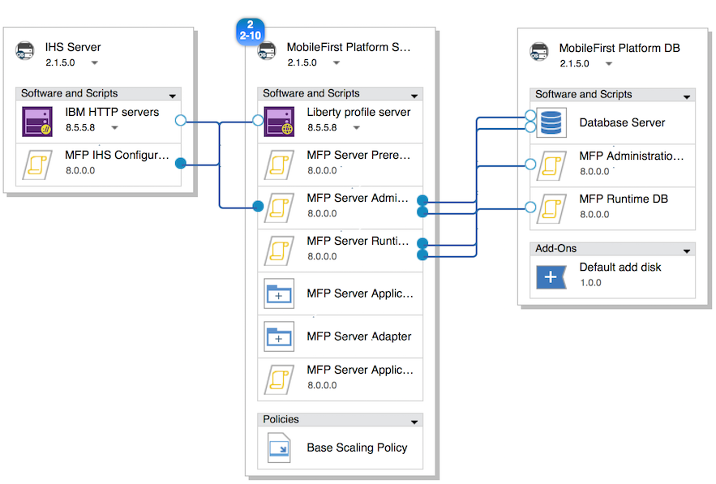
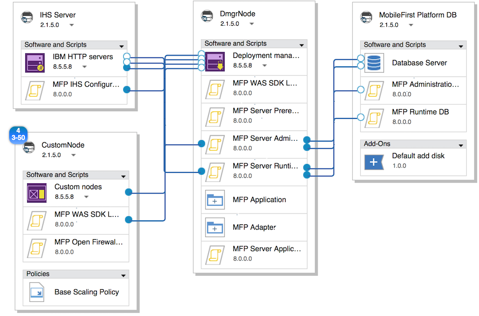

<!-- NLS_CHARSET=UTF-8 -->
## 개요
{: #overview }
{{ site.data.keys.product_full }}은 {{ site.data.keys.mf_server }} 및 {{ site.data.keys.product_adj }} 애플리케이션을 IBM  PureApplication System 및 IBM PureApplication Service on SoftLayer에 배치하고 관리하는 기능을 제공합니다. 

{{ site.data.keys.product }}을 IBM PureApplication System 및 IBM PureApplication Service on SoftLayer와 조합하면 개발자 및 관리자가 모바일 애플리케이션을 개발하고 테스트하며 클라우드에 배치하는 데 필요한 단순하고 직관적인 환경이 제공됩니다. 이 버전의 {{ site.data.keys.mf_system_pattern_full }}은 IBM PureApplication System 및 IBM PureApplication Service on SoftLayer의 최신 버전에 포함된 PureApplication 가상 시스템 패턴 기술에 대한 {{ site.data.keys.product }} 런타임 및 아티팩트 지원을 제공합니다. IBM PureApplication System의 이전 버전에서는 클래식 가상 시스템 패턴이 지원되었습니다. 

#### 다음으로 이동
{: #jump-to }
* [{{ site.data.keys.mf_system_pattern }} 설치](#installing-mobilefirst-system-pattern)
* [{{ site.data.keys.mf_system_pattern }}의 토큰 라이센싱 요구사항](#token-licensing-requirements-for-mobilefirst-system-pattern)
* [단일 노드 WebSphere Application Server Liberty 프로파일 서버에 {{ site.data.keys.mf_server }} 배치](#deploying-mobilefirst-server-on-a-single-node-websphere-application-server-liberty-profile-server)
* [복수 노드 WebSphere Application Server Liberty 프로파일 서버에 {{ site.data.keys.mf_server }} 배치](#deploying-mobilefirst-server-on-a-multiple-node-websphere-application-server-liberty-profile-server)
* [단일 노드 WebSphere Application Server 전체 프로파일 서버에 {{ site.data.keys.mf_server }} 배치](#deploying-mobilefirst-server-on-a-single-node-websphere-application-server-full-profile-server)
* [복수 노드 WebSphere Application Server 전체 프로파일 서버에 {{ site.data.keys.mf_server }} 배치](#deploying-mobilefirst-server-on-a-multiple-node-websphere-application-server-full-profile-server)
* [WebSphere Application Server Network Deployment 서버 클러스터에 {{ site.data.keys.mf_server }} 배치](#deploying-mobilefirst-server-on-clusters-of-websphere-application-server-network-deployment-servers)
* [단일 노드 WebSphere Application Server Liberty 프로파일 서버에 {{ site.data.keys.mf_app_center }} 배치](#deploying-mobilefirst-application-center-on-a-single-node-websphere-application-server-liberty-profile-server)
* [단일 노드 WebSphere Application Server 전체 프로파일 서버에 {{ site.data.keys.mf_app_center }} 배치](#deploying-mobilefirst-application-center-on-a-single-node-websphere-application-server-full-profile-server)
* [외부 LDAP 저장소를 사용하여 {{ site.data.keys.product_adj }} 관리 보안 구성](#configuring-mobilefirst-administration-security-with-an-external-ldap-repository)
* [{{ site.data.keys.mf_system_pattern }}을 사용하여 외부 데이터베이스 구성](#configuring-an-external-database-with-a-mobilefirst-system-pattern)
* [{{ site.data.keys.mf_analytics }} 배치 및 구성](#deploying-and-configuring-mobilefirst-analytics)
* [{{ site.data.keys.mf_system_pattern }}의 사전 정의된 템플리트](#predefined-templates-for-mobilefirst-system-pattern)
* [{{ site.data.keys.mf_server }}의 스크립트 패키지](#script-packages-for-mobilefirst-server)
* [{{ site.data.keys.mf_system_pattern }} 업그레이드](#upgrading-mobilefirst-system-pattern)

### 주요 이점
{: #key-benefits }
{{ site.data.keys.mf_system_pattern }}은 다음과 같은 이점을 제공합니다.

* 사전 정의된 템플리트를 사용하면 대부분의 일반적인 {{ site.data.keys.mf_server }} 배치 토폴로지에 대해 간단한 방법으로 패턴을 빌드할 수 있습니다. 토폴로지의 예는 다음과 같습니다.   
    * IBM WebSphere  Application Server Liberty 프로파일 단일 노드
    * IBM WebSphere Application Server Liberty 프로파일 복수 노드
    * IBM WebSphere Application Server 전체 프로파일 단일 노드
    * IBM WebSphere Application Server 전체 프로파일 복수 노드
    * WebSphere Application Server Network Deployment 서버 클러스터
    * 다음과 같은 {{ site.data.keys.mf_app_center }} 배치 토폴로지
        * IBM WebSphere Application Server Liberty 프로파일 단일 노드
        * IBM WebSphere Application Server 전체 프로파일 단일 노드
* 스크립트 패키지는 패턴에의 분석 서버 포함 자동화 및 유연한 DB VM 배치 옵션 등의 확장된 배치 토폴로지를 작성하는 구성 요소 역할을 합니다. WebSphere Application Server 및 DB2 스크립트 패키지는 WebSphere Application Server 및 DB2 패턴 유형을 포함시키면 사용 가능하게 됩니다. 
* 런타임 배치 스크립트 패키지의 선택적 JNDI 특성을 사용하여 배치 토폴로지를 미세 조정할 수 있습니다. 또한 IBM WebSphere Application Server 전체 프로파일을 사용하여 빌드되는 배치 토폴로지는 이제 WebSphere Application Server 관리 콘솔로의 액세스를 지원하며, 이로 인해 애플리케이션 서버의 구성을 완전하게 제어할 수 있습니다. 

### 중요한 제한사항
{: #important-restrictions }
사용하는 패턴 템플리트에 따라 일부 컴포넌트 속성을 변경하지 마십시오. 이러한 컴포넌트 속성을 변경하는 경우, 이러한 템플리트를 기반으로 하는 패턴을 배치하는 데 실패합니다.

#### {{ site.data.keys.product }}(Application Center Liberty 단일 노드)
{: #mobilefirst-foundation-application-center-liberty-single-node }
Liberty profile server에서 다음 속성의 값을 변경하지 마십시오. 

* WebSphere 제품 설치 디렉토리
* 구성 데이터 위치
* Liberty 프로파일 서버 이름
* IBM Java SDK 설치에서 Java SDK V7.0 또는 Java SDK V7.1만 선택하십시오.
* 추가 기능 설치를 선택하고 IBM WebSphere eXtreme Scale 선택을 취소하십시오. 

#### {{ site.data.keys.product }}(Application Center WebSphere Application Server 단일 노드)
{: #mobilefirst-foundation-application-center-websphere-application-server-single-node }
Liberty profile server에서 다음 속성의 값을 변경하지 마십시오. 

* WebSphere 제품 설치 디렉토리
* 구성 데이터 위치
* 셀 이름
* 노드 이름
* 프로파일 이름
* IBM Java SDK 설치에서 Java SDK V7.0 또는 Java SDK V7.1만 선택하십시오.
* 추가 기능 설치를 선택하고 IBM WebSphere eXtreme Scale 선택을 취소하십시오. 

#### {{ site.data.keys.product }}(Liberty 단일 노드)
{: #mobilefirst-foundation-liberty-single-node }
Liberty profile server에서 다음 속성의 값을 변경하지 마십시오. 

* WebSphere 제품 설치 디렉토리
* 구성 데이터 위치
* Liberty 프로파일 서버 이름
* IBM Java SDK 설치에서 Java SDK V7.0 또는 Java SDK V7.1만 선택하십시오.
* 추가 기능 설치를 선택하고 IBM WebSphere eXtreme Scale 선택을 취소하십시오. 

#### {{ site.data.keys.product }}(Liberty 서버 팜)
{: #mobilefirst-foundation-liberty-server-farm }
Liberty profile server에서 다음 속성의 값을 변경하지 마십시오. 

* WebSphere 제품 설치 디렉토리
* 구성 데이터 위치
* Liberty 프로파일 서버 이름
* IBM Java SDK 설치에서 Java SDK V7.0 또는 Java SDK V7.1만 선택하십시오.
* 추가 기능 설치를 선택하고 IBM WebSphere eXtreme Scale 선택을 취소하십시오. 

#### {{ site.data.keys.product }}(WebSphere Application Server 단일 노드) 템플리트
{: #mobilefirst-foundation-websphere-application-server-single-node-template }
MobileFirst Platform Server 노드의 **Standalone server 컴포넌트**에서 다음 속성의 값을 잠금 해제하거나 변경하지 마십시오.

* 셀 이름
* 노드 이름
* 프로파일 이름
* 이러한 속성을 변경하면 패턴 배치에 실패합니다. 

#### {{ site.data.keys.product }}(WebSphere Application Server 서버 팜) 템플리트
{: #mobilefirst-foundation-websphere-application-server-server-farm-template }
MobileFirst Platform Server 노드의 **Standalone server 컴포넌트**에서 다음 속성의 값을 잠금 해제하거나 변경하지 마십시오.

* 셀 이름
* 노드 이름
* 프로파일 이름
* 이러한 속성을 변경하면 패턴 배치에 실패합니다. 

#### {{ site.data.keys.product }}(WebSphere Application Server Network Deployment) 템플리트
{: #mobilefirst-foundation-websphere-application-server-network-deployment-template }
**DmgrNode 노드**의 **Deployment Manager 컴포넌트** 또는 **CustomNode 노드**의 **Custom nodes 컴포넌트**에서 다음 속성의 값을 잠금 해제하거나 변경하지 마십시오. 

* 셀 이름
* 노드 이름
* 프로파일 이름

이러한 속성을 변경하면 패턴 배치에 실패합니다. 

### 제한사항
{: #limitations }
다음과 같은 제한사항이 적용됩니다. 

* WebSphere Application Server Liberty 프로파일 서버 팜 및 WebSphere Application Server 전체 프로파일 서버 팜의 동적 스케일링은 지원되지 않습니다. 서버 팜 노드 수는 스케일링 정책을 설정하여 패턴에서 지정할 수 있지만 런타임 동안에는 변경할 수 없습니다. 
* V7.0 전의 버전에서 지원되는 {{ site.data.keys.v63_to_80prerebrand_product_full }} System Pattern Extension for {{ site.data.keys.mf_studio }} 및 Ant 명령행 인터페이스는 {{ site.data.keys.mf_system_pattern }}의 현재 버전에서는 사용할 수 없습니다. 
* {{ site.data.keys.mf_system_pattern }}은 WebSphere Application Server 패턴에 의존하며 여기에는 자체 고유의 제한사항이 적용됩니다. 자세한 정보는 [WebSphere Application Server 패턴 제한사항](http://ibm.biz/knowctr#SSAJ7T_1.0.0/com.ibm.websphere.waspatt20base.doc/ae/rins_patternsB_restrictions.html)을 참조하십시오.
* 가상 시스템 패턴의 설치 제거 제한사항으로 인해, 패턴 유형을 삭제한 후에는 수동으로 스크립트 패키지를 삭제해야 합니다. IBM PureApplication System에서 **카탈로그 → 스크립트 패키지**로 이동하여 **컴포넌트** 섹션에 나열된 스크립트 패키지를 삭제하십시오. 
* MobileFirst(WebSphere Application Server Network Deployment) 패턴 템플리트는 토큰 라이센싱을 지원하지 않습니다. 이 패턴을 사용하려면 영구 라이센싱을 사용해야 합니다. 기타 모든 패턴에서는 토큰 라이센싱을 지원합니다. 

### 컴포지션
{: #composition }
{{ site.data.keys.mf_system_pattern }}은 다음 패턴으로 구성됩니다. 

* IBM WebSphere Application Server Network Deployment Patterns 2.2.0.0.
* [PureApplication Service] WebSphere Application Server Network Deployment Patterns가 작동할 수 있도록 하는 WebSphere 8558 for Mobile IM 저장소. IBM PureApplication System 관리자에게 문의하여 WebSphere 8558 IM 저장소가 설치되어 있는지 확인하십시오. 
* IBM DB2 with BLU Acceleration  Pattern 1.2.4.0.
* {{ site.data.keys.mf_system_pattern }}.

### 컴포넌트
{: #components }
IBM WebSphere Application Server Pattern 및 IBM DB2 with BLU Acceleration Pattern에서 제공하는 모든 컴포넌트 이외에,
{{ site.data.keys.mf_system_pattern }}은 다음 스크립트 패키지를 제공합니다. 

* MFP Administration DB
* MFP Runtime DB
* MFP Server Prerequisite
* MFP Server Administration
* MFP Server Runtime Deployment
* MFP Server Application Adapter Deployment
* MFP IHS Configuration
* MFP Analytics
* MFP Open Firewall Ports for WAS
* MFP WAS SDK Level
* MFP Server Application Center

### 다른 제품 버전으로 작성된 패턴 유형 및 아티팩트 간의 호환성
{: #compatibility-between-pattern-types-and-artifacts-created-with-different-product-versions }
MobileFirst Studio V6.3.0 또는 이전 버전을 사용하여 애플리케이션을 개발하는 경우, 연관된 런타임, 애플리케이션 및 어댑터 아티팩트를 {{ site.data.keys.v63_to_80prerebrand_product_full }} V7.0.0 이상과 연관된 패턴에 업로드할 수 있습니다. 

{{ site.data.keys.v63_to_80prerebrand_product_full }} V6.3.0 또는 이전 버전과 연관된 패턴 유형은 MobileFirst Studio V7.0.0 이상을 사용하여 작성된 런타임, 애플리케이션 및 어댑터 아티팩트와 호환 가능하지 않습니다. 

V6.0.0 및 이전 버전의 경우, 동일한 버전의 서버, **.war** 파일, 애플리케이션(**.wlapp** 파일) 및 어댑터만 호환 가능합니다.

## {{ site.data.keys.mf_system_pattern }} 설치
{: #installing-mobilefirst-system-pattern }
**{{ site.data.keys.mf_system_pattern_file }}** 파일을 찾을 수 있습니다. 이 파일을 추출한 후 다음 프로시저를 시작하십시오. 

1. 새 패턴 유형을 작성할 권한이 있는 계정으로 IBM  PureApplication System에 로그인하십시오. 
2. **카탈로그 → 패턴 유형**으로 이동하십시오. 
3. 다음과 같이 {{ site.data.keys.mf_system_pattern }} **.tgz** 파일을 업로드하십시오. 
    * 도구 모음에서 **+**를 클릭하십시오. "패턴 유형 설치" 창이 열립니다. 
    * 로컬 탭에서 **찾아보기**를 클릭하고 {{ site.data.keys.mf_system_pattern }} **.tgz** 파일을 선택한 후 업로드 프로세스가 완료될 때까지 기다리십시오. 패턴 유형이 목록에 표시되고 사용 가능하지 않은 것으로 표시됩니다.
4. 패턴 유형 목록에서 업로드된 패턴 유형을 클릭하십시오. 패턴 유형의 세부사항이 표시됩니다. 
5. 라이센스 계약 행에서 **라이센스**를 클릭하십시오. 라이센스 계약 조항이 있는 라이센스 창이 표시됩니다.
6. 라이센스에 동의하려면 **동의**를 클릭하십시오. 그러면 패턴 유형의 세부사항에 라이센스가 승인되었음이 표시됩니다.
7. 상태 행에서 **사용**을 클릭하십시오. 그러면 패턴 유형이 사용 가능한 것으로 나열됩니다.
8. PureApplication Service의 경우 필수: 패턴 유형이 사용 가능하게 설정되면 **카탈로그 → 스크립트** 패키지로 이동하여 "MFP \*\*\*"와 이름이 유사한 스크립트 패키지를 선택하십시오. 오른쪽의 세부사항 페이지에 있는 **라이센스 계약** 필드에서 라이센스에 동의하십시오. 컴포넌트 섹션에 나열된 11개의 스크립트 패키지 모두에 대해 이 조작을 반복하십시오. 

## {{ site.data.keys.mf_system_pattern }}의 토큰 라이센싱 요구사항
{: #token-licensing-requirements-for-mobilefirst-system-pattern }
토큰 라이센싱을 사용하여 {{ site.data.keys.product }}의 라이센스를 부여하는 경우, {{ site.data.keys.mf_system_pattern_full }}을 배치하기 전에 IBM  Rational  License Key Server를 설치하고 라이센스를 지정하여 구성해야 합니다. 

> **중요:** {{ site.data.keys.product }}(WAS ND) 패턴 템플리트는 토큰 라이센싱을 지원하지 않습니다. {{ site.data.keys.product }}(WAS ND) 패턴 템플리트에 기반하여 패턴을 배치할 때는 영구 라이센싱을 사용해야 합니다. 기타 모든 패턴 템플리트에서는 토큰 라이센싱을 지원합니다.


IBM Rational License Key Server는 PureApplication  System의 외부에 있어야 합니다. {{ site.data.keys.system_pattern }}은 IBM Rational License Key Server에 대해 PureApplication System 공유 서비스를 지원하지 않습니다. 

또한, 패턴 속성에 라이센스 키 서버 정보를 추가하려면 Rational License Key Server에 대한 다음 정보를 알아야 합니다. 

* Rational License Key Server의 완전한 호스트 이름 또는 IP 주소
* 라이센스 관리자 디먼(**lmgrd**) 포트
* 공급업체 디먼(**ibmratl**) 포트

Rational License Key Server와 PureApplication System의 사이에 방화벽이 있는 경우, 방화벽에서 두 디먼 포트가 모두 열려 있는지 확인하십시오.
라이센스 키 서버에 연결할 수 없거나 사용할 수 있는 라이센스 토큰이 충분하지 않으면 {{ site.data.keys.system_pattern }} 배치에 실패합니다. 

Rational License Key Server 설치 및 구성에 대한 세부사항은 [IBM Support - Rational 라이센싱 시작 페이지](http://www.ibm.com/software/rational/support/licensing/)를 참조하십시오.

## 단일 노드 WebSphere Application Server Liberty 프로파일 서버에 {{ site.data.keys.mf_server }} 배치
{: #deploying-mobilefirst-server-on-a-single-node-websphere-application-server-liberty-profile-server }
사전 정의된 템플리트를 사용하여 {{ site.data.keys.mf_server }}를 단일 노드 WebSphere Application Server Liberty 프로파일 서버에 배치합니다. 

이 프로시저에는 필수 애플리케이션 및 어댑터와 같은 특정 아티팩트를 IBM  PureApplication  System에 업로드하는 작업이 포함됩니다. 시작하기 전에 해당 아티팩트가 업로드 가능한지 확인하십시오. 

**토큰 라이센싱 요구사항:** 토큰 라이센싱을 사용하여 {{ site.data.keys.product }}의 라이센스를 부여하는 경우, 계속하기 전에 [{{ site.data.keys.mf_system_pattern }}의 토큰 라이센싱 요구사항](#token-licensing-requirements-for-mobilefirst-system-pattern)에 요약된 요구사항을 검토하십시오. 라이센스 키 서버에 연결할 수 없거나 사용할 수 있는 라이센스 토큰이 충분하지 않으면 이 패턴을 배치하는 데 실패합니다. 

템플리트에 있는 스크립트 패키지의 일부 매개변수는 권장 값으로 구성되어 있으므로 이 절에서는 언급하지 않습니다. 미세 조정을 위해서는 [{{ site.data.keys.mf_server }}의 스크립트 패키지](#script-packages-for-mobilefirst-server)에서 스크립트 패키지의 모든 매개변수에 대한 자세한 정보를 참조하십시오.

이 프로시저에서 사용되는 사전 정의된 템플리트의 컴포지션 및 구성 옵션에 대한 자세한 정보는 [{{ site.data.keys.product }}(Liberty 단일 노드) 템플리트](#mobilefirst-foundation-liberty-single-node-template)를 참조하십시오. 

1. 사전 정의된 템플리트에서 패턴을 작성하십시오. 
    * IBM PureApplication System 대시보드에서 **패턴 → 가상 시스템 패턴**을 클릭하십시오. 가상 시스템 패턴 페이지가 열립니다. 
    * **가상 시스템 패턴** 페이지에서 **새로 작성**을 클릭한 후 팝업 창의 사전 정의된 템플리트 목록에서 **MobileFirst Platform(Liberty 단일 노드)**를 선택하십시오. 길이 때문에 이름이 일부만 표시되는 경우에는 **자세한 정보** 탭에서 해당 설명을 검토하여 올바른 템플리트가 선택되었는지 확인할 수 있습니다. 
    * **이름** 필드에 패턴의 이름을 제공하십시오. 
    * **버전** 필드에 패턴의 버전 번호를 지정하십시오. 
    * **빌드 시작**을 클릭하십시오.
2. AIX의 경우 필수: Power 에서 실행 중인 IBM PureApplication System에서, MobileFirst Platform DB 노드는 jfs2 파일 시스템을 지원하기 위해 AIX 고유 추가 기능 컴포넌트인 "Default AIX add disk"를 사용하여 템플리트의 "Default add disk" 컴포넌트를 대체해야 합니다. 
    * 패턴 빌더에서 **MobileFirst Platform DB** 노드를 선택하십시오. 
    * **컴포넌트 추가 기능 추가** 단추를 클릭하십시오(이 단추는 **MobileFirst Platform DB** 노드 위에 커서를 놓을 때 컴포넌트 상자 위에 표시됨). 
    * **추가 기능 추가** 목록에서 **Default AIX add disk**를 선택하십시오. 이 컴포넌트가 MobileFirst Platform DB 노드의 최하위 컴포넌트로 추가됩니다. 
    * **Default AIX add disk** 컴포넌트를 선택하고 다음 속성을 지정하십시오. 
        * **DISK_SIZE_GB:** DB 서버로 확장되는 스토리지 크기(GB)입니다. 예제 값: **10**.
        * **FILESYSTEM_TYPE:** AIX에서 지원되는 파일 시스템입니다. 기본값: **jfs2**.
        * **MOUNT_POINT:** MobileFirst Platform DB 노드의 Database Server 컴포넌트에 있는 **인스턴스 소유자의 마운트 위치** 속성과 일치합니다. 예제 값: **/dbinst**.
        * **VOLUME_GROUP:** 예제 값: **group1**. 올바른 값은 IBM PureApplication System 관리자에게 문의하십시오. 
    * MobileFirst Platform DB 노드에서 **Default add disk** 컴포넌트를 선택한 후 바이너리 아이콘을 클릭하여 삭제하십시오. 
    * 패턴을 저장하십시오.
3. 선택사항: {{ site.data.keys.mf_server }} 관리를 구성하십시오. 나중에 9단계의 패턴 배치 구성 단계(Phase) 중에 {{ site.data.keys.mf_server }} 관리 권한을 가진 사용자 신임을 지정하려는 경우 이 단계를 건너뛸 수 있습니다. 지금 지정하려면 다음 단계를 완료하십시오.


    > **참고:** LDAP 서버를 사용하여 관리 보안을 구성하려는 경우 추가 LDAP 정보를 제공해야 합니다. 자세한 정보는 [외부 LDAP 저장소를 사용하여 {{ site.data.keys.product_adj }} 관리 보안 구성](#configuring-mobilefirst-administration-security-with-an-external-ldap-repository)을 참조하십시오.

    * MobileFirst Platform Server 노드에서 **MFP Server Administration** 컴포넌트를 클릭하십시오. 선택한 컴포넌트의 특성이 캔버스 옆에 표시됩니다. 
    * **admin_user** 및 **admin_password** 필드 옆에 있는 삭제 단추를 클릭하여 해당 패턴 레벨 매개변수 설정을 지우십시오.
    * **admin_user** 및 **admin\_password** 필드에 관리 사용자 이름 및 비밀번호를 지정하십시오. 
    * 토큰 라이센싱을 사용하여 {{ site.data.keys.product }}의 라이센스를 부여하는 경우 다음 필드를 완료하십시오. 토큰 라이센싱을 사용하지 않으면 다음 필드를 공백으로 두십시오.

    **ACTIVATE\_TOKEN\_LICENSE**: 토큰 라이센싱을 사용하여 패턴의 라이센스를 부여하려면 이 필드를 선택하십시오.  
    **LICENSE\_SERVER\_HOSTNAME**: Rational License Key Server의 완전한 호스트 이름 또는 IP 주소를 입력하십시오.   
    **LMGRD\_PORT**: 라이센스 관리자 디먼(**lmrgd**)이 연결을 청취하는 포트 번호를 입력하십시오. 기본 라이센스 관리자 디먼 포트는 27000입니다.  
    **IBMRATL\_PORT**: 공급업체 디먼(**ibmratl**)이 연결을 청취하는 포트 번호를 입력하십시오. 기본 공급업체 디먼 포트는 일반적으로 27001입니다.  

    패턴 배치 중에 {{ site.data.keys.mf_server }}의 기본 관리 계정이 작성됩니다. 

4. 선택사항: {{ site.data.keys.mf_server }} 런타임 배치를 구성하십시오. 나중에 9단계의 패턴 배치 구성 단계(Phase) 중에 런타임의 컨텍스트 루트 이름을 지정하려는 경우 이 단계를 건너뛸 수 있습니다. 지금 컨텍스트 루트 이름을 지정하려면 다음 단계를 완료하십시오.
    * MobileFirst Platform Server 노드에서 **MFP Server Runtime Deployment** 컴포넌트를 클릭하십시오. 선택한 컴포넌트의 특성이 캔버스 옆에 표시됩니다. 
    * **runtime\_contextRoot** 필드 옆에 있는 **삭제** 단추를 클릭하여 패턴 레벨 매개변수 설정을 지우십시오. 
    * **runtime\_contextRoot** 필드에 런타임 컨텍스트 루트 이름을 지정하십시오. 컨텍스트 루트 이름은 슬래시(/)로 시작해야 합니다(예: `/HelloWorld`). 

5. 애플리케이션 및 어댑터 아티팩트를 업로드하십시오.

    > **중요:** 애플리케이션 및 어댑터의 대상 경로를 지정할 때 모든 애플리케이션 및 어댑터가 동일한 디렉토리에 배치되었는지 확인하십시오. 예를 들어, 하나의 대상 경로가 **/opt/tmp/deploy/HelloWorld-common.json**인 경우 다른 모든 대상 경로는 `/opt/tmp/deploy/*`여야 합니다.

    * MobileFirst Platform Server 노드에서 **MFP Server Application** 또는 **MFP Server Adapter** 컴포넌트를 클릭하십시오. 선택한 컴포넌트의 특성이 캔버스 옆에 표시됩니다. 
    * **추가 파일** 필드에서 **찾아보기** 단추를 클릭하여 애플리케이션 또는 어댑터 아티팩트를 찾아 업로드하십시오. 
    * **대상 경로** 필드에서 아티팩트를 저장할 전체 경로(해당 파일 이름 포함)를 지정하십시오(예: **/opt/tmp/deploy/HelloWorld-common.json**). 
    * 패턴에 애플리케이션 또는 어댑터를 배치하지 않는 경우에는 관련 컴포넌트 내부의 **X** 단추를 클릭하여 해당 컴포넌트를 제거하십시오. 앱 또는 어댑터가 설치되어 있지 않는 비어 있는 {{ site.data.keys.mf_console }}을 배치하려면 MFP Server Application Adapter Deployment 컴포넌트 내부의 X 단추를 클릭하여 해당 컴포넌트를 제거하십시오. 

6. 선택사항: 배치할 애플리케이션 또는 어댑터 아티팩트를 추가하십시오. 
    * **자산** 도구 모음에서 **소프트웨어 컴포넌트**를 펼친 후 **추가 파일** 컴포넌트를 캔버스의 MobileFirst Platform Server 노드 위로 끌어서 놓으십시오. 이름을 **{{ site.data.keys.product_adj }} App\_X** 또는 **{{ site.data.keys.product_adj }} Adatper\_X**로 바꾸십시오(여기서 **X**는 구별을 위한 고유 번호임).
    * 새로 추가된 앱 또는 어댑터 컴포넌트 위에 커서를 놓은 후 **위로 이동** 및 **아래로 이동** 단추를 클릭하여 노드에서 해당 컴포넌트의 순서를 조정하십시오. 해당 컴포넌트가 MFP Runtime Deployment 컴포넌트와 MFP Server Application Adapter Deployment 컴포넌트 사이에 배치되었는지 확인하십시오. 
    * 새로 추가된 애플리케이션 또는 어댑터 컴포넌트를 클릭하십시오. 선택한 컴포넌트의 특성이 캔버스 옆에 표시됩니다. 6단계의 단계를 참조하여 애플리케이션 또는 어댑터 아티팩트를 업로드하고 해당 대상 경로를 지정하십시오. 
    * 7단계를 반복하여 배치할 애플리케이션 및 어댑터를 추가하십시오. 

7. 선택사항: {{ site.data.keys.mf_server }}로의 애플리케이션 및 어댑터 배치를 구성하십시오. 나중에 9단계의 패턴 배치 구성 단계(Phase) 중에 배치 권한을 가진 사용자 신임을 지정하려는 경우 이 단계를 건너뛸 수 있습니다. 3단계에서 기본 관리 사용자 신임을 지정한 경우에는 지금 배치자를 지정할 수 있습니다. 이는 관리 사용자 신임과 일치해야 합니다. 
    * MobileFirst Platform Server 노드에서 **MFP Server Application Adapter Deployment** 컴포넌트를 선택하십시오. 선택한 컴포넌트의 특성이 캔버스 옆에 표시됩니다. 
    * **deployer_user** 및 **deployer_password** 매개변수를 찾은 후 인접한 삭제 단추를 클릭하여 패턴 레벨 매개변수 설정을 지우십시오. 
    * **deployer\_user** 및 **deployer\_password** 필드에 사용자 이름 및 비밀번호를 지정하십시오. 

8. 패턴 배치를 구성하고 실행하십시오. 
    * IBM PureApplication System 대시보드에서 **패턴 → 가상 시스템 패턴**을 클릭하십시오. 
    * **가상 시스템 패턴** 페이지에서 **검색** 필드를 사용하여 사용자가 작성한 패턴을 찾아 선택하십시오.
    * 패턴에 대한 자세한 정보가 표시되는 패널 위의 도구 모음에서 배치 단추를 클릭하십시오. 
    * 패턴 배치 창의 구성 패널에 있는 **환경 프로파일** 목록에서 올바른 환경 프로파일을 선택하고 기타 IBM PureApplication System 환경 매개변수를 제공하십시오. 올바른 정보를 얻으려면 IBM PureApplication System 관리자에게 문의하십시오. 
    * 가운데 열에서 **패턴 속성**을 클릭하여 속성(예: 사용자 이름 및 비밀번호)을 표시하십시오. 

        표시되는 필드에 다음과 같은 정보를 제공하십시오.

        > **참고:** 외부 LDAP 서버가 구성되어 있는 경우에도 패턴 레벨 매개변수의 값을 적절히 변경하십시오. LDAP 서버를 사용하여 관리 보안을 구성하는 경우 추가 LDAP 정보를 제공해야 합니다. 자세한 정보는 [외부 LDAP 저장소를 사용하여 {{ site.data.keys.product_adj }} 관리 보안 구성](#configuring-mobilefirst-administration-security-with-an-external-ldap-repository)을 참조하십시오.

        
        **admin\_user**  
        3단계에서 구성된 경우 표시되지 않습니다. 기본 {{ site.data.keys.mf_server }} 관리자 계정을 작성하십시오. 기본값: demo.
        
        **admin\_password**  
        3단계에서 구성된 경우 표시되지 않습니다. 기본 관리자 계정 비밀번호입니다. 기본값: demo.
        
        **ACTIVATE\_TOKEN\_LICENSE**  
        3단계에서 구성된 경우 표시되지 않습니다. 토큰 라이센싱을 사용하여 패턴의 라이센스를 부여하려면 이 필드를 선택하십시오. 영구 라이센스를 사용하는 경우 이 필드를 빈 상태로 두십시오. 
        
        **LICENSE\_SERVER\_HOSTNAME**  
        3단계에서 구성된 경우 표시되지 않습니다. 토큰 라이센싱을 사용하여 {{ site.data.keys.product }}의 라이센스를 부여하는 경우, Rational License Key Server의 완전한 호스트 이름 또는 IP 주소를 입력하십시오. 그렇지 않은 경우, 이 필드를 공백으로 두십시오. 
        
        **LMGRD\_PORT**   
        3단계에서 구성된 경우 표시되지 않습니다. 토큰 라이센싱을 사용하여 {{ site.data.keys.product }}의 라이센스를 부여하는 경우, 라이센스 관리자 디먼(lmrgd)이 연결을 청취하는 포트 번호를 입력하십시오. 그렇지 않은 경우, 이 필드를 공백으로 두십시오.
        기본 라이센스 관리자 디먼 포트는 27000입니다.

        **IBMRATL\_PORT**  
        3단계에서 구성된 경우 표시되지 않습니다. 토큰 라이센싱을 사용하여 {{ site.data.keys.product }}의 라이센스를 부여하는 경우, 공급업체 디먼(ibmratl)이 연결을 청취하는 포트 번호를 입력하십시오. 그렇지 않은 경우, 이 필드를 공백으로 두십시오.
        기본 공급업체 디먼 포트는 일반적으로 27001입니다.

        **runtime\_contextRoot**  
        5단계에서 구성된 경우 표시되지 않습니다. {{ site.data.keys.mf_server }} 런타임의 컨텍스트 루트 이름입니다. 이름은 "/"로 시작해야 합니다. 
        
        **deployer\_user**  
        8단계에서 구성된 경우 표시되지 않습니다. 배치 권한이 있는 계정의 사용자 이름입니다. 외부 LDAP 서버가 구성되지 않은 경우, 앱 및 어댑터 배치 권한이 부여된 사용자만 기본 관리 사용자이므로 관리 서비스의 기본 관리 사용자를 작성할 때 지정한 값과 동일한 값을 입력해야 합니다.
        
        **deployer\_password**  
        8단계에서 구성된 경우 표시되지 않습니다. 배치 권한이 있는 사용자의 사용자 비밀번호입니다.
        
        **MFP Vms 비밀번호(루트)**  
        {{ site.data.keys.mf_server }} 및 {{ site.data.keys.product }} DB 노드의 루트 비밀번호입니다. 기본값: passw0rd.
        
        **MFP DB 비밀번호(인스턴스 소유자)**  
        MobileFirst Platform DB 노드의 인스턴스 소유자 비밀번호입니다. 기본값: **passw0rd**.    
    * **빠른 배치**를 클릭하여 패턴 배치를 실행하십시오. 몇 초 후 패턴 실행이 시작되었다는 메시지가 표시됩니다. 메시지에 표시된 URL을 클릭하여 패턴 배치 상태를 추적하거나 **패턴 → 가상 시스템 인스턴스**로 이동하여 가상 시스템 인스턴스 페이지를 열고 거기서 패턴을 검색할 수 있습니다.

    토큰 라이센싱을 사용하여 {{ site.data.keys.product }}의 라이센스를 부여하는 경우, 사용 가능한 라이센스 토큰이 충분하지 않거나 라이센스 키 서버 IP 주소 및 포트를 잘못 입력하면 패턴 배치에 실패합니다.

9. {{ site.data.keys.mf_console }}에 액세스하십시오. 
    * **패턴 → 가상 시스템 인스턴스**를 클릭하여 가상 시스템 인스턴스 페이지를 열고 거기서 패턴을 검색하십시오. 패턴이 실행 중 상태인지 확인하십시오. 
    * 패턴 이름을 선택한 후 선택된 인스턴스의 세부사항이 표시되는 패널에서 **가상 머신 퍼스펙티브** 옵션을 펼치십시오. 
    * 이름이 **MobileFirst\_Platform\_Server.**와 유사한 {{ site.data.keys.mf_server }} VM을 찾아 해당 공용 IP 주소를 메모하십시오. 다음 단계에서 이 정보가 필요합니다. 
    * 브라우저에서 다음 형식 중 하나로 해당 URL을 작성하여 {{ site.data.keys.mf_console }}을 여십시오. 
        * `http://{MFP Server VM Public IP}:9080/mfpconsole`
        * `https://{MFP Server VM Public IP}:9443/mfpconsole`
    * 3단계 또는 9단계에서 지정한 관리 사용자 및 비밀번호로 콘솔에 로그인하십시오.

## 복수 노드 WebSphere Application Server Liberty 프로파일 서버에 {{ site.data.keys.mf_server }} 배치
{: #deploying-mobilefirst-server-on-a-multiple-node-websphere-application-server-liberty-profile-server }
사전 정의된 템플리트를 사용하여 {{ site.data.keys.mf_server }}를 복수 노드 WebSphere Application Server Liberty 프로파일 서버에 배치합니다. 

이 프로시저에는 필수 애플리케이션 및 어댑터와 같은 특정 아티팩트를 IBM  PureApplication  System에 업로드하는 작업이 포함됩니다. 시작하기 전에 해당 아티팩트가 업로드 가능한지 확인하십시오. 

**토큰 라이센싱 요구사항:** 토큰 라이센싱을 사용하여 {{ site.data.keys.product }}의 라이센스를 부여하는 경우, 계속하기 전에 [{{ site.data.keys.mf_system_pattern }}의 토큰 라이센싱 요구사항](#token-licensing-requirements-for-mobilefirst-system-pattern)에 요약된 요구사항을 검토하십시오. 라이센스 키 서버에 연결할 수 없거나 사용할 수 있는 라이센스 토큰이 충분하지 않으면 이 패턴을 배치하는 데 실패합니다. 

템플리트에 있는 스크립트 패키지의 일부 매개변수는 권장 값으로 구성되어 있으므로 이 절에서는 언급하지 않습니다. 미세 조정을 위해서는 [{{ site.data.keys.mf_server }}의 스크립트 패키지](#script-packages-for-mobilefirst-server)에서 스크립트 패키지의 모든 매개변수에 대한 자세한 정보를 참조하십시오.

이 프로시저에서 사용되는 사전 정의된 템플리트의 컴포지션 및 구성 옵션에 대한 자세한 정보는 [{{ site.data.keys.product }}(Liberty 서버 팜) 템플리트](#mobilefirst-foundation-liberty-server-farm-template)를 참조하십시오. 

1. 사전 정의된 템플리트에서 패턴을 작성하십시오. 
    * IBM PureApplication System 대시보드에서 **패턴 → 가상 시스템 패턴**을 클릭하십시오. **가상 시스템 패턴** 페이지가 열립니다.
    * **가상 시스템 패턴** 페이지에서 **새로 작성**을 클릭한 후 팝업 창의 사전 정의된 템플리트 목록에서 **MobileFirst Platform(Liberty 서버 팜)**을 선택하십시오. 길이 때문에 이름이 일부만 표시되는 경우에는 **자세한 정보** 탭에서 해당 설명을 검토하여 올바른 템플리트가 선택되었는지 확인할 수 있습니다. 
    * **이름** 필드에 패턴의 이름을 제공하십시오. 
    * **버전** 필드에 패턴의 버전 번호를 지정하십시오. 
    * **빌드 시작**을 클릭하십시오.
2. AIX의 경우 필수: Power 에서 실행 중인 IBM PureApplication System에서, MobileFirst Platform DB 노드는 **jfs2** 파일 시스템을 지원하기 위해 AIX 고유 추가 기능 컴포넌트인 "Default AIX add disk"를 사용하여 템플리트의 "Default add disk" 컴포넌트를 대체해야 합니다. 
    * 패턴 빌더에서 **MobileFirst Platform DB** 노드를 선택하십시오. 
    * **컴포넌트 추가 기능 추가** 단추를 클릭하십시오(이 단추는 **MobileFirst Platform DB** 노드 위에 커서를 놓을 때 컴포넌트 상자 위에 표시됨). 
    * **추가 기능 추가** 목록에서 **Default AIX add disk**를 선택하십시오. 이 컴포넌트가 MobileFirst Platform DB 노드의 최하위 컴포넌트로 추가됩니다. 
    * **Default AIX add disk** 컴포넌트를 선택하고 다음 속성을 지정하십시오. 
        * **DISK_SIZE_GB:** DB 서버로 확장되는 스토리지 크기(GB)입니다. 예제 값: **10**.
        * **FILESYSTEM_TYPE:** AIX에서 지원되는 파일 시스템입니다. 기본값: **jfs2**.
        * **MOUNT_POINT:** MobileFirst Platform DB 노드의 Database Server 컴포넌트에 있는 **인스턴스 소유자의 마운트 위치** 속성과 일치합니다. 예제 값: **/dbinst**.
        * **VOLUME_GROUP:** 예제 값: **group1**. 올바른 값은 IBM PureApplication System 관리자에게 문의하십시오. 
    * MobileFirst Platform DB 노드에서 **Default add disk** 컴포넌트를 선택한 후 바이너리 아이콘을 클릭하여 삭제하십시오. 
    * 패턴을 저장하십시오.
3. 선택사항: {{ site.data.keys.mf_server }} 관리를 구성하십시오. 나중에 9단계의 패턴 배치 구성 단계(Phase) 중에 {{ site.data.keys.mf_server }} 관리 권한을 가진 사용자 신임을 지정하려는 경우 이 단계를 건너뛸 수 있습니다. 지금 지정하려면 다음 단계를 완료하십시오.


    > **참고:** LDAP 서버를 사용하여 관리 보안을 구성하려는 경우 추가 LDAP 정보를 제공해야 합니다. 자세한 정보는 [외부 LDAP 저장소를 사용하여 {{ site.data.keys.product_adj }} 관리 보안 구성](#configuring-mobilefirst-administration-security-with-an-external-ldap-repository)을 참조하십시오.

    * MobileFirst Platform Server 노드에서 **MFP Server Administration** 컴포넌트를 클릭하십시오. 선택한 컴포넌트의 특성이 캔버스 옆에 표시됩니다. 
    * **admin_user** 및 **admin_password** 필드 옆에 있는 삭제 단추를 클릭하여 해당 패턴 레벨 매개변수 설정을 지우십시오.
    * **admin_user** 및 **admin\_password** 필드에 관리 사용자 이름 및 비밀번호를 지정하십시오. 
    * 토큰 라이센싱을 사용하여 {{ site.data.keys.product }}의 라이센스를 부여하는 경우 다음 필드를 완료하십시오. 토큰 라이센싱을 사용하지 않으면 다음 필드를 공백으로 두십시오.

    **ACTIVATE\_TOKEN\_LICENSE**: 토큰 라이센싱을 사용하여 패턴의 라이센스를 부여하려면 이 필드를 선택하십시오.  
    **LICENSE\_SERVER\_HOSTNAME**: Rational License Key Server의 완전한 호스트 이름 또는 IP 주소를 입력하십시오.   
    **LMGRD\_PORT**: 라이센스 관리자 디먼(**lmrgd**)이 연결을 청취하는 포트 번호를 입력하십시오. 기본 라이센스 관리자 디먼 포트는 27000입니다.  
    **IBMRATL\_PORT**: 공급업체 디먼(**ibmratl**)이 연결을 청취하는 포트 번호를 입력하십시오. 기본 공급업체 디먼 포트는 일반적으로 27001입니다.  

    패턴 배치 중에 {{ site.data.keys.mf_server }}의 기본 관리 계정이 작성됩니다. 
    
4. 선택사항: {{ site.data.keys.mf_server }} 런타임 배치를 구성하십시오. 나중에 10단계의 패턴 배치 구성 단계(Phase) 중에 런타임의 컨텍스트 루트 이름을 지정하려는 경우 이 단계를 건너뛸 수 있습니다. 지금 컨텍스트 루트 이름을 지정하려면 다음의 단계를 완료하십시오. 
    * MobileFirst Platform Server 노드에서 **MFP Server Runtime Deployment** 컴포넌트를 클릭하십시오. 선택한 컴포넌트의 특성이 캔버스 옆에 표시됩니다. 
    * **runtime\_contextRoot** 필드 옆에 있는 **삭제** 단추를 클릭하여 패턴 레벨 매개변수 설정을 지우십시오. 
    * **runtime\_contextRoot** 필드에 런타임 컨텍스트 루트 이름을 지정하십시오. 컨텍스트 루트 이름은 슬래시(/)로 시작해야 합니다(예: `/HelloWorld`). 

5. 애플리케이션 및 어댑터 아티팩트를 업로드하십시오.

    > **중요:** 애플리케이션 및 어댑터의 대상 경로를 지정할 때 모든 애플리케이션 및 어댑터가 동일한 디렉토리에 배치되었는지 확인하십시오. 예를 들어, 하나의 대상 경로가 **/opt/tmp/deploy/HelloWorld-common.json**인 경우 다른 모든 대상 경로는 `/opt/tmp/deploy/*`여야 합니다.

    * MobileFirst Platform Server 노드에서 **MFP Server Application** 또는 **MFP Server Adapter** 컴포넌트를 클릭하십시오. 선택한 컴포넌트의 특성이 캔버스 옆에 표시됩니다. 
    * **추가 파일** 필드에서 **찾아보기** 단추를 클릭하여 애플리케이션 또는 어댑터 아티팩트를 찾아 업로드하십시오. 
    * **대상 경로** 필드에서 아티팩트를 저장할 전체 경로(해당 파일 이름 포함)를 지정하십시오(예: **/opt/tmp/deploy/HelloWorld-common.json**). 
    * 패턴에 애플리케이션 또는 어댑터를 배치하지 않는 경우에는 관련 컴포넌트 내부의 **X** 단추를 클릭하여 해당 컴포넌트를 제거하십시오. 앱 또는 어댑터가 설치되어 있지 않는 비어 있는 {{ site.data.keys.mf_console }}을 배치하려면 MFP Server Application Adapter Deployment 컴포넌트 내부의 X 단추를 클릭하여 해당 컴포넌트를 제거하십시오.  

6. 선택사항: 배치할 애플리케이션 또는 어댑터 아티팩트를 추가하십시오. 
    * **자산** 도구 모음에서 **소프트웨어 컴포넌트**를 펼친 후 **추가 파일** 컴포넌트를 캔버스의 MobileFirst Platform Server 노드 위로 끌어서 놓으십시오. 이름을 **{{ site.data.keys.product_adj }} App\_X** 또는 **{{ site.data.keys.product_adj }} Adatper\_X**로 바꾸십시오(여기서 **X**는 구별을 위한 고유 번호임).
    * 새로 추가된 앱 또는 어댑터 컴포넌트 위에 커서를 놓은 후 **위로 이동** 및 **아래로 이동** 단추를 클릭하여 노드에서 해당 컴포넌트의 순서를 조정하십시오. 해당 컴포넌트가 MFP Runtime Deployment 컴포넌트와 MFP Server Application Adapter Deployment 컴포넌트 사이에 배치되었는지 확인하십시오. 
    * 새로 추가된 애플리케이션 또는 어댑터 컴포넌트를 클릭하십시오. 선택한 컴포넌트의 특성이 캔버스 옆에 표시됩니다. 6단계의 단계를 참조하여 애플리케이션 또는 어댑터 아티팩트를 업로드하고 해당 대상 경로를 지정하십시오. 
    * 7단계를 반복하여 배치할 애플리케이션 및 어댑터를 추가하십시오. 

7. 선택사항: {{ site.data.keys.mf_server }}로의 애플리케이션 및 어댑터 배치를 구성하십시오. 나중에 9단계의 패턴 배치 구성 단계(Phase) 중에 배치 권한을 가진 사용자 신임을 지정하려는 경우 이 단계를 건너뛸 수 있습니다. 3단계에서 기본 관리 사용자 신임을 지정한 경우에는 지금 배치자를 지정할 수 있습니다. 이는 관리 사용자 신임과 일치해야 합니다. 
    * MobileFirst Platform Server 노드에서 **MFP Server Application Adapter Deployment** 컴포넌트를 선택하십시오. 선택한 컴포넌트의 특성이 캔버스 옆에 표시됩니다. 
    * **deployer_user** 및 **deployer_password** 매개변수를 찾은 후 인접한 삭제 단추를 클릭하여 패턴 레벨 매개변수 설정을 지우십시오. 
    * **deployer\_user** 및 **deployer\_password** 필드에 사용자 이름 및 비밀번호를 지정하십시오. 

8. 기본 스케일링 정책을 구성하십시오. 
    * MobileFirst Platform Server 노드에서 **Base Scaling Policy** 컴포넌트를 선택하십시오. 선택한 컴포넌트의 특성이 캔버스 옆에 표시됩니다. 
    * **인스턴스 수** 필드에 패턴 배치 중에 인스턴스화할 서버 노드의 수를 지정하십시오. 사전 정의된 템플리트에서 기본값은 2입니다. 이 릴리스에서는 동적 스케일링이 지원되지 않으므로 나머지 속성 필드에 값을 지정하지 마십시오. 

9. 패턴 배치를 구성하고 실행하십시오. 
    * IBM PureApplication System 대시보드에서 **패턴 → 가상 시스템 패턴**을 클릭하십시오. 
    * **가상 시스템 패턴** 페이지에서 **검색** 필드를 사용하여 사용자가 작성한 패턴을 찾아 선택하십시오.
    * 패턴에 대한 자세한 정보가 표시되는 패널 위의 도구 모음에서 배치 단추를 클릭하십시오. 
    * 패턴 배치 창의 구성 패널에 있는 **환경 프로파일** 목록에서 올바른 환경 프로파일을 선택하고 기타 IBM PureApplication System 환경 매개변수를 제공하십시오. 올바른 정보를 얻으려면 IBM PureApplication System 관리자에게 문의하십시오. 
    * 가운데 열에서 **패턴 속성**을 클릭하여 속성(예: 사용자 이름 및 비밀번호)을 표시하십시오. 

        표시되는 필드에 다음과 같은 정보를 제공하십시오.

        > **참고:** 외부 LDAP 서버가 구성되어 있는 경우에도 패턴 레벨 매개변수의 값을 적절히 변경하십시오. LDAP 서버를 사용하여 관리 보안을 구성하는 경우 추가 LDAP 정보를 제공해야 합니다. 자세한 정보는 [외부 LDAP 저장소를 사용하여 {{ site.data.keys.product_adj }} 관리 보안 구성](#configuring-mobilefirst-administration-security-with-an-external-ldap-repository)을 참조하십시오.

        
        **admin\_user**  
        3단계에서 구성된 경우 표시되지 않습니다. 기본 {{ site.data.keys.mf_server }} 관리자 계정을 작성하십시오. 기본값: demo.
        
        **admin\_password**  
        3단계에서 구성된 경우 표시되지 않습니다. 기본 관리자 계정 비밀번호입니다. 기본값: demo.
        
        **ACTIVATE\_TOKEN\_LICENSE**  
        3단계에서 구성된 경우 표시되지 않습니다. 토큰 라이센싱을 사용하여 패턴의 라이센스를 부여하려면 이 필드를 선택하십시오. 영구 라이센스를 사용하는 경우 이 필드를 빈 상태로 두십시오. 
        
        **LICENSE\_SERVER\_HOSTNAME**  
        3단계에서 구성된 경우 표시되지 않습니다. 토큰 라이센싱을 사용하여 {{ site.data.keys.product }}의 라이센스를 부여하는 경우, Rational License Key Server의 완전한 호스트 이름 또는 IP 주소를 입력하십시오. 그렇지 않은 경우, 이 필드를 공백으로 두십시오. 
        
        **LMGRD\_PORT**   
        3단계에서 구성된 경우 표시되지 않습니다. 토큰 라이센싱을 사용하여 {{ site.data.keys.product }}의 라이센스를 부여하는 경우, 라이센스 관리자 디먼(lmrgd)이 연결을 청취하는 포트 번호를 입력하십시오. 그렇지 않은 경우, 이 필드를 공백으로 두십시오.
        기본 라이센스 관리자 디먼 포트는 27000입니다.

        **IBMRATL\_PORT**  
        3단계에서 구성된 경우 표시되지 않습니다. 토큰 라이센싱을 사용하여 {{ site.data.keys.product }}의 라이센스를 부여하는 경우, 공급업체 디먼(ibmratl)이 연결을 청취하는 포트 번호를 입력하십시오. 그렇지 않은 경우, 이 필드를 공백으로 두십시오.
        기본 공급업체 디먼 포트는 일반적으로 27001입니다.

        **runtime\_contextRoot**  
        5단계에서 구성된 경우 표시되지 않습니다. {{ site.data.keys.mf_server }} 런타임의 컨텍스트 루트 이름입니다. 이름은 "/"로 시작해야 합니다. 
        
        **deployer\_user**  
        8단계에서 구성된 경우 표시되지 않습니다. 배치 권한이 있는 계정의 사용자 이름입니다. 외부 LDAP 서버가 구성되지 않은 경우, 앱 및 어댑터 배치 권한이 부여된 사용자만 기본 관리 사용자이므로 관리 서비스의 기본 관리 사용자를 작성할 때 지정한 값과 동일한 값을 입력해야 합니다.
        
        **deployer\_password**  
        8단계에서 구성된 경우 표시되지 않습니다. 배치 권한이 있는 사용자의 사용자 비밀번호입니다.
        
        **MFP Vms 비밀번호(루트)**  
        {{ site.data.keys.mf_server }} 및 {{ site.data.keys.product }} DB 노드의 루트 비밀번호입니다. 기본값: passw0rd.
        
        **MFP DB 비밀번호(인스턴스 소유자)**  
        MobileFirst Platform DB 노드의 인스턴스 소유자 비밀번호입니다. 기본값: **passw0rd**.    
    * **빠른 배치**를 클릭하여 패턴 배치를 실행하십시오. 몇 초 후 패턴 실행이 시작되었다는 메시지가 표시됩니다. 메시지에 표시된 URL을 클릭하여 패턴 배치 상태를 추적하거나 **패턴 → 가상 시스템 인스턴스**로 이동하여 가상 시스템 인스턴스 페이지를 열고 거기서 패턴을 검색할 수 있습니다.

    토큰 라이센싱을 사용하여 {{ site.data.keys.product }}의 라이센스를 부여하는 경우, 사용 가능한 라이센스 토큰이 충분하지 않거나 라이센스 키 서버 IP 주소 및 포트를 잘못 입력하면 패턴 배치에 실패합니다.
    
10. {{ site.data.keys.mf_console }}에 액세스하십시오. 
    * **패턴 → 가상 시스템 인스턴스**를 클릭하여 가상 시스템 인스턴스 페이지를 열고 거기서 패턴을 검색하십시오. 패턴이 실행 중 상태인지 확인하십시오. 
    * 패턴 이름을 선택한 후 선택된 인스턴스의 세부사항이 표시되는 패널에서 **가상 머신 퍼스펙티브** 옵션을 펼치십시오. 
    * 이름이 **IHS\_Server.***와 유사한 IHS Server VM을 찾아 해당 공용 IP 주소를 메모하십시오. 다음 단계에서 이 정보가 필요합니다. 
    * 브라우저에서 다음 형식 중 하나로 해당 URL을 작성하여 {{ site.data.keys.mf_console }}을 여십시오. 
        * `http://{IHS Server VM Public IP}/mfpconsole`
        * `https://{IHS Server VM Public IP}/mfpconsole`
    * 3단계 또는 10단계에서 지정한 관리 사용자 ID 및 비밀번호로 콘솔에 로그인하십시오.

## 단일 노드 WebSphere Application Server 전체 프로파일 서버에 {{ site.data.keys.mf_server }} 배치
{: #deploying-mobilefirst-server-on-a-single-node-websphere-application-server-full-profile-server }
사전 정의된 템플리트를 사용하여 단일 노드 {{ site.data.keys.mf_server }}를 WebSphere Application Server 전체 프로파일 서버에 배치합니다. 

이 프로시저에는 필수 애플리케이션 및 어댑터와 같은 특정 아티팩트를 IBM  PureApplication  System에 업로드하는 작업이 포함됩니다. 시작하기 전에 해당 아티팩트가 업로드 가능한지 확인하십시오. 

**토큰 라이센싱 요구사항:** 토큰 라이센싱을 사용하여 {{ site.data.keys.product }}의 라이센스를 부여하는 경우, 계속하기 전에 [{{ site.data.keys.mf_system_pattern }}의 토큰 라이센싱 요구사항](#token-licensing-requirements-for-mobilefirst-system-pattern)에 요약된 요구사항을 검토하십시오. 라이센스 키 서버에 연결할 수 없거나 사용할 수 있는 라이센스 토큰이 충분하지 않으면 이 패턴을 배치하는 데 실패합니다. 

템플리트에 있는 스크립트 패키지의 일부 매개변수는 권장 값으로 구성되어 있으므로 이 절에서는 언급하지 않습니다. 미세 조정을 위해서는 [{{ site.data.keys.mf_server }}의 스크립트 패키지](#script-packages-for-mobilefirst-server)에서 스크립트 패키지의 모든 매개변수에 대한 자세한 정보를 참조하십시오.

이 프로시저에서 사용되는 사전 정의된 템플리트의 컴포지션 및 구성 옵션에 대한 자세한 정보는 [{{ site.data.keys.product }}(WAS 단일 노드) 템플리트](#mobilefirst-foundation-was-single-node-template)를 참조하십시오. 

1. 사전 정의된 템플리트에서 패턴을 작성하십시오. 
    * IBM PureApplication System 대시보드에서 **패턴 → 가상 시스템 패턴**을 클릭하십시오. **가상 시스템 패턴** 페이지가 열립니다.
    * **가상 시스템 패턴** 페이지에서 **새로 작성**을 클릭한 후 팝업 창의 사전 정의된 템플리트 목록에서 **MobileFirst Platform(WAS 단일 노드)**를 선택하십시오. 길이 때문에 이름이 일부만 표시되는 경우에는 **자세한 정보** 탭에서 해당 설명을 검토하여 올바른 템플리트가 선택되었는지 확인할 수 있습니다. 
    * **이름** 필드에 패턴의 이름을 제공하십시오. 
    * **버전** 필드에 패턴의 버전 번호를 지정하십시오. 
    * **빌드 시작**을 클릭하십시오.
2. AIX의 경우 필수: Power 에서 실행 중인 IBM PureApplication System에서, MobileFirst Platform DB 노드는 **jfs2** 파일 시스템을 지원하기 위해 AIX 고유 추가 기능 컴포넌트인 "Default AIX add disk"를 사용하여 템플리트의 "Default add disk" 컴포넌트를 대체해야 합니다. 
    * 패턴 빌더에서 **MobileFirst Platform DB** 노드를 선택하십시오. 
    * **컴포넌트 추가 기능 추가** 단추를 클릭하십시오(이 단추는 **MobileFirst Platform DB** 노드 위에 커서를 놓을 때 컴포넌트 상자 위에 표시됨). 
    * **추가 기능 추가** 목록에서 **Default AIX add disk**를 선택하십시오. 이 컴포넌트가 MobileFirst Platform DB 노드의 최하위 컴포넌트로 추가됩니다. 
    * **Default AIX add disk** 컴포넌트를 선택하고 다음 속성을 지정하십시오. 
        * **DISK_SIZE_GB:** DB 서버로 확장되는 스토리지 크기(GB)입니다. 예제 값: **10**.
        * **FILESYSTEM_TYPE:** AIX에서 지원되는 파일 시스템입니다. 기본값: **jfs2**.
        * **MOUNT_POINT:** MobileFirst Platform DB 노드의 Database Server 컴포넌트에 있는 **인스턴스 소유자의 마운트 위치** 속성과 일치합니다. 예제 값: **/dbinst**.
        * **VOLUME_GROUP:** 예제 값: **group1**. 올바른 값은 IBM PureApplication System 관리자에게 문의하십시오. 
    * MobileFirst Platform DB 노드에서 **Default add disk** 컴포넌트를 선택한 후 바이너리 아이콘을 클릭하여 삭제하십시오. 
    * 패턴을 저장하십시오.
3. 선택사항: {{ site.data.keys.mf_server }} 관리를 구성하십시오. 나중에 9단계의 패턴 배치 구성 단계(Phase) 중에 {{ site.data.keys.mf_server }} 관리 권한을 가진 사용자 신임을 지정하려는 경우 이 단계를 건너뛸 수 있습니다. 지금 지정하려면 다음 단계를 완료하십시오.


    > **참고:** LDAP 서버를 사용하여 관리 보안을 구성하려는 경우 추가 LDAP 정보를 제공해야 합니다. 자세한 정보는 [외부 LDAP 저장소를 사용하여 {{ site.data.keys.product_adj }} 관리 보안 구성](#configuring-mobilefirst-administration-security-with-an-external-ldap-repository)을 참조하십시오.

    * MobileFirst Platform Server 노드에서 **MFP Server Administration** 컴포넌트를 클릭하십시오. 선택한 컴포넌트의 특성이 캔버스 옆에 표시됩니다. 
    * **admin_user** 및 **admin_password** 필드 옆에 있는 삭제 단추를 클릭하여 해당 패턴 레벨 매개변수 설정을 지우십시오.
    * **admin_user** 및 **admin\_password** 필드에 관리 사용자 이름 및 비밀번호를 지정하십시오. 
    * 토큰 라이센싱을 사용하여 {{ site.data.keys.product }}의 라이센스를 부여하는 경우 다음 필드를 완료하십시오. 토큰 라이센싱을 사용하지 않으면 다음 필드를 공백으로 두십시오.

    **ACTIVATE\_TOKEN\_LICENSE**: 토큰 라이센싱을 사용하여 패턴의 라이센스를 부여하려면 이 필드를 선택하십시오.  
    **LICENSE\_SERVER\_HOSTNAME**: Rational License Key Server의 완전한 호스트 이름 또는 IP 주소를 입력하십시오.   
    **LMGRD\_PORT**: 라이센스 관리자 디먼(**lmrgd**)이 연결을 청취하는 포트 번호를 입력하십시오. 기본 라이센스 관리자 디먼 포트는 27000입니다.  
    **IBMRATL\_PORT**: 공급업체 디먼(**ibmratl**)이 연결을 청취하는 포트 번호를 입력하십시오. 기본 공급업체 디먼 포트는 일반적으로 27001입니다.  

    패턴 배치 중에 {{ site.data.keys.mf_server }}의 기본 관리 계정이 작성됩니다. 

4. 선택사항: {{ site.data.keys.mf_server }} 런타임 배치를 구성하십시오. 나중에 9단계의 패턴 배치 구성 단계(Phase) 중에 런타임의 컨텍스트 루트 이름을 지정하려는 경우 이 단계를 건너뛸 수 있습니다. 지금 컨텍스트 루트 이름을 지정하려면 다음 단계를 완료하십시오.
    * MobileFirst Platform Server 노드에서 **MFP Server Runtime Deployment** 컴포넌트를 클릭하십시오. 선택한 컴포넌트의 특성이 캔버스 옆에 표시됩니다. 
    * **runtime\_contextRoot** 필드 옆에 있는 **삭제** 단추를 클릭하여 패턴 레벨 매개변수 설정을 지우십시오. 
    * **runtime\_contextRoot** 필드에 런타임 컨텍스트 루트 이름을 지정하십시오. 컨텍스트 루트 이름은 슬래시(/)로 시작해야 합니다(예: `/HelloWorld`). 

5. 애플리케이션 및 어댑터 아티팩트를 업로드하십시오.

    > **중요:** 애플리케이션 및 어댑터의 대상 경로를 지정할 때 모든 애플리케이션 및 어댑터가 동일한 디렉토리에 배치되었는지 확인하십시오. 예를 들어, 하나의 대상 경로가 **/opt/tmp/deploy/HelloWorld-common.json**인 경우 다른 모든 대상 경로는 `/opt/tmp/deploy/*`여야 합니다.

    * MobileFirst Platform Server 노드에서 **MFP Server Application** 또는 **MFP Server Adapter** 컴포넌트를 클릭하십시오. 선택한 컴포넌트의 특성이 캔버스 옆에 표시됩니다. 
    * **추가 파일** 필드에서 **찾아보기** 단추를 클릭하여 애플리케이션 또는 어댑터 아티팩트를 찾아 업로드하십시오. 
    * **대상 경로** 필드에서 아티팩트를 저장할 전체 경로(해당 파일 이름 포함)를 지정하십시오(예: **/opt/tmp/deploy/HelloWorld-common.json**). 
    * 패턴에 애플리케이션 또는 어댑터를 배치하지 않는 경우에는 관련 컴포넌트 내부의 **X** 단추를 클릭하여 해당 컴포넌트를 제거하십시오. 앱 또는 어댑터가 설치되어 있지 않는 비어 있는 {{ site.data.keys.mf_console }}을 배치하려면 MFP Server Application Adapter Deployment 컴포넌트 내부의 X 단추를 클릭하여 해당 컴포넌트를 제거하십시오.  

6. 선택사항: 배치할 애플리케이션 또는 어댑터 아티팩트를 추가하십시오. 
    * **자산** 도구 모음에서 **소프트웨어 컴포넌트**를 펼친 후 **추가 파일** 컴포넌트를 캔버스의 MobileFirst Platform Server 노드 위로 끌어서 놓으십시오. 이름을 **{{ site.data.keys.product_adj }} App\_X** 또는 **{{ site.data.keys.product_adj }} Adatper\_X**로 바꾸십시오(여기서 **X**는 구별을 위한 고유 번호임).
    * 새로 추가된 앱 또는 어댑터 컴포넌트 위에 커서를 놓은 후 **위로 이동** 및 **아래로 이동** 단추를 클릭하여 노드에서 해당 컴포넌트의 순서를 조정하십시오. 해당 컴포넌트가 MFP Runtime Deployment 컴포넌트와 MFP Server Application Adapter Deployment 컴포넌트 사이에 배치되었는지 확인하십시오. 
    * 새로 추가된 애플리케이션 또는 어댑터 컴포넌트를 클릭하십시오. 선택한 컴포넌트의 특성이 캔버스 옆에 표시됩니다. 6단계의 단계를 참조하여 애플리케이션 또는 어댑터 아티팩트를 업로드하고 해당 대상 경로를 지정하십시오. 
    * 7단계를 반복하여 배치할 애플리케이션 및 어댑터를 추가하십시오. 

7. 선택사항: {{ site.data.keys.mf_server }}로의 애플리케이션 및 어댑터 배치를 구성하십시오. 나중에 9단계의 패턴 배치 구성 단계(Phase) 중에 배치 권한을 가진 사용자 신임을 지정하려는 경우 이 단계를 건너뛸 수 있습니다. 3단계에서 기본 관리 사용자 신임을 지정한 경우에는 지금 배치자를 지정할 수 있습니다. 이는 관리 사용자 신임과 일치해야 합니다. 
    * MobileFirst Platform Server 노드에서 **MFP Server Application Adapter Deployment** 컴포넌트를 선택하십시오. 선택한 컴포넌트의 특성이 캔버스 옆에 표시됩니다. 
    * **deployer_user** 및 **deployer_password** 매개변수를 찾은 후 인접한 삭제 단추를 클릭하여 패턴 레벨 매개변수 설정을 지우십시오. 
    * **deployer\_user** 및 **deployer\_password** 필드에 사용자 이름 및 비밀번호를 지정하십시오. 

8. 기본 스케일링 정책을 구성하십시오. 
    * IBM PureApplication System 대시보드에서 **패턴 → 가상 시스템 패턴**을 클릭하십시오. 
    * **가상 시스템 패턴** 페이지에서 검색 필드를 사용하여 사용자가 작성한 패턴을 찾아 선택하십시오.
    * 패턴에 대한 자세한 정보가 표시되는 패널 위의 도구 모음에서 **배치** 단추를 클릭하십시오. 
    * **패턴 배치** 창의 **구성** 패널에서 IBM PureApplication System 관리자에게 문의하여 올바른 **환경 프로파일** 및 기타 IBM PureApplication System 환경 매개변수를 선택하십시오. 
    * 가운데 열에서 **패턴 속성**을 클릭하여 속성(예: 사용자 이름 및 비밀번호)을 설정하십시오. 

        표시되는 필드에 다음과 같은 정보를 제공하십시오.
        
        > **참고:** 외부 LDAP 서버가 구성되어 있는 경우에도 패턴 레벨 매개변수의 값을 적절히 변경하십시오. LDAP 서버를 사용하여 관리 보안을 구성하는 경우 추가 LDAP 정보를 제공해야 합니다. 자세한 정보는 [외부 LDAP 저장소를 사용하여 {{ site.data.keys.product_adj }} 관리 보안 구성](#configuring-mobilefirst-administration-security-with-an-external-ldap-repository)을 참조하십시오.


        **WebSphere 관리 사용자 이름**  
        WebSphere 관리 콘솔 로그인에 필요한 관리 사용자 ID입니다. 기본값: virtuser.

        **WebSphere 관리 비밀번호**  
        WebSphere 관리 콘솔 로그인에 필요한 관리 사용자 비밀번호입니다. 기본값: passw0rd.
        
        **admin\_user**  
        3단계에서 구성된 경우 표시되지 않습니다. 기본 {{ site.data.keys.mf_server }} 관리자 계정을 작성하십시오. 기본값: demo.
        
        **admin\_password**  
        3단계에서 구성된 경우 표시되지 않습니다. 기본 관리자 계정 비밀번호입니다. 기본값: demo.
        
        **ACTIVATE\_TOKEN\_LICENSE**  
        3단계에서 구성된 경우 표시되지 않습니다. 토큰 라이센싱을 사용하여 패턴의 라이센스를 부여하려면 이 필드를 선택하십시오. 영구 라이센스를 사용하는 경우 이 필드를 빈 상태로 두십시오. 
        
        **LICENSE\_SERVER\_HOSTNAME**  
        3단계에서 구성된 경우 표시되지 않습니다. 토큰 라이센싱을 사용하여 {{ site.data.keys.product }}의 라이센스를 부여하는 경우, Rational License Key Server의 완전한 호스트 이름 또는 IP 주소를 입력하십시오. 그렇지 않은 경우, 이 필드를 공백으로 두십시오. 
        
        **LMGRD\_PORT**   
        3단계에서 구성된 경우 표시되지 않습니다. 토큰 라이센싱을 사용하여 {{ site.data.keys.product }}의 라이센스를 부여하는 경우, 라이센스 관리자 디먼(lmrgd)이 연결을 청취하는 포트 번호를 입력하십시오. 그렇지 않은 경우, 이 필드를 공백으로 두십시오.
        기본 라이센스 관리자 디먼 포트는 27000입니다.

        **IBMRATL\_PORT**  
        3단계에서 구성된 경우 표시되지 않습니다. 토큰 라이센싱을 사용하여 {{ site.data.keys.product }}의 라이센스를 부여하는 경우, 공급업체 디먼(ibmratl)이 연결을 청취하는 포트 번호를 입력하십시오. 그렇지 않은 경우, 이 필드를 공백으로 두십시오.
        기본 공급업체 디먼 포트는 일반적으로 27001입니다.

        **runtime\_contextRoot**  
        5단계에서 구성된 경우 표시되지 않습니다. {{ site.data.keys.mf_server }} 런타임의 컨텍스트 루트 이름입니다. 이름은 "/"로 시작해야 합니다. 
        
        **deployer\_user**  
        8단계에서 구성된 경우 표시되지 않습니다. 배치 권한이 있는 계정의 사용자 이름입니다. 외부 LDAP 서버가 구성되지 않은 경우, 앱 및 어댑터 배치 권한이 부여된 사용자만 기본 관리 사용자이므로 관리 서비스의 기본 관리 사용자를 작성할 때 지정한 값과 동일한 값을 입력해야 합니다.
        
        **deployer\_password**  
        8단계에서 구성된 경우 표시되지 않습니다. 배치 권한이 있는 사용자의 사용자 비밀번호입니다.
        
        **MFP Vms 비밀번호(루트)**  
        {{ site.data.keys.mf_server }} 및 {{ site.data.keys.product }} DB 노드의 루트 비밀번호입니다. 기본값: passw0rd.
        
        **MFP DB 비밀번호(인스턴스 소유자)**  
        MobileFirst Platform DB 노드의 인스턴스 소유자 비밀번호입니다. 기본값: **passw0rd**.

        **중요한 제한사항:**  
        이러한 속성을 설정할 때 {{ site.data.keys.mf_server }} 섹션의 다음 속성을 변경하지 마십시오. 
        
        * 셀 이름
        * 노드 이름
        * 프로파일 이름

        이러한 속성을 변경하면 패턴 배치에 실패합니다. 
    * **빠른 배치**를 클릭하여 패턴 배치를 실행하십시오. 몇 초 후 패턴 실행이 시작되었다는 메시지가 표시됩니다. 메시지에 표시된 URL을 클릭하여 패턴 배치 상태를 추적하거나 **패턴 → 가상 시스템 인스턴스**로 이동하여 **가상 시스템 인스턴스** 페이지를 열고 거기서 패턴을 검색할 수 있습니다.

9. {{ site.data.keys.mf_console }}에 액세스하십시오. 
    * **패턴 → 가상 시스템 인스턴스**를 클릭하여 가상 시스템 인스턴스 페이지를 열고 거기서 패턴을 검색하십시오. 패턴이 실행 중 상태인지 확인하십시오. 
    * 패턴 이름을 선택한 후 선택된 인스턴스의 세부사항이 표시되는 패널에서 **가상 머신 퍼스펙티브** 옵션을 펼치십시오. 
    * 이름이 **MobileFirst\_Platform\_Server.**와 유사한 {{ site.data.keys.mf_server }} VM을 찾아 해당 공용 IP 주소를 메모하십시오. 다음 단계에서 이 정보가 필요합니다. 
    * 브라우저에서 다음 형식 중 하나로 해당 URL을 작성하여 {{ site.data.keys.mf_console }}을 여십시오. 
        * `http://{MFP Server VM Public IP}:9080/mfpconsole`
        * `https://{MFP Server VM Public IP}:9443/mfpconsole`
    * 3단계 또는 9단계에서 지정한 관리 사용자 및 비밀번호로 콘솔에 로그인하십시오.

## 복수 노드 WebSphere Application Server 전체 프로파일 서버에 {{ site.data.keys.mf_server }} 배치
{: #deploying-mobilefirst-server-on-a-multiple-node-websphere-application-server-full-profile-server }
사전 정의된 템플리트를 사용하여 {{ site.data.keys.mf_server }}를 복수 노드 WebSphere Application Server 전체 프로파일 서버에 배치합니다. 

이 프로시저에는 필수 애플리케이션 및 어댑터와 같은 특정 아티팩트를 IBM  PureApplication  System에 업로드하는 작업이 포함됩니다. 시작하기 전에 해당 아티팩트가 업로드 가능한지 확인하십시오. 

**토큰 라이센싱 요구사항:** 토큰 라이센싱을 사용하여 {{ site.data.keys.product }}의 라이센스를 부여하는 경우, 계속하기 전에 [{{ site.data.keys.mf_system_pattern }}의 토큰 라이센싱 요구사항](#token-licensing-requirements-for-mobilefirst-system-pattern)에 요약된 요구사항을 검토하십시오. 라이센스 키 서버에 연결할 수 없거나 사용할 수 있는 라이센스 토큰이 충분하지 않으면 이 패턴을 배치하는 데 실패합니다. 

템플리트에 있는 스크립트 패키지의 일부 매개변수는 권장 값으로 구성되어 있으므로 이 절에서는 언급하지 않습니다. 미세 조정을 위해서는 [{{ site.data.keys.mf_server }}의 스크립트 패키지](#script-packages-for-mobilefirst-server)에서 스크립트 패키지의 모든 매개변수에 대한 자세한 정보를 참조하십시오.

이 프로시저에서 사용되는 사전 정의된 템플리트의 컴포지션 및 구성 옵션에 대한 자세한 정보는 [{{ site.data.keys.product }}(WAS 서버 팜) 템플리트](#mobilefirst-foundation-was-server-farm-template)를 참조하십시오. 

1. 사전 정의된 템플리트에서 패턴을 작성하십시오. 
    * IBM PureApplication System 대시보드에서 **패턴 → 가상 시스템 패턴**을 클릭하십시오. 가상 시스템 패턴 페이지가 열립니다. 
    * **가상 시스템 패턴** 페이지에서 **새로 작성**을 클릭한 후 팝업 창의 사전 정의된 템플리트 목록에서 **MobileFirst Platform(WAS 서버 팜)**을 선택하십시오. 길이 때문에 이름이 일부만 표시되는 경우에는 **자세한 정보** 탭에서 해당 설명을 검토하여 올바른 템플리트가 선택되었는지 확인할 수 있습니다. 
    * **이름** 필드에 패턴의 이름을 제공하십시오. 
    * **버전** 필드에 패턴의 버전 번호를 지정하십시오. 
    * **빌드 시작**을 클릭하십시오.
2. AIX의 경우 필수: Power 에서 실행 중인 IBM PureApplication System에서, MobileFirst Platform DB 노드는 jfs2 파일 시스템을 지원하기 위해 AIX 고유 추가 기능 컴포넌트인 "Default AIX add disk"를 사용하여 템플리트의 "Default add disk" 컴포넌트를 대체해야 합니다. 
    * 패턴 빌더에서 **MobileFirst Platform DB** 노드를 선택하십시오. 
    * **컴포넌트 추가 기능 추가** 단추를 클릭하십시오(이 단추는 **MobileFirst Platform DB** 노드 위에 커서를 놓을 때 컴포넌트 상자 위에 표시됨). 
    * **추가 기능 추가** 목록에서 **Default AIX add disk**를 선택하십시오. 이 컴포넌트가 MobileFirst Platform DB 노드의 최하위 컴포넌트로 추가됩니다. 
    * **Default AIX add disk** 컴포넌트를 선택하고 다음 속성을 지정하십시오. 
        * **DISK_SIZE_GB:** DB 서버로 확장되는 스토리지 크기(GB)입니다. 예제 값: **10**.
        * **FILESYSTEM_TYPE:** AIX에서 지원되는 파일 시스템입니다. 기본값: **jfs2**.
        * **MOUNT_POINT:** MobileFirst Platform DB 노드의 Database Server 컴포넌트에 있는 **인스턴스 소유자의 마운트 위치** 속성과 일치합니다. 예제 값: **/dbinst**.
        * **VOLUME_GROUP:** 예제 값: **group1**. 올바른 값은 IBM PureApplication System 관리자에게 문의하십시오. 
    * MobileFirst Platform DB 노드에서 **Default add disk** 컴포넌트를 선택한 후 바이너리 아이콘을 클릭하여 삭제하십시오. 
    * 패턴을 저장하십시오.
3. 선택사항: {{ site.data.keys.mf_server }} 관리를 구성하십시오. 나중에 9단계의 패턴 배치 구성 단계(Phase) 중에 {{ site.data.keys.mf_server }} 관리 권한을 가진 사용자 신임을 지정하려는 경우 이 단계를 건너뛸 수 있습니다. 지금 지정하려면 다음 단계를 완료하십시오.


    > **참고:** LDAP 서버를 사용하여 관리 보안을 구성하려는 경우 추가 LDAP 정보를 제공해야 합니다. 자세한 정보는 [외부 LDAP 저장소를 사용하여 {{ site.data.keys.product_adj }} 관리 보안 구성](#configuring-mobilefirst-administration-security-with-an-external-ldap-repository)을 참조하십시오.

    * MobileFirst Platform Server 노드에서 **MFP Server Administration** 컴포넌트를 클릭하십시오. 선택한 컴포넌트의 특성이 캔버스 옆에 표시됩니다. 
    * **admin_user** 및 **admin_password** 필드 옆에 있는 삭제 단추를 클릭하여 해당 패턴 레벨 매개변수 설정을 지우십시오.
    * **admin_user** 및 **admin\_password** 필드에 관리 사용자 이름 및 비밀번호를 지정하십시오. 
    * 토큰 라이센싱을 사용하여 {{ site.data.keys.product }}의 라이센스를 부여하는 경우 다음 필드를 완료하십시오. 토큰 라이센싱을 사용하지 않으면 다음 필드를 공백으로 두십시오.

    **ACTIVATE\_TOKEN\_LICENSE**: 토큰 라이센싱을 사용하여 패턴의 라이센스를 부여하려면 이 필드를 선택하십시오.  
    **LICENSE\_SERVER\_HOSTNAME**: Rational License Key Server의 완전한 호스트 이름 또는 IP 주소를 입력하십시오.   
    **LMGRD\_PORT**: 라이센스 관리자 디먼(**lmrgd**)이 연결을 청취하는 포트 번호를 입력하십시오. 기본 라이센스 관리자 디먼 포트는 27000입니다.  
    **IBMRATL\_PORT**: 공급업체 디먼(**ibmratl**)이 연결을 청취하는 포트 번호를 입력하십시오. 기본 공급업체 디먼 포트는 일반적으로 27001입니다.  

    패턴 배치 중에 {{ site.data.keys.mf_server }}의 기본 관리 계정이 작성됩니다. 

4. 선택사항: {{ site.data.keys.mf_server }} 런타임 배치를 구성하십시오. 나중에 10단계의 패턴 배치 구성 단계(Phase) 중에 런타임의 컨텍스트 루트 이름을 지정하려는 경우 이 단계를 건너뛸 수 있습니다. 지금 컨텍스트 루트 이름을 지정하려면 다음의 단계를 완료하십시오. 
    * MobileFirst Platform Server 노드에서 **MFP Server Runtime Deployment** 컴포넌트를 클릭하십시오. 선택한 컴포넌트의 특성이 캔버스 옆에 표시됩니다. 
    * **runtime\_contextRoot** 필드 옆에 있는 **삭제** 단추를 클릭하여 패턴 레벨 매개변수 설정을 지우십시오. 
    * **runtime\_contextRoot** 필드에 런타임 컨텍스트 루트 이름을 지정하십시오. 컨텍스트 루트 이름은 슬래시(/)로 시작해야 합니다(예: `/HelloWorld`). 

5. 애플리케이션 및 어댑터 아티팩트를 업로드하십시오.

    > **중요:** 애플리케이션 및 어댑터의 대상 경로를 지정할 때 모든 애플리케이션 및 어댑터가 동일한 디렉토리에 배치되었는지 확인하십시오. 예를 들어, 하나의 대상 경로가 **/opt/tmp/deploy/HelloWorld-common.json**인 경우 다른 모든 대상 경로는 `/opt/tmp/deploy/*`여야 합니다.

    * MobileFirst Platform Server 노드에서 **MFP Server Application** 또는 **MFP Server Adapter** 컴포넌트를 클릭하십시오. 선택한 컴포넌트의 특성이 캔버스 옆에 표시됩니다. 
    * **추가 파일** 필드에서 **찾아보기** 단추를 클릭하여 애플리케이션 또는 어댑터 아티팩트를 찾아 업로드하십시오. 
    * **대상 경로** 필드에서 아티팩트를 저장할 전체 경로(해당 파일 이름 포함)를 지정하십시오(예: **/opt/tmp/deploy/HelloWorld-common.json**). 
    * 패턴에 애플리케이션 또는 어댑터를 배치하지 않는 경우에는 관련 컴포넌트 내부의 **X** 단추를 클릭하여 해당 컴포넌트를 제거하십시오. 앱 또는 어댑터가 설치되어 있지 않는 비어 있는 {{ site.data.keys.mf_console }}을 배치하려면 MFP Server Application Adapter Deployment 컴포넌트 내부의 X 단추를 클릭하여 해당 컴포넌트를 제거하십시오. 

6. 선택사항: 배치할 애플리케이션 또는 어댑터 아티팩트를 추가하십시오. 
    * **자산** 도구 모음에서 **소프트웨어 컴포넌트**를 펼친 후 **추가 파일** 컴포넌트를 캔버스의 MobileFirst Platform Server 노드 위로 끌어서 놓으십시오. 이름을 **{{ site.data.keys.product_adj }} App\_X** 또는 **{{ site.data.keys.product_adj }} Adatper\_X**로 바꾸십시오(여기서 **X**는 구별을 위한 고유 번호임).
    * 새로 추가된 앱 또는 어댑터 컴포넌트 위에 커서를 놓은 후 **위로 이동** 및 **아래로 이동** 단추를 클릭하여 노드에서 해당 컴포넌트의 순서를 조정하십시오. 해당 컴포넌트가 MFP Runtime Deployment 컴포넌트와 MFP Server Application Adapter Deployment 컴포넌트 사이에 배치되었는지 확인하십시오. 
    * 새로 추가된 애플리케이션 또는 어댑터 컴포넌트를 클릭하십시오. 선택한 컴포넌트의 특성이 캔버스 옆에 표시됩니다. 6단계의 단계를 참조하여 애플리케이션 또는 어댑터 아티팩트를 업로드하고 해당 대상 경로를 지정하십시오. 
    * 7단계를 반복하여 배치할 애플리케이션 및 어댑터를 추가하십시오. 

7. 선택사항: {{ site.data.keys.mf_server }}로의 애플리케이션 및 어댑터 배치를 구성하십시오. 나중에 10단계의 패턴 배치 구성 단계(Phase) 중에 배치 권한이 있는 사용자 신임을 지정하려는 경우 이 단계를 건너뛸 수 있습니다. 3단계에서 기본 관리 사용자 신임을 지정한 경우에는 지금 배치자를 지정할 수 있습니다. 이는 관리 사용자 신임과 일치해야 합니다. 
    * MobileFirst Platform Server 노드에서 **MFP Server Application Adapter Deployment** 컴포넌트를 선택하십시오. 선택한 컴포넌트의 특성이 캔버스 옆에 표시됩니다. 
    * **deployer_user** 및 **deployer_password** 매개변수를 찾은 후 인접한 삭제 단추를 클릭하여 패턴 레벨 매개변수 설정을 지우십시오. 
    * **deployer\_user** 및 **deployer\_password** 필드에 사용자 이름 및 비밀번호를 지정하십시오. 

8. 기본 스케일링 정책을 구성하십시오. 
    * **{{ site.data.keys.mf_server }}** 노드에서 **Base Scaling Policy** 컴포넌트를 선택하십시오. 선택한 컴포넌트의 특성이 캔버스 옆에 표시됩니다. 
    * **인스턴스 수** 필드에 패턴 배치 중에 인스턴스화할 서버 노드의 수를 지정하십시오. 사전 정의된 템플리트에서 기본값은 2입니다. 이 릴리스에서는 동적 스케일링이 지원되지 않으므로 나머지 속성 필드에 값을 지정하지 마십시오. 

9. 패턴 배치를 구성하고 실행하십시오. 
    * IBM PureApplication System 대시보드에서 **패턴 → 가상 시스템 패턴**을 클릭하십시오. 
    * **가상 시스템 패턴** 페이지에서 **검색** 필드를 사용하여 사용자가 작성한 패턴을 찾아 선택하십시오.
    * 패턴에 대한 자세한 정보가 표시되는 패널 위의 도구 모음에서 배치 단추를 클릭하십시오. 
    * 패턴 배치 창의 구성 패널에 있는 **환경 프로파일** 목록에서 올바른 환경 프로파일을 선택하고 기타 IBM PureApplication System 환경 매개변수를 제공하십시오. 올바른 정보를 얻으려면 IBM PureApplication System 관리자에게 문의하십시오. 
    * 가운데 열에서 **패턴 속성**을 클릭하여 속성(예: 사용자 이름 및 비밀번호)을 표시하십시오. 

        표시되는 필드에 다음과 같은 정보를 제공하십시오.

        > **참고:** 외부 LDAP 서버가 구성되어 있는 경우에도 패턴 레벨 매개변수의 값을 적절히 변경하십시오. LDAP 서버를 사용하여 관리 보안을 구성하는 경우 추가 LDAP 정보를 제공해야 합니다. 자세한 정보는 [외부 LDAP 저장소를 사용하여 {{ site.data.keys.product_adj }} 관리 보안 구성](#configuring-mobilefirst-administration-security-with-an-external-ldap-repository)을 참조하십시오.

        
        **runtime_contextRoot_list**  
        여러 런타임이 존재하는 경우 {{ site.data.keys.mf_server }} 런타임의 컨텍스트 루트 이름입니다. 세미콜론(";")을 사용하여 각 런타임 컨텍스트 루트를 구분하십시오(예: **HelloMobileFirst;HelloWorld**).

        **중요:** **runtime_contextRoot_list**는 MFP Server Runtime Deployment 노드에 지정된 컨텍스트 루트와 일치해야 합니다. 그렇지 않은 경우 IHS는 런타임 컨텍스트 루트가 포함된 요청을 올바르게 라우팅할 수 없습니다. 
        
        **WebSphere 관리 사용자 이름**  
        WebSphere 관리 콘솔 로그인에 필요한 관리 사용자 ID입니다. 기본값: virtuser.
        
        **WebSphere 관리 비밀번호**  
        WebSphere 관리 콘솔 로그인에 필요한 관리 사용자 비밀번호입니다. 기본값: passw0rd.

        **admin\_user**  
        3단계에서 구성된 경우 표시되지 않습니다. 기본 {{ site.data.keys.mf_server }} 관리자 계정을 작성하십시오. 기본값: demo.
        
        **admin\_password**  
        3단계에서 구성된 경우 표시되지 않습니다. 기본 관리자 계정 비밀번호입니다. 기본값: demo.
        
        **ACTIVATE\_TOKEN\_LICENSE**  
        3단계에서 구성된 경우 표시되지 않습니다. 토큰 라이센싱을 사용하여 패턴의 라이센스를 부여하려면 이 필드를 선택하십시오. 영구 라이센스를 사용하는 경우 이 필드를 빈 상태로 두십시오. 
        
        **LICENSE\_SERVER\_HOSTNAME**  
        3단계에서 구성된 경우 표시되지 않습니다. 토큰 라이센싱을 사용하여 {{ site.data.keys.product }}의 라이센스를 부여하는 경우, Rational License Key Server의 완전한 호스트 이름 또는 IP 주소를 입력하십시오. 그렇지 않은 경우, 이 필드를 공백으로 두십시오. 
        
        **LMGRD\_PORT**   
        3단계에서 구성된 경우 표시되지 않습니다. 토큰 라이센싱을 사용하여 {{ site.data.keys.product }}의 라이센스를 부여하는 경우, 라이센스 관리자 디먼(lmrgd)이 연결을 청취하는 포트 번호를 입력하십시오. 그렇지 않은 경우, 이 필드를 공백으로 두십시오.
        기본 라이센스 관리자 디먼 포트는 27000입니다.

        **IBMRATL\_PORT**  
        3단계에서 구성된 경우 표시되지 않습니다. 토큰 라이센싱을 사용하여 {{ site.data.keys.product }}의 라이센스를 부여하는 경우, 공급업체 디먼(ibmratl)이 연결을 청취하는 포트 번호를 입력하십시오. 그렇지 않은 경우, 이 필드를 공백으로 두십시오.
        기본 공급업체 디먼 포트는 일반적으로 27001입니다.

        **runtime\_contextRoot**  
        5단계에서 구성된 경우 표시되지 않습니다. {{ site.data.keys.mf_server }} 런타임의 컨텍스트 루트 이름입니다. 이름은 "/"로 시작해야 합니다. 
        
        **deployer\_user**  
        8단계에서 구성된 경우 표시되지 않습니다. 배치 권한이 있는 계정의 사용자 이름입니다. 외부 LDAP 서버가 구성되지 않은 경우, 앱 및 어댑터 배치 권한이 부여된 사용자만 기본 관리 사용자이므로 관리 서비스의 기본 관리 사용자를 작성할 때 지정한 값과 동일한 값을 입력해야 합니다.
        
        **deployer\_password**  
        8단계에서 구성된 경우 표시되지 않습니다. 배치 권한이 있는 사용자의 사용자 비밀번호입니다.
        
        **MFP Vms 비밀번호(루트)**  
        {{ site.data.keys.mf_server }} 및 {{ site.data.keys.product }} DB 노드의 루트 비밀번호입니다. 기본값: passw0rd.
        
        **MFP DB 비밀번호(인스턴스 소유자)**  
        MobileFirst Platform DB 노드의 인스턴스 소유자 비밀번호입니다. 기본값: **passw0rd**.    
    * **빠른 배치**를 클릭하여 패턴 배치를 실행하십시오. 몇 초 후 패턴 실행이 시작되었다는 메시지가 표시됩니다. 메시지에 표시된 URL을 클릭하여 패턴 배치 상태를 추적하거나 **패턴 → 가상 시스템 인스턴스**로 이동하여 가상 시스템 인스턴스 페이지를 열고 거기서 패턴을 검색할 수 있습니다.

    토큰 라이센싱을 사용하여 {{ site.data.keys.product }}의 라이센스를 부여하는 경우, 사용 가능한 라이센스 토큰이 충분하지 않거나 라이센스 키 서버 IP 주소 및 포트를 잘못 입력하면 패턴 배치에 실패합니다.
    
10. {{ site.data.keys.mf_console }}에 액세스하십시오. 
    * **패턴 → 가상 시스템 인스턴스**를 클릭하여 가상 시스템 인스턴스 페이지를 열고 거기서 패턴을 검색하십시오. 패턴이 실행 중 상태인지 확인하십시오. 
    * 패턴 이름을 선택한 후 선택된 인스턴스의 세부사항이 표시되는 패널에서 **가상 머신 퍼스펙티브** 옵션을 펼치십시오. 
    * 이름이 **IHS\_Server.***와 유사한 IHS Server VM을 찾아 해당 공용 IP 주소를 메모하십시오. 다음 단계에서 이 정보가 필요합니다. 
    * 브라우저에서 다음 형식 중 하나로 해당 URL을 작성하여 {{ site.data.keys.mf_console }}을 여십시오. 
        * `http://{IHS Server VM Public IP}/mfpconsole`
        * `https://{IHS Server VM Public IP}/mfpconsole`
    * 3단계 또는 10단계에서 지정한 관리 사용자 ID 및 비밀번호로 콘솔에 로그인하십시오.

## WebSphere Application Server Network Deployment 서버 클러스터에 {{ site.data.keys.mf_server }} 배치
{: #deploying-mobilefirst-server-on-clusters-of-websphere-application-server-network-deployment-servers }
사전 정의된 템플리트를 사용하여 {{ site.data.keys.mf_server }}를 WebSphere  Application Server Network Deployment 서버의 클러스터에 배치할 수 있습니다. 이 {{ site.data.keys.mf_system_pattern_short }} 템플리트는 토큰 라이센싱을 지원하지 않습니다. 

이 프로시저에는 필수 애플리케이션 및 어댑터와 같은 특정 아티팩트를 IBM  PureApplication  System에 업로드하는 작업이 포함됩니다. 시작하기 전에 해당 아티팩트가 업로드 가능한지 확인하십시오. 

System Monitoring for WebSphere Application Server 공유 서비스를 실행 중인 경우, 패턴 배치 시 {{ site.data.keys.product }} 런타임 환경이 올바르게 시작되지 않을 수도 있습니다. 가능한 경우, 이 프로시저를 계속하기 전에 공유 서비스를 중지하십시오. 공유 서비스를 중지할 수 없는 경우, 문제점을 수정하기 위해 WebSphere Application Server 관리 콘솔에서 {{ site.data.keys.product }} 런타임을 다시 시작해야 할 수도 있습니다. 자세한 정보는 [WebSphere Application Server Network Deployment에서의 {{ site.data.keys.product }} 런타임 동기화 제한사항](#mobilefirst-foundation-runtime-synchronization-limitation-with-websphere-application-server-network-deployment)을 참조하십시오.  

**중요한 토큰 라이센싱 제한사항:** 이 패턴 템플리트는 토큰 라이센싱을 지원하지 않습니다. {{ site.data.keys.product }}(WAS ND) 패턴 템플리트에 기반하여 패턴을 배치할 때는 영구 라이센싱을 사용해야 합니다. 

템플리트에 있는 스크립트 패키지의 일부 매개변수는 권장 값으로 구성되어 있으므로 이 주제에서는 언급하지 않습니다. 미세 조정을 위해서는 [{{ site.data.keys.mf_server }}의 스크립트 패키지](#script-packages-for-mobilefirst-server)에서 스크립트 패키지의 모든 매개변수에 대한 자세한 정보를 참조하십시오.

이 프로시저에서 사용되는 사전 정의된 템플리트의 컴포지션 및 구성 옵션에 대한 자세한 정보는 [{{ site.data.keys.product }}(WAS ND) 템플리트](#mobilefirst-foundation-was-nd-template)를 참조하십시오. 

1. 사전 정의된 템플리트에서 패턴을 작성하십시오. 
    * IBM PureApplication System 대시보드에서 **패턴 → 가상 시스템 패턴**을 클릭하십시오. 가상 시스템 패턴 페이지가 열립니다. 
    * **가상 시스템 패턴** 페이지에서 **새로 작성**을 클릭한 후 팝업 창의 사전 정의된 템플리트 목록에서 **MobileFirst Platform(WAS ND)**를 선택하십시오. 길이 때문에 이름이 일부만 표시되는 경우에는 **자세한 정보** 탭에서 해당 설명을 검토하여 올바른 템플리트가 선택되었는지 확인할 수 있습니다. 
    * **이름** 필드에 패턴의 이름을 제공하십시오. 
    * **버전** 필드에 패턴의 버전 번호를 지정하십시오. 
    * **빌드 시작**을 클릭하십시오.
2. AIX의 경우 필수: Power 에서 실행 중인 IBM PureApplication System에서, MobileFirst Platform DB 노드는 jfs2 파일 시스템을 지원하기 위해 AIX 고유 추가 기능 컴포넌트인 "Default AIX add disk"를 사용하여 템플리트의 "Default add disk" 컴포넌트를 대체해야 합니다. 
    * 패턴 빌더에서 **MobileFirst Platform DB** 노드를 선택하십시오. 
    * **컴포넌트 추가 기능 추가** 단추를 클릭하십시오(이 단추는 **MobileFirst Platform DB** 노드 위에 커서를 놓을 때 컴포넌트 상자 위에 표시됨). 
    * **추가 기능 추가** 목록에서 **Default AIX add disk**를 선택하십시오. 이 컴포넌트가 MobileFirst Platform DB 노드의 최하위 컴포넌트로 추가됩니다. 
    * **Default AIX add disk** 컴포넌트를 선택하고 다음 속성을 지정하십시오. 
        * **DISK_SIZE_GB:** DB 서버로 확장되는 스토리지 크기(GB)입니다. 예제 값: **10**.
        * **FILESYSTEM_TYPE:** AIX에서 지원되는 파일 시스템입니다. 기본값: **jfs2**.
        * **MOUNT_POINT:** MobileFirst Platform DB 노드의 Database Server 컴포넌트에 있는 **인스턴스 소유자의 마운트 위치** 속성과 일치합니다. 예제 값: **/dbinst**.
        * **VOLUME_GROUP:** 예제 값: **group1**. 올바른 값은 IBM PureApplication System 관리자에게 문의하십시오. 
    * MobileFirst Platform DB 노드에서 **Default add disk** 컴포넌트를 선택한 후 바이너리 아이콘을 클릭하여 삭제하십시오. 
    * 패턴을 저장하십시오.
3. 선택사항: {{ site.data.keys.mf_server }} 관리를 구성하십시오. 나중에 9단계의 패턴 배치 구성 단계(Phase) 중에 {{ site.data.keys.mf_server }} 관리 권한을 가진 사용자 신임을 지정하려는 경우 이 단계를 건너뛸 수 있습니다. 지금 지정하려면 다음 단계를 완료하십시오.


    > **참고:** LDAP 서버를 사용하여 관리 보안을 구성하려는 경우 추가 LDAP 정보를 제공해야 합니다. 자세한 정보는 [외부 LDAP 저장소를 사용하여 {{ site.data.keys.product_adj }} 관리 보안 구성](#configuring-mobilefirst-administration-security-with-an-external-ldap-repository)을 참조하십시오.

    * MobileFirst Platform Server 노드에서 **MFP Server Administration** 컴포넌트를 클릭하십시오. 선택한 컴포넌트의 특성이 캔버스 옆에 표시됩니다. 
    * **admin_user** 및 **admin_password** 필드 옆에 있는 삭제 단추를 클릭하여 해당 패턴 레벨 매개변수 설정을 지우십시오.
    * **admin_user** 및 **admin\_password** 필드에 관리 사용자 이름 및 비밀번호를 지정하십시오. 
    * 토큰 라이센싱을 사용하여 {{ site.data.keys.product }}의 라이센스를 부여하는 경우 다음 필드를 완료하십시오. 토큰 라이센싱을 사용하지 않으면 다음 필드를 공백으로 두십시오.

    **ACTIVATE\_TOKEN\_LICENSE**: 토큰 라이센싱을 사용하여 패턴의 라이센스를 부여하려면 이 필드를 선택하십시오.  
    **LICENSE\_SERVER\_HOSTNAME**: Rational License Key Server의 완전한 호스트 이름 또는 IP 주소를 입력하십시오.   
    **LMGRD\_PORT**: 라이센스 관리자 디먼(**lmrgd**)이 연결을 청취하는 포트 번호를 입력하십시오. 기본 라이센스 관리자 디먼 포트는 27000입니다.  
    **IBMRATL\_PORT**: 공급업체 디먼(**ibmratl**)이 연결을 청취하는 포트 번호를 입력하십시오. 기본 공급업체 디먼 포트는 일반적으로 27001입니다.  

    패턴 배치 중에 {{ site.data.keys.mf_server }}의 기본 관리 계정이 작성됩니다. 

4. 선택사항: {{ site.data.keys.mf_server }} 런타임 배치를 구성하십시오. 나중에 10단계의 패턴 배치 구성 단계(Phase) 중에 런타임의 컨텍스트 루트 이름을 지정하려는 경우 이 단계를 건너뛸 수 있습니다. 지금 컨텍스트 루트 이름을 지정하려면 다음의 단계를 완료하십시오. 
    * MobileFirst Platform Server 노드에서 **MFP Server Runtime Deployment** 컴포넌트를 클릭하십시오. 선택한 컴포넌트의 특성이 캔버스 옆에 표시됩니다. 
    * **runtime\_contextRoot** 필드 옆에 있는 **삭제** 단추를 클릭하여 패턴 레벨 매개변수 설정을 지우십시오. 
    * **runtime\_contextRoot** 필드에 런타임 컨텍스트 루트 이름을 지정하십시오. 컨텍스트 루트 이름은 슬래시(/)로 시작해야 합니다(예: `/HelloWorld`). 

5. 선택사항: {{ site.data.keys.product_adj }} 관리 컴포넌트 및 {{ site.data.keys.product }} 런타임 환경의 WebSphere Application Server Network Deployment 클러스터 내에 있는 애플리케이션 서버 노드 수를 조정하십시오. 

    기본적으로 관리 컴포넌트 및 런타임 환경은 각각 해당 클러스터에	두 개의 애플리케이션 서버 노드를 포함합니다. 
    * DmgrNode 노드에서 **MFP Server Administration** 컴포넌트를 클릭하십시오. 컴포넌트의 특성이	캔버스 옆에 표시됩니다.
    * **NUMBER\_OF\_CLUSTERMEMBERS** 필드에 {{ site.data.keys.product_adj }} 관리 컴포넌트의 WebSphere Application Server Network Deployment 클러스터에서 사용할 애플리케이션 서버 노드의 수를 지정하십시오. 
    * DmgrNode 노드에서 **MFP Server Runtime Deployment** 컴포넌트를 클릭하십시오. 컴포넌트의 특성이	캔버스 옆에 표시됩니다.
    * **NUMBER\_OF\_CLUSTERMEMBERS** 필드에 {{ site.data.keys.product }} 런타임 환경의 WebSphere Application Server Network Deployment 클러스터에서 사용할 애플리케이션 서버 노드의 수를 지정하십시오. 
    * CustomNode 노드에서 **Base Scaling Policy** 컴포넌트를 클릭하십시오. 
    * 각 컴포넌트에 대해 **NUMBER\_OF\_CLUSTERMEMBERS** 필드에 입력한 애플리케이션 서버 노드의 총 수를 나타내도록 **인스턴스 수** 값을 조정하십시오.
    **인스턴스 수**의	최소 값은 {{ site.data.keys.product_adj }} 관리 컴포넌트 및 {{ site.data.keys.product }} 런타임 환경의 총 서버 노드 수입니다.

    예를 들어, 관리 컴포넌트에 2개의 노드가 있고 런타임 환경에 2개의 노드가 있는 기본 토폴로지의 **인스턴스 수** 기본값은 4입니다. **NUMBER\_OF\_CLUSTERMEMBERS** 값을 관리 컴포넌트의 경우 3으로 변경하고 런타임 환경의 경우 5로 변경하는 경우, 인스턴스 수의 최소값은 8입니다. 

6. 애플리케이션 및 어댑터 아티팩트를 업로드하십시오.

    > **중요:** 애플리케이션 및 어댑터의 대상 경로를 지정할 때 모든 애플리케이션 및 어댑터가 동일한 디렉토리에 배치되었는지 확인하십시오. 예를 들어, 하나의 대상 경로가 **/opt/tmp/deploy/HelloWorld-common.json**인 경우 다른 모든 대상 경로는 `/opt/tmp/deploy/*`여야 합니다.

    * MobileFirst Platform Server 노드에서 **MFP Server Application** 또는 **MFP Server Adapter** 컴포넌트를 클릭하십시오. 선택한 컴포넌트의 특성이 캔버스 옆에 표시됩니다. 
    * **추가 파일** 필드에서 **찾아보기** 단추를 클릭하여 애플리케이션 또는 어댑터 아티팩트를 찾아 업로드하십시오. 
    * **대상 경로** 필드에서 아티팩트를 저장할 전체 경로(해당 파일 이름 포함)를 지정하십시오(예: **/opt/tmp/deploy/HelloWorld-common.json**). 
    * 패턴에 애플리케이션 또는 어댑터를 배치하지 않는 경우에는 관련 컴포넌트 내부의 **X** 단추를 클릭하여 해당 컴포넌트를 제거하십시오. 앱 또는 어댑터가 설치되어 있지 않는 비어 있는 {{ site.data.keys.mf_console }}을 배치하려면 MFP Server Application Adapter Deployment 컴포넌트 내부의 X 단추를 클릭하여 해당 컴포넌트를 제거하십시오. 

7. 선택사항: 배치할 애플리케이션 또는 어댑터 아티팩트를 추가하십시오. 
    * **컴포넌트** 도구 모음에서 **소프트웨어 컴포넌트**를 펼친 후 **추가 파일** 컴포넌트를 캔버스의 MobileFirst Platform Server 노드 위로 끌어서 놓으십시오. 이름을 **{{ site.data.keys.product_adj }} App\_X** 또는 **{{ site.data.keys.product_adj }} Adatper\_X**로 바꾸십시오(여기서 **X**는 구별을 위한 고유 번호임).
    * 새로 추가된 앱 또는 어댑터 컴포넌트 위에 커서를 놓은 후 **위로 이동** 및 **아래로 이동** 단추를 클릭하여 노드에서 해당 컴포넌트의 순서를 조정하십시오. 해당 컴포넌트가 MFP Runtime Deployment 컴포넌트와 MFP Server Application Adapter Deployment 컴포넌트 사이에 배치되었는지 확인하십시오. 
    * 새로 추가된 애플리케이션 또는 어댑터 컴포넌트를 클릭하십시오. 선택한 컴포넌트의 특성이 캔버스 옆에 표시됩니다. 6단계의 단계를 참조하여 애플리케이션 또는 어댑터 아티팩트를 업로드하고 해당 대상 경로를 지정하십시오. 
    * **추가 파일** 필드에서 **찾아보기** 단추를 클릭하여 애플리케이션 또는 어댑터 아티팩트를 찾아 업로드하십시오. 
    * **대상 경로** 필드에 아티팩트 저장을 위한 전체 경로(해당 파일 이름 포함)를 지정하십시오. 예: **/opt/tmp/deploy/HelloWorld-common.wlapp**. 

    배치할 애플리케이션 및 어댑터를 추가하려는 경우 이 단계를 반복하십시오.

8. 선택사항: {{ site.data.keys.mf_server }}로의 애플리케이션 및 어댑터 배치를 구성하십시오. 나중에 10단계의 패턴 배치 구성 단계(Phase) 중에 배치 권한이 있는 사용자 신임을 지정하려는 경우 이 단계를 건너뛸 수 있습니다. 3단계에서 기본 관리 사용자 신임을 지정한 경우에는 지금 배치자를 지정할 수 있습니다. 이는 관리 사용자 신임과 일치해야 합니다. 
    * MobileFirst Platform Server 노드에서 **MFP Server Application Adapter Deployment** 컴포넌트를 선택하십시오. 선택한 컴포넌트의 특성이 캔버스 옆에 표시됩니다. 
    * **deployer_user** 및 **deployer_password** 매개변수를 찾은 후 인접한 삭제 단추를 클릭하여 패턴 레벨 매개변수 설정을 지우십시오. 
    * **deployer\_user** 및 **deployer\_password** 필드에 사용자 이름 및 비밀번호를 지정하십시오. 

9. 기본 스케일링 정책을 구성하십시오. 
    * IBM PureApplication System 대시보드에서 **패턴 → 가상 시스템 패턴**을 클릭하십시오. 
    * **가상 시스템 패턴** 페이지에서 검색 필드를 사용하여 사용자가 작성한 패턴을 찾아 선택하십시오.
    * 패턴에 대한 자세한 정보가 표시되는 패널 위의 도구 모음에서 **배치** 단추를 클릭하십시오. 
    * **패턴 배치** 창의 **구성** 패널에서 IBM PureApplication System 관리자에게 문의하여 올바른 **환경 프로파일** 및 기타 IBM PureApplication System 환경 매개변수를 선택하십시오. 
    * 가운데 열에서 **패턴 속성**을 클릭하여 속성(예: 사용자 이름 및 비밀번호)을 설정하십시오. 

        표시되는 필드에 다음과 같은 정보를 제공하십시오.
        
        > **참고:** 외부 LDAP 서버가 구성되어 있는 경우에도 패턴 레벨 매개변수의 값을 적절히 변경하십시오. LDAP 서버를 사용하여 관리 보안을 구성하는 경우 추가 LDAP 정보를 제공해야 합니다. 자세한 정보는 [외부 LDAP 저장소를 사용하여 {{ site.data.keys.product_adj }} 관리 보안 구성](#configuring-mobilefirst-administration-security-with-an-external-ldap-repository)을 참조하십시오.


        **WebSphere 관리 사용자 이름**  
        WebSphere 관리 콘솔 로그인에 필요한 관리 사용자 ID입니다. 기본값: virtuser.

        **WebSphere 관리 비밀번호**  
        WebSphere 관리 콘솔 로그인에 필요한 관리 사용자 비밀번호입니다. 기본값: passw0rd.
        
        **admin\_user**  
        3단계에서 구성된 경우 표시되지 않습니다. 기본 {{ site.data.keys.mf_server }} 관리자 계정을 작성하십시오. 기본값: demo.
        
        **admin\_password**  
        3단계에서 구성된 경우 표시되지 않습니다. 기본 관리자 계정 비밀번호입니다. 기본값: demo.
        
        **ACTIVATE\_TOKEN\_LICENSE**  
        3단계에서 구성된 경우 표시되지 않습니다. 토큰 라이센싱을 사용하여 패턴의 라이센스를 부여하려면 이 필드를 선택하십시오. 영구 라이센스를 사용하는 경우 이 필드를 빈 상태로 두십시오. 
        
        **LICENSE\_SERVER\_HOSTNAME**  
        3단계에서 구성된 경우 표시되지 않습니다. 토큰 라이센싱을 사용하여 {{ site.data.keys.product }}의 라이센스를 부여하는 경우, Rational License Key Server의 완전한 호스트 이름 또는 IP 주소를 입력하십시오. 그렇지 않은 경우, 이 필드를 공백으로 두십시오. 
        
        **LMGRD\_PORT**   
        3단계에서 구성된 경우 표시되지 않습니다. 토큰 라이센싱을 사용하여 {{ site.data.keys.product }}의 라이센스를 부여하는 경우, 라이센스 관리자 디먼(lmrgd)이 연결을 청취하는 포트 번호를 입력하십시오. 그렇지 않은 경우, 이 필드를 공백으로 두십시오.
        기본 라이센스 관리자 디먼 포트는 27000입니다.

        **IBMRATL\_PORT**  
        3단계에서 구성된 경우 표시되지 않습니다. 토큰 라이센싱을 사용하여 {{ site.data.keys.product }}의 라이센스를 부여하는 경우, 공급업체 디먼(ibmratl)이 연결을 청취하는 포트 번호를 입력하십시오. 그렇지 않은 경우, 이 필드를 공백으로 두십시오.
        기본 공급업체 디먼 포트는 일반적으로 27001입니다.

        **runtime\_contextRoot**  
        5단계에서 구성된 경우 표시되지 않습니다. {{ site.data.keys.mf_server }} 런타임의 컨텍스트 루트 이름입니다. 이름은 "/"로 시작해야 합니다. 
        
        **deployer\_user**  
        8단계에서 구성된 경우 표시되지 않습니다. 배치 권한이 있는 계정의 사용자 이름입니다. 외부 LDAP 서버가 구성되지 않은 경우, 앱 및 어댑터 배치 권한이 부여된 사용자만 기본 관리 사용자이므로 관리 서비스의 기본 관리 사용자를 작성할 때 지정한 값과 동일한 값을 입력해야 합니다.
        
        **deployer\_password**  
        8단계에서 구성된 경우 표시되지 않습니다. 배치 권한이 있는 사용자의 사용자 비밀번호입니다.
        
        **MFP Vms 비밀번호(루트)**  
        {{ site.data.keys.mf_server }} 및 {{ site.data.keys.product }} DB 노드의 루트 비밀번호입니다. 기본값: passw0rd.
        
        **MFP VM 비밀번호(virtuser)**  
        DmgrNode, CustomNode, IHSNode 및 {{ site.data.keys.product }} DB 노드의 virtuser 사용자의 비밀번호입니다. 기본값: passw0rd.
        
        **WAS용 열린 방화벽 포트**  
        CustomNode VM 노드에 배치된 WebSphere Application Server 노드는 데이터베이스 서버 및 LDAP 서버(LDAP용으로 구성되어 있는 경우)에 연결하기 위해 열린 방화벽 포트가 필요합니다. 여러 포트 번호를 지정해야 하는 경우에는 세미콜론(;)으로 포트 번호를 구분하십시오. 예를 들어, 50000;636입니다. 기본값은 50000(DB2  서버의 기본 포트)입니다. 

        **중요한 제한사항:**  
        이러한 속성을 설정할 때 {{ site.data.keys.mf_server }} 섹션의 다음 속성을 변경하지 마십시오. 
        
        * 셀 이름
        * 노드 이름
        * 프로파일 이름

        이러한 속성을 변경하면 패턴 배치에 실패합니다. 
    * **빠른 배치**를 클릭하여 패턴 배치를 실행하십시오. 몇 초 후 패턴 실행이 시작되었다는 메시지가 표시됩니다. 메시지에 표시된 URL을 클릭하여 패턴 배치 상태를 추적하거나 **패턴 → 가상 시스템 인스턴스**로 이동하여 **가상 시스템 인스턴스** 페이지를 열고 거기서 패턴을 검색할 수 있습니다.

10. {{ site.data.keys.mf_console }}에 액세스하십시오. 
    * **패턴 → 가상 시스템 인스턴스**를 클릭하여 가상 시스템 인스턴스 페이지를 열고 거기서 패턴을 검색하십시오. 패턴이 실행 중 상태인지 확인하십시오. 
    * 패턴 이름을 선택한 후 선택된 인스턴스의 세부사항이 표시되는 패널에서 **가상 머신 퍼스펙티브** 옵션을 펼치십시오. 
    * 이름이 **MobileFirst\_Platform\_Server.**와 유사한 {{ site.data.keys.mf_server }} VM을 찾아 해당 공용 IP 주소를 메모하십시오. 다음 단계에서 이 정보가 필요합니다. 
    * 브라우저에서 다음 형식 중 하나로 해당 URL을 작성하여 {{ site.data.keys.mf_console }}을 여십시오. 
        * `http://{MFP Server VM Public IP}:9080/mfpconsole`
        * `https://{MFP Server VM Public IP}:9443/mfpconsole`
    * 3단계 또는 9단계에서 지정한 관리 사용자 및 비밀번호로 콘솔에 로그인하십시오.

    콘솔에 {{ site.data.keys.product }} 런타임이 표시되지 않는 경우, WebSphere Application Server 관리 콘솔에서 {{ site.data.keys.product }} 런타임 노드를 다시 시작하십시오. 관리 콘솔에서 런타임 노드를 다시 시작하는 방법에 대해서는 [WebSphere Application Server 관리 콘솔에서 {{ site.data.keys.product }} 런타임 다시 시작](#restarting-the-mobilefirst-foundation-runtime-from-the-websphere-application-server-administrative-console)을 참조하십시오. 

### WebSphere Application Server Network Deployment에서의 {{ site.data.keys.product }} 런타임 동기화 제한사항
{: #mobilefirst-foundation-runtime-synchronization-limitation-with-websphere-application-server-network-deployment }
{{ site.data.keys.product }}(WAS ND) 템플리트를 기반으로 PureApplication 패턴을 배치하고 System Monitoring for WebSphere  Application Server 공유 서비스를 실행하는 경우, 패턴 배치 시 {{ site.data.keys.product }} 런타임 환경이 올바르게 시작되지 않을 수도 있습니다. 

{{ site.data.keys.product }}(WAS ND) 템플리트에 기반한 PureApplication 가상 시스템 패턴은 {{ site.data.keys.product_adj }} 관리 서비스 및 {{ site.data.keys.product }} 런타임을 서로 다른 WebSphere Application Server Network Deployment 클러스터에 배치합니다. {{ site.data.keys.product }} 런타임이 올바르게 작동하도록 하려면 이를 {{ site.data.keys.product_adj }} 관리 서비스 다음에 시작해야 합니다. {{ site.data.keys.product }} 런타임을 먼저 시작하면 런타임 서비스가 {{ site.data.keys.product_adj }} 관리 서비스를 발견하지 못하기 때문에 런타임 서비스에서 오류가 발생합니다.

PureApplication 패턴의 배치가 거의 완료되면 System Monitoring for WebSphere Application Server 공유 서비스는 패턴에서 배치된 모든 WebSphere Application Server 노드를 다시 시작합니다. 이러한 노드는 랜덤 순서로 다시 시작되므로 {{ site.data.keys.product }} 런타임을 포함하는 노드가 {{ site.data.keys.product_adj }} 관리 서비스를 포함하는 노드보다 먼저 다시 시작될 수 있습니다.

패턴을 배치하기 전에 System Monitoring for WebSphere Application Server 공유 서비스를 중지해야 합니다. 공유 서비스를 중지할 수 없는 경우, 문제점을 수정하기 위해 WebSphere Application Server 관리 콘솔에서 {{ site.data.keys.product }} 런타임을 다시 시작해야 할 수도 있습니다. 

### WebSphere Application Server 관리 콘솔에서 {{ site.data.keys.product }} 런타임 다시 시작
{: #restarting-the-mobilefirst-foundation-runtime-from-the-websphere-application-server-administrative-console }
{{ site.data.keys.product }}(WAS ND) 템플리트를 기반으로 PureApplication  System 패턴을 배치한 후 {{ site.data.keys.mf_console }}이 비어 있는 경우, WebSphere  Application Server 관리 콘솔에서 IBM {{ site.data.keys.product }} 런타임을 다시 시작해야 할 수도 있습니다. 

이 프로시저는 System Monitoring for WebSphere Application Server 공유 서비스 실행 중에 {{ site.data.keys.product }}(WAS ND) 템플리트를 기반으로 PureApplication 가상 시스템 패턴을 배치하는 경우에만 적용됩니다. 이 공유 서비스를 사용하지 않거나 다른 템플리트를 기반으로 패턴을 배치하는 경우에는 이 프로시저가 적용되지 않습니다.

이 프로시저를 수행하기 전에 패턴을 배치해야 합니다.

{{ site.data.keys.product_adj }} 관리 서비스 노드가 올바르게 작동하려면 이 노드를 {{ site.data.keys.product }} 런타임 노드보다 먼저 시작해야 합니다. 패턴을 배치할 때 System Monitoring for WebSphere Application Server 공유 서비스가 실행 중인 경우, 이 공유 서비스는 패턴에서 배치되는 모든 WebSphere Application Server 노드를 다시 시작합니다. 이러한 노드는 랜덤 순서로 다시 시작되며 이는 {{ site.data.keys.product }} 런타임 노드가 {{ site.data.keys.product_adj }} 관리 서비스 노드보다 먼저 시작될 수 있음을 의미합니다. 

1. System Monitoring for WebSphere Application Server 공유 서비스가 배치되어 실행 중인지 확인하십시오. 
    * PureApplication System 대시보드에서 패턴을 클릭한 후 패턴 인스턴스에서 공유 서비스를 클릭하십시오. 

        > **중요:** 공유 서비스는 **패턴** 메뉴에 두 번 표시되므로, 반드시 패턴이 아니라 **패턴 인스턴스**에 있는 **공유 서비스**를 클릭하십시오.

    * **공유 서비스 인스턴스 ** 페이지에서 **System Monitoring for WebSphere Application Server**로 시작하는 이름을 찾으십시오. 해당 이름을 클릭하여 해당 항목을 펼치십시오.
    
        **System Monitoring for WebSphere Application Server**의 항목이 표시되지 않는 경우, System Monitoring for WebSphere Application Server 공유 서비스가 표시되지 않으므로 이 프로시저를 계속할 필요가 없습니다. 
    * 서비스의 **상태** 열을 확인하십시오. 
    
        **상태**가 `중지됨`인 경우, System Monitoring for WebSphere Application Server 공유 서비스가 중지되어 있으므로 이 프로시저를 계속할 필요가 없습니다.   
        **상태**가 `시작됨`인 경우, System Monitoring for WebSphere Application Server 공유 서비스가 실행 중입니다. 계속해서 이 프로시저의 나머지를 수행하십시오. 

2. 패턴이 실행 중인지 확인하고 PureApplication System 대시보드에서 {{ site.data.keys.mf_console }}에 액세스하십시오. 

    PureApplication System 대시보드에서 {{ site.data.keys.mf_console }}에 액세스하는 방법에 대한 지시사항은 [WebSphere Application Server Network Deployment 서버 클러스터에 {{ site.data.keys.mf_server }} 배치](#deploying-mobilefirst-server-on-clusters-of-websphere-application-server-network-deployment-servers)의 10단계를 참조하십시오. 
    
3. 콘솔이 비어 있거나 {{ site.data.keys.product }} 런타임이 표시되지 않는 경우, WebSphere Application Server 관리 콘솔에서 {{ site.data.keys.product }} 런타임 노드를 다시 시작하십시오. 
    * **PureApplication System** 대시보드에서 **패턴 → 가상 시스템 인스턴스**를 클릭하십시오. 
    * **가상 시스템 인스턴스** 페이지에서 패턴 인스턴스를 찾아 실행 중인지 확인하십시오. 실행 중이 아니면 패턴 인스턴스를 시작하십시오.
    * 패턴 인스턴스의 이름을 클릭하고 세부사항 패널에서 **가상 머신 퍼스펙티브** 섹션을 찾으십시오.
    * **가상 머신 퍼스펙티브** 섹션에서 이름이 **DmgrNode**로 시작하는 가상 머신을 찾아 해당 공용 IP 주소를 메모하십시오.
    * 다음 URL에서 WebSphere Application Server 관리 콘솔을 여십시오. 
    
        ```bash
        https://{DmgrNode VM public IP address}:9043/ibm/console
        ```
    
        패턴을 배치할 때 WebSphere Application Server 관리 콘솔용으로 지정한 사용자 ID 및 비밀번호를 사용하십시오. 
    * WebSphere Application Server 관리 콘솔에서 **애플리케이션**을 펼치고 **모든 애플리케이션**을 클릭하십시오. 
    * {{ site.data.keys.product }} 런타임을 다시 시작하십시오. 
        * 애플리케이션 목록에서 이름이 IBM\_Worklight\_project\_runtime\_MFP로 시작하는 애플리케이션을 선택하십시오. 
        * **조치** 열에서 **중지**를 선택하십시오.
        * **조치 제출**을 클릭하십시오.
        * **상태** 열의 애플리케이션 상태가 중지됨 아이콘을 표시할 때까지 기다리십시오. 
        * **조치** 열에서 **시작**을 선택하십시오.
        * **조치 제출**을 클릭하십시오.

        목록에 있는 {{ site.data.keys.product }} 런타임 애플리케이션마다 이 단계를 반복하십시오. 

4. {{ site.data.keys.mf_console }}에 다시 액세스하여 {{ site.data.keys.product }} 런타임이 표시되는지 확인하십시오.

## 단일 노드 WebSphere Application Server Liberty 프로파일 서버에 {{ site.data.keys.mf_app_center }} 배치
{: #deploying-mobilefirst-application-center-on-a-single-node-websphere-application-server-liberty-profile-server }
사전 정의된 템플리트를 사용하여 {{ site.data.keys.mf_app_center }}를 단일 노드 WebSphere Application Server Liberty 프로파일 서버에 배치합니다. 

이 프로시저에는 필수 애플리케이션 및 어댑터와 같은 특정 아티팩트를 IBM  PureApplication  System에 업로드하는 작업이 포함됩니다. 시작하기 전에 해당 아티팩트가 업로드 가능한지 확인하십시오. 

**토큰 라이센싱 요구사항:** 토큰 라이센싱을 사용하여 {{ site.data.keys.product }}의 라이센스를 부여하는 경우, 계속하기 전에 [{{ site.data.keys.mf_system_pattern }}의 토큰 라이센싱 요구사항](#token-licensing-requirements-for-mobilefirst-system-pattern)에 요약된 요구사항을 검토하십시오. 라이센스 키 서버에 연결할 수 없거나 사용 가능한 라이센스 토큰이 충분하지 않으면 이 패턴의 배치에 실패합니다.

템플리트에 있는 스크립트 패키지의 일부 매개변수는 권장 값으로 구성되어 있으므로 여기서는 언급하지 않습니다. 미세 조정을 위해서는 [{{ site.data.keys.mf_server }}의 스크립트 패키지](#script-packages-for-mobilefirst-server)에서 스크립트 패키지의 모든 매개변수에 대한 자세한 정보를 참조하십시오.

이 프로시저에서 사용되는 사전 정의된 템플리트의 컴포지션 및 구성 옵션에 대한 자세한 정보는 [{{ site.data.keys.mf_app_center }}(Liberty 단일 노드) 템플리트](#mobilefirst-application-center-liberty-single-node-template)를 참조하십시오. 

1. 사전 정의된 템플리트에서 패턴을 작성하십시오. 
    * IBM PureApplication System 대시보드에서 **패턴 → 가상 시스템 패턴**을 클릭하십시오. 가상 시스템 패턴 페이지가 열립니다. 
    * **가상 시스템 패턴** 페이지에서 **새로 작성**을 클릭한 후 팝업 창의 사전 정의된 템플리트 목록에서 **MobileFirst Platform(AppCenter Liberty 단일 노드)**를 선택하십시오. 길이 때문에 이름이 일부만 표시되는 경우에는 **자세한 정보** 탭에서 해당 설명을 검토하여 올바른 템플리트가 선택되었는지 확인할 수 있습니다. 
    * **이름** 필드에 패턴의 이름을 제공하십시오. 
    * **버전** 필드에 패턴의 버전 번호를 지정하십시오. 
    * **빌드 시작**을 클릭하십시오.
2. AIX의 경우 필수: Power 에서 실행 중인 IBM PureApplication System에서, MobileFirst Platform DB 노드는 jfs2 파일 시스템을 지원하기 위해 AIX 고유 추가 기능 컴포넌트인 "Default AIX add disk"를 사용하여 템플리트의 "Default add disk" 컴포넌트를 대체해야 합니다. 
    * 패턴 빌더에서 **MobileFirst Platform DB** 노드를 선택하십시오. 
    * **컴포넌트 추가 기능 추가** 단추를 클릭하십시오(이 단추는 **MobileFirst Platform DB** 노드 위에 커서를 놓을 때 컴포넌트 상자 위에 표시됨). 
    * **추가 기능 추가** 목록에서 **Default AIX add disk**를 선택하십시오. 이 컴포넌트가 MobileFirst Platform DB 노드의 최하위 컴포넌트로 추가됩니다. 
    * **Default AIX add disk** 컴포넌트를 선택하고 다음 속성을 지정하십시오. 
        * **DISK_SIZE_GB:** DB 서버로 확장되는 스토리지 크기(GB)입니다. 예제 값: **10**.
        * **FILESYSTEM_TYPE:** AIX에서 지원되는 파일 시스템입니다. 기본값: **jfs2**.
        * **MOUNT_POINT:** MobileFirst Platform DB 노드의 Database Server 컴포넌트에 있는 **인스턴스 소유자의 마운트 위치** 속성과 일치합니다. 예제 값: **/dbinst**.
        * **VOLUME_GROUP:** 예제 값: **group1**. 올바른 값은 IBM PureApplication System 관리자에게 문의하십시오. 
    * MFP AppCenter DB 노드에서 **Default add disk** 컴포넌트를 선택한 후 바이너리 아이콘을 클릭하여 삭제하십시오. 
    * 패턴을 저장하십시오.
3. 선택사항: **MFP AppCenter Server** 노드에서 **MFP Server Application Center**를 구성하십시오. 
    
    > **참고:** LDAP 서버를 사용하여 관리 보안을 구성하려는 경우 추가 LDAP 정보를 제공해야 합니다. 자세한 정보는 [외부 LDAP 저장소를 사용하여 {{ site.data.keys.product_adj }} 관리 보안 구성](#configuring-mobilefirst-administration-security-with-an-external-ldap-repository)을 참조하십시오.

    * **MFP AppCenter Server** 노드에서 **MFP Server Application Center** 컴포넌트를 클릭하십시오. 선택한 컴포넌트의 특성이 캔버스 옆에 표시됩니다. 
    * **admin_user** 및 **admin_password** 필드 옆에 있는 삭제 단추를 클릭하여 해당 패턴 레벨 매개변수 설정을 지우십시오.
    * **admin_user** 및 **admin_password** 필드에 관리 사용자 이름 및 비밀번호를 지정하십시오. 
    * **db_user** 및 **db_password** 필드 옆에 있는 **삭제** 단추를 클릭하여 해당 패턴 레벨 매개변수 설정을 지우십시오. 
    * **db_user** 및 **db_password** 필드에 데이터베이스 사용자 이름 및 비밀번호를 지정하십시오. 
    * **db_name**, **db_instance**, **db_ip** 및 **db_port** 필드에 데이터베이스 사용자 이름, 비밀번호, 인스턴스 이름, IP 및 포트 번호를 지정하십시오. 

    패턴 배치 중에 {{ site.data.keys.mf_server }}의 기본 관리 계정이 작성됩니다. 

4. 패턴 배치를 구성하고 실행하십시오. 
    * IBM PureApplication System 대시보드에서 **패턴 → 가상 시스템 패턴**을 클릭하십시오. 
    * **가상 시스템 패턴** 페이지에서 **검색** 필드를 사용하여 사용자가 작성한 패턴을 찾아 선택하십시오.
    * 패턴에 대한 자세한 정보가 표시되는 패널 위의 도구 모음에서 **배치** 단추를 클릭하십시오. 
    * **패턴 배치** 창의 **구성** 패널에 있는 **환경 프로파일** 목록에서 올바른 환경 프로파일을 선택하고 기타 IBM PureApplication System 환경 매개변수를 제공하십시오. 올바른 정보를 얻으려면 IBM PureApplication System 관리자에게 문의하십시오. 
    * 가운데 열에서 패턴 속성을 클릭하여 속성(예: 사용자 이름 및 비밀번호)을 표시하십시오. 

    표시되는 필드에 다음과 같은 정보를 제공하십시오.

    > **참고:** 외부 LDAP 서버가 구성되어 있는 경우에도 패턴 레벨 매개변수의 값을 적절히 변경하십시오. LDAP 서버를 사용하여 관리 보안을 구성하는 경우 추가 LDAP 정보를 제공해야 합니다. 자세한 정보는 [외부 LDAP 저장소를 사용하여 {{ site.data.keys.product_adj }} 관리 보안 구성](#configuring-mobilefirst-administration-security-with-an-external-ldap-repository)을 참조하십시오.

    
    **admin\_user**  
    3단계에서 구성된 경우 표시되지 않습니다. 기본 {{ site.data.keys.mf_server }} 관리자 계정을 작성하십시오. 기본값: demo.
    
    **admin\_password**  
    3단계에서 구성된 경우 표시되지 않습니다. 기본 관리자 계정 비밀번호입니다. 기본값: demo.
    
    **ACTIVATE\_TOKEN\_LICENSE**  
    3단계에서 구성된 경우 표시되지 않습니다. 토큰 라이센싱을 사용하여 패턴의 라이센스를 부여하려면 이 필드를 선택하십시오. 영구 라이센스를 사용하는 경우 이 필드를 빈 상태로 두십시오. 
    
    **LICENSE\_SERVER\_HOSTNAME**  
    3단계에서 구성된 경우 표시되지 않습니다. 토큰 라이센싱을 사용하여 {{ site.data.keys.product }}의 라이센스를 부여하는 경우, Rational License Key Server의 완전한 호스트 이름 또는 IP 주소를 입력하십시오. 그렇지 않은 경우, 이 필드를 공백으로 두십시오. 
    
    **LMGRD\_PORT**   
    3단계에서 구성된 경우 표시되지 않습니다. 토큰 라이센싱을 사용하여 {{ site.data.keys.product }}의 라이센스를 부여하는 경우, 라이센스 관리자 디먼(lmrgd)이 연결을 청취하는 포트 번호를 입력하십시오. 그렇지 않은 경우, 이 필드를 공백으로 두십시오.
    기본 라이센스 관리자 디먼 포트는 27000입니다.

    **IBMRATL\_PORT**  
    3단계에서 구성된 경우 표시되지 않습니다. 토큰 라이센싱을 사용하여 {{ site.data.keys.product }}의 라이센스를 부여하는 경우, 공급업체 디먼(ibmratl)이 연결을 청취하는 포트 번호를 입력하십시오. 그렇지 않은 경우, 이 필드를 공백으로 두십시오.
    기본 공급업체 디먼 포트는 일반적으로 27001입니다.

    **runtime\_contextRoot**  
    5단계에서 구성된 경우 표시되지 않습니다. {{ site.data.keys.mf_server }} 런타임의 컨텍스트 루트 이름입니다. 이름은 "/"로 시작해야 합니다. 
    
    **deployer\_user**  
    8단계에서 구성된 경우 표시되지 않습니다. 배치 권한이 있는 계정의 사용자 이름입니다. 외부 LDAP 서버가 구성되지 않은 경우, 앱 및 어댑터 배치 권한이 부여된 사용자만 기본 관리 사용자이므로 관리 서비스의 기본 관리 사용자를 작성할 때 지정한 값과 동일한 값을 입력해야 합니다.
    
    **deployer\_password**  
    8단계에서 구성된 경우 표시되지 않습니다. 배치 권한이 있는 사용자의 사용자 비밀번호입니다.
    
    **MFP Vms 비밀번호(루트)**  
    {{ site.data.keys.mf_server }} 및 {{ site.data.keys.product }} DB 노드의 루트 비밀번호입니다. 기본값: passw0rd.
    
    **MFP DB 비밀번호(인스턴스 소유자)**  
    MobileFirst Platform DB 노드의 인스턴스 소유자 비밀번호입니다. 기본값: **passw0rd**.    
* **빠른 배치**를 클릭하여 패턴 배치를 실행하십시오. 몇 초 후 패턴 실행이 시작되었다는 메시지가 표시됩니다. 메시지에 표시된 URL을 클릭하여 패턴 배치 상태를 추적하거나 **패턴 → 가상 시스템 인스턴스**로 이동하여 가상 시스템 인스턴스 페이지를 열고 거기서 패턴을 검색할 수 있습니다.

5. {{ site.data.keys.mf_console }}에 액세스하려면 다음 단계를 수행하십시오. 
    * **패턴 → 가상 시스템 인스턴스**를 클릭하여 **가상 시스템 인스턴스** 페이지를 열고 거기서 패턴을 검색하십시오. 
    * 패턴 이름을 선택한 후 선택된 인스턴스의 세부사항이 표시되는 패널에서 가상 머신 퍼스펙티브를 펼치십시오. 
    * 이름이 **MFP\_AppCenter\_Server.**와 유사한 {{ site.data.keys.mf_server }} VM을 찾아 해당 공용 IP 주소를 메모하십시오. 
    * 브라우저에서 다음 형식 중 하나로 해당 URL을 작성하여 {{ site.data.keys.mf_console }}을 여십시오. 
        * `http://{MFP Server VM Public IP}:9080/appcenterconsole`
        * `https://{MFP Server VM Public IP}:9443/appcenterconsole`
    * 3단계에서 지정한 관리 사용자 및 비밀번호로 콘솔에 로그인하십시오.

## 단일 노드 WebSphere Application Server 전체 프로파일 서버에 {{ site.data.keys.mf_app_center }} 배치
{: #deploying-mobilefirst-application-center-on-a-single-node-websphere-application-server-full-profile-server }
사전 정의된 템플리트를 사용하여 단일 노드 {{ site.data.keys.mf_app_center }}를 WebSphere Application Server 전체 프로파일 서버에 배치합니다. 

이 프로시저에는 필수 애플리케이션 및 어댑터와 같은 특정 아티팩트를 IBM  PureApplication  System에 업로드하는 작업이 포함됩니다. 시작하기 전에 해당 아티팩트가 업로드 가능한지 확인하십시오. 

**토큰 라이센싱 요구사항:** 토큰 라이센싱을 사용하여 {{ site.data.keys.product }}의 라이센스를 부여하는 경우, 계속하기 전에 [{{ site.data.keys.mf_system_pattern }}의 토큰 라이센싱 요구사항](#token-licensing-requirements-for-mobilefirst-system-pattern)에 요약된 요구사항을 검토하십시오. 라이센스 키 서버에 연결할 수 없거나 사용할 수 있는 라이센스 토큰이 충분하지 않으면 이 패턴을 배치하는 데 실패합니다. 

템플리트에 있는 스크립트 패키지의 일부 매개변수는 권장 값으로 구성되어 있으므로 이 절에서는 언급하지 않습니다. 미세 조정을 위해서는 [{{ site.data.keys.mf_server }}의 스크립트 패키지](#script-packages-for-mobilefirst-server)에서 스크립트 패키지의 모든 매개변수에 대한 자세한 정보를 참조하십시오.

이 프로시저에서 사용되는 사전 정의된 템플리트의 컴포지션 및 구성 옵션에 대한 자세한 정보는 [{{ site.data.keys.mf_app_center }}(WAS 단일 노드) 템플리트](#mobilefirst-application-center-was-single-node-template)를 참조하십시오. 

1. 사전 정의된 템플리트에서 패턴을 작성하십시오. 
    * **IBM PureApplication System** 대시보드에서 **패턴 → 가상 시스템 패턴**을 클릭하십시오. 가상 시스템 패턴 페이지가 열립니다. 
    * **가상 시스템 패턴** 페이지에서 **새로 작성**을 클릭한 후 팝업 창의 사전 정의된 템플리트 목록에서 **MobileFirst Platform(AppCenter Liberty 단일 노드)**를 선택하십시오. 길이 때문에 이름이 일부만 표시되는 경우에는 자세한 정보 탭에서 해당 설명을 검토하여 올바른 템플리트가 선택되었는지 확인할 수 있습니다. 
    * **이름** 필드에 패턴의 이름을 제공하십시오. 
    * **버전** 필드에 패턴의 버전 번호를 지정하십시오. 
    * **빌드 시작**을 클릭하십시오.
2. AIX의 경우 필수: Power 에서 실행 중인 IBM PureApplication System에서, MobileFirst Platform DB 노드는 **jfs2** 파일 시스템을 지원하기 위해 AIX 고유 추가 기능 컴포넌트인 "Default AIX add disk"를 사용하여 템플리트의 "Default add disk" 컴포넌트를 대체해야 합니다. 
    * 패턴 빌더에서 **MFP AppCenter DB** 노드를 선택하십시오.
    * **컴포넌트 추가 기능 추가** 단추를 클릭하십시오(**MFP AppCenter DB** 노드 위에 커서를 놓으면 컴포넌트 상자 위에 이 단추가 표시됨). 
    * 추가 기능 추가 목록에서 **Default AIX add disk**를 선택하십시오. 이 컴포넌트가 MobileFirst Platform DB 노드의 최하위 컴포넌트로 추가됩니다. 
    * **Default AIX add disk** 컴포넌트를 선택하고 다음 속성을 지정하십시오. 
        
        **DISK\_SIZE\_GB**  
        DB 서버로 확장되는 스토리지 크기(GB)입니다. 예제 값: 10.

        **FILESYSTEM\_TYPE**  
        AIX에서 지원되는 파일 시스템입니다. 기본값: **jfs2**.

        **MOUNT\_POINT**  
        MobileFirst Platform DB 노드의 Database Server 컴포넌트에 있는 **인스턴스 소유자의 마운트 위치** 속성과 일치합니다. 예제 값: /dbinst.

        **VOLUME\_GROUP**  
        예제 값: **group1**. 올바른 값은 IBM PureApplication System 관리자에게 문의하십시오. 
    * **MFP AppCenter DB** 노드에서 **Default add disk** 컴포넌트를 선택한 후 바이너리 아이콘을 클릭하여 삭제하십시오. 
    * 패턴을 저장하십시오.

3. 선택사항: **MFP AppCenter Server** 노드에서 **MFP Server Application Center**를 구성하십시오. 

    > **참고:** LDAP 서버를 사용하여 관리 보안을 구성하려는 경우 추가 LDAP 정보를 제공해야 합니다. 자세한 정보는 [외부 LDAP 저장소를 사용하여 {{ site.data.keys.product_adj }} 관리 보안 구성](#configuring-mobilefirst-administration-security-with-an-external-ldap-repository)을 참조하십시오.

    * **MFP AppCenter Server** 노드에서 **MFP Server Administration** 컴포넌트를 클릭하십시오. 선택한 컴포넌트의 특성이 캔버스 옆에 표시됩니다. 
    * **admin_user** 및 **admin_password** 필드 옆에 있는 삭제 단추를 클릭하여 해당 패턴 레벨 매개변수 설정을 지우십시오.
    * **admin_user** 및 **admin\_password** 필드에 관리 사용자 이름 및 비밀번호를 지정하십시오. 
    * 토큰 라이센싱을 사용하여 {{ site.data.keys.product }}의 라이센스를 부여하는 경우 다음 필드를 완료하십시오. 토큰 라이센싱을 사용하지 않으면 다음 필드를 공백으로 두십시오.

    **ACTIVATE\_TOKEN\_LICENSE**: 토큰 라이센싱을 사용하여 패턴의 라이센스를 부여하려면 이 필드를 선택하십시오.  
    **LICENSE\_SERVER\_HOSTNAME**: Rational License Key Server의 완전한 호스트 이름 또는 IP 주소를 입력하십시오.   
    **LMGRD\_PORT**: 라이센스 관리자 디먼(**lmrgd**)이 연결을 청취하는 포트 번호를 입력하십시오. 기본 라이센스 관리자 디먼 포트는 27000입니다.  
    **IBMRATL\_PORT**: 공급업체 디먼(**ibmratl**)이 연결을 청취하는 포트 번호를 입력하십시오. 기본 공급업체 디먼 포트는 일반적으로 27001입니다.  

    패턴 배치 중에 {{ site.data.keys.mf_server }}의 기본 관리 계정이 작성됩니다. 

4. 패턴 배치를 구성하고 실행하십시오. 
    * IBM PureApplication System 대시보드에서 **패턴 → 가상 시스템 패턴**을 클릭하십시오. 
    * **가상 시스템 패턴** 페이지에서 **검색** 필드를 사용하여 사용자가 작성한 패턴을 찾아 선택하십시오.
    * 패턴에 대한 자세한 정보가 표시되는 패널 위의 도구 모음에서 배치 단추를 클릭하십시오. 
    * 패턴 배치 창의 구성 패널에 있는 **환경 프로파일** 목록에서 올바른 환경 프로파일을 선택하고 기타 IBM PureApplication System 환경 매개변수를 제공하십시오. 올바른 정보를 얻으려면 IBM PureApplication System 관리자에게 문의하십시오. 
    * 가운데 열에서 **패턴 속성**을 클릭하여 속성(예: 사용자 이름 및 비밀번호)을 표시하십시오. 

        표시되는 필드에 다음과 같은 정보를 제공하십시오.

        > **참고:** 외부 LDAP 서버가 구성되어 있는 경우에도 패턴 레벨 매개변수의 값을 적절히 변경하십시오. LDAP 서버를 사용하여 관리 보안을 구성하는 경우 추가 LDAP 정보를 제공해야 합니다. 자세한 정보는 [외부 LDAP 저장소를 사용하여 {{ site.data.keys.product_adj }} 관리 보안 구성](#configuring-mobilefirst-administration-security-with-an-external-ldap-repository)을 참조하십시오.

        
        **admin\_user**  
        3단계에서 구성된 경우 표시되지 않습니다. 기본 {{ site.data.keys.mf_server }} 관리자 계정을 작성하십시오. 기본값: demo.
        
        **admin\_password**  
        3단계에서 구성된 경우 표시되지 않습니다. 기본 관리자 계정 비밀번호입니다. 기본값: demo.
        
        **ACTIVATE\_TOKEN\_LICENSE**  
        3단계에서 구성된 경우 표시되지 않습니다. 토큰 라이센싱을 사용하여 패턴의 라이센스를 부여하려면 이 필드를 선택하십시오. 영구 라이센스를 사용하는 경우 이 필드를 빈 상태로 두십시오. 
        
        **LICENSE\_SERVER\_HOSTNAME**  
        3단계에서 구성된 경우 표시되지 않습니다. 토큰 라이센싱을 사용하여 {{ site.data.keys.product }}의 라이센스를 부여하는 경우, Rational License Key Server의 완전한 호스트 이름 또는 IP 주소를 입력하십시오. 그렇지 않은 경우, 이 필드를 공백으로 두십시오. 
        
        **LMGRD\_PORT**   
        3단계에서 구성된 경우 표시되지 않습니다. 토큰 라이센싱을 사용하여 {{ site.data.keys.product }}의 라이센스를 부여하는 경우, 라이센스 관리자 디먼(lmrgd)이 연결을 청취하는 포트 번호를 입력하십시오. 그렇지 않은 경우, 이 필드를 공백으로 두십시오.
        기본 라이센스 관리자 디먼 포트는 27000입니다.

        **IBMRATL\_PORT**  
        3단계에서 구성된 경우 표시되지 않습니다. 토큰 라이센싱을 사용하여 {{ site.data.keys.product }}의 라이센스를 부여하는 경우, 공급업체 디먼(ibmratl)이 연결을 청취하는 포트 번호를 입력하십시오. 그렇지 않은 경우, 이 필드를 공백으로 두십시오.
        기본 공급업체 디먼 포트는 일반적으로 27001입니다.

        **runtime\_contextRoot**  
        5단계에서 구성된 경우 표시되지 않습니다. {{ site.data.keys.mf_server }} 런타임의 컨텍스트 루트 이름입니다. 이름은 "/"로 시작해야 합니다. 
        
        **deployer\_user**  
        8단계에서 구성된 경우 표시되지 않습니다. 배치 권한이 있는 계정의 사용자 이름입니다. 외부 LDAP 서버가 구성되지 않은 경우, 앱 및 어댑터 배치 권한이 부여된 사용자만 기본 관리 사용자이므로 관리 서비스의 기본 관리 사용자를 작성할 때 지정한 값과 동일한 값을 입력해야 합니다.
        
        **deployer\_password**  
        8단계에서 구성된 경우 표시되지 않습니다. 배치 권한이 있는 사용자의 사용자 비밀번호입니다.
        
        **MFP Vms 비밀번호(루트)**  
        {{ site.data.keys.mf_server }} 및 {{ site.data.keys.product }} DB 노드의 루트 비밀번호입니다. 기본값: passw0rd.
        
        **MFP DB 비밀번호(인스턴스 소유자)**  
        MobileFirst Platform DB 노드의 인스턴스 소유자 비밀번호입니다. 기본값: **passw0rd**.    
    * **빠른 배치**를 클릭하여 패턴 배치를 실행하십시오. 몇 초 후 패턴 실행이 시작되었다는 메시지가 표시됩니다. 메시지에 표시된 URL을 클릭하여 패턴 배치 상태를 추적하거나 **패턴 → 가상 시스템 인스턴스**로 이동하여 가상 시스템 인스턴스 페이지를 열고 거기서 패턴을 검색할 수 있습니다.

5. {{ site.data.keys.mf_console }}에 액세스하려면 다음 단계를 수행하십시오. 
    * **패턴 → 가상 시스템 인스턴스**를 클릭하여 가상 시스템 인스턴스 페이지를 열고 거기서 패턴을 검색하십시오. 
    * 패턴 이름을 선택한 후 선택된 인스턴스의 세부사항이 표시되는 패널에서 가상 머신 퍼스펙티브를 펼치십시오. 
    * 이름이 **MFP\_AppCenter\_Server.**와 유사한 {{ site.data.keys.mf_server }} VM을 찾아 해당 공용 IP 주소를 메모하십시오. 
    * 브라우저에서 다음 형식 중 하나로 해당 URL을 작성하여 {{ site.data.keys.mf_console }}을 여십시오. 
        * `http://{MFP Server VM Public IP}:9080/appcenterconsole`
        * `https://{MFP Server VM Public IP}:9443/appcenterconsole`
    * 3단계에서 지정한 관리 사용자 및 비밀번호로 콘솔에 로그인하십시오.

## 외부 LDAP 저장소를 사용하여 {{ site.data.keys.product_adj }} 관리 보안 구성
{: #configuring-mobilefirst-administration-security-with-an-external-ldap-repository }
외부 LDAP 저장소와의 연결이 가능하도록 {{ site.data.keys.product_adj }} 관리 보안을 구성할 수 있습니다. 구성은 WebSphere  Application Server Liberty 프로파일 및 전체 프로파일 둘 다에 공통됩니다. 

이 프로시저에는 외부 사용자 레지스트리 서버에 연결하기 위해 LDAP 매개변수를 구성하는 작업이 포함됩니다. 시작하기 전에 LDAP 서버가 작동 중인지 확인하고 LDAP 관리자에게 문의하여 필요한 구성 정보를 얻으십시오. 

**중요:**  
LDAP 저장소 구성이 사용되는 경우 {{ site.data.keys.product_adj }} 관리의 기본 사용자가 자동으로 작성되지 않습니다. 대신 LDAP 저장소에 저장되는 관리 사용자 이름 및 비밀번호를 지정해야 합니다. 이 정보는 WebSphere Application Server Liberty 프로파일과 WebSphere Application Server 전체 프로파일의 서버 팜에서 필요합니다. 

패턴에 배치되는 런타임을 애플리케이션 인증에 LDAP를 사용하도록 구성하는 경우, 런타임에 구성된 LDAP 서버가 {{ site.data.keys.product_adj }} 관리용으로 구성된 LDAP 서버와 동일한지 확인하십시오. 서로 다른 LDAP 서버는 지원되지 않습니다. 또한 LDAP 연결을 위한 프로토콜 및 포트도 동일해야 합니다. 예를 들어, 런타임에서 LDAP 서버로의 연결이 SSL 프로토콜을 사용하도록 구성되어 있고 포트가 636인 경우, {{ site.data.keys.product_adj }} 관리에서 LDAP 서버로의 연결도 SSL 프로토콜 및 포트 636을 사용해야 합니다.

1. 필요한 토폴로지로 패턴을 빌드하십시오. 자세한 정보는 다음 주제를 참조하십시오.
    * [단일 노드 WebSphere Application Server Liberty 프로파일 서버에 {{ site.data.keys.mf_server }} 배치](#deploying-mobilefirst-server-on-a-single-node-websphere-application-server-liberty-profile-server)
    * [복수 노드 WebSphere Application Server Liberty 프로파일 서버에 {{ site.data.keys.mf_server }} 배치](#deploying-mobilefirst-server-on-a-multiple-node-websphere-application-server-liberty-profile-server)
    * [단일 노드 WebSphere Application Server 전체 프로파일 서버에 {{ site.data.keys.mf_server }} 배치](#deploying-mobilefirst-server-on-a-single-node-websphere-application-server-full-profile-server)
    * [복수 노드 WebSphere Application Server 전체 프로파일 서버에 {{ site.data.keys.mf_server }} 배치](#deploying-mobilefirst-server-on-a-multiple-node-websphere-application-server-full-profile-server)
    * [WebSphere Application Server Network Deployment 서버 클러스터에 {{ site.data.keys.mf_server }} 배치](#deploying-mobilefirst-server-on-clusters-of-websphere-application-server-network-deployment-servers)
2. AIX의 경우 필수: Power 에서 실행 중인 IBM PureApplication System에서, MobileFirst Platform DB 노드는 jfs2 파일 시스템을 지원하기 위해 AIX 고유 추가 기능 컴포넌트인 "Default AIX add disk"를 사용하여 템플리트의 "Default add disk" 컴포넌트를 대체해야 합니다. 
    * **패턴 빌더**에서 **MobileFirst Platform DB** 노드를 선택하십시오. 
    * **컴포넌트 추가 기능 추가** 단추를 클릭하십시오(이 단추는 **MobileFirst Platform DB** 노드 위에 커서를 놓을 때 컴포넌트 상자 위에 표시됨). 
    * **추가 기능 추가** 목록에서 **Default AIX add disk**를 선택하십시오. 이 컴포넌트가 MobileFirst Platform DB 노드의 최하위 컴포넌트로 추가됩니다. 
    * Default AIX add disk 컴포넌트를 선택하고 다음 속성을 지정하십시오. 

        **DISK\_SIZE\_GB**  
        DB 서버로 확장되는 스토리지 크기(GB)입니다. 예제 값: 10. 
        
        **FILESYSTEM\_TYPE**  
        AIX에서 지원되는 파일 시스템입니다. 기본값: jfs2.
        
        **MOUNT\_POINT**  
        **MobileFirst Platform DB** 노드의 **Database Server** 컴포넌트에 있는 **인스턴스 소유자의 마운트 위치** 속성과 일치합니다. 예제 값: `/dbinst`.
        
        **VOLUME\_GROUP**  
        예제 값: `group1`. 올바른 값은 IBM PureApplication System 관리자에게 문의하십시오. 
    * MobileFirst Platform DB 노드에서 Default add disk 컴포넌트를 선택한 후 바이너리 아이콘을 클릭하여 삭제하십시오. 
    * 패턴을 저장하십시오.

3. {{ site.data.keys.mf_server }} 관리를 구성하십시오. 
    * IBM PureApplication System의 대시보드에서 **패턴 → 가상 시스템 패턴**을 클릭하십시오. 가상 시스템 패턴 페이지가 열립니다. 
    * **가상 시스템 패턴** 페이지에서 **검색** 필드를 사용하여 사용자가 작성한 패턴을 찾아 선택한 후 **열기**를 클릭하여 **패턴 빌더** 페이지를 여십시오. 
    * MobileFirst Platform Server 노드({{ site.data.keys.product }}(WAS ND) 템플리트를 사용 중인 경우, DmgrNode 노드)에서 MFP Server Administration 컴포넌트를 선택하십시오. 선택한 컴포넌트의 특성이 캔버스 옆에 표시됩니다. 
    * 표시되는 필드에 다음과 같은 LDAP 정보를 제공하십시오. 

    **admin_user**  
    {{ site.data.keys.mf_server }} 관리 권한이 있는 계정의 사용자 ID입니다. 이 값은 LDAP 저장소에 저장됩니다. {{ site.data.keys.mf_server }}를 WebSphere Application Server 전체 프로파일의 단일 노드에 배치하는 경우에는 필요하지 않습니다. 
    
    **admin_password**  
    관리 사용자 비밀번호입니다. 이 값은 LDAP 저장소에 저장됩니다. {{ site.data.keys.mf_server }}를 WebSphere Application Server 전체 프로파일의 단일 노드에 배치하는 경우에는 필요하지 않습니다. 
    
    **LDAP_TYPE**  
    사용자 레지스트리의 LDAP 서버 유형입니다. 다음 값 중 하나입니다.  
    --- **None**  
    LDAP 연결이 사용되지 않습니다. 이 값이 설정된 경우, 기타 모든 LDAP 매개변수는 플레이스홀더로만 취급됩니다.   
    --- **TivoliDirectoryServer**  
    LDAP 저장소가 IBM Tivoli  Directory Server인 경우 이를 선택하십시오.   
    --- **ActiveDirectory**  
    LDAP 저장소가 Microsoft Active Directory인 경우 이를 선택하십시오.   
    기본값: None.
    
    **LDAP_IP**  
    LDAP 서버 IP 주소입니다. 
    
    **LDAP_SSL_PORT**  
    보안 연결을 위한 LDAP 포트입니다. 
    
    **LDAP_PORT**  
    비보안 연결을 위한 LDAP 포트입니다. 
    
    **BASE_DN**  
    기본 DN입니다. 
    
    **BIND_DN**  
    바인드 DN입니다. 
    
    **BIND_PASSWORD**  
    바인드 DN 비밀번호입니다. 
    
    **REQUIRE_SSL**  
    LDAP 서버로의 보안 연결을 위해서는 true를 선택하십시오. 기본값: false.
    
    **USER_FILTER**  
    기존 사용자 레지스트리에서 사용자를 검색할 때 적용되는 LDAP 사용자 필터입니다. 
    
    **GROUP_FILTER**  
    기존 사용자 레지스트리에서 그룹을 검색할 때 적용되는 LDAP 그룹 필터입니다. 
    
    **LDAP\_REPOSITORY\_NAME**  
    LDAP 서버 이름입니다. 
    
    **CERT\_FILE\_PATH**  
    업로드된 LDAP 서버 인증의 대상 경로입니다. 
    
    **mfpadmin**  
    {{ site.data.keys.mf_server }}의 관리자 역할입니다. 다음 값 중 하나입니다.
    --- **None**  
        사용자가 없습니다.   
    --- **AllAuthenticatedUsers**  
        인증된 사용자입니다.   
    --- **Everyone**  
        모든 사용자입니다.   
        
    기본값: None. 보안 역할에 대한 자세한 정보는 [{{ site.data.keys.mf_server }} 관리용 사용자 인증 구성](../../../installation-configuration/production/server-configuration/#configuring-user-authentication-for-mobilefirst-server-administration)을 참조하십시오. 
    
    **mfpdeployer**  
    {{ site.data.keys.mf_server }}의 배치자 역할입니다. 다음 값 중 하나입니다.
    --- **None**  
        사용자가 없습니다.   
    --- **AllAuthenticatedUsers**  
        인증된 사용자입니다.   
    --- **Everyone**  
        모든 사용자입니다. 
    
    기본값: None. 보안 역할에 대한 자세한 정보는 [{{ site.data.keys.mf_server }} 관리용 사용자 인증 구성](../../../installation-configuration/production/server-configuration/#configuring-user-authentication-for-mobilefirst-server-administration)을 참조하십시오. 
    
    **mfpmonitor**  
    {{ site.data.keys.mf_server }}의 모니터 역할입니다. 다음 값 중 하나입니다.    
    --- **None**  
        사용자가 없습니다.   
    --- **AllAuthenticatedUsers**  
        인증된 사용자입니다.      
    --- **Everyone**  
        모든 사용자입니다. 
    
    기본값: None. 보안 역할에 대한 자세한 정보는 [{{ site.data.keys.mf_server }} 관리용 사용자 인증 구성](../../../installation-configuration/production/server-configuration/#configuring-user-authentication-for-mobilefirst-server-administration)을 참조하십시오. 
    
    **mfpoperator**  
    {{ site.data.keys.mf_server }}의 운영자 역할입니다. 다음 값 중 하나입니다.
    --- **None**  
        사용자가 없습니다.   
    --- **AllAuthenticatedUsers**  
        인증된 사용자입니다.   
    --- **Everyone**  
        모든 사용자입니다. 

    기본값: None. 보안 역할에 대한 자세한 정보는 [{{ site.data.keys.mf_server }} 관리용 사용자 인증 구성](../../../installation-configuration/production/server-configuration/#configuring-user-authentication-for-mobilefirst-server-administration)을 참조하십시오. 

4. 선택사항: LDAP SSL 연결을 구성하십시오. LDAP 서버로의 보안 연결을 사용하기 위해 이전 단계에서 **REQUIRE_SSL**을 true로 설정한 경우에만 이 단계가 필요합니다. 
    * **자산** 도구 모음에서 **소프트웨어 컴포넌트**를 펼친 후 **추가 파일** 컴포넌트를 캔버스의 MobileFirst Platform Server 노드 위로 끌어서 놓으십시오. 예를 들어, "MobileFirst LDAP Cert" 컴포넌트의 이름을 바꾸십시오. 
    * 새로 추가된 컴포넌트 위에 커서를 놓은 후 **위로 이동** 및 **아래로 이동** 단추를 클릭하여 노드에서 해당 컴포넌트의 위치를 조정하십시오. **MFP Server Prerequisite** 컴포넌트와 **MFP Server Administration** 컴포넌트 사이에 해당 컴포넌트를 배치해야 합니다. 
    * **MobileFirst LDAP Cert** 컴포넌트를 클릭하십시오. 선택한 컴포넌트의 특성이 캔버스 옆에 표시됩니다. **추가 파일** 필드에서 **찾아보기** 단추를 클릭하여 LDAP 인증 아티팩트를 찾아 업로드하십시오. 
    * **대상 경로** 필드에 아티팩트를 저장할 전체 경로(해당 파일 이름 포함)를 지정하십시오(예: **/opt/tmp/tdscert.der**). 
    * MobileFirst Platform Server 노드({{ site.data.keys.product }}(WebSphere Application Server Network Deployment) 템플리트를 사용 중인 경우, DmgrNode 노드)에서 MFP Server Administration 컴포넌트를 선택한 후 **CERT\_FILE\_PATH** 필드 옆의 **참조 추가** 단추를 클릭하십시오. 팝업 창에서 **컴포넌트 레벨 매개변수** 탭을 클릭하십시오. 컴포넌트 목록에서 **MobileFirst LDAP Cert**를 선택하십시오. **출력** 속성 목록에서 **target\_path**를 선택하십시오. **추가** 단추를 클릭하여 **출력 값** 필드를 새로 고친 후 **확인**을 클릭하십시오.

5. 패턴 배치를 구성하고 실행하십시오. 패턴 배치 페이지의 노드 목록에서 **MobileFirst Server**({{ site.data.keys.product }}(WAS ND) 템플리트를 사용 중인 경우, **DmgrNode**)를 클릭한 후 **MFP Server Administration**을 펼쳐 LDAP 구성을 조정할 수 있습니다. 패턴 배치에 대한 자세한 정보는 패턴 작성 시 선택한 토폴로지에 따라 다음 주제 중 하나에서 "패턴 배치를 구성하고 실행하십시오" 단계를 참조하십시오. 
    * [단일 노드 WebSphere Application Server Liberty 프로파일 서버에 {{ site.data.keys.mf_server }} 배치](#deploying-mobilefirst-server-on-a-single-node-websphere-application-server-liberty-profile-server), 8단계.
    * [복수 노드 WebSphere Application Server Liberty 프로파일 서버에 {{ site.data.keys.mf_server }} 배치](#deploying-mobilefirst-server-on-a-multiple-node-websphere-application-server-liberty-profile-server), 9단계.
    * [단일 노드 WebSphere Application Server 전체 프로파일 서버에 {{ site.data.keys.mf_server }} 배치](#deploying-mobilefirst-server-on-a-single-node-websphere-application-server-full-profile-server), 8단계.
    * [복수 노드 WebSphere Application Server 전체 프로파일 서버에 {{ site.data.keys.mf_server }} 배치](#deploying-mobilefirst-server-on-a-multiple-node-websphere-application-server-full-profile-server), 9단계.
    * [WebSphere Application Server Network Deployment 서버 클러스터에 {{ site.data.keys.mf_server }} 배치](#deploying-mobilefirst-server-on-clusters-of-websphere-application-server-network-deployment-servers), 9단계 이후.

6. {{ site.data.keys.mf_console }}에 액세스하십시오. 관리자 이름 및 비밀번호를 사용하여 LDAP 구성을 통해 {{ site.data.keys.mf_console }}에 로그인하십시오. 자세한 정보는 패턴 작성 시 선택한 토폴로지에 따라 다음 주제 중 하나에서 "{{ site.data.keys.mf_console }}에 액세스하십시오" 단계를 참조하십시오. 
    * [단일 노드 WebSphere Application Server Liberty 프로파일 서버에 {{ site.data.keys.mf_server }} 배치](#deploying-mobilefirst-server-on-a-single-node-websphere-application-server-liberty-profile-server), 9단계.
    * [복수 노드 WebSphere Application Server Liberty 프로파일 서버에 {{ site.data.keys.mf_server }} 배치](#deploying-mobilefirst-server-on-a-multiple-node-websphere-application-server-liberty-profile-server), 10단계.
    * [단일 노드 WebSphere Application Server 전체 프로파일 서버에 {{ site.data.keys.mf_server }} 배치](#deploying-mobilefirst-server-on-a-single-node-websphere-application-server-full-profile-server), 9단계.
    * [복수 노드 WebSphere Application Server 전체 프로파일 서버에 {{ site.data.keys.mf_server }} 배치](#deploying-mobilefirst-server-on-a-multiple-node-websphere-application-server-full-profile-server), 10단계.
    * [WebSphere Application Server Network Deployment 서버 클러스터에 {{ site.data.keys.mf_server }} 배치](#deploying-mobilefirst-server-on-clusters-of-websphere-application-server-network-deployment-servers), 10단계 이후.

## {{ site.data.keys.mf_system_pattern }}을 사용하여 외부 데이터베이스 구성
{: #configuring-an-external-database-with-a-mobilefirst-system-pattern }
외부 데이터베이스와의 연결이 가능하도록 {{ site.data.keys.mf_system_pattern }}을 구성할 수 있습니다. 지원되는 외부 데이터베이스는 IBM DB2뿐입니다. 구성은 지원되는 모든 패턴에 공통됩니다. 

**시작하기 전에**
이 프로시저에는 외부 데이터베이스에 연결하기 위해 외부 데이터베이스 매개변수를 구성하는 작업이 포함됩니다. 시작하기 전에 다음을 수행하십시오.

* 설치된 IBM DB2에서 외부 데이터베이스 인스턴스를 구성하십시오. 
* 데이터베이스 인스턴스 이름, 데이터베이스 사용자 이름, 데이터베이스 비밀번호, 데이터베이스 호스트 이름 또는 IP 및 데이터베이스 인스턴스 포트를 메모하십시오.

1. 필요한 토폴로지로 패턴을 빌드하십시오. 자세한 정보는 다음 주제를 참조하십시오.
    [단일 노드 WebSphere Application Server Liberty 프로파일 서버에 {{ site.data.keys.mf_server }} 배치](#deploying-mobilefirst-server-on-a-single-node-websphere-application-server-liberty-profile-server)
    * [복수 노드 WebSphere Application Server Liberty 프로파일 서버에 {{ site.data.keys.mf_server }} 배치](#deploying-mobilefirst-server-on-a-multiple-node-websphere-application-server-liberty-profile-server)
    * [단일 노드 WebSphere Application Server 전체 프로파일 서버에 {{ site.data.keys.mf_server }} 배치](#deploying-mobilefirst-server-on-a-single-node-websphere-application-server-full-profile-server)
    * [복수 노드 WebSphere Application Server 전체 프로파일 서버에 {{ site.data.keys.mf_server }} 배치](#deploying-mobilefirst-server-on-a-multiple-node-websphere-application-server-full-profile-server)
    * [WebSphere Application Server Network Deployment 서버 클러스터에 {{ site.data.keys.mf_server }} 배치](#deploying-mobilefirst-server-on-clusters-of-websphere-application-server-network-deployment-servers)

2. **MobileFirst Platform DB**를 선택하고 **컴포넌트 제거**를 클릭하십시오. 
3. {{ site.data.keys.mf_server }} 관리를 구성하십시오. 
    * IBM PureApplication  System의 대시보드에서 **패턴 → 가상 시스템 패턴**을 클릭하십시오. **가상 시스템 패턴** 페이지가 열립니다.
    * **가상 시스템 패턴** 페이지에서 **검색** 필드를 사용하여 사용자가 작성한 패턴을 찾아 선택한 후 **열기**를 클릭하여 **패턴 빌더** 페이지를 여십시오. 
    * MobileFirst Platform Server 노드({{ site.data.keys.product }}(WAS ND) 템플리트를 사용 중인 경우, DmgrNode 노드)에서 **MFP Server Administration** 컴포넌트를 선택하십시오. 선택한 컴포넌트의 특성이 캔버스 옆에 표시됩니다. 
    * **USE\_EXTERNAL\_DATABASE** 옵션을 선택하고 다음 매개변수를 구성하십시오. 

        **db_instance**  
        외부 데이터베이스 인스턴스 이름입니다.
        
        **db_user**  
        외부 데이터베이스 사용자 이름입니다.
        
        **db_name**  
        외부 데이터베이스 이름입니다.
        
        **db_password**  
        외부 데이터베이스 비밀번호입니다.
        
        **db_ip**  
        외부 데이터베이스 IP입니다.
        
        **db_port**  
        외부 데이터베이스 포트 번호입니다.
        
        > **참고:** {{ site.data.keys.product }}(WAS ND) 패턴 템플리트를 사용 중인 경우, 외부 데이터베이스 포트 번호에 **WAS용 열린 방화벽 포트** 속성을 추가로 구성해야 합니다.

    * MobileFirst Platform Server 노드({{ site.data.keys.product }}(WAS ND) 템플리트를 사용 중인 경우, DmgrNode 노드)에서 **MFP Server Runtime Deployment** 컴포넌트를 선택하십시오. 선택한 컴포넌트의 특성이 캔버스 옆에 표시됩니다. 
    * **USE\_EXTERNAL\_DATABASE**에서 다음 매개변수를 구성하십시오. 

        **rtdb_instance**  
        외부 데이터베이스 인스턴스 이름입니다.
        
        **rtdb_user**  
        외부 런타임 데이터베이스 사용자 이름입니다.
        
        **rtdb_name**  
        작성되는 외부 런타임 데이터베이스 이름입니다.
        
        **rtdb_password**
        외부 런타임 데이터베이스 비밀번호입니다. 

## {{ site.data.keys.mf_analytics }} 배치 및 구성
{: #deploying-and-configuring-mobilefirst-analytics }
WebSphere  Application Server Liberty 프로파일 및 전체 프로파일 둘 다에 {{ site.data.keys.mf_analytics }}를 배치하고 구성하여 패턴의 Analytics 기능을 사용 가능하게 설정할 수 있습니다. 

시작하기 전에,  
LDAP 저장소를 사용하여 Analytics 콘솔을 보호하려는 경우, LDAP 서버가 작동 중인지 확인한 후 LDAP 관리자에게 문의하여 필요한 구성 정보를 얻으십시오. 

> **중요:** Analytics 컴포넌트에서 LDAP 저장소 구성이 사용되는 경우 {{ site.data.keys.mf_analytics }}의 기본 관리 사용자가 작성되지 않습니다. 대신 LDAP 저장소에 저장되는 관리 사용자 이름 및 비밀번호를 지정해야 합니다. 이러한 값은 Analytics 콘솔을 보호하는 데 필요합니다.


1. 필요한 토폴로지로 패턴을 빌드하십시오. 자세한 정보는 다음 주제를 참조하십시오.
    * [단일 노드 WebSphere Application Server Liberty 프로파일 서버에 {{ site.data.keys.mf_server }} 배치](#deploying-mobilefirst-server-on-a-single-node-websphere-application-server-liberty-profile-server)
    * [복수 노드 WebSphere Application Server Liberty 프로파일 서버에 {{ site.data.keys.mf_server }} 배치](#deploying-mobilefirst-server-on-a-multiple-node-websphere-application-server-liberty-profile-server)
    * [단일 노드 WebSphere Application Server 전체 프로파일 서버에 {{ site.data.keys.mf_server }} 배치](#deploying-mobilefirst-server-on-a-single-node-websphere-application-server-full-profile-server)
    * [복수 노드 WebSphere Application Server 전체 프로파일 서버에 {{ site.data.keys.mf_server }} 배치](#deploying-mobilefirst-server-on-a-multiple-node-websphere-application-server-full-profile-server)
    * [WebSphere Application Server Network Deployment 서버 클러스터에 {{ site.data.keys.mf_server }} 배치](#deploying-mobilefirst-server-on-clusters-of-websphere-application-server-network-deployment-servers)

2. {{ site.data.keys.mf_analytics }}를 추가하고 구성하십시오. 
    * IBM PureApplication System 대시보드에서 **패턴 → 가상 시스템 패턴**을 클릭하십시오. **가상 시스템 패턴** 페이지가 열립니다.
    * **가상 시스템 패턴** 페이지에서 **검색** 필드를 사용하여 사용자가 작성한 패턴을 찾아 선택한 후 **열기**를 클릭하여 **패턴 빌더** 페이지를 여십시오. 
    * **자산** 목록에서 **소프트웨어 컴포넌트**를 펼친 후 다음 컴포넌트 중 하나를 캔버스로 끌어서 놓으십시오. 

        **Liberty profile server**  
        WebSphere Application Server Liberty 프로파일에 {{ site.data.keys.mf_analytics }}를 배치하려는 경우 이 컴포넌트를 선택하십시오. 
        
        **Standalone server**  
        WebSphere Application Server 전체 프로파일에 {{ site.data.keys.mf_analytics }}를 배치하려는 경우 이 컴포넌트를 선택하십시오. 

        이름이 "OS Node"인 새 노드가 작성됩니다. 이름을 "{{ site.data.keys.mf_analytics }}"로 바꾸십시오.
    * Analytics를 배치할 애플리케이션 서버의 유형에 따라 다음과 같은 구성 변경을 수행하십시오. 
        * WebSphere Application Server Liberty 프로파일에 {{ site.data.keys.mf_analytics }}를 배치하는 경우 {{ site.data.keys.mf_analytics }} 노드에서 **Liberty profile server**를 클릭하십시오. 선택한 컴포넌트의 특성이 캔버스 옆에 표시됩니다. **구성 데이터 위치** 필드에 경로 **/opt/IBM/WebSphere/Liberty**를 입력하고 관리 사용자 이름 및 비밀번호를 지정하십시오. 기타 매개변수에는 기본값을 사용하십시오. 
        * WebSphere Application Server 전체 프로파일에 {{ site.data.keys.mf_analytics }}를 배치하는 경우 {{ site.data.keys.mf_analytics }} 노드에서 **Standalone server**를 클릭하십시오. 선택한 컴포넌트의 특성이 캔버스 옆에 표시됩니다. **구성 데이터 위치** 필드에 경로 **/opt/IBM/WebSphere/AppServer/Profiles**를 입력하고 프로파일 이름을 **AppSrv01**로 변경한 후 관리 사용자 이름 및 비밀번호를 지정하십시오. 기타 매개변수에는 기본값을 사용하십시오. 
    
        > **중요:** WebSphere Application Server 관리 사용자가 WebSphere Application Server 사용자 저장소에 작성됩니다. Analytics 서버용으로 LDAP가 구성되는 경우, 사용자 이름과 WebSphere Application Server 관리 사용자가 충돌하지 않도록 하십시오. 예를 들어, LDAP 서버에서 해당 구성을 통해 "user1"을 도입하는 경우, "user1"을 WebSphere Application Server 관리 사용자 이름으로 설정하지 마십시오.

    * 컴포넌트 목록에서 **스크립트**를 펼친 후 **MFP Server Prerequisite** 컴포넌트 및 MFP WAS SDK Level 컴포넌트를 캔버스 위의 {{ site.data.keys.mf_analytics }} 노드로 끌어서 놓으십시오. 
    * 컴포넌트 목록에서 **스크립트**를 펼친 후 **MFP Analytics** 컴포넌트를 캔버스 위의 {{ site.data.keys.mf_analytics }} 노드로 끌어서 놓으십시오. MFP Analytics 컴포넌트가 Liberty profile server 컴포넌트(또는 Standalone server 컴포넌트) 다음에 배치되도록 해야 합니다. 
    * 표시되는 필드에 다음과 같은 {{ site.data.keys.mf_analytics }} 정보를 제공하십시오. 
        
        LDAP 매개변수는 MFP Server Administration 매개변수와 정확히 동일합니다. 자세한 정보는 3의 "MFP Server Administration을 구성하십시오" 단계를 참조하십시오. 
        
        > **중요:** {{ site.data.keys.mf_analytics }}에서의 LDAP SSL 연결 구성의 경우, [외부 LDAP 저장소를 사용하여 {{ site.data.keys.product_adj }} 관리 보안 구성](#configuring-mobilefirst-administration-security-with-an-external-ldap-repository)의 4b 단계에서, {{ site.data.keys.mf_analytics }} 노드 내에 끌어서 놓은 {{ site.data.keys.product_adj }} LDAP Cert 컴포넌트를 Liberty profile server(또는 Stanalone server)와 MFP Analytics 스크립트 패키지의 사이로 이동시켜야 합니다.

        
   #### WAS_ROOT
    * {{ site.data.keys.mf_analytics }}를 WebSphere Application Server Liberty 프로파일에 설치하는 경우, Analytics용 Liberty 프로파일의 설치 디렉토리를 지정하십시오. 
        * **WAS_ROOT** 필드 옆의 **참조 추가** 단추를 클릭한 후 팝업 창에서 **컴포넌트 레벨 매개변수** 탭을 클릭하십시오. 
        * **컴포넌트** 필드에서 **Liberty profile server**(WebSphere Application Server Liberty 프로파일에 {{ site.data.keys.mf_server }}도 배치되는 경우 **Liberty profile server\_1**이라고도 함)를 선택하십시오. 
        * **출력 속성** 필드에서 **install_directory**를 선택하십시오. **추가** 단추를 클릭하여 출력 값 필드를 새로 고친 후 **확인**을 클릭하십시오.
    * {{ site.data.keys.mf_analytics }}를 WebSphere Application Server 전체 프로파일에 설치하는 경우, Analytics용 WebSphere  Application Server 전체 프로파일의 설치 디렉토리를 지정하십시오. 
        * WAS_ROOT 필드 옆의 **참조 추가** 단추를 클릭한 후 팝업 창에서 **컴포넌트 레벨 매개변수** 탭을 클릭하십시오. 
        * **컴포넌트** 필드에서 **Standalone server**(WebSphere Application Server 전체 프로파일에 {{ site.data.keys.mf_server }}도 배치되는 경우 **Standalone server\_1**이라고도 함)를 선택하십시오. 
        * **출력 속성** 필드에서 **install_directory**를 선택하십시오. **추가** 단추를 클릭하여 출력 값 필드를 새로 고친 후 **확인**을 클릭하십시오.
        
   #### HEAP\_MIN\_SIZE
   
    WebSphere Application Server 전체 프로파일에만 적용됩니다. 

    생성되는 Analytics 데이터의 양은 해당 데이터를 처리하는 데 필요한 메모리의 양에 정비례합니다. WebSphere Application Server 전체 프로파일의 최소 힙 크기를 증가시킬 수 있도록 이 값을 설정하십시오. {{ site.data.keys.mf_analytics }} 노드의 Core OS 컴포넌트에 지정되는 **메모리 크기** 값은 **HEAP\_MIN\_SIZE**보다 커야 합니다. **HEAP\_MAX\_SIZE**와 동일한 값을 설정하는 것이 좋습니다. 
    
    기본값: 4096MB.

   #### HEAP\_MAX\_SIZE
    WebSphere Application Server 전체 프로파일에만 적용됩니다. 

    생성되는 Analytics 데이터의 양은 해당 데이터를 처리하는 데 필요한 메모리의 양에 정비례합니다. WebSphere Application Server 전체 프로파일의 최대 힙 크기를 증가시킬 수 있도록 이 값을 설정하십시오. {{ site.data.keys.mf_analytics }} 노드의 Core OS 컴포넌트에 지정되는 **메모리 크기** 값은 **HEAP\_MAX\_SIZE**보다 커야 합니다. **HEAP\_MIN\_SIZE**와 동일한 값을 설정하는 것이 좋습니다. 

    기본값: 4096MB.
    
   #### WAS\_admin\_user
    * WebSphere Application Server 전체 프로파일에만 적용됩니다.   
Analytics 서버용 WebSphere Application Server 전체 프로파일 관리 사용자 ID입니다. 
        * **WAS\_admin\_user** 필드 옆의 **참조 추가** 단추를 클릭한 후 팝업 창에서 **컴포넌트 레벨 매개변수** 탭을 클릭하십시오. 
        * **컴포넌트** 필드에서 **Standalone server**(WebSphere Application Server 전체 프로파일에 {{ site.data.keys.mf_server }}도 배치되는 경우 **Standalone server_1**이라고도 함)를 선택하십시오. 
        * **출력 속성** 필드에서 **was\_admin**을 선택하십시오. **추가** 단추를 클릭하여 **출력 값** 필드를 새로 고친 후 **확인**을 클릭하십시오.
    
    Liberty 프로파일의 경우 기본값을 사용할 수 있습니다. 
    
   #### WAS\_admin\_password
    WebSphere Application Server 전체 프로파일에만 적용됩니다. 

    Analytics 서버용 WebSphere Application Server 전체 프로파일 관리 사용자 ID입니다. 
    * **WAS\_admin\_password** 필드 옆의 **참조 추가** 단추를 클릭한 후 팝업 창에서 **컴포넌트 레벨 매개변수** 탭을 클릭하십시오. 
    * **컴포넌트** 필드에서 **Standalone server**(WebSphere Application Server 전체 프로파일에 {{ site.data.keys.mf_server }}도 배치되는 경우 **Standalone server_1**이라고도 함)를 선택하십시오. 
    * **출력** 속성 필드에서 **was\_admin\_password**를 선택하십시오. **추가** 단추를 클릭하여 **출력 값** 필드를 새로 고친 후 **확인**을 클릭하십시오.
    
    Liberty 프로파일의 경우 기본값을 사용할 수 있습니다. 

   #### admin_user
    * LDAP 저장소가 사용되지 않는 경우 {{ site.data.keys.mf_analytics_console }} 보호를 위한 기본 관리 사용자를 작성하십시오. 
    * LDAP 저장소가 사용되는 경우에는 {{ site.data.keys.mf_analytics }} 관리 권한이 있는 사용자 이름을 지정하십시오. 값은 LDAP 저장소에 저장됩니다. 

   #### admin_password
    * LDAP 저장소가 사용되지 않는 경우 {{ site.data.keys.mf_analytics_console }} 보호를 위한 기본 관리 사용자의 비밀번호를 지정하십시오. 
    * LDAP 저장소가 사용되는 경우에는 관리 사용자 비밀번호를 지정하십시오. 값은 LDAP 저장소에 저장됩니다. 
    
    선택사항: {{ site.data.keys.mf_analytics_console }} 보호를 위해 LDAP 저장소를 사용 가능하게 설정하십시오. {{ site.data.keys.mf_analytics }}의 LDAP 매개변수는 {{ site.data.keys.mf_server }} 관리용 매개변수와 정확히 동일합니다. 자세한 정보는 [외부 LDAP 저장소를 사용하여 {{ site.data.keys.product_adj }} 관리 보안 구성](#configuring-mobilefirst-administration-security-with-an-external-ldap-repository)에서 "MFP Server Administration을 구성하십시오"(3단계)를 참조하십시오. 

3. {{ site.data.keys.mf_analytics }} 연결용으로 {{ site.data.keys.mf_server }} 런타임 배치를 구성하십시오. 
    * MobileFirst Platform Server 노드({{ site.data.keys.product }}(WAS ND) 템플리트를 사용 중인 경우, DmgrNode 노드)에서 **MFP Server Runtime Deployment** 컴포넌트를 선택하십시오. 
    * 사용하는 애플리케이션 서버의 유형에 따라, MFP Server Runtime Deployment 컴포넌트로부터의 링크를 {{ site.data.keys.mf_analytics }} 노드의 Liberty profile server 컴포넌트 또는 Standalone server 컴포넌트로 끌어서 놓으십시오. 데이터 종속성 구성 팝업 창이 열립니다. 
    * 데이터 종속성을 구성하십시오. 
        * 데이터 종속성 구성 창에서 각 항목 옆의 **X** 단추를 클릭하여 기존의 권장 데이터 종속성 항목을 모두 지우십시오. 
        * **MFP Server Runtime Deployment** 컴포넌트 아래에서 **analytics_ip**를 선택하고 **Liberty profile server** 또는 **Standalone server** 아래에서 **IP**를 선택하십시오.
        * **추가** 단추를 클릭하여 새 데이터 종속성을 추가하십시오. 
        * **확인**을 클릭하여 변경사항을 저장하십시오. 

            
            
            MFP Server Runtime Deployment 컴포넌트에서 Liberty profile server 컴포넌트(또는 Standalone server 컴포넌트)로의 링크가 빌드됩니다. 
    * MFP Server Runtime Deployment 컴포넌트로부터의 또 하나의 링크를 {{ site.data.keys.mf_analytics }} 노드의 MFP Analytics 컴포넌트로 끌어서 놓으십시오. 데이터 종속성 구성 팝업 창이 열립니다. 
    * 데이터 종속성을 구성하십시오. 
        * 데이터 종속성 구성 창에서 각 항목 옆의 **X** 단추를 클릭하여 권장 데이터 종속성 항목을 모두 지우십시오. 
        * **MFP Server Runtime Deployment** 컴포넌트 아래에서 **analytics\_admin\_user**를 선택하고 **MFP Analytics** 아래에서 **admin_user**를 선택하십시오. 
        * **추가** 단추를 클릭하여 새 데이터 종속성을 추가하십시오. 
        * **analytics\_admin\_password**에서 **admin_password**로의 데이터 종속성을 구성하는 프로세스를 반복하십시오. 
        * **확인**을 클릭하여 변경사항을 저장하십시오. 
            
            
            
    다음 그림은 {{ site.data.keys.product }} WAS ND 패턴에 추가된 {{ site.data.keys.mf_analytics }} 노드의 예를 보여줍니다. 

    

4. 패턴 배치를 구성하고 실행하십시오. 

    패턴 배치 페이지에서 가운데 열의 노드 목록 아래에 있는 {{ site.data.keys.mf_analytics }} 컴포넌트를 클릭한 후 MFP Analytics를 펼쳐 {{ site.data.keys.mf_analytics }} 구성 설정을 조정할 수 있습니다. 

    패턴 배치에 대한 자세한 정보는 패턴 작성 시 선택한 토폴로지에 따라 다음 주제에서 "패턴 배치를 구성하고 실행하십시오" 단계를 참조하십시오. 
    * [단일 노드 WebSphere Application Server Liberty 프로파일 서버에 {{ site.data.keys.mf_server }} 배치](#deploying-mobilefirst-server-on-a-single-node-websphere-application-server-liberty-profile-server), 8단계.
    * [복수 노드 WebSphere Application Server Liberty 프로파일 서버에 {{ site.data.keys.mf_server }} 배치](#deploying-mobilefirst-server-on-a-multiple-node-websphere-application-server-liberty-profile-server), 9단계.
    * [단일 노드 WebSphere Application Server 전체 프로파일 서버에 {{ site.data.keys.mf_server }} 배치](#deploying-mobilefirst-server-on-a-single-node-websphere-application-server-full-profile-server), 8단계.
    * [복수 노드 WebSphere Application Server 전체 프로파일 서버에 {{ site.data.keys.mf_server }} 배치](#deploying-mobilefirst-server-on-a-multiple-node-websphere-application-server-full-profile-server), 9단계.
    * [WebSphere Application Server Network Deployment 서버 클러스터에 {{ site.data.keys.mf_server }} 배치](#deploying-mobilefirst-server-on-clusters-of-websphere-application-server-network-deployment-servers), 9단계 이후.

5. {{ site.data.keys.mf_console }}을 통해 {{ site.data.keys.mf_analytics }}에 액세스하십시오. 

    자세한 정보는 패턴 작성 시 선택한 토폴로지에 따라 다음 주제 중 하나에서 "{{ site.data.keys.mf_console }}에 액세스하십시오" 단계를 참조하십시오. 
    * [단일 노드 WebSphere Application Server Liberty 프로파일 서버에 {{ site.data.keys.mf_server }} 배치](#deploying-mobilefirst-server-on-a-single-node-websphere-application-server-liberty-profile-server), 9단계.
    * [복수 노드 WebSphere Application Server Liberty 프로파일 서버에 {{ site.data.keys.mf_server }} 배치](#deploying-mobilefirst-server-on-a-multiple-node-websphere-application-server-liberty-profile-server), 10단계.
    * [단일 노드 WebSphere Application Server 전체 프로파일 서버에 {{ site.data.keys.mf_server }} 배치](#deploying-mobilefirst-server-on-a-single-node-websphere-application-server-full-profile-server), 9단계.
    * [복수 노드 WebSphere Application Server 전체 프로파일 서버에 {{ site.data.keys.mf_server }} 배치](#deploying-mobilefirst-server-on-a-multiple-node-websphere-application-server-full-profile-server), 10단계.
    * [WebSphere Application Server Network Deployment 서버 클러스터에 {{ site.data.keys.mf_server }} 배치](#deploying-mobilefirst-server-on-clusters-of-websphere-application-server-network-deployment-servers), 10단계 이후.    
    
## {{ site.data.keys.mf_system_pattern }}의 사전 정의된 템플리트
{: #predefined-templates-for-mobilefirst-system-pattern }
{{ site.data.keys.mf_system_pattern }}에는 가장 일반적인 배치 토폴로지에 대한 패턴을 빌드하는 데 사용할 수 있는 사전 정의된 템플리트가 포함되어 있습니다.   
다음 템플리트를 사용할 수 있습니다. 

#### 다음으로 이동
{: #jump-to-1 }
* [{{ site.data.keys.product }}(Liberty 단일 노드) 템플리트](#mobilefirst-foundation-liberty-single-node-template)
* [{{ site.data.keys.product }}(Liberty 서버 팜) 템플리트](#mobilefirst-foundation-liberty-server-farm-template)
* [{{ site.data.keys.product }}(WAS 단일 노드) 템플리트](#mobilefirst-foundation-was-single-node-template)
* [{{ site.data.keys.product }}(WAS 서버 팜) 템플리트](#mobilefirst-foundation-was-server-farm-template)
* [{{ site.data.keys.product }}(WAS ND) 템플리트](#mobilefirst-foundation-was-nd-template)
* [{{ site.data.keys.mf_app_center }}(Liberty 단일 노드) 템플리트](#mobilefirst-application-center-liberty-single-node-template)
* [{{ site.data.keys.mf_app_center }}(WAS 단일 노드) 템플리트](#mobilefirst-application-center-was-single-node-template)

### {{ site.data.keys.product }}(Liberty 단일 노드) 템플리트
{: #mobilefirst-foundation-liberty-single-node-template }
다음 다이어그램은 "MobileFirst Platform(Liberty 단일 노드)" 템플리트의 컴포지션을 보여줍니다. 


{{ site.data.keys.product }}(Liberty 단일 노드) 템플리트는 다음과 같은 노드 및 컴포넌트로 구성됩니다. 

| 노드| 컴포넌트| 
|------|------------|
| MobileFirst Platform Server| **Liberty profile server**<br/>WebSphere Application Server Liberty 프로파일 서버 설치입니다.<br/><br/>**MFP Server Prerequisite**<br/>SSL 및 Ant를 포함하는 {{ site.data.keys.mf_server }} 설치의 필수 소프트웨어입니다.<br/><br/>**MFP Server Administration**<br/>{{ site.data.keys.mf_console }}을 포함하는 {{ site.data.keys.mf_server }} 관리 웹 애플리케이션입니다.<br/>**MFP Server Runtime Deployment**<br/>런타임 컨텍스트 루트 구성입니다.<br/><br/>**MFP Server Application**<br/>배치에 추가되는 {{ site.data.keys.product_adj }} 애플리케이션입니다.<br/><br/>**MFP Server Adapter**<br/>. 배치에 추가되는 어댑터입니다.<br/><br/>**MFP Server Application Adapter Deployment**<br/>{{ site.data.keys.mf_server }}로의 애플리케이션 및 어댑터 배치입니다.| 
| MobileFirst Platform DB| **Database Server**<br/>DB2 xdatabase 서버 설치입니다. <br/><br/>**MFP Administration DB**<br/>MobileFirst 관리 데이터베이스 스키마 설치입니다.<br/><br/>**MFP Runtime DB**<br/>{{ site.data.keys.product }} 런타임 데이터베이스 스키마 설치입니다.<br/><br/>**Default add disk**<br/>디스크 크기 구성입니다.| 

### {{ site.data.keys.product }}(Liberty 서버 팜) 템플리트
{: #mobilefirst-foundation-liberty-server-farm-template }
다음 다이어그램은 "MobileFirst Platform(Liberty 서버 팜)" 템플리트의 컴포지션을 보여줍니다. 



{{ site.data.keys.product }}(Liberty 서버 팜) 템플리트는 다음과 같은 노드 및 컴포넌트로 구성됩니다. 

| 노드| 컴포넌트| 
|------|------------|
| IHS Server| **IBM HTTP Server**<br/>IBM HTTP Server 설치입니다.<br/><br/>**MFP IHS Configuration**<br/>IBM HTTP Server의 자동 구성입니다.| 
| MobileFirst Platform Server| **Liberty profile server**<br/>WebSphere Application Server Liberty 프로파일 서버 설치입니다.<br/><br/>**MFP Server Prerequisite**<br/>SSL 및 Ant를 포함하는 {{ site.data.keys.mf_server }} 설치의 필수 소프트웨어입니다.<br/><br/>**MFP Server Administration**<br/>{{ site.data.keys.mf_console }}을 포함하는 {{ site.data.keys.mf_server }} 관리 웹 애플리케이션입니다.<br/><br/>**MFP Server Runtime Deployment**<br/>런타임 컨텍스트 루트 구성입니다.<br/><br/>**MFP Server Application**<br/>배치에 추가되는 {{ site.data.keys.product_adj }} 애플리케이션입니다.<br/><br/>**MFP Server Adapter**<br/>배치에 추가되는 어댑터입니다.<br/><br/>**MFP Server Application Adapter Deployment**<br/>{{ site.data.keys.mf_server }}로의 애플리케이션 및 어댑터 배치입니다.<br/><br/>**Base Scaling Policy**<br/>VM 스케일링 정책: VM 수.| 
| MobileFirst Platform DB| **Database Server**<br/>DB2 데이터베이스 서버 설치입니다.<br/><br/>**MFP Administration DB**<br/>{{ site.data.keys.product_adj }} 관리 데이터베이스 스키마 설치입니다.<br/><br/>**MFP Runtime DB**<br/>{{ site.data.keys.product }} 런타임 데이터베이스 스키마 설치입니다.<br/><br/>**Default add disk**<br/>디스크 크기 구성입니다.| 

### {{ site.data.keys.product }}(WAS 단일 노드) 템플리트
{: #mobilefirst-foundation-was-single-node-template }
다음 다이어그램은 "MobileFirst Platform(WAS 단일 노드)" 템플리트의 컴포지션을 보여줍니다. 


{{ site.data.keys.product }}(WAS 단일 노드) 템플리트는 다음과 같은 노드 및 컴포넌트로 구성됩니다. 

| 노드| 컴포넌트| 
|------|------------|
| MobileFirst Platform Server| **Standalone server**<br/>WebSphere Application Server 전체 프로파일 서버 설치입니다.<br/><br/>제한사항: <br/>다음 컴포넌트 속성의 값을 변경하지 마십시오.{::nomarkdown}<ul><li>셀 이름</li><li>노드 이름</li><li>프로파일 이름</li></ul>{:/}이러한 속성을 변경하면 이 템플리트를 기반으로 하는 패턴의 배치에 실패합니다.<br/><br/>**MFP Server Prerequisite**<br/>SSL 및 Ant를 포함하는 {{ site.data.keys.mf_server }} 설치의 필수 소프트웨어입니다.<br/><br/>**MFP Server Administration**<br/>{{ site.data.keys.mf_console }}을 포함하는 {{ site.data.keys.mf_server }} 관리 웹 애플리케이션입니다.<br/><br/>**MFP Server Runtime Deployment**<br/>런타임 컨텍스트 루트 구성입니다.<br/><br/>**{{ site.data.keys.product_adj }} App**<br/>배치에 추가되는 {{ site.data.keys.product_adj }} 애플리케이션입니다.<br/><br/>**{{ site.data.keys.product_adj }} Adapter**<br/>배치에 추가되는 {{ site.data.keys.product_adj }} 어댑터입니다.<br/><br/>**MFP Server Application Adapter Deployment**<br/>{{ site.data.keys.mf_server }}로의 애플리케이션 및 어댑터 배치입니다.| 
| MobileFirst Platform DB| **Database Server**<br/>DB2 데이터베이스 서버 설치입니다.<br/><br/>**MFP Administration DB**<br/>{{ site.data.keys.product_adj }} 관리 데이터베이스 스키마 설치입니다.<br/><br/>**MFP Runtime DB**<br/>{{ site.data.keys.product }} 런타임 데이터베이스 스키마 설치입니다.<br/><br/>**Default add disk**<br/>디스크 크기 구성입니다.| 

### {{ site.data.keys.product }}(WAS 서버 팜) 템플리트
{: #mobilefirst-foundation-was-server-farm-template }
다음 다이어그램은 "MobileFirst Platform(WAS 서버 팜)" 템플리트의 컴포지션을 보여줍니다. 


{{ site.data.keys.product }}(WAS 서버 팜) 템플리트는 다음과 같은 노드 및 컴포넌트로 구성됩니다. 

| 노드| 컴포넌트| 
|------|------------|
| IHS Server| **IBM HTTP Server**<br/>IBM HTTP Server 설치입니다.<br/><br/>**MFP IHS Configuration**<br/>IBM HTTP Server의 자동 구성입니다.| 
| MobileFirst Platform Server| **Standalone server**<br/>WebSphere Application Server 전체 프로파일 서버 설치입니다.<br/><br/>제한사항: 다음 컴포넌트 속성의 값을 변경하지 마십시오.{::nomarkdown}<ul><li>셀 이름</li><li>노드 이름</li><li>프로파일 이름</li></ul>{:/}이러한 속성을 변경하면 이 템플리트를 기반으로 하는 패턴의 배치에 실패합니다.<br/><br/>**MFP Server Prerequisite**<br/>SSL 및 Ant를 포함하는 {{ site.data.keys.mf_server }} 설치의 필수 소프트웨어입니다.<br/><br/>**MFP Server Administration**<br/>{{ site.data.keys.mf_console }}을 포함하는 {{ site.data.keys.mf_server }} 관리 웹 애플리케이션입니다.<br/><br/>**MFP Server Runtime Deployment**<br/>런타임 컨텍스트 루트 구성입니다.<br/><br/>**{{ site.data.keys.product_adj }} App**<br/>배치에 추가되는 {{ site.data.keys.product_adj }} 애플리케이션입니다.<br/><br/>**{{ site.data.keys.product_adj }} Adapter**배치에 추가되는 어댑터입니다. <br/><br/>**MFP Server Application Adapter Deployment**<br/>{{ site.data.keys.mf_server }}로의 애플리케이션 및 어댑터 배치입니다.<br/><br/>**Base Scaling Policy**<br/>VM 스케일링 정책: VM 수.| 
| MobileFirst Platform DB| **Database Server**<br/>DB2 데이터베이스 서버 설치입니다.<br/><br/>**MFP Administration DB**<br/>{{ site.data.keys.product_adj }} 관리 데이터베이스 스키마 설치입니다.<br/><br/>**MFP Runtime DB**<br/>{{ site.data.keys.product }} 런타임 데이터베이스 스키마 설치입니다.<br/><br/>**Default add disk**<br/>디스크 크기 구성입니다.| 

### {{ site.data.keys.product }}(WAS ND) 템플리트
{: #mobilefirst-foundation-was-nd-template }
다음 다이어그램은 "MobileFirst Platform(WAS ND)" 템플리트의 컴포지션을 보여줍니다. 



{{ site.data.keys.product }}(WAS ND) 템플리트는 다음과 같은 노드 및 컴포넌트로 구성됩니다. 

| 노드| 컴포넌트| 
|------|------------|
| IHS Server| **IBM HTTP Server**<br/>IBM HTTP Server 설치입니다.<br/><br/>**MFP IHS Configuration**<br/>IBM HTTP Server의 자동 구성입니다.| 
| DmgrNode| **Deployment Manager**<br/>WebSphere Application Server 배치 관리자 설치입니다.<br/><br/>제한사항: 다음 컴포넌트 속성의 값을 변경하지 마십시오.{::nomarkdown}<ul><li>셀 이름</li><li>노드 이름</li><li>프로파일 이름</li></ul>{:/}이러한 속성을 변경하면 이 템플리트를 기반으로 하는 패턴의 배치에 실패합니다.<br/><br/>**MFP Server Prerequisite**<br/>SSL 및 Ant를 포함하는 {{ site.data.keys.mf_server }} 설치의 필수 소프트웨어입니다.<br/><br/>**MFP Server Administration**<br/>{{ site.data.keys.mf_console }}을 포함하는 {{ site.data.keys.mf_server }} 관리 웹 애플리케이션입니다.<br/><br/>**MFP Runtime**<br/>런타임 WAR 파일입니다.<br/><br/>**MFP Server Runtime Deployment**<br/>런타임 컨텍스트 루트 구성입니다.<br/><br/>**MFP Application**<br/>배치에 추가되는 {{ site.data.keys.product_adj }} 애플리케이션입니다.<br/><br/>**MFP Adapter**<br/>배치에 추가되는 어댑터입니다.<br/><br/>**MFP Server Application Adapter Deployment**<br/>{{ site.data.keys.mf_server }}로의 애플리케이션 및 어댑터 배치입니다.| 
| MobileFirst Platform DB| **Database Server**<br/>DB2 데이터베이스 서버 설치입니다.<br/><br/>**MFP Administration DB**<br/>{{ site.data.keys.product_adj }} 관리 데이터베이스 스키마 설치입니다.<br/><br/>**MFP Runtime DB**<br/>{{ site.data.keys.product }} 런타임 데이터베이스 스키마 설치입니다.<br/><br/>**Default add disk**<br/>디스크 크기 구성입니다.| 
| CustomNode| **Custom nodes**<br/>WebSphere Application Server Network Deployment 서버 클러스터에 있는 셀 및 노드의 세부사항입니다.<br/><br/>제한사항: 다음 컴포넌트 속성의 값을 변경하지 마십시오.{::nomarkdown}<ul><li>셀 이름</li><li>노드 이름</li><li>프로파일 이름</li></ul>{:/}이러한 속성을 변경하면 이 템플리트를 기반으로 하는 패턴의 배치에 실패합니다.<br/><br/>**MFP Open Firewall Ports for WAS**<br/>데이터베이스 서버 및 LDAP 서버와의 연결을 가능하게 하기 위해 열려 있어야 하는 포트입니다.<br/><br/>**Base scaling policy**<br/>선택한 토폴로지에 필요한 가상 머신 인스턴스 수입니다.| 

### {{ site.data.keys.mf_app_center }}(Liberty 단일 노드) 템플리트
{: #mobilefirst-application-center-liberty-single-node-template }
다음 다이어그램은 "MobileFirst Platform Application Center(Liberty 단일 노드)" 템플리트의 컴포지션을 보여줍니다. 


{{ site.data.keys.mf_app_center }}(Liberty 단일 노드) 템플리트는 다음과 같은 노드 및 컴포넌트로 구성됩니다. 

| 노드| 컴포넌트|
|------|------------|
| MFP AppCenter DB| **Database Server**<br/>DB2 데이터베이스 서버 설치입니다.<br/><br/>**Default add disk**<br/>디스크 크기 구성입니다.| 
| MFP AppCenter Server| **Liberty profile server**<br/>WebSphere Application Server Liberty 프로파일 서버 설치입니다.<br/><br/>**MFP Server Prerequisite**<br/>SSL 및 Ant를 포함하는 {{ site.data.keys.mf_server }} 설치의 필수 소프트웨어입니다.<br/><br/>**MFP Server Application Center**<br/>이 스크립트 패키지는 WebSphere Application Server 전체 프로파일 또는 WebSphere Application Server Liberty 프로파일 서버에서 {{ site.data.keys.mf_app_center }} 서버를 설정합니다. | 

### {{ site.data.keys.mf_app_center }}(WAS 단일 노드) 템플리트
{: #mobilefirst-application-center-was-single-node-template }
다음 다이어그램은 "MobileFirst Platform Application Center(WAS 단일 노드)" 템플리트의 컴포지션을 보여줍니다. 


{{ site.data.keys.mf_app_center }}(WAS 단일 노드) 템플리트는 다음과 같은 노드 및 컴포넌트로 구성됩니다. 

| 노드| 컴포넌트| 
|------|------------|
| MFP AppCenter DB| **Database Server**<br/>DB2 데이터베이스 서버 설치입니다.<br/><br/>**Default add disk**<br/>디스크 크기 구성입니다.| 
| MFP AppCenter Server| **Standalone server**<br/>WebSphere Application Server 전체 프로파일 서버 설치입니다.<br/><br/>제한사항: 다음 컴포넌트 속성의 값을 변경하지 마십시오.{::nomarkdown}<ul><li>셀 이름</li><li>노드 이름</li><li>프로파일 이름</li></ul>{:/}이러한 속성을 변경하면 이 템플리트를 기반으로 하는 패턴의 배치에 실패합니다.<br/><br/>**MFP WAS SDK Level**<br/>이 스크립트의 목적은 필요한 SDK 레벨을 WAS 프로파일의 기본 SDK로 설정하는 것입니다.<br/><br/>**MFP Server Prerequisite**<br/>SSL 및 Ant를 포함하는 {{ site.data.keys.mf_server }} 설치의 필수 소프트웨어입니다.<br/><br/>**MFP Server Application Center**<br/>이 스크립트 패키지는 WebSphere Application Server 전체 프로파일 또는 WebSphere Application Server Liberty 프로파일 서버에서 {{ site.data.keys.mf_app_center }} 서버를 설정합니다. | 


## {{ site.data.keys.mf_server }}의 스크립트 패키지
{: #script-packages-for-mobilefirst-server }
{{ site.data.keys.mf_system_pattern }}에서는 다양한 패턴 토폴로지를 구성하기 위한 구성 요소인 스크립트 패키지를 제공합니다.  
다음 절에서는 각 스크립트 패키지의 매개변수를 나열하고 설명합니다.

#### 다음으로 이동
{: #jump-to-2 }
* [MFP Administration DB](#mfp-administration-db)
* [MFP Analytics](#mfp-analytics)
* [MFP IHS Configuration](#mfp-ihs-configuration)
* [MFP Open Firewall Ports for WAS](#mfp-open-firewall-ports-for-was)
* [MFP WAS SDK Level](#mfp-was-sdk-level)
* [MFP Runtime DB](#mfp-runtime-db)
* [MFP Server Administration](#mfp-server-administration)
* [MFP Server Application Adapter Deployment](#mfp-server-application-adapter-deployment)
* [MFP Server Application Center](#mfp-server-application-center)
* [MFP Server Prerequisite](#mfp-server-prerequisite)
* [MFP Server Runtime Deployment](#mfp-server-runtime-deployment)

### MFP Administration DB
{: #mfp-administration-db }
이 스크립트 패키지는 DB2  데이터베이스에서 관리 데이터베이스 스키마를 설정합니다. 이는 Database Server(DB2) 소프트웨어 컴포넌트와 함께 사용해야 합니다. 

| 매개변수| 설명          | 
|-----------|-------------|
| db_user| 필수. 관리 데이터베이스를 작성하는 데 필요한 사용자 이름입니다. Database Server 컴포넌트의 인스턴스 이름에 맵핑할 수 있습니다. 기본값: db2inst1.|
| db_name	| 필수. 관리 데이터베이스를 작성하는 데 필요한 데이터베이스 이름입니다. 기본값: WLADM.|
| db_password|	필수. 관리 데이터베이스를 작성하는 데 필요한 사용자 비밀번호입니다. Database Server 컴포넌트의 인스턴스 소유자 비밀번호에 맵핑할 수 있습니다. 기본값: passw0rd(패턴 레벨 매개변수로서).|
| other\_db\_args| 필수. 관리 데이터베이스를 작성하는 데 필요한 네 가지 매개변수입니다(SQL type, Codeset, Territory 및 Collate). 기본값: DB2 UTF-8 US SYSTEM.|

### MFP Analytics
{: #mfp-analytics }
이 스크립트 패키지는 WebSphere Application Server 전체 프로파일 또는 WebSphere Application Server Liberty 프로파일 서버에서 {{ site.data.keys.mf_analytics_server }}를 설정하고 외부 TDS 또는 AD 서버로의 연결과 Analytics 관리 보안 역할 맵핑을 설정합니다. 이는 WebSphere Application Server Liberty 프로파일 서버 또는 WebSphere Application Server 전체 프로파일(표시 이름: Standalone server) 소프트웨어 컴포넌트와 함께 사용해야 합니다. Liberty profile 또는 Standalone server 소프트웨어 컴포넌트 다음에 설치해야 합니다.

| 매개변수| 설명          | 
|-----------|-------------|
| WAS_ROOT| 필수. {::nomarkdown}<ul><li>Analytics가 WebSphere Application Server Liberty 프로파일에 설치된 경우, Analytics용 WebSphere Application Server Liberty 프로파일의 설치 디렉토리를 지정하십시오. </li><li>Analytics가 WebSphere Application Server 전체 프로파일에 설치된 경우, Analytics용 WebSphere Application Server 전체 프로파일의 설치 디렉토리를 지정하십시오. </li></ul>{:/} | 
| HEAP\_MIN\_SIZE| WebSphere Application Server 전체 프로파일에만 해당됩니다.<br/><br/>생성되는 Analytics 데이터의 양에 따라 추가 데이터 처리를 위한 추가 메모리가 필요합니다. WebSphere Application Server 전체 프로파일의 최소 힙 크기를 증가시킬 수 있도록 이 값을 설정하십시오. {{ site.data.keys.mf_analytics }}의 코어 OS 컴포넌트에서 지정된 메모리 크기가 이 값보다 커야 합니다. HEAP_MAX_SIZE와 동일한 값을 설정하는 것이 좋습니다.<br/><br/>기본값: 4096(MB).| 
| HEAP\_MAX\_SIZE	| WebSphere Application Server 전체 프로파일에만 해당됩니다.<br/><br/>생성되는 Analytics 데이터의 양에 따라 추가 데이터 처리를 위한 추가 메모리가 필요합니다. WebSphere Application Server 전체 프로파일의 최대 힙 크기를 증가시킬 수 있도록 이 값을 설정하십시오. {{ site.data.keys.mf_analytics }}의 코어 OS 컴포넌트에서 지정된 메모리 크기가 이 값보다 커야 합니다. HEAP_MIN_SIZE와 동일한 값을 설정하는 것이 좋습니다.<br/><br/>기본값: 4096(MB).| 
| WAS\_admin\_user| WebSphere Application Server 전체 프로파일에만 해당됩니다.<br/><br/>Analytics 서버용 WebSphere Application Server 전체 프로파일 관리 사용자입니다. WebSphere Application Server Liberty 프로파일의 경우 기본값을 변경하지 않고 그대로 두십시오.| 
| WAS\_admin\_password| WebSphere Application Server 전체 프로파일에만 해당됩니다.<br/><br/>Analytics 서버용 WebSphere Application Server 전체 프로파일 관리 사용자 비밀번호입니다. WebSphere Application Server Liberty 프로파일의 경우 기본값을 변경하지 않고 그대로 두십시오.| 
| admin_user| 필수. {::nomarkdown}<ul><li>LDAP 저장소가 사용되지 않는 경우 {{ site.data.keys.mf_analytics_console }} 보호를 위한 기본 관리 사용자를 작성하십시오. </li><li>LDAP 저장소가 사용되는 경우에는 {{ site.data.keys.mf_analytics }} 관리 권한이 있는 사용자 이름을 지정하십시오. 값은 LDAP 저장소에 저장됩니다. </li></ul> |
| admin_password| 필수. <ul><li>LDAP 저장소가 사용되지 않는 경우 {{ site.data.keys.mf_analytics_console }} 보호를 위한 기본 관리 사용자의 비밀번호를 지정하십시오. </li><li>LDAP 저장소가 사용되는 경우에는 관리 사용자 비밀번호를 지정하십시오. 값은 LDAP 저장소에 저장됩니다. </li></ul>{:/} | 
| LDAP_TYPE| (LDAP 매개변수) 필수. 사용자 레지스트리의 LDAP 서버 유형입니다. 다음 값 중 하나입니다.<br/><br/>None<br/>    LDAP 연결이 사용되지 않습니다. 이 값이 설정된 경우, 기타 모든 LDAP 매개변수는 플레이스홀더로만 취급됩니다. <br/><br/>TivoliDirectoryServer<br/>    LDAP 저장소가 IBM Tivoli  Directory Server인 경우 이를 선택하십시오. <br/><br/>ActiveDirectory<br/>    LDAP 저장소가 Microsoft Active Directory인 경우 이를 선택하십시오. <br/><br/>기본값: None. | 
| LDAP_IP| (LDAP 매개변수).     LDAP 서버 IP 주소입니다. | 
| LDAP\_SSL\_PORT| (LDAP 매개변수) 보안 연결을 위한 LDAP 포트입니다.| 
| LDAP_PORT| (LDAP 매개변수) 비보안 연결을 위한 LDAP 포트입니다.| 
| BASE_DN| (LDAP 매개변수) 기본 DN입니다.| 
| BIND_DN| (LDAP 매개변수) 바인드 DN입니다.| 
| BIND_PASSWORD| (LDAP 매개변수) 바인드 DN 비밀번호입니다.| 
| REQUIRE_SSL| (LDAP 매개변수) LDAP 서버로의 보안 연결을 위해서는 true로 설정하십시오. {::nomarkdown}<ul><li>true인 경우, LDAP_SSL_PORT가 사용되고 LDAP 서버의 인증 파일을 찾기 위해 CERT_FILE_PATH가 필요합니다.</li><li>false이면 LDAP_PORT가 사용됩니다.</li></ul>{:/}기본값: false. | 
| USER_FILTER| (LDAP 매개변수) 기존 사용자 레지스트리에서 사용자를 검색하는 LDAP 사용자 필터입니다.| 
| GROUP_FILTER| (LDAP 매개변수) 기존 사용자 레지스트리에서 그룹을 검색하는 LDAP 그룹 필터입니다.| 
| LDAP\_REPOSITORY\_NAME| (LDAP 매개변수) LDAP 서버 이름입니다.| 
| CERT\_FILE\_PATH| (LDAP 매개변수) 업로드된 LDAP 서버 인증의 대상 경로입니다. REQUIRE_SSL이 true로 설정된 경우 필수입니다.| 
| mfpadmin| (LDAP 매개변수) {{ site.data.keys.mf_server }}의 관리자 역할입니다. 다음 값 중 하나를 사용하십시오.<br/><br/>None<br/>        사용자가 없습니다. <br/><br/>AllAuthenticatedUsers<br/>인증된 사용자<br/><br/>Everyone<br/>        모든 사용자입니다. <br/><br/>기본값: None. | 
| mfpdeployer| (LDAP 매개변수) {{ site.data.keys.mf_server }}의 배치자 역할입니다.<br/><br/>None<br/>        사용자가 없습니다. <br/><br/>AllAuthenticatedUsers<br/>인증된 사용자<br/><br/>Everyone<br/>        모든 사용자입니다. <br/><br/>기본값: None. | 
| mfpmonitor| (LDAP 매개변수) {{ site.data.keys.mf_server }}의 모니터 역할입니다.<br/><br/>None<br/>        사용자가 없습니다. <br/><br/>AllAuthenticatedUsers<br/>인증된 사용자<br/><br/>Everyone<br/>        모든 사용자입니다. <br/><br/>기본값: None. | 
| mfpoperator| (LDAP 매개변수) {{ site.data.keys.mf_server }}의 운영자 역할입니다.<br/><br/>None<br/>        사용자가 없습니다. <br/><br/>AllAuthenticatedUsers<br/>인증된 사용자<br/><br/>Everyone<br/>        모든 사용자입니다. <br/><br/>기본값: None. | 

### MFP IHS Configuration
{: #mfp-ihs-configuration }
이 스크립트 패키지는 IBM HTTP Server가 {{ site.data.keys.mf_server }}의 복수 인스턴스에 대한 로드 밸런서로 작동하도록 구성합니다. IBM HTTP Server 소프트웨어 컴포넌트와 함께 사용해야 합니다. IBM HTTP Server 소프트웨어 컴포넌트 다음에 설치해야 합니다.

| 매개변수| 설명          | 
|-----------|-------------|
| WAS_ROOT| 필수. MobileFirst Platform Server 노드에 있는 WebSphere Application Server Liberty 프로파일 또는 WebSphere Application Server 전체 프로파일의 설치 디렉토리이거나 DmgrNode 노드에 있는 Deployment Manager의 설치 디렉토리입니다. 패턴 템플리트에서 Liberty profile server, Standalone server 또는 Deployment Manager의 `install_directory` 출력 속성에 맵핑됩니다.| 
| profile_name| 선택사항. WebSphere Application Server 런타임 환경의 파일이 포함된 프로파일 이름입니다. <br/><br/>패턴 템플리트에서 Deployment Manager의 **dmgr\_profile\_name** 또는 Standalone server의 sa_profile_name 출력 속성에 맵핑됩니다.| 
| runtime\_contextRoot\_list| 필수. IHS가 일치하는 컨텍스트 루트가 있는 요청을 라우팅하는 데 사용되는 런타임 컨텍스트 루트 목록입니다. 세미콜론(;)을 사용하여 런타임 컨텍스트 루트를 구분하십시오. 예: HelloMobileFirst;HelloWorld<br/><br/>중요: MFP Server Runtime Deployment에 지정된 컨텍스트 루트와 일치해야 합니다. 그렇지 않으면 IHS가 런타임 컨텍스트 루트가 포함된 요청을 올바르게 라우팅할 수 없습니다.| 
| http_port| 필수. IHS Server 노드의 방화벽 포트를 열어 IHS Server에서 {{ site.data.keys.mf_server }}로의 HTTP 전송을 가능하게 하십시오. 9080이어야 합니다.| 
| https_port| 필수. IHS Server 노드의 방화벽 포트를 열어 IHS Server에서 {{ site.data.keys.mf_server }}로의 HTTPS 전송을 가능하게 하십시오. 9443이어야 합니다.| 
| server_hostname| 필수. IBM HTTP 서버의 호스트 이름입니다. 패턴 템플리트에서 IBM HTTP 서버의 host 출력 속성에 맵핑됩니다.| 

### MFP Open Firewall Ports for WAS
{: #mfp-open-firewall-ports-for-was }
이 스크립트 패키지는 {{ site.data.keys.product_adj }}(WAS ND) 패턴 템플리트(WebSphere Application Server Network Deployment)의 사용자 정의 노드에만 적용 가능합니다. 이 스크립트 패키지는 {{ site.data.keys.product_adj }} 관리 서비스 및 런타임을 호스트하는 사용자 정의 노드의 필요한 방화벽 포트를 여는 데 사용됩니다. 일부 WebSphere Application Server의 사전 정의된 포트를 정의하는 것 외에, DB2 서버 및 LDAP 서버로의 연결을 위한 기타 포트를 지정해야 합니다. 

| 매개변수| 설명          | 
|-----------|-------------|
| WAS_ROOT| 필수. CustomNode 노드에 있는 WebSphere Application Server Network Deployment 사용자 정의 노드의 설치 디렉토리입니다. 패턴 템플리트에서 Custom nodes 서버의 install_directory 출력 속성에 맵핑됩니다.|
| profile_name| 필수. WebSphere Application Server 런타임 환경의 파일이 포함된 프로파일 이름입니다. 패턴 템플리트에서 Custom nodes의 cn_profile_name 출력 속성에 맵핑됩니다.| 
| WAS\_admin\_user| 필수. 패턴 템플리트에서 Custom nodes의 was_admin 출력 속성에 맵핑됩니다.| 
| Ports	| 필수. DB2 서버 및 LDAP 서버(선택사항)에 연결하기 위해 열어야 하는 기타 포트입니다. 포트 값은 세미콜론으로 구분할 수 있습니다. 예: '50000;636'<br/><br/>기본값: 50000.| 

### MFP WAS SDK Level
{: #mfp-was-sdk-level }
이 스크립트 패키지는 패턴 템플리트(WebSphere Application Server Network Deployment)에서 WAS 프로파일이 사용 가능한 경우에만 적용할 수 있습니다. 

| 매개변수| 설명          | 
|-----------|-------------|
| WAS_ROOT| MobileFirst Platform Server 노드에 있는 WebSphere Application Server Liberty 프로파일 또는 WebSphere Application Server 전체 프로파일의 설치 디렉토리이거나 DmgrNode 노드에 있는 Deployment Manager의 설치 디렉토리입니다. 패턴 템플리트에서 Liberty profile server, Standalone server 또는 Deployment Manager의 **install_directory** 출력 속성에 맵핑됩니다.|
| profile_name| WebSphere Application Server 런타임 환경의 파일이 포함된 프로파일 이름입니다. 패턴 템플리트에서 Deployment Manager의 **dmgr\_profile\_name** 또는 Standalone server의 **sa\_profile\_name** 출력 속성에 맵핑됩니다.| 
| SDK_name| 이 WebSphere 설치를 위해 사용 가능하게 설정해야 하는 SDK의 이름입니다.| 

### MFP Runtime DB
{: #mfp-runtime-db }
이 스크립트 패키지는 DB2 데이터베이스에서 런타임 데이터베이스 스키마를 설정합니다. 

| 매개변수| 설명          | 
|-----------|-------------|
| db_user| 필수. 런타임 데이터베이스를 작성하는 데 필요한 사용자 이름입니다. Database Server 컴포넌트의 인스턴스 이름에 맵핑할 수 있습니다. 기본값: db2inst1.| 
| db_name| 필수. 런타임 데이터베이스를 작성하는 데 필요한 데이터베이스 이름입니다. 기본값: WLRTIME.| 
| db_password| 필수. 런타임 데이터베이스를 작성하는 데 필요한 사용자 비밀번호입니다. Database Server 컴포넌트의 인스턴스 소유자 비밀번호에 맵핑할 수 있습니다. 기본값: passw0rd(패턴 레벨 매개변수로서).| 
| other\_db\_args|	필수. 런타임 데이터베이스를 작성하는 데 필요한 네 가지 매개변수입니다(SQL type, Codeset, Territory 및 Collate). 기본값: DB2 UTF-8 US SYSTEM.| 

### MFP Server Administration
{: #mfp-server-administration }
이 스크립트 패키지는 WebSphere Application Server 전체 프로파일 또는 WebSphere Application Server Liberty 프로파일 서버에서 {{ site.data.keys.product_adj }} 관리 컴포넌트({{ site.data.keys.mf_console }} 포함)를 설정하고, 외부 TDS 또는 AD 서버로의 연결과 관리 보안 역할 맵핑을 설정합니다. 

이 스크립트 패키지는 WebSphere Application Server Liberty 프로파일 서버 소프트웨어 컴포넌트 또는 WebSphere Application Server 전체 프로파일 소프트웨어 컴포넌트(표시 이름: Standalone server)와 함께 사용해야 하며, MFP Server Prerequisite 다음에, 그리고 {{ site.data.keys.mf_server }} VM 노드 내의 다른 MFP * 스크립트 패키지 전에 설치해야 합니다. 

| 매개변수| 설명          |
|-----------|-------------|
| WAS_ROOT| 필수. MobileFirst Platform Server 노드에 있는 WebSphere Application Server Liberty 프로파일 또는 WebSphere Application Server 전체 프로파일의 설치 디렉토리이거나 DmgrNode 노드에 있는 Deployment Manager의 설치 디렉토리입니다. 패턴 템플리트에서 Liberty profile server, Standalone server 또는 Deployment Manager의 `install_directory` 출력 속성에 맵핑됩니다.| 
| profile_name| 선택사항. WebSphere Application Server 런타임 환경의 파일이 포함된 프로파일 이름입니다. 패턴 템플리트에서 Deployment Manager의 dmgr_profile_name 또는 Standalone server의 sa_profile_name 출력 속성에 맵핑됩니다.| 
| NUMBER\_OF\_CLUSTERMEMBERS| 선택사항. {{ site.data.keys.product }}(WAS ND) 패턴 템플리트에만 적용 가능합니다. MFP 관리 서비스를 배치하는 클러스터의 클러스터 멤버 수를 지정합니다. 기본값: 2.| 
| db_user| 필수. 관리 데이터베이스를 작성한 사용자 이름입니다. 패턴 템플리트에서 MFP Administration DB 스크립트 패키지의 db_user 출력 속성에 맵핑됩니다.| 
| db_name| 필수. 관리 데이터베이스의 이름입니다. 패턴 템플리트에서 MFP Administration DB 스크립트 패키지의 `db_name` 출력 속성에 맵핑됩니다.| 
| db_password|	필수. 관리 데이터베이스를 작성한 사용자의 비밀번호입니다. 패턴 템플리트에서 MFP Administration DB 스크립트 패키지의 db_password 출력 속성에 맵핑됩니다.| 
| db_ip| 관리 데이터베이스가 설치되는 DB 서버의 IP 주소입니다. 패턴 템플리트에서 Database Server 소프트웨어 컴포넌트의 IP 출력 속성에 맵핑됩니다.| 
| db_port|  관리 데이터베이스가 설치되는 DB 서버의 포트 번호입니다. 패턴 템플리트에서 Database Server 소프트웨어 컴포넌트의 instancePort 출력 속성에 맵핑됩니다.| 
| admin_user| {{ site.data.keys.mf_server }} 관리 권한이 있는 사용자 이름입니다. {::nomarkdown}<ul><li>LDAP_TYPE이 None인 경우에는 기본 관리 사용자를 작성하십시오.</li><li>LDAP_TYPE을 TivoliDirectoryServer 또는 ActiveDirectory로 설정하고 기타 LDAP 매개변수를 LDAP 서버 구성에 따라 지정하는 경우, 구성된 LDAP 사용자 저장소에서 admin_user 값을 가져와야 합니다. {{ site.data.keys.mf_server }}를 WebSphere Application Server 전체 프로파일의 단일 노드에 배치하는 경우에는 필요하지 않습니다.</li></ul> | 
| admin_password| 관리 사용자의 비밀번호입니다. <ul><li>LDAP_TYPE이 None인 경우에는 기본 관리 사용자 비밀번호를 작성하십시오.</li><li>외부 LDAP 서버가 구성된 경우에는 LDAP 저장소에서 사용자 비밀번호를 가져옵니다. {{ site.data.keys.mf_server }}를 WebSphere Application Server 전체 프로파일의 단일 노드에 배치하는 경우에는 필요하지 않습니다.</li></ul> | 
| install_console| {{ site.data.keys.mf_console }}이 MobileFirst Platform Server 노드에 배치되는지 여부입니다. 기본값: Selected. (선택란)|
| WAS\_admin\_user| 선택사항. {{ site.data.keys.mf_server }}가 WebSphere Application Server 전체 프로파일에 배치되는 경우, 이 매개변수는 패턴 템플리트에서 Standalone server의 was_admin 출력 속성에 맵핑됩니다. {{ site.data.keys.mf_server }}가 WebSphere Application Server Network Deployment에 배치되는 경우, 이 매개변수는 패턴 템플리트에서 Deployment Manager의 was_admin 출력 속성에 맵핑됩니다.| 
| WAS\_admin\_password| 선택사항. {{ site.data.keys.mf_server }}가 WebSphere Application Server 전체 프로파일에 배치되는 경우, 이 매개변수는 패턴 템플리트에서 Standalone server의 was\_admin\_password 출력 속성에 맵핑됩니다. {{ site.data.keys.mf_server }}가 WebSphere Application Server Network Deployment에 배치되는 경우, 이 매개변수는 패턴 템플리트에서 Deployment Manager의 was\_admin\_password 출력 속성에 맵핑됩니다.| 
| server_hostname| 필수. {{ site.data.keys.mf_server }} 또는 Deployment Manager의 호스트 이름입니다. Liberty profile server, Standalone Server 또는 Deployment Manager의 host 출력 속성에 맵핑됩니다.| 
| server\_farm\_mode| 필수. {{ site.data.keys.mf_server }}가 서버 팜 모드에서 배치되는지 여부입니다. 서버 팜 토폴로지의 경우 이 매개변수를 선택해야 하고, 독립형 토폴로지의 경우 이 매개변수를 선택 취소해야 합니다. 기본값: 패턴 템플리트에서 정의된 토폴로지에 따라 설정합니다.| 
| webserver_ip| 선택사항. IBM HTTP Server가 패턴 템플리트에서 배치되는 경우, 이 매개변수는 IBM HTTP Server의 IP 출력 속성에 맵핑됩니다.| 
| LDAP_TYPE| (LDAP 매개변수) 필수. 사용자 레지스트리의 LDAP 서버 유형입니다. 다음 값 중 하나입니다.<ul>None – LDAP 연결이 사용되지 않습니다. 이 값이 선택된 경우, 다른 모든 LDAP 매개변수는 플레이스홀더로만 취급됩니다.</li><li>TivoliDirectoryServer: LDAP 저장소가 IBM Tivoli Directory Server인 경우 이 값을 선택하십시오.</li><li>ActiveDirectory: LDAP 저장소가 Microsoft Active Directory인 경우 이 값을 선택하십시오.</li></ul>{:/}기본값: None. | 
| LDAP_IP| (LDAP 매개변수) LDAP 서버 IP 주소입니다.| 
| LDAP_SSL_PORT| (LDAP 매개변수) 보안 연결을 위한 LDAP 포트입니다.| 
| LDAP_PORT| (LDAP 매개변수) 비보안 연결을 위한 LDAP 포트입니다.| 
| BASE_DN| (LDAP 매개변수) 기본 DN입니다.| 
| BIND_DN| (LDAP 매개변수) 바인드 DN입니다.| 
| BIND_PASSWORD| (LDAP 매개변수) 바인드 DN 비밀번호입니다.| 
| REQUIRE_SSL| (LDAP 매개변수) LDAP 서버로의 보안 연결을 위해서는 true로 설정하십시오. {::nomarkdown}<ul><li>true인 경우, LDAP\_SSL\_PORT가 사용되고 LDAP 서버의 인증 파일을 찾기 위해 CERT\_FILE\_PATH가 필요합니다.</li><li>false이면 LDAP_PORT가 사용됩니다.</li></ul>{:/}기본값: false. | 
| USER_FILTER| (LDAP 매개변수) 기존 사용자 레지스트리에서 사용자를 검색하는 사용자 필터입니다.| 
| GROUP_FILTER| (LDAP 매개변수) 기존 사용자 레지스트리에서 그룹을 검색하는 LDAP 그룹 필터입니다.| 
| LDAP\_REPOSITORY\_NAME| (LDAP 매개변수) LDAP 서버 이름입니다.| 
| CERT\_FILE\_PATH| (LDAP 매개변수) 업로드된 LDAP 서버 인증의 대상 경로입니다. REQUIRE_SSL이 true로 설정된 경우 필수입니다.| 
| mfpadmin| {{ site.data.keys.mf_server }}의 관리자 역할입니다. 다음 값 중 하나입니다.<br/><br/>None<br/>        사용자가 없습니다. <br/><br/>AllAuthenticatedUsers<br/>인증된 사용자<br/><br/>Everyone<br/>        모든 사용자입니다. <br/><br/>기본값: None. | 
| mfpdeployer| (LDAP 매개변수) {{ site.data.keys.mf_server }}의 배치자 역할입니다.<br/><br/>None<br/>        사용자가 없습니다. <br/><br/>AllAuthenticatedUsers<br/>인증된 사용자<br/><br/>Everyone<br/>        모든 사용자입니다. <br/><br/>기본값: None. | 
| mfpmonitor| (LDAP 매개변수) {{ site.data.keys.mf_server }}의 모니터 역할입니다.<br/><br/>None<br/>        사용자가 없습니다. <br/><br/>AllAuthenticatedUsers<br/>인증된 사용자<br/><br/>Everyone<br/>        모든 사용자입니다. <br/><br/>기본값: None. | 
| mfpoperator| (LDAP 매개변수) {{ site.data.keys.mf_server }}의 운영자 역할입니다.<br/><br/>None<br/>        사용자가 없습니다. <br/><br/>AllAuthenticatedUsers<br/>인증된 사용자<br/><br/>Everyone<br/>        모든 사용자입니다. <br/><br/>기본값: None. | 

### MFP Server Application Adapter Deployment
{: #mfp-server-application-adapter-deployment }
이 스크립트 패키지는 애플리케이션 및 어댑터를 {{ site.data.keys.mf_server }}에 배치합니다. 이 스크립트 패키지는 애플리케이션 및 어댑터가 배치되는 런타임을 설치한 해당 MFP Server Runtime Deployment 스크립트 패키지 다음에 설치해야 합니다.

| 매개변수| 설명          | 
|-----------|-------------|
| artifact_dir| 필수. 배치할 애플리케이션 및 어댑터의 설치 경로입니다. 패턴 템플리트에서 {{ site.data.keys.product_adj }} App 컴포넌트의 target_path 출력 속성에 맵핑됩니다.| 
| admin_context| 필수. mfpadmin이어야 합니다.| 
| runtime_context| 필수. MFP Server Runtime Deployment 컴포넌트에 지정된 런타임 컨텍스트 루트와 일치합니다. MFP Server Runtime Deployment 컴포넌트의 runtime_contextRoot 출력 속성에 맵핑됩니다.| 
| deployer_user| 필수. 애플리케이션 및 어댑터 배치 권한이 있는 사용자 계정입니다. 패턴 템플리트에서 패턴 레벨 매개변수로 설정됩니다.| 
| deployer_password| 필수. 애플리케이션 및 어댑터 배치 권한이 있는 사용자 비밀번호입니다. 패턴 템플리트에서 패턴 레벨 매개변수로 설정됩니다.| 
| webserver_ip| 선택사항. IBM HTTP Server가 패턴 템플리트에서 배치되는 경우, 이 매개변수는 MFP Server Administration의 동일한 출력 속성에 맵핑됩니다.| 

### MFP Server Application Center
{: #mfp-server-application-center }
이 스크립트 패키지는 WebSphere Application Server 전체 프로파일 또는 WebSphere Application Server Liberty 프로파일 서버에서 {{ site.data.keys.mf_app_center }} 서버를 설정합니다. 이 스크립트 패키지는 WebSphere Application Server Liberty 프로파일 서버 및 MFP Server Prerequisite, 또는 WebSphere Application Server 전체 프로파일(Standalone server), MFP WAS SDK Level 및 MFP Server Prerequisite과 함께 사용해야 합니다. Liberty profile 또는 Standalone server 소프트웨어 컴포넌트 다음에 설치해야 합니다.

| 매개변수| 설명          | 
|-----------|-------------|
| WAS_ROOT| 필수. MobileFirst Platform Server 노드에 있는 WebSphere Application Server Liberty 프로파일 또는 WebSphere Application Server 전체 프로파일의 설치 디렉토리입니다. 패턴 템플리트에서 Liberty profile server 또는 Standalone server의 `install_directory` 출력 속성에 맵핑됩니다.| 
| profile_name| WebSphere Application Server 런타임 환경의 파일이 포함된 프로파일 이름입니다. 패턴 템플리트에서 Standalone server의 sa_profile_name 출력 속성에 맵핑됩니다.| 
| db_instance| 데이터베이스 인스턴스의 이름입니다. 패턴 템플리트에서 Database Server 소프트웨어 컴포넌트의 instancePort 출력 속성에 맵핑됩니다.| 
| db_user| 관리 데이터베이스를 작성한 사용자 이름입니다. 패턴 템플리트에서 MFP Administration DB 스크립트 패키지의 db_user 출력 속성에 맵핑됩니다.| 
| db_name| 관리 데이터베이스의 이름입니다. 패턴 템플리트에서 MFP Administration DB 스크립트 패키지의 `db_name` 출력 속성에 맵핑됩니다.|
| db_password| 관리 데이터베이스를 작성한 사용자의 비밀번호입니다. 패턴 템플리트에서 MFP Administration DB 스크립트 패키지의 db_password 출력 속성에 맵핑됩니다.| 
| db_ip| 관리 데이터베이스가 설치되는 DB 서버의 IP 주소입니다. 패턴 템플리트에서 Database Server 소프트웨어 컴포넌트의 IP 출력 속성에 맵핑됩니다.| 
| db_port| 관리 데이터베이스가 설치되는 DB 서버의 포트 번호입니다. 패턴 템플리트에서 Database Server 소프트웨어 컴포넌트의 instancePort 출력 속성에 맵핑됩니다.|
| admin_user| {{ site.data.keys.mf_server }} 관리 권한이 있는 사용자 이름입니다. <br/><br/>패턴 템플리트에서 이 매개변수는 패턴 레벨 매개변수로서 MFP Server Administration 스크립트 패키지 내에 있는 동일한 이름의 매개변수와 연관되며, 이로써 이러한 매개변수는 동일한 값으로 설정됩니다.| 
| admin_password| 관리 사용자 비밀번호입니다. <br/><br/>패턴 템플리트에서 이 매개변수는 패턴 레벨 매개변수로서 MFP Server Administration 스크립트 패키지 내에 있는 동일한 이름의 매개변수와 연관되며, 이로써 이러한 매개변수는 동일한 값으로 설정됩니다.| 
| WAS\_admin\_user| WebSphere Application Server의 경우 필수입니다. WebSphere Application Server Liberty의 경우 선택사항입니다. {{ site.data.keys.mf_server }}가 WebSphere Application Server 전체 프로파일에 배치되는 경우, 이 매개변수는 패턴 템플리트에서 Standalone server의 was_admin 출력 속성에 맵핑됩니다. <br/><br/>{{ site.data.keys.mf_server }}가 WebSphere Application Server Network Deployment에 배치되는 경우, 이 매개변수는 패턴 템플리트에서 Deployment Manager의 was_admin 출력 속성에 맵핑됩니다.| 
| WAS\_admin\_password| WebSphere Application Server의 경우 필수입니다. WebSphere Application Server Liberty의 경우 선택사항입니다. {{ site.data.keys.mf_server }}가 WebSphere Application Server 전체 프로파일에 배치되는 경우, 이 매개변수는 패턴 템플리트에서 Standalone server의 was\_admin\_password 출력 속성에 맵핑됩니다. |
| server_hostname| {{ site.data.keys.mf_server }}의 호스트 이름입니다. Liberty profile server 또는 Standalone server의 host 출력 속성에 맵핑됩니다.|
| LDAP_TYPE| (LDAP 매개변수) 필수. 사용자 레지스트리의 LDAP 서버 유형입니다. 다음 값 중 하나입니다.<br/><br/>None<br/>    LDAP 연결이 사용되지 않습니다. 이 값이 설정된 경우, 기타 모든 LDAP 매개변수는 플레이스홀더로만 취급됩니다. <br/><br/>TivoliDirectoryServer<br/>    LDAP 저장소가 IBM Tivoli  Directory Server인 경우 이를 선택하십시오. <br/><br/>ActiveDirectory<br/>    LDAP 저장소가 Microsoft Active Directory인 경우 이를 선택하십시오. <br/><br/>기본값: None. | 
| LDAP_IP| (LDAP 매개변수).     LDAP 서버 IP 주소입니다. | 
| LDAP\_SSL\_PORT| (LDAP 매개변수) 보안 연결을 위한 LDAP 포트입니다.| 
| LDAP_PORT| (LDAP 매개변수) 비보안 연결을 위한 LDAP 포트입니다.| 
| BASE_DN| (LDAP 매개변수) 기본 DN입니다.| 
| BIND_DN| (LDAP 매개변수) 바인드 DN입니다.| 
| BIND_PASSWORD| (LDAP 매개변수) 바인드 DN 비밀번호입니다.| 
| REQUIRE_SSL| (LDAP 매개변수) LDAP 서버로의 보안 연결을 위해서는 true로 설정하십시오. {::nomarkdown}<ul><li>true인 경우, LDAP_SSL_PORT가 사용되고 LDAP 서버의 인증 파일을 찾기 위해 CERT_FILE_PATH가 필요합니다.</li><li>false이면 LDAP_PORT가 사용됩니다.</li></ul>기본값: false.| 
| USER_FILTER| (LDAP 매개변수) 기존 사용자 레지스트리에서 사용자를 검색하는 LDAP 사용자 필터입니다.| 
| GROUP_FILTER| (LDAP 매개변수) 기존 사용자 레지스트리에서 그룹을 검색하는 LDAP 그룹 필터입니다.| 
| LDAP\_REPOSITORY\_NAME| (LDAP 매개변수) LDAP 서버 이름입니다.| 
| CERT\_FILE\_PATH| (LDAP 매개변수) 업로드된 LDAP 서버 인증의 대상 경로입니다. REQUIRE_SSL이 true로 설정된 경우 필수입니다.| 
| appcenteradmin| {{ site.data.keys.mf_app_center }}의 관리자 역할입니다. 다음 값 중 하나를 사용하십시오.<ul><li>None</li><li>사용자 없음</li><li>AllAuthenticatedUsers</li>인증된 사용자</li><li>Everyone</li><li>모든 사용자</li></ul>{:/}기본값: None| 

### MFP Server Prerequisite
{: #mfp-server-prerequisite }
이 스크립트 패키지는 DB2 JDBC 드라이버 및 Apache Ant를 비롯하여 {{ site.data.keys.mf_server }}를 설치하는 데 필요한 모든 필수 소프트웨어를 포함합니다. 이 스크립트 패키지는 WebSphere Application Server Liberty 프로파일 서버 소프트웨어 컴포넌트 또는 WebSphere Application Server 전체 프로파일 소프트웨어 컴포넌트(표시 이름: Standalone server)와 함께 사용해야 하며, 서버 소프트웨어 컴포넌트 다음에, 그리고 MobileFirst Platform Server 노드 내의 다른 MFP * 스크립트 패키지 전에 설치해야 합니다.

| 매개변수| 설명          |
|-----------|-------------|
| 없음
| 이 스크립트 패키지의 매개변수가 없습니다.| 

### MFP Server Runtime Deployment
{: #mfp-server-runtime-deployment }
이 스크립트 패키지는 WebSphere Application Server 전체 프로파일 또는 WebSphere Application Server Liberty 프로파일 서버({{ site.data.keys.mf_console }}이 설치된 경우)에 {{ site.data.keys.product }} 런타임을 설치합니다. 또한 {{ site.data.keys.mf_analytics_server }}로의 연결을 설정합니다. 이 스크립트 패키지는 MFP Server Administration 스크립트 패키지 다음에 설치해야 합니다.

| 매개변수| 설명          |
|-----------|-------------|
| WAS_ROOT| 필수. MobileFirst Platform Server 노드에 있는 WebSphere Application Server Liberty 프로파일 또는 WebSphere Application Server 전체 프로파일의 설치 디렉토리이거나 DmgrNode 노드에 있는 Deployment Manager의 설치 디렉토리입니다. 패턴 템플리트에서 Liberty profile server 또는 Standalone server의 install_directory 출력 속성에 맵핑됩니다.| 
| profile_name| 선택사항. WebSphere Application Server 런타임 환경의 파일이 포함된 프로파일 이름입니다. 패턴 템플리트에서 Deployment Manager의 dmgr\_profile\_name 또는 Standalone server의 sa\_profile\_name 출력 속성에 맵핑됩니다.|
| NUMBER\_OF\_CLUSTERMEMBERS| 선택사항. {{ site.data.keys.product }}(WAS ND) 패턴 템플리트에만 적용 가능합니다. MFP 런타임을 배치하는 클러스터의 클러스터 멤버 수를 지정합니다. 기본값: 2.| 
| db_ip| 런타임(및 선택사항인 보고서) 데이터베이스가 설치되는 DB 서버의 IP 주소입니다. 패턴 템플리트에서 Database Server 소프트웨어 컴포넌트의 IP 출력 속성에 맵핑됩니다.|
| db_port| 런타임(및 선택사항인 보고서) 데이터베이스가 설치되는 DB 서버의 포트 번호입니다. 패턴 템플리트에서 Database Server 소프트웨어 컴포넌트의 instancePort 출력 속성에 맵핑됩니다.|
| admin_user| 필수. {{ site.data.keys.mf_server }} 관리 권한이 있는 사용자 이름입니다. 패턴 템플리트에서 이 매개변수는 패턴 레벨 매개변수로서 MFP Server Administration 스크립트 패키지 내에 있는 동일한 이름의 매개변수와 연관되며, 이로써 이러한 매개변수는 동일한 값으로 설정됩니다.| 
| admin_password| 필수. 관리 사용자 비밀번호입니다. 패턴 템플리트에서 이 매개변수는 패턴 레벨 매개변수로서 MFP Server Administration 스크립트 패키지 내에 있는 동일한 이름의 매개변수와 연관되며, 이로써 이러한 매개변수는 동일한 값으로 설정됩니다.| 
| runtime_path| 필수. 런타임 WAR 파일 설치 경로입니다. 예를 들어, 패턴 템플리트에서 MFP Server Runtime의 target_path 출력 속성에 맵핑될 수 있습니다.| 
| runtime_contextRoot| 필수. 런타임 컨텍스트 루트입니다. 슬래시(/)로 시작해야 합니다(예: "/HelloWorld"). 패턴 템플리트에서 패턴 레벨 매개변수로 설정됩니다.| 
| rtdb_name| 필수. 런타임 데이터베이스의 이름입니다. 패턴 템플리트에서 MFP Runtime DB 스크립트 패키지의 `db_name` 출력 속성에 맵핑됩니다.| 
| rtdb_user| 필수. 런타임 데이터베이스를 작성한 사용자입니다. 패턴 템플리트에서 MFP Runtime DB 스크립트 패키지의 `db_user` 출력 속성에 맵핑됩니다.|
| rtdb_password| 필수. 런타임 데이터베이스를 작성한 사용자의 비밀번호입니다. 패턴 템플리트에서 MFP Runtime DB 스크립트 패키지의 `db_password` 출력 속성에 맵핑됩니다.|
| rptdb_name| 선택사항. 보고서 데이터베이스의 이름입니다. 패턴 템플리트에서 MFP Reports DB 스크립트 패키지의 `db_name` 출력 속성에 맵핑됩니다. 보고서 데이터베이스에 연결하지 않으려면 공백으로 두십시오.|
| rptdb_user| 선택사항. 보고서 데이터베이스를 작성한 사용자입니다. 패턴 템플리트에서 MFP Reports DB 스크립트 패키지의 `db_user` 출력 속성에 맵핑됩니다.| 
| rptdb_password| 선택사항. 보고서 데이터베이스를 작성한 사용자의 비밀번호입니다. 패턴 템플리트에서 MFP Reports DB 스크립트 패키지의 `db_password` 출력 속성에 맵핑됩니다.\ 
| was\_admin\_user	| 선택사항. {{ site.data.keys.mf_server }}가 WebSphere Application Server 전체 프로파일에 배치되는 경우, 이 매개변수는 패턴 템플리트에서 Standalone server의 was_admin 출력 속성에 맵핑됩니다. {{ site.data.keys.mf_server }}가 WebSphere Application Server Network Deployment에 배치되는 경우, 이 매개변수는 패턴 템플리트에서 Deployment Manager의 was_admin 출력 속성에 맵핑됩니다.|
| was_admin_password| 선택사항. {{ site.data.keys.mf_server }}가 WebSphere Application Server 전체 프로파일에 배치되는 경우, 이 매개변수는 패턴 템플리트에서 Standalone server의 was_admin_password 출력 속성에 맵핑됩니다. {{ site.data.keys.mf_server }}가 WebSphere Application Server Network Deployment에 배치되는 경우, 이 매개변수는 패턴 템플리트에서 Deployment Manager의 was_admin_password 출력 속성에 맵핑됩니다.| 
| server_farm_mode| 필수. MFP Server Administration의 동일한 속성에 이 매개변수를 맵핑하십시오.| 
| server_hostname| 필수. {{ site.data.keys.mf_server }}의 호스트 이름입니다. Liberty profile server, Standalone Server 또는 Deployment Manager의 host 출력 속성에 맵핑됩니다.|
| analytics_ip| 선택사항. MFT Server Runtime의 Analytics 기능을 사용 가능하게 설정하기 위한 {{ site.data.keys.mf_analytics }} 노드 IP 주소입니다.|
| analytics_admin_user| 선택사항. {{ site.data.keys.mf_analytics_server }}의 관리자 이름입니다.| 
| analytics_admin_password| 선택사항. {{ site.data.keys.mf_analytics_server }}의 관리자 비밀번호입니다.| 

## {{ site.data.keys.mf_system_pattern }} 업그레이드
{: #upgrading-mobilefirst-system-pattern }
{{ site.data.keys.mf_system_pattern }}을 업그레이드하려면 최신 업데이트가 포함된 **.tgz** 파일을 업로드하십시오.

1. 새 시스템 플러그인을 업로드할 수 있는 계정으로 IBM  PureApplication  System에 로그인하십시오.
2. IBM PureApplication System 콘솔에서 **카탈로그 → 시스템 플러그인**으로 이동하십시오.
3. 업데이트가 포함된 {{ site.data.keys.mf_system_pattern }} **.tgz** 파일을 업로드하십시오.
4. 업로드한 플러그인을 사용 가능하게 설정하십시오.
5. 패턴을 다시 배치하십시오.

