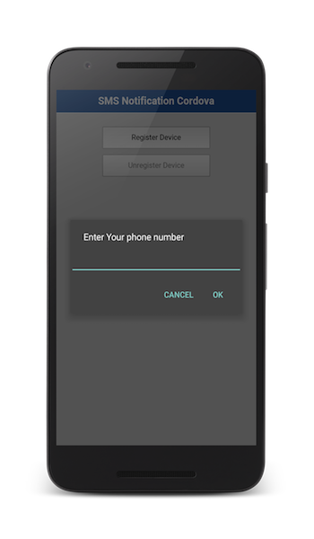

<!-- NLS_CHARSET=UTF-8 -->
## 개요
{: #overview }
SMS 알림은 푸시 알림의 서브세트이므로 먼저 [Cordova의 푸시 알림 학습서를 완료](../../)해야 합니다.  
Cordova 애플리케이션의 SMS 알림은 iOS 및 Android에 대해 지원됩니다.

**전제조건:**

* 다음과 같은 학습서를 읽어야 합니다.
  * [알림 개요](../../)
  * [{{ site.data.keys.product_adj }} 개발 환경 설정](../../../installation-configuration/#installing-a-development-environment)
  * [iOS 애플리케이션에 {{ site.data.keys.product }} SDK 추가](../../../application-development/sdk/cordova)
* {{ site.data.keys.mf_server }}가 로컬로 실행되거나 {{ site.data.keys.mf_server }}가 원격으로 실행 중입니다.
* {{ site.data.keys.mf_cli }}가 개발자 워크스테이션에 설치되어 있습니다.

#### 다음으로 이동:
{: #jump-to }
* [알림 API](#notifications-api)   
* [SMS 등록 서블릿 사용](#using-an-sms-subscribe-servlet)     
* [샘플 애플리케이션](#sample-application)

## 알림 API
{: #notifications-api }
SMS 알림에서는 디바이스 등록 시 전화번호 값이 전달됩니다.

#### 디바이스 등록
{: #register-device }
디바이스를 푸시 알림 서비스에 등록합니다.

```javascript
MFPPush.registerNotificationsCallback(notificationReceived);

function registerDevice() {
    var phoneNumber = prompt("Enter Your 10 digit phone number");
    if(phoneNumber != null && phoneNumber!="" && /^\d+$/.test(phoneNumber)) {
        var options = {};
        options.phoneNumber = phoneNumber;
        MFPPush.registerDevice(options, 
        function(successResponse) {
            alert("Successfully registered");
            enableButtons();
        }, function(failureResponse) {
            alert("Failed to register");
        });
        return true;
    }

    else {
        alert("Failed to register, You have entered invalid number");
    }
}
```

> [푸시 디바이스 등록(POST) REST API](http://www.ibm.com/support/knowledgecenter/en/SSHS8R_8.0.0/com.ibm.worklight.apiref.doc/rest_runtime/r_restapi_push_device_registration_post.html)를 사용하여 디바이스를 등록할 수도 있습니다.

## SMS 등록 서블릿 사용
{: #using-an-sms-subscribe-servlet}
REST API는 등록된 디바이스에 알림을 전송하는 데 사용됩니다. 모든 양식의 알림(태그 &amp; 브로드캐스트 알림 및 인증된 알림)을 전송할 수 있습니다.

알림을 전송하기 위해 REST 엔드포인트에 대한 POST를 사용하여 요청이 작성됩니다. `imfpush/v1/apps/<application-identifier>/messages`.  
예제 URL: 

```bash
https://myserver.com:443/imfpush/v1/apps/com.sample.sms/messages
```

> 모든 푸시 알림 REST API를 검토하려면 사용자 문서에서 <a href="https://www.ibm.com/support/knowledgecenter/SSHS8R_8.0.0/com.ibm.worklight.apiref.doc/rest_runtime/c_restapi_runtime.html">REST API 런타임 서비스</a> 주제를 참조하십시오.

알림을 전송하려면 [알림 전송](../../sending-notifications) 학습서를 참조하십시오.


## 샘플 애플리케이션
{: #sample-application }
Cordova 프로젝트를 [다운로드하려면 클릭](https://github.com/MobileFirst-Platform-Developer-Center/SMSNotificationsSwift/tree/release80)하십시오.

**참고:** 샘플을 실행할 Android 디바이스에 Google Play Services의 최신 버전이 설치되어 있어야 합니다.

### 샘플 사용법
{: #sample-usage }
샘플의 README.md 파일에 있는 지시사항을 따르십시오.
