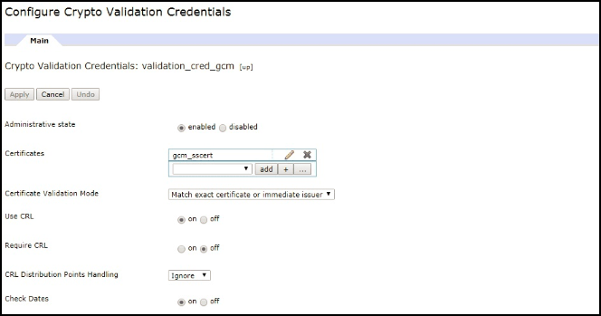

<!-- NLS_CHARSET=UTF-8 -->
## 개요
{: #overview }
알림은 모바일 디바이스가 서버에서 "푸시"되는 메시지를 수신할 수 있는 기능입니다.   
애플리케이션이 현재 포그라운드에서 실행 중인지 아니면 백그라운드에서 실행 중인지에 관계없이 알림이 수신됩니다.   

{{ site.data.keys.product_full }}은 푸시 또는 SMS 알림을 iOS, Android, Windows 8.1 Universal, Windows 10 UWP 및 Cordova(iOS, Android) 애플리케이션에 전송하는 데 필요한 통합 API 메소드 세트를 제공합니다. 알림은 {{ site.data.keys.mf_server }}에서 벤더(Apple, Google, Microsoft, SMS 게이트웨이) 인프라 또는 관련 디바이스로 전송됩니다. 통합 알림 메커니즘을 사용하면 사용자 및 디바이스와 통신하는 전체 프로세스가 개발자에게 완전히 투명하게 표시됩니다. 

#### 디바이스 지원
{: #device-support }
푸시 및 SMS 알림이 지원되는 {{ site.data.keys.product }}의 플랫폼은 다음과 같습니다. 

* iOS 8.x 이상
* Android 4.x 이상
* Windows 8.1, Windows 10

#### 다음으로 이동:
{: #jump-to }
* [푸시 알림](#push-notifications)
* [SMS 알림](#sms-notifications)
* [프록시 설정](#proxy-settings)
* [다음 학습서](#tutorials-to-follow-next)

## 푸시 알림
{: #push-notifications }
알림은 다음과 같은 여러 가지 양식을 가질 수 있습니다. 

* **경보(iOS, Android, Windows)** -  팝업 텍스트 메시지
* **사운드(iOS, Android, Windows)** - 알림이 수신되면 재생되는 사운드 파일
* **배지(iOS), 타일(Windows)** - 짧은 텍스트 또는 이미지를 허용하는 그래픽 표시
* **배너(iOS), 토스트(Windows)** - 디바이스 표시화면 맨 위의 사라지는 팝업 텍스트 메시지
* **대화식(iOS 8 이상)** - 수신된 알림의 배너 내부에 있는 조치 단추
* **자동(iOS 8 이상)** - 사용자를 방해하지 않고 알림 전송

### 푸시 알림 유형
{: #push-notification-types }
#### 태그 알림
{: #tag-notifications }
태그 알림은 특정 태그에 등록된 모든 디바이스를 대상으로 하는 알림 메시지입니다.   

태그 기반 알림을 사용하면 제목 영역 또는 주제를 기반으로 알림을 구분할 수 있습니다. 알림 수신인은 관심 있는 제목 또는 주제에 관한 것인 경우에만 알림을 수신하도록 선택할 수 있습니다. 따라서 태그 기반 알림은 수신인을 구분할 수 있는 수단을 제공합니다. 이 기능을 사용하면 태그를 정의한 후 태그별로 메시지를 송수신할 수 있습니다. 메시지는 태그에 등록된 디바이스만 대상으로 합니다. 

#### 브로드캐스트 알림
{: #broadcast-notifications }
브로드캐스트 알림은 등록된 모든 디바이스를 대상으로 하는 태그 푸시 알림의 한 양식이며 예약된 `Push.all` 태그(모든 디바이스에 대해 자동 작성됨)에 등록하여 푸시 사용 {{ site.data.keys.product_adj }} 애플리케이션에 대해 기본적으로 사용으로 설정됩니다. 브로드캐스트 알림은 예약된 `Push.all` 태그에서 등록 취소하여 사용 안함으로 설정할 수 있습니다. 

#### 유니캐스트 알림
{:# unicast-notifications }
유니캐스트 알림 또는 사용자 인증 알림은 OAuth를 사용하여 보안을 설정합니다. 이 알림은 특정 디바이스 또는 사용자 ID를 대상으로 하는 알림 메시지입니다. 사용자 등록의 사용자 ID는 기본 보안 컨텍스트에서 제공될 수 있습니다. 

#### 대화식 알림
{: #interactive-notifications }
대화식 알림을 사용하면 알림이 도착할 때 사용자가 애플리케이션을 열지 않고도 조치를 취할 수 있습니다. 대화식 알림이 도착하면 디바이스는 알림 메시지와 함께 조치 단추를 표시합니다. 현재 대화식 알림은 iOS 버전 8 이상이 설치된 디바이스에서 지원됩니다. 버전 8 이전 버전이 설치된 iOS 디바이스에 대화식 알림이 전송되는 경우에는 알림 조치가 표시되지 않습니다. 

> [대화식 알림](handling-push-notifications/interactive) 처리 방법을 학습하십시오. 

#### 자동 알림
{: #silent-notifications }
자동 알림은 사용자에게 방해가 되지 않도록 경보를 표시하지 않는 알림입니다. 자동 알림이 도착하면 애플리케이션을 포그라운드로 가져오지 않고 애플리케이션 처리 코드가 백그라운드에서 실행됩니다. 현재 자동 알림은 버전 7 이상이 설치된 iOS 디바이스에서 지원됩니다. 버전 7 미만이 설치된 iOS 디바이스에 자동 알림이 전송되는 경우에는 애플리케이션이 백그라운드에서 실행 중이면 알림이 무시됩니다. 애플리케이션이 포그라운드에서 실행 중인 경우에는 알림 콜백 메소드가 호출됩니다. 

> [자동 알림](handling-push-notifications/silent) 처리 방법을 학습하십시오. 

**참고:** 유니캐스트 알림은 페이로드에 태그를 포함하고 있지 않습니다. 알림 메시지는 POST 메시지 API의 대상 블록에서 여러 디바이스 ID 또는 사용자 ID를 각각 지정하여 여러 디바이스 또는 사용자를 대상으로 할 수 있습니다. 

## SMS 알림
{: #sms-notifications }
SMS 알림 수신을 시작하려면 애플리케이션이 먼저 SMS 알림 등록에 등록해야 합니다. SMS 알림에 등록하기 위해 사용자는 휴대전화 번호를 제공하고 알림 등록을 승인합니다. 사용자 승인이 수신되면 등록 요청이 {{ site.data.keys.mf_server }}에 전송됩니다. {{ site.data.keys.mf_console }}에서 알림이 검색되면 알림이 처리되고 사전 구성된 SMS 게이트웨이를 통해 전송됩니다. 

게이트웨이를 구성하려면 [알림 전송](sending-notifications) 학습서를 참조하십시오. 

## 프록시 설정
{: #proxy-settings }
프록시 설정을 사용하여 알림을 APNS 및 FCM에 전송하는 데 사용할 선택적 프록시를 설정하십시오. **push.apns.proxy.*** 및 **push.gcm.proxy.*** 구성 특성을 사용하여 프록시를 설정할 수 있습니다. 자세한 정보는 [{{ site.data.keys.mf_server }} 푸시 서비스의 JNDI 특성 목록](../installation-configuration/production/server-configuration/#list-of-jndi-properties-for-mobilefirst-server-push-service)을 참조하십시오. 

> **참고:** WNS는 프록시를 지원하지 않습니다. 

### WebSphere DataPower를 푸시 알림 엔드포인트로 사용
{: #proxy-settings-datapower }

DataPower가 MobileFirst 서버로부터의 알림 요청을 승인한 후 이를 FCM, SMS 및 WNS로 경로 재지정하도록 설정할 수 있습니다. 

APN은 지원되지 않습니다. 

#### MobileFirst Server 구성
{: #proxy-settings-datapower-1 }

`server.xml`에서 다음 JNDI 특성을 구성하십시오. 
```
<jndiEntry jndiName="imfpush/mfp.push.dp.endpoint" value = '"https://host"' />
<jndiEntry jndiName="imfpush/mfp.push.dp.gcm.port" value = '"port"' />
<jndiEntry jndiName="imfpush/mfp.push.dp.wns.port" value = '"port"' />
```

여기서 `host`는 DataPower의 호스트 이름이고 `port`는 FCM 및 WNS에 대해 HTTPS 프론트 사이드 핸들러가 구성되는 포트 번호입니다. 

SMS의 경우 구성 설정이 REST API 호출의 일부로 제공됩니다. JNDI 특성을 제공하지 않아도 됩니다. 

#### DataPower 구성
{: #proxy-settings-datapower-2 }

1. DataPower 어플라이언스에 로그인하십시오. 
2. **서비스** > **멀티프로토콜 게이트웨이** > **새 멀티프로토콜 게이트웨이**로 이동하십시오. 
3. 구성을 식별하는 데 사용할 수 있는 이름을 제공하십시오. 
4. XML 관리자, 멀티프로토콜 게이트웨이 정책을 기본값으로 선택하고 URL 재작성 정책을 없음으로 선택하십시오. 
5. **정적 백엔드** 단일 선택 단추를 선택한 후 **기본 백엔드 URL 설정**에 대해 다음 옵션을 선택하십시오. 
	- FCM의 경우:	`https://gcm-http.googleapis.com`
	- SMS의 경우:	`http://<samplegateway>/gateway`
	- WNS의 경우:	`https://hk2.notify.windows.com`
6. 응답 유형, 요청 유형을 패스스루로 선택하십시오. 

#### 인증서 생성
{: #proxy-settings-datapower-3 }

인증서를 생성하려면 다음 중 하나를 선택하십시오. 

- FCM의 경우:
	1. 명령행에서 `Openssl`을 실행하여 FCM 인증서를 가져오십시오. 
	2. 다음 명령을 실행하십시오. 
		```
		openssl s_client -connect gcm-http.googleapis.com:443
		```
	3. -----BEGIN CERTIFICATE-----부터 -----END CERTIFICATE-----까지의 컨텐츠를 복사하여 확장자가 `.pem`인 파일에 저장하십시오. 

- SMS의 경우 인증서가 필요하지 않습니다. 
- WNS의 경우:
	1. 명령행에서 `Openssl`을 사용하여 WNS 인증서를 가져오십시오. 
	2. 다음 명령을 실행하십시오. 
		```
		openssl s_client -connect https://hk2.notify.windows.com:443
		```
	3. -----BEGIN CERTIFICATE-----부터 -----END CERTIFICATE-----까지의 컨텐츠를 복사하여 확장자가 `.pem`인 파일에 저장하십시오. 

#### 백 사이드 설정
{: #proxy-settings-datapower-4 }


- FCM 및 WNS의 경우:

	1. 암호화 인증서를 작성하십시오. 

		a. **오브젝트** > **암호화 구성**으로 이동한 후 **암호화 인증서**를 클릭하십시오. 

		b. 암호화 인증서를 식별하는 데 사용할 수 있는 이름을 제공하십시오. 

		c. **업로드**를 클릭하여 생성된 FCM 인증서를 업로드하십시오. 

		d. **비밀번호 별명**을 없음으로 설정하십시오. 

		e. **키 생성**을 클릭하십시오.
		

	2. 암호화 유효성 검증 신임 정보를 작성하십시오. 

		a. **오브젝트** > **암호화 구성**으로 이동한 후 **암호화 유효성 검증 신임 정보**를 클릭하십시오. 

		b. 고유 이름을 제공하십시오. 

		c. 인증서에 대해 선행 단계(1단계)에서 작성한 암호화 인증서를 선택하십시오. 

		d. **인증서 유효성 검증 모드**에 대해 정확한 인증서 또는 직접적인 발행자를 선택하십시오. 

		e. **적용**을 클릭하십시오.
		

	3. 암호화 유효성 검증 신임 정보를 작성하십시오. 

		a. **오브젝트** > **암호화 구성**으로 이동한 후 **암호화 프로파일**을 클릭하십시오. 

		b. **추가**를 클릭하십시오. 

		c. 고유 이름을 제공하십시오. 

		d. **유효성 검증 신임 정보**에 대한 드롭 다운 메뉴에서 선행 단계(2단계)에서 작성한 유효성 검증 신임 정보를 선택하고 ID 신임 정보를 **없음**으로 설정하십시오. 

		e. **적용**을 클릭하십시오.
		

	4. SSL 프록시 프로파일을 작성하십시오. 

		a. **오브젝트** > **암호화 구성** > **SSL 프록시 프로파일**로 이동하십시오. 

		b. 다음 옵션 중 하나를 선택하십시오. 

		- SMS의 경우 **SSL 프록시 프로파일**을 없음으로 선택하십시오. 
		- 보안 백엔드 URL(HTTPS)을 가진 FCM 및 WNS의 경우 다음과 같은 단계를 완료하십시오. 
			1.	**추가**를 클릭하십시오. 

			2.	나중에 SSL 프록시 프로파일을 식별하는 데 사용할 수 있는 이름을 제공하십시오. 

			3.	드롭 다운에서 **SSL 방향**을 **정방향**으로 선택하십시오. 

			4.	정방향(클라이언트) 암호화 프로파일에 대해 3단계에서 작성한 암호화 프로파일을 선택하십시오. 

			5.	**적용**을 클릭하십시오.
			

	5. 멀티프로토콜 게이트웨이 창의 **백 사이드 설정** 아래에서 **프록시 프로파일**을 **SSL 클라이언트 유형**으로 선택하고 4단계에서 작성한 SSL 프록시 프로파일을 선택하십시오.
	 

- SMS의 경우 백 사이드 설정이 필요하지 않습니다. 

#### 프론트 사이드 설정
{: #proxy-settings-datapower-5 }

- FCM, WNS 및 SMS의 경우:


	1. 공통 이름(CN) 값을 DataPower의 호스트 이름으로 가진 키-인증서 쌍을 작성하십시오. 

		a. **관리** > **기타**로 이동한 후 **암호화 도구**를 클릭하십시오. 

		b. DataPower의 호스트 이름을 공통 이름(CN)의 값으로 입력하십시오. 

		c. 나중에 개인 키를 내보내려는 경우 **개인 키 내보내기**를 선택한 후 **키 생성**을 클릭하십시오.
		

	2. 암호화 ID 신임 정보를 작성하십시오. 

		a. **오브젝트** > **암호화 구성**으로 이동한 후 **암호화 ID 신임 정보**를 클릭하십시오. 

		b. **추가**를 클릭하십시오. 

		c. 고유 이름을 제공하십시오. 

		d. 암호화 키 및 인증서에 대한 목록 상자에서 선행 단계(1단계)에서 생성된 키 및 인증서를 선택하십시오. 

		e. **적용**을 클릭하십시오.
		

	3. 암호화 프로파일을 작성하십시오. 

		a. **오브젝트** > **암호화 구성**으로 이동한 후 **암호화 프로파일**을 클릭하십시오. 

		b. **추가**를 클릭하십시오. 

		c. 고유 이름을 제공하십시오. 

		d. ID 신임 정보에 대한 목록 상자에서 선행 단계(2단계)에서 작성된 ID 신임 정보를 선택하십시오. 유효성 검증 신임 정보를 없음으로 설정하십시오. 

		e. **적용**을 클릭하십시오.
		

	4. SSL 프록시 프로파일을 작성하십시오. 

		a. **오브젝트** > **암호화 구성** > **SSL 프록시 프로파일**로 이동하십시오. 

		b. **추가**를 클릭하십시오. 

		c. 고유 이름을 제공하십시오. 

		d. 목록 상자에서 SSL 방향을 **역방향**으로 선택하십시오. 

		e. 역방향(서버) 암호화 프로파일에 대해 선행 단계(3단계)에서 작성한 암호화 프로파일을 선택하십시오.   

		f. **적용**을 클릭하십시오.
		

	5. HTTPS 프론트 사이드 핸들러를 작성하십시오. 

		a. **오브젝트** > **프로토콜 핸들러** > **HTTPS 프론트 사이드 핸들러**로 이동하십시오. 

		b. **추가**를 클릭하십시오. 

		c. 고유 이름을 제공하십시오. 

		d. **로컬 IP 주소**에 대해 올바른 별명을 선택하거나 기본값(0.0.0.0)으로 그대로 두십시오. 

		e. 사용 가능한 포트를 제공하십시오. 

		f. **허용된 메소드 및 버전**에 대해 HTTP 1.0, HTTP 1.1, POST 메소드, GET 메소드, ?가 포함된 URL, #가 포함된 URL, .가 포함된 URL을 선택하십시오. 

		g. **프록시 프로파일**을 SSL 서버 유형으로 선택하십시오. 

		h. SSL 프록시 프로파일(더 이상 사용되지 않음)에 대해 선행 단계(4단계)에서 작성한 SSL 프록시 프로파일을 선택하십시오. 

		i. **적용**을 클릭하십시오.
		

	6. 멀티프로토콜 게이트웨이 구성 페이지의 **프론트 사이드 설정** 아래에서 https 프론트 사이드 핸들러를 5단계에서 작성한 **프론트 사이드 프로토콜**로 선택한 후 **적용**을 클릭하십시오. 

	

	프론트 사이드 설정에서 DataPower가 사용 중인 인증서는 자체 서명 인증서입니다. 해당 인증서가 Mobilefirst에서 사용하는 JRE 키 저장소에 추가되지 않으면 DataPower에 대한 연결이 실패합니다. 

	자체 서명 인증서를 JRE 키 저장소에 추가하려면 [IBM Worklight Server 및 자체 서명 인증서](https://www.ibm.com/support/knowledgecenter/SSZH4A_5.0.5/com.ibm.worklight.help.doc/admin/t_ibm_worklight_server_and_self-signed_certificates.html) 문서의 지시사항을 따르십시오. 


## 다음 학습서
{: #tutorials-to-follow-next }
푸시 알림을 송수신하려면 아래의 서버 측 및 클라이언트 측 필수 설정을 수행하십시오. 
