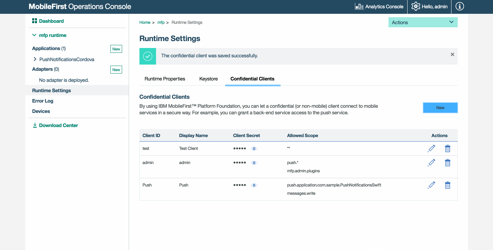

<!-- NLS_CHARSET=UTF-8 -->
## 개요
{: #overview }
푸시 또는 SMS 알림을 iOS, Android 또는 Windows 디바이스에 전송하려면 먼저 FCM 세부사항(Android의 경우), APNS 인증서(iOS의 경우) 또는 WNS 신임 정보(Windows 8.1 Universal/Windows 10 UWP의 경우)를 사용하여 {{ site.data.keys.mf_server }}를 구성해야 합니다.
그런 다음 알림은 모든 디바이스(브로드캐스트), 특정 태그에 등록된 디바이스, 단일 디바이스 ID 또는 사용자 ID에 전송되거나 iOS 디바이스, Android 디바이스 또는 Windows 디바이스에만 전송되거나, 인증된 사용자를 기반으로 전송될 수 있습니다.

**전제조건**: [알림 개요](../) 학습서를 읽으십시오.

#### 다음으로 이동
{: #jump-to }
* [알림 설정](#setting-up-notifications)
    * [Firebase 클라우드 메시징](#firebase-cloud-messaging)
    * [Apple Push Notifications Service](#apple-push-notifications-service)
    * [Windows Push Notifications Service](#windows-push-notifications-service)
    * [SMS 알림 서비스](#sms-notification-service)
    * [범위 맵핑](#scope-mapping)
    * [인증된 알림](#authenticated-notifications)
* [태그 정의](#defining-tags)
* [알림 전송](#sending-notifications)    
    * [{{ site.data.keys.mf_console }}](#mobilefirst-operations-console)
    * [REST API](#rest-apis)
    * [알림 사용자 정의](#customizing-notifications)
* [APN 푸시 알림에 대한 HTTP/2 지원](#http2-support-for-apns-push-notifications)
    * [HTTP/2 사용](#enabling-http2)
    * [HTTP/2에 대한 프록시 지원](#proxy-support-for-http2)
* [프록시 지원](#proxy-support)
* [다음 학습서](#tutorials-to-follow-next)

## 알림 설정
{: #setting-up-notifications }
알림 지원을 사용으로 설정하는 데는 {{ site.data.keys.mf_server }}와 클라이언트 애플리케이션 모두에서의 몇몇 구성 단계가 포함됩니다.  
서버 측 설정을 위해 계속 읽거나 [클라이언트 측 설정](#tutorials-to-follow-next)으로 이동하십시오.

서버 측에서 필요한 설정에는 필요한 벤더(APNS, FCM 또는 WNS) 구성 및 "push.mobileclient" 범위 맵핑이 포함됩니다.

### Firebase 클라우드 메시징
{: #firebase-cloud-messaging }
> **참고:** Google은 [GCM을 더 이상 지원하지 않으며](https://developers.google.com/cloud-messaging/faq) 클라우드 메시징을 Firebase에 통합했습니다. GCM 프로젝트를 사용하는 경우, [ Android의 GCM 클라이언트 앱을 FCM으로 마이그레이션](https://developers.google.com/cloud-messaging/android/android-migrate-fcm)해야 합니다.

Android 디바이스는 푸시 알림을 위해 FCM(Firebase Cloud Messaging) 서비스를 사용합니다.  
FCM을 설정하려면 다음을 수행하십시오.

1. [Firebase 콘솔](https://console.firebase.google.com/?pli=1)을 방문하십시오.
2. 새 프로젝트를 작성하고 프로젝트 이름을 제공하십시오.
3. 설정 "톱니바퀴" 아이콘을 클릭한 후 **프로젝트 설정**을 선택하십시오.
4. **클라우드 메시징** 탭을 클릭하여 **서버 API 키** 및 **발신인 ID**를 생성한 후 **저장**을 클릭하십시오.

> [{{ site.data.keys.product_adj }} 푸시 서비스용 REST API](http://www.ibm.com/support/knowledgecenter/en/SSHS8R_8.0.0/com.ibm.worklight.apiref.doc/rest_runtime/r_restapi_push_gcm_settings_put.html#Push-GCM-Settings--PUT-) 또는 [{{ site.data.keys.product_adj }} 관리 서비스용 REST API](http://www.ibm.com/support/knowledgecenter/en/SSHS8R_8.0.0/com.ibm.worklight.apiref.doc/apiref/r_restapi_update_gcm_settings_put.html#restservicesapi)를 사용하여 FCM을 설정할 수도 있습니다.

#### 참고
{: #notes }
조직에서 인터넷을 통한 트래픽을 제한하는 방화벽을 사용하는 경우에는 다음과 같은 단계를 수행해야 합니다.  

* FCM 클라이언트 앱이 메시지를 수신하기 위해 FCM과의 연결을 허용하도록 방화벽을 구성하십시오.
* 5228, 5229 및 5230 포트를 열어야 합니다. FCM은 일반적으로 5228을 사용하지만 5229 및 5230을 사용하는 경우도 있습니다.
* FCM은 특정 IP를 제공하지 않으므로 방화벽이 Google ASN 15169에 나열된 IP 블록에 포함된 모든 IP 주소에 대한 발신 연결을 승인하도록 허용해야 합니다.
* 포트 443에서 방화벽이 {{ site.data.keys.mf_server }}에서 fcm.googleapis.com으로의 발신 연결을 허용하는지 확인하십시오.


### Apple Push Notifications Service
{: #apple-push-notifications-service }
iOS 디바이스는 푸시 알림을 위해 APNS(Apple Push Notification Service)를 사용합니다.  
APNS를 설정하려면 다음을 수행하십시오.

1. 개발 또는 프로덕션용 푸시 알림 인증서를 생성하십시오. 세부 단계를 보려면 `iOS` 섹션인 [여기](https://console.bluemix.net/docs/services/mobilepush/push_step_1.html#push_step_1)를 참조하십시오.
2. {{ site.data.keys.mf_console }} → **[사용자의 애플리케이션] → 푸시 → 푸시 설정**에서 인증서 유형을 선택한 후 인증서의 파일 및 비밀번호를 제공하십시오. 그런 다음 **저장**을 클릭하십시오.

#### 참고
{: #notes-apns }
* 푸시 알림을 전송하려면 {{ site.data.keys.mf_server }} 인스턴스에서 다음과 같은 서버에 액세스할 수 있어야 합니다.  
    * 샌드박스 서버:  
        * gateway.sandbox.push.apple.com:2195
        * feedback.sandbox.push.apple.com:2196
    * 프로덕션 서버:  
        * gateway.push.apple.com:2195
        * Feedback.push.apple.com:2196
        * 1-courier.push.apple.com 5223
* 개발 단계(Phase) 수행 중에는 apns-certificate-sandbox.p12 샌드박스 인증 파일을 사용하십시오.
* 프로덕션 단계(Phase) 수행 중에는 apns-certificate-production.p12 프로덕션 인증 파일을 사용하십시오.
    * APNS 프로덕션 인증서는 이 인증서를 활용하는 애플리케이션이 Apple App Store에 제출된 경우에만 테스트할 수 있습니다.

**참고:** MobileFirst는 Universal 인증서를 지원하지 않습니다.

> [{{ site.data.keys.product_adj }} 푸시 서비스용 REST API](http://www.ibm.com/support/knowledgecenter/en/SSHS8R_8.0.0/com.ibm.worklight.apiref.doc/rest_runtime/r_restapi_push_apns_settings_put.html#Push-APNS-settings--PUT-) 또는 [{{ site.data.keys.product_adj }} 관리 서비스용 REST API](http://www.ibm.com/support/knowledgecenter/en/SSHS8R_8.0.0/com.ibm.worklight.apiref.doc/apiref/r_restapi_update_apns_settings_put.html?view=kc)를 사용하여 APNS를 설정할 수도 있습니다.


### Windows Push Notifications Service
{: #windows-push-notifications-service }
Windows 디바이스는 푸시 알림을 위해 WNS(Windows Push Notifications Service)를 사용합니다.  
WNS를 설정하려면 다음을 수행하십시오.

1. [Microsoft에서 제공한 지시사항](https://msdn.microsoft.com/en-in/library/windows/apps/hh465407.aspx)을 따라 **패키지 보안 ID(SID)** 및 **클라이언트 본인확인정보** 값을 생성하십시오.
2. {{ site.data.keys.mf_console }} → **[사용자의 애플리케이션] → 푸시 → 푸시 설정**에서 이 값을 추가한 후 **저장**을 클릭하십시오.

> [{{ site.data.keys.product_adj }} 푸시 서비스용 REST API](http://www.ibm.com/support/knowledgecenter/en/SSHS8R_8.0.0/com.ibm.worklight.apiref.doc/rest_runtime/r_restapi_push_wns_settings_put.html?view=kc) 또는 [{{ site.data.keys.product_adj }} 관리 서비스용 REST API](http://www.ibm.com/support/knowledgecenter/en/SSHS8R_8.0.0/com.ibm.worklight.apiref.doc/apiref/r_restapi_update_wns_settings_put.html?view=kc)를 사용하여 WNS를 설정할 수도 있습니다.


### SMS 알림 서비스
{: #sms-notification-service }
SMS 알림을 전송하는 데 필요한 SMS 게이트웨이를 설정하기 위해 다음 JSON이 사용됩니다. [`smsConf` REST API](https://www.ibm.com/support/knowledgecenter/SSHS8R_8.0.0/com.ibm.worklight.apiref.doc/rest_runtime/r_restapi_push_sms_settings_put.html)를 사용하여 SMS 게이트웨이 구성으로 {{ site.data.keys.mf_server }}를 업데이트하십시오.

```json
{
	"host": "2by0.com",
	"name": "dummy",
	"port": "80",
	"programName": "gateway/add.php",
	"parameters": [{
		"name": "xmlHttp",
		"value": "false",
		"encode": "true"
	}, {
		"name": "httpsEnabled",
		"value": "false",
		"encode": "true"
	}]

}
```

> [푸시 서비스 API 참조서에서](https://www.ibm.com/support/knowledgecenter/SSHS8R_8.0.0/com.ibm.worklight.apiref.doc/rest_runtime/c_restapi_runtime.html) 추가 SMS 관련 REST API를 찾으십시오.

### 범위 맵핑
{: #scope-mapping }
**push.mobileclient** 범위 요소를 애플리케이션에 맵핑하십시오.

1. {{ site.data.keys.mf_console }}을 로드하고 **[사용자의 애플리케이션] → 보안 → 범위-요소 맵핑**으로 이동한 후 **새로 작성**을 클릭하십시오.
2. **범위 요소** 필드에 "push.mobileclient"라고 쓰십시오. 그런 다음 **추가**를 클릭하십시오.

    <div class="panel-group accordion" id="scopes" role="tablist">
        <div class="panel panel-default">
            <div class="panel-heading" role="tab" id="additional-scopes">
                <h4 class="panel-title">
                    <a class="preventScroll" role="button" data-toggle="collapse" data-parent="#additional-scopes" data-target="#collapse-additional-scopes" aria-expanded="false" aria-controls="collapse-additional-scopes"><b>클릭하면 추가적으로 사용 가능한 범위의 목록이 표시됩니다. </b></a>
                </h4>
            </div>

            <div id="collapse-additional-scopes" class="panel-collapse collapse" role="tabpanel">
                <div class="panel-body">
                    <table class="table table-striped">
                        <tr>
                            <td><b>범위</b></td>
                            <td><b>설명</b></td>
                        </tr>
                        <tr>
                            <td>apps.read	</td>
                            <td>애플리케이션 자원을 읽을 수 있는 권한입니다.</td>
                        </tr>
                        <tr>
                            <td>apps.write	</td>
                            <td>애플리케이션 자원을 작성, 업데이트 및 삭제할 수 있는 권한입니다.</td>
                        </tr>
                        <tr>
                            <td>gcmConf.read	</td>
                            <td>GCM 구성 설정(API 키 및 발신인 ID)을 읽을 수 있는 권한입니다.</td>
                        </tr>
                        <tr>
                            <td>gcmConf.write	</td>
                            <td>GCM 구성 설정을 업데이트 및 삭제할 수 있는 권한입니다.</td>
                        </tr>
                        <tr>
                            <td>apnsConf.read	</td>
                            <td>APN 구성 설정을 읽을 수 있는 권한입니다.</td>
                        </tr>
                        <tr>
                            <td>apnsConf.write	</td>
                            <td>APN 구성 설정을 업데이트 및 삭제할 수 있는 권한입니다.</td>
                        </tr>
                        <tr>
                            <td>devices.read	</td>
                            <td>디바이스를 읽을 수 있는 권한입니다.</td>
                        </tr>
                        <tr>
                            <td>devices.write	</td>
                            <td>디바이스를 작성, 업데이트 및 삭제할 수 있는 권한입니다.</td>
                        </tr>
                        <tr>
                            <td>subscriptions.read	</td>
                            <td>등록을 읽을 수 있는 권한입니다.</td>
                        </tr>
                        <tr>
                            <td>subscriptions.write	</td>
                            <td>등록을 작성, 업데이트 및 삭제할 수 있는 권한입니다.</td>
                        </tr>
                        <tr>
                            <td>messages.write	</td>
                            <td>푸시 알림을 전송할 수 있는 권한입니다.</td>
                        </tr>
                        <tr>
                            <td>webhooks.read	</td>
                            <td>이벤트 알림을 읽을 수 있는 권한입니다.</td>
                        </tr>
                        <tr>
                            <td>webhooks.write	</td>
                            <td>이벤트 알림을 전송할 수 있는 권한입니다.</td>
                        </tr>
                        <tr>
                            <td>smsConf.read	</td>
                            <td>SMS 구성 설정을 읽을 수 있는 권한입니다.</td>
                        </tr>
                        <tr>
                            <td>smsConf.write	</td>
                            <td>SMS 구성 설정을 업데이트 및 삭제할 수 있는 권한입니다.</td>
                        </tr>
                        <tr>
                            <td>wnsConf.read	</td>
                            <td>WNS 구성 설정을 읽을 수 있는 권한입니다.</td>
                        </tr>
                        <tr>
                            <td>wnsConf.write	</td>
                            <td>WNS 구성 설정을 업데이트 및 삭제할 수 있는 권한입니다.</td>
                        </tr>
                    </table>
                    <a class="preventScroll" role="button" data-toggle="collapse" data-parent="#additional-scopes" data-target="#collapse-additional-scopes" aria-expanded="false" aria-controls="collapse-additional-scopes"><b>섹션 닫기</b></a>
                </div>
            </div>
        </div>
    </div>

    

### 인증된 알림
{: #authenticated-notifications }
인증된 알림은 하나 이상의 `사용자 ID`에 전송되는 알림입니다.  

**push.mobileclient** 범위 요소를 애플리케이션에 사용되는 보안 검사에 맵핑하십시오.  

1. {{ site.data.keys.mf_console }}을 로드하고 **[사용자의 애플리케이션] → 보안 → 범위-요소 맵핑**으로 이동한 후 **새로 작성**을 클릭하거나 기존 범위 맵핑 항목을 편집하십시오.
2. 보안 검사를 선택하십시오. 그런 다음 **추가**를 클릭하십시오.

    

## 태그 정의
{: #defining-tags }
{{ site.data.keys.mf_console }} → **[사용자의 애플리케이션] → 푸시 → 태그**에서 **새로 작성**을 클릭하십시오.  
적절한 `태그 이름` 및 `설명`을 제공한 후 **저장**을 클릭하십시오.


등록은 디바이스 등록과 태그를 함께 결합합니다. 디바이스가 태그에서 등록 취소되면 연관된 모든 등록이 디바이스 자체에서 자동으로 등록 취소됩니다. 한 디바이스의 사용자가 여럿 있는 시나리오에서는 사용자 로그인 기준을 기반으로 모바일 애플리케이션에서 등록을 구현해야 합니다. 예를 들어, 사용자가 애플리케이션에 성공적으로 로그인하고 나면 등록 호출이 수행되고 등록 취소 호출은 로그아웃 조치 처리의 일부로 명시적으로 수행됩니다.

## 알림 전송
{: #sending-notifications }
푸시 알림은 {{ site.data.keys.mf_console }}에서 또는 REST API를 통해 전송될 수 있습니다.

* {{ site.data.keys.mf_console }}을 사용하는 경우 두 가지 유형의 알림(태그 및 브로드캐스트)을 전송할 수 있습니다.
* REST API를 사용하는 경우 모든 양식의 알림(태그, 브로드캐스트 및 인증됨)을 전송할 수 있습니다.

### {{ site.data.keys.mf_console }}
{: #mobilefirst-operations-console }
알림은 단일 디바이스 ID나 단일 또는 여러 사용자 ID에 전송되거나 iOS 디바이스 또는 Android 디바이스에만 전송되거나 태그에 등록된 디바이스에 전송될 수 있습니다.

#### 태그 알림
{: #tag-notifications }
태그 알림은 특정 태그에 등록된 모든 디바이스를 대상으로 하는 알림 메시지입니다. 태그는 사용자의 관심 주제를 나타내며 선택된 관심사에 따라 알림을 수신할 수 있는 기능을 제공합니다.

{{ site.data.keys.mf_console }} → **[사용자의 애플리케이션] → 푸시 → 알림 전송 탭**의 **받는 사람** 탭에서 **태그별 디바이스**를 선택한 후 **알림 텍스트**를 제공하십시오. 그런 다음 **전송**을 클릭하십시오.


#### 브로드캐스트 알림
{: #breadcast-notifications }
브로드캐스트 알림은 등록된 모든 디바이스를 대상으로 하는 태그 푸시 알림의 한 양식입니다. 브로드캐스트 알림은 예약된 `Push.all` 태그(모든 디바이스에 대해 자동 작성됨)에 등록하여 푸시 사용 {{ site.data.keys.product_adj }} 애플리케이션에 대해 기본적으로 사용으로 설정됩니다. `Push.all` 태그는 프로그래밍 방식으로 등록 취소할 수 있습니다.

{{ site.data.keys.mf_console }} → **[사용자의 애플리케이션] → 푸시 → 알림 전송 탭**의 **받는 사람** 탭에서 **모두**를 선택한 후 **알림 텍스트**를 제공하십시오. 그런 다음 **전송**을 클릭하십시오.


### REST API
{: #rest-apis }
REST API를 사용하여 알림을 전송하는 경우 모든 양식의 알림(태그 &amp; 브로드캐스트 알림 및 인증된 알림)을 전송할 수 있습니다.

알림을 전송하기 위해 REST 엔드포인트에 대한 POST를 사용하여 요청이 작성됩니다. `imfpush/v1/apps/<application-identifier>/messages`.  
예제 URL:

```bash
https://myserver.com:443/imfpush/v1/apps/com.sample.PinCodeSwift/messages
```

> 모든 푸시 알림 REST API를 검토하려면 사용자 문서에서 [REST API 런타임 서비스 주제](https://www.ibm.com/support/knowledgecenter/SSHS8R_8.0.0/com.ibm.worklight.apiref.doc/rest_runtime/c_restapi_runtime.html)를 참조하십시오.

#### 알림 페이로드
{: #notification-payload }
요청은 다음과 같은 페이로드 특성을 포함할 수 있습니다.

페이로드 특성|정의
--- | ---
message |전송할 경보 메시지입니다.
settings |설정은 알림의 다양한 속성입니다.
target |대상 세트는 이용자 ID, 디바이스, 플랫폼 또는 태그일 수 있습니다. 대상 중 하나만 설정할 수 있습니다.
deviceIds |디바이스 ID로 표시되는 디바이스의 배열입니다. 이러한 ID를 가진 디바이스가 알림을 수신합니다. 이는 유니캐스트 알림입니다.
notificationType |메시지를 전송하는 데 사용되는 채널(푸시/SMS)을 표시하는 정수 값입니다. 허용되는 값은 1(푸시만), 2(SMS만) 및 3(푸시 및 SMS)입니다 .
platforms |디바이스 플랫폼의 배열입니다. 이러한 플랫폼에서 실행 중인 디바이스가 알림을 수신합니다. 지원되는 값은 A(Apple/iOS), G(Google/Android) 및 M(Microsoft/Windows)입니다.
tagNames |tagNames로 지정되는 태그의 배열입니다. 이러한 태그에 등록된 디바이스가 알림을 수신합니다. 태그 기반 알림의 경우 이 유형의 대상을 사용하십시오.
userIds |알림을 전송할 사용자 ID로 표시되는 사용자의 배열입니다. 이는 유니캐스트 알림입니다.
phoneNumber |디바이스 등록 및 알림 수신에 사용되는 전화번호입니다. 이는 유니캐스트 알림입니다.

**푸시 알림 페이로드 JSON의 예**

```json
{
    "message" : {
    "alert" : "Test message",
  },
  "settings" : {
    "apns" : {
      "badge" : 1,
      "iosActionKey" : "Ok",
      "payload" : "",
      "sound" : "song.mp3",
      "type" : "SILENT",
    },
    "gcm" : {
      "delayWhileIdle" : ,
      "payload" : "",
      "sound" : "song.mp3",
      "timeToLive" : ,
    },
  },
  "target" : {
    // The list below is for demonstration purposes only - per the documentation only 1 target is allowed to be used at a time.
    "deviceIds" : [ "MyDeviceId1", ... ],
    "platforms" : [ "A,G", ... ],
    "tagNames" : [ "Gold", ... ],
    "userIds" : [ "MyUserId", ... ],
  },
}
```

**SMS 알림 페이로드 JSON의 예**

```json
{
  "message": {
    "alert": "Hello World from an SMS message"
  },
  "notificationType":3,
   "target" : {
     "deviceIds" : ["38cc1c62-03bb-36d8-be8e-af165e671cf4"]
   }
}
```

#### 알림 전송
{: #sending-the-notification }
다양한 도구를 사용하여 알림을 전송할 수 있습니다.  
테스트용으로 Postman이 아래에 설명된 대로 사용됩니다.

1. [기밀 클라이언트를 구성하십시오](../../authentication-and-security/confidential-clients/).   
    REST API를 통한 푸시 알림 전송에서는 공백으로 구분된 범위 요소 `messages.write` 및 `push.application.<applicationId>를 사용합니다. `

    

2. [액세스 토큰을 작성하십시오](../../authentication-and-security/confidential-clients#obtaining-an-access-token).  


3. **http://localhost:9080/imfpush/v1/apps/com.sample.PushNotificationsAndroid/messages**에 대한 **POST** 요청을 작성하십시오.
    - 원격 {{ site.data.keys.product_adj }}를 사용하는 경우 `hostname` 및 `port` 값을 사용자 고유의 값으로 대체하십시오.
    - 애플리케이션 ID 값을 사용자 고유의 값으로 업데이트하십시오.

4. 헤더를 설정하십시오.
    - **권한 부여**: `Bearer eyJhbGciOiJSUzI1NiIsImp ...`
    - "Bearer" 뒤의 값을 위의 (1)단계의 액세스 토큰 값으로 대체하십시오.

    

5. 본문을 설정하십시오.
    - 위의 [알림 페이로드](#notification-payload)에 설명된 대로 해당 특성을 업데이트하십시오.
    - 예를 들어, **userIds** 속성을 가진 **target** 특성을 추가하여 특정 등록된 사용자에게 알림을 전송할 수 있습니다.

   ```json
   {
        "message" : {
            "alert" : "Hello World!"
        }
   }
   ```

   

**전송** 단추를 클릭하면 다음과 같이 디바이스에 알림이 수신됩니다.


### 알림 사용자 정의
{: #customizing-notifications }
알림 메시지를 전송하기 전에 다음과 같은 알림 속성을 사용자 정의할 수도 있습니다.  

{{ site.data.keys.mf_console }} → **[사용자의 애플리케이션] → 푸시 → 태그 → 알림 전송 탭**에서 **iOS/Android 사용자 정의 설정** 섹션을 펼쳐 알림 속성을 변경하십시오.

### Android
{: #android }
* 알림 사운드, FCM 스토리지에 알림을 저장할 수 있는 기간, 사용자 정의 페이로드 등
* 알림 제목을 변경하려면 Android 프로젝트의 **strings.xml** 파일에 `push_notification_tile`을 추가하십시오.

### iOS
{: #ios }
* 알림 사운드, 사용자 정의 페이로드, 조치 키 제목, 알림 유형 및 배지 번호


## APN 푸시 알림에 대한 HTTP/2 지원
{: #http2-support-for-apns-push-notifications}

Apple Push Notification(APN) 서비스는 HTTP/2 네트워크 프로토콜 기반의 새로운 API를 지원합니다. HTTP/2에 대한 지원은 아래 나열된 내용을 포함하여 많은 혜택을 제공합니다.

* 메시지 길이가 2KB에서 4KB로 증가하여 알림에 더 많은 컨텐츠를 추가할 수 있습니다.
* 클라이언트와 서버 사이의 다중 연결이 필요 없으므로 처리량이 향상됩니다.
* 유니버셜 푸시 알림 클라이언트 SSL 인증서를 지원합니다.

>MobileFirst의 푸시 알림이 이제 기존의 TCP 소켓 기반 알림과 함께 HTTP/2 기반 APN 푸시 알림을 지원합니다.

### HTTP/2 사용
{: #enabling-http2}

JNDI 특성을 통해 HTTP/2 기반 알림을 사용할 수 있습니다.
```xml
<jndiEntry jndiName="imfpush/mfp.push.apns.http2.enabled" value= "true"/>
```

>**참고:** 위의 JNDI 특성이 추가되면 기존의 TCP 소켓 기반 알림이 사용되지 않고 HTTP/2 기반 알림만 사용됩니다.

### HTTP/2에 대한 프록시 지원
{: #proxy-support-for-http2}

HTTP/2 기반 알림은 HTTP 프록시를 통해서 전송될 수 있습니다. 프록시를 통한 알림 경로 지정을 사용하려면 [여기](#proxy-support)를 참조하십시오.

## 프록시 지원
{: #proxy-support }
프록시 설정을 사용하여 알림을 Android 및 iOS 디바이스에 전송하는 데 사용할 선택적 프록시를 설정할 수 있습니다. **push.apns.proxy.** 및 **push.gcm.proxy.** 구성 특성을 사용하여 프록시를 설정할 수 있습니다. 자세한 정보는 [{{ site.data.keys.mf_server }} 푸시 서비스의 JNDI 특성 목록](../../installation-configuration/production/server-configuration/#list-of-jndi-properties-for-mobilefirst-server-push-service)을 참조하십시오.

## 다음 학습서
{: #tutorials-to-follow-next }
이제 서버 측이 설정되었으니 클라이언트 측을 설정하고 수신된 알림을 처리하십시오.

* 푸시 알림 처리
    * [Cordova 애플리케이션에서 푸시 알림 처리](../handling-push-notifications/cordova)
    * [iOS 애플리케이션에서 푸시 알림 처리](../handling-push-notifications/ios)
    * [Android 애플리케이션에서 푸시 알림 처리](../handling-push-notifications/android)
    * [Windows 애플리케이션에서 푸시 알림 처리](../handling-push-notifications/windows)

* SMS 알림 처리
    * [Cordova 애플리케이션에서 SMS 알림 처리](../handling-sms-notifications/cordova)
    * [iOS 애플리케이션에서 SMS 알림 처리](../handling-sms-notifications/ios)
    * [Android 애플리케이션에서 SMS 알림 처리](../handling-sms-notifications/android)
