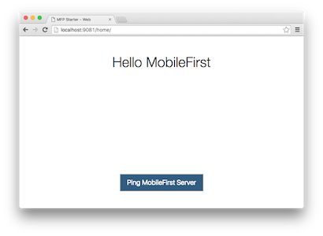

<!-- NLS_CHARSET=UTF-8 -->
## 개요
{: #overview }
이 데모의 목적은 엔드-투-엔드 플로우를 경험해보는 것입니다. 

1. {{ site.data.keys.product_adj }} 클라이언트 SDK가 사전에 번들된 샘플 애플리케이션을 등록하고 {{ site.data.keys.mf_console }}에서 다운로드합니다.
2. 새 어댑터 또는 제공된 어댑터가 {{ site.data.keys.mf_console }}에 배치됩니다.  
3. 자원 요청을 하도록 애플리케이션 로직이 변경됩니다.

**종료 결과**:

* {{ site.data.keys.mf_server }} ping을 실행함.
* 어댑터를 사용하여 데이터를 검색함.

#### 전제조건: 
{: #prerequisites }
* 최신 웹 브라우저
* *선택사항*. {{ site.data.keys.mf_cli }} ([다운로드]({{site.baseurl}}/downloads))
* *선택사항*. 독립형 {{ site.data.keys.mf_server }} ([다운로드]({{site.baseurl}}/downloads))

### 1. {{ site.data.keys.mf_server }} 시작
{: #starting-the-mobilefirst-server }
[Mobile Foundation 인스턴스를 작성](../../bluemix/using-mobile-foundation)했는지 확인하십시오. 또는  
[{{ site.data.keys.mf_dev_kit }}](../../installation-configuration/development/mobilefirst)를 사용하는 경우, 서버의 폴더로 이동해서 Mac 및 Linux의 경우 `./run.sh` 또는 Windows의 경우 `run.cmd` 명령을 실행하십시오. 

### 2. 애플리케이션 작성 및 등록
{: #creating-and-registering-an-application }
브라우저 창에서 URL `http://your-server-host:server-port/mfpconsole`을 로드하여 {{ site.data.keys.mf_console }}을 여십시오. 로컬에서 실행 중인 경우 [http://localhost:9080/mfpconsole](http://localhost:9080/mfpconsole)을 사용하십시오. 사용자 이름/비밀번호는 *admin/admin*입니다.
 
1. **애플리케이션** 옆에 있는 **새로 작성** 단추를 클릭하십시오.
    * **웹** 플랫폼을 선택하십시오.
    * **com.ibm.mfpstarterweb**을 **애플리케이션 ID**로 입력하십시오.
    * **애플리케이션 등록**을 클릭하십시오.

    
 
2. 웹 샘플 애플리케이션을 다운로드하려면 **스타터 코드 가져오기** 타일에서 클릭하여 선택하십시오.

    
 
### 3. 애플리케이션 로직 편집
{: #editing-application-logic }
1. 선택한 코드 편집기로 프로젝트를 여십시오.

2. **client/js/index.js** 파일을 선택하고 다음 코드 스니펫을 붙여넣기하면 다음과 같이 기존 `WLAuthorizationManager.obtainAccessToken()` 함수를 바꿉니다.

   ```javascript
   WLAuthorizationManager.obtainAccessToken()
        .then(
            function(accessToken) {
                titleText.innerHTML = "Yay!";
                statusText.innerHTML = "Connected to {{ site.data.keys.mf_server }}";
                
                var resourceRequest = new WLResourceRequest(
                    "/adapters/javaAdapter/resource/greet/",
                    WLResourceRequest.GET
                );
                
                resourceRequest.setQueryParameter("name", "world");
                resourceRequest.send().then(
                    function(response) {
                        // Will display "Hello world" in an alert dialog.
                        alert("Success: " + response.responseText);
                    },
                    function(response) {
                        alert("Failure: " + JSON.stringify(response));
                    }
                );
            },

            function(error) {
                titleText.innerHTML = "Bummer...";
                statusText.innerHTML = "Failed to connect to {{ site.data.keys.mf_server }}";
            }
        );
   ```
    
### 4. 어댑터 배치
{: #deploy-an-adapter }
[이 준비된 .adapter 아티팩트](../javaAdapter.adapter)를 다운로드하고 **조치 → 어댑터 배치** 조치를 사용하여 {{ site.data.keys.mf_console }}에서 배치하십시오.

그렇지 않으면 **어댑터** 옆에 있는 **새로 작성** 단추를 클릭하십시오.  
        
1. **조치 → 샘플 다운로드** 옵션을 선택하십시오. "Hello World" **Java** 어댑터 샘플을 다운로드하십시오.

   > Maven 및 {{ site.data.keys.mf_cli }}가 설치되지 않은 경우, 화면상의 **개발 환경 설정** 지시사항을 따르십시오.


2. **명령행** 창에서 어댑터의 Maven 프로젝트 루트 폴더로 이동해서 다음 명령을 실행하십시오.

   ```bash
   mfpdev adapter build
   ```

3. 빌드가 완료되면 **조치 → 어댑터 배치** 조치를 사용하여 {{ site.data.keys.mf_console }}에서 배치하십시오. **[adapter]/target** 폴더에서 어댑터를 찾을 수 있습니다.
    
       



### 5. 애플리케이션 테스트
{: #testing-the-application }
1. **명령행** 창에서 **[project root] → node-server** 폴더로 이동하십시오.
2. `npm start` 명령을 실행하여 필요한 Node.js 구성을 설치하고 Node.js 서버를 시작하십시오.
3. **[project root] → node-server → server.js** 파일을 열고 **호스트** 및 **포트** 변수를 사용자의 {{ site.data.keys.mf_server }}에 올바른 값으로 편집하십시오.
    * 로컬 {{ site.data.keys.mf_server }}를 사용 중인 경우, 일반적으로 값은 **http**, **localhost** 및 **9080**입니다.
    * 원격 {{ site.data.keys.mf_server }}를 사용 중인 경우(Bluemix에서), 일반적으로 값은 **https**, **your-server-address** 및 **443**입니다. 

   예:  
    
   ```javascript
   var host = 'https://mobilefoundation-xxxx.mybluemix.net'; // The Mobile Foundation server address
   var port = 9081; // The local port number to use
   var mfpURL = host + ':443'; // The Mobile Foundation server port number
   ```
   
4. 브라우저에서 URL [http://localhost:9081/home](http://localhost:9081/home)을 방문하십시오.

<br>
#### 보안 원본 정책
{: #secure-origins-policy }
개발 중에 Chrome을 사용할 때는 "localhost"가 **아닌** 호스트 및 HTTP를 모두 사용하는 경우 브라우저가 애플리케이션을 로드하도록 허용하지 않을 수 있습니다. 이는 이 브라우저에서 기본적으로 구현되고 사용되는 보안 원본 정책으로 인한 것입니다. 

다음 플래그로 Chrome 브라우저를 시작하여 이를 해결할 수 있습니다. 

```bash
--unsafely-treat-insecure-origin-as-secure="http://replace-with-ip-address-or-host:port-number" --user-data-dir=/test-to-new-user-profile/myprofile
```

- 플래그가 작동하게 하려면 "test-to-new-user-profile/myprofile"을 새 Chrome 사용자 프로파일로 작동하는 폴더 위치로 대체하십시오. 

<br clear="all"/>
### 결과
{: #results }
* **{{ site.data.keys.mf_server }} Ping** 단추를 클릭하면 **{{ site.data.keys.mf_server }}에 연결됨**이 표시됩니다.
* 애플리케이션이 {{ site.data.keys.mf_server }}에 연결할 수 있는 경우, 배치된 Java 어댑터를 사용하는 자원 요청 호출이 발생합니다. 

그 후에 어댑터 응답이 경보에 표시됩니다.

## 다음 단계
{: #next-steps }
애플리케이션에서 어댑터 사용하기 및 {{ site.data.keys.product_adj }} 보안 프레임워크를 사용하여 푸시 알림과 같은 추가 서비스를 통합하는 방법에 대해 더 학습합니다.

- [애플리케이션 개발](../../application-development/) 학습서 검토
- [어댑터 개발](../../adapters/) 학습서 검토
- [인증 및 보안 학습서](../../authentication-and-security/) 검토
- [모든 학습서](../../all-tutorials) 검토
