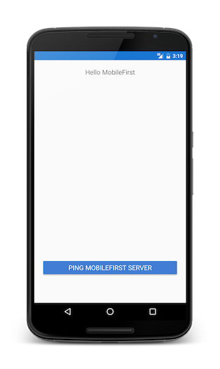

<!-- NLS_CHARSET=UTF-8 -->
## 개요
{: #overview }
이 데모의 목적은 엔드-투-엔드 플로우를 경험해보는 것입니다.

1. {{ site.data.keys.product_adj }} Xamarin 클라이언트 SDK와 함께 번들된 샘플 애플리케이션이 {{ site.data.keys.mf_console }}에 등록됩니다.
2. 새 어댑터 또는 제공된 어댑터가 {{ site.data.keys.mf_console }}에 배치됩니다.  
3. 자원 요청을 하도록 애플리케이션 로직이 변경됩니다.

**종료 결과**:

* {{ site.data.keys.mf_server }} ping을 실행함.

#### 전제조건:
{: #prerequisites }
* Xamarin Studio
* *선택사항*. 독립형 {{ site.data.keys.mf_server }} ([다운로드]({{site.baseurl}}/downloads))

### 1. {{ site.data.keys.mf_server }} 시작
{: #1-starting-the-mobilefirst-server }
[Mobile Foundation 인스턴스를 작성](../../bluemix/using-mobile-foundation)했는지 확인하십시오. 또는  
[{{ site.data.keys.mf_dev_kit }}](../../installation-configuration/development/)를 사용하는 경우, 서버의 폴더로 이동해서 Mac 및 Linux의 경우 `./run.sh` 또는 Windows의 경우 `run.cmd` 명령을 실행하십시오.

### 2. 애플리케이션 작성
{: #2-creating-an-application }
브라우저 창에서 URL `http://your-server-host:server-port/mfpconsole`을 로드하여 {{ site.data.keys.mf_console }}을 여십시오. 로컬에서 실행 중인 경우 [http://localhost:9080/mfpconsole](http://localhost:9080/mfpconsole)을 사용하십시오. 사용자 이름/비밀번호는 *admin/admin*입니다.

1. **애플리케이션** 옆에 있는 **새로 작성** 단추를 클릭하십시오.
    * **Android** 플랫폼을 선택하십시오.
    * **com.ibm.mfpstarterxamarin**을 **애플리케이션 ID**로 입력하십시오(다음 단계에서 다운로드할 애플리케이션 발판에 따라서).
    * **1.0**을 **버전** 값으로 입력하십시오.
    * **애플리케이션 등록**을 클릭하십시오.

    

### 3. 애플리케이션 로직 편집
{: #3-editing-application-logic }
* Xamarin 프로젝트를 작성하십시오.
* [SDK 추가](../../application-development/sdk/xamarin/) 학습서에 언급된 대로 Xamarin SDK를 추가하십시오.
* 아래와 같이 클래스 파일에서 유형 `IWorklightClient`의 특성을 추가하십시오.

   ```csharp
   /// <summary>
   /// Gets or sets the worklight sample client.
   /// </summary>
   /// <value>The worklight client.</value>
   public static IWorklightClient WorklightClient {get; set;}
   ```
* iOS용으로 개발 중인 경우 **AppDelegate.cs** 파일의 **FinishedLaunching** 메소드 내부에 다음 코드를 붙여넣으십시오.

  ```csharp
   <ClassName>.WorklightClient = WorklightClient.CreateInstance();
  ```
  >`<ClassName>`을 클래스의 이름으로 바꾸십시오.
* Android용으로 개발 중인 경우 **MainActivity.cs** 파일의 **OnCreate** 메소드 내부에 코드의 다음 행을 포함시키십시오.

  ```csharp
   <ClassName>.WorklightClient = WorklightClient.CreateInstance(this);
  ```
  >`<ClassName>`을 클래스의 이름으로 바꾸십시오.
* 액세스 토큰을 확보하도록 메소드를 정의하고 아래와 같이 MFP 서버에 대한 자원 요청을 수행하십시오.

    ```csharp
    public async void ObtainToken()
           {
            try
                   {

                       IWorklightClient _newClient = App.WorklightClient;
                       WorklightAccessToken accessToken = await _newClient.AuthorizationManager.ObtainAccessToken("");

                       if (accessToken.Value != null &&  accessToken.Value != "")
                       {
                           System.Diagnostics.Debug.WriteLine("Received the following access token value: " + accessToken.Value);
                           StringBuilder uriBuilder = new StringBuilder().Append("/adapters/javaAdapter/resource/greet");

                           WorklightResourceRequest request = _newClient.ResourceRequest(new Uri(uriBuilder.ToString(), UriKind.Relative), "GET");
                           request.SetQueryParameter("name", "world");
                           WorklightResponse response = await request.Send();

                           System.Diagnostics.Debug.WriteLine("Success: " + response.ResponseText);
                       }
                   }
                   catch (Exception e)
                   {
                       System.Diagnostics.Debug.WriteLine("An error occurred: '{0}'", e);
                   }
               }
           }
    }
   ```

* 클래스 생성자 내에서 또는 단추 클릭 시에 **ObtainToken** 메소드를 호출하십시오.

### 4. 어댑터 배치
{: #4-deploy-an-adapter }
[준비된 이 .adapter 아티팩트](../javaAdapter.adapter)를 다운로드하고 **조치 → 어댑터 배치** 조치를 사용하여 {{ site.data.keys.mf_console }}에서 배치하십시오.

그렇지 않으면 **어댑터** 옆에 있는 **새로 작성** 단추를 클릭하십시오.  

1. **조치 → 샘플 다운로드** 옵션을 선택하십시오. "Hello World" **Java** 어댑터 샘플을 다운로드하십시오.

   > Maven 및 {{ site.data.keys.mf_cli }}가 설치되지 않은 경우, 화면상의 **개발 환경 설정** 지시사항을 따르십시오.

2. **명령행** 창에서 어댑터의 Maven 프로젝트 루트 폴더로 이동해서 다음 명령을 실행하십시오.

   ```bash
   mfpdev adapter build
   ```

3. 빌드가 완료되면 **조치 → 어댑터 배치** 조치를 사용하여 {{ site.data.keys.mf_console }}에서 배치하십시오. **[adapter]/target** 폴더에서 어댑터를 찾을 수 있습니다.

   

<!-- -->
### 5. 애플리케이션 테스트
{: #5-testing-the-application }
1. Xamarin Studio에서 `mfpclient.properties` 파일을 선택하고 **프로토콜**, **호스트** 및 **포트** 특성을 사용자의 {{ site.data.keys.mf_server }}에 대한 올바른 값으로 편집하십시오.
    * 로컬 {{ site.data.keys.mf_server }}를 사용 중인 경우, 일반적으로 값은 **http**, **localhost** 및 **9080**입니다.
    * 원격 {{ site.data.keys.mf_server }}를 사용 중인 경우(IBM Cloud에서), 일반적으로 값은 **https**, **your-server-address** 및 **443**입니다.
    * IBM Cloud Private에서 Kubernetes 클러스터를 사용 중이고 배치 유형이 **NodePort**이면, 포트 값이 일반적으로 Kubernetes 클러스터의 서비스에서 공개하는 **NodePort**입니다.

2. **재생** 단추를 누르십시오.

<br clear="all"/>
### 결과
{: #results }
* **Ping MobileFirst Server** 단추를 누르면 **Connected to MobileFirst Server**가 표시됩니다.
* 애플리케이션이 {{ site.data.keys.mf_server }}에 연결할 수 있는 경우, 배치된 Java 어댑터를 사용하는 자원 요청 호출이 발생합니다.

그 후에 어댑터 응답이 Xamarin Studio 콘솔에 출력됩니다.


## 다음 단계
{: #next-steps }
애플리케이션에서 어댑터 사용하기 및 {{ site.data.keys.product_adj }} 보안 프레임워크를 사용하여 푸시 알림과 같은 추가 서비스를 통합하는 방법에 대해 더 학습합니다.

- [어댑터 개발](../../adapters/) 학습서 검토
- [인증 및 보안 학습서](../../authentication-and-security/) 검토
- [모든 학습서](../../all-tutorials) 검토
