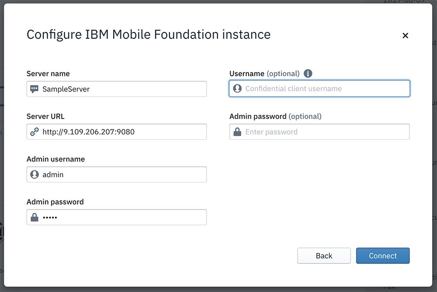

<!-- NLS_CHARSET=UTF-8 -->
## Visão Geral
{: #getting-started }

É possível ativar o Digital App Builder a partir de:

* No **MacOS**, clique duas vezes no **ícone do IBM Digital App Builder** para abrir o Digital App Builder.
* No **Windows**, ative o Digital App Builder selecionando **Iniciar > Programas > IBM Digital App Builder**.

>**Nota**: se você estiver abrindo o Digital App Builder pela primeira vez, **Aceite** a **Licença para usar o IBM Digital App Builder** na tela flash para prosseguir. Depois de aceitar o contrato de licença, a **Verificação de Pré-requisitos** é executada automaticamente pela primeira vez. Clique em **OK** para continuar, se nenhum erro for localizado, caso contrário, corrija os erros e, em seguida, reinicie o Digital App Builder.

É possível **Criar novo aplicativo** ou **Abrir um aplicativo** ou usar os Modelos disponíveis para construir seu aplicativo.
>**Nota**: é possível ver seu aplicativo recém-criado sob a seção **Recente**. Para uma nova instalação, você não verá a seção **Recente**.

### Criar novo aplicativo
{: #create-new-app }

É possível criar um novo aplicativo clicando no ícone **Criar novo aplicativo** a partir do painel do Builder.

1. Clique no ícone **Criar novo aplicativo**. Isso exibirá a janela **Selecionar Canal**.

    

2. Selecione o canal para o qual você deseja desenvolver o aplicativo, clicando no respectivo ícone. Posteriormente, é possível incluir mais canais no mesmo aplicativo.

    * **Android**: selecione essa opção se você estiver criando um aplicativo Android.
    * **iOS**: selecione essa opção se você estiver criando um aplicativo iOS.
        >**Nota**: é possível construir e executar os aplicativos iOS somente no MacOS.
    * **Web**: selecione essa opção se você estiver criando o aplicativo para a Web.
    * **PWA**: selecione essa opção se você estiver criando um Progressive Web App.

3. A janela **Selecionar tipo de servidor ao qual se conectar** é exibida.

    

4. É possível selecionar um **Shared Playground Server** ou um **Custom Professional Server**.

    * **Shared Playground Server** – um servidor do Mobile Foundation compartilhado hospedado no IBM Cloud para que você seja iniciado rapidamente.

        >**Aviso**: o Shared Playground Server é um servidor comum que é compartilhado entre vários desenvolvedores. Esse servidor não deve ser usado para aplicativos de produção. Os dados nesse servidor podem ser excluídos sem aviso prévio. O tempo de atividade do servidor não é garantido.

        

        * Insira a **Chave de API do IBM Cloud**. Para obter mais detalhes de acesso, consulte [**Como criar Chaves de API da plataforma**](../faq/) na seção FAQ. 

        * Clique em **Login** para conectar-se ao servidor. 

    * **Custom Professional Server** – É possível conectar-se ao seu próprio servidor Mobile Foundation criado no IBM Cloud ou local. Na janela **Configurar instância do IBM Mobile Foundation**, é possível selecionar um servidor existente ou criar um novo servidor.

        
 
        A janela **Configurar instância do IBM Mobile Foundation** exibe a lista de instâncias do servidor Mobile Foundation definidas anteriormente. Ao selecionar o servidor, o **Nome do servidor**, a **URL do servidor**, o **Nome do usuário administrativo** e a **Senha do administrador**, são exibidos. Para definir um novo servidor, é possível clicar no link **Criar novo servidor**. Isso exibirá a nova janela **Configurar instância do IBM Mobile Foundation**.

        

        * Insira os novos detalhes da instância do IBM Mobile Foundation, como **Nome do servidor**, **URL do servidor**, **Nome do usuário administrativo**, **Senha do administrador**.
            >**Nota**: é possível obter a URL do servidor e as credenciais de login no painel do servidor Mobile Foundation para a instância do servidor selecionada.
        * Opcionalmente, forneça um **Nome do usuário** (nome do usuário do cliente confidencial) e uma **Senha do administrador**, para visualizar os dados no visualizador de dados.
        * Clique em **Conectar**.

5. Ao efetuar login/conectar-se com êxito, a janela **Criar aplicativo** é exibida, na qual é possível selecionar uma definição de aplicativo existente que você possa ter criado ou criar uma nova, inserindo os detalhes. 
    * Para um novo aplicativo, forneça: **Nome** do aplicativo, **Local** no qual os arquivos do projeto serão armazenados, **ID do projeto/pacote configurável** e **Versão** do aplicativo. 
 
        

    * Clique em **Criar** para criar o aplicativo. Esta ação exibe a janela **Bem-vindo ao Workbench**.
    * Clique em **Iniciar**. Isso abre a área de trabalho do Digital App Builder para criar um novo aplicativo/modificar um aplicativo existente.

        

### Abrir um aplicativo existente
{: #open-an-existing-app }
 
>**Nota**: é possível abrir um aplicativo existente desenvolvido usando o Digital App Builder apenas.

É possível abrir um aplicativo existente de uma das maneiras a seguir:

* Clicar em **Abrir um aplicativo** na página inicial abre o explorador de arquivos. Navegue para a pasta do projeto do aplicativo e clique em **OK**para abrir o aplicativo para edições adicionais.
* Opcionalmente, é possível abrir o aplicativo a partir da lista de aplicativos recentes, se listados, clicando duas vezes no nome do aplicativo.

### Usando modelos
{: #using-templates }

É possível usar modelos para construir rapidamente seu aplicativo. Esses são modelos de aplicativo ativados para recursos específicos que o ajudarão a modificar e desenvolver rapidamente o aplicativo. Somente o robô de bate-papo do Watson está disponível a partir de agora.

