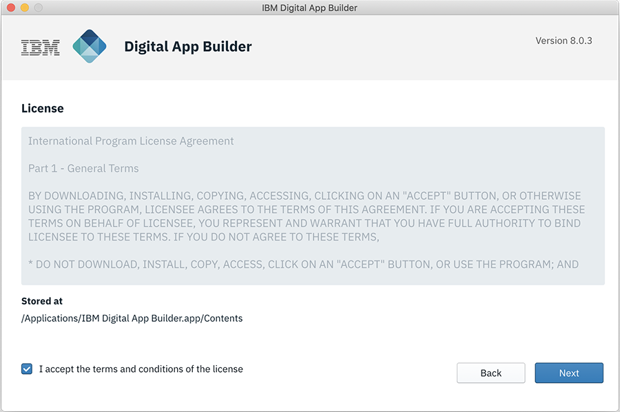
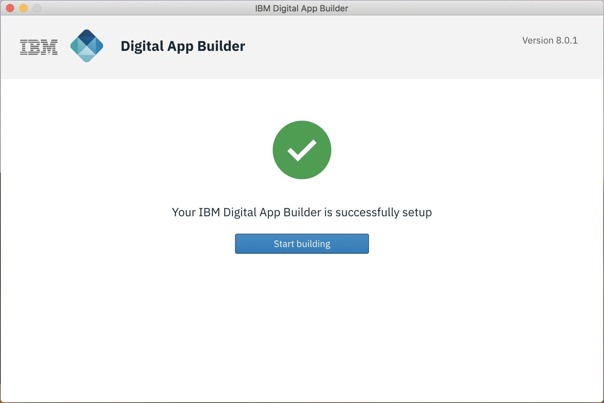

<!-- NLS_CHARSET=UTF-8 -->
## Visão Geral
{: #installation-and-configuration }

O Digital App Builder pode ser instalado nas plataformas MacOS e Windows. O processo também inclui o software obrigatório verificado e instalado durante a primeira instalação. Instale Java, Xcode e Android Studio para geração de adaptador e visualização do aplicativo durante o desenvolvimento.

### Instalando no MacOS
{: #installing-on-macos }

1. Faça download do .dmg (**IBM.Digital.App.Builder-n.n.n.dmg**, em que `n.n.n` é o número da versão) no [IBM Passport Advantage](https://www.ibm.com/software/passportadvantage/) ou [aqui](https://github.com/MobileFirst-Platform-Developer-Center/Digital-App-Builder/releases).
2. Clique duas vezes no arquivo .dmg para montar o instalador.
3. Na janela que o instalador abre, arraste e solte o IBM Digital App Builder na pasta **Aplicativos**.
4. Clique duas vezes no ícone do IBM Digital App Builder ou no executável para abrir o Digital App Builder.
    >**Nota**: quando o Digital App Builder for instalado pela primeira vez, ele abrirá a interface para instalar o software obrigatório. No caso de existir uma versão anterior do Digital App Builder, é executada uma verificação de pré-requisito e talvez seja preciso fazer upgrade ou downgrade de algum software para atender aos pré-requisitos.
    
    >A partir da versão 8.0.6, o instalador contém o servidor de desenvolvimento Mobile Foundation. Durante a instalação, o servidor de desenvolvimento é instalado junto com outros pré-requisitos. O ciclo de vida do servidor de desenvolvimento (como início/parada do servidor) é manipulado no Digital App Builder.
    
    

5. Clique em **Iniciar a configuração**. Isso exibe a tela do contrato de licença.

    

6. Aceite o contrato de licença e clique em **Avançar (Next)**. Isso exibe a tela **Instalar pré-requisitos**.
    >**Nota**: é realizada uma verificação para descobrir se algum dos softwares obrigatórios já está instalado e o status é exibido para cada um deles.

    

7. Clique em **Instalar** para configurar o software obrigatório, se qualquer um dos pré-requisitos estiver com o status **A ser instalado**.

    

8. *Opcional* - Depois de instalar o software obrigatório, o instalador verifica a existência de JAVA, pois o Digital App Builder precisa de JAVA para funcionar com conjuntos de dados. 
    >**Nota**: Pode ser necessária a instalação manual de Java, se ainda não estiver instalado. Para instalar o Java, consulte [Instalando o Java](https://www.java.com/en/download/help/download_options.xml).

9. Depois de instalar o software necessário, é exibida a tela de inicialização do Digital App Builder. Clique em **Iniciar construção**.

    

10. *Opcional* - O instalador também verifica a instalação opcional de Xcode (para visualizar o aplicativo no simulador de iOS durante o desenvolvimento, somente para MacOS) e do Android Studio (para visualizar seu aplicativo Android, para MacOS e Windows).
    >**Nota**: Pode ser necessária a instalação manual de Xcode e do Android Studio. Para a instalação de Cocoapods, consulte [Usando CocoaPods](https://guides.cocoapods.org/using/using-cocoapods). Para a instalação do Android Studio, consulte [Instalando o Android Studio](https://developer.android.com/studio/). 

>**Nota**: A qualquer momento, execute uma [Verificação de pré-requisito](#prerequisites-check) para verificar se a instalação é capaz de desenvolver o aplicativo. No caso de qualquer erro, corrija o erro e reinicie o Digital App Builder antes de criar um aplicativo.

### Instalando no Windows
{: #installing-on-windows }

1. Faça download do arquivo .exe (**IBM.Digital.App.Builder.Setup.n.n.n.exe**, em que `n.n.n` é o número da versão)) no [IBM Passport Advantage](https://www.ibm.com/software/passportadvantage/) ou [aqui](https://github.com/MobileFirst-Platform-Developer-Center/Digital-App-Builder/releases).
2. Execute o executável transferido por download (**IBM.Digital.App.Builder.Setup.n.n.n.exe**) no modo administrativo.
    >**Nota**: quando o Digital App Builder for instalado pela primeira vez, ele abrirá a interface para instalar o software obrigatório. No caso de existir uma versão anterior do Digital App Builder, é executada uma verificação de pré-requisito e talvez seja preciso fazer upgrade ou downgrade de algum software para atender aos pré-requisitos.
    
    >A partir da versão 8.0.6, o instalador contém o servidor de desenvolvimento Mobile Foundation. Durante a instalação, o servidor de desenvolvimento é instalado junto com outros pré-requisitos. O ciclo de vida do servidor de desenvolvimento (como início/parada do servidor) é manipulado no Digital App Builder.

    

3. Clique em **Iniciar a configuração**. Isso exibe a tela do contrato de licença.

    

4. Aceite o contrato de licença e clique em **Avançar (Next)**. Isso exibe a tela **Instalar pré-requisitos**.
    >**Nota**: é realizada uma verificação para descobrir se algum dos softwares obrigatórios já está instalado e o status é exibido para cada um deles.

    

5. Clique em **Instalar** para configurar o software obrigatório, se qualquer um dos pré-requisitos estiver com o status **A ser instalado**.

    

6. *Opcional* - Após a instalação do software obrigatório, o instalador verificará o JAVA, pois o Digital App Builder precisa dele para trabalhar com seus conjuntos de dados. 
    >**Nota**: Pode ser necessária a instalação manual de Java, se ainda não estiver instalado. Para instalar o Java, consulte [Instalando o Java](https://www.java.com/en/download/help/download_options.xml).

7. Depois de instalar o software obrigatório, a tela de inicialização do Digital App Builder será exibida. Clique em **Iniciar construção**.

    

    >**Nota**: um atalho também será criado em **Iniciar > Programas** na área de trabalho. A pasta de instalação padrão é `<AppData>\Local\IBMDigitalAppBuilder\app-8.0.3`.

8. *Opcional* - O instalador também verificará a instalação opcional do Xcode (para visualizar seu aplicativo no simulador do iOS durante o desenvolvimento, somente para MacOS) e do Android Studio (para visualizar seu aplicativo Android, para MacOS e Windows).
    >**Nota**: Instale manualmente o Android Studio. Para a instalação do Android Studio, consulte [Instalando o Android Studio](https://developer.android.com/studio/). 

>**Nota**: A qualquer momento, execute uma [Verificação de pré-requisito](#prerequisites-check) para verificar se a instalação é capaz de desenvolver o aplicativo. No caso de qualquer erro, corrija o erro e reinicie o Digital App Builder antes de criar um aplicativo.

### Verificação de pré-requisitos
{: #prerequisites-check }

Execute uma verificação de pré-requisitos selecionando **Ajuda > Verificação de pré-requisitos** antes de desenvolver um aplicativo.

No caso de qualquer erro, corrija o erro e reinicie o Digital App Builder antes de criar um aplicativo.

>**Nota**: [CocoaPods](https://guides.cocoapods.org/using/using-cocoapods) são necessários somente para MacOS.
